# 哈佛大学《计算机科学导论：数据结构｜CS50 Fall 2024 - Lecture 5 - Data Structures》deepseek翻译（未剪辑 - P1 - GPT中英字幕课程资源 - BV1XT2HY6Eo1

Allright， this is C S 50 and this is already week 5。 this is our last week on C。

 and it's also reputed generally to be the most challenging perhaps of weeks whereby we sort of climax with the material we've been exploring thus far sort of metaphorically。

 it's like we've been going up this hill。 and I know it's felt like a lift each and every step but now things kind of plateau out。

 I dare say， And even it's not gonna to feel like we're suddenly going downhill or things get markedly easy。

 I do think you'll be able to catch your breath and start to apply a lot of the lessons learned over the past few weeks So everything that lies ahead。

 And among the things that lie ahead are exactly these data structures。

 which you've only touched on briefly so far， we had this look at arrays way back in week two already and we've used those in a few different ways。

 but arrays are a super simple data structure data structure meaning it's a way to structure your data in the computer's memory insofar as they have to be generally the same data type but most importantly back to back to back and the catch with as recall is that you have to decide in advance how big the array。

Is going to be。 Do you want size 3。 Do you want size 30，300。

 but you do indeed have to decide in advance， but there's other things in life。

 not only the virtual world， but the real world that we might consider a bit more abstractly。

 And in fact， you're going to start to notice after today， Ily。

 that the world is filled also with abstract data types。

 whereby these ways of structuring information， but that don't depend necessarily on the underlying implementation details。

 That is to say you can implement certain features in life in code。

 but there's bunches of different ways to actually implement them at a lower level。

 whether it's using arrays or in fact， as we'll see today， other data structures as well。

 So while data structures are something very concrete involving variables and pointers and functions and the like abstract data types are a little more broadly descriptive。

 For instance， there are in the world， these things called cues。

 turns out there's things in the computer world called Q2， but in the real world。

 a queue is like what Where might you see cus in the real world。

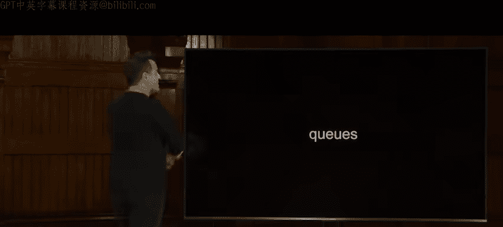

Definitely in the UK because they're typically called this there。Like a line， movie theater。

 like lining up for dinner or lunch or any kind of line。 You have cues。 Now。

 cues have some kind of ordering often of people。 But certainly in the virtual world。

 you might have cues as well。 In fact， this isn't as common nomenclature anymore。

 But if you're printing a bunch of things to a printer。

 those documents are generally stored in a queue so that they all print out in that precise order。

 And we can actually see this in the real world。 So we wonderfully have three brave volunteers。

 If you three wouldn't mind coming on up。😊，First up we have here， come on over here。

 if you'd like to introduce yourself to the world。Hi， everyone。 My name is Aksha。

 and I'm a freshman in Canada。 We And if Aksha， you want to line up first right over here in the center of stage。

 Hi everyone， I'm Jeffrey， and I'm a freshman in fair， which is better than Canada。 Okay， welcome。

 if you want to line up second place behind him， Hi， I'm Jack。 I'm a freshman in Matthews。

 which as Professor Manland would agree， is the best freshman house。😊，Oh。Okay， yes， thank you。

 Matthews over there。 Okay， wonderfulful。 Go ahead and hop in third place behind there。

 So these guys have formed what I would argue is a queue。

 They've sort of lined up wonderfully in order to receive their sort of thank you prizes。 And so。

 in fact， if I hand these out in the order in which they kindly volunteered， we have one。

 thank you here。 Thanks very much。 We have two thank yous here。 Thank you very much。

 And three thank yous。 maybe a round of applause for how easy that was for our volunteers。😊。

So it was sort of。Equitable all around and notice that the queue actually。

 if we kind of geek out about this， actually had some operations associated with it。

 And I dare say we would somehow implement it in code as well。

 So a queue or a line in the real world as we know it。

 is actually an example of a FiIO data type first in first out。

 So that's sort of a property of this structure no matter how you implement it that describe sort of the equity of how you put the data in and get it out or in this case。

 the human volunteers。 the first one to line up at the front there actually got his prize first。

 because he was indeed first in line， and then the second person and the third person。

 So not all that interesting， you would kind of hope or expect that that's how life works when people line up or queue。

 but let's make this now a little more granular in the of coding。

 So if you were to implement that same structure in code be it for a printer or some kind of ticketma type scenario where you want to ensure a FiIFO property。

 you would generally have two functions or two fundamental operations N queue。

 which means to put someone into the queue。

DQ， which means the opposite to take someone out。 And just as PIO implies like the first in is the first one N queued。

 but they're also the first one out to be D cube。 So just some terminology。 Now。

 how could we make this in code。 Well， if we suppose for the sake of discussion that you want to have a queue like a line that can fit 50 things or 50 people in total a capacity of 50。

 we could declare an and make it a con so it can't actually change and initialize that to 50 and then we could use that elsewhere in our code and we could create our own structure using type de as well。

 that includes this many people in an array called exactly that people each one of whom is of type person。

 So recall from weeks past， we use thestruct keyword already。

 we use the type de keyword already to invent our own data type called person。

 So let's just assume for the moment that now exists。

 But notice that you can actually encapsulate data types inside of data types。

 even if you've made both yourself。 So the world starts to get more interesting when you structure things in this way。

 But I also have inside of。

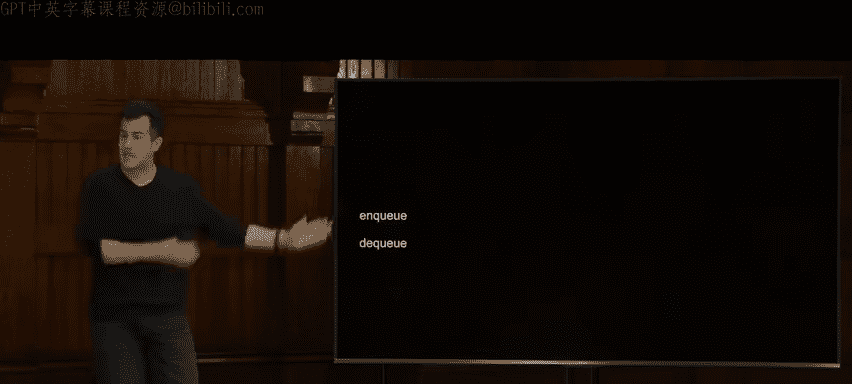

This new struct， which indeed， I'm going to call a Q in code， also size。

 Why is it that I need to keep track of the total capacity of a Q in code， But also apparently。

 I constantly have to keep track of the size of the Q。 It's a subtle difference。

 but these two words means something very distinct。

 Capacity is and always will be 50 because it's a constant。😡，But size is different how。

Just intuitively， yeah。Yeah， so size is gonna be the current number of people or things in the queue。

 And it stands to reason you've got to keep track of both because otherwise you might have like 50 garbage values in memory。

 if you want to keep track of how many of those values are valid and represent in this case persons or people you need to know if there's zero people there or one or 49 or 50 or anywhere in between。

 So this is how we might encode code and we won't go down this road further， how we might inC code。

 implement the idea of a queue using familiar syntax kind layering some of these ideas we've seen already。

 All right， but it turns out you don't always want cues and you specifically don't always want fiIfo。

 So therere also exist in the world， these things called stacks。 For instance， if playfully。

 I propose that I actually do own different colored clothes。 In fact， I've got like a red sweater。

 I've got a blue sweater。 But if at home in my drawer or closet。

 I store all of my sweaters in literally a stack like this one here。 Well。

 it stands to reason that if I'm doing sort of laundry frequently enough。

 I might wear this on Monday this on Tuesday。This on Wednesday， then I might do a load of laundry。

 And so there they're back on top of the stack。 And I never actually get to the bottom of the stack here。

 So this is a very different operation。 It's not equitable in the same way。

 our Q was because it would seem that the last sweater I put in is gonna be the first sweater。

 I take out Now this sort of stands to reason that that's obviously how the real world works when you stack close together。

 but these things called stacks are everywhere too， like in the dining hall and Anneberg Hall。

 there's a whole bunch of trays presumably。 And unless the dining hall is really busy。

 there could be one really dirty， nasty tray at the very bottom of the stack that never gets used。

 because people are constantly taking the ones higher up until they finally refresh them and clean them in the world of technology like your inbox。

 if you use Gmail。 I mean， that's actually a stack in and of itself。 why。

 because when you get new mails， where do they typically visually end up will sort of at the top at the top at the top。

 And if you're like me， if you get lots of emails that you don't really necessarily get to all of them。

 you might reply to someone who broke。YouMost recently and completely blow off someone who wrote you earlier because they've been pushed further and further down。

 so to speak in the stack。 So these data structures or these rather data types are really everywhere。

 And S therefore suffice it to say are not FIO， first in first out。 They' what the world called LIFO。

 last in， first out because the last sweater into the stack is the first one that I actually pull back。

 And so we can see this even more clearly with three more volunteers。

 If you three wouldn't mind coming on up。Exhibiting a lifeO property here。

 if you want to introduce yourselves， when it is high。Here we go。Hi， my name is Michelle。

 and I'm a freshman in Greenno。 Welcome， Michelle， if you want to come over here first by the table。

😊。

Hi， my name is Sophie， and I'm also a freshman in Greenno。 All right。

 Sophie if you want to come over here。 I'm Alex。 I'm a freshman in Wiglesworth。 Wigles Wigle nice。

 if you want to come in front here。 So these three have clearly stacked themselves into exactly the data structure as stack。

 which is actually too bad because I only have like two prizes this time。

 So I think I can offer you your prize and we can offer you your prize。 And unfortunately。

 we can just give you a round of applause because you were the first one into the stack， okay。😊。

All right， we actually have a third， but point is hopefully made。

 So thank you to these three volunteers。 That's all we need to do for。

 But a lifeO then is a data type that indeed has that property。

 which you might want in some context like your Gmail inbox。

 you might kind of have to tolerate in the physical world just because of gravity and how closets and drawer's work。

 but it isn't necessarily a property that you want of all data types， for instance。

 case in point in the world of printers would be kind of obnoxious if a lot of people in an office or university are printing to a common shared printer。

 but only the person who printed most recently is the one that gets their document first。

 so you'll see in the real world， not only cues but potentially stacks。

 especially when things maybe unfair when you're in a store and the cashier isn't necessarily honoring the first and first out property。

 but as for operations， these two have some vernacular。

 so instead of NQ and DQ in the world of stacks， we actually generally say push which means to push something on top of the stack and pop。

 which means to remove something。From the top of the stack。

 but top of the stack is the operative word， you're not sort of sliding the blue sweater out from under everything else。

 You're only operating at the top of the data structure。

 but it turns out if we think now about stacks is being this abstract idea that have these operations associated with them in code。

 we could actually implement them pretty much the same。

 So notice here the only difference on this screen here is that I'm calling this structure， a stack。

 but the stack still has some capacity， it still has some size。

 but if you sort of imagineagining your mind's mind how a stack differs in code from a queue。

 whatever loop you're using whatever conditionals you're using。

 you're probably removing things from a stack from a different part of the array。

 then you would from a queue So if you just imagine maybe you start removing things from the front instead of the back at the end of the day you can implement these abstract types using similar code here。

 but you're gonna to have to tweet the operations to give the property that you want fiIF or。

So again， the overarching goal of just introducing stacks and cues at this point is that there is this distinction between an abstract data type。

 like some way of organizing information that has certain properties， certain operations。

 but you don't necessarily need to know or care how it's implemented in code because clearly you can implement it one way or the other and the actual data structures with which you are building those abstraction So one's high level one's low level and indeed that's the whole purpose of abstraction。

 So our friend professorfessor Shannon Duval， Elon University actually brought this same idea to life with a short video in which Jack learns the facts about cues and stacks。

 So we thought we for a moment to hammer this home with dim the lights and hit play on this short film。

🎼Once upon a time there was a guy named Jack。 when it came to making friends。

 Jack did not have the knack。 So Jack went to talk to the most popular guy he knew He went up to Lou and asked。

 what do I do， Lou saw that his friend was really distressed。 Well， Lou began。

 Just look how you're dressed， Don't you have any clothes with a different look。 Yes， said Jack。

 I sure do。 come to my house， and I'll showed them to you。 So they went off the Jacks。

 and Jack showed Lou the box where he kept all his shirts and his pants at his socks。 Lou said。

 I see you of all your clothes in a pile。 Why don't you wear some others once in a while。 Jack said。

 well， what I remove clothes and socks， I washed them and put them away in the box。

 Then comes the next morning and up I hop。 I go to the box and get my clothes off the top。

 Lou quickly realized the problem with Jack。 He kept clothes Cds and books in a stack。

 When he reached for something to read or to wear， He chose the top book or underwear。

 Then when he was done， He would put it right。😊。

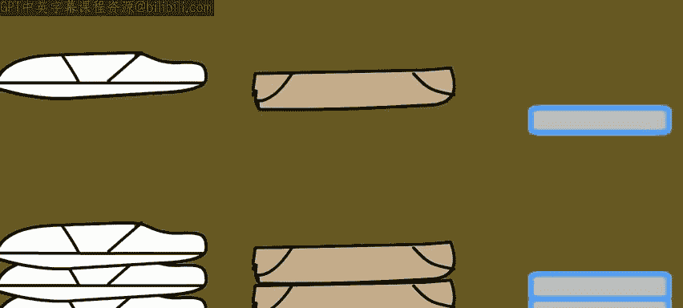

🎼Back back it would go on top of the stack。 I know a solution said a triumph at Lou。

 You need to learn to start using a cu。 Lou took Jack's clothes and hung them in a closet。

 And when he had emptied the box。 He just asked it。 Then he said now， Jack， at the end of the day。

 Put your clothes in the left when you put them away。

 Then to morrow morning when you see the sunshine。 Get your clothes from the right from the end of the line。

 Don't you see， said Lou， it will be so nice。 You'll wear everything once before you wear something twice。

 And with everything in cus in his closet and shelf， Jack started to feel quite sure of himself。 Oh。

 thanks to Lou and his wonderful cue。😊。

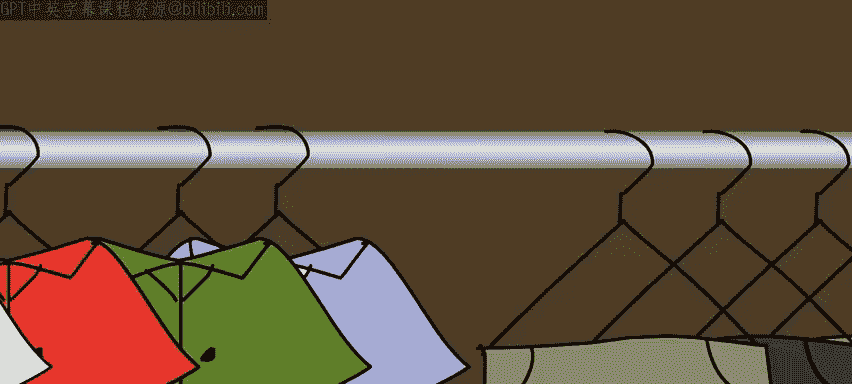

Alright， so hopefully now that reinforces really what these stacks and cues are。

 let's actually transition now to building things and building on top of where we started in week two with arrays and really reach a peak today of sophistication when it comes to using last week's concept that of pointers to kind of stitch together in a computer's memory。

 really any kind of structure that we want But recall first that a arrays indeed had this key property that everything was contiguous back to back to back。

 So for instance， if in week two onward， we wanted to store like three integers in memory。

 it might look abstractly a little something like this where we might put one and two and three。

 but the catch with arrays recall is that you have to decide in advance as per those square brackets like how big the thing is going to be And so if you decide in advance with square brackets that you want an array of size3 but later you realize oh darn。

 I want to have a fourth integer or a fifth one you might have actually metaphorically painted yourself into a corner ideally。

 you would put the number four， for instance， right here， but again， in the context of the computer。

Whole memory per last week， there's other stuff going on。 So for instance。

 these might not necessarily all be freely available to use because if you've got one，2。

 three multiple variables and lots of functions in your program。

 well these other memory locations might be filled with actual values and as well as garbage values。

 So as per Oscar the gruch here assume that anything with him just represents a garbage value were sure we can use that location and memory。

 but there might actually be valid strings like hello comma world backlash0 and I've kind of graded out because it's separate from the one。

 the two in the three， but there could be another variable in your program that's storing hello world and just by chance because you created that variable after the array。

 you ended up with an H immediately after the three。

 So it would seem that you've indeed painted yourself into this corner in that unless you sacrifice that H and wreck that whole string there's no room for the four but is there。

 I mean， obviously there's a lot of room for the number four not to mention the one。

 the two and the three because。😡，All of those garbage values don't mean you have to respect them。

 You can reuse those locations。 They' garbage in the sense that you use them already。

 but you're no longer using them。 So I could put this 1，2，3 and 4 somewhere up here somewhere here。

 maybe even somewhere down here。 So how could I then accept the fact that I do want to grow this array。

 Well， I could just say fine， I'm going have to sort of bite my lip and just copy the one。

 the two to three to a brand new location that actually has room four or fourth value as well。

 and we can put the one， the two， the three and we can now have room for the four。

 and then we can get rid of the original array somehow。 So this is a solvable problem。

 even though we haven't had to do it in code yet。 but what's a downside of this solution to growing an array to store more data。

😡，After you first created it。It takes up more。 Well。

 it takes up more space in a good way at the moment。

I think it's not so much space that we're worried about here。Sorry。Yeah。

 you have to keep doing this again and again。 So if I can put words in your mouth。

 it takes more time because now， just to insert one value like the number4。

 instead of just jumping to a free location and putting it there in constant time。

 I kind of have to incur linear time to copy the original array into a slightly bigger array and then add that new fourth value。

 So you're just kind of wasting your own time。 Now， there's a potential alternative。

 What could we do。 Well， I could have just allocated more space than I need from the get go。

 So even though I asked the compiler for three integers。

 maybe it could be a little generous and just give me4 secretly or 5 or 500 or heck 5000 so that I never deal with this problem in the future that way。

 everything would be super fast because I never have to waste time moving things but what would be the downside of that approach sort of overallocating memory for an array。

Is that or sorry。So it it's a waste of space。 I mean。

 there's only a finite amount of memory in your Mac， your PC your phone。

 Why are you going to write code thats sort of designed intentionally that way。

 but arguably poorly designed because you're just throwing memory away that no one can actually use none of your other programs or apps can actually use because you just want to make sure you can grow this array in case you ever need it。

 So that too doesn't really feel like a compelling tradeoff。

 But here' is really a theme now that we'll see really throughout the semester and throughout computing。

 there's always going be some tradeoff。 and it's very often between time and space。

 But as we've discussed in the past， it might be a tradeoff between the complexity of your code。

 I mean， honestly， imagine in your mind the sort of for loop or the while loop that now you have to write code for it to copy all of that from old to new array like that's added complexity。

 we're wasting my human time， we're introducing more lines of code that increases theoretically the probability that one of them has a bug。

 So there's just lots of tradeoff of solving problems in this or really any other way。

 So what might we do。Well， what if we could structure our data a little more intelligently rather than just use this super simple data structure called an array where everything has to be back and back and back。

 could we instead sort of treat the computer's memory kind of like a canvas such that if there's free space over here。

 fine， I'm gonna put something over here。 If there's free space over here。

 I'm gonna put it over here。 Can I just then stitch these things together somehow。

 and I'm using that word deliberately because last week we saw pointers which are just addresses。

 but maybe I can sort of metaphorically and as per the arrows I drew on the screen last week。

 maybe I can just kind of connect the locations in memory that are available so that I no longer need to care if my data is back to back to back in memory。

 I can just sort of follow arrows from one piece of data to another。

 and all we need for this is some mostly familiar syntax1 we have struct。

 which is the keyword with which we can create a structure our own data type along with typed。

 There's dot which。😡，I't used that much。 but we did see a while back whereby using the dot operator。

 you can go inside of a structure to get at the name or the number field。 for instance， in a person。

 And then of course， we spent last week really focused on the star operator。

 So the asterisk whereby you can use pointers in some way。 So using just these three。

 we can actually build most anything we want structurally in our computer's memory。 And in fact。

 the only new piece of syntax today is going be this an arrow。

 which is just a hyphen and a greater than sign， which as we'll see。

 is the exact same thing of using a period and a star together。

 We'll see what that means in just a bit。 So how can we go about implementing an alternative to arrays that actually allows us to grow and even shrink them if we want without having to move everything that already exists in memory around in some way。

 Well， let's see where we might begin with arrays alone。 Let me go over to my V S code。

 let me open up a program called list。😊。

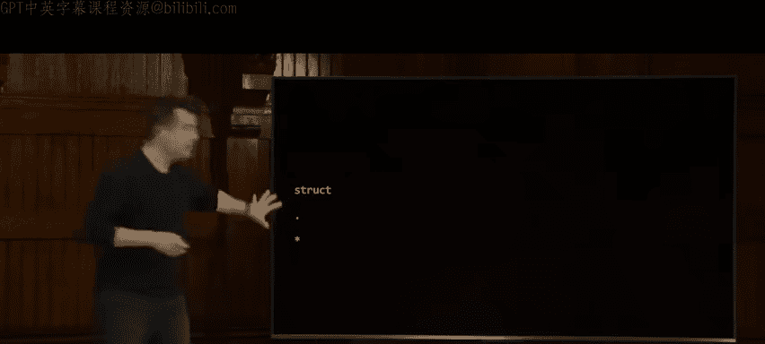

C， where， wherein， I'm going to implement a very simple list initially only using arrays。

 And then we'll swap that array out for a more sophisticated structure known indeed as a linked list。

 So here we go in list dot C， let me include standard I O dot H。 Then let me go ahead and。And sorry。

 let me reload the screen。Apologies。Sorry， it was not syntax high letting。 I should have caught that。

Okay， code， let's start see。And they invite it。Oh。Still not working。 Stan by。

Sorry。

My bad。 alright， let's try this once more。 Okay， this is a bug with V S code where sometimes it doesn't syntax highlight with the correct colors。

 and everything was sort of white and yellow there for a moment。 Uninteresting。

 So let's actually just rewind for just a moment。 Allright。😊。

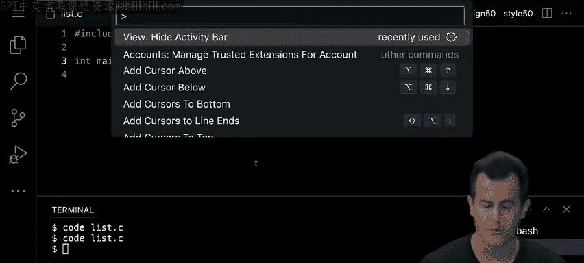

Let me go ahead and create a file called list dot C and in list do A。

 let's include standard Io do H at the top。 let's declare int main with no command line arguments and then let's super simply do int list3 to give myself an array called list of size 3 and then just for the sake of discussion。

 let's go ahead and put at the zero location that is the first the number one at the location one。

 the number two and location2， the number3。 So even though the array recall is0 index。

 I'm going to use some human numbers like 1，2 and3 in sequence like this。

 and then let's just do something mildly interesting like4 int I equals0 I less than3 I plus plus and then inside of my loop。

 let's just print out those numbers just to make sure that they are printing as I would expect。

Alright， so if I scroll up to the top of this code。

 there's not all that much going on other than I'm creating an an array of size 3 with the numbers 1。

2，3， and then I'm printing them out with a simple loop。 Allright。

 let's do make list so far so good dot slash list and there we go 1。

2 and3 All right so that works perfectly fine so far but let's actually see what would be involved。

 if we are using arrays alone to grow and shrink this array。 So let me go back into my same program。

 let me throw pretty much all of this array for all of this array for the moment。

 and let me propose that we're gonna create the the array in a different way in a way that we haven't done before。

 I'm gonna say int star list equals the return value of malloc whereby I want three times the size of an int So I've not actually created in class at least an array in this way。

 but if an array is just a sequence of value。Contiguous in memory。

 And malloc we saw last week is just a function that gives you a chunk of contiguous memory。

 I could kind of do things the oldfashed way and use malloc to give myself a chunk of memory and then treat the first part of it as space for an int。

 the second part as space for another int， the third part as space for a third int。

 I'm just kind of doing things at a lower conceptual level。 Of course， to use malloc。

 we needed to include last week standard lib dot H。

 So that gives me access to that and recall that sometimes things can go wrong。

 What does malloc return if like there's no memory available。😊，Anymore？Nll。

 so N U L L2 Ls in the context of memory。 So if this list value happens to equal equal null。 well。

 there's nothing interesting to do here， let's just return  one and exit the program altogether。

 But if we don't have that error。 Let's assume that I did get back a chunk of memory。

 that's big enough for three integers based on whatever their size is on the computer I'm using。

 So let's now initialize this array list bracket 0 gets one list bracket 1 gets 2 and list bracket 2 gets3。

 So just as before， I'm initializing it in the same way。 But now let's suppose that like time passes。

 And I decide that darn it， I really wish I had allocated space for fourth integer。

 Now obviously I can just change this code quickly。

 But let's assume that this is a much more complicated program。 It's running all the time。

 And maybe it's up to the user to say when they are ready to give me a fourth integer。

 So this is a simplification。 but at this point in my story after some time has passed。

 let me propose that。Darnnet， I've painted myself into that corner。

 Let's reallocate a new array that's a little bigger。 Well， how can I do that？ Well。

 let me go ahead and temporarily give myself a variable called temp TMP for short。

 set that equal to the return value of malloc whereby I'm asking now for four times the size of an in。

 So I'm just sort of changing my mind later on in this program， I actually want an array of size 4。

 Okay， I still have to check that nothing went wrong。 So if temp equals equals null。

 then let's go ahead and return one， then let me go ahead and copy everything from the old array into the new array。

 So how do I do that。 Well I can do4 int I equals 0。

 I less than 3 I plus plus just like I was printing the thing out earlier。

 and I can say put into the temporary array at location I。

 whatever is in the original array at location I as well。

 So this is kind of like the string copying program we wrote last week where I did everything。

nu by copying one into the other。 Now I'm just doing it more generically for integers into arrays。

 Then if I want to go ahead and add a fourth number to this array。

 I can literally do temp bracket 3 gets4。 and I'm saying gets to mean assignment here。

 and that's just adding now the fourth value to the array just like I did a moment ago by plopping the four into the bigger chunk of memory。

 Allright， I'm almost done here， but I do need to do some cleanup after I have created this new array of size4。

 I don't think I need the original array of size 3。 So recall from last week。

 I can free the original list， and that just hands it back to the operating system。

 And then if I want to keep this new chunk of memory around you know what I'd rather call it list instead of temp。

 So because both of those are just variables， I can simply say list equals temp。

 and this just sort of renames that new bigger chunk of memory to be the actual list that I care about so that moving forward in。

Program， I can continue to use that array instead of the original。 And heck。

 if I want to now print this thing out， I can do four and I equals 0。 I is less than4。 I plus plus。

 And then inside of this loop， I can print out using print F and percent I backslash N。

 whatever is at list bracket I， which can now go up to。Index 4， not through， but up to index 4。

 because there's four possibilities there。 And then at the very end of this program。

I should probably be a good citizen。 So maybe time passes again。

 but if eventually I should free that list itself。 I already free the temporary， the original list。

 Now I want to free the new bigger list as well。 And now I can just return successfully，0。Alright。

 if I didn't mess this up， let me open my terminal， do make list again dot slash list。

 and I should see1，2，3，4。 And I think this is now correct。

 But notice that just to make this simple idea。 I mean 44 lines of code just to make an array slightly bigger。

 if you will。 And there's actually a subtle bug。 This is super subtle。

 but it's the kind of thing you need to start thinking about whenever you're manipulating memory and I'll draw I'll call this one out myself。

 So notice that at the very beginning of this program When I initialized space for three integers。

 I realized something could go wrong because list could be null and。

 I'm gonna exit immediately by returning one。 But there's another subtlety here。

 which I didn't fix yet in Valgarand eventually might catch this for me。 notice here。

 I again use malloc， and I did realize here， Oh shoot something could go wrong and Maloc could again here return null。

 So I do check for that。But notice that I return before cleaning up the memory that I already asked for。

 So this is super subtle。 But what I should really do with this second use of malloc is if I didn't have a valid return value for malloc。

 that's fine。 But I had better free the successful value of Maoc that I got earlier。 Otherwise。

 this is the definition of a memory leak。 if you've allocated memory here。

 you're exiting your program here， but you never actually give this memory back like that's a memory leak。

 And to be fair， the operating system will eventually like reclaim that memory for you。

 But if we use this as sort of a working principle， you should always。

 always always free memory that you yourself have allocated whether it's in cases of error like this or intentionally like down here。

Allright， let me go ahead and just make sure I didn't break anything。 Make list dot slash list。

 And voil， we have now 1，2，3 and 4。 All right， let me propose that this is not actually as annoying as it needs to be when you want to grow a list of size 3 into a list that's slightly bigger of size 4。

 There's actually one other function we can introduce today that will make our lives a little easier。

 Let me go back to V S code。 hide my terminal window。

 and let me propose that what we could do is actually this after some time has passed inside of main And instead of allocating a brand new array like this of size 4。

 we can actually do this instead， we can use a function that we've not seen before called real and just ask really see to do the reallocation for me。

 And this is nice because what C is going to do is if we get lucky and it is not the case that we painted ourselves into a corner so to speak。

 And there's no hello world right after the 1，2，3， real is going be smart。

 And if it can leave the one the two。😊。

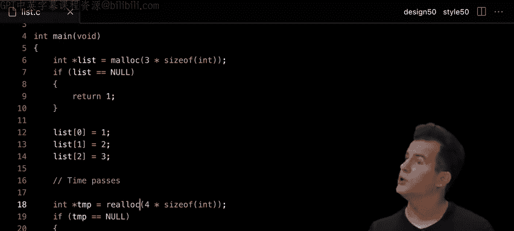

The three in their current locations， but just give you a little more memory to the right of that array。

 so to speak， realloc is going to do exactly that and give you back the same chunk of but a slightly bigger version of that memory。

 So you therefore do not need to move everything around in the computer's memory yourself。

 And so I still have to check that something might go wrong whereby if temp equals if temp equals equals null I still have to exit because I can't proceed further。

 but what I don't need to do anymore is copying the smaller array into the larger one because realloc just takes care of that for me。

 So it's a nice optimization。 But my God， I mean still like what now we're down to like 40 lines of code instead of 44 it's not a huge gain。

 So is there perhaps a better way to go about this process of actually resizing arrays if and when we need more memory。

 And yes， now that we have access to pointers from last week functions like malloc Now realoc as well as free。

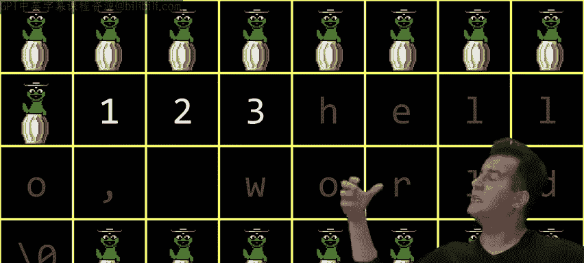

Actually build a memory structure， a data structure that doesn't need everything being moved around ever。

 We can leave everything where we put it in the first place by way of a structure called now a linked list。

 So what then is a linked list。 Well， let me propose that a linked list is a list whereby you're just using pointers to link things together in the computers memory。

 So for instance， if here is our canvas of memory。 And there's a lot of places that things could end up in this story。

 suppose that I want to store the number one first， Well， that location happens to be available。

 And so I plop the number one there。 We know from last week that every byte in a computer can be uniquely addressed。

 just like this building is 45 Quincy street， this is maybe byte number O X 1，2。

3 using last week's X Smal notation。 Now， suppose for the sake of discussion that maybe this space is being used。

 this space is being used， this space is being used。

 So there's no room at the moment immediately next to this number one。 that's okay。

 Why don't I go ahead and plop the number2。

Where there is room which is maybe over here， maybe that location for the sake of discussion is O x 456。

 where do I put the three， Well maybe it ends up over here and that happens to be location Ox 789。

 so no longer are these three integers contiguous back to back to back。

 they're sort of all over the place in memory， but that's okay because if I can somehow connect these dots by pointing one to the other one to the other。

 maybe I can kind of stitch together a data structure in the computer's memory。😡，And I can。

 if we use last week's building block of pointers， let me waste a little bit of space by using another byte。

 or technically， it might be as many as8 more bytes。 So this is not drawn to scale。

 but pointers recall， typically take up 8 bytes or 64 B nowadays。

 But I want to draw these things more cleanly as simple rectangles here。 So here's still an int。

 here's still an int， here's still an int。 But let me propose that if for every integer in this list。

 let me also allocate a pointer， a pointer and a pointer。 So each one can point to another location。

 So what should this pointer point to。 Well， ideally， it should point to for0 x 456。

 What should this one point to， ideally O X 789。 What should this point to。 Well。

 if this is the end of the list， we need some kind of special sentinel value。

 And in the world of memory like what's the only sentinel value we've seen thus far。

 that can kind of signify the buck stops here， there's no more list。So null， So O X 0， really。

 So just arbitrarily， but universally， we decide to use 0 is a special special address。

 that just means there are no more numbers in this list。 A K A null， as we saw last week。 Now。

 this is all fine and good。 memory address， memory address， memory address。

 and we're stitching things together in this way。 But you don't need to think at this low level。

 recall from last week。 You think of pointers as。😊，For the sake of discussion like last week。

 you can think of pointers as really just pointing from one location to another。

 And so we can kind of abstract this away and just get rid of all of that and use some basic arrows instead。

 So how do we keep track of a linked list。 Well， a linked list of numbers。

 while we store the numbers themselves wherever their space in memory。

 We use some extra pointers associated with each of those numbers to kind of link us from one to the other。

 And then the linked list itself。 It turns out we're gonna spend one final pointer that just keeps track of where the start of or the so-called head of the list begins in memory。

So what's the upside here。 Well， the problem I claim we have solved is we no longer need to have things contiguous。

 back to back in memory， which means we can make much more efficient use of memory because we don't need a huge chunk of memory to be available all contiguously。

 especially if the program's running over time， you can just start plopping things wherever you have room。

 Now， for those familiar， that actually can lead to something called fragmentation of memory where your data structures kind of fragmented all over the place。

 But nowadays on modern systems， not really a big deal。

 And these pointers allow us to get from one location to another。 But clearly。

 even in this picture alone， there is a downside。 there is a cost for linking numbers together in this way with pointers。

What is the downside？Of linking them together here。Twice as many。

It looks like it's twice as much space。 and it， frankly might be a little bigger than that。

 if these pointers are particularly large， you're spending space。

 but you're gaining the flexibility of no longer needing to copy everything from one smaller location to one bigger location。

 And if you've got lots going on in memory， you can actually use all available memory as opposed to telling the user。

 Sorry， I've got a lot of bytes available but some are here， Some are here， Some are here。

 I just don't have them all contiguous for you。 That would be really obnoxious if the program can't proceed because you have enough memory。

 but it's not all in one place。 and you don't want to spend linear time like shuffling everything around。

 a linked list just gives you flexibility。 You can use what memory available。

 albeit at the cost of these pointers。 So it's not a win win， but it is a tradeoff。

 depending on what feature。Is most important to you。All right。

 any questions on this here structure called the link list thus far。Any questions at all？

NowAll right， so let's translate this to the simplest code that we can。

 And it's actually not all that different from some of the syntax we've seen。

 Here is how I might remember implementing a couple of weeks back now。

 a person whereby originally it was a string name and a string number we took away those training wheels。

 and last week that it's char star name and char star number。 But this is indeed is a person。

 But this allowed us usingstruct and typed up together to create a new structure and memory that encapsulated information we cared about like a person's name and number。

 Well， let me propose today that we actually introduce a new term of art node doesn't really have a technical definition as much as it is just a container for data in memory。

 So node is very common in graphs and other types of structures。

 But node is like a generic rectangle that stores some stuff for us。

 What could I put inside of this data structure in C to implement that concept of a rectangle with both a number and a pointer to another number。

 Well， I can literally say number So inside of every rectangle， a node。

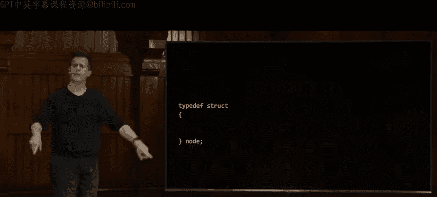

I going to be an integer called number。 And then this one's a little weird。

 I'm also going to store a pointer called next that points to another node。

 So we've not seen this word node before， but it's the same idea as char star。

 but instead of pointing to the address of a character。

 This variable next is going point to the address of another node。

 and this is somewhat subtle and a little annoying。

 but because C reads code top to bottom left to right， there's a bit of a gotcha here。

 I am not allowed to use the word node here。 if it only technically exist once I get to the final line of this code。

 So a little subtle to N C。 There is a fix though， I didn't need this for person because persons did not involve linking things together in this way。

 But if I add the word node here。 So it's a little more robustbo type f struck node。

 then I can change this to struck node star as well。 So now I've seen them top to bottom。

 this can stay the same that's the solution to that problem。 And this is how everyone does it in C。

 So not always necessary。As with persons， but here you just need to mention a little more versely。

 what is the name you're giving to this thing so you can reuse it here from top to bottom。

 So what does this do for us， it just creates in code a definition for those yellow rectangles that we just drew onto the screen。

 How can we now actually use these。 Well， let's take a look at the code via which we can start creating a linked list even though at a glance it might seem a little complicated。

 but it's gonna build on exactly what we did last week。 So let me go back to V code here。

 Let me actually get rid of pretty much everything we just did effectively getting rid of our array based implementation at the top of my file。

 Let me go ahead and create with type def andstruct and node exactly that data structure that has in number and inside of that is astruct node star next and then the name of this thing itself shall be more succinctly node。

 just to be clear we could call no。Anyth we want， we could call it rectangle。 If that's simpler。

 we could call next anything we want， we could call it arrow。

 So these are just arbitrary but conventional choices to describe that yellow rectangle previously on the screen。

 All right， now what do I do in my program to create a linked list that looks ultimately a little something like this。

 Well， first， I'm gonna create a pointer that is of type node star called list and set it equal to null。

 What this means is that I have created on the screen over here。 the pointer at far left。

 a single pointer that's pointing to the beginning of this list。

 but I initialized it to null because there is no list of numbers just yet。 Allright。

 what do I then want to do Well， let me just do something three times just for the sake of discussion。

 Let me do four I equals 0 I less than3 I plus plus， but in the real world。

 this should probably be more dynamic。 and I don't just hard code than number 3。

 But what do I want to do。 Well， if I want to achieve this picture。

 I think what I need to do is ultimately use mal。To create a node， put a number in there。

 and then do it again for another node， put a number in there， and then do it a third time。

 put a number in there， and then somehow stitch these things together。

 So how can I go about doing that？ Well， let me propose to do it this way inside of this loop because I want to do this three times in total。

 let me create a pointer called N for node。And set it equal to the return value of malloc。

 whereby I want enough memory to fit the size of a node。

 So I keep using size of so that the computer can just tell me how much memory I actually need for a node。

 recall， as always， Maloc returns the address of a chunk of memory。 Hence。

 I must assign it to a pointer。 But what is that chunk of memory going to represent a node。

 So that's why now today I'm using node star instead of char star， because last week。

 I wanted a string of memory a char star this week， I want a memory for a node instead。 So otherwise。

 it's behaving the same way。 Quick sanity check。 So if n equals equals null。

 something bad has happened， and so I should just go ahead and return one at this point to signify error。

 And I'll come back to the issue of potentially leaking memory later on。 All right。

 here now I have the opportunity to actually go into that chunk of memory。 and give it a number。

 So how do I do that？ Well， recall that if n contains。The address of a chunk of memory。

 just like S was the address of a string。 If I want to go to that address。 I can do star N。

 and that goes to the address to the chunk of memory I just created if I want to then go inside of that chunk of memory and access specifically something like the number field as in mystruct here while can use the dot operator which we used in the past。

 So my dot operator would allow me to do this dot number equals and let's just use get in to simple today。

 even though that's from the C50 library， I can go ahead and set that equal to whatever number the human types in。

 Now， syntactically， I need to make a little tweak here because of order of operations。

 I want to make super clear that I want to go to that address first。

 then go inside of that chunk of memory and set the number to whatever the human types in。

 Then I'm gonna go to that same chunk of memory a little redundantly。

 I'm gonna change its next field to at least be。Some safe value that I know about， like， no。

 I don't want it to be a garbage value。 I want to just create this rectangle and memory and know that there's nothing there just yet。

Alright， lastly， what do I actually want to do， I'm going to go ahead and go to。

Let me go ahead and prepen them。don't want to do this。 Yes， let's go to that same note again。

 Let's then update its next field。No， I don't like this。 Let's pause here， so。

What have I now built in memory。 Let's do this a little more slowly。

 a little more methodically by visualizing what it is we've just built。

 So at the top of the screen here， we're gonna see one line of code at a time。

 And in the bottom part of the screen， we're gonna see what I'm building in memory step by step。

 The first line of code could be this Just give me a variable called list that I eventually is going point to this list。

 I don't like this， though， because it means that it technically contains a garbage value right from the get go。

 So who knows where this linked list is in memory。 And that's why in my actual code， I said， no， no。

 no， let's not tolerate a garbage value there。 even though this does give me a variable called list。

 let's initialize that to null。 So that this isn't point to some random location。

 I'm just going to use blank to indicate that it's null。

 So this is how I might begin the story of creating this length list。 All right。

 what was my next line of code that I did， Well， I indeed use mall to allocate enough memory for the size of a node。

 I claim that malloc always returns the address of that chunk of memory。

 So I stored it in a variable called n for short for node。 So where is that on the screen。

 That's like。

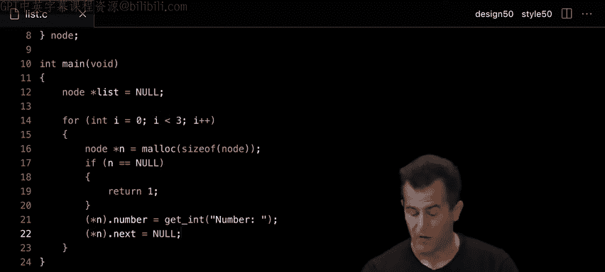

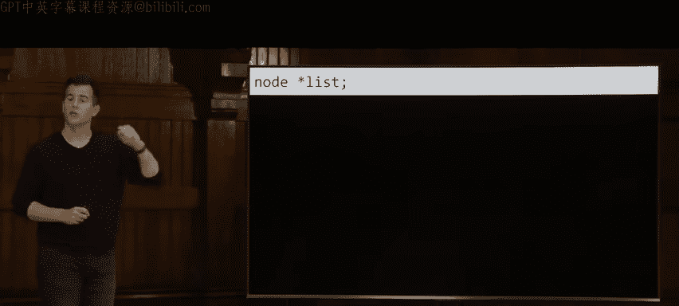

A variable called N whose value initially is a garbage value as any variable is。

 But as soon as I call malloc， that's like giving me a rectangle of memory over here。

 And so I just have to change the number field and the next field to be the values I care about。

 So what did I do after this。 recall here that one after doing the assignment from right to left。

 that effectively means that N points to that chunk of memory。 I could use O X1，2，3， x 4，5，6。

 But who cares， let's just use arrows for now to keep things visually more simpler。

 So this variable N is pointing to that chunk of memory。

 Then I went to that address following the arrow。 And when inside of that structure。

 How did I do that star N dot number gets one， and that's like actually changing the number one there。

 And it turns out there's actually a simplification of this。 This is not pleasant looking code。

 It looks cryptic。 You have to remember all of the symbols。

 I bet we could simplify it using that one new piece of syntax today。

The arrow operator that I showed on the screen earlier simply means do all of this with the parentheses in the star and the dot。

 but do it in a way that kind of reads more cleanly from left to right and it kind of does if this is n and you follow the arrow and you go to number。

 you get to exactly that location in memory Start N follow the arrow and vo you are right at that location in memory for both number and next。

 So most people would actually use this syntax So just to be consistent let me go back quickly to VS code and just make that subtle change instead of parentheses star N dot let's just say more simply N arrow number and down here N arrow next and that's kind of tightening up the code already。

 All right， what happens after this， Well I should probably initialize this next pointer to be some known value so that it's not pointing at some garbage value still How did I do this N arrow next equals no just as you saw a moment ago in VS code So Oscar goes away and that's。

Effectively null now。 So this isn't complete。 This is now really a newly allocated list of size 1。

 But notice we haven't updated the original list。 So this is actually a step I haven't done yet in code。

 I think I want to set list equal to N， which sounds a little weird。

 But if n is an address and list will once should be an address。

 All I'm doing is copying whatever the memory addresses here。 O X something into list。

 which is like duplicating the arrow and pointing it from left to right as well。 And then heck。

 I don't need the temporary node anymore in my story because I've just created the first number in memory。

 So let's actually go back to V code for just a moment and add that final flourish at the bottom of this for loop。

 When I am ready to insert this node into the list。 What I think I'm going do is change。😊。

The N arrow， the， sorry， the n nodes next field to equal whatever the list itself。 Well， let's see。

Nope， let me do it exactly as we just saw。 I'm gonna to say list equals n。

The problem with this approach at the moment is that if I'm doing this in a loop。

 I am going to constantly update list to point to the very node I just allocated。

 So if we keep going through this， this loop three times。

 I'm gonna create a very a node for two and then a node for three。 But based on that line of code。

 I'm always just gonna point list at the most recently created node。

 and there's gonna be no arrows linking the three to the two to the one。

 And so I actually need to be a little more clever about this。 And so in V S code here。

 what I'm gonna do at the bottom of this loop here is instead I'm gonna do the following。

 I'm gonna specify that whatever ends next field is should actually be。

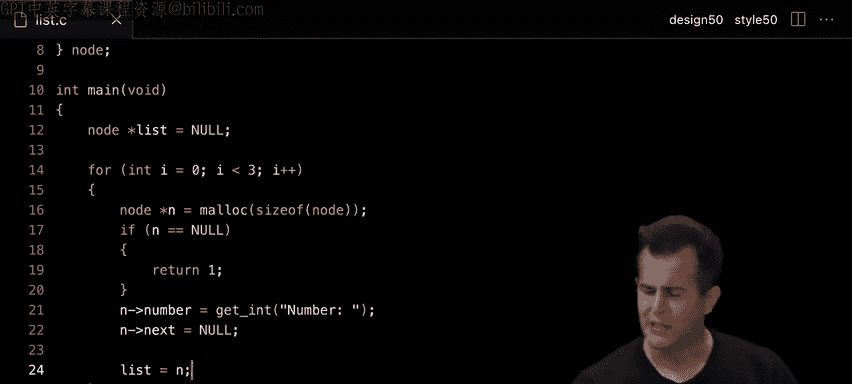

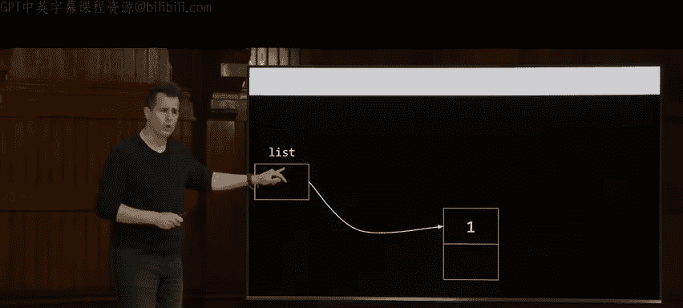

The same thing as the list。 And then I'm gonna say the list should point at n。

 So I technically don't need this line of code here anymore。 What instead I'm going to do is this。

 If I go back to the picture over here。And I create now a second node。

 Let's see what actually happens If I create a new node here with Maoc。

And I get some other chunk of memory here。I eventually want to point n at that just as I did before as the same line of code does the second time through my loop。

 If I want to change that garbage value to the number two， I go to n， follow the arrow。

 set it equal to2。 then I go to n follow the arrow， set next equal to null。

 This still isn't a linked list because notice the one and the two are not yet connected。

 but the code I just wrote inside of my loop here proposes to update the currently created node ns next field to be that of list。

 and then update the list itself to point at this new node。 So what this means concretely。

 even though we're crisscrossing some lines here， is the following。

 if my next step is going to be set list equal to n as it was a moment ago。

 that's bad because watch what happens。 If I immediately set list equal to whatever n is and n is pointing here。

 that's like doing this and this is bad。😡，As per the red on the screen， why？

This does not link the list together， why。Yeah。Yeah。

 I've like lost track literally of the very first node and in computing speak。

 I have orphaned the very first node because no one is pointing at it anymore。

 And this is actually a really bad memory leak。 because if you have no variables pointing to that chunk of memory。

 you literally cannot free it later on in your code。

 So it's never going to be freed and you'll just gradually leak more and more and more memory by something as simple as this。

 And so that's why I indeed deleted that line of code。

 and I propose now most recently in V S code to do this。

 take the new node follow its arrow and change its next field to be whatever the list itself is currently pointing at。

 So what does that mean， go to N follow the arrow and update this box here to be whatever the value of list is And here again it's a little weird because I don't want to copy the whole list。

 But list L I ST is just a variable containing a memory address。

 And that memory address whatever the address of this first node is。 So that's like saying this box。

Should point to the same thing that Li points at， which is like adding an arrow in memory this way。

Now， that's not the finished work。 There's one last line of code that I did just add to V S code where now it is safe to update list to equal the address of the new node。

 because the new node is here。Pointing at this chunk of memory。

 So if I set list equal to that address， now we're linking things together。 takes a few steps。 And。

 in fact， let's get rid of the temporary memory that I created to make all of this happen。 Now。

 I'm creating a linked list。 And if we were to go through this one more time around。

 same exact code inside of that for loop for the third and final time。

 I would then have this structure， for instance， in memory。 Now。

 I've deliberately artistically written it sort of left to right。

 So it kind of flows in a pretty way。 But technically， the three， the two。

 the one could be all over in the computer's memory。

 But these arrows would just curve a lot and point to those locations。😊。

But I haven't quite built up the same list of numbers as before。 I kind of screwed this up。

 What if I done wrong， It would seem here， Vis V， the array that contained these same numbers。Like。

 that code is correct。 It links numbers together。 But what have I built in memory that's a little different。

Damn it， It's backwards， right， Like it's 3 to1。 If I read it from left to right， which I should。

 because this is where the start of the list is the so-called head of the list。

 and indeed3 to2 to one。 Now， technically， I could probably come up with some way of reversing that process。

 But these arrows literally point in only one direction。 And because， in fact。

 what I've actually built is what computer scientists would call a singly linked list。

 whereby each node points to another node， but there's no way to go in the other direction。

 That would be what's called the doubly linked list。 And I could do that。

 I could build rectangles or nodes and memory that have three locations。

 one of which points this way， the other of which points that way。

 then I can go back and forth and back and forth and solve that same problem。 But at the moment。

 without some fancy code， I don't think I can print these numbers from left to right in exactly the same way。

 So I built this darn thing backwards it would seem with this code。

 So while the code itself is correct， It doesn't maintain the property that I wanted。

 of keeping these things perhaps in order。 So。The implication then。

 or how do I actually go about recovering from this。 Well。

 let's actually see how the list prints in practice。

 Let me go back to let me focus on the slide here。 Here's that same memory。

 suppose that I give myself a temporary variable， we'll call it pointer for short。

 which is what a lot of programmers would do when using pointers PR。

 And if I created a variable in memory called pointer。

 and I initialized it to the first element of the list， I could use printf and print it out。

 I could then follow that node's own arrow and effectively point at the second location and print its number out。

 Then I could update that arrow to point to the last location and print its number out。

 So this idea of having PTR， this variable loop from left to right is actually something I could translate pretty readily into code here。

 In fact， let me do that in my V S code here。 Instead of leaving this as is。

 let me go outside of this for loop。😊，And propose that time passes。

 Maybe there's some other code that I've written there。

 But what I really care about now is printing those numbers。 So how can I do that。

 Why I need to create sort of my， you know， sort of foam finger in in the computer's memory。

 which I'll call PTR， so I can do node star PTR。 And I can set that equal initially to。Well。

 how do I begin this， Let me go back to the diagram。I want PTR to point to three first。

 the very first node in the list。So in code， what should I set PR to equal。

 How do I access the head of the list。I don't have too many options when it comes to variables in this program。

What could I set PTR to equal？Well， there's only one variable in the computer's memory that technically points at anything at this point。

So the answer is on line 12。Still nothing。B， that's correct。

 So I could set PR equal to list because just like this diagram。

 if I want PR to start at the point the start to point at the start of the list。

 that does not mean that I wanted to point to this thing。

 This is just a variable that I'm using to keep track of where the first node is。 But again。

 if we were to take away these arrows as an abstraction。

 This just contains an address like X something So what I really want to do is put into the PTR variable that I just created the same O X something so that it's pointing at the first node in the list。

 So that's like saying PR equals list semicolon So that PR effectively points at that same first element。

 And again， this is the annoying part of pointers because they are variables。

 but they really addresses to other variables， that kind of thing you kind of have to pause sometimes and think about what is it I'm actually moving around in the computer's memory In this case。

 it's just the address of that first node in the linked list。 All right。

 if I go back to the S code here， the rest of the code is actually fairly straightforward。

 and we can use， for instance，😊，W loop。 So while that pointer value is not null。

 So while I still am pointing at valid memory， and I have not reached the end of the list。

 go ahead and print out using printf percent I backlash N and print out the current nodes number field。

 So again， PR just per this diagram is pointing at this node， this node and this node， So in code。

 what we're gonna do is literally dereference PR with the arrow operator， follow that arrow。

 get the number field and print it out。 the only bit of complexity now， is inside of this while loop。

 how do I update the arrow to go from one node to the next。 Well。

 this two is a little mind bending at first。 But what I really want PTR to equal。

 the next time through the loop is to point at this node。 Well， how do I do that。

 I think after one iteration， I can set PTR to be the exact same thing as the first node next field。

So PTR is pointing at this node。 Well， then PTR arrow next is the address I want because it points to the second node。

 So even though this looks a little weird at first glance。

 this is the canonical way to sort of iterate through a linked list。 I just want to set PTR now。

 equal to whatever PTR is now and its next field。So this is just like following the arrow。

 following the arrow， following the arrow。 And if after all of this， I open my terminal window。

 and I do make list again。Enter。There is going to be an error。Which I promised I knew was coming。

 But how do I fix this undeclared function， Get in。Kind of need those training wheels back。

We just need the C50 library。 And that's fine。 I just didn't want to scanf and complicate things unnecessarily today。

 I just wanted to get a simple integer to play this game。 So I'm gonna to include CS5 H at the top。

 re my terminal window， rerun， make list， enter Now we're good dotlash list。

 and I'm gonna manually do the exact same thing as I did with the array123 enter it's backwards but at least it is built up in memory。

 and we can indeed see that what I have built is exactly this structure here。

 The upside though of having built it backwards is actually arguably a little bit efficient In fact。

 what I've actually done here leads us to a discussion of like the running time of these linked lists。

 like arrays were super fast because they were contiguous and we could search them from left to right in linear time or per week0 and2 if we sorted the elements。

 we could even achieve logarithmic time log of N because we could do binary search again and again and again。

 But let's consider。😊。

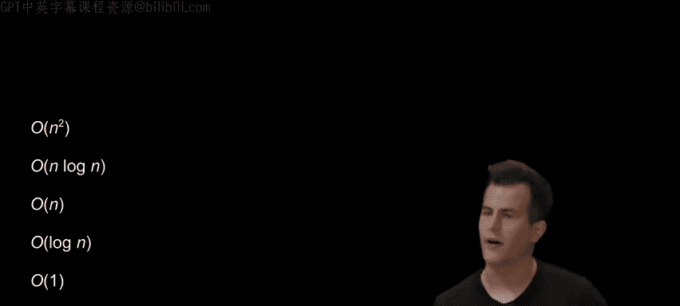

Here's kind of our cheat sheet of some common running times。

 but not all of the running times in the world。 How much time does it take right now to search a linked list from left to right for some value。

Big O of N。 Why is that？ Well， you have to start at the start of the list， the head of the list。

 And if you're looking for any value， whether it's sorted or not， worst case。

 you might have to go from left to right all the way to the end。 A K， A。

 the tail of the list in this case。 So， yes， big O of N exactly describes whoops exactly describes。

The running time of search， why， well， if we go back to the diagram here and actually rather。😡，Sorry。

So big event exactly describes the running time of search。 What about insertion。

 the process of adding a node， adding a node， adding a node。

 Here's where I actually did something arguably clever。

 even though it kind of backfired in the sense that things came out backwards。

What's the running time per this cheat sheet of inserting a new node into the linked list。

 as we've done it so far。It's not O N。O N would have implied that we're constantly going from left to right and adding it to the end。

 But I wasn't adding it to the end。 I was adding it to the beginning。Which means a big O of。

It's actually big O of one because the beginning of the list is always perfectly accessible to me。

 It doesn't matter how long the list gets。 if it has three elements or 300 elements。

 the start of the list is always right there in front of me via that list variable。 Now technically。

 it doesn't take literally one step。 I think if I did the pointer I might have to use two or three steps in total。

 but it's constant， And that's what big O of one means constant time。 And so indeed。

 I can kind of see that here。 if this is my list originally and the whole thing is empty。

 and I insert the number three， that only took one step really。

 or that took rather a constant number of steps， whether it's one or two or three。

 whatever it wasn't end steps。 How do I insert the two。 Well， my picture looked briefly like this。

 that too has no dependency on how long the list already is because I'm just preending it to the list。

 And the number three preending it to the list。 So even if this thing is getting longer and longer and longer。

 there's no reason for me to walk or search the thing from left to right。

 So the upside then of this algorithm thus far of prepending elements is that。

Can achieve big O of N for searching， but big O of one inserting。

 And if I'm doing a lot of inserting into this data structure。

 like that is compelling as Constant time always is。😡。

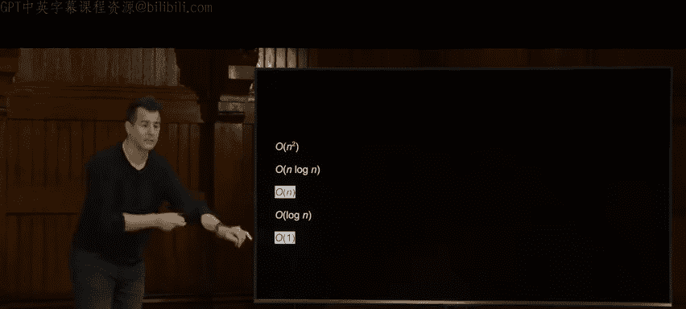

The catch though， of course， is that things end up backwards。

 if I care about the order in which I insert them， and maybe I do。

 as per our discussions of stacks and cues， which are fundamentally separate from this topic。

 Now we're talking about lowlevel implementation details。

 but I might have accidentally now created a lifeFO structure instead of a FiIO structure。

 which might indeed be germane。 So how can I sort of work around this。 well。

 maybe I could do something a little differently instead， instead of prepending， well。

 let me see how much effort it would be to actually do a maybe an app pending to this list instead。

 So once I build a list with the first node， ideally plotlop it here。 Second node over there。

 Third node maybe over there。 I can maintain sorted order， which is great if I do in fact。

 care about a fiIO property because now first one in could be the first one out because it's always readily accessible But I think I just shot myself in the foot here。

 let me quickly pull up some code for this。 And let me propose that my code。

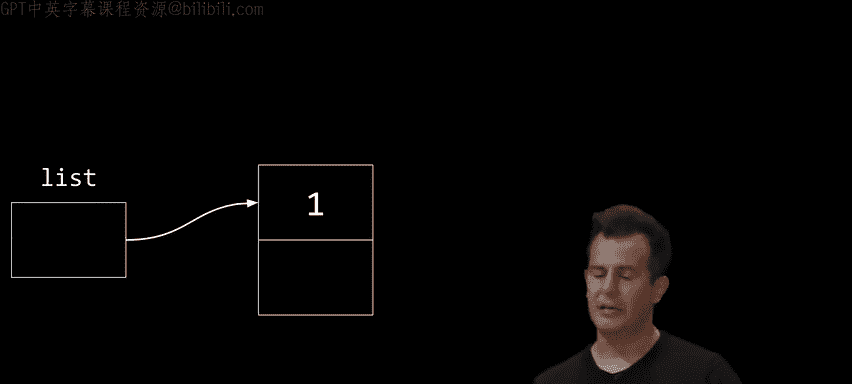

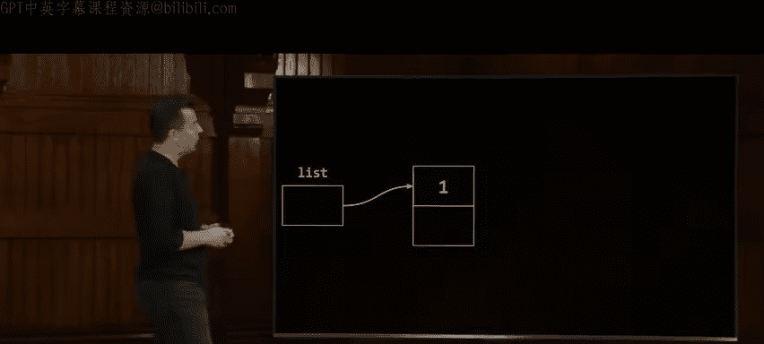

Now might look a little different。 Let me open up VS code here。And in VS code。

 let me go ahead and propose that if I want to append instead。That。I go ahead， and。Do this。

 Let me hide my terminal window。 Let me scroll down to the bottom here。

 And I think what's gonna have to change is this stuff here。

 I can't just blindly insert the new element at the start of the list。

 And that's really what was happening with these two lines of code here。 So how do I do this。 Well。

 it turns out the codes gonna to get a little more complicated as a result。 First。

 I'm going initialize my next field here to null just to make sure that it's not a garbage value as I originally did。

 but then decided it's not necessary if I'm immediately preending it to the list。

 But now I actually have to consider two scenarios。

 And this is where sort of building things in memory get a little annoying because you might have corner cases。

 things that don't happen all of the time， but might sometimes happen。

 And what's a potential corner case when building a data structure like this。 Well。

 maybe at the very beginning of the process。 there is no list。

 So you can' just blindly append it to something that doesn't exist。 You have to kind special case。

 the start of the process。 So what do I mean by that。 Well， in code here， I might do this if。

My list variable， which keeps track of the whole thing， equals null。

 as it will at the start of the story。 when no nodes are in the list。 Well， this is easy。

 I'm going to store the address of the new node I just created。

 So I'm gonna put a comment to myself to make clear if list is empty。

 I am going to do this special case here。 But a pending is indeed going evolve some kind of loop。

 So else， I'm going go ahead and do this。 And I'll add a comment here。 if list has numbers already。

 The second case that I want to handle is going look a little different。😊。

I'm going to iterate from left to right over this structure in the following way。

 And I won't dwell on this code because it's perhaps more detail than we need right now。

 But one way I could do this is as follows。Four。Noode star pointer equals list， pointer。

 not equal to null。 pointer equals pointer next。 Now， that's a mouthful。

 but we'll come back to what that means in just a moment inside of this loop。

 I'm going say the following。If。At end of list， I am going to。So if pointer next equals equals null。

 then I am going to assign the next field of this thing equal to n。

 and then I'm going break out of this entirely。 Allright， so this is a mouthful。

 But what do I actually want to do here。 Well， if this is my empty data structure initially。

 and I want to add one， that's easy， I just set list equal to one。

 But then things get more generalizable for the second， the third， the fourth。

 the fifth node because as follows。 if I want to insert this next no two。

 what I really want to do is start at the beginning of the list。 and a moment ago。

 look for the end of the list。 And as soon as I find the end of the list as indicated by this being null。

 Okay， now I can append it。 how do I insert the third element。 I start the beginning of the list。

 I iterate through it， I look for the null element。

 and then I can append that to the end of the list。

 So even though this code very admittedly is probably the most complicated that we've seen thus far。

 it actually achieves that same idea。 As per my comments。 So if the list variable itself is null。

 there's no list already， that's。For easy case。 Just set list equal to the address of this new node done。

 The harder part is every other case where we're appending to the end of the list。 Now。

 here I'm using a for loop， which is a convention。 I could use a while loop， as I did for printing。

 But let's just think about what this does。 This creates like any four loop， a variable。

 In this case called pointer。 and it sets it equal initially to the start of the list。

 because that's where I want my finger to point from left to right。

 Then I keep doing this so long as the pointer itself is not null。

 And then on every pass through this loop， just like with my while loop。

 I want to set pointer equal to pointer next。 That's like moving my less fan to point to the next node to the next node to the next node。

 And I want to do this so long as the pointer is not null。 because once it is null。

 then I've gone too far。 So how do I do this。Here I am inside of that loop。

 and I'm asking if I'm pointing at a node whose next field is null。

 That means I'm at the end of the list， because that's the one node initially。

 then the two node and so forth。 So if the thing I'm pointing at next field is null。

 There's nothing more to go。 So what do I want to do。

 I want to change that null value to be the address of the new node。

 And then I'm just gonna hit break and break out of this whole loop because I'm done。

 So it's a mouthful syntactically， even though we're using all of the same stuff we saw last week。

 like stars here and now arrows here， But this is just asking the question。

 as I point from left to right， left to right。 am I pointing at a null ending of the list， If so。

 just tack on one more node， please。 And that's it。And again， if you're comfortable。

 at least with the concept of what we're doing here， appending。

 that's really the current goal at hand。 And in fact。

 what I can do now is let me go into VS code here， and I can actually change that version of my printing to be very similar。

 if it's helpful to see one side by side。 So in fact。

 if instead of using a while loop at the end of this code， as I did before to print this thing out。

 let me actually change this to B quite similar instead， let me go in here， and say four node。

 star pointer equals list， pointer not equal to null pointer equals pointer next。

 and then inside of this loop just as before， let's just print out percent I back slash n the number in the current field。

 semicolon and then down here， heck I'll return0。 So in other words， what I did with a four loop。

Is identical conceptually to what I did with a while loop。 If I undo。

 I'm hitting control Z again and again and again。 I'm just undoing all of this code。

 The exact same thing as this。 But just as we saw in week 1， you know。

 four loops tend to be a little more concise。 Fewer lines of code than the equivalent while loop。

 So that's all I'm doing here is rewriting this using the same for loop syntax。

Any questions on what we just did here。

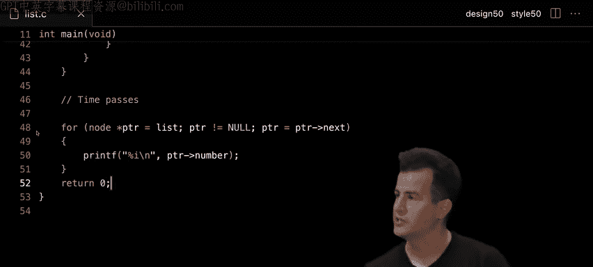

Even though I know this is complex， yeah。Stores。Mmhm。😊，And where do we。A really good question。

 If list and if N are are if list and N are addresses。

 then where are the names of these things being stored。

 the compilers actually taking care of that for us insideside of the program long story short。

 There's a symbol table。 and those symbols mapped to corresponding locations and memory。

 you don't have to worry about that in your own code。

 That's one of the things the compiler is doing for you。 And in fact。

 the names of these variables at the end of the day don't even matter。

 But they help the compiler keep track of where all of your usable memory is。Said that once more。So。

And to the list。EYes， that is correct。 Let me rewind to where we built this here。

Which one is helpful here。So when we had an involved earlier like this。

 let's go back one step further。So this is why I keep emphasizing。

 think about what the variables actually are in this world now of pointers。

 What list is is the address of a node。 What n is is the address of a node。

 So when we say list equals n， that doesn't mean anything related to the names of these things。

 That means go into memory and grab this address and copy it over here as well。

 So that they are fundamentally pointing at the same thing。

 The names have nothing to do with it But again， today。

 I encourage you when we're talking about addresses， Think about what's actually inside the box。

 it's not just a number per se。 It's an address。 It's an address。 A good question。Alright。

 so let's clean up one other detail here。 Let me propose。 whoops， spoiler。 Let me propose。

That we consider this question。 So we've just built up a linked list now that is appending nodes to the list upside of which is that we're actually preserving that first in first out property potentially。

 if we care about that because it's one，2，3 now instead of 3， to1。 However。

 have we made a dent in the running time。 I don't think so， because if anything， it's gotten worse。

 no longer are we inserting and constant time。 Now。

 all of our appends require big O of n time just like our searches。

 because we have to constantly search from left to right， search from left to right。 Now， admittedly。

 we could do a minor optimization。 we can just have another variable that just always keeps track of the tail of the list。

 And that is a perfectly valid solution， it's going to cost this a little more memory but that's valid。

 But in general， when you're appending something to a list and you're implementing the list as minimalistically as you can。

 with just one pointer called list that points to the beginning of the thing， then arguably。

 it is going to be big O of n。 But if that matters is really a question for the problem。

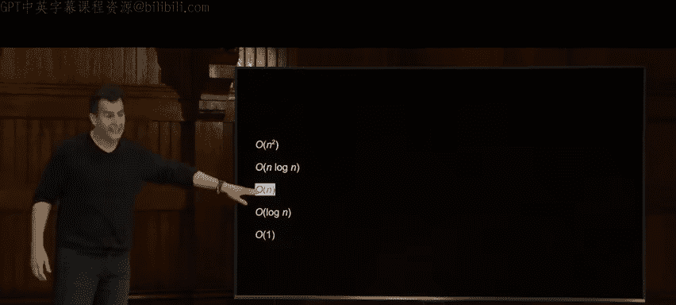

You're trying to decide。 But I think there's one thing we should still do before we move on past this code。

 Now I have a program that indeed builds a linked list by keeping everything in the same order in which we inserted it。

 However， I have not yet done anything about actually freeing the memory that I've actually been allocating all this time。

 So let me propose too that the bottom of this program before I return 0 and say I'm done successfully。

 let's just propose that's more time passes in the sense that maybe there's more code going on。

 that's more interesting。 But if and when I do want to free this linked list。

 It's actually fairly straightforward。 I can specify that I want a temporary pointer called PTR again。

 for instance， set that equal to the start of the list。 while that pointer is not equal to null。

 what I want to do is this。 And this is where you can potentially get into trouble。 I could free。😊。

The current pointer。And then I can update pointer equals pointer arrow next。 In other words。

 if I want to free these elements， I could simply iterate。

ops I can simply iterate over all of these addresses from left to right。

 freeing the pointer and then updating it， freeing the pointer and then updating it。

 And that's how I move my my finger from left to right。 This is a problem， though， it's subtle。

 But as soon as you have freed an address in memory， you may not touch it again。

 you can think of it as the operating system immediately might do something with it and it's not yours to touch anymore。

 Therefore， on line 59 at the moment， it is not allowed for me to go to that address。

 check the next value， and actually update pointer accordingly。

 It's too late for that because in line 58， I already said operating system， I'm done with PTR。

 the address therein。 But there is a simple solution even though it might feel like things are kind of escalating if I'm not allowed to touch pointer after I have freed。

But I really do need that next address。 That's fine。

 You can simply create another pointer called next， for instance。

 set it equal proactively to the next field。 then free pointer as you intend but don't touch pointer again just touch the temporary variable that you created。

 So when you free pointer free is not super powerful whereby it's just gonna iterate over the entire data structure you you've created。

 It is simply going to undo one of your mallocs each time you call it undo one， undo one。

 So if you want to undo all of them。 that's up to you and me with our while loop here to iterate from left to right。

 freeing the node， then moving on to the next freeing the node。

 move on to the next until we hit the end of the list and we don't need to go any further。

 So theres still one bug and I'm going wave my hands at this one。 but up here。

 recall we did use malllo before。 And it might have been the case that this very first call to malloc failed。

Which case， okay， fine。 We return one and we're all done。 But if you imagine in your mind。

 what if the first call Maoc succeeds， the second one succeeds and the third one fails。

 you can't just abort the program on line 20 and be like， oh， well， I'm out of memory at this point。

 technically， before you return， I should。Free any memory already mallloed。

 And I'm not gonna bother doing this now， because it' is just gonna add undue complexity。

 but that's the sort of subtlety that starts to get involved when it comes to memory and memory management。

 And in fact， among the motivations in a couple of weeks time when we transition to another language called Python is that if like you're kind of you're just getting confused by this。

 you're zoning out， It's getting way too complex。 Like a lot of people in the world feel that way。

 And it's so easy to write buggy code。 It's so easy to write dangerous code and see that among the reasons for other languages like Python and jascript and the like to exist is that we can abstract away all of this memory stuff that you and I only have to struggle with for one more week。

 But even these details will still be there。 But someone else will done that heavy lifting。

 and you'll just use languages that take care of all of this complexity for you。

 So hang in there for this one week， when we do sort of cap things off with these concepts。

 But rest assured that we'll soon be able to abstract those away as well。

 Any questions then on what we've just done。Here。By freeing the memory we allocated。Alright。

 rather than type this one out， I'm gonna show one final version of this linked list implementation that's actually gonna be a little smarter still。

 So if you imagine a scenario in which you don't really care about you don't want the thing reversed。

 but you don't really care about the order in which things were inserted。

 what you really care about is sorted order so that no matter what order you insert integers in。

 you want them to be sorted from smallest to largest。

 And you want the code to just figure out where to insert them at the beginning or at the end or heck。

 maybe even in the middle。 So for instance， if we have a linked list that starts with the number two。

 I want it to look like this in memory。 if though I then insert the number one。

 I want it to go before the number two so that the thing is kept sorted。

 if I then insert the number four， I want that to be appended so it retain sorted order。 And lastly。

 if I insert3， I want that one inserted in the middle and this is one that I'm gonna sort pull out of the oven already made because this is where code just gets to be a pan in the neck。

 why because my God， there's so many different cases to consider if I rewind here。

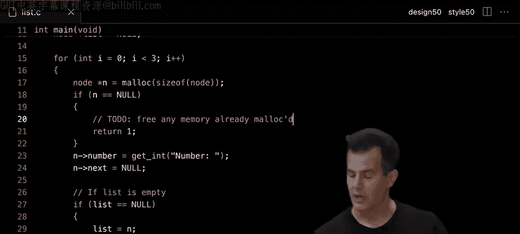

There's the first case where the list is empty， and thankfully， that's actually pretty easy。

 Just plop it at the beginning of the list。

Prepending also relatively easy。 We saw that before。 I can just prepen it to the start of the list。

 app pending is not that hard， but now I'm doing three things。

 So I'm sort of combining all of these past examples into one so I can append it to the end of the list。

 The one piece of code we have't written yet is how do I deal with like inserting the three in between the two and the four without orphaning the four。

 so to speak， Well， let me just reveal how we would do this。

 even though you yourselves won't strictly have to leverage this in your own code。

 Let me go in a moment back to V S code。 and what I'm gonna open up here。

 is another version that I've done in advance， Give me just a moment to copy things over And in this version here。

I'm going to。Open up this version that already has some comments in place just to help guide us。

 So it's almost the same from the start。 whereby in main， I initialize list to equal null。

 I then in my loop， am going to proceed to build a list of size 3， just for the sake of discussion。

 I have the same code as before， whereby I mall one of those nodes。

 Make sure that it's not null before proceeding to get a number from the user and then proactively initializing the next field to be null also。

 So there's no garbage values in this world。 But here is the beginning of those several cases that we just saw pictorially on the screen。

😊，If the list is empty， easy， Pas， I can just set list equal to n as we did earlier。

 So I've pluck that one off。 But notice now I've got an elses if why。 Well。

 if the number I'm trying to insert belongs at the beginning of the list。

 That is if I want to prepen this thing。 Okay， I can steal some code from earlier。

 update this nodes next field to be whatever the current list is pointing at and then change the list to be this new node。

 So that's same logic as before， whereby I want to prepen a node。

 So this is like starting with just the number two， I want I notice that oh。

 shoot one is less than two So I want to put the one there。 Aka prepen。 Allright。

 there's another else here。 And inside of this else is actually a loop with its own conditional。

 And this is again， why I'm not doing this one live。 So else。

 it's got to be at the end of the list or it's gonna be in the middle somewhere depending on what number is inserted。

 So let's start a for loop， whereby we iterate over this whole existing list This one's actually pretty easy。

If we have reached the end of the list， as would be indicated by finding a next pointer equaling null。

 Okay， this one too is fairly straightforward， then change the next field to be the address of this new node and then break out of this mess altogether because we are done。

 This is like in our picture here， having one and two in place and realizing， oh。

4 is bigger than two and one。 So it should be appended to the end of the list。

 It's the middle case that's kind of a headache。 and that's the final flourish here。

If I'm in the middle of the list， what do I want to do？ Well。

 here I'm checking this logically if the current nodes if the new nodes number。

Is less than the next nodes number。 So I kind of have to look ahead to realize， okay。

 I found my location in memory。 I want to change the new nodes next field to point at the current nodes next field。

That's like in this picture here， updating the three to point at the four。And then in code。

 update the current nodes next field to point at N。

 That's like updating the two to point at the three。 And then thankfully， break。

 I can get out of this mess again， because I've handled the fourth and final situation。 So again。

 with time with comfort with practice。 like you too could like write code like this。

 But it really speaks to the complexity of trying to build up a fairly sophisticated data structure correctly in a way that uses all of these building blocks。

 but doesn't run afo of leaking memory orphanning memory。

 And this is why memory is just hard because you have to worry about all of these little details。😊。

Questions then。On any of these particulars。Up until now。Okay。

 I'm happy to say that everything here on out is gonna be much more conceptual and much less code oriented。

 But in the meantime， we have some delicious Halloween candy， and we'll see you in 10。😊。

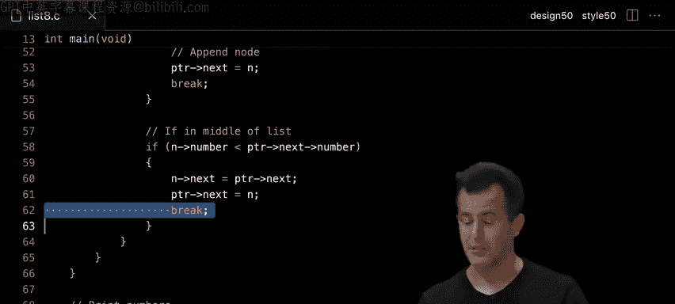

Oh my gosh。That's where it went。All right， so we are back and I admit that like the code that we just wrote to build a linked list。

 absolutely complicated， but representative of how you can indeed stitch things together in memory and build more interesting structures and so here on out today。

 let me propose that if you're at least on board with this idea that with some kind of complicated code。

 but with the building blocks of pointers and the c syntax we've seen。

 you can stitch together data structures in memory as you see fit。

 let's just take for granted then that we could implement the underlying implementation details for the following alternative structures and indeed let's see if now we can draw some inspiration from the world of arrays which we're really appealing now in retrospect because they're simple。

 they're fast， they're contiguous was pretty straightforward way back in week two but let's kind of mash together arrays with this idea of linked list or at least more generally stitching things together because maybe we can kind of get the best of both worlds because arrays recall give us contiguousness that means。

We can potentially do binary search， especially if the data is already sorted。

 but of course we paint ourselves into a corner with arrays because they might not be big enough for future data。

 So then we introduced link list and link list or wonderfully dynamic we can make use very creatively of memory but with the catch with linked list of course is that we're using extra space the code got more complicated So it's sort of the seesaw going back and forth as to what we actually care about Well what turns out that a very common data structure in computing is that known as a tree sort of like a family tree。

 which we've mentioned before， where you sort of have this upside down tree structure where a root is socalled up here and then you might have children and grandchildren and so forth So it sort of grows on the screen top to bottom。

 much like a real tree sort of grows bottom up But a tree as we'll soon see。

 is sort of a twodisional data structure whereas everything we've seen thus far is pretty much one dimensionional like an array is just left to right And even though yeah link list can kind of go up and down and around in memory at the end of the day it's still。

Left to right， linear or one dimensional data structure。 So what if we start to use a second axis。

 So to speak， Well， it turns out there's specifically a type of tree in the world called a binary search tree。

 which is this two dimensional tree like structure that you can actually perform binary search on because we did pay a price to with linked lists。

You can't do binary search on them。 even though you get all the upsides we discussed。

 the flexibility， the dynamism， Why can you not do binary search on link lists， might you think。

Based on how we've drawn them thus far， yeah。Exactly。

 because there are this long string like data structure that you can't just go backwards on。

 I said unless it's a doubly link list， you can't go left and right。

 and there's no mechanism for jumping to the middle。

 right no matter if you have arrows going left or right。

 the only way to get to the middle is to sort of traverse， frankly， the whole thing。

 figure out how long it is then do it again50% as much time to get to the middle。

 So that doesn't seem like very instant constant time access。 So long story short unlink list。

 you cannot do binary search， which means the best we're really gonna do for most of those operations is theygo of n。

 And we do the whole prepending thing and achieve some constant time access。

 but that would seem to get us in trouble by slowing down other operations eventually。 All right。

 So what is a binary search tree。 Well， here's an array as we've seen in the past。

 This one with seven doors， if you will。 But I've deliberately drawn it very one dimensional。

 But let me color code this a little bit。 So is to highlight where the middle is where the middle of the middles are and where the middles of the middles of the middle。

In this case。 So we now have three different colors on the screen here whereby the four was the first middle。

 the two and the six were potentially the left middle or the right middle。 and then the one。

 the three， the5， the7 are similarly in the middle depending on whether you go left or right。

 But I'm gonna draw it this way， because let me propose that this is an array at the moment。

 So we do have the ability to do binary search， but we don't have the ability to grow or let alone shrink this structure。

 But suppose that's a goal。 we'd like this thing to be able to grow and grow and grow and maybe shrink over time。

 Well， what if I redraw this array by using some pointers in memory kind of like this。

 I've just kind of exploded it vertically， so that you can see more clearly that we actually kind of do have like a family tree like structure here。

 if we think of four as the root and two and6 as the children of that root。 and one，3。

5 and as the grandchildren of that root， so to speak。 And in fact。

 if I draw some lines to make this more clear， I indeed think that's what we have now at the moment。

I've drawn things more abstractly。 I'm just using simple squares now。

 I'm not drawing rectangles with numbers and pointers。

 but these arrows do imply that each of these nodes containing a number also contains not even one but two pointers now And in fact。

 that's where we get our second dimension。 supposeuppose that each of these nodes。

 these containers for data contain not just a single pointer but two pointers one for a left child so to speak one for a right child。

 so to speak， that would seem to give us the ability to build this thing up sort of twodimenally in memory and what's the implication of having built this up in this way。

 Well， how much time does it take to search this data structure now， Well。

 I can still do binary search even though pointers are involved because so long as you keep track of the root of the tree always with like one special pointer called root by convention。

 Well， I can decide whether the number five is in this tree by starting at the root And I know that five is obviously larger so I can follow instead of jumping to the middle of the middle。

 I can。ReJust follow the arrow to the right child。 Now， I know five is less than 6。

 so I can just follow the arrow to the left child。 And vo out there is the number 5。

 or maybe it's a dead end in which case 5 might not be there。 but I can implement binary search。

 not even with doing arithmetic like in the case of arrays。

 I can just literally follow these arrow so long as I've built the data structure in this way。 Now。

 how could I do this in code。 Well， here， we're not going to write actual code with the S code。

 but here is how I might implement a data structure for this in memory。 Well。

 I could redefine the notion of a node as being no longer a number and a single pointer to a next field。

 This was how we defined earlier。 a node for a linked list。

 but let's reuse the notion of a node is just container for data。

 and instead build a node for a binary search tree as we've just shown Let me make a little more room vertically there。

 And let me propose that a node in a binary search tree that looks like the colorful picture should have one。

Pointer called left， another pointer called right that are going to literally point to other such nodes。

 And if it's null， that just means you're a leaf of the tree。

 which means you're at the very bottommost level with no additional children。

 So this is indeed exactly how you could build using the same building blocks before break a more complicated two dimensional structure in memory。

 but gain back the ability to use binary search， which means now our running times are back in place。

 such that a data structure like this can finally give us who can finally give us big O of log and running time。

😊，But what's the downside If I'm now pitching this is like you want binary search trees now instead of just as or just link list because you get back binary search。

 but you still have the dynamism， the grow ability of a link list。

 What's the downside of what we've just done， yeah。😡，Yeah， I'm just wasting more and more memory。

 It takes up more memory because I have not one but two pointers now for every node。

 which might be problematic， might not。 It's really a design decision ultimately。

 but I will stipulate that this is very common design when you do have a structure and memory where you do want this kind of ordering to it。

 And you don't want to waste time like we saw with the arrays constantly copying or moving things back and forth around in memory。

 What's nice too about twodial data structures like the binary search tree and binary search tree just means to be clear that you can do binary search on it。

 Why it means that every node's left child is less than the root and every node's right child is greater than the root or equal to technically would be allowed as well。

 And that's， in fact， a recursive definition because why I can apply it here。

 the left child of this node is smaller， The right child of this node is smaller。

 the left child of this node is smaller， The right child sorry meant to say larger before。

 the left child of this node is smaller。 the right child of this node is。Larger。

 so that is true for every node， including the leaves that just happens to have no children。

 So it certainly doesn't violate that same definition。

 So anytime you have this sort of recursive structure， just like the Mario bricks a while back。

 So can you use recursion in code。 So I can show code we're not gonna write code we' not gonna run code。

 but here's code using recursion to search a binary search tree。

 So think of this as the implementation of binary search。

 but on a two dimensional tree structure instead of an array。

 if you pass in a pointer to the tree itself。 So a pointer to the socalled root。

 and you give me a number you're looking for， here is how I could search a twodiional binary search tree that someone else has already built。

 I can first pluck off the easy base case。 if the tree you've handed me as null。

 I'm just gonna return false， obviously the number is in this tree because there is no tree。

 That's easy else， if the number I'm looking for is less than the current nodes own number。

 think about that root。 So it might have been that first number in the tree like numbers。Like。

That's like the number 4。 Think of that as the starting point。

 So if the number we're looking for is less than the roots number。 Well。

 then let's go ahead and search the left sub treee for that same number。

Else if the number we're looking for is greater than the current nodes number。 Well。

 search the right subtree for that same number。 else final case。

 if the number you're looking for equals the number in the tree。 the node that you've been handed。

 then just immediately return true， you found it。 And this is an unnecessary piece of logic。

 that can just be our else condition there。 So just like the phone book back in week 0 where we're dividing and conquering。

 dividing and conquering by splitting thing again and again and again。

 that's literally what we're doing here， even though I'm using search here and here。

 in my search function， aka writing a recursive function。

 every tree I'm passing in is getting smaller and smaller and smaller。

 So if we rewind to the picture it' it's like starting here， and then deciding wait a minute。

 I'm looking for something over here。 So let me just kind of snip that subtree and focus only on this one。

 and then Snip Snip Snip and you're essentially having the size of the tree each time just like we were having the size of the phone book。

😊，So we're already starting to sort of reuse ideas from back there in week 0。 Well。

 what more can we do here。Well， let me propose that with binary search trees。

 we now have the ability to not only gain back binary search， but。

To trip over ourselves again by introducing a new problem。

 Like it seems straightforward that my binary search tree as of a moment ago was beautifully balanced。

 Like this is a nice logarithmic data structure。 And in fact， therein lies the having。

 because you are splitting each node into two children， two children。

 that's like pulling up these nodes much closer to the root than they would be if it was just a long stringy array or a long stringy linked list。

 The height of this tree， In other words， is log base of N where N is the total number of nodes in the structure。

 But I had to go to great lengths in making this slide。

 but also in code if we were to write the code， we'd actually have to jump through some hoops to make sure that when we insert numbers into this structure。

 And when we delete numbers from this structure that everything stays nicely balanced in this way。

 But let's consider sort of a perverse corner case whereby the numbers you insert one after the other just happened to be an unlucky ordering。

 For instance， supposeose I insert the number two first okay。😊，It's the root of the tree。

 Suppose then I insert the number one。 That's easy。 it gets to the left。 Then I insert the number 3。

 I'm getting really， really lucky so far so good。 That would lead to a very balanced tree of log n because everything's nicely balanced。

 But what if it's not that simple， simple。 And indeed we have this perverse case whereby I insert the number1。

 Okay， no big deal it becomes the root。 Okay， the number two。 Okay， no big deal。

 I don't have a third node yet， but that's not problematic。

 But what if the next number I insert is a three。 if I want to maintain the binary search tree property that every nodes left child is less than and every nodes right child is greater than the value in the node。

 I can't put3 here just to keep the thing like that would throw everything off。 So 3 has to go there。

 And in your minds eye continue this logic， I insert 4 and then 5 and then 6。

 just because I get unlucky。 And I get the sequence of numbers or the user being difficult in giving me the worst case scenario。

 What is my binary search effectively。😊，Evolving into。A linked list。

 And so the catch with binary search trees is that even though if they are nicely and beautifully balanced。

 do allow you to do binary search and achieve log based and running log based2 and then running time。

 you have to put in some effort to ensure that it actually does， in fact， stay balanced。

 So in the worst case inserting into a binary search tree could actually be linear because it just gets long and long and long and string would just one perverse branch And you're smart about it。

 And in fact， with that previous picture， you know there's clearly a solution here。

 Like what would you do if this is what your tree was devolving into。 you know。

 I'd kind of get in there and kind of like rotate it around there so that two becomes the new root And then one's a left child3 is the right child。

 But you can kind of imagine from before break like someone's got to implement that code。

 And people have。 and that's actually a discussion for higher level algorithms classes。

 how you can maintain balanced trees。 But it does involve some cleverness。😊。

The pointers and updating things and essentially rotating the tree around。

 if it starts to get too long and stringy。 And so in general， with binary search trees。

 if you do make that optimization and you maintain balance。

 it does not devolve ultimately into big O event， you can ensure that it stays in log event for not only searching but insertion and deletion as well。

 So long as you don't just blindly stick it in， but you kind of rejigger things as needed to keep things nicely balanced。

Okay， questions on this notion of a tree and specifically a binary search tree。

 difference being binary search tree has that special property of left child and right child being less than and greater than。

Repectively。Okay， well， here's another data type， abstract， if you will， known as a dictionary。

 And we've talked about。So another data structure is that of a dictionary and a dictionary is actually something with which we're all familiar with in the human world。

 whether it's an English or any other human language that associates words with definitions。

 you can kind of think of a dictionary as being like this two column chart whereby you've got a word on the left and its definition on the right。

 word definition， word definition turns out that this is actually a wonderfully useful data structure to have access to beyond lists beyond a arrays beyond trees。

 even the ability and code associate words with definitions or more generally what we'll call keys and values is just super useful。

 Why you can implement a phone book as what really is a dictionary。

 instead of thinking of it as a word and a definition。

 think of it as a name and a number and throughout the world。

 There's just such a common need for associating something with something else。

 a dictionary lets you do that As keys with values。

 the keys are very often strings like someone's name， for instance。

 or a word the values are very often also strings or maybe。😊，Numbers。

 phone numbers of the like or even structures like persons that have not just names and numbers。

 but email addresses and student Is and bunches of other information as well。 In fact。

 in a few weeks time， when we focus on databases we return to this paradigm of having keys and values to get at interesting data that we care about Well。

 where do you see these phone books， whether it's physical or virtual in a phone book of course。

 we've got like names， ideally alphabetized by first name or last name and then the value might be John Harvard's。

 for instance， actual number therein。 So dictionaries are sort of everywhere。

 even though you might not in the real world think of them as such。 But indeed。

 if you were to implement a phone book as a dictionary it's sort of like these two columns name and then a number the catch though the appeal of a dictionary really。

 is that you ideally want it to be super fast。 And that was the goal of the phone book too。

 I could either do the linear search one page at a time。

 I could do slightly more intelligently two pages at a time。

 plus an extra step to double back if need be。 But log in as of week0。

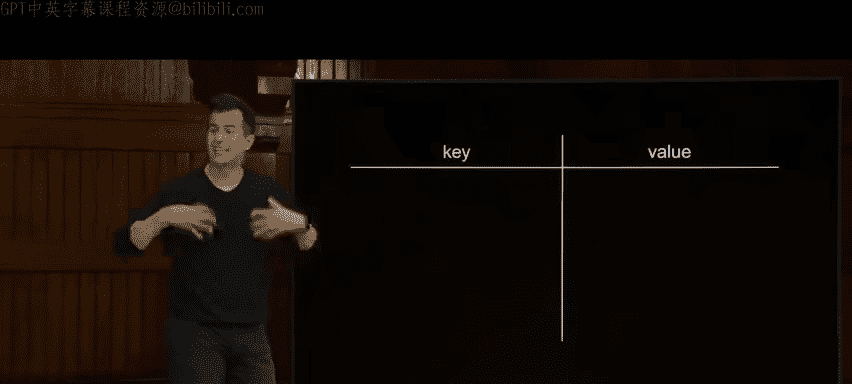

Was like as good as it got when actually searching for information。

 But what if I told you that there's maybe a way to implement this idea of a dictionary。

 otherwise known as an abstract data type that just has keys and values。

 But I could implement it with a data structure and actual data structure that maybe actually gives me constant time。

 Like that's sort of the holy grail of algorithms and data structures。

 Can you build it so cleverly that there's no dependency on N。 you can just get a data super， super。

 fast， constant time。 Maybe not one step。 maybe two or three but super， super fast。

 And that's in fact， where we'll focus for the remainder of today。

 Can we find this holy grail of a data structure and algorithm that gives us constant time access。

 And all we have to play with is time and space and maybe pointers and memory。

 I think we have all of the building blocks thus far。

 So how might we set out on this particular goal to achieve that。

 Well let me give us one new building block or ingredient。 which is this notion of hash。

So hashing relates to what's known as a hash function and a hash function like any function。

 takes input and produces output。 And the idea of a hash function ultimately is that it allows you to decide where some value goes in memory。

 So for instance， here are by design， four buckets on stage for the four suits of a deck of playing cards。

 for instance， So we have the spades， the hearts the clubs and the diamonds here。

 And if you had a deck of cards， like 52 cards here， we got the jumbo version online。

 How much you go about like sorting these in order from like 2，3。

4 on up to Jackque King with the ace either at the top of the bottom， depending on what you prefer。

 How can you go about sorting these， Well， you could kind of just like。😊。

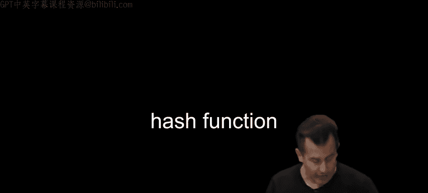

You know， spread them all out and start making a mess of things and figure it out。

 and it takes some number of steps to get through all the cards。 But you know， a lot of us。

 myself included， would probably bucketize the values just to make a big problem the same as like four smaller problems。

 like give me all the hearts， all the diamonds and the other two suits in separate piles and buckets is actually a term of arts in computing to bucketize something means to put it put an input into a location。

 So what do I mean by this。 Well here we have the four of clubs。

 So we'll put this in here the queen of clubs and here8 of spades here And as I do this， of course。

 I'm sort of making the problem smaller and smaller so that at the end of the day。

 it's gonna be easier to sort like 13 of these cards instead of all 52 So here we have the six of diamonds we have a bug。

 So like program would crash。 if you don't actually have a bucket for it。

 So that's sort of an exception。 here we have another two and a 10。

 And even though this is still gonna take me 52 steps。 I bet you。Ted me。

 I could sort four buckets of 13 faster than I could sort one bucket of 52。

 And that's sort of the general idea。 Buetization helps sort of take an infinite a very large domain and map it to a smaller range of values。

 So from 52 possible inputs or 53 into four possible range values。

 So that's actually a building block。 an idea that we can use and hash functions are simply math or code that does exactly that takes as input some value and spits out as output some other value。

 But the key is that you go from a large or an infinite domain。

 Any possible number of inputs to a very well definedfined finite range of values for in this case for instance。

 And it turns out that if you're onboard with this idea of using hash functions。

 code or math functions that take as input this and produces output that we can actually build something that are called hash tables using that And a hash table as we're about to see is essentially like the。

😊，offspring of a of a array and linked list together。 It's somehow a combination of the two。

 So for discussion sake， I'm actually gonna draw an array vertically， which we don't normally do。

 but who really cares。 These are just artist ornditions anyway。 So here's an array with 26 buckets。

 for instance， And suppose that I'm implementing a hash table that I want to ultimately store names of people。

 for instance， So that I can implement a dictionary key value pairs。

 and more' specifically a phone book。 So again， here we see the distinction between a dictionaryaries is this abstract data type that just has keys and values。

 a phone book is a specific example thereof， but a hash table is one way to implement a dictionary。

 Another way to implement a dictionary would just be a really long array and you just put all the names and numbers in one long array or you use a linked list。

 and you put all the names and numbers in one long list。 The downside of those， of course。

 is that maybe it's big O of N。 maybe it's big big log n， maybe it's big O of N。

But I'm talking about constant time now。 I'm trying to take a step toward a data structure that maybe somehow leverages the best of both worlds。

s and linked lists and gets me closer to constant time。

 Con time using hashing is one technique to get there。 So here are 26 buckets drawn vertically。

 And let me propose that this location 0 represents the letter A。

 this location 25 represents the letter Z。 So depending on someone's name。

 they're going end up over here over here or somewhere in between。

 think that's not all that that's not all that new。 but it's an incarnation of bucketization。

 instead of four buckets， I've got 26 buckets。 And I'm going to use a person's name as input specifically the first letter of their name as input。

 So how might this work。 Well， here I've numbered them for the sake of discussion。

 Now let's morely use their asking letters that correspond a through Z。

 And suppose now that once you're on board with that model。

 I want to insert someone like Mario into this。 Well， I think I'm gonna put this at location 0，1，2，3。

4，5，6。

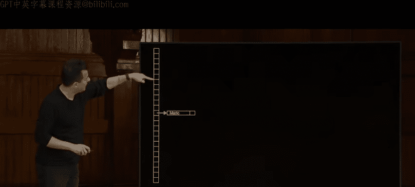

7，8，9，1011，12， even though it's the 13th letter。 it's 0 index。

 So Mario with an M ends up in this bucket here。 so to speak more specifically in this array location。

 Everything else for the moment is an all。 Then maybe we insert Luigi。 Well， L comes before M。

 So Luigi goes in this location 11 here instead， Maybe then we have Pach who goes in this location here because her name starts with P instead。

 So this actually seems like a great system so far。

 we've got Mario Luigi Peach and maybe all the other Nintendo characters in here， ultimately。

 how many steps does it take to look someone up， It's already constant time。

 Because if you give me Mario， I just know， okay， I can do the ASi value trick that we did weeks ago。

 that's 12 boom， I can jump in an array with constant time to a specific location just using square brackets。

 You give me Luigi。 I figure out boom。 There's Luigi Peach P got it。 There's her number。 So already。

 I seem to have a system because I'm hashing on。😊，The suit of a card。

 but the first letter in a name that's given to me as a string is input。

 I can find you that name and presumably number in constant time。But this is gonna mess up quickly。

 especially if you're an Nintendo fan。 What could go wrong with this model with 26 buckets like this。

 yeah。Yeah， I mean， what's gonna happen as soon as I have two characters whose names start with the same letter in the Nintendo universe。

 This is eventually surely going to happen。 So far I've gotten luck with all of these other characters。

 But I do think indeed before long， I'm going have what we're gonna call collisions whereby here2 L names somehow collide。

 And I need to deal with this in some way。 Now， one way to deal with a collision in this sense was。

 okay， I want to put it here。 okay Mario's space is taken up。

 I can put it where the n names would end up going。 but that's a little stupid。

 because now I'm just gonna make a mess of things eventually if I just resort to randomness or first available spot。

 And I'm definitely not gonna get constant time。 That's gonna quickly devolve into linear time because it might be all the way down here。

 if that was the first available spot。 But what I could do if I keep going link， for instance。

 just added in。 No pun intended， I could kind of link all of the similarly named names together using a linked list here。

 And so this is why I say hash table is like an。Of linked lists， because here's the array。

 It's kind of like your quick cheat sheet， your buckets for getting into some of the data quickly。

 But then if you do have collisions。 Okay okay， let's deal with it by just having any linked list that can dynamically grow and even shrink as you add or delete people from this address book here why linked list while I could use an array。

 I could use a massive twodimenional array， But in your mind's eye。

 you could just imagine how much space you're wasting if you're prelocating 26 times 26 locations here or something like that fill just to have enough room from the get go for these names。

 let me go ahead and add a whole bunch of others from the Nintendo universe。

 Cols are actually gonna to happen pretty commonly。

 And there's actually this principle and statistics known as the birthday problem whereby if we surveyed everyone's birthday in this room essentially with a small number of people in the room。

 we would have very high probability of collisions。 And so here too。

 even if you don't recognize some of these names pretty quickly。

 do you end up having collisions in a world where you're just looking。For instance。

 the first letter in someone's name。 So unfortunately， this is not a great outcome。 why。

 because imagine the perversion of this scenario。 supposeuppose that we get really unlucky and every darn name in this world starts with L。

 Well， it doesn't matter that you have this array， and it doesn't matter that you're calling it a hash table at the end of the day。

 this algorithm for a hash table could still reduce to。

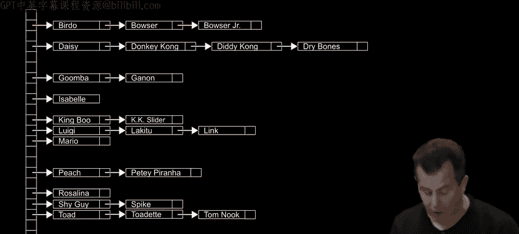

They go of n because in the most perverse case， all N names are in the same bucket and the linked list at that location。

 So who really cares that you're calling it a hash table。 You're not using 25， for instance。

 of the locations。

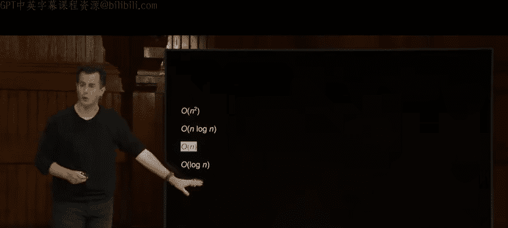

But that's sort of a theoretical risk。 Is that really going to happen in practice。 Now。

 definitely with Nintendo， there's a lot of collisions here。

 But that's because my hash function is actually pretty naive。

 I chose a fairly simplistic hash function， but maybe I could be a little more clever about that。

 And in code， I could take into account more than just the first letter。 So for instance。

 if I want to get closer to this holy grail of constant time access。

 Let's just think a little harder and implement this data structure a little more intelligently。

 Well， first and foremost， it doesn't take that much effort to implement the code for this here again。

 as we've seen for a couple of weeks now， is how you might implement a structure for a person， Well。

 how might we go about implementing a hash table using type def and struck and pointers as we've now seen。

 Well， I would propose that we could implement a node for people as having a name and a number just like always。

 but also a pointer to the next one。 So in the picture you saw earlier where we had Mario and Luigi and Peach of。

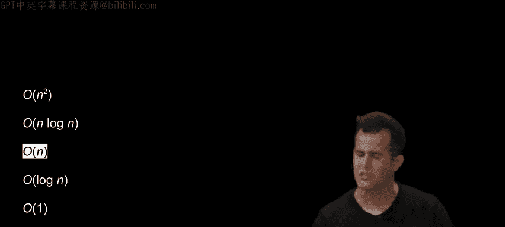

Was this rectangle as I drew it。 you can think of each of those rectangles as a person structure。

 But in addition to having a name and somewhere in there a number。

 there was also a little bit of space left over for the next pointer to someone else whose name starts with the same letter。

 So implementing this in code is actually not all that hard。 And in fact。

 if you want to have a hash table of size 26 no big deal。

 just say you want a table or whatever you want to call this thing of 26 node pointers In other words。

 that vertical that I drew had 26 locations， each of those was initially null I propose because the hash table was empty but it was really a list it was an array of 26 pointers because each of those could be the pointer to the beginning of a linked list。

 So this is how you can implement a hash table and code sort of one line at at least at a glance。

 you still need all of the functions to insert and delete and so forth。

 but this would really just be a hash table using all of the same ideas as in recent weeks。

But what if we get a little smarter indeed about the hash function。

 So here's how we describe problem solving all this time。

 A hash function is just sort of the algorithm in the middle in this story。

 So if we input Mario as input， the output should be 12。 If we input Luigi as input。

 the output should be 11 and so forth， But if that's the problem。

 we keep returning 12 and 11 and other such numbers a lot。 Well。

 let's not look at the first letter alone， why don't we look at the first two。

 the first three letters。 And I bet probabilistically。

 we can drive down the probability of these collisions。

 because there's not that many people whose names in the Nintendo universe start with L A K or L I N or L U I。

 that really lowers the probability of collisions。

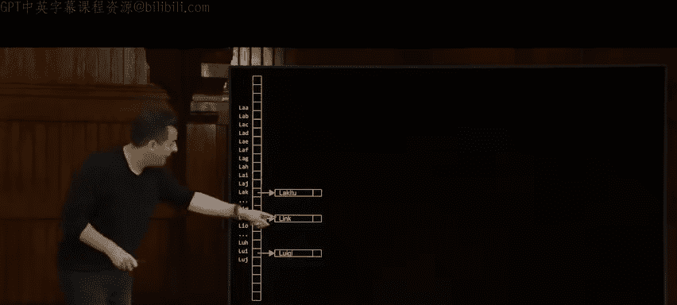

By increasing in this way， the number of buckets。 and I haven't even drawn them all dot dot do just means there's other combinations。

 permutations of English letters there， but I can just increase the number of buckets instead of four。

 instead of 26， I could actually increase it to 17000 plus if I do it in this way。

 looking at the first three letters that would seem to really。

 really help It doesn't make the code all that more complicated here， for instance。

 is how you might implement in C， pretty simple， if naive hash function， given a word aka a string。

 you want to return an integer like 0 or1 or two or 11 or 12 or so forth。

 So we've seen two upper before in the C type library just look at the first letter and word convert it to uppercase just so the math is simple。

 subtract capital a， which we know is already 65。 And this function as is will always return a number from 0 to 25。

 So you could imagine in we won't do it on the screen。

 but you could imagine just maybe looking at word 0 and word 1 and word 2 and doing some similar。

And returning a number between 0 and roughly 17000 instead to get back a much larger data。

 much larger hash table instead， What's the downside there。

 Because I'm proposing that the code's not that hard。 It's like a couple extra lines。

What's the downside of having a bigger hash table wherein much less likely to have collisions， but。

A little louder yeah。You're reserving much more space upfront。 In fact。

 the dot dot dots on the screen were really because I didn't want to draw a microscopic array with 17000 locations。

 which most of which are not actually gonna to get used。 You start wasting space at that point。

 and it becomes a little silly because in the moral world of Nintendo。

 it's probably a pretty sparse universe so to speak。

 whereby you don't have any names to my knowledge that start with A A A let alone A A B or A A or B。

 I mean， there's thousands of permutations that just are not going to be useful。

 So that maybe isn't the best solution instead， As an aside。

 you'll see too in problem set 5 that you might want to hash on an input value like word。

 which you can maintain， do I want to say this As an aside。

 you can also specify that these inputs are constant because as an optimization。

 you know that the words coming in are not going to change。And as an aside。

 let me propose that with an actual hash function， if you know the array is zero indexed。

 you don't need to even return an in。 you might as well return an unsigned value so that it's0 on up。

 no negative sign， which would be an optimization here。

 but that still doesn't change the fundamental reality that adding more complexity beyond this is going to certainly increase。

 it would seem the amount of memory that we actually use。

 So maybe the fundamental problem is that just looking naively at the first letter in someone's name。

 is maybe not the best solution anyway。 And in fact， the risk of disappointing the whole hash table。

 even when we use three letters of a person's name， you know。

 technically speaking theoretically speaking， it is still。Big O of n。

 because even though it's unlikely you could imagine a perverse scenario where all of the names you insert somehow start with the same first three letters。

 There's no guarantee in this model that you're going to avoid that。

 What then is the appeal of a hash table to begin with。 Well。

 if you've got 26 buckets or heck 17000 buckets， let's call it K as a constant， Well， really。

 if we get into the weeds， you know， if you have a uniform distribution of inputs。

 that is to say if you have a bunch of random names that are not all perversely starting with the same letters。

 you know， technically， those linked lists that I described as coming out of the array。

 are going be probably on average n divided by K， because if you've got K buckets， again。

 whether it's4 or 26 or 17000 on average， hopefully each of those linked list。

 a chains it's going be n divided by K。 Now， we know from our discussion of big O in the past if you have a constant value。

 like a number or lower order term， like who cares， that's still really big O of n， but。

Here is now in week 5， where we see kind of a dichotomy between the theoretical running time of an algorithm and the actual wall clock time of an algorithm。

 Like the reality is， if you take the size of your data and divide by 26， let alone 17000。

 it is going to be way faster。 if you look at the clock on the wall or the time on your wrist。

 then it would be if it were actually running in n steps alone。 So yes， hash tables technically。

 are in n divided by K， which is really just big O of N， but in practice， if you are smart。

 And if you are clever about the hash function you use and ideally use something that's more clever。

 than just looking at the first letter， you can probably create in the best case in ideal hash function。

 that somehow magically， it would seem ensures that you never have collisions。

 because if you can find that ideal hash function， or at least a really good hash function。

 the probability of collisions is probably going to be so low that even if occasionally the thing devolves。

😊。

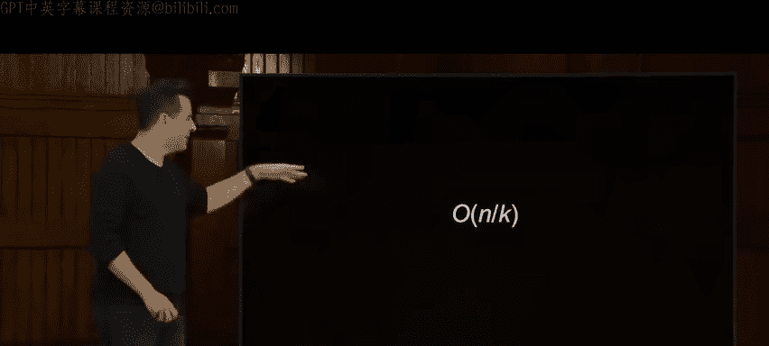

To linear time， most of the time， it's going to be indeed constant time， A K， A big O of one。

So in short， hash tables， not really constant time， but with a good hash function。

 they can be pretty darn close to constant time。 But there's one final data structure we thought we'd introduce today。

 This one pictorially for the most part。 And that's known as a try。

 which is somehow short for retrieval， even though that's pronounced somewhat differently。

 But try just means it's a data structure for retrieving data。

 It is an alternative data structure via which again， we can implement dictionaries， key value pairs。

 And to be clear， again， you can implement a dictionary with an array， a linked list。

 now a hash table now a try as well。 But we get different running times based on those various structures。

 So a try is a tree。😊。

Of arrays you can think of it as。 So frankly， all we're doing now is just kind of mashing together things we've already talked about and seeing what kind of weird Frankenstein data structure we come up with。

 But in this case， it's actually gonna give us， I think true constant time。 But with a downside。

 So here's the beginning of a try。 and a try is indeed a tree of arrays。

 And each of those arrays represents a letter of the alphabet typically a through Z。

 So let me stipulate there's 26 boxes here written horizontally because I just wanted to fit on the screen more like a typical array。

 And the way you use the arrays in a try， is to have an array of pointers And if the person's name starts with a。

 you sort of use one of those pointers to point at another node。

 which is just another array for the second letter。 And then a third array for the third letter。

 a fourth array for the fourth letter。 And essentially。

 you use arrays for each of the letters in your input strings。 So what do I mean by that。 Well。

 here might be that array of size 20。😊，6， A through Z。

 supposeuppose that we want to insert like toadt into this data structure， initially。

 or maybe shorter toad。 for instance， one of the characters from Nintendo。

 So here is T location here And I've just highlighted it because if I have a word that starts with T I'm gonna actually change this null value to be a pointer to another array。

 And that second array shall be used to represent the second letter in this person's name like oh。

 and that letter is going to map to another array whereby this location A in toad points to finally a fourth array whereby now at the de location。

 we have some kind of sentinel value， some kind of variable that says x marks the spot。

 a name ends here。 So there's a way to do that in memory。😊。

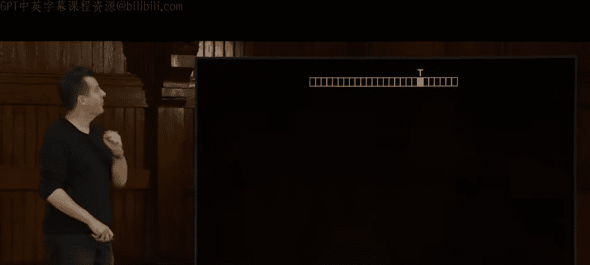

But we're using four arrays， one for each letter to map out the person's name。 But we can go further。

 Suppose that there's another character in this universe like Tot。

 which is a super string of this string。 So it's a longer version thereof， that's fine。

 We can just add a pointer from the de location to another array。

 Then from that arrays E location to another array。 Then from that T location to another array。

 and from that that array， E from that， sorry， from that arrays T location to a final array， E。😊。

So in other words， each of these arrays is just an array of 26 pointers or really 26 structures of some sort。

 And somehow in green， we're just indicating that a name ends here and with the E a name ends here。

 And we can do this again， if we have Tom， for instance， as a third name。

 we don't need any of these arrays， we can actually encapsulate T OM in the first three of those arrays。

 Now， suffice it to say， this is a lot of arrays。 But what have we gained。 Well。

 if you imagine this data structure getting crazy large with lots and lots of names and lots and lots of arrays inside of it。

 it turns out that the amount of time required to look up someone's name or to insert someone's name has no dependency on how many names are already in the structure。

 case in point， when I added Tom a moment ago， there was all of this bulk in the data structure already。

 but we didn't have to traverse any of that， because we just go T OM and we don't depend on how big the data structure already is。

 It does not depend on N。Technically， how much time does it take to insert or to delete or to search for someone's name in this。

 it would seem to depend only on the length of the person's name。 So T0 A D， E， T， T E。

 So I think that is 8 steps total for finding to at4 steps total for finding toad  three steps total for finding time。

 those are really small numbers。 And if you imagine there are surely some upper bound on how many characters are in the longest name in the world。

 I don't know if it's like 10 or 20 or 50 or whatever， but it is finite。

 it has nothing to do with the total number of words in in this tree。

 And so the implication then is that the amount of time it takes to search for to insert to delete and a name in a try is by definition。

 constant time， big O of1， maybe it's big O of2， maybe it's big O of 50。

 but it's not dependent on n because as massive as this structure gets1，2，3。2，3，4，1，2，3，4，5，6，7，8。

 That's all the steps it takes to find any of those names。

 It's dependent only on the length of the name itself， which which has some kind of upper bound。

 So how might we implement this， there's this is probably the most common way。

 we just redefine a node in the world of tries to now be a structure like this that contains one in array of 26 more pointers。

 of which points to a node， And then we need some other value。

 I'm calling it cha star number because I want this try to be storing people's names implicitly and numbers explicitly。

 So if I want to store something like plus 1，9，4，9，4，6，5，2，7，5，0。 like John Harvard's number。

 I just gonna store it as a string inside of this same structure。 So a moment ago。

 when I had the little green dots， the green dots in the array just meant that this string is not an null。

 It's someone's actual number， which means if you see a non null number， well， there's toad's number。

 There's toadette's number。 There's Tom's number instead。

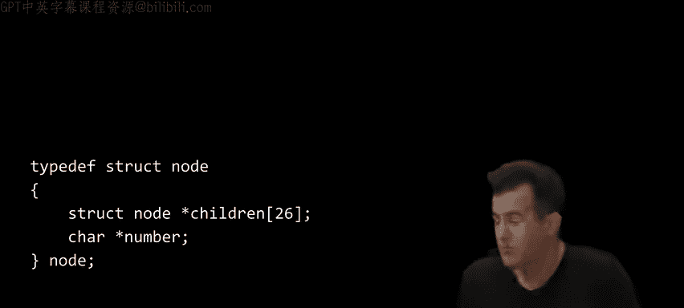

This is a sufficient data structure to implement that notion of a try。 All we need， of course。

 is one pointer to the root of the whole darn thing。And so ultimately， like we found our holy grail。

 like tries are， by definition， constant time， because no matter how big the data structure gets。

 there's no dependency on how many elements are already inside of it。

 It has no effect on the running time per se。

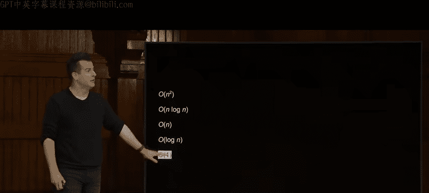

But it must come at a cost。 What's the trade off then for a try。Space， what， what space。Re store。

Yeah， the space to store all of those arrays。 This is like the logical extension of not using three letters of a person's name。

 but every letter of a person's name and the math there just means a massive amount of memory。

 because you need an array for every possible letter of the alphabet would seem。

 even if most of those letters are not actually used。

 because there's just no name that needs those particular letters。

 So by significantly using more memory or space， you can significantly decrease time。 And so that。

 too is potentially a tradeoff you may or may not want to make。

 So today was ultimately about introducing a bit more complexity。

 the last of our complexity and C and these building blocks of pointers and memory to sort of stitch these things together。

 And I'll stipulate ultimately that the kinds of data structures we've talked about today。

 whether it's cues and stacks at the beginning or linked lists in some form or dictionaries。

 keyvalue pairs， phone bookss and the like， there're sort of everywhere。

 And even hash tables you can find in like Harvard Square or in New haven as well。 For instance。

 this is a photograph from this morning。😊。

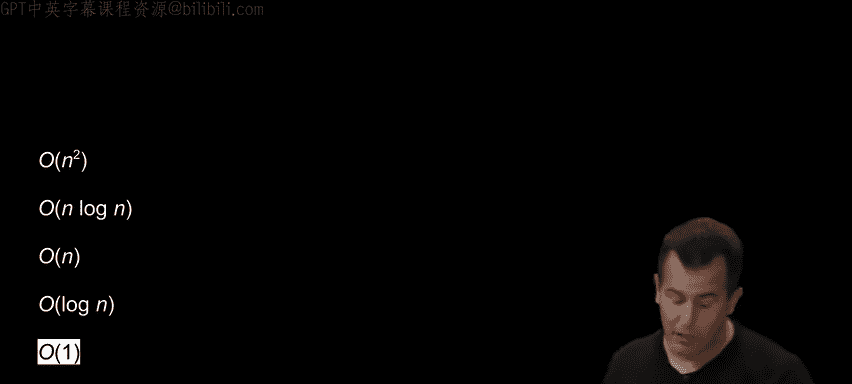

Of a certain takeaway restaurant with which some of you might be familiar。

 Anyone know what place we're looking at。Sweet green， So sweet green。

 a little salad shop in Harvard Square。 What are you looking at， Like。

 this is a photograph of the shelves they use to distribute salads when you order them in advance online。

 But what really is this。😊，Like， all your friends will be very impressed that you now see。

Hash tables everywhere， right， This is effectively a hash table。 Y。

 because when someone has a salad with their name on it that came out of the computer。

 they're gonna put it in a specific location。 This is location A through E。

 This is F through J K through N O through Z。 And so they're hashing it to one of these four locations。

 not unlike one of these four buckets。 Of course， here。

 they're not using really an array of linked lists that can grow endlessly。

 This is actually sort of like an array of arrays。 because I can only imagine storing like so many salads on the shelf。

 And just imagine， I'm sure this happens during the busiest times。 if you go in it like 12。

30 PM and lots of online orders have come in。 If they run out of space， for instance。

 in the a through E section。 Where do they probably put the next salad。

 Even if that person's name starts with a through E。😊，You know， maybe over here， maybe over here。

 like to my point earlier， you can kind of just plop things anywhere。 And so the real world。

 like this data structure might indeed devolve。 But I do dare say after today。

 you'll start to see hash tables and trees and tries and all of these structures in different places。

 And hopefully what we've given you now in a C， S class is sort of a mental model for the upsides and downsides of these structures。

 But also the technical skills with which you too can build them virtually as well。

 That's it for today。 And we'll see you for Python next。

