# 哈佛大学《计算机科学导论｜CS50 introduction to computer science 2025 Fall》 - P11：CS50 Fall 2025 - Lecture 9 - Flask.zh_en - GPT中英字幕课程资源 - BV1S8sFzFEt7

All right， this is C S 50。 This is already week 9。 and I dare say this week is the most representative of what you'll be doing after the class。

 if you so choose to program in the future and tackle some project that's new to you in fact the closest to this week was perhaps week 6 wherein we didn't really introduce all that many new concepts but really translated them from C and to Python and so this week in particular the goal is to really synthesize the past 10 weeks of class drawing upon a lot of the building blocks that are hopefully now metaphorically in your toolbox and gives you an opportunity now to apply those ideas to new problems in particular。

 web programming。 So every day you and I are using the web in some form。

 every you and I are using mobile apps in some form and we said last week that the languages underlying a lot of those applications or HTMLl and ja for the layout and aesthetics and then also in part jascript for a lot of the client side interactivity that you might experience nowadays Well today we come full circle and bring back a server side component whereby we again write some。

Pon will again write some SQL code and use it to make our fullfledged own web applications。

 And in turn， if you so choose mobile applications as for your final project as well。

 So up until now， when we did anything with the web ran this command last week HP server。

 which literally did just that it's fond a so calledled HP server that is a web server whose purpose in life is just a serve up content from like your current folder。

 any files therein any folders there And so all of the URLs generally followed a certain format。

 So if your URL were example co recall justote the root of the web server And so in there typically by default you would see a directory index。

 we'll see today that that goes away because generally when you something co you want to see the actual website not the contents of everything in the server So we'll see how to address that but the URLs up until now form like file html literally referencing a file in that folder or folder which just means whatever is inside of that folder or folder hl or。

😊，you can nest these things however long that you want and recall that more generally。

 we said that you're referring to some kind of path on the server where path is a step of folders ending in perhaps a file name。

 So today we're gonna generalize that at least in terms of nomenclature and start talking more about routes because essentially in web programming。

 we are going exercise a lot more control over what is in the URL。

 So back in the day referred to literally a file on the server。 and as recently as week。

 the URL is referred to literally a file on the server。 However。

 we'll see in code that we can actually just parse this that is analyze what is after the domain name in a URL and just use this as generic input to the server to figure out kind output to produce。

 we're going see the same convention though if you want to pass in specific parameters。

 key value payers we'll use a question mark after our socalled route key equals value。

 And if there's another one or more， we'll just separate them by ampersss。 And to do all of this。

 we're going to recall the inside。those virtual envelopes recall that if we did something like on Google com to search for cats。

 what was really being sent to the server was a request forlash search。

 which notice is not search html。 there's no folder per se there。

 This is just the name of a program really running on Google servers and that's going be the so-called route that we ourselves start programming today Que mark Q equals cats just meant that the query parameter。

 the input from the web form is going to contain in this particular example the word cats So how we' going to do all do this。

 So we could implement our own web server in C。 It would be a nightmare to use a language as low levelvel as C and actually deal with something as high level is writing code for the web We're instead going to use Python for the most part。

 if only because it's much higher level。 but even then we would probably if we wanted to do this thing from scratch。

 we would have to write a lot of python code to analyze the insides of these envelopes figure out what inputs are being passed to the server and then figure out how to access that in python code。

 It's just a lot of work to just get a web application up。

ingAnd so what the world generally does is they don't reinvent the wheel of writing their own web server rather they use an off the shelflf。

 fairly generic web server or application server as it might be called。 and we， for instance。

 are going to use something called flask。 Now flask is a framework as the world would say or more specifically a micro framework which just means it's a library of code that other people wrote to make it easier for us to implement web applications。

 So they took the time to figure out how to handle get requests on a server postres on a server。

 figure out how to extract key value pairs from URLs。

 the sort of commodity stuff that literally every web application on the internet has to do anyway so we don't have to retrace those steps ourselves。

 What this will allows to do is only implement the problems that we care about by using this framework and to be clear a framework much like bootstrap is not only a library that someone else has written for you。

 but it's like a set of conventions that you follow in order to use the library in their recommended way。

 So it's more of a generic term that includes library and a set of conventions and how do you know。

How to use either you just read the documentation or take a class in which we're about to give you an introduction to some of this right here So instead of running today Http server to start a web server that just serves up static content files and folders in our account we're instead going run the command moving forward flask space run and this is going to look for code that we've written in our current directory and if it is in accordance with the conventions to which I'm alluding by using the so-called framework then it's going to start our web application on some TCP port for instance 8080 as we discussed last week to do this all we have to have in our current folder is minimally a file called app pi by default this is hinting at an application written the language called Python and what code we put in there we'll soon see and then ideally we would have another text file called requirements text by convention inside of which is just one per line the name of all of the libraries that we want this web application to include In other words。

 if I go over here to vS code if I don't have such a file。

that's fine。 But I want to use a framework like flask。

 Re our Pip command for installing Python packages。 I could just say Pip install flask enter。

 and that would go ahead and install the flask framework or library form me。

 just like we did a few weeks ago with installing the silly little cowi library as well。

 I've already done that in advance and better still I've installed I've come with my code today。

 both of these files， app and requirements text and in fact。

 if I go ahead and create one just for fun here all you need do in a requirements text file is literally put the name of the library that you want to include and then you run Pip in a slightly different way to install that library or any other libraries that are in that file as well。

 So let me wave my hands at the requirements text for moving forward。

 it just means what libraries do you want to use with this web application so you don't have to remember or memorize them and type them all out manually。

 All right so what's gonna go inside of app dot pi。 Well。

 the minimal amount of code that we can write to make our own web application that does something like print。

Hello world to my browser could look like this。 Now there's a bit of new syntax here。

 but not all that much today moving forward。 The very first line just says from flask import flask。

 which is a weird way of just saying give me access to the flask library capitalization no matters。

 And so the package that we're using is called flask lowercase but we want to have access to a special function in there called flask capital F。

 So theres sort of a copy paste line。 The next one's a little weird looking。

 but it essentially says give me a variable called app and turn this file into a flask application。

 we haven't seen this in a few weeks。 but there was that weird if conditional that we put it the bottom of some of our python code a few weeks back that just said ift dot dot and it mentioned in their name if name equals equals underscore underscore main underscore underscore。

 So we've seen an illusion to name for our purposes name just refers to whatever the name of this file here is no matter what I call it you can sort of access the current file by way of this special global variable。

 So this line collectively。Means turn this file into a flask application and store the result in a variable called app so I can now do stuff with flask。

 And what am I going do Well， down here， let me first point out a familiar syntax。

 I'm defining a function that I called index by convention but I could have called it anything I want Who sole purpose in life is just a return quote unquote hello world。

 which is the super simple output this web app is going display。 but and this is the new syntax。

 I'm using here， whichs generally called a python decorator。

 which is a type of function that essentially affects the behavior of the function right after it。

 So by saying at app route quote unquote slash this is telling the flask framework associate this index function with this route。

 the single forward slash and that's how we're gonna take over the default behavior of the slash portion of the URL by telling it to return whatever this function returns and we'll see this in action now。

 So let me go。Over here， say to VS code。 and within VS code。

 I'm gonna whip up exactly that application in a file called app dot pi just so as to confine this in some subsequent examples maybe the same folder。

 I'm gonna first create a directory or folder called hello。 I'm going go into that hello folder。

 I'm going to go ahead and recreate that same requirements file just for good measure。

 to tell the world that I want to use the flask library here。

 And then I'm additionally going create now app dot pi。 And I'll type this fairly quickly。

 But I'm just reciting what we saw a moment ago。 from the flask package， import the flask function。

 lowercase F capital F respectively。 then give me a variable called app said it equal to that function call passing in the name of this file。

 whatever it actually is。 And then lastly， let's go ahead and call at app dot route。

 quote unquote slash， which says， hey， Python whatever the next function is associate it with this slash route。

 And so I'm going to define that function。 I can call it anything I want。😊，Or bar or B。

 But insofar as slash represents the index of the website like the default page。

 I'm just gonna go ahead and call it by convention index。 and then return for now， hello comma world。

 and that's it。 So whereas is last week when I was writing code in Hml files。 I was making web pages。

 Now I've created what we'll call a web application。

 And it's an application in the sense that there's actually some logic going on there。

 Theres some functions。 There could be some conditionals。

 There's clearly a variable there could be loops and all of the sort of stuff we've seen in scratch and see and Python as well。

 We'll now see back in this python file。 So how do we now run this。 Well。

 let me go back into my terminal window here。 I'll clear it just for good measure。

 I'm gonna go ahead and run flask run enter。 I'm gonna see some cryptic looking output。

 but there's that familiar pop up with the green button that wants to open up this application Where HtP server uses8080 by default。

 Flask uses port 5000 by default。 And here we have it。 I've just opened。😊。

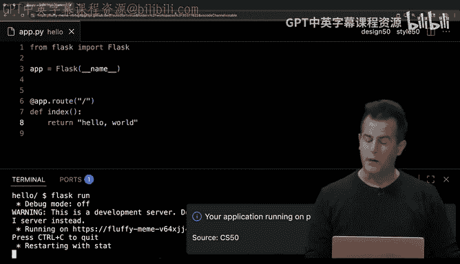

My second tab。 And we spent a lot of time there last week。 This is the server I'm running。

 not on port 8080， but on port 5000 today。 And there is the contents of what was spit out by my very first application。

 Now， even though the browser is rendering this like it is a web page， notice this。

 if I inspect if I right click or control， click anywhere on the screen and go to view page source。

 you'll see that there's no actual Hl in this page， it's literally a single line of text。

 hello comm world。 if I close that and right click or control click again and go to inspect like we did last week to open up developer tools。

 you'll see that the browser has actually filled in some blanks here for me by just rendering as it should。

 the minimal possible web page。 But the content I actually sent to the web browser is only literally hello comm world。

 So how can I actually send a web page of my own， rather than letting the browser do something like this。

 Well， I could go ahead and。😊。

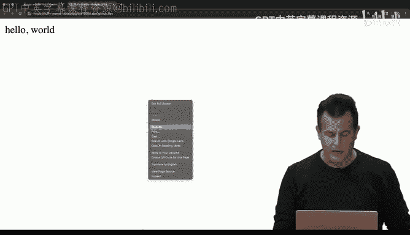

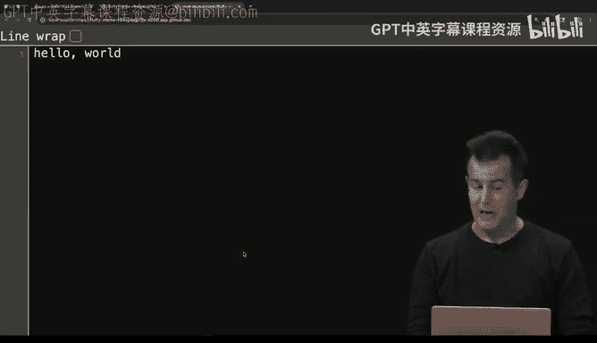

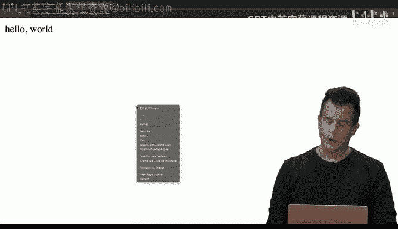

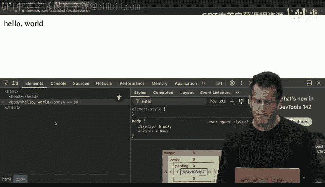

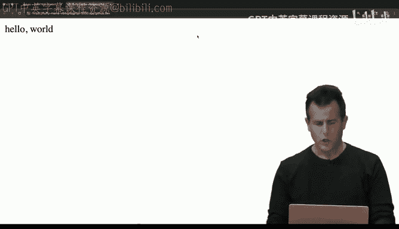

Close that and go back to my application。 I'm gonna go ahead now and hide the terminal just because the server is still running。

 And what I'm gonna go ahead and do here is， well， nothing's really stopping me from returning not just a string of text。

 but a string of Html。 And this might not look pretty。

 But let me go ahead and do open bracket doc type H Tml close bracket。 then H Tml。

 then head then title and I'll just title this for instance， hello to keep it simple backlash title。

 backlash head， open bracket body hello comma world， backslash body， backlash Htl close quotes。

 And I use single quotes in this case， but I could have just as easily used double quotes。

 but that's a fullfledged web page。 like that's the minimal amount of content we saw last week actually。

 you know what， for good measure。 let's actually add lang equals unquote E。

 So it's actually fortuitous that you use single quotes because now I have some double quotes inside。

 And even though this is not pretty printed。 It's just one massive mouthful of Htl all along one line。

 When I now go back to the browser reload the page。

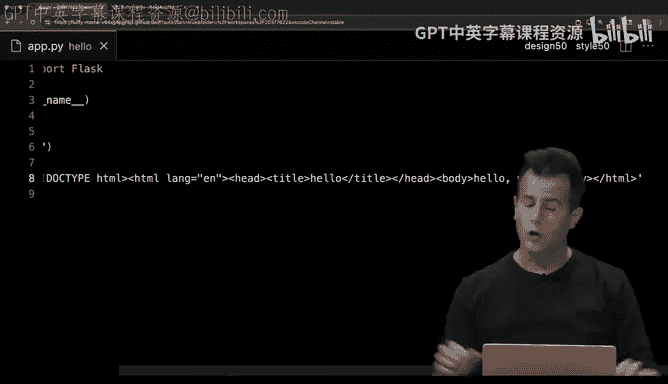

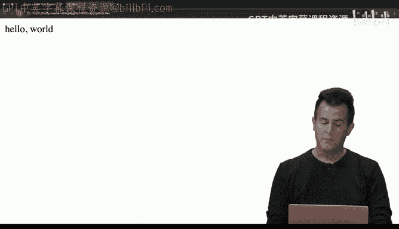

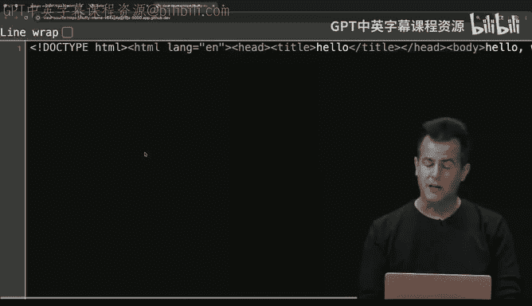

By clicking here and then view page source again， here's what my browser received this time。 Indeed。

 it's the fullfledged HTMLM。 And in fact， if I close that tab and reopen developer tools by inspectpect。

 now we'll see in the tab absolutely everything that I sent over。

 including a title including the la equals the N。 and had I typed even more。

 we would have seen that too。

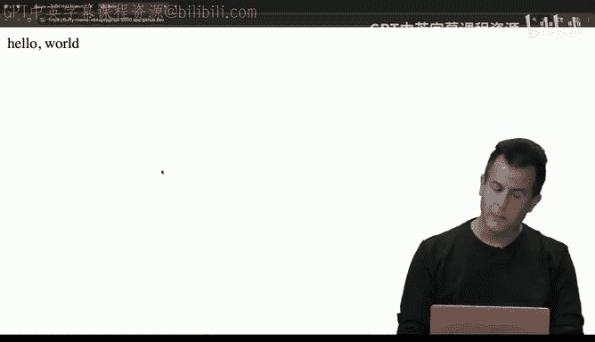

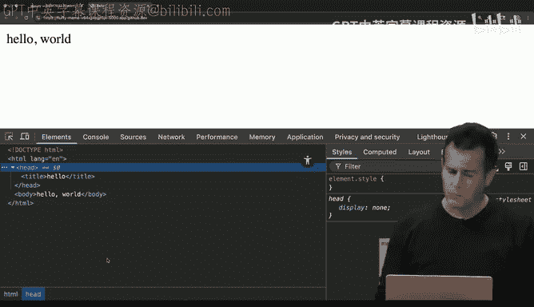

Allright， so what was the point of this exercise。 It feels as though that I've really just taken more time。

 added more complexity to achieve literally what I could have done last week by just creating index do Html myself without any python code。

 But I dare say what we're trying to do is lay the foundation for a fullfledged interactive website that maybe has forms that we can submit to the application that allows us to generate not just one page。

 but maybe two or three or any number。 So what you're seeing here is sort of the beginning of Google do com search application or Gmail do com itself or Facebook do com or any web application you can think of begins with a little code that theoretically looks a little something like this。

 But this is kind of stupid to put HTMLl hard coded no lesson。

 one long string here inside of my application let's try to factor this out。

 That was a lesson we preached last week about sort of factoring out our jascript factoring out our CSS we can do the same thing with our actual Hml here。

 And so what I'm actually going do is import not only the flask。😊。

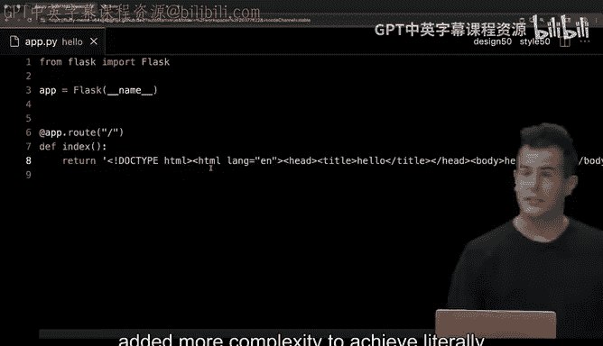

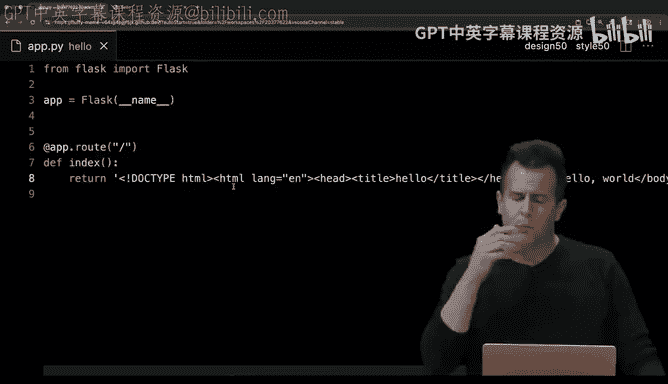

Function， but also another function that per its documentation comes with flask called render template with an underscore in between。

 This is a function whose purpose in life is to render a template。 So to speak of Hl。

 We'll see what we mean by template in just a bit。 But down here。

 what I'm gonna do is now delete all of that code。 And let me just assume that I'm gonna put that same code in a file called index dot Hl。

 just like I did last week。 So let's instead return the return value of render template of quote unqu index do H Tml。

 Now that file does not yet exist。 indeed， if I go into my terminal window， create a second terminal。

 just so I can leave the server running， but still see what's going on。

 I'm gonna C into that same hello directory type L S to list my files。

 and I only see app in requirements text。 But it turns out per flasks documentation。

 if you want to create your own Hl files。 you simply have to add directory that by convention is called templates。

 And that's it。 So in addition to app requirements text。 I need a。😊，Call templates。

 So let's go back into V S code。 make templates。 capitalization matters。 All lowercase。 Now。

 let me go ahead and C D into templates and run the code command and create a file called index dot Hl in the templates folder。

 and then super quickly。 Let me hide this。 Let me whip up that same page again。 doc type H Tm L。

 H Tml Lng equals E N， close bracket head， close bracket title， close bracket hello。

 and then down here， body closed bracket， hellello comm world。

 So autocomplete is helping me type quickly。 But now I have a file with my Hml that this application I claim is gonna spit out automatically for me。

 So let's see the effect。 Let me go back into my other browser tab。 Let me close the developer tools。

 And let me quite simply just click reload。😊。

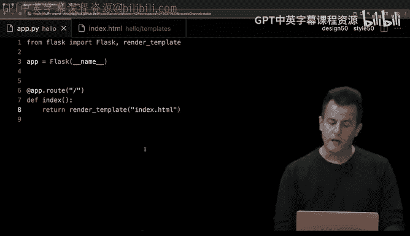

And no apparent change。 It's working exactly as it did before。

 But I've laid the foundation for making a much more useful layout of my file so that I can actually keep my logic。

 My Python code and my Hm L a bit separate from that。 Allright， Well。

 how can we make this into something even more interesting。 Well。

 let's start to take some actual user input for instance。

 So wouldn't it be nice if I could pass in via the URL， something like Q equals cat。

 but maybe something like name equals David or name equals Kelly。

 and actually see the name that's being outputed。 In other words， let me zoom in up here。

 And let me pretend like this happened automatically。

 let me do question mark name equals David enter。 Well， it would be nice if I saw hello comma David。

 I'll propose， rather than just hello comm world。 So how do I actually get access to everything after the question mark。

 Well， here is where framework like flask and any number of alternative starts to shine。

 It gives me that answer automatically。😊。

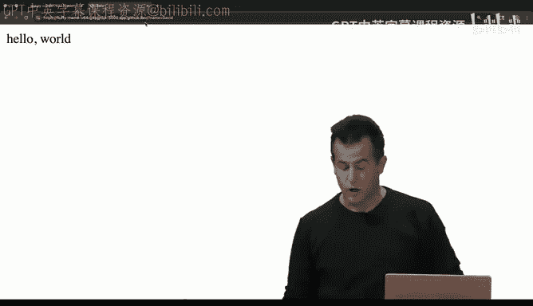

And so it turns out in flask， once you've used it， you have access to a special global variable as we'll call it called request dot org。

 where as just means the arguments or the parameters that were passed in to this H TtP request。

 So how do we use this。 Well， let me go back to VS code here。

 And at the very top line in addition to importing flask capital F render template。

 Let's also import request， which is a global variable that comes with the flask framework。

 And then I'm going to use it。As follows， I'm gonna go ahead and say。

A second argument to the render template function， where I'm gonna say placeholder equals request。

 Actually， let me not do that yet。 Let me first create a variable。 name equals request dot ors。

 And then let me go ahead and get the name。Key from the arguments。 And then down here。

 let's go ahead and pass in placeholder equals name。 So what am I doing here on line 8。

 I'm creating a variable called name。 I'm storing in that the value that's in the request global variable in what's apparently a dictionary called Args。

 specifically the name key therein。 So if the thing after the question mark name equals is David。

 this should give me David。 if it's Kelly， it should give me Kelly instead。

 Then what I'm doing is rendering this template called index do Hl。

 but I'm additionally passing in some named parameters， we talk briefly about that in week 6。

 when we introduce the idea that Python can take not only a comma separated list of arguments。

 but some of which can have name， So I'm proposing that one such name of an argument to this render template function can be placeholder。

 for instance。 Now， at the moment， this code isn't gonna to do anything useful。

 if I go back indeed to the other tab， click reload after zooming in。 even with my name in the URL。

 you'll see that we still see hello comma Dave。

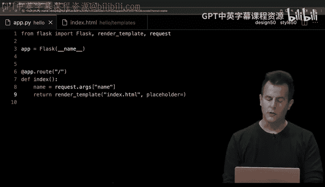

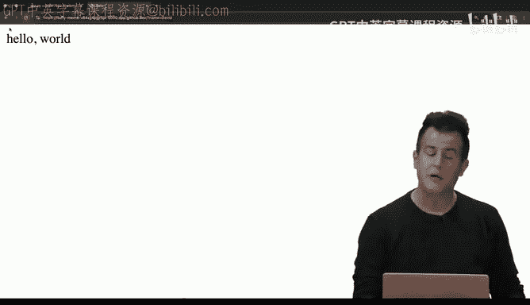

But here's where things now get interesting。 And here， too， is what we mean by template。

 If I go back into V S code， open up index do Hl again。 And instead of putting the word world there。

 I put the word name but I don't want to see literally name。 I want to see the value of name。

 I can use this special syntax in any of these HMl files to curly braces on either side of the variable name And rather sorry。

 let me undo that what I'd like to say what I'd like to see is not hello world。

 but hello place sorry， what I'd like to see is not hello world， but hello comma placeholder。

 but of course， if I literally type that， I'm gonna see literally placeholder unless I surround placeholder with pairs of curly braces like this。

 And by using these pairs of curly braces。 I'm telling flask that I want to interpolate。

 so to speak that variable。 I want to substitute in its value。

 So this is yet another syntax in Python。 we saw。😊，StsIn C。

 we saw percent S when using something like printf in an Hml file， when using flask specifically。

 we use these pair of curly braces to denote this is indeed a placeholder whose value should be plugged in。

 So now let's go back over to the second tab， recall。

 if I zoom in that passed in already to this URLs question mark name equals David。

 And this time when I click reloadvoila， now I see my actual name。

 And unlike the javascript examples last week， which we're doing everything client side， notice here。

 if I go to right click or control click and view page source。

 what's noteworthy today is that David in this case， literally came from the server。

 This was not rendered client side， the server sent this Hml and specifically this text。

 So if I go back to the same tab here， zoom in。😊。

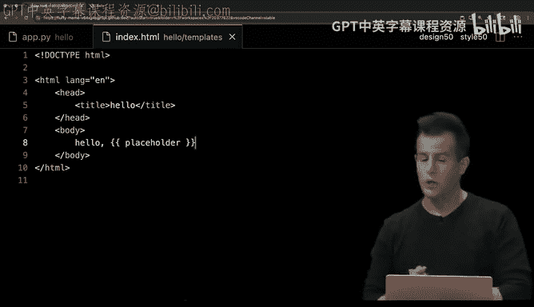

And change David， for instance， to Kelly。 What I should see instead when I hit enter is hello Kama Kelly。

 And indeed， if I go back to the source code and reload the page there， I should see。

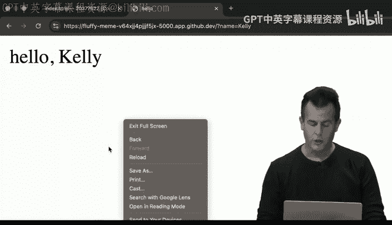

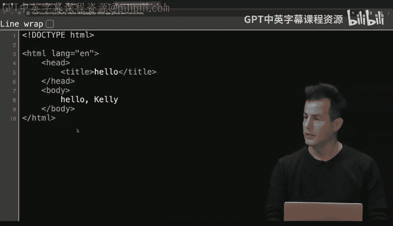

In the view page source that the server sent indeed， hello comma Kelly。

 So it's in this sense that it's an application。 The URL is providing input to the application by way of this URL format。

 The so calledled get the get string that's being passed in。

 And if I look at the code that I'm running app pi is the code that's running。

 it is grabbing that name from the URL I am then passing it into my index Hml file and then my Hl file is plugging the actual value in for me。

 And so what's going on with， for instance， these curly braces。 Well， here too。

 is where we're actually using a library and included in flask is another library called ginja。

 and Ginja is what's called a templating library。 And there are so many templating libraries in the world。

 Ginja is actually fairly simple， which is nice and which is why flask uses it。 And for now。

 you can just think of Ginja is being the library that knows how to interpolate variables inside of pairs of curly braces。

 So why are we introducing it another frame。😊。

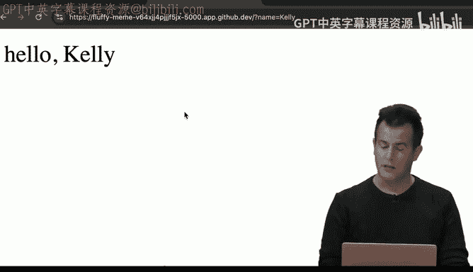

Another library wall the folks who implemented flask decided that it was not worth their time reinventing the wheel of a templating language。

 a language via which you can figure out what values to plug in where。

 so they just lean on another library that someone else wrote years prior。

 so as to not reinvent that wheel themselves and that's all that's going on with a framework in this case。

 it's using perhaps multiple libraries instead。😡，Allright， so what then is a template。

 So this then is a template。 What you're looking at here。 Hello。

 comma placeholder is a template in the sense that it's kind of the blueprint for the web page。

 I want the user to see。 but it's going to be dynamically generated using indeed this blueprint by plugging in the value of placeholder inside of those pairs of curly braces。

 And so that's why index that Hml starting today is in a folder called template。

 because this is not just static Hl like the stuff we wrote last week。

 This is the blueprint for the actual Hml that we want the browser to spit out。

 But there's a bug here。 notice what's going happen here。 If I go up to this URL。

 And I get rid of the name altogether。 For instance。

 I just visit the slash route without any key value pairs and hit enter。 This is sort of bad。

 bad request。 It's an HP 400。 In fact， if you look at the tab。

 Here's another HB status code that we probably haven't seen before， but 400 just means the user did。

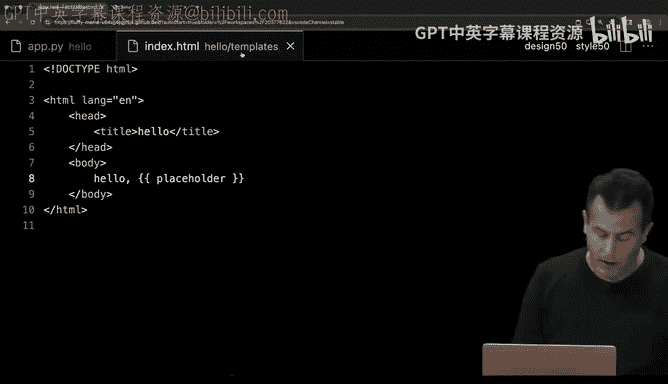

Something wrong by not passing in the parameter that was expected。 Well， that's a little bad design。

 If like the user has to manually type in things to the URLs like no human actually does that。

 that's not good for business or customers in general。

 So I can go back into app pi and just make a little bit of conditional code here。 And here's too。

 where we see what makes this an application and not just a static page。

 instead of just blindly getting the name here， I could instead do something like this。 Well。

 if the name parameter is in request do ors。 and this is just Python syntax for asking if this key is in this dictionary。

 then I'm gonna go ahead and define name and set it equal to request do orgs quote unquote name else if there is no name in the request。

 well， then I might as well give some default value like name equals quote unquote world。

 And that alone logically make sure that I only try to access request do org's name if the key is actually there。

 So if I go back to the browser now， reload without anything else in the URL。

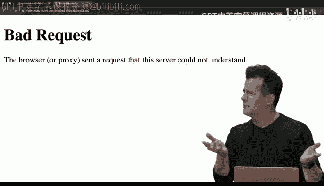

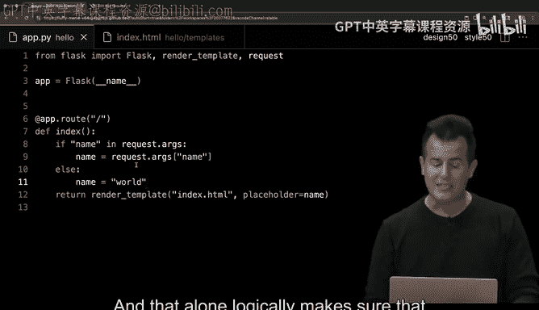

Now we're back in business and it's saying hello， comma world。

 But if I go up to the URL bar and add name equals David enter that too now works。

 So it's a web application in the sense that not only does it have function calls as well as a variable。

 but now we've got some conditional logic with Boolean expressions。😡。

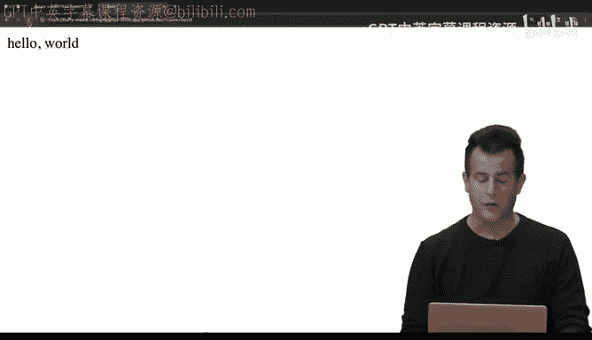

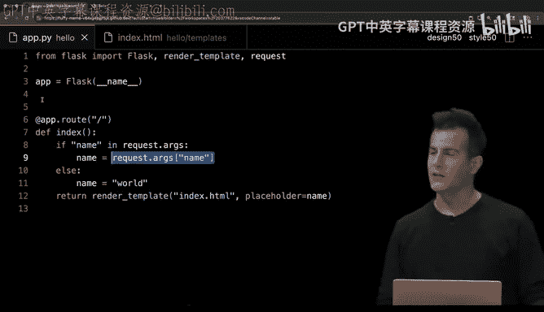

As well。All right， questions on anything we've done thus far。😡，Ca it was a lot all。At once。

Questions thus's far， yeah。Good question。 Let's try that。

 What if I just did question mark name equals nothing， Well， let me go back to that other tab。

 delete the name David and hit enter。 And I indeed see hello comma， nothing。

 Why because the name key is provided now， It just doesn't have a value。

 And so the conditional has the same answer。 Well， yes， name is in request do org。

 But there's just no value associated with it。 And here again is the value or hint at the value of using a framework like flask。

 The fact that I can just import the request global variable and then ask questions like is this parameter in this dictionary means I don't have to write any of the code that like figures out what the URL looks like。

 break it apart between the question mark and the equal signs and any ampersands they in that's all sort of generic logic that every web application has to do。

 So again， Flask is sort of doing that lift for me。

 and I can just focus on the logic that I actually care about。

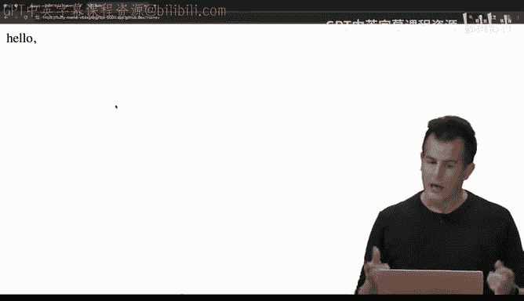

All right， well， a quick convention here。 I've used the word placeholder here just to kind of hit the nail on the head and make clear this is a placeholder。

 but frankly， it's a little more readable stylistically to not just put hello generic placeholder。

 but to say something like hello common name so that a colleague or even myself looking at this file down the line knows that okay。

 we're trying to print out the user's name here。 That's fine。

 you can change the name of these variables to be anything you want。 And even though it looks weird。

 it's conventional in flask to do something like this。 name equals name。

 But each of these names means something different。

 this is the name of the placeholder that I'm going to put in my actual template。

 this is the value that I actually want to give it。

 And it just keeps me a little sner by just reusing the same name instead of calling a placeholder or placeholder one placeholder 2 placeholder3 or something generic like that。

 Now it's just a little clear， even though it looks weird to say name equals name。😊，Again。

 that just allows me to do this in my template。 Al right， well， what more can I do after that， Well。

 let me propose that we can actually go in and simplify this code a little bit。

 It turns out this is so common to just ask a question as to whether the parameter is there and then do something with it or not。

 that fl comes with some logic to do this。 And in fact， I can get rid of all four of these lines。

 just go ahead and with confidence， declare a variable called name， set it equal to request do or。

 But in this so-called dictionary， use a function called get that comes with it。

 which technically doesn't relate to the verb that was used by Htp。

 This just means literally get me the following。 And if you want to get the parameter called name。

 you literally just say quote unquote name。 However， in case there is no name parameter。

 you can also give this function of default value like world。

 And so now we've collapsed into four lines。 from four lines into one that exact same logic。

 So this gets me the HP parameter called name。 But if it's not there。

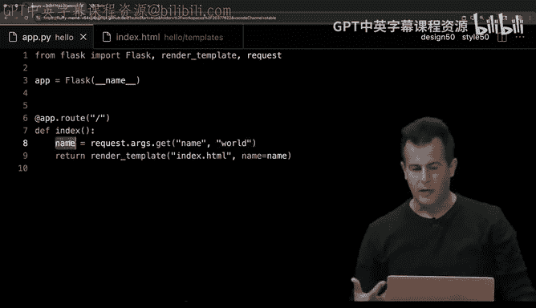

It gives me a default value of world so that no matter what this name variable has。

 what I care about， indeed， if I go back over here， let's type in how about name equals David again。

 enter， that's there。 If I type in no name， enter that too is now working as well。😡，Alright， well。

 let's see if we can refine this a bit more。 Let me propose that in our next version of this。

 Let's introduce a second route。 So two URLs， much like what Google has many different URLs as does most any web application at the moment。

 I'm doing everything in my slash route。 So how might I move away from this。 Well。

 let me go ahead and not only at a second route， but in actual form via which the user can type in their name。

 So to do this， let me propose that in index do H Tl。

 instead of just printing out the user' name and trusting that they're gonna have typed their name and manually to the URL。

 which again is not normal behavior， let's actually show the user a form via which they can do exactly that。

 So here's my form tag let's say the method I'm gonna use is get so that I see everything in the URL。

 let's give myself an input whose name is name because this is the human' name and notice somewhat confusingly。

 this name on the left is the H T T P。 sorry， this name on the left is the。😊。

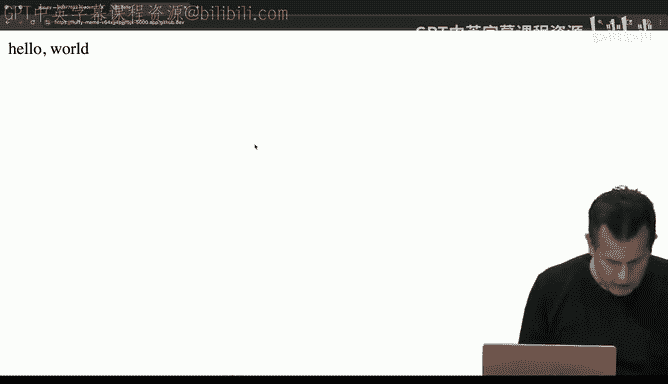

TML attribute that we saw last week。 So it's different from what we just did in Python。

 even though they're all called the same thing， the type of this input is going to be text。

 and let's go ahead and make this a little more user friendly。

 Let's put some placeholder text called name So the human knows what to type in Let's go ahead and disable autocomp just so we don't see previous input into this text box and let's autofo it so that the cursor is blinking in the text box by default。

 Then lastly， let's go ahead and have a button， the type of which is submit so that clicking this button actually submits the form And I'm just gonna call this button like greet because I want the user to be able to greet themselves by clicking this button。

 Now I should specify action。 The only other time we used action is when we actually went to HPS www do Google colash search that's not relevant today because I'm trying to printo world not search for cats and such。

 this is where I to have control。 If I want to submit this form to a specific location in my web application。

😊，Action is where I can specify it。 So why don't I pretend that there exists a route in my application called slash greet。

 And if you go to example dot com slash greet question mark name equals David。

 This now will greet the user with hello， David， for instance， but slash greet does not exist。

 If we go back to app pi， literally the only route that currently exists is single slash。

 but I can change that。 I can go into my app pi as I have here。And below this function。

 I can go ahead and define app dot route， quote unquote slash greet and just invent any route that I want。

 I can then define a function that will be called whenever that route is visited by convention to keep myself sane。

 I'm gonna call the function the same thing as the route。 but you don't have to do this。

 It's just to minimize decisions I have to make。 And then in this function。

 what I'm gonna do is this return render template greet dot H Tl， which doesn't exist yet。

 But that's a problem to be solved。 And then I can pass in the name of the user。

 I'm gonna go ahead and save myself a line of code and just say request do org do get unquote name comma world。

 In other words， strictly speaking， I don't need that variable on its own line。

 This has the effect of what we already did in index。 but I'm doing it all in one elegant one liner。

 And now in index， insofar as I want the index of the site to just show the user the form by which they can type in their name。

 This one's easy now， render template， quote unquote index do H TM L。😊，And return that template。

 So to recap， here's index do Html， which is now a form instead of a template for hello comma。

 such and such app pi is gonna return that template whenever I visit the index or slash of the page。

 And then this greet route is gonna handle the case of printing out greet do htl passing in the user's name。

 All right I think I'm not quite good to go yet， but let's try this out。

 let me go back to my browser tab reload and there we have it。

 I have a web form now instead of the hello comma。 so and so。

 I'm gonna go ahead and type in my name and notice the URL at the moment。

 even though Chrome is hiding it， technically it's there slash but Chrome and most browsers today sort hide as much stuff as they can if it's not all that intellectually interesting。

 but watch what happens when I click greet to the URL it automatically sends me to slash greet question mark name equals David。

 And this is just like the way the forms worked last week when we recreated our own version of Google in search htl because the action there。

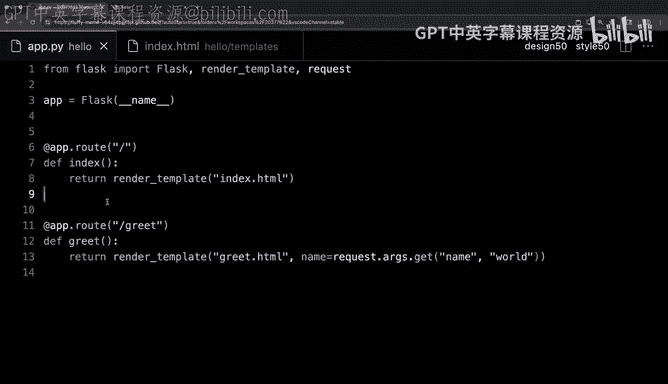

Googlet com slash search the user was whisk away to Google server today。

 I stay on the same server because the action I used was quite simply slash greet。

 which is assumed to be on my own server。 but clearly I screwed something up because I have a big internal server error in front of me as you soon will。

 too odds are as you dive into this500 is the status code that means your fault somehow。

 Now why is that Well， it's unclear from this generic black and white message。 However。

 because I'm the developer， I can go back to V S code open my terminal window and recall that I have two terminals open now。

 one that I can type stuff in the other of which is still running from before。

 let me open up that one。 And you'll see if I maximize my terminal window a whole bunch of scary error messages here。

 but the relevant one is probably going to be let's see down here race template not found error Gingja exceptions template not found Hml。

 So there's a lot of esoteric error messages here more so than usual， but。

Simple fact is that I just screwed up and I did not create do Html。 So file not found by the server。

 So the user doesn't see all that complexity。 that's deliberate by design。

 It's generally not good for cybersecurity if you're revealing to the user。

 All of the error messages that are happening on your server because maybe that suggests they can hack in some way by taking advantage of those error messages and the information implicit in them。

 but they are there in your terminal window to actually see and diagnose。 So how do I fix this。 Well。

 not a problem， Let me shrink my terminal window back down。 let me code a file called greet do html。

 and in greet do htl， let's create the template via which I'm going to greet the user。

 which ironically is the exact same as index that htl used to be。 So let me recreate that real quick。

 doc type Hml。 Let me close my terminal Htl Lng equals E head title。

 hello body hello comma and there's here's my placeholder hello comma name。 So to be clear。

The index Htl template doesn't have any curly braces or anything dynamic。

 It just spits out the Htl for the form。 G dot Htl spits out Html and the actual greeting and its app pi that decides which of these to show the user either index do Htl if they visit the slash route or greet do Html。

 if they somehow find their way to the slash greet route。

 which they will automatically by simply submitting that form。

 Allright so let's go back into this internal server error and go back to the form。

 Nothing has changed with the form， but now when I type in David click greet。

 not only will the URL change to be slash greet question mark name equals David。

 I actually now see the content that I expected。

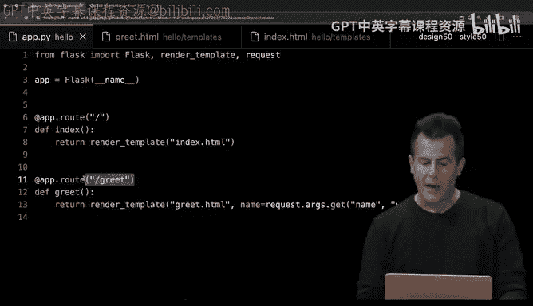

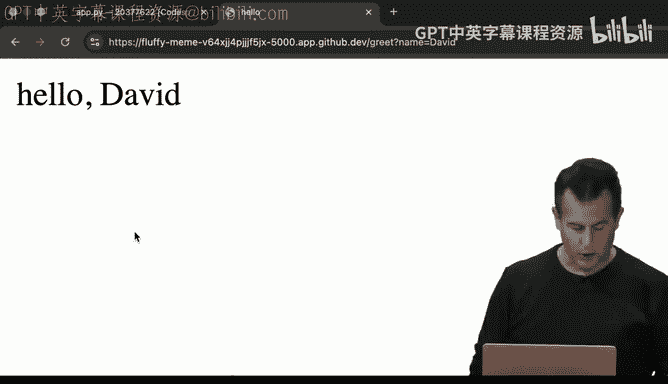

A moment ago。Alright， questions now on what we've just done with this example。Here。🤢，Anything。No。

 all right。 Well， now it's an opportunity to critique。

 I have these two templates open index dot H Tl and greet dot H Tl。

 And even if you've never done web programming before and even if you've never did H T L before last week。

 what is bad about this design intuitively。What is dumb about what I have done？Judge away。

 just instinctively。Getting awkward。It's thematic， usually when I've done something that looks a little something like this。

 there's an opportunity to improve it。Even if you have no idea how。A second。

Abstraction in what sense？Yes， so that's exactly the hang up I have here。

 There's a lot of duplication。 And technically， I didn't copy paste。

 So I might as well have because notice as I very hintingly go back and forth。

 almost every line of code in these files is the same except for the form。

 which is there or not there or the hello comma like all of the boilerplate Hl namely everything I just highlighted here。

 lines1 through 7 in do Hl and this and this is what we really start to mean about a template like wouldn't it be nice if we could factor out all of that Hl that's common to both files put it in literally a template that both routes can use so that I can write that boilerplate code once instead of again and again。

 because imagine your mind's eye。 Well， if I have three routes or four routes or routes。

 I'm going be like typing the same darn Hl 3，4 or five times that's got to be dumb and that's got to be solvable as we've seen in other languages as well。

 So let me indeed go ahead and try to improve this。 And the syntax is a little weird。

 but it's the kind of thing you get。😊，To quite quickly。

 I'm gonna go ahead and create a third Html file now by going back to my terminal window。

 inside still my templates directory。 And by convention。

 this file is gonna to be called layout do Htl。 Why this that's what the flash documentation tells you to do。

 So in layout do Htl， I can put all of my boiler plate Htl。

 the stuff that is invariant and doesn't change。 So here we go。

 doc type Html Htl tag lay equals E N closed bracket open bracket head Open bracket title we'll call it hello for all of the pages。

 Open bracket body。 And here's where it gets interesting。

 The body is the only thing that has been changing in these two examples in index do Html。

 it was a web form in Greek do Hl， it was just a simple string of hello comma so and so。

 So what I want to tell flask is that everything in the body will just be a dynamic block of code and the syntax for that。

 which takes a little bit getting used to。 But it's also sort of copy。😊。

Block body using percent signs this time。 And because I don't want any such body in the template。

 I'm going to literally close this block as follows。

 And here you see another example of sort of Hl like syntax。

 But instead of using angled brackets Ginja the templating library that flask uses uses curly brace and percent sign to open tag and then the opposite to close it。

 So what you really have here are two gingja tags as we'll call them This one is called block。

 and I'm defining an arbitrary name here， I could have called it fo bar or bass。

 but because I want this block to refer to the body of the page by convention。

 I'm going call it body。 and then this weird syntax， which is used in some other languages too。

 just means end whatever block you just began。 And so again。

 you just see reasonable people disagreeing。 The people who invented Hl use nice angled brackets and words like these。

 the people who came up with Ginja use curly braces and percent signs。 Why well。

 odds are these are not normal symbols that a human would type when writing。codeode， at least in Hl。

 So they just chose something that probably wouldn't collide with actual syntax the human wants to use。

 So that's it for the template。 This is now a this is essentially a blueprint that doesn't have just a placeholder for a single word or value like name。

 I can put a whole chunk of code here now instead。 And how do I do that。 Well。

 let me go into index do Hl， moment which at the moment is a little duplicative and that it's got all of this boiler plate。

 So you know what， I'm gonna go ahead and delete everything that is already in my layout both above and below that web form And now I'm gonna to use a bit more gingja syntax。

 This takes a little while to memorize or copy paste。

 But if I want index do Html to use the layout do Html blueprint。

 I can simply say extends layout do Html。 and then close tag using percent sign closed bracket here。

 And then if what I want to plug into that layout is the following。I can say， as before， block body。

😡，And then down here， I can say。End block。And that's it。 And just to be a little nitpicky。

 I'm gonna deindent that slightly。 And now， even though it looks like web pages suddenly look a lot uglier。

 Well they do， because like this is weird looking syntax。

 but I have now distilled index dot Htl into its essence。

 This is the only thing that changes Vi V the greeting page。

 And so I've put my H Tl here that I care about。 I've said to flask。

 This is what index do Htl's body block shall be。 where to put it。 Well。

 put it into that particular layout do H Tl file。 And so the logic for a greet dot Htmls the same thing。

 It's gonna look just as weird。 But again， you get used to it。

 let's go ahead and delete everything that's boilerplate in greet do Htl。

 both above and below up at the top。 Let's tell flask do Htl2 extends layout。😊，Dot H T M， L。

And let's go ahead and say to flask that the block called body shall be this for greet do Hm。

 And the end of this block is now down here。 And just to be nipicky， I'll deindent that too。

 So again， the pages look a little weirder now。 But it's going follow a paradigm that we just see again and again。

 such that the only juicy stuff is what's inside of that body block。

 So now if I go back to my layout。 It looks exactly like this。 This indeed is a placeholder。

 not just for a single variable like name or the placeholder we did before。

 this is the placeholder for a whole block of code that came from a file， not from a variable。

 And so if I go back into my other tab here， go click back to go back to the web form and reload。

 notice that I have the familiar looking form。 But if I now look at my developer if I look at view page source。

 notice everything that came from the web page from the server， here's that boilerplate up here。

 here's that boilerp down here。

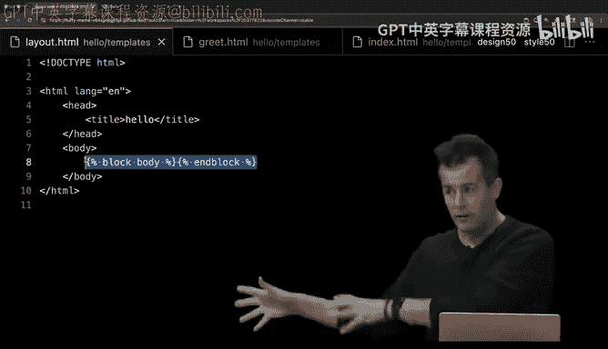

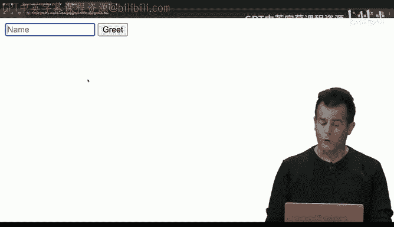

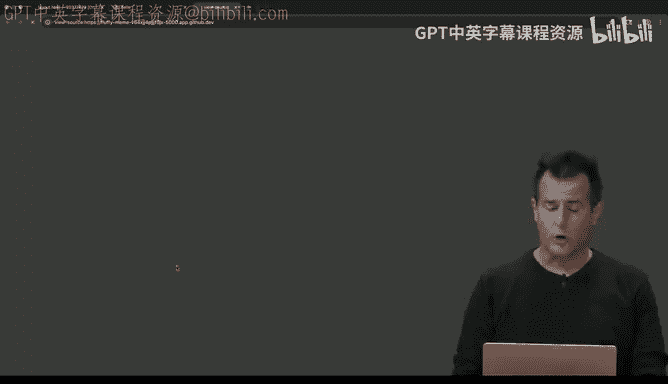

And here's the stuff that's unique to this page and recall too， aesthetically I deindented it。

 which is why it's now no longer pretty printed and what the browser sees， like that's okay。

 There's no reason to obsess over the indentation in the pretty printing of what the browser sees ultimately the reason I did this indentation is because arguably when I'm in VS code here and I look at index do HTMLl。

 This is clearly indented inside of the body block just so I know what's part of that block。

 The browser does not care about superfluous whitespace or less thereof。😡。

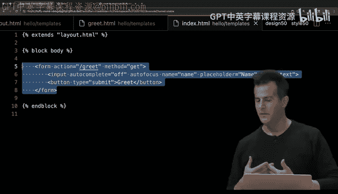

All right。Questions。On what we've just done here， which is to truly take this template out for a spin and now remove what redundancies I had accidentally introduced。

Questions。No， okay， amazing。 All right。 Well， let's go ahead and look at this URL again。

 I'm not liking the fact that every example we've done thus far involves putting my name or Kelly's name right there in the URL bar。

 Well， why is that， Well， if I have like a nosy sibling and they sit down in my browser。

 they're gonna see like every URL I visited， including whose name was greeted。

 Now that's not all that big a deal， But now imagine it's a username and a password that the form is submitting or a credit card number that the form is submitting or just search terms that you don't want the world knowing you're searching for。

 they're going end up in the URL bar。 why if you are using method equals get for the form。

 That's how get works。 It literally puts all of the HP parameters in the URL。

 which is wonderfully useful if it's sort of low stake stuff like the Google search box or if it is potentially low stake stuff like the Google search box or if you just want to be able to hyperlink directly to a URL like this。

 In other words， if I put this into an anchor tag open bracket a H and URL like this。

 I could deeplink a user。😊，webage that just always says hello comma David。

 So get strings contain all of the requisite information to render a page for the user。

 but this isn't really good for privacy。 So recall that there's not only get。

 but there's also something called post and post is just a different HttP verb that essentially with respect to those virtual envelopes last week。

 sort of puts the information more deeply inside of the envelope such that it's not written right there in the URL bar。

 but it's still accessible by the server。 So if I do this， watch what happens。

 let me go back into VS code， let me go back into index html。

 which has the form and let me quite simply change the method from get to post And now let me go back to my other browser tab back to the form and reload so that the form knows that the method has changed now type in David and click greet and before I do that let me zoom in on the URL bar notice that。

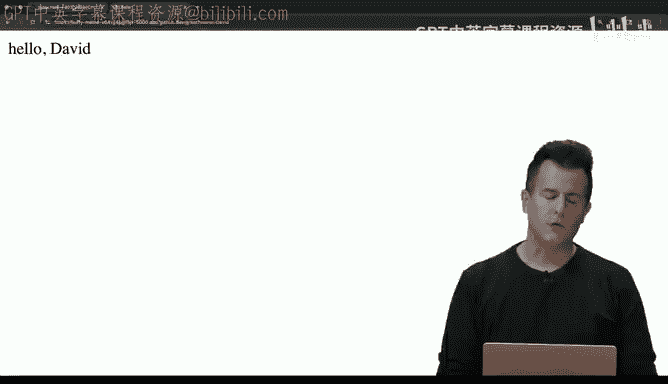

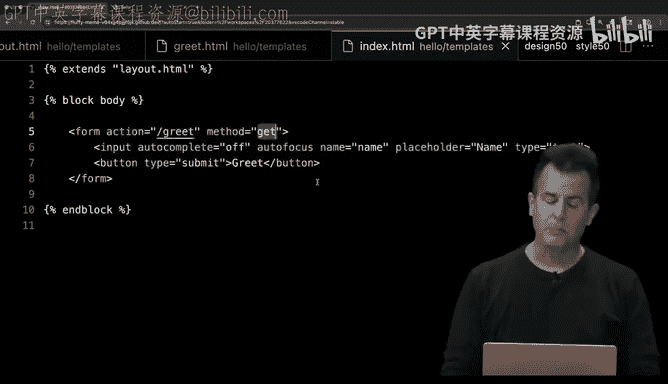

The URL does change。 I'm at slash greet， but I haven't revealed to the world or to anyone with physical access to my browser。

 What URL I just searched for。 All they know is that I went to slash greet。

 but not the key value pair or pairs that were passed in。 Of course， this clearly hasn't worked。

 I've got an HP status code of 40，5， which means method not allowed。

 That's because flask by default when defining routes simply assumes that you want get instead of post。

 Now， get is good for the default page。 In fact， when I go back here。

 this is equivalent to me visiting the slash route。 just in the browser。

 So I want my index to generally support get。😊。

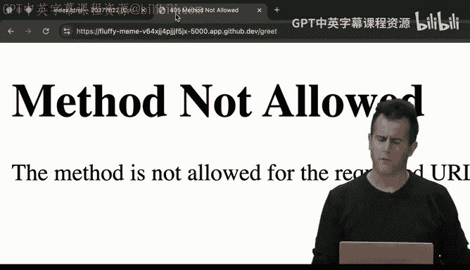

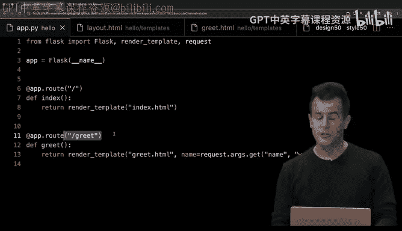

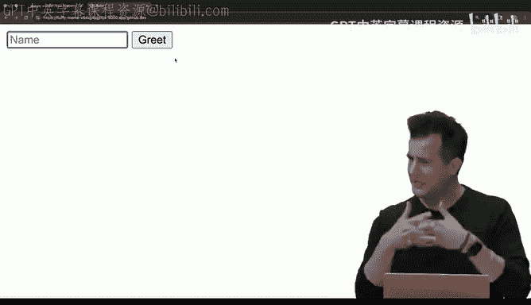

But the greet route should support post。 And the simplest way to do this is to pass in another argument to the route function。

 which we haven't needed before because the default is get。

 And I can instead tell flask a comma separated list of the HP methods that I want this route to support。

 So if I wanted to support just post， I can pass in a list containing just post and recall Python uses square brackets for lists。

 which are their version of arrays in C。 Now， by default， this argument is this methods equals get。

 And that's why the only thing supported a moment ago， was get。

 that's why I'm now changing it to be post instead。 you have to make one other change， though。

 It turns out if you read the documentation。 when accessing HP parameters via a post instead of get。

 you move from using request do orgs to request do form。

 This is completely unintuitive that request do orgs is get and request do form is post because they all come from forms。

 So。Bad naming admittedly。 So you just kind of have to remember request dot org is used forget requestquest do form is used for post。

 So all I need to do further is change this to be request dot form。

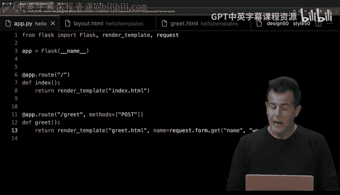

And that's it。 Now， my Web application will support web forms submitting to it via post instead of get。

 Let me go ahead and type in my name Now。 I'll zoom in。

 notice that the URL will again change the slash greet with no parameters evident。

 but I will be greeted this time because the server knew to look deeper into that envelope。

For those key value pairs instead。 And just to be now sort of diagnostic about this。

 let me go back once more。 Let me right click or control click on my desktop and go to inspect。

 Here's where developer tools can be super useful as well。 I'm gonna go in here。

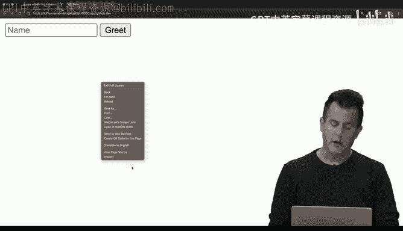

And I'm gonna go ahead and clear this。 And now I'm gonna type in David again。

 And I'm gonna click read。 But because I have the network tab open。 like we played with last week。

 it's going to show me all of the requests going from my browser to server。

 which is going be useful here because not only do I see， okay。

 it obviously worked because I got back a 200， But if I click on this diagnostic output。

 I can actually go to response。 or rather I can actually go to。😊，Give me one second。Oh yes。

 I can actually go to the payload tab here and I'll see that the form data that was submitted was name。

 the value of which was David， so you can see what you're submitting so you can do this today。

 like if you want to log into some website， Gmail or otherwise。

 you can actually see all of the data that your own keyboard is submitting to the server。

 even if it's using post because the browser that you control of course， can see the same there。😡。

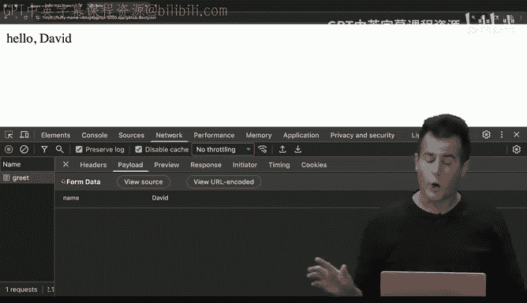

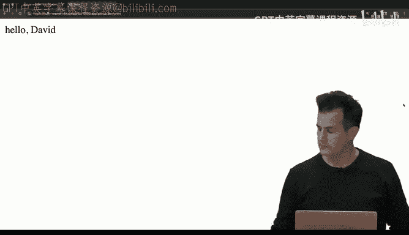

Alright， any questions now on this transition from get to post。

Kin of on a roll orm not going So well， let's say all right。 So what more can we do with this。 Well。

 let's give ourselves a couple more building blocks before we transition to actually implementing some real world problems as I did years ago with one such example。

 supposeose that I don't like this direction I'm going in insof far as every time I have a page with a form。

 it submits to another route altogether because in your mind's eye just kind of extrapolate。 Well。

 if I have two forms on my page， I now need four routes。 If I have three forms， I need six routes。

 it seems a little annoying that you use one route just to show the form and another route to process the form。

 This is gonna get annoying over time because it's like twice as many routes as might be ideal。

 So is there a way to get kind of the best of both worlds and combine these two routes into one。

 So that everything related to greeting the user all happens in one place。 Well， you can as follows。

 what I'm gonna go ahead and do is delete my greet route altogether， and most of my index route。

 But I'm gonna ask a question。 I'm going first say that the methods that。😊。

The index route support now shall be both get and post as a comma separated list there。

 And then inside of my index route， I can simply ask a question of the form if the request that is submitted to the server has a method。

Of post， then assume that form was submitted。 This is just a Python comment note to self that I'm gonna go back to in a moment else if the request method is not post。

 So I could technically say if L if L if request dot method equals equals get then。

 but this is kind of dumb because I only support two verb。

 So I might as well just assume for efficiency。Else handles the get implicitly。

 then go ahead and assume that no form was submitted。 So show form。

 So just notes to self as to what I want to do。 So how do I show the form Well。

 this line was easy return render template of index H TM L。 If though the form was submitted。

 what do I want to do， just as before， let's return render template greet do H TMl passing in a name value of request form get unquote name else default value of world。

 So the exact same logic from each of the two functions a moment ago。

 But I've now combined them into one by just using some conditional logic and just asking the server。

 if the user got here via post。 Well， the only way they could have gotten here via post is by having click that button and submitted the form。

 So let's just go ahead and greet them else if they got here via get by just typing in example do com or whatever the actual URL is。

 let's go ahead and show them the template。 So it's still good。

DeIn that I have a separate template for each of these pieces of functionality that is only minimally different。

 but I'm sort of deciding which of those to show based on the actual logic in this here app。

This is almost perfect， except for one bug。What else needs to change if I've just combined my greet route and this default slash route as well。

Yeah。Yeah， so in the form that has index dot H Tl， recall that there's an action line that specifies like to what URL do you want to submit this。

 Well， let me go back to index dot Htl， It can't be slash greet anymore because that doesn't exist。

 So I'm just going delete the word greet and submit it to slash instead。

 which will have the effect of also just omitting it entirely。 if you don't specify an action。

 it submits to the very location that it came from。

 But if you want to be pedantic and even more clear。

 just specifying that the action now of this form is just this then that will work here too。

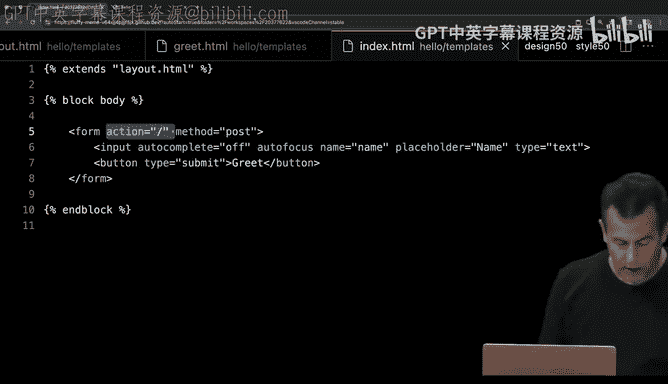

Alright， so let's test it。 Let's go back to the other tab back to the form。 reload。 It's blank now。

 type in David， click greet。 and this two is working。 But again， if I go back and reload。

 get is working as well。 But there's nothing ending up in the URL because I'm now using post。

 which again tends to be a good thing for privacy reasons as well。

 Let me show one final flourish before we transition to something real worldor motivated。

 If I go into app pi for a while now， I've been passing in this default value of world。

 which is fine， especially if it's something short and sweet， that's the default value。

 But I can actually put a bit of conditional logic in my template as well。 So in fact。

 let me go into Greek do Html。 and trust that I will now be passed in a name variable。

 But I can decide for myself in the template， whether I want to say hello name or if it's blank hello world instead。

 And how might I do this。 I can always say hello， But then I'm gonna to use some ginja syntax that we haven't seen yet。

 But it turns out in gingja， the templateating language the lastask uses。😊。

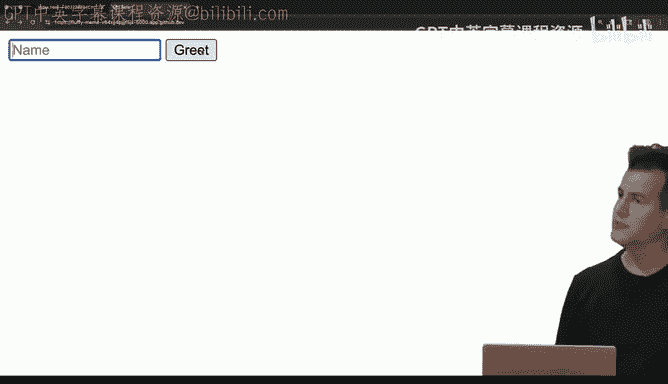

You can use Python like syntax 2， and you can ask questions like， well。

 if the name variable has a value， will then go ahead and output the value of that name else。

 if the name variable does not have a value， go ahead and output a literal value like world and then down here and if So Ginja again is a little weird in that it says n block and if but that's the way it is。

 But even though this looks a little weird， it's just a nice clever way of putting a bit of logic into my template And if the name has a value。

 So it's not empty or none， go ahead and display it。

 hence the curly braces else go ahead and literally say world。 Why is it not problematic。

 And you can see the dots here that there's all of this white space。After the word hello comma。

Like otherwise， this would seem to create quite a messy paragraph or phrase of text in terms of white space。

 but。H Tl ignores superfluous white space。 So anything more than a single space just gets canonicalized or collapsed into a single space。

 And we saw that recall last week accidentally， when I had those three paragraphs of text from the duck。

 But I wanted them deliberately to be separate paragraphs than they weren't because all of that white space was ignored until I actually introduced the paragraph tag instead。

 So this just moved some of that logic now to the templates。 So for all this logic and more。

 here's the official documentation for flask and specifically Ginjas own documentation。

 But for the most part， we've seen what's possible already。 And I promised a real world example。

 So here now it is。 So back when I took C S 50 as a sophomore。

 there was no web programming in the class and frankly。

 there was barely any web actually in the world because it was also new Hl and the like。

 But it was my sophomore spring maybe or junior fall that I also got involved in the fresh。😊。

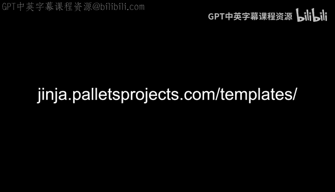

An intramural sports program or Frosh Is for short。

 And back in the day we would walk from say Matthews Hall to Wglesworth freshshman year at least to register for sports by filling out what was called a sheet of paper and then you would go to the Proctor's dorm room and slide it like under their door through the mail slot and that's how we registered for sports。

 It was sort of ripe for disruption before that was even a phrase and so one of the very first projects I took on myself personally after taking CS50 was to figure out how web programming worked and Python wasn't really wasn't a thing yet nor was half of the topics we've been talking about thus far but at the time I learned a programming language called Pearl I learned a little something about CSv files which we did a couple of weeks back to and I built this the freshman intramural sports website via which you could click on a bunch of links and get some information but most importantly you could register for sports as by typing in your name selecting the sport for which you want to register。

 click submit and no longer walk across Harvard Yard with a piece of paper to actually register for sports。

 So we thought we'd use this as sort of the beginning of。

A motivation for how we can now solve problems using webbased interfaces using code and also what not to do like background images that repeat like this are not really in fashion anymore。

 nor arguably in 1997， but let's leave that as a cliffhanger and come back in 10 minutes after a snack with reimplementing the Frosh IM's website Nuut grainin bars are served。

😡，Al right， we are back。 So among the goals now are to recreate the beginnings of a site like this for Frosh Is。

 whereby we want to enable students to visit a form。

 fill out that form and submit it to a server and then register and we'll dispense with all of the amazing graphics and such and keep it fairly simplistic and core HM。

 So let's go ahead and do this back here in B S code。

 I've gotten ready now for this next set of examples。 And in particular。

 I've created in advance a directory called Fro Is inside of which are app requirements text and templates。

 which are essentially the same as the ones we just created。

 but I stripped out the hello and greeting specific stuff。

 I'm gonna go ahead in this terminal and do flashask run。

 So I get the server up and running again on port 5000。

 And then I'm gonna go ahead and open up another terminal here， as I did before。

 see the intofrro Is in that terminal where I'll see the exact same files。

 and I'll give you a quick tour of what I created in advance。

 So here in app is quite simply the simplest of applications。😊。

Just renders the index Htl template with an expectation in a moment that we're gonna make it more interesting than that。

 Meanwhile， if I open my terminal again and open up requirements Txt， it just mentions flash。

 but it's already installed。 So no more to say about that for now。

 Now let me go ahead lastly and open up templates the templates folder。

 two files there in the first of which is layout Htl。

 which looks almost the same except I did add a slightly more user friendly tag to the head of the page。

 which you might not have seen before， but this is a tag that essentially you can copy and paste into templates of your own that help the content of a page resize to be mobile friendly。

 In fact， without this line if you were to develop problem set 9 or your final project for the web and then try to access the site on a phone。

 everything might look quite a bit too small font sizes and more this line tends to help the browsers resize dynamically so that it actually matches the width of the devices owned with。

 for instance， a phone versus a laptop or desktop。 But otherwise everything else is the same there。

 including the placeholder。For the body block that I've find here online 9。 Lastly。

 there's one more file that at the moment doesn't do anything。

 all that interesting except is ready to contain the contents of the registration form for Fro I am So let's go ahead and start with actually that let me quickly whip up a form that minimally gives the user something that they can submit to the server to register for sports and then we'll improve upon it a bit iteratively So here inside of the body of index hl。

 which is going to extend the actual layout， the blueprint we already created。

 I'm gonna have a quick title for the page like register just to make clear to the student what they need to use the H1 which is the big and bold tag。

 then I'm going go ahead and have a form tag whose action is going to be anything I want。

 But since I want the user to register I'm gonna have it go tolash register which makes more sense semanically than greet now because we're doing something else。

 The method I'm gonna to have the student use is post if only because they don't want their roommates knowing。

They visited in their browser。 So this way it will tuck the HB parameters deeper in that virtual envelope。

 so it's not stored in the browser's history inside of this form。

 I'm gonna have minimally an input box for the students's name。

 So I'll call that aptly name and set name equal to name in my H。

 The type of this text box will be exactly that text and then just make it a little more user friendly。

 I'm gonna add a placeholder of name so they know what to do I'm going go ahead and turn off autocomp in case multiple roommates want to sign in from the same computer register from the same computer and then we'll turn on autofocus to put the cursor in that name box and then and you didn't see this last week。

 but if you've ever wondered how dropdown menus or implemented in HTML if you've never done this yourself those dropdown menus on web pages are called select menus and if I want the user to select a sport to register for。

 I'm going call this input a sport and this is an alternative to just having a generic text box where we have the students type in the sport they want to register for。

 which would be f withtypographical。And changes in capitalization。 a dropdown menu， of course。

 standardizes what the human can select。 So inside of this dropdown， I'm gonna have a few options。

 The first of which will be basketball， for instance。

 the second of which will be soccer and the third of which which I think was the first three with which we debuted back in the day was ultimate frisbee。

 Now， these option tags can take some attributes by default。

 they will take on the value of whatever words are typed in between the open and closed tags。

 but just to be pedantic。 I'm going make clear that the value of selecting this option shall be basketball。

 But I could change it to be something else。 if I so chose。

 the value of this selection will be soccer and the value of this last option will be ultimate Frisbee。

 just in case I want to store something else in my database ultimately Now。

 that is a complete index Html， I think So if I go back to my browser tab。

 which previously was showing me the hello program， because I stopped and。😊。

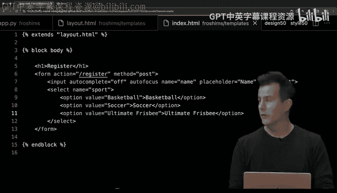

Restared flask and you can stop flask by just in control C for interrupting it。

 I'm gonna reload the page。 And I should now see， okay。

 slightly more interesting form with a name box with the cursor is blinking there。

 and then a select menu， a dropdown with three options。

 Now it's a little presumptuous of me to select basketball by default。 And in fact。

 this is kind of inviting user error if they type in the name。 Don't really think about it。

 And now register for basketball accidentally。 So I'm gonna make a couple of improvements here。

 I'm actually gonna have essentially a blank option at the top whose value is nothing。

 And I'm gonna have it just labeled sport。 And just to be super clear。

 I'm gonna select this value by default。 So the option tag and Hl supports not only a value attribute。

 but it turns out a selected attribute， which at present means that's the option that will be selected by default。

 So if we go back now to this page and reload to get a new copy of the Hml looks a little better。

 I still have the name at left。 but the sport now menu looks like this。

 So it's a little more clear what I want them to do。😊。

From this dropdown and sport deliberately on the back end won't have a value。 And theoretically。

 this will help me determine if they actually selected a sport or just clicks register and ignored the dropdown still。

 But I do need a way for them to register ideally by clicking a button。 So I'm gonna add a button。

 the type of which is submit And then I'm gonna have this buttons label be register。

 So now if I go back to the form once more， reload， I now have， I think， a complete form。

 albeit not very pretty via which David can register， for instance。

 for basketball by clicking register。 And， I have a 404， not found。 But why is that。

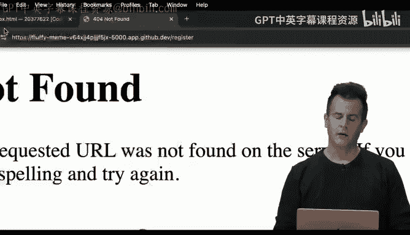

Why。Is nothing yet found？Anyone at all。Why is slash register not found yeah？what's that。

I haven I haven't linked the option to anything。 I think the form has been linked。

 the form is telling the browser to go to slash register。 So this is correct behavior。

 But if we go to app pi， like there's no route defined for slash register。 So of course。

 it's not found because there's an infinite number of routes that don't exist and register is currently among those。

 So I can define that myself， I can say app do route， unquote register， I do want to use post。

 So I need to proactively say that the methods this function will support will be indeed post instead of the default of get。

 I'm gonna define an actual function to call when this route is used and by convention。

 I'm gonna call it just register， even though I could call it anything I want。

 And inside of my register function。 for now， I'm gonna cheat a little bit。

 I'm gonna at least just say I'm gonna at least check that the user has given me a name and a sport。

 So how can I express this。 because I have already imported the request global variable that comes with flash。

 I can ask questions of it。 and I can say something like。If it is not the case。

 that request dot form dot get name has a value。 or if it's the case that or if it's not the case that request dot form dot get sport has a value。

 Then let's go ahead and give the user a warning of sorts。 I'll return。

 render template of a file called failure dot H Tml。 This doesn't exist yet。 But no big deal。

 Let me go back into my terminal。 let me go into templates and create a file called failure dot H Tl。

 And in this file， I'm gonna say that it extends。Layout dot H T M L。Dot H T M L。

 And then it has a block body inside of which is going be something like super trivial for now。

 just to get us going。 And this failure page is simply going to say you。

Are not registered exclamation point。 and then and block。

 So that's it just sort of an error page that now exists。

 I'm gonna close it out of sight out of mind。 But I think this now will work if it is not the case that the user gave us a name。

 or it's not the case that the user gave us a sport， we will show this error message。 Otherwise。

 if all seems to be well for now， we're not gonna do anything useful with the information。

 But I'm gonna go ahead and return render template of success do Hml。

 which is simply going to assume that the user was successfully registered。

 So let's whip that up quickly。 I'm going go ahead and code up success do Hml， inside of this file。

 which will similarly extend layout do Html， inside of which theres a body block that quite simply says how about you are registered And we'll just pretend that it is so and block。

 So that's it。 In short， I want to two templates that show failure or success respectively。

 So I think now an app up high we're in better shape。

 I now have a register route that will get called。Post is used to visit it。

 And I'm going to check request form， which is where you get the post variables from。

 Check whether name or sport is provided。 And I'm going to render a template accordingly。

 So let's try this。 Let me go back to my other tab and go back to the form。 Let me type in my name。

 David， but no sport。 Click register。

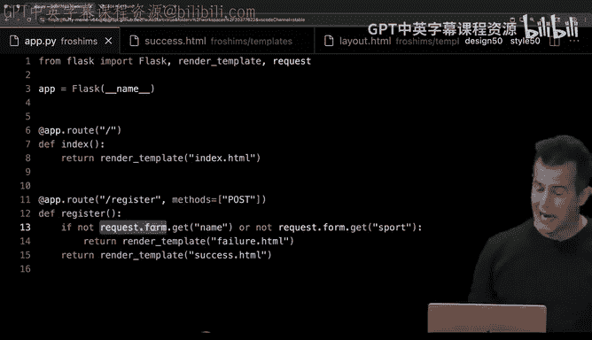

And I have an internal server error， which was not intended。

 So let's figure out how to diagnose this。 So it seems to be the case that I'm at slash register。

 That was intended， but something clearly went wrong。 So let's go back。

 Now I could just kind of stare at my code endlessly。

 but recall that there should be some hints in my terminal window that's running flask。

 So let me go back to my other terminal。 And there it is unexpected char double quote at line 11。

 Well， sounds like user error。 So that is in failure dot H Tl。

 And you can kind of see it because lastask is like underlining it literally for me。

 What did I do that was stupid。

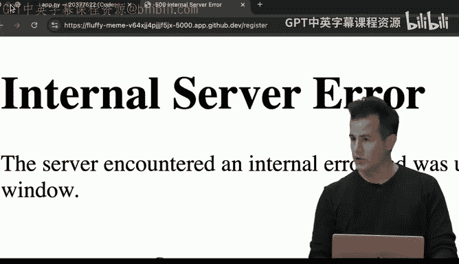

Yeah， I just didn't close my quote。 So amateur hour here。 So let me go into。

 I do need to open it after all， ironically。 So let's go ahead in my other terminal。

 open up failure dot H Tm L。 And there it is one stupid character away from correctness。 Allright。

 let's close this again。 Go back to the other tab。 Let's try this again。 David as my name。

 but no sport register。 Okay， you are not registered。 I don't know why。

 but I know I'm not registered。 Let's try it again with a name， with no name。 but yes， a sport。

 click register。 You are not registered。 All right， just for good measure。

 Let's give no name and no sport。 You are not registered。 So that seems to be working。

 Let's now cooperate。 Let's go ahead and register as David for basketball cross my fingers。

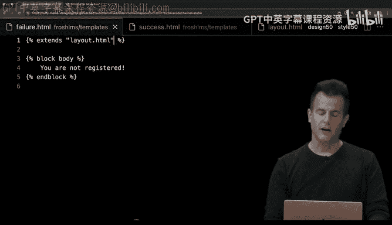

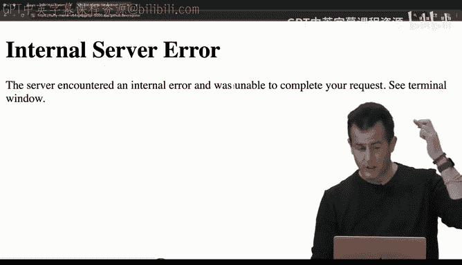

Damn it and internal server error。 Let's try to learn from my past mistakes。 Let's open up this。

 I bought it。 I did it twice， even though that was not copy paste。 So over two。 Alright。

 let's go back here。 notice now I can actually just click reload because the browsers smart enough to remember what I just posted to the server。

 So if I click reload， you'll be prompted to confirm the form submission。

 lest you be doing this on a website with your credit card or something where you don't want to send it twice。

 But in this case， I'm fine with sending my name and basketball twice。 So I'm gonna click continue。😊。

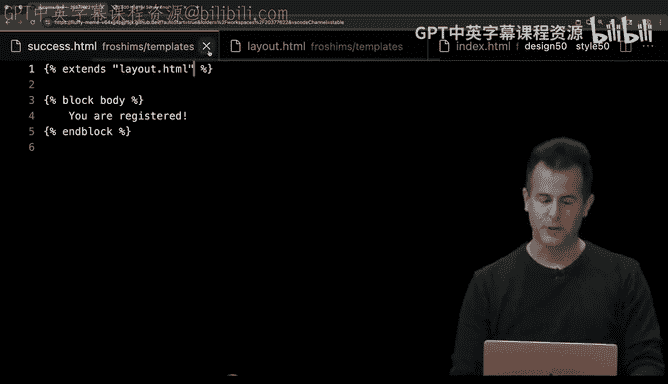

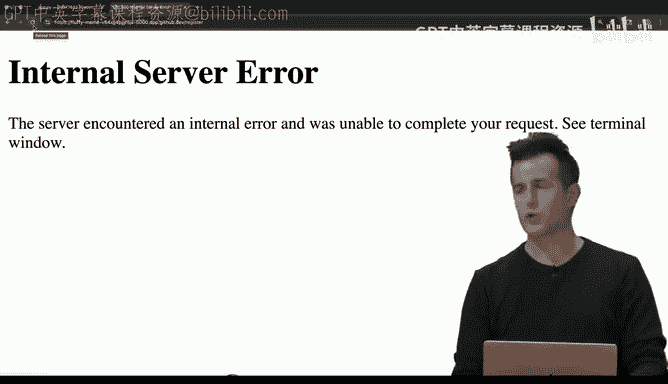

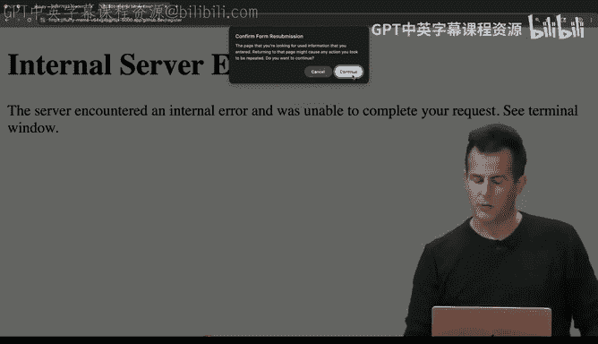

And this time it worked telling me that I'm actually registered。

 So I'm not doing anything with the students data， but at least I am validating that they gave me some input。

 Now， there's a catch here。 The catch， of course， with H T L is that it's all executed client side。

 And so， for instance， suppose that a student is really upset that we only offer basketball。

 soccer and ultimate Frisbee。 And maybe they really want to register for volleyball。

 even though we're not offering volleyball。 Well， there's arguably like a security vulnerability here。

 where technically my code right now will tolerate any user input。 even if it's not in that dropdown。

 because after all， let me go ahead and right click or control click on my web page and open up the developer tools。

 Let me go into the form as sort of a hacker type student。 Let me go into the select menu。 And okay。

 no big deal， if I want ultimate Frisbee to exist。 Well， I just need to know a little H TM L。

 I'm gonna right click on that element and click edit as H TM L。😊。

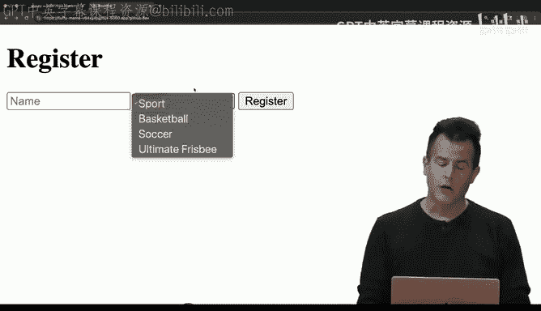

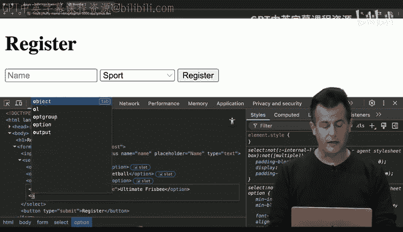

This literally lets me start editing the H T L of the page。 I'm gonna give myself my own option。

 Option value equals volleyball， close bracket， volleyball enter。

 And now when I close developer tools。 Who， I can register for volleyball if I want。

 So let's select volleyball， type in maybe Kelly is hacking the site， register。

 and she is registered for volleyball。 apparentlypparently。 Alright。

 so the short answer is the short， the takeaway here is。😊。

Do not trust user input ever for reasons we've already seen when we discuss SQL ever more。

 So now that we're dealing with the Web， because who knows what users are going do accidentally。

 foolishly or even in Kelly's case here， maliciously trying to pass data that we did not expect。

 So what would be the defense against this。 Like this is just how H TM L works。

 and assume that I'm actually registering Kelly for sports now。

 And somehow she's now signed up for volleyball in our database。

 What would a solution be logically here。😊。

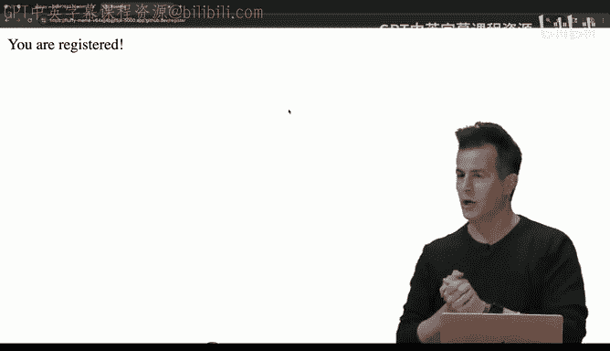

第二。Yeah， so maybe do some server side validation。 So don't just blindly check that we have a value from the user。

 Actually check that it's one of those sports。 So if I go back to app do pi。

 I could do this in a few ways。 And maybe my first instinct would be this。

 let's check for the name and do this。 But let's also do this。

 like if request dot form dot get quote unquote sport and actually。

 let's put this in a variable just to make it even easier to type。

 So sport equals this if sport how about does not equal what was it basket ball and sport does not equal soccer and sport does not equal quote unquote ultimate frisbee。

 then render and error。 So return， render template， quote unquote failure dot H TMl。

 So now if I go back to this form and try to register。

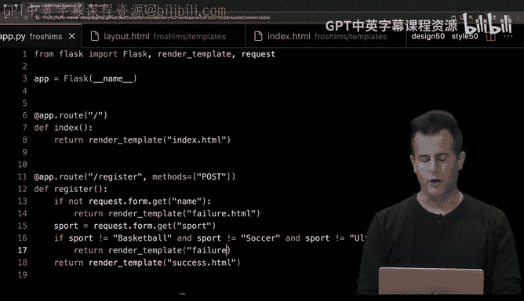

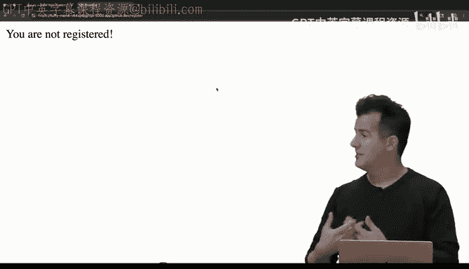

Kelly， again， you are not registered， so I somehow caught her because volleyball， of course。

 is not in the list of sports that I put there， but what might you not like about this approach？😡。

Even if you've never done web stuff before， what's bad about this。Yeah。

 I have to hardcode every single sport now in not only app pie to check for the validity on the server of what the is typed in。

 but recall that the dropdown itself came from index do Ht。

 So I now in duplicate have to put like all of the sports there too。

 So like this just seems bad to have duplication。 And so better might be to do something more like this at the top of my file here。

 Why don't I go ahead and just give myself a global variable。

 which in the context of this web app is perfectly reasonable。 So I can access it anywhere。

 Let's call it sports in all caps just to connote that this is a global variable in constant even thoughython does not have constants in the sense that C does。

 But this is sort of on the honor system。 If you see a variable and all caps like this。

 don't mess with it， use it but don't mess with it So inside of the square brackets。

 This is gonna be a list of the sports that I do want to support。 So basket ball， comm soccer。

 comma ultimate Frisbee。 And that's it。 now， instead of doing all of this。

 what I can instead ask is a simpler。😊，Quest like this。 If sport not in sports。

 then go ahead and return， render template， quote unquote， failure dot H TM L。

 And I can actually tighten this up a little bit。 I don't need two calls to failure dot H Tl。

 Why don't I just borrow this code and say。Or sport， not in sport。 rendernder a failure。

 And now I've tightened this up quite a bit more。 But I'm essentially using Python to just ask。

 is the sport o deleted too much sport equals Actually， let's just tighten it up further。

 Sport does not exist。 So let's do request dot form dot get quote unquote sport。

 So if the sport that the human typed in or selected from the dropdown somehow is not in this global list of possible sports。

 Well， then it's a failure。 Don't let Kelly or whoever register instead。

 But if I now have this global variable， I can be a bit smarter in my template。

 I don't need to manually write out all three of these sports here instead。

 I think I can be smart about this。 And when I render index do H Tl itself。

 Why don't I just pass in a variable called sports， for instance。

 set it equal to the value of that global array。 And then in my template and here's where templating again gets interesting and starts to save you time。

 Let me go into index dot H Tml delete all but the。So default value。

 the blank1 and do something like this。 Ginja， it turns out。

 also supports loops like Python for sports in sports using the curly braces and the percent signs。

 I can now dynamically generate options as many as I want。

 So option value equals quote unquote the current sport， close there， close bracket sport。

 So it's a little redundant。 But again， this is just how Hl is， this is what the human sees。

 this is the value that gets submitted to the server in case you want one to differ from the other。

 And then below that option line， I can say end for， which is a bit weird。

 But that's how it works in Ginja to stop that loop。 So this is kind of powerful。 Now。

 if I have three sports，30 sports， all of the options will be dynamically generated by this template。

 And so now we're starting to save ourselves time。 and I can centrally manage all the sports by just updating this global list here in apptop pi。

 So let's go back to the browser。 back to the form， reload。 And you'll see that the dropdown。 Thank。

😊。

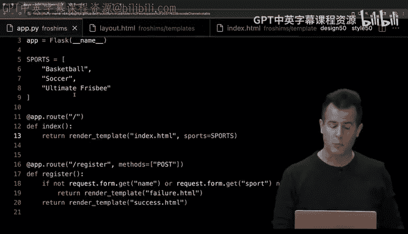

Still works the same way。 But all of those options were dynamically generated。 Indeed。

 if I view page source from my browser， you'll see。

 and there's some extra white space there because the loop was adding some white space on each iteration。

 I still have the three sports， but not volleyball， as was my intention。

 So now if if Kelly even tries hacking this version of the site by going in here and select and typing in volleyball manually registering。

 the logic will still catch it because only those three sports are in that array。

 So it's perfectly fine for me now to register basketball because it's among the sports。

 Sorry in that list。 not array。 Que on any of these here。😊。

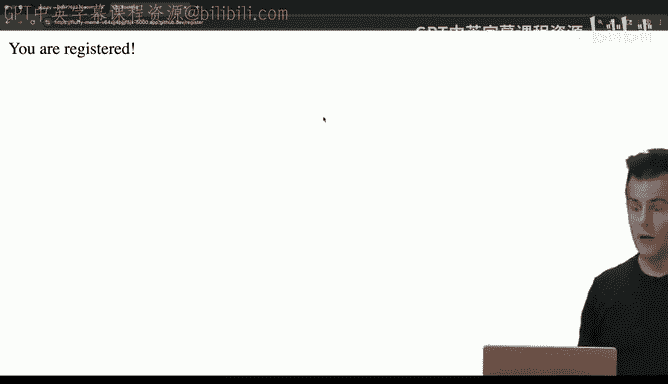

Techniques。Allright have another type of form。 So select menus are nice。

 but you also might see radio buttons on websites， which are the mutually exclusive little circles that you can select to choose one or another option。

 Let me go back to index dot Hl and just show you how those can be created as well。

 instead of using a select menu， turns out we can create a whole bunch of inputs of radio type type as follows of radio button type as follows。

 for each sport。 So for sport in sports。 let's go ahead and output。😊。

In between this tag and the end for the following input type equals radio。 And let's give it a name。

 The name of this radio box is going radio button is going to be sport。

 and the value of the current input is going to be quote unquote sport。

 And the word that the human is going to see is as before sport。

 So notice it's just another type of input。Previous， we've seen text。 For instance， two lines above。

 We also saw last time search。 we saw email。 There's a bunch of text input types。 This one， though。

 is going to display as a radio button instead。 and the human is going see this label here。

 If I now go back to my other browser tab and click back， click reload on the form。

 I should see it's not pretty。 but it's a radio button in the sense that these are mutually exclusive。

 How does the browser know that I should only be allowed to select one of them。 Well。

 because I use the same name for each of those radio buttons。 It knows that means mutual。

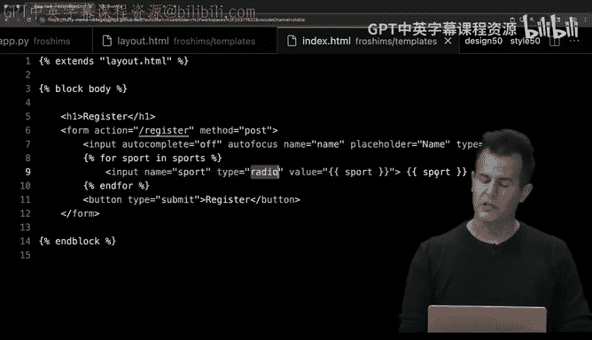

Exclusivity， in fact， if I view page source in the browser。

 you'll see that all three of the inputs that were dynamically generated， typey equals radio。

 type equals radio， type equals radio also have identical names。 And so that's just how that works。

 And that's the only change necessary。 If I now go ahead and type in my name， David basketball。

 click register， were still up and running。 because what the server gets is still exactly the same inside of request dot form they can access。

 you can still access name or sport no matter what type it was in the user's own browser。

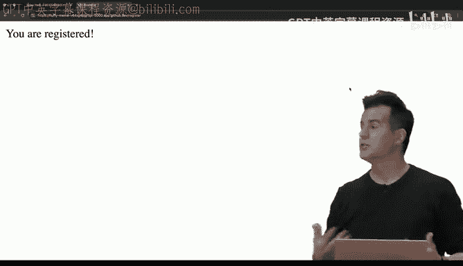

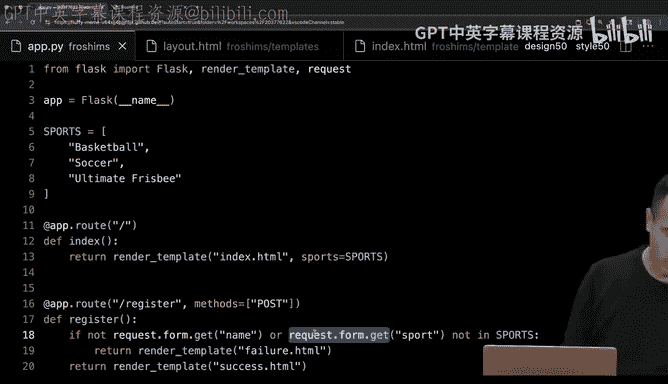

Questions on these techniques。Al right， well， it's kind of obnoxious that when you don't do something right in this website。

 Like forget your name， but do select a sport。 All you are told is generically you are not registered。

 Like itd be nice and much more user friendly， better UX user experience。

 So to speak to actually tell the user what's wrong so they can actually fix the problem。 Now。

 there's a bunch of ways we can do this。 But I'm gonna propose that we go ahead and do this。

 Let's create a template called error do H Tl， whose purpose in life is just tell the user a little something more about what they did wrong。

 So I'm going go back into my terminal window here。

 I'm gonna code up a file called error do H TMl enter。

 And I'm gonna go ahead and before as before extend layout do H TMl learning from my past mistakes and closing that。

 Then I'm going go ahead and do body block down here。 And then inside of this block body。

 I'm gonna go ahead and have just some simple text like an H1 tag that just says error to the user a paragraph tag that's gonna contain some error message to be。

😊。

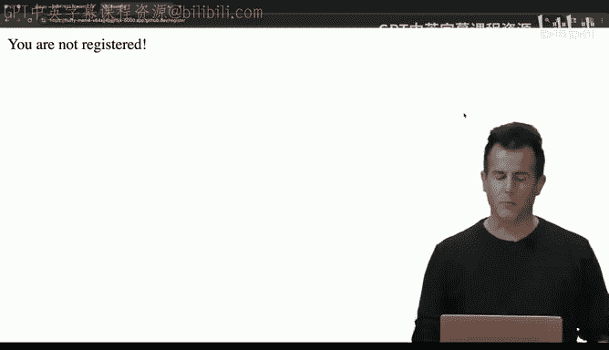

And then that's it for now。 So I've got the template for an error message screen。

 Let me go back into app pi now and let me add some logic because app Pi does know what's wrong。

 It's just at the moment we very generically returning a failure template instead of something more precise。

 But if I know that the user hasn't given me their name let me say that error message。

 So let's actually get rid of these two lines and be a little more specific like this。

 So if how about let's do it like this。 How about validate the users name first。

 So name equals request form getqu name that gives a variable containing the user's name。

 If they didn't give me a name， which I can express with just if not name like if name is blank or none。

 then let me go ahead and return render template of that error template。

 but let's pass in a specific message like missing name。

 And so by passing in another argument to this template called message。

 I can trust that flask will dynamic。outputput that message where I tell it to using the old curly braces。

 Meanwhile， let's go ahead and validate not just the name， but validate sport。

 I can do this in a couple of ways。 Let's do this。 So sport equals request form do get unquote sport then in here。

 let's say if there's no sport， go ahead and return render template。

 error do HMl comma message equals missing sport， So quite like name。

 but we can be more specific now， too， if the sport they did give me is not in the global sports list。

 Well， then it's like Kelly trying to register for volleyball again。

 So let's return render template of error do Hml。 But this time the message shall be in valid sport or something like that。

 So we're being ever more clear。 otherwise， they are presumably confirmed because we got this far logically。

 So if I go back to the other browser tab， go back to the form And let's go ahead and type in no name and just click register。

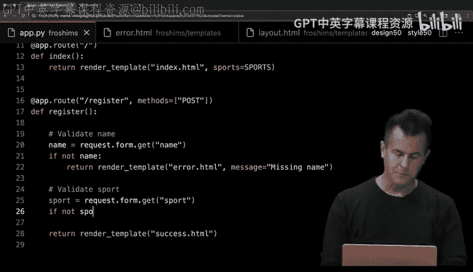

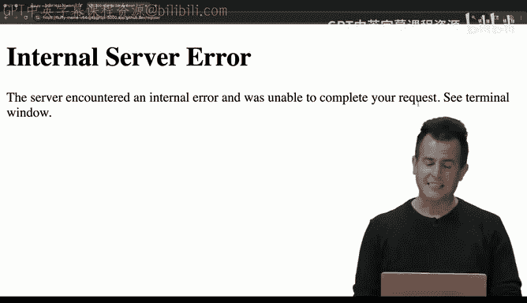

Okay， what did I do wrong Exally。 So let's go back to V S code， open my terminal。

 open the first terminal window where flask run is running Un encounter unknown tag body。

 So I did something stupid in error dot H TM L。 So let's go into error dot H TM L。 And Bo block。 Oh。

 let's subtle。I just transposedse the words。 It's supposed to be block body。 That was dumb。 Allright。

 block body。 I think that's correct。 So let's go back to the browser。 Let's reload。

 It's prompting me to reconfirm that I want to submit the exact same form。

 which recall had no name and no sport。 But now I see an error in a good way。

 This is not an server error。 This is my error missing name。 Now it's not super user friendly。

 but it's at least more explanatory than you are not registered。 All right， let's go back。

 let's give it a name， but no sport register。 missing sport， Let's go back。

 let's go ahead and give it a sport， but sport， but no name missing name as before。

 And if I took the time to actually hack the H and do what Kelly did before and add volleyball。

 it would similarly say invalid sport in this case， too， because it's not in that same list。

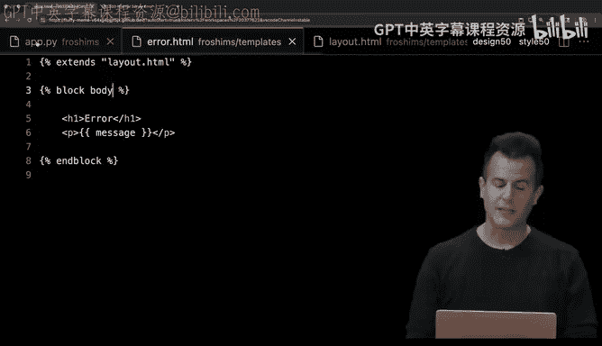

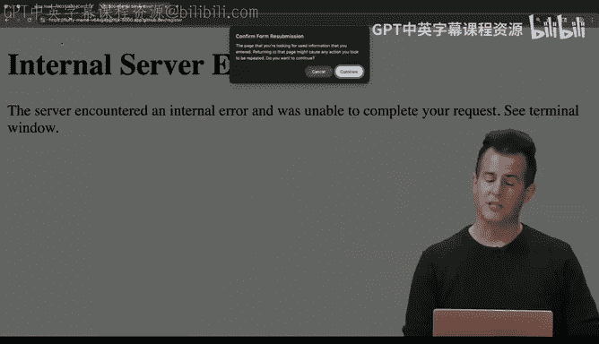

All right。Questions on this technique。Alright， well。

 it's all fine and good to have a registration site that does this。

 But it's literally just throwing out the information。

 And what I did like years ago was actually even cut a corner initially where I think I wrote code that just sent an automatic email to the proctor running Frosh I ams containing the person's name and the sport for which they registered。

 But that was very quickly replaced by a better feature。

 which is actually store the data in the server itself and keep track of it。

 rather than just send it off via email。 So let's do a first pass at actually storing information on everyone who is registered for sports。

 Well， let me go up here。 And let me create another global variable to make my life easier here called registrants and set this equal to curly brace。

 close curly brace。 What do these two characters represent。 if empty especially。😊。

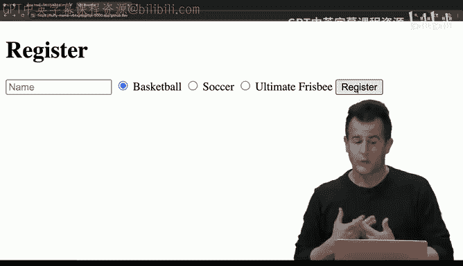

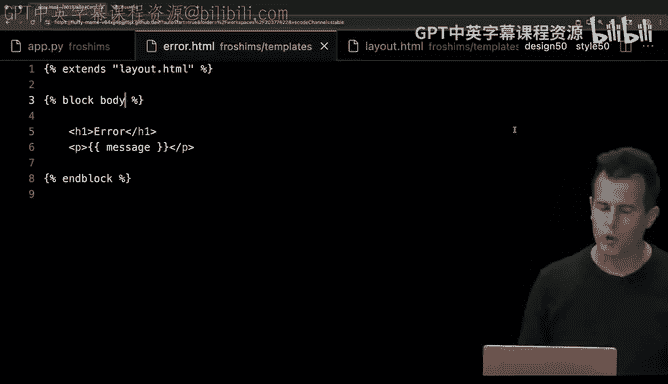

What data type is this？It's a dictionary。 So it's a python dit。

 So you could similarly say dit explicitly open print andclo print。

 but it's more pythonic generally to just use two curly braces。

 This is just giving me an empty dictionary。 Why， well。

 I want to store the two things I'm collecting about all of the students。

 their name and the sport for which they registered。 So key value name sport。

 So how can I go about doing this。 Well， it's pretty trivial down here in my register function。

 recall that I'm just kind of naively saying you're registered。

 even though I'm not doing anything with their name or sport， but that's easy。

 let's remember the student for real now。 So in that registrants dictionary。

 let's go ahead and index into it using the students name。

 David or Kelly or whoever and set that equal to the sport for which they registered And now notice the name is coming as before from request form get the sport is similarly coming from that function。

 And so this is just remembering that key value pair。 So that's all fine and good。

 It's in the computer's memory。 How do we。😊，see it。 Well。

 wouldn't it be nice after you register if you could see the actual registrants of the website。

 Certainly if you're the proctor trying to run the sports。 Well， yes。

 so let's go down here and let's create another route， like slash registrants。

 which is just gonna give me a list of everyone who's registered。

 Let's define a function called registrants I could call it anything I want。

 And this one's gonna be relatively simple， Let's render a template called registrants。

 which will soon exist and pass in all of the registrants that are in that global dictionary。

 And again， I can call this placeholder anything I want， But inofar as it contains the registrants。

 I'm setting registrants equal to the registrants global dictionary。

 So let's go now into my terminal window and create registrants Hml and create really the beginnings of an actual fro Ims website that's going show the proctor who has now re。

 So let me go into the terminal and do code of registrants Htl and。The terminal。

 let's try to get this right。 Finally， extends layout dot Htl close quote close bracket there。

 Then let's do block body in the right order， then end block down here。

 and then inside of the block here， this is gonna be a bit more of a mouthful。

 But let's use some of our Htl from last week。 we'll give an H1 tag that says registrants。

 So the proctor knows what they're looking at。 Then let's put this in a table， for instance。

 with two columns， names and sports。 So table tag followed by a Thead tag for the table heading。

 Then that heading is gonna can name just a single row for T R。

 And each of those has a T H table heading， one of which and actually I'll make it tighter is name the other of which is gonna be sport。

 So these are the column headings， the table headings， T H tags for sure。

 after the head of the table， let's go ahead and do a T body for table body And inside of here。

 this is where Gingja comes in use。 I can say for each name in the registrants。

 placeholder that was plugged in。😊，And for proactively。 what do I want to do on each iteration。 Well。

 I think want to output table row table row table row。 And in here I can do T R。

 and then inside of that a table data for the cell on the left putting in the students's name which is coming from this for loop。

 just like in Python and then one more table data namely the registrants placeholder indexed into at that name。

 which because it's a dictionary will give me the sport for that student's name。

 And then I think we're good to go。 And in fact， just to hark back to something I said last week when we were imagining actually this is in week five when we were talking about stacks。

 and like your Gmail or outlook inboxes essentially a stack with the newest emails on top。

 and I hypothesized at the time that it's just row after row after row after row when we started talking last week about Hl。

 here is what Google and Microsoft and others are probably doing anytime you have tabular information in a page。

 they've got some data in memory like the registrants。

 and they're just using code like this in Ginja to output table row， table row table row。😊。

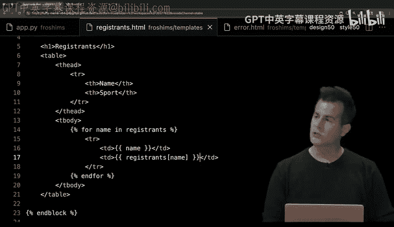

This is your email instead， same exact idea。 And now we have the ability to express that kind of logic。

 So let's go back now into the browser。Click reload on the form。 Let's register， for instance。

 David for basketball。 click register。 It claims I'm registered。

 but hopefully now I'm legitimately registered because that variable is storing it in memory。

 And in fact， let's go ahead and go now to not slash register but I'll zoom in at the top registrants and hit enter。

 and we will see a very ugly but functional H Tl table containing two columns name and sport。

 this are calledled T head in which David and basketball are present。 Moreover。

 if we now go back to that form， and let's try registering Kelly， for instance， for soccer。

 click register。 Now， let's manually go to registrants again。 Now。

 Kelly and David are in the server's memory as well。Questions， then。On what this example。

Is now doing or how it's achieving these results。Really good question。

 If you wanted to restrict the registrants page to only certain people。

 I would have a password on it。 And in fact， one of the next examples we'll do in a few minutes is a login page for exactly that reason right now。

 just sort of on the honor system that only the proctor in question goes to this URL。

 But just for the sake of discussion actually suppose that you did want the re list to be public if only to like hyp up whos already registered。

 Well， it's not good to just tell people go to thelash registers URL。

 We can actually link them to that in a few different ways。 So for instance。

 I can go down to how about let's say success do Htl。 So let me open up success do Html。

 it just says you are registered， I can do something like this。 A H equalslash registrants。

 So I have control now over my Hl and the route。 Solash registrants will exist。 See who。

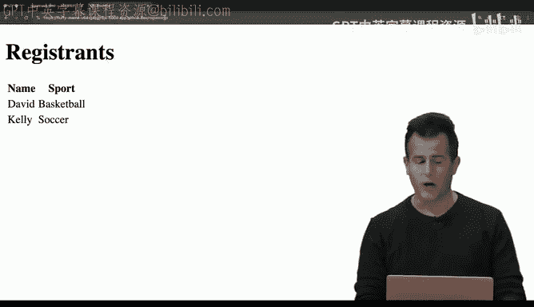

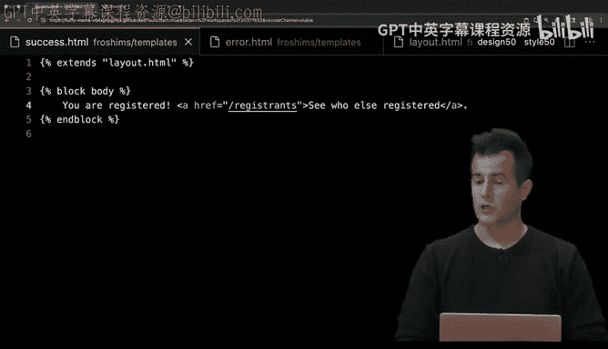

Et registered period。 So this will create a nice little H T L link that links me to that route。

 So let's try this。 So let's go back to the form。Over here。

 let's go ahead and register John for ultimate Frisbee and register。 Alright。

 And now we see you are registered， see who else registered。 And if I hover over this。

 it's super small， but it would have showed me in the bottom left corner at the link。

 And indeed here now is John at the bottom of this table。 And just to be clear。

 if I view page source on the browser。 you see all of the T Rs that we dynamically generated on the server side before they were sent as such to the browser。

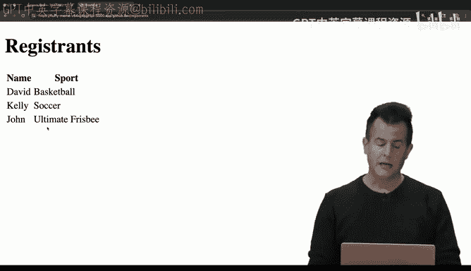

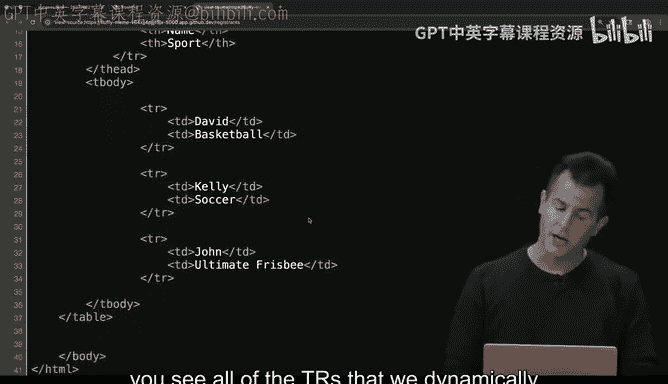

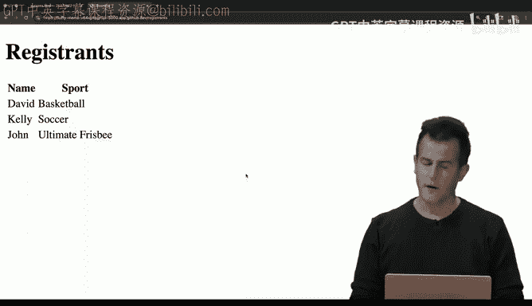

Al right，What if we wanted to do something slightly more elegant here。 Well。

 I don't have to just use this H TL hack。 like why don't I just show the user who has registered automatically。

 And this is kind of a cool feature of web apps as well。

 In addition to importing flask render template and request。

 I'm gonna also import a function called redirect that comes with flask And indeed。

 rather than just show success HMl， I'm gonna go ahead and return the result of redirecting the user tolash registrants。

 So to be clear， I'm in my register route。 And instead of showing them the success page anymore。

 which I might as well delete at this point。 I'm just gonna redirect them to this list of everyone who is registered including themselves。

 So if I go back over here and type in someone like Doug。

 who maybe will play basketball with me and click register。

 Watch what happens to the URL at the very top of the screen I'm automatically whisked away to registrants in this case。

 I made a change to the code though， And so the server smart enough to reload。 So Doug is now。😊。

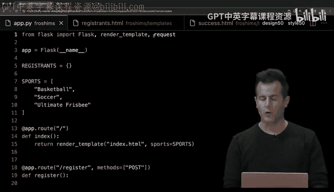

The only one in the database， and this actually hintset。A problem we should really solve。 Like。

 in fact， let's do this real fast。 Let me go ahead and register myself again for basketball register。

 Now， it's Doug and David。 The catch， though， is if this server ever goes offline。

 maybe because it needs to be updated or it crashes or it reboots when you hit control C and get back to your terminal。

 flask server is no longer running， which means that global variable called registrants and all caps is gone。

 It's like free the memory has been freed。 So if I were to rerun flask now。

 as would happen automatically if the server itself rebooted， well， this is not great。

 because if I go back to the registrants page and click reload， no one has registered。 And in fact。

 that's what happened would dug a moment ago， because I changed my actual app pi flask was smart enough to realize。

 oh， wait， the code is changed， I better reload the program。

 which gave me a brand new version of that global。😊，Dictionary。

 so what would be better clearly than storing registrants in memory， in Ram。

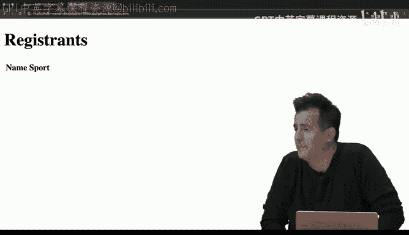

In a variable in the server。呀。Yeah， so in an actual database。 And so here's too。

 where everything kind of comes full circle and connects again。 So let me go back into app pi here。

 And I like generally the logic of what I've done， I don't like the fact that I'm just storing my registrants inside of this global variable。

 which is again， just in the computer's volatile memory。

 Let's actually put this in a database instead。 So let me go up here and get rid of this global dictionary。

 and let me do something a little smarter up here， let me import from C 50s zone library。

 the SQL function that we've used before。 And again。

 even though we've been taking off almost all of C50's training wheels。

 the reality is using C 50 SQL library， even through final projects just makes using SQL in Python so much easier。

 But there's certainly thirdpart libraries you can use。

 let me go down now in in addition to creating my app。 let's create a database D for sure。

 setting that equal to SQL light and then SQL colon which is not a typo And let's assume that the database shall be called Fro I do Db。

😊，On that in a moment。 And then down here， now that I have a database variable。

 let's not remember the student by storing them in this dictionary。

 Let's actually execute a line of SQL。 So D B dot execute。 insert into。 Well， wait a minute。

 What am I gonna insert them into。 Well， thankfully， I came prepared for this。

 And let me go back into my terminal and make it large for a moment。

 Let me go ahead and run SQL light 3 on Fro。 I ams No， I didn't come prepared with this。 one second。

 let me grab a file that I thought I came with。 from。😊，ちち。然后说 yeah。Okay。Not to worry。

 I came prepared for this。 So let me go ahead and maximize my terminal window and then run SQLite 3 of a file called Fro Ims do DB。

 And this is a file I made in advance， but it's super simple。 In fact。

 if I type do schema just to see the design of this database。 You'll see that in advance。

 I created a table in this database called registrants。

 It has a column called I D a column called name and a column called sport and the primary key of this table is to use the I value。

 which is just an inger。 And now notice I have some constraints here。

 I want the user to give me a name and a sport， So I've specified that it's not just text it's not null that is null value should not be possible to put in here。

 Allright， so let me go ahead and exit out of sQLite 3， let me go back into my code editor here。

 and now I know what to insert into insert into the table called registrants。 What Well。

 I want to insert how about name of the student and the sport for which they registered。

 and the values therefore that I want to insert are going to be。😊，They came from the post request。

 Here's where you do not want to make yourself vulnerable to sQL injection attacks。

 No F strings in here， No just plugging the students's input in blindly。

 This is where and why we use these placeholders in both C50s library and in many libraries in the real world to specify that I want the library to properly sanitize the user's input and get rid of any scary characters like apostropphes or semicolons or the like。

 So I'm gonna pass in name and sport。 And this one line has the effect of。

 as you recommended storing the registration in an actual database on the server not just in volatile temporary memory。

 But we do have to change one thing， This line here is no longer valid because there's no global variable there via which we can get all of the registrants。

 But that's no big deal。 Here's how most web apps we do this。

 I'm going to define a variable called regiiststrants and set it equal to DB execute。

Of select star from registrants。 It's as easy that to just get all of the registrants from my database。

 And down here， there's no longer an all capitalized variable， But there is a lowercase1 registrants。

 So to be clear， in my register route， I am inserting the user into the database。

 and in my registrants route， I am selecting the users from the database。

 And then the rest of the code， I think and stay the same。 So let's go back to Fche I here。

 go back to the form， let's register David for basketball register。

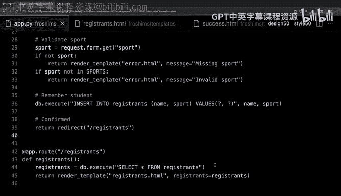

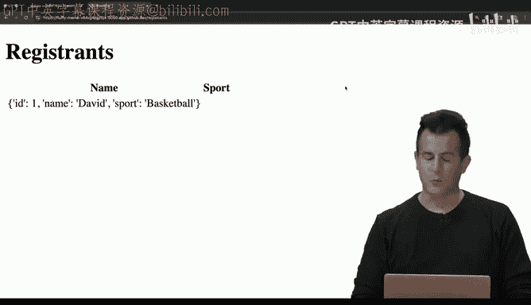

Ah， I did screw up。You're seeing some weirdness here。 What are you actually seeing？

There's one user registered。Not intentional， but what does the syntax suggest we're looking at。

This is a dictionary。 recall that the DB do execute method that comes with CS50 SQL library gives you a list of dictionary objects。

 and so because there's only one registrant at the moment。

 you're seeing my dictionary for my registration， which is not what I want to show here and I forgot I need to also go back into the regiiststrants template to tweak my syntax as follows。

 let me go back into VS code here。😡，Let me go into registrants dot H TM L。

 And because I am passing in now not a dictionary， but a list of dictionaries。

 I just need to think about the problem a little bit differently。

 So my syntax here is going be for each。 Let's do this as follows。For each registrant。

In that registrrant list of dictionaries， go ahead and display the current registrants name and go ahead and display the current registrants sports。

 In other words， I'm using Python syntax， which works as well in Ginja here。

 this iterates over the list of registrants， each of which is a dictionary。

 So I'm using dictionary syndax。 Now， to index into the name key of the regrant di object and the sport key of the same so。

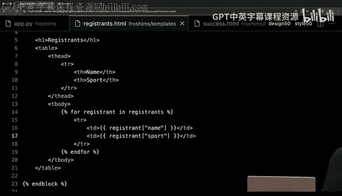

Now， let me go back to my browser。And I'm just gonna go ahead and reload the registrants page without resubmitting the form。

 Now there it is。 David and basketball。 And now let's go back to the form and register a couple more people。

 Kelly for soccer register。 notice where the registrants link， Kellys indeed still registered。

 Let me go back to this。 And let's register John Ul Frisbee register。

 Let's go ahead and kill the flask server by going to my first terminal window。 control C。

 And now let me go ahead and rerun flask， which was bad before。

 that's how Doug ended up the only registrant last time。 But this time。

 if I go back to the registrants page， and immediately click reload。

 even though the server is running a new in memory， the database is persistent。

 which was the whole point of using SQL from week7 onward。 and let's do one more for good measure。

 If I go back to the form， will register Doug。 So he can play basketball with me too。

 And we even have Doug now in the database， It's an ugly looking table。 But the data is， in fact。

 all there。😊。

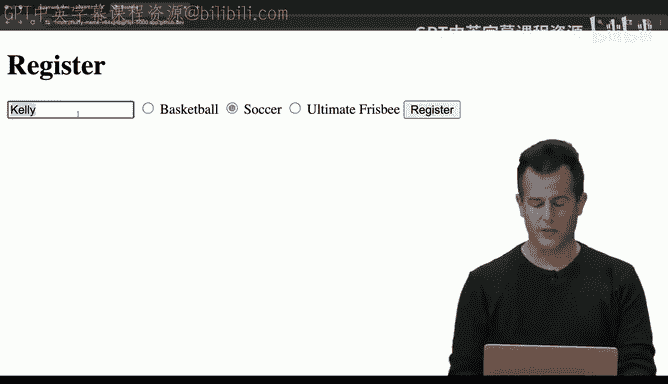

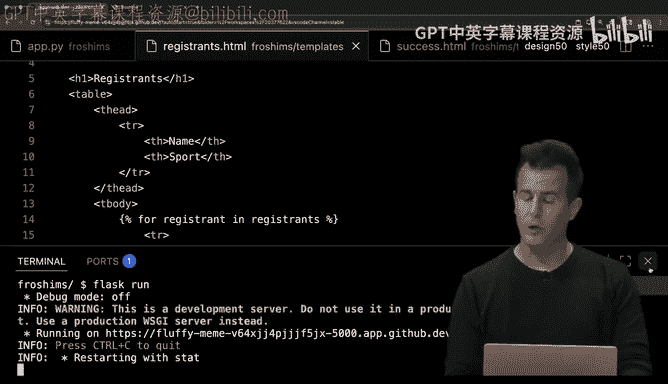

All right， questions now。On this improvement， which is getting closer and closer to what the actual f Am's database did。

 website did so many years ago。Alright， well， let me propose this now。

 We have this table of registrants。 Suppose that maybe Kelly was not a very sportsman like when she played soccer last time。

 So we want to deregister Kelly from soccer。 That is note， we're gonna reject your registration。

 Let's think for a moment about the design here。 Like。

 here's an H L table containing names and sports， And wouldn't it be nice if we could add a button that would let me deregister Kelly or anyone for that matter。

 When I click on that button， What information should ideally be sent from the browser to the server。

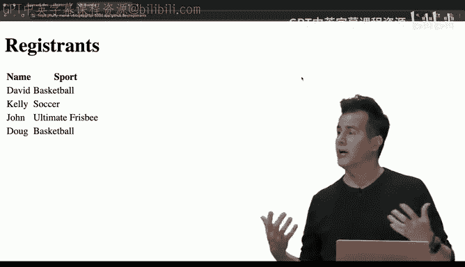

To remove someone like Kelly from the database。Yeah， the idea of the person。

 and you're proposing I instead of name， why。Exactly。

 the I uniquely identifies the user in the SQL table。 So in fact， let's see this real quick。

 If I go back to V S code and we'll revisit essentially a week 7 issue here。

 let me go back into my second terminal where I can again run SQL light 3 after maximizing my terminal。

 And before I just wrote do schema to see what the table is now I'm gonna literally run select star from registrants in SQL light 3。

 and we'll see a little Askr table of all four of us who registered， but we also see the unique I。

 And the value of the unique I， recall from week 7， is that it's the so-called primary key。

 It is the value that uniquely identifies users as minimally as possible。

 And that's a good thing because if we have another Kelly registering for Frosh I ams。

 we don't want to deregister the wrong Kelly or both Kellys。 We want only Kelly with Id of two。

 So somehow the button we add to the registrants page should contain in it。

 the Id of the person we want to delete。 because if you do pass the Id of the person that you want to delete。

😊，To the server， the server can do some kind of select looking or some kind of delete statement using that I D number and delete just that row。

 So there's a few ways we can do this。 But let me propose that we proceed as follows in our registrants route。

 which is where we can currently see all of these users。

 Let's go ahead and output an ugly but functional form for each of those users。

 So let me go ahead and minimize this。hideide my terminal window。 And in registrants。

 let's go ahead and just do this。 In addition to outputting every registrrant's name in sport。

 let's also output a third column whose purpose in life is to contain an Hl form。

 The action of that form will be a route like D register。

 And the method we're gonna use is going to be post just so that we don't accidentally store personally identifying information in URL or such。

 This form is going to have a button， the type of which is submit and the button is going say de register。

 and I could now implement the I D in a couple of ways。

 I could do input name equals I D type equals text。

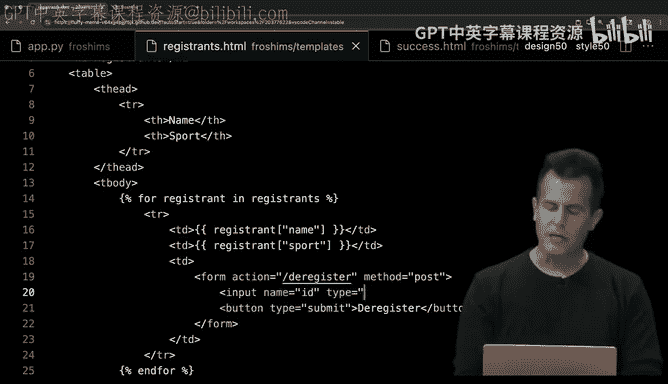

And now， if I go back to my other browser tab and reload。

 I should see a button for every one of these registrants。 And I do。

 But this is kind of like the honor system where I just let the user type in the Id of who they want to delete。

 and it's sort of weird that I have multiple forms in that case。

 But here is where dynamically generating H Tl can get pretty useful。

 Let's change the type of this input to hidden and set the value of this input to be whatever the current registrants Id actually is storing this in here and let's go ahead and not confuse this So we'll use single quotes on the outside instead。

 So inside of this value， I'm putting the current user' Id。 So if I go back now。

 notice that the text boxes are gonna disappear。 but the buttons will not。

 But all of that information still there。 if I right click or control click and open up my developer。

 let's open up view page source because it's just a bit bigger。 noticeice that David。

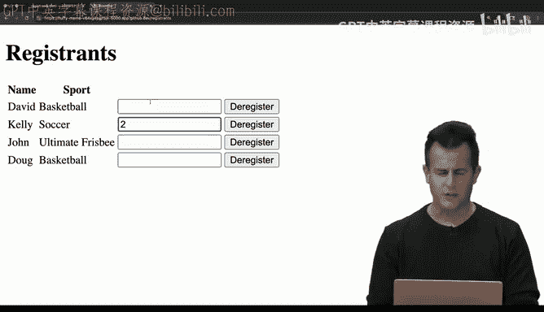

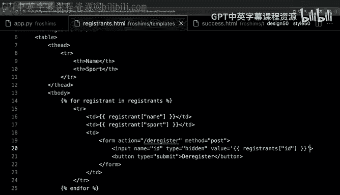

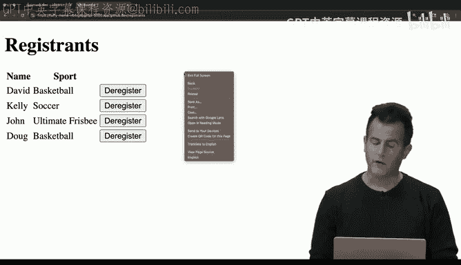

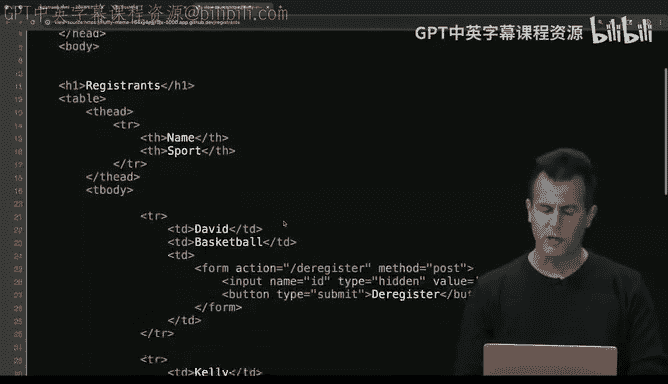

Heelly and John and everyone else here has the same HTML as before。

 plus another column containing a form that contains， I somehow messed up still， why is this blank。

 so this is still not good？😡。

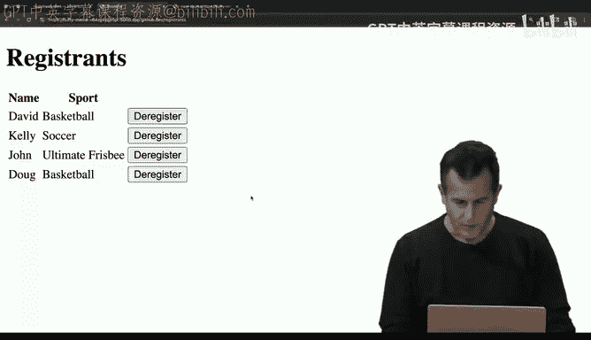

Thank you。 I accidentally pluralized this， but it should be registrant because I'm inside of this for loop。

 and each iteration gives me a variable called registrrant。 So user error on my part。

 So let's go ahead and dramatically do this again， let me view page source of the same page。

 scroll down a bit。 thankfully， there is now for every one of these registrants。

 a hidden I D for one for me2 for Kelly。 And I bet if we keep scrolling。

 we'll see3 for John and4 for Doug。 So now this form has enough information。

 even though there's no user input other than the clicking of the button to tell the server whom to delete。

 So how do we delete the user from that particular registration table， Well。

 I think we just need to add a route。 So let me go back into the S code here into app dot pi。

 and let's go ahead and create another route， for instance， in here， say put it up here below。

 up here below index。 So app dot route， unquotelash D register。😊。

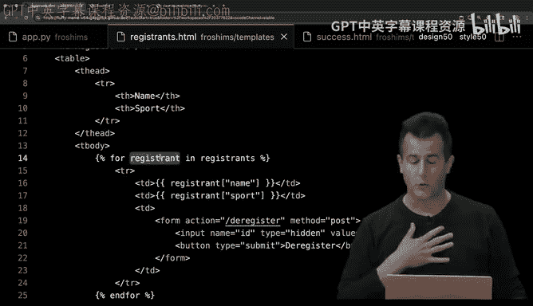

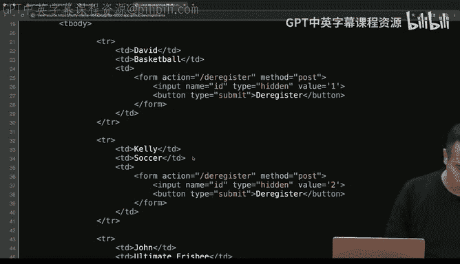

D register。 and now def D register。 But I could call it anything I want。 And how do I do this。 Well。

 let's first get the Id from the form I D equals request dot form dot get quote unquote I D。

 Let's do a bit of a sanity check here。 So if there is an I D。 and it's not blank for some reason。

 go ahead and do DB dot execute delete from registrants where I D equals question mark。

 And now let's pass in the user's actual I D。 And then no matter what。

 let's go ahead and redirect the user back to the registrants page so we can hopefully see the result of that change。

 So again， I'm just using a bit of sQL per week 7， I'm using a placeholder by using the question mark passing in the actual I D from the form。

 And I'm only doing this if there is an I D that was passed in。

 And I'm letting the database actually do the deletion。 Allright， so let's try to do this。

 Let's go back to the browser here。

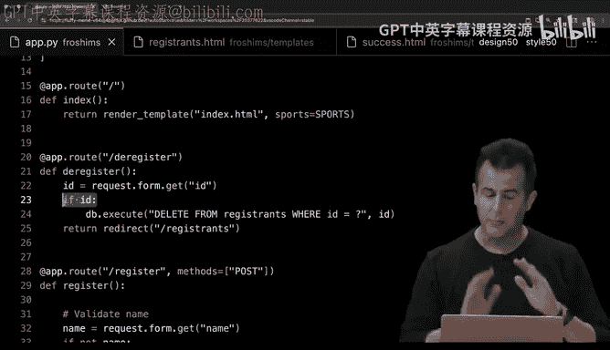

Reload the slash restrants page for good measure。 Let's discree that Kelly is now deregistered by clicking this button。

And a， so close。

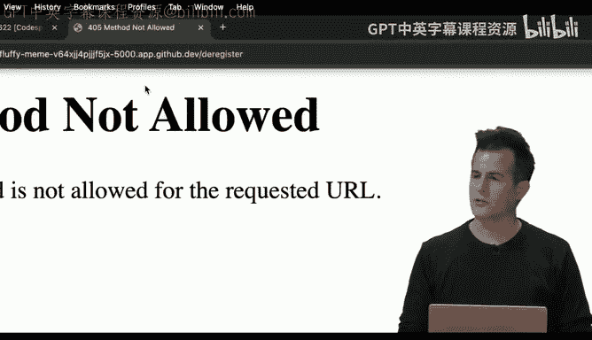

Method， not allowed。At the D register route， what did I do wrong？Let me go back to the code。

 What's wrong with my de register route。WellWhat method is the form using If I go back to registerants HTMLtl。

 the form is using post。Yeah， so I can need to override the default， which is get。

 So I need to go up here again and just change an argument to be methods equals。

 and then in a list containing only post now instead of get。 Allright。

 let's go back to the form and go back。 And now let's try to deregister Kelly， She's gone。

 Let's get rid of me now， I'm gone。 And indeed， if I go back to V。 S code。 open my terminal。

 maximizeim it and select star from registrants again。

 You'll see that the two of us are indeed gone in this case。😊。

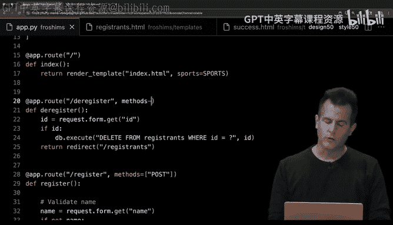

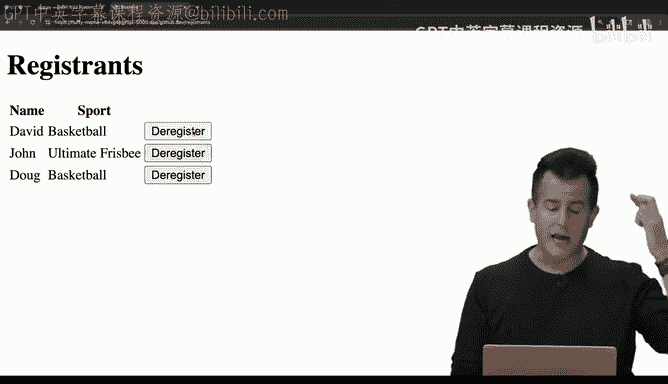

Questions now。On this technique， because now we have most of the plumbing in place for adding people to a database。

 de leading people from a database。 It's very similar in spirit now to most any website that has this kind of。

Interactivity。Alright， subtle question。 I deliberately in my register s H T L file， used post。

 as we just discovered， instead of get。😊，Why， though。

 because it wasn't that strong an argument that I hinted at earlier if like， oh。

 I don't want like Kelly's I to end up in my URL bar or mine。

 like Is are not really personally identifiable。 They're just opaque integers at the moment。

But why would it be bad if you could delete people by using the get method。

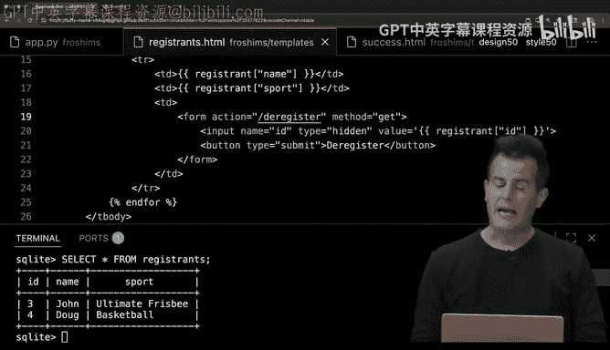

So this is kind of subtle， but the catch with using gett is that by definition you can visit that resource。

 that route by just typing in a URL or following a hyperlink。 So for instance。

 if an adversary were two， type a URL like slash regstrants question mark ID equals oh I don't know4 and then send me this URL in an email or send this URL in an email to the Proctor who's running the Frosh I ams program if that proctor simply clicks naively on this link as my code is implemented now。

 and I've used gett instead of post what's going to happen。

Doug gets deregistered just because the Proctor followed a link in their email。

 and this is hinting at the kinds of phishing attacks that are possible too。 bad design。

 like generally when you are using get request that is just simple URLs that are clickable or typable。

 they should not have the effect of changing data on the server。 Post is much better。

 if only because you can't just click a link and post happens to induce a post request。

 you almost always have to click a button。 So at least this case， the Proctor would receive an email。

 they would have to receive an email， click on a link， and then they would see a web page like this。

 they clearly has a button labeled deregister or the like。

 which is an additional layer of protection。 And there's even more attacks that you can wage by supporting get So in general。

 post requests are preferred anytime there's anything remotely personally identifiable or remotely destructive。

 like actually changing data on the database like this。

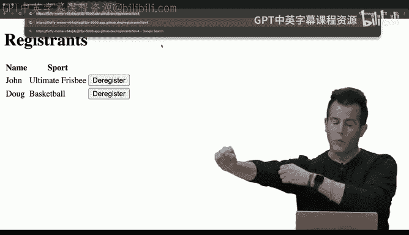

Alright， well， what more can or should we do with F I ams， perhaps， Well。

 let's see maybe one or so final flourishes here。 if I want to go ahead and maybe make those error message is a little more interesting。

 Let's do that for just a second。 Let me go back to my other browser tab here。

 Let's go back to the registration page where the form is and let's deliberately not cooperate and just click register so that I get an error about missing name。

 Well， wouldn't it be nice if we made this a little more userfly by including like an image on the page as is commonly the case。

 Well we can certainly include images in websites using the image tag， but the catch is。

 we actually have to be a little more clever about how we store the image on the server in order for this to work。

 So， for instance， let me go into that error page， we don't need success open anymore we don't need layout anymore or this index anymore。

 Let's focus on error。 And suppose that I did want to include an error message containing like a grumpy cat on the screen。

 Well， ideally， I would just do alt。

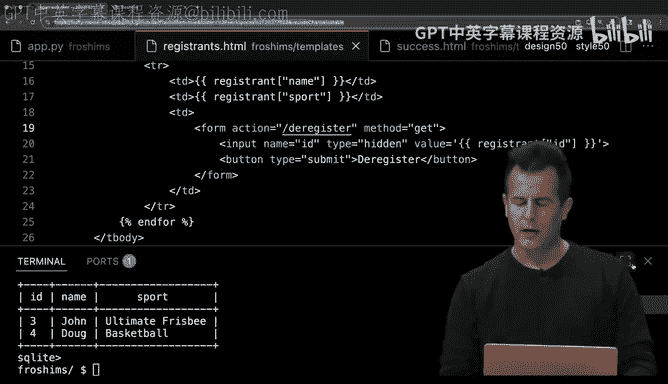

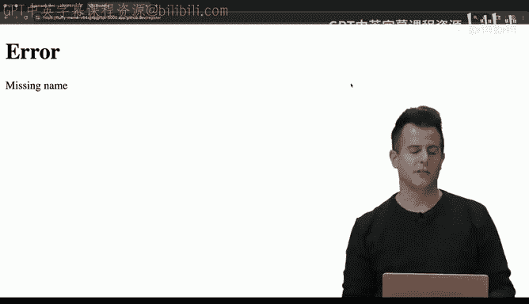

I would do open bracket image source equals。 and then something like cat dot Jpeg。

 where cat dot Jpeg is the name of a cat in this current folder。 And just to be clear。

 let's have an alternative text of grumpy cat for screen readers or slow connections。

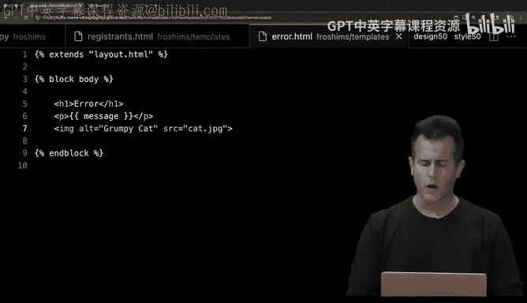

Okay， this， unfortunately， is not going to work。 Let's go over here and induce the same error by just reloading and submitting the same form。

 And you'll see， indeed， a broken image。 because that image that cat dot Jpeg does not exist But we do at least see the alternative text。

 Well， I did come prepared with a cat already。 And so let me go ahead and grab this cat from another folder。

 And this cat is going to contain is going to exist in a file called cat dot Jpeg。 And indeed。

 if I type L S Now。 after having grabbed a copy of that cat， it exists alongside app dot pi。

 See good。 Let's go back to the browser here。 Let's reload。 And we should see。

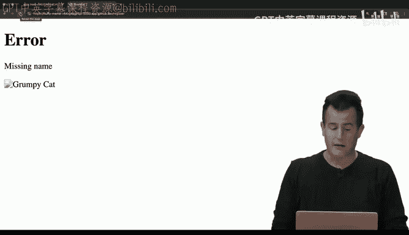

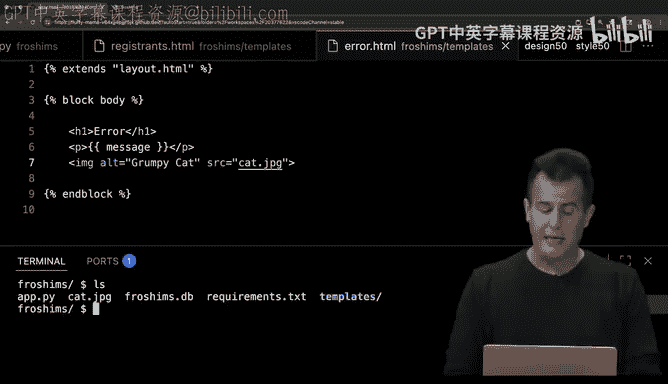

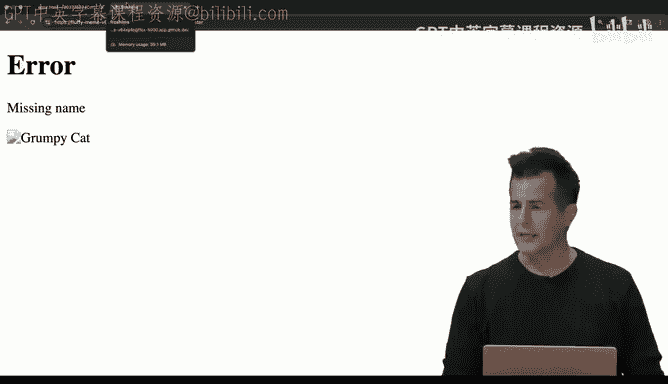

Still no cat。 Well， why is this。 Well， this is a side effect of using the framework as well。

 It turns out for organizational sake， any images you want to display on a page or any Css files or javascript files that you want to embed into a page if they're static assets should actually be in a folder called static and by static that just means unchanging。

 you or someone else wrote them once and they're not dynamic in the way that apptop pi is。

 So I'm actually gonna to use my Mv command and move cat do jpeg into the static folder。 Indeed。

 if I type L S now， cat is gone， but it is in the static folder。 And now if I go back over here。

 I think will be good， except that I do need to go into error dot Htl。

 and say that the source of this image is actually inlash staticlash cat do jpeg to make clear it's in that folder。

 And so indeed， when I now reload the page once more now I see a very grumpy cat。

 at least guiding my error message。😊。

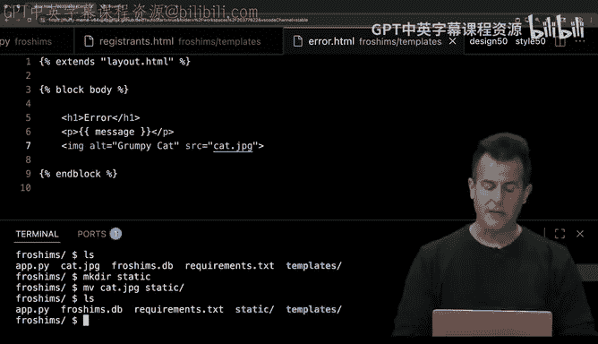

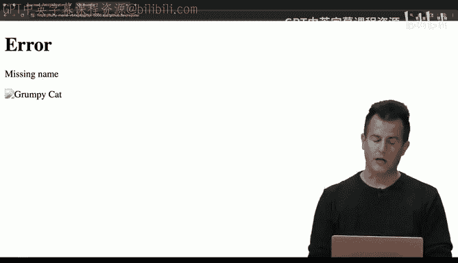

But there is a difference here。 even though when accessing the static directory。

 I have to be explicit， notice that this whole time。

 we have never once mentioned the templates directory。 The render template function to be clear。

 knows automatically to look in the templates folder for your template。 You do not。

 and you should not say something like templates here， you simply specify the name of the file。

 But in the and the H Tl template， you do actually have to include。

 as I did slash static in the H TM L。

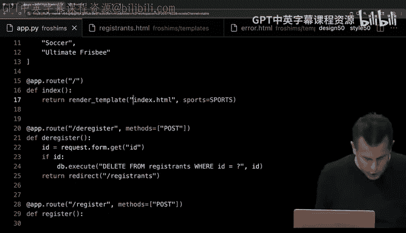

Alright， let's do one final flourish with the actual code。

 Suppose that it's time to modernize and let people register not just for one sport as per the radio buttons。

 but multiple sports。 It's a little obnoxious to make me go back and fill out my name again and again and again。

 if I want to register once twice three times for sports。

 So why don't we go ahead and in terms of U I change those radio buttons to checkboxes。

 That's a very easy fix， let me go into my templates folder and into index do Hl， where this form is。

 And if I want to change radio buttons to checkboxes， literally just change radio to checkbox。

 If I go back to the browser here and reload， you'll see the familiar checkboxes now。

 which are not mutually exclusive。 it lets me check multiple ones。

 thereby registering for multiple sports at once。 But my logic has to change a tiny little bit here。

 whereby if I want to go ahead and get all of the sports for which the users registered。 Well。

 that logic has to change in app pie。 So where is my register route down here。

 And we haven't touched this in a while。 But recall that the。😊。

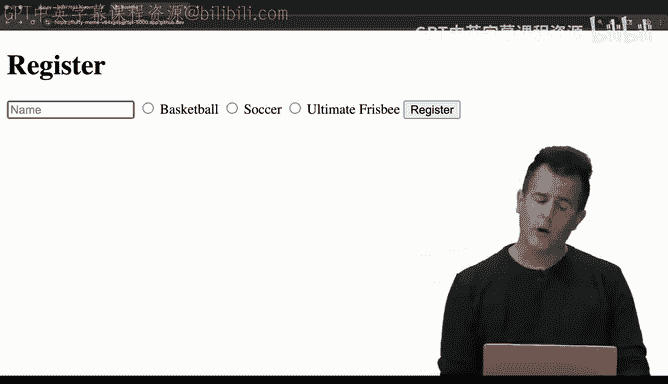

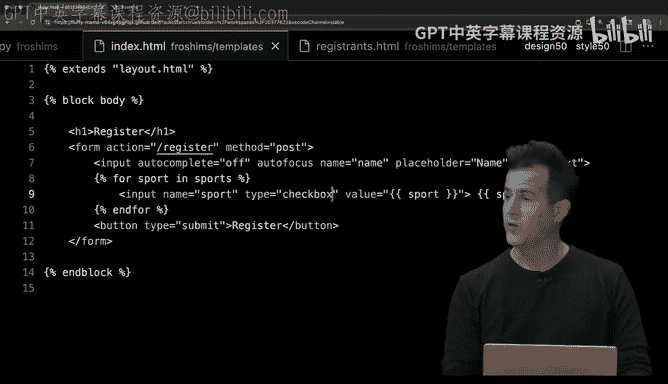

ister route here。Has a validate name， chunk of code， validate sport， chunk of code。

 And we most recently did the insert into chunk of code as well。

 But if the users registering for multiple sports， I'm okay with having one row per sport。

 even though I'm sure we could do better than that。

 But how do I iterate over all of the sports that the user gave me。 Well。

 I need to change my validation code here a little bit。

 If you know the user can select multiple values， as with checkboxes。

 you're gonna to use request do form dot get list and then the name of the parameter that you want to get the value of。

 And then this is gonna give me back a list of values。

 So I'm gonna to go ahead and change semantically my code to say sports。

 because I'm expecting zero or more sports now instead of one。 So if there are no sports。

 we're gonna just say missing heck missing sports。 But then I can't simply do this。

 I can't just say is the sport for which the user registered in that array or not。

 because they might have given me two sports or three。😊，So logically。

 I should really check all of the sports that the human typed in for me。

 And I should probably do something like this instead。 So for each sport。

In the sports that the user typed in， go ahead and ask the question。 if that sport is not in sports。

 then go ahead and output in valid sport。 So it's just a bit of tDium here。

 We're just adding a bit of logic。 But this way， I'm iterating over every checkbox that the user checked and making sure they didn't do what Kelly did earlier and sort of make up her own sport and submit that to me among all of the others But this now should let me。

 let's try。 Let's re and then actually one other line here。

 We also need to do it down here for each sport in sports we better execute that line of code multiple times。

 So let's see what happens。 Let's go ahead and register David for actually。

 let's see what who's in the database still。 So registrants。 So we've got John and Doug。 No。

 David or Kelly。 So let's reregister David for basketball and soccer。 Click register。

 And now I'm indeed register for both。 And I observe that it's kind of。

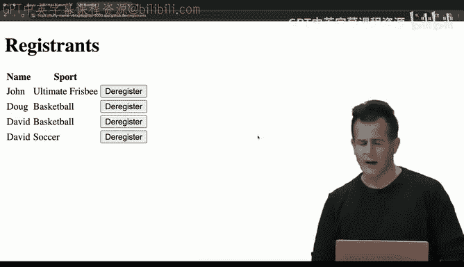

Bad design that I'm just inserting myself twice into the database。

 So let me go ahead and open up the Fsh Is database one last time。 Let me do a select。

 Let me do a select star from registrants。 You'll see， too， that David and David are both there。

 What would be a better design here。To get rid of the redundancy。

And to know that I'm the same person， ideally。Yeah。Yeah。

 I should probably have an I D for the the person as well。

 So this is gonna complicate it more than we want to play with today。

 But instead of just a registrance table， I should probably have like a student's table that has an I D for every student and the name of every student and then change this table。

 as we've seen with the IMDB database and others， I should really be storing the Is of the students。

 the Harvard Ids， if you will。 and not just their names like this。 So there's room for improvement。

 But the point here is just how we can actually use checkboxes and get back multiple items from folks。

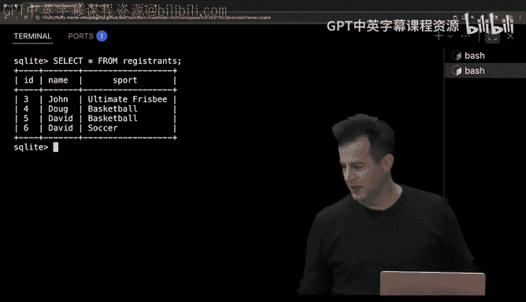

All right。That was a lot。Questions on where we're now at。All right。

 to make the coding a little less tedious。 what we're gonna to do is look at a few final examples that have sort of come premade and will walk through the code。

 pointing out only what's different as opposed to some of the boilerplate that we keep seeing where we left off now recall is that we have app pi。

 which is all of our logic requirements text， which just enumerates the libraries that we want to use in the project。

 static which now contains any static files like cats or jascript or CSS and templates。

 which contains our actual templates。 it's worth noting that we're actually following a fairly common paradigm。

 This is not specific to flask。 the model that we've essentially the paradigm that we've essentially been implementing is this。

 if this shape over here represents the human or the user。

 they keep interacting with what the world generally calls a view view is the term of art that just describes like the user interface。

 Aka view but that view is generated by a certain type of code namely controller logic。

 So app pi is technically what the world would call controller logic or business logic to use an industry term。

 and that controller code Aka。is generating one or more views。

 So the views that we're referring to here is like everything in your templates。

 Those are your views。 but there's a third piece of the puzzle that we just introduced。

 which is generally called a model。 and initially my model was just a stupidly simple dictionary in memory and that evolved eventually into defro Db。

 So your model is generally your persistent data like where your storing data related to the application。

 And even though the picture doesn't lend itself to pronouncing it in the right order。

 this is what's known as the MVC paradigm model view controller and it's a very common way of developing web apps by just thinking about the different problems you need to solve with this kind of nomenclature。

 like I've got to implement my controller， which does all of the logic， all of the variables。

 functions， conditionals loops and so forth， I've got to implement the view。

 which contains everything the user sees and interacts with like the Hl and I've got to eventually implement the model。

 which is like all of the backend data space and such。The catch， though。

 is that this is not a clean line because clearly in views。 we've seen variables。 We've seen loops。

 we've seen conditionals。 So this is just a general mindset to have。 And in the real world。

 if you ever explore web apps again， you are hencefor familiar with what's known as this MVC model。

 But now let's solve some other realworl problem。 So here's what you see on the occasion that you sign into something like Gmail or really any other website that asks for a username and then eventually a password or some such thing。

 This is just a web form， it looks a lot pretier than mine。

 because they're using some fancy Css to make things blue and nicely indented and so forth。

 But it's just HTMLtl underneath the hood with probably an input type equals text to give me this text box。

 Of course， when you log into Gmail after providing your password。

 somehow Gmail remembers often for days， weeks， even that you have logged in already。 Now。

 how is that actually working。 Well， when you first log into a site like Gmail and click submit or the next button in this case。

 presumably the browser is submitting。😊。

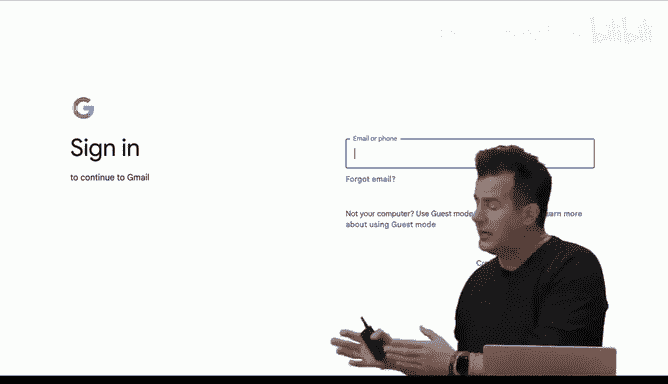

Virtual envelope， so to speak a message like this to Google's servers。

 postlash something to accounts go com， which happens to be the URL that Google typically uses for this。

 And inside of this， the dot dot dot is your username and password and anything else that might be submitted to the server。

 Ily， the server response to you with 200 like here is your inbox。 logged in successfully。

 But it also underneath the hood every time you've been logging into Gmail has been planting a cookie on your computer。

 and you might be generally familiar with cookies， they have kind of a bad rap because they're often used and are used quite frequently for tracking for advertising and really kind of keeping eyes on you in some way。

 But in their basic form， they're just a feature of HttP。

 which is wonderfully useful because it solved some typical problems。

 This is another HtTP header that is usually inside of those virtual envelopes that come back from servers to browsers In addition to telling the browser what the type of content is in the envelope。

😊，I tell the browser， please set the following cookie。 a cookie is just a key value pair。

 It might be something like session literally equals some value and that value is usually a random string that might be 1。

2，34，56 or something like that but it's a unique identifier or naively if Google implemented cookies poorly they could technically tell your browser to store cookie on your computer containing your username and a password why so that tomorrow when you open up Gmail。

 you're not prompted again with the stupid form to log in。

 it already knows your browser that you're logged in in your browser can do that by just sending the same cookie it got yesterday to the server Now this is bad to use cookies to store usernames and passwords generally because it's putting very precious data in the browser's memory in any sibling or roommate who walks over to your browser can now find your username and password by just poking around your cookies so generally what browsers do is more like this screenshot here whereby all the server does is it puts a big random value on。

Your computer somewhere， essentially a text file containing a big random value。

 And that is equivalent， essentially to sort of a hand stamp。

 Like if you go into a bar or a club or an amusement park， generally。

 you show your ticket once when you go in， And then thereafter you just show your hand if you want to be able to come and go again and again。

 So right now， my hand has not yet been stamped。 have this niceier smiley face sticker。

 I might have a smiley face now on my hand any time I want to go back into the bar or club or amusement park。

 because they now know we already checked who you are presumably the very first time that you came in。

 That's all cookies are effectively doing is it's putting a virtual hand stamp in your browser。

 because the browser， the next time you go to Gmail and click on a link or click on an email。

 your browser unbeknownst to you， will send a get request that looks like this。

 but also contains a line like cookie colon。 And then that same key value pair。

 It's like presenting your hand stamp again and again every time you open an email or click on a link in Gmail。

 This cookie header is what the browser sends。This set cookie header is what the server sends。

 So this is the act of stamping your hand， this is the act of presenting your hand and that effectively is how browsers and servers remember who you are This is how advertisers generally remember who you are because at one point or other they put a cookie on your computer and unbeknownst to you you're going to this website this website this website and your browser has been presenting this hand stampamp all this time so advertisers know oh that's David again that's David again that's David again because they're seeing the same hand stampamp And so one of the reasons why last week for instance。

 I've kept opening things in incognito mode， which you might use generally if you want to do something private and not have it saved in the computer's memory is also because incognito mode gets rid of all of your cookies when you close the window effectively like wiping off the hand stamp the next time you go to that same website。

So that's all the cookie is。 It's a key value pair that can be planted on your computer。

 but it's a wonderfully powerful mechanism for implementing。 and this is the juiciest idea for today。

 I'd argue what are called sessions。 Sessions are this feature whereby browsers and servers have a persistent connection to each other。

 even though HttP is what we'll call stateless。 So stateless just means that you don't have a constant connection to the server when you are using a website and that's not always true and nowadays you sometimes do have a a persistent connection。

 but cookies allow you to close your laptop， even shut down your computer。

 come back the next day and still have the illusion of being connected just as you were the previous day because of this virtual presentation of handtamps。

 So a session more concretely， you can think of in Python as a dictionary of key value pairs that you can associate with each and every user。

 That is to say when I log into a website that is using sessions implemented with cookies。

 they can store any number of key value pairs about me。😊，In the server's memory。

 and my presentation of the hand stamp will ensure that they keep。

 they know which key value pairs to assign to made。 So what do I mean by all of this， Well。

 let me go ahead and close out our previous tabs and V S code。

 Give me just a moment to get organized here。And let me go ahead， and。Give me one moment。Oh。ちちち。

One second。Mmhm。Okay， in V， S code， let me go， let me control of this， okay。ち。

Let me go back into V S code here and let me C D into a directory with which I came。

 which is called login， which is just going to be a relatively simple flask application that demonstrates how you can implement the ability to log into a website。

 and we'll keep it super simple with just username， no passwords。 But as you'll see in problem set 9。

 will' add some passwords to the mix as well。 If I type L inside of this login directory。

 you'll see some familiar friends app requirements text and templates。

 but let me draw our attention to one other library we're gonna now start using called flask session。

 So flask session is just a thirdpart library that gives us the ability to use cookies in our application and not have to know or understand any of the screenshots we just saw of HP requests。

 Its sort of suffice to stipulate someone figured out how cookies works。

 I just want to use them now as a feature so that when a user uses my website。

 I can associate data with them like who they are what their username is and therefore that they've logged in。

 So let's go ahead and close requirements text and open up app do pi in this case。

 Here is an implementation of a。😊，Pro whose purpose in life is to enable me to log in。 And in fact。

 before we before we walk through the code， let me do this in this terminal， let's do flask run。

 And I already hit control C on my other terminal window a moment ago。

 let me now go into my other tab up here and reload thelash route which is now going to be this login route instead of Fro I am All this website does by default is it tells me first。

 you are not logged in。 but here's a link to log in。 It's a little small。

 But if you look in the bottom left hand corner of my browser right now。

 it's a URL that ends with slash login。 And in fact， I can see that more clearly。

 if I view page source in the browser here is the only thing I'm really seeing in this web app so far。

 But notice what happens now， if I click on login the route in my URL just change tolash login。

 Im again keeping it simple with just username， no passwords。

 But I'm gonna log in as David and click login。 But first。

 let me show you the code in view page source I have a form that submits to。😊。

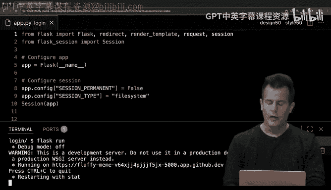

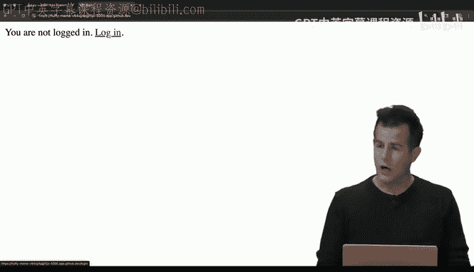

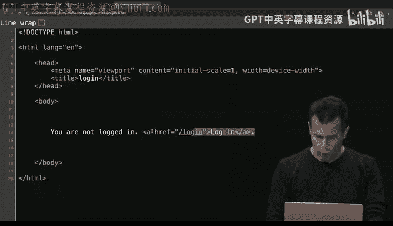

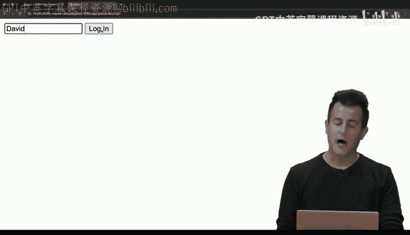

Loin using the post method。 The only thing about this button that' the form that's interesting is it's got a text box and a login button。

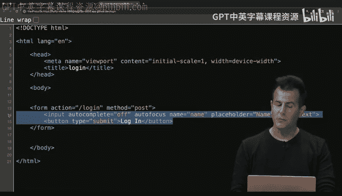

Same as we've seen before。 So let's click it。 Now I click log in and notice。

 I get whisked away back to the original route。 The slash route。

 even though Chrome is hiding the slash from me。 But the website somehow knows that I'm logged in as David。

 In fact， if I open up my page source in the browser。

 I'll see that now it doesn't say you are not logged in。 It says I am logged in as David。

 and it's now giving me apparently conditionally a log out link。

 So I argue this is representative now of any website that lets you log in and out of it。

 So how does this work。 Well， in my login account in my login app here。

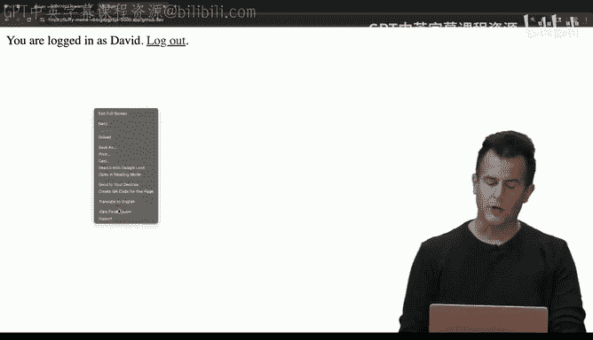

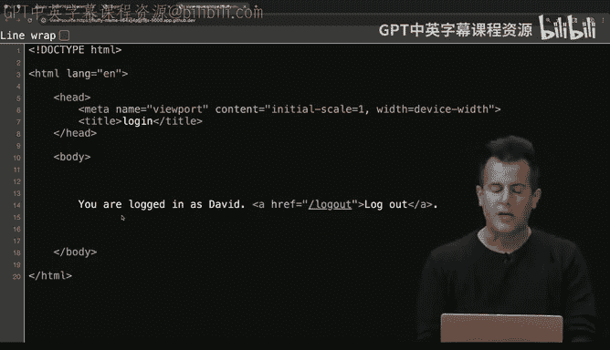

What do we have in app the following， I've got from flask import flask redirect render template。

 request and a new one session， which you can essentially think of as a dictionary where you can store key value pairs for each and every user and flask will make sure that your code has a different copy of session for every user that visits。

 you can just treat it as though you only have one user。

 but flask will ensure that when a user visits， they get their own copy of session。

 their own copy of session， their own copy of session essentially to store whatever you want。

 This next line here， I just need to copy paste from flask session import capital session。

 This line is the same。 turn this file into a flask app。 This stuff is new and find a copy paste。

 This just says configure this app to use sessions by storing the cookies on the server as files instead of in a database or somewhere else。

 But this is the default that we use for our examples。 Allright， what's going on here。 Well。

 in my s route。 I've got。😊，Index function whose purpose in life seems to be to render a template called index do Htl and then pass in a name placeholder。

 which is the value of session dot get dot name。 So whatever name is stored in the session。

 if any that gets passed into the template。 So let's go down this rabbit hole。

 Let me open up index do Html。 interestingest。 So here is the logic that implemented those two different versions of the homepage that we saw。

 if the name has a value。 So if it's not empty， we saw you are logged in as such and such。

 here's a log out link。 if though there was no name as happens by default before you even log in。

 you see you are not logged in， here's a link to log in。 So that's all the homepage is。

 is this conditional logic checking if there is， in fact， a user logged in。 Allright， well。

 let's go back to app up high， how does the login work。Well， if you find your way to the login route。

 then I'm asking a question。 If the user got here via post。

 they probably got here by clicking the login button that I gave them。

 So let's store in the session dictionary， the word name and make the value of that key this value here。

 where what I've just highlighted is whatever the user typed into the form。

 whether it's David Kelly John or anyone else， that's what comes back from the form。

 And I'm just storing that in the session， which again is like this special global variable that you get one per user。

 and it's implemented underneath the hood by way of cookies or these hand stamps。

 Then I'm just redirected to the slash route。 Otherwise， if the request message wasn't post。

 that means the user just manually newly visited example com or whatever my website is。

 That's why I show them login htl。 All right， let's go down that rabbit hole。

 let's open up login do Hml。 It's pretty simple。 It's just a stupid form that has a text box and a submit button。

 But the most important part is that as we saw in the browser， it emits。

Slash login the route we just saw。 Allright， if I go back to here， how do you log out， Well。

 we didn't actually click this。 But here is how you can delete the contents of the session and actually log the user out。

 You just call session dot clear。 And so， in fact， if I go back over here and click log out。

 How does the server know that I've logged out。 Well， that route very quickly。

 you didn't even see the URL bar change logged me out by clearing the whole session。

 And so the cookie that was pan on my computer was essentially deleted at this point in time。

 or really the server side data that's associated with that cookie was deleted。

 So I'm no longer seeing it at all。

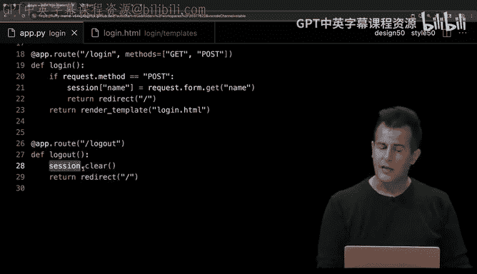

So that's kind of it。 Like if you log into a website。

 whether it's Facebook or Gmail or outlook or anything else。

 like that's effectively how they're logging you in。 But， of course。

 they're adding into the mix some passwords and other security as well。 All right。

 How about one other example。 Let me go back into V S code here。

 and let me go into my first terminal。 Hey control C to kill this login example。

 Let me hit C D to go back and then C D store to implement the simplest of web stores。

 like some kind of ecommercecommerce site that has an actual shopping cart implemented。

 Let me do flask run inside of this directory。 open up my other terminal window。

 And in my other terminal window， I'm gonna go C D to go back and then go into store here where I'm gonna see some familiar files Let's do this where I'm gonna see some familiar files namely app requirements text。

 but a database file this time in addition to my templates。

 Well let's see what's inside of that database。 Let me go ahead and run SQL light 3 of store do DB。😊。

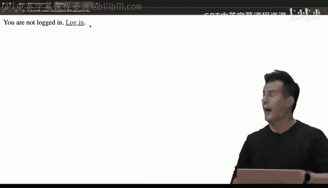

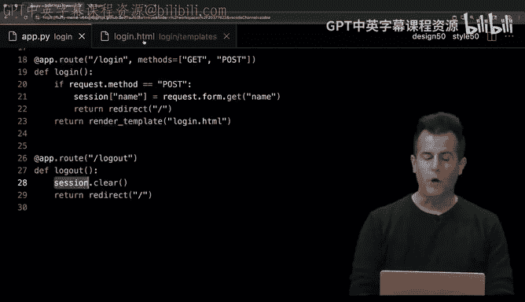

t schema to see what's in the database。 this is like a bookstore。

 like the very first version of Amazon com， if you will。 and the table has two columns。

 an I column and a title column for all of the books that this store shall sell。

 what are those books select star from books semicolon so this is a bookstore that sells only five books among them。

 the hititchcheker's guide to the galaxy and sQels。 All right。

 so wouldn't it be nice if we have a website that displays everything in this catalog and lets me like add things to my cart。

 And in fact， here is maybe the better metaphor for what a session is。

 a session essentially gives you the ability to implement a shopping cart like this where the shopping cart of course in the real world is specific to each user like if I'm on Amazon co and Kellyly's on Amazon and both logged in。

 we obviously don't see the contents of each other's carts and that's because we have separate cookies on our hands。

 And so Flask or whatever Amazon is using creates the illusion that we each have our own global dictionary called session in which Amazon can store any key value pairs it wants。

😊。

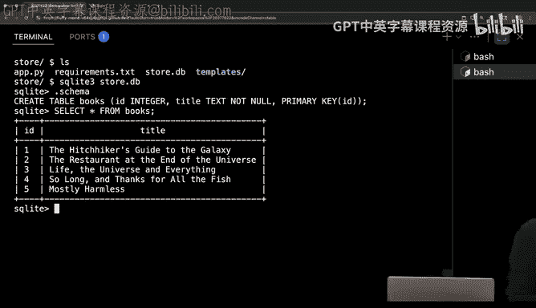

Like what's in our shopping cart。 So let's try this。 Let me go back to my other browser and reload。

 So I'll now see not the login example， but the bookstore example。

 and it's super ugly because I whipped it up using the simplest of HTMLml。

 but you'll see here every one of the books in the database plus an add to cart button And even if again。

 you're sort of new to all this web programming。 There's not all that much you can do with Hl except use forms。

 maybe with some hidden elements to achieve this result。 So here we have the H1 tag with books。

 here's an H2 which is big and bold， but not quite as big。

 Here's the here's here's the button for the hititchhiker's guide to the galaxy as an aside because there's like a curly quote or an apostrophe in the bookss name。

 this is just an H entity that flask is outputting for me even though it's not there visually in the database。

 So what is the button do for hititchhiker's guide to the galaxy。

 Well it's a form whose action is slash cart presumably because I want to add it to my cart using the post method I've got an input name equals I。

 the type of which is hidden the value of which is one。

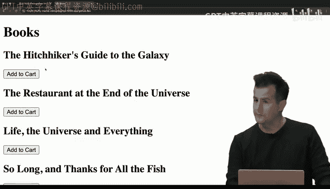

And fast forward2，3，4。 So just like the dereister example for Kelly similarly。

 is each book going be addible to a cart instead of removable by using that unique Id。 and indeed。

 every form has an ad to cart button。 So what's happening then on the server。 Well。

 let's take a look at the other tab here。 If I go back into V S code。

 And if I go into my let's say let's minimize the terminal window here。

 And let's open up inside of store， let's open up our template for index do H Tl。

 which is sort of the entry which is not that。 let's open up app pi first and figure out what's going on。

So at the top， we have some imports， including our SQL library。

 We have an app variable being created， a DB variable being created using that same store do Db。

 We've got this boilerp code， which just again enables cookies and stores the contents on the local file system instead of in a database。

 here's the interesting beginning point。 How did I see that big page with all the books and the buttons。

 Well， for the slash route。 We've got this function that first uses some sQL to get all of the books from the database。

 select star from books。 And then there's no index do Hl。

 because I called it books do Hl in this case。 just because and I set the books placeholder equal to the value of the books variable。

 Allright， let's go down this rabbit hole now， let's open up the templates folders books do Hl file。

 Okay， so here we have that H1 with books。 And then we have a four loop。

 which is gonna output for every book in H2 tag and a form tag， a form tag again and again and again。

 each of which has a value that equals the current。😊。

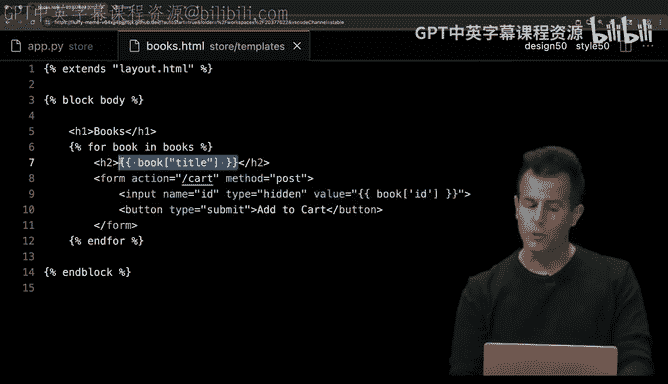

Books， I D， But the title in the H2， of course， is the title of the book。

 which is more human friendly。 So what now happens when I go here and add the hitchhiker's guide to the galaxy。

 Let's try add Decarte。 Okay， and nothing。

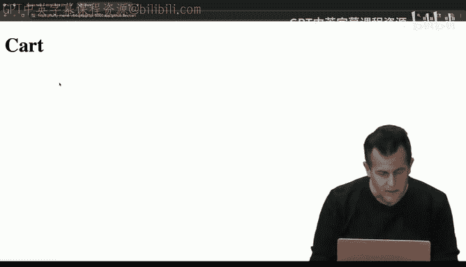

That's a bug。

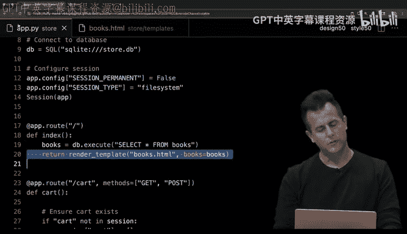

ちゅちゅ。嗯。Sorry， one second。

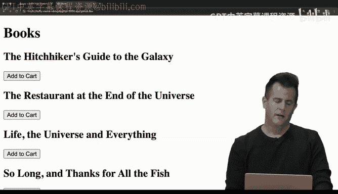

Oh oh。啊。Apologies， let's figure this out real quick。Oh， that's right。 No， that's not right。Sorry。

 stand by。Session图。Oh， I think I oh， no， that's not it。Let's try this again。

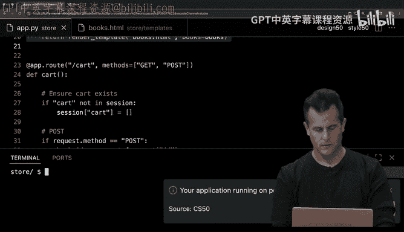

ち。Okay。What happened before I was being a little nitpicking， I deleted a folder。

 But then I didn't restart the server and then revisit the web page。

 So what happened there was I had accidentally deleted all the cookies。

 But my browser still had the original cookie。 And so that's why the cart seemed to be empty。 So。

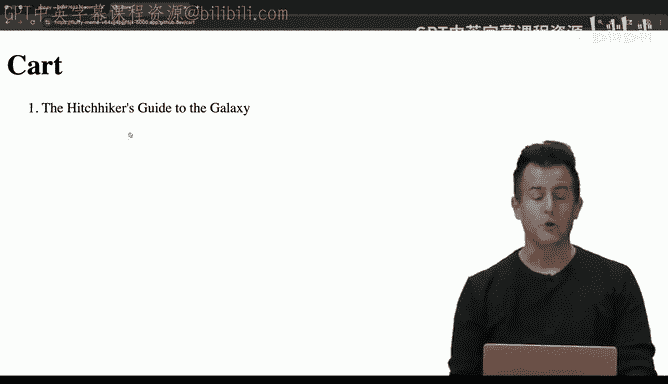

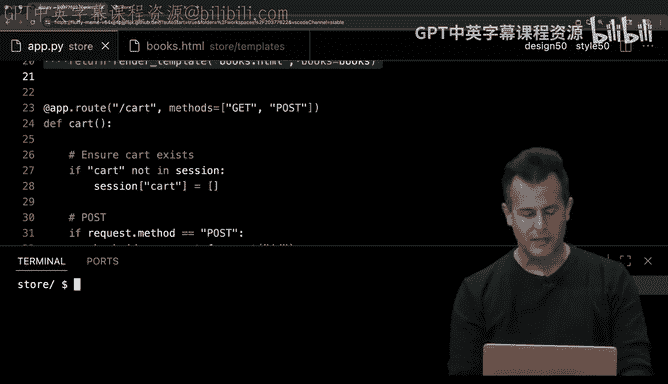

User error is the short of it。 Alright， so let me go ahead and undo this again so we can pretend like that never happened。

 Allright， Flask run。So what happens when I actually click on add to cart for the hititchhiker's Guide to the galaxy。

 Well， I should indeed see that now that one book has been added。

 And if I go back and add another like the restaurant at the end of the universe。

 I now have two books in my cart。 So where is that data actually being stored。

 if we go back to V S code here。 hide the terminal and focus on the cart route， the cart route。

 because it supports post， in addition to get， also is doing this for me。 Well， first。

 it's checking with some logic here。 if there is no cart in the session。

 go ahead and create a key called cart and said it equal to an empty list。 In other words。

 I can put any key value pairs into the session that I want。

 So if I want my shopping cart to effectively be a list of all of the books that the user has added to their cart。

 it stands to reason that my cart by default should just be an empty list when they first arrive。

 However， if the user has click submit in order to get here。 Well， I'm gonna do this。

 I'm gonna get the I of the book that they've submitted via that form， And if it indeed exists。

 and it's not someone like Kelly Meing around。😊。

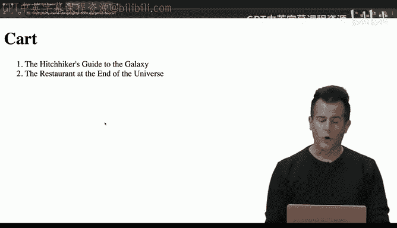

Sending me invalid parameters。 I am going to append to the cart list in the session。 the book Id。

 And then I'm just going to redirect the user to the cart。

 And any time you do a redirect that always is using get not post。

 And so when I come back to this cart route later， I'm not gonna be using post。

 I'm gonna be using get， which means this chunk of code here is executed。

 I have a variable called books， set it equal to the results of doing select star from books where I D in the following parenthesized list of Ids。

 recall that in is the preposition that gives me back multiple Ids。 if I so choose。

 and then I'm rendering cart do Hml with those there books。

 If I now go back to my application and actually go back to's。

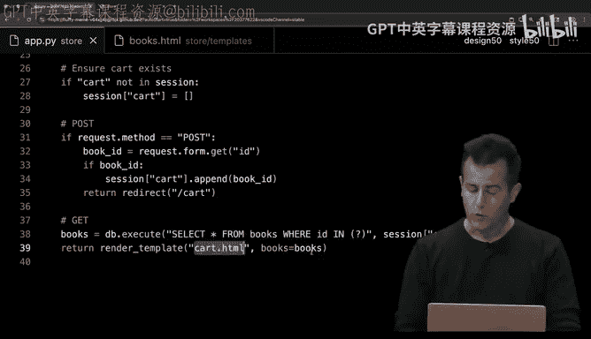

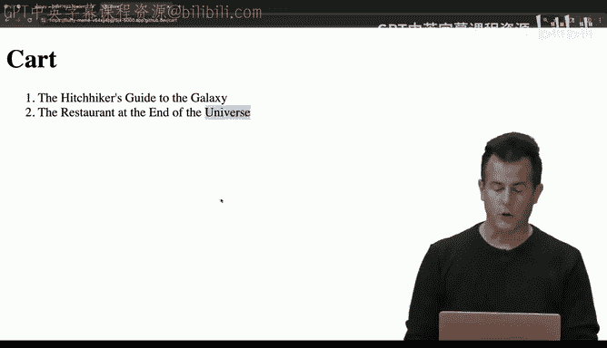

And if I go back to the application， the reason why I'm seeing two elements here， and indeed。

 if I go to my developer tools or view page source rather。

 I'll see two list items inside of an ordered list or numbered list containing the contents then of that shopping cart。

😡，Alright， so if we now have the ability to use sessions to remember who has logged in and we have the ability with sessions to remember what someone is added to their shopping cart。

 what else can we do with web applications more generally， even if not using sessions。 Well。

 let me go ahead and close this tab here。 Let me go back to VS code here。

 close out these two examples。 And let's do a final set of examples that demonstrate what we can do with some realword data and a web application。

 I have lastly a directory called shows， which is octa of our use of IMDB in the past。

 and I'm going go ahead into my first terminal window。

 Hey control C and call your attention to one thing before we move on。

 every time I have executed a SQL query inside of my code in my first terminal window where flask is running。

 you'll see either in green for success or yellow or red for some issues。

 the actualQ code SQL commands that are being sent to your database。

 this is useful if you mess something up at some point related to a database query。

 you can actually see in your terminal。

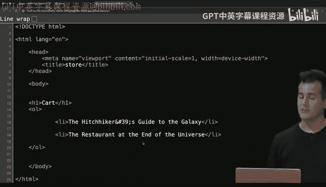

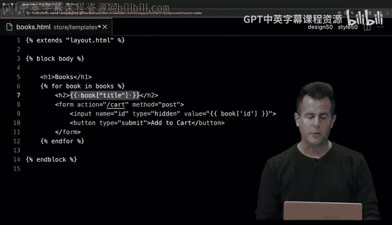

Where you're running flask run， actually， what SQL command was sent to the server to try to troubleshoot errors that way。

 Otherwise you're just flying blind when actually interacting only with the web browser But for now let me go ahead and clear that away and C back to my default directory and C now into shows where if I type L will'll see a whole bunch of files app pi requirements text and this time shows do db。

 which is the very same database that we had and past weeks when we played with some of the very large number of shows in the Internet movie database。

 And what is app pi do here。 Well， it implements the simplest of programs。

 This gives me access first to shows do db with some boiler played up top。 if I scroll down here。

 you'll see that there's index hl template that's rendered by default。

 And then apparently there's a search route， which is akin to what Google does for us when we searched for cats and dogs in the past。

 But for the first time I'm implementing my own search engine for TV shows not for dogs and cats。

 But what does this search route do。Uses a shows's variable， and it executes the sQL。

 select star from shows where title equals question mark。

 and it passes in just like Google does the Q parameter for query。

 And then it renders a template called search dot H Tl passing in those shows as a placeholder。

 In other words， what does this do。 Well let me go back over to the store to the store tab here。

 change the URL to just slash。 And because I'm now running I'm no longer running the store。

 I do want to go ahead and run in my first terminal window flashask run to start start off the show's application instead。

 So if I now go back to that tab because no server's running reload。

 now it is actually running and what I'll see here， Sorry， V S code was being difficult。😊。

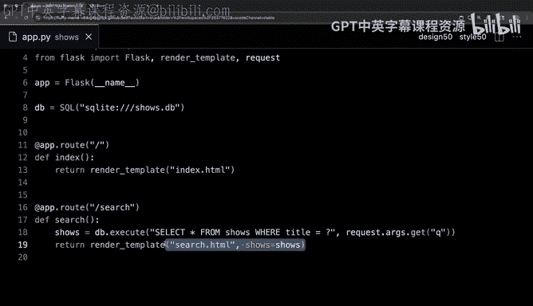

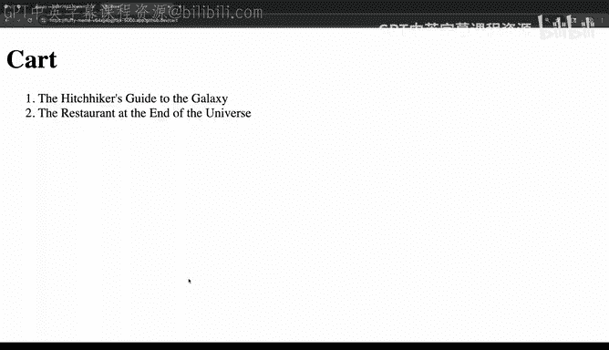

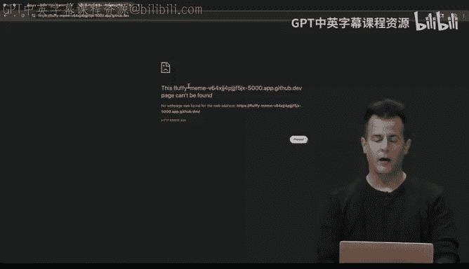

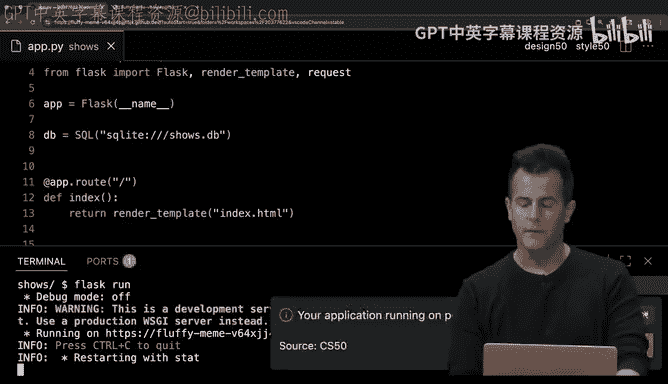

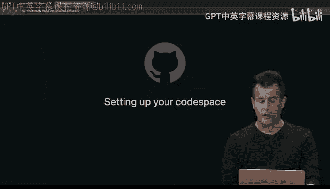

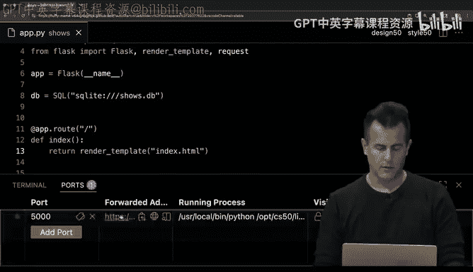

What I see here now is the simplest of search boxes like our Google example asking for a query。

 But this time I can search for things with which I'm more familiar like the office， capital T。

 capital O search。 and what I get back。 not that enlighteningly。

 but is the title of every show that matches exactly that。 If I go ahead and view page source。

 you'll see that what was generated was a unordered list of offices that are in the database and recall there's the British one。

 the American one in a bunch of others as well。 However， this form does not work。

 If I type in something like the office search。 I get no results in that case。

 which isn't so much well is just a lack of features here。

 And so let me actually go into V S code here。😊。

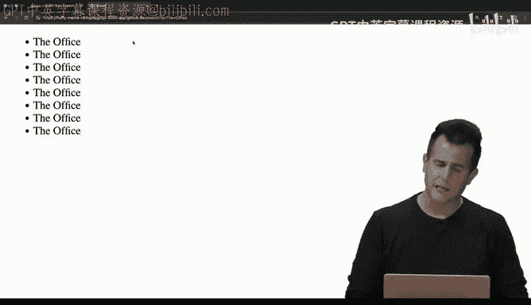

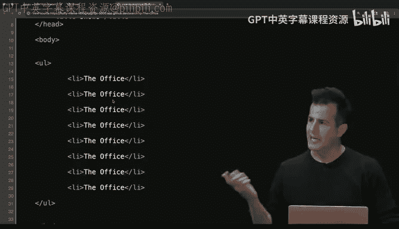

And let me propose that we come up with a better version of this code。 So， in fact。

 I'm gonna go into the prem examples with which I came today。

 I'm gonna go into the next version of shows here。 run flask run here。

 reload the application over here。 and now show you that the office in lowercase does actually work。

 Moreover， it searches for anything that mentions the office。 So if you had to guess。

 how might this be implemented underneath the hood， Well。

 if I open up my other terminal window and go into that same directory shows one and open up this version of app dot pi。

 you'll see that instead of using a simple query like before， I'm now using the like。😊。

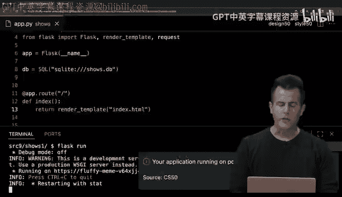

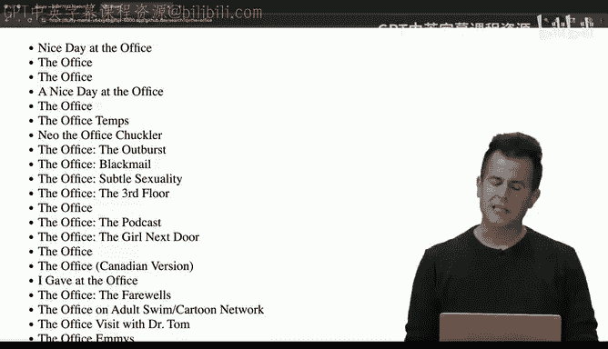

Keyword here， because I'm checking that it is like the office。

 And notice this is a bit clever here or a bit confusing at first glance。

 The placeholder I want is question mark， but I don't want to just search for the user's input。

 I want to tolerate 0 or more characters to the left via the SQL wild card and0 or more characters to the right。

 So I'm concatenating onto the user's input， a percent sign here， a percent sign here。

 because recall from our week 7 with SQL， this just means look for anything case insensitively that has T H E space。

 all F F I C E in it， no matter where that string is in the text。

 So that gives me a slightly more powerful version of searching for shows。 What can I do beyond that。

 Well， I can make this even more featureful maybe if we go into version 2 of this here whereby inversion 2。

 we might do a little something like this in version2。😊。

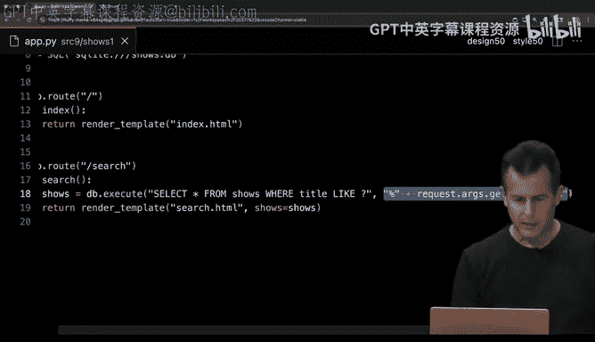

Sorry， thinking you for one second。Give me one second because I know we're bump about to bump up against time。

Yes。How did it know to render that though， as this bolded list of all of these offices。 Well。

 let me go into my terminal here and open up search do Hl。

 which is the template that the search route is using。

 And you'll see that I'm just iterating over with a gingja4 loop。

 each of those shows and then output puttingting a list item for each of those matches effectively just as I did before。

 But there's this other technique I can use altogether。

 And it's generally going to open up more possibilities for us in final projects if not beyond of creating essentially my own API rather than just make a web app that spits out the entire Hl page that I want the user to see。

 Would't it be nice if I could just start to create routes that spit out the data that I want。

 And then I， or even some thirdpart making a website with the same data can integrate my application into their own。

 And indeed， an APIs application programming interface。

 And it's essentially webbased functions you can call to get data from someone else's services。

 generally using H T TP。😊。

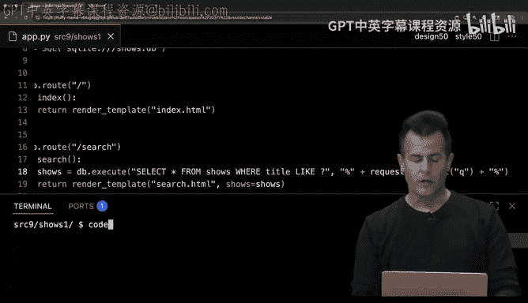

And you can return the data in any number of formats in text format in HTML format or in something called Json format。

 which is short for javascript object notation， which looks a little something like this。

 which is quite like Python arrays and dictionaries combined。

 But notice here with a wave of the hand。 there's a whole bunch of key value pairs in this particular example of all of the offices that are in IMDB's database。

 And so I wanted to show us these final versions of this same shows' application that works a little bit differently if I go into say shows two example here now。

 run and let's go ahead and exit out of the previous flashask copy and run shows2 inside of which is flask run notice here that if I go back to this web form now。

 notice that there is no more search button because this is meant to be highly interactive and I can search for T H E space OFF ICE and you'll notice that this is effectively autocomplete。

 which we saw a taste of last week with jascript which I am in fact using here but。😊。

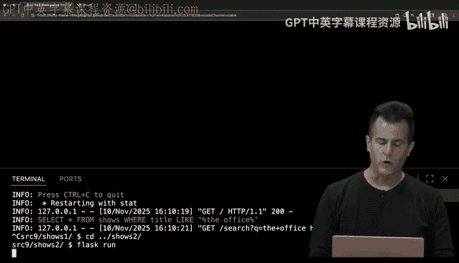

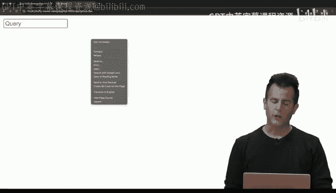

Is this working。 Well， let me reload and open up my developer tools and in developer tools。

 let's watch the network tab this time。 because when I type in something like T。

 you'll see that my web page suddenly made a request to my own slash search route。

 And if I click on my developer tools and look at the response that came back you'll see that thelash search route。

 spit out not a full web page， but just a whole bunch of li tags。 Now。

 why is that let me go back to V S code and open up in my other terminal app dot pi and an app do pi scrolling down to search。

 you'll see that when I get shows from the database， I'm still using search do Html。

 which previously extended my layout and plugged in that whole ordered unordered list。

 But this time if I go into this version of search do Hml。

 you'll see that I'm only spitting out raw Html， because I'm assuming that maybe someone myself included。

 wants to use slash search to just get a whole bunch。😊。

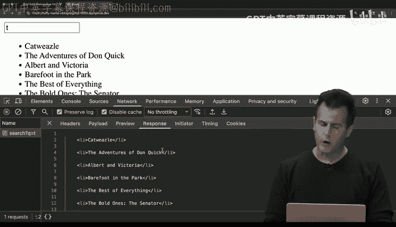

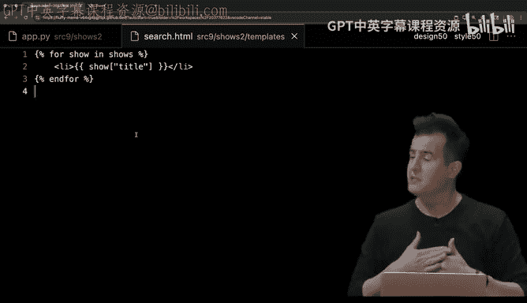

Of list items that they can put into their own unordered list or U tag。

 And so what's effectively happening over here is every time I type a letter noticeice at bottom left。

 another HP request goes across the Internet， Another HP request。

 And each of those is returning the set of Li elements that line up with the query that I've typed in。

 But this is a little sloppy， arguably， And so far as I'm returning a chunk of Hml。

 but out of context， and I'm dictating to the user that they have to use list items。

 wouldn't it be nice to just send the raw data， And I can do that too。

 let me go back into VS code here and look at our final example shows3。

 inside of which is a version of this code that now returns that socalled javascript object notation。

 And if I go into shows 3， run flask run go back over now to my browser tab and click reload。

 I'll see now， when I search for， say T。😊。

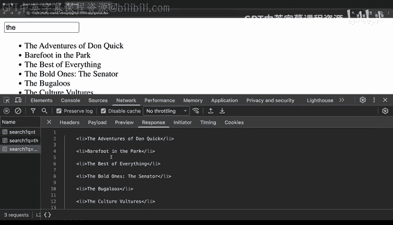

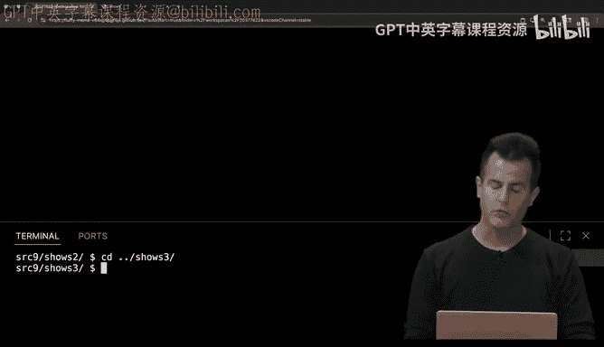

And click on that row。 notice now in the response tab of my developer tools。

 I'm getting back a whole bunch of juicy information。

 a massive javascript object notation chunk of data。

 notice the square bracket means here comes a list or an array。 Here comes a dictionary or dt。

 And indeed， that's what I'm seeing。 This looks like Python。

 but it's technically jascript and it's technically jascript's object notation。

 this just means this is the juicy data I'm getting back from the server。

 And if you now think way back to week 0。 And even in our family weekend lecture on lecture on AI where I was writing code that talk to open AIs so calledled API to get responses from our serverside cat。

 they were sending us javascript object notation like this。

 And I was just grabbing the data that I actually cared about namely the cat's actual response。

 And so in this case， if I open up and my other terminal window here， apptop pi。

 you'll see in my search route that instead of returning a template。

 I'm using a crazyname function called Jsonfi。😊。

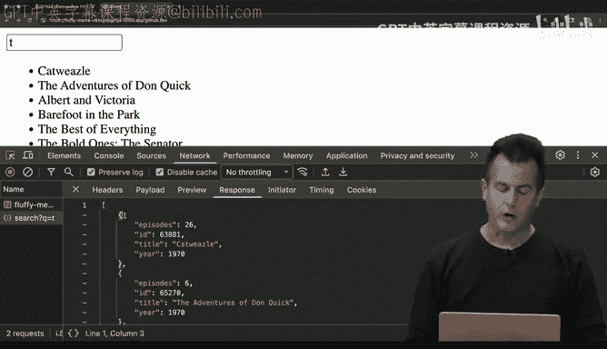

Which is just another function that comes with flask itself that has the effect of taking the list of Python dictionaries that came back from my SQL database。

 jasonifying it in such a way that I then can serve it to anyone on the internet myself included as a service so that I and they can use my own data to implement their own web applications。

 So that's sort of it for web programming ultimately you now have all of the building blocks from week zero onward to make your own web applications。

 and if you so choose for final projects， your own mobile applications。

 even if this too like everything else has felt like a bit of a fire hose。

 it is in the process of your final project of specing out and proposing and executing your own final project that will make all of this feel much more comfortable and familiar and you'll look back on so many of the past weeks as useful building blocks but this then was your CS50 education week 0 through 9。

 we have just one more left next week。 so we'll see you then。

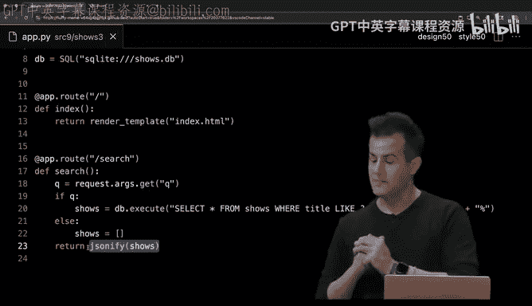

