# 哈佛大学《计算机科学导论｜CS50 introduction to computer science 2025 Fall》 - P1：CS50 Fall 2025 - Lecture 0 - Scratch .cut.zh_en - GPT中英字幕课程资源 - BV1S8sFzFEt7

Right， this is。This is C， S 50， Harvard University's introduction to the intellectual enterpriseterpris of computer science and the arts of programming。

 My name is David Main。 And this is week 0。 And by the end of today。

 you'll know not only what these light bulbs here spell， but so much more。

 But why don't we start first with the elephant or the elephant in the room。

 That is artificial intelligence， which is seemingly everywhere over the past few years。

 And it's been said that it's going to change programming。 And that's absolutely the case。

 It's been that way， actually for the past several years is only going to get to be the case all the more。

 but this is incredibly exciting time， this is actually a good thing I do think insofar is now using AI in any number of forms。

 you can ask the computer to help solve some problems for you。

 you can find some bug or mistake in your code better still increasingly。

 you can tell the AI what additional features you want to add to your software。 And this is huge。

 Because even an industry for years， humans have been programming in some form for decades  building products and solutions to problems。

 The reality is that you and I as humans have long been the bottleneck。😊。

There's only so many hours in the day。 There's only so many people on your team or in your company。

 and there's so many more bugs that you want to solve and so many more features that you want to implement。

 But at the same time， you still really need to understand the fundamentals。 And indeed。

 a class like this C S 50 has never been about teaching you how to program like that's actually one of the side effects of taking a class like this。

 but the overarching goal is to teach you how to think how to take input and produce correct output and how to master these and other tools。

 And so by the end of the semester， not only not only will you be acquainted with languages like scratch。

 which will touch on today。 if you've not seen it already， languages like see and Python and SQL。

 Htl CsS and jascript， you'll be able to teach yourself new things ultimately and ultimately be able to tell computers increasingly what it is you want it to do but you'll still be in the drivers seat。

 so to speak you'll be the pilot， you'll be the conductor。 whatever your preferred metaphor is。

 and that's what I think is so empowering still about learning introductory material。

 foundational material because you'll know what you're ultimately talking。

Think about and what you can， in fact， solve。 we've been through this before。

 Like when calculators came out， it's still valuable。

 I dare say all these years later to still know how to do addition and subtraction and whatnot。

 And yet， I think back on some of my own math classes。

 I remember learning so many darn ways in college how to take derivatives and integrals。

 And after like the six process of that。 I sort realized， okay， I get it。 I get the idea。

 do I really need to know this many ways。 And here， too， with AI， and with code。

 can you increasingly sort of master the ideas and then lean on a copit assistant to actually help you solve those same problems。

 So let's do some of this ourselves here。 In fact， just to give you a teaser of what you'll be able to do yourselves before long。

 let me go ahead and open up a little something called visual studio code， A V S code for short。

 This is popular， largely open source or free software that's used by real world people in industry to write code。

 And it's essentially a text editor similar to notepad。

 if you're familiar with that or text edit kind of like Google docs。

 but no bolt facingcing and under and things like that。 that you'd find in word processing。😊。

And this is C 50's version thereof。 We're gonna introduce you to this all the more next week。

 But for now， let's just give you a taste of what you can do with an environment like this。

 So I'm gonna switch over to this program already running V code。 And in this bottom of the screen。

 you're gonna see a so- called terminal window。 again more on that next week。

 But it's in this terminal window that I can write commands that tells the computer what I want to do。

 For instance， let's suppose just for the sake of discussion that I want to make my own chatbot not chat G or Gemini let's make our own in some sense。

 So I'm going code up a program called chat。 and you might be familiar that I using a language here's just called Python if unfamiliar you're in good company。

 you'll learn that within a few weeks。 And at the top of the file here， I can write my code。

 And at the bottom of the file the window here I can run my code。

 So here's how relatively easy it is nowadays to write even your own chatbot using the AI technologies that we already have I'm gonna go ahead and type。

😊，And like import， I'm going to go ahead and type the following from open AI， import， Open AI。

 We'll learn what this means ultimately。 But what I'm going to do is write my own program on top of。

An API application programming interface that someone else provides a big company called open AI。

 and they're providing features and functionality that now I can write code against。

 I'm gonna create a so-called client， which is to say a program of my own。

 that's going to use this open AI software。 And then I'm gonna go ahead and ask this software for a response。

 and I'm gonna set that equal to client responses do create whatever all that means。

 and then inside of these parentheses， I'm gonna say the following the input I want to give to this underlying API is quote unquote。

 something like in one sentence， what is C S 50， much like I would ask chatt itself。

 if you're familiar with things like chatt and AI more generally nowadays。

 you know there is the thing called models， which are like statistical models that ultimately drive what the As can do。

 I'm gonna go ahead and say model equals quote unote G 5。

 which is the latest and greatest version at least as of today。 Now down in my terminal window。

 I'm gonna run a different command， Python。😊，Of chat dot Pi。

 And so long as I have made no typographical errors in this program， I should be able to ask openaiI。

 not with chattpt do com， but with my own code for the answer to some question。

 But I want to know what the answer to that question is。

 So I actually want to print out that response by saying， print response output text。 In other words。

 these 10 lines and it's not even 10 lines because a few of them are blank。

 I've implemented my own chatbot that at the moment is hard coded that is permanently configured to only answer one question for me。

And let's see with the cross of the fingers。 C S50 is Harvard University's introductory computer science course。

 the intellectual enterprises of computer science and the art of programming， weirdly familiar。

 covering problem solvinglving algorithms， data structures and more using languages like C Python and SQL。

 Okay interesting， But let's make the program itself more dynamic。

 Suppose you wanted to write code that actually asks the human what their question is because very quickly might we want to learn something more than just this one question。

 So up here， I'm going go and change my code and type something like this type prompt equals input with parentheses More on this another time too。

 But what I'm gonna ask the user for is to give me an actual prompt。

 That is a question that I want this AI to answer。 And down here， what you'll notice。

 even if you've never program before。 is that I can do something somewhat intuitive。

 insof far as line 5 is now asking the human for input。

 And let's just stipulate that this equal sign means who let's just stipulate that this equal sign means store that answer in a variable called prompt where variables just like in math X Y is。

😊，Let's go ahead and store that in prompt。 So the input I want to give to open AI now is that actual prompt。

 So it's a placeholder containing whatever keystrokes the human typed in。

 If I now run that same command again， Python of chat do pi hit enter across my fingers。

 I'll see now dynamic prompting。 So what's a question I might want to ask。 Well。

 let's just say it again in one sentence， whoop， in one sentence， what is C S 50 question mark。

 enter And now the answer comes back as probably roughly the same but a little bit different。

 a variant thereof。 But maybe we can distill this even more succinctly。 How about let's run it again。

 Python of chat， and let's say in one word， What is C S 50， and see if the underlying AI obliges。And。

After a pause course in a word。 So that's not all that incorrect。

 And maybe we can have a little fun with this now， How about in one word， which is。Which is better。

 maybe Harvard。Or Stanford question mark。Hope you picked right。Let's see， the answer is。Depends。

 okay， so would not， in fact， oblige。 But notice what I keep doing in this code。

 I keep providing a prompt as the human， like in one sentence in one word。 Well。

 if you want the AI to behave in a certain way， why don't we just tell the underlying system to behave in that way。

 So why the human don't have to keep asking in one sentence in one sentence in one word。

 So we can actually introduce one other feature that you'll hear discussed in industry nowadays。

 which is not only a prompt from the user， which I'm gonna now temporarily renamed to user prompt。

 just to make clear it's coming from the user， I'm gonna also give our what's called a system prompt by setting this equal to some standardized instructions that I want the AI to respect。

 like limit your answer to one sentence， quote unquote。 And now。

 in addition to passing in as input the user prompt I'm gonna actually tell open eyeI to use these instructions coming from this other variable called system prompt。

 So in other words， I'm still using this。Same underlying service。

 but I'm handing it now not only with the user typed in， but also this standardized text。

 limit your answer to one sentence。 So the human like me doesn't have to do that anymore。

 Let's now go back to my terminal， run Python of chat do once more。 And this time will be prompted。

 But now I can just ask what is C 50 question mark and I'll likely get a correct and similar answer to before。

 And indeed， it's Harvard University's Fship directorory computer science course do do So sea spot on too。

 But now we can have some fun with this too。 And you might know that these GPSs nowadays have sort of personalities you can make them obliged to behave in one way or another。

 why don't we go into our system prompt here and say something silly like pretend you're a cat。

 And now let's go back to the prompt one final time。

 run Python of chat do prompt again will be say what is C 50 and with a final flourish of hitting enter。

What do we get back？C， S50 is Harvard University's introduct computer。

 Science course teaching programming algorithms data and problem solving。

 and it's available free online Miow。 So that was enough to coerce this particular behavior。

 So this is to say that with programming， you have the ability in like 10 lines of text。

 not all of which you might understand yet， But that's the whole point of a class like this。

 to build fairly powerful things， maybe silly things like this。 But in fact。

 it's using the same primitives that C 50 has its own virtual rubber duck and we'll talk more about this in the weeks to come。

 But long story short in the world of programming， it's kind of a thing to keep a rubber duck literally on your desk or really any inanimate cute object like this。

 because when you are struggling with some problem。

 some bug or mistake in your code and you don't have a friend teaching assistant a parent or someone else。

 who's more knowledgeable than you about code， you literally are encouraged in programming circles to talk to the rubber duck。

 and it's through that process of just verbalizing your confusion and organizing your thoughts enough to convey it to another person or duck in this case。

That so often that proverbial light bulb goes off and you realize I'm being an idiot。

 Now I hear in my own thoughts， the ill logic or the mistake I'm making and you solve that problem as well。

 So C S 50 drawing inspiration from this will give to you a virtual duck in computer form。

 and in fact， among the other URLs you'll use over the course of the semester is that here， C50 AI。

 which is also built into that previous URL。 C 50 dev。

 whereby these are the AIs you can use in Cs 50 to solve problems and you are encouraged to do so。

 as you'll see in the course of syllabus， it is not reasonable。

 it is not allowed to use AIbased software other than C50s zone， be it Gemini chat GP or the like。

 but it is reasonable and very much encouraged along the way to turn not only to humans like me。

 your teaching assistant and others in the class， but to C50's own AIbased software。

 And what you'll find is that this virtual duck is designed to behave as close to a good human tutor。

 as you might expect from an actual human in the real world knows about Cs50 knows how to lead you to a solution ideally。

Without simply spoiling it and providing it outright。So with that said。

 that's sort of the end game to be able to write code like that and more。

 But let's really start back at the beginning and see how we can't get from zeros and ones the computers speak all the way back to artificial intelligence。

 So computer science。 is in the name of the course， Comp science 50。 But what is that。

 Well's really just the study of information。 How do you represent it。 How do you process it。

 and very much germane to computer science is what the world calls computational thinking。

 which is just the application of ideas from computer science or Cs to problems generally in the real world。

 And in fact， that's ultimately， I dare say what computer science really is。

 it's about problem solving。 And even though we use computers。

 you learn how to program along the way， these are really just tools and methodologies that you can leverage to solve problems。

 Now， what does that mean， Well， a problem is perhaps most easily distilled into a simple picture like this。

 We've got some input， which is like the problem we want to solve。 and the output。

 which is the goal we want the solution there， too。

 And then somewhere in the middle here is the proverbial black box。

The sort of secret sauce that gets that input from output。 So this then I would say， is， in essence。

 is problem solving and thus computer science。But we have to agree。

 especially if we're gonna use devices， Mac， PCs， phones， whatever。

 How do we all represent information， The inputs in the outputs in some standardized way。

 Is it with English， Is it with something else， Well， you all probably know。

 even if you're not computer people at the end of the day。

 computer somehow use zeros in one entirely。 that is their entire alphabet。 And in fact。

 you might be familiar already with certain such system。 So the unary notation。

 which means you essentially use single digits like fingers on your hand。 For instance。

 unary A K based one is something you can do on your own human hand。 So， for instance。

 with one human hand。 How high can I count。Alright， so hopefully 1，2，3，4，5。

 And if you want to count to 6 and to 11 and 10 and so forth， you need to， you know。

 take out another hand or your toes or the like because it's fairly limiting。

 But if I think a little harder， instead of just using you Nary。

 What if I use a different system instead， What about something like binary。 Well。

 how high if you think a little harder can you count on one human hand。

So 31 says someone who studied computer science before。 But why is that。

 It's kind of hard to imagine， right， Because 1，2，3，4，5 seems to be the five possible patterns。

 But that's only when you're looking at the totality of fingers that are actually up5 in total or four in total or  one or the like。

 But what if we take into account the pattern of fingers that are up。

 and we just standardize what each of those fingers represent。

 So maybe we all agree like a good computer would two， that maybe no fingers up means the number 0。

 And if we want to count to one， let's go with the obvious， this is now one。

 But instead of two being this， which was my first instinct。

 maybe two can just be this a single second finger up like this。

 And that means we could now use two fingers up to represent3 I'll propose。

 we can use just one middle finger up to offend every， but represent 4。

 I could maybe use these two fingers with some difficulty to represent 5，6，7， I'm already up to 7。

 having used。Only three fingers。 And in fact， if we keep going higher and higher。

 I bet I can get as high as 31 for 32 possible combinations。 But the first one was0。

 So that's as high as we can count。 So we'll make this connection in just a moment。

 but what I started to do there is something called base2。

 instead of just having fingers up or fingers down。

 I'm taking into account the positions of those fingers and giving meaning to like this finger here。

 this finger here， this finger here and so forth different weights， if you will。

 So the binary system is indeed all computers understand。

 And you might be familiar with some terminology here。

 Biary digit is not really something anyone really says， but the shorthand for that is gonna be bit。

 So if you've heard of bits and we'll soon see bytes and then kilobytes and megabytes and gigabs and terabytes and more。

 this just refers to a bit， meaning a single binary digit， either a0 or a one。

A0 is perhaps most simply represented by just like turning。

 maybe keeping a finger down or in the world of computers， which have access to electricity。

 be it from the wall， or maybe a battery。 You know what we could do。

 we could just decide sort of universally that when a light bulb is off that thing represents a 0。

 And when the light bulb is on that thing is gonna represent a one instead， Now， why is this， Well。

 electricity is such a simple thing， It's either flowing or it's not。

 And we don't even have to therefore worry about how much of it is flowing。

 And if you're vague remember a little bit about voltage， We can sort of be like 0 volts。

 Nothing's there available for us， or maybe it's 5 volts or something else in between。

 But what's nice about binary only how using zeros in ones is that it maps really nicely to the real world by like throwing a light switch on and off。

 you can represent information by just using a little bit of electricity or the lack thereof。

 So what do I mean by this。 Well， suppose we want to start counting using binary zeros in ones only。

Think of them metaphorically as like akin to these light bulbs here。 And， in fact。

 let me grab a few of these light bulbs and let me propose that if we want to represent the number 0。

 Well， it stands to reason that here， single light bulb that is off。

 can be agreed upon as representing0。 Now， in practice。

 computers don't have little light bulbs inside， But they do have little switches inside。

 millions of tiny little things called transistors that if turned on can allow it to capture a little bit of electricity and effectively turn on a metaphorical bulb。

 or the switch can go off。 the transistor can go off and therefore let the electricity dissipate。

 and you have just now a0。 Unfortunately， even though I can let some electricity。

 here's the battery I mentioned is required。 even though we might have some electricity available to us。

 I can therefore count to one， But how do I go about counting。😊，Hardware problem。

 How do I go about counting higher than one with just a light bulb。Yeah， so I need more of them。

 So let me grab another one here。 And now I could put it next to it。 And this too。

 I'll claim is just still the number one。 But if I want to turn two of them on， Well， that would be。

 I could count a two。 And if I maybe grab another one， now I can count as high as  three。

 But wait a minute。 I'm doing something wrong。 because with three human fingers。

 how high was they able to count。So 7， in total， starting at 0。 So I've done something wrong here。

 but let me be a little more clever than it about the pattern that I'm actually using。

 Perhaps this can still be one， but just like my finger went up and only one finger in the second version of this。

 this。Can be what we represent as two。Which one do I want to turn on as 3 to your left or your right。

So you're right， because now this matches what I was doing with my fingers a moment ago。

 And I claimed we could represent3 like this。 If we want to represent 4， that's fine。

 We have to turn that off this off and this on。 And that's somehow 4。

 And let's go all the way up to 7。 Which ones need to be on to represent the number 7。Alright。

 so all of them here Now， if you're not among those who just sort of naturally said all of them。

 like what the heck is going on。 How did half the people in this room know what these patterns are supposed to be。

 Well， maybe you're remembering what I do with my fingers。

 But it turns out you're already pretty familiar with systems like this。

 even if you might not have put a name to it。 So in the human world， the real world。

 most of us deal every day with the socalled base 10 system。

 Otherwise known as decimal deck implying 10， because in the decimal system。

 you have 10 digits available to0 through 9 in the binary system。

 we only had two by implying 2 So 0 and 1， and youaryary， we had just one。

 a single digit there or not。 So in the decimal system。

 we just have more of a vocabulary to play with。 And yet you and I have been doing this since grade school。

 So this is obviously the number 1 23 But why it's technically just three symbols 1，2，3。

 but most of us， your mind and egos，1 23， pretty obvious， pretty natural。

 But at some point you like me。Probably taught that this is the one's place。 And this is the1s place。

 And this is the 100s place and so forth。 And the reason that this pattern of symbols，1，2，3 is 123。

 is that we're all doing some quick mental math and realizing， well。

 that's 100 times 1 plus 10 times 2 plus 1 times 3。 okay。

 there's how we get 100 plus 20 plus 3 gives us the number we all know mathematically as 123。 Well。

 it turns out whether you're using decimal or binary or other base systems that we'll talk about later in the course。

 The system is still fundamentally the same。 Let's kind of generalize this away。

 Here's a three digit number in some base system specifically in decimal。

 And I know that only because of the placeholders that I've got on top of each of these numbers。

 But if we do a little bit of math here，1，10，100，100010000 and so forth。 what's the pattern。 Well。

 technically， this is 10 to the 0，10 to the1，10 to the2 and so forth。 And we're using 10。

 because we can use as many as 10 digits under each of those。

ColumnsBut if we take some of those digits away and go from decimal down to binary。

 the motivation being it's way easier for a computer to distinguish electricity being on or off than coming up with like 10 unique levels of electricity to distinguish among。

 you could do it， it would be annoying and difficult to build in hardware。

 you could do it so much simpler to just say on and off。 It's a nice， simple world that way。

 So let's change the base from 10 to2， and what is this get us。 Well， if we now do undo the math。

 that's 2 to the0 is 1，2 to the one is 2，2 to the two is 4。

 So the mental math is now about to be the same。 but the columns represent something a little bit different。

 So for instance， if I turn all of these off again。

 such that I've got off off off otherwise known as 0，0，0， it's 0。

 because it's4 times 0 plus 2 times 0 plus1 times 0 still gives me 0。 By contrast。

 if I turn on maybe just this。1 all the way over on the left。 Well， that's 4 times 1。

 because on represents one and off represents 0 plus  two times 0 plus 1 times 0。 that gives me 4。

 And if I turn both of these on such that all three of them are now on on on on Aka 1，1，1。

 that's4 times 1 plus 2 times 1 plus 1 times 1， that then gives me 7。

 And if we can keep adding more and more bits to this。 In fact， if we go all the way up numerically。

 here's how we would represent in binary， the number you and I know is0。

 Here's how we would represent1。 Here's how we would represent 2 and 3 and 4 and 5。

 and you can kind of see your mind's I now， because I only have zeros and ones and no twos or three is not to mention9s。

 I'm essentially going be carrying a1 in a moment。 if we were to be doing some maths。

 So to go from 5 to 6。 That's why the one ends up in the middle column to go to 7 here gives us now 1。

1，1 or on on on。How do I represent eight？Using ones and zeros， yeah。Yeah。

 so we're gonna need to add another digit。 We need to throw hardware at the problem using an additional digit so that we actually have a column representing8。

 Now， as an assign。 and we'll talk about this before long。

 if you don't have an additional digit available if your computer doesn't have enough memory so to speak。

 you might accidentally count from 0，1，2，3，4，5，6，7， and then accidentally end up back at 0。

 because if there's no room to store the fourth bit well， all you have is part of the number。

 and this is gonna create all sorts of problems， then ultimately in the real world。

 So let me go ahead and put these back and propose that we have a system now。

 if you agree to sort of count numbers in this way。

 via which we can represent information in some standard way and all the device underneath the hood needs is a bit of electricity to make this work。

 It's got to be able to turn things on A K use some transistors and it's got to be able to turn those things off so as to represent zeros instead of ones。

 But the reality is like2 bit。3，4 B aren't very useful in the real world because even with 3 B。

 you can count to 7 with 4， you can count to 15。 These These aren't very big numbers。

 So it tends to be more common to actually use units of measure of 8 B at a time， A B is just that。

1 B is 8 B。 So if you've ever used the vernacular of kiloby， meby GB。

 that's just referring to some number of bit。 But8 of them together compose 1 individual B。 So here。

 for instance， is a B worth of B，8 of them total， I've added all the additional placeholders。

 And what number does this represent in decimal， even though you're looking at 8 binary digit。😊。

It's a 0 because like literally every column is a 0。 Now， this is a bit more of mental math。

 But unless you know it already， what if I change all of the zeros to ones。

 I turn all 8 light bulbs on。 What number is this。Yeah， so 255。

 now those of you who didn't get that instantly， that's fine。

 You could certainly do the math manually。 I dare say some of you have some prior knowledge of how to do this sort of system。

 but 255 means that if you start counting at0。 and you go all the way up to 255。 Okay。

 that's 256 total possibilities。 once you include 0 in the total number of patterns of zeros and one。

 And this is just going to be one of these common numbers in computer science，256 y。

 because it's referring to8 of something to to the8 gives you 256。

 And so you're gonna commonly see certain values like that，256 back in the day。

 computers could only show 256 colors on the screen。

 certain graphics formats nowadays that you might download can only use as many as 256 colors because as we'll see。

 they're only using， for instance，8 bits and therefore。

 they can only represent so many colors of the rainbow as a result。

So this then is how we might go from just zeros and ones。

 electricity inside of a computer to storing actual numbers， with which we're familiar。 And honestly。

 we can go higher than 2，55。 What do you need to count higher than 2，55， a 9th B， a 10th bit。

 an 11th bit and so forth。 And it turns out common conventions nowadays。

 And we'll see this in code 2 is to use as many as 32 Bs at a time。

 So that's a good chunk of bits and anyone want a ballpark How high you can count count if you've got 32 Bs available to you。

😊，Oh， fewer people now， Yeah， in the back。Yeah， so it's roughly 4 billion。

 And it's technically 2 billion。 if you also want to represent negative numbers。

 but we'll revisit that question， but 2 to the 30 second power is roughly 4 billion。 However。

 nowadays， it's even more common with the Mac and pieces you might have on your laps and even your phones nowadays to 64 bits which is a big enough number that I'm not even sure offhand how to pronounce it。

 That's a lot of permutations。 That's two to the 64 possible permutations。

 but that's increasingly commonplace。 And as an aside。

 just to dovetail things with our discussion of AI。

 among the reasons that we're living through over these past few years， especially this crazy。

 interesting time of AI is because computers have been getting so much faster。

 exponentially so over time。 they have so much more memory available to them。

 there's so much data out there on the Internet in particular， to train these models。

 that it's an interesting confluence of hardware now actually meeting the mathematics and statistics that we'll talk about later in the class that ultimately make tools like the cat we just built possible。

 But of course， computers are not。Math， and， in fact。

 we'll use very little math per se in this class。 And so let's move away pretty quickly from just zeros and ones and talk about letters of the alphabet。

 sayy in English。 Here is the letter A， suppose you want to use this letter in an email。

 a text message or any other program， What is the computer doing underneath the hood。

 How can the computer store a capital letter A in English。 If at the end of the day。

 all the computer has access to is a source of electricity from the wall or from a battery。

And it has a lot of switches that it can turn on and off and treat the electricity in units of 8 or 32 or 64 or whatever。

How might a computer represent a letter A。Yeah， we need to give it an identity。

 so to speak as an integer。 In other words， at the end of the day， if your entire canvas。

 so to speak， consists only of zeros and ones， like that is gonna be the answer to every question today。

 you only have zeros and ones as the solution to these problems， we just need to agree。

 what pattern of zeros and ones。 And therefore， what integer。

 what number shall be used to represent the letter A， And hopefully。

 when we look at that pattern of zeros and ones in the right context will indeed see it as an a。

 So if we look inside of a computer。 so to speak in the context of like a text messaging program or a word processor or anything like that。

 that pattern shall be interpreted， hopefully as a capital letter A。

 But if I open up Macs or Windows or my phone's calculator program。

 I would want that same pattern of zeros and ones to be interpreted instead as a number。

 if I open up Photoshop as we'll soon see， I want that same pattern of zeros and ones to be interpreted as a color presumably not to mention videos and sound and so forth。

 But it's all just zeros。😊，Once，And so even though I。

 when writing that chat program a few minutes ago， didn't have to worry about telling the computer。

 oh， this is text。 This is a number。 This is something else。 We'll see。

 as we write code ourselves that you as the programmer will have control over telling the computer how to treat some pattern of zeros and ones telling it this is a number。

 This is a color， This is a letter or something else， How do we represent the letter A。

 Well turns out a bunch of humans in a room years ago decided this pattern of zeros and ones。

 shall be known globally as a capital letter， English A。

 What is that number if you do the quick mental math。So indeed。

65 because we had a one in the 64s place and a one in the one's place。 So 65， that's just sort of it。

 it would have been nice if it were just the number one or maybe the number0。

 But at least after the capital letter A， they kept things consistent。

 such that if you want to represent a letter B， It's gonna be 66， capital letter C。

 it's gonna be 67 Y because the humans in this room。

 a bunch of Americans at the time standardized on what's called ASI。

 the American standard code for information interchange。 doesn't matter what the acronym represents。

 But it was just a mapping， someone on a piece of paper essentially started writing down letters of the alphabet and corresponding numbers So that computer subsequently could all speak that same standard representation。

 And here's an excerpt thereof。 in this case， we're seeing 7 bits worth。

 but eventually we ended up using 8 bits in total to represent letters。

 And some of these are fairly cryptic， maybe more on those another time。 but down here。

 if we highlight just one column we'll see that indeed on this cheat sheet，65 is capital A 66 is B。

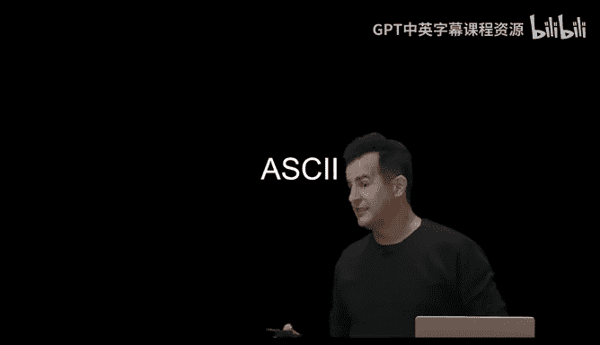

67 is C and so forth。 So why don't we do a little exercise here， what。Pattern of zeros and ones。

 Do I see here， I've got3 B。 So three sets of 8 B。 And even though there's no placeholders now over the columns。

 what is this。Number。It's 60。Yeah， so we got the ones，2s，4s，8，1632，64s column。 So indeed。

 this is gonna be the number 72，72。 This is not what computer scientists spend their day doing。

 This is just to reinforce what it is we just looked at and I'll spoil it。

 The rest of these numbers are 72，73，33。 and anyone in this room could have done that if you took out a piece of paper。

 figured out what the columns are and just do a bit of quick or mental or written math。

 But this is to say， suppose that you just got a text message or an email that if you had the ability to look underneath the hood of the computer and see what pattern of zeros and ones。

 did you just receive over the Internet， Suppose that pattern of zeros and ones was3 Bs of bits。

 Which when you do the math are the numbers 72，73，33。 Well， here's the cheat sheet again。

 What message did you just get。Yeah， so it's high。 Why because 72 is H and 73 is I。 Now。

 some of you said hi， fairly emphatically。 Y。 Well。

33 turns out you wouldn't know this unless you looked it up or someone told you is an exclamation point。

 So literally， if you were to text someone like right now， if you haven't already。

 H I exclamation point in all caps， you would essentially be sending three bys of information somehow over the Internet to that recipients。

 And because their phone similarly understands ASi， because it was programmed years ago to do so。

 it knows to show you H I exclamation point and not a number，3 numbers。

 no less or colors or something else altogether。 So here we then have high3 digits in a row here。

 what else is worth noting here。 Well， there's some fun sort of trivia embedded even in this cheat sheets。

 So here again is ABC D， E FG and so forth，65 on down。 Let me just highlight over here。

 the lowercase letters，97，98。😊，99 and so forth。 If I go back and forth， does anyone notice。

The consistent pattern between these two。Yeah， so the lowercase letters are 32 away from the uppercase letters。

 Well， how do we know that？ Well，97，-65 is yeah，32，98-66 is okay 32 and that pattern continues。

 What does this mean， Well， computers know how to do this。

 Most normal humans don't need this information。 But what it means is if you are representing in binary with your transistors on and off representing some pattern。

 And this is the pattern representing capital letter A。

 which is why we have a one in the 64 place and a one in the one's place。

 How does a computer go about lower casing this same letter。Yeah。Perfect。

 all the computer has to do is change this one bit in the 32s place201。

 because that has the effect mathematically per our discussion of adding the number 32 to whatever it is。

 So it turns out you can force text from uppercase to lowercase or back by just changing a single bit inside of that pattern of 8 bits in total。

 All right， why don't we maybe reinforce this with another quick exercise。

 We have an opportunity perhaps here for give you some stress balls right at the very start of class。

 Could we get8 volunteers to come up on stage。 maybe over here。

 and over here and we're here on the left。 Let me go all the way on the right Let's see okay。

 the high hands here the hand thats ties there。 Yes， we're making eye contact How about all the way。

 let's， let's go here in the crimson sweatshirts here and the the white shirt here。

 Come on up that I count correctly。😊，Let's say。Come on down。 the8s of U。 I didn't count right did。

 I 1，2，3，4，5，6。It's ironic that I'm not counting correctly about on the left in gray。 O， oh。

 and okay。In black here。 Come on down。 Allright， Hopefully this is 8，1，2，3，4，5，6，7。7， I pretty okay。

8 there we go。 Alright， so let's go ahead and do the following exercise。

 I've got some sheets of paper preprint here。 If each of you indeed want to do exactly what you're doing in lineup from left to right。

 Each of you is gonna represent a placeholder。 essentially。 So we have over here。

 the ones place all the way over here。 And then we have the twoth place。😊，And the forest place。

And the8s。16。32，64，128。 And we come bearing a microphone。 If each of you want to say a quick hello。

 your name， maybe your dorm or house and something besides computer science that you're studying or want to。

Hi， I'm Al Matt。 Okay， I'm Aliison。 I'm a freshman in Matthews， and I like climbing。

 and I'm thinking of C， S and Econ。😊，Number two。Hi， I'm Lily。 I'm in Hurlbutt this year。

 and I'm thinking he was doing C， S in government。Nice to meet。Hi， I'm Sean。

 I'm in Canada Hall and I'm thinking of doing astrophysics and CS。Welcome。Hi， I'm Jordan。

 I'm doing applied math with a specialization in C， S and Econ。 and I'm in Wisworth。

 and I like going to the gym。Hi I'm Shave， I'm studying Mackey and I'm in Canada G。Nice， hi。

 I'm Sophia。 I'm in there， and I' think of doing electrical engineering。 welcome。Hi。

 my name is Marie， and I'm in Canada B， and I really like C S， physics and astrophysics。😊，Hi。

 I'm Alyssa。 I'm in wholeworthy。 I'm also thinking of studying math or physics。

 and I also like to climb。 Nice， welcome to you all。 So on the backs of their sheets of paper。

 they have a little cheat sheet that's describing what they should do in each of three rounds。

 We're gonna spell out together。 a three letter word。 you all。

 as the audience have a cheat sheet above you that represent numbers to letters。

 these folks don't necessarily know what they're spelling。

 they only know what they individually are spelling。

 So if your sheet of paper tells you to represent a0 in a given round。

 just gonna stand there awkwardly。 no hands up。 But if you're told on your sheet of paper to represent a one。

 just raise a single hand to make obvious to the audience that you're representing a one and not a0 and the goal here is to figure out what we are spelling using this system called ASI。

 All right， roundund one。😊，Execute。What number is this here。I'm hearing。

You can just shout it out what number？66 or B。 So you're spelling B。 Allright， hands down， round 2。

More math。Feel free to shout it out。Oh， I heard it， yet， 79， which is。O， okay， so we have B， O。

 hands down， third and final round， execute。Number。Yes， 87， which is the letter。😡，W， which spells？

Bow， if you want to take your bow now。okay， here we go。 You guys can keep those。Thank you。

You guys can head back。 Thank you to our volunteers here。 Very nicely done。 We indeed spelled out Ba。

 And that's just because we all standardized on representing information in exactly the same way。

 which is why when you type B O W on your phone or your computer。

 The recipient see the exact same thing。 But what's noteworthy in this discussion is that you can't spell a huge number of words。

 like English。 we've got that covered， but odds are you're noticing depending on your own background what human languages you read or speak yourself。

 that a whole bunch of symbols might be missing from your keyboard。 For instance。

 we have accented characters here in a lot of Asian languages。

 there's so many more glyphs than we could have even fit in that cheat sheet of numbers and letters。

 And so ASI is not the only system that the world uses is it was one of the earliest。

 but we've moved on in modern times to a superet of ASi that's generally known as unIode and Unicode uses so many more bits than ASi that we even have room for all of these little things that we seem to send constantly nowadays。

 These are obviously。😊，Images that you might send with your phone or your computer。

 but they're technically characters。 They're technically just patterns of zeros and ones that have similarly been standardized around the world to look a certain way。

 But there， this is an emoji keyboard in the sense that you're sending characters。

 You're not sending images per se。 The characters are displayed as images， obviously， But really。

 these are just like characters in a different font and that font happens to be very colorful and graphical as well。

 So Uniode， instead of using just 7 or 8 bits， which if you do the quick mental math。

 If ASciI only used 7 or let's say 8 bits， how many possible characters can you represent in ASciI alone。

256， because if we do that quick mental math，2 to the8，256 possibilities like that's it。

 that is that's enough for English because you can cram all the uppercase letters。

 the lowercase letters， the numbers and a whole bunch of punctuation as well。

 But it's not enough for certain other punctuation symbols。

 not to mention many other human languages。 And so the Uniicode consortium。

 Its charge in life has been to come up with a digital representation of all human language past。

 present and hopefully future by using not just 7 or 8 B but maybe 16 B per character，24 B or heck。

 even 32 B per character and per before。 if you've got as many as 32 Bs available to you。

 you can represent what like 4 billion characters in total。

 And that's just one of the reasons why these emoji have kind exploded in popularity and availability。

 There's just so many darn patterns like what else are were gonna do with all of these zeros and ones。

 But more importantly， emoji have been designed to really represent people and places and things and emotions in a way that transcends human language。

But even then， they're somewhat open to interpretation。 In fact， here's a pattern of， I think。

32 zeros and ones。Guessing no one's gonna do the quick mental math here。

 But this represents what decimal number。 if we do， in fact。

 go out the mouth with that's being the one's place all the way over to the left。 Well。

 that's the number 436991106， Who knows what that is。 It's not a。 And it's nothing near a。

 uppercase or lowercase。 But it is among the most popular emoji that you might send typically on your phone laptop or other device namely this thing here。

 face with tears of joy， which odds are you've or received recently， but interestingly。

 even though many of you might have iPhones and see and send the same image。

 you'll notice that if you see a friend who's got Android or some other device。

 maybe you're using Meta's messenger program or telegram or some other messaging service。

 sometimes these emoji look a little bit different， why because what a unicode has done。

 is they decided they shall exist in emoji known as excuse me， face with tears of joy。

 then Apple and Google and Microsoft and other。😊，They're sort of free to interpret that as they see fit。

 So what you see on the screen here is a recent version from I。 Apple's operating system。

 Google's version of the same looks a little something like this。 And on Telegram。

 if you have animations enabled， the same idea faced with tears of joy is actually animated。

 but it's the same pattern of zeros and ones in each case。 But again。

 they essentially have different graphical fonts to present to you what each of those images actually is。

😊，Alright， so those are each。 excuse me， images。So those are each images。😡。

How is the computer representing them， though， At the end of the day， we've represented numbers。

 We've represented letters。 But how about these things here， Colors。

 So how do we represent red or green or blue， not to mention every other color in between。

At the end of the day， we only have one canvas at our disposal， yeah。

So integers is the exact same answer as before。 we just need to agree on what number do we use for red。

 what do we use for green， What do we use for blue。

 and we can come up with some standardized pattern for this。 In fact。

 one of the most common techniques for doing this in the real world and excuse me。Sorry。

 that was extra lab。 And the one of the most common ways to do this in the real world is to use a combination of three colors together。

 some amount of red， some amount of green and some amount of blue and mix them together to get most any color of the rainbow that you might want。

 this is sort of a picture of something I grew up with back in the day where in like middle school when we'd watch movies or some kind of show like in class。

 We would this projector screen would be over here。

 This is old school projector with three different lenses。

 one of which projects some amount of green， some amount of red， some amount of blue。

 And so long as the lenses are correctly oriented to all point at the same circle or like rectangular region on the screen。

 you would see any number of colors coming to life in the old school video。

 I still remember all these years later， we would kind sit and lean up against it because it was super warm。

 And you could easy way to fall asleep back in grade school。

 But we use the same fundamental color system nowadays， as well。

 including in modern programs like Photoshop。 So let's abstract that away。 focus。😊。

On just three colors， some amount of red， green and blue。

 And let's propose for the sake of discussion that we want to mix together like a medium amount of red。

 a medium amount of green and just a little bit of blue， for instance。

Let's propose that we'll use 72 amount of red，72 amount。

 73 amount of green or or 33 amount of blue RGB。 Now， why these numbers， Well。

 in the context of ASI or Uniode， which is just a superet thereof， What is this spell。Hi， but again。

 if you were instead to open a file containing these three numbers or really these three Bs of bits in Photoshop。

 you would hope that they're gonna be interpreted not as letters on the screen。

 but is some the color of a dot on the screen instead。 So it turns out that in typically。

 when you have a three of these numbers together， each of them is using a single by。 So 8 bits。

 So you can have0 red or 255 red，0 green or 255 green or 0 to 255 of blue。 So0 is none。

255 is the max。 So if we mix these together， imagine that just like that projector consolidating these three colors into one central point。

 Anyone want to guess what you're gonna get if you mix some red， some green。

 some blue in those amounts and way back。😊，Yeah， you're gonna get a dark shade of yellow。

 I brightened it up a little bit for the projector here。

 but you're gonna get it roughly this shade of yellow。

 And we could play with these numbers all day long and get similar results if we want to represent different colors as well。

 And indeed， whether it's Photoshop or some other program。

 you can actually combine these amounts in all sorts of ratios to get different colors。

 So if you had 0，0，0。 So no red， no green， no blue。

 take a guess as to what color that's gonna be in the computer。So it's gonna be black。

 like the absence of all three of those colors。 But if you mix the maximal amount of each of those 255 red and green and blue。

 that's gonna to give you white。 Now， if any of you have made web pages before or use programs like Photoshop。

 you might have seen numbers like 0，0 or F F long story short。

 that's just another base system for representing numbers between0 and 255 as well。

 but we'll come back to that midsster， when we make some of our own filters in sort of an Instagram like way manipulating images of our own。

 So where are these colors coming from or where can we actually see them。

 here's just a picture of that same emoji face with tears of joy。

 if I kind of zoom in on that and maybe zoom in again， you can start to see if you blow it up enough。

 or if you put your eyes close enough to the device sometimes you can actually see individual dots or squares。

 These are generally known as pixels。 and they're just the individual dots that collectively compose in image。

 which is to say that if each of these dots， which is part of the image。😊。

Is going to be a distinct color like this one's yellow。 This one's brown。

 And then there's a bunch in between。 Well， you're using some number of bits to represent each of those pixels colors。

 So if you imagine using the RGB system， that's 8 plus 8 plus 8 bit。

 So that's 24 Bs or three Bs just to keep track of the color of each and every one of these dots。

 So now if you think about having downloaded a gif at some point， a ping P And G file。

 a Jpeg or any other file format， it's usually measured in what file size， like mebys， typically。

 that means millions of bys。 why because if it's a pretty big photograph for pretty big image。

 each of those dots takes up at least 3 Bs it would seem。 And if you do out the math。

 if you've got thousands of dots， each of which uses three B， you're gonna quickly get to megabys。

 if not even larger for things like， say videos。 But again， it's just patterns of zeros and ones。

 And so long as the programmer knows what they're doing and tells the computer。

How to interpret those zeros and ones， and equivalently， so long as the software knows。

 look at these zeros and ones and interpret them as numbers or letters or colors。😡。

We should see what we intended to represent。 Allright， so that's， that's colors and images。

 What about how many of you kind of played with these little flip books as a kid where they've got like 100 different little pictures and you flip through them really quickly。

 And you see what looks like animation in book form。 Well， this is essentially a video， So therefore。

 what is a video or how can you think of what a video is。😊。

It's just a whole bunch of like images flying across the screen。

 either on paper or digitally nowadays on your phone or your laptop。

 And that's kind of nice because we're sort of composing more interesting media now。

 based on these lower level building blocks。 And this is gonna be thematic。

 We literally started with zeros and ones。 We worked our way up to letters。

 We then worked our way up to sort of images and colors and those images now we're up at this level of hierarchy in terms of video because what's a video。

 It's like 30 images per second flying across the screen， or maybe slightly fewer than that。

 that collectively tricks our mind into thinking we are seeing motion pictures。

 And that's the old school term for movies。 But it literally is what it was。

 motion pictures was this film was showing you 30 pictures per second。 And it looks like motion。

 even though you're just looking at images much like this flipbook very quickly。 One after the other。

 What about music， Well， how could you go about representing musical notes。 if again。

 your only ingredients are zeros and ones。😊，Even if you're not a musician。

 how do you represent music like that on the screen here， yeah。Okay， so the frequency。

 like the tone that you're actually hearing from the device。

 what else might weigh in beside besides the frequency of the note， yeah。

So the speed of the node or maybe the duration， like， if you think about a physical piano。

 like how long you're holding the key down for or not， What else。So the amplitude， maybe how loud。

 Like how hard did you hit the keyboard to generate that sound。

 So let me propose at the risk of simplifying， we could represent each of these notes using three numbers。

 maybe0 to 255 or some other range that represents the frequency or the pitch of the note。

 the duration and the loudness and so long as the person receiving a file containing all of those zeros and ones knows how to interpret them3 at a time。

 I bet you could share a musical file with someone else that they could hear in exactly the same way that you yourself intended。

😡，Let me pause here。😡，To see if there's any questions now。

 because we've already built our way up from zeros and ones now to video and sound。Yeah， in front。65。

So how does the computer distinguish between the letter 65 and the number 65。 It's context dependent。

 So put simply， and we'll see this as early as next week。

 The programmer tells the computer how to display the information either as a number or a letter or equivalently once programmed。

 the software knows that when it opens a dot G， I F file or dot JP E G or something else to interpret those zeros in ones as colors instead of as like dot dot like dot D。

 O， C X for Microsoft Word file or the like other questions。On any of these representations。Yeah。

 in front。The taste。Sure， so can we go base 10 and base 2。

 So base 10 is like literally the numbers you and I use every day。

 It's base 10 in the sense that you have 10 digits at your disposal，0 through 9。

 and any numbers you want to represent in the real world must be composed using 0 through 9。

 The binary system or base 2， is fundamentally the same。

 It's just the computer doesn't have access to 2 through 9， it only has access to 0 and 1。

 But much like the light bulbs I was displaying here。

 you can simply ascribe different weights to each of the digits so that instead of it being as much as the ones place。

 the1s place in the hundreds place。 if we more modestly say the ones place， the two's place。

 the fourths place， we can use the same system in binary。

 you might need to use more digits to account as high， because in 255， you can just write 2，5，5。

 That's 3 digits in decimal， but in binary we've seen you need to use 8 such digits， which is more。

 but it's still much better than unary， which would have had 255 light bulbs on。Instead。

Is binary and base 2 the same thing， Yes， just like base 10 and decimal are the same thing as well。

 And uninary and base 1 are the same thing as well。 Allright。

 so let me just stipulate that even though we sort of took this tour quickly at the end of the day。

 computers only have zeros and ones at their disposal。 So again。

 the answer to any question is to how can we represent。

X is going to somehow involve permuting those zeros and ones into patterns or equivalently into the numbers that they represent。

 But if we now have a way to represent all inputs in the world， be it letters， numbers， I， videos。

 anything else。 and get output from some problem solving process。

 Like how do we actually solve problems。 Well， the secret sauce in the middle here is another term that you've probably heard in the real world nowadays。

 which is that of algorithms。 step by step instructions for solving some problem。

 So this ultimately is what computer science really is about too。

 is not just representing information， but somehow processing it。

 doing something interesting with it to actually solve the problem that you've been provided as input。

 So you can output the correct answer。 Now， there's all sorts of algorithms implemented in our phones and in our Macs and PCs。

 And that's all software is。 It's an implementation in code be it C plus plus or Java or anything else。

 other languages exist too in code that the computer understands。

 but it's still just step by step instructions。The things we'll learn in C S 50 is how to express yourself in different ways to solve problems。

 not only in different languages， but using different methodologies as well， because as we'll see。

 among the reasons we introduce these several languages is you don't just learn more and more languages that allow you to solve the same problems。

 Different languages will allow you to solve different problems and even save you time by being better tools for the job。

 So here， for instance， an iPhone is maybe a bunch of contacts。

 which is presumably familiar where we might have a whole bunch of friends and family and what not alphabetized by first name or last name and suppose we want to find one such person like John Har。

 who's number here might be plus 1，9，4，9，4，6，8，2，7，50。 feel free to call or text him some time。

 This is the goal of this problem。 If we have our contacts app And I start typing in John's name by first name or last name。

 the autocomple nowadays kicks in and it somehow filters the list down from my 10 friends or 100 friends or 100 friends into just the single directory entry that matches。

 So here too。

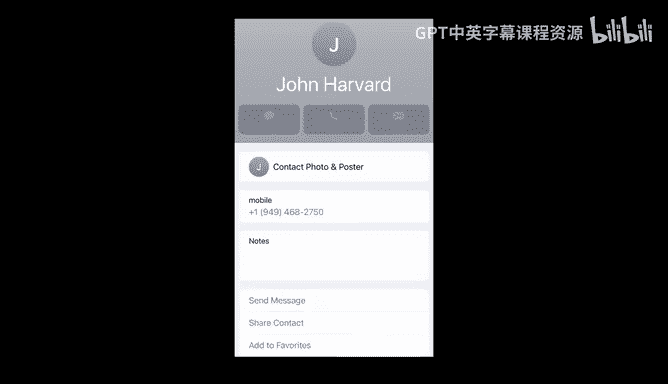

Back in the days of R G And Bs projector， we had phone books like this here， too。

 I'm pleased to say thanks to our friend。 Alexis is the largest phone book that we've used for this demonstration。

 This is an old school phone book that's essentially the same thing as our contacts app or address book nowadays。

 whereby I've got a whole bunch of names and numbers。

 alphabetically sorted by first name or last name， whatever and corresponding to each of those as a number。

 So back in the day， and frankly， even nowadays in your phones。

 How do you go about finding someone in a phone book or your contacts app。 Well。

 you could very naively just start at the beginning。

 and look down and just turn one page at a time looking for John Harvard in this case。 Now。

 so long as I'm paying attention this step by step process， will get me to John Harvard。

 like this is a correct algorithm。 even though you might kind of object to how I'm doing this。

 Why what's bad about this algorithm。😊，It's just slow。 I mean， this is crazy， slow。

 If there's like 1000 pages in this song book， which looks like there are like this could take me as many as 1000 pages。

 or maybe he's roughly in the middle like 500 pages。 like that's crazy。 That's really rather slow。

 especially if I'm gonna do this again and again。 Well。

 what if I do it a little smarter grade school， I sort of learned how to count2 at a time。 So 2，4，6。

8，101214，1618， again， if I'm paying attention。 I'll get there twice as fast。

 because I'm counting two at a time。 But is that algorithm step by step， correct。😊，And I'm seeing no。

 but why。I might skip over John Harvard。 So it's just by bad luck。 And kind of with 5050 probability。

 he's gonna be sandwiched between two of the pages。 Now。

 I don't have to abort this algorithm altogether。 I could just as soon as I get past the J section if we're doing it by first name。

 I could just double back one page and just make sure that I haven't missed him。 So it's recoverable。

 And this algorithm， therefore is sort of twice as fast plus one extra step， maybe to double back。

 But that's arguably otherwise a bug or mistake in the algorithm， if I don't fix it intelligently。

 But what do we do back in the day。 And what does your iPhone or Android phone do。

 what they typically do is they go roughly to the middle。 Look physically or virtually down。

 they say， oh， I'm in the M section， And so which side is John Harvard to to the left or to the right。

So its to the left。 So I could literally know。气死。Weve talked about this before class。

 that this might mean more， oh my god。There we go。 We can tear the problem in half。 Thank you。

It's been a while。 We can tear the problem in half。 We know that John Har is to the left。

 so I can throw。Half of the problem away if dramatically such that I'm now going to from 1000 page problem to 500 pages instead。

 What now can I do， I can go roughly to the middle here。 And maybe I'm in the E section。

 So I went a little too far back to the left。 But I kept the temple。

 and I just divided so that I can conquer this problem， if you will。

 And if I'm in the E section now is John Harvard to the left or to the right。 So the right。

 So I can get Jesus。Tear the problem in half。And now， thank you。So now John Harvard， again。

 is gonna be in this half。 I can throw this half away。 So now I've gone from 100 to 500 to 250。

 and I can repeat， repeat， repeat down to 125 half of that half of that half that until I'm left with finally just the single page And John Harvard is hopefully now on this page such that I can call him or not at all at which point this is all sort of for not。

 But what's powerful about each of those algorithms is that sort of good， better and best。

 like they all get the job done conditional on the second one， having that little fix。

 just to make sure I don't miss John Harvard between two pages。

 But they're fundamentally different in their efficiency and the quality of their design。

 And this is really representative of one of the emphases of a class like this。

 It's not just about writing correct code or getting the job done。

 But doing it well and doing it quickly using the least amount of CPU or computing resources。

 using the minimum amount of Ram， using the fewest number of people using the least amount of money。

 whatever your constrained resource is solving a problem better。So that first algorithm。

 step by step instructions was all about doing something。Like this， whereby the first algorithm。

 If we plot things on a grid like this， we have on the X axis。

 a representation of the size of the problem。 So this would mean small problem， like zero pages。

 this would mean big problem， like 1000 pages。 And then the y or vertical axis。

 we have some measurement of time。 So this is the number of seconds So the number of page turns。

 whatever your metric actually is。 So this would be not much time at all so fast。

 this would be a lot of time， So slow。 So what's the relationship。

 if we just roughly draw these three algorithms。 Well， the first one is technically a straight line。

 And we'll describe that as n， the slope is n， because if you think of n as a number for the number of pages。

 Well， there's a one to one relationship， And the first algorithm as to how many times I have to turn the page based on how many pages。

 there actually is。 And you can think about this in the extreme。

 If I was looking for someone whose name started with Z。

 I might have to go through like 100 darn pages to get to that person whose name started with Z。

 And unless again， I do something hackish and just kind of cheat and go to the end。

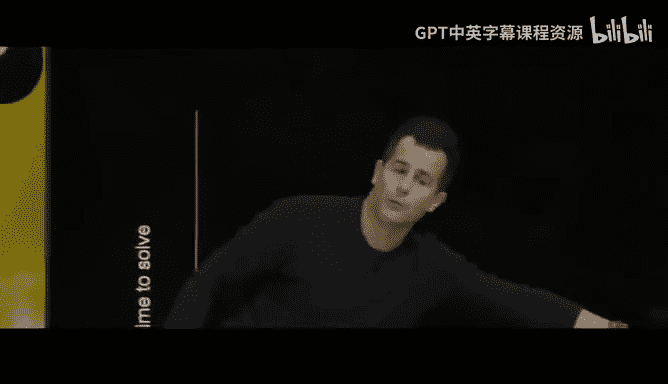

If we execute these algorithms again and again the same way， that's gonna be pretty slow。

 But the second algorithm was pretty much twice as fast。 plus that one extra step， potentially。

 but it's still a straight line， because if there's 100 pages and I'm dividing the problem I'm doing two pages at a time。

 Well that's like n divided by two steps plus one give or take。

 But it's still a straight line because but it's still better。

 notice if this is the size of the problem，100 pages for instance。

 willll notice that the first algorithm took literally twice as much time as the second algorithm。

 So we're doing better already。 But the third algorithm fundamentally。

 and it's going to look something like this。 And if you remember your logarith， so to speak。

 sort of the opposite of an exponential， this curve is so much lower and flatter if you will than either of these two mathematically more on this another time。

 the slope is going be like log based two of n or just logarithmic in nature。

 But what it means is that it's growing very， very， very slowly。 It's still going up。

 It's never going。😊，Thatlat line and go perfectly horizontal。 But it goes up very slowly。 Why。 Well。

 if you think about two towns nearby， like Cambridge on this side of the river and the town of Alston on the other。

 supposeose that they still have phone books like this one and they merge their phone books for whatever reason。

 So overnight， we go from 1000 page phone book to a 2000 page phone book。

 The first algorithm is gonna take literally twice as long。

 as will the second one because we're only going through it one or two pages at a time。

 But if the phone book size doubles from this year， for instance， to next year。

 you can kind of in your mind's eye think about the green line。

 It's not gonna go up that much higher。 why， Well， practically speaking。

 even if the phone book becomes 2000 pages long。 Well。

 how many more times do you have to tear or divide that problem in half。

Just one because you're taking 1000 page byte out of it or 500 than a 250。

 You're taking much bigger bytes out of it than just one or two at a time。

 And so what computer science and what algorithms in about good design is about is figuring out what is the logic via which you can solve problems not only correctly but efficiently as well。

 And that then gives us these things called algorithms。 And when it comes time to code。

 which we're about to do too code is just an implementation and a language the computer understands of an algorithm。

 Now， this assumes that we've come up with some digital way。

 that is to say0 in one based way to represent names and numbers。 But honestly， we already did that。

 we came up with ASI and then Unicode to represent the names representing numbers is even easier than that。

 That's really where we started。 So code is just about taking as input。

 some standardized representation of names and numbers and spitting out answers。

 And that's truly what ios and Android are doing when you start doing autocomp。 They could be。

Searching from the top to the bottom， which is fine。

 If you've only got a few friends and family in the phone。 But if you've got 1000。

 or if you've got 10000。 or if it's not a phone book anymore。

 it's some database with lots and lots of data。 Well， it stands to reason that it'd be nice。

 maybe if the computer kept it all alphabetized just like that book and jump to the middle then the middle of the middle。

 then the middle of the middle of the middle and so forth。 why because the speed is going to be much。

 much faster。 logarithmic in nature and not linear， So to speak in nature。

 but we'll revisit those topics as well。 But for now， before we get into actual code。

 let's talk for a moment about pseudocode。 So pseudocode is not one formal thing。

 every human will come up with their own way of representing pseudocode。

 it's an English like or humanlike formulation of stepbystep instructions。

 just using terse correct English or whatever human language。 So for instance。

 if I want to translate what I did somewhat intuitively with that phone book by just dividing in half dividing in half into stepbystep instructions。

hand you or now it is like a robot or something like that。 Well。

 step 1 was essentially to pick up the phone book， which I did。

 Step 2 was I open to the middle of the phone book in the third and final algorithm。

 Step 3 was look at the page as I did。 Step 4 got a little more interesting。

 even though I didn't verbalize this， presumably， I was asking myself a question。

 if the person I'm looking for John Har is on the page。 then I would have called him right then。

 But if you weren't on the page。 if you instead were earlier in the book， as did happen。 Well。

 then I'm gonna go to the left， so to speak。 But more methodically。

 I'm gonna open to the middle of the left half of the book。 then I'm gonna go back to line 3。

 That's interesting， We'll come back to that in a moment。

 But else if the person is later in the book。 I'm gonna open to the middle of the right half of the book。

 and then go back to line 3。 Now， let's pause here， why do I keep going back to line 3。

 This would seem to get me doing the same thing。Forever。Endlessly。But not quite why。Yeah。

 so because I am dividing the problem in half， for instance， on line 6 or line 9 implicitly。

 just based on how I've written this， the problem is getting smaller and smaller and smaller。

 So it's fine if I keep doing the same logic again and again。

 because if the problem is getting smaller， eventually， it's gonna bottom out。

 and I'm gonna have just one person on that page that I want to call。 And so the algorithm is done。

 But there is a perverse corner case， if you will。 And this is where it's ever more important to be precise when writing code and anticipate what could go wrong。

 I should probably ask one more question in this code， not just these three。😊。

What might that question。Bei。Yeah。也账号。Yeah， so if John Harvard is not in the book。

 There's this corner case where what if I'm just wasting my time entirely and I get to the end of the phone book and John Harvards not there。

 what should the computer do， Well， as an aside， if you've ever been using your Mac or PC or phone and the thing just freezes or like the stupid little beach ball starts spinning or something like that。

 And you're like， what is going on， some human at Google or Microsoft or Apple or the like made a mistake。

 They forgot， for instance， that fourth Un but possible situation。

 wherein if they don't tell the computer how to handle it。

 the computer is effectively gonna freak out and do something undefined like just hang or reboot or do something else。

 So we do want to add this else。Quit altogether。 So you have well definedfin behavior and truly think that the next time your computer or phone spontaneously reboots or dies or does something wrong。

 It's probably not your fault per se。 It's some other human elsewhere did not write correct code。

 They didn't anticipate cases like these。 But now let's use some terminology here。

 There's some salient ideas that we're gonna see in scratch and see and Python and these other languages I alluded to earlier。

 Everything I've just highlighted here， Henceforth， we're gonna think of as functions。

 functionss or verbs or actions that really get some small piece of work done for you。

 functionss or verbs or actions here， though， highlighted is the beginning of what we'll call conditionals。

 conditionals like a fork in the road。 Do I go this way。

 Do I go this way or some other way altogether。 How do you decide what road to go down We're gonna call these questions you ask yourself。

 Boolean expressions named after a mathematician bull and a boolean expression is just a question that has a yes or no answer or a true。

😊，Or false answer。 or a one or 0 answer。 just， it's a binary state。 Yes or no， typically。Otherwise。

 we have this。 go back to， go back to， which is what we're generally kind call a loop。

 which somehow induces cyclical behavior again and again。 And those functions and those conditionals。

 Boolean expressions and loops and a few other concepts are pretty much what will underlie all of the code that we write。

 whether it is in scratch， C or something else altogether。 But we need to get to that point。

 And in fact， let's go and infer what this program here does。 At The end of the day。

 computeruters only understand zeros and ones。 So I claim here is a program of zeros and ones。

 What does it do。Anyone want to guess， I mean， we could spend all day converting all of these zeros and ones to numbers。

 but they're not gonna be numbers if it's code。 What do you think。That's amazing。 It does， in fact。

 print hello world。😊，Alright， so no one， except like maybe you and me and a few others in the room should know。

 And that was probably guess admittedly or advancing on the slide。 But why is that， Well。

 it turns out that not only do computers standardize information data like numbers and letters and colors and other things。

 they also standardize instructions。 And so if you've heard of companies like Intel or AM MD or Nvidia or others among the things they do is they decide as a company。

 what pattern of zeros and ones shall represent what functionality And it's very low level functionality。

 Those companies and others decide that some pattern of zeros and ones means add two numbers together or subtract or multiply Another pattern might mean load information from the computer's hard drive into memory。

 Another might mean store it somewhere else， Another might mean print something out to the screen。

 So nested somewhere in here and admittedly， I have no idea which pattern off because its not interesting enough to go figure it out at this level says print and somewhere in there。

 like this gentleman proposed， I bet we could find the represent。Of H。

 which was 72 and E and L and L and O in everything that composes hello world。

 Because as it turns out， in programming circles， the very first program that students typically write is that of hello worlds。

 Now， this one here is written in a much more intelligible way。

 even if you're not a programmer odds are。 if I ask you， what does this program do。

 you would have said。😊，No， hello world， even though there's a lot of clutter here。

 Like no idea what this is until next week， in main void。 that looks cryptic。

 There's these weird curly braces， which we rarely use in the real world。

 But at least I understand a few words like hello in world。 And this is kind of familiar print F。

 But it's not print， but it's probably the same thing。

 So here too is an example of this hierarchy back in the day and the earliest days of computers humans were writing code by representing zeros and ones。

 If you've ever heard your parents talk about punch cards of the likere effectively representing patterns that tell the computer what to do or to represent like literally holes and paper。

 Well， pretty quickly early on。 this got really tedious only writing code at such a low level。

 So someone decided， you know what， I'm gonna put in the effort。

 I'm gonna figure out what patterns of zeros and ones I can put together So as to be able to convert something more user friendlyend to those zeros and ones。

 And as a teaser for next week， that person invented the first compiler。

 a compiler is just a program that translates one language to another。 and more。😊。

 this is a language called C， which will spend a few weeks on together because it's so fundamental to how the computer works。

 Even this is gonna get tedious by like week 6 of the class。 and this is gonna get stupid。

 This is gonna get annoying。 This is gonna get cryptic。

 We're just gonna write print hello on the screen in order to use a different language called Python Y because someone wrote in C a program that can convert Python。

 This is a white lie to C， which can then be converted two zeros and ones and so forth。

 So in computing， there's this principle of abstraction。 where we start with the basics。

 and thank God， we can all trust that someone else solve these really hard problems long ago。

 Then they wrote programs to make it easier。 We wrote programs to make it easier。

 you can now like I did with the chatbot to make things even easier。 Why。

 because open AI and other companies have abstracted away a lot of the lower level implementation details。

 And that's where I think this stuff gets really exciting。

 We can stand on the shoulders of others so long as we know how to use and assemble these kinds of building block。

😊，And speaking of building blocks， let's start here。 Now， odds are。

 some of you might have started here in like grade school playing with scratch。

 and it's great for like aftercho programs， learning how to program。

 And you probably used it this language to make games and graphics and just maybe playful art or the like。

 But in scratch， which is a graphical programming language designed about 20 years ago from our friends down the road at MI T's media lab。

 It represents pretty much everything we're going be doing fundamentally over the next several weeks in more modern languages like C and Python more textual languages。

 if you will， I bet I could ask the group here， what does this program do when you click a green flag。

😊，Well， it says hello world on the screen because with scratch。

 you have the ability to express yourself with functions and loops and conditionals and all of this。

 But by using drag and drop puzzle pieces。 So what we're about to do is this。

 We're gonna go on my screen to scratch M T ED U。 It's a browserbased programming environment。

 We're only going to spend one week few days in C 50 on this language。

 But the overarching goal is to one， make sure everyone's comfortable applying some of these building blocks and actually developing something that's interesting and visual and audio as well。

 But to also give us some visuals that we can rely on and fall back on when all of those curly braces and parentheses and sort of stupid syntax comes back that's necessary in many languages。

 but can very quickly become a distraction early on from the interesting and useful ideas。

 So what we're about to see is in a browser。 This is the scratch programming environment。

 And there's a few different parts of this world。 This is the blocks palette。 so to speak。

 that is to say there's a bunch of puzzle pieces or building blocks that。😊。

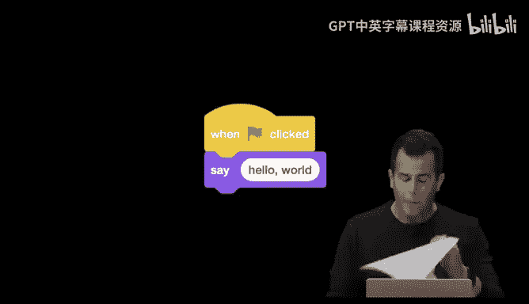

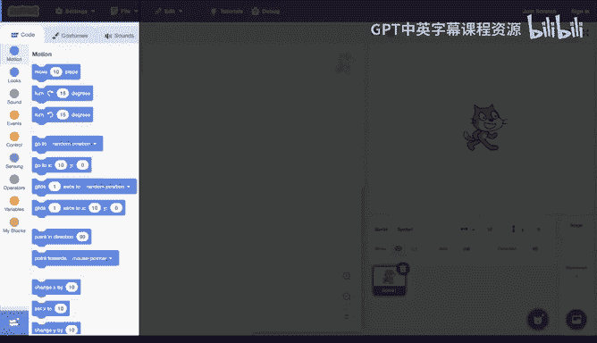

Represent functions and conditionals and and loops and other such constructs。

 There's gonna be the programming area here where you can actually write your code by dragging and dropping these puzzle pieces。

 There's a whole world of sprites here by default Sc is and is a cat by design。

 But you can make scratch look like a dog， a bird a garbage can or anything else as well soon see。

 And then this is the world in which scratch itself live。 So scratch can go up down， left， right。

 and generally be animated within that world for the curious kind of like high school geometry class。

 There's sort of this X Y plane here。 So 0，0 would be in the middle，0，180 is here，0 Ne 180 is here。

 negative 2，40，0 is here and positive 240，0 is here。 generally。

 you don't need to worry about the numbers。 but they exist so that when you say up or down。

 you can actually tell the program go up1 pixel or 10 pixels or 100 pixels so that you have some definition of what this world actually is。

 Allright， so let's actually put this。😊，The test， let me go ahead here and flip over to in just a moment。

 the actual scratch website whereby I'm gonna have on my screen in just a moment that same user interface。

 once I've logged in。That via which I can actually write some code of my own。

 Let me go ahead and zoom in on the screen a little bit here。

 And let's make the simplest of these programs first。 maybe a program that simply says hello world。

 Now， at a glance， it's kind of overwhelming how many puzzle pieces there are And honestly。

 even over 20 years， I've never used them all and M T occasionally adds to it。

 But the point is that their color coded to resemble the type of functionality that they offer。

 And also it's meant to be the sort of thing where you can just kind of scroll through and get a visual sense of like what you could do and then figure out how you might assemble these puzzle pieces together。

 So I'm gonna go under this yellow or orange category here to begin with。

 So there exists in the world of scratch， not quite the same jargon that I'm using now functions and conditionals and loops that's more of the programmers way。

 This is more of the child friendly way。 But it's really the same idea under events you have puzzle pieces that represent things that can happen while the world is running。

 So， for instance， the first one here is sort of the canonical when the green flag is clicked。

 Why is that。😊，Relevant Well， in the twodiional world that scratch lives in， there's a stop sign。

 which means stop。 and there's a green flag， which means go。

 So I can therefore drag one of these puzzle pieces over here so that when I click that green flag。

 the cat will in fact， do something for me。 doesn't really matter where I drop it So long as it's somewhere in the middle here。

 I'm gonna go ahead and let go。 Now， I want the look of the cat to change。

 I want to see like a cartoon speech bubble come out for now。 So I'm gonna go under a looks here。

 And there's a bunch of different ways to say things and think things。

 I'm gonna keep it simple and just drag this one here。

 And now notice when I get close enough to that first puzzle piece。

 they're sort of magnetic and they want to snap together so I can just let go and boom because theyre similar shape。

 they will lock together automatically and notice too， if I zoom in here， the white oval。

 which by default says hello is actually editable by me because it turns out that some functions can take arguments or more generally inputs that influence their behavior。

 So if I click or double click on this I can change。to the more canonical hellello world or hello。

 David or hello， whatever I want the message to be。 I'm gonna go ahead and zoom out。

 And now over here at top right， notice that I can very simply click the green flag。

 And I'll have written my first program in scratch。 I click the green flag。 It said go。

 and now notice it's sort of stuck on that。 because I never said stop saying go。

 But that's where I can click the red stop sign and sort of get the cat back to where I want it。

 So think about for just a moment， what it is we just did。 So at the one hand。

 we have a very obvious puzzle piece that says， say， and it said something。

 But it really is a function。 And that function does take an input represented by the white oval here。

 otherwise known as an argument or a parameter。 But what this really is is just an input to the function。

 And so we can map even this simple， simple scratch program onto our model of problem solving before with an addition of what we'll call moving forward a side effect。

 a side effect in a computer program。 is often something that happens。😊。

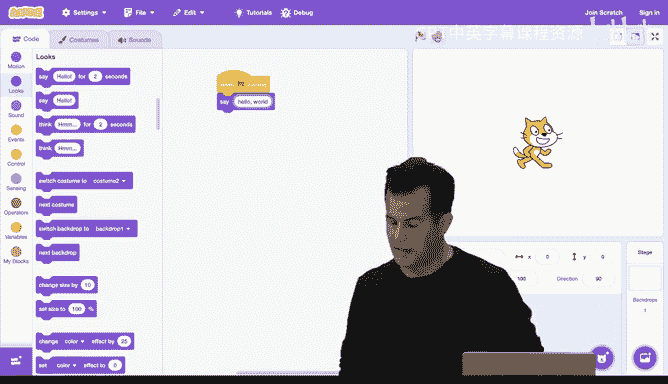

Visually on the screen or maybe audibly out of a speaker。

 It's something that just kind of happens as the result of you using a function like a speech bubble appearing on the screen。

 So here， more generally， its what we claimed represents the solving of a problem。

 And let's just consider what the input is。 The input to this problem。

 say something on the screen is this white oval here that I typed in。 hellello world。 The algorithm。

 The step bystep instructions or not something really， I wrote。

 like our friends at Mit implemented that purple say block。

 So someone there knows how to get the cat to say something out of its comical mouth。

 So the algorithm implemented in code is really equivalent to the say function。

 So a function is just a piece of functionality implemented in code。

 which in turn implements an algorithm。 So algorithm is sort of the concept and the function is actually the incarnation of it in code。

 What's the output。 Well， hopefully it's this side effect。

 seeing the speech bubble come out of the cat's mouth like this。 Allright， so that's。😊。

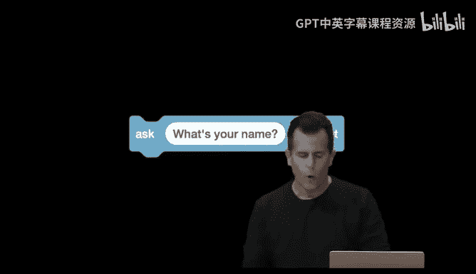

One such program。 But it's always gonna play and look the same。

 What if I actually want to prompt the human for their actual name。 Well。

 let me go back to the puzzle pieces here。 Let me go ahead and throw this whole thing away。

 And if you want to delete blocks， you can either right click or control click and choose from a menu。

 or you can just drag them there and sort of let go and they'll disappear。

 I'm gonna go back in and get another another event block。

 even though I could have reuse that same one。 I'm going go ahead and go under sensing now。

 And if I zoom in over here， you'll see a whole bunch of things。

 like I can sense distance and colors， but more pragmatically， I can use this function in blue。

 ask something and then wait for the answer。 And what's different about this puzzle piece is that it always yes a function。

 it too takes an argument。 But instead of having an immediate side effect like displaying something on the screen。

 It's essentially inside of the computer gonna hand me back the response。

 It's going to return a value， so to speak。 and a return value。Is something that the code can see。

 But the human can't。 A side effect is something the human sees， but a return value。

 something only the computer sees。 It's like the computer is handing me back the user's input。

 So how does this work， will notice， and this is a bit strange。

 This isn't usually how variables work。 But Sc2 supports variables。

 And that was a word I used quickly at the very start when we were in making the chatbot。

 a variable like in math X， Y or Z just store some value。

 But it doesn't have to store a number in code， it can store like a human name。

 So what's gonna happen when I use this puzzle piece is that once the human types in their name and hits enter M I T or really scratch is going store the answer。

 The so-called return value in a variable that's designed to be called answer。 But as we'll see。

 you can make your own variables down the line if you want， and call them anything you want。

 But let me go ahead and zoom out。 Let me drag this over here。 I'm gonna use the default question。

 What's your name。 But I could certainly change the text there。 And let me go under looks again。

Let me go ahead and grab the say block。And let me go ahead and say just for consistency， like， hello。

 comma。 okay， and now let me go under maybe sensing。 I want to say I want to say this answer。

 Well notice this， the shapes are important。 This too is an oval， even though it's not white。

 But that's just because it's not editable。 It's gonna be handed to me by the ask function。

 let me zoom out and grab a second say block like this。

 and notice it will magnetically clip together， I don't want to say hello again。

 So I could delete that。 But now it's still the same shape， even though it's a little smaller。

 let me go back to sensing and notice what can happen here。

 when you have values like words inside of a socalled variable。

 you can use those instead of manual input it your keyboard and notice it who wants to magnetics to slap into place。

 it'll grow to fit that variable because the shape is the same。 And now let's do this。

 Let me click the green flag at right。 I'm seeing quote unquote， What's your name。

 I'm getting a text box this time。 like on a web page， for instance。

 let me type in my name and watch closely what comes out of the cat's mouth。

As soon as I click the check mark or hit enter。O， I got my name right， But let me do it once more。

 Let me stop and start D， A V， I D。Enter。No it didn't work。 Let me try one other。 Maybe it's my name。

 Let's try Kelly。Enter what's missing， obviously。So the， the hello， there's a bug。

 a mistake in this program， but is there like， what explains this。

 even if you've never programmed before intuitively， what could explain why I'm not seeing hello。

Exactly， it's on two different lines。 So it's doing one after the other。 So it is happening。

 It's just you and I is the slowest things in the room are just not seeing it in time because it's happening so darn fast because my computer know。

 so new and so fast， it's happening but way too quickly。 So how can we solve this。

 solve this in a few different ways。 And this is where in scratch。

 at least for problems at0 wherein you'll have an opportunity to play around with this。

 I can scroll around here okay under control。 I see something like wait。

 So I can just kind of slow things down and now notice too。

 if you hover over the middle of two blocks。 if it's the right shape。

 it'll just snap into the middle too。 or you can just， you know。

 kind of drag things away to magnetically separate them。 But this might solve this。

 So let me hit stop and then start D V I D enter。Hello， David， Allright， that was a little。

 let's do like maybe two seconds to see it again。 Green flag， D， A V， I D enter， hello。David。

 it's working better。 It's sort of more correct because I'm seeing the hello and the David。

 but kind of stupid right to see one and then the other。

 wouldn't it be nice to say it all in one breath。 So to speak。 Well。

 here's where we can maybe compose some ideas。 So let me get rid of this weight and the additional block。

 Let's confin ourselves to just one say block。 But let me go down to operations。

 where we haven't been before。 And this is interesting。

 There's this bigger oval here that says join two things like Apple and banana。

 And those are just random placeholder words that you can override with anything you want。

 But they're both ovals and white， which means I can edit them。 So let me go ahead and do this。

 Let me drag this on top of the say block。 And this is just gonna therefore override the hello I put there。

 Now I don't want to say Apple or banana。 But I do want to say hello comma。

 And I then want to say my name。 Okay， so now I can go back to sensing。 Go back to answer。

 drag and drop this here that'll snap into place。 And let me zoom in。 Now what I've done is take。😊。

Function， and on top of it， I nested another function。

 The join function that takes two arguments or inputs and presumably joins them together as per its name。

 So let's see what this does for us。 Let me click stop and start。 I'll type in David enter。😊。

It's so close。 Now， this is just kind of an aesthetic bug。 What have I done wrong here。

There's no space。 So it looks a little wrong， but that's an easy fix。

 I just need to literally go into the hello block after the comma， hit the space bar so that now。

 when I stop and start again and type in David， now I see something that's closer to the grammar we might typically expect syntactically here。

Alright， so let's model this after what we just saw earlier。

 We've now introduced a so- calledled return value。

And this return value is something we can then use in the way we want。

 It's not happening immediately like the speech bubble。

 It's clearly being passed to me in some way that I can use to plug in somewhere else like into that join block。

 So if we consider the role of these variables playing， let's consider the picture now as follows。

 If the input now to the first function， the ask block is what's your name， quote unquote。

 that's indeed being fed into the ask block。 And the result this time is not a speech bubble。

 It's not some immediate visual side effect。 It is the answer itself stored in a socalled variable as represented by this blue oval。

 Meanwhile， what I want to do is combine that answer with some text I came up with advance by kind of stacking these things together。

 Now， visually in scratch， you're stacking them on top。

 But it's really that you're passing one into the other into the other。

 because much like math when you have the parentheses and you're supposed to do what's inside the parentheses and then work your way out。

 same idea here。 you want to join hello and answer together and whatever that。

is that then becomes the input to the save block， which like in math。

 is outside of the join block itself。 So pictorially， it might now look like this。

 There's two inputs to this story。Hello， comma space and the answer variable。

 The puzzle piece and question is join。 It goal in life had better be to give me the full phrase that I want。

 Hello， comma David， let's shift everything over now。

 because that output is about to become the input to the save block。

 which itself will now have the so-called side effect。 And so this too is what programming。

 And in turn what computer science is about is composing with the solutions to smaller problems solutions to bigger problems using those component pieces。

 And that's what each of these puzzle pieces represents is a smaller problem that someone else。

 or maybe even you has already solved。 Now， we can kind of spice things up here。

 if I go back to scratches interface。 We don't have to use just the puzzle piece here。

 I can do something like this。 Let me go ahead and drag these apart and get rid of the save block down here。

 just for fun， There's all these extensions that you can add over the Internet to your own scratch environment。

 And if I go to like text to speech down here。 I can， for instance， do a speak block instead of。😊。

A block colored here in green。 I can now reconnect the join block in here。

 And if we could raise the volume just a little bit， let me stop the old version。

 Start the new version， type in my name and hear what scratch actually sounds like。Hello， David。

 Okay， not very catlike， but we can kind of waste some time on this by like dragging the set voice2 box。

 And I can put this anywhere I want above the speak block。 So I'm just gonna put it here。

 even though I've already asked a question， Maybe kitten sounds appropriate。 Let's try again。

 D A V I D。喵o Mio。Okay， and then let's say， giant。Little creepyier。 Here we go。 D A V， I D。

 and lastly。Hello， David。Alright， little ransom like instead。 Allright。

 so that's just some additional puzzle pieces， but really just the same idea。

 But I like that we've introduced some sound。 So let's do this。

 Let me go ahead and throw away a lot of those puzzle pieces。

 leave ourselves with just the one green flag clicked and play around with some other building blocks that we've seen already thus far。

 Let me go ahead， for instance， under sound。 and let's the cow actually Miow。

 So it turns out scratch being a cat by default comes with some sounds by default like Miowing。

 So if we go ahead and click the green flag after programming this program。

 Let's hear what he sounds like now。😊，Okay， kind of cute。

 And if you want it scratched to me out twice， you can just play the game again。And a third time。

Alright， but that's going to get a little tedious， as cute as it is。 So I can solve that。

 Let's just grab three of the puzzle pieces and just drag them together and let them connect and now click the green flag。

Alright， doesn't gets less cute quickly， but maybe we can slow it down so that the cat doesn't sound so。

 so hungry。 maybe let me go under， let's see under control。

 Let's grab one of those wait one second and maybe plop a couple of these in the middle here that might help things。

 and now click the green flag。Okay， still a little hungry。 but let's see if we change it to two。

 and then I change it to two down here in both places。 Let's play it again。Okay， cuter， maybe。

But now I'm venturing into badly programmed territory。 This is correct。

 If my goal is to get the cat to me out three times pausing in between， sorry。

 three times pausing in between， what is bad about this code， even if you've never programmed before。

 though。Yeah 안 middle。Yeah， I literally had to repeat myself three times。 essentially copy pasting。

 And frankly， I could have been really lazy， I could write click or control click。

 and I could have chosen duplicate。 But generally， when you copy paste code or when you duplicate puzzle pieces。

 probably doing something wrong Why it's solving the problem correctly。

 but it's not well designed for only because when I change the number of seconds。

 now I had to change it in two places。 So I had one initially， then I had to change it to two。

 And if you just imagine in your mind's eye having not like6 puzzle pieces but 60 or 600 or 6000。

 you're gonna screw up eventually， if it's on you to remember to change something here and here and here and here。

 like you're going to mess up。 It's better to keep things simple and ideally centralize by factoring out common functionality。

 And clearly playing sound and waiting， is something I'm doing at least twice。

 if not a third time here as well。 So how can we do this better， won't remember this thing， loops。

 maybe we can just do something a little more cyclically。 So I tell the computer。😊。

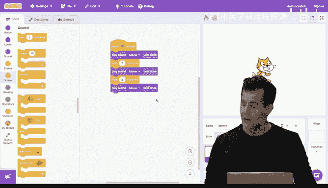

Something once。 But I tell how many times to do that altogether。 So notice here。

 by coincidence under control， I have a repeat block， which doesn't say loop。

 but that's certainly the right semantics。 Let me go ahead and drag the repeat block in。

 and I'll change the 10 to 3， just for consistency here， I'm gonna go back to sound。

 I'm gonna go ahead and play sound meow until done just as before。

 And just so it's not meowing too fast under control。

 I'm gonna grab a weight one second and keep it inside the loop。

 And notice that the loop here is sort of hugging these puzzle pieces by growing to fill。

 however many pieces， I actually cram in there。 So now if I click play。

 the effect is gonna be the same， but it's arguably not only correct。 but also well。

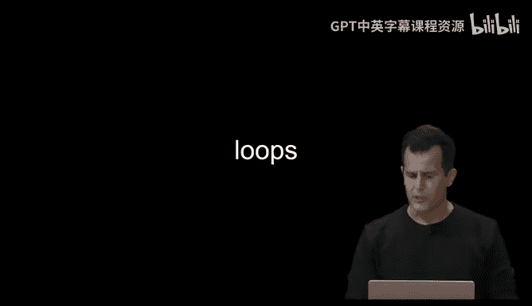

Designed。Because now， if I want to change the weight， change it in one place。

 If I want to change the total number of times， change it in one place。

 So I've modularized the code and made it better designed in this case。

 But now this is silly because。Even though I want the cat to Miow。

 it feels like any program in which I want this cat to Miow。

 I have to make these same puzzle pieces and connect them together。

 Wouldn't it be nice to invent the notion of Miowing once and then actually have a puzzle piece called meow。

 So when I want the cat to Miow， it will just Miow。 Well， I can do that too。

 let me scroll down to my blocks here in pink。 I'm gonna click make a block。

 And I'm gonna literally make a new puzzle piece that M T didn't think of called Miow。

 And I'm gonna go ahead and click okay Now I have in my code area here a define block。

 which literally means define meow as follows。 So how I'm gonna do this。 Well。

 I'm gonna propose that Miowing just means to play the sound Miow until done and then wait one second。

 And notice now I have nothing inside my actual program， which begins when I click the green flag。

 But notice at top left， because I made a block called Miow。

 I now have access to one that I can drag and drop。 So now。😊。

Can drag meow into this loop and per my comment about abstracting the lower level implementation details away。

 I'm gonna sort of unnecessarily dramatically just move that out of the way。 It still exists。

 I didn't delete it。 But now out of sight out of mind。 Now。

 if you agree with me that Miow means for the cat to make a sound。

 We've abstract it away what it means mechanically for the count to say that sound。

 And so we now have our own puzzle piece that I can just now use forever。

 because I invented the meow block already。 Now， I can do one better than this。

 It would be nice if I could just tell the meow block how many times I want it to meo because then I don't need to waste time using loops either myself。

 So let me do this。 Let me zoom out and let me go back to my defined block。

 Let me write click or control click and just edit it。 or I could delete it and start over。

 but I'll just edit it and specifically， let me say， you know what。

 Let's add an input otherwise known as an argument to this meow block and we call it maybe n for the number of times I want it to meow and。

Just to be super clear。 I'm gonna add a label， which has no functional impact。

 but it just helps me remember what this does。 So I'm gonna say meow n time。

 so that when I see the puzzle piece， I know what the n actually represents。 If I now click okay。

 my puzzle piece looks a little different at top left。

 Now it has the white oval into which I can type or drag input Not down here in the defined block。

 I now see that same input called n。 So what I can do now is this。 let me go under control。

 drag the repeat block here。 and I have to do a little switcheroo。

 let me disconnect this plug it inside of the repeat block， reconnect all of this。

 and I don't want 10 and heck， I don't even want three down here anymore， I can drag this input。

 because it's the right shape。 and now declare that meowing n times means to repeat the following n times。

 play sound meow until done wait one second。 and keep doing that n total times。

 If I now zoom out and scroll up。 Notice that my usage of this puzzle piece。

Such that I don't actually need the repeat block anymore。 I can disconnect this。 and heck。

 I can actually right click and control， click and delete it Just use this under the green flag。

 Change this to a3。 And now I have the essence of this meowing program。

 The implementation details or out of sight out of mind once they're correct。

 I don't need to worry about them again。 And this is exactly how scratch itself works。

 I have no idea how MI T implemented the weight block or the repeat block。 Heck。

 there's a forever block。 And there's a few others。

 but I don't need to know or care because they've implemented those building blocks that I can then implement myself。

 I don't necessarily know how to build a whole cha up。 but on top of open AIs API。

 this webbased service。 I can on cha up because they've done the heavy lift of actually implementing that for me。

 Well， let's do just a few more examples here。 Let's bring the cat all the more to life。

 Let me throw away the meowing。 Let me open up under when green flag clicked about that forever block that we just glimpsed。

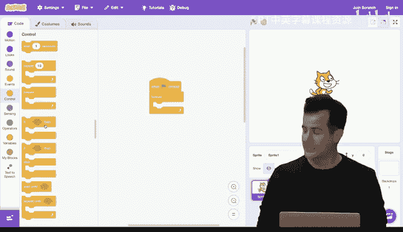

Let me go ahead and now add to the mix what we called earlier conditionals。

 which allow us to ask questions and decide whether or not we should do something。 So under this。

 let me go ahead and under forever， say if the following is true。 Well。

 what Boolean expression do I want to ask， Well， let's implement。

 how about this program and we'll figure out if it works。 under sensing。

 I'm gonna grab this a very angled puzzle piece called touchuching mouse pointer。 That is the cursor。

 And only if that question has a yes answer， do I want to play the sound meow until done。

 So let me zoom in here and in English。

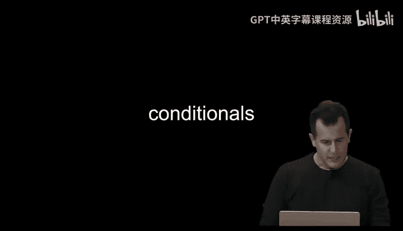

What is this going to implement， really。Just describe what this program does less arcanely as the code itself。

 yeah。Yeah， if you move the mouse over the cat， it will make noise。

 So it's kind of like implementing， petting a cat， if you will。 So let me zoom out。

 click the green flag and notice nothing's happening yet。

 but notice my puzzle pieces are highlighted in yellow because it is， in fact。

 still running because it's doing something forever。

 and it's constantly checking if I'm touching the mouse pointer and if so。😊。

It's like I just pet the cat。 Now it stopped until I moved the cursor again。Now， it stopped。

 If I leave it there。It's going to keep me yelling because it's going to be stuck in this loop forever。

But it's correct， insofar as I'm petting the cat。 Let me do this， though。

 Let me make a mistake this time。 Let me forget about the forever and just do this。

 And you might think this is correct。 Let me click the green flag。 Now， let me pet the cat。And like。

 nothing's actually working here。 Why， though， logically。Yeah。Yeah， the program so darn fast。

 It already ran through the sequence。 And at the moment in time， when I clicked the ring flag， No。

 I was not touching the mouse pointer。 And so it was too late by the time I actually moved the cursor there。

 But by using the forever block， which I did correctly the first time。

 this ensures that scratch is constantly checking the answer to that question。

 So if and when I do pet the cat， it will actually。Detect as much。Alright。

 I out a few final examples before you're on your way。

 building some of your own first programs with these building blocks。

 Let me go ahead and open up a program that I wrote in advance。 In fact， about 20 years ago。

 whereby let me pull this up。

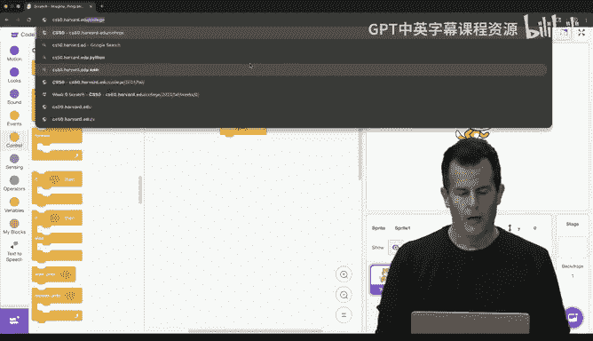

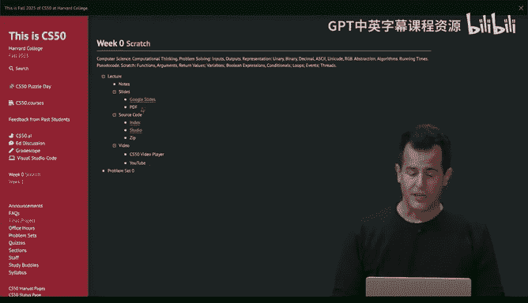

Whereby we have in this example， a program I wrote called Oscar time。

 And this was the result of our first assignment in this class。

 whereby when Mi T was implementing scratch for the very first time。

 we needed to implement our very own scratch program as well。

 I'm gonna go ahead and full screen it here。 The goal is to drag as much falling trash as you can to Oscars trash can before his song ends for which one volunteer would be handy here。

 I saw your hand go up quickly Yeah， come on up Alright， So you're playing for a stress ball here。

 if we will at some point， I'm gonna talk over what you're actually playing just so that we can point out what it is we're trying to glean from this program。

 And I'll stipulate this probably took me like12 hours。 And as you'll soon see。

 the song starts to drive you nuts after a while， because I was trying to synchronize everything in the game to a childhood song with which you might be familiar。

 Let me go ahead and say hello if you'd like to introduce yourself。😊，Hello， so I'm Han。

And I'm a first year student。 I'm pretty excited for this class。 welcomecom。 Well。

 here is Oscar time。 If you want to go ahead and take control of the keyboard。

 All you'll need to do is drag and drop trash that falls from the sky into the trash can。😊，🎼Oh why。T。

Anything 30 or genius one？🎼Anying course to。🎼All right。

 let's see what happened You'll see a sneaker was perfectly time。

 Thank you very much with the song after figuring out exactly how many seconds it had of weight。

 Now Han can drag not only the piece of trash， but the shoe as well。😊。

🎼I love it because its and it's around this point in the game where the novelty starts to wear off because it's like three more minutes of this game where more and more stuff starts to fall from the sky。

 So as Han， as you continue to play。 I'm gonna cut over here。

 you could playing let's consider how I implemented this whereby will start at the beginning。

 The very first thing I did when implementing Oscar time honestly was the easy part。

 Like I found a lamp post that looked a little something like this。

 And I made the so-called costume for the whole stage。 And that was it。 the game didn't do anything。

 you can play anything。 can green flag， nothing happen。

 but then I figured out how to turn the scratch cat otherwise known more generally as a sprite into a trash can instead And so the trash can mean。

 is clearly animated because I realized that oh， I can give sprites like the cat different costume。

 So I can make the cat not only look like a trash can。 but if I want its lid to go up。 Well。

 that's just another costume。 And if I want to see Oscar popping out， that's just a third costume。

 And so I made my own simplistic。😊，🎼AnationAnd you can kind of see it。

 It's very jittery step by step by step by creating the illusion of animation by really just having a few different images or costumes on Oscar。

 Now I hope you appreciate how much effort went involved into timing。

 each of these pieces of trash with the specific mention of that type of piece of trash in the music。

20 years later， still clinging。 So you're doing amazing， by the way。

 How do we get the trash to fall in the first place。 Well， at the very beginning of the game。

 the trash just started falling from some random location。

 What does it mean for trash to fall from the sky。😊，Big climax here。

You've got a lot of trash on the ground you should pick up。There we go。 And your final score is。

A big round of applause， if we could for。👏Thank you。So just to be clear。

 now let's decompose this fairly involved program that took me a lot of hours to make into its component parts。

 So this is just a sprite。 And I figured out eventually how to change its costume。

 change its costume， change its costume to simulate some kind of animation。 And I also realize that。

 oh， I don't need to just have one sprite or one cat or trash can。 You can create a second sprite。

 a third sprite and many more。 So I just told the sprite to go to a random location at y equals 180 and x equals something。

 I think I restricted X to be in this region， which is why the trash never falls from over here。

 just a little bit of math based on that Cartesian plane that we saw a slide of earlier。

 And then I probably had a loop that told the trash to move a pixel， move a pixel。

 moveve a pixel down， down， down down until it eventually hits the bottom and therefore just stops。

 So we can actually see this step by step。 And this is representative of how even for something like your first problem said in C 50 and with scratch specifically。

 you might build some of the same。 So I'm gonna go back into C 50 studio for。😊，Today。

 which is linked on the course's website， which has a few different versions of this and other programs called Oscar 0 through Oscar 4。

 where 0 is the simplest。 And truly， I meant it when I look inside this program to see my code like this was it。

 There was no code because all I did was put the sprite on the screen and change it from a cat to a trash can。

 and I added a costume for the stage， so to speak， so that the lamp post would be fixated there。

 If I then go to the next version of code version 1， so to speak， Then I had code that did this。 Now。

 notice there's a few things going on here。 at bottom left， you'll see， of course。

 the trash can and then a top right the trash， here are the corresponding sprites down here。

 So when Oscar is clicked on here。 the trash can， you see the code I wrote the puzzle pieces I dragged for Oscar。

 And in a moment， when we click on trash， you'll see the code I wrote or the puzzle pieces I wrote dragged and dropped for the trash piece specifically。

 So what does Oscar do。 Well， I first switch his costume to Oscar 1。😊，Which I assume is this。

 the closed trash can。 Then forever， Oscar does the following。 If Oscars touching the mouse pointer。

 then change the costume to Oscar 2。 Otherwise， that is if not touching the mouse pointer。

 change the costume to Oscar 1。 Well， what's the implication。

 Any time I move the cursor over the trash can， the lid just pops up which was exactly the animation I wanted to achieve。

 Meanwhile， if we do this and click the green flag， you can see that in action。

 even for this simple version。 if I move the cursor over Oscar， we have the beginnings of a game。

 even though there's no score， there's no music or anything else。 but I've solved one of my problems。

 Meanwhile， if I click on the trash piece here， And then you'll see no code has been written for it yet。

 So we move on to Oscar version 2 and see inside it。 And Oscar version 2， when I click on trash。

 now there's some juicy stuff happening here。 And in fact。

 this trash sprite has two programs or scripts associated with it。 And that's fine。

 Each of them starts with。Gen flag clicked， which means the piece of trash will do two things at once。

 essentially in parallel。 The first thing it will do is we'll set drag mode to draggable。

 And that's just a scratch thing that lets you actually move the sprites by clicking on them。

 making them draggable， then it goes to a random Xloc between0 and 240。 So yeah。

 that must be what I did from the middle all the way to the right， and I said why always to 1，80。

 which is why the trash always comes from the sky from the very top。 Then I said forever。

 change your y by negative 1。 And here's where it's useful to know what 1，80 is 240 is and so forth。

 because if I want the trash to go down， so to speak。

 that's changing its y by a pixel by a pixel by a pixel。 And thankfully。

 M T implemented it such that if the trash tries to go off the screen。

 it will just stop automatically， even if it's inside of a forever block。

 lest you lose control over the sprites altogether。 But in parallel， what's happening is this。 Also。

 when the green flag is clicked the trash piece is doing this too forever， if touching Oscar。😊。

What's it doing in blue here。Sort of teleporting away。 Now， to your eye。 hopefully。

 it looks like it's going into the trash can。 But what does that mean to go into the trash can。 Well。

 I just put it back into the sky as though a new piece of trash is falling。

 So even though you saw one piece of trash 2，3，4 and so forth。

 it's the same sprite just acting that out again and again。 So here， if I click play on this program。

 you'll see that it starts falling one pixel at a time because it's dragable。

 I can sort of pull it away and move it over to the trash can like that。 And as soon as I do。

 it seems to go in， but really， it just teleported to a different Xloc still at y equals 1，80。 Again。

 it's not much of a game yet， there's no score， there's no music or anything。

 but let's go to Oscar 3 now。 And in Oscar 3， if we scroll over to the trash even more is happening here。

 And so far as I realized， you know what， there was kind of inefficiency before。 previously。

 I had these two programs or scripts synonym whereby they both went to the top。😊，By going to 0 to 2。

40 for x。 and then 180 for y。 And if you noticed， I used that here。

 and I use that down here in both programs。 Now that too is kind of stupid because I literally copied and pasted the same code。

 So if I ever want to change that design， I had to change it in two places。

 And I already propose that we frown upon that。 So what did I do in this version。

 I just created my own block。 And I decided to call my own function， go to top。

 what does it mean to go to the top， pick a random x between those values。

 and fixate on y equals 180 initially。 Now， in both of those programs， which are otherwise identical。

 I just say what I mean， go to top， go to top。 And if I really wanted to。

 I could drag this out of the way and never think about it again because now that functionality exists。

 So correct， but arguably better designed。 I've now factored out commonality。

 So as to use and reuse my code as well。 So let's go up to Oscar version 4 now。

 And in Oscar time version 4， the trash can does a little something more。Thereby。

 what have I added to this mix， even though we haven't dragged this puzzle piece together before。

Yeah， what's new。Yeah， so it turns out on the left here， there's a variables category。

 which goes beyond the answer variable that we just automatically get from the ask block。

 You can create your own variables X， Y， Z， but in computer in programming。

 it's best to name things not silly， simple words like X， Y and Z。

 but fullfledged words that say what they are like score。 So I'm setting a score variable to0。

 And then any time the trash is touching Oscar before it teleports away to the top。

 I change the score by one， that is increment the score by one。

 And what scratch does automatically for me is it puts a little billboard up here。

 showing me the current score。 So if I now play this game once more， the score is gonna start at 0。

 But if I drag this trash over here and even let it fall in as soon as it touches the score goes to one And now if I click and drag again。

 the score is going to。 as soon as it touches Oscar going go to2 and so forth。

 And you saw in the final flourish un playing that once you add the sound and other pieces of trash which。

😊，Just really other sprites。 And I just had wait like a minute。

 wait two minutes so that the trumpet would fall at the right time。

 I've broken down a fairly involved program into these basic building blocks。

 And when you too write your own program that's exactly how you should approach it。

 Even if you have these grand aspirations to do this or that start by the simple problems and figure out what bites can I bite off in order to make progress。

 Baby stepsps， if you will， to the final solution。 let's look at one other set of examples before we have one final volunteer to come up。

 And as you'll soon see its tradition in C S50 to end the first class with cake。 So in a moment。

 cake will be served out in the transcript and please feel free to come up and say hi and ask questions。

 if you'd like to， let me go ahead and open up， a series of building blocks here via which we can make so-called Ivy's hardest game。

 which is one implemented by one of your predecessors， a former classmates from C S 50。

 So here we have a whole bunch of puzzle pieces written by your classmates。

 But let me go ahead and zoom in on this screen， you'll see that this Harvard。😊，res is my sprite。

 So it's not a cat。 It's not a trash can。 It's a hard crest。

 and it exists in a very simple twodimensional world with two walls next to it。

 If I click on the green flag。 notice that with my hands here， I can go up I can go down。

 I can go left。 and I can go right。 But if I try going too far right， I get stuck on the wall。

 if I go too far left， I get stuck on the wall。 Well。

 it's sort of the beginning of any animation or game。 But how do I do this， Well。

 let me go up here and propose that the first thing the Harvard sprite is doing is it's going to the middle。

0 comma 0， and it's then forever listening for the keyboard and feeling for walls。 Now。

 those are functions I implemented myself to kind of describe what I wanted the program to do。

 and let's do the shorter one first， What does it mean to feel for the walls just to ask the question。

 if you're touching the left wall， change your x by one， if you're touching the right wall。

 change your X by negative one。Why have I defined touching walls in this weirdly mathematical way。

 yeah。是 yeah。Exactly， because if I've gone so far right that I'm touching the right wall。

 while I'm already kind of on top of the wall a little bit。

 So I effectively want the sprite to bounce off of it。

 And the easiest way to do that is just to say back up one pixel as though you can't go any further and same for the left wall。

 Meanwhile， let me scroll over to the second script or program that's running in parallel。

 It's a little longer， but it's not more complicated。 What does it mean to listen for keyboard。 Well。

 just check if the key up arrow is pressed change y by one arrow go go up else if the key down arrow is pressed。

 then change y by negative1 key right arrow is pressed change x by one and so forth。 So again。

 this is where the math and the numbers are useful because it gives you a world in which to live up down left right。

Deconstructed into some simple arithmetic values。 Allright。

 so the net result is that we have a crest living in this world。 Well。

 let's add a bit of competition here。 And then the second version of this game。

 let me go ahead and full screen it again， click play。

 And that will see sort of an enemy bouncing back and forth， autonomously。

 So there's no one playing except me， I'm controlling Harvard。 Yale is bouncing on its own。

 and nothing bad is gonna happen if it hits me。 but it does seem to be autonomous。

 So how is this working。 Well， if it's doing this forever， there's probably a forever loop involved。

 So let's see inside here， let's click not on Harvard， but on the Yale sprite。 And sure enough。

 if we focus on this for a moment， we'll see that the first thing Yale does is go to 0 comm 0。

 it points in direction 90 degrees， which just gives you a sense of whether you're facing left or right or wherever。

 And then forever does the following。 if it's touching the left wall or touching the right wall。

 it was a little clever this time。 if I may， I just kind of turn around 180 degrees。

 which effectively bos me back in the opposite direction。😊，Otherwise， I go ahead and no matter what。

 just move one step。 And this is why Yale is always moving back and forth。 So a quick question。

 if I wanted to speed up Yale and make this beginning of a game harder， what would I do。Yeah。Yeah。

 so let's have move like 10 steps at a time。 right， This looks like a much harder game， if you will。

 like level 10 now， because it's just moving so much faster。 Alright， well。

 let's try a third version of this。 It adds another ingredient。

 Let me full screen this and click play。 And now you'll see the even smarter M I T homing in on me。😊。

By following my actual movement。 So this is sort of like boss level material now。

And it's just gonna follow me。 So how is this working。 Well， it's kind of a common game paradigm。

 But what does this mean， Well， let's see inside here。 Let's click on M I T sprite。

 It's pretty darn easy。Go to some random position just to make it a little interesting。

 Lst M T always start in the center and then forever point towards the Harvard logo outline。

 which is the name the former student gave to the costume that the sprite is wearing that looks like a Harvard crest and then move one step。

 So coreer of the previous question， How do we make the game harder And M I T even faster。 Well。

 we can change this to be like 10 steps。 And now you'll see M T is a little twitchitchy because。😊。

This is kind of a visual bug。 Let me make it full screen。Why is this visual glitch happening。

It's literally doing what I told it to do。 Just look stupid， yeah。It say like again。Yeah。

 it's moving so fast that it's sort of going 10 pixels this way。 But then kind of overshot me。

 So then it's doubling back to follow me again。 And it's doubling back this way。

 And because these are such big footsteps， if you will。

 it just has this visual effect of twitching back and forth。

 So we might have to throttle that back a bit and make it 5 or 2 or 3 instead of 10 because that's clearly not desirable gaming behavior here。

 All right， well， let's go ahead and do this。 Let's put them all together just as your former classmate did when submitting this actual homework。

 the game will conclude hopefully in an amazing climax where you've won the game。

 So we need someone ideally with really good hand eye coordination to play this final game here。

 Yeah， your hand went up first， I think okay， come on up。

 Big round of applause because it's a lot of pressure。😊，The end。Alright， so if you win the game。

 cake will be served。😊，If you don't win the game， there will be no cake。Okay。

 but introduce yourself in the meantime。 Hi， I'm Jenny Pan， a freshman at Holliis。

 and I'm actually a CS S major。 concentration。 nice to meet you。 to the keyboard here。

 This now is the combination of all of those building blocks And even more A Ibi's hardest game。

 you will be in control just as I would of the Harvard crest。 And the goal is to make it to the exit。

 which is this gentleman on the right here。 and you'll see there's multiple levels where it each level gets a little harder。

 God， I do have live through one try。😊，You will hear jeers from the audience if you die too many times。

 but it will never put an end to the game。 alright。🎼什么点。変対して。け出して。Very good， can' touch。🎼I死た。

And justて。So the loop has been added for Yale。🎼八。Good two Yales now。🎼我 my to。🎼。Three Yas now。🎼来。

🎼でちしで。Here comes MIT。Can。Very good， yeah。2 MIts。🎼但言懦。🎼哪的有戏。Get by。🎼外。🎼To， yes。🎼我们就出。🎼臭回魂。🎼有在。

🎼全部さ喧嘩 して い。Yes， yes。Now Princeton。Another Princeton。🎼这么外过。🎼The chart。Second to last level。好。Yes。

 last level。Have a time。

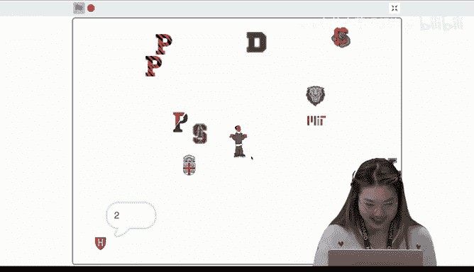

So close， keep going， keep going。🎼我们。🎼就我。Good。Congratulations。All right， this is CS50。

 cake is now served。