# 哈佛大学《计算机科学导论｜CS50 introduction to computer science 2025 Fall》 - P2：CS50 Fall 2025 - Lecture 1 - C .cut.zh_en - GPT中英字幕课程资源 - BV1S8sFzFEt7

Alright， this is C S 50。 and this is week1。 our second week together。

 And you'll recall that last week， week 0， we focused on scratch ultimately。

 this graphical programming language by which you can drag and drop puzzle pieces that interlock together。

 only if it makes logical sense to do so。 And many of you had actually probably played with that in like middle school or even prior at some point。

 But for our purposes， the goals of scratch。 We to give us sort of a mental model for some fundamental constructs that we're gonna see again and again。

 today and C in a few weeks in Python and even thereafter。

 And those include things like functions and return variables and arguments and variables and loops and conditionals and more。

 And so even if today feels like a bit of a fire hose， such as that pictured here。

 App that a lot of today's ideas are exactly the same as last week's ideas。

 It's just that the syntax is going change。 It's gonna look a little different。

 It's gonna look a little scarier。 It's gonna be harder to sort of memorize except with practice will come that muscle memory。

 But the ideas ultimately are gonna be the same。 And indeed， this is。😊，If unfamiliar。

 MIT down the road has a tradition of hacks whereby students once a year do something fairly crazy。

 And at this point， they happen to connect an actual working drinking fountain to an actual fire hydrant and the sign there very pixel it it says getting an education from MIT is like trying to drink from a fire hose。

 And that's indeed how computer science， how programming how C50 will sometimes feel but realize that what's going be ultimately most important is not where you feel you are day after day。

 but where three months from now you feel that you are relative to last week alone so-called week0。

 So let's look back at what week 0 looked like it looked a little something like this。

 the simpleplst of programs via which we get that cat to say hello world today that same code is going start to look a little like this。

 which was a glimpse we gave you last week， but this time of deliberately color coded it to try to send the message that were in scratch。

 we had this yellowish puzzle piece that sort of kicked things off that didn't really do anything itself。

 but it got the。😊，Pro started whereas the real work was done in purple here。

 Same is going to be true today。 whereby I'm going wave my hands for a little bit of time at this yellowish code on the screen。

 But what's really going to have the most effect is this same purple line here and the white text within and we'll break down what all of these lines mean over the next couple of weeks。

 but sometimes we'll wave our hand at details。 if we feel it's a little unnecessary at this point in the story。

 And in fact， let me get rid of the color coding for now。

 And we'll see that this is the kind of code in a language called C。

 We're going to start playing with and using today。 And for the next several weeks。 And indeed。

 it's representative of what we're going generally called source code。

 So source code is what programmer is write。 It's what you write。

 it's what you wrote albeit by drag and dropping puzzle pieces。 this week onward。

 you're going to start using your keyboard all the more。 And you're gonna to write source code。

 So this is code that we humans can understand with some training and with some practice。

 But of course， per last week， what language do computers ultimately understand。Only。

So binary zeros in ones。 And so you and I， yes， can write code starting today in a form that looks a little something like this。

 which admittedly might look a little arcane and cryptic。

 but it certainly better than a whole bunch of zeros in ones， but we're gonna write in source code。

 but the machines that we write code for ultimately only understand these here， zeros and ones。

 which may very well say hello world， but we're gonna call this moving forward machine code。

 So machine code is what the computers understand only the zeros in ones。

 source code is what you and I understand and actually write。

 So it stands to reason that we're gonna have to somehow translate one to the other from source code to machine code。

 And I alluded to this ever so briefly last week， but we're gonna use the same mental model whereby the source code we write might be the input of some problem。

 The output we want therefrom is going be the machine code So what we're gonna equip you with today inside of this proverbial black box is a special piece of software that take source code as input produces machine code as output and that type of。

Pro is called a compiler。 And there's bunches of difference of compilers in the world。

 We're gonna have you use one of the most popular ones。

 but it's simply a piece of software that someone else wrote that converts one language to another source code。

 for instance， in a language called C to machine code the zeros and ones that our Mac PCs phones and other devices actually understand。

 So where are we gonna do this。 And how are we gonna do this。 So I promise last week。

 that we'd introduce you to this year tool， which I use briefly at the very start of class to whip up that chatbot。

 we're gonna use it though not for Python this week， But indeed for a different language C。

 And indeed， this tool， visual studio code or Vs code for short is super popular in industry。

 This is what real programmer， so to speak using all of the time nowadays。

 there's absolutely alternatives。 If some of you have programmed before。

 you might have used or experience different tools。

 But this is very common tool that you'll see even after C 50。 And in fact。

 it's something that ultimately you can install for free on your own max and PC。

 So that by the end of the course， you're completely independent of C 50 and any C。related tools。

 But what we have done for the very start of the class is essentially provided you with a cloudbased version of this tool。

 So all you need is a web browser on any Mac or PC or the like so that everything's pre-installed for you preconfigured for you you don't have to deal with the stupid technical support headaches at the start of the term because it should just work。

 But by the end of the term。 once you're a little more comfortable with technology and with code in particular。

 you can absolutely offboard yourself from this tool， install it。

 download it on your own Mac and PC and have pretty much the exact same environment completely under your control。

 So starting today， you're gonna to see an interface that looks quite like this quite often。

 And we use this same interface last week ever so briefly moving forward。

 here's we're gonna write code at top right is where one or more code tabs are going to appear similar to any tabbed environment that you might use here。

 for instance， it's just a screenshot of the first file we'll create today called hello do C。

 The reason it's called hello do C is because it's in a language called C as we soon shall see No pun intended。

Meanwhile， the code here happens to be color coded。

 not quite in the same way as you saw before because I manually made it look more like scratch blocks。

 but among the features that VS code and other programming environments provide is something called syntax highlighting whereby you don't worry about or even think about these colors but as you write out code in a recognized language tools like VS code will just color code different parts of your code for you just to make different features jump out and we'll see what those features are over the course of today but you'll also spend a good amount of time as I briefly did last week down here in the bottom right of your screen the so-called terminal window which is going to be where you run commands for compiling code and writing code and in fact as we'll see today。

 you're going to start using your mouse and clicking a little bit less you're going start using your keyboard and typing a bit more and ultimately even though if that first that might feel like a step backwards to sort of not use something that's so user friendly the reality is most every programmer tends to find themselves ultimately much more productive。

 much more。😡，Powerful using the keyboard more often more quickly than say a traditional mouse or trackpad would allow。

 Meanwhile， we'll see some somewhat familiar features here at left。

 like this is where you'll see the files and folders that will create over time at far left here is going to be an activity bar。

 which is essentially a modern form of a menu via which you can open and close things and access other features for my purposes I'll generally hide this part here I'll generally hide this part here so that when we're together。

 we're focusing almost entirely on code and commands。

 But I'm just typing some quick keyboard shortcuts to simplify my own user interface in that way。

 So with all that said， just some terminology So this whole collective environment that I'm describing here is generally what's known as a graphical user interface。

 Y Walton interface for users that's graphical in nature with icons and buttons and the like shorthand notation for this is Gui G Ui for short。

 But within this graphical user interface as promised is going to be that terminal window bottom right where I promised we would be typing most of our commands。

 And just to give you a bit more jargon。Computing， that's generally known as a command line interface or CI for short。

 whereby you're typing commands into that interface instead and the world of computing software is essentially divided into Gos and Cs and sometimes a piece of software might have one of each as well。

 But without further ado， why don't we go ahead and focus entirely first on this here program。

 which I dare say is the simplest program， you can write in a language like C and see how we can actually compile and run it together。

 So I'm going to go over to VS code here， where I've hidden my file Exper with all the icons。

 and I've hidden my activity bar so that only do I have room for tabs of code and the command prompt at the bottom。

 I'm calling this a command prompt because it's at this dollar sign where I'm going to run some of my commands。

 and it's a dollar sign by convention， It has nothing to do with currency。

 It's just a computing convention。 Some systems will use a carrot symbol。

 some systems will use greater than symbol rather or something else。

 but it just means type your commands here。😊，The first such command I'm going type is this code hello do C with a single space in between。

 I've not used any spaces in the name of the file。 I've not capitalized any aspect of the file just because this is convention unlike your Mac or PC where you might be in the habit of naming files with spaces and capitalization generally。

 you'll make your life simpler by just using lowercase and no spaces at all。

 As soon as I hit enter what you'll see is that a brand new tab appears called hello dot C。

 where a cursor blinking on line1。 and this is essentially Vs code waiting for me now to type the first line of my code notice though that the command is complete there whereby I have another cursor here。

 which I if I click in the terminal window and give foreground to it。

 my cursor might blink there instead。 that just means I can type another command when I am ready。

 So let's go ahead and whip up this code and I've done this many times。

 so I can type it fairly quickly。 but in this tab， I'm gonna to do include standard I O do H。

 So to speak int main void then inside of so-called curly braces。Indenting therein by four spaces。

 I'm going to say print F， quote unquote hello comml world backslash and close quote semicolon andvoila。

 I've written my first program in C in a class like this no need to write down each and every line of code that I write。

 in fact， on the course's website will be copies of everything that we've done as well as excerpts there from in the courses notes。

 but you're welcome but not expected to follow along in real time with what I am typing here。😡。

So that's it。 Like I've written my very first program in C。

 If I had done this on an actual Mac or PC without a command line interface。

 I might have a new icon on my desktop， so to speak called hello。 and ideally。

 I could double click on that or tap on it and run the program。

 But because I'm in this specific programming environment that has a mix of a guI and a CI。

 I actually need to click down in my terminal window。 and I need to now compile this program first。

 because at this point in time， it exists only as source code。 So to do this。

 I'm going compile my code by very aptly saying make space hello。 and I'm pronouncing the space。

 but literally I hit the spacebar， make space hello as it sort of implies semantically will make a program called hello。

 notice I have not said hello dot C again， because the compiler let's call it make for now。

 even though that's a bit of a white lie is going to infer that if I want to make a program called hello。

 it's going automatically look for a file called hello dot C。 in this case。 So a bit of magic。 En。😊。

はい。And remarkably， anytime you don't see any output at a command like this。

 that's probably a good thing。 General speaking， when you see output when compiling your code。

 you have done something wrong or in this case， I might have done something wrong。

 but no output is good， because what I can now do。 And this is a bit cryptic。 I can run this program。

 not by double clicking or tapping anywhere。 But by doing dot slash hello with no spaces。

 And this is a bit weird。 But what the dot slash means。

 is that having just made a program called hello。 that program is gonna end up in my current folder。

 It's somewhere in the cloud。 Yes， more on that in a bit。

 But the program called hello is just somewhere in my current folder。

 when I say dot slash that's like saying go into the current folder and run the program therein called hello specifically。

 Now， as I often do， I'll cross my fingers， hope that I didn't mess this up in any way。

 And I should see in a second。Hello world indeed printed onto the screen。

 And so just to recap those then commands，1， I ran code hello dot C。

 which is a V S code specific thing。 code short for VS code just creates a new file called hello dot C。

 And then I my my way with my own keyboard。 make hello compiles that source code into machine code thereby creating a new file called hello。

 And to run that program hello， I type this strange command dot slash hello。 But this is a paradigm。

 no matter what you call your programs， we're gonna see again。 and again， and again。

 So even if you've not done something quite like this。 it will very quickly get familiar。😊。

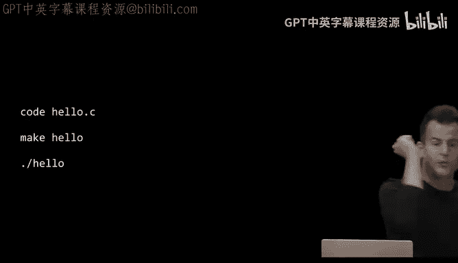

Yes， questions。When you say make hello， how does the computer here know what part of？我我。

Good question， when I say may hello， how does the computer know what part of the code is ascribed to this program。

 hello， it literally is going to take the entire content of hello。

c and turn them somehow into a program。😡，Does it have to be named Ho， no。

 I could have called it goodbye or more my first program do C anything at all so long as I change these words here accordingly has be from the same thing。

😡，Yes。Green galaxies。Exactly， if you change the name there。

 you need to change your commands accordingly。 Other questions on these here， steps。No， all right。

 So let's tease apart what it is we just did and like why this code works in the way that it does。

 Well， to recap in scratch， we had a program like this when the green flag was clicked。

 we wanted to say hello world onto the screen。 the code that corresponds to that is roughly here and indeed notice that the yellowish or oranges code lines up with the when green flag clicked the purple code here lines up with the same block and the white code inside of here。

 roughly corresponds to what was in the white oval that we kept using again and again last week。

 So let's do more of a one to one correspondence and these slides are deliberately designed to give you again。

 that sort of mental model of taking same ideas from last week and just changing the syntax this week onward。

 So when we have a function like this thing here and recall that a function is just an action or verb。

 it sort of accomplishes a small piece of work in code in C specifically， you're gonna type。

 of course， not a purple puzzle piece， but you're gonna say the word print more technically print F where the F will soon see means format the printed output because this is more powerful than just printing。

Some raw text alone， Then you can have parentheses open and close left and right and notice that it's no accident that MIT chose an oval for their input to functions。

 because it roughly looks like the start of a parenthesis and parenthesis on left and right。

 Meanwhile， what goes inside of the parentheses in the corresponding C code Well at the end of the day。

 minimally hello comma world because that's literally what we want to print to the screen。 But in C。

 unlike in scratch， there's a bit of overhead， a bit of additional syntax that you just got to deal with to make clear to the computer。

 what you want to print in particular， you're going to have to surround everything you want to print with double quotes to make clear that hello is not some special function or variable or something else it's hello world is the English phrase that you want to print So double here。

 double quote there means here's the beginning and the end of what I want to print。

 you're also curiously going to put a backlash n in most cases at the end of the word or words you want to print。

Take that away in a moment and see what it does。 And then lastly， and perhaps most annoyingly。

 in programming circles， you have to finish your thought with the semicolon， much like in English。

 you would finish most sentences with a period instead。

 And the the thing about programming is with C in particular。

 if you mess up almost any of these details I just rattled off something's going to go wrong。

 And so you're in good company。 the very first program you try to write or try to compile odds are it might not work correctly because you'll develop over time。

 the muscle memory for spotting all of these seemingly minor and actually minor details。

 but that do matter to the computer。Alright， so if you're familiar， of course。

 with the notation in like mathematics， a functions like a function in code。

 there's really the same idea as a function in math， whereby the function F takes some input。

 for instance， X and generally produces some output。 So if you're coming more from that background。

 realize that what we're really doing here is roughly the same。 But in code。

 recall that we can have different types of output。

 So if this is our grand mental model and say we've got a function as inside of this black box that takes arguments that is to say as its inputs。

 it can sometimes have side effects and recall that side effects are often visual things that happen as a result。

 they just play on the screen， maybe it comes out of the speaker。

 it's sort thing generally ephemeral that just happens。

 but it's not necessarily useful in the same way as another type of function that we'll return to in just a bit。

 But last week recall that we got the cat with a speech bubble to manifest on the screen and say hello world in that speech bubble。

 when the input with hello world and the corresponding function was instead say。

 So let's see if we can't now tease apart。😊，What the code we wrote is actually doing for us bit by bit。

 so let me go back to VS code here and let me propose to break this in a little way。

 let me delete the backslash end， if only because at first glance who knows or cares what that's doing。

 let's just get rid of it if we don't understand it。

 I could now go back down to my terminal window and I could do dot slash hello enter again。

 but there's seemingly no change。😡，Which is good， doesn't seem like I broke it。

 but I've kind of misled you here why。😡，Why did nothing seem to change？😡，I didn't recompile it。

 so recall that the compiler converts source code to machine code。

 but I already did that a couple of minutes ago。 If I've changed the source code。

 it stands to reason that I need to recompile the code to actually see the effects of that。

 So let me do that again。 make hello enter Nothing seems to have gone wrong。

 but let me now do dot slash hello enter and it's subtle now and in fact。

 let me go ahead and zoom in， it's really just an aesthetic bug insofar is functionally the program is still technically printing hello world but what's seemingly wrong。

 or put another way what did the backslash and apparently do。😡，Yeah。

 so it's somehow giving me a new line。 And that's essentially what the backslash end denotes is giving me a new line there。

 And why was I doing that， Well really just for the aesthetics。

 Like if this dollar sign represents my prompt where I type commands if anything。

 it just looks kind of stupid that I finished a program over here。

 and then the prompt is on the same line。 It just looks wrong。

 even though you could sort of argue that was my intent， even though in this case it wasn't。

 So what would the alternative be。 Well， what you're seeing here is what's actually generally known as an escape sequence。

 which are sort of special sequences of symbols like backslash and n in this case that do a little something unusual。

 And here's just a non-exhausive list of some you'll encounter in the real world and including in C 50 backlash n moves you to a new line。

 Backlash Rs is so calledled carriage return。 if you've ever seen or used an old school typewriter。

 this refers to the process of bringing the typing head back to the left end。

 So it sort of moves the cursor horizontally as opposed to vertically。

 this one's interesting backlash double。Quote。Why does there exist this pattern。

Backslash double quote， yeah。Just stretch。Exactly， so recall that phrase we tried to print out like hello comma world。

 If for some reason， you don't want to say hello world。

 but you wanted to say some like sort of snarkly like hello world or something like that。 Well。

 you can't put a quote a quote a quote a quote and expect the computer to know which quote corresponds to what it's just arguably ambiguous。

 So if inside of double quotes。 you actually want to print actual double quotes。

 This is a escape sequence that tells the computer。

 This is not some delineating where my thought begins and ends。

 This is literally a double quote and we'll see other situations in which a single quote or apostrophe is the same。

 We'll see crazy situations in which you want to print a backslash。

 but backslash already has some special meaning。 So there's solutions to all of these problems。

 but let's not get too far into the weeds here。 But let me go back to the code and propose what the alternative otherwise might have been。

 if I didn't know about backslash end。 my instinct to move the cursor to the next line might have been literally to just like hit enter or do。

Something like this， like move the double quote， move the parenthesis。

 move the semicolon onto the next line。 But this should start to rub you the wrong way。 And indeed。

 this violates a principle of most programming languages。

 and that most programming languages are linebased。

 You sort start and finish your thought ideally on the same line。

 And this runs a foul of that and two even if you're seeing code for the first time assume that this just looks stupid as well to sort of move part of your thought to the next line。

 it just looks a little sloppy and it is So see and many other languages， Python among them。

 solve this by giving you the so-called escape sequences。 So if you want a new line there。

 you do backlash and and you will get your new line there Now that's a bit of an overstatement what I said that sometimes lines of code will be so long that they do rap onto multiple lines。

 but generally that's a convention that we're going to try to avoid。

 All right what else could go wrong。 Well， let's do this。

 Let me go ahead and clear my terminal window， which I can do by hitting control L or it can literally type clear and。

frequentlyently do this just to keep the screen clear， even though it has no functional impact。

 It's just an aesthetic。 Let me do something else accidentally。 Supp I forgot to finish my thought。

 And I omitted the semicolon。 But otherwise the code is perfect。

 Let me do make hello now enter Now we're gonna see some output that's a little more arcane。

 Let me go ahead and scroll back up here to make clear， that what just happened is I ran make helllo。

 but I didn't get back to another prompt。 I don't see immediately a dollar sign because there's an error message here。

 that is almost as long as the code I tried to write。 not to worry。

 Let's see here is the name of the file in which the problem exists stands to reason that it's in hello dot C。

 here is the line number in which the problem seems to exist。 Line 5。

 and that's helpful because it lines up with this And then if you're cared account。

 this is the 29th character。 So if I count from left to right around character 29。

 something is wrong。 something is missing。 So it's a pretty decent error message。 In fact。

 it even says expected semicolon。After expression， there's a little green carrot symbol pointing me at the mistake。

 So this is again， this is another value of the compiler。

 Not only will does it know how to convert source code to machine code。

 it's also pretty good at finding mistakes in your code and trying to draw your attention to them。

 So how do I fix this。 Well， assuming you've understood the error message at this point。 Well。

 you just go back in， add the semicolon， let me go back down to my terminal window。

 I'm going clear it just to clean up the mess， let me rerun make helllo。

 and now we are back in business。 And indeed， if I do dot slash hello。

 I've got hello world back on the screen。Well， let's make one other mistake。 Suppose that I forgot。

 as you sometimes will， to include this line at the top， which will make more sense next week。

 But for now， let's just omit it and dive right into the code。 You would think this is enough。

 just printing out hello world。 Well， here， let me go back down to my terminal window。

 Let me do make hello again now， and I'm gonna get a whole different error message instead。

 So now problem is still with hello do C that makes sense line3， Okay。

 so somewhere in there printf is suddenly the problem。

 even though the semicol in his back and the backslash and is back。

 So let's keep reading error call to undeclared library function， printf with type int。

 and then this is a whole mouthful。 So here's an example of an error message that unless you're sort of condition to know what this means and you've seen it before。

 It's quite more cryptic and unclear like what the solution to the problem is。

 especially when the rest of your code is truly correct。 I've just forgotten something stupid。

 But how can I sort of think about this problem。 Well， it turns。

That another feature of C is that it comes with a bunch of header files。

 a bunch of files whose names don't end in dot C， but end in dot H and these so-called header files which end in dot H are contain code that other people wrote that you can use in your own programs So for instance。

 in this particular case， a header file is giving us access to what's more generally in computing called a library a library is code someone else wrote that you can use and I actually use a library last week when I did that import line and mentioned openaiI the company I was actually using a library from that company that I automatically downloaded and installed into my programming environment in advance of class because I don't know how to implement a chatbot without standing on their shoulders and using a lot of the code they themselves wrote same idea here。

 even though printf is a feature of C if you want to use it you have to include that library by telling。

😡，Your program to include the header file that defines that function。

 And you only know this by being taught it or looking it up in a book or a reference。

 But in this case， I wanted to use a header file called standard Io do H STD I O do H。

 It is not studio do H。 This is a very common bug online。

 if you find yourself typing studio dot H typo， it's standard Io dot H。

 And in that file then is define the printta function。 So if I go back to my code here。

 the solution to this problem truly is to just undo the deletion I made a moment ago。

 because what line1 is now doing for me is it's telling the compiler。 Oh， by the way。

 I didn't write all of the code that I'm about to use。

 please include the definition of printf from this other file called standard I O do H。 And again。

 you'd only know this by looking it up in a reference At a lecture or something like that。

 It's not obvious otherwise。 But these are the kinds of things you very quickly look up。

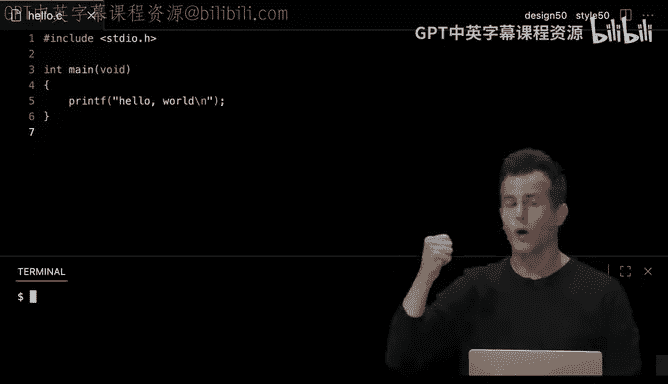

So where do you look them up？ Well， it turns out the ecosystem of C has hundreds of books you can buy or download many。

 many， many websites among them is one of CSs50's own。 And in fact。

 the conventional way to look stuff up for the programming language called C is to look at the official manual pages or man pages for short。

 for the C language。 Unfortunately， many of them were written decades ago。

 when they were certainly written by fairly advanced programmers and not for a broad audience。

 And so what we have done is imported all of that freely available documentation hosted it at our own URL here。

 manual cs50， and we've essentially simplified it for those less comfortable。

 Those of you who might be less familiar with， less comfortable with technology And really for most people who aren't used to reading manual pages is just useful to have in teaching assistant like language instead。

 So， for instance， if you go to a URL like this， you'll see C 50s documentation for this official library standard I O H that comes with C itself。

 if you go to URL。You can look up the documentation for printf itself specifically。 So for instance。

 let me go ahead and just give you a teaser for this。 If I were to do the same on my own computer。

 I might see the C 50 manual pages here and you'll see header file by header file a bunch of frequently used functions in C 50。

 We've also filtered the list down from a massive list to much shorter list so that you can sort of see what's most likely useful to you。

 if you go to a specific page like standard I O do H， you'll see， for instance。

 here just over a half dozen functions that we won't touch on today beyond printf。

 but that we'll see in the class over time that does useful stuff。 For instance。

 printf prints to the screen and we'll see other functions for opening files。

 closing files and the like because all of that's related to standard I O input and output。

 if I go to a specific man page for this header file。

 you'll see the standard formatting for these pages。

 So here's the name of the function printf and it prints to the screen。 You'll see a synopsis。

 and this indeed indicates we're in less comfortable mode if you。😊。

SeeThe original more arcane documentation。 Just uncheck that。

 and you'll see the original official documentation。

 but you'll see a mention of what header file this function is defined in so that you know what file to use in your own code。

 you'll see a socalled prototype， which is just the first line of code from that function more on that in just a little bit。

 you'll see an English description， you'll see example code long story short。

 this is theitative answer。 And even though you have access in this class So the virtual rubber duck It C50 AI and other forms of it that you'll soon see you should also have the tendency and instinct moving forward to check the official documentation And all of today's AIs are trained on things like the official documentation。

 So that's the source material that any of these AI the duck among them are actually relying on。

 But what we're also going to see is that besides these official functions。

 There's some that C50 itself has invented。 We use these really is training wheels for just the first few weeks of the course。

 And then we take these training wheels off。 but。

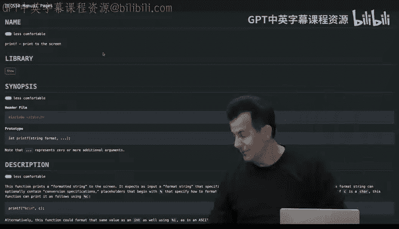

is in a language like C。Certain stuff is just really hard or annoying to do。 Certainly。

 if you're learning how to program for the very first time， or at least you are new to see。

 We'll eventually show you how to do it that way。 But even if you just want to get input from the user like a string of text or a number of some sort it's generally not that easy to do in see at least in these early days。

 So， for instance， that this URL here， you can see documentation for Cs50's own library and C50's own header file。

 C50 do H， and you'll see such functions in the documentation as these get string， get int。

 get char and a bunch of others as well， and we'll touch on those this week。

 But it will ultimately be a way of just getting useful work done quickly by standing on our shoulders and actually using functions we wrote to then solve problems of interest to you So let's focus。

 for instance， on one of these first， get string a string in programming speak means text。

0 or more characters of text like H。😊，comma space W O RLD。

 that is a string of text and computer speak。 and it's obviously not a number like 50。

 It's actual text that you would type on the keyboard。

 We'll see then what other things we want to get， but with this this function。

 we can start to replicate another program that we implemented pretty quickly last week in scratch。

 So recall that in scratch， this one was a little more interactive。

 I used another blue puzzle piece ask to actually get input from the user and recall that unlike the printf function today and the say block last week this time we still have the same input output model。

 but if we pass an arguments to a function that we're about to see you can get back not just a side effect sometimes but a return value。

 like a useful reusable value like the person's name as we'll soon see。

 All right so let's actually do this。 if in scratch。

 the equivalent was asking the user what's your name asking them that and then waiting for an answer that we can store in a variable。

 let me propose that in。😊。

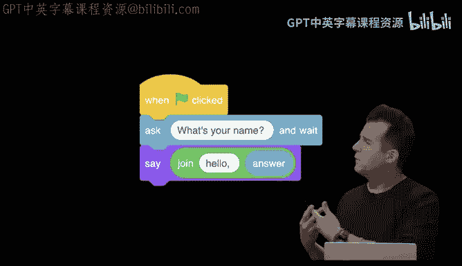

C side by side， it's gonna look a little something like this。 Instead at left。

 we have the scratch block。 The ask function Here is the argument there， too。

 and then and wait just means it's gonna wait till the user finishes typing。

 If I want to translate this to see now today moving forward Well。

 it looks a little something like this。 the closest analog in C thanks to Cs50s library is gonna be a function called get string。

 So there's no C function called ask and we deliberately name this function。

 get string just to make super clear what it is you are getting a string of text in this case。

 and we've got the parentheses ready to go indicative of this white oval for user input。

 If I want to prompt the user with that same phrase， what's your name。

 Well I can just put it inside of those parentheses。

 But what next do I need to add around my user input。😊，Yeah。

 I need the quotation marks just to make clear that these aren't special individual words。

 This is a whole phrase that I want to be displayed to the user。

 So I'm going to indeed put double quotes around everything。 And this is just an aesthetic。

 I don't in this case， want to bother moving the cursor to the next line。

 Like I want the user to see the question and I want the cursor to just stay there blinking。

 waiting for their prompt， but I don't want the cursor to be right next to the question mark。

 So I'm deliberately just leaving a single white space there just to kind scooch it over a bit So it looks a little prettier at least to my eye Now we're not done yet。

 because we need to do something with this value。 The get string function as we'll soon see is gonna prompt the user for me to type something in like my name。

 but where do I want to put that。 Well， MiT has the answer put in a variable called answer。

 and you can't rename that in scratch is just defined as answer。 But in C。

 what I'm gonna need to do is something like this。 If you want to keep return values around from a function。

 You。use an equal sign。And then to the left of it， you put the name of the variable into which you want to put that return value。

 So in mathematics， we would use X， Y and Z is our variables， again， in code， as in scratch。

 you can name your variables anything you want by convention， they should usually be lowercase。

 They should not have spaces there in similar to file names。

 But this is a pretty good analog now of what's going on collectively here。

 But C is a little more precise。 you can't just give the variable a name。

 you need to tell C or really the compiler what type of value you want to put in this variable。

 So if it's a string of text， you put string。 if it's a number， you're gonna put something else。

 But for now， it's a string per the functions name iss gonna give me a string。

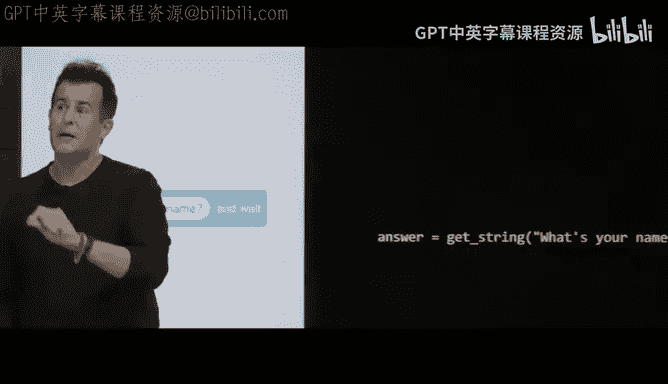

Now we're so close to finishing this comparison， there's one detail missing。😡。

What's still missing from the code here。啊不呀。Yeah， so we have to finish the thought lastly with a semicolon。

 So if you're getting sort of the point already like this is one of the reasons why we start with scratch。

 sort you get the intuition pretty quickly。 and even though nothing on the right hand side is particularly hard。

 there's just all these stupid little details that you have to ingrain in yourself over time in this case for C。

 but for many programming languages we're gonna see the similar paradigm But among the goals of the course too or to show you how ultimately languages have been evolving。

 And so one of the things we'll see in Python in a few weeks time that some of this syntax actually goes away because over time。

 humans have gotten annoyed at older languages like this。

 why the heck do I have to keep putting a semicolon when it's clear that I'm at the end of the line。

 So we'll see among languages like Python we can get rid of some of these same features But for now it's just a matter of remembering what goes where。

 All so let's go ahead now and take that same idea of converting scratch to see and actually do something with this code。

 let me go back to VS code here， I'm going keep my file name the same。

 But what you'll see on CS5's website is that we'll add version numbers to each of。

amples that I'm typing out so you can actually see the progression of these programs。

 even though we're not changing the name。 and what I'm going to go ahead and do here， for instance。

 in hello dot C this time。Is the following。 I'm going to go ahead and first get rid of the single hello world。

 I'm going to go up here and include this time Cs 50 dot H。 So not one， but two header files。

 And then inside of my curly braces inside the socalled main function。 as we'll soon call it。

 I'm going to go ahead and do this。 exactly the same line of code as on the screen before。

 I'm going get a string。Prompting the user for what's your name， question mark space。

 close quote semicolon。 And as an aside， this will will soon see print on the screen。

 What's your name So that implies that the get string function is actually using printf itself to print out that message。

 I do not need to use printf to display that message on the screen。

 because I read the documentation for C 50's get string function。

 And I just know that it is using printf for me to achieve that particular goal。 Now。

 let me do something intuitive but not quite correct。

 If I want to print out that answer so that the expression is gonna be not hello world， but hello。

 David or hello Kelly， let me go ahead and say hello comma answer。

 backslash end to move the cursor down as before semicolon。 So this is not quite right。

 even if you've never program before。 you can perhaps see where this is erroneously going。

 Let me remake the program because I've changed the source code and I nude machine code。

 Nothing seems to be wrong aesthetic logic。Rather syntactically。

 But if I do now dot slash hello and hit enter， you'll see I'm being prompt。 What's your name。

 So I'm going to go ahead and type in David and then hit enter。 But when I do。

If you know where this is going， what am I going to see instead？Hello， answer。

 And the computers just doing literally what I told it to do。 I said， quote unquote。

 print out hello answer， but obviously that's not the goal that I have in mind。

 So how do I actually work around that。 what I really need to do is achieve the equivalent of this thing here。

 which we did by stacking blocks in scratch or nesting them， if you will， one inside of the other。

 So I want to join the expression。 Ho comma space and that answer。

 and it turns out and see you can't do it quite like this。

 Like there isn't an analog of the join function， at least that we'll see today。

 So we have to do this a little bit differently。 We can do it though。 by maybe telling the computer。

 Well， go ahead and print out hello comma space。 and then maybe we can give it like a placeholder to plug in the name once we know the name。

 because when I'm writing my code， I have no idea who's gonna play this game。

 me or Kelly or someone else。 So what if we use special syntax to indicate where I want the person's name actually to go。

 Well， let me go back to VS code and propose that to do so。

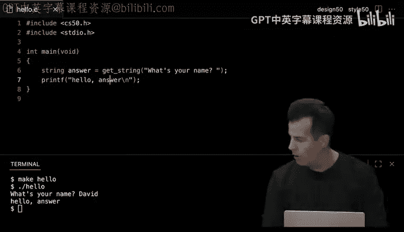

What I can do now instead is。This rather， let me before we go to V S code。

 let me propose that we now do this。 instead of printing out hello quote hello comma answer， unquote。

 let's go ahead and start printing out something。 And I got my parentheses ready to go。

 And I did my semicolon in advance this time。 I want to somehow now say hello comma placeholder。

 And you would only know this by someone having told you or reference online。

 S is the placeholder for a string that you don't know when you're writing the code。

 but when someone else is running the code， it will be filled in and substituted for their input。

 So hello comma S is the closest we can get to this。 I still need some other syntax。

 I still do need those quotes on the left and the right。 just to be aesthetically pleasing。

 I'm gonna put a backslash end there at the end to move the cursor。

 But now I've left room in my parentheses for one more thing。

 And you could perhaps guess where I'm going with this。 again。

 even if you've never programmed before， this is telling printf， print out H E。😊。

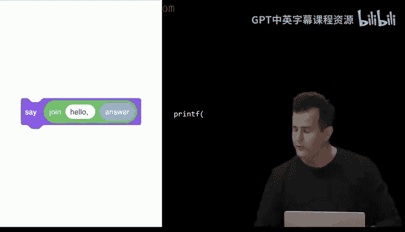

O comma space， something。😡，What should I probably pass in to these parentheses as a second input so that printe knows what that something is？

😡，Yeah。The variable name。 So the variable in which I have the user's name。 and indeed。

 the convention is to put a comma after the quotes and then the name of the variable that has the value you want to be substituted for that placeholder。

 Now， notice there's a collision of syntax and grammar here。

 The comma inside of the quotes is just an English thing。 Hello， comma so and so。

 The comma outside of the quotes is meaningful to C。

 because it delineates which is the first input or argument to left。 and which now is the second。

 And we haven't seen this before and C up until now we've only been passing one input。

 but you can pass in two or three or4 completely depends on what the function is designed to expect。

 So let me put this all together now， let me go back to V S code。 previously。

 we were literally printing out answer， but I can change answer to percent S。

 I can move my cursor outside of those quotes。 comma answer。

 because that's the name I gave to that variable。 I can go back down to my terminal window and clear it。

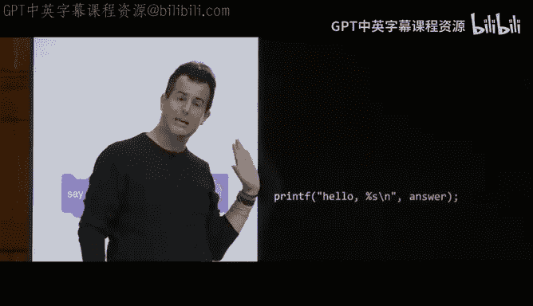

Just to reduce clutter， let me do make hello one more time， seems to work。 dot s hello， enter。😡。

DAVID and now。Hello， comma， David is printed。Okay， questions on any and all of that。😡。

I was wonderinging。嗯哼。😊，Good question。 Where is it pulling these header files from。

 So what you are seeing here is a graphical user interface that's somewhere hosted in the cloud at CS 50 do dev。

 the URL I mentioned last week。 and we're going to tease this apart in just a moment。

 That software is running on a computer。 and that computer's got a hard drive or solid state drive like folders of storage。

 Those files， C50 dot H and standard I O dot H and many more are pre-installed on the server to which I have connected and they're stored in a standard place so that the compiler in particular knows where to look for them。

 And those are all things we did in advance for you。 Yeah。😊，I'm not。

Why does the backslash N not create a new line。 So it is Backslash N is essentially being printed here。

 which has the effect of pushing the dollar sign to the next line。 Otherwise。

 the dollar sign would stay on that second to last line。 Other questions。I still no black smash。Good。

 why is there no backslash n over here？😡，Good question。 My choice as the programmer。

 I just wanted to see the sentence， what's your name question mark， and I wanted the user， me。

 to type my name immediately after it like this。😡，But I didn't have to do it that way。

 I just wanted to show you the difference。And I like just generated what we like do。

Always right for like first floor。Should you always write the first four， Oh， these， Yes， for today。

 trust me， do this， do this， do this， do this。 And next week we'll understand even more what those lines do。

 However， slight caveat only use CS 50 dot H if you're using one of our functions，  clearly。

 you don't need C 50 dot H if you're just printing something out as in the first example。

 Other questions。😡，P and the second。I understand that the set。Is what I type。

just really feels like input for me because that's the question that you ask。Can you like。Correct。

 so to to summarize the question on the right here， this input is effectively provided by the user。

 This first input， though， is provided by me。 That's the way it is。

 So these are both inputs because they're being provided as inputs to the function。

 The origins of those inputs， though are entirely up to what I'm trying to achieve。

 The first 1 I know in advance。 like I'm the programmer， I know I wanted to say， hello。

 comma someone。 The second input。 I don't know in advance。

 So I'm using a place I'm using a variable to store the value that I'm gonna get when the get string function is used later on。

 But they're both inputs， even though they're used in different ways。 Good question。 Any others。

 so if we now have that done， well let's just take a step back into the first question that was just asked about where are these files。

 let's take a look back at actually what it is we're actually using here。

 So it turns out even though most of you are using Mac O or Windows there's other operating systems out there in the world phones have i iPads have iPad Android devices have Android。

 which is its own operating system， the operating systems in the world are the pieces of software that really just do the most fundamental operations on a device like booting it up。

 shutting it down， sending something to a printer， displaying something on the screen。

 managing windows and icons and all of that sort of commodity stuff that is used by other people's software as well a very popular operating system in the programming world and in the world of servers in the cloud and on the internet at large is called Linux and it's a descendant of something called Uni which has been around for quite some time and it's what many programmers。

 most programmers use depending on their。Environments insofar as Linux is very highly performant。

 like you can support thousands of millions of users on servers running an operating system like this。

 It tends not to， but it can have a graphical user interface。

 which just means it can operate more quickly because it doesn't need all of these graphics that are really just for humans benefits。

 not necessarily for web browsers and other devices and Linux insofar as it's usually used or often used as a command line interface。

 comes with a whole bunch of commands that you'll start to use and see over time。

 Now I've used a bunch of commands already。 I've used code， which is a vS code thing。

 I have used make， which is for today's purposes， our compiler。

 but that's a little white lie that will distill next week。 and then I've used dotlash hello。

 which is a command。 I essentially invented as soon as I created a program called hello。

 but there's a bunch of other ones as well。 for instance。

 if I want to list the files in my current folder， I can type Ls and hit enter for short。

 If I want to create a new folder， otherwise known as a directory。

Can use M KD IR to make a directory。 If I want to remove a directory。 I can use R directory。

 If I want to remove a file。 I can use RM。 if I want to rename a file。

 I can use MV for move if I want to copy a file Cp。

 if I want to change directories change into a folder。 I can use C。 Now。

 these two just take a little bit of time in practice to memorize them。

 And they're all very terse in so far as the whole point of a command line interfaces to let people navigate things quickly。

 So for instance， even though this will be a bit of a whirlwind， let me go back into V S code。

 and let me propose that we play around with just a few of these commands so that you've seen me doing it。

 But generally speaking in C50's problem sets， we will tell you step by step what commands to type so that you can achieve the same results。

 and then later in the term we'll stop bothering reminding you pedantically how to do this and that because it should come more naturally eventually。

 But for instance， let me go ahead and do this。 Let me go ahead and reopen my file Exp at left。

 Yours will look a little different。 You'll have a different number as your。

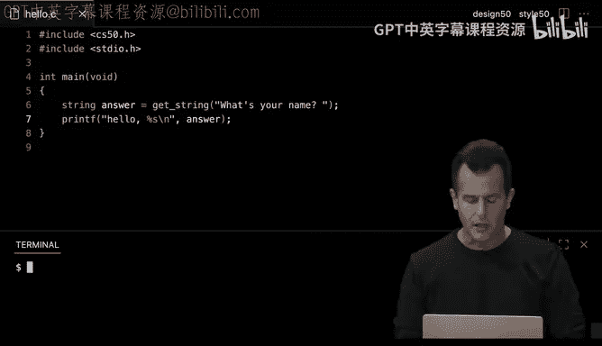

I but generally you'll see whatever files and or folders you've created already。

 The first thing I created today was called hellello dot C。 And then by using make。

 I created a second file I claimed called hello。 So the reason dot hello works is because there is。

 in fact a program called hello in my current folder Er go the dot that was created when I compiled my source code into machine code。

 Now suppose for the sake of discussion that this is gonna to get messy quickly because the more programs we create in class and for problem sets you're just gonna have a hot mess of files inside of this one main folder。

 well， let's create subfolds like you might be inclined to do on your Mac or PC or Google Drive or whatnot。

 Well we can do this in a bunch of ways I could right click or control click on my file Expr and I'll see a somewhat familiar contextual menu and I can literally choose new folder or I can rename things or I can move things around by dragging and dropping them。

 But for today， let's focus more on the Ci the command line interface and again commands。😊。

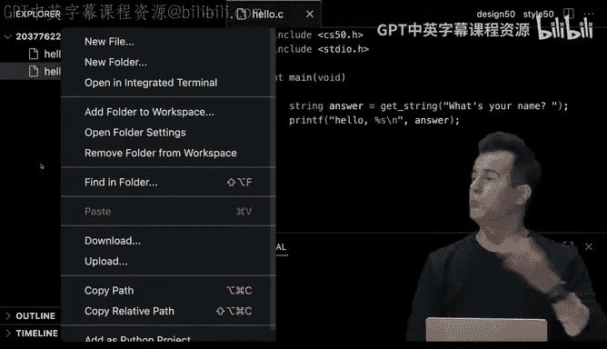

Like this。 So let me go back into VS code。 And let me propose that we do a few things just because as a tour。

 first， let me delete the machine code。 I'm done with this example。

 I don't really want to keep these bits around unnecessarily， I'm gonna to delete hello。

 not hello do C。 but hello， the compiled program。 When I di that。

 I'll be cautioned remove the regular file， whatever that means called hello here I'm being prompted for a yes。

 no response。 Why suffices so I'm gonna hit why enter and watch what happens at top left。

 as soon as I use my terminal window and this command to remove that file。 It disappears。

 I could right clicked on it or control， clicked on it。

 but this command line interface achieves the same thing。 Now。

 suppose that for problem set one in future problem sets。

 I want to keep like every program I write in its own folder just to keep myself organized。

 especially as the term progresses。 Well， let me create a new folder called hello itself。

 So I don't want to create a program called hello。 I want to create a folder called hello。 Well。

 one way I can do this per this here。 Cheee。😊，Is to make a directory， which just means folder。

 So M K D IR hello， enter。 and you'll see a top left。 Now I indeed have a folder。

 and it even has an obvious folder icon next to it。 Now I could cut some corners。

 I could click and drag on hello dot C and just drop it into hello。 But again。

 let's stick with the command line interface。 Let me go ahead now and move M V for short。

 hello dot C into hello。 So this is the first command where I'm passing in not one word after the command like hello dot C or make hello。

 Now I'm typing two words after the command。 because the way the move command is designed is to expect the origin as the first word and the destination as the second。

 so to speak。 whereby if I want to rename hello dot C。 Sorry。

 if I want to move hello dot C into the hello folder， I should type like this。

 Now you can just so you know。😊，Include a trailing slash。

 a forward slash at the end of the destination just to make clear that you want to put this into a folder and not just rename hello dot C to hello。

 But because the hello folder already exists。 Linux knows what it's doing。

 And it's just gonna to assume that when you do that watch what happens at top left。

 hello dot C seems to have disappeared。 But if I click this little triangle there it is it's now inside of that folder。

 But now I've created kind of a predict for myself。 let me clear my terminal window。

 And now let me type Ls。 And when I type Ls for list， you'll see only a folder called hello。

 and it's color coded just to call it out to your eyes。

 and there's a trailing slash just to make obvious that it's a folder that's all done automatically for you by Linux。

 the operating system。 But wait a minute， where did my hello program go。 like where is hello do C。

 Well it's in that folder。 So I need to change into that folder or directory。

 And here per the cheat sheet， we have Cd for change directory。

 So I can do Cd space hello with or without the。And hit enter。 and now you'll see this。

 And it's admittedly a little cryptic， but my prompt has now changed to still be a dollar sign。

 but before it is just a constant reminder of what folder I am in。 We adopted this as a convention。

 many systems do the same thing， though the formatting might be a little different。

 this is just to help you remember where the heck you are without having to type some other command to ask the operating system。

 what folder you are in。 So now that I'm here， if I type LS and hit enter， what should I see。😡。

Just hello dot C， because that's the only thing in that their folder。

 So now let's do maybe one other thing。 Let's do make hello inside of this folder。That is okay。

 And notice at top left what just happened。 Now， I've got both files back。 All right。

 suppose I want to get rid of one。 Well， I can do R M hello again。

 I can type y for yes to confirm the deletion。 And now I'm back to where I just was。 Now。

 suppose I want to do get other things。 that I'm not really proud of this version of hello do。

 Let me keep it， but rename it。 Well， I can say how about M hello dot C to old dot C。

 I just want to rename the file。 So M can be used not only to physically move a file from one place to another。

 if you use it on file names， it will just rename the file for you。

 So there's no rename command that you need use instead。 But you know what。

 I regret that this program was fine， let'sname it back。

 So let's move old dot C back to hello dot C and watch it top left。 It just rename the file again。

 Let me go ahead and make a back。 So let me copy with Cp hello do C into a file called like back dot C just in case I screw this up。

 I want to have a spare around。 Now you see a top left。 I've got both files。 If I now type out less。

😊，You'll see both files。 So what's happening in the GuI is the exact same thing is happening in the Ci。

 but you know what this was just for demonstration's sake。

 I don't need any of this so let me remove the backup。

 say yes for why let me go ahead and move hello dot C out of this folder which I could just kind drag and drop it but how do I move hello do C to the parent folder so to speak I want to move it out of this folder well you would only know this by having been told dot is special notation that means the so-called parent folder so go back up in the hierarchy and now if it's not obvious a single dot which we have seen before means this folder two dots means one step up there's no triple dots or quadruple dots you have to use different syntax but more on that another time So watch what happens when I do move hello dot C up into the parent directory notice at top left that the indentation changed because it's no longer inside of that same folder and heck now I'm gonna go ahead and do this I could go back to my main folder by doing C do。

To back out of this folder。 But when in doubt， or if you ever get yourself into a confusing mess。

 just type Cd enter alone and you'll be magically whisked away to your default folder。

 a home directory。 so to speak， even though that too is a bit of a white lie。

 So that will lead you always where you're starting when logging in to Cs 50 dev Aka AVS code and now I can see the folder。

 which happens to be empty and the file。 So let me go and do one last command or M hello to really undo all of the work such that we're now back to where the story began。

 But the point here is just to demonstrate with that with these basic fundamental commands。

 you can do everything that you've taken for granted on Max and PCs for years with a mouse instead。

Questions on any of these here， Linux commands， yeah。すごい。8要。Really good question。

 If you have five different files in a folder， how can you choose which one to open。

 Well you can certainly do code， space and the name of the file you want to open。

 or we're gonna see other tricks like you can use an asterisk or a star for a socalled wild card and say open everything in this folder and you can even use more precise patterns than that。

 So over time， once we have more files at my disposal' be able to do tricks like that as well， too。

 yeah。啊系系。The么。Sure， so one of the things I did in my VS code a moment ago was once I was inside of the hello folder into which I had put hello do C just for the sake of discussion。

 I then recompiled it by running make hello， and this example is a little confusing deliberately insofar as I've got a file called hello do C inside of a folder called hello。

 But because I compiled hello do C。 I then created a program called hello as well。

 But that program hello was inside of a folder called hello。

 which is only to say that you can totally do this。

 You can't have a file in a folder in the same place name the same thing because they would collide like you can't do that on a Mac or a PC as well。

 you have to have unique names， but you can certainly put something inside of another folder。

 without collision。 Good question。Allright， so let's introduce a few more building blocks and a few more things we can do。

 So besides these Linux commands， which we'll now start taking for granted。

 we have a bunch of other features of programming languages that we saw in scratch。

 let's now translate them to C So conditionals we sort of the proverbial fork in the road enabling you to do this or this or some other thing based on the answer to a question。

 a so-called Boolean expression here， for instance。

 in scratch is how we might express if a variable x is less than a variable y。

 we'll go ahead and say X is less than Y and out of context I didn't include it in the slide。

 presumably we've created x and y and somehow given them values， whatever they are。

 but this is just now the conditional part of the program in C。

 the way you would do the same thing is you would say if and then a space then parentheses。

 which have nothing to do with functions if is not a function。

 it is a feature of C that implements conditionals just like this orange block is a feature of scratch inside of the parentheses。

 you put your same Boolean expression， So here to out of context。If up here。

 I have defined variables X and y。 Well I can certainly use them in this conditional。

 and I can use this less than operator， just like in math class to ask this question。 And the answer。

 even though it's a less than sign， is indeed， if you think about it going to be true or false Yes or no。

 it's a boolean expression。 It either is less than or it is not。

 right inside of the curly braces which are necessary here。

 I'm just going literally put our old friend printf， and there's nothing interesting here。

 except the new phrase， X is less than y with the backlash and the semicolon and the parentheses。

 This though is deliberate just like in scratch， the say is sort of indented and sort of hugged by the if orange puzzle piece Similarlyly do these curly braces。

 are they meant to sort of imply the same It's sort of embracing these lines of code as an aside in C。

 they're not always necessary。 if you have a single line of code， you can technically omit them。

 However， what you'll see in C as well as in C5 in particular。

 we will generally preach a certain style like any company in the real world。

would do so that programmers who are collaborating on code all write code that looks the same so that it doesn't devolve into a mess because everyone has their own convention。

 So this is a convention to which you should indeed it here and then I've indented four spaces to make clear logically that this line of code only executes if the answer to this question is true or yes。

 Meanwhile， in scratch， if we had an if else condition。 So two way fork in the road。

 if x is less than y， say so L say x is not less than y， how can I do that and C。 Well。

 if X less than y， something elset， something else。

 And what are what goes in between those curly braces， Well。

 just two different printfs X is less than y or x is not less than y。

 The only new thing here is we've added al and another pair of curly braces just like we've got sort of two orange shapes hugging those two purple puzzle pieces there。

 All right， how about something a little more involved And this looks like it's escalating quickly。

 but it's just because the scratch puzzle pieces are so big。X is less than y。

 then say x is less than y else， if x is greater than y， then say x is greater than y else。

 if x equals y， then say x is equal to y。 How can we do this and see almost the same idea if x less than y else if x greater than y else if x equals equals Y。

 Well before we reveal what's in the curly braces， this is not a typo。😊。

Why have I presumably done this， even if you've never used C before， yeah。

Exactly the single equal sign which we've used already when storing a value from get string into a variable like answer is technically the assignment operator。

 So humans decades ago decided that when faced with the situation where they wanted to copy from the right to the left。

 a return value into a variable。 It made sort of visual sense to use an equal sign because you want those two things ultimately to be equal。

 even though you kind of read the code from right to left in that case。

 I can only imagine at some point， the same people were in the room and they were coming up with the syntax for conditionals like oh shoot we've already used equals for assignment。

 what do we now use for equality and the solution in C。

 as well as in many other languages is literally this they use two。

 So this is the equality operator whereas a single one is the assignment operator。

 And it's just because now scratch is designed for kids。

 no sense in confusing little kids with equal equal sign， So scratch uses a single equal sign。

 whereas C and most languages use double equal sign。 So a minor divergence there。

 What goes in the curly braces， nothing all that。Ining just a bunch more print Es。

 but here's an opportunity to distinguish not only the equivalentvalence of this scratch code with C code。

 but a mis designign opportunity that we sort of tripped over if briefly last week。

 this is arguably not well designed， even though it is correct。😡，Why， yeah。Yeah。

 we don't need to ask this third Boolean expression is x equal equal to y。 so to speak。 Well。

 logically， if we're using sort of normal person numbers。

 it's either less than or greater than or by default equal to So you're just wasting the computer's time and in turn the user' time by asking this third question。

 So slightly better here would be get rid of the else if just have a default case an else block so to speak that looks like this if it stands to reason that there's only three possibilities。

 you only really need to interrogate two of them out of the three。 So a minor optimization。

 but you can imagine doing that again and again and again in your code you don't want to be wasting the computer or the user's time if you can improve things like that。

 Allright so now that we have these equivalences between scratch code and C code for these conditionals。

 what other things can we throw into the mix C has a whole bunch of operators And just so that you've seen a list in one place。

 you've got not only assignment and less than and greater than in equality。

 but a few others here as well。 Now。In like Microsoft Word and Google Docs。

 you can kind of do a greater than or equal to sign one over the other or less than or equal to in C in most languages。

 you actually just hit the keyboard twice。 You do the less than and an equal sign or you do a greater than and the equal sign。

 And that's how you achieve the notion of greater than or equal to or less than or equal to。

 This one we've seen。 Anyone want to guess what exclamation point equals means otherwise pronounced bang equals。

 Yeah。😊，Not equal。 So generally in programming， you'll see an exclamation point implying the negation of something else。

 the opposite。 So you don't want it to be equal to you want it to be not equal to Now。

 you might think， shouldn't it be not equal equal。 Yes， but they're trying to save keystrokes。

 So this is the negation of that， even though it doesn't quite look like it should be just two characters instead of three。

 do do do， there's many other operators that won't counter in the wild over time。

 But there's also worth noting in C more than just strings like strings recall strings of text。

 And there's other types of data that you might get from a user or store， We've seen string。

 but we'll actually see a whole bunch of others。 So in C。

 we're gonna see bos themselves variable that can be true or false。 and that's it。

 So very much interrelated with Boolean expressions a variable itself can be true or false。

 We're gonna see chars or characters。 So not strings of text like multiple letters and words and the like。

 but just。rac C， unlike some languages， does distinguish between single characters and multiple characters。

 double or rather let's jump to float。 A float is otherwise known as a floating point value。

 which is just a number that has a decimal point in it， a real number if you will。

 but a float generally uses nowadays 32 Bs total to represent those numbers The catch with that is that how many total values can you represent with 32 B。

 roughly per last week。😡，It was one of the few numbers I propose you remember is like roughly 4 billion。

 but how many real numbers are there in the world， according to math class。An infinite number。

 So we seem to have a mismatch between what we can represent in code and how many actual numbers there are in the world。

 Okay， so not to worry， if you need more precision， like more significant digits。

 well you can upgrade your variable So to speak from a float to a double， which uses 64 bits。

 which is way more precise twice as many bits。 but it doesn't fundamentally solve the problem because really it's still finite and not infinite。

 we'll end today with a look at what the real worldd implications of that are。

 But besides floating point values， there's just simple integers，0，1，2 and the negatives thereof。

 but those conventionally use 32 B， which means the highest computer can count using it in would be 4 billion。

 but if you want to do negative numbers， it's gonna be roughly 2 billion。

 So you can go all the way to negative 2 billion。 So that's not that large nowadays， along uses 64 B。

 which is a much bigger range of values， but there too still finite。

 And there's a bunch of others as well。 So these are just the types of data that we can store and manipulate in our programs。

 But a couple of those know。A couple of those one in particular specifically come from C 50 dot H。

 So among the things you get by including cs 50 dot H in your code is access to not only get string but these other functions as well and we'll start to use these in a little bit whereby you can get integers or chas or doubles or floats。

 we don't have a get bull because it's not really useful to just get a true or false value typically but we could have invented it。

 we just chose not to， but we'll frequently use these here functions that you can access by using that their header file。

 but where we're gonna put these values and how are we gonna display them。 Well。

 turns out there's more than just percent S。 So percent S was a placeholder for a string。

 but if you want to print out something like a char。

 a single character you're actually going to use percent C。

 if you want to print out a floating point value。 You're gonna use percent F， an integer。

 percent I and a long integer that is a long。 you're going use percent L instead。 So in short。

 there's solutions to all of these problems。These are not intellectually interesting details。

 but they are useful， practical things to eventually absorb over time。 So let's go ahead and do this。

 Let's do just a few more examples together and a little bit we'll ajourn for a short break during which snacks will be served every week out in the transep。

 But before we get to that。 let's focus on these here variable。 So in scratch。

 we had the ability to store a bunch of values in variables that we could create ourselves by creating new puzzle pieces in C。

 you can essentially achieve the same。 So for instance， suppose that in scratch。

 we wanted to keep track of someone's score using a counter Well we might create a variable called counter and set it initially to0。

 And then eventually add one to it add two to it and so forth as they drop trash into the trash can for instance。

 Well， in C， you're gonna do something almost the same。

 you can choose the name of your variable just like I did previously with answer。

 you can assign it a value like0 initially。 But per earlier。

 what more am I probably gonna have to do。😊，In C on the right hand side here。Yeah。

I gotta give it a type。 and a counter insofar as it's numeric is not gonna be a string of text。

 And I don't think I need to worry about decimal points。

 If I'm just counting the equivalent on my fingers。 So int will suffice。

 And int is the go to number and at least if 2 billion plus values is more than enough for your case。

 which is going to be。 So  one minor thing missing。呀。The semicolon to finish the thought。

 So that on the right is the equivalent to doing this here on the left。

 Suppose that in Sc you wanted to increment the counter and add one to the score。

 add two to the score and so forth。 It might look like this。

 change counter by one implicitly going up unless you did negative， which would go down in C。

 you can do this actually in a few ways。 And this looks a bit wrong at the moment。

 how can counter possibly equal counter plus one。 This does not mean a quality per se。

 The single equal sign recalls assignment， And it means take the value on the right and copy it to the value on the left or to the variable in this case on the left。

 So this takes whatever the current value of counter is0， adds one to it。

 and then stores that one in the counter variable。 So now the value is one。 And if you do it again。

 it goes to2 goes to3 goes to4 and so forth。 But honestly this incration technique is so common that there's more shorthand notation for it。

 You can also just do this。 It a little weird at first glance。

 but counter plus equals one semicolon does the exact。Same thing。 You can just type fewer keystrokes。

 And honestly， doing this is so down common and see that you can even do this counter plus plus does the exact same thing by adding one to the variable。

 There's no plus plus plus or plus plus plus or more pluses。

 It's only for incrementing individual values by one So arguably this version in this version。

 albeit more verbose or a little more versatile because you can add two or three or more at a time。

 And there are equivalents for you doing decrementation and doing minus minus or the minus symbol more generally in there。

 Allright， so let's actually use this technique in some code。 Let me go back into Vs code here。

 Let me close my file Expr。 And let's go ahead and create maybe this time like a little calculator of sorts。

 Let me propose that we implement a very baby calculator or rather not even a calculator yet。

 let's just compare some few values。 So let me do this code of compare dot C to create a brand new program called compare。

 And then in here， I'm gonna do a bit of boiler。😊，I'm gonna to go ahead and include Cs 50 dot H。

 I'm gonna go ahead and include standard I O dot H。

 and I'm gonna go ahead and do int main void more on that next week。

 And then inside the curly braces， let's use these these new techniques。

 Let's give myself a variable called X。 and set it equal to the return value of get int。

 that other function I promised exists。 and let's prompt the user for a value for x with a sentence like what's x question mark and then a space just to nudge the cursor over。

 Let's get another variable。 Y set it equal to get int again and ask the user this time。

 What's y essentially using the same function twice， but to get two different values。 Now。

 let's go ahead and do something pretty mindless if X is less than y go ahead and print out with print f X is less than y backlash n to move the cursor close semicolon。

 So it's not that interesting of a program， but it's at least dynamic in that now I'm prompting the user for two number。

 So let's do this。Compare， enter。Seems to have worked， and in fact。

 I can check that it worked by typing what command to list the files in my directory。😡，L S for short。

 And now you'll see I've got hellello dot C， but no hello。

 because I deleted that with R M a few minutes ago。 I've got compare dot C， which I just created。

 and then I've also got a program called compare。 and the asterisk there is just a visual indicator that this is executable。

 It's a program you can run。 It's not just a simple old file。

 even though I didn't type L S previously with hello。

 It would have similarly had an asterisk next to it in this context。

 But you don't see that in the file Expr。 If I now do compare。

 let's do something silly like one for x2 for y。 Okay， X is less than y。 let's do it again。

 dot slash compare2 for x，1 for y。 Okay， and I see nothing。😊，Well why am I seeing nothing， Well。

 logically， I didn't have a condition for checking for greater than let alone equal to。

 So let's enhance this a little bit。 Let me go ahead and minimally say， all right， else。

 if x is not less than y， let's go ahead and print out X is not less than y back slash n close。

 semicolon。 So I'm at least handling that situation 2。 let me clear my terminal window。

 do make compare again， dot slash compare1 and 2 works exactly the same。 Now。

 let me go ahead and do2 and1， there we have better output。 Of course， it's not really complete yet。

 because if I do dot slash compare again and do one in one。

 it'd be nice to be a little more specific。 Then x is not less than y， It's not wrong。

 but it's not very precise。 So I can add in to the mix what we did earlier。 And I can say， okay。

 well， else， if x is greater than y， say x is greater than y， else if x equals equals y。

 go ahead and print。😊，OutX is equal to y backlash n close。 But here， too。

 someone observed that this is sort of stupidly inefficient。

 What line of code should I actually improve here。To tighten this up， yeah。Yeah， so line 17。

 I think I can just get rid of that unnecessary question because logically that's going to be the case at this point。

 and now I can go ahead and recompile this with make Compare dot slash compareare again。

 enter one and one， and now were back in business catching all three of those situations。

 those scenarios。😡，There。Questions on any of these things here。Why have I deliberately not done this。

 Let me rewind just a moment and let me hide my terminal window just to keep the emphasis on the code here。

 Why not do this and keep my code arguably simpler， Like， why not just ask three questions， Step 9。

 Step 13 and step 17 here。😡，Yeah， what don't you like？

Because then it would check each and every condition， even though， for example。

 the first one might be。Exactly， it's another example of bad design because now。

 no matter what you were asking three questions on lines 9，13 and 17。

 even if X ends up being less than y from the get go， you're still wasting everyone's time by saying。

 well， is x greater than y。 you already might know that it's not is x equal to y。

 you already might know that it's not。 And so these three conditionals at the moment。

 are not mutually exclusive。 whereby you're checking all three of them。

 no matter what even though logically that shouldn't be necessary。

 So our first approach was actually quite better。 And in fact。

 just to show you the density difference here， let me go back to this very first version here。

 whereby I was only checking that one condition is x less than y。 Well。

 if you're more of a visual learner， you can actually draw out what code looks like in flowchar form。

 So here is a drawing of a program that starts here and ideally stops down here。

 And each of these figures in the middle， sort of represent logical components of the code。

HereIn the in the diamond here is my Boolean expression。

 which represents the start of the conditional。 So if x is less than y。

 I have a decision to make yes or no， true or false。 Well， if it is less than y true， well。

 let's go ahead and print out， quote unquote X is less than y。 and then stop。 However。

 the first version of that program recall， just said nothing。

 if it were not the case that X were less than y。 that's because false just LED to the stop of the program。

 There's no keyword stop， there's just no no code to handle that situation。

 But the second version of the code when I actually added in else looked fundamentally a little different。

 So now second version of that code asked is x less than y。 And if true。

 behavior is exactly the same。 But if it weren't true， it were instead false。

 that's when I got the message。 X is not less than y。

 But in the third version of the code where I added if else if else if then the picture gets a little more complicated。

 And let me zoom in top to bottom here we have a longer flowchar but the。

Questions are really the same。 When I start this program， I ask is is x less than y。 If so。

 I print out X is less than y。 However， in that sorry， in that last version of the program。

 I was still foolishly asking the same question。 Well， wait a minute。 Is X greater than y。

 Wait a minute。 Is x equal to Y。 And that's the version， which again。

 I had all of that unnecessary code， which I just undleted here asking three questions at a time。

 Idely， I don't want to make that mistake by doing it again and again and again。

 So if I instead revert that code， to else。 if。😊。

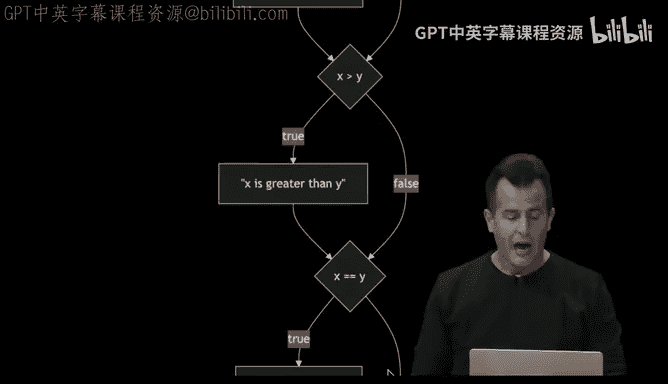

And else if then my flow chart looks a little bit different because notice the sort of shortcuts Now。

 If x is less than y， true， we do this and we're done super quick。 If x is not less than y fine。

 We do ask one more question。 X is greater than y。 Well， if so， boom。

 we make our way to the end of the program by just printing that only if it's the perverse case where x equals equals y。

 do we check this condition， No， this condition， no， this condition and then okay。

 now we can print out X is equal to y because it must be logically。 Of course。

 it's been observed multiple times， this is a waste of everyone's time。

 So we can prune this chart more and just have one question， two question。

 and that alone tightens up the program。 So again， if you're more of a visual learner。

 Most any block of code， you can translate to this sort of pictorial form。

 but it really just captures the same logical flow that the indentation and the syntax and the code itself is meant to。

😊，Imply。Alright， how about a final exercise with one other type here。

 recall that this is our available types to us。 Actually。

 two final examples here before we have a bit of a break here。

 we have a list of types that we can use And here we have a list of functions that we can use。

 Let's go ahead and make a program that's representative of something we do quite often nowadays。

 but using a different type。 So let me go back into V S code。 Let me close compare do C。

 Let me reopen my terminal window and clear it so we have a new prompt。

 And let's go ahead and create a program called agree dot C。

 It's all too often nowadays we have to agree to terms and conditions to be fair。

 It's usually in the form of like a pop up and a button that we click。

 but we can do this in code at the command line as well。

 Let me go ahead and include to start C 50 dot H and include to start standard I O do H。

 Let me again for today's purposes do in main void。

 But well reveal next week what why we keep doing that。 And now for a yes， no answer。

 It suffice is just to ask for a single cha or character， not a whole string。 So let's do this。

 char C。😊，Equals get cha。 And let's ask the user quote unquote， Do you agree question mark。

 for instance， And now I can actually compare that value for equality with some known answers。

 For instance， I could say if C equals equals quote unquote Y， then go ahead and print out。

 for instance， agreed period backlash n close， quote semicolon else if C equals equals n in quotes。

 let's go ahead and print out， for instance， not agreed period backlash n semicolon。 Now。

 there's still room for improvement here。 But notice we're just now using the same building blocks in C in different ways。

 just solve different problems。 But notice on lines 8 and 12， I've used single quotes。

 which I alluded to earlier。Why is that the case？Why single in this case here？Yeah。

 it's a single character。 And this is just the way you do it in C。

 When you want to compare a single character， you use chars and you use single quotes。

 when you want to use strings of text， like multiple characters， multiple words。

 multiple sentences or paragraphs， you use strings。 So this would seem to work。 but arguably。

 I could be a little more efficient。 if the user doesn't type Y， I mean， frankly。

 I could just chop off this else if and make it an else。

 and just assume if you don't give me a y answer， then at least I'm gonna to assume the worst。

 and you don't agree。 But even here， the program is not all that great。

 Let me go ahead and do make agree， and then do dot slash agree， and do I agree Sure。

 I'm gonna go ahead and type Y。 Meanwhile， if I type anything else like n， or even a emphatically No。

 that would seem toop why did that not work。Yeah。Exactly。

 so among the features of C50's functions like getchar is that it will enforce what type of data you're getting。

 So even though I because I use gettchar， if the user doesn't cooperate and types in multiple characters。

 get cha like some of our other functions is just designed to prompt them again again and again。

 until they cooperate that's useful so that you don't have to deal with that kind of error checking。

 But here I could type n in uppercase And that seems to now work。

 but that only works because of the else， let me go ahead and do this which is very reasonable。

 I'm gonna go ahead and type y capital Y， which you would hope works。

 that feels like a bug at this point。 like it's fine if we don't want to support yes and no。

 we just want to support y and N， but it's kind of obnoxious not to support the uppercase version thereof。

 So how can we fix this。 Well， let me hide my terminal window。

 and I could go in and fix this as follows。 I can say， well else。

 if C equals equals quote unquote capital y in single quotes。

 And then I can do print out agreed period backlash and semicolon。 and then I can do。

Else that that would work。 That would work there。 But what rubs you the wrong way。

 perhaps about this solution， even if you've never programmed before。

Just applying some of the lessons from last week， yeah。It's redundant。 I mean。

 I didn't technically copy and paste， but like line 14 is identical the line twin。

 So I might as well have copied and paste。 And that's generally bad practice。 Why， well。

 if I want to change the English language to say something else in that case。

 now I have to change it twice。 and it's just I'm repeating myself， which is just bad design。

 So there are ways to address this through other types of operators that we haven't yet seen。

 if I want to ask two questions at once that's fine， I can do something like this。

 Well if C equals equals quote unquote y or C equals equals quote unquote capital Y。

 I can tighten things up using so-called logical operators whereby I am now taking a boolean expression and composing it from two smaller boolean expressions。

 and I care about the answer to one of those questions being true。

 So whether it's lowercase y or uppercase Y this code now will work。 And if it's anything else。

 we're going default to not agreed。 So the two vertical bars， which is probably not a character。

 you type that off and it varies where it is。Your keyboard。

 depending whether it's American English or something else， just means logical。

 or this is not relevant here， but you could also in some context use two ampers sands to connote and。

 but this does not make sense why。😡，Why is it clearly not correct to say and in between these two clauses？

😡，Exactly， the variable can't both be lowercase in uppercase。 that just makes most no sense。

 So this would be a bug。 But using a vertical two vertical bars here is in fact， correct。 All right。

 well， let's do one final flourish here besides conditionals。 we had these now loops。

 recall that a loop is just something that does something again and again and again， here。

 for instance， to scratch how we might now  three times in C。

 there's gonna be a few different ways to do this。 Here is one。

 You can and C declare a variable like I for integer or whatever you want to call it and set it equal to 3。

 The number you care about。 You can then use a loop。

 And the closest to the repeat block is arguably a while loop。 There is no repeat keyword in C。

 So we can't translate this verbatim。 But we could say while I is greater than 0 Y because that's sort of logically what I want to do if I start counting it3。

 maybe I can just sort of decrement one at a time and get down to 0 at which point I can stop doing this thing。

 So I'm gonna initialize a variable to I a variable I to 3。 And then I'm gonna say while I is。😊。

than 0， go ahead and do the following。 And at the end of that loop before whipping around again。

 I'm gonna to use this line of code， which we haven't seen。

 but you can infer I minus minus just means subtract 1 from I。

 So this is going to have the effect of starting at 3， going to2， going to1， going to 0。

 And as soon as it goes to 0， this Boolean expression。 will no longer be true。

 And so the loop will just implicitly stop， because that's it。

 So what are we gonna put inside of the curly braces besides this decrementation。 Well。

 I think I can get away with just saying meow。 And that will now print 1，2，3 times。

 And yet that's interesting， I sort of counted in instinctively 1，2，3。

 even though I'm proposing that we count 3，2，1。 Well we can do this in different ways。 logically。

 what we just had happen was this。 we started the code。 we said I equal to 0。

 And here I'm using pseudocode an assignment， not exact syntax。 I'm checking is I less than 3。

 And if so， true， print out meow。Then。Nope， this is backwards， damn it。One second。

We have to delete this slide， sorry。😊，That picture does not line up。One second。Okay。

 pretend I never said that。Okay， so。How else could we implement this， Well。

 we could also use what's called damnm it。That I wanted， oh， that's all。 It's just out of order。

 Okay， sorry。Oh on such a roll， no snacks for me， sorry。Hm。Yes， okay。All right。

 the words were correct， the slides were wrong。So remind 1，2，3， and then3，2，1。

 So can we implement the logic in the other direction whereby we count up from0 instead of down from 3。

 Well， sure， we just have to make a few changes。 We can set I equal to0 initially。

 We can change our Boolean expression to check that I is less than3， again， again and again。

 and each iteration of this loop。 Let's just keep incrementing I with I plus plus and at this point。

 it will have the effect of doing 12，3。3 is not less than 3。 So I won't put any more fingers up。

 I will meow in total3 total times。 And again， if you're a visual person。

 Here's how we might start counting it 0 initially。 check that I is less than3。

 which it is initially And if so， we print out meow。

 then we increment I and we get whisk around again to the Boolean expression because that's how while loops work。

 you constantly have the condition being checked again and again。 that's just how C works。

 As soon as I've incremented I from 0 to1 to 2 to 3，3， willll eventually not。not be less than three。

 So the answer will be false。 So the loop will just stop。

 So that has the effect of achieving the same。 but it turns out that looping some amount of times is so darn common that you don't strictly have to use a while loop。

 a four loop。 So to speak is another alternative there too。 whereby the syntax is a little weird。

 It's a little harder to memorize， but it allows you to write slightly less code because you write more code on a single line。

 So the way you read a four loop is exactly the same in spirit。 You initialize the variable。

 Everything to the left of this first semicolon。 then check the condition。

 and the computer does all this for you。 If I less than three， If so。

 you execute what's inside of the curly braces。 and then automatically the thing to the right of the second semicolon happens。

 So I gets incremented from0 to one in this case。 The condition is checked is one less than3， it is。

 So we print now again and C increments I to2 is2 less than 3。 Yes， So now again。

 I gets incremented to3 is3 less than3 no。So the four loop stop。 So it's exactly the same。

 but just more magic is happening in this first line of code here。

 more than you yourselves have to actually write。 and it's just arguably more common convention。

 but both of them are perfectly correct if you'd like to do that yourself。

 So let's go ahead and actually implement now this beginning of a cat in VS code。

 let me go back to Vs code and close a dot C。 let me reopen my terminal window and create a actual cat in cat dot C。

 and let's go ahead and do this initially the wrong way include standard Io do H int main void and then inside of main。

 let's go ahead and print out quote unquote miow backlash n semicolon， and then heck。

 let me just copy paste。 So this is obviously the wrong way the bad way to do this because I'm literally copying and pasting。

 but it is correct。 if I want the cat to meow three times I can make this cat I can do dot slash cat and I get my meow meow meow。

 But let's now actually use some of those new building blocks whereby we converted scratch to C and let me go back into this code。

😊，And I'll do the while loop first。 So I could instead have done int I equals 3。

 if we count down initially， while I is greater than 0， then go ahead and print out quote unquote。

 Miow back slash n。 And then do I plus plus or I minus minus。😊。

I minus minus because we're starting at3。 Now， let me go back to my terminal window and clear it。

 do make cat again。 dot slash cats。 and we get three mes。

 and this is now arguably better implemented。 What if I want to flip things around。 Well。

 I could now change maybe do the normal person way I could start counting it0。

 and I can do this so long as I is less than3 and I can do this so long as I increment I on each iteration now I can do make cat again dot slash cat enter。

 and that two works。 But there's another way I could do this。

 if I want to count like a normal person like start counting from one and count up two and through3。

 I could do this。 but this is arguably this is correct。 It will iterate three times。

 but it's a little confusing because now I have to think about what it means to be less than 4 that means equal to3。

 I could be a little more explicit and say， we' do this while I is less than or equal to3 using yet another one of those operators。

 So I can make a cat yet again。 dot slash cat and。2 would work。 Now。

 which of these is correct or best。 The convention truthfully is in general and code to start counting from0。

 start counting up to， but not through the value that you want。

 So at least you see the starting point and the ending point on the screen， if you will。

 at the same time。 But of course， I can condense all of this a bit more and turn this whole thing into a four loop。

 And I instead could do4 int I equals 0， I less than3 I plus plus and then down here。

 I could do print out quote unquote meow。 And if only because I typed fewer keystrokes that time。

 like this feels a little nicer。 It's a little tighter and more efficient to create。

 even though the effect is the same。 Indeed， when I make this cat and do dot slash cat a final time。

 this here too。

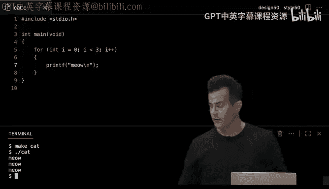

Gives me the three meows。 So what could go wrong。 Well。

 sometimes you might be inclined to do something forever。 And we might have done that in scratch。

 And indeed we did when we had something bouncing back and forth off of walls and so forth。

 you can achieve the same thing in code。 In fact， and see we could use a while loop。

 But there is no forever block。 So while suffices， but recall that the while loop expects a boolean expression。

 And if I want to do something forever， I essentially need an expression here that's always true。

 So I could do something stupid in arbitrary like while two is greater than three or while one is less than two。

 I mean， make a statement of fact that never changes Er go， it's just going to run forever。

 But if the whole goal here is to do something forever and to get this boolean expression to be true。

 the convention in programming is just to literally say while true。

 and that implies and functionally means that you will do this thing forever。

 unless you somehow prematurely break out of those curly braces more on that before long。

 So if I want to meow forever。 I could now just do this。

And this would be an infinite deliberate loop。 But unlike a game where you might want it to keep going and going and going for some time。

 I'm not sure this is going to be the best thing for us。 Let's go ahead and try this。

 So let me go ahead here and include for good measure。 Cs 50's library。 if only because it， too。

 is giving us features like bulls here， I'm gonna go ahead and say while true。

 And then inside of my currently braces。 I'm just gonna print out meow。

 Let's go ahead back slash n semicolon。 Let's go ahead here and make cat one final time Let me go ahead here and do dot slash cat and。

This is like the annoying cat game just like meowwing， meowing meowwing endlessly。

 like I've now kind of lost control over my terminal window and mark my words at some point you might do this too。

 but let's go ahead and take a juicy 10 minute break here。

 we have some delicious blueberry muffins out in the transep come back in10 and we'll figure out how to stop this here cat。

😡，Alright， so it's been about 10 minutes。 and like V S code is freaking out with highcodespace CPU utilization detected。

 Consider stopping some processes for the best experience。

 So this is what happens when you have intentionally or otherwise an infinite loop insof far as I've been printing out meow endlessly。

 And I was warned by my colleague that I probably shouldn't let this run too long because we might lose control over the environment altogether。

 But the answer to how to solve this is going to be control C。

 So there's a few cryptic keystrokes that you can use to generally interrupt things as in this way。

 And in fact， if I go back and you'll see I kind of lost control over my code space here。

 I'm gonna go ahead and try to reload the window altogether。 But had I hit control C in time。😊。

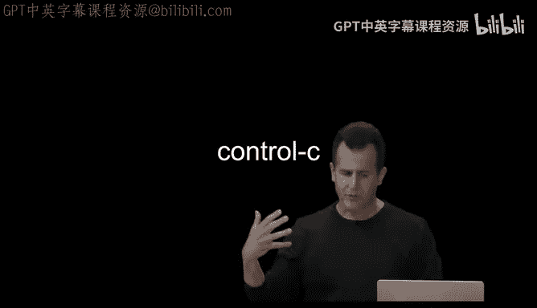

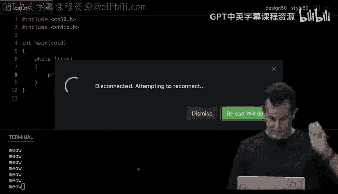

Let's hope this doesn't now go off the rails。Control C would have been our friend。 There we go。

 And we're back。 Give me one second to clean this up now。 Allright。

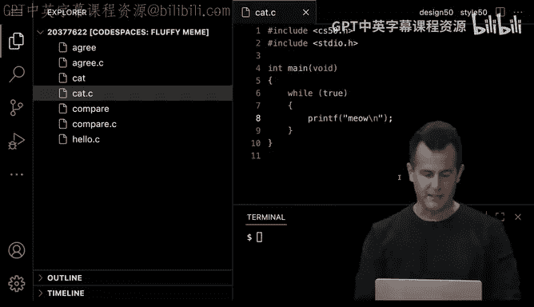

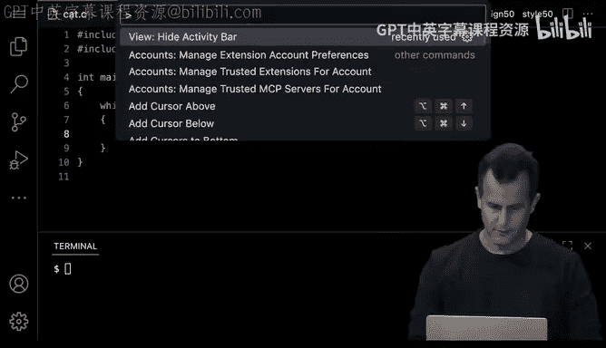

Activity bar， okay。可。うちち。Uhhum。Okay。Okay， so now that we've got control over our socalled code space again。

 how can we go about making our meowing program a little more dynamic。

 And insofar as let's like start asking the user how many times they want the cat to meow， certainly。

 rather than do an infinite number of times and even rather than do it three times alone。

 I think we have all of these building blocks so far。 So let me stay in stay in my。

Cant dots see here， sorry。😡，Let me go ahead and stay in cat dotsy here and go ahead and delete the body of the contents of my main function。

 And let's go ahead and do this。 Let's give myself an int。

 and I'll go ahead and call it n for number， though I could be more verbose than that if I wanted。

 I'm gonna set it equal to the so-called return value of get int。

 which recall is gonna get an integer from the user and quote unquote let's ask the user what's n just like I asked earlier。

 what's x and what's y where n is the number of times I want the cat to meow Now how can I use this variable。

 Well we have that building block2， I could use a while loop or a four loop。

 and if I use a four loop， I could do this I could initialize a variable I for integer set it equal to zero initially。

 I could then do I less than not three this time。 but n so I can use that variable as a placeholder inside of the loop to indicate that I want to do this n times and of three and on each iteration through this loop。

 I can do I plus plus of course I could be counting down if I prefer by using decrementation。

 but logically， I would say this is canonical。 start at zero and go up to but not。

Through the value that you actually care about。 and I'll go ahead now and print out quote unquote meow with a backlash n semicolon back down to my terminal。

 make this cat again dot slash cat enter。 I'm prompted this time for n。

 I can still give it three and I'm going get three mes this time。 However。

 if I run it again with dot slash cat and a different input like4， of course。

 I'm going to get four meos instead。 Now what is get in doing for me。 Well。

 it does a few things similar to get char doing a few things for me。 For instance。

 suppose that instead of answering this question correctly with a number N I say something random like dog that is not an integer。

 and so the get in function is designed to reject the user's input implicitly and just repromp again again and again I can try bird and it's going to do this again。

 So somewhere in the implementation of get there's a loop that we wrote that does this kind of error checking for you。

 but it doesn't do everything because an integer is a fairly broad category of numbers。

It's like negative infinity through positive infinity。 And that's a lot of possibilities。

 But suppose I don't want some of those possibilities。

 Suppose that it makes no sense to ask the cat to meow like negative one time and yet the program accepts that It doesn't do anything or anything wrong。

 but I feel like a better design program would say no no no negative one makes no sense。

 Let's me out0 or one or two or more times instead。

 So how can I begin to add some of my own error checking and coerce the user to give me the type of input I want Well let me clear my terminal window and go back up into my code and why don't I do something like this after getting n。

 let's just check if n is less than0 because if so。

 I want to prompt the user again and I can prompt the user again by doing n equals get n quote unquote what's n Que mark semicolon Now what's going on here。

 Well， on6， I'm doing two things。 I'm getting an integer from the user And I'm not only storing。

In the variable N， I'm also technically creating the variable N， so I didn't call this out earlier。

 but on line 6， when you specify the type of a variable and the name of the variable。

 you are creating the variable somewhere in the computer's memory and that's necessary in C to specify the type。

😡，If the variable already exists though and you just want to reuse it and change it later on。

 it suffices as in line 9， just to reference it by name。

 It would be sort of stupid to specify the type again。

 because C already knows what type it is because you told C what it is on line 6。

 So that's why line 6 and 9 are a little bit different。 So let's see how this now works。

 Let me go back to my terminal window and remake this cat let me do dot slash cat again。

 let me not cooperate and type in like negative one again and notice I am reproted this time。 fine。

 fine， let's type in three， and now it works。 but you can perhaps logically see where this is going。

 Let me go ahead and run this again， dot slash cat， type in negative one， type in negative one。

 and it didn't prompt me again。 But that's consistent with the code。

 If I hide my terminal window here。 you'll notice that I've got one maybe two tries to get this question right。

 And after that， there's no more prompting of me。 Now you can kind of imagine that this is。

Probably not the best way to do this if I were to go inside of line 9 and then move the cursor down and say okay。

 well， if n still doesn't is still is less than 0， well let's just do get into again and ask what's n question mark and heck。

 okay， if it's still less than zero， well let's just keep asking the same right， why is this bad？😡。

I'm repeating myself。 I'm essentially copying and pasting， even though I'm retyping。 I mean。

 this just never ends， right Like how many chances are you gonna give the user in spirit。

 you'd hope that they don't not cooperate this many times， but really to do this the right way。

 we should probably prompt them potentially as many times as it takes to get the correct input。

 So this is not the right path for us to be going down， But of course。

 we have already now this notion of like a loop whereby we could just do this in a loop。

 ask the question once and maybe just repeat the question again， again， but the same question。

 So how might I do this， Well， let me go ahead and delete all of this。

 And let me just try to spell this out logically。 So I want to get a variable end from the user And let's go ahead as follows while true。

 I know how to do infinite loops now， And even though that created a problem for me with the cat I bet we can sort of terminate the loop prematurely like I proposed earlier as follows。

 I could do this int and equals get and ask the user again。N question mark。

 And then I could do something like this if n is less than 0。 Well， then you know what。

 Go ahead and just continue on with the same loop。Else， if it is not the case that n is less than0。

 what do I want to do， I want to break out of this loop。 So this is new syntax。

 This is something you can do and see whereby if n is less than 0， fine。

 continue means go back to the start of the loop and do the same exact thing again。 Otherwise。

 if you instead say break， It means break out of the loop and go to below whatever curly brace is associated with that loop。

 So continue essentially brings you to the top break brings you to the bottom。 if you will。

 So logically， I think this is right。 But this code curiously isn't quite going to work and get me a value for N。

 Let me go ahead and open my terminal window again。 Let's make this cat。 And cat dot C。

 line 19 character 25 is an error use of undeclared identifier N。 Well what does that mean Again。

 Cat dot C line 19。 Let me hide my terminal window， highlight line 19。And is being used in line 19。

 But I created it in line 8。 And so what's the problem， Why is it。Not declared seemingly， yeah。这人。

Yeah， this is a subtlety， but I'm using， I'm creating n inside of this loop。 I mean。

 literally between the curly braces on line 7 and 17。

 the implication of which because of how C works is that that variable only exists inside of that four loop。

 This is a problem of what's known as scope the variable N only exists inside of the scope of the while loop in which it was declared So how do I actually fix this。

 Well， I need to logically somehow declare that variable N outside of the loop so that it exists later on in the program as well。

 and there's a few different ways I can fix this。 but the best way is probably to move the declaration of n so to speak。

 the creation of n outside of the curly braces and maybe kind of squeeze it in here below line 5。

 So still inside of main， whatever that is more on that next week。

 but in the same curly braces as everything else。 So I can in fact， do this。 and。

Where the syntax gets a little bit different。 I can solve this quite simply as follows。

 I can go down to a new line 6 and just say int n semicolon。 And that's it。

 This declares a variable called n。 It creates a variable called N。

 initially it doesn't give it any value。 So who knows what's in there。 More on that another time。

 But now on line 9， I don't need to recreate it。 I just need to assign it a value。

 And because now N has been declared on line 6。 and between the curly braces on line 5。

 and all the way down on 24。 now n is in scope。 So to speak for the entirety of this code that I've written。

 So let me reopen my terminal window and clear that old error。 let me do make cat again。

 now the error messages is gone。 Let me go ahead and do dot slash cat。 What's N。

 now I'm back in business and I can do 3 forow， meow yeahow， But better yet。

 because I'm inside of a loop now， watch that I can do negative 1， negative 1， negative1， negative1。

 negative 2， negative 3， negative 50。😊，Finally， I can cooperate with something like three。

 And because I'm in a loop that by design may very well go infinitely many times until the user actually cooperates and lets me break out of that exact loop。

 Now， I strictly speaking， don't need both continue and break。

 I wanted to demonstrate that both exists。 But this is like twice as much code than I actually need if logically。

 I just want to break out of this loop。 if and only if n is greater than or equal to 0。

 because I'm sort of comfortable with the idea of 0 mouses， but negative makes no sense。

 I can just flip the logic。 I can say if n is greater than or equal to 0。 then go ahead and break。

 and I've tightened up the code further。 I could technically do something else。

 I could say something like if n is less than0， But wait a minute， I wanted to gate that。

 you can start to do tricks like this。 an exclamation point with some additional parentheses。

 So you can invert the logic，'s arguably a little hard to read。 even though that would be。😊。

Logically correct， so I'm just going to say more explicitly as before。

 if n is greater than or equal to 0， break out of this here loop。Alright。

 so this is one way to use an infinite loop。 But it turns out there's another construct that you can do altogether that is in a feature of C。

 instead of using a while loop and forcing it to be infinite by using while true and then eventually manually breaking out of it。

 there exists another type of loop altogether。 And that's called a do while loop。

 And you can literally say the word do， which means do the following。

 then you can do exactly what we did before， N equals get end， quote unquote。

 what's end question mark。 So exactly like before。 But then after those curly braces。

 you use a while keyword。 So at the end of the loop， instead of the beginning。

 And that's where you put your Boolean expression。 I want to do all of that， while n is less than0。

 So you can kind of invert the logic。 And now kind of tighten things up further by just telling the computer。

 do the following。 What's the following everything in between those curly braces。

 while n is less than 0。 And this implicitly handles all of the continuation and all of the breaking by just doing what you've said。

😊，Do this while this is true。 But the difference between this do while loop and a normal while loop is literally that the condition is checked at the bottom instead of the top。

 So when you say while parentheses something that question is asked first。

 and then you proceed maybe this condition is only asked at the very end。 and why is this useful。

 Well， oftentime when writing programs where you want to do something at least once。

 Like you obviously want to ask the user this question at least once。

 there's no point in asking a question like while true or while anything else， you should just do it。

 And then you should do it again if the expression evaluates a true and tells you to do something。

 Now， you haven't played with these loops yet most likely， unless you have program before。

 there's a fun sort of meme that's apropo of this moment。

 So let's see if this maybe causes a few chuckles。If you remember Looney Tus here。

This is funny for people in the know。There we go， thank you。Okay， if this doesn't make sense。

 it eventually will， and it still might not be funny， but it will at least make sense。

 and it illustrates the difference between do while loop like the roadrunner is stopping because he's checking the condition while not on edge。

 he'll run， but if he is on the edge， he's not going to proceed further。

 but of course like Hyyote here he's going to do running no matter what and then only too late。

 does he check。😡，Ha he's still on the。 Allright。 So， thank you。 Alright， now you're cool。 Alright。

 so many more memes will now make sense as a result。

 But let's go ahead and revisit this code and maybe do something a little bit different here whereby we no longer want to just fus around with some of these conditionals in these loops。

 Let's actually make the software a little better designed。

 And to do this willll revisit an idea that we touched on last week。

 and had to do with problem said0， which was like create your own function like C does not come with everything you might want。

 C 50 library is not gonna come with everything you might want。 And at the end of the day。

 a lot of programming is about abstracting away。 Your ideas So you solve a problem once and then reuse it。

 reuse it， reuse it。 And heck， you can package it up in a socalled library like we have and let other people use it as well。

 So here， for instance， in scratch is how we could have implemented the notion of meowing As by getting the cat to play the sound meow until done。

 we abstracted it away。 And then we had a magical new puzzle piece called Miow in C。

 this is gonna be a little weird today。 But next week。😊。

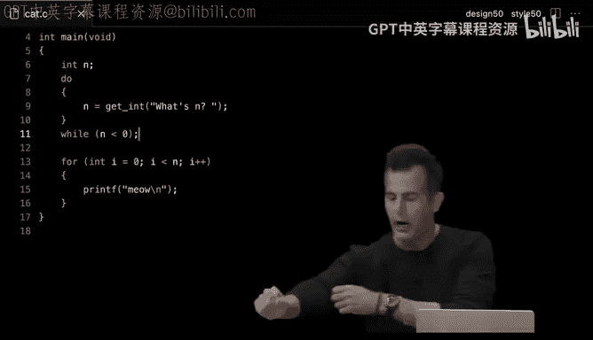

These details will start to make more sense。 You would instead do the following。

 literally type void the name of the function you want to create and then void again in parentheses。

 For now， know that this is the return value of the function。 So void means it returns nothing。

 This is the input to or the arguments to the function。 void means it takes no input。

 And that makes sense because literally meow， doesn't return anything。 It doesn't take anything。

 It just meow。 It has a so-called side effect Audibly last week。

 So this means hey C Invent a function called meow。 It takes no input， produces no output。

 but does have a side effect of printing meow on the screen。 Meanwhile。

 if I wanted to do something like this in code last week。 where I meow three times。 Well。

 that's fine。 we have the building blocks for this。

 And here's where inventing your own function starts to get more compelling。

 I can abstract away the notion of meowing now。 like this doesn't come with C。

 doesn't come with the C5 library。 I just created in the previous code， this meow function。 So I can。

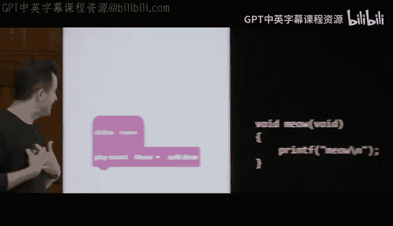

With a four loop and that new function。 Miow three times。 But I can abstract this away further。

ve called that the refinement in scratch last time was this。 I could edit the new function。

 and I can say it actually does take an input， otherwise known as an argument called N。

 And I clarified that this means to meow some number of times。

 And then inside of those scratch blocks， I repeated n times the meowing act。 Well， in C。

 I can achieve the exact same thing， even it's going to look a little more cryptic。

 but meow still returns nothing， it has audible or visual side effect， but it doesn't return a value。

 but this version does take an input。 and this might look a little weird， but just like before。

 when you create a variable in C， you specify the type and the name。

 when you invent your own function in C， and it takes one or more input， a K argument。

 you specify the type and the name of those as well。

 No semicoons up there just inside of the parentheses。

 And you get used to with practice this convention。 But the rest of this code is exactly the same。

Except instead of three， I'm now using N。 So again。

 I'm just composing the exact same ideas as last week。

 even though it looks way more cryptic this week， but it will come more and more familiar with more and more practice。

 So how can I go about implementing this myself。 Well， let me propose that。We do something like this。

 Let me go back to V S code here and let me go ahead and let's really delete most of the code that I've written inside of main and let me just suppose for the moment that meowing exists。

 And I'm gonna go ahead and say for the first version for int I equals 0 I less than 3。

 So we're not gonna take input yet。 I plus plus and then I'm gonna go ahead here and say meow is what I want this function to do。

 Now， if I scroll back up， you'll see there's no definition of meow yet。

 So I'm gonna invent that too， I'm gonna go up here and say void Miow void。 And again。

 this first version means no input， no output just a side effect。

 And that side effect super simply is gonna be to say just quote unquote meow with the back slash n。

 And now if I go and open my terminal window clear it from before。

 do make cat so far so good dot slash cat we're back in business。

 But I've abstracted the function away。 Now， much like last week where I sort of dramatically drag the meow definition way down to the bottom of the screen just to make the point that。

You don't need to see it anymore out of sight， out of mind。 Let me sort of try to do the same here。

 Let me highlight and delete that。And like a way， way。

 way down arbitrarily just to be dramatic and paste it near like the 00th line of code and scroll back up。

 Now， out of sight， out of mind， I've already implemented the idea of meing。

 We don't need to see or talk about it again。But there is a caveat in C。

 when I now clear my terminal and make this cat， now I've introduced a problem。

 And there's like more problems， it seems than code。 Let me scroll back up to the first such error。

 And you'll see this On line 9 of cat dot C， character 9。

 There's an error called to undeclared function。 Yaow， and then something fairly arcane。

 But that means that Miow is no longer recognized as an actual function。

 I know that it doesn't come from CF dot H。 And I know it doesn't come from standard I O dot H。

 It's just down there。 But why is the compiler being kind of dumb here。Yeah。😊，Yeah。

 because insof farar as the first version worked like logically。

 it would seem that putting it at the bottom was just a bad idea because C compilers are fairly simplistic。

 Like they won't proactively do you the favor of like checking all the way down at the bottom of the file。

 they're gonna take you literally。 So if Miow doesn't exist as of line 9， that's on you。

 Like that is an error。 So I could fix this by just undoing what I did and move it way back up to the top。

 But let me argue that in general， when writing C programs， the main function。

 which I keep using and we'll talk more about next week。

 is literally meant to be the main part of your code。

 And so it kind of stands to reason that it should be at the top。

 because when you open the file it be nice to see the main program that you care about the main function。

 So there's an argument to be made that it's a little annoying to have to put my functions all at the top。

 which is just gonna push main further and further down。 So there is a solution。 And this is。

 dare say the only time copying and pasting is appropriate。 Let me delete most of these blank lines。

 which is unnecessarily dramatic and just move it。Below main， as over here。

 the way I can the solution here， though， is to do this to copy， whoops the first line。

Of the main function。 It's so-called signature。 And then just put that one line and only that one line with a semicolon above main。

 And this is what's known as a prototype。 So a prototype is just a bit of a hint to the compiler。

 a promise， if you will that， hey， compiler。 there will exist a function called me now。

 it takes no input and it returns no output semicolon。 And it's on the honor system。

 that it will eventually exist later in the file。 We'll talk more about this next week why that works。

 But this is sort of a promise to the compiler that it will eventually be defined。 Now。

 what I've done here on line4 as an aside is what's generally known as a comment。

 I just wanted to put on the screen， exactly what I was verbalizing anything and see that starts with slash slash is a note to self like a sticky note in scratch。

 which is just for the human， not for the computer and it's a way of reminding yourself or someone else。

 what's going on on that line or those lines of code。

 But I'll go ahead and delete it for now is unnecessary。

 because now if I go back into my terminal and clear those errors。 make this cat again。

AndNow it does work because the cat the meow function has been defined exactly where it should be。

 And now I can make the new version of this cat even better。 I could change the function。

 Miow to take a variable n as input for the number of times。 And then in here。

 I could do something like my4 loop for int I equals 0， I less than n I plus plus and then in this。

For loop， I can print out quote unquote Miow。 And then I'm gonna have to change this too because I have to copy and re pastste it。

 if you will， or just manually fix that。 But now I can get rid of all of this and do Miow 3。

 for instance， And this now will be the second version of the scratch code。 if you will。

 make cat still gonna work exactly the same。 Miow meow meow。

 But now I've implemented in my own function that does take input。

 even though it doesn't happen to return。Any outputs。All right， questions。

On any of these examples just yet。Confusion。Allright。

 let me add one other feature to this to demonstrate that we can take not only input。

 but actually produce output if we want。 if I go back into this code here。

 let me propose that it's a little silly to be hard coding that is fixating3。

 It'd be nice to get input from the user So I could do this。

 I could use int n equals get in and say something like what's an question mark。

 And then I could pass n in。 if only to demonstrate a couple of things。 So one。

 now the programs dynamic， I'm gonna ask the user how many times to meow。

 and I'm gonna pass in that value n。 Now this deliberately is confusing at the moment because wait a minute。

 I got n defined here used here， but then redefined here and then reused here。

 So it turns out that even if you create n up here and use the name N。

 No other functions can see it for that same issue of scope。 So for instance， suppose I didn't quite。

Remember this。 and I sort of naively just said void Miow doesn't need to take any inputs because heck n is already defined find in mainine。

 Let me go ahead and open my terminal and clear it。 make cat and see what error comes out here。 Well。

 error cat oh sorry， I made two mistakes here。 I also have to change the prototype up here to say void。

 which means again， Miow takes no inputs。 Let me go ahead now and rerun make cat and there we have an undeclared identifier again n。

 So in cat do C line 14， which is here。 it doesn't like that I'm using n。 but wait a minute。

 I created n here。 But for the same logic as earlier。 that's fine。 you create an n on line8。

 but where does n exist in what scope。Yeah， only between the curly braces， which is lines 7 and 10。

 So by the time you get down to 14， it's out of scope so to speak。 so it just doesn't work。

 So the solution is exactly what I did the first time I can pass it into meow is input and I have to tell C to expect that input。

 and I can use the same name but arguably that's gonna get confusing sometimes， but let me do this。

 let me go back into my code， let me undo this change such that now Miow does take an input。

 but instead of just calling it n and using n everywhere for number， this is crazy。

 let's call this like times So Miow takes some number of times and then it uses that value。

 and now I'm passing in on line 9 n。 but in the context of the Miow function on lines 12 onward that same variable N is now referred to as times because you're passing it in as input and giving it its own name and that's totally your prerogative It's just a matter of scope。

 I mean I could have called it M or some other letter。The alphabet。

 but times is even more clear because that's the number of times I want the cat。To meow， but again。

 the whole point here is just this matter of scope。😡，All right。

 so let's take a higher level look now at some of the things we've been thinking about。

 and then we'll do a final deep diveer too on some of the corner some of the problems that we can solve with all of these building blocks and some of the problems that were sort of ignoring for now。

 So when it comes to writing good code C50 and really the world in general tends to focus on these kinds of axes。

 correctness， design and style。 What does this mean correctness just means does the code work the way it's supposed to in the context of a class。

 it should do exactly what the homework assignment， a problem set tells you to do in the real world。

 It should do exactly what someone decided the software should do， the product manager。

 the CEO or the like correctness just means it behaves as it should。

 That's different though from how well design the code might be。 And we've seen that a few times。

 I've had some simplistic examples in scratch and see that we're 100% correct。

 Like it did the right thing logically。 But I was wasting the computers time。

 I was wasting the human time by asking more Boolean expressions than I needed to and so forth。

 So design is more about like in the world of English like not only saying things that are correct。

 but doing it。Well， like in making a good cogent argument， not just one that happens to be correct。

 Style， meanwhile， is the third axis on which we might evaluate the quality of someone's code。

 and that's more of the aesthetics。 like is everything pretty printed。

 That is nicely indented are variables well named and not just called X Y Z arbitrarily or something like that。

 So style matters really to other humans not to the computer but to other humans and to illustrate these you'll see that in problem set one onward。

 you'll be given a number of tools that you can use。

 So one of those tools is called check 50 and in each problem set problem in C in Python and other languages。

 you'll be showed how you can test your own code and you can literally run a command that C50 created called check 50。

 you'll then specify what's called a slug， which just means a unique identifier for that homework problem。

 and you'll get quick feedback on whether or not your code is correct。

 It doesn't mean it's well implemented or well designed or pretty that is well stylized。

 but at least that's the first gauntlet in getting good code submitted Design though is much more subjective design。

Something to get feedback on from a human， for instance。

 in section or a teaching assistant or in software you can actually see a top BS code there's a couple of buttons that I haven't yet used。

 but could design 50 is built on top of the CS50 duck whereby if you have a program open in a tab you click design 50 you will get chat GT like advice on how you can improve not the correctness of that code but the design of that code。

 the quality thereof which is a bit more subjective and modeled after what a good teaching assistant might say St 50 meanwhile is a third tool that will provide you with feedback on the style of your code and will show you on the left what your code looks like and on the right what your code really should look like insofar as it should be consistent with what we've taught in class and consistent with CS50 so-called style guide and those of you who have some prior programming experience undoubtedly won't like some of CS50 stylistic choices and that's going to be the case in the real world too but as I alluded to earlier in typical companies you would have an official style guide or tool to which everyone adheres so that everyone's code actually。

Looks the same as everyone else is， even though people have contributed different solutions to problems。

 So correctness， design style is not only how we， but really the world writ large。

 tends to evaluate the quality of code， and we do it by way of these CS 50 specific tools here。

All right， how about one final flourish then to this here program back in V S code。

 I've got a correct solution right now。 It's well styled all stipulate。

 even though it could stand to have some more comments。 So for instance。

 I could do something like this like meow some number of times。 a comment to myself or up here。

 I could say something like get a number from user just to remind myself and my T or my colleague what it is this code is doing。

 but what more could I do in the way of design。 Well。

 this function here get in well indeed get me an integer， but not just positive or0 but negative。

 And I could go in and add a bunch of code like before。

 like I could actually do instead of this line， I could do something like int n semicolon do the following or n equals get in。

 and then I can say what's n question mark。 And then after that。

 I can do something like while n is less than0。😊，Keep doing that so I can have a pretty verbo implementation of getting user input。

 or I can implement another function of my own that only gets a positive integer or non-neg integer from the user for instance。

 I might do something like this I could declare at the maybe below my main function。

 a function like this int how about get n and then inside of this I might say void because I'm not gonna to pass in any input then inside of this function is where I'm going to do int n do while n equals get n quote unquote what's n question mark and then down here I'm going to do while n is less than zero but rather than do something immediately with n because I'm no longer inside of my so-called main function。

 What I'm going to do which is new is return this value n and notice that this notion of returning a value。

 which is the first。First time I've done this explicitly is consistent with this little hint here on line 19。

 which implies that this get end function， which I'm inventing， is going to return， not void。

 which means nothing， but an integer。 And that's the whole purpose of this function in life Now。

 If I scroll back down here， I can get rid of this whole block。😊，Of code。

 and just say get n from the user。 And then I can immediately call meow with that value。

 I need to do one other thing。 I need to highlight，ops I need to highlight this line of code here。

 And I'm gonna go ahead and add another prototype up top。

 which is the only time again for now that copy paste is encouraged and best to do。

 So I've invented my own function。 get n。 the whole point being now I have this sort of abstraction here of the function Who's whole sole purpose in life is to get me not just an integer。

 but one that is0 or positive and not negative。 If I open my terminal window。

 clear the mess from before。 make this cat dot slash cat。 what's n 3， I'm now back in business。

 And again， we've essentially translated from scratch last time and to see this time exactly how we might modularize now the code abstract away these lower levell details and ultimately create my own function that as before。

 takes not only arguments。😊。

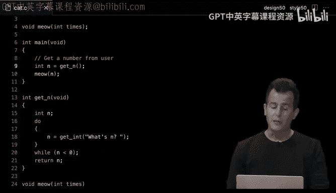

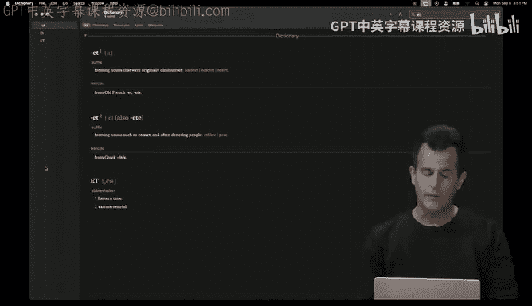

But in this case has not only side effects， it doesn't have side effects。

 but rather a return value this time。Allright， so as you walked in。

 we had a little walkthrough of Super Mario brothers playing from yesteryear。

 which was a side scrolling game in which Mario would jump down and go up down left right and try to collect coins and make it to the end of the level。

 There's a lot of obstacles throughout this kind of game。

 whereby the world might look a little something like this。

 Like there's a pit that Mario's got to jump over。 and then there's these coins hidden typically behind these question marks that he can jump up and hit his head with and actually a crew points。

 Now we're not gonna do anything graphical just yet。

 we're leaving graphics behind for now in the form of scratch。 But with C。

 we can implement some of these ideas。 For instance。

 if I were to write code to generate just this row of four question marks。

 I dare say there's a bunch of ways we can do this。 In other words。

 let's see if we can't use all of today's building blocks to start implementing our own tiny version of Super Mario brothers in a file。

 say called Mario C。 So let me open and clear my terminal window。 Let me run code Mario C。

 And let's just try to do something super simple like print4 question marks in a row。 Well。

 to do this， I need printf。 So I'm gonna include standard。😊。

H I'm then gonna do int main void more on that next time。 and inside of main。

 my default function that just automatically， as before gets called for me。

 I'm gonna print out the simplest possible implementation。

 just print out four question marks like that。 So no need per se for a loop just yet but I think we can go down that rabbit holes2 let me go down into my terminal window make this version of Mario dot slash Mariio enter and voila we have a very black and white version textual version of four question marks in the sky。

 Now I'm kind of cheating here by just hard coding for question marks。

 What if I wanted not four but three or five or some number other number。

 Well we could do that with a loop to So let me change this code here and do something like this4 int I equals。

 say0 I less than say four for now I plus plus then inside of this loop I can print out one question mark at a time。

 semicolon Now let me go back to the bottom make this version of Mario dot slash Mariio enter。😊。

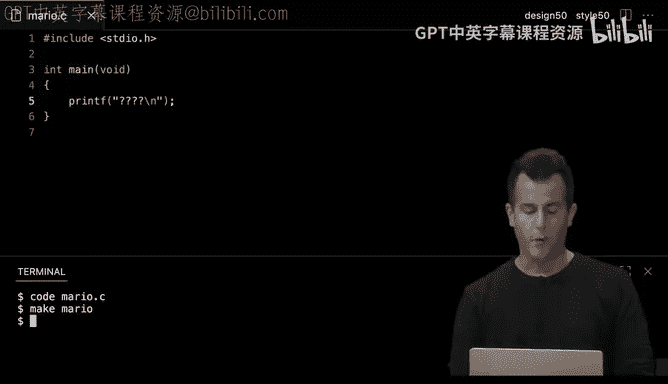

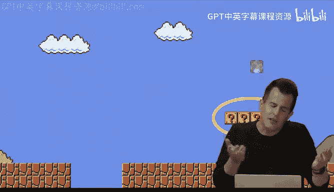

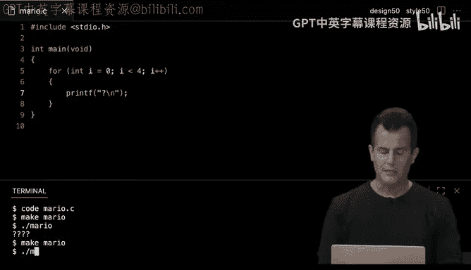

voahm。It's not actually correct this time。 So why am I getting a column instead of a row would this here change。

 yeah。

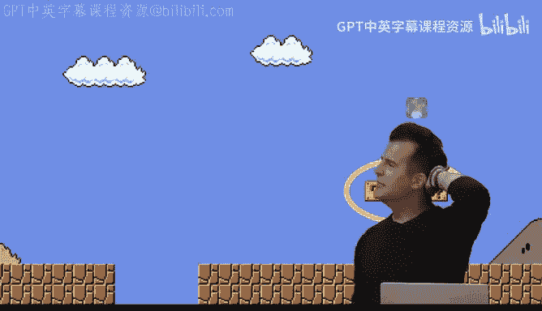

Yeah， so I've got， I foolishly included the back slash in after each question mark。 Okay。

 so that seems like an easy fix。 Let me get rid of that。 Let me now recompile Mario， rerun Mario。

 And now so close。 Now I've just done something stupid。 All right， I need the backslash in。

 So I think I do want this here or。😊，What do you propose instead？Yeah。

 I should really put the backslash n outside of the loop。

 So once I'm done printing all of the question marks， then I get the backslash n。 And that's fine。

 Even though we haven't seen this before， backlash n is an escape sequence that you can certainly print by itself。

 So I do quote unquote backlash n outside of the loop below those curly braces。

 Now if I do make Mario dot slash Mariio。 Now， I get the four question marks in a row as well as the new line at the very end。

 So again， kind of a little baby exercise， but demonstrative of how you can just take a few different techniques。

 a few different building blocks we've used to compose a correct solution to what a moment ago was a brand new problem。

 Well， let's try another。 So later on in Super Mario Brothers。

 when you go into the underground world， you see or rather it's still above ground。

 you see a column of bricks like this that he has to jump over So those here how might we make a column we kind of had that solution already And in fact。

 if I go back to VS code here and just change this version of Mario。

 I think we can design this thing to be pretty simply the same I listen than three。😊。

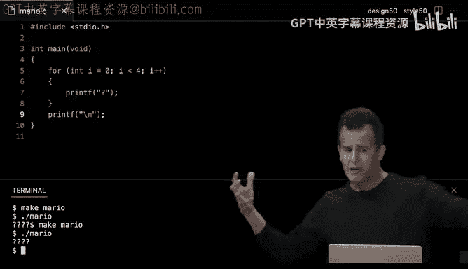

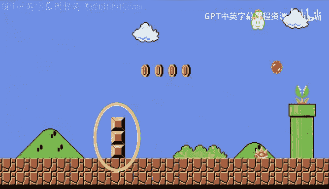

And I do want to put the back slash n at the end there。

 make Mario dot slash Mario and albeit textual。 I've got my column of three let's see。

 I don't want question marks。 Let's make this a little better。

 we use the hash symbol because that kind of sort of looks like a square。

 So make Mario do slash Mario。 Okay now we're back in business。

 But let's make it more interesting by going into Mariio's underground now。

 And here's the third and final Mario problem。 whereby we want to implement like this three by three grid of bricks circled here。

 So this one's interesting because we've never done something in two dimensions。 I did horizontal。

 I did vertical。 but we haven't really composed those ideas into the same。

 So let me now think a little harder this time about how I can print out row row row。

 And this is where if you have in your mind's eye any familiarity with like old school typewriters。

 It's kind of the same idea where you want to print a row of bricks。 go back to the beginning。

 a row of bricks， then go back to the beginning and a row of bricks。

 And that's kind of what printf has always been。

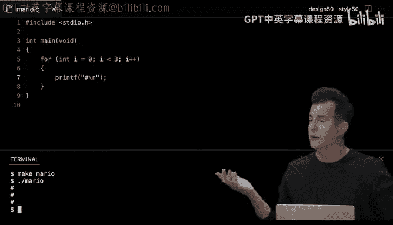

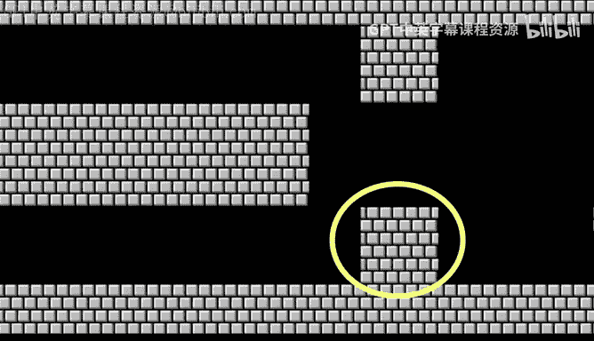

Do for us， it's printing line by line by line of text。 It's not jumping around。

 so we can leverage that。 perhaps as follows。 Let me go into my main function here。

 And if I want to print out something twodimenional。

 let me kind of think about it as rows and column。 So maybe I could do this for int I equals 0 I less than 3 I plus plus Y I want to do something three times。

 even if I have no idea where I'm going with this solution。

 I at least want to do something three times like three rows of text。 But how about this on each row。

 what do I want to do， I want to print out three things。

 So I could steal this idea like int I equals 0 I less than three I plus plus And then inside of this loop。

 let me just print out one brick at a time。 No new lines yet， one brick at a time。

 But there is a bit of a problem here。This is correct to nest loops in this way。

 To fine to have an outer loop， To fine to have an inner loop。

 But I probably don't want the inner loops variable competing with the outer loops variable by giving them the same name。

 And that's fine。 It is pretty conventional one code when you want another integer and it's not I because you've used it already fine。

 You can use j。 So using I and j and K is generally fine。 if you're using L M and at that point。

 you're probably doing something wrong。 There's no hard line， but at some point。

 it gets ridiculous and you should be coming up with better variable names。 But I and J。

 maybe K is fine。 So now what's really happening。 Let me propose that this is my for each row。

 this is my for each column， I want to print one brick。 Now this isn't quite correct。

 But let me go ahead and make this version of Mario， dot slash Mario。 And now there's what one and2。

3 There's9 bricks there。 So I'm close It's supposed to be3。9 total， what do I want to do though。

 to get this just right？😡，Yeah， over on the left。Yeah， on what line number or after。

 where would I put the new line？😡，Because I think I don't want to put it here because I'm going to get myself into trouble as before。

 How about and back。After the what？After 13， yeah， so after I finished printing each brick in the column from left to right。

 I'm gonna go ahead and print out。 I think a single new line here， nothing else。

 And now if I open my terminal run Mike Mario again， dot slash Mario。 Now we've got it。

 And it's not a perfect square because like this one is because the hashtags are kind of more vertical than they are horizontal。

 But it's pretty darn close。 the takeaway here being。

 you can certainly nest these kinds of ideas and compose them。 And honestly。

 I and J is maybe making this more confusing than necessary。 I could just give these better names。

 like row， row。😊，Row， and then maybe call for column or column。

 I can spell it out if that's clear column column just to make clear to myself， to my T。

 to my colleagues， what exactly these variables represent。 And indeed， like an old school typewriter。

 the outer loop is handling row by row by row。 But each time you're on a row。

 you first want to do column column column column column column。

 And that's what logically the nesting is achieving。 And again， if I do make Mario do slash Mario。

 all I've done is change variable names， it has no functional effect beyond that。😡，Now。

 this is a little more subtle， but there is a bit of duplication in this program。

 There's a bit of magic， and this is subtle， but does anyone want to conjecture what still could be improved here。

😊，What is maybe rubbing you the wrong way？Yeah， I've hardcoded the three here in here。

 It's not a big deal。 It's like an in-class exercise like who really cares if I'm just manually typing three。

 but if I want to make this square bigger and bigger and bigger over time。

 I'm going to have to change it in two different places and I've conjectured last time。

 and today eventually that's going to come back and bite you。

 you're going do something stupid or a colleague isn't going realize you hardcoded3 in multiple places like just bad design So how could we fix this Well we could just declare a variable like n set it equal to3 and then use n in both places and that's pretty darn good。

 that's better because now we are reusing the value， but we can do one better than this。

 it turns out in C and in many languages2， there's the notion of a constant whereby if you want to store something in a variable。

 but you want to signal to the compiler that this value should never change and better still。

 you want to prevent yourself a human or not to mention a colleague from accidentally changing this value you can declare it to be constant or constant for short。

 So if I go back into VS code on line 5。

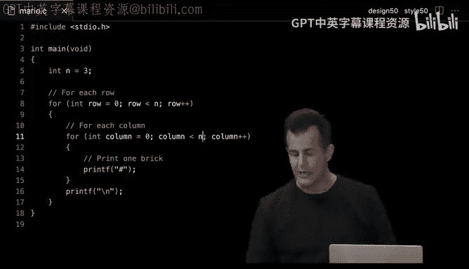

And say constant， that means that n is an integer that has a constant value。

 so if I do something stupid later in my code and I try to set n equal to something else。

 the compiler won't let me do that， it will protect me from myself。

 so it's just a slightly better design as well。😡，All right， questions。On any of these here。Mario。

Examples， the first of our sort of real world problems， albeit simplified textually。All right。

 let's focus lastly on things we can't really do well with computers。

 namely some of the limitations thereof。 So here is a cheat sheet。

 of some of the operators we've seen thus far， we played with these with comparison and doing some addition or the like。

 But here we have addition， subtraction multiplication division and the modo operator。

 which is essentially the remainder operator， which you can do with a single command with a single operator like this。

 Let's use some of these to make our own calculator and see what this calculator can and can't do for us。

 So back here in VS code， let me open my terminal。 Let's go ahead and create a program called calculator do C。

 And in this program， let's do something super simple initially that just like adds two numbers together。

 So let's include first。Cs50 H so we can use our get functions。

 Then let's go ahead and include standard Io dot H so we can use printf。

 Let's just copy paste our usual int main void。 and inside of main， let's do this。

 declare a variable X set it equal to get int and let's ask the user what's x question mark then let's declare another variable Y set it equal to get int and ask the user。

 What's y question mark。 then let's do something super simple。 Like give me a third variable。

 Heck we'll call it Z， set it equal to x plus y。 And then lastly。

 let's just print out the sum of x plus y。 So this is a super simple calculator for addition of two numbers。

 printf quote unquote what's the answer going to be。 Well it's not percent S。 This was quick earlier。

 what's the placeholder to use for an integer。Percent I backslash N。

 And what do I want to substitute for that placeholder。Just Z in this case。

 we haven't quite done this before。 But again， it's just the composition of some of our earlier ideas。

 I can go ahead and make this calculator， enter dot slash calculator， enter whats x is one。

 what's y is2 and indeed， I get three。 So not a bad calculator。 It seems to be working correctly。

 But it's maybe not the best design like it's generally frowned upon to create a variable like Z。

 if you're only gonna use it a moment later in one place。

 Like why are you wasting my time creating a variable just use it once and only once。

 sometimes it's fine if it makes your code more readable or clear。 And in fact。

 it might if I called it sum。 like that's arguably a net positive。

 because I'm making clear to the reader that it's the sum of two variables。

 But even then I'm quibbling。 I could just get rid of that third variable altogether And heck。

 I could just do x plus y right here。 That's totally fine。 and reasonable。

 especially since it's still a pretty short line of code。

 it's not hard for anyone to read feels like a reasonable call。 But this hint that again。

 my comments on design being subjective。 There's no steadfast rules here。 Some of the T。😊。

Might disagree with me。 but like this feels fine。 It's readable。

 which is probably the most important thing。 ultimately。

 Let's make this calculator dot slash calculator enter1，2， and we still get3。

 So the code now is still working。 As an aside， if you're starting to wonder how I type so fast。

 Sometimes I'm of cheating with autocomp。 So if I know I want to create a program called calculator and calculator do C exists I can start typing C A L tab and you can hit tab to sort of autocomplete the rest of the file name if it happens to exist there better still。

 if I want to go back to previous commands I've typed。

 I can actually use my up and down errors to go through my history。 So if I go up up up。

 you'll see all of the recent commands I typed and that saves me time。

 So just little keyboard shortcuts that speed things along。 All right， well。

 let's do something like this。 not just addition， why don't we use some multiplication。

 So how about we prompt the user not for two numbers， but how about just one initially X。

 And let's go ahead and multiply X by  two。😊，And I would do X asterisk 2。

 which is the multiplication operator in C。 Let's make this version of the calculator dot slash calculator。

 And now what's x， let's do one。 So one times2 is2。 Let's do this again。 let's type in  two。

2 times 2 is4。 Let's do this again，3， three times 2 is6 and so forth。 That's fine。 It seems to work。

 But maybe let's implement like a recent meme from the past year or two。 How about this。

 let's see if you recognize it as we go。 So I'm going to get rid of this code altogether and inside of my calculator。

 I'm going to do something like int dollars equals 1 by default。

 Then I'm going deliberately induce an infinite loop just for demonstrations sake。😊。

Then I'm going to do a character from the user and say something like this using get cha。

 which gets a single character。 how about I'll tell the user here's this many dollars。

 percent I with the US dollar sign before it。 double it and give to next person question mark familiar with that one。

 and I'm going to prompt them for yes， no answer。 but I'm going plug in the current number of dollars。

 So they know what they're wagering on。 then below this。

 I'm going to say if the character the human typed in equals equals y for yes。

 then I'm going go ahead and do dollars times equals2。

 which recall was our shorthand notation for doubling something in this case。

 I could more pedantically say equals dollars times2， but again。

 I can save some keystrs and do times equals2 instead。

 There's no plus plus there's no star star trick S trick you have to do it in this way minimally。

 However， if the user does not want to double it and give it to the next person。

 then let's do an else。And just break out of this infinite loop altogether。

 But notice what I've deliberately done in getchar， similar to printf。 I have included a placeholder。

 Why we implemented getchar and get in and get string just like printf and that you can pass in placeholders and plug in values。

 Why， well， again， for the meme's sake， I want to be able to tell the user how much money I'm about to hand them when I asked them the question。

 do you want to double it and give it to the next person。

 I want to see the number and the dollar sign is just because we're talking about dollars。

 The percent I is because we're talking about integers。 Alright， if I didn't mess this up。

 let's make this version of a calculator or meme。 so far so good dot slash calculator enter。

 here's1 dollar， which was the initial value of my dollars variable On line 6。

 double it and give it to the next person。 Allright， why here's2。

 double it and give it to the next person。 Okay， okay， okay， okay， okay， I'm gonna to do it faster。

 It's getting pretty good。 You can see the power of exponentiation。It's getting pretty high。

 Let's keep going， keep going。A lot of doll， too far。😊。

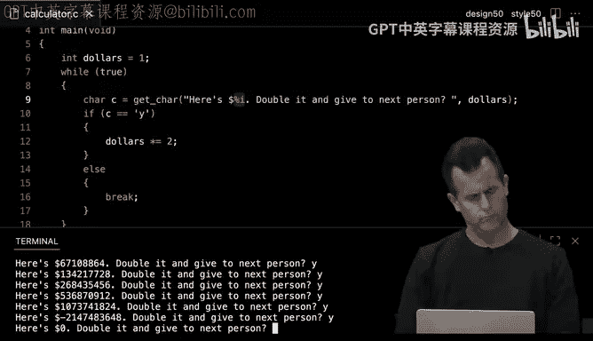

That does not happen in the memes。 What happened here？What's going on， Yeah， what do you think？

Exactly， good intuition。 because the computer only has a finite number of bits allocated to each integer。

 I hypothesized earlier that it's usually 32 B， maybe 64 B， but it's finite。

 which means you can only count so high。 and it's roughly 4 billion or again。

 an integer by default can be negative or positive。 So it's roughly2 billion。

 And that's pretty close to what we were getting here， In fact， we overflow the integer in memory。

 In fact， integer overflow is a term of art。 whereby you can overflow an integer by trying to store too big of a value in it。

 And the reason for this is again， to make this clear。

 This is a piece of memory inside of a laptop or a desktop or some other device。

 And in these little black chips is a whole bunch of bits or really bys that can store information electronically。

 But they allocate those bits in units of 8， maybe 16， maybe 32 maybe 64。

 but finitely many per value。 And whether we're using 32 or 64。

 you can only count so high if you have a finite number of bit。

 And we've seen this problem even on a small scale with light bulbs last week。 if we have a。😊。

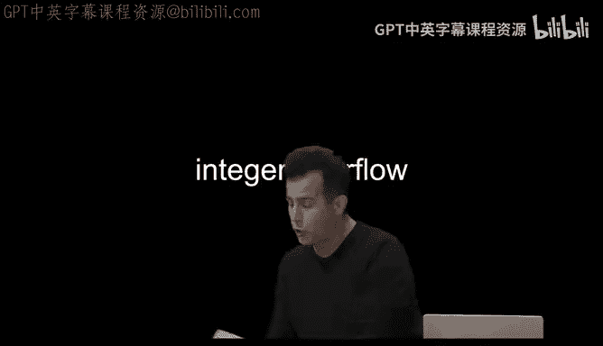

digigit number， as represented by like three physical light bulbs or three tiny transistors in the computer。

 I can count from 0 to 1 to 2 to 3 to 4 to 5 to 6 to 7。 if I want to count to 8 though。

 I need a fourth bit。 But as the red suggests if you don't have a fourth bit for all intents and purposes。

 that number is just0， or as an aside， depending on how you're representing your numbers。

 Sometimes a leading one indicates that the number itself is negative， which is why in VS code。

 we actually saw both symptoms。 First， we went negative because we wrapped around logically。

 much like that one resulted in our getting back effectively to0。

 And then we did indeed end up on0 ultimately。 So how can we chip away at this。 Well。

 a couple of solutions， perhaps let me close my terminal window here。 And instead of using an int。

 Well let's just kick the can down the road。 Let's use a long， which is 64 B。

 So at least we can give away even more money in this scenario。

 I can't use percent I N need to use percent L I now for a long。

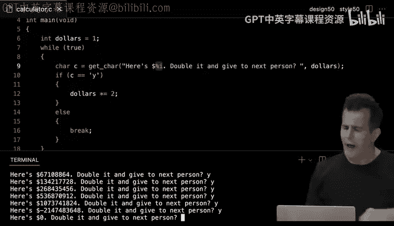

Integer， but I think at this point， if I go back to V S code's terminal window here。

When I quit that program by hitting control C quickly。

 now I'm gonna to go ahead and do make calculator again。 dot slash calculator。

 And I'm just gonna keep hitting y。 But because I'm using a long int now and thus 64 bits。

 if I do this long enough， it's gonna get crazy high and much， much higher than before。

 high enough that I'm not gonna keep clicking why enter because we're never gonna hit the boundary。

 but eventually， especially if I did this in a loop automatically， it would certainly oh， oh， okay。

 I guess exponentation works fast。 Okay， so it did work。

 I didn't think I was gonna hit it enough times。 But the same problem happened again。

 we overflowed this long integer， even using that many bits because I was talking so long。

 I kept hitting y enough times to overflow even that long integer。 So that too is a problem。

 And this happens truly in the real world。 So picture here is a Boeing 7。

87 from a few years back long before there were all the more recent problems with Boeing planes whereby after 248 days of continuous power。

 which is kind of a thing in the aviation industry like。😊，neyAnd generally。

 they want the planes in the air as much as possible。

 which means they want them power on as much as possible。

 which means they don't like turn them off at night。 They keep them going and flying。 After 248 days。

 the New York Times reported a few years back， that a model 7。

87 airplane that has been powered continuously for 248 days can lose all alternating current electrical power due to the generator control unit simultaneously going into failsafe mode。

 this condition is caused by a software counter internal to the GCs that will overflow after 248 days of continuous power。

 Boeing is in the process at the time of developing a GCU software upgrade that will remedy the unsafe condition。

 So literally what this means is that the power to these planes would just shut off if the planes were on for more than 248 days at a time。

 And this was a common thing fors to be maximal power。

 Why was this actually happening or what was the solution。 Well。

 the short termm fix because it took a while for Boeing to fix this was what What would you do if the symptom is that the plane shuts off mid。

After 248 days， yeah。Literally， turn it off and back on again。

 much like you've probably been taught with your phones and computers and any other electronic devices that somehow freak out on occasion。

 Reboot the plane。 Now， why is that， Well， anytime you reboot a phone or a laptop or a plane。

 all of those variables get reset to their default values， which if it's the first line of code。

 like in some of my examples get set back to0 again， for instance。

 the first line of code is executed from top to bottom。 So this effectively solved the problem。

 But when they finally rolled out a fix， then you didn't have to do that anymore。

 But source of the problem is essentially that they were probably using 32 B integers。

 but also negative value So they had 31 B at their disposal to count to positive numbers and 248 days is roughly how many1s of a second there are。

 which means once you count intense of a second for 248 days。

 you would overflow an integer and the power would shut off effectively because something ended up going to0。

 So there was a lot of sort of。Marketing speaker， technical speak in that。

 But it boiled down to just a simple integer overflow。 There's a historical bug in Pman。

 If you've ever played this in any of its forms， whereby you can play up to level 255。

 But because there was a missing if condition that checked what level you were on。

 you could accidentally garble the screen。 if you were amazing at packman because they too would overflow an integer and just random characters would end up appearing on the screen。

 So it's sort of like a badge of honor to actually hit level 256 in this way， because of this bug。

 But there's yet other issues we can see here， And if you don't mind。

 we might go a couple minutes over， but let me just demonstrate what these examples can do for us here。

 if I were to revamp my calculator here as follows by clearing my terminal window after hitting control C to kill that。

 let me go ahead and get rid of all of this meme code here scrolling down to the inside of main and let's just do a couple of things like this X equals quote unquote what's X question mark。

 then let's go。😊，and do int y equals get in。 quote unquote what's y question mark。

 Then let's go ahead and print out just x divided by y。

 So here's a percent i back slash n x divided by y。

 This would seem to be a calculator now for division， which I can make as before。 and actually sorry。

 I don't want to do missing term sorry， missing a double there was an unintended bug。

 So if I make this here calculator， do dot slash calculator， type in one type in3。 I get0。

 which is weird。 What if I do instead maybe2 and 3， it's 0 instead of 066。 What if I do 3 and3， Well。

 that curiously works， But if I do something like 4 and3， which would be 1。33。

 that two doesn't seem to work， So there this other issue in computing。

 when you have finite numbers of bits known as truncation。

 whereby even when you're trying to do floating point math， like with a decimal point。

 if you are using an integer， you're going to throw away everything after the decimal point。

Unless you're explicitly using the right data type。 and we saw an allusion to this earlier。

 if I actually go in now and change my values from integers to floats and change the percent I to a percent F and remake this calculator。

 Now I can do one divided by3。 and I actually get back that their response。

 But there's another issue late in here， which happens to in the real world。

 whereby I'm gonna tweak this percent F to be a little arcane。

 it turns out you can tell see how many digits you want to show how many significant digits you want。

 if you will， by just using a dot and then a number like 50 arbitrarily。

 And contrary to what you might have learned in grade school。

 this calculator would seem to think that dot calculator， one divided by three， is not 0。

33333333 infinitely many times， there's all this random stuff happening at the end。 long story short。

 this is because computers， one only use finite many bits even to represent floating point numbers。

 And if there's an infinite number of those， you can't possibly represent every possible floating point value。

 So we're essentially seeing。Proxiation of onet precisely。

 but this too happens quite a bit in the wild。 There's really no solution to this other than by throwing more bits at the problem using a double instead of a float。

 or at least somehow trying to detect this and catch this that then is what we'd call floating point precision but to tie this together and sort of induce a bit of fear and for the coming years。

 these things happened all of the time back when I was finishing school。

 there was the so-called Y2k problem or year 2000 problem whereby for decades。

 computers had been using not four digits to represent years。

 but just two because it was convenient it was more efficient because you use half as much memory to represent maybe the year 1999 just using two digits instead of four of course。

 when the year rolled around from from 1999 to 2000 if you didn't have these numbers even in memory。

 you might confuse 2000 with 1900， which was the presumption。 if you're only storing two digits。

 So we screwed that up and thankfully the world scrambled and if you read up on Wikipedia and news articles from the time everyone thought the world might very well。

But it didn't。 So you'd think we'd learned our lesson。 Unfortunately。

 another such problem is coming up in the year 2038， whereby historically， since the 70s and prior。

 computers have generally used 32 B integers to keep track of time。

 the date and the time by means of counting how many seconds have passed since January 1，1970。

 And all of the math is just relative to that date because that's when computers were really starting to come onto the scene。

 if you will。 Unfortunately， there's only 4 billion values you can count to or 2 billion。

 if you're doing negatives from January 1，1970。 And so on the date， January 19，2038。

 we will overflow a 32 B counter。 And suddenly， if this problem is not fixed by you or other people before the year 2038。

 our computers and phones and other devices may very well think it's December 13，1901。

 So there are solutions to these problems， C is 50 is all about empowering you with solutions to these problems。

 But if you'd like to。this here code， this will add that date to your Google Calend or your outlook calendar。

 keep an eye on it that though is week one for CS50， problemble set1 will be in your hand soon。

 we'll see you next time。😡。

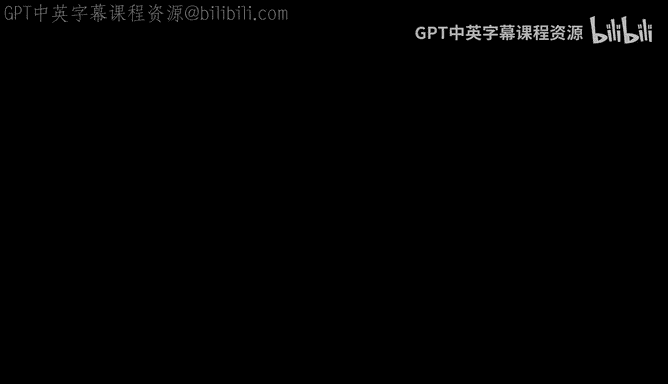