# 【双语字幕+资料下载】哈佛 CS50-WEB ｜ 基于Python ／ JavaScript的Web编程(2020·完整版) - P10：L3- Django网络编程 2 (模板) - ShowMeAI - BV1gL411x7NY

now all I need to do is create that，template so let me go ahead and inside。

of the hello directory I'll create a new，folder called templates inside of that。

template so I'll create a folder called，hello because the template name here is，hello / index。

html so I need to create a，folder called hello inside of which is a。

file called index that HTML I could have，just called it index at HTML without the。

hello but the reason we often want to，prefix our templates with the directory，name。

is to so-called namespace them to make，sure that if we have multiple different。

indexed at HTML files in multiple，different apps to make sure they don't，conflict with each other。

so Django best practice is to use hello，slash index dot HTML or whatever your。

app name is and inside of that hello，daughter directory I'll then create a，file called index。

html and this index，dot HTML can contain any HTML content，same as we've seen before so I could add。

that doctype the HTML tag a title of，hello and maybe inside the body I'll。

have an h1 that says hello world for，example and so I can have an entire HTML。

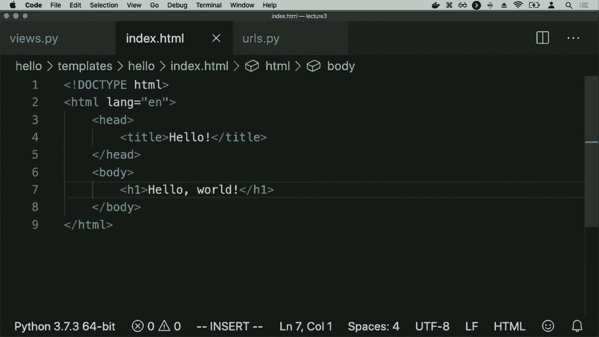

page just like this and now when I visit，the default route of my web application。

by going back into my web browser and，just going to slash hello for example。

now I see that HTML that I've defined，inside of hello of index dot HTML it's a。

big h1 that just says hello world and it，turns out that these HTML pages these。

templates that I can render using Django，are parameterize a bowl as well right。

maybe I want to implement hello slash。

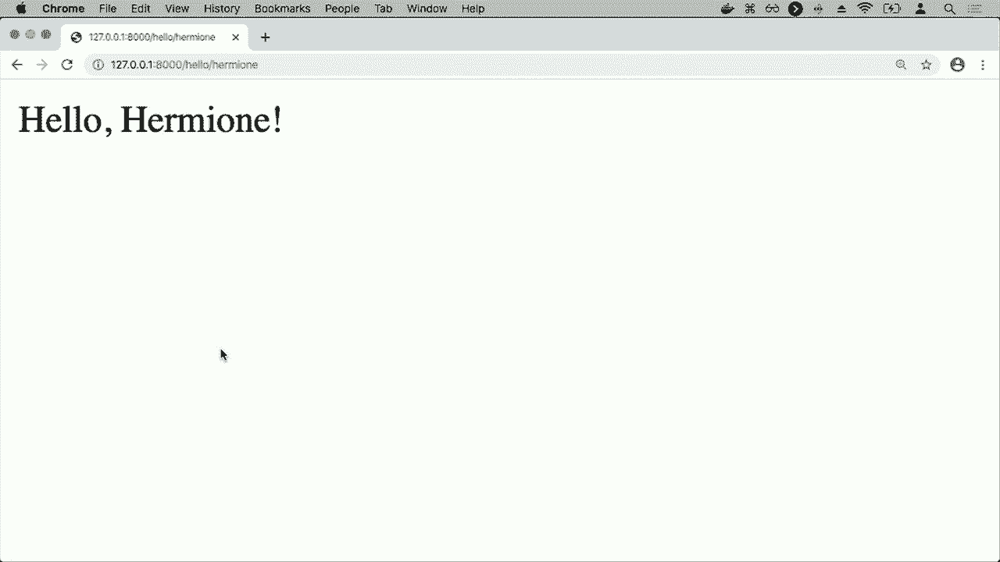

Hermione as some sort of HTML page an，HTML page that says hello comma Hermione。

and using HTML out of the box you can't，really do stuff like this HTML is a。

markup language not so much a，programming language which means it。

doesn't by default have support for，things like a variable to represent。

someone's name but using jenga's ability，to take an HTML page and treat it like a。

template that we can render jenga's，added its own templating language so to。

speak on top of the existing HTML and I，can take advantage of that to be able to。

render an HTML page that actually has a，variable inside of it or a condition。

inside of it or a loop inside of it as，we'll see in just a moment as well so。

let's go ahead and go back to view stop，pie and the function that I would like。

to change is this greet function here，then right now is just returning an HTTP。

response but I'd like to render an，entire page for example so what might I。

render well let's render a template，called hello slash greet HTML and then。

this render function can take an，optional third argument which is called，the contact。

and the context is all of the，information that I would like to provide。

to the template all the variables for，example that I want the template to have。

access to and so one thing I might want，my template to have access to you for。

instance is something like a name and so，this is a Python dictionary just a。

sequence of key value pairs and this，name might be associated with what value。

so name is the key the value I want to，be named dot capitalized and so what's。

going on here is that now when I render，this template this template hello slash。

greet HTML I'm providing that template，with some additional context some。

additional information as represented by，this dictionary here where I'm providing。

information with a key of name I'm，effectively giving this template access。

to a variable called name and its value，is whatever name dot capitalized is。

equal to where this name here is the，argument to the function greet so now I。

can return this template and inside of，greet dot HTML I can use this variable。

called name so how do I go about doing，that well let's first create that greedy。

HTML file so inside of the template，/hello directory I already have，index。

html I'll go ahead and create a，new file called greet dot HTML and。

inside of greet dot HTML I'll go ahead，and write some HTML and inside the body。

of the HTML whereas before I might have，said something like hello comma world I。

don't want to say hello to world I just，want to say hello to whoever the name is。

whatever khun's contained inside of that，variable called name so how might I go。

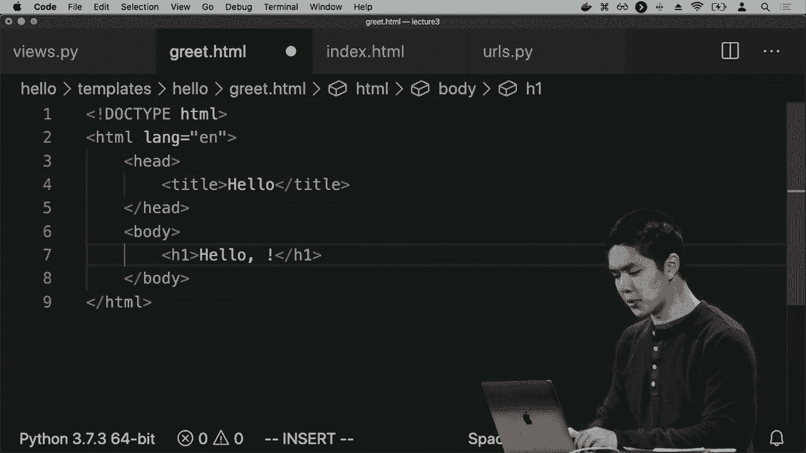

about doing that well what I can do is，use these double curly braces and double。

curly braces are part of the Django，template and which that allows me to say。

I would like to plug in the value of a，variable into this particular position。

inside of my template and so if I，include the word name here then what I'm。

saying here is that when you render this，greet dot HTML template inside the body。

of the page I would like for there to be，an h1 a big heading that just says hello，brace。

I'm saying plug in the value of the，variable name there his name is Hermione。

it's gonna be hello Hermione if it's，Harry it's gonna be hello Harry。

if it's David it's gonna be hello David，so let's go ahead and give this a try。

now now when I go to slash hello slash，Harry for example I now see a big h1 tag。

that says hello Harry if I go to slash。

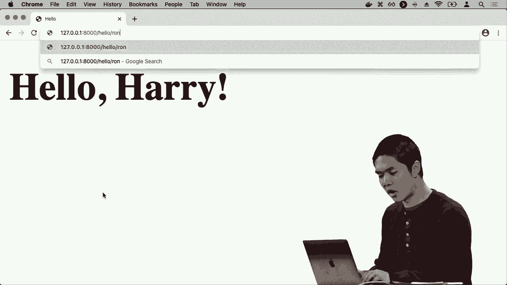

hello slash Ron I see a big H one that，says hello，comma Ron and the reason why all this is。

happening the way we're getting to that，final position is because URLs says that。

when I have a URL that just as a string，like someone's name we'll call the greet。

function the greet function inside of，you see I is taking the name as an。

argument rendering the Greek HTML，template and passing in that name as。

part of the context part of what the，template has access to and inside of。

greet dot HTML here is the actual HTML，file here is where we then plug in the。

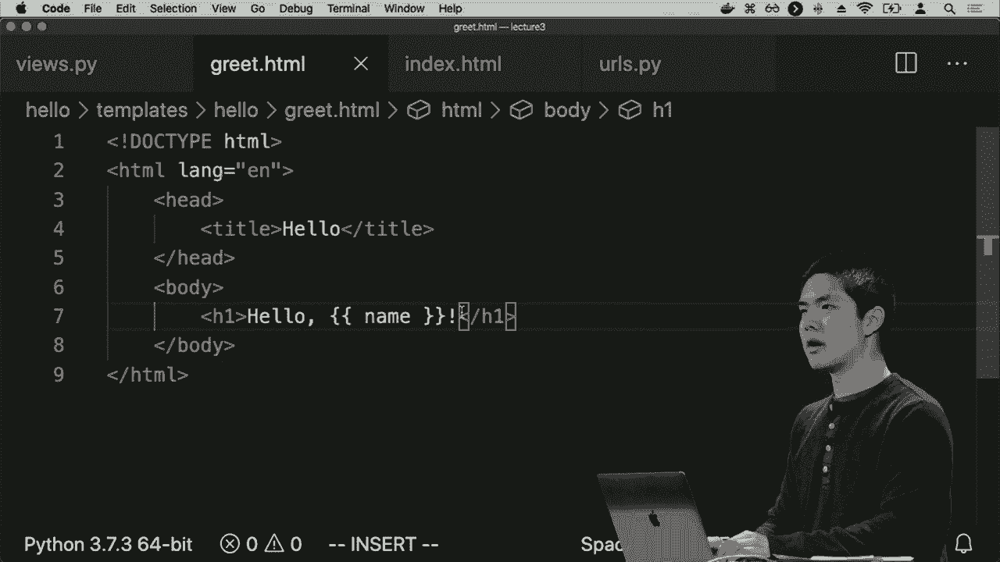

value of name so it's a lot happening，across a lot of different files but the。

reason for all of these various，different files is to help keep things。

separate to have one file that is just，responsible for URLs and directing。

people to where what should happen when，those URLs are clicked then we have one。

file views PI that is entirely，responsible for deciding on this。

particular view what template should be，rendered what information should be。

passed in as context and then I，separately have a file for each of my。

inch HTML templates that are saying what，does the page actually look like and so。

if you start to begin to think about，this separation of components inside of。

a web application it can help to make，the structure of a Django application a，little bit clearer。

so we've now been able to use the Django，templating language to put variables。

inside of our HTML templates to be able，to create an infinite number of。

different routes where I can visit slash，hello，slash some name in order to display a。

hello to that person's name but the，Django templating language is even more。

powerful than just that there are a lot，of additional features that the。

templating language is going to give us，access to and we'll take a look at a。

couple of those now and to start I'm，going to introduce you to a website you。

may be familiar with I consider it to be，one of the simplest websites on the。

internet it's a real website called is，it Christmas com。

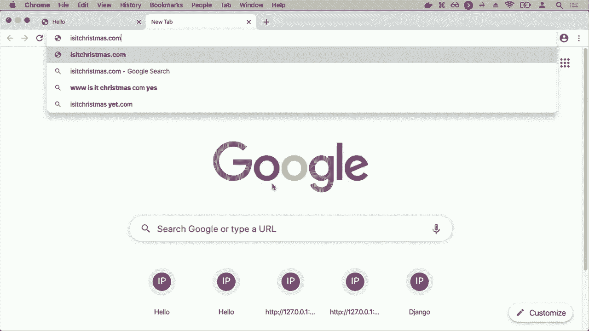

and if I visit is it Christmas calm and，press return here's what the website。

says the website says no it is not，Christmas and you just have to take my。

word for it if you visit this website on，Christmas Day you go to is it Christmas。

calm it will instead say yes，and so this website is very simple you。

might imagine that it's really just an，HTML page that probably contains a big。

heading that in this case just says the，word no but on Christmas Day just says。

the word yes now how might a page like，this be implemented well one way you。

could imagine is that on Christmas Day，whoever maintains the website goes into。

the HTML and changes no to yes and then，afterwards change if the yes back to a。

no but we can be a little bit cleverer，about this if we realize now that we。

have the ability to use Python logic to，be able to use logic like a condition to。

be able to decide how a webpage is，ultimately going to be rendered for。

instance the condition might be，something simple like if today's date is。

Christmas then render yes else render no，and so we're going to use Django and。

take a look at some of the features of，Django's templating syntax to be able to。

create a website like this we're not，going to create is it Christmas we're。

gonna create is it New Year's the checks，if the current date is January 1st or。

not this is going to be a separate app，it's sort of distinct from our hello app。

the hello app just says hello to people，the New Year app for example is just。

going to see whether or not it happens，to be New Year's for example so I will。

now go ahead and create a new app and I，can do that by sobriety in Python manage。

pi start app and I'll call the app new，year for example I'd like to create a。

new app called new year I've now created，that new app if I type ls' you'll see。

that not only do I have a Hello，directory that represents the Hello app。

I now have this new year directory that，represents the fact that this is a new。

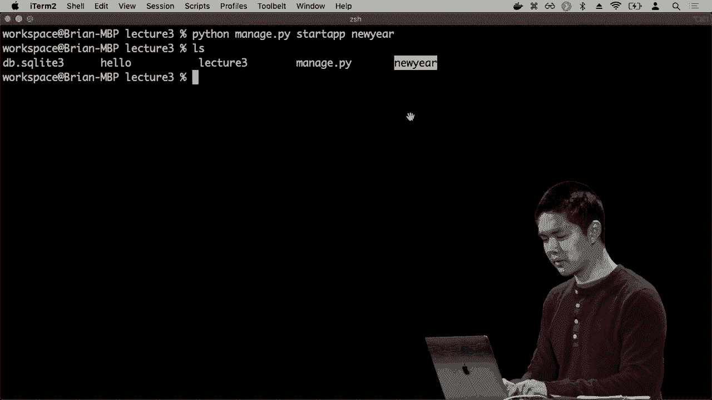

app called new year as with before I'll，need to go into settings dot PI inside。

of my project directory and add new year，as some installed app this is now a new。

app that exists in my web application so，it too now needs to be a new installed。

app what else do we need to do for new，apps well I need to go into URLs PI for，lecture 3。

and just as before I had a path saying，when I go to /hello，then you should go to all the URLs for。

the hello app let me add a new path that，says that if I go to my application。

slash new year well then you should go，to all of the URLs for the new year file。

go to new years dot URLs representing，the URLs dot PI file inside of the new。

years app now that file isn't given to，us by default so we need to create it I。

need to go into my new year folder and，create a new file called URL spy and。

inside of that file I'll do from Jango，dot URLs import path from dot import。

views and then define some URL patterns，same as before where I'll just have a。

single path that loads the index，function inside of used up high and it。

has a name of index so again just，mirroring the type of structure that。

we've already seen before in the hello，app this app is just going to have a。

single route the empty route that loads，the index function now all it's left to。

do is to actually create that index，function so I go into view spy and here。

now I'll define an index function that，takes an HTTP request as an argument and。

now inside of this index function I，would like to add some logic that checks。

whether or not it's January first and so，how might I go about doing that in。

Python well it turns out that there is a，date/time module in Python and you can。

learn about this just by reading up，about its documentation to figure out。

how it works and the date/time module。

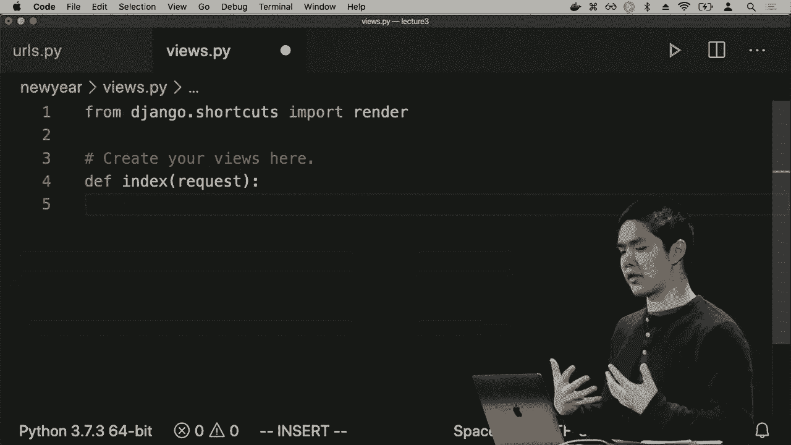

gives me access to things about the date，and time for instance and I can play。

around with the date/time module outside，of Django just to get a feel for how it。

works if I just type Python into the，interpreter into my command line rather。

what I get is the Python interpreter，that lets me just write Python code just。

to experiment and test and see what the，result of running this Python code would。

be so I can try like import date/time，for example and let me create a new。

variable called now which is date/time，dot date/time dot now it just so happens。

that inside of the date/time module is a，function called date/time now that gets。

the current date and time，example and so inside of now I have，access to variables like now dot year。

for an example which tells me the year，now dot month now dot day that gives me。

information about the year the month and，the day of the current *** based。

on getting whatever the current time is，right now and given that I have this。

information you can imagine us，constructing a boolean condition to。

check whether or not today is in fact，the new year and that condition might。

look like now dot month equals one and，now dot day equals one I can press。

return and see that ok the result of，this condition is false it is not true。

that both the month and the day are true，or are one rather and so using that sort。

of condition I can now take that and，adapt it into my Django view that I'm。

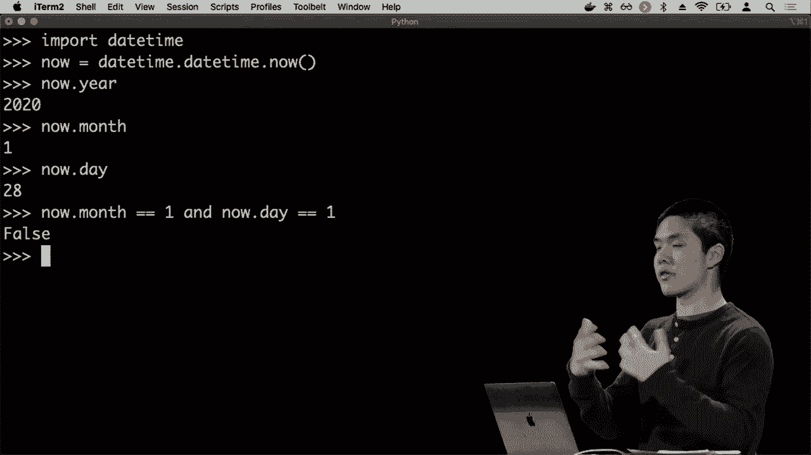

using to try and render whether or not，it's the new year or not so how might I。

go about doing that well what I'd like，for my index function to do is return。

render a template the template will be，called new year slash index。html and。

then what context what I would like to，provide to this template what。

information what variables do I want for，this template tab access to well I。

wanted to have access to a variable，that'll just be called New Year and in。

order to access that I need access to，the current date，so to do that I'll at the top of my file。

I'll go ahead and import date time and，inside of my index function let me give。

myself a variable called now which is，equal to date time date time now and。

this New Year variable that I'm passing，in to my template will be equal to now。

dot month equals one and now dot day，equals one so if it is the case that。

after I get the current date and time by，running date time dot date time now。

saving the result inside of this，variable called now if both the month。

and the day are equal to one then the，value of this new year variable is going。

to be true when the template gets access，to it otherwise as it is the case today。

and on most days the value of that，variable is going to be false now all。

that remains for us to do is to actually，create this，but New Year slash index dot HTML and。

have that template somehow use this new，year variable in some interesting or。

meaningful way so how do we do that well，if you recall what we did with the hello。

application when we want a template then，inside of our application this new year。

app will need a new folder that will，call templates inside of which I'll。

create a new folder called new year and，inside of that I'll create a new file。

that will be called index。html here will，be the index。html file for this New Year。

application the structure will be very，similar I'll give it a title of is it。

New Year's and inside the body now，here's where the interesting logic is。

sometimes I might want a big h1 that，says yes，other times I might want a big h1 that。

says no and what I need to do is，conditionally decide when to say yes and。

when to say no an inside Django's，templating language and again you'd only。

know this by reading Jana's，documentation just as we used double。

curly braces to say plug in the value of，a variable here the syntax for logic。

inside of a Django template like，conditions is curly brace % so we use。

curly brace % some logical statement and，then % curly brace to include any kind。

of logic and the logic in this case is，an if statement and this is very Python。

like will say if New Year New Year is，the name of that variable that I passed。

into this template and if it is a new，year then I want to display an h1 that。

just says yes and then else also inside，of curly braces and percent signs I want。

a big h1 that just says no so if it's，the new year then yes else no and then。

Django also requires me to give an N if。

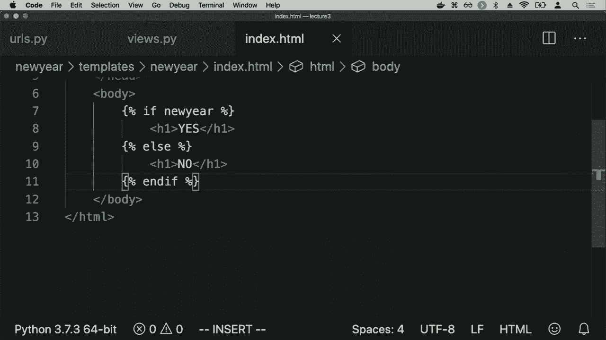

statement，unlike Python itself that uses，indentation to denote when the if。

statement is beginning and ending in，Django the indentation is optional。

inside of the template but in order to，distinguish when the if statement is。

happening from when the if statement is，over we need this end if tag at the very。

end so this here is a condition，inside of our Django template we're。

saying if a particular variable is true，then render this in the HTML and else。

render something else if it's the new，year say yes it's the new year otherwise。

say no it is not the new year so we can，try this out right now we're on the。

route / hello / wrong if I instead not，go to / hello but go to / new year for。

example this site can't be reached okay，so why did that happen。

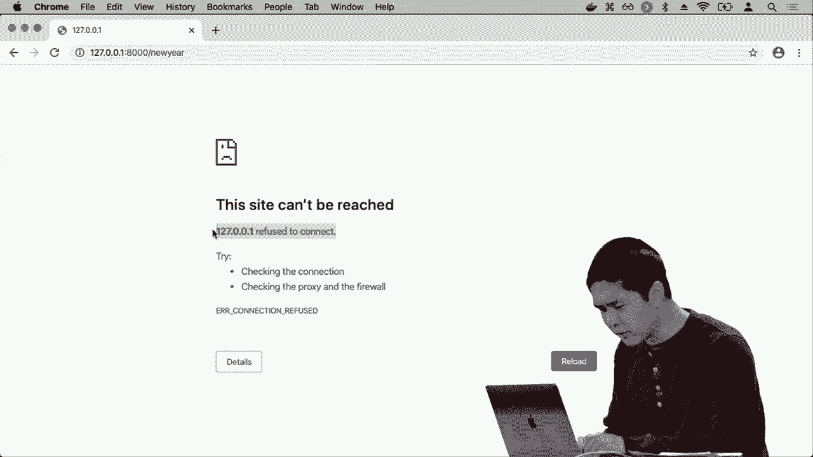

one 27001 refused to connect so what，must be happening is for some reason my。

web server isn't running and it turns，out that in order to create the new。

application i had stopped my web server，and so if ever that happens to start it。

up again we can just rerun python manage。

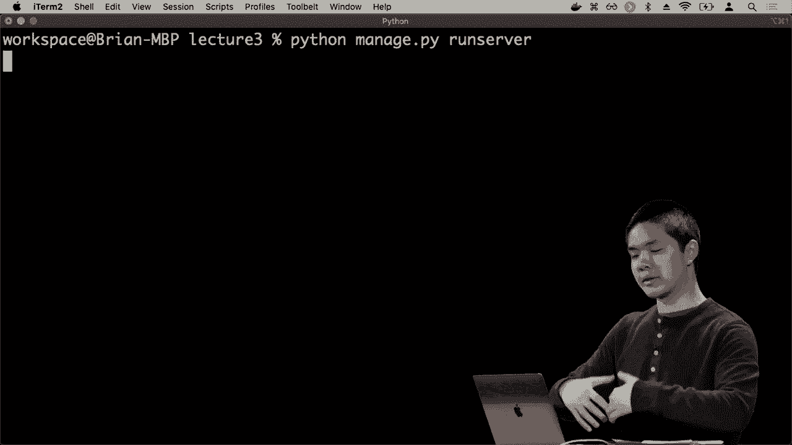

pi run server to say i would like to now，start up this web application again and。

all right it looks like now I have，another error there's some sort of。

syntax error and the syntax error is a，new year / views a dot PI so let me go。

ahead and go back into view stop I'm and。

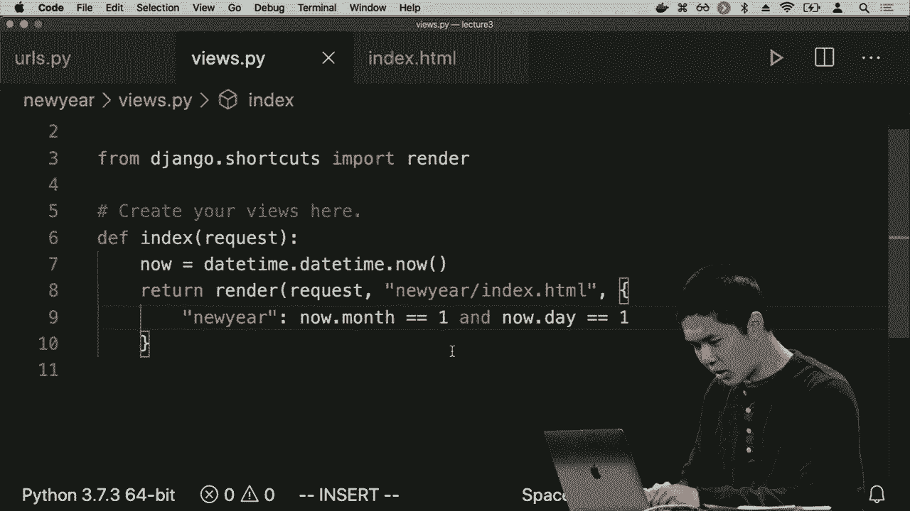

see if I can spot where the syntax error，is and alright it looks like render is a。

function function arguments need to be，enclosed in parentheses and while I have。

a starting parenthesis here I'd，forgotten a closing parenthesis so I'll。

go ahead and add that and now that will，complete the render function and now I。

should be able to load / new year and，indeed what I see is that no it is not。

the new year and so what happened is we，ran some Python logic calculated the。

current date and time checked to see is，the current month one is the current day。

one and if that's not true then we're，here displaying no and if we look at the。

actual HTML of this page like what HTML，is actually making up this particular。

page which I can do by right clicking or，control clicking and just clicking view。

page source this will show me the HTML，of this page this is the HTML that came。

back from the web server that my web，browser chrome in this case is rendering。

and what you can see is it looks very，similar to the index dot HTML template。

we wrote before but it only contains no，it doesn't contain any of that if logic。

it doesn't contain the yes it just，contains the HTML content that we wanted。

to respond with back to the user and so。

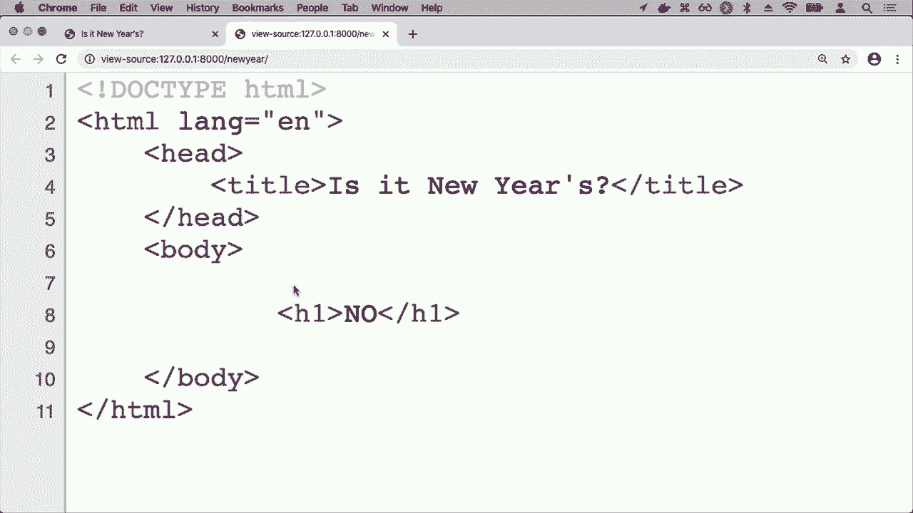

you might imagine based on this that，what Django is really doing is taking。

the index that HTML template and then，manipulating it based on the input we。

based on whether or not it's the new，new year，then all we should do inside the body is。

display an h1 that says no and the user，when they get it they don't see the。

conditions they don't see there was，another branch that could have been。

taken they only see the final result of，rendering the template with whatever。

variables and logic and conditions，happen to be inside of that rendering。

process so when the user sees it all，they see is the word no and if we were。

to run this program on New Year's Day it，would indeed say yes and we can test it。

just to see what it would be like if，that were the case by cheating a little。

bit instead of now that month equals one，and out a day equals one let me just go。

ahead and replace this condition with，New Year is equal to true just to test。

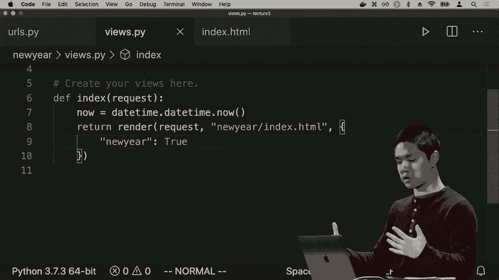

it let's try passing in the value true，as the value of New Year and see what。

happens instead and now when I run this。

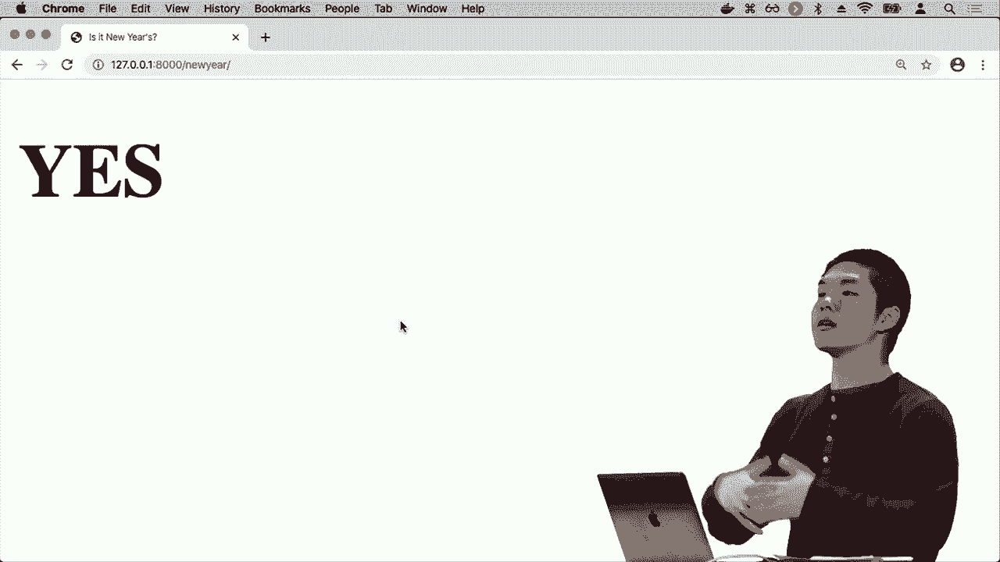

page now it does say yes as we might，expect it to on new years and so that。

can be a nice way of just testing what，would happen if you were to replace a。

particular variable with a particular，value we can substitute inside the。

context just for development purposes，what value we would like that variable。

to take on now we've rendered HTML but，we haven't really added any styling to。

this website just yet the real is that，Christmas com has the text centered a。

little bit it's in sans-serif font，instead of having the little serifs of。

the glyphs at the edge of each of the，characters so maybe I'd like to add some。

custom CSS to this file as well and we，could do this conventionally the way。

we've seen it done before but just，including a CSS file and that is what。

we're still going to do but Django has a，special build system for dealing with。

what are called static files files that，aren't going to change the HTML of this。

page that's not a static file because it，changes depending on whether it's new。

years or not if I visited on New Year's，it says yes if I visit it when it's not。

New Year's it says no and so this is a，dynamic page but static files files that。

don't change like our CSS the CSS，doesn't change whether it's new years or。

not and because that's files unchanging，Django calls it a static file and it。

means the Django can be a little bit，clever about it if you start to think。

about projects and scale you might store，your static file somewhere separate just。

in some place that makes it easy to，access where they're cached for faster。

reads later on we'll talk about that a，little more later，in the course as we start to delve into。

topics like scalability as you begin to，build larger web applications on the。

Internet but long story short Jango，contains a lot of features that make it。

easy for us to deal with static files，files the don't change like CSS files。

and generally the way that we'll add，static files is inside of the New Year。

folder in addition to having a templates，slash New Year slash index dot HTML will。

also create a new folder called static，that will contain all of the static。

files that we would like to include，inside of this application as well。

inside a static I'll create a new folder，called New Year inside of which is a new，file called styles。

css and so inside of，styles dot CSS I can now write all of，the same CSS that I would want to have。

written before so maybe I want all my h1，to have a font family of sans-serif a。

font size of 90 pixels maybe and I want，the text alignment to be centered just a。

couple of CSS properties and values same，as we've already seen just to say I。

would like to give h1 tags this，particular style now what's left to do。

inside of index at HTML is at the top of，our page I'll go ahead and add a command。

that says load static to mean go ahead，and load static files for this。

particular HTML page and now I'll go，ahead and link a stylesheet you'll。

recall that this type of command inside，the head section of my web page where I。

would like to link some particular URL，as a style sheet is how I add CSS to a。

page but what I'm going to include in，here as the link is I'm going to include。

rather than hard coding a URL which I，could do django best practices and。

instead let's just say it's going to be，a static file and the static file is。

called New Year slash styles and dot CSS，so I'm not specifying exactly what the。

URL is but I'm saying it is a static，file that is inside of a New Year folder，called styles。

css and Django is going to，figure out what that URL ought to be and。

this is often better than hard coding a，specific URL because maybe you might，imagine in large。

web applications where your static files，are might change you might move your。

static files to a different domain or to，a different route and so in order to。

deal with that this static keyword just，means Django will figure out where your。

static files are located and will，replace this command here in the curly。

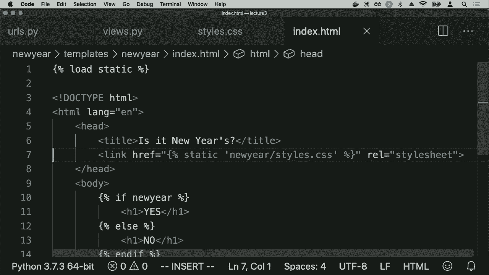

braces and percent signs with the actual，URL for this particular file so now that。

I've said that I want to link this，particular static file style。css into。

this web page what I might first need to，do just to let Django load static files。

is restart the server so you might，sometimes need to control C and then go。

ahead and rerun python managed up by run。

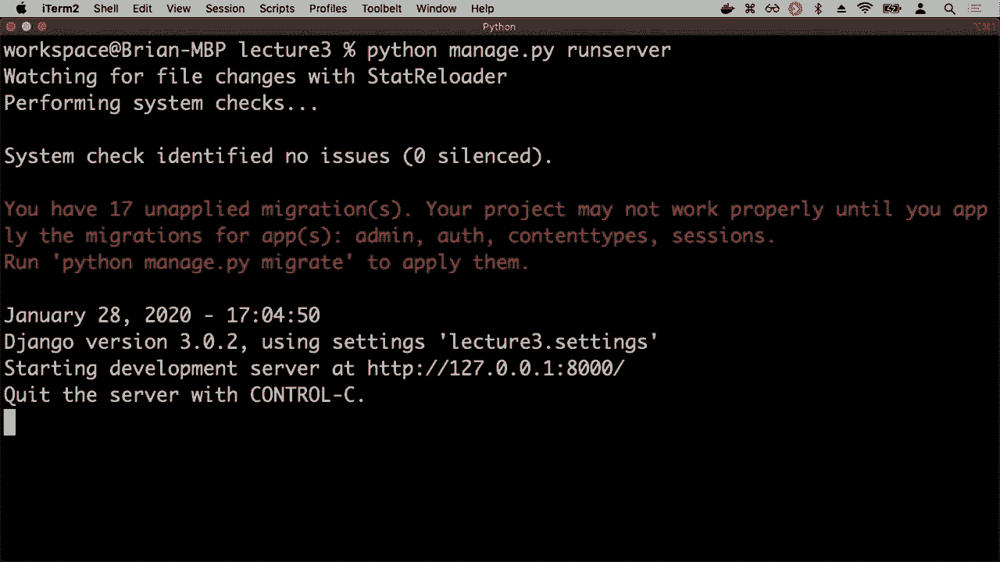

server that will rerun the server and，now if i go back to the slash new year。

route inside my web browser now i see，the style look a little more close to。

what i actually wanted it to be centered，sans-serif in a larger font that here。

just says no and if we look at the，underlying HTML of this page we see that。

Django is actually for us filled in what，the static URL is for these particular。

static files and by default。

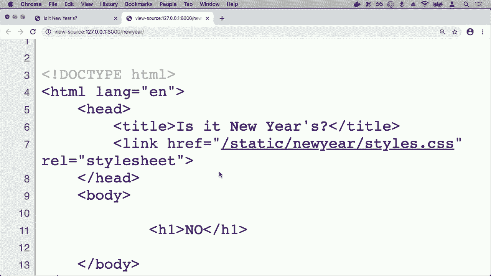

Django just uses slash static slash and，then whatever the files happen to be and。

so anytime we're dealing with static，files files that don't change like CSS。

files or JavaScript files we'll take a，look at later in the course that's。

generally where they're going to go as，some sort of static file that we're。

going to ultimately link to this，particular page so now we've seen a。

couple of examples of web applications，we can make using Django we've seen the。

hello app in Django that can，parameterize URLs the depending on the。

URL we visit can say hello to Brian or，hello to David or hair you're on or。

Hermione and we've seen the ability to，using Django add some conditions to be。

able to conditionally say if something，is true render this page if something。

else is true render another page let's，now use these features plus some。

additional features to begin to build a，more sophisticated web application。

something like a to do list that maybe I，want a web application that gives me a。

list of tasks that lets me add new tasks，to my to-do list and lets me view all of。

the tasks that are currently on my list，and I'd like to build this up one step。

at a time so where can I start with this，well this again is going to be a new app。

inside of my lecture 3 project I have，two apps so far a Hello app and a app，to do is。

a third app that I'm just gonna call，tasks that is going to be my task。

management app that's all under this，umbrella lecture three project so we'll。

go ahead and run Python men in shop I。

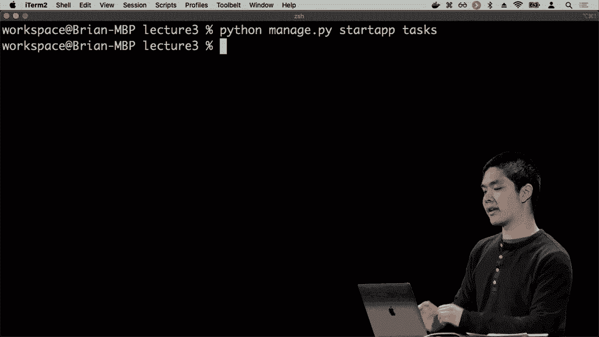

start app tasks to say I'd like to go，ahead and create a new app called tasks。

anytime I create a new app a couple of，steps I need to follow recall that I。

need to go into settings PI inside of，lecture three to say that in addition to。

installing hello a new year I'd also，like to install the tasks app for。

example then I need to go into URLs PI，inside of lecture three to say that in。

addition to hello a new year I'd also，like for us to include the URLs for。

tasks this URLs is again the table of，contents for my entire web application。

where in my web application if I visit，slash hello then we go to the URLs for。

the hello up if I go to slash tasks then，I go to the URLs for the tasks app so on。

and so forth that tells me all of the，different URLs but I now have access to。

and as with before the URLs file isn't，created for me inside of my application。

so I will need to go into the tasks，directory and inside of the tasks。

directory I'll go ahead and create a new，file that I will call URLs PI and the。

format of this is going to be very，similar to what we've already seen from。

Jango URLs import path from dot import，views and now I define my URL patterns。

where I would like a path that is just，the empty string the empty path for now。

that loads the index function whose name，is index for example so now let's。

actually write this index function，inside of used-up I what I'd like to do。

is define a function called index that，accepts a request and what I'd like to。

do is render a page that displays a list，of all of my tasks so before we get to。

the idea of adding tasks let's just see，if we can get our program to display a。

list of tasks for example so I'll up at，the top create a global variable but。

I'll just call tasks that the entire，application is gonna have access to and。

I'll add three tasks to it for now we'll，just use foo bar and that's。

sort of nonsense names that are just，useful strings for testing purposes just。

placing those as sample tasks that I，might want to have inside of my。

application and now what I'd like to do，is render a template the template I'd。

like to render will be called tasks，slash index。html and then I'll provide。

some context to it some information that，index。html needs what information does，index。html need。

well index。html needs access to all of，my tasks and where all of my tasks while。

they're inside of this variable that，just happens to also be called tasks and。

this will be something we see quite，often as a paradigm in Django where we。

see a key and a value that look like，they have the same name the key。

distinction is whatever is here on the，right after the colon this is the value。

the variable takes on this is a Python，variable like this Python variable tasks。

here on the Left this key the string，tasks that is the name of the variable。

that the HTML template will have access，to when Django is rendering it so Django。

has access to this variable name on the，Left that has this value on the right if。

you see this paradigm that's ultimately，what that's going to mean and now what I。

need to do is create this indexed of，HTML file and make it use this tasks。

variable somehow how might I go about，doing that well I can go back into my。

tasks directory create a new folder for，my templates so I'll create a templates。

directory inside of which is a tasks，directory because the template that I'm。

rendering again is tasks slash，index。html and inside of tasks I'll，create a new file called index。

html，inside of which will include some HTML，I'll include just the standard starting。

HTML the title will be tasks and now，we'll have the body of the HTML page。

that I want to display all the tasks，inside of an unordered list for apps and。

if you recall from HTML to create an，unordered list it looks a little，something like this。

ul starts the unordered list and each，list item is an li tag like item 1 and。

then item 2 and then item 3 something，like that gives me an unordered list。

that has three elements inside of it，but I don't want to do this now because。

I don't want to hard-code or exactly，specify what all of the tasks are going。

to be what I really want to do is loop，over this tasks variable here looping。

over all of the tasks inside of it and，creating a list item for each one of。

those tasks and just as in before where，we could use if inside of curly braces。

and percent signs to use the condition，likewise we can use for to say something。

like for tasks in tasks I would like to，display a list item and then using these。

double curly braces I'm saying plug in，the tasks here in between these list。

item tasks I would like to plug in。

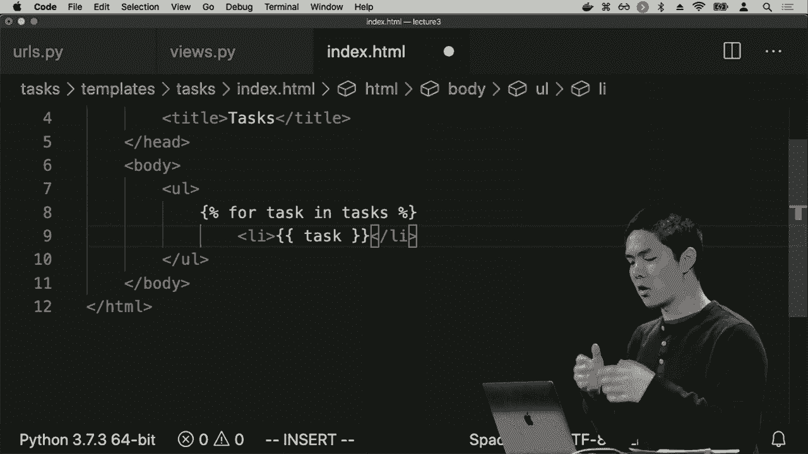

whatever the value of the tasks variable，is and then I'll go ahead and end the。

for loop there so what I've done here is，rather than add a condition into a。

template which we've already seen I now，have the ability to add a loop into an。

HTML template using Django to say that，for tasks in tasks I'd like to loop over。

all of the elements inside of this，sequence called tasks and for each one。

of those individual tasks I would like，to display a list item in HTML that。

includes whatever the value of the task，happens to be and and for just like and。

if into the S statement and for is going，to end the for loop so this syntax now。

rather than give me exactly the same，number of list items every time with。

exactly the same content will be dynamic，whatever the value of tasks is we will。

now see on this page each one as a list，item and we can test this right now if I。

actually run this application by going，to Python manage PI run server I'll go。

ahead and go to this URL，the default URL has no page but if I go。

to slash tasks well then here is what I，see I see an unordered list that has foo。

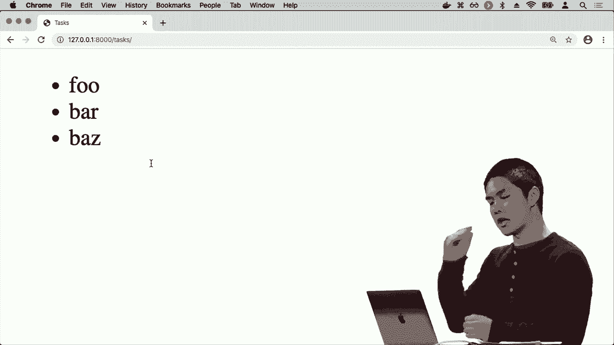

bar and Baz each one is a list item and，if I view the page source to see what。

the actual HTML is here's what I see I，only wrote one Li tag inside of my。

template but because I put it inside of，a for loop that iterates over each of。

the tasks what I ultimately get in the，HTML that comes back to the user is one。

list item for each of the elements that，was originally inside of that list。

so I don't have the ability to loop over，a list in order to generate that list of。

tasks of course it is still no way to，like modify any of these tasks what we。

