# 【双语字幕+资料下载】哈佛 CS50-WEB ｜ 基于Python ／ JavaScript的Web编程(2020·完整版) - P11：L3- Django网络编程 3 (表单与session) - ShowMeAI - BV1gL411x7NY

it just so happens to be rendering using，a loop what I'd maybe like is another。

page that will allow me to add in new，tasks a form effectively it lets me type。

in a new task and press add in order to，add a new task so let's do that inside。

of you stop by I'll define a new，function that I'm going to call add and。

what the add function is going to do is，render tasks slash add dot HTML in order。

to know when to run the phew I need to，give this view a URL so I go into URL。

spy and add a new path when I go to the，a drought I want to go to the view add。

function and I'll call this function add，for example and so now when I go to。

slash task slash ad it's going to call，the add function inside of views and。

inside of use here it's going to run，this function that will render add dot。

HTML so let's go ahead and now write a，dot HTML will go into templates I'll。

create a new file called add dot HTML，and you know what add HTML syntax is。

very similar to the syntax from index，dot HTML in terms of what the HTML。

content is so I'll go ahead and just，copy this whole page from index dot HTML。

paste it into add dot HTML the only，thing that's different is the body of。

the page we're instead of an unordered。

list that displays all the tasks and，instead like a form where that form has。

an input whose type is text and maybe，this input field has a name called tasks。

such that I can access that input data，later and an input whose type is submit。

for example and maybe I'll give it a big，heading at the top that says like add。

tasks for example so now I have a new，route that adds a task so my default。

slash tasks route just displays a，bulleted list of all the tasks and if I。

go to slash tasks slash add here now is，can type，tasks press submit that right now does。

nothing but that ultimately I hope will。

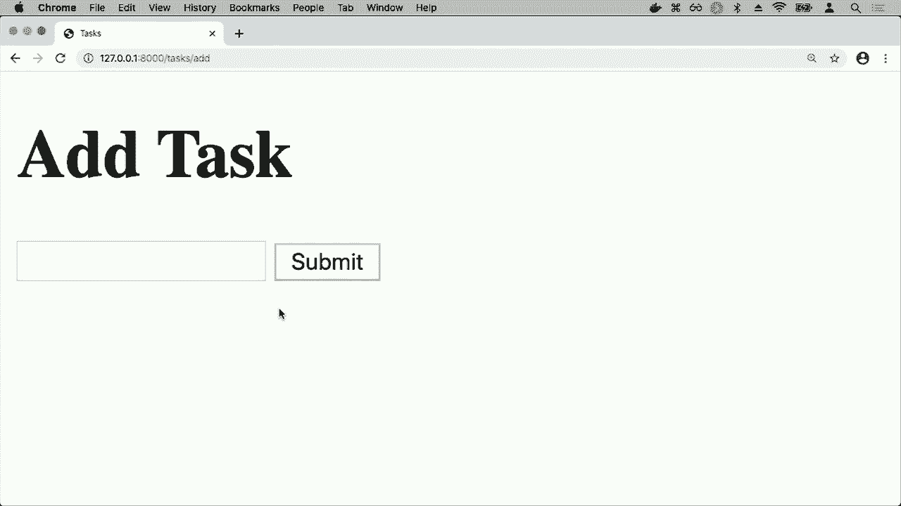

actually add a new task of course，something I just did there should strike。

us as not the best design in particular，the decision I made was because the。

general structure this HTML page is so，similar it's got the HTML tag it's got a。

head the title of the page is tasks，ultimately I just copied all of the，content of index。

html and pasted it into，this new HTML page ad dot HTML and any。

time you find yourself copy pasting this，should be another area where you start。

to think there's probably a better way，to do this and with just pure HTML there。

kind of wasn't if we wanted multiple，different HTML pages that displayed。

similar content we needed the same HTML，on all those different pages but now in。

the world of Django we have the ability，to use something called template。

inheritance what I'm now going to do is，define an HTML file called the layout to。

some file that the other files add HTML，and index。html are going to inherit from。

they're going to inherit from my layout，all of the structure of the page that's。

the same on both of the pages and all，ivn need to write is what differs。

between the pages and as I mentioned，before the only thing that differs。

between a dot HTML and index dot HTML is，the content of the body of the page over。

here so what can I now do well I will，create a new file inside of my template。

slash tasks directory called layout HTML，and layout is going to have the basic。

layout that is common to both of these，pages I have a title whose title as。

tasks I have the body of the page and，maybe there's more in common with both。

of the pages as well that I could add，but right here this in between the body。

tags this is the body of the page that，is going to change between each of the。

different pages so to denote this inside，of a new layout in Django I'll again use。

the curly brace and % I'll call this a，block and then I'll give this block a。

name I'll call it body just cuz it's the，body of the page but I could give it any。

name and then I'll add an end block at，the bottom here，and so what I've now said inside of this。

layout file is that this layout file has，a body inside of this structure of the。

page and inside the body is this block，called body and what I'm saying here is。

this block might change depending on，which file we're using add dot HTML or，index。

html the rest of the structure，won't change but the content of this。

block this block called body might，change and so now what I can do inside。

of index dot HTML and add dot HTML is，instead of including all of this logic I。

can get rid of everything other than the，key part of the page that's going to be。

different about index dot HTML the only，thing different about index dot HTML is。

this unordered list and what I'll I now，include at the top of index dot HTML is。

I'll say that this HTML page extends，tasks slash layout cut HTML so this is。

now this idea of template inheritance，I'm inheriting from the layout an HTML。

template basically saying use the layout，at HTML template except inside of block。

body I would like to include all of this，content and maybe I'll give it a h1 that。

just says tasks just as a title as well，and so now what index。html is saying is。

rather than need to include all of that，HTML all I need to say is this HTML file。

is based on the layout HTML file but the，difference is that inside the body of。

the page it's going to be this，particular content here and for add dot。

HTML I can do exactly the same thing I，can just add this line extends tasks。

slash layout that HTML to the top of a，dot HTML and then I can get rid of all。

of this boilerplate code so to speak and。

just include the part of the page that，differs inside the body of the page and。

so it seems like we've done a fair bit，more work for just these two pages but。

if you imagine more complex websites it，might have dozens or hundreds of。

different pages the ability to factor，out the HTML the pages have in common。

can definitely be very helpful just for，good design to be able to make sure。

we're not repeating ourselves and if we，ever need to change，the structure rather than change it in。

dozens or hundreds of different places，we just change it in one place inside of。

the layout file and the result of that，is that it's going to change in each of。

the pages that inherit from that page as，well and we can test this by just going。

back to slash task flush atom which，looks fine and back to tasks looks fine。

to both of these pages now our，inheriting from that basic layout now。

it's a little annoying that anytime I，want to switch between this page and the。

add page I have to go to the URL and，know that I need to go to slash tasks。

slash ad in order to get back and forth。

between them so I might like to add a，link that takes me from one page to the。

other and vice versa and I can do that，if I go into index dot HTML you might。

imagine that I could just add a link，here a href to create a link let's go to。

slash tasks slash ad and like add a new，task maybe the name of that link except。

the problem is or the reason why this，isn't necessarily good design is the。

Django is designed to make it such that，it's very easy to change the structure。

of the pages in terms of how the URLs，all relate to each other and I have here。

hard-coded that when you click this link，we go to slash tasks slash ad and if。

ever I wanted to change that URL maybe，instead of slash Taft slash ad I wanted。

to slash new instead of slash ad well，then I need to change it in two places。

I need to go back to the URL stop pie，file to change the actual URL to say。

instead of ad it should be called new，but then I need to find every place。

where I use that URL and I need to，change it there as well so in order to。

deal with this django has an additional，feature that basically lets django。

figure out what the URL should be，instead and we do that by using the name。

that we gave to each of those routes and，so this is where that name becomes。

relevant that I can here just say link，to a particular URL link to the URL。

called ad so I just said link to URL，call dad and how Django figures this out。

is based on the contents of my URL spy。

file that inside my URLs that PI file I，defined a number of different paths and。

I gave each of those paths a name this，one was called index，this one was called ad and so when I did。

that I was able to say if you link to a，URL called a de Django we'll find a URL。

whose name is AD and linked me directly，to that route and so if ever I were to。

change the route to something else，Django would just figure out what the。

new URL should be and I wouldn't have to，worry about it Django would fix the。

problems for me and so now if I go back，to the tasks site I can click the add a。

new task button and that will take me to。

the add task and maybe now I'd like to，add a link that goes back so I can go to。

add dot HTML and maybe add a link it，down on the bottom a href equals and。

what URL would I like to link to。

well my default page was just called，index so I'll go ahead include the word。

index I'd like to link to the URL index，and then view tasks maybe as the name of。

the link so now if I go to just the，default tasks page I see a link to go。

out a new task and now I see a link，that's going to take me back to the。

ability to view tasks and when I click，on that link，I see no and now that's probably not。

what I wanted I wanted to go back to the，index page for my tasks application but。

it seems that when I clicked on View，tasks I'm taken to know and what's going。

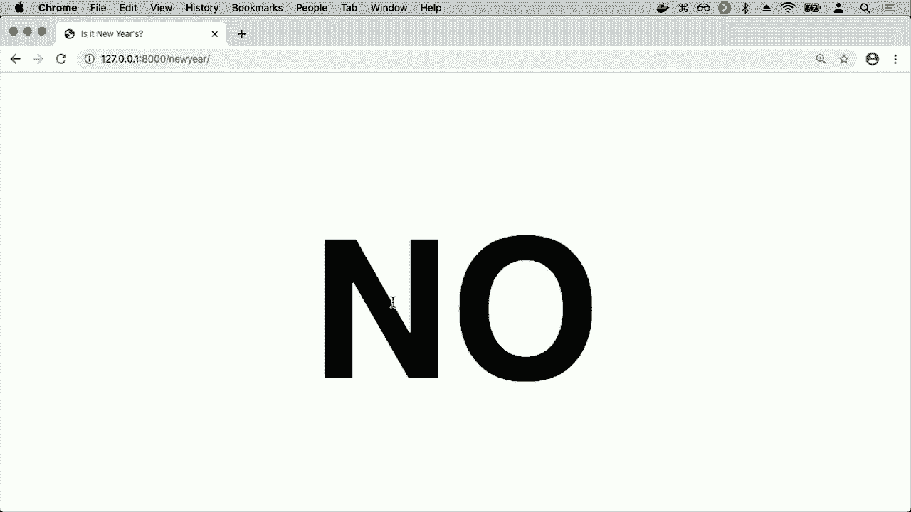

on here well if you look at the URL the，URL is slash New Year somehow I was on。

the tasks app I clicked a link and I'm，back at the New Year app how did that。

happen well turns out this is an example，of a namespace collision where I have。

two things that all have the same name，and in this case what's happening is。

that I have a URL spy file for my tasks，application where I have a route called。

add and a route called index but it just，so happens that inside of the New Year。

folder if I go up to New Year and I look，at New Year's URLs top I file the new。

year's URLs DUP pi file also has a path，whose name is index and so what I said。

was create a link and I would like that，link to link to the thing that has the。

URL with a name of index and it turns，out there were multiple things that all。

had a name of index and so Jane Doe，didn't know which to choose and it just。

chose the New Year one and you might，imagine that linking between apps is。

something you might reasonably want to，do you want，- from Amazon's shopping page for。

example be able to click a link that，takes you to Amazon video or you want。

from Google search to be able to click a，button that gets you to Google Maps but。

in this case this isn't quite what I，wanted there's a namespace collision。

where two things have the same name that，I would now like to be able to fix and。

the easy way to fix this is inside of，URLs by for my tasks application let me。

just give each of these URLs an app name，called tasks this just helps uniquely。

identify all of the URLs because now，inside of a dot HTML rather than just。

linked to a URL whose name is index I'm。

going to instead link to tasks ： index，to mean from tasks the tasks app get the。

index URL and likewise inside of，index。html a link to tasks ： add to get。

it that particular route from this，particular application name so now if I。

go back to the site go back to my tasks，page now the links work as expected I。

can get to the new tasks and I can get，back to the list of all of my tasks as。

well so this now works I know have these，two pages one that displays my list one。

that displays my ability to add a new，task but the form to add a new task。

doesn't really do anything right now，I type in a task I type in like foo if I。

want to add a task called foo and I，press submit and like nothing happens。

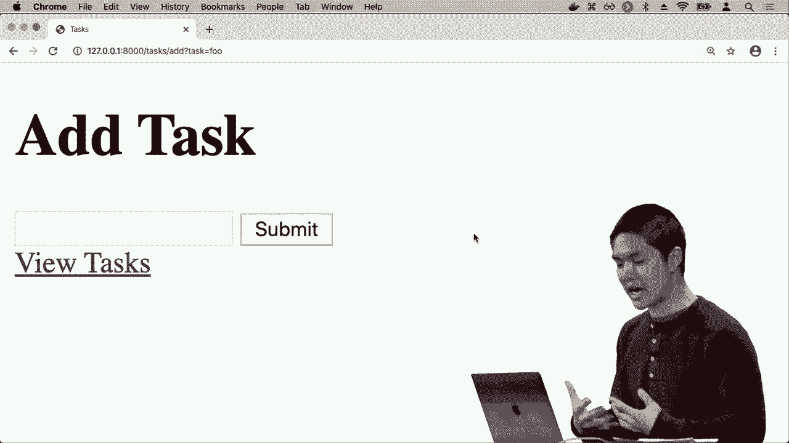

nothing changes meaningfully on this，site so I'd like for this form to do。

something and we've seen that we can add，an action to a form to be able to take。

that form and submit it somewhere and，that's what I'd like to do when I add a。

new task I'm going to add an action to，this form and when I submit the form。

what URL would I'd like to submit it to，well I'll go ahead and submit it back to，the URL for tasks ：

 ad I'll send it back，to that ad URL when I submit the form，and I'm gonna give this form a specific。

request method its method is going to be，post and so we've already seen a request。

method of get any time you type in a URL，or click on a link to go to another page。

if the request method implicitly，associated with that request is called，a。

particular page anytime you're，submitting data that has the potential。

to change some state inside the，application like changing the state of。

the list of tasks that is stored inside，the application then we'll generally use。

a different request method called post。

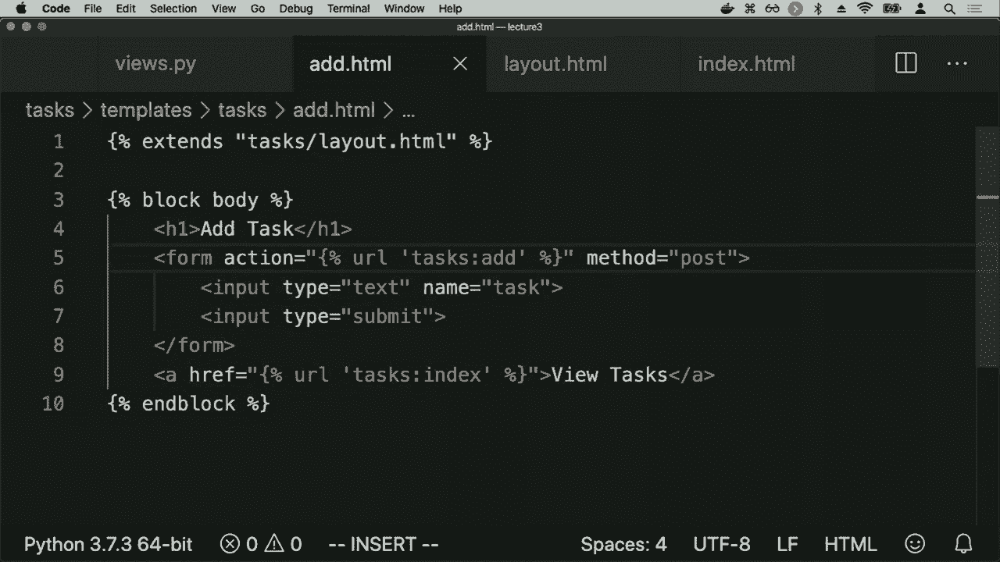

post was generally used for submitting，form data it doesn't include parameters。

inside the URL the way a get request，does as we saw with Google for example。

but this post ability is going to give，us the ability now to send data by a。

different request method to my add route，and so let's now give this a try now I'm。

going to go to task slash add I see the，ability to add a task and maybe I'll add。

a task like check email or something and，press submit and alright I get an error。

forbidden this 403 in parentheses means，that is the response code that came back。

this is an error that Django is，generated for me，so this 403 as we saw before means。

forbidden I don't have permission to do，this for some reason now why don't I。

have permission to submit this form it。

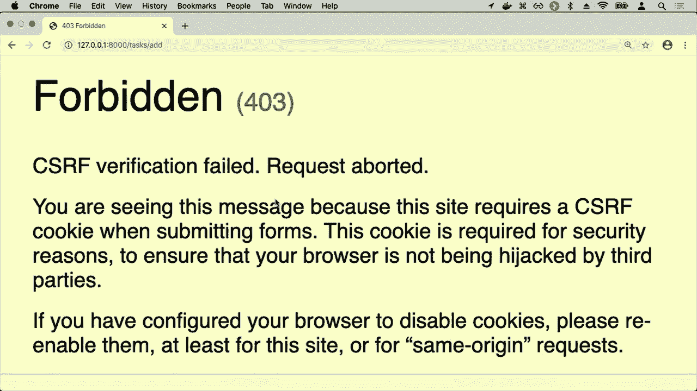

says CSRs verification failed so CSRF，stands for cross-site request forgery。

and what that means it is a security，vulnerability that is inherent in some。

forms if they're not designed in a，secure way meaning that someone could。

Forge a request to a particular web site，using some form on their own separate。

web site for example you might imagine，someone on a different website might。

trick the user into submitting a form，that submits its data to our ad task。

function that adds a new task to their，task list and maybe that's not a big。

deal for tasks but you might imagine in，more secure contacts more sensitive。

context like a bank for example they，might have a form on their website for。

transferring money from one user to，another and if they're vulnerable to。

this sort of attack cross-site request，forgery someone else on a different。

website could trick the user into，submitting a form where it submits form。

data and it goes to the bank's website，to say I would like to transfer money。

from this one user to another user so we，would like to be able to design forms。

that are not vulnerable to that，particular security vulnerability that。

don't allow for request to be forged by，another website so how can we go about。

doing this well one strategy that can be，used in order to deal with these sorts。

of attacks is to add in，to our forum a hidden cross-site request。

forgery token or CSRF token which would，just be some unique token that's。

generated for every session so every，time a different user visits this。

particular forum they see a different，CSRF token and then when the user。

submits the form they're submitting that，token with the form and our web。

application is going to check to make，sure that that token is indeed valid and。

if it is valid then they'll allow the，form submission to go through but this。

means that an adversary wouldn't be able，to fake a request to our website because。

that adversary doesn't know specifically，what the generated token is so they。

would fail the check for CSRF validation，and it just so happens the Django has。

CSRF validation turned on by default and，it's done so via specific add-on known。

as django middleware middleware refers，to the ability in django to be able to。

sort of intervene in the request，response processing of a django request。

and if i look at the settings pi file if，you're curious for this particular web。

application inside of settings at pi if，we scroll down we see there's a whole。

bunch of middleware that's installed by，default inside of a django application。

in terms of making sure that we have，various different features hooked into。

this request response processing and one，of those is the CRS or CSRF view。

middleware this feature of Django that，allows it to make sure that our requests。

whenever we're submitting data via post，something that has the potential to。

change the state of the application in，some way that we need to have CSRF。

validation we need to add some sort of，token to our forum to make sure that。

Django is able to authenticate the ver，the validity of this form to make sure。

they know the form actually came from，the web application itself and it's。

quite easy to be able to add this token，into our HTML page Django has a built in。

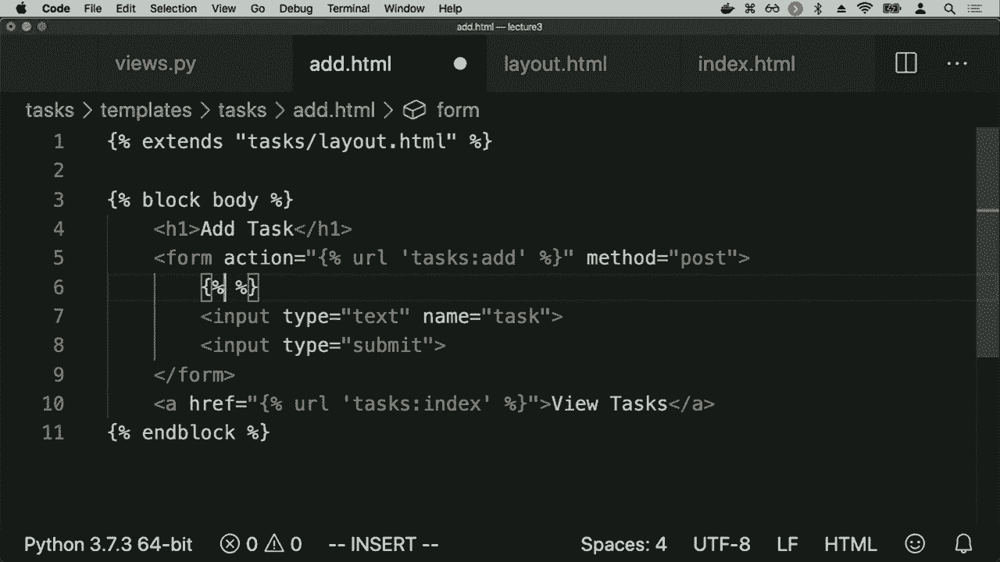

inside the curly brace and % we can just，say I would like to add into this page。

of the CSRF token for example to go，ahead and fill in the CSRF token right。

there if I now go back to the page and，refresh the page now I see ad tasks but。

if we're curious I can now actually go，and view the page source I can look。

inside this page and here now is the，form and this is the form same as we saw，before but you。

notice the Django has inserted this，additional input field this input whose。

type is hidden meaning we won't be able，to see it normally whose name is CSRF。

middleware token and here is its value，some long string of characters the。

Django has generated for me such that，when I submit this form it's going to。

check to make sure this token is valid，and if it doesn't find this token it is。

not going to accept my form submission，and if someone else goes to this Web。

site they're going to see a different，token presented to them as well and that。

helps to make sure that nobody can forge，these sorts of requests so now if I type。

in a task that I'd like to add something，like check email and press submit。

now the forum it does submit without，errors of course it doesn't do anything。

if I go back to my task list it's still，empty but at least I've now been able to。

submit that form it's worth noting that，inside of a dot HTML we created this。

form sort of from scratch I created an，input field whose type is text in whose。

name is task but creating forms is，something that happened so often in the。

world of web programming oftentimes with，many different fields that you might。

want to change over time the drain goes，added a number of ways to make it easier。

to create forms to validate the data，inside of those forms just to make our。

lives a little bit easier when it comes，to dealing with and interacting with。

forums and so now we'll explore an，alternative way of doing the same thing。

what we did here just works we can，create a form just using raw HTML as。

we've seen before but Django also has，the ability to create forms for us so in。

order to do this I'll go into views pie，and at the top ad from Django import。

forms and now I'm going to create a new，class to represent this form I'll create。

a Python class that I'll just call new，task form since we'll use it to create a。

new task it will inherit from forms dot，form and now inside of this class I need。

to define all of the fields I would like，for this form to have all of the inputs。

that I would like the user to provide，them and so I want them to provide the。

name of a task which will be a character，field or a char field meaning I want the。

user to type in characters and I can，give this a label call it new tasks for。

example and now what I can do is when I，render ad/hd ml I can add some context。

and say give this template access to a，variable called form，which will just be a new task for I'm。

gonna create a new task form pass it，into this add HTML template and now。

inside of add HTML instead of writing，the input whose type is text name is。

task haven't having to do that on my own，I can just use double curly braces and。

say plug in the form here and that will，automatically take care of Django will。

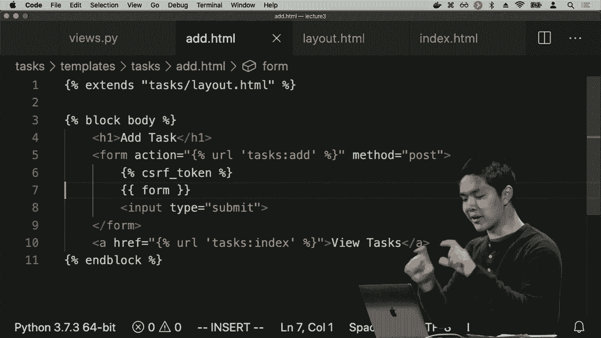

generate the necessary HTML to make that，form work so if i refresh this page now。

i see that here is the form the Django。

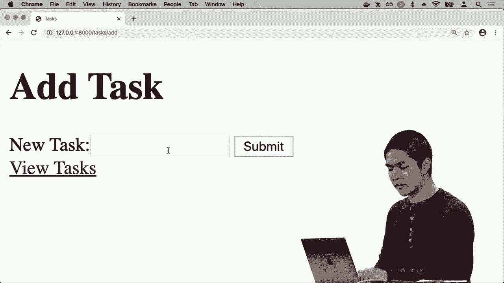

is created for me it's created an input，field it's given it a label of new tasks。

so I know that it's where a new task，should go but now rather than needing to。

edit the HTML anytime I want to change，the form data that's involved inside of。

this application I can just change this，new task form if maybe I want to。

eventually make upgrades to my，application where in addition to。

specifying a text field where I can type，in the new task maybe I also want to be。

able to specify a number indicating the，priority that task should have I could。

additionally give this form access to a，priority variable which is an integer。

field whose label is priority and I can。

even add constraints on this to be able，to ensure that it's valid data I can。

give it a mini B 1 and a max value of 10，for example in order to add all of that。

and now without touching anything in my，HTML I just changed the form itself。

inside of my Python code now if i，refresh the page I see an additional。

field I see an opportunity for me to，type in a new task and I see an。

opportunity for me to specify some，priority and of course you could add CSS。

in order to style this up a little bit，nicer but now Django will automatically。

do client-side validation where if I，type in a new task like check email but。

I don't specify a priority and submit it，it tells me to fill it out if I type in。

a number that's in an invalid range I，only want two numbers from 0 to 10 it。

fills it out and this is all what we，would call again client-side validation。

the server isn't getting any of this，data it's just the web page has been。

encoded to know what the valid values，are and it's going to constrain me to。

make sure that I'm typing in something，that matches those values but in general。

when we're doing form validation when，we're making sure that forms are valid。

data we want to somehow make sure to，include not only client-side valid。

but also server-side validation we also，want to check on the server to make sure。

that inputs are value valid as well，because there are many reasons why this。

we might want to be able to do this one，is that it's very easy to disable the。

sort of client-side validation or just，submit a request without doing any of。

the client-side validation and maybe if，the user is looking at an old version of。

the page the validation we're doing on，the server is more up-to-date than this。

client-side validation as well and，Django's forums will make it very easy。

for us to do both of these things both，the client-side validation and the。

server-side validation as well so how，does this work how do we do that。

well inside of the add function this add，function now gets called in two。

different ways depending upon the，request method if I try to get the add。

page and by just clicking on the link，for add a new task or going to the URL。

of slash ad then I want to just render a，new blank form but if I post data to。

this page by using the post request，method instead of get that means I'm。

submitting the form and I now want to，submit a new task to be added to my list。

of tasks so I'd like to add a check for，that I'm going to add a condition here。

that says if request dot method equals，post well then here what I'd like to do。

is process the result of that request，and the way you do that in a Django form。

is by creating a new variable called，form which will be a new task form and。

if I just use new task form with two，parentheses like I did before that。

creates a blank form but you can also，populate that form with some data and if。

I populate it with request dot post what，that is going to do is request stop post。

contains all of the data that the user，submitted when they submitted the form。

and so what I'm doing now is I'm，creating a form variable by taking all。

of that data and filling it in to this，new task form which will contain now all。

of the data the user submitted and you，could imagine checking this manually but。

I can just call if form dot is valid and，inside this if statement use some logic。

using the cleaned data as a result of，using this form and so inside of a。

variable called form dot cleaned data，that will give me access to all of the，data the。

are submitted and so if I want to get，like what tasks they submitted because I。

had a variable here called tasks inside，of a new task form well I'll just go to。

form dot clean data and then task and，I'll go ahead and save this inside of a。

variable called tasks and now what I，might like to do is add this task to my。

list of tasks go tasks dot append this，new task so that's what we do if the。

form is valid if the form is valid we，take the data from the form get the task。

save it inside this variable called，tasks and add it to my growing list but。

else if the form is not valid what。

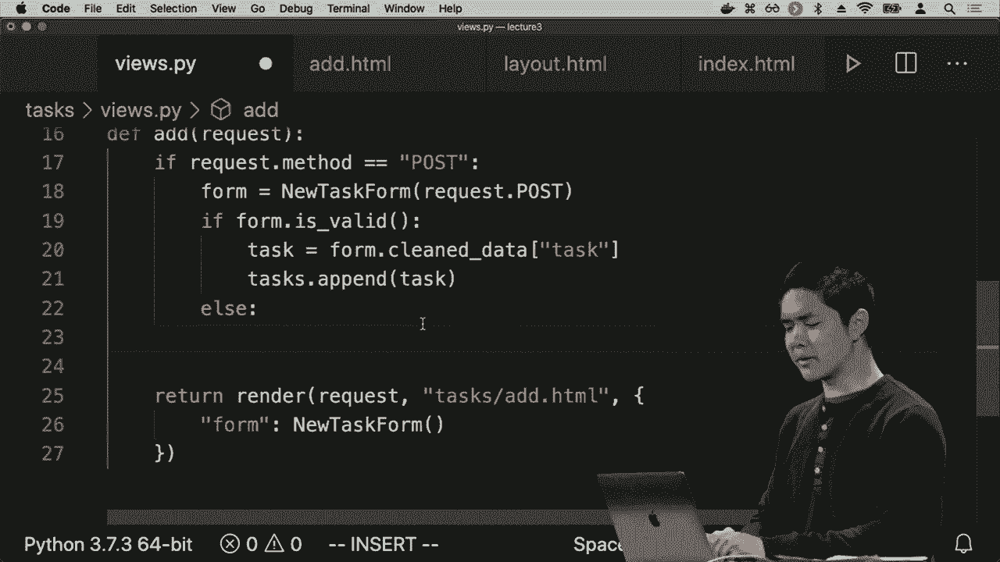

should we do instead well then I should，return the add dot HTML file again but。

instead of providing the form back to，them view a new form back to them。

I'm gonna send back the existing form，data back to them so we can display。

information about any errors that might，have come up as well so what does this。

now look like let's show an example and，then I'll go back to the codes you can。

see in better detail how it works，here's task / atom recall that if I type。

in a task like check email and a，priority that's not valid out of range，like 11 and press submit。

it says value must be less than or equal，to 10 but let's now imagine a situation。

where the client and server are，validating different things that maybe。

I've now decided you know what priority，instead of being from 1 to 10 can only。

be from 1 to 5 that's now the valid，range for priorities but this client。

which is still an older version of the，page doesn't know this so it thinks that。

a priority of 8 is still valid and it's，going to pass client-side validation but。

now I press submit and the server is，going to process it and because it's。

invalid it gives me back the form and，gives me an error ensure this valid。

value is less than or equal to 5 and so，this now is why we generally want both。

client and server-side validation to，make sure that the data we ultimately。

get is going to be accurate and it's，going to be clean matching whatever。

specification we set out when we were，creating that form for the first time。

and so for the purposes of now we're not，going to really worry about priority too。

much because we just really care about，what the task is but just know that if。

you wanted a form that had multiple，fields you could add additional fields。

in this form input as well so now we've，added some application logic to our。

route that checks to make sure that the，form is valid or not if we take a look。

at what the add function is really doing，we're checking if the request method is。

post meaning if the user submitted some，form data then we figure out all the。

data they submitted and save it inside，this form variable we check to see if。

the form is valid did they actually，provide a task or they may be providing。

all the necessary data in the right，format if so then we get the task and。

add it to the list of tasks otherwise if，the forms not valid then we go ahead and。

render that same add HTML file back to，them but we pass in the form that they。

submit it so that they can see all of，the errors they made they can make。

modifications to their own form，submission if they'd like to and then。

otherwise meaning if the request method。

wasn't post at all if the user just，tried to get the page rather than submit。

data to it then we're just gonna render，to them an empty form and this sort of。

paradigm is actually quite common when，we're dealing with requests and。

responses that oftentimes pages that，have forms will want you to first be。

able to get that form via the get method，to just get the page in order to display。

the contents but those routes will also，often support a post method where you。

can post data to those routes in order，to say I would like to now submit data。

to a particular route in order to get，some sort of results some sort of。

addition to a list of tasks transferring，money in a bank from one account to。

another for example or something else，entirely，but watch what happens if I now try。

inside of tasks add to add a new task，that's valid something like check email。

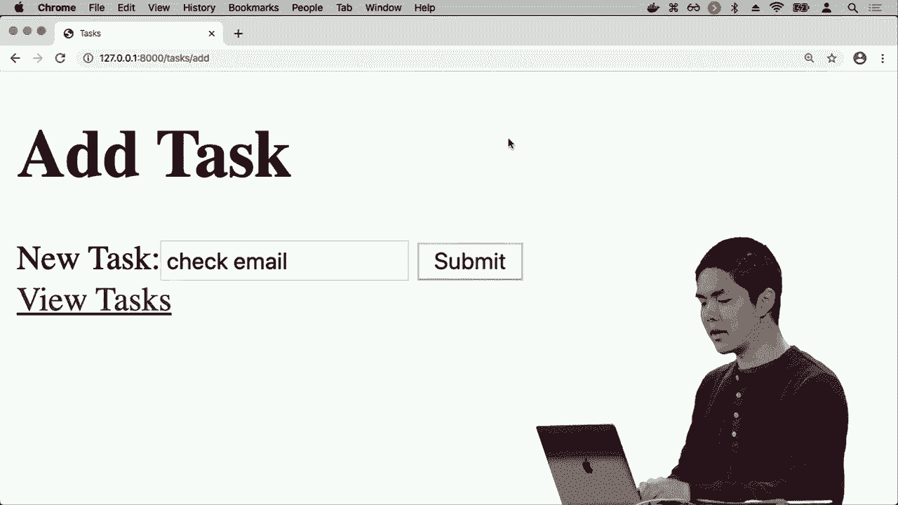

for example I press submit and alright。

nothing quite seems to happen because I，just get back this new task form but if。

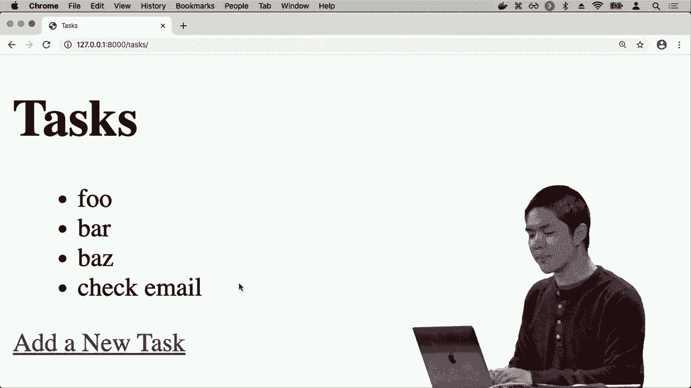

I go back to view tasks now I see that，Trek email has been added to my list of。

tasks the original list of tasks just，had fubar Baz and now we've added check。

email to it but this wasn't quite the，behavior that I might have expected。

maybe I wanted that after I submitted，the task form to add a new task I would。

like to be redirected back to this page，easy，for us to be able to redirect users from。

one page to another in order to do that，after we add a new task to my list of。

tasks I'm going to return an HTTP，response redirect and redirect the user。

to a particular route I could redirect，them to just like slash tasks for。

example but again we generally try not，to hard code URLs into our application。

so better design would be to say let me，give you the name of the route and go。

ahead and reverse engineer what the，route actually is from that and so in。

order to do that we can use the function，called reverse built into Jango and say，tasks ：

 index to say figure out what the，URL of the index URL for the tasks app。

is and use that URL as the one that we，ultimately redirect to when we return。

this HTTP response redirect in order to，use these we need to import both of them。

so from the top I'll say from Jango HTTP，import HTTP response redirect and from。

Jango URLs ago at an import reverse so，now I've imported both of these and now。

the effect of this is that after I，submit a new task and add it to my list。

of tasks I'm going to be redirected back，to the index page of my tasks。

application and for good measure I'll go，ahead and start us off with an empty。

list to get rid of the foo bar Baz that，we saw there originally。

so tasks start out as the empty list now，refresh the page I see no tasks in here。

by default but if I add a new task I，type in something like check email press。

submit I now see that added to the tasks，list and I get redirected back to the。

tasks page I can add a new task，something like do laundry press submit。

and that gets added to my tasks list as，well too so by maintaining this global。

variable called tasks and updating it，anytime I submit the form I've been able。

to dynamically grow this list of tasks，inside of my application and display all。

of those tasks here inside of my HTML，page however there's still one big。

problem with the application that I，built and it goes back to the idea that。

I've stored these tasks inside of a，global variable this variable is，something me and。

haier application has access to which，means that anyone who visits my website。

is going to be able to see the same，exact list of tasks and we can simulate。

this by imagining someone else visiting。

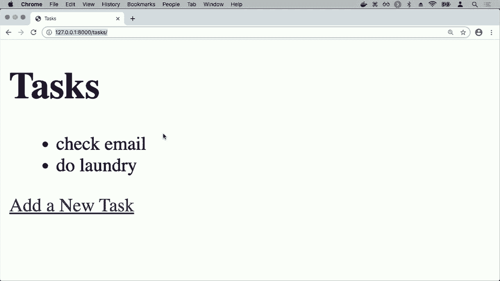

this URL which I can simulate in Google，Chrome by opening an incognito window to。

simulate a different session a different，person interacting with the page and。

going to the same URL what they see when，in the incognito window they go to the。

same URL is they see the exact same list。

of tasks both me and another person see，the same list because there's just one。

tasks variable across the entire，application that is shared among all of。

the requests that come in to that，particular application and that's。

probably not what I want when I'm，dealing with something like a list of。

tasks I probably want it to be per user，such that if a different user visits the。

page they have their own list of tasks，as well and so in order to do this we'll。

introduce the concept of sessions in，Django or in the web more generally。

where sessions are away for one Django，to be able to remember who you are such。

that on subsequent visits it remembers，who you are and knows who you are。

but more importantly it's able to then，store data about your particular session。

it's able to store your user ID or，information about you or in this case。

it's able to store all of your tasks and，so in order to take advantage of。

sessions instead of having a global，variable called tasks we're going to go。

ahead and delete this and instead store，tasks inside of the users a session so。

inside the index route I'll include a，line like this I'll check to see if。

tasks is not in request dot session，meaning if I look inside the session and。

you can think of the session is like a，big dictionary representing all the data。

we have on file inside the session about，the user and if tasks is not in that。

session well let me add to request stop，sessions or session tasks and set that。

equal to the empty list and so what I've，done here is I'm looking inside of the。

session I'm looking inside the session，to see is there already a list of tasks。

in that session and if there isn't if，there isn't already a list of tasks in。

the session well then I'd like to create，it then I'd like to set request。

session squ*re bracket tasks equal to，the empty list if the user doesn't。

already have a list of tasks go ahead，and give them an empty list of tasks and。

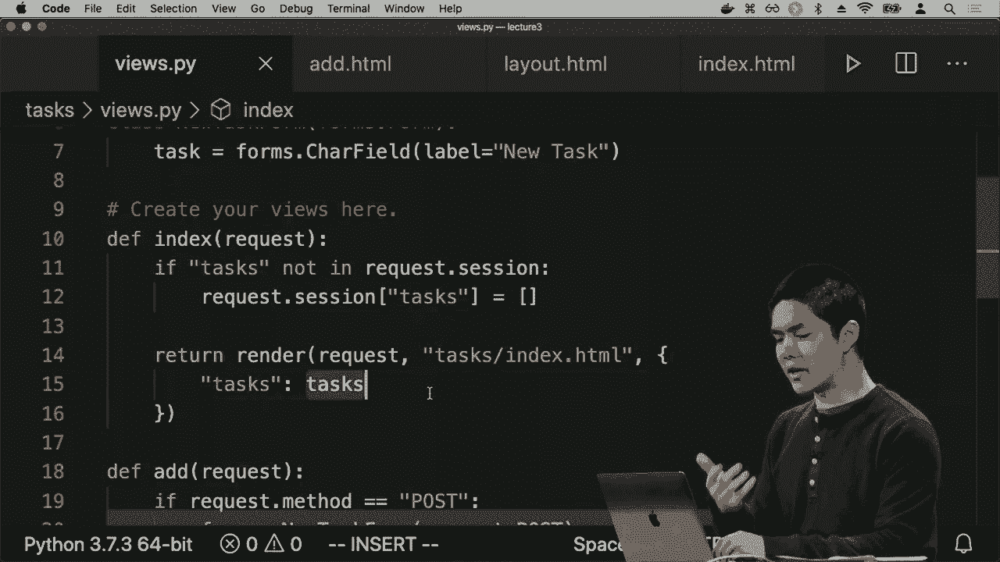

now here in tasks instead of rendering，the variable tasks which no longer。

exists I'll render a request dot session，tasks to pass in that list of tasks to。

this particular template and now in，index。html we're still looping over to。

that list of tasks and now we'll see if，I go back to tasks。

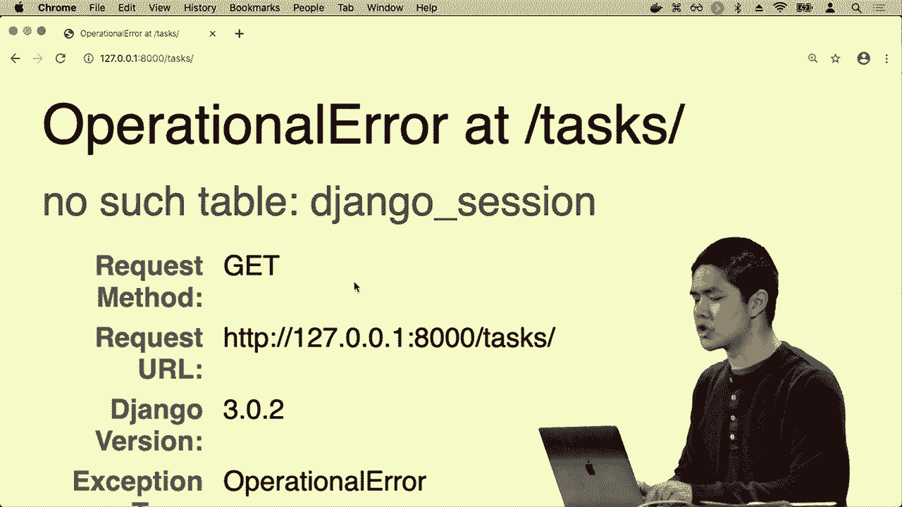

I see no such table Jango underscore，session so this is a bit of a stranger。

what's going on here no such table Jango，underscore session well it turns out as。

we'll see in the future Jango tends to，store data inside of tables and we。

haven't yet gotten to what that，ultimately means or how to manipulate or。

interact with data stored inside of，tables but Jango stores data about。

sessions that would happen inside of a，table by default now you can change this。

to have Jango stored data about sessions，elsewhere but ultimately Jango is。

keeping data about who you are and what，your tasks are and that data needs to be。

stored somewhere and by default Jango，wants to store it inside of a table and。

right now that table doesn't exist so we，need to create it and the way to give。

Jango access to that table that it wants，to create that it's been waiting the。

Krait board hasn't yet is to run this，command inside the terminal。

Python men in spy migrate will learn，more about what that means in terms of。

what a migration is and what it means to，migrate data into a database but for now。

just to know that Python managed to PI，migrate will allow us to create all of。

the default tables inside of Django's，database next time we'll take a look at。

actually creating databases of our own，adding tables of our own that store our。

own custom data but Jango has some，initial default tables that it wants to。

create and running Python managed on pi，migrate allows for those tables to be。

created now that those exist I first。

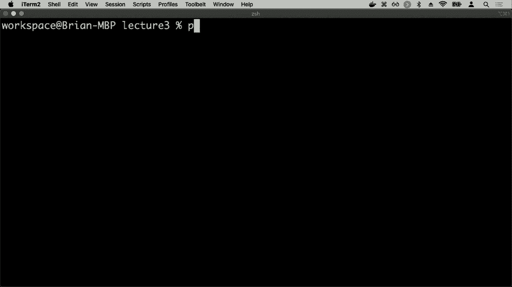

need to run the server some Python。

managed up I run server I load the page，and here now is my list of tasks there's。

nothing here so when I loop over all the，list items it's sort of empty which。

maybe isn't the best user experience or，user design so what I might want to do。

is add an additional condition it turns，out inside of index。html whenever I have，a for loop。

inside of a django template I can also，add an empty condition to say if I run。

the for loop but it doesn't run at all，because the sequence is empty well then。

let me just say like no tasks for，example and this is just a nice-to-have。

feature of the django language that just，makes it easy for us to be able to deal。

with situations where we're iterating，over a list and there's nothing in that。

list so now i refresh the page，no tasks exactly what I would expect to。

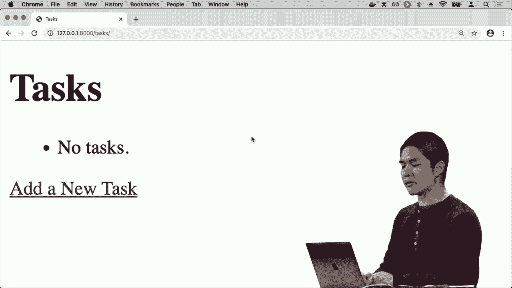

see and now this index route seems to be，working fine，what now needs to change when it comes。

to adding a new task well rather than，append the task to my list of tasks let。

me go ahead and say request session，tasks because that is my list of tasks。

and let me add to request out session，tasks this new task and adding to it a。

new sort adding a list to the end of it，that just contains the one new task that。

I got from the form so when the form is，submitted we check to make sure the form。

is valid we get the task the user，submitted and we append that to the list。

of tasks that's already stored inside of，the session before redirecting the user。

back to the index page so let's give it，a try we'll go back to the few r。l back。

to tasks I see I have no tasks initially，and now I can go ahead and add a new。

task type in something like check email，press submit and right now that's added。

add a new task something like do laundry。

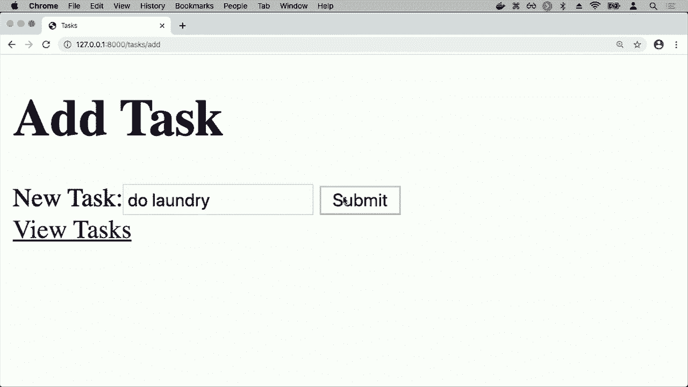

submit and now both of those tasks are，there but now importantly if you imagine。

someone in Inc in an incognito window or，on a different computer visiting my same。

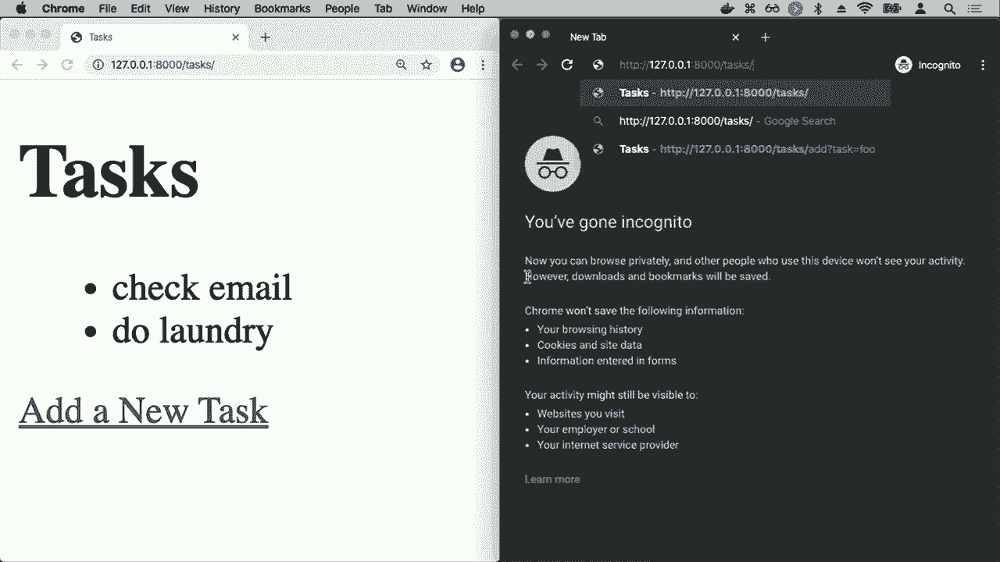

web site going back to this page what，they see is an entirely different list。

of tasks because they have a different，session those sessions are determined by。

cookies these little hand *** that，help the browser to be able to give some。

information to Django's web server to，say here is Who I am so Django knows。

what data to show you and in this case，my original case，Django knows who I am knows to show me。

these tasks and in this case is a，different user in incognito window in。

this case and so what they see is a list。

that has no tasks inside it at all so，now we've really just scratched the。

surface of what Django has to offer but，we see now the ability it has。

to be able to create dynamic web，applications instead of just displaying。

HTML and CSS that's the same every time，using Django we now have the ability to。

be able to generate programmatically，custom HTML and CSS either saying hello。

to a person's name based on what name is，provided inside of the URL or the。

ability to say to check the current date，and conditionally display something if。

the date is one thing versus another and，the ability to store data on a session。

basis to be able to store information，about a user's to-do list for example。

such that on subsequent visits they can，see their list of things they need to do。

with a different list for each of these，possible users and here really is just，offer。

where Django gets very powerful is when，it comes towards storing data inside of。

databases and manipulating that data and，interacting with that data in various。

different ways and that's ultimately，where a lot of the power of a web。

framework like this ultimately comes in，we'll explore more of that next time but。

for now that was just a look at Django，and how we can use it to be able to。

build these sorts of web applications，this was web programming with Python and。

