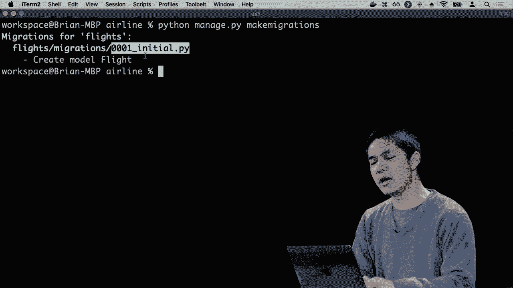
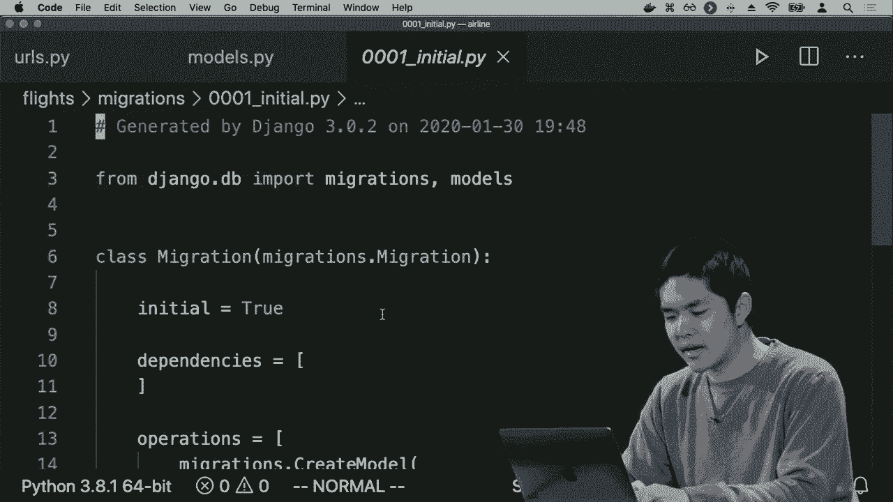
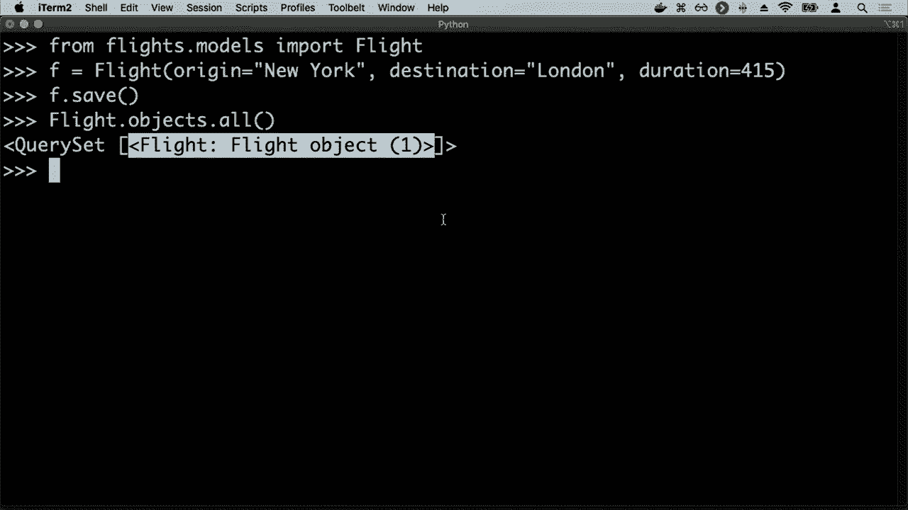
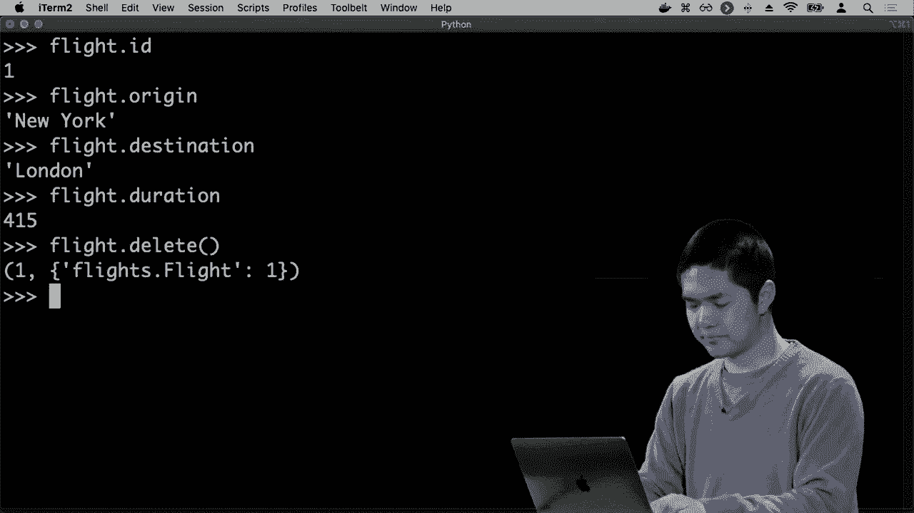
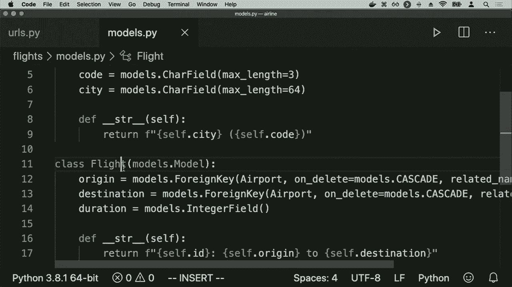
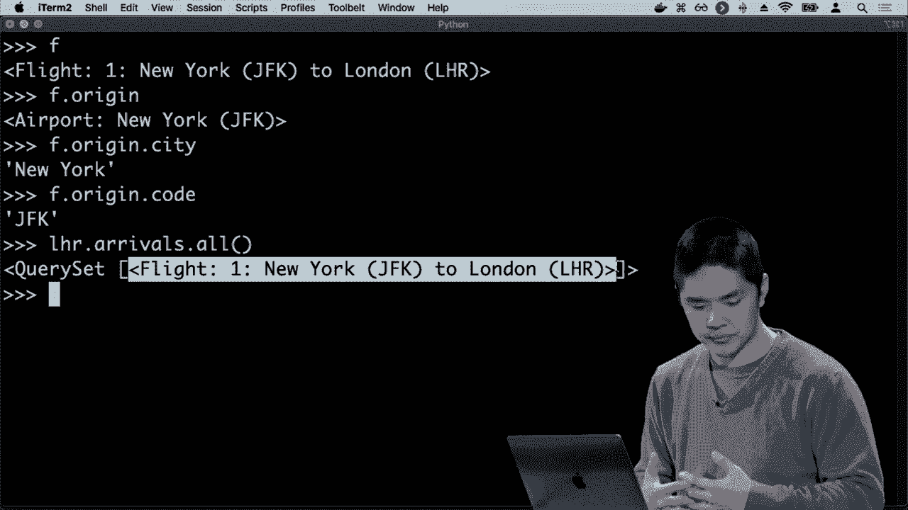
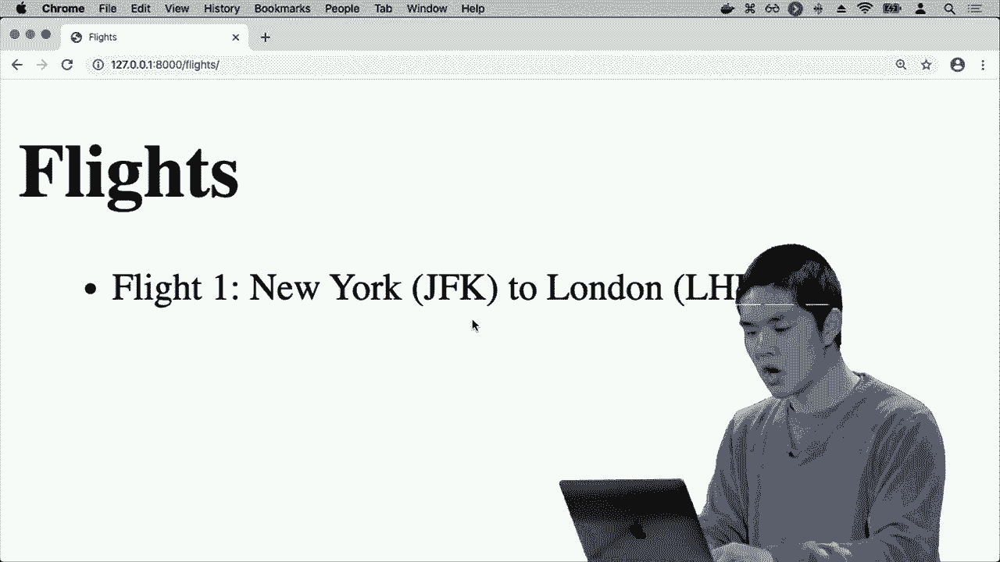
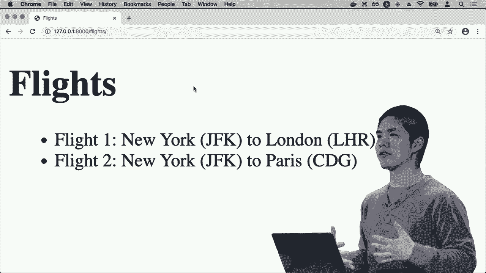

# 【双语字幕+资料下载】哈佛 CS50-WEB ｜ 基于Python ／ JavaScript的Web编程(2020·完整版) - P13：L4- 数据库、SQL与集成 2 (表关联，django模型，集成) - ShowMeAI - BV1gL411x7NY

data we have multiple tables of data and，those multiple tables might relate to。

each other in some way and let's take a，look at an example of how that might。

come about we're gonna introduce a，concept that we'll call foreign keys and。

we'll see what that means in just a，moment so here again is our flights。

table the flights table has four columns，an ID origin destination and duration。

but of course in New York there are，multiple airports in New York for。

instance and so it might not make sense，for me to just label each origin or each。

destination just by the name of the city，maybe I also want to give the。

three-letter Airport code that，corresponds to the airport to which I'm。

referring in this case and so how would，I encode into this table not only the。

origin but also that city's airport code，and not only for the destination the。

name of the city but also the airport，code for that Airport as well well I。

could just add more columns I could say，something like alright now we have this。

table that as an ID in origin in origin，code a destination a destination code。

and a duration but here now the table is，starting to get fairly wide there are a。

lot of columns here and in particular，there's some duplicate data that I've，repeated my cement。

of ***** is associated with this，particular three-letter code and the。

same thing for New York and other，airports as well there is some messiness。

in the structure of this data and so，often what we'll want to do is we begin。

to deal with data and larger and larger，sets with more and more columns is we'll。

want to normalize this data separating，things out into multiple different。

tables that just reference one another，in some way and so instead of just。

having a single flights table what we，might consider doing is saying that。

flights are one type of object but，another type of object that I care about。

is like an airport and so I might just，have a separate table just for airports。

where this table has three columns a，column for the ID of the airport just am。

unique number that can identify a，particular airport one column for the。

three-letter code for that Airport and，one letter for the city or one column。

for the city where that airport is in，and now this is a much more。

straightforward simpler representation，of all of the airports and the question。

becomes what happens to my flights table，that my flights table that here had an。

ID origin destination and duration where，the type of origin and destination were。

in this case just text text-based data，representing the name of the city from。

which the flight is departing or to，which the flight is arriving well now。

that I have this separate airports table，where every row in the airport's table。

has its own unique ID then what I can do，in this case is instead of storing an。

origin and a destination as text I can，store what we'll call a foreign key a。

reference to a key in another table and，rename these columns to origin ID and。

destination ID that instead of storing，text are going to store a number where。

origin ID 1 means the origin of flight 1，is whatever airport number 1 happens to。

be and I could go to the airport's table，lookup which Airport has an ID of 1 and。

that would tell me the origin of this，flight and if I went to the airport's。

table and looked up which airport had an，ID of 4 that would tell me the。

destination of this slide as well so by，combining now two different tables one。

table for representing airports and one，table for representing flights I'm able。

to connect this these two different，tables together，by way of a foreign key some columns。

inside of my flights table namely the，origin ID column and the destination ID。

column that together allow me to，reference information stored inside of。

another table as well and as you imagine，this sort of airline's database growing。

and storing more different kinds of data，the ability to relate tables to each。

other is going to become incredibly，powerful so one thing you might imagine。

is that in addition to storing airports，and storing flights an airline probably。

also needs to store information about，its passengers like who is on which。

flight and so you could imagine，constructing a passengers table that has。

an ID column to uniquely identify every，passenger a first name column that。

stores every passengers first name a，last name column for storing their last。

name and a flight ID column for storing，what flight that passenger happens to be。

on so in this case I could say that all，right Harry Potter is on flight number 1。

I could look that up in the flights，table to find out all right inside the。

flights table here is where the flight，is leaving from where it's going to and。

what its duration happens to be now as，we begin to design these tables we have。

to think about what the implications of，that design happened to be and in the。

case of this passengers table it does，seem that there is a limitation on the。

table design that I have created and，namely if you think about it you'll see。

the limitation of this table design is，that any particular row can only have。

one flight ID associated with it that，Harry Potter has a single flight ID。

column that can only have one value，stored inside of it and this would seem。

to make it impossible to allow for us to，be able to represent a person that could。

be on multiple different flights and so，this starts to get at the idea of。

different types of relationships that，rows on a table can have to one another。

one type of relationship is a many to，one relationship or a one-to-many。

relationship where I can express the，idea that one flight can be associated。

with many different passengers for，instance but what we might also want is。

a many-to-many relationship where many，different passengers can be associated。

with many different flights a passenger，might have more than one flight a flight。

might have more than one passenger and，to do that we're going to need a。

slightly different structure for this，particular type of tape，and one way we could approach it is by。

creating a separate table for storing，people that I can have a people table。

where every person has an ID has a first，name and has a last name the same as。

before but I'm no longer storing flight，information inside of the table I've。

created my setup up I'm only storing，people in this table and nothing about。

their flight information and then I'll，have a separate table for dealing with。

passengers on the flight and mapping，people to their flights and we can think。

about what does that table need to look，like well I need some sort of table that。

is going to relate people to what，flights they happen to be on so odds are。

we're gonna need one column that is a，foreign key that references this people。

table and we'll need another column that，is a foreign key that references the。

flights table such that I can relate，those cue tables together and so that。

table could look like this，this now is the simplified passengers。

table that only has two columns it has a，person ID column and a flight ID column。

and the idea of this table now is it's，known as an association table or a join。

table that just associates one value，from one table with another value from。

another table that this row here 1 and 1，means the person with an ID of 1 is on。

flight number 1 and I could look up that，person inside of the per-pupil table。

look up that flight inside of the，flights table and figure out who the。

person is and what flight they're on and，down here 2 + 4 means whoever the person。

with an ID of 2 is is on whichever，flight happens to have an ID of 4 and so。

this now has allowed us to be able to，represent the types of relationships we。

want we have a table for airports and a，table for flights and any flight is。

going to map to two different airports，one destination one origin and any。

airport might appear on multiple，different flights sort of a one-to-many。

relationship and then over here when it，comes to passengers we've stored people。

inside of a separate table and then had，a many-to-many mapping between people。

and flights that any person could be on，multiple different flights like here for。

example person number two is on both，flights 1 & 4 and likewise a flight。

could have multiple people so in this，case flight number six has passengers，well。

we've been able to represent those，relationships of course a byproduct of。

doing this is that now our tables are，are a little bit Messier to look at and。

messy in the sense that it's not，immediately obvious to me when I look at。

this table like what data I'm looking at，I see these numbers but I don't know。

what these numbers mean I've separated，all these tables into different places。

and now it's a little harder for me to，figure out who's on which flight I have。

to look at the Statham lookup people in，the people table look up flights in the。

flights table and somehow associate all，of that information back together in。

order to draw any sort of conclusion but，luckily sequel makes it pretty easy for。

us to be able to take data across，multiple different tables and join them。

all back together and we can do this，using a join query that takes multiple。

tables and joins them together so the，syntax for a join query might look，something like this。

and here we'll go back to just a two，table setup where I have flights and。

passengers where every passenger is，associated with one flight you could。

extend this and join multiple tables to，deal with our more complex example as。

well but here I'd like to select every，person's first name and their origin and。

their destination and I'm going to，select that from the flights table but I。

need to join it with the passengers，table and then I say on to indicate how。

it is these two tables are related to，one another and in this case I'm saying。

the way these two tables are related to，one another is that the flight ID column。

of the passengers table is associated，with the ID column of the flights table。

the flights table has an ID that，uniquely identifies every flight and the。

passengers table has a flight ID column，that uniquely identifies the flight that。

we're referring to for this particular，passenger and so the road volt I might。

get is the table that looks like this，that gives me everyone's first name but。

also their origin and their destination，where origin and destination are going。

to be drawn from that table of flights，and the first name is going to be drawn。

from the table of passengers but by，using a join query I've been able to。

take data from two separate tables and，join them both back together and there。

are a number of different types of，drawing queries that I can run what we。

saw here was just the default join which，is otherwise known as an inner join。

we're effectively an inner join we'll，take the two tables it will，cross compare them based on the。

condition that I specified and only，return back to me the results where。

there's a match on both sides where we，match a passengers flight ID with an ID。

in the flight stable and there are，various different kinds of outer joints。

if I want to be okay with the idea that，maybe something on the Left table that。

I'm joining doesn't match with anything，on the right or that maybe something on。

the right table doesn't match with，something on the left but just know。

there are other types of join queries，that I can run as well other strategies。

that can be helpful when dealing with，sequel tables are optimizations we can。

make to make queries more efficient and，so one thing we can do with our table。

ism is to create an index on a，particular table and you can think of an。

index it's kind of like the index in the，back of a book for example where if you。

wanted to be able to search for a topic，in a text book you could open the text。

book and just page by page look for，every topic and just try and find the。

topic you're looking for but often what，you'll be able to do if the table has an。

index is go to the index of the book，find the topic you're looking for and。

that will quickly give you a reference，for how to get to the right page in。

question and an index on a table，operates in much the same way it is an。

additional data structure that beacons，can be constructed and it does take time。

and memory to be able to construct this，data structure and to maintain it。

anytime you update the data inside the，table but once it exists it makes。

querying on a particular column much。

more efficient that you can very quickly，look something up in the index and find。

the corresponding rows that go along，with it and so here we could have a。

command like create an index that we're，gonna call name index on the passengers。

table and in particular on the last name，column gonna say something like I expect。

that as I query this table I'm pretty，frequently going to be looking up。

passengers by their last name so I would，like to create an index on that table to。

be able to more efficiently search for a，passenger based on their last name as。

well and so that's just a general，overview of what sequel syntax is all。

about a syntax that we can use to be，able to create data tables inside of。

which are storing rows of data where，every row consists of some number of。

columns and every column has a type you，have the ability to create tables add。

data to them update delete and get data，out of those tables as well but as we。

begin to introduce these new technology，there are always risks and potential。

threats that are associated with those，technologies as well and in sequel the。

key one to be aware of is what's known，as a sequel injection attack a security。

vulnerability that can happen if you're，not careful about how it is you actually。

execute your sequel commands and so，where might this come about you might。

imagine for instance that if a database，has some number of user ism you might be。

storing those users inside of a database，for instance in a user's table where。

there's a username column and a password，column though in practice you probably。

wouldn't want to store passwords in，clear-text let's imagine here for。

example that you are storing usernames，and passwords inside of a table and we。

have a login form for a website that，looks like this where you get to type in。

your username and your password and so，if someone types in their username and。

password what might happen is that the，web application might look select star。

from users where username equals this，particular username highlighted here。

we're just gonna substitute the username，right there and password equals them and。

we'll substitute the password over there，so if someone tries to log into our site。

like Harry logs in with a password of 1，2 3 4 5 what we might do is run the。

Select query and say select star from，users where username is Harry and where。

the password is 1 2 3 4 5 and our logic，might be if we get results back then。

that means there is a user whose user，name is Harry and password is 1 2 3 4 5。

and we can go ahead and sign that user，in but imagine now what might happen if。

instead the user who typed in a username，of a hacker quotation mark - - it seems。

like a bit of a strange user name to，type in and it doesn't matter what they。

put in their password here now the，result might be that what they plug into。

the username is where username equals，hacker and then the - - it turns out - -。

and sequel stands for a comment in，sequel it just means ignore everything。

that comes after it in the same way that，in Python you can use the hashtag symbol。

to mean the rest of this line is a，comment and the compiler whoever's。

running the program should just ignore，it so everything after the - - kind of。

gets ignored and we've effectively been，able to bypass the password check that。

someone could bypass a password check，and log into an account even if they。

were unauthorized to do so，so here the vulnerability with，in the sequel syntax if we're not。

careful about when we're running sequel，syntax we could be running untrusted。

sequel commands that some hacker some，adversary has been able to plug in to。

our program so how do we solve this sort，of problem one strategy is to escape。

these characters escaping just meaning，add some back slashes that just make。

sure that sequel knows to treat these as，a literal quotation mark and a literal。

dash and not as like special sequel，syntax of any sort another strategy is。

to use an abstraction layer on top of，sequel so that we don't have to write。

the sequel queries at all and that's in，fact what we're about to do as we。

transition to the world of Django to，take a look at how when we begin to use。

a web framework like Django we now have，the ability to not worry about the。

nuances of the syntax of sequel and just，deal a little more high-level with what。

our models are what are the types of，objects that we're dealing with and。

interacting with inside of this，application one other concern worth。

noting about with regards to sequel is，the possibility of race conditions and a。

race condition is something that might，happen anytime you have multiple events。

that are happening in parallel threads，so to speak that you have one thing。

happening and another thing happening，simultaneously you might imagine that in。

the case of social media sites where you，can like a post like an image on。

Instagram or a tweet on Twitter for，example what would happen if two people。

tried to like the same post at the same，time if we're not careful about how we。

run those particular sequel queries，there's a potential for us to be able to。

get a race condition problems where we，end up like trying to query for the。

number of likes that a post has and then，another person tries to do the same。

thing and there are conflicts when we，try and update it where the result might。

not be what we would expect it to be and，there are a number of unexpected results。

that can happen when we deal with，problems related to race conditions。

where multiple things are happening，simultaneously how do we solve those。

problems well one strategy is to sort of，place a lock on the database to say all。

right well I'm working on this database，nobody else can touch this data let me。

finish this transaction so to speak，finish working on this particular。

transaction and making all the changes I，need to make the database and only after。

I'm done I can sort of release the lock，let someone else go ahead and modify the。

database as well it's a number of，concerns to be aware of as we begin，dealing in this world。

of sequel and trying to work with，databases so now that we've taken a look。

at the syntax of sequel understanding，how these tables work how they're。

structured and what it is that we can，add to those tables let's go ahead and。

turn our attention in particular to，Django models which are a way of。

representing data inside of a Django，application because we're Django is。

really going to get powerful in，designing our web applications is the。

ability to represent data in terms of，these models and so we're gonna go ahead。

and try and create a web application，that is going to represent like what an。

airline might want to store inside of，its own web application as well all。

right so the first thing I want to do is，create a Django project so I'll go ahead。

and type Django admin start project and，the name of my project will just be。

called airline I'm creating a project，for an airlines website for example I'll。

go ahead and go into the airline，directory open then up in my code editor。

but before I actually begin editing any，code remember that every jingo project。

needs to have one or more apps within it，so the first app that I'll create for。

this airline is I'll start an app for，keeping track of flights so keeping。

track of flight related information like，origins and destinations and durations。

and what passengers are on those flights，when I create a new app first thing I'll。

need to do is go into settings dot PI，inside of airline and go ahead and add。

this app as an installed app alright so，flights is now an app that I've。

installed and then what I'll want to do，is say go ahead and go into URLs PI。

which is again that table of contents，for all the URLs I can get to for this。

particular web application I'll import，include because I want to do is when。

someone visits the path of flights slash，something I want to take them to flights。

dot URLs mapping them to the URLs PI，file that will be inside of my flights。

application of course now I need a URL，spy file inside of my flights。

application so I go into flights and，create a new file that I'll call you are。

l-step PI and we can do from Django，about URLs import path from dot import。

views and then my url patterns are going，to go inside of this list right here but。

before I begin dealing with，chewable URLs the first thing I'm going。

to want to do is create some models，models are going to be a way of creating。

a Python class that is going to，represent data that I want Django to。

store inside of a database and so when I，create a model Django is going to figure。

out what sequel syntax that needs to use，it to a create that table but then be。

manipulate that table selecting and，updating and inserting anytime I make。

changes to those models and so here what，I can do is inside of every app that。

gets created in this case called flights，there's a models dot PI file when we。

haven't looked up before but this is，going to be the place where we get to。

define what models are going to exist，for our application every model is going。

to be a Python class and you can think，of this as having one model for each of。

the main tables we care about storing，information about so I let me define a。

new class called flight that is going to，inherit from models model so I'm。

creating a new class called flight that，is going to be a model and then I need。

to provide inside of this class all of，the parameters that a flight has what。

properties does a flight have that I，might want to keep track of well a。

flight has an origin and the origin is，going to be a model char field and this。

is all documented on Django's website in，terms of the various different types of。

fields that exist that I can include，inside of a django model where here I'm。

saying all right here is a character，field whose max length is going to be。

let's say  sixty-four  I'll assume that most city，names I'm not going to go longer than  sixty-four  。

characters that seems like a reasonable，maximum length for the origin of the。

flight for example every flight will，also have a destination which will be a。

character field whose max length is also， sixty-four  and every flight will have a duration。

which will just be an integer field so，now this is my very first django model。

it is a class called flight where I've，defined all of the properties that a。

flight has and then using Django syntax，to find what type they should have as。

well every flight has an origin has a，destination and has a duration but of。

course nothing here is actually modified，the database that Django is using in。

order to store information about my web，application and we can see if we in fact。

go back to airline and I type ls' what，you see here is that there isn't yet。

a database that exists I just have an，airline directory of flights directory。

and a managed PI file so what I'd like，to do is somehow tell Jango that you。

should update the database to include，information about the models that I have。

just created and this is a process that，we refer to in Django and more generally。

as migrations I create a migration to，say here are some changes that I would。

like to apply to the database and then I，migrate them to tell Django alright take。

those changes and actually apply them to，the database so it's a two-step process。

one is creating the migration the，instructions for how to actually go。

about manipulating the database and then，one to take that migration step of。

saying now take those instructions and，actually apply them to the underlying。

database we can make the migrations via，a command again we'll use the manage。

script that has a number of different，commands that allow us to control。

various parts of the application I'll，use Python managed at PI and then make。

migrations and now what we see is we've，created a migration inside of zero zero。

zero one underscore initial data we're。

in this migration it's created a model，called flight and so if I go ahead and。

look at the migrations directory I see。

this file has been created for me I，didn't have to create it myself and what。

this file is is it as instructions to，Django for how to manipulate the。

database to reflect the changes I have，made to the model that here is a。

construction to Django to create a new，model called flight that has these。

particular fields inside of it and it's，basing this off of the changes that I。

made to model stopped by the model that，I added is now reflected in this。

migration and now if I want to apply the，migration actually apply it to Django's。

database I can run Python managed PI，migrate to go ahead and apply these。

migrations there are a bunch of default，migrations that get applied as well but。

notice that one of the migrations that，gets applied is this one here applying。

flights dot zero zero zero one，underscore initial to say let's go ahead。

and apply that migration create that，table that is going to represent flights。

and if I type ls' now you'll see that，now I have a DB，sequel light three file a sequel light。

database that is going to contain a，table that is going to store all of my。

flights and so how can I actually begin，to manipulate this data how can I。

interact with these with diseased sorts，of models I could use direct sequel。

syntax by opening up this database file，and running commands but Jango provides。

some nice abstraction layers on top of，it so that I don't actually need to。

execute those commands myself I can，begin to work more generally with Python。

classes and variables and things that，I'm used to，inside the Python language so I can。

enter jingoes shell where I can just run，Python commands by running Python manage。

pie shell and what this does is open up，a shell or a console where I can begin。

to write Python commands that get，executed on this web application and the。

first thing I'd like to do is from，flight models，let me just import flight so flights is。

the name of my app models is the name of，that file I'm importing the flight class。

from that models file that I've just，created and now what I can do is I can。

create a new flight I can say something，like f equals a a flight whose origin is。

New York and whose destination is London，and whose duration equals four hundred。

and fifteen minutes and then I can say F，dot save to save that new flight that I。

have created and this syntax now and，I'll go ahead and make it a little bit。

bigger so we can see it a little easier，is my way of inserting data into this。

table I don't need to use an insert，query in sequel I just have to write a。

Python command and Gengo knows that when，I create a new flight and save it that。

it should run an insert command on the，underlying sequel tables where here I've。

created a new flight with this，particular origin and destination and。

duration and I've gone ahead and saved，that flight as well and if I want to。

query that flight get information about，that flight I can say something like。

flight dot objects dot all is the，equivalent of like I select all get me。

all of the flights that exist inside of，my database and here I see I get back a。

query set which is just a set of results，and here I have one flight that came。

back flight object one so a flight has，been created for me with。

one now flight object one probably not，all that helpful in the name it'd be。

nicer if this model had a cleaner way of，seeing the name of a particular of a。

particular flight for example and it，turns out we can do that that any model。

I'll go back to the code inside of model，spy any model can implement double。

underscore stirrer function which，returns a string representation of that。

particular object and this applies not，just a jingle models but two Python。

classes more generally then if this，function returns a string representation。

of the object let's go ahead and return，a formatted string that is self dot ID。

I'll say self dot origin to self dot。

destination so here what I've said is，that the string representation of any。

flight is going to be a string that，gives its ID and then says are a origin。

to destination just a nice clean name，that is going to represent this。

particular flight so now if I go back to，pie shell，I can say from flights models import。

flight I can say all right let's let a，variable called flight to be equal to。

flight objects all and now flight is，going to be this flight slight one New。

York to London it now has a much nicer a，string representation of the name which。

just makes it a little bit easier to，interact with if I wanted to get just。

that one flight I can say flight equals，flights dot first slice is a query set。

first gets me that first flight and so，now I have this flight from New York to。

London and just as in any Python object，I can begin to access properties of that。

object I can say all right flight what，is your ID flight what is your origin。

flight what is your destination flight，what is your duration and I can access。

as values all of the properties of this，flight that I ultimately care about and。

if I want to delete the flight I can say。

something like flight dot delete now，ultimately though this is not the model。

that I actually want to represent my，flight because here again I'm using a。

character field a char field for things，like origin and destination when in。

reality I probably like to use something，like another table for representing air，airports。

some relationship between every flight，and an airport so let's go ahead and try。

and implement that idea now that I can，go back into model spy it and create a。

new class I'll create a class called，airport that is also a model and I'd。

like for this Airport class to have a，code which is a character field with a。

max length of 3 for the airport's code，as well as a city which would be a。

character field with a max length of  sixty-four  ，and let's also give this Airport a。

string representation will say that the，string representation of an airport will。

just be the city of the airport and then，in parentheses the code of the airport。

so it'll be something like New York and，then in parentheses JFK to represent a。

particular airport and now our flight，model needs to change a little bit。

no longer will origin and destination be，character fields that are just storing。

text but instead origin is going to be a，foreign key a foreign key that。

references another table like the，airport table and then I can provide。

some additional arguments so this alone，would be enough but I can add some。

additional arguments like on delete，equals models dot cascade so what does。

this mean well when I have tables that，are related to each other。

sequel me in some way of knowing what，should happen if you ever delete。

something if I have a flight from JFK to，London and I sign it later in the later。

in time decide to delete JFK Airport，from my database what should happen to。

that flight like what happens to flights，when the thing that it is referencing。

gets deleted what models dot cascade，means is if I were to ever delete an。

airport from the airport's table it's，going to also delete any of the。

corresponding flights and there are，other on delete parameters you can set。

for saying like don't even let me delete，an airport if there are flights that are。

leaving from or going to that Airport，that's called models not protect but。

there are other ways of implementing，similar types of constraints and the。

other argument that I'm going to provide，it is what's called a related name and a。

related name as we'll see in just a，moment is going to be a way of me。

accessing a relationship in the reverse，order that from a flight I can take a。

flight and say dot origin to，the flights origin in airport but the。

other question I want to ask is in the，reverse order if I have an airport how。

do I get all of the flights that have，that Airport as an origin and so here if。

I give a related name to this foreign，key Django will automatically set up the。

relationship going in that opposite，direction and so here well if we have an。

airport and I want to know all of the，flights that have that Airport as their。

origin the reasonable name for a related，name here is something like departures。

so if I have an airport I can access all，of the departures which gets me all of。

the flights that are leaving from that，Airport and I'll likewise do the same。

thing here for destination instead of a，character field it's going to be a。

foreign key it's going to reference，airport when we delete it will go ahead。

and cascade and the related name will be，arrivals because if I have an airport I。

might want to access all of the arrivals，all of the flights that correspond to。

flights that are arriving at that，particular destination and so now I've。

done two things I've added a new class，called airport and I've modified in my。

existing flight model so this is changed，in my Python code but it hasn't yet。

changed in my database so in order to，make the change in the database again。

it's a two-step process step one，Python managed PI make migrations to say。

look for any new changes that have been，made to model CI and go ahead and create。

a migration instruction for how to make，those changes to the database and here。

we see that we've created a new，migration file and this migration is。

going to create a model called airport，and it's also going to alter the。

destination field and alter the origin，field on my flight model because as we。

know we've changed destination and，origin to no longer be character fields。

but to instead be references to a，particular airport so that's something。

that's going to need to change in the，database and to make that change。

I can run something like Python managed，PI migrate to go ahead and apply those。

changes we've now applied this migration，that we just created and our database is。

now up to date so what can we do well，now I can go ahead and go back into the。

show and I'll just go ahead and import，from flights，that model is import star import。

everything and I can now create an，airport I can say something like JFK。

equals an airport whose code is JFK and，whose city is New York for example and。

then save that I can create a London one，some lhr as an airport whose code is la。

charm and whose city is London and I can，save that you know you could create more。

I could say C D G equals an airport，whose code is C D G and city is *****。

and maybe we'll do one more will say n R，T is the airport whose code is NRT and。

and whose city is Tokyo for example so，I've created and saved for airports that。

get added to my airport table and now I，can add a flight F equals flight whose。

origin equals JFK whose destination，equals London Heathrow and whose。

duration equals four hundred and fifteen，minutes and I'll go ahead and save that。

as well so I've now created four，airports I've created a flight and saved。

it if I type F just for my flight I see，that all right this is a flight from New。

York to London but I can also say what，is f dot origin and to write F dot。

origin that is now an airport object its，JFK in particular and I can do F dot。

origin dot city to get the city of the，origin which is New York F dot origin。

code to get the code of that Airport，which is JFK and if I start with in。

origin something like JFK or London，Heathrow I can say LH r dot arrivals to，*****，*****。

London Heathrow and it looks like，there's just one of them which is this。

flight that I've just created from New。

York that is going to London as well and，so this now gives us the ability to。

manipulate sequel just by using these，Python models and I now have Python。

classes that represent all of these，various different types of data and now。

instead of running sequel queries like，select star from flights or from。

airports I can just interact with these，classism and these properties on the。

classes and django takes care of the，process for me of figuring out what the。

underlying sequel queries should be，those results，back to me and we can begin now to。

design a web application around this，idea that I can go into URL stop PI and。

let's add a URL pattern that says you，know the default route will go ahead and。

load the index view give it a name of，index same as similar things we've seen。

from last time and now what should we do，in the index view，well the index view let's go ahead and。

say what I would like to do is just，display a list of all the flights so I。

might from dot models import flight and，Airport or maybe I just need flight I。

just want a list of all the flights so，I'm going to import flight from all of。

my models and now what I'd like to do is，return let's go ahead and render a。

template called flight slash index dot，HTML and give index。html access to a。

variable called flights and what is that，variable going to be equal to it's gonna。

be equal to flight got objects dot all，to get me like all of the flights that I。

would like to put right here all right，so what can I do from now now what I。

need to do is actually create those，individual templates so inside of。

flights I'll create a new folder called，templates inside of which I'll create a。

new folder called flights inside of，which I'll go ahead and create a layout。

dot HTML much as we've done before where，that layout is going to contain the。

basic structure of our HTML page so a，head section is title as flights and a。

body section that it's going to have a，block body and the end of the block much。

as before this is the default layout for，this particular page and then I'll add a。

new template called index。html that is，going to extend flight slash layout dot。

HTML and then inside the body of the，page I'm going to display an h1 that。

just says flights and let's now create，an unordered list where I can now loop。

over for flight in flight and for to end，the loop but inside the loop let me。

create a list item where I just print，out like flight maybe I'll print a。

flight and then flight ID to print out，like flight one fly two flight。

and then I'll print flight origin to，flight destination so what I've done。

here is create a template that I'm going，to give access to a variable called。

flights where flights is going to be a，variable that represents all of the。

flights that I queried by running flight，objects all that is my way using。

Django's api using the functions that it，has given me access to to say take the。

flight and get all of the flights that，are stored inside of Django's database。

then here in the template I'm looping，over each one of those flights for each。

one printing out a list item where I can，access properties of that flight say。

flight this ID from origin to a，particular destination so now I'll go。

ahead and go into my terminal run Python，manage pi run server which again is how。

we run and django web application and，now if i go to that URL slash flights。

this time because that's the URL what i，see is exactly what it would expect to。

see an unordered list that just so，happens to have a flight one new york to。

london displayed there it is taking data，from my database and now displaying it。

inside of this template and if I were to，add new flights it would also update on。

this page as well so if I go ahead and，go back go into the shell Python managed，up pie shell。

I'll go from flights models import star，let's go ahead and well alright let's， ***** 。

example well how do I get the airport's，for ***** in ***** well it turns out。

that if I want to get like ***** I，can say like ***** equals airport dot。

objects dot and then I can say if I do，airport objects on all that gets me all。

of the airports for example oh and it，seems I don't actually have a *****。

one but I can add one if I wanted to but，if I do airport objects dot all that。

again gives me all of them but if I want，to filter my airport's list not get all。

of the airports but just get some of，them I can say airport dot objects dot。

filter and I can say like get me all the，airports where the city is New York for。

example and that is going to he'll go，ahead and give me a query set that only。

contains the results that I care about，so again airport object stop filter lets。

me constrain the results that come back，not get me all of the airports but only。

get me airports whose city is New York，for example and it opens only giving。

back one so I could say that filter is，City equals in New York dot first to say。

take that query set and just get me the，first and only thing in that query set。

and that gives me Airport New York a，simplified way of doing the same thing。

if you know you're only going to get one，result back if I can say something like。

Airport objects dot get which will only，get one result if it knows that there's。

only going to be one Airport with the，city of New York that too will return to。

me New York JFK Airport but it will，throw an error if ever there's more than。

one or if there's none for example so we，go ahead and save that inside of JFK and。

we'll go ahead and create a flight that，is going from New York to ***** for。

example I can do C DG equals airport，objects get city equals ***** and now I。

have this variable CDG which represents，the airport ***** and if I want to。

create a new flight that goes from New，York to ***** I can say F is going to be。

a flight whose origin is JFK whose，destination equals C D G and whose。

duration equals 435 and I can save that，flight as well and so I've added a new。

flight and so now if I run the server，Python managed up I run server refresh。

the page I now see that I have two，flights one flight that's going from New。

York to London one flight that's going，from New York to ***** but of course。

it's going to be pretty annoying if，every time I want to update the data。

adding new data manipulating the data I，need to go into the shell in order to。

run direct commands so they're able to，add new flights add new airports so on。

and so forth what I'd really like to be，able to do is just very simply to add it。

via a web interface via the web be able，to say alright let me add a new flight。

that goes from location 1 to location 2，and it's possible using the information。

