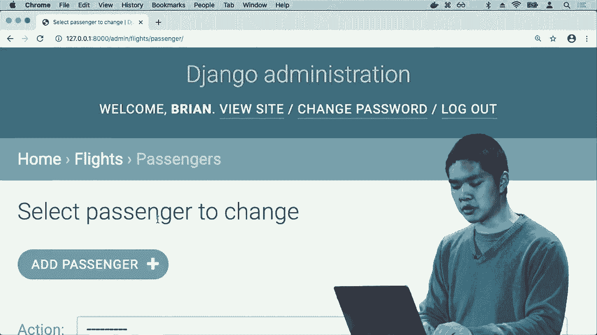

# 【双语字幕+资料下载】哈佛 CS50-WEB ｜ 基于Python ／ JavaScript的Web编程(2020·完整版) - P14：L4- 数据库、SQL与集成 3 (用户管理) - ShowMeAI - BV1gL411x7NY

we know now to build a web page that，does just this but Django is built on。this idea that it doesn't want you the，programmer to have to repeat work that。other people have already done and this，process of trying to define models and。very quickly be able to create and edit，and manipulate models is so common the，Django has all。

already built for us an entire app that，is just designed for the manipulation of。these models and it's known as the，Django admin app and this is an app that。we've seen traces of already that if we，remember that URL spy file from inside。of our application we saw that we added，a path for our own app but there was。

already a path given to us by default。

slash admin that takes us to the admin，app as well and so in order to use the。admin app we need to create an，administrative account inside of our。Django web application and the way to do，that is via the command line I can run。Python managed up I create super user，it's gonna ask me for my name I'll go。

ahead and type in my user name my email，address and it's also gonna ask for a。password I can just make up a password，that I would like to use retype it in。just to confirm it and now Django has，created a super user account for me in。this web application so that I using，these credentials have the ability to。

visit the web interface for the admin。

app and actually manipulate some of，these underlying models so in order to。do this the first thing I need to do is，take my models and add those models to。the admin app so inside of models that，PI I have a class called airport and a。class called flight and if we look at，the files I have there's another file we。

haven't really looked at yet called，admin PI inside of my app and inside of。admin PI I'll first from my models，import flight and Airport and now I'm。going to say admin dot site register。

Airport and admin site dot register，flight and what this is going to do is。it is going to tell Django's admin app，that I would like to use the admin app。to be able to manipulate airports and to，be able to manipulate flights as well。and so let's take a look at this admin，app and see how it actually works。

I can run Python manage PI run server，that will start up the web server I'll。know visit this URL instead of going to，slash flights I'll go to slash admin。and this opens up this django，administration app that's not written by。me Django has written this and it's，asking me to log in I'll go ahead and。

log in using those credentials I used a，moment ago typing in my username and。password and what I get here is Django's，site administration interface built。forming by Jenga where I didn't need to，design this at all but importantly if we。notice down here I now have the ability，to add and manipulate airports and。

flights via this web interfaces django，administrative interface so now using。this interface i have the ability to，manipulate the underlying database to。manipulate my models to add and modify，data that already exists so if I click。on airports for example I see here here，all of the airports that I've already。

added to my database Tokyo Paris London，in New York and I can add a new one I。can say let's go ahead and add PVG which，is Shanghai and I can either save it。saving continue editing save and add，another I'm gonna add a couple so I'll。go ahead and save and add another let's，go ahead and add Istanbul Airport as，well let's add Moscow。

that's an airport tomb and maybe one，more will add Lima as well and I'll just。go ahead and click Save and now I've，added a whole bunch of airports all via。this web interface Jango was originally，created for like news organizations they。very quickly wanted to be able to post，articles and post new posts on their。

website and it made it very easy by an，interface like this to very quickly just。say like here add a new article and，here's the content of the article to be。able to display on a page and now we've，been able to very quickly add new。airports to our website as well and so，if we want to add flights well we can go。

ahead and go back home I'll click on，flights I see that I already have two。flights inside of my database I have New，York to London in New York to Paris I'll。add a new one it's letting me choose an，Origin destination and duration and。Gengo know is that the origin must be an，airport so it's going to give me the。

opportunity to just choose an airport，where I can say ok Shanghai is the。origin the destination is going to be，Paris and the duration is going to be。like 760 minutes for example so now，using Django's admin interface i've been。able to add a number of different，flights and a number of different。

airports and if I go back not to the，admin app but to my flights app the app。I wrote myself and go back to slash，flights now I actually see all of the。new flights that I have added to my，database via Django's admin interface I。added them to the admin interface and，now I see this flight from Shanghai to。

Paris I see this flight from Paris to，New York as well and so now what I might。like to do is begin to add some more，pages to this web application make this。web application a little more，sophisticated but maybe giving me the。ability to like click on a particular，flight to view details about that flight。

what I'd like is for every flight to，have its own page not just slash flights。for all the fights but slash flights，slash one for flight ID one slash flight。

slash to 482 so on and so forth what I，can do in order to do that is go back。into URL spy and create a new path we'll，create a path where I'm going to specify。a flight ID which would be an integer，when I do let's go ahead and load the。flight view whose name will be flight，and now I need to just go to view spy。

and add a function called flight so I'll，go back go into view spy in addition to。an index function we'll define a flight，function that accepts as an argument a。flight ID so now what is this flight，function going to do well the first。thing I need was actually need to do is，actually get that flight I can say。

flight equals flight that objects get，get me the flight whose ID is equal to。flight ID for example we're，alternatively jangle also lets you say。PK instead of ID is much more generic，way of referencing the primary key for。whatever the primary key happens to be，called the PK in this case is just the。

ID but then what I can do is render a，template like flight flight HTML and。pass as input to that the flight so，we're passing it this flight to flight。HTML and now I can create a template，create a new file called flight HTML。which is going to also extend flight，slash layout HTML using that same HTML。

layout and inside the body of the page，let's just say something like in big。we'll say flight flight ID and then，maybe an unordered list where。can say something like the origin is，flight origin the destination is flight。

destination and the duration is flight，duration so now I have a page that。displays flight information about any，particular flight and if I go ahead and。load not slash flights in my web browser，but slash flight slash one for example。well now I have information about flight，number one and slash flight / - gets me。

information about flight number two，query in for that particular flight then。printing on its origin destination and，duration now there's some error checking。that we probably should do here if I try，and access a flight that doesn't exist。something like flight 28 for example I'm，gonna get some sort of error that I does。

not exist near flight matching query。

does not exist I might like to control，what happens in that situation a little。better so you might imagine adding some，additional error checking to handle。those cases as well but we'll leave it，at this just for now but now let's go。ahead and add the ability not only to，have flights that have airports。

associated with them but let's also add，passengers to our flights as well to be。able to represent passengers that might，actually be on these flights - so I'll。go ahead and go back into model spy and，in model spy in addition to an airport。class and a flight class let me create a，new class called a passenger also going。

to be a model and what property is does，a passenger have well passenger has a。first name which will go ahead and make，a model char field whose max length will。put at  sixty-four  and a last name max length，equals  sixty-four  and passengers also as we。described before they have a，many-to-many relationship with flights。

that a flight could have multiple，passengers a passenger could be on。multiple flights and ultimately we need，an additional table to keep track of。this but we can think a little bit more，abstractly here in django and just say。that every passenger has flights，associated with them which are a models。

dot many-to-many filled with flight so，every passenger could be associated with。many flights will say blank equals true，to allow the possibility that a。passenger has no flight maybe if they're，not registered for any flights at all。and we'll also give this a related name，of passengers meaning if I have a。

passenger I can use the flights，attribute to access all of their flights。and likewise if I have a flight I can，use this passengers related name to。access all of the passengers who are on，that flight and we'll see how that'll be。useful in a moment to the string，representation of a passenger we'll just。

go ahead and be their first name space，their last name which feels like a。reasonable way of representing a。

particular passenger and now I need to，apply these changes I need to say Python。Manish up I make migrations because I've，made new changes to my model I've。created a model passenger in particular，and now if I do Python managed up I。

migrate now I've applied those changes，to my actual database and if I go into。admin dot PI so we'll go into admin dot，PI and register not only flight an。airport but passenger admin that's like。

register passenger then now via the，admin interface I can manipulate。

passengers as well I can say Python man，in shop I run server to run my web。server go to my web servers admin view，by going to slash admin go down to。passengers and let's go ahead and add a，passenger where I can say all right。first name Harry last name Potter and，we'll go ahead and put him on flight one。

and the flight three maybe he's on two，different flights for example and you。can hold down command or control to be，able to select multiple flights and。we'll go ahead and save that Harry，Potter has been added successfully and。let's add a couple of other passengers，will add Ron Weasley and we'll add。

another will add Hermione Granger and。

we'll add Ginny Weasley as well so we've，added a number of different passengers。that now all exist in Django's admin，interface and now what I'd like to do is。on the flight page display information，about which passengers happen to be on。any given flight so the way I might do，that is by going into view spy and on。

the flight page in addition to giving，access，to passengers so passengers this。template is going to get access to and，we get passengers by saying flight dot。passengers dot all and the reason we can，do this is again because passengers is。that related name it is our way of，taking a flight and getting all of the。

passengers that happen to be on that，flight，and so now inside of flight dot HTML I。can add something like let's add on h2，called passengers we're here I'm going。to loop for passenger in passengers go，ahead and display that passenger just。print out that passenger inside of a，list item and in Django I can say if the。

list is empty let's just have a list，item that says no passengers meaning。

nobody is currently on this flight so，now my web server is still running I can。go back to slash flights here all of the，flights and if I go to slash flight。slash one I now see that I'm flight one，Harry Potter is a passenger on that。

flight but if I go to flight 2 all right，no passengers are on that flight either。and now it's been a little annoying that，I've had to do everything by using the。URL here to be able to go back and forth，between pages I could link to those。pages if I want to and the way I might，do that is let's on the flight page add。

a link that goes to the URL index that，says something like back to flight list。maybe so here is now a link that takes，me to the index view and likewise I can，go into index。html and for each of these，list items each of these list items is。really going to be a link that links to，it's a URL to a particular flight and。

the flight route takes as a parameter a，flight ID and so inside this URL。substitution here I can specify use，flight ID as the ID of the flight that I。would like to use here and so now I've，put every single flight inside of a link。that takes me to the flight route but，because the flight route requires as an。

argument the flight ID I can specify the，flight ID here and so now if I go back。to slash flights I now see a list of，flights where every flight is in fact a。link that can take me somewhere else and，so now I can click on any one of those。links like New York to Paris and that，takes me to the flight page I can click。

back to flight list that takes me back，to the flight list click on another。flight and go to that flight as well so，I've now been able to come up with this。way of linking these pages together by，having links in each of the various。

different pages that take me to some，other route as well and so now what I。might like to do is in addition to，displaying all the passengers on any。particular flight also give myself the，ability to add passengers to a flight as。well which feels like a reasonable thing，that I might want to do inside of this。

web application and so how can I go，about doing that well in order to do。that I'm going to need some new route，that lets me book a flight for a。particular passenger and so I'll go，ahead and go back to URL stop by and。inside of URLs PI I'll add a new path，that will be in flight ID slash book an。

in-flight ID slash book is going to let，me book a flight for this particular。flight ID for flight 1 or flight 2 or，flight 3 or so forth when I do we'll go。ahead and go to the book view and we'll，name that book and so now I need to。implement the book view so how is this，view going to work I'm going to define a。

function called book that is going to，take as its argument not only the。request but also a flight ID the first，thing as with before is I want to get。the flight ID but remember from before，that there are multiple ways that I can。request a web page I can request a web，page via the get request method which。

means I would just like to get this page，or I can request a method via post。meaning I would like to send data to the，page and generally speaking anytime you。want to manipulate the state of，something especially manipulating our。database that should be inside of a post，request I'm submitting some form some。

data and in response to that post，submission，you should manipulate what's going on。inside of the database so we're gonna，check when this book route is called，upon if requests meth。this post then we want to perform some，sort of action the flight in question is。just going to be flight dot objects get，get the flight whose primary key is that。

flight ID and then what I'd also like to，do is associated with the forum when。someone submits this form to like book a，new passenger on the flight they should。tell me what the ID is of the passenger，like what passenger should I book on。this flight because those are the two，pieces of information you need to know。

in order to actually book a flight you，need the flight and the passenger。information so let's assume for now that，the information is going to be in。request dot post and then in squ*re，brackets passenger what this means is。that the data about which passenger ID，we want to register on this flight is。

going to be passed in via a form with an，input field whose name is passenger the。name on any particular input field，dictates what name we get receipt what。is received when a route like this book，route is able to process the request。from the user so we'll go ahead and take，that information and because by default。

this might be a string let's go ahead，and convert it into an integer just to。make sure we're dealing with an integer，and let me say that the passenger in。question is going to be passenger dot，objects get PK equals this whole thing。so now what I've done is if the request，method is post meaning someone submitted。

this form via the post request method，I'm first saying flight start objects。get to get a particular flight get me，the flight with that flight ID and then。I'm getting a passenger which passenger，am I getting the one whose PK their。primary key otherwise known as ID is，equal to whatever was submitted via this。

post form with a name of passenger and，we haven't yet created that form but。we'll do so in just a moment now，ultimately we'll want to add some more。error checking to this as well like what，if someone requests a passenger that。doesn't exist or a flight that doesn't，exist either so there's definitely some。

error checking that we probably should，be doing here but for simplicity let's。just assume for now that we're able to，get a flight and get a passenger well。how do we access a passenger flights，I can just say passenger dot flights。and in order in order to add a new item，to some set like flights。

I can just say passenger flights not add，flight and this will do the equivalent。of adding a new row into a table of，keeping track that the passenger is on。that flight but the nice thing about，Django's abstractions is that I don't。have to worry about those underlying，details I don't have to worry about what。

the structures of the tables are I can，think in a much higher level and just。say take this passenger take their set，of flights and go ahead and add a new。flight to that set of flights and when，all that's said and done what I probably。want to do is return some sort of，redirect that redirects the user back to。

the flight page so we'll go ahead and，return an HTTP response redirect what。URL would I like to take them to well，I'd like to take them to the flight。route and reverse again takes the name，of a particular view and gets me what。the URL is and we saw that last time and，the flight route takes an argument so I。

need to pass as an argument the flights，ID so I need to provide it to the flight。route what the flights ID is structured，as a tuple and that is going to redirect。me back to the flight route so that I，can see that flight page again and what。I need to add up at the top here is from，Django HTTP import HTTP response。

redirect in addition to from Django URLs，an import reverse and so those all need。to add as well so that I can redirect，the user back to the flight page after。they're done submitting the form and，reverse takes the name of a particular。view as defined in URLs depay something，like index or flight or book and gets me。

what the actual URL path should be and，as we talked about last time that's。helpful so that I don't have to hard，code URLs into my Django web application。I can just reference URLs by their name，and if ever I need to change a URL I can。just change it in one place in URLs dot，PI and that change is going to reflect。

everywhere else as well so now the next，thing I need to do is actually create。this form that what I have so far is，just a function called book。waiting for a post request to be made to，it and when a post request is made to it。then we're going to go ahead and submit，this form and go ahead and add the。

flight for this particular passenger but，what I'd like to do now is actually add。that form so I'll go back into templates，go into flight HTML and what I'd like to。add here is a form I'll go ahead and，label it with an h2 called add passenger。and we'll create a form whose action is，going to be URL of book so we're gonna。

go to the book route and again if we，recall the book route in URL stop by the。route with name book this view requires，as a parameter some flight ID so I need。to provide the flight ID as an argument，for what flight I'm booking the。passenger on and it just happens to be，flight dot ID because this template has。

access to a variable called flight the，method of this submission is again going。to be post and recall from before that，whenever I have a form in Django I need。to give it the CSRF token just for，security to make sure that Django knows。it's really this application that is，submitting this form we'll go ahead and。

add a drop-down list which you can，create an HTML using a select field the。name of this select field is going to be，passenger and the reason for that is。inside of you stop I when I get the，passenger I'm looking for inside the。post data inside of request stop post，for a field whose name is passenger and。

so that is what I would like the name of，this drop-down to be and inside of a。select drop-down we have a whole bunch，of options options that we can choose。from and there's going to be one option，for everyone who isn't a passenger on。this flight and so how do I get everyone，who isn't a passenger on the flight well。

it seems that right now the flight page，only has access to actual passengers and。doesn't yet have access to people that，are not passengers on the flight so it。sounds like I need to add some，additional context to the stemplot。additional information that we want，access to so I'll go ahead and give this。

flight access to additional information，that will call like non passengers for。people that are not on the flight and，how do I get non passengers well just，filter。to only get passengers that match a，particular query there's also a way in。Jango to say passenger objects dot，exclude to say exclude passengers that。

satisfy a particular query so I want to，exclude passengers who among their。flights have this as one of their，flights and so what does this actually。mean well it means that when I render，flight dot HTML there's a couple pieces。of information that it should have it，needs to know what flight is being。

rendered it needs to know who is on the，flight who are the passengers but if I。want a drop-down where I can choose from，all the people who aren't already on the。flight like I would like to register you，for this flight well I also need all of。the non passengers passengers except，excluding the ones who are already on。

the flight and get me all of them is，what that dot all is ultimately saying。and so using that I now have access to，this variable called non passengers that。I can use as I'm constructing this page，so back on flight HTML I can say for。every passenger in non passengers let me，create a option that I can choose from。

and the options value is going to be the，passengers ID because ultimately when I。submit the form what I care about，getting is what is the ID of this。passenger that I've chosen from this，drop-down but of course the user who's。looking at this page they don't want to，see people's IDs they want to see。

people's names so inside of the option，tag we'll go ahead and just print out。the passengers name and we'll see in a，moment what all of this actually looks。like in terms of HTML so now that I've，created this form I'll also need at the。bottom to add an input whose type is，submit to let myself submit this form to。

let's now try running this application，it looks like there's a slight error。

where I said view book instead of views，book views is the name of the module。since it's in a file called view spy and，now it looks like my server is running。ok I can go back to slash flights let me，get one of the flights like New York to。London flight number one and the right。

name error named passenger is not，defined this is how Django renders to me。errors that are occurring and I Python，code looks like it just means。inside of used-up pine I'm referencing。

passenger but I never imported it so up，at the top I'll go ahead an import。passenger as well now it seems on my web，applications working ok so now hopefully，information。I see passengers and I also down at the，bottom now see an ADD passenger section。with a drop down list where I can click，on it and see all right here the three。

people that are not already on this，flight and so if I want to add like。Ginny Weasley to this flight I can click，Ginny Weasley，click Submit and that submits the form。and I'm redirected back to the same，flight page now Harry and Ginny are both。

on the flight and then the add passenger，list I see Ron and Hermione。that's the options for me there and so，using Janos models I've been able to。very quickly build up a reasonably，sophisticated application an application。that has models that displays that，information to me and lets me manipulate。

that data and that data is ultimately，stored inside of a sequel database and。one of the big powers of Jango that it，really gives to me is this admin。interface that I ordinarily might have，had to spend a lot of time designing a。

web interface that just lets me do，things like take some person and go。ahead and update like what is their name，what flights are they on and the ability。to very quickly add and delete and edit，the models is something that in a web。application could take quite a lot of，time to be able to build from scratch。

but Jango very fortunately gives all of，that right to me and this admin。interface even though it is designed by，Jango it's very customizable in terms of。things that I can do on this admin，interface if I want to manipulate it in。certain ways and in order to add，additional features to it as well so。

we'll see a couple brief examples of，this if I go into admin dot PI here is。my configuration for jenga's admin，interface and I can say I would like to。configure the admin interface in a，particular way that in a flight for。example by default all I saw was like，the flights origin and destination if I。

want to be able to see more information，about a flight I can say go ahead and。give me a class called flight admin，which is going to be a subclass of model。admin where I can specify any particular，settings that I want to apply to how the，flight ad。Paige is displayed so I can and all this，is documented on jenga's website and you。

just have to read it to be able to know，what configuration options are available。to you but I can say in the list display，when you list all the flights and。display them all to me what fields，should I have access to we'll go ahead。and show me something like the origin，and the destination and the duration and。

maybe also show me the ID for example so，I want to see all of this information。when you load a flight and when I，register the flight I'll say register。this flight but use the flight admin，settings when you do so so I can specify。

I would like to use these particular，settings when you view the admin。interface and so now if I go back and go，ahead and click on flights then now in。this list display whereas before I only，saw IDs and origins and destinations now。I can configure it to show me all of the，IDS and origins and destinations and。

durations as well I've been able to，configure this display to work the way I。would like it to and there are other。

configurations you can do as well one，that I quite like to use is if I want to。update my passenger admin so when I'm，editing a passenger you can have a。special way of manipulating many-to-many，relationships inside of an attribute。called filter horizontal and if I use a，horizontal filter on flights this will。

just make it a little bit nicer for，manipulating the flights that a。passenger is on and again the specific。

syntax of this not as important as the，idea that these are all just。configurable settings that Django has，documented that you can look at to see。how to configure the admin interface to，work exactly the way you want it to work。and so now if I go back home and go to，passengers and maybe click on a。

passenger like Harry Potter I now see，this horizontal filter which is a very。nice way of being able to manipulate，flights that the person is on I see on。the left a list of their available，flights that I could add them to on the。right a list of their chosen flights，flights that they're already on and it。

becomes very easy for me to just take a，flight and double click on it to move it。from an available flight to a flight，that they're on and vice versa。just very quickly being able to control。

and manipulate these models and this is，all stuff that Django just gives to you。right out of the box so Jane Doe now has，given us a lot of features the ability，to represent。models very succinctly a migration，method for being able to very quickly。apply those changes to our database and，the last thing we'll take a look at is。

this idea of authentication then on many，websites we want some method of。authentication some ability for users to，be able to log in and log out for Django。to remember who a particular user，happens to be and what we're going to do。now is introduce an application that，lets us interact with this。

authentication method because Django has，a whole bunch of authentication features。built right into the framework that we，can take advantage over so that we don't。need to rewrite all the logic for how do，you log someone in and what does it mean。to represent the user Django has done a，whole lot of that for us so we'll go。

ahead and create an application to do，that now alright so let's go back into。my terminal now and now I have this，airline project inside of which is one。app called flights and I'd like to now，create another app that's going to。maintain users inside of this，Python，managed up I start app users should just。

be an app that's going to allow me to，represent users as if before when I。create a new application I'll need to go，into settings tap I add users as one of。the installed apps inside of this，project and I'll go into URLs dot pi to。say I'd also like when I go to like，users will go ahead and include user is。

not URLs so all the URLs that are，associated with my users application now。I'll need to actually create those URLs，so I'll go ahead and go down into my。users application create a new file，called URLs by inside of which is the。same as what we've normally seen inside，of these URLs files I need to import。

path import my view ism and then define，some URL patterns where here what I'd。like to do is define one path that takes，me two views index and we'll call this。one index then I'll create another path，that takes me to login call the login。view and the name will be login and，we'll have another path called logout。

for a function called logout view that，will be associated with it so will。effectively have three different routes，one main index route that's just going，to display in。Nation about the currently signed end，user one route for logging someone in a。forum that will display the place where，they can type in a username and password。

to log in and then one route to allow，users to be able to log out from this。application as well so let's go ahead，now and actually write these functions。we need one function called index one，function called login view one function。called log out view so I'll go into view，spy and we'll start with index and so。

what does the index function need to do，it's going to display information about。the currently signed in user that I sign，in to this website and then I'm。presented with the index page because we，think about this programmatically we。first need to think about what should，happen if someone tries to access this。

page but they're not authenticated how，would we even find that out and what do。we do in that situation well let's say，if not request dot user dot is。authenticated the request object that，gets passed in as part of the request to。every user in Django automatically has a，user attribute associated with it and。

that user object has an is authenticated，attribute that tells us if the user is。signed in or not if they're not signed，in we'll go ahead and HTTP response。redirect them to the login view and in，order to make this work I'm going to。need to from Django HTTP import HDP，response redirect and likewise from。

Django dot URLs let's go ahead and，import reverse as well so if the user is。not authenticated then we're going to，redirect them to the login view where。what is the login view going to do well，the login view for now let's just go。ahead and render users slash login dot，HTML some form where the user can log。

themselves in we'll need to create some，templates I'll create a templates folder。inside of which is a user's folder，inside of which we'll just create a。basic layout as we've done multiple，times now this is again going to be the。general structure for pages in this app，title will be users and the body will。

just have a block called body that I can，later fill in with other content and now。that I have this HTML layout I can go，ahead and create a new，file called login dot HTML where login。not HTML will extend user slash layout，HTML and inside the body block I can。just display in HTML form so I can say，something like I would like for there to。

be a form whose action when I submit the，form let's go ahead and still go to the。login URL but let's do so using the post，request method again I'm logging in I'm。submitting a form generally when you're，doing that you want to submit form data。via post especially in the case of，username and password because if you do。

this sort of thing you don't want the，username and password to be passed in as。get parameters because those show up in，the URL our form will have our CSRF。token for security as before an input，whose type is text whose name is。username and just for user friendliness，let's give it a placeholder also have。

user name so the user knows to type in，their username here we'll also have an。input whose type is password whose name，is also password and when an inputs type。is password that just means our HTML，we'll know in the browser that Chrome or。Safari or whatnot we'll know to show the，password as dots instead of as。

characters and we'll give that a place，holder of password and then an input of。type submit' whose value is login so we。

now have the ability to login so if we，go ahead and run this program。

python managed by run server we should，see user's stuff use has no attribute。login view all right it looks like I，called this function login request it。should actually be called login view and，I'll also need a function called log out。

view but I haven't implemented that yet，so I'll just go ahead and say pass for。now but I'll come back to later to，implement the logout view alright so it。looks like my web server is running now，and before I actually go to the login。page let me first go back to the admin，page and actually just create some users。

I can go to users and then add and let's，add a user the username will be like。Harry for example and we'll go ahead and，give Harry a password and we'll go ahead。and save and add another let's add maybe，Ron as well，go ahead and add him we'll go ahead and。save that and these users they can have，additional information associated with。

them I can give Ron a name like Ron，Weasley Ron Weasley at example。com it's。his email address there are a bunch of，default fields that Django gives you for。manipulating user ism and you can take，these users and go ahead and add to。those fields if I want to giving him a，first name last name email address and。

whatnot and you could also customize，these fields as well if you'd like to。add custom fields that you would like to，keep track of with regards to your。individual users and I will go ahead and，log out from Django admin now because I。don't need it anymore but now if I go to，slash users I'm not authenticated so。

what I see is a login form that just，looks like this a place for me to type。in a username and a password and of，course now you could type in like。Harry's username and password but I，haven't yet implemented the processing。of that data yet so let's go ahead and。

do that now we'll go ahead and go back，to view stop by in the login view there。are two ways the login view function，could be called one is via to get。request method meaning just show me the，login form and one is via post submit。data to the login form as well so if the，request method is post well then let me。

first get the username which will be，inside of the post data in a field。called username and let me get the，password which will be in a field of in。the request stop post inside of password，and now what I'd like to do is try to。authenticate this user and how do I go，about doing that well it turns out there。

are a couple of functions that Django，was given to me that I can import so。from Django contrib off-off for，authentication I'm going to import three。functions we're ultimately going to use，one is authenticate that checks if。username and password to correct one is，called login one is called log out and I。

can now use those functions inside of，this login view here after I've gotten。the username and password，I'd like to authenticate the user check。if the username and password are correct，so I'll go ahead and say user is equal。to authenticate request username is the，username password equals password and so。

authenticate as a function just takes，the request takes a username takes a。password and if the username and，password are valid they，mean back who the user actually is and。as long as the user is not none that，means the authentication was successful。and I can go ahead and log the user in，how do I log the user in I use the login。

function that Django gives me logging in，with this request this user and now I。can go ahead and redirect them HTTP，response redirect the user back to the。index route back to the original route，that the user started out as and so。that's if the user is not none if the，authentication was successful but。

otherwise if the authentication failed，what should I do，well let me go ahead and render the same。users login page again but let me add，some additional context the context will。be a message that says invalid，credentials and now inside of login dot。HTML I can just add some logic that says，if there's a message then go ahead and。

display that message inside of a div and，then end IFTA and that so if there is a。

message will see the message printed，otherwise we won't see it at all so now。if I go ahead and refresh the login page，nothing seems to have changed but let's。say I type in a username that doesn't，exist Hermione and some password and I。log in well then I get this error，message invalid credentials we were not。

able to log the user in so what happens。

if we do successfully log in well then，the user is going to be taken to this。index route and it looks like now we，need to finish off this index realm what。does the index rat do well let's go，ahead and return render a template。called users slash user dot HTML and，inside of user dot HTML we'll go ahead，user。

we'll still extend user slash layout，because we're going to use the same。basic layout but in the body of this，page the information I want to show is I。want to say like welcome，and then like Harry or welcome Ron or，whoever the user happens to be and it。turns out inside of Django templates I，have access to the requests that was。

used to make this HTTP request which，means I also have access to request dot。user who is the user associated，that request and if the user has a first。name I can access request user dot first，name and in addition to that I can。display other information maybe like，their username is request user username。

and maybe their email address is request，user email and so I can show the user。

information about them such that if like，Harry logs in for example a signing is。Harry sign-in with Harry's credentials，click login。

well then Harry sees a page that says，welcome Harry Harry is logged in they。are request dot user and using that，information we can access first name。username and email as well just by，accessing properties of request dot user。now last thing we need to add which，still doesn't yet exist is a way to。

actually log the user out and it turns，out that just as Django has a login。function Django also has a logout，function that handles logout for us so。we don't need to implement it ourselves，so all our logout view needs to do is。make a call to this logout function and，then figure out where should the user go。

after they've been logged out and you，know what let's go ahead and take them。back to the login page with a message of，logged out to indicate that the user has。now been logged out then in user dot，HTML we'll go ahead and add a link that。

will go to the logout route that just，says logout for example so now when。Harry goes back to Harry's page if Harry，sees a URL that says logout if Harry。clicks logout Harry gets logged out is，brought back to this page because now，to be false。there is no authenticated user and so，they now see just the default login page。

and if now Ron were to login for example，using Ron's username and Ron's password。logging in then Ron now sees information，associated with him as well so Django。gives us a lot out-of-the-box gives us，the ability to represent these models。and admin interface to be able to，manipulate them a migration system that。

allows us to very quickly make changes，to our models and apply them to our，database and。also a built-in user authentication，system a system that allows us to very。quickly enable users to be able to log，in log out from our web application as。well so all of this are features that，just helps to make it so that we can。

very quickly take advantage of things，like sequel and models and migrations to。build dynamic interesting web，applications with data to back them up。this was web programming with Python and。