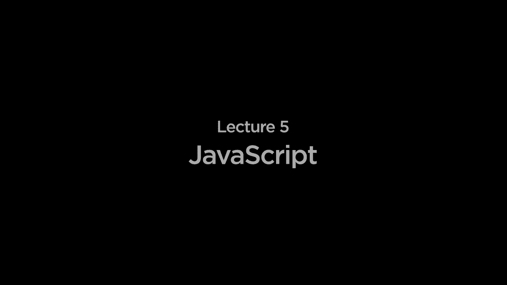
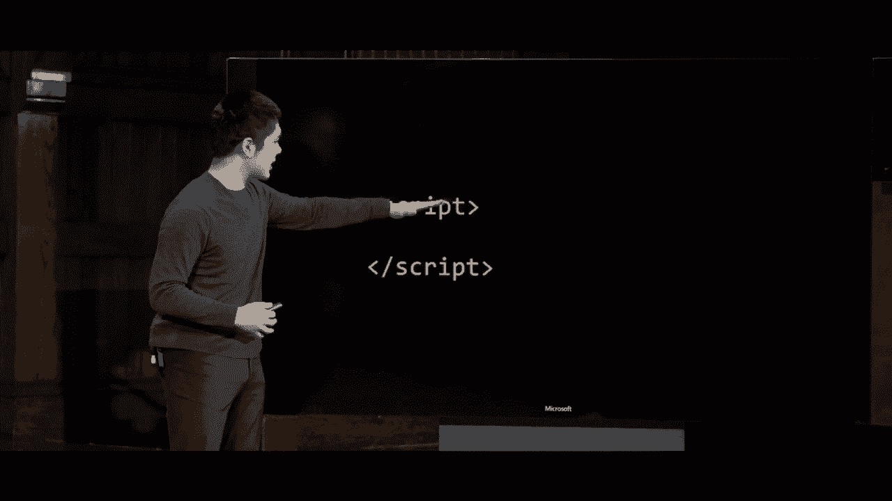
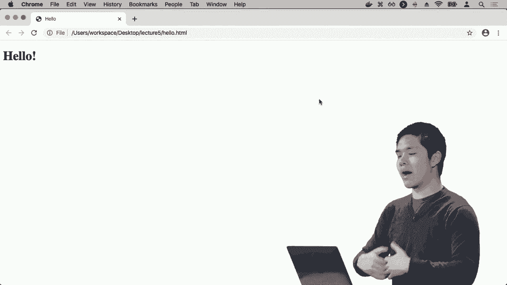
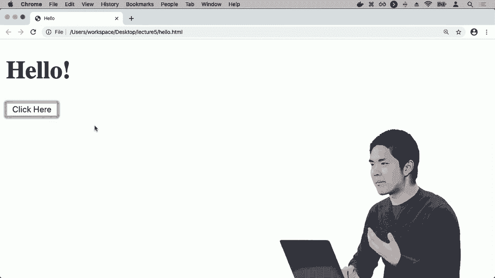
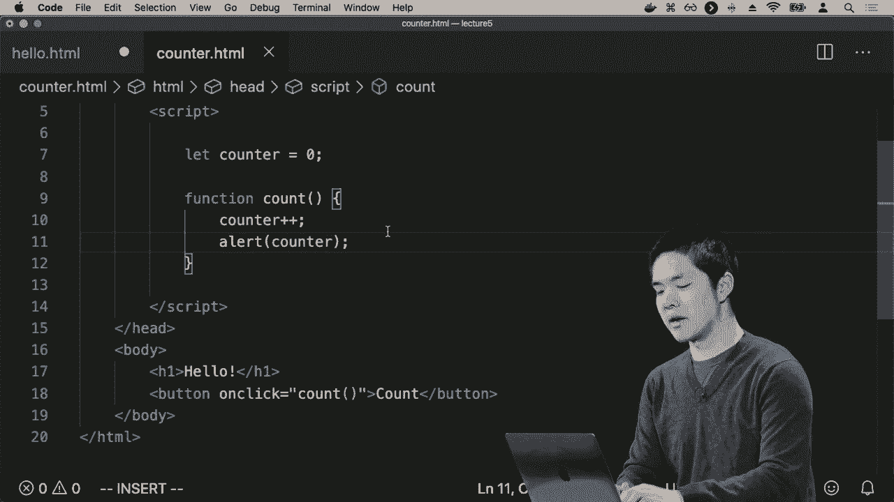
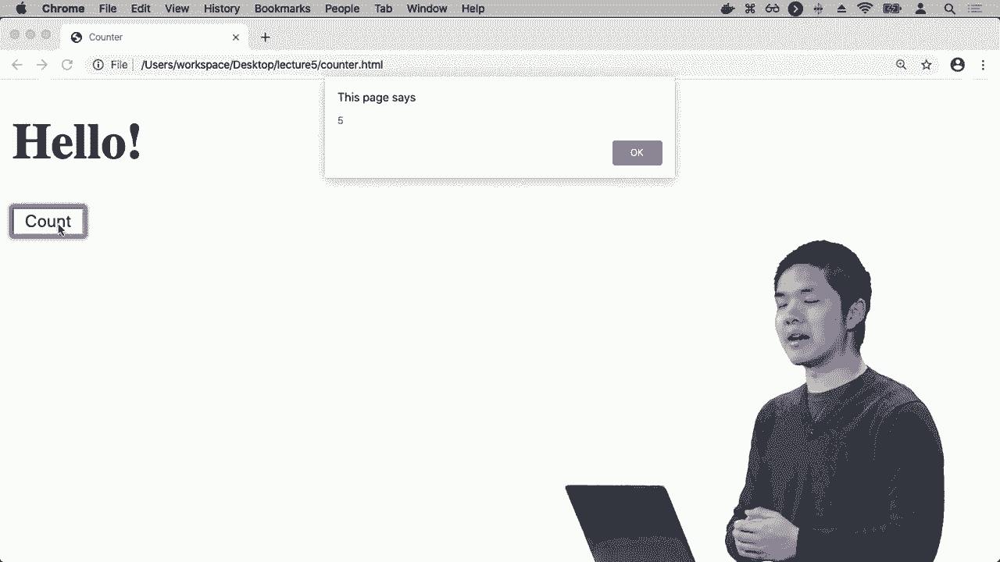
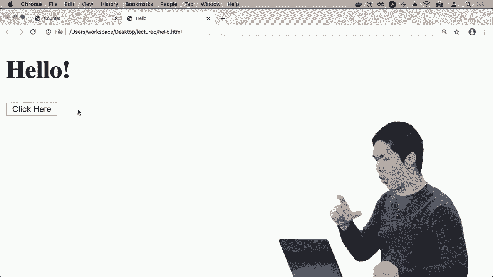
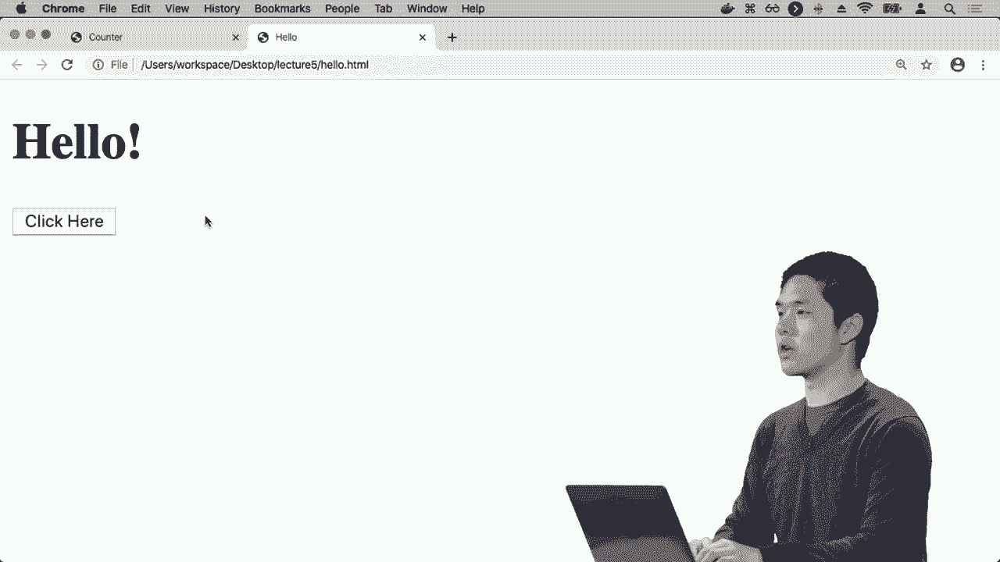

# 【双语字幕+资料下载】哈佛 CS50-WEB ｜ 基于Python ／ JavaScript的Web编程(2020·完整版) - P15：L5- JavaScript编程全解 1 (事件，变量) - ShowMeAI - BV1gL411x7NY

[Music]。

okay welcome back everyone to web，programming with Python and JavaScript。

and today we turn our attention to the，second of the main programming languages。

that would be looking under this class，in particular JavaScript and to get an。

understanding for why it is that，JavaScript is actually helpful let's go。

back and revisit this diagram of what，communication over the Internet will。

generally look like oftentimes we'll，have a user otherwise known as the。

client using their computer on their web，browser whether that's Chrome or Safari。

or some other web browser that sends an，HTTP request a web request to some sort。

of web server that server then processes，that request and then returns some sort。

of response that comes back to the，client thus far all of the code that。

we've written the Python web application，code running in a Django web application。

for example has all been code that runs，on some sort of server code that is。

listening for requests doing some，computation in order to process that。

request and then generating some sort of，response usually in the form of an HTML。

template that we then send back to the，client what JavaScript is going to。

enable us to do is to begin to write，client-side code javascript is going to。

allow us to write code that actually，runs and inside of the users web browser。

on the client and this can be useful for，a number of reasons one if there's。

computation that we want to do but we，don't need to go out and reach out to a。

server in order to do so we can do the，computation potentially faster just by。

running the code exclusively on the，client and in addition to that we can。

begin to make our web pages a whole lot，more interactive javascript is going to。

give us the ability to directly，manipulate the Dom where again the Dom。

is the document object model that tree，like hierarchy that represents the web。

page that the user happens to be looking，at so javascript will enable us to write。

code that directly manipulates the，content on the web page and we'll see。

how that can be quite powerful very soon，so how do we then use JavaScript inside。

of a web page in order to add some code，add some programming logic to a web page。

well so far we've already seen HTML the，language we use to describe the，structure of a web page。

where a HTML page just describes the，structure of a page and in terms of。

nested tags we had those head tags at，the top of the page the body tags that。

describe the structure of the page and，then additional tags that could be。

nested within those and in order to add，JavaScript to a web page if it's as，simple as include。

some script tags that are often located，inside of the HTML page itself when we。

use these script tags we're telling the。

browser that anything in between these，script tags should be interpreted in。

this case as JavaScript code that the，web browser is then going to execute so。

our very first program for example might，just look like a line of code inside of。

the script tags something like this，where alert for example is the name of a。

function a function that's going to，produce an alert and then just as with。

functions in Python functions in，JavaScript can take arguments so in。

between these parentheses we have an，argument something like a string hello。

world the text that we would like to。

display to the user so let's go ahead，and give this a try and see how we can。

actually use this code to write，JavaScript that is going to run inside。

of the user's web browser I'll go ahead，and create a new file that will call。

hello HTML and inside of it I'll include，the same basic HTML structure that we've。

already seen before where I have a head，section that has a title and then a body。

that maybe just says hello for example，and so now what I'd like to do is add a。

little bit of JavaScript to this web，page so in the head section of my web。

page I'm gonna go ahead and add a script，tag we're in between these script tags。

now I can write JavaScript code code，that is going to be written in。

JavaScript that will run inside of the，web browser when the user actually opens。

up this page and for now I'll just say，alert and then hello world it turns out。

in JavaScript you can use either single，quotation marks or double quotation。

marks in order to represent strings and，I'll generally use single quotation。

marks here just by convention so here，I'm running a function called alert。

that's going to display an alert，something like hello world to the user。

and that's going to be inside of the。

script tags of this HTML page so now if。

I want to actually open the page up I，can open hello dot HTML or you could。

just visit it inside of your web browser，whether it's Chrome or something else。

and now at the top of the page what，you'll notice is that I get a little bit。

of an alert some interaction where it，says this page says hello world and。

gives me an option to like press a，button for example like Hello I'd like。

the OK button that'll say all right，dismiss the alert now，and this is our very first example of。

JavaScript we have a function called，alert built into JavaScript for our web。

browser and our web browser knows that，when we call the alert function the。

browser should display an alert message，that looks a little something like that。

and if i click the ok' button to dismiss。

the alert then we go ahead and get back，the original page that i had from the。

beginning and so now we can begin to，imagine that using this ability to。

programmatically display alerts that we，can add additional features to our。

applications as well and one big area，where javascript can be quite powerful。

is with isn't driven programming and，what event-driven programming is all。

about is thinking about things that，happen on the web in terms of events。

that happen what are some examples of，events events are things like the user。

clicks on a button or the user selects，something from a drop-down list or the。

user Scrolls through a list or submits a，form anything the user does and can。

generally be thought of as an event and，what we can do with javascript is add。

event listeners or event handlers things，that say when an event happens go ahead。

and run this particular block of code or，this function for example and using that。

we can begin to allow our JavaScript，code to respond to how the user is。

actually interacting with our web page，to say when the user clicks on a button。

I would like to run this particular，JavaScript function for example so let's。

go ahead and give that a try I'll go，ahead and now instead of just saying。

alert hello world let me put this alert，inside of a function and to create a。

function in JavaScript you just use the，keyword function followed by the name of。

the function I'll call the function，hello for example and then in。

parenthesis any inputs that function，takes this hello function is not going。

to take any input so I'll just use an，empty set of parentheses and then inside。

of curly braces I include any of the，code that I want to run in this function。

and so what I've done here now is create，a function called hello and then inside。

of the curly braces have defined the，body of the function what code should。

run when I run the hello function and，what the hello function should do is it。

should display an alert that in this，case says a hello world so now what I'd。

like to do is get this function to run，when something happens on the page for。

example when a user clicks on a button，so to do that the first thing I'll need。

to do is actually create a button so add，a button that just says like click here。

for example so now if i refresh this，page i now see that i have hello and I。

also have this button that says click，here but when I click here like nothing。

happens I'm clicking the click here，button but it's not changing anything。

because I haven't yet said what should，happen when the user does click on this。

button and so one way we could do this，is by adding an attribute to this HTML。

element called unclick what this is，going to do is it's going to add an on。

click handler to this button it's going，to say what should happen when the user。

clicks on this button and I'm going to，set the onclick attribute equal to。

running the function hello and in order，to run a function in JavaScript just as。

you ran a function with Python you use，the name of the function followed by a。

set of parentheses to say go ahead and，actually run this function using this。

parenthesis calls the function another，word for running the function and the。

fact that there's nothing in between the，parentheses means we're not providing。

anything as input to the hello function，though if the hello function did take。

inputs we could certainly add that in，between the parentheses so now I've tied。

the two pieces of this page together I，have a button that says click here and。

I've added an onclick handler that says，that when you click on the button you。

should run the hello function and then，up above I've defined the hello function。

to say what should the hello function do，well when the function is called we're。

going to display an alert that in this，case says hello world so now we should。

be able to refresh the page we still see，the same thing at least initially where。

it just says hello and a button that，tells me to click here but now if I go。

ahead and click the button that says，click here well then I get the alert。

that says this page says hello world I，can press ok and this event handler is。

always going to work I click the button，again and I get the alert a second time。

because every time I click the button，it's going to call the hello function。

again and when I click the hello when，the hello function runs and it is going。

to display this particular alert so this，now appears to give us a fair amount of。

power and much as in other programming，languages languages like Python or other。

languages you might have worked with，JavaScript has all these same types of，language features so far。

we've seen datatypes things like a，string but we also have other data types。

that we'll take a look at soon too we've，seen functions some functions that are。

built into JavaScript like the alert，function and other functions that we can。

write for ourselves functions like hello，but we also have the ability to include。

things like variables inside of our，like，well I'll go ahead and create a new file。

it will call counter HTML and counter is，going to have some of the similar code。

to hello so I'll just go ahead and copy，it for now but I'll clear out the script。

section change the title from hello to，counter and now inside I'll get rid of。

the button or actually I'll keep the，button but instead of saying click here。

the button is going to say count I'd，like to create a program that just。

counts for me from zero to one two two，three four so on and so forth and now in。

order to do that in order to have some，way of counting repeatedly zero one two。

three four five I'm going to need a have，some sort of variable inside of my。

program something that is keeping track，of data like the number that I'm。

currently have counted to so in order to，do that in JavaScript I can say。

something like let counter equal zero，this is the way in JavaScript that I。

define a new variable I first say let，counter meaning let there be a new。

variable called counter and I'm going to，initially set the value of counter equal。

to the number zero and now when I click，on the button instead of running the。

hello function I'm going to go ahead and，run the count function which doesn't。

exist yet but I'll now write it I'll，define a function called count and what。

the count function is going to do is it，is going to first increment the value of。

counter and a number of ways I could do，that one is my saying counter equals。

counter plus one to say go ahead and，reset the value of counter to whatever。

it counter is plus one and there are a，couple of shorthand notations for this I。

could equivalently say counter plus，equals one to say add one to the counter。

or in the case of adding one javascript，much like languages like c if you've。

seen them before and support notation，like this counter plus plus which just。

means take the value of counter and，increment it add 1 to it，so I'll add 1 to the value of counter。

and then I'll just display an alert，that has whatever the current value of。

counter happens to be and so I've，incremented the value of counter and。

then displayed an alert that shows me，what's contained inside of counter and。

so now if I go ahead and not go to hello，dot HTML but to counter dot HTML instead。

I now see that I still see a button that，says count and if I click on that button。

I get an alert that this time says one，we've incrementing the value of counter。

from zero to one the alert now says 1，and I can press ok if I press count。

again the count now goes to 2 I press ok，press count again it goes to 3 and every。

time I click count it is going to，increment the value of the variable。

counter inside of my JavaScript webpage。

and then it's going to display an alert，that is going to contain the value of，that variable。

so using alerts now we're able to，manipulate that we can inside a，functions manipulate the values of。

variables and then display alerts that，show the contents of those variable ism。

but ultimately when users are，interacting with the page it's going to。

be fairly annoying if the only way that，we have to interact with the user is via。

displaying these alerts the equivalent，of like printing something out except。

instead of printing it to a terminal，we're printing it via an alert that。

appears on the screen what would be more，interesting and more powerful and much。

more useful in the context of a webpage，is if we could programmatically update。

the website change something about the，webpage the user is actually seeing。

changing the content that happens to be，on the page and turns out Java Script is。

going to enable us to do that as well，because Java Script allows us to。

manipulate the Dom the document object，model that represents all of the。

elements that happen to be on that page，so to do that let's go ahead and return。

to hello HTML this again was this paté，web page that just said hello and gave。

me a button where if I clicked on that，button it would display an alert that。

said hello world now what I'd like to do，is instead of having the hello function。

display an alert I'd like to have it，manipulate something on the page and。

what might I want me to manipulate well，inside the body of the page I here have。

this heading this heading that just says，hello for example which is inside of an。

h1 element and what I might like to do，is actually change，that element how can I do that well it。

turns out that in JavaScript we have，access to a function called document dot。

query selector and what document query，selector is going to do is it is going。

to give us the ability to look through，an HTML page and extract an element out。

of that page so that we can manipulate，that HTML element using JavaScript code。

and so if I want to select like an h1，element I can say document query。

selector and then as the argument the，input to document our query selector。

I'll go ahead and say each one meaning，go through the page find me an h1。

element and query selector is only going，to return one element so if they're。

multiple it's going to return the first，thing it finds but here we only have one。

h1 element so it's ok I'm gonna say look，through this document try and find in h1。

element and when you do I'd like to，manipulate it and the way I'd like to。

manipulate it is by saying dot innerhtml，equals of let's say goodbye for example。

so alright what's going on here well，right now initially when we first load。

the page we have an h1 a big heading at。

the top that just says hello and now，when this hello function is called which。

is called when this button is clicked on，because it has an on-click attribute。

that is equal to hello calling the hello，function what the hello function is。

going to do is it's going to say，document query selector h1 find me the。

h1 element that will return this element，right here a JavaScript representation。

of this HTML element that is just an h1，whose HTML inside of it says hello and。

if I want to change that HTML I can do，that by modifying the inner HTML。

property of the JavaScript elephant in，order to update a property of anything。

in JavaScript will generally use this，dot notation we're dot accesses of。

property of some particular object and，so I have this element this h1 and。

saying dot inner HTML means take that，element and access its inner HTML。

property some property of that object，and I would like to update its inner。

HTML to just in this case be the word，goodbye followed by an exclamation point，for example。

so now what we'll see is that when we，run this page when we open this page up。

as by opening up hello HTML I still see，an h1 that says hello I still see a。

button that says click here but now when，I actually click on the button click，goodbye。

we've run JavaScript code that finds an，h1 element on the page and manipulates。

it changing it to something else than it，was originally now every time I click。

here nothing else happens because every，time I click here it's going to find the。

same h1 and it's going to update its，HTML changing it from hello to goodbye。

so maybe what I'd really like then is，the ability to toggle back and forth to。

toggle back and forth between hello and，goodbye rather than just change it from。

one thing to something else every time I，click the button I'd like it to。

alternate back and forth and there are a，number of ways you can imagine doing。

this but one way is by taking advantage，of conditions so much in the same way。

that a language like Python has，conditions ifs and LS and else's。

JavaScript too has if and else if and，else that allow us to describe。

conditions such that we can only run。

certain blocks of code when a particular，boolean expression is true for example。

so what would that look like well let's，go ahead and say inside of this hello。

function I can ask a question if，document query selector H ones inner。

HTML is equal to hello well then go，ahead and set it to goodbye and else。

then go ahead and update the inner HTML，this h1 element go ahead and set it to。

hello instead so what is this hello，function doing it's now a little bit，more sophisticated。

it now has a condition where I say if，the keyword if followed by in。

parentheses the condition that I want to，check for the thing I want to see is。

this true or not and what I'm checking，for is is let me run document out query。

selector h1 which again looks through，the page finds me the h1 tag and get to。

that element for me if I look at that，inner HTML if it is equal to hello then。

I want to do something and this triple，equals sign，is JavaScript's way of checking for。

strict equality checking to make sure，the two values are equal and also that。

their types are the same thing that if，this is a string this must also be a。

string it turns out in JavaScript is，also a weaker way to check for equality。

that just uses two equal signs and that，is going to check the values are the。

same but it's going to allow for a bit，of differences in type the two things。

might have different types but so long，as they're basically the same value the。

double equal sign might generally come，to be true usually if you can you'll。

want to use this triple equal sign the，strict equality to make sure that not。

only are the types the same but the，values are the same too and the triple。

equal sign will check both of those，things so if I go ahead and find the h1。

element and its inner HTML is the word，hello well then go ahead and find the h1。

element and update its inner HTML，setting it equal to goodbye for example。

and else go ahead and find that same h1，element updated inner HTML set it equal。

to hello and again just as in functions，where we use these curly braces to。

enclose the body of the function all of，the lines of code that are inside of the。

function JavaScript does the same thing，to that inside of a condition when we。

want to express that this is inside the，body of an if condition I can use curly。

braces to say this line of code in that，line of code that's inside of the if。

expression or that's inside of the else，expression for example so let's go ahead。

and try this now I can go ahead and open，hello dot HTML，refresh it it currently says hello with。

a button that says click here and now，when I click here hello changes to。

goodbye and when I click here again，goodbye changes back to hello and every。

time I click the button it's going to，alternate between hello and goodbye。

because we either get caught in the if。

expression or we get caught in the else，expression now there are a couple of。

places where you might look at this and，notice that maybe this isn't as。

efficient as this code could potentially，be and recall that every time we run。

document query selector to say go ahead，and try and find a particular HTML。

element for me it's going to look，through that page trying to find the h1。

element and it turns out that right now，we have three separate calls to query。

selector even though only two of them，will ever run on any given instance of，the function but we。

document a query selector then we call，it again inside of the if expression we。

can probably improve the design of this，page by factoring that out by just。

looking for the h1 element once and then，manipulating it and checking it using。

that element that we have found and to，do that we can store an element inside。

of a variable in the same way that a，variable can store a number like a。

counter or a string like hello world it，can also store other values like an HTML。

element that we get back from document，dog query selector so I could say。

something like let heading we're heading，is just the name of a variable the equal。

to document query selector h1 for，instance find the h1 element save it。

inside of a variable called heading and，now rather than document query selector。

each one all the time I can just say if，the headings inner HTML is hello，bye。

otherwise I set the headings inner HTML，to hello，so I've improved the efficiency of the。

program but also reduce the number of，characters of code that I've had to。

write my lines are now much shorter a，little bit easier to read this we would。

consider to be an improvement in design，and it turns out there's one other。

improvement we can make here too that we，can define a variable like let something。

equal something else but it turns out，that JavaScript gives us a couple of。

ways to define a variable and if we're，going to be creating a variable whose。

value is never going to change we're，never going to reassign the variable。

name to something else then instead of，let we can enforce that it's never going。

to change by calling it a Const variable，so Const heading equals document query。

selector h1 means I am going to create a。

variable called heading setting it equal，to the result of document query selector。

h1 and never again will I change what，heading is equal to I will never have。

another line of code that says heading，equals something else because it is。

constant and JavaScript will then，enforce that this variable should not。

change and if ever I do try to change it，javascript will give me an error and。

this can just be helpful to prevent，against possible unintended behavior。

that if you know you have a variable it，is never going to change it's often good。

designed to label it as a constable so，your code，know that that is never going to have a。

value that gets changed later on so this，then will behave the same way where it。

says hello but I can toggle it back and，forth changing it to goodbye and then。

changing it back to hello again and so，now using this ability this ability to。

