# 【双语字幕+资料下载】哈佛 CS50-WEB ｜ 基于Python ／ JavaScript的Web编程(2020·完整版) - P16：L5- JavaScript编程全解 2 (DOM操作) - ShowMeAI - BV1gL411x7NY

our counter program and actually improve，upon it that right now the counter。

program I count and it displays an alert，that says 1 I count and it displays an。

alert that says 2 I can probably do a，little bit better than that by instead。

of displaying an alert actually，manipulating the Dom in some way that I。

would like to have this h1 this big，heading at the top instead of starting。

up by saying hello let's have it start，out by saying 0 for example just some。

initial value for the counter and now，when I increment the value of counter。

rather than display an alert that just，tells me the value of the counter in an。

alert I'm going to instead say document，query selector h1 。 innerhtml。

equals counter where i'm saying find the，h1 element updated innerhtml。

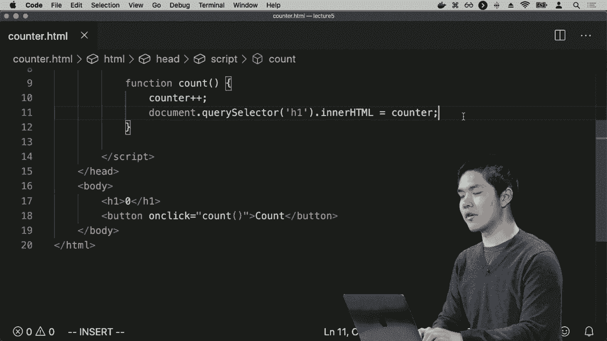

set it equal to whatever the value of，the variable counter happens to be such。

that now if i refresh this page the，value of this h1 initially is 0 that's。

the initial value but every time I click，count we're going to update the contents。

of that h1 element and this time setting，it to 1 2 3 4 and so forth every time I。

click the count button it's going to，increment the value of the variable as。

well as manipulate the Dom actually。

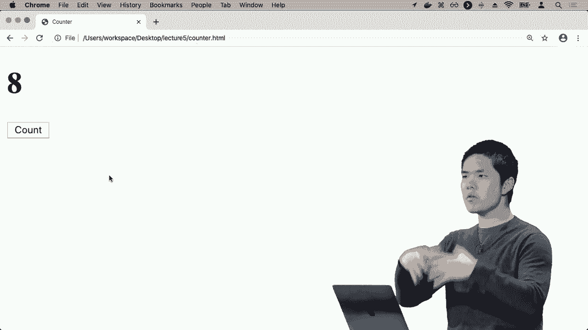

making changes in order to produce the，effect that I want to see on this actual。

page and we can begin to add additional，logic to this as well maybe I do。

occasionally want an alert but I don't，want an alert every single time I could。

add a condition I could say something，like if I only want to display an alert。

every time I count to a multiple of 10，like 10 and 20 and 30 and 40 and 50 and。

so forth I could add a condition that，says that if counter mod 10 and mod just。

gets me remainder when you divide by 10，so if you take the counter divide it by。

10 if the remainder is 0 when I divide，by 10 well that means counter is a。

multiple of 10 and so I can now display，an alert where I can display annele。

that says like I want to say something，like the counter is now 10 or the。

counter is now 20 and in order to do，that what I really want to do is have。

some way of plugging in a variable into，a string inside of JavaScript and in。

Python the way we would have done this，is by you appending f4 prepending F in。

front of the string to create a，formatted string and then I would have。

said something like the count is now and，then I'd use curly braces to say go。

ahead and print out the value of counter，so this f4 formatted string followed by。

this string would have been the way in，python that we would have done this。

turns out javascript does the same thing，just with slightly different syntax it。

doesn't use F instead instead of using，the regular quotation marks whether the。

single or double quotation marks，JavaScript uses these backticks。

which are usually located above the tab，key on a standard u。s。 keyboard and this。

is going to create what JavaScript calls，a template literal where I can then。

substitute the value of a variable，somewhere inside of this template and。

then in order to actually do the，substitution while Python uses double。

curly braces to say plug in the value of，counter right here javascript does。

something similar it also uses double，curly braces but there needs to be a。

dollar sign in front of it the dollar，sign and then the dollar double curly。

braces we can go ahead and plug in the，value of a variable there so this then。

is a template literal where every time，we get to a multiple of ten we're going。

to display an alert that says the count，is now and then this dollar sign curly。

brace means actually plug in whatever。

the value of counter happens to be right，there so now if I go ahead and refresh。

counter it starts at zero I can count 3，4 5 6 7 8 9 but when I get to 10 then I。

get an alert that says the count is now。

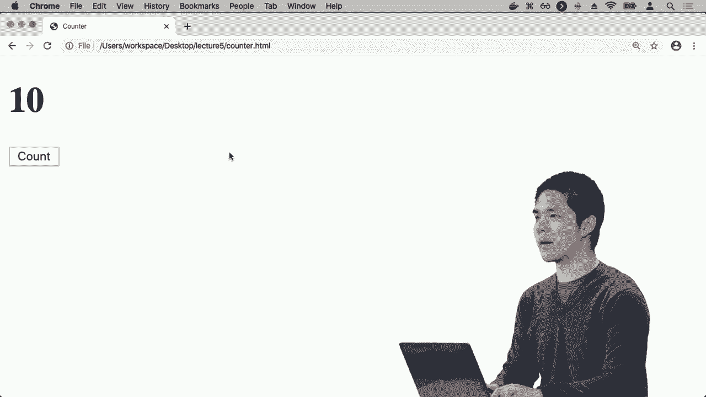

10 and then I see the result update on，the page and so that template literal。

can allow us to combine variables and，strings in order to generate new strings。

that are able to represent data inside，of them as well so now what improvements。

can we begin to make it what changes can，we make to this to improve upon the。

design of it well one thing especially，as our programs get a little bit more。

sophisticated a little bit more，complicated is that we often don't want。

to be intermingling our JavaScript code，with the contents of our HTML the down。

here we have button on click equals，count this name of this function and。

especially as our page starts to get，more complicated it's going to start to。

get a little bit annoying if we're，constantly having to maintain a little。

bit of JavaScript code like making a，call to a function inside of our HTML。

we'll see a little bit later there are，other paradigms that actually encourage。

this type of thing but right now it can，start to get a little poorly designed if。

we'd really like to separate all of our，JavaScript related code from all of the。

HTML the general structure of our page，and so there are ways we can begin to do。

that as well I can add an event listener，inside of JavaScript to that I can say。

something like document dot query，selector button and then I can say dot。

on click equals count so what's going on，here and I can do this instead of this。

on click equals count what I'm now，saying is document query selector button。

find me the button on the page and turns，out there's only one button here so it's。

fine though if there were more I might，have to be a little bit more specific。

but once I get that button then I'm，going to access it's on click property。

and I'm going to set it equal to count，and what does count count is the name of。

a function count is itself a function，and so what I'm here saying is I would。

like to set the value of the onclick，property of the button equal to count。

the count is the function that should，run when the button is clicked on and。

notice that I am not actually calling，the function it's not count and then。

parentheses which were being run the，count function and then get its return。

value and use that as the value for。

onclick I'm just setting on click equal，literally to the count function itself。

without actually calling the function，and what this is going to do is it is。

going to say when the button is clicked，on then and only then should you。

actually run this count function and，we're not going to run the count。

function until that button actually gets，clicked on and so in JavaScript。

functions can be treated as values of，their own just as you can set a variable。

equal to a string just as even set a，variable equal to an integer just as you。

can set a variable equal to like an HTML，element like the result of document。

query selector you can also set a，variable equal to a function something。

like count and passed that around as a，value just as you could with any other。

value and this is a paradigm we，generally call functional programming。

where we have functions as values of，their own things that we can reassign。

things that we can manipulate just as we，could have any other value so now I can。

try and run this program by going ahead，and refreshing the page I'll refresh it。

at zero I press count and alright，nothing seems to be happening it's still。

zero I want it to be counting but it。

doesn't seem to be working so why not，any time you run into problems in。

JavaScript where you're not getting the，behavior you want often it can be。

helpful to look at the JavaScript，console where the JavaScript console is。

the equivalent of like the terminal，window and when you're running your。

Django application in Python that would，display any error messages the。

JavaScript console will display any of，the JavaScript logging information and。

error messages as well in chrome I can，get to it if I first go ahead and go to。

inspect and then just open up the，console tab here and all right we seem。

to have some sort of error here it's an，uncaught type error that says we cannot。

set property on click of no encounter，dot HTML line 18 so that will generally。

tell you where the error is coming from，it's coming from counter HTML on line 18。

and the problem seems to be but I'm，trying to access the on click property。

of no and no is JavaScript way of，expressing like nothing some object that。

doesn't exist so somehow I'm trying to，set the onclick property of no well。

let's see what's going on on line 18 and，see if we can figure out what's，happening there。

well alright here is line 18 where I say，document dot query selector button。

setting it's on click property equal to，count and now what seems to be the。

problem here well the error message was，that I was trying to modify the onclick。

property of no well here then is the，onclick property so why would this。

document query selector button be，returning or giving me an output of no。

well it turns out the document dot query，selector will return null if it's not。

able to find something if I try and find，a button but it's not able to find a。

button well this seems a little bit，here，24 that I'd like for my JavaScript code。

to be able to find when it runs query，selector and tries to find the button as。

it turns out this is a bit of the quirk，of the way the browser is going to work。

but if the browser is running our code，from top to bottom just reading it from。

line one on and on then it's going to，get to line 18 where I said document。

query selector button onclick equals，count and it's going to try and find a。

button on line 18 but the button doesn't，show up in my HTML page until much。

further down in the page so at this，point when we get to this line of。

JavaScript javascript is looking for the，button but the Dom the body of the page。

hasn't finished loading yet the content，of the Dom has not yet loaded and as a。

result we're not able to find this，button so how do we solve this problem。

how do we get it so we actually are able，to like ask for the button and actually。

get the button well it turns out there，are a couple of strategies we could use。

one would be take the script tag and go，ahead and just move it to the bottom。

section of the body so that after we've，already defined the button that says。

count then we have the script tag that，then says alright go ahead and now find。

the button and now we'll be able to find，it it turns out another way and perhaps。

a more common way is to instead add yet，another event listener and we're gonna。

add an event listener not to the button，but to the entire document where。

document is a variable built into this，JavaScript that we have access to on the。

web page that just refers to this entire，web document where I've used document。

query selector already to look through，the whole web document trying to find a。

button or trying to find an h1 tag for，example but I can also add an event。

listener to the document itself and in，order to do that I can say document dot。

add event listener and when I call add，event listener and I can do this on any。

HTML element not just the document but I，could run this function on a button or。

on an h1 element or any other HTML，element add event listener will。

generally take two arguments where the，first is what event I want to listen for。

the event could be something like click，when I click on the document it could be。

something like when I scroll through a，page for example but with the event I'm。

going to listen for is a particularly，special event called Dom content loaded。

and the Dom content loaded event is an，event that is going to be，hired or triggered when the Dom the。

document object model the structure of，the page is done loading when all of the。

elements on the page are done loading，the Dom content has been loaded and then。

if I attach an event listener to it you，know run whatever code I want to run。

that should only run after the Dom is，fully loaded after all of the content on。

the page has then been loaded and the，second argument to an event listener is。

what function should run once the event，actually happens when the Dom content。

loaded does happen so I could pass in，the name of a function if I had the name。

of a function that I wanted to pass in，but alternatively JavaScript allows me。

to just directly write a function here，in the argument to add event listener I。

can just say function and then a set of，parentheses to mean the function doesn't。

take any input and then in curly braces，I can include the body of the function。

right here as the second argument to add，event listener and this is a little bit。

of tricky syntax to wrap your mind，around if you've never seen it before。

but the big-picture way to think of it，is add event listener takes two。

arguments one is the event the second is，the function so here first is the event。

Dom content loaded and the second，argument is a function and I declare the。

function same as before just using，function I haven't given the function a。

name because strictly speaking it，doesn't need a name，I'm never going to refer to this。

function by name so it is what we might，call an anonymous function a function。

that has no name but I'm still passing，it into the add event listener function。

as an argument because I want to run the，code inside of the function once the Dom。

is done loading and so inside of curly，braces then is the content of that。

function the content of what code should，run when the Dom is done loading and。

then at the end I again used just this，end parenthesis where that end，parenthesis lines up with this。

parenthesis here this is enclosing all，of the arguments to add event listener。

where the first one is Dom content，loaded and the second one is this entire。

function that might span multiple lines，so you'll see syntax like this quite a。

bit in JavaScript but now what I want to，do is adding the event listener to the。

button I can go ahead and just for place，I wanted to，instead of saying dot on click equals。

count you could，used the same syntax of add，eventlistener I could say at。

eventlistener click and then count to，mean when the click event happens go。

ahead and run the count function but you，can equivalently shorthand this and just。

say dot on click equals count and that，would work just as well so now what。

we're saying here is that wait until the，Dom has done loaded wait until all the。

content on the page is loaded and then，go ahead and run this function and what。

the function is going to do is it's，going to add the event handler to this。

button and that'll work because now，we'll be able to find the button because。

now all of the content of the Dom has，loaded so now if I go back Refresh。

counter dot HTML you'll notice that the，JavaScript error goes away I don't seem。

to have that error anymore and now if I，press count were able to see the count。

increment just as before as well and so，this then is an improvement upon what。

I've had before where now I'm able to，separate out my JavaScript code from all。

of the rest of my code as well but much，as in the case of CSS where we were able。

to take CSS that was originally located，in the head of our page and move it into。

a separate file you can do the same，thing with JavaScript too and this can。

be helpful if you have multiple people，working on different files you want one。

person working on the HTML and someone，else working on the JavaScript it can be。

helpful if you expect that one of these，things is going to change more。

frequently than the other so you might，not need to load the other one as often。

so there can be value in separating our，HTML code from our JavaScript even more。

and by moving our JavaScript into a，separate file and so in order to do that。

I can create a new file that I'll just，call counter j/s which will contain all。

of the JavaScript for my counter HTML，file so in order to do that what I can。

say is let's go ahead and copy all of，this JavaScript code go ahead and cut it。

out of this page and I'll paste it into，counter j/s remove some of that。

indentation so now I have a file called，counter das that just contains all of。

the JavaScript I want to run on my，counter dot HTML page and now rather。

than include actual JavaScript in，between these script tags what I can say，is script SRC SRC first。

equals a counter Jas for example if I go，ahead and reference counter Jas and use。

that JavaScript in the head of the page，here and that then is going to work。

exactly in the same way I still am able，to count as high as I'd like I still get。

an alert every time the count reaches a，multiple of ten but my HTML is now a。

little bit simpler it's just the body，it's just the h1 in the button and then。

all of my javascript is now located in a，separate file that allows me to do that。

allows me to keep my HTML code and my，JavaScript code separate from each other。

and that can be value for valuable for a，couple of reasons among them if I have。

common JavaScript code that's in use by，multiple different HTML pages multiple。

HTML pages can all include the same，JavaScript source rather than needing to，repeat myself。

use the same JavaScript across multiple，different pages I can just use the same。

JavaScript across all of them and，that'll be helpful too as we begin to。

take a look later at some JavaScript，libraries which are JavaScript written。

by other people we can just include，other people's JavaScript in our own。

webpages just by adding a script tag at，the top of our page that specifies a。

particular source you may have already，interacted with bootstrap that has its。

own JavaScript code and you can include，bootstraps JavaScript just by including。

a script tag at the top of our HTML page，in order to say go ahead and include all。

of that javascript in our page as well，so what else can we do now now that we。

have the ability to like get at elements，of the Dom and actually manipulate their。

contents well one thing we can do is，begin to make our pages a little bit。

more interactive actually respond to，what users are doing on the page whether。

the user is typing something in or maybe，filling out a form for example so let's。

go ahead and try an example of that，where the user might be filling out a。

form and we would like for our code to，somehow respond to what it is that they。

type I'll go ahead and go back into，hello dot HTML and now inside of the。

body of the page I've said hello at the，top I'm here instead of a button I'm。

going to have a form this HTML form will，look like the HTML forms we've seen。

before a have an input field that'll add，the auto focus attribute to to mean like。

automatically focus this input field，want，user to start typing right away I'm。

gonna give this input field an ID of，name for example and then a placeholder。

of name capital n whose type is text so，what have I done here I've created an。

input field where the user can type in，some text the placeholder the thing the。

user see is filled into that input field，originally will just be capital and name。

telling them they should type their name，in here and I've given this input field。

an ID some unique identifier such that I，later on can reference and find this。

particular input field and then I have，input type equals submit some way for me。

to now submit this form as well and so，if I load this page load hello dot HTML。

here's what I see hello a field where I，can type in my name the placeholder name。

shows up there for me and then a button，where I can submit this form and now。

what I'd like to do inside of my，JavaScript is instead of this hello。

function what I'm going to do is I'm，going to first run some JavaScript when。

the Dom is done loading and so I'll use，that same line from before you're gonna。

see it quite a bit we're gonna say，document add event listener Dom content。

loaded and then this function to mean go，ahead and run this code when the Dom is。

done loaded and the code I'd like to run，is to say when I submit the form I want。

something to happen when I submit the，form maybe I want to display an alert。

that if I type in Brian it'll say hello，Brian or if I typed in David it'll say。

hello David for example so how many I do，that well how do I get the form that's。

the first question anytime you want to，get at an element one particular element。

on an HTML page usually what we're going，to do is document dot query selector to。

say get me the element that is a form，and there's only one form on the page so。

I don't have to worry about ambiguity，I'm just saying get me that form and。

then I can say dot on submit when you，submit the form what code should run and。

if I had a name of a function like a，function f I could just say like run。

function f when the form is submitted，but alternatively just as before instead。

of providing the name of a function I，can also just provide the function，itself。

I can say function and then in between，these curly braces I can specify exactly。

what code should run when the form is，submitted by providing this anonymous。

function instead using this anonymous，function as the value of the on submit。

property of this form and so now what，I'd like to do is somehow get access to。

whatever the user typed into the input，field whatever the user's name happens。

to be and so I could get the input field，by a document dot query selector input。

and that would work this time but we'll，want to start to be a little bit careful。

because on this page there are multiple，different input elements as an input。

element here for typing in the name and，a second input element here for telling。

me giving me a button where I can submit，this particular HTML form and so what I。

probably want to do is be a little bit，more specific and it turns out that。

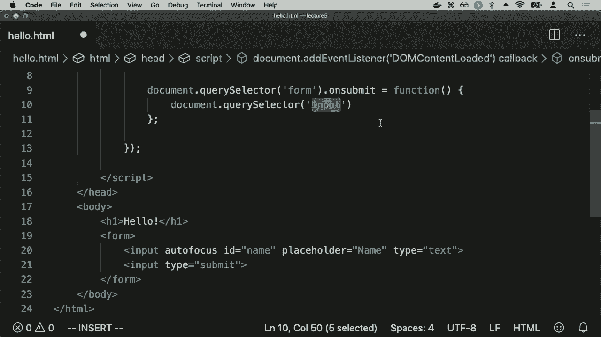

inside of query selector I can use all，of the standard ways in CSS that we。

could select for a particular element so，in CSS if you'll recall we had the。

ability to run CSS and just say style，all the h1 or we could say style all the。

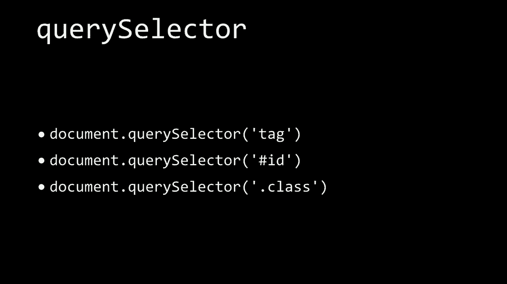

things with this particular ID or with，this particular class and document our。

query selector works the same way that I，can say document query selector and pass。

in a tag to say like get me the h1，element or get me the button or get me。

the form but if there are multiple h1，elements are multiple buttons and，than that。

if for example an element has an ID in，which case I can say document query。

selector and then in quotation marks the，hash mark and then the name of the ID to。

say get me the element with that，particular ID again using the exact same。

syntax that CSS uses if I want to apply，a particular set of styles to only one。

element that only has one ID likewise，two I can say document query selector。

and then use dot followed by the name of，a class if there's a particular。

particular class of elements and I want，to just get one of those and to say get。

me an element that has this particular，class in order to manipulate it as well。

so the same types of syntax that we，could use in CSS for trying to reference。

and get at a particular HTML element we，can do the same thing here with document，query so。

to go ahead and try and get a particular，element based on its tag name based on。

this ID or based on its class and it was，for that reason that inside of the HTML。

page for my input I gave the input an，idea of name I wanted some way to be。

able to uniquely reference it and I can，uniquely reference it not by input but。

by pound name where I can say get me the，element that has an ID of name and that。

is the element that I would like to，extract inside of my JavaScript code。

once I have that HTML element what I，want is like what the user actually。

typed into that input field and it turns，out that if you have an input field in。

HTML I can get access to what the user，typed in by accessing its value property。

value is a property that fur that refers，to what it is the user actually typed in。

so I can say dot value and I'm going to，go ahead and save that inside of a。

variable so I could say something like，let name equal whatever the user typed。

in but if I'm not going to reassign name，to something else inside of this。

function inside of this function I'm，really going to get the name once and。

I'm not gonna change it inside of the，function so I can use a constable。

instead that would be better designed to，say I have a constant variable called。

name which is equal to document query，selector get me the element whose ideas。

name and get access to its value and now，I can display an alert I can alert。

something like in backticks hello comma，and then using the dollar sign curly。

brace syntax I can say plug in the name，there followed by an exclamation point。

so I've extracted the name from the form，get me the input field where they type。

to the name get access to its value and，then I'm displaying an alert that is。

going to say hello to that person for。

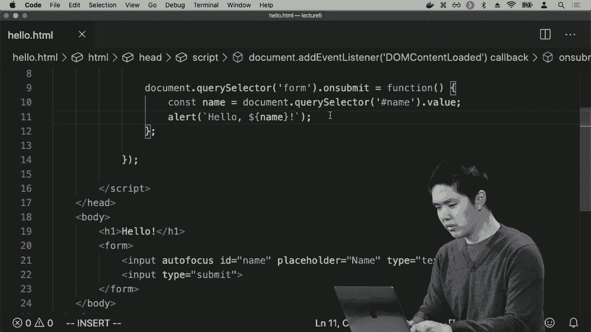

example and so now for refresh the page，I type in my name I press submit I get。

an alert that says hello Brian，press ok I can try it again I can type。

in something like David it press submit，and now the page says hello David。

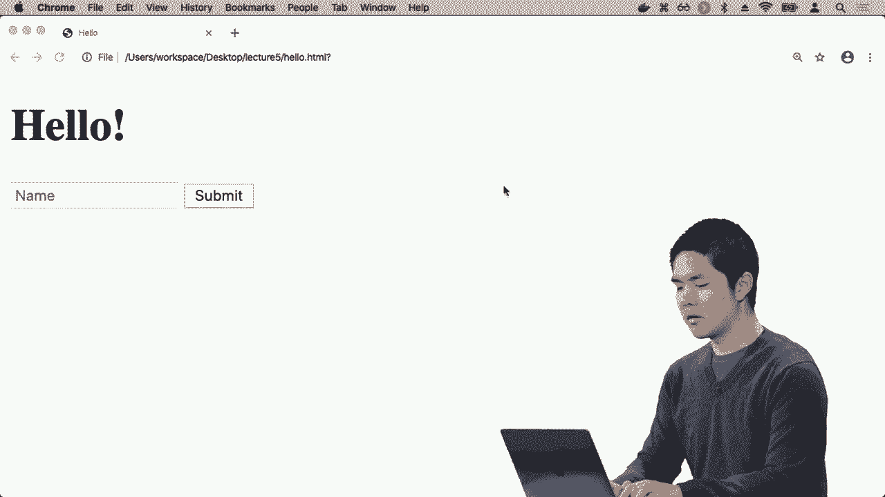

so here again we've been able to combine，event listeners and functions and query。

selector to be able to both read，information from the page in order to，say get me。

this particular HTML element find me an，HTML element and access like what the。

user typed into it the dot value，property that gets me what the user。

typed into an input field and we've been，able to combine that with event。

listeners and alerts that are able to，actually respond dynamically to when a。

user submits the form or when the entire，content of the page is done loading in。

order to produce some interesting，effects as well but it turns out we can。

do more than just change like the HTML，that is contained within an element we。

can also change CSS as well change the，style properties of a particular element。

as well so let's go ahead and see an，example of that I'll go ahead and create。

a new file then I'll call colors HTML，and inside of colors I'll include the。

same standard HTML boilerplate code that，we often start with a head section with。

a title and a body section and inside of，the body of this page I'm going to。

display a heading that just says hello，for example and maybe I'll give it an ID。

just so I can reference it by name maybe，it has an ID of hello and then I'll have。

three buttons I'll have a button called，read a button called blue and then a。

button called green for example where，now if I open up colors dot HTML here's。

what I see I see a big heading that says，hello and then I see three buttons red。

blue and green but of course right now。

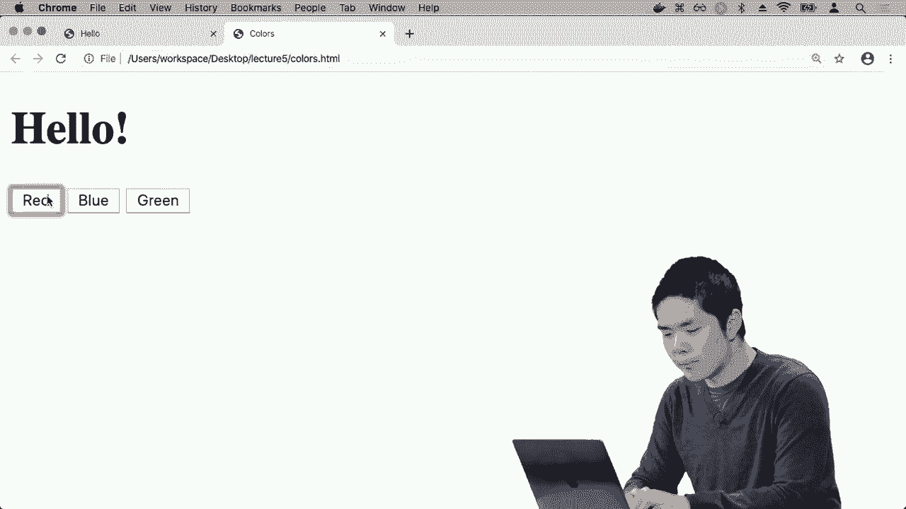

these buttons don't actually do anything，how do I get the buttons to do something。

well that's where JavaScript's going to，come in I'll add a script tag to the top。

of my page and I only want to run this，JavaScript when the Dom is done loading。

so again we'll use the same syntax as，before document dot add eventlistener。

Dom content loaded and then run this，function to say everything in between。

these curly braces this is all the code，that should run once the page is done。

loading and what I'd really like to do，is get at these three buttons and say。

when you click on each one of them do，something different like change the。

color of a particular HTML element and，in order to do that I need some way of。

uniquely referencing these buttons so to，do that I'm going to give them all IDs。

this button will have an ID of red this，button will have an ID of blue this。

button will have an ID of green，unique names I can give to the buttons。

in HTML such that in JavaScript，I'm later able to reference them so what。

I what do I include now here inside of，my JavaScript code，well let me say document dot query。

selector hash read to say get me the，element whose ID is read and when you're。

clicked on on click go ahead and run，this function，what should the function do well I want。

to take this h1 element and change its，color to red I want to change the font。

color to red and I'll leave a comment to，myself in JavaScript the way you can。

leave a comment just a document what，you're doing is using these two slashes。

the two slashes indicate everything，after that on the page is going to be a。

comment browser will ignore it but it，can be useful to use a programmer and to。

someone who's reading your code to be，able to see what it is that you're。

describing here on the page and now what，I'd like to do is document query。

selector hello get me the HTML element，whose ID is hello and go ahead and。

modify its style property and now inside，of this style object I can modify any of。

the CSS style properties one of them for，example is something like color so I can。

update the color property and set it，equal to red so here now I'm saying when。

you click on the red button go ahead and，run this function and what the function。

should do is find the hello element，update it style what part of the style，update its color。

what should we update it to we should，update it to red and I'm gonna do the。

same thing for the other two buttons as，well and it's pretty similar codes I'm。

just going to copy paste copy paste here，I'm gonna have one for changing the。

color to blue when I click the blue，button you should change the color to。

blue and then we'll do it one more time，change the font color to green when you。

click on the green button you should。

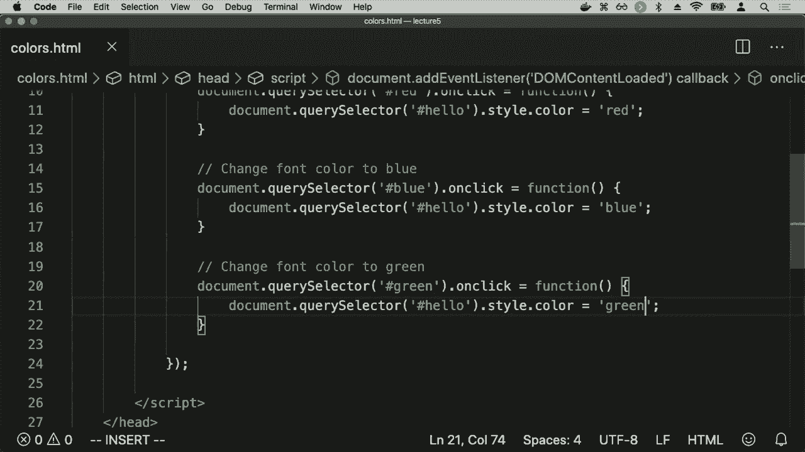

change the color to green so now when i，refresh the colors wml right now hello。

by default it's just in black standard，font color for HTML I click red hello。

changes to red I click blue it changes，to blue I click green it changes to。

green so depending on what button I，click that triggers some event listener。

that's going to then say when the button，is clicked run this function and what。

the function does is it grabs this h1，element the element whose ID is hello。

modifies it style updates its color，property to be something like red or。

blue or green and that's showing that we，can modify style，in addition and just modifying the。

content of the page itself but it turns，out that as you looked at me writing。

that code something should have struck，you is probably not optimal design then。

in general any time you find yourself，writing the same code again and again。

and again especially if your copy，pasting that that is a generally a bad。

sign usually a sign that there is some，better way of trying to modify of trying。

to implement the behavior that I'm，trying to create and it turns out that。

there is and there are a number of ways，that you could do this one way here is。

that I might like to consolidate these，three event listeners into just like a。

single function that is going to handle，changing the color to whatever the。

button says the color should be changed，to but one problem here is that if I。

just attach the same event listener to，all three of the buttons it's not going。

to be clear to me when I click on the，button how does the button know what。

color we should change the text to and，so to that effect we can add some。

additional special attributes to a，particular HTML element that are called。

data attributes where a data attribute，is my way of saying that I would like to。

associate some data with this particular，h2 what HTML element we're here I can。

say data - color equals red data - color，equals blue data - color equals green。

data attributes always start with data，followed by a dash and then I can。

specify really any name that I want for，some information that I would like to。

store about the HTML element and here，the information I want to store is I。

want to store data about what color you，should change the text to when the。

button is clicked on and so what we're，gonna have the ability to do now is the。

ability to say that if I have access to，this element this button I can access。

its data color property to know whether，we should change the text to red or blue。

or green by adding these data attributes，to these HTML elements。

and so now what I want is some way of，getting all of these buttons now。

document query selector as you recall，just gets one element it's just going to。

get for me a single element and it's，gonna get the first one that it finds if。

I want to get multiple elements what I，can do instead is something like。

document dot query selector all query，selector all is going to return the same。

thing the query selector does but，instead of query selector returning a。

single element that matches what it，looks for query selector all is going to。

return to me an array of all of the，elements that match my particular query。

so if I want to select not just the，first button I find but all of the。

buttons I find I can here say query，selector all for button and that will。

give me back a JavaScript array the，equivalent of a list that represents all。

of those buttons and we can actually，test what this looks like by looking at。

things inside of the JavaScript console，that if I go ahead and refresh this page。

colors I can open up the inspector go，into the JavaScript console and just as。

you could see error messages here you，can also actually write JavaScript code。

here as well so I can say something like，document query selector button say all。

right what's going to happen when I try，and select for a button on this。

particular page and what I get is all，right I get just this very first button。

button whose data - color is equal to，red that's what I would expect query。

selector just finds me one element and，it's going to find me，the very first element and likewise I。

can say all right，instead of query selector let's do query，selector all and what I get back is a。

node list which you can think of as kind，of like an array or a list in Python。

that's got three buttons in it button 0，1 and 2 and just as with a list in。

Python as you can index into things，arrays and python arrays in JavaScript。

can be indexed into as well but if I，have something like constant Eames。

equals Harry Ron and Hermione like a，array of 3 names I can say name squ*re。

bracket 0 to get the first name name，squ*re bracket 1 to get the second one，one for。

example and that gives me each of the，individual elements in the array if I。

want to get the whole length of the，array I can do names dot lengths to get。

all right the length of the names array，happens to be three so just some。

additional features that we have access，to if you happen to have an array of，things。

turns out query selector all returns to，me a node list which is kind of like an。

array and that's going to be useful，because when I say document query。

selector all button I am saying get me，all of the buttons on the page and now。

what I would like to do is effectively，loop over all of those buttons and say。

for each of the buttons inside of this，list that comes back to me I would like。

to add an event handler for when that，button is clicked on to say for each of。

the buttons that comes back go ahead and，say when you're clicked on change the。

color of the h1 element and so there are，a number of ways again that you could do。

this but one way is to use a particular，property called for each and for each is。

a function that accepts as an argument，another function where the idea is going。

to be I would like to run a function for，each of the elements inside of an array。

or inside of a node list for example so，here I can say for each button go ahead。

and run this function this is going to，be a function now that takes something。

as input it's going to take one of the，elements in the list as input something。

like a button and now for each button，what would I like to do for that button。

well when the button is clicked on，button dot on click then go ahead and。

run a function that is going to document，query selector get me the element whose。

ID is hello change its style within the，style change its color and what do I。

want to change its color to well I have，access to this button this argument to。

the function is whichever button I'm，currently trying to add an event。

listener for and in order to access its，data properties I can access a special。

property of an HTML element called it's，a data set property and then I can say。

something like button data set。

color to get at the data - color，attribute so a lot of stuff going on。

here let's go ahead and try and read，through this entire thing and just get a。

feel for what's happening because we，have functions nested within other。

functions nested within other functions，up at the very top I said add an event。

listener to the document when the，documents Dom content is loaded meaning。

all of the content of the page is done，loading go ahead and run this function。

this is the body of the function so what，do I want to do when the page is done。

loading I'm going to document dot query，selector all looking for all of the。

buttons and if I wanted to if there，could be more buttons I could have added。

a class to these buttons and just look，for things of the particular class query。

selector all just returns all of the，elements that match a particular query。

and then I'm saying for each of those，buttons for each of the buttons that。

came back I would like to run a function，on each of those buttons I'm basically。

saying if I have three buttons that came，back let me run a function on the first。

button then the same function on the，second button then the same function on。

the third button and what is that，function well it's this function here a。

function that takes as input the button，its first gonna pass in as input the。

first button then the second button then，the third and what this function does is。

it adds an onclick handler to the button，it says when the button is clicked on go。

ahead and run this other function and，this function now is the function that。

will run when the button is clicked on，to say when the button is clicked on get。

me the hello element change its color to，button dataset color and button dataset。

that color takes a button takes an HTML，element like this one here and accesses。

its data set all of its data properties，and specifically accesses the color data。

property which in this case is equal to，red and that is what we would like to。

set color equal to so a little bit more，complexity we've seen before。

but now we've been able to reduce what，was three different event handlers into。

just a single one and now this is going，to work the same way change it to red。

blue and green all by just using those，data properties that we have access to。

and so when in doubt about how these，things are working about what query。

selector is returning the JavaScript，console can be a very powerful tool for，console。

and actually manipulate things you can，running run queries you can run。

functions you can even modify their，values of variables like if I go back。

for instance to counter dot HTML or head，this counter that's counting 0 1 2 3 4。

if I wanted to I could say something，like counter equals 27 just like change。

the value of the counter nothing appears，to have changed on the page I didn't say。

update anything on the page but now next，time I run count it's going to update。

the value of the count to 28 because I，had updated the value inside of the。

JavaScript console it's going to，increment that value display that value。

inside of the h1 element so you can，modify variables that you can run。

functions you can run document query，selector to figure out what particular。

elements are going to come back all，through the use of the javascript。

console which can be a very very，powerful tool especially as you begin。

working on trying to debug these，programs and trying to figure out what。

might be wrong with them it turns out，too that there are other changes that we。

can make in order to optimize our code a，little bit more in order to make it a。

little bit more succinct and one way is，that in more recent versions of。

JavaScript they've introduced a，particular notation for functions called。

the arrow notation for functions and，I'll just show it to you because it'll。

come up but often times instead of using，the keyword function before introducing。

a function you'll just have something，like button and then arrow the curly。

braces and strictly speaking you don't，even need the parentheses around the。

input where button arrow and then in，these curly braces some code just means。

here is going to be a function that，takes as input a variable called button。

and then runs this particular block of，code when that function is run and。

likewise if a function takes no input，like this function up here you could。

express it using arrow notation with，just parentheses a arrow block and so。

this is often a notation that you'll see，in Java scripts if you ever see it know。

that that's really just shorthand for，creating a function whatever is to the。

left of the arrow sign is the input to，the function and whatever is to the。

right of the arrow is what code should，actually run when the function body gets。

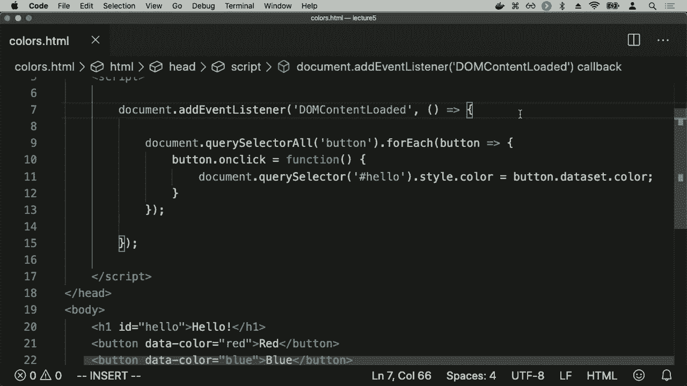

executed when the function is called，upon so what other changes might we want。

to make two colors dot HTML well if we，look back at colors dot HTML here's what。

it looks like now we've got a heading，that says hello and then，to change the color to red or blue or。

green for example we might instead if we，want the user to choose from one from a。

number of options decide upon the user，interface choice of using a drop-down。

instead of a bunch of buttons for，example and JavaScript supports that as。

well and we'll use this as an，opportunity to explore some of the other。

event handlers that exist within。

JavaScript so for example instead of，having these all inside of buttons I can。

make my life a little bit easier by，making this a select drop-down where the。

Select is going to have an option whose，value is I'll say black is the default。

option and I'll say black and then we'll，add another option whose value is red。

and then we say red and the value is，what we'll get in JavaScript when we try。

and extract the value of a particular，select drop-down well it's in between。

the option tags themselves is what the，user is going to see on the page when。

they actually view it so I'm，capitalizing it just for them option，value equals blue。

that'll be blue and then option value，equals green and that'll be green so now。

what the user sees is they see hello and，then a drop-down menu where they can。

choose from a list of colors rather than，click buttons in order to do so and now。

of course this select drop-down doesn't。

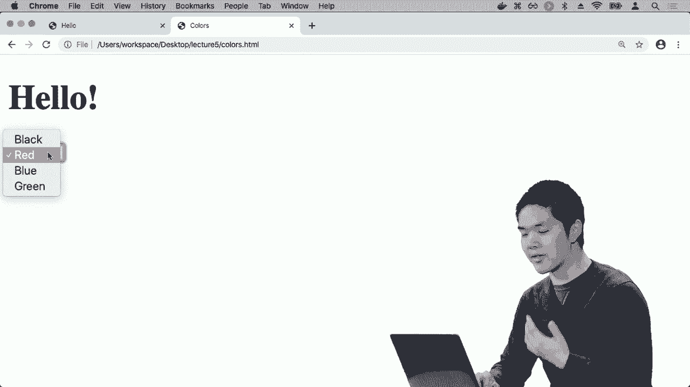

do anything at the moment but I can，modify it so that it does so now instead。

of selecting for all of the buttons and，doing something with all the buttons we。

don't have any buttons anymore what I do，have is I have a select drop-down and。

now just as we've seen like on click to，say when you click on something as we've。

seen Dom content loaded as an event，there's another event called on change。

which applies to things like select，dropdowns where when something changes。

in the select drop-down when a user，chooses something different。

I can run some code for example so I can，run a function that in this case is。

going to take document query selector，hello，meaning get me the hello HTML element。

change its style what part of the style，changed its color and I want to change。

it to something I want to change it to，the value of this select drop-down but。

how do I get access to this particular，select drop-down well in JavaScript we。

have access to a special value called，this and this has special meaning in。

JavaScript and its meaning varies based，on context but in the context of an。

event handler a function that is called，when a particular event happens this is。

going to be a special keyword that，always refers to the thing that received，the event。

so what received the event it was the，select drop-down that is what received。

the event is being changed and so this，is going to be a special keyword that。

always refers to that that always refers，to the drop-down menu where I made a。

different selection so if I want to get，the value of that drop-down menu what it。

is the user actually selected I can just，say this dot value to mean get that。

drop-down menu and get at the value the，thing that the user is selected in that。

idea and now much more succinctly than，before I've been able to implement the。

same kind of idea says hello right now，in black but if I choose from the。

drop-down menu to change its color to，something like red for example color。

changes to red if I instead choose blue。

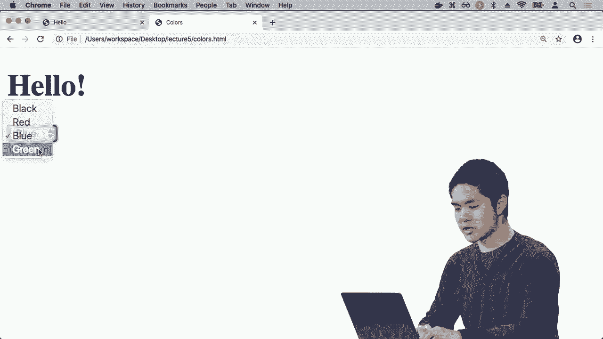

it changes to blue green changes to，green I choose black it changes back to。

black so now I have this ability to，detect these other types of events and。

respond to them as well and there are，many many different events that exist in。

JavaScript there's on-click which we've，seen already on mouse-over can detect。

like when you mouse over something when，you're hovering over a particular。

element if you've ever seen web sites，that somehow respond when your mouse。

moves over something that can be how，it's implemented on key down and onkeyup。

can respond to keyboard event something，like when you press a key on the。

keyboard when you press down on the key，that's on key down and when you lift。

your finger off the key that's on key up，and there are other events as well many。

more events that are just listed here，that you can listen for and respond to。

so that you can really interact with the，user based on what it is that they're。

doing so now let's take a look at an，example of how we can use some of these。

events to now begin to create a little，bit of a more interesting application。

we'll go ahead and build a to-do list，application this time using exclusively。

JavaScript we've seen to-do lists before，that involve communicating with a server。

making requests and responses will now，build it to-do list that only uses。

JavaScript to do so so I'll create a new，file called tasks HTML and we'll use a。

we'll create a head section whose title，is tasks and a body section and inside。

the body of the page I'll go ahead and，have a heading that says，tasks and underneath that I want an。

unordered list of all of my tasks so，I'll have an unordered list I'll give it。

an ID of tasks just for good measure so，I can reference it later but initially。

nothing's going to be in here but what，I'll have underneath the unordered list。

is a form a form where I can submit a，new task for example so I'll give myself。

an input field also given an ID the ID，will be tasks singular for the new task。

that I am typing in the placeholder will，be new tasks just so the user knows what。

to type in and the type of the input，field will be text so I have an input。

field where the user can type in some，new tasks and I'll also add an input。

field for good measure whose type is。

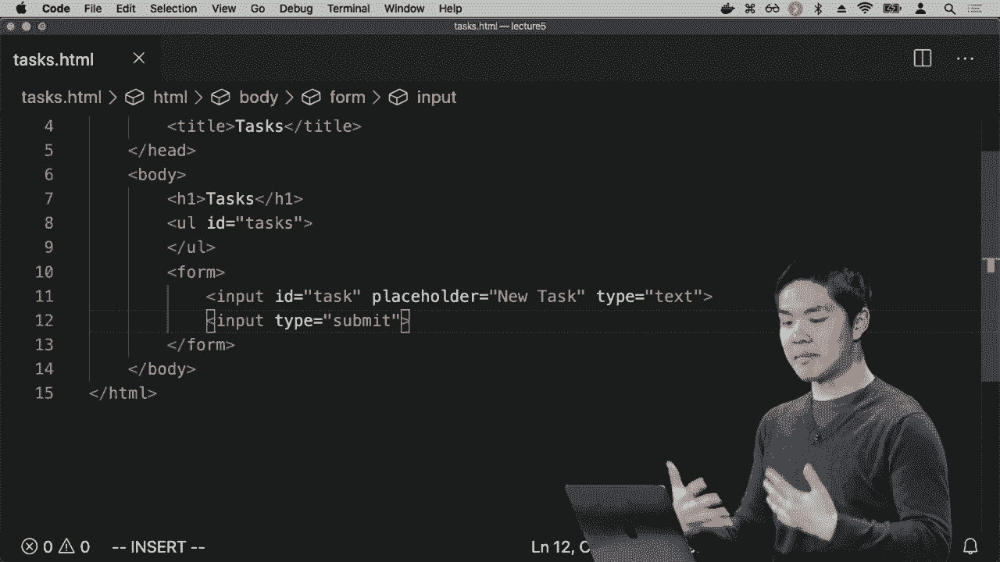

submit that allows the user to submit a，new task once they've created it so if I。

open up tasks dot HTML here's then what，I see big heading there is technically。

an unordered list underneath it here but，there's nothing in that unordered list。

yet so it just shows up as empty then a，text field where I can type in a task。

and then a submit button where I can。

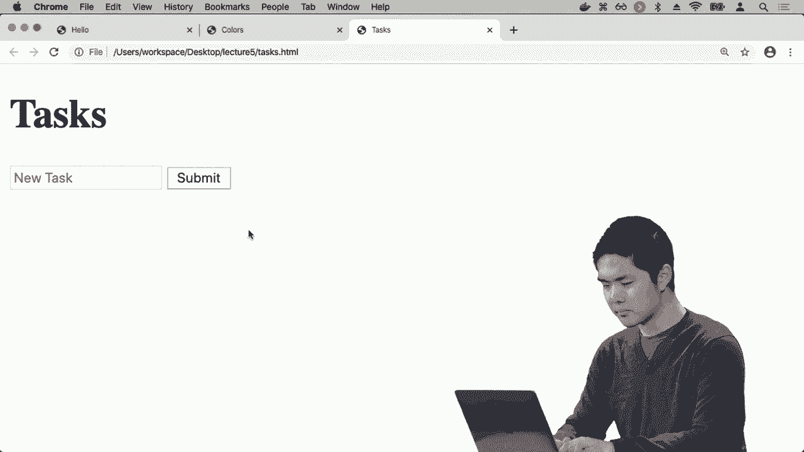

submit my new task so now I'd like some，JavaScript such that when I submit this。

form we actually do something so add a，script tag，I want this JavaScript to run after the。

Dom content is loaded so we'll go ahead，and add the usual Dom content loaded。

event listener and now I want to run，code when the form is submitted so I can。

say document query selector form dot on，submit equals and then I want to run a。

function and I could use the keyword，function again but I can just use an。

arrow function which would be a little，bit faster to type just say alright。

here's the function that I want to run，when the form is submitted and what。

would I like to do well I'd first like，to figure out alright what did the user。

actually type in and what the user typed，in well that'll be document query。

selector task dot value get me the，element with ID task that's the input。

field dot value gets the value of the，input field which is what the user。

actually typed in and I can save that as，like Const tasks that is what it is the。

user typed in and if I'm curious as to，what the user typed in I can。

actually print it out to the JavaScript，console and the way to do that is using。

a special function called console。log，and that just logs something to the。

console the equivalent of printing，something out in Python where just shows。

up in the Python terminal here this is，going to show up in the JavaScript。

console and one other thing I'll add is，by default forms will try and submit。

when you press the submit button like，take you to another page we've seen this。

before already in the context of Django，that when you submit a form it tries and。

submits another web request if I want to，prevent that behavior stop the form from。

submitting it's a stop form from，submitting I can return false at the end。

of my form submission handler to say，don't actually submit the form we're。

gonna do everything client-side。

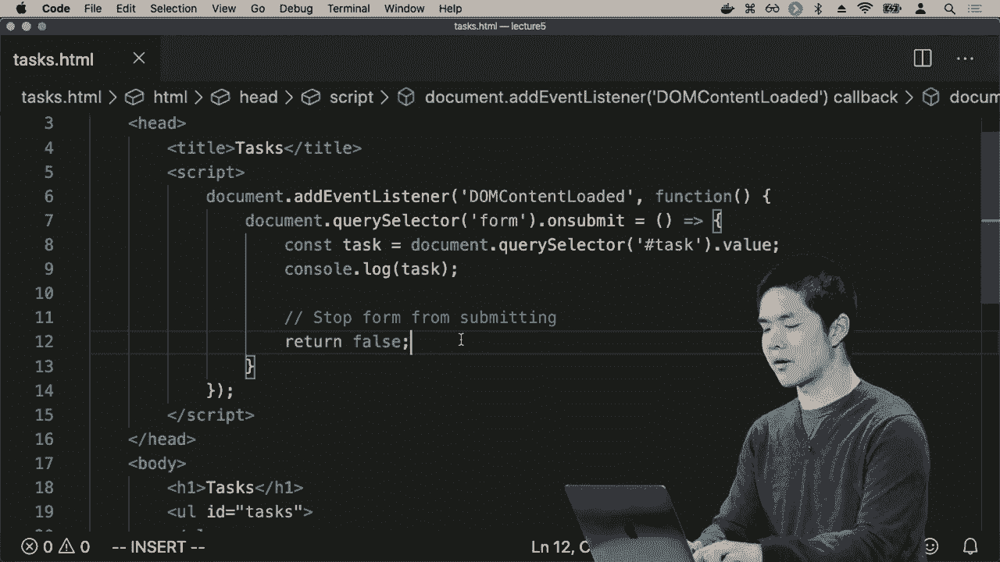

everything just inside of the browser so，now this won't quite work yet but it'll。

be progress i refresh the page I'm gonna，open up the JavaScript console so I can。

see what's going on if I add a task。

something just like foo press submit，this now gets logged to the JavaScript。

console it's the equivalent of a way of，like providing debugging information to。

myself to know all right，I now have access to this value foo and。

it's also telling me what line of code，logged it it was tasks HTML line 9 is。

the line of code that logged foo and so，this can be useful when you're debugging。

a program when you want to see what the，values of variables are you can just。

print them out using console log to，figure out what's going on in your。

program and any particular point in time，but what I want to do is not console dot。

log n what I want to do is really create，a new element that I'm going to add into。

my body of the HTML so how can I do that，well to create a new element for my。

document I can run a function called，document dot create element followed by。

what type of element do I want to create，well I have an unordered list a ul and。

every item inside of an unordered list，is a list item in Li so I'll go ahead。

and create an Li element a list item and，I'll save that in a variable that I'll。

call Li so I've created a new list item，and this list items inner HTML the HTML。

content inside of that list item well，that's just going to be tasks this。

variable from up here which is whatever，the user typed in so I've now created。

newest item and said what GML should go，inside of the list item it should be。

whatever task the user typed in and now，I'm going to say document dot query。

selector tasks get me the element whose，ideas tasks and that's gonna be this。

unordered list here the unordered list，whose ideas tasks and if I have an HTML。

element I can add a new element inside。

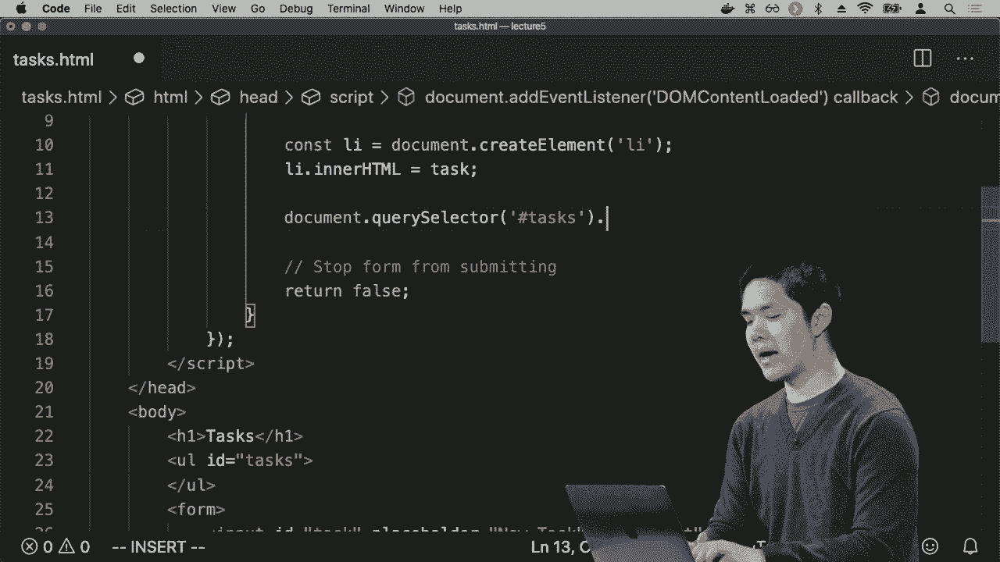

of it by saying dot append Li and with，that now is going to do is it's going to。

say get me the unordered list whose，ideas tasks get me the element whose。

ideas tasks by a query selector here，once I have that element append to the。

end of what's inside of that element，this value Li which happens to be this。

new element that I've created a new list，item so I've been able to add a new HTML。

element and this line of code is going，to say add it to the Dom add it to the。

unordered list that I am here now，constructing so now I rerun this I see。

tasks I type in something like foo I，press submit and alright foo now shows。

up I type in something like a right to，leave that type in bar bar now shows up。

I'd have been Baz Baz no shows up now，one minor user interface annoyance is。

that it seems that every time I submit a，new task this input field retains the。

value of what it used to be and that's。

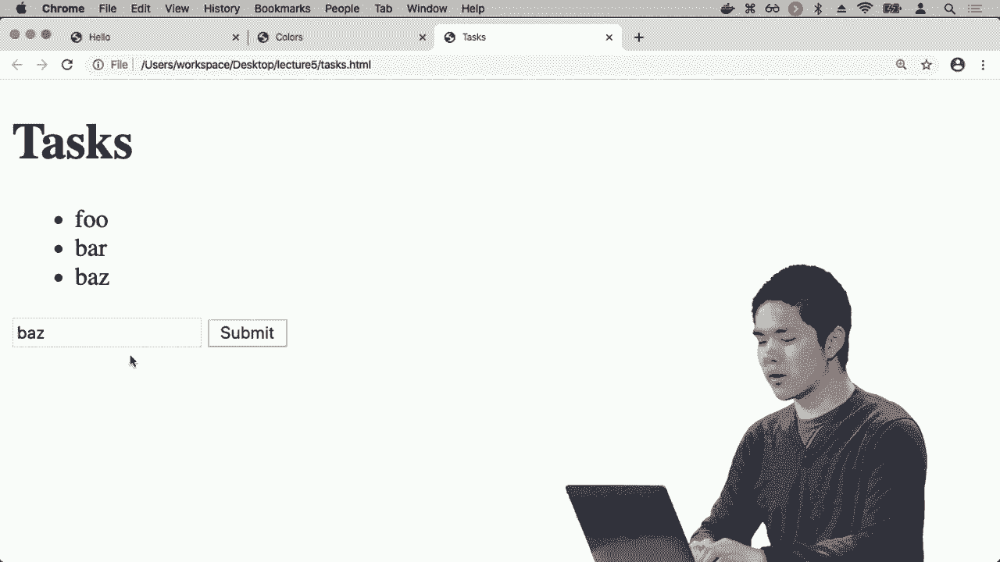

probably not what I want because I'd，rather it just clear out I've already。

submitted the task no need for it to，stay there but that's easy to manipulate。

in JavaScript if I want to clear out，this input field the input field whose。

ID is task then all I need to do is say，document dot query selector task get me。

that input field change its value equal，to the empty string equal to nothing。

just to say clear out the value of what。

happens to be inside of that input field，right now and now if i refresh the page。

type in foo press submit input field，clears out and now I can type in。

something like bar and then something，like Baz to continue to add tasks as。

well now one thing that might be，slightly annoying is that I'm not，careful if I press submit well it。

submits the empty string is a task and，so I just get this empty bullet point。

that shows up here nice press submit and，I just get all of these empty bullet。

points it might be nice from a user，experience perspective，if I were to not allow the user to do。

that not allow them to submit a task if，they haven't actually typed something in。

to the new task field and we can do that，just by modifying properties of elements。

that it turns out that HTML elements，have a property called disabled that can。

be true or false that allows us to，disable something like a button so if I。

want to disable the submit button one，thing I might want to do first is give。

this submit button an ID I'll give it an，ID of submit so that in my JavaScript。

code I can reference the submit button，and now inside of this JavaScript code。

when the Dom content is loaded by，default the submit button should be。

disabled like when I first load the page，I don't want the submit button to be。

enabled because I want the user to type，in a task first before I enable the。

submit button so how do I do that well I，can document query selector get me the。

element whose ID is submit get me that，submit button and just said it's。

disabled property equal to true，javascript has boolean values true and。

false I set the disabled value equal to，true to disable the submit button now if。

i refresh the page I can type in a new，task but the submit button is disabled。

it doesn't do anything now obviously I，don't want to keep it that way I'd like。

it such that as I begin to type things，in then the submit button stops being。

disabled disabled get set from true to，false instead and so what I really want。

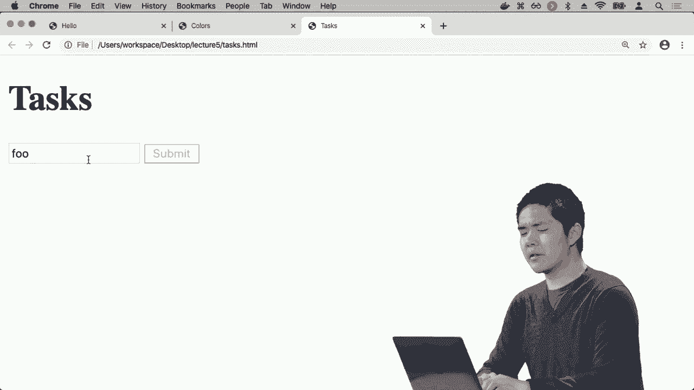

to do is listen for me like pressing，keys on the keyboard and so the way I。

can do that is by adding yet another，event listener document query selector。

what I want to add a query selector to，what do I want to add an event handler。

for well I want to add an event handler，for when I type something into this。

input field and this input field has an，ID of tasks so let me go ahead and get。

the input field the element whose ideas，tasks and add an on key up handler on。

key up again is the event when I lift my，finger off of a key go ahead and run。

this function and what should the，function do well it's going to say。

document query selector submit set the，disabled property equal to false。

and so now here's what we're doing we're，saying by default when I first load the。

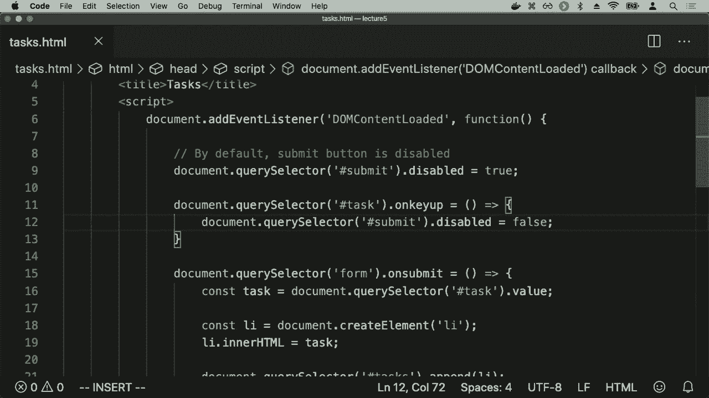

page take the submit button and disable，it said dot disabled equal to true then。

anytime I type a key and my finger comes，off the key that means on key up is the。

event that gets triggered run this，function and what the function is going。

to do is take that same submit button，and set its disabled property equal to。

false so now instead of being disabled，it will be enabled so if I go back to。

the page go here I type in it right now，by default the submit button is disabled。

but as soon as I start typing something，now the submit button is active and I。

can actually click on it and all right，this isn't great because I clicked on it。

but the submit button is still enabled，so what I might like to do is all right。

after I've submitted the forum after。

I've added a new task let's go back and，disable the submit button so after I've。

submitted the form after we've added the，new task to my list of tasks after we've。

cleared out the value from the input，field let me also get the submit button。

set it's disabled property equal to true。

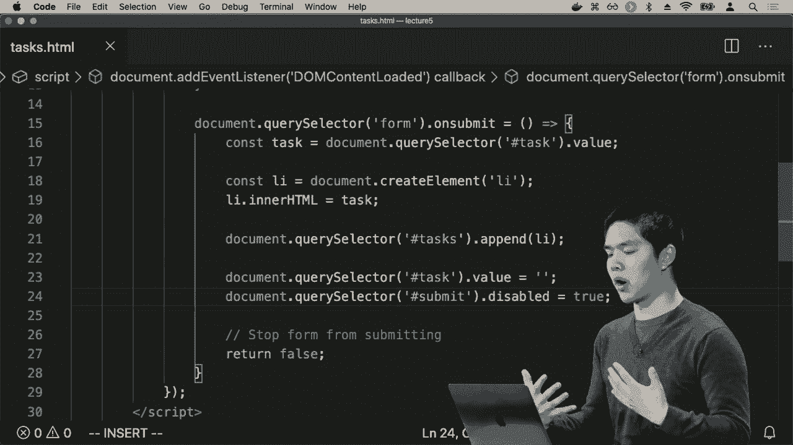

now even after I submit the form the，submit button is still going to be。

disabled such that I type in foo now，submit is active I press it but the。

submit button goes back to being，inactive as well it turns out that even。

now there's still a little bit of a bug，if I go back here and I type in。

something like bar but then I backspace，back to like nothing here the submit。

button is still active so I can still，technically submit a task that has no。

content inside of it and so I might like，to have some way of preventing against。

that as well and that's just some，additional logic we now have access to。

JavaScript that has conditions that has，loops that has functions and so if I。

want to do something like conditionally，check I can say if document query。

selector task dot value dot length is，greater than 0 meaning like something's。

actually typed into the task field will，then go ahead and set disabled to false。

go ahead and set disabled equal the true，so now here we're checking if the length。

of what the user has typed in is greater，than zero they actually type something。

in then yes give them access to the，submit button but otherwise don't give。

them access to that button so now i，refresh the page disabled by default I。

typed something in it's enabled I delete，delete delete and it goes back to being。

disabled so javascript has allowed us to，really make our pages much more。

interactive and immediately interactive，based on how the user is interacting。

with the page as they begin to type，things as they begin to delete things as。

they press buttons we're able to have，the page respond either by adding。

content to the Dom by literally adding，parts to the HTML page of changing the。

styles of things changing particular，properties of elements and this is。

really where the power of JavaScript，begins to come in isn't allowing。

ourselves to do things like that now so，far we've only been able to have events。

happen when the user does something when。