# 【双语字幕+资料下载】哈佛 CS50-WEB ｜ 基于Python ／ JavaScript的Web编程(2020·完整版) - P17：L5- JavaScript编程全解 3 (逻辑存储，API) - ShowMeAI - BV1gL411x7NY

user presses a key for example but it，turns out JavaScript has other ways of。

allowing functions to run in fact on，their own we can set what are called。

intervals where a particular function，runs every some number of milliseconds。

for example and so if we go back to like，the counter example from before right。

now for this counter example I have to，be the one to press the count button。

that is going to increment the value of。

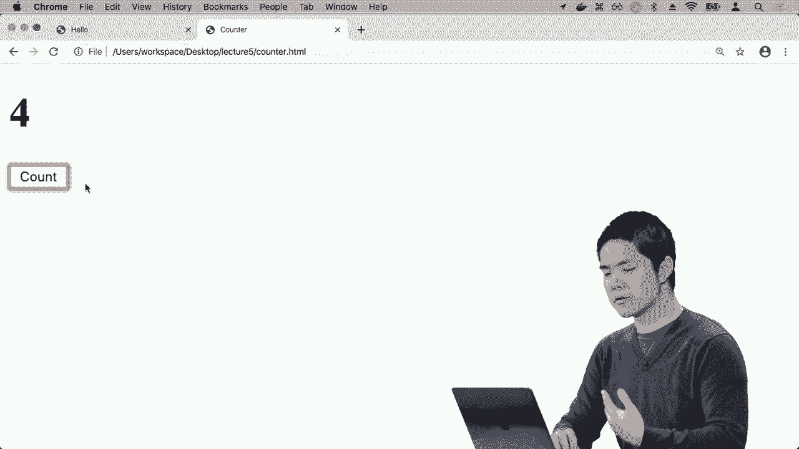

count every single time but I could put，that inside of an interval instead so。

let me go back to counter，dot HTML whose JavaScript is inside of。

counter j/s and now what I'd like to say，is I would like when the Dom content is。

loaded let me set an interval for count，and 1000 so what is that going to do set。

interval as a function built into，JavaScript here where I'm saying that I。

would like to create a new interval，where every so often go ahead and run a。

particular function and I would like to，run the count function will recall that。

count function is going to increment the，value of count and I'll get rid of this。

alert for now just for simplicity all I，want the count function to do is update。

the h1 with the new value of the counter，and，go ahead and run that count function。

every 1000 milliseconds otherwise known。

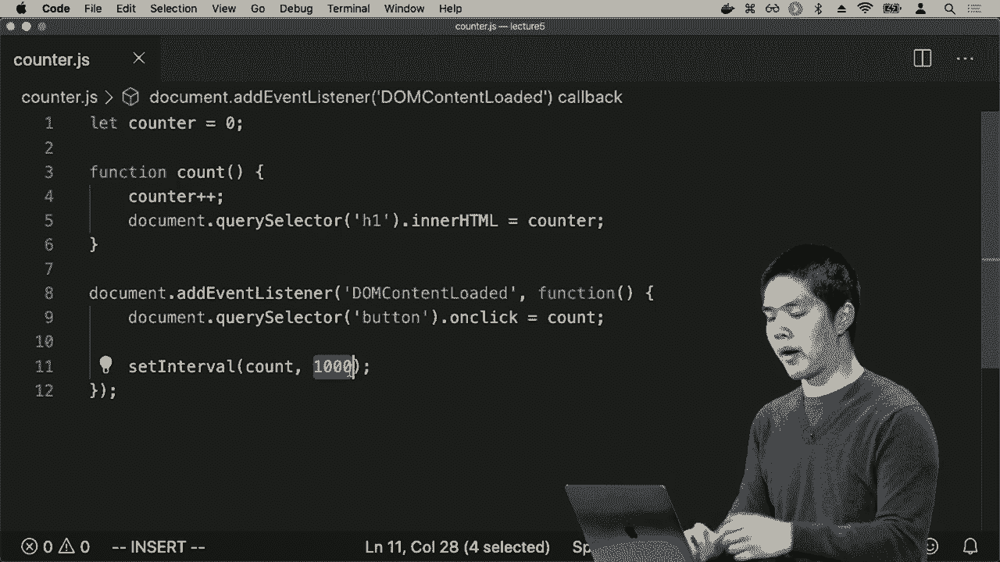

as every one second go ahead and run the，count function so now when I open。

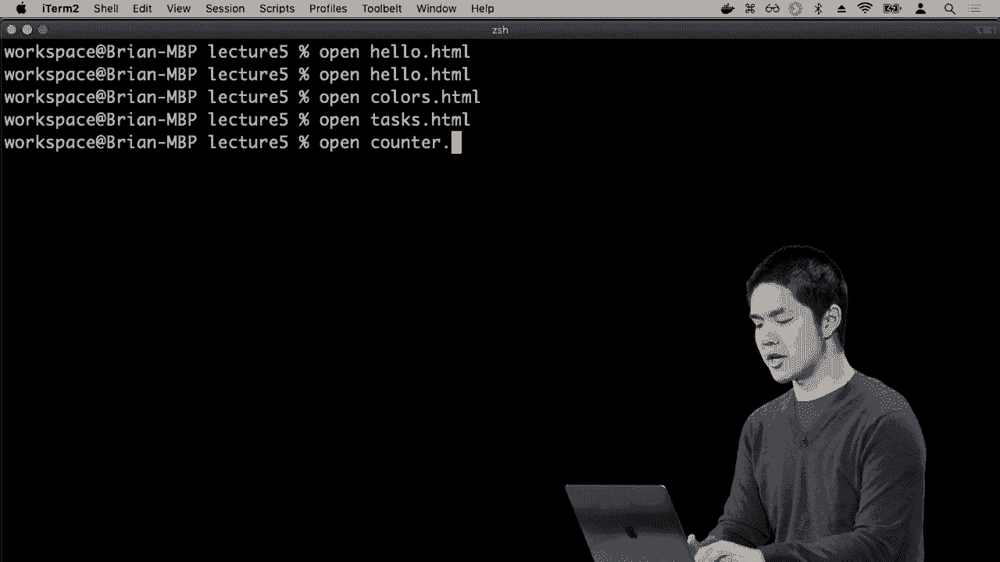

counter dot HTML it's zero but every，second now it's going to change every。

second updating one by one by one I，don't have to click the button of course。

I could and the event handler would，still work but the interval is saying。

now every one second go ahead and run，the count function and that has this。

particular result so if you've ever seen，a webpage that like displays the current。

time in seconds and like a countdown，timer or is displaying the current time。

with seconds it might be doing something，like this just having some sort of。

interval that every second is going to，count and increment in order to say。

update the number to the one greater one，greater and one greater than that of。

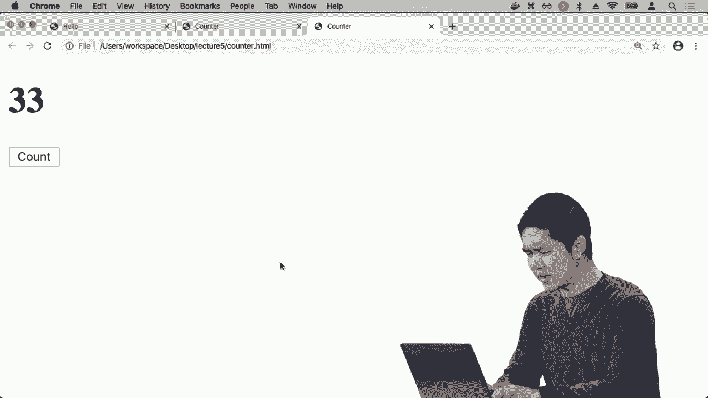

course if I close the page and go back，to it if I close these pages and then。

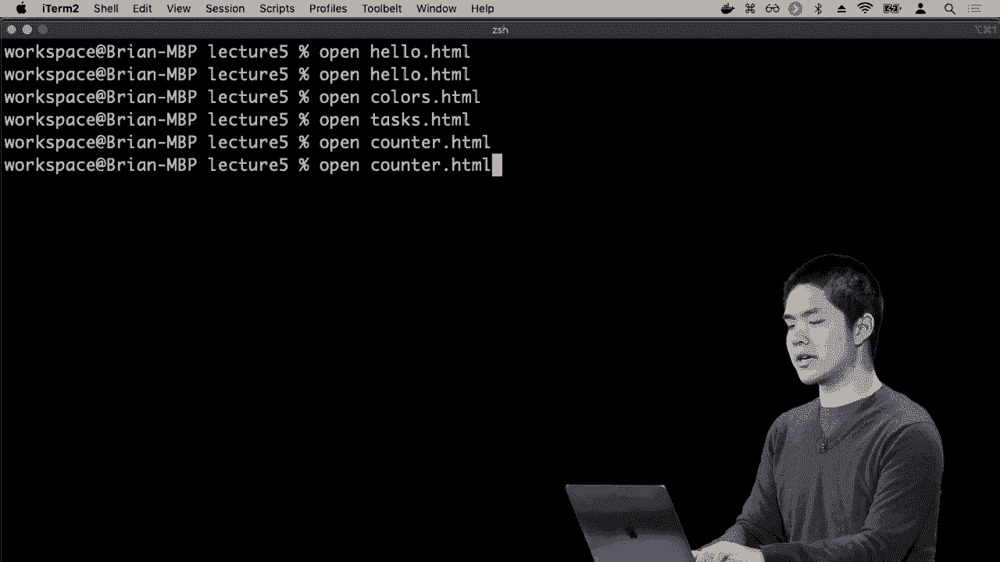

open counter dot HTML again I've gone，back to zero like JavaScript is not。

saving any state about my page it's just，every time we're running the page it's。

going to go back to counter j/s it's，going to say all right we're defining a。

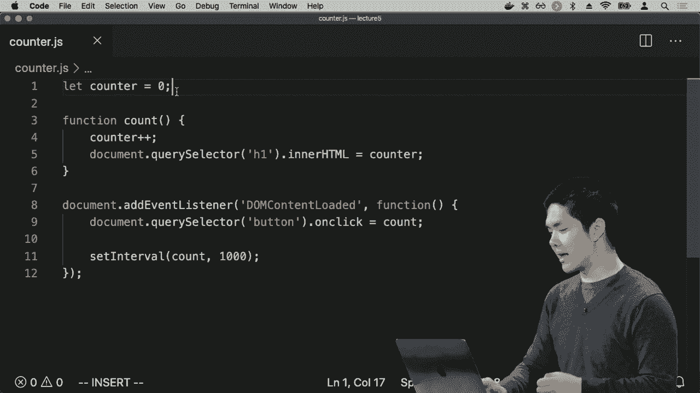

variable called counter we're setting，that variable equal to zero so every。

time I load the page it's going to be，set back to zero and that might not be。

great depending on the type of page，you're trying to create that maybe you。

want to page that is somehow able to，store information such that on。

subsequent visits were able to utilize，the information that was already stored。

some way of remembering information for，later use in later versions of。

JavaScript and more modern browsers now，allow us to do something just like that。

called local storage and what local，storage is is it's a way for us to be。

able to store information inside of the，user's web browser that a page can ask。

to store particular values inside the，web browser and later on on subsequent。

visits to that page we can go back and，say let's extract those values that were。

previously stored inside of local，storage local storage it's going to give。

us access to two key functions that。

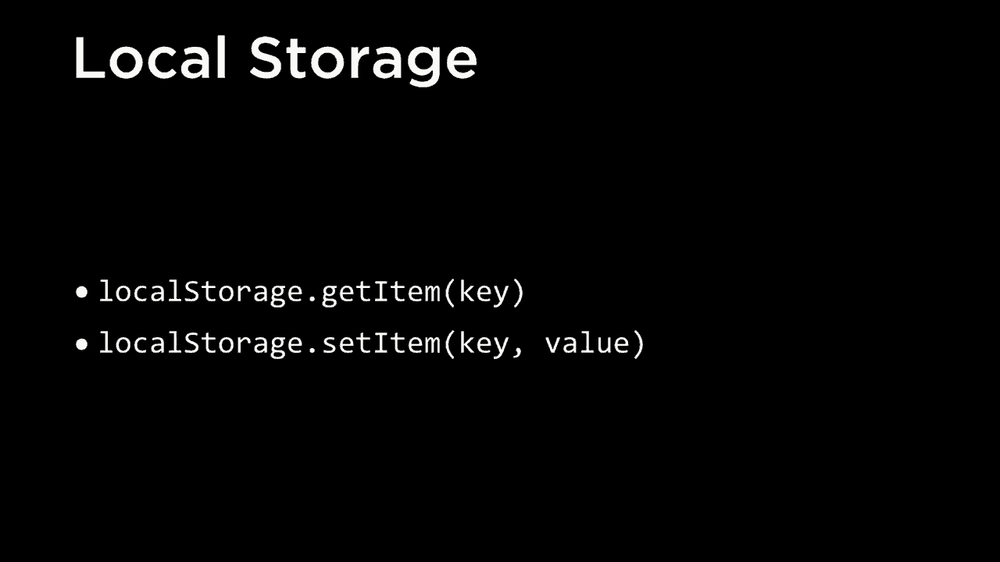

we're going to use to manipulate this，local storage，the first is local storage getitem where。

we would like to get something out of，local storage based on its key some name。

that we have given to that value and we，also have access to local storage dot。

set item which goes ahead and adds a new，value to local storage or replaces an。

existing value in local storage，setting this key equal to a particular。

value so we can use local storage then，to allow our webpages using javascript。

to be able to store information and，retrieve information from the browser。

and let's now try to use that in order，to solve this problem of the counter。

that seems to always reset back to zero，so now in counter jeaious instead of。

sending counter equal to zero the first，thing I want to know is is there already。

a value for the counter in local storage，so I can ask a question like if local。

storage dot get item counter meaning go，to local storage try and get the counter。

and anything in this if expression will，happen if there is something inside of。

local storage for counter but it turns，out that if I want to do the inverse of。

that say not I can just use the，exclamation point much like in C in。

JavaScript the exclamation point just，means not so meaning if there is not。

something in local storage called，counter well then let's go ahead and。

just set the value in local storage，local storage dot set item counter and。

we'll set it equal to zero so what this，is doing here is before anything else。

happens we are checking local storage to，say is there already a value for counter。

and if there is not already a value for，counter we need to make sure there is。

something there inside of local storage，for the counter so we are going to set。

the value of counter equal to zero for，example and so now what needs to change。

I'll go ahead and get rid of the，interval so that it only happens when I。

click on it but what should this count，function actually do well first let me。

get the value of the counter counter is，going to be whatever local storage get。

item counter is I'm gonna get the，counter out of local storage I'm going。

to increment it counter plus plus we'll，go ahead and set the value of this h1，elements innerhtml。

equal to that counter but the last step，is I'll also do local storage dot set。

item counter is equal to the new value，of counter so what I've done here is to。

say that when I click the button count，function is going to run we're first。

going to go into local storage get，value for the key counter whatever the。

value of counter happens to be save it，inside of this variable called counter。

we'll go ahead and increment that，variable setting it equal to itself plus。

one update the h1s innerhtml same as，before just to update what we actually。

see on the page but then go ahead and，local storage set item counter gets set。

to counter for example so now let's go。

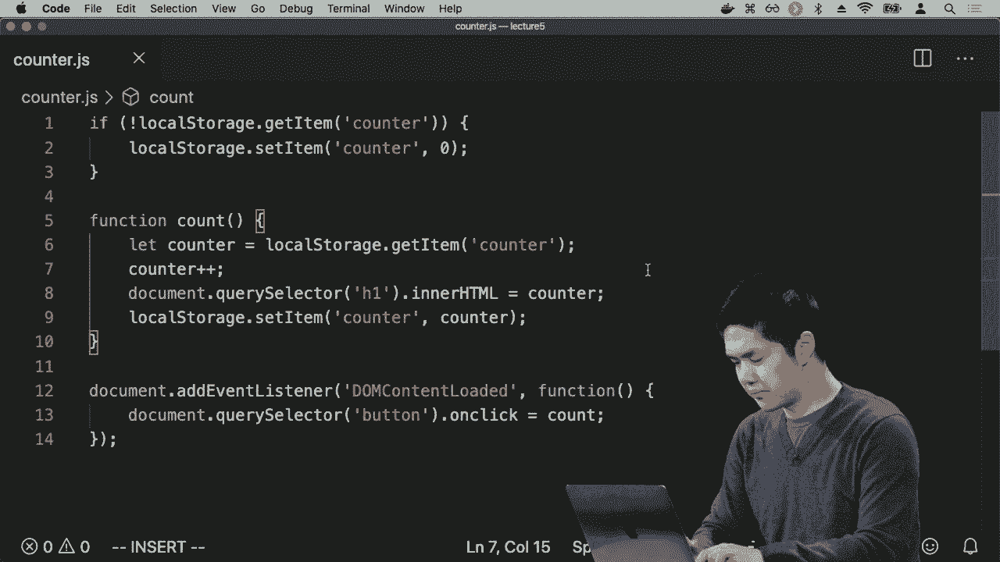

ahead and see what's going to happen if，I go ahead and open counter dot HTML we。

see 0 we count 1 2 3 4 5 everything so，far so good now watch what happens if i。

refresh this page i refresh the page and，alright that seems a little bit strange。

at 0 let me try counting and see what，happens i press count and alright the。

count changed to 6 so it seems like it，did remember that i counted up to 5 0 1。

2 3 4 5 but when i refresh the page it，still showed me 0 but then let me count。

up to the number 6 and I can keep，counting 7 8 9 10 what happens if i。

refresh the page now I can try it i，refresh the page I've gone back to 0 but。

I count and okay now I'm at 11 so，somehow I am still remembering but the。

first time it's still giving me 0 every。

time why might that be well if you look，back at counter dot HTML you'll notice。

that the reason is just inside the body，of the page the initial value of the h1。

is just always 0 so if I want to fix，that then what I need the same is when。

the Dom content is loaded go ahead and，get document query selector h1 go ahead。

and update the innerhtml，equal to whatever local storage get item。

counter happens to be so every time I，open the page even before I click the。

button even before the event listener is，triggered I'd like to say go ahead and。

replace this heading update its inner，HTML to be the result of getting the。

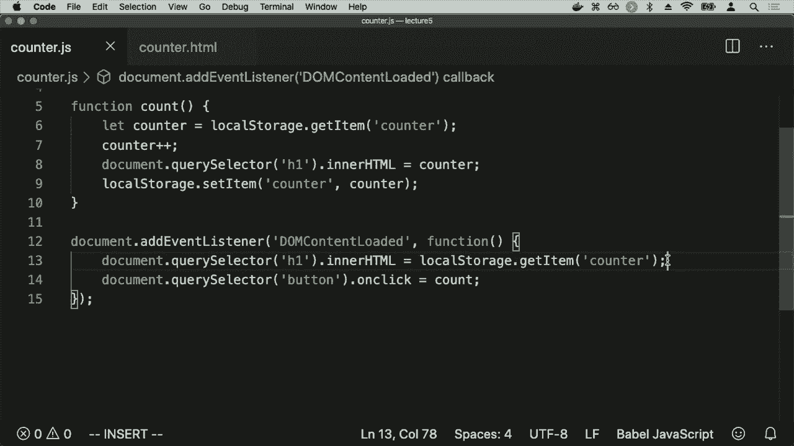

counter out of local storage for example，so now for refresh the page it's all at。

11 I can update update update click，again some number of times bring it up。

to 18 for example refresh the page and，it stays at the number 18 and no matter。

what value I get it to it's going to，store that number inside of local。

storage such that when i refresh the，page that number is going to stay there。

we can actually see the value inside of，local storage but again going into。

Chrome's inspector I go into Chrome if I，go to the application tab and I go to。

local storage here on the Left I can see，that I have a value for key counter。

whose value in this case happens to be，28 and you could go into local storage。

you can manipulate this value you could，delete it if you want but this just goes。

to show you that we have now stored this，value inside of my browser such that on。

subsequent visits if this page gets，loaded again we can access that value。

from inside of the application as well，and so now we've been able to see how。

our pages are able to store data in，order to just make the user experience a。

little bit better if we want the user to，be able to have information remembered。

from the last time they visited a，particular page we can sometimes。

actually be quite helpful all right so，now we've seen a lot of features of。

JavaScript we've seen a bunch of，different ways of representing data we。

store data in variables and those，variables have had types like integers。

those variables of sum has been strings，and some times have been HTML elements。

sometimes they've been arrays or lists，of our items sometimes they've even been。

functions so we can set a variable equal，to a function but perhaps one of the。

most useful data types inside of，JavaScript is the JavaScript object so。

go into the JavaScript console just to，demonstrate this what the JavaScript。

object is is it's really the equivalent，of like a Python dictionary some。

Association of keys to values where you，can look up something by a key or by a。

property and see what his value happens，to be so if I had a variable like person。

I could set person equal to a JavaScript，object who's like first name is Harry。

and whose last name is Potter again，using syntax very similar to what the。

dictionary syntax looks like inside of，Python as well and now that I have this。

variable person which is first Harry，last Potter I can access a particular。

property of the person in a number of，ways I can say something like person dot。

first to say get me the first name，property of this particular object and I。

see that it's equal to Harry I could，equivalently use squ*re bracket notation。

the way Python does squ*re bracket first，and that will also give me Harry。

but this turns out to be quite powerful，to be able to represent data in this。

structured way like this where I have an，association of keys or otherwise known。

as properties with particular values and，then I have the ability given a。

JavaScript object to be able to access a，particular value and it turns out that。

one of the ways this is most useful is，in the exchange of data moving data。

around from one service to another and，so here we're going to introduce what。

are known as api's otherwise known as，application programming interfaces which。

in the context of the web you can think，of as some well-defined structured way。

for services on the Internet to，communicate with each other that if you。

want your application to be able to talk，to some other service maybe you want。

your application to interact with Google，Maps or to be able to interact with。

Amazon or some other weather service to，get the day's weather then you might be。

able to access some API some mechanism，whereby you can communicate with another。

service by sending a request and，receiving back data in some sort of very。

well structured format and very often，that well structured format happens to。

be a particular type of data known as，Jason which stands for JavaScript object。

notation which is a way of transferring，data in the form of JavaScript objects。

these sort of objects that happen to，have properties and values associated。

with them and so what does javascript，object notation look like well if we。

think back to the applications that，we've been creating these applications。

that are able to represent things like，an airline and many movements of planes。

between particular destinations a，JavaScript object representing a flight。

might look something like this，a JavaScript object that has properties。

for origin is something destination is，something duration is something things。

we've seen before but you might imagine，that if we wanted our airline to be able。

to make its data available to other，services so that other web applications。

or other programs could programmatically，access information about flights we。

could pass data in this format to those，other applications so that they could。

then treat this as a JavaScript object，and get access to the information about。

it and the nice thing about this，particular representation is that it is。

both human readable and machine readable，that we as people can look at this and。

get an intuitive understanding for what，all of this means but also a computer。

knows how to access particular，properties that appear before the colon。

and get access to what those values are。

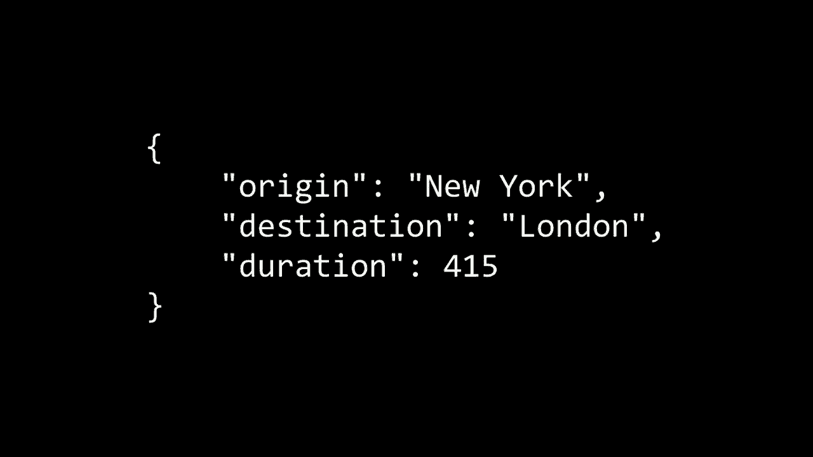

which appear after that colon as well so，JavaScript object notation otherwise。

known as jason offers a very convenient，representation and this isn't exactly。

what the JavaScript object syntax is in，JavaScript objects you don't strictly。

need the quotation marks around the keys，you could just say origin colon and not。

origin in quotation marks so JavaScript，object notation uses slightly different。

syntax but ultimately very reminiscent，what we've seen in JavaScript objects。

and JavaScript knows how to take data in，this form and turn it into something。

like a JavaScript object and turns out，there ways of doing this in Python as。

well in other programming languages have，the ability to interpret JSON data in。

order to use it in some meaningful way，and another advantage of the JSON。

representation is it is very conducive，to representing structures of things so。

these values don't just need to be，strings or numbers they could be lists。

or arrays that happen have a sequence of，possible values or they could even be。

other javascript objects that if we，wanted to represent not just a city name。

but represent the city name and the，airport code for example as we saw that。

we wanted to do before I could instead，of having origin be equal to a string。

like New York have origin be equal to，yet another JavaScript object that。

contains a city property and a code，property where the city is the name of。

the city and the code is the name of the，airport code and the important thing is。

as long as I and the person I'm，communicating with agree upon this。

representation agree upon what the names，of these keys are and what the structure。

of this JSON payload this JSON object，happens to be then the person on the。

receiving end can take this data and，write a program that's able to interpret。

it and use that data in some meaningful，way and so we'll see an example of this。

now of using javascript to be able to，communicate with yet another online。

service in particular for accessing，information about currency exchange。

rates currency exchange rates are always，changing we want access to the latest。

currency exchange rate data and if there，is an online service an API that。

provides access to that data in JSON，form in a format like this that is。

machine readable then we can use that，data to write a stock a currency，data。

in order to make those conversions what，might that data look like well the data。

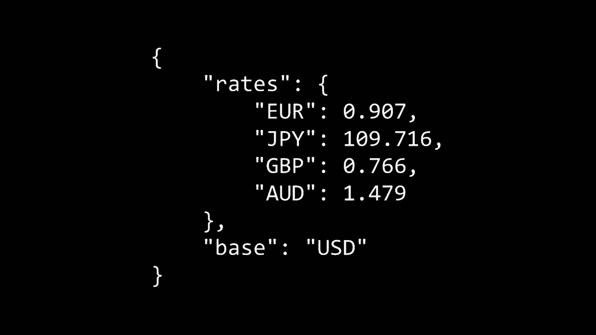

could look something like this that we，make a request for accessing what are。

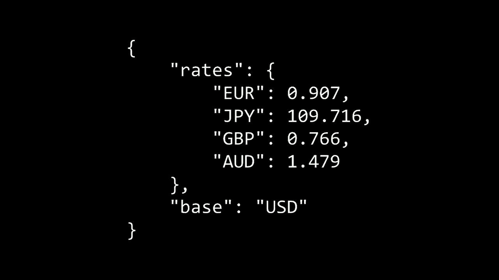

the exchange rates for converting from，US dollars of the West Newton is USD and。

we get back a JSON object that looks，like this and it has a base key of USD。

and then has a rates key that has a，whole bunch of rates within it so。

conversion to euros and Japanese yen，great british britain pounds as well as。

Australian dollars and all of the，various different currency exchange。

rates for all of these different，currencies for example and this doesn't。

have to be the way that this data is，structured but it happens to be a。

convenient way and so long as the person，providing this data to me and I both。

know what this structure is we can begin，to write programs that are able to use。

that data and so will now see our，example of an API which is exchange。

rates API I owe and if we go to API dot，exchange rates API am / latest and。

provide a get parameter of base equals，US dollars then what we get back is data，that looks like this。

now it's a little bit messy looking not，nearly as clean as we saw before but。

it's the same exact thing just without，the whitespace we have a JavaScript。

object that has a rates key that tells，me all right here is the exchange rate。

between US Dollars and Canadian dollars，in the pound in the euro and other。

currencies that exist as well and down，below we have the base of what base。

currency we're converting from so all of，this data can come back to me if I just。

make an HTTP request I make a web，request to this particular URL I then。

get access to all of this currency，exchange rate information that I can。

then use inside of my application so how，can I do this how can I now begin to use。

this information inside of an，application let's now create a new page。

I'm gonna call this currency HTML inside，of currency about HTML at our usual HTML。

a title of currency exchange and a body，and inside the body and we're just going。

to include nothing for now what I really，care about is the JavaScript that is。

going to make a web request in order to，get access to additional data。

so far in JavaScript our JavaScript code，has exclusively been running code that。

exists only on our computer it's running，inside the web browser and all happening。

inside the web browser we're not，communicating with some external server。

what we'll take a look at now is，something known as Ajax which was about。

asynchronous JavaScript where the idea，is that even after a page has loaded。

using JavaScript we can make additional，web requests to ask for additional。

information either from our own web，servers or from some third party web。

servers if we want additional，information on our page and what we want。

in this case is for our page to make an，asynchronous request to request for。

additional data about the current，currency exchange rates for example so。

how am I going to do that well I want to，do this after the Dom content is loaded。

so we'll add that usually there and what，we're going to take advantage of as a。

function built-in to more recent，versions of JavaScript and supported by。

most major browsers now and if the，function called fetch and what fetch is。

going to do is it is going to make a web，request it is going to query some。

website it could be our own it could be，someone else's and it's gonna get back。

some HTTP response from that page and，I'm going to fetch in the page I'm going。

to fetch is this URL API not exchange，rates API dot io / latest base equals。

USD and the only reason I happen to know，how this API works is because I've read。

the api's documentation that describes，how the URL parameters work and what the。

structure of the data that I get back，isn't and so I'm here going to say go。

ahead and fetch from this URL make a，HTTP request asking for additional。

information from this URL and get back，what the results are going to be and。

what fetch gives back to us is something，in JavaScript known as a promise and a。

promise is going to be a way of，representing the idea that something is。

going to come back but it may not come，back immediately we're not going to go。

into the details of exactly how those，promises work but it turns out there's a。

particular syntax for dealing with them，which is that I can say after I fetch I。

can add a line called dot then that says，what should I do when the promise comes。

back once I get back something like a，response，and so when I get back the response what。

I want to do is convert the response，into Jason treat it as Jason data Java a。

JavaScript object as something that I，can then manipulate and so what I can do。

is just use this as a function to say go，ahead and return response Jason and so。

what this is saying is go ahead and get，me the latest exchange rates and then。

after that's done this is an，asynchronous process it might take some。

time but once I get back those results，then run this function take the response。

and return the jason version of the，response convert that response into just。

the raw JSON data such that I can use，that data to then access the currency。

exchange rates and it turns out that，with arrow functions if you ever have a。

very simple function that all it's doing，is taking something and returning。

something else I can simplify this，function even further and just say I can，return。

I can just say response arrow response，Jason and this is a shorthand way of。

saying a function that takes as input，the response and returns as output。

response to Jason so here I'm saying go，ahead and fetch me in the latest。

exchange rates from this particular API，then convert the response to Jason data。

and then once you have the data here's，what I want you to do with that data and。

for now let's just go ahead and console，dot log that data just to print it out。

to the terminal so we're not doing，anything else to us yet all I'm doing is。

saying get me the exchange rates convert，the exchange rates data into Jason and。

then let's go ahead and print out that。

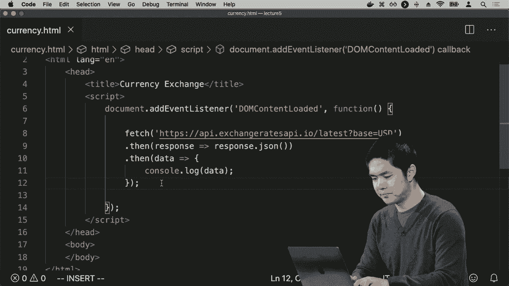

data so I'll open up currency at HTML，it's a blank page but if I look in the。

JavaScript inspector I see what got，logged is a JavaScript object here。

indicated by the word object and if I，click the triangle at left I can open up。

and see all right inside of this object，is all of this data about exchange rates。

for a whole bunch of different exchange，rates for converting from the US dollar，we're here u。s。

 dollar one means one，u。s。 dollar is one u。s。 dollar for。

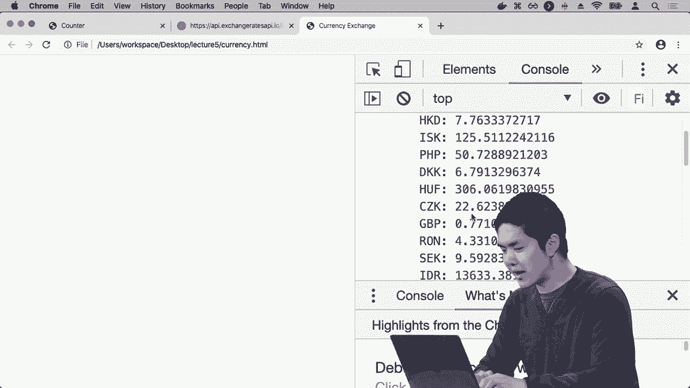

example so now that I've got this data，let's actually try and use this inside。

of the program maybe let's say I want to，convert between US Dollars and the。

to figure out what the conversion rate，is between dollars and euros well if we。

recall what the data looks like the data，is a JavaScript object where we have a。

key called rate and inside of rates is，this object and inside of that object I。

can access the EU our property to get，the exchange rate of one US dollar is。

equal to some number of euros for，example so it's inside of the rates key。

and then inside of the EU our key and，that's how I know what to get access to。

inside of my data so what I really want，to do is access data dot rates dot EU R。

it says get me to all the data that came，back access the rates key and then。

access the euro key and we'll go ahead，and save that in a variable called rate。

and now I'll just document query，selector body dot innerhtml。

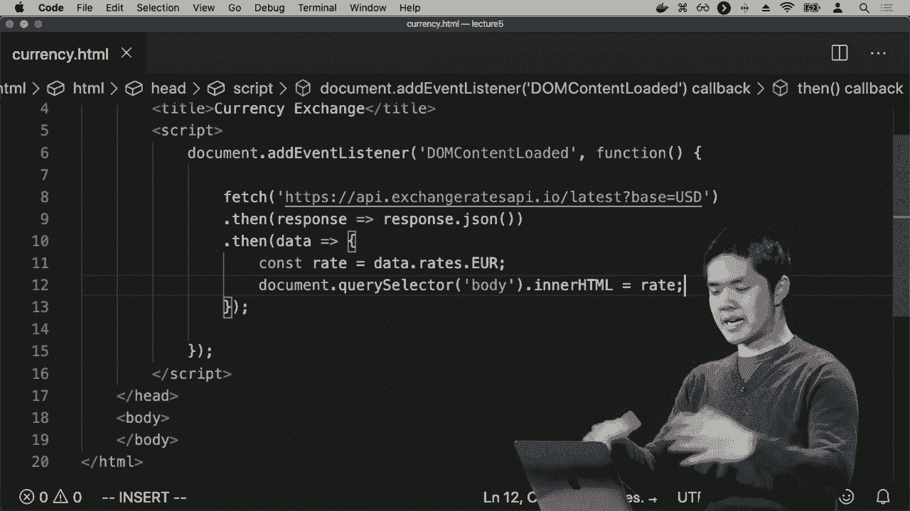

equals rate just like take that rate put，it inside of the body so now if i。

refresh currency dot HTML what I see is，just this value 0。9 zero eight eight。

four three which means that right now，one u。s。 dollar happens to be equal to。

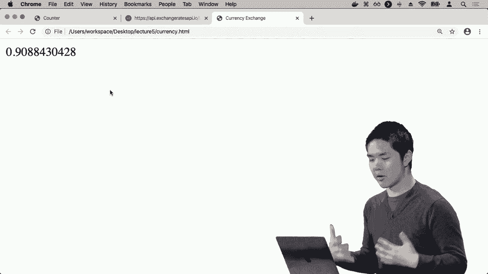

about zero point nine one euros for，instance so that's useful I could make。

this a little more human-friendly by，putting this inside of a template string。

I could say one US dollar is equal to，and then rate euros for example and so。

now if i refresh the page I see one u。s。dollar is equal to this many euros and。

even this is a little bit annoying I，probably don't care about it too this。

many decimal places and some really in，the mood to be very precise about these。

exchange rates if I only care about it，to like 3 decimal places for example it。

turns out JavaScript has functions I can，use on numbers like rate dot two fixed。

passing in three as an argument there to，mean I'd like to take this exchange rate。

and just round it to three decimal，places for example so now i refresh the，page and I see one u。s。

 dollar is equal，to zero point nine zero nine euros and，the interesting thing about what's。

happening here is this is happening as a，result of an asynchronous request I am。

asking for the latest exchange rates and，when I get back the exchange rates date。

javascript is plugging that information，into the body of the page I now。

communicating with an API getting back，that api's data in JSON form and then。

using that data to update the contents，of my HTML page of course in practice if。

I really want a currency exchange web，page I probably don't just want to。

display the exchange rate between US，dollars and euros I probably want to let。

the user pick what currencies they would，like to exchange between and so here's。

how I might go about doing that inside，of the body of the page now rather than。

just have an empty body let's go ahead，and add a form that form is going to。

have an input whose ID is currency just，so I have a way of referencing it later。

the place holder will just be currency，and the type of it is text and then I'll。

have an input whose type is submit and，we'll give it a value of convert that'll。

be what the button says it says convert，and then I can convert to a particular。

currency and then I need some place to，put my results so I'll go ahead and add。

a div whose ID is result and this is，where after I've done all the currency。

conversion this is where I'm going to，put the results of doing that currency。

conversion so now rather than fetch，right away here's what I need to do I。

need to do something only when the form，is submitted，so I can get the form by saying document。

query selector form dot on submit equals，this function and I'm gonna go ahead and。

just in advance return false at the end，of the function so we don't actually try。

and submit the form to another page I，just want to run everything locally on。

this same page but now inside of this，form once you submit it that is when I。

want to run this code that is going to，fetch new data so I'm going to fetch。

data from the exchange rates API convert，that data to Jason same as before then。

go ahead and get access to that data but，now what I want to do is I want to。

figure out what the user actually typed，in to the input field and that is going。

to be the currency that I care about，getting access to so I'll create a。

variable called currency which will be，equal to document query selector and I。

write the input field if I scroll down，it has an ID of currency so if I want to。

get that input field I'm，to say get the element whose ID is，currency and get its value so this now。

is the currency that the user wanted me，to get access to and I can then say data。

rates currency instead of data rates dot，you are and importantly I can't do data。

rates dot currency that would literally，try to access a property of rates that。

is called currency if I use squ*re，brackets instead that allows me to use a。

variable something like the currency，variable which are defined up here on。

line 13 as the currency that the user，typed in I would like to access that。

particular currency inside of the rates，and so now I can ask a question there。

are two possibilities here either the，currency the user typed in it is a valid。

currency or it's not and it turns out，that if you try and access a property of。

an object that doesn't exist what you，get back is a particular JavaScript。

variable called undefined meaning there，is no value there so for example if I。

have something like let person equal，first name is Harry and last name is。

Potter like we did before I can access，something like person dot first and get。

Harry I can access person dot last and，get Potter but if I access person dot。

middle that is going to be a special，variable in JavaScript or a special。

value in JavaScript called undefined，meaning there is no value there it's。

slightly different from null which also，has a similar meaning they're used in。

slightly different contexts so here what，I can say is if the rate is not。

undefined well then let's go ahead and，update not the body but the result to，say one u。s。

 dollar is equal to this，rate not necessarily euros but whatever。

the currency happens to be and otherwise，let's go ahead and document query。

selector result dot inner HTML equals，invalid currency just to let the user。

know that the currency they tried to，provide is not actually a valid currency。

and so we're going to need to try a，different currency in order to get the。

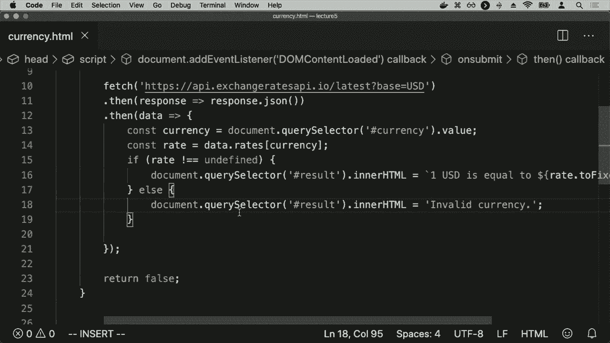

all to work so now here's what we can do，if I open up currency dot HTML again I。

now see a form where I can type in a，currency I can type in something like。

the Europe for example press convert and，I see alright one u。s。 dollar equal to，0。9 0。

0 something like the pound press，convert one u。s。 dollar equal to 0。77。

one pounds I type in the Japanese yen，one u。s。 dollar is equal to 109 point。

eight five two Japanese yen and all of，this is happening where every time I。

submit the form it's making yet another，request so if the exchange rates happen。

to change in between when I submit the，form the next time I submit the form I。

will be getting the latest exchange，rates according to that exchange rates。

API and the results are going to come，back here and of course if I type in a。

currency that doesn't exist I type in，something like foo for example and press。

convert invalid currency so it's going，to report back to me that it wasn't able。

to find that currency and so it tells me，that I need to type in something valid。

and so I can type in something valid，maybe I try just US dollars itself it，tells me one u。s。

 dollar is equal to one，US dollar exactly what I would expect it，to be now there are a couple of。

optimizations and improvements that we，can make here one is that I can search。

for euros right now with EU our press，convert but if I search for euros in。

lower case for example it turns out it。

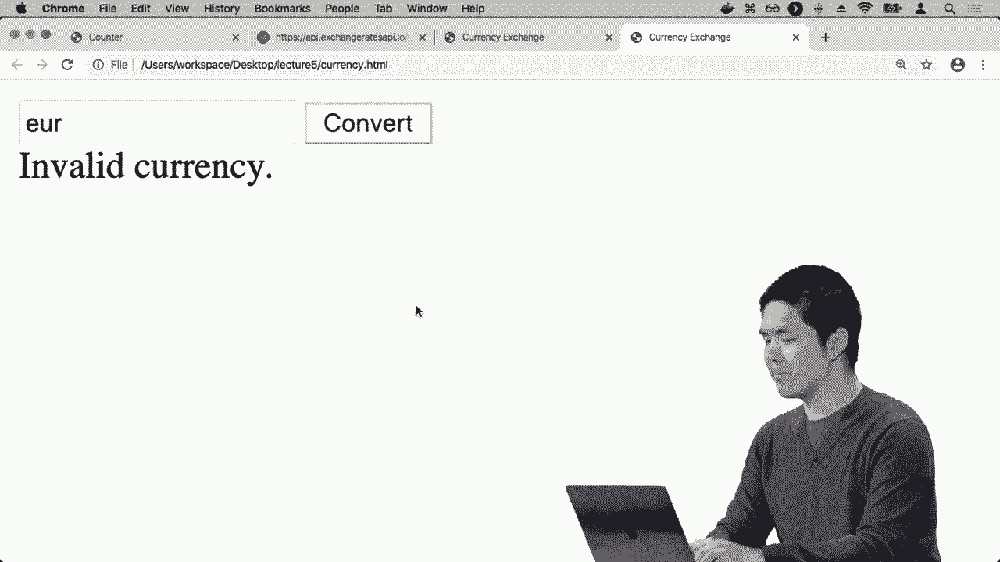

thinks that's an invalid currency and，the reason why is because if you look at。

the data that comes back to me from the，API this is the data that I get back。

from the exchange rates API what you'll，notice is that all of the currencies are。

all in capital letters that are all，capital letters all capital letters。

which means the only keys that I'm，allowed to access are in fact those that。

have capital letters in them because，these are the only keys that this API。

makes available to me so if I want to，convert between US dollars and euros。

lowercase what I might want to do is，first take the currency the thing the。

user typed in and first just call to，uppercase on it which is a JavaScript。

function that takes a string and，converts it Dabra case I'd like to take。

whatever the user typed in and now just，first convert it to uppercase that way。

if I go back here I can type in Euro，lowercase press convert and I'm still。

able to get the correct conversion rate，the other thing that we won't noticeably。

notice the difference with，is that right now I'm assuming that all。

of this is going to go successfully that，we're gonna successfully be able to make。

a web request will successfully convert，the response back to Jason but you never。

know an API could go down the API could，change and do something unexpected and。

so anytime you're dealing with these，types of promises where you fetch。

something and say then do this then do，that it can often be a good idea to add。

one last case which is a catch case that，basically says what should you do if。

something goes wrong so I can say catch，the error and what I can just do is say。

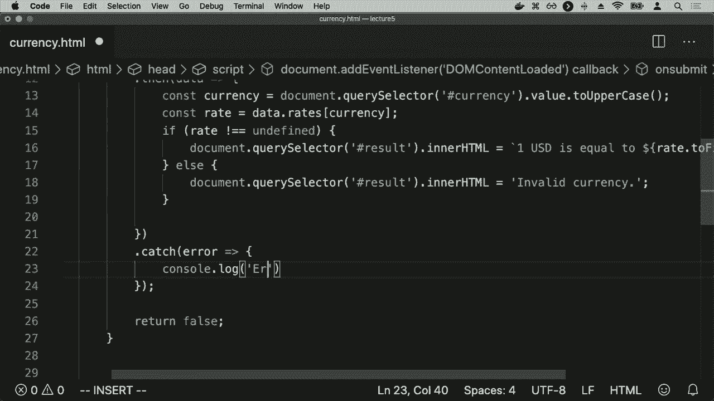

like console dot log error and then log，the error there and all that's really。

saying is that if anything above goes，wrong with the fetching and trying to。

process the response it's gonna catch，the error and then we'll just like print。

out to the console that something went，wrong some error message happened and so。

that can be a helpful nice to have just，to make sure that when things crash they。

crash in a predictable way that you're，able to see exactly what the error is。

and just by looking inside the，JavaScript console and so now we have a。

fully working web page that is able to，communicate with an external API that is。

able to ask for information from another，service on the Internet。

use those results and put them back into，the page really just going to show the。

power now that we get by taking，advantage of the JavaScript language we。

have the ability now to not only use，JavaScript to be able to run code on the。

client where we weren't able to before，were right before we only had Python。

code that was running on a web server，but using JavaScript the really powerful。

thing is now the ability to manipulate，the dog the ability to use JavaScript to。

take the page and change the contents of，the page by updating things by reading。

what happens to be on the page whether，it's inside of a particular element or。

what a user happened to type in and，using that in conjunction with event。

handlers ways that we can listen for，when the user clicks on something or。

when the user Scrolls through something，or when the user types a key to be able。

to respond and therefore make our，webpages all the more interactive next。

time we'll continue our discussion of，JavaScript looking at how we can。

leverage the features of JavaScript to，continue to build even more interesting。

and engaging user interfaces so we'll。