# 【双语字幕+资料下载】哈佛 CS50-WEB ｜ 基于Python ／ JavaScript的Web编程(2020·完整版) - P18：L6- web用户接口与交互 1 (用户接口，单页面应用) - ShowMeAI - BV1gL411x7NY

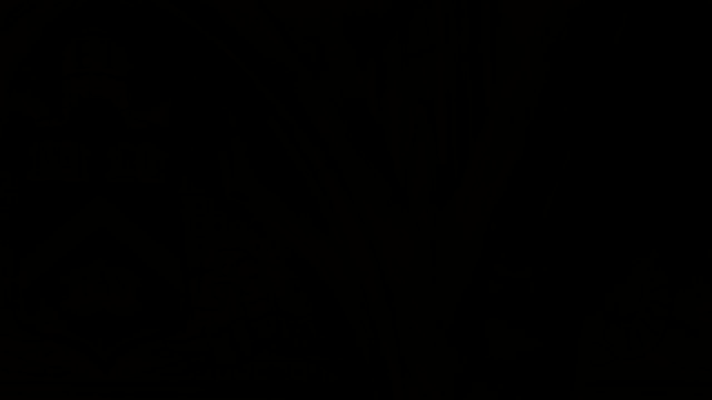

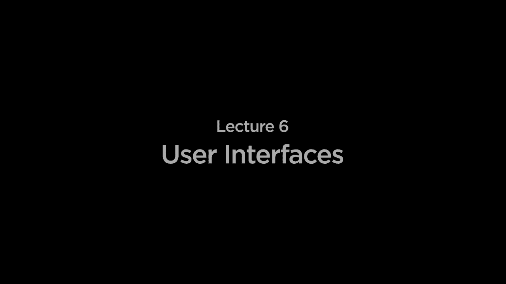

welcome back everyone to web programming，with python and javascript，and last time we took a look at。

javascript that language that ran inside，of a user's web browser，client side and allowed us to do a。

number of things to make our web pages，more interactive，javascript enabled us to display alerts。

to be able to manipulate the dom the，structure of the web page in order to。

add content or see what content was，already there and it also let us respond，to user events。

when a user clicked on a button or，submitted a form or typed something into，an input field。

we could have javascript functions run，that responded to those events。

in order to make our web pages more，interactive today we're going to，continue that conversation。

in particular taking a look at user，interface design，looking at some common paradigms in。

terms of user interfaces and how we can，leverage javascript，to be able to achieve those goals to。

create interactive user interfaces，that will be valuable when users are。

interacting with our applications，so one of the more common paradigms。

especially nowadays in web programming，is the idea of single page applications。

thus far if we wanted to create a web，application，that has multiple different pages we've。

generally done that via multiple，different routes in our django web。

application for example where you go to，slash something to get one page and，slash something else。

in order to get another page but，commonly using javascript，we have the ability to create single。

page applications where the entire web，page is really，just a single page and then we use。

javascript to manipulate the dom to，replace portions of the page。

with things we want to replace and this，has a number of advantages。

one of them being that we only need to，make modifications to the part of the。

page that is actually changing，if for example you have five different。

pages but the general layout and，structure of the page is pretty similar。

when you switch between pages rather，than load an entirely new page。

you can just load the part of the page，helpful，for applications that are changing quite。

frequently so let's take a look now at，how we could implement for example。

a very simple single page application，so let's imagine for example that we。

want a single page application，that just displays three different pages，but all included。

in the same page i'll go ahead and，create a new file，that i'll call singlepage。html。

inside of which we'll include our usual，and inside the body of this page now i'm，going to include。

three different sections of the page to，represent the three different pages。

i might want to display to the user so，i'll have a div，whose id is page one that maybe just has。

a heading that says this is page one and，you could imagine there's more content，on these pages。

as well a div whose id is page two，we'll say this is page two and then one。

final div whose id is page three。

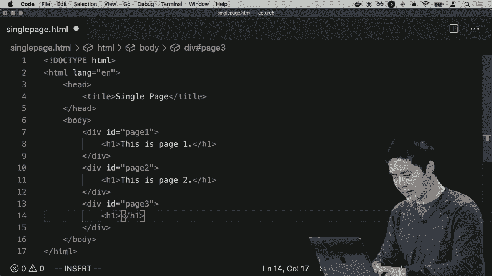

it has a heading that says this is page，three for example，now right now if i were to open up。

single page。html，what we'd see is we see all three pages，at the same time and now that's probably。

not what we want，what we really want is by default to。

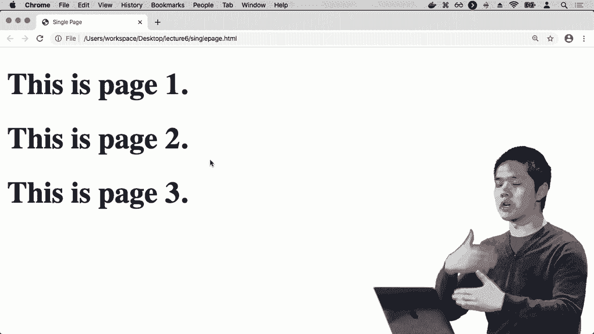

hide these pages until we want to view，the pages one at a time for example。

so one thing i could do is use css to be，able to toggle，whether or not something is visible。

adding some style tags to my page，to say that by default all of my divs，none。

meaning they're not visible they're not。

displayed on the screen，now if i refresh the page i don't，actually see any of the three headings。

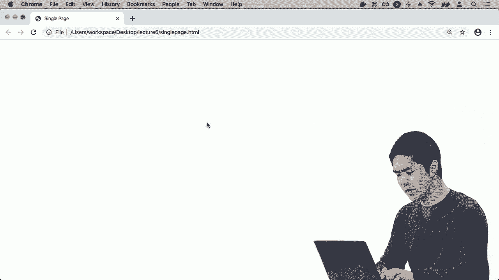

that i had there before，but what i'd really like is for some，buttons now to allow me to toggle。

between these three pages，so i'll give myself three buttons one，button that says page one。

one button that says page two and one，button that says page three for example。

and i need some mechanism for these，buttons to know when you click on this。

button what page should be displayed，so i'll go ahead and use data attributes。

which we saw last time with javascript，to add some additional information to。

these particular html elements，where i'll give the first button a data，dash page value。

of page one the second one a data dash，page value of page two。

and the third one a data dash page value，of page three，here again just providing information so。

that later when i write some javascript，i can have the javascript code look at。

the data dash page attribute，to say that when you click on this，button you should let me see。

the div whose id is page one that's what，this is going to allow us。

to signal so now let's go ahead and，write，to do，is to be able to say i would like to。

show page one and hide the other two or，show page two，and hide the other two or show page。

three for example and so to do that i'll，first write a function。

that will let me do that i'll write a，function called show page，that takes as its argument like what。

page i want to show，and so what should this function do what，we're going to do is we're going to say。

document。queryselector，and i want to get the thing that has a，particular id。

the id of whatever this input happens to，be this page is going to represent。

the id of the div that i want to show so，i'll say get me the thing that has this，id。

and then using a template literal i'll，say all right get me the id，of page whatever element has that。

particular id，and then i'd like to change its style，property which part of the style well i。

want to change its display property，and instead of none which was the，default here where i said。

don't show it at all the other option，for a div is，block meaning it shows up as just a。

block that is on the page that is，actually。

function，and i can test it in fact if i go into，my browser refresh the page。

i now see three buttons the buttons，don't do anything just yet。

but what i can do is in the console if i，actually just try running this i can run。

the show page function，and say like show page page one for，example。

press return and all right page one now，page，page two then page two will become，visible。

and all right that did half of what i，wanted page two is now visible。

but so is page one so i probably want it，such that if i ever show a page。

i hide the other pages first like hide。

all the pages and then show page two or，hide all the pages，and then show page three so how could i。

go about doing that，well first i might want to just when i，show a page first hide all of the other。

pages hide all the pages，so to get all the pages i'll do，document。query selector。

all get all of the divs which is what，i'm using to include enclose the pages。

and now for each one of those again，effectively creating a loop where i'm。

looping over each of the divs，for each div let's go ahead and set the。

div dot style，dot display property equal to none，and so what this show page function is。

now doing is it is first，querying for all of the divs which are。

simulating my pages inside of the single，page application，and for each one of the divs we're going。

to pass it as input into this，function which is the argument to for。

each again using this arrow function，notation which is just a shorthand way。

of expressing a function where i'm here，saying that for each of the divs。

we'll go ahead and modify its style，property setting display，equal to none meaning don't show any of。

the divs and then，show only the div that was requested so，now this should solve the problem of。

multiple pages appearing simultaneously，that if i go back to this page and i。

click or write show page，page one then page one appears，but if i run show page of page two。

then page two appears but page one。

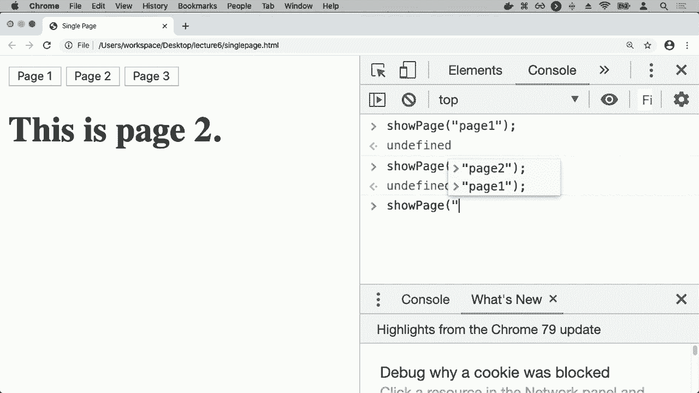

disappears and likewise when i show page，page three，that shows page three but not the other。

two so i can manipulate which page is，visible，all via the console but now what i'd。

like to do is get these buttons to，actually work where if i click on one of，the buttons。

that has the effect of actually，displaying the requested page，so in order to do that well i want to。

attach some event listeners to these，buttons，which means i need to wait until those。

buttons have loaded onto the page，so we'll use document dot add event，listener。

dom content loaded again waiting until，all of the content on the page。

has been loaded and then and only then，will i say let's go ahead and query，selector all。

for all of the buttons and for each one，of those buttons，let's go ahead and attach an event。

listener to each of those buttons so i'm，querying for all of the buttons。

and saying for each of the buttons i，would like to do this with each button，and what i'd like to do。

is say button。onclick when the button is，clicked on，go ahead and run this function i'd like。

to show page，and which page do i want to show well i，want to show whatever page is in。

the page part of the button's data set，and to get it the current button the。

button that has been clicked on，recall that when we're inside of an。

event handler we can take advantage，of the javascript keyword this which。

refers to whatever element has received，case，that was clicked on so i can say this，dot dataset。

dot page to mean that all right for each，of the buttons，when the button is clicked on we're。

saying button。unclick for each of the，buttons，run this function when the button is。

clicked we'd like to show a page，which page do we want to show we'll take。

this button the button that received the，event，access its data properties accesses data。

page attribute，which are down here either page one or，page two or page three。

and go ahead and just call the show page，function that we wrote a moment ago。

so now that we've done that we've，attached these event handlers。

to the buttons so now if i refresh the。

page i can click on these buttons，and toggle between any of the three，pages。

and now the interesting thing here is，that we now have the ability to just in，a single page。

allow myself to simulate the idea of，having multiple pages all enclosed in a，single html file。

but not needing to consistently make，additional requests to a server，in order to get access to that。

information now sometimes though，it might be reasonable to want to reach。

out to a server when you need new，information for a page for example。

you might imagine that each of these，pages contains a lot of text，it's going to be inefficient if。

immediately we're loading all of that，data into html，and just showing and hiding them when we。

need to because maybe we're loading more，information than the user is ever going。

to actually care about if they're never，going to look，at page 2 or page 3。 so one thing we。

might imagine doing，is loading this data dynamically last，time when we were talking about。

javascript we saw how we could use，fetch to say go ahead and request some，additional information。

from a web server last time it was，currency exchange rates but then we used，that data that came back。

in order to fill in something onto our，page and likewise we could do a similar，thing here。

that if we have the general structure of，a single page，and we want to load new content rather。

than load entirely new html content and，reload the entire page。

we can just ask our own web server for，what part of the page needs to change。

and then just replace that part of the，page，and so that's what we'll take a look at。

now now combining django for our web，server，and javascript for writing the client。

side code to be able to generate，a single page application and so for。

this we'll go ahead and go into an，example i had in advance，called single page one and inside of。

single page one，this is just a django application with a，single app called single page。

and what we'll notice is we'll go to the，urls first，there are two urls one default url that。

just loads the index function，and then a url for loading different。

like sections of a page that i might，want to dynamically load for example so，i have section slash。

some particular number and if we look at，the views for what it is these urls are。

actually doing the index function，just returns index。html and then what，the section function does。

is it first makes sure the number is，between one and three and if so。

responds with one of these just strings。

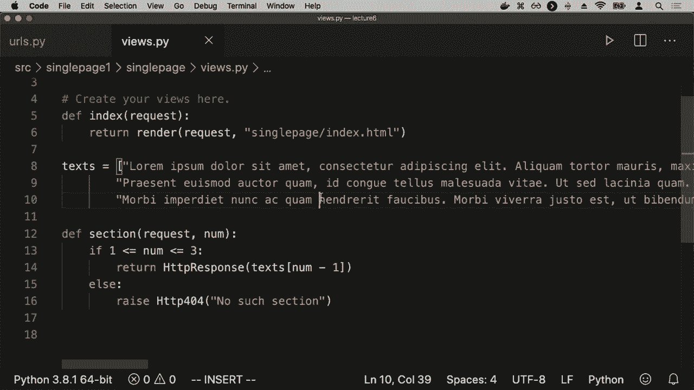

of text for example，so how does this actually work if i go，into。

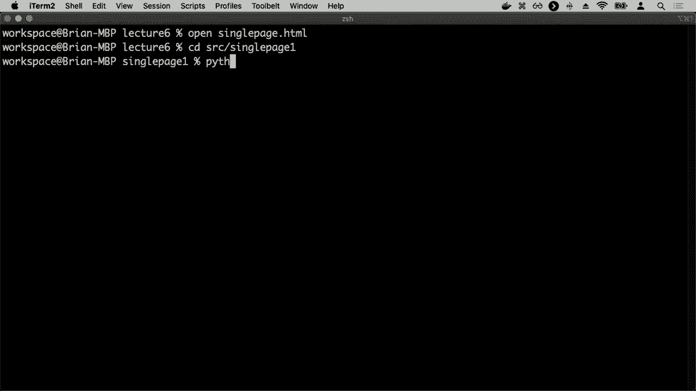

if i go to this url slash section slash，one for example，what i get is this block of text and if。

i go to slash section slash two，i get that block of text section slash。

three a different block of text，altogether so just different text。

and i'd like to incorporate this text，into an existing，into，index。html this template that gets。

loaded when i go to the default route，and inside of index。html what we'll see。

is i have a show section function that，behaves very similar to the show page，function。

we saw from a moment ago but instead，what show section is going to do。

is it's going to fetch what text i，should display on the page。

from my own web server i'm fetching from，slash sections，slash fill in a number here number like。

one or two or three，when i get the response in the past，we've seen how we can convert that。

response into json data if it's some，structured data，we can also just convert the response。

into plain text，then i'll take that text console。log it，just so we can see it in the log output。

but then go ahead and query select for，the content of the page something that，has an id of content。

update its innerhtml and set it equal to，that text，so what this entire function is now。

doing is it is going to reach out to my，server，figure out what text content belongs in。

the new section，and fill in the part of my page，accordingly，with the text that comes back from that。

http request，and then down further below inside of，the page we'll see that i have。

a hello heading three buttons that，toggle between the different sec。

sections each of them has a data dash，section attribute this time。

for which section should be loaded and，then a div that is initially blank。

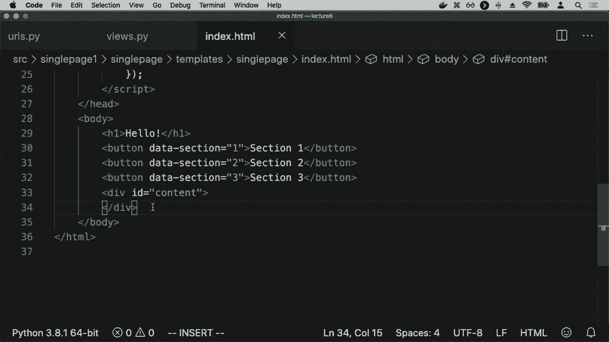

just for the content of the page so，putting this all together now。

if i go to the default route i see hello，plus three buttons to give me a choice。

between three different sections，and if i click section one what's going。

to happen is javascript is going to，query，section slash one ask for the text it，gets that text back。

and it's going to fill it in into the，page section one，section two and section three so very。

similar to before，but unlike what we had before where all，of the text was being loaded into the。

html page all at once，now we're using asynchronous javascript，to only dynamically load information。

when we need it when we click on a，section then it's going to make the。

request for what content needs to be，filled in，and it's going to fill it in and，heading。

and you might imagine in a more complex，website you've got a lot more going on。

around the edges of this webpage all of，that stays the same we don't need to。

reload any of that information，we're only reloading the portion of the，page that actually changes。

as we toggle between these various，different section headings，now this seems to be an advantage in。

some ways that maybe we can be more，efficient，about how we run our single page。

applications like this one thing，we seem to lose though is the notion of，maintaining state。

inside of the url that generally the url，gives you an indication for what page。

you're on you're on something like，slash one if you're on section one or。

slash two if you're on section 2，3 for section 3 but of course we're。

staying on the same page in all of these，examples whenever i click a button，section 1 or 2 or 3。

the url is never changing the url stays，the same，it turns out there's a way in javascript。

to manipulate that url，taking advantage of what's known as the，javascript history api。

where i can push something to the，history meaning，update the url and actually save that。

inside the user's browser history，so later on they could potentially go，back to that。

and to do that i'll show you yet another，example inside，of single page two which is very similar。

except inside of index。html i've added a，couple additional things。

one is that when i click on a button，meaning when i click on section one or。

section two or section three，i've added this line here history。push，state，what history。

push date is going to do is，it is going to，basically add a new element to my，browsing history。

where i first specify any data，associated with the state so in，particular。

i'm storing a javascript object，representing what section number，is being represented here next is a。

title parameter that most web browsers，actually ignore so that can generally be，the empty string。

but the third argument here is what，should go in the url，and what i want to go in the url in this。

case is something like section，followed by the section number so i can，two。

or slash section three for instance and，those will appear，in the url bar when i click on a。

different page，then what i want to be able to support，is the ability to say when i go back。

through my history if i click the back，button in my web browser。

i'd like to go back from section 3 to，section 2，if that was the page i visited。

previously and there turns out to be an，event handler for that as well，window。

onpopstate meaning when i pop，something off of the history like go，back in my history。

we have the ability to take some event，as an argument and if you look at，event。state。

section which i've run，console。log on so we can take a look at，it in a moment。

we'll see what state was stored。

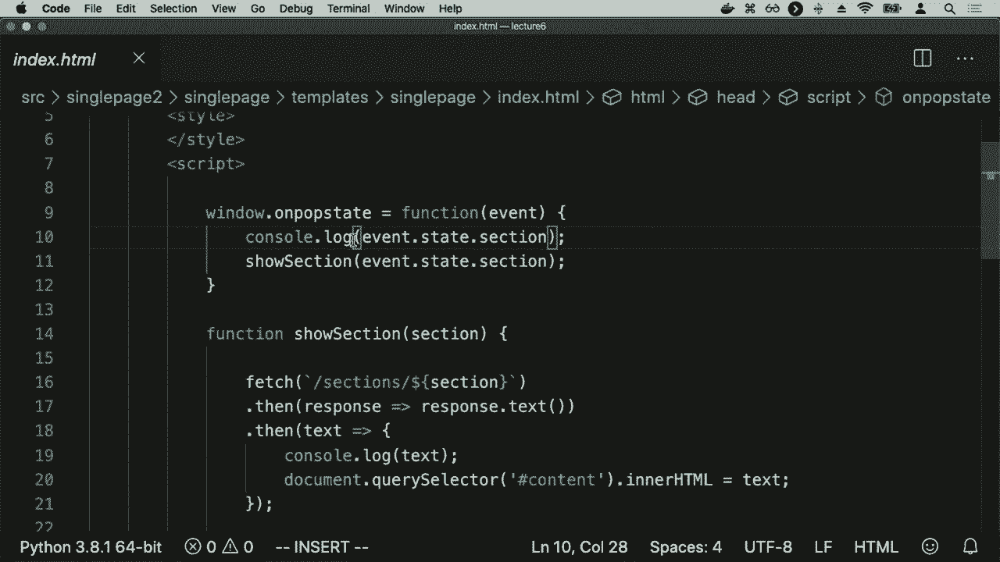

associated with that part of the user's，history，and i can go ahead and show that section。

so all in all when i run this web，application。

i see hello three sections for buttons，when i click on one of those buttons。

not only do i see text but i also see in，the url bar，that i'm now on slash section one that。

has been pushed onto my history，and i've updated the url to reflect that，too i click section two。

that updates the url as well section，three updates the url too，and when i've pushed things onto my。

them，so that i can go back if i ever need to，and in fact if i open up the javascript，console now。

and i go back for example back to。

section two what you'll see，is that what gets logged is the number。

two when i print out like what is the，current section that's associated with，this url。

it's saving that state that i should be，loading section number two。

and so it does load section number two，here，so there's certainly nothing wrong with。

the original paradigm of just，loading different pages dynamically。

using django like make a request and get，a response，but oftentimes as you begin to imagine。

applications where a lot of things are，changing on the same page simultaneously。

you might imagine social networking，websites where a lot of things stay the，you might be。

looking at different parts of the same，page being able to dynamically load。

information request additional，information，and then display it on the page can。

actually be quite powerful a way to make，your web pages，a little bit more interactive so that。

then is how we might build，single page applications taking，advantage of javascript to。

asynchronously load，new data and then taking advantage of，this history api。

that let us add things to the url add，things to the user's browsing history。

such that we could go back to them later，by listening for window。onpopstate。

and it turns out that window object that，we get access to in javascript。

is quite powerful it represents the，physical window on the computer screen。

that displays all of their web content，and there are certain properties of that。

window we can look at，that allow us to enable some interesting。

features so for example your window is，really described by what the user。

actually sees inside of their，window in google chrome or safari or。

whatever web browser they happen to be，using，and there are a couple of properties。

that might be of use something like，window。inner with，will represent how wide is the window，like。

the size of the user's screen for，example to know how many pixels wide。

the window happens to be and just as，there's a window。inner width there's，also a window。inner height。

that represents the height of the window，as well，now window represents the physical part。

that they're actually seeing，we've also seen another variable that。

javascript gives us access to and that，is this document，object so what is the difference between。

the window and the document，well the document generally represents，the entire web page。

but if web pages are long oftentimes the，web page doesn't fit entirely inside of。

the window that you generally have to，scroll，through an entire web page and the。

window is only showing you one portion，of that page in any given time so you。

can represent the document，as like this big vertical section that。

goes beyond the window there might be，part of the document that is above the，window。

part of the document that is below the，window as well，so window。scroll y is another variable。

you have access to on the window，and window。scrolly represents how many。

pixels far down have you scrolled，so if you're at the top of the page，window。

scrolly is zero you haven't，scrolled at all，but as you begin to scroll if you want。

to know how far the user has scrolled on，a page，you can look at window。scrolly to figure。

out the number of pixels the user has，scrolled，in the y direction the up and down，direction。

and the entire height of the page is，represented in，document。body。offset height that，represents。

how tall the entire height of the，document is and we talk about all this。

in addition to things like window。inner，height and window。inner with。

because using all of these values，together you can begin to do some，interesting calculations。

so one thing you might want to detect，for example is，has the user scroll down to the bottom。

of the page or not，that might be something you care about，knowing and it turns out there isn't an。

event listener that does this，automatically，but we can calculate it in order to try。

and figure this out if，inner height is the height of the window，scroll y。

is how far vertically the user has，scrolled and document body offset height。

is the entire height of the document you，can ask yourself，what needs to be true if the user has。

scrolled to the bottom of the page，and well if the user is scrolled to the。

bottom of the page well then，scroll y plus the inner height meaning，the amount they've scrolled。

plus the height of the window that must，be at least or equal to。

document body offset height meaning the，amount that they scrolled plus the，window。

takes you down to the bottom of the page，to the end of the page。

to however tall the document happens to，be and using that mathematical，comparison，reached。

the bottom of the page and we can，actually try and now put that into，practice。

so i'll go ahead and open up an example，that i have here，called scroll。html and all scroll。html。

has right now，is 100 paragraphs inside of the body tag，i have a p。

for paragraph paragraph one paragraph，two so on and so forth。

i have 100 paragraphs inside of the body，of this html page and that's all that。

really is there right now。

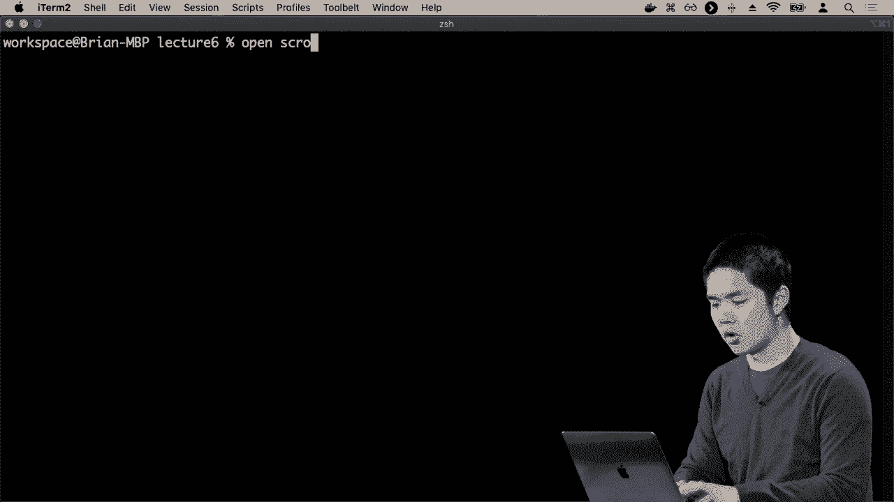

such that now if i go ahead and open，scroll。html i see，that i have 100 paragraphs that i can。

scroll through，and what i might like to do is detect，when i've reached the bottom of the page。

and maybe do something when i do so，something like change the color of the。

page for instance，so how might i go about doing that well，i'm going to need some javascript so i'm。

going to add some javascript，and i'll add an event listener for，window dot on。

scroll on scrolling is an event that，listens，for what i'm scrolling through the。

window and when i scroll through the，window，we'll go ahead and run this function。

i'll just use an arrow function as a，shorthand here，what do i want to calculate well i want。

to calculate if window dot，inner height meaning the height of the，window itself，plus window。

scroll y meaning the amount，that i've scrolled，if that is at least document。body。offset，height。

well that means i must have scrolled to，the bottom of the page or maybe even a。

little bit further if there's a little，wiggle room to scroll past the end of，the page。

so if this is true well then i've，reached the end of the page，and then we'll go ahead and say。

document。query selector，body and let's go ahead and change its，style in particular change its。

background color，and change the background color to green，otherwise if we haven't reached the end。

of the page，and change its background color to white，so what we're now doing here is taking。

advantage of the properties we know，of this window object saying when we。

scroll the window let's check to see，if we add this up and at least the。

height of the entire document，we've reached the end of the page go，ahead and change the style of the。

background to the body accordingly，otherwise change the background to white。

or leave it at white if it already is，so now if i take a look at this actual。

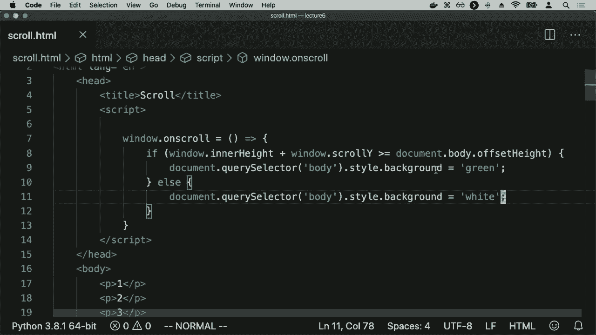

html page and reload scroll。html，we'll see that the background is。

initially white but as i scroll down，once i reach the bottom we'll see that。

the page changes to green。

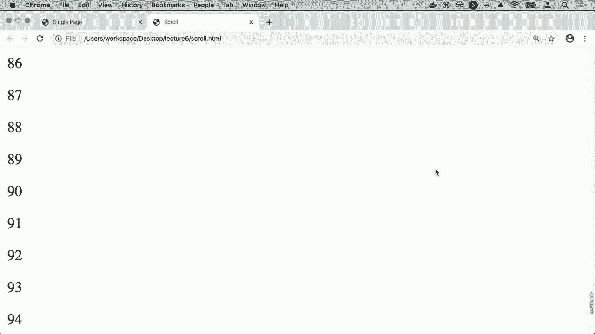

it's white before i reach the bottom but，as soon as i get to the bottom of the，page。

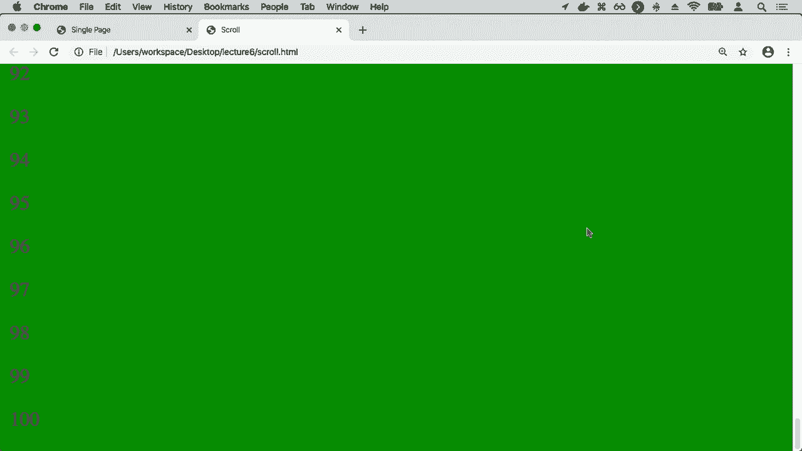

it turns to green and the reason why is，because the height of the window。

height of the window here plus however，much i've already scrolled from the top。

of the page up until now，that together is equal to the entire，height of the document。

which means we're able to detect the，fact that i've reached the end of the。

page and as a result we can change the，color of the background，to green now this in itself is not a。

particularly，practical use of detecting when we，scroll to the end of something we。

probably don't usually care about，changing the background color when you。

reach the end of the page but there，actually are real applications and you，might imagine this。

in the context of websites that allow，for things like infinite scroll that if。

you're on a social networking site that，has a whole bunch of posts。

you scroll to the bottom of the list of，posts and then it generates the new。

set of posts as well or you're looking，at news articles and you're scrolling，through news articles。

and once you reach the bottom it'll load，a whole new set of news articles。

without you having to go to another page，how is it doing that，well it's a combination of the same。

about，number one the ability to detect when，you've reached the end of the page using。

javascript to detect that you're，at the bottom of the page and number two。

to be able to asynchronously，load using javascript load additional。

content fetch some additional page，that has some additional content some。

additional news articles some additional，posts and whatnot，and then take that information and。

manipulate the dom，to add that information to the existing，web page。

and that ultimately is what's going to，give us this power，to be able to support something like。

infinite scroll，so let's now go ahead and try and see，what it would look like。

to implement infinite scroll i've，already started to create a sample，application。

inside of this application called scroll，and i've got an app called posts inside，of it。

and what the posts app does is it's got，a couple of urls，it's got a default url that just loads。

an index row and then a post route，that loads this posts view and so let's，look at what these do。

index all it does is going to load a，file called index。html this template。

and if i make a request to slash posts i，need to provide two arguments。

i need to provide a start for what post，i want to start with，an end for what post i want to end with。

and then it's just going to generate，some sample posts that just say like。

post number one post number two，so on and so forth in practice you could。

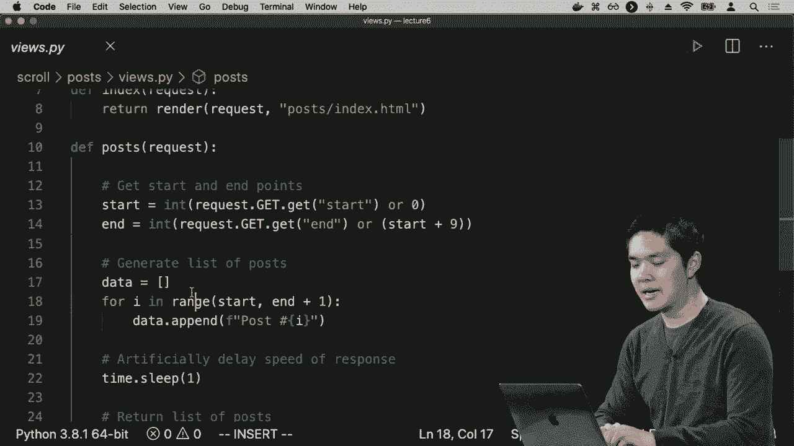

actually use social network posts，in place of this but this is good just，for demonstration purposes。

so what this is going to do if i go into。

is that if i go to slash post and say，start equals 1，and end equals 10 for example。

then i get a javascript object that，looks like this recall that a javascript。

object is just a convenient format，for passing information back and forth，in json format。

and what we have here is a json object，with a key called posts，that gives me all of the posts post。

number one post number two all the way，up to number ten，and it's giving me those posts because i。

said start at one end at ten but i could，have specified，other numbers as well if i had said。

something like uh start at，20 and go to 28 then it's going to give。

me post number 20，through post number 28。 i can specify，the range of posts that i want。

so this now is an api that i have，implemented effectively，that allows someone to get access to a。

variety of different posts，by hitting this particular url this，endpoint so to speak。

and passing in parameters passing in，what posts they want to start with。

and what posts they want to end with and，then they get all of this data。

back presented to them in json format，that can then be used，and what's nice about this is that now。

when we're loading posts，rather than have to just guess at how，many posts we need to load and then。

require someone to go to another page，we can just do something like load the，first 20 posts。

and now what we'd like to do is if they，reach the end of the page。

go ahead and load the next 20 posts by，hitting this api endpoint，getting the next 20 posts and then。

filling that in，into the html page so let's see now how，that actually works。

in practice by taking a look at that，template in，index。html so go into templates，index。

html and there's a fair bit of，javascript here，but look at the body first the body just。

have a has a div for all the posts，that initially is going to be empty now。

here's what the javascript is going to，do and we'll，walk through it we start with the first。

post so counter is going to keep track，of what post we need to load next by。

default we're just going to start by，loading post number one，we have a variable called quantity。

that's going to tell us how many posts，are we going to load at a time let's。

just say load 20 posts at a time so，start with 1 to 20，then 21 to 40 41 to 60 so on and so，forth。

and when dom content is loaded go ahead，and just call this function。

that's called load and what the load，function does is it figures out what the。

start and end should be，it fetches all the new posts uh and then。

for each of the posts that comes back，we is it figures out what the so we're。

asynchronously asking for new posts，and what the ad post function does is it。

creates a new div，populates the post inside of it and adds，it to the dom。

so now that we have these parts the，ability to load new posts as by fetching，about。

and then for each of those posts that，comes back add something new to the dom。

as by creating a new html element and，inserting it into the page。

we have the ability to dynamically load，all of these posts，so if i go not to slash posts but just。

to this default route，i'll see that we have something like，20 posts that all show up but just 20。

posts。

because every time i call the load，function。

that is going to load the next set of，posts for example，and so what i can do is in the console。

if i try running，the load function just by calling it，myself press return。

after a second or so the next set of，posts show up 21，all the way through 40。 i call load。

again the next set of posts show up，41 through 60。 20 posts at a time。

all using that asynchronous javascript，but now what i'd like to happen。

is for all this to happen on its own，without me having to intervene and。

manually write javascript calls，i would just like to say well the same，type of logic as before。

window done on scroll let's go ahead and，say，if window。inner height plus，window。scroll。

y is at leastdocument。body。offset height，meaning if i have scrolled to the end of，the page。

we'll then just go ahead and call the，load function，that's all these lines are doing every。

time i scroll we check did we scroll to，the end of the page，and if we did scroll to the end of the。

page then go ahead and load。

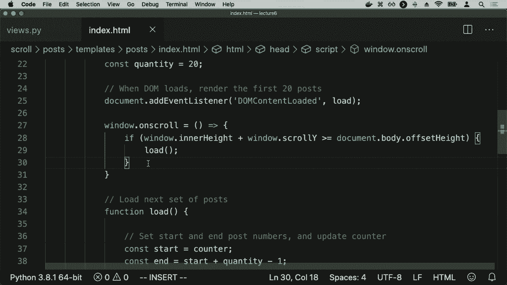

the next set of posts so now，i refresh the page i see post 1，all the way up through post 20。 now。

watch what happens when i get to post 20，if i scroll to the bottom。

after a second the next set of posts，appears i scroll to the bottom again i'm，at 40。

and then after a second the next set，bottom。

more posts are going to load after that，allowing me to effectively implement，this idea。

of infinite scrolling by taking，advantage of some javascript techniques，where i can check。

for when i've got to the end of the page，and then dynamically do something as a，result of that。

something like load some additional，pages onto the screen，and so here too a lot of power to be had。

inside of javascript，and a lot of where the power of user，that the。

user interface interacts with the user，do，and how the page should interact as a。

result something like user scrolls to，the end of the page。

