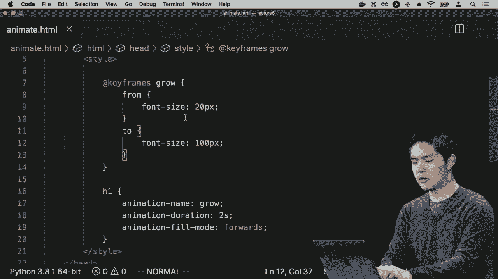
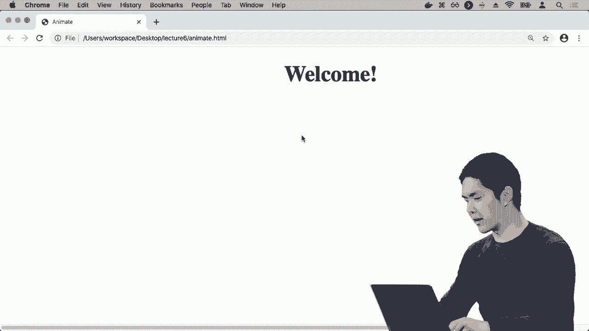
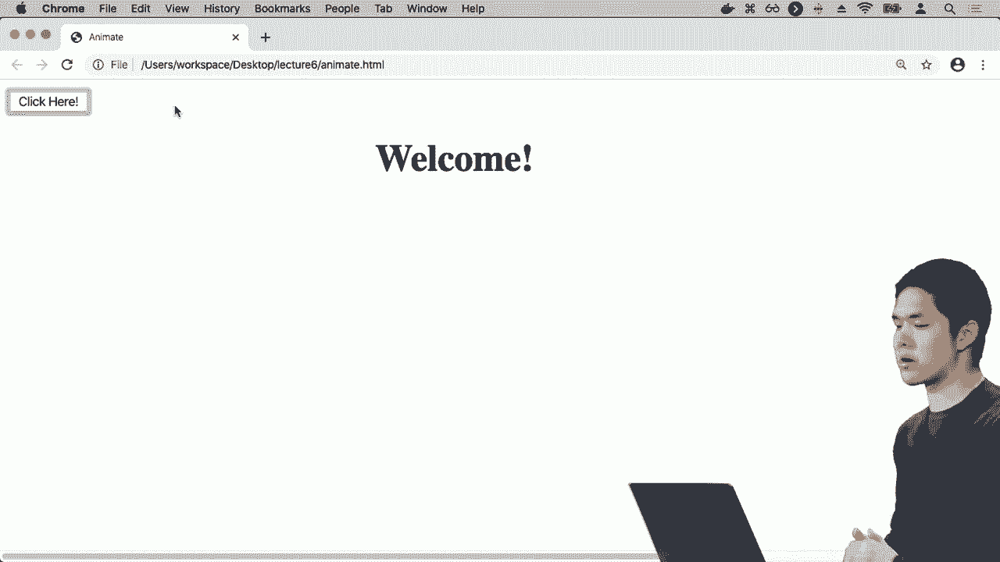
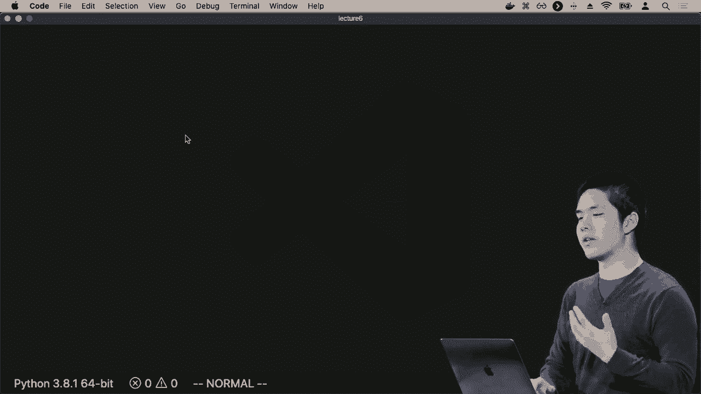
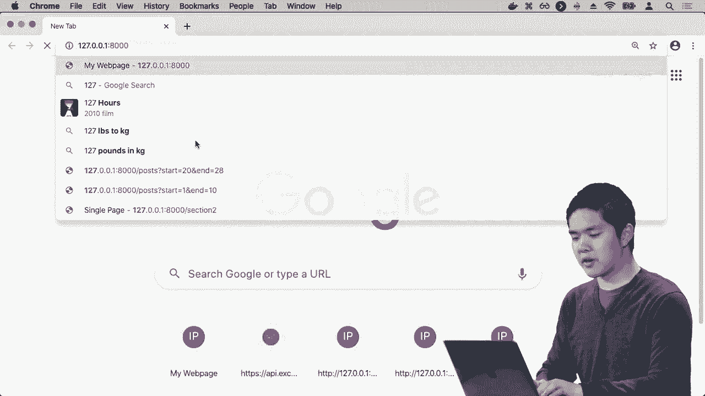
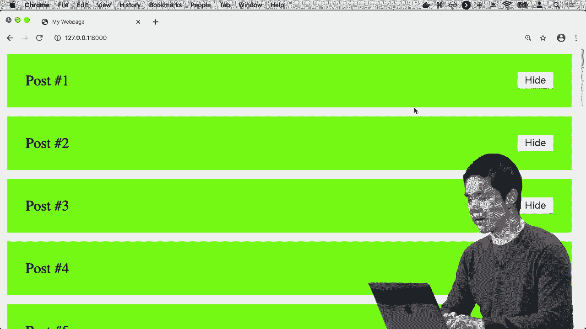
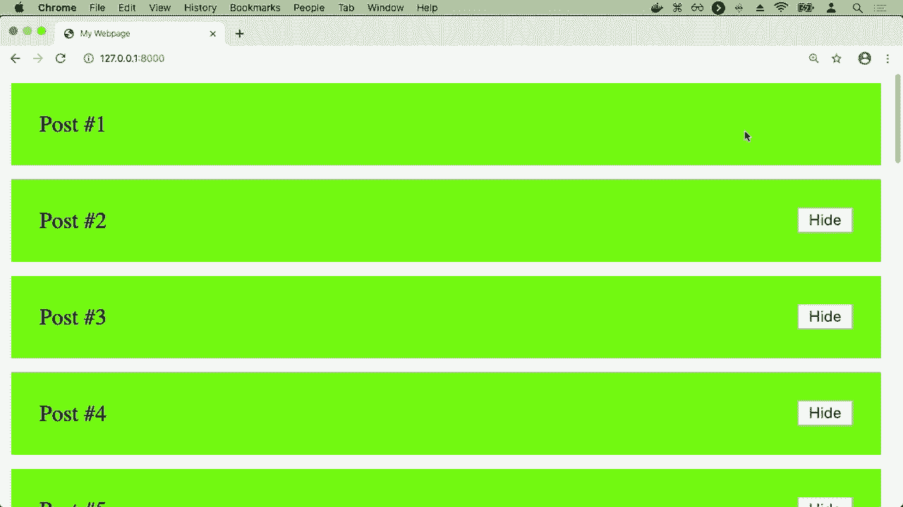
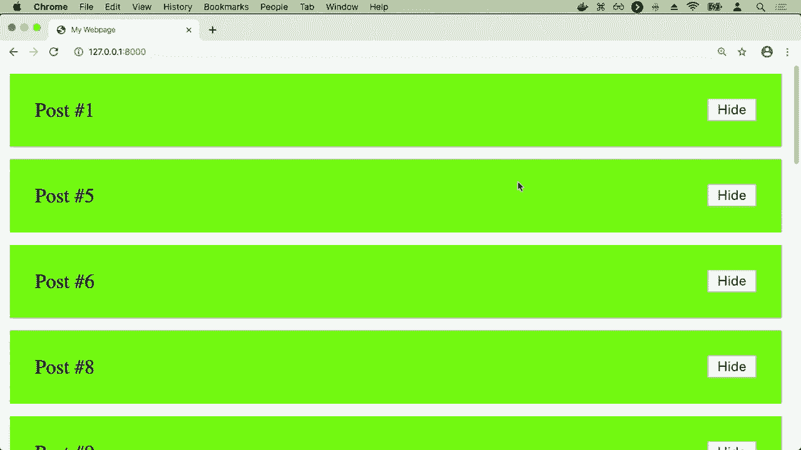
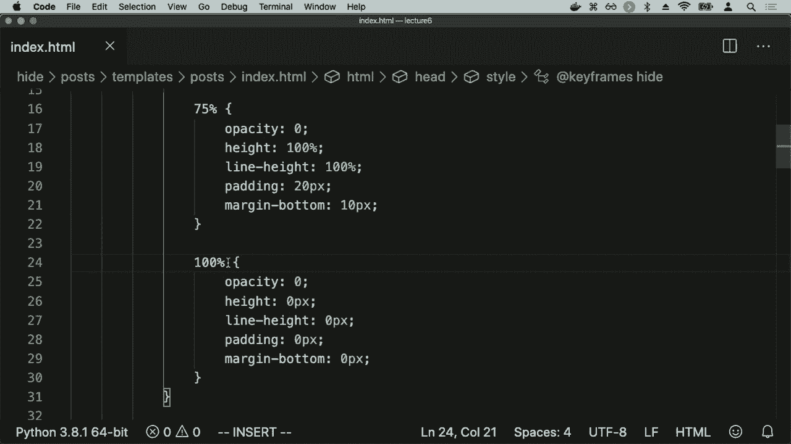

# 【双语字幕+资料下载】哈佛 CS50-WEB ｜ 基于Python ／ JavaScript的Web编程(2020·完整版) - P19：L6- web用户接口与交互 2 (动画与交互) - ShowMeAI - BV1gL411x7NY

for things to，move around and change their properties，in some way and it turns out that css。

has support for animation css has，already given us support，for things like styling elements saying。

we want this element to be of this color，and this size for example but it also。

gives us the ability to animate those，properties as well to change。

the size of something or change the，position of something over some。

amount of time and so let's now take a，look at an example，of what that might actually look like。

i'll go ahead and create a new file，and i'll call it animate。html，and inside of animate。

html i'll go ahead，and what i'd like to do is just add a，little bit of animation。

using css into this particular page i'm，going to start with just a heading。

a heading that says something like，welcome，for example it's just going to display a。

welcome message such that now，if i open animate。html，here's what i see just a message that。

says welcome，but now let's add some css to it let's。

go into the style tag，and for h1 for this heading i'd like to。

apply a particular animation to it，and i first need to specify what the。

animation's name is going to be，and i can pick a name for the animation，i'll say something like。

grow for example i'll set the，animation's duration，to be two seconds and then the animation。

fill mode is like what direction should，the animation move in should it go。

forwards or should it go backwards，we'll generally want our animations to。

go forward so they're making some sort，of forward progress，according to some rules that we're going。

to specify so here i'm saying we're，going to animate all of our headings。

using an animation called grow and now i，actually，does and to do that up above in style。

i'm going to say，at keyframes grow，and what this is going to allow me to do，is specify some key。

frames for this particular element，meaning where should the element start。

what should its style properties be and，then at the end what should its style，properties be。

and css is going to take care of the，process of figuring out what needs to。

happen in all those intermediary，fractions of seconds for example。

so what i can say is something like go，ahead and grow from，meaning what should its initial。

properties be and maybe initially i want，it to have a font size of，20 pixels and then we'll say 2。

font size of 100 pixels for example，so all in all what this is saying is i。

would like to apply an animation，called grow to all of my headings this。

animation should last two seconds and go，forwards。

and what is the grow animation going to，do well it's going to mean at the start。

anything that obeys the grow animation，we'll start with a font size of 20，pixels。

and at the end it will grow to a font，size，of 100 pixels and i have now defined。

what it is that that animation，means so now if i go ahead and refresh，this page animate。html。

you'll see that welcome changes size，over the course of two seconds it goes，from smaller。

to larger by obeying those keyframes i，told it to obey，this particular step a set of。

instructions where it goes from a，particular font size，to another font size and as a result we。

see the effect here，on the page and it turns out you can do，more than just manipulate size you can。

manipulate just about any css property，you want so if i tell the。

heading that it should have a relative，position，meaning its position should be relative。

to other elements or other things in its，parent，i can say you should change your，position from being。

zero percent away from the left side of，the screen，to being 50 of the way from the left。

side of the screen，and at this point grow is probably not，the best name for this animation i'll。

call it move instead，so animation name is move and so now，what this animation is going to do is。

it's going to say when you run the，animation，go from being right next to the left，side of the screen。

to being about 50 away from the left，side of the screen，and we see that's the animation that。

takes place it goes from the left。

all the way back up to about halfway，across the screen，refresh the page and it goes ahead and。

does the exact same thing，and it turns out we don't just need to，specify a beginning point and an。

endpoint for an animation，we can specify various different key。

frames for different points within the，animation，that we would like to capture something。

like at the beginning of the animation，have this set of css properties maybe。

halfway through the animation have a，different set of css properties。

and then at the very end have yet，another set of css properties。

so i could say something like if i want，the heading not just to move from left。

to right but also to move back again i，can say at the beginning。

at the zero percent point when you're，zero percent of the way through the，animation。

you should be zero percent away from the，left-hand side when you're 50。

of the way through the animation you，should be 50 away from the left-hand，side。

and then when you're done with the，animation 100 of the way through let's，go back。

uh to zero percent away from the，left-hand side i now have three。

keyframes beginning of the animation，middle of the animation back to the。

beginning of the animation again，and the effect of this is if i refresh，the page we go to the right。

and then we go back we're able to move，one direction and then move back。

and there are other properties we can，well，i can set the animation iteration count。

for example to 2，to mean rather than just do the，animation once and then stop。

do the animation twice and then stop so，i refresh it goes to the right。

and then it goes left and then it，repeats that a second time，and it turns out if you really want you。

can set this to，infinite to me never stop performing，that animation it's consistently。

going to have this heading move to the，right and then move left。

according to those key frames that i've，specified and so if you ever see things。

moving around on a page interactive in，some way，there are a number of ways to do it you，example。

but there are many cases where css alone，is pretty good at just creating。

these types of animations and while this，animation right now is just running，forever。

we could use javascript in order to，control that animation，as well so let's see an example of what。

that would look like，i'll go back here in the body of the，page in addition to a heading that says。

welcome，i'll go ahead and add a button that just，says，do，is add a little bit of javascript i'm。

going to add some javascript，so that the button can now control the。

animation decide when the animation is，going to start，and stop and so what we'll do inside of。

this script，is to first say，document。addeventlistener，dom content loaded meaning wait until。

the dom is done loading，as we've done before and let me now get，that h1 element。

and initially i'm going to set its，style。animationplaystate，equal to paused。

so animation playstate is a property of，the style that lets me decide if the。

animation is playing or paused，and i can control that using javascript。

rather than just say run infinitely，forever，i can say the animation play state，should start out。

as pause by first getting the h1 element，then modifying，the animation playstate property of that。

particular element but now what i'd like，to happen，is anytime someone clicks on the button。

i want to change the animation playstate，so i'm going to say，document。queryselector button。

meaning get that button and when someone，clicks on the button，let's run this function where if。

the current animation playstate is，paused，we'll then go ahead and set animation，playstate。

equal to running and otherwise if it's，already running，then let's go ahead and set the。

animation play state，equal to paused，so all in all what this function is。

going to do is it's going to get me the，heading，pause this initially and every time the。

button is clicked run this function。

where the function says if we're paused，go ahead and start running the animation。

otherwise go ahead and pause the，animation by modifying that animation，playstate。

property of the heading so now if i，refresh this page，right now we have welcome plus a button。

that says click here and initially，everything is paused there's no，animation happening。

but i click here and that begins the，animation which will go on indefinitely。

until i decide that i want to stop it at，which point i click it again and the，animation pauses。

and i can control when to start and when，to pause，that animation as well and so this can。

be helpful and nice，when you want to create something a，little bit more interactive something。

animated on the page，but this is especially helpful because。

it means that you can gradually change，css properties over time，rather than just immediately change。

something you have the ability to，animate something，to make it work a little bit better so。

let's take a look at an example，of how you might put that idea into，practice let's go back to。

our posts example where we had this，infinite scrolling list of posts but。

imagine now that we want the ability to，hide posts，when we're done with them so i've。

prepared an example called hide，which is very similar to what we had，before。

but this time i've just added one extra，button，and the button says hide on every single。

div，right now clicking the hide button does，nothing we'll go ahead and implement。

that in just a moment。

but first to see how this worked if you，go into hide go into。

the index。html template the only change，that's been made here，is what happens when i add a new post。

does，is it loads posts from a server and then，when it gets to those posts it goes。

loops over each of the individual posts，which is just a string of text。

and it adds that string of text inside，of an element，onto the page via this add post function。

and what the ad post function is going，element，create a div in which to store that post。

give it a class name because that's how，we're going to animate it。

and then set its inner html equal to the，contents of the post，something like post number one post。

number two post number three，and then add a button that just says，hide。

and then we're going to go ahead and add，that to the dom as well。

so that's what adpost is now going to do，we're sort of generating some html。

using this javascript code and then，adding that html to the page。

and now what we're adding is a div that，text，but it's also going to give us access to，a button。

that ultimately we hope is going to let，us hide that post as well。

so how do we actually get the hiding of，the post to work，well what we want to do is somehow。

detect when the user clicks，on one of those hide buttons so there's。

a number of ways we could do this，but one way is just to listen for any，time，anyone clicks on。

the document as a whole anytime anyone，clicks on the document。

i might like to ask something like what，did they actually click on。

and it turns out that with most event，listeners the function the event，listener takes in。

can take as an optional argument the，object，that contains information about the，event that happened。

like the click event or the scroll event，or the key down event or the key up，event for example。

and one of the properties you get access，to is event，dot target which is like what was the。

target of the event，in this case what was the thing that was，actually clicked on and i'll go ahead。

and save event。target，inside of a variable called element，where the idea now is that whatever gets。

clicked on that is the events target，we're going to save that inside of。

element and what i want to know is，is element is that one of the hide。

buttons i want to know is it a hide，button i could have also，attached an event listener to each of。

the hide buttons this is just an，alternative way of doing it that i'm。

showing you for sake of demonstration，where we say when we click anywhere in，on。

and save it inside of this variable and，if it's a hide button。

then it's going to have a class of hide，because i gave every class，every hide button a class of hide。

and so what i can say is if，element dot class name equals hide。

well that means that what was clicked on，is something with a class of hide we can。

assume that it is in fact，a hide button and then what i want to do，is i can do something like。

element。remove to say go ahead and get，rid of that element，so now what does this do if i refresh。

the page，let's try it post number one if i hide，it i want to hide post number one。

all right that didn't quite work it was，close it got rid of the hide button。

but i didn't want to get rid of the hide，button i wanted to get rid of the whole，post。

so what's going on here is it seems to，be that if the element's class name is。

hide meaning i clicked on a hide button。

element。remove just removes that element，it removes，the hide button but it doesn't remove。

the post that contains it，and if you think about this in terms of，the dom the post is a div。

and its child element is the button this，hide button，and so you remove the button but it。

doesn't also remove the post as well，if you want to remove the post as well。

you need to remove not the element，but the element's parent and in。

javascript it turns out there's a way to，do that too，element。parentelement。remove。

to say take the element get its parent，and remove that，one，i want to hide it i hide post one and。

all right now i see post two。

and post one has gone away if i want to，hide post three i hide post three。

now post three is gone now i go straight，from post two to post four，so this works but it's also not。

because，all of the posts are the exact same。

three，it's not immediately obvious to the eye，that they've gone away because。

post two and four they look almost，exactly the same you really have to be，paying attention。

to know that the hiding worked and so，this can be a time，where animation can actually be quite。

helpful so what i can do is say，something like，let's go ahead and give this post。

an animation associated with every post，we'll give it an animation name。

called hide an animation duration of two，seconds we'll say it'll take you two。

seconds in order to hide，uh in an animation fill mode of forwards。

i want to go forwards with the animation，and initially i'll give the post an，animation playstate。

of paused meaning initially i don't want，the animation to be running because i。

don't want to hide all the posts，immediately，pause this animation later we'll go。

ahead and run the animation，in order to actually hide the post，then i need to define what does it。

actually mean to hide the post，and i'll say well all right at the zero。

percent mark what does it mean，let's give yourselves an opacity of one。

opacity is a css property that just，controls，how opaque or how transparent an html。

element happens to be，and at the end 100 of the way done with，the animation。

will set opacity to zero so initially，we can fully see the element at the end。

the element is totally transparent，and now what i need to do is actually，trigger this to happen。

somehow so this is probably going to，happen，inside of my event listener where。

instead of removing the element right，away，let me just take the parent element and。

set its animation play state，equal to running for example，meaning when i click the hide button go。

ahead and run the animation，that will change the opacity from one to，zero。

over the course of a couple of seconds，and then if i really want to i can add。

another event listener to say，take the parent element add event，listener。

there's an event called animation end，which happens when the animation is over。

and then i can say all right when the，animation is over，we'll then go ahead and remove the，element。

so all in all rather than just，immediately remove the element when i。

click on the button that says hide。

what i'd like to do is say if you click，on a button and the button is hide。

go ahead and get the parent element not，the hide button but the post itself。

set its animation playstate to running，meaning run the hide animation。

and then add an event listener to the，parent to that post as a whole。

to say when the animation is over go，ahead and remove，that entire post from the dom altogether。

so what is the effect of all of this now，of having this animation。

and running it well now if i refresh the，page，i see all these posts if i try and hide。

like post number two for example，you'll see that the opacity changes and。

then it slowly disappears and then only，after it's totally transparent。

the post disappears entirely so i can，say hide post number four。

it disappears and then post number five，jumps up to fill its place and i can do。

that for any of these posts，triggering the animation when i click on，the hide button。

and so this is part of the value of what，animation can do is to be able to。

make our user interfaces a little more，user，by not immediately getting rid of a post。

but by having a nice fade out so it，disappears，nicely now even this is not perfect。

animation wise like one thing you might，notice，is that it jumps up as soon as the post。

is gone if i hide post number three，i hide it it disappears and post five，sort of jumps up。

very abruptly in order to fill its place，what i might like is to be a little bit，clever。

to somehow shrink the size of the post，after it's gone，so that the post doesn't jump into place。

but it slides a little bit more，naturally into place，and so there's some additional things i。

can play with here maybe i want to say，that all right let me make this。

animation a multiple part animation。

so here instead of just from zero to a，hundred percent setting the opacity from，one to zero。

maybe in the first 75 percent of the，animation，that will take care of reducing the。

opacity going down from one all the way，down to zero，but in the last 25 of the animation。

will still end with an opacity of zero，but，anything that creates vertical space i。

want to reduce down to zero so the，height，should be zero pixels the line height。

which is how high the text is should，also be zero pixelism，any padding i want to go away it turns。

out i've added some margin to the bottom，of the post i want to make that go away，as well。

so i want to set all of those to zero，from whatever their initial values。

happen to be that initially the height，is like a hundred percent of what the。

height could be likewise for line height，100 of the parent，initially i have like 20 pixels of。

padding and a margin at the bottom of 10，pixels，and i want all of that to still be true，75。

of the way through the animation but，it's only in the last 25 percent of the，animation。

that i want to set all of these vertical，height properties down to zero i want to。

remove all the height remove the line，height remove all the padding。

and the effect of this is i'll have an，animation now where for the first。

75 percent of the animation the only，thing that changes is the opacity the，opacity goes from one。

fully visible to zero fully transparent，the，post is already transparent you can't。

see it but it's still taking up physical，space on the page，but we're going to now reduce the height。

of that post so that now you won't be，able to see it，at all so now if i refresh this page。

here again are all the posts but now if，i click hide on a particular post。

we'll see that it first fades out and。

then its height shrinks，so that the next post slides very nicely，into place i can do that again。

hide the post it's transparent and then，it slides into place。

and this again is just an application of，this idea of css animations using，properties of animation。

to make our interfaces a little bit，nicer to use a little bit clearer，visually to the user。

that one post has gone away and the rest，of the posts have now scrolled up。

in order to take their place，so now we've been able to use javascript。

to create a lot of nice user interfaces，we've been able to create single page，applications。

to create infinite scrolling to be able，to create some animations as well and，them。

but one thing you might be realizing at，this point is that our applications are，starting to get。

fairly complicated there's a lot of，javascript code needed to manipulate a。

lot of different parts of our。