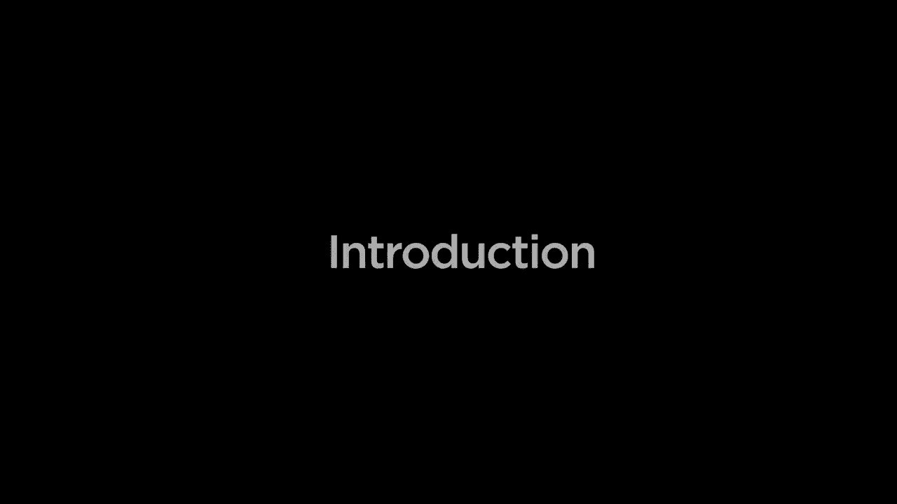

# 【双语字幕+资料下载】哈佛 CS50-WEB ｜ 基于Python ／ JavaScript的Web编程(2020·完整版) - P1：介绍与入门 - ShowMeAI - BV1gL411x7NY

[Music]。

hello world this is cs50 and this is web，programming with Python and JavaScript。

with cs50 zone Brian you this course，picks up where cs50 itself leaves off。

diving more deeply into the design and，implementation of web apps with Python。

javascript in sequel using frameworks，like Django react and bootstrap we'll。

start by taking a closer look at HTML，and CSS languages that we can use to。

describe the structure and the style of，webpages after that we'll introduce get。

a version control tool that we can use，to keep track of changes we make to our。

code and also to allow multiple people，to collaborate on the same project at。

the same time after that we'll dive more，deeply into Python exploring some more。

advanced features of the programming，language and in particular how we can。

use it in order to create dynamic web，applications using a web framework known。

as Django we'll leverage of Django and，in particular its ability to deal with。

data working with sequel models and，migrations to create web applications。

that use a database in order to create，interactive user experiences after that。

we'll dive more deeply into another，programming language JavaScript。

exploring how we can use JavaScript to，create dynamic and interactive user。

interfaces writing code that responds to，events and also manipulates a web page。

in response to some kind of user，interaction，after that we'll explore some best。

practices in industry including testing，to make sure that our code works as。

expected and also continuous integration，and continuous delivery to allow us to。

rapidly make changes and deploy those，changes to our code whenever we're able。

to make those updates and then finally，we'll consider concerns around。

scalability and security as we take our，applications and move them from our own。

computers to the web where anyone can，access them we'll talk about how we make。

sure that these applications are able to，scale and how we're able to make sure。

that these applications are secure along，the way you'll have an opportunity to。

put all of this into practice by，building web applications of your very，own this is cs50。

