# 【双语字幕+资料下载】哈佛 CS50-WEB ｜ 基于Python ／ JavaScript的Web编程(2020·完整版) - P20：L6- web用户接口与交互 3 (React) - ShowMeAI - BV1gL411x7NY

application at the same time，and you can imagine that as web pages。

start to get more complex and as you，want to start making them，more interactive and more dynamic。

there's going to be a lot of javascript，code required，in order to keep everything in sync in。

order to make sure that all of the，elements are updated when they should。

so on and so forth and it's for that，reason that in recent years。

a lot of javascript has now turned to，some javascript libraries or frameworks，that allow。

to more efficiently and more effectively，create user interfaces that are more，interactive。

and more reactive and one of the most。

popular of these is a framework known as，react，react is a javascript library that is。

going to enable us，to be able to design user interfaces，that are very interactive where the。

content of the web page，updates automatically based on some，underlying state。

and what we'll do now is take a look at，a brief taste of react to get a sense，for how。

frameworks like it can actually work and，can help us in designing some，interactive and useful。

interfaces for users to be able to，interact with react is ultimately based。

on this idea of declarative programming，a particular style of programming。

which is different from the types of，programming you might be familiar with。

more classical programming styles，like imperative programming in，imperative programming。

you generally give the computer commands，tell the computer what to do。

for example if we had that counter，program from before and we wanted to。

update the counter from one number to，another number，in the view like the html that the user。

sees we would include something like，a heading that just has the number zero。

inside of it and then the logic，in imperative programming would take。

something like this form it would be，like all right first，document。queryselector to get that h1，tag。

get it its innerhtml parseint will take，the string and convert it into an，integer。

and we can save that inside of a，variable called num for example，and then after that if i want to。

increase it i would take this variable，num and just add one to it。

num plus equals one add one to it and，then if i want to update this heading in。

order to replace the zero with a one for，example，well then i would need to say，document。

queryselectorh1，set the inner html equal to that number，for instance in order to say all right。

num is now one，go ahead and replace that in the view，but this is a fair amount of code。

to do something fairly simple just like，increase a number by one。

and the reason why is because we've had，to be very explicit about what，instructions。

we're giving to the web browser we're，saying first grab the h1 figure out what。

number is inside of it add one to that，number，and then replace it inside of this tag。

what declarative program is going to，allow us to do，is it's going to allow us to just。

describe what state should be displayed，on the page in what form。

in declarative programming in our view，like the html like code that we're going，to be writing。

we're just going to say something like，h1 and then in curly braces。

num to mean like fill in the number here，and this is what the react syntax is，going to look like。

and then the logic code if we want to，increment that number by one。

is we just need to say num plus equals，one add one to the number。

and the effect of that is that since we，have declared that inside of this。

heading it should be whatever the value，of the number is，when we increment the value of number。

react is effectively，just going to update the view so that，the number updates。

as well and so this will be some of the，power that react gives us react。

lets us divide our application into a，whole bunch of different components，where a component。

is something like this thing here that，is keeping track of some sort of count。

along with a button that might，manipulate it，and then make that component based on。

some underlying state some，underlying variables that represent the，state of the application。

something like the current number and，then we can manipulate that state and。

when we manipulate the state，that will have an impact on what the。

user actually sees and react will handle，the process。

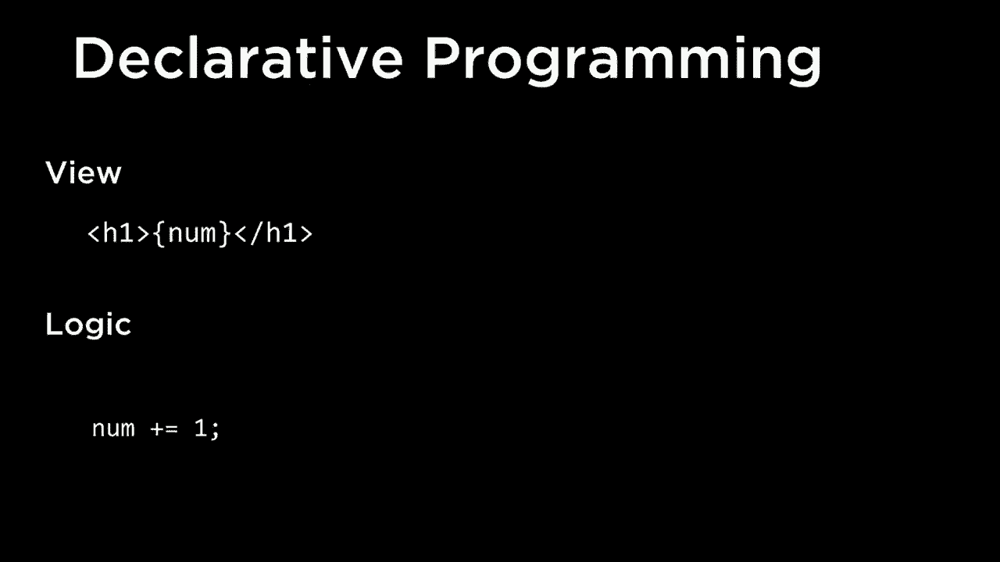

of updating that user interface for us，there are a number of ways to get react。

working on our web page，but the simplest is probably just to，include these three。

javascript packages inside of our，web page so we're first going to include。

react itself which is going to be the，library that's going to allow us to。

define these components and how they，behave，then is react dom a special package。

that's going to allow us to，take react components and insert them。

into the dom the document object model，that represents the structure of the。

entire page and then finally babel，is going to be a package that we're。

going to use in order to translate code，from one language to another it turns。

out that when we're writing react code，we're not actually going to be writing。

javascript we're going to be writing in，an extension to javascript known as。

jsx and jsx is going to be an extension，to javascript that looks a lot like，javascript。

but has some additional features in，particular it has the ability to，effectively。

allow us to represent html inside of our，javascript code，in a way that's much easier to read and。

it's going to be convenient for us to，deal with，browsers on the other hand don't。

understand jsx automatically，so what we're going to use is a tool，like babel to convert。

that jsx code into plain javascript that，our web browsers are ultimately going to。

be able to understand，the best way to get a feel for this kind，of thing is just to see it in action。

so i'll go ahead and create a couple of，react applications，just to get a sense for how it is that。

you can use react in your own，applications，as well so let's start by taking a look，at react。html。

and what i have here is the beginning of，an html page，inside the head section what you'll。

notice is i've already included these，three script tags，and what these script tags are doing are。

just including those three javascript，libraries we were talking about。

a moment ago i have a title for the page，just called react，and now let's start to fill in the body。

of this web page，i'll begin by adding a div which i'll，give an id to i'll call it app。

but i could call it anything and this is，where our application is going to go。

but right now i'm just going to leave it，as empty it's going to be react's job to，fill in this div。

with the contents of our user interface，and now beneath that div i'll start to，write some javascript。

but remember i'm not going to be writing，javascript per se but rather jsx that。

extension to javascript，so in this case i'll need to add an，extra attribute type。

equals text babel and all this is doing，is telling，my browser that it's going to need to。

translate this jsx code into javascript，code that the browser is actually going。

to be able to understand，before it tries to run this code in，practice if you were developing a real。

application，what you would want to do is you would，want to do this translation ahead of。

time prior to deploying the application，but here we're just going to translate，it on the fly。

and so all of our react applications are，going to be composed of components。

where a component is just some part of，my web application's user interface。

and to describe a component i can write，a javascript function，so i'll create a function called app。

which is going to represent this app，component，and what's going to go inside of this。

app component well it's a function so，it's going to return something。

and what it's going to return is what，should appear，inside of that component and this app。

component could really just be for，example，a div that says hello let's say。

and this is where the power of jsx，really starts to come in，that here i can write html like syntax。

inside of my javascript code and jsx is，going to be able to，understand it so this function right。

here is a function called app，that is representing a react component。

and when this component is rendered，onto my web page it's going to say hello。

so there's one last line i need inside，of my javascript now，and that is to actually render this。

component into the page，to do that i'll say react dom dot render。

and the first argument to this function，reactdom。render，is what component would i like to render。

the component is this app component that，i just created，and so i'll say app again using this。

html like syntax，and then the second argument is where on，the page would i like to render this。

component，and i want to render this component，right here on line 10。

where i have a div whose id is app so，find，that particular div and to do that i can。

just say document，hash app to say find the，element with an id of app and that is。

where i would like to render，this app component so i first created，this empty div。

then i defined this function，representing a react component，and then after that we're going to。

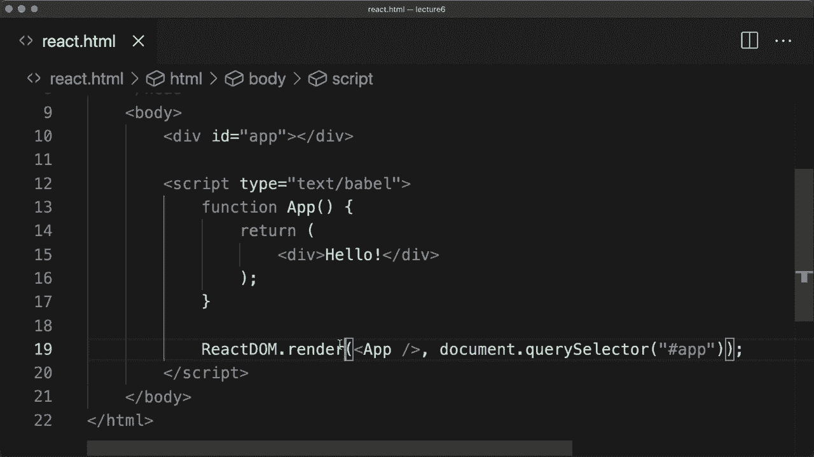

render that component inside，of the html page itself，so now if we were to open a browser and。

see what this page actually looks like，i'll make the text a little bit bigger。

you see that we actually do see，the word hello and if i make a change to。

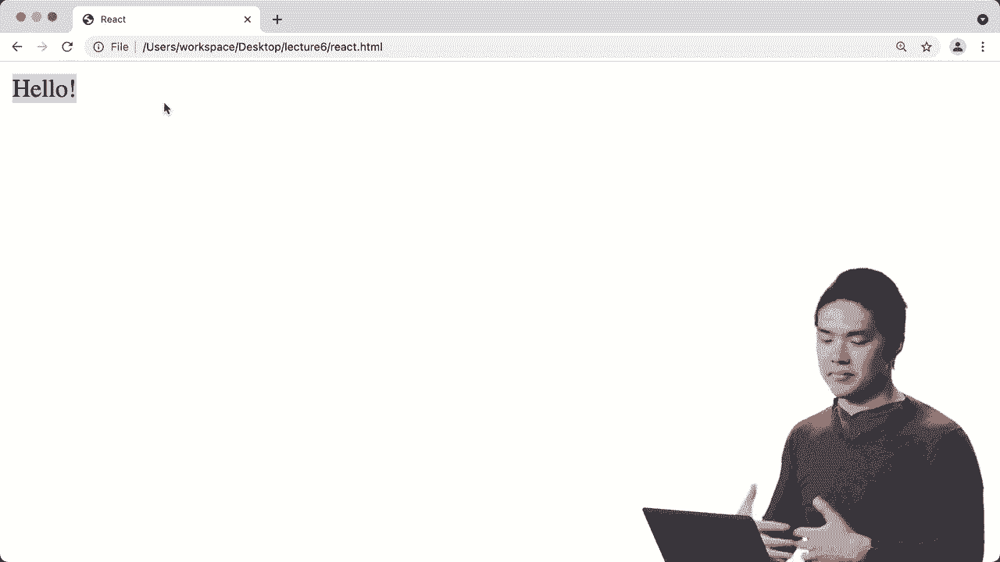

the component，and refresh the page it will change the，page as well。

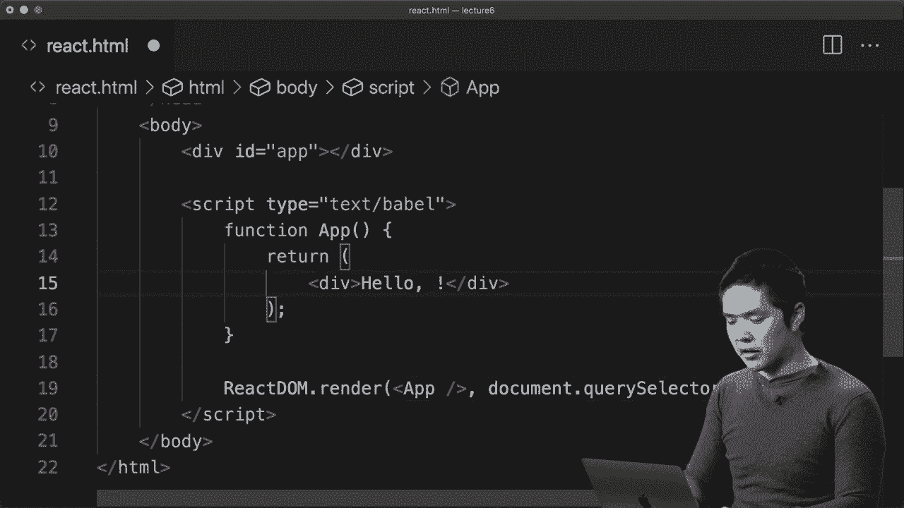

so if the component instead displayed，hello world，well then i refresh the page and the。

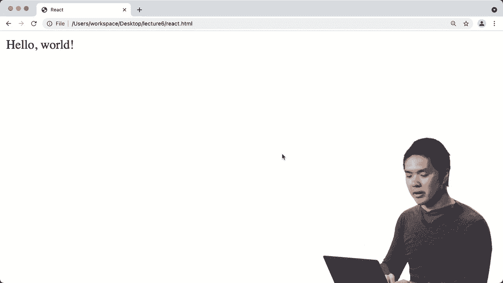

page now also，says hello world and because this is，javascript，i can add javascript code to the。

function just as i could with any，function in javascript，imagine for example that i had some。

variables like，let's create a variable x which is equal，to 1 and a variable y which is equal to，2。

inside of this div rather than just，render some text i can use curly braces。

to say plug in the value of some，javascript expression，i could plug in the value of x plus y。

for example and now by including x plus，y in these curly braces。

javascript is going to evaluate what is。

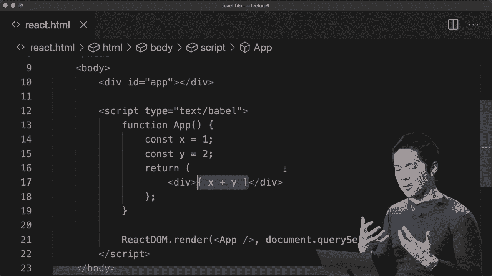

x plus y and display that，inside of the div instead and so now。

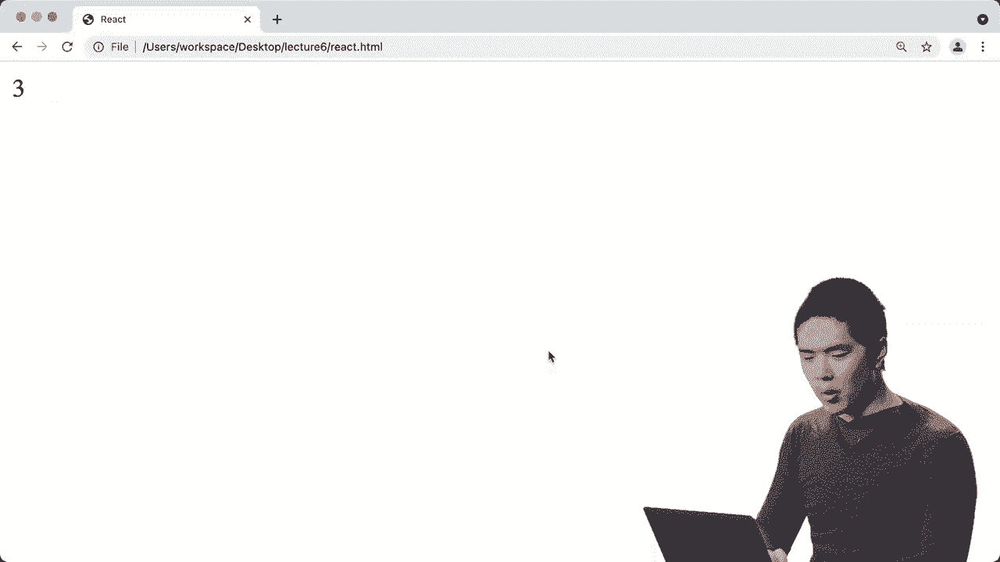

when i refresh the page，you see that the page just says three，for example。

and so that's the basics of react we，create these components，and then render those components all。

using the power of javascript，but where react starts to get more。

powerful is when we can reuse components，the whole idea of a component is it。

represents some part of the user，interface，and i could reuse that same component。

across multiple parts，of the interface as well imagine for，example that inside of my app component。

i was going to render a div that had，three headings each of which said。

hello so there's one heading there's，another one，and we'll add a third one there as well。

so i have a div with three headings，inside of it，and we can see what that looks like each。

one of them says hello，but there's some repetition here i'm，having to use this h1 tag three times。

all to create exactly the same ui，element on the page，this is a case where i can create a。

separate component and then just reuse，that component，rather than have to repeat myself。

multiple times so how could i do that，well remember that in javascript we can，write a function。

to represent a react component so i'll，add another function here，and i'll call that function hello。

because it's going to represent this，hello component，and this hello function is also going to。

return something，and what it's going to return is a，heading in h1，that just says hello。

and so now inside of my app component，rather than render three separate h1s。

i can simplify this a little bit to just，say，hello here i'm saying go ahead and。

render a hello component here，we'll render a second one and a third，one after that。

each time i render a hello component，it's going to display。

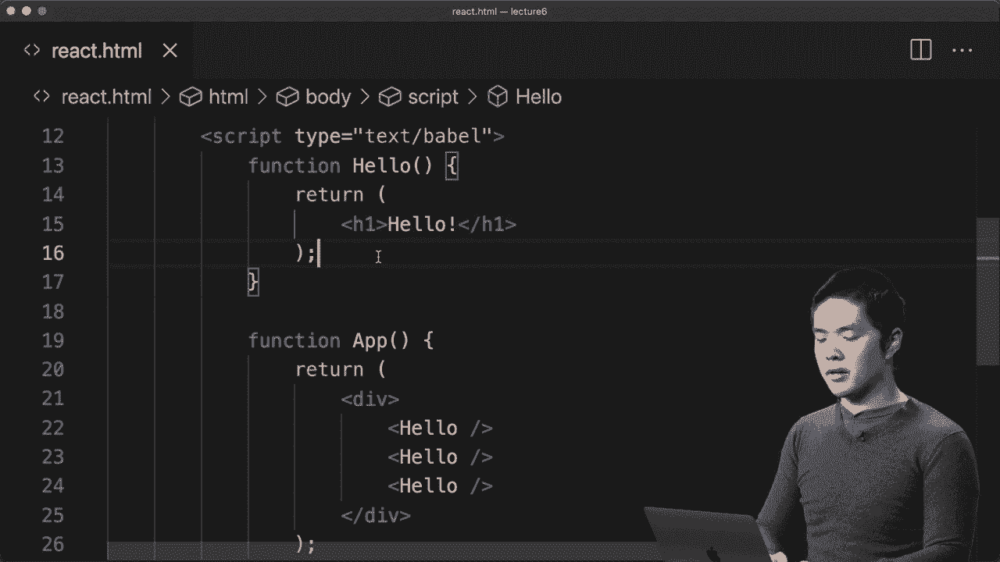

as this heading that just says hello，so i refresh the page and nothing。

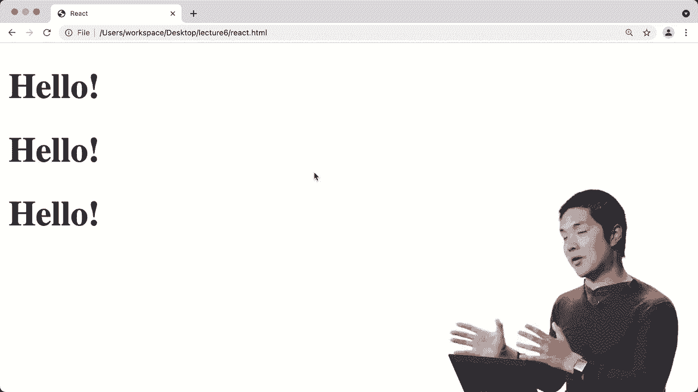

changes i still see three headings each，of which says hello，because inside of my app component i'm。

rendering this hello component three，times and，each time it's going to display this h1。

but where components start to get more，powerful is when they're not always，time。

but when we can parameterize those，components with properties。

or as react simplifies them props short，for properties，so what would that mean we see that html。

elements can take attributes，likewise react components can take。

properties where maybe i don't just want，to say hello，but i want to say hello to someone hello。

to harry or to ron or hermione for，example，so i could say hello name equals harry。

using syntax much like an html，attribute then here say hello name，equals ron。

and then finally hello name equals，hermione，and so now my hello component is，accepting this prop。

this property called name which is，different for，all three of these components。

and so inside this hello function now i，would like the hello function to take。

advantage of these properties of these，props，and so i'm going to add an argument to。

the hello function that argument is，conventionally just called props。

and now instead of just saying hello i'm，going to say hello comma，and then remember to plug in a。

javascript value i use curly braces，and inside of those curly braces i can，say props。

dot and then whatever the name of the，property is in this case the name of the，property is just。

name so i can say props dot name，to say whatever the name prop is go，ahead and plug that in。

right here inside of the hello component，so the hello component is going to say，hello comma。

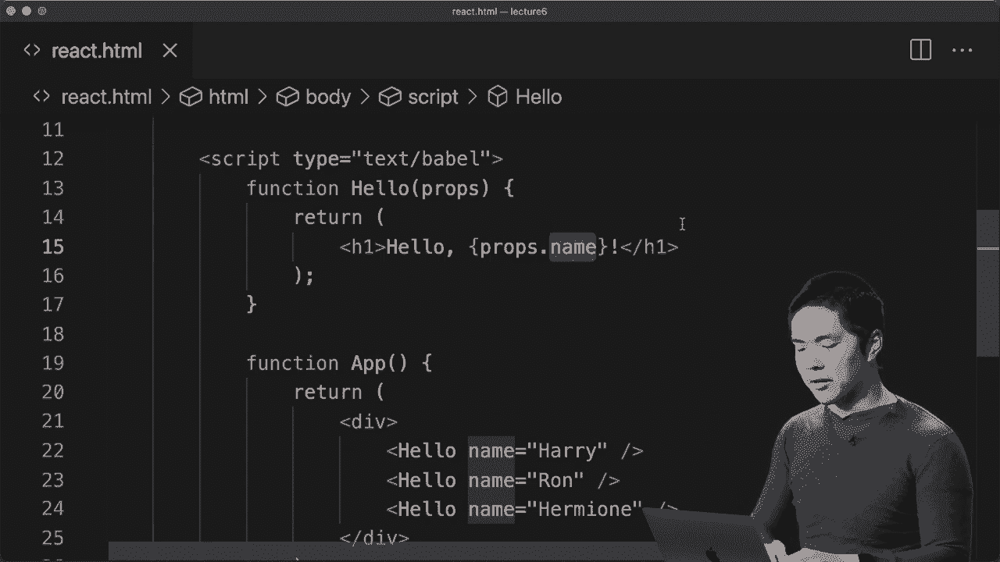

and then someone's name so i can save，that，refresh the page and now i see hello。

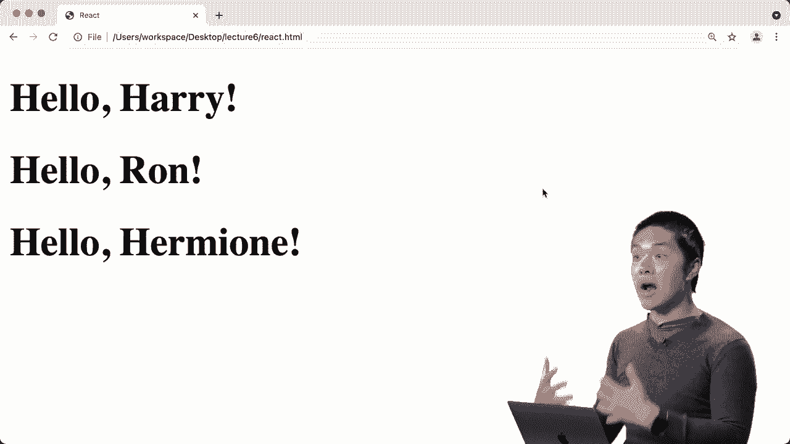

harry hello ron，and hello hermione three different，components each of which is still just。

this hello component，but we're rendering it with different，props one time with the name of harry。

one time with the name of ron and one，time with the name，hermione and so this is where components。

can start to get a little bit different，by passing in different props into those，components。

we can decide how that component is，ultimately going to render。

but let's add to this a little bit and，start to add state，into our react components as well and。

state is going to mean，any kind of data that we want to store，inside of the component itself。

and for this let's try to recreate the，counter application，that we created when we first introduced。

javascript where we were really just，count，and encounter it up from 0 1 2 3 4 etc。

so to do this let's create a new file，i'll create a new file and just call it，counter。html。

and we can start just by copying the，contents of react。html，into our counter。html file we're still。

going to use the same script tags and，we can still have an app component。

but what's going to be inside this app，different，i'll change the title of the page to to，be counter。

instead of react so what goes inside of，the app component，well if we're going to do this counting。

we need a div that's going to display，to，something like zero to start with and。

we're going to need a button this button，is just going to be，count which will be the label for that。

button。

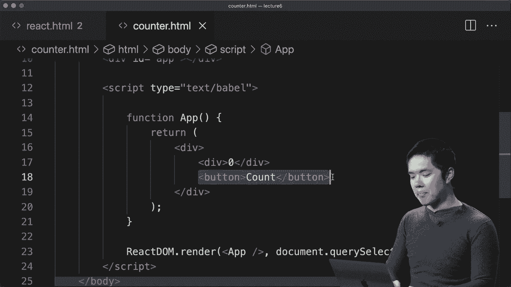

so a div that just says zero and a，button that says count，and now if i open up counter。html。

i'll make it a little bigger you can see，that i have this number zero here。

and a button that says count of course，right now clicking on the button doesn't，do anything。

because i haven't written any javascript，code to say what should happen。

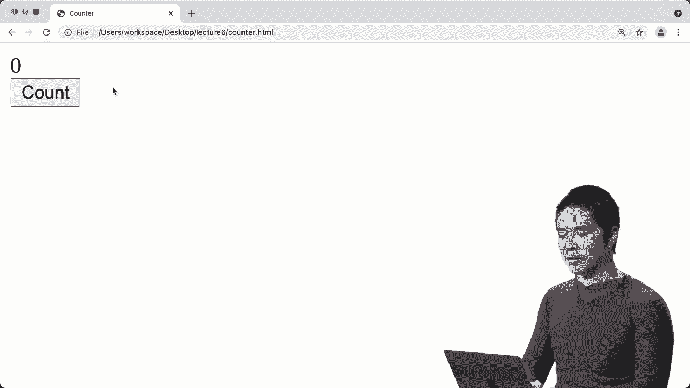

when this button is actually clicked on，but before we get there。

let's modify this program a little bit，right now i've written the number zero。

directly into the div itself，but it's not always going to be zero，eventually as i start counting by。

pressing that count button，that number is going to change so what。

i'm going to do now is factor this zero，out，into what's known as state inside of my，react component。

and here one way to create state in my，react component，is to use a special function inside of，react。

called use state this is one example of，a react hook，that allows me to add some additional。

functionality into my react component，and the argument to react。ustate is。

going to be the initial value，of that state i'm going to start，counting and i want to start counting。

from the number zero，so i'm going to include the number zero，as the argument。

to this use state function so we're，going to start counting at zero。

and what this u state function returns，is really an array of two things。

it's going to be a variable that i can，give a name to i'll call it count。

and also a function that i'm going to，call setcount，and that function is going to allow me。

to set the value，for the state if ever i need to change，the state at some point in the future。

so this u-state function accepts zero，the initial state as its argument。

and then i get two things back i get the，state variable itself，called count and i get a function for。

changing that state when i need to，so now instead of rendering a zero。

inside of the div just by writing the，number zero，i'm going to instead in curly braces。

go ahead and render whatever the value，zero，but eventually that number might change。

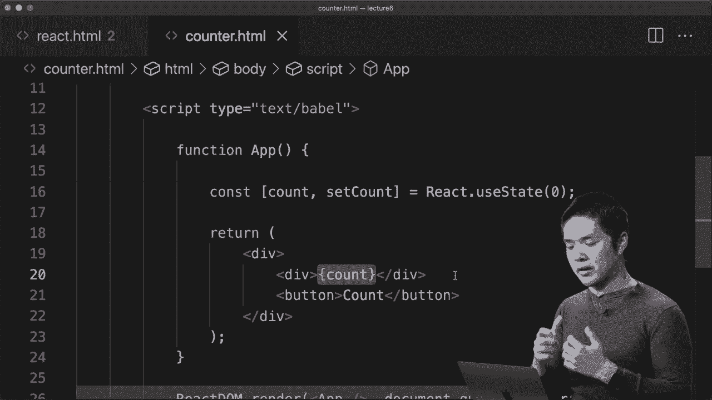

and i want my ui to reflect the changes，in the underlying state so right now if，i refresh the page。

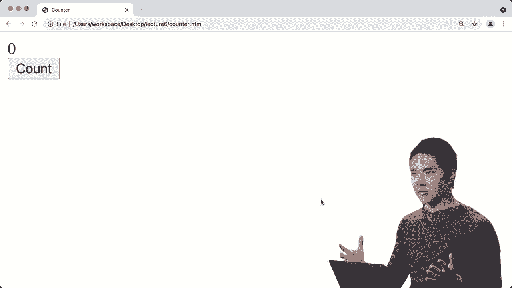

it still says zero because the initial，state was set to 0，but i could change that if initially。

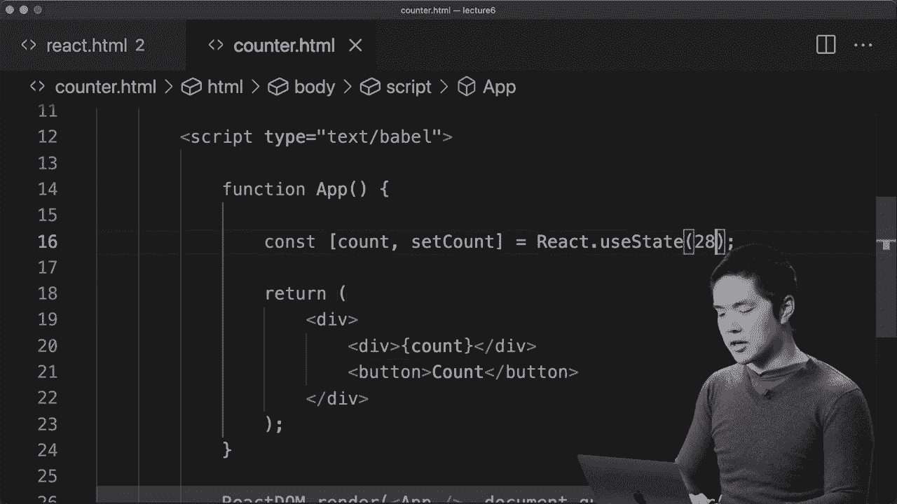

that initial state was some other value，i could refresh the page and see a。

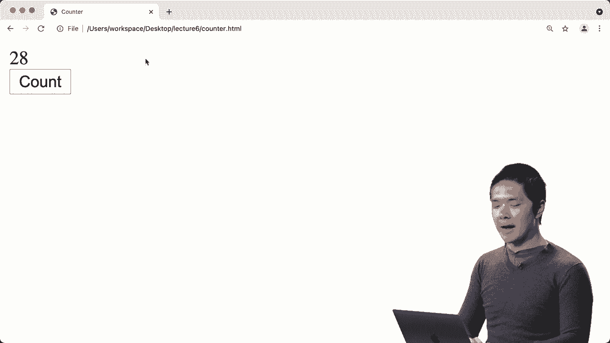

different value appear for the count，instead，whatever the value of this count。

variable is in the state，that's going to be what the user is，going to see。

when they're looking at my user，interface and when they see my component。

so now let's make this button actually，do something because right now the，number is never changing。

to do that i can add an on click handler，and notice one difference between。

onclick and react and onclick as we，traditionally used it in javascript。

i'm using this capital c and that's just，a common react convention。

when we're defining event handlers and，here i'm going to say on click and then，in curly braces。

the name of a function a function that i，would like to run，when this button is clicked and i can。

call that function whatever i'd like，i'll call it update count for example。

and now what i need to do is define a，function called，update count and i'm going to define。

that function，inside of this react component inside of，my app function。

it turns out in javascript you can have，functions that are defined。

inside of other functions so i'll define，this function，called update count and what do i want。

the update count function to do，well what i'd like to do is just，increase count by one and you might。

think that i could do that just by，saying count，equals count plus one but it turns out。

you can't quite do that，in react in react whenever whenever i'm，using this use state。

if i want to change the state i have to，use this function，that use state provides to me for。

whenever i want to set，the new value of the state so rather，than count equals count plus one。

i have to use this set count function，and the argument to set count，count。

is this function that is going to change，the underlying state。

inside of my component and the argument，is what should the new state be。

and in this case it's just going to be，count plus one，one more than whatever the count was。

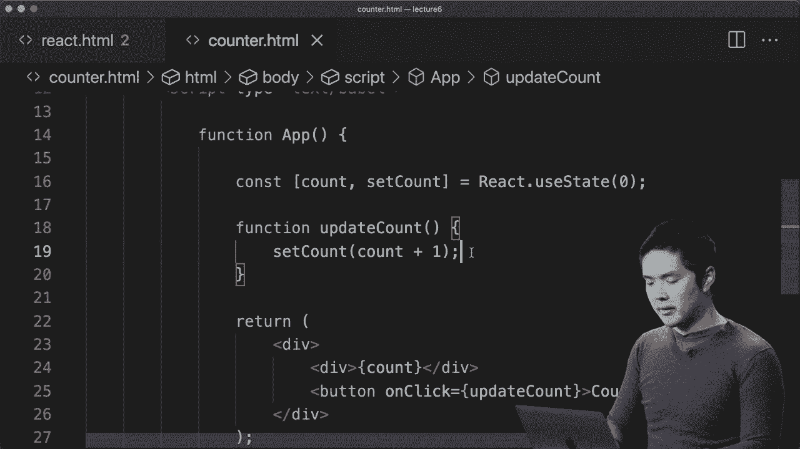

before，so i can save that and i'll go ahead and，refresh the page。

it starts at a zero but every time i，click on this count button。

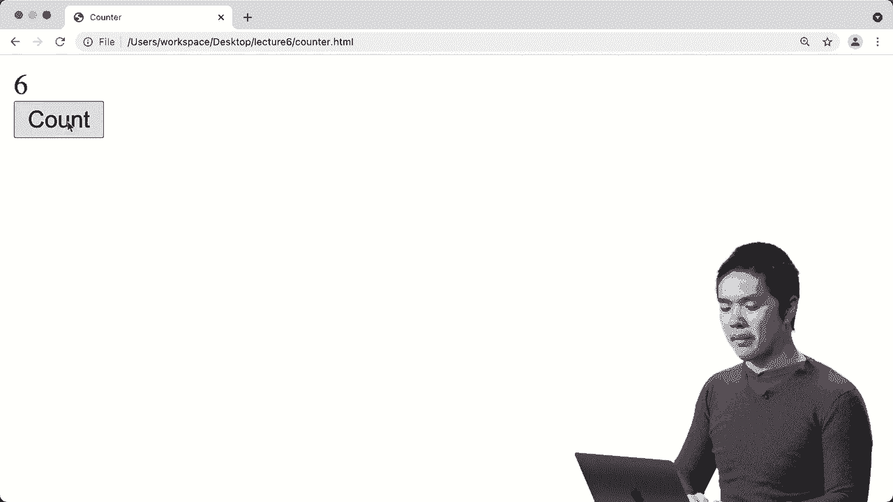

you'll notice the count increases by one，and again i have no code that's saying，go into the div and。

change whatever is inside of the div all，i have inside of this div。

is this reference to this state variable，count and whenever the state changes。

javascript and in turn react knows that，what react needs to do。

is to recreate this component re-render，the component，by displaying the new value of this。

state variable，and then when the button is clicked on，we're able to run this function to。

change the value，of that underlying state so by taking，state，we can start to represent information。

inside of our components，and then define what our component is，going to display as a。

just by representing html in terms of，that underlying state deciding。

how we should use that state in order to，render an interface。

that the user is ultimately going to see，so let's now try and put these pieces。

together and create a web application，that uses these abilities of react to，define state。

and to manipulate that state and in turn，update a user interface。

based on changes that are happening to，that underlying state，and we'll create an application that。

will just display some simple，mathematical questions to the user。

and quiz the user on some basic addition，facts for example，so let's create that application i'll。

create a new file，and call it addition。html，and inside of edition。html i'll start。

again just by copying，the contents of this counter。html file，because the。

framework the structure of this page，will be similar，but i'll go ahead and clear out what's。

inside of my，app component at least for now and so，to，render well let's go ahead and render a，div。

and if i want to create an application，that's going to ask the user some，mathematical questions。

and then prompt the user to type in an，answer there are at least。

two parts of this user interface that，i'm going to need i'm going to need a，place to display。

the addition fact answer like what is，one plus two for example。

and then i'll need an input field where，the user can type in their response to，that question。

and then see if they got the question，right or wrong，so inside the div i'll start by creating。

a div that displays the question itself。

something like one plus two and then，beneath that，i'll just add an input field eventually。

we'll add more to this user interface，but for now，all we really need is a div that。

displays the mathematical question，and an input for the user to type in，their response。

so now if i go ahead and go to，addition。html，here's what i see i'll make it a little。

bit bigger i see，oneplus 2 and then an input field where，the user could start to type in their。

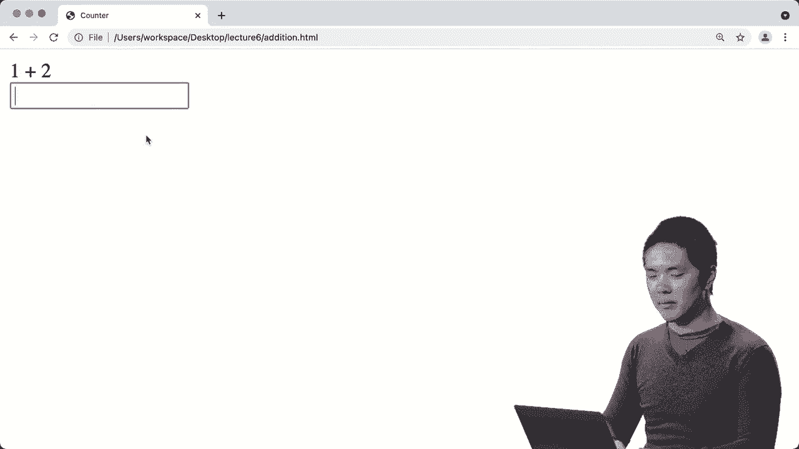

response，but just as we did before i don't want，to literally write the numbers 1。

and 2 into what i'm returning instead i，want these 1 and 2，to be based on some underlying state。

inside of my application，the application is going to maintain，state about what two numbers to add。

together，and then it's going to display a user，interface based on that state。

so what could i do here well one thing i，could do，is again use react dot use state。

start this number off as one and maybe，call this，num1 and then a function to set number，one。

and then i could do it again let's，create num2 and set num2，to be react。ustate2 and i could have two。

different pieces of state num1 and num2，each of which has a different function，set num1 and set num2。

that are each representing the two，different numbers that i would like to，add together。

but already this is starting to get，messy and over time as i add。

more different pieces of state to the，moment，the state might start to get more and。

more complex with more and more，different functions and variables，so it's often helpful and a common。

practice in react to combine multiple，pieces of state，just into one javascript object that's。

maintaining，all of the different pieces of state for，this particular。

component and to do that i'll again use，react。ustate，but instead of setting the state。

initially to be a number like one，or two it's instead going to be a，javascript object。

that has keys and values where i could，say let num1，be the number one and let num2。

be the number two much like a dictionary，in python for example。

where i have multiple different values，num1 and num2，all together inside of the same object。

and i can call that state，and have a variable and have a function，called setstate。

that is going to update the value of，that state and so rather than have to，have。

all of these different variables i can，simplify a little bit to just state。

and a function to set the state and the，state now has these two different pieces。

number one and number two，and so now instead of rendering，literally the number one。

using curly braces i can say state dot，num1，and instead of rendering literally the。

number two i can say state，dot num2 drawing upon that state to。

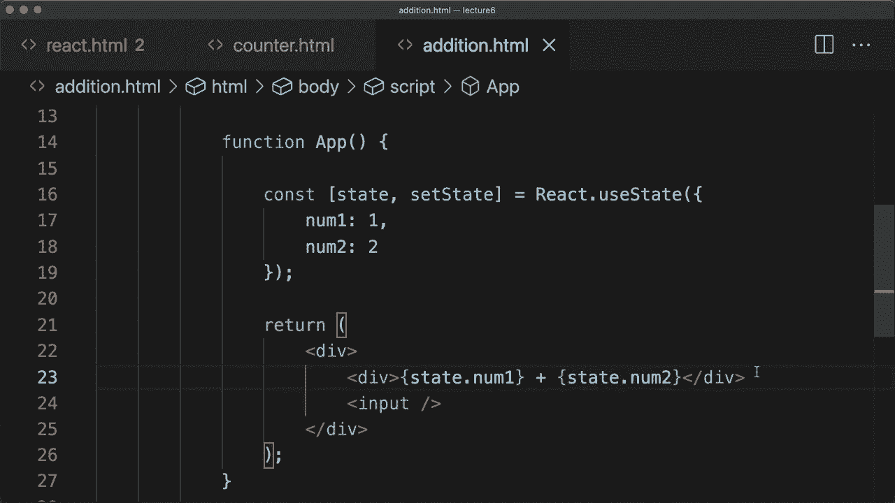

decide what it is going to appear，inside of the user interface and so。

right now the page appears no different。

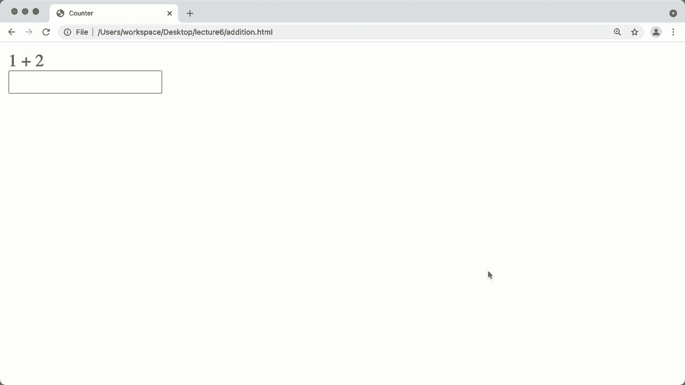

but if i were to change those initial，values of the state maybe make it two。

and four for example and then refresh，the page，well now it displays as two plus four。

and so that's helpful we now have a user，interface where the numbers are based on，the state。

but now what i'd like to do is add the，ability to keep track of what the user，typed in。

so we can tell if the user correctly，typed in the answer，to this mathematical problem and how。

would i do that，well the state represents any，of，inside of this component and so in。

addition to storing the two numbers，inside of the state，i likely also need to keep track of a。

third piece of information，which is the response what did the user，type in。

into this text field and so i'll add a，third part of the state called response。

that initially will just be the empty，string will just be nothing。

and then this input field i'm going to，give it a value，and the value is going to be state dot。

response，whatever the user typed in as the，response that's stored inside of the，state。

and that is going to be the value of，what shows up，in the input field and so that way。

whatever's in the input field will have。

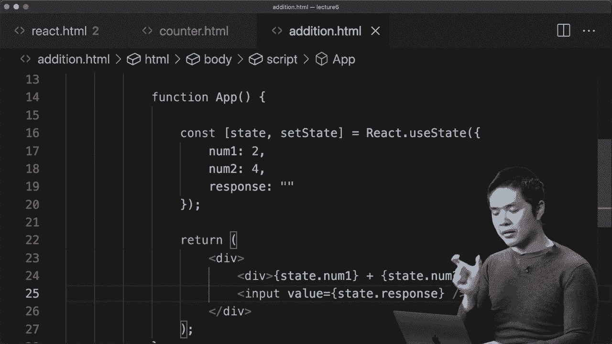

access to it inside of this，state。response variable，but there is a problem and here's the。

problem i'll try refreshing the page，i'll go into this text field and let's。

say i know the answer i know 2 plus 4 is，equal to 6。i'm now going to press 6 on my keyboard。

but as i press 6 on the keyboard，nothing's happening no 6 is appearing。

inside of the text field even though i，am pressing the key，on the keyboard so why is that why is。

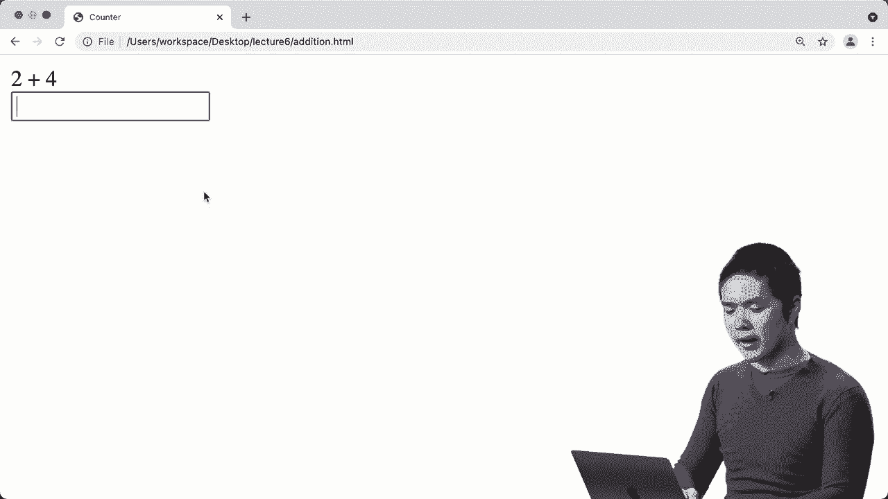

the text field not updating，well the reason is the value of the，input field whatever appears in the。

input field，is this value state。response and，string，and never changing what state。response。

is equal to，and so i need to change this a little，bit i need to add。

as an attribute to this input field on，change meaning when the input field。

changes i need to do something，and i'll call a function that i can call，update response。

but again i could call that update，function whatever i'd like it's just the，run。

whenever something changes in the input，field so let me now define。

that update response function i'll，define a function，called update response and because it's。

an event handler，it can accept an argument which is the，event itself the fact that something has。

changed，inside of the input field and when i，have access to this event it turns out。

that if i want to figure out what it is，the user has typed into the input field。

i can get at that with，event。target。value，and i'd only know that by looking at it。

in the documentation but what i'd like，is for event。target。value to be the new，value。

for this response and so what i'd like，to do，is do something like this set state and。

what should the new value of the state，be，well i would like for response to no。

longer be the empty string，but to now be event event。target。value。

and that is going to be the new value，for response，but i'm not quite done yet because state。

doesn't just have response as one of the，parts of the state，the state also has num1 and num2。

and those two pieces aren't really，changing so i could say all right num1，is just going to be。

whatever state。num1 was that's not，changing and num2 is going to be，whatever state。

num2 was that's not，changing，the only thing that's changing is the，response。

but this is starting to get a little bit，verbose and especially if i start adding，state。

it's going to become difficult to manage，if i constantly have to repeat myself。

for all of the parts of the state that，do，is just specify the parts of the state，that will change。

and ignore everything else and so one，shorthand way to do that。

in javascript is to use what's known as，the spread operator，and it looks like this dot dot dot and。

then state，and what this is saying is just use the，existing values of the state for。

everything else like num1 and num2，the only thing to override is the new，value。

for the response and so this syntax here，is my way of saying，i would like to update the state。

everything should stay the same，except for response which is now going，to be，event。target。

value in other words。

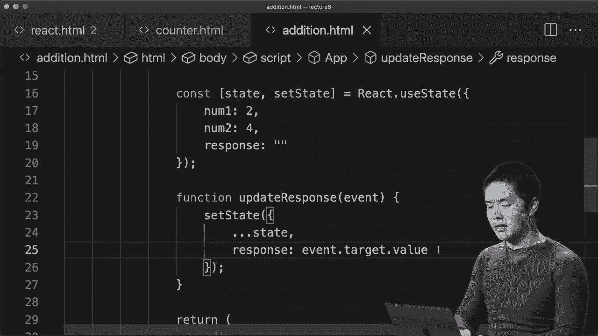

whatever it is the user typed in，into that input field and so i'll go，ahead and refresh the page。

and now if i type a number like six you，actually see that number，appear in the input field so that's。

great we've now displayed a question，state，and the user can type in a response。

where that response is，also stored in the state now what i'd。

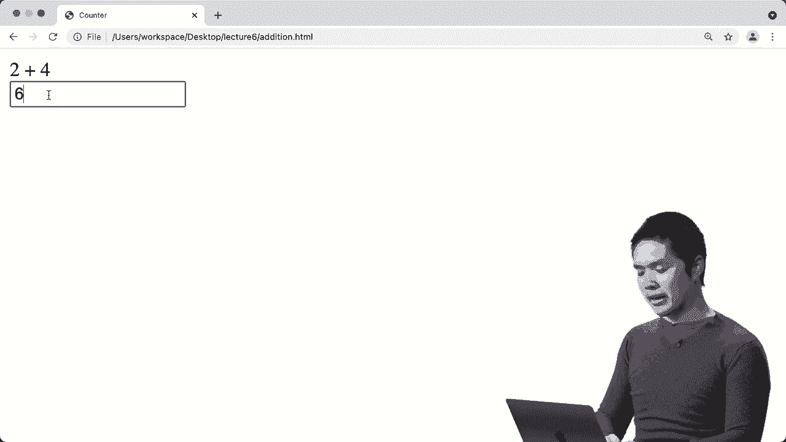

like is when the user presses the enter，key on their keyboard，we check did they get the answer right。

or did they get the answer，wrong and so how would i do that well，the first thing i need to do。

is in this input field somehow detect，when a key is pressed，when a key is pressed what i'd like to。

key，and if it was the enter key then let's，go ahead and check to see。

what the actual sum of the two numbers，is and see if the user。

got that right or wrong so let's add an，event handler，on key press is going to be equal to，something。

again i can name this function whatever，i'd like i'll call it，input key press but again i could name。

that anything，and now let's define that input keypress，function，so up above i'm going to define this。

function called，input keypress again it takes that event，to happen。

any time a key is pressed regardless of，whether it's a letter or a number or the，enter key。

and so i want to check to make sure that，the key is actually the enter key that's。

the only time that i want to now check，to see，if they got the question right or wrong。

so i'll add here a condition，it's just javascript so i can say if，event dot key。

is equal to enter well then let's go，ahead and check，and otherwise we don't have to do。

anything i don't need an else case here，because nothing should happen。

unless it's the enter key that was，actually pressed，and so now how do i check to see if the。

user got the answer right or wrong，well inside of state。num1 is the first，number，and inside of state。

num2 is the second，number，so i could have a condition that checked，if state。num1 plus state。num2。

is equal to state。response which is what，the user typed in，into the input field but that doesn't。

quite work，because state。response that's a string，the user doesn't necessarily have to。

type in numbers it's possible，the user is going to type in some，letters instead for example or other。

characters instead，and so what i'm going to do first is，convert the response。

into an integer if we're able to do so，so i'm going to define a variable called，answer。

using the javascript function parseint，that takes a string，and tries to convert it into an integer。

so we're going to parse the end，state dot response，and now we can check if number one plus。

number two，is equal to the answer well then this，means，the user got the question right。

and else if the sum is not equal to the，answer that means the user。

got the question wrong and so now what i，could do is handle those two different。

scenarios in one case the user got the，question right，and we should do something and in，wrong。

and we should do something else and，we're making that decision，by looking at the state of the。

application by looking at what two，numbers we're supposed to be adding。

and looking at what the user typed in as，their response，so what should we do when the user gets。

a question right or gets a question，wrong，well maybe this game is going to keep。

score by maintaining a number for how，many questions，the user has gotten right and every time。

the user gets a question right we could，increase that score by one。

and any time the user gets a question，wrong we could decrease that score。

by one for example so how would we do，that，well the score is some piece of state。

inside of the application，and so we're going to need to add to the。

state right now in the state we're，storing a number one，a number two and a response i'll add to。

that a score，where the score is going to start out as，just zero。

and we can render that score on the page，if i scroll down，to where we're returning the div to。

render let's add，another day of it that says the score is，and then using curly braces plug in。

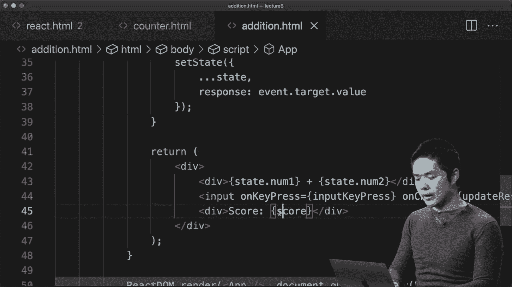

whatever the value of，state dot score is whatever the score is，let's figure that out from the state。

and let's display that in the user，interface，so now this user interface shows not，only a question。

and an input field but also a score and。

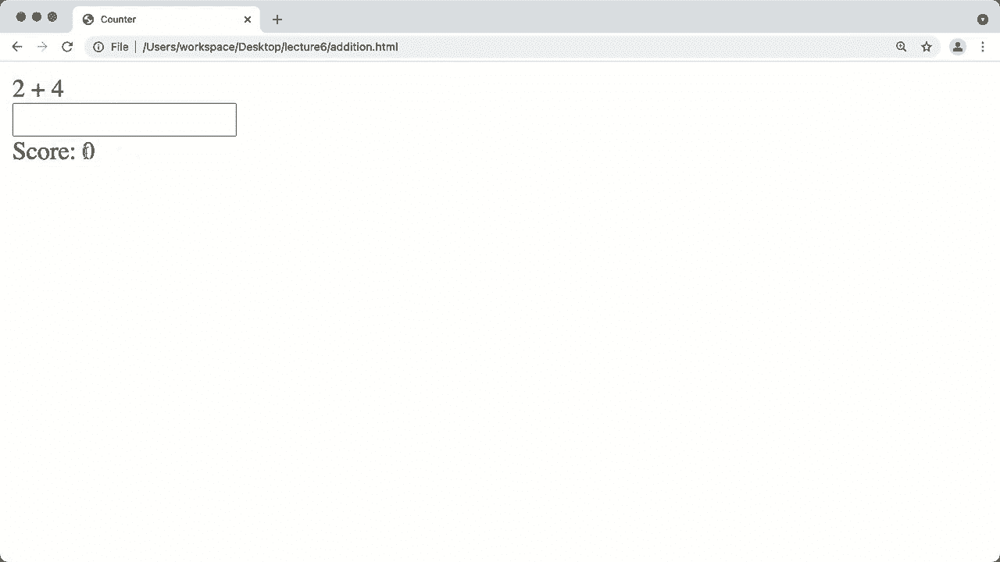

the score starts out，so let's now go back to this function，when a key is pressed if it's the enter。

key let's check to see if they got the，answer right or wrong，we check did the user actually get the。

question right，if so what should we do well we should，increase the score。

and how do we do that we do that by，calling the set state function。

all of the state is going to be the same，so using that dot dot state spread，operator。

the only thing that's different is the，score is going to be state dot score。

plus one so we're updating the state，to increase the score by one and if the，user gets the question。

wrong let's set the state to be，dot dot state and then the score is，going to be state。

dot score minus one，so if the user gets the question right。

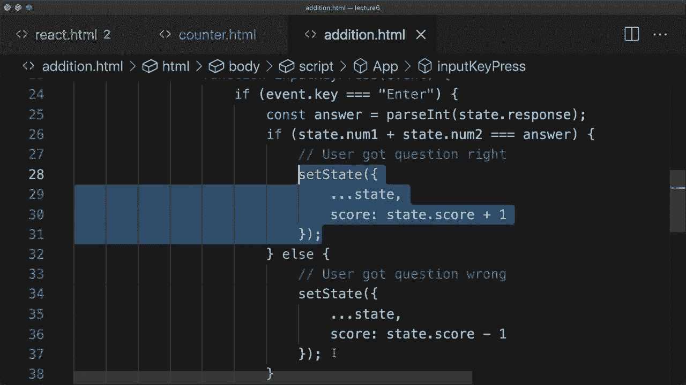

we increase the score by one，otherwise we decrease the score by one。

and let's test that to see what it，actually looks like when we try this。

in the user interface i'll refresh the，page，two plus four if i type in the correct，answer six。

press return the score increases by one，if i typed in the wrong answer and say，eight press return。

the score decreases by one so this，appears to work depending on whether i，get the question right。

or wrong the score is able to update，increasing or decreasing，based on the result of that condition。

now this game is pretty easy to get a，high score on right now because i can。

just keep pressing return，over and over and over and the，question's never changing my response is。

already there，and so the score keeps going up and up，and up so let's make the game a little。

bit more interesting，every time the user gets a question，right let's display。

a new question for them to answer and，how would we do that，well the question that's displayed to。

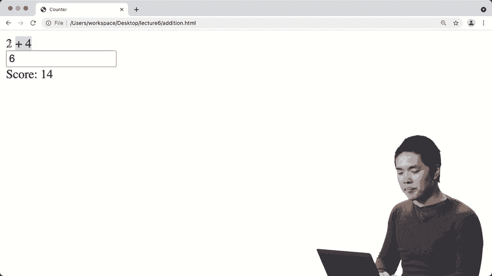

the user is based on two，underlying pieces of the state of the，component，it's based on state。

num1 and it's based，on state。num2，so if i want to change the question all，i have to do。

is when the user gets the question right，and i'm updating the state。

instead of only updating the score let's，also update num1，and num2 and i could set these to be。

specific values maybe like 5 and 10 for，example，but let's make it more interesting and。

display a random number every time we'll，generate a random number，and so the user will be adding two。

random numbers together every time，they get a new question right how do we，generate a random number。

well math。random is a javascript，function that generates a random number，between 0 and 1。

we can multiply it by 10 so now we're，getting a number between 0 and 10。

but we don't want any decimals to appear，in the number so i'll go ahead and take。

the ceiling of the number，math。seal to say if the number was like，5。8。

we'll just go ahead and round that up to，six for example and we'll do the same，thing for number two。

we'll take the ceiling of math。random，times 10。 so every time the user gets a，question right。

we'll update num1 and num2 to be new。

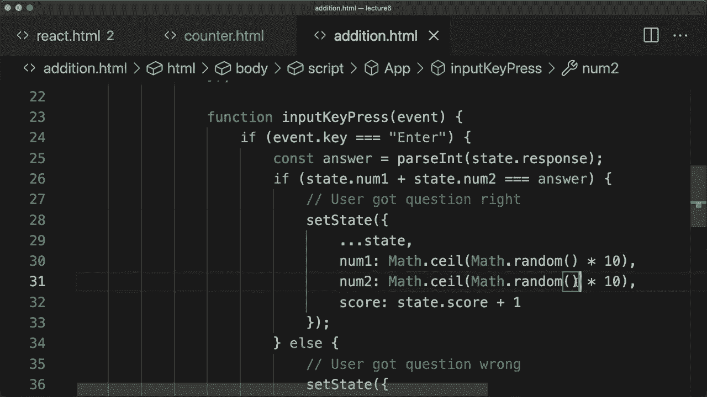

random numbers generated just like this，and so let's go back and try it again we，see two plus four。

i type in the correct answer six and the，question changes，eight plus five i type in the correct。

answer press return my score，increases and the question changes again。

this time if i get the answer wrong i，type in 10 for example。

watch my score decrease it went from two，down to one，but the question didn't change now i get。

another opportunity to try to answer，this question，and when i answer it correctly the score。

increases again，from one to two so this game is starting，my，score it's displaying different。

questions there is at least one，user interface quirk right now and that。

is the fact that at the moment，when i get a question right and press。

return i type in six and press return，the six still stays there ideally i get。

a new question i'd like to clear out the，response，so the user can just type in whatever。

the new answer is，rather than have to delete whatever they，typed in before and then type in a new。

number，so how could we do that reset whatever，is inside of the input field。

well what's typed into the input field，is stored inside of the state。

of my component it's stored inside of，state dot response。

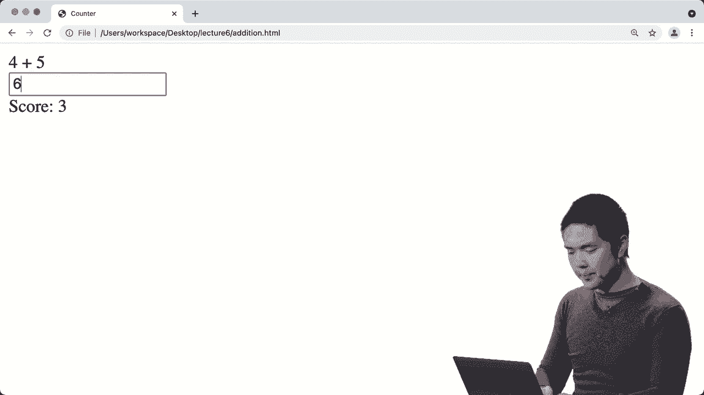

and so if i wanted to change that all i，would have to do，is say let's change the response to be。

the empty string when the user gets a，question right we're going to update，these two numbers。

increase the score and also clear out，the response，so that it's just the empty string and i。

can do the same thing，if the user gets a question wrong，decrease the score by one。

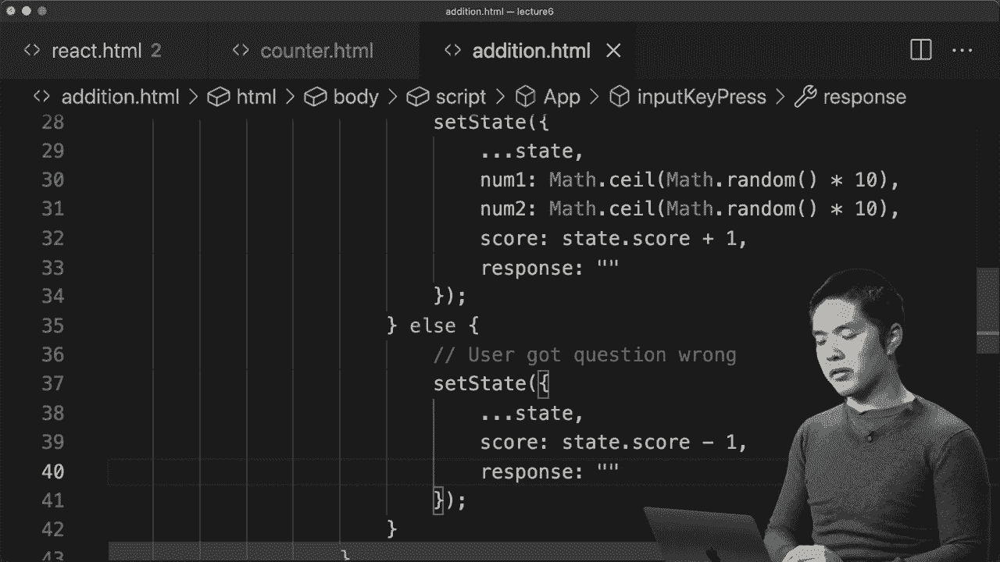

but also clear out that response back to，the empty string，so that there's nothing there and so now。

we get a question i type in an answer，press return，and the input field clears out i get a。

new question，and the score increases by one four，separate pieces of state。

all changing at the same time and that，gets reflected in the user interface。

that i'm now able to see so i type in，another value，and the score increases and everything，updates。

again all right so that's definitely，progress，one other user interface quirk that i。

noticed here is that the input field，by default isn't automatically selected。

where i would have to go in and click。

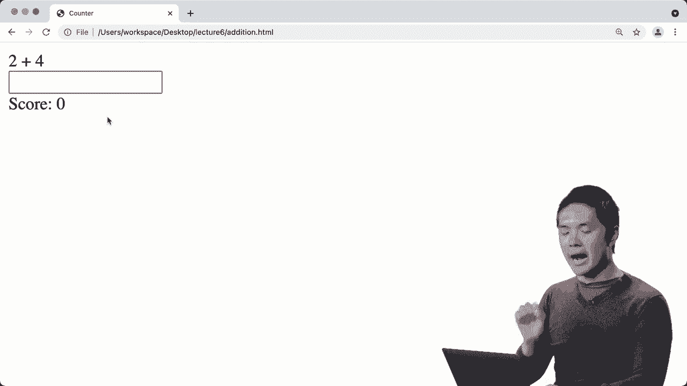

on the input field in order to highlight，it so that i can start typing in my，response，down，auto。

focus attribute and just set that to be，true，so that the input field automatically。

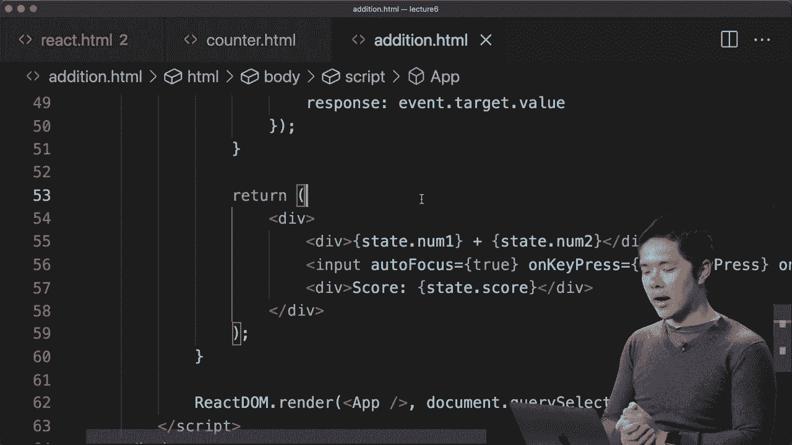

focuses when i，load the page for the first time so now，i refresh the page。

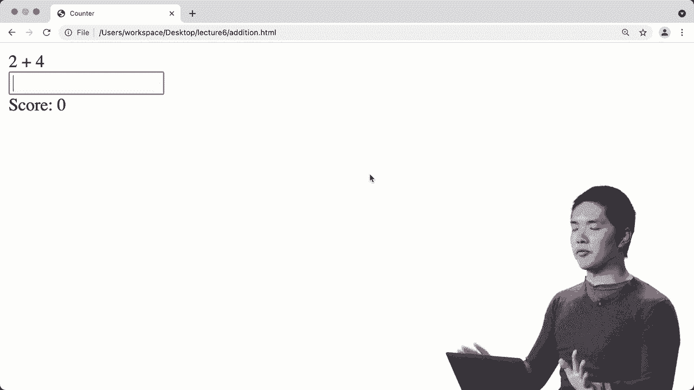

the input field is already highlighted，and immediately i can，start to try to play this game so now。

that we have the basic functionality of，this app working，let's try and improve the css so that。

the game looks a little bit nicer，i'll scroll up to the top of the page，and add a style tag。

to the head section of my html page and，i'd like for this entire app。

to be centered so i'll say text align is，going to be center，be。

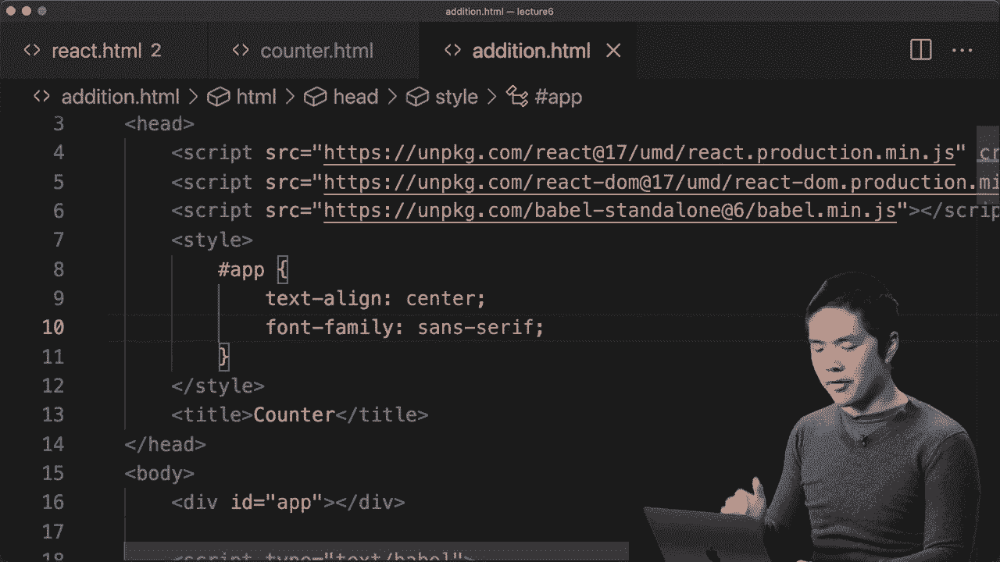

sans-serif because i prefer that font，for this particular game。

so i refresh the page and now everything，is centered and the font。

is different than what the default was，and what else would i like to have，changed。

well this problem two plus four maybe，i'd like for that to be bigger i'd like，the problem to be big。

and the score beneath that that can stay。

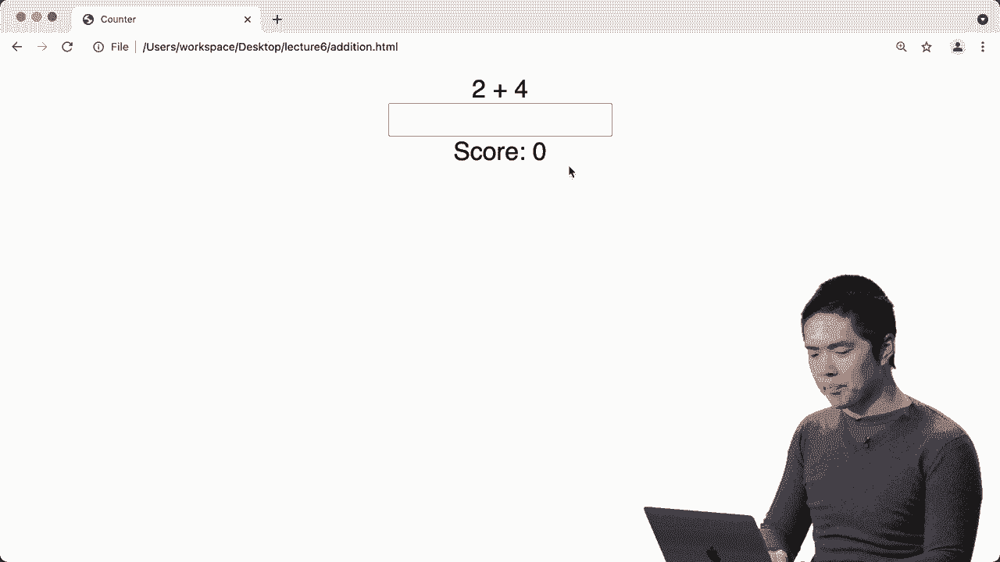

the same size that it is right now，so how would i do that well if i go back，to the html here。

i'll go ahead and give this div where，i'm displaying the problem number one，plus number two。

i'll give it an id of problem，and then if i scroll back up i'll say，for。

the element with an id of problem let's。

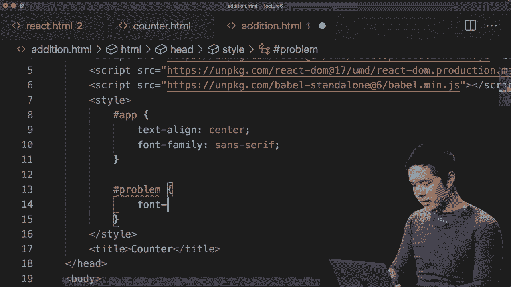

go ahead and set the font size to be，bigger，and so now i see a big math equation 2。

plus 4 for example，the input field and then the smaller，score beneath it。

so that's a nice ui enhancement a little，bit and now i can play the game get a，question right。

and the score increases i get a question，wrong and i get to try again。

but maybe i'd like to offer more of a，visual indication，that the user got a question wrong maybe。

anytime the user gets a question wrong，i'd like to change the color of this。

text instead of being black instead it，should be red when the user。

gets a question wrong and how could i go，about doing that。

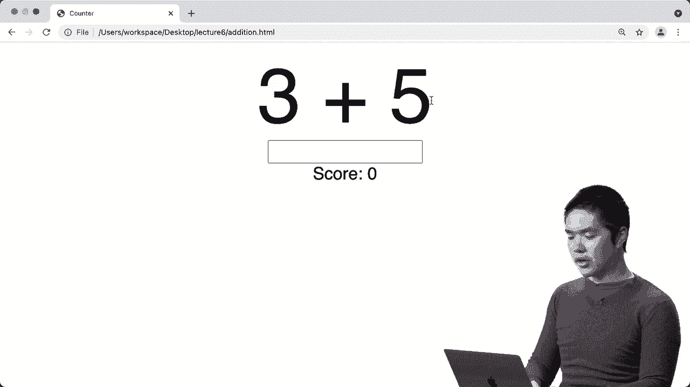

well we can change the color of，something just by using css，if we had like a class called incorrect。

for example if i scroll down here，and give this div a class name。

which is how you add a class in react of，incorrect then i could use this class，name to style。

it as red or not red so i could say，anything that has a class of incorrect。

let's go ahead and give that。

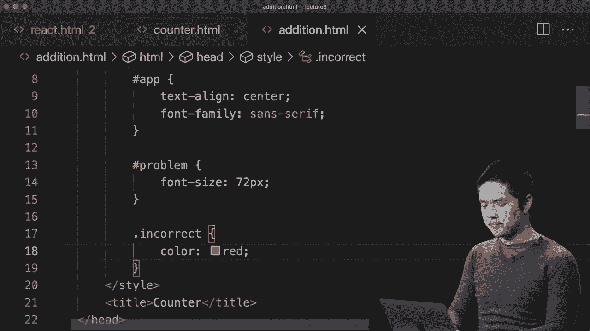

a color of red，and so now because i gave this problem a，class of incorrect。

and i said turn all incorrect text to be，read we now see this text appear。

as read but this again is not quite what，i want i don't want it to be read all of，the time。

i only want it to be read when the user，has just gotten a question wrong when。

they were just incorrect，in answering a mathematical question and，so how could i represent that。

information。

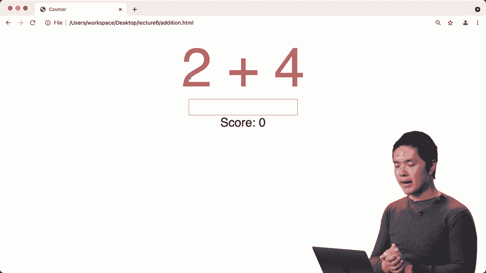

inside of my application well i'm going，to need some additional state。

state again is any information that i，need to keep track of，inside of my component and now it seems。

that in addition to the response and the，score and the numbers，i also want to keep track of did the。

user just answer a question incorrectly，or not，so i'll add another piece to the state。

i'll call it incorrect，and initially it will be false they，didn't just get something incorrect。

and now here if i scroll down to this，class name，rather than have it be incorrect all the，time。

let me add in curly braces an expression，i'll say if state dot incorrect is true。

using the ternary operator with a，question mark then，the class should be incorrect but。

otherwise it shouldn't have a class of，incorrect it'll just be the empty string。

and so this expression here allows me to，change the class of an html element。

based on the underlying state if，state。incorrect is true，then this div will have a class of。

incorrect and otherwise。

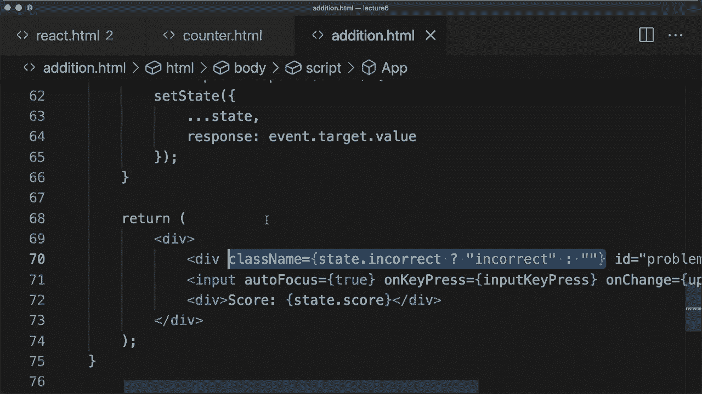

it won't and so now when i load the page，for the first time，the text appears as black and what i。

need to do，is when the user gets a question wrong i。

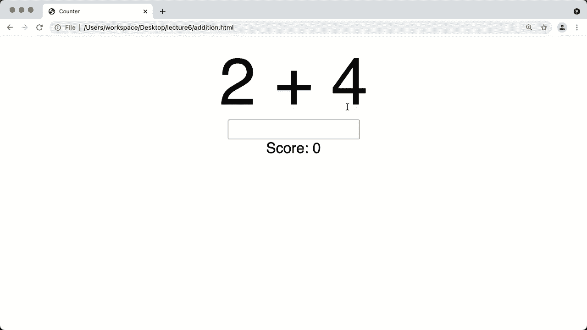

need to change the，state to indicate that they just got a，question wrong，how do i do that well here。

is the set state call when the user gets，a question wrong，and in that case i'll go ahead and set。

incorrect equal to true，and when the user gets a question right，we'll go ahead and set incorrect。

equal to false we're modifying this one，additional piece of state based on。

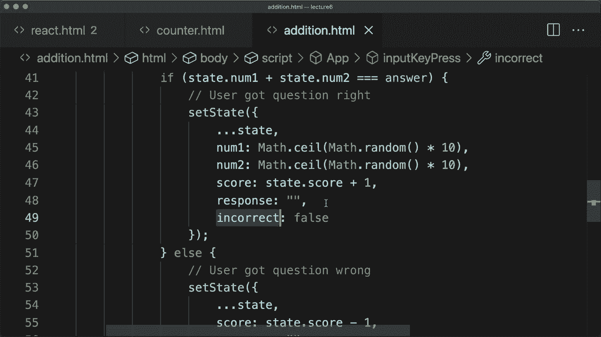

whether the user，got the question right or wrong so now，if i load the page answer a question。

correctly the score increases and i get，a new question，but if i answer a question incorrectly。

and press return，you'll notice the score decreases the，input field clears out。

and the text changes color because i，changed the value of that incorrect part。

of the underlying state，and based on that we were able to see，the text color。

change as well if i now get a question，correct press return，the text color changes back to black and。

the score，increases and let's now add one final，piece of state or one final change to。

the ui for this application，let's give me a way to win this game，maybe once i get to a score of 10。

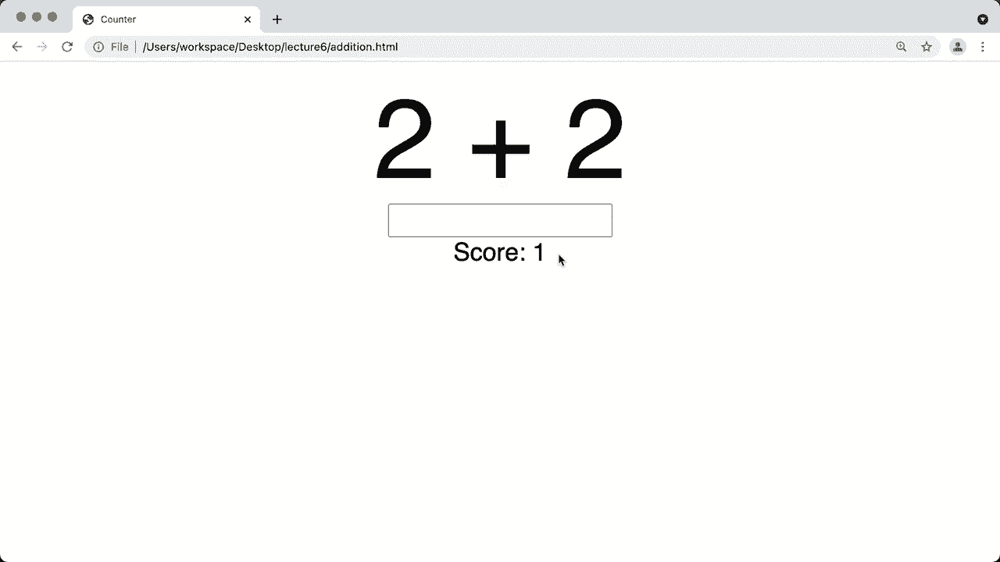

by answering 10 questions correctly then，we're going to win the game。

and how could i do that well remember，that each react component。

can just be a javascript function and，this function is just immediately，returning this div。

but it's a function so i can add，additional logic to it i can say，if state dot score。

is equal to 10 for example then rather，than render the old div，let's run return a new div。

something like u1 and so that i can，style it i'll give it an id，the id will be winner。

and if the id is winner，let's go ahead and make the font size 72，pixels。

and let's make the color green if i win，so i added some css just to style it。

but really the only new logic is further，down below，where i'm here saying check the state if。

the score is 10，well that means we win so instead of，returning the new problem。

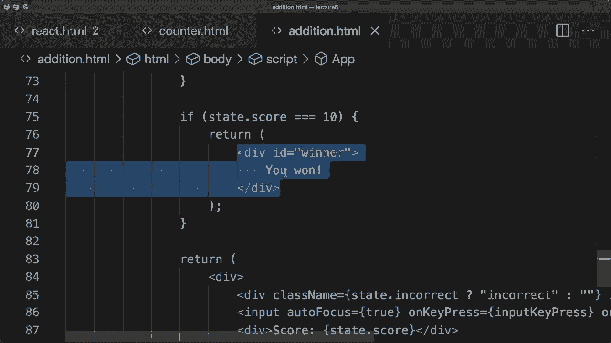

just return a div that says you won the，game，questions，every time i answer a question you're。

noticing that the score is going to，increase by one，and every time we're generating new。

random numbers to display，as the as what's going to appear in the，user interface。

and once i get to question number 10 if，i answer it correctly，press return the entire ui changes。

instead of the problem and an input。

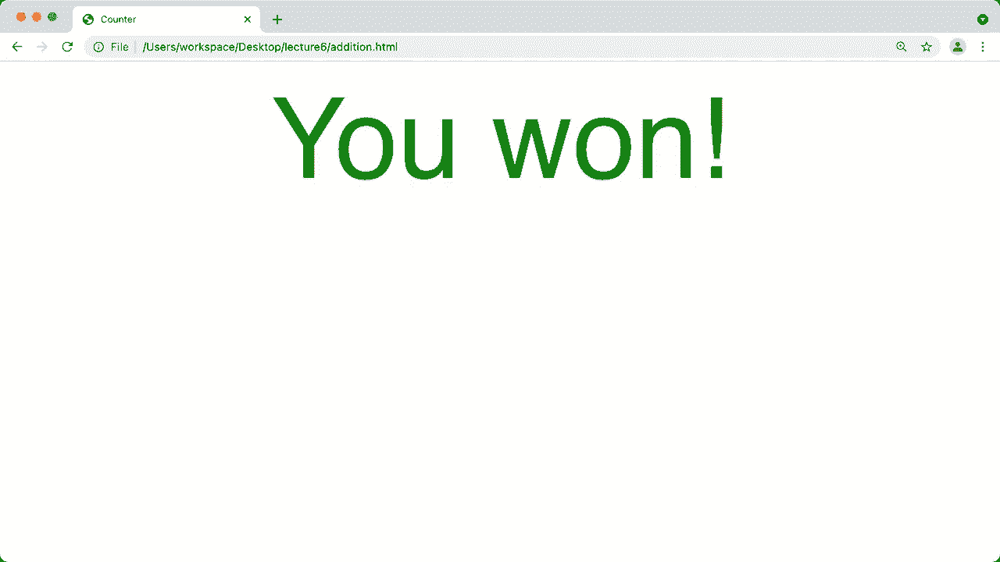

field and the score，i just see in green large text that i，won，and again i was able to do that by。

looking here，at this condition where we're looking at，the value of the state。

and if the state is 10 we're deciding，what's a retina，and this again is one of the great。

powers of react this ability to use this，underlying state，and based on the value of the underlying。

state decide what it is the user should，see。

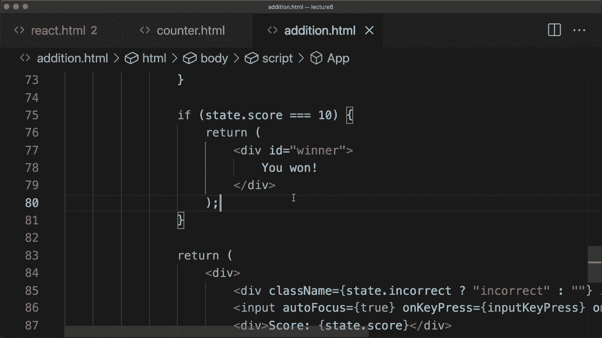

in their user interface and react is，just one of many libraries that do。

this type of thing other popular ones，include angular and vue，where all of these are just these web。

frameworks that make it easy to be able，to create applications，that are able to respond to some。

underlying state so that you the，programmer，don't have to worry about constantly。

having to manipulate various different，parts of the page，which especially especially as you。

imagine websites like facebook or，twitter where there are many things。

happening on the page at the same time，every time a new tweet comes in you。

might get a notification and see a new，post in your main area of your news feed。

so these are the types of things that，you might want the application to be，able to more easily。

handle for you where you describe what，the state is you describe what the page。

should look like based on that，underlying state，and let the library whether it's react。

or something else begin to handle the，process，of doing that for you and the world of，user interfaces。

is changing pretty quickly that a lot，changes in user interfaces in terms of，the technologies。

and the tools that are quite popular but，they're really based on the same set of。

underlying ideas the idea that we can，use javascript，in order to manipulate what it is the。

user sees on their page in order to，detect what's happening based on。

particular events like scrolling to the，bottom of the page，or typing something into an input field。

and then responding，to those particular events by providing，some sort of function that gets called。

anytime a particular event happens by，mixing that in with other features like。

the ability to asynchronously，request information from an external。

server or the ability to do computations，based on the values of the state like we，saw within react。

we have the ability to create very，interesting engaging，dynamic user interfaces very very。

quickly all just using the power，of combining python and javascript that。

was web programming with python and。