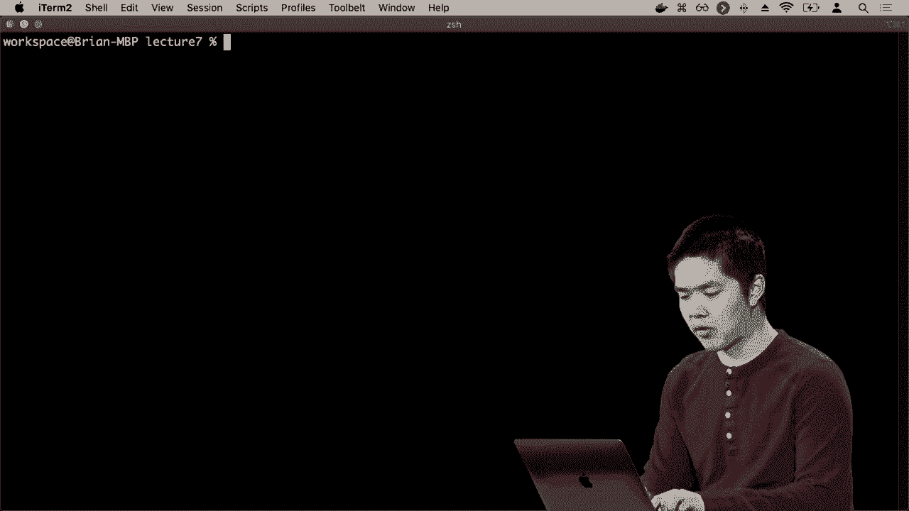
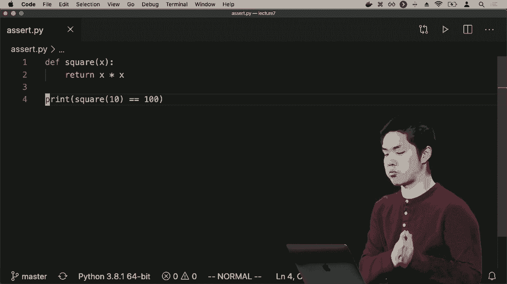
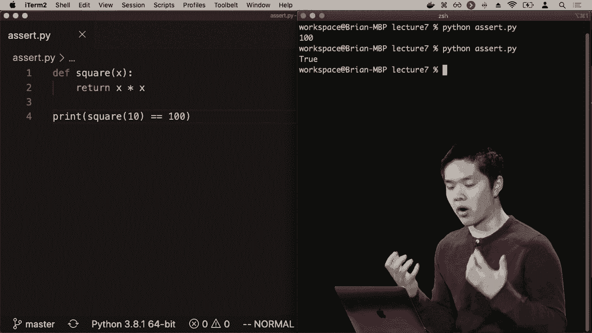
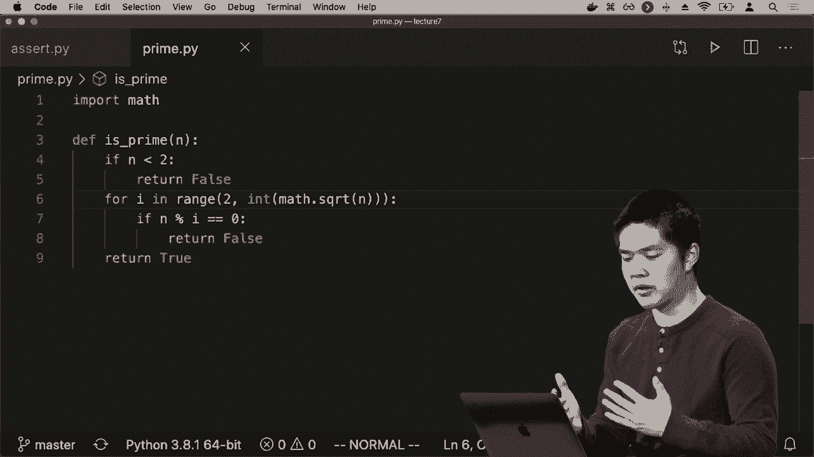
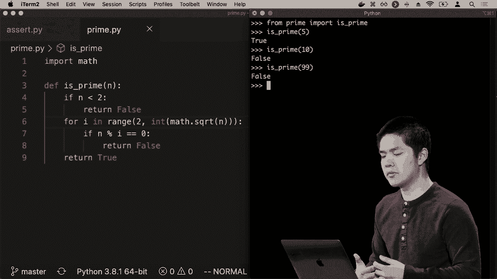
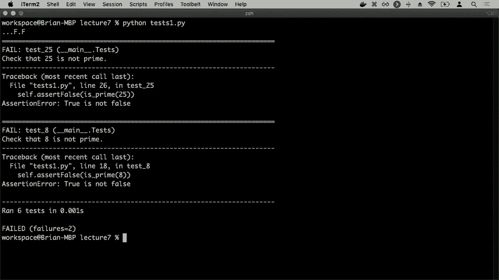

# 【双语字幕+资料下载】哈佛 CS50-WEB ｜ 基于Python ／ JavaScript的Web编程(2020·完整版) - P21：L7- 测试与前端CI／CD 1 (测试与断言，单测) - ShowMeAI - BV1gL411x7NY

[Music]。

okay welcome back everyone to web，programming with Python and JavaScript。and now at this point we've seen a，number of different techniques and tools。that we can use in order to design web，applications HTML and CSS to describe。how it is that our pages look a，programming language like Python using a。

framework like Django in order to listen，for requests process them and provide。some sort of response and then more，recently we took a look at JavaScript。another programming language that we can，use in particular on the client-side。running inside of the users web browser，in order to make our webpages even more。

interactive and user friendly now what，we'll transition - today is taking a。look at some of software's best，practices some tools and techniques that。developers actually use when they're，working on web applications especially。as those web applications start to grow，larger in particular we'll start by。

discussing testing this idea of，verifying that our code is correct and。then transition to see ICD short for，continuous integration and continuous。delivery some other best practices that，are used in making sure that the work。that software developers are working on，can be tested and deployed readily and。

very quickly so we'll begin the，conversation with testing and testing is。really about this idea of verifying and，making sure that the code that software。developers are writing are in fact，correct to make sure that the functions。work the way they're supposed to that，the webpages behave the way that they。

are supposed to and ideally we'd like，some way to be able to efficiently and。effectively test our code over time and，as our programs grow more complicated to。allow our tests to make sure that our，program is behaving the way that we。wanted to so we'll go ahead and start，simple we consider the basic way that we。

might take a function for example，written in Python and test and verify to。make sure that it works the way we would，expect it to and to do so we can start。with a command and Python known as，assert and what assert does in Python is。it asserts or just states that something，should be true and if that something is。

not true then the assert is going to，throw an exception some sort of error so。that whoever is running the program or，running the command knows that something。went wrong and this can be a very basic，way that we can leverage pythons。abilities to test a function and verify，that that function behaves the way we。

would want it to so let's go ahead and，try a simple example of writing a Python。function and then trying to test to make，sure that that fun，works the way we would want it to so。we'll go ahead and create a new file，I'll call it a search PI and let me。define a new Python function for example，that is going to take an integer and。

squ*re it just want to take a number and，return it squ*re so I'm going to define。a function called squ*re that takes as，input a number like X and I want to。return x times X it's a fairly，straightforward function but I would。like to know verify that the function，works the way I would expect it to now。

there are a number of ways that you，could do this one would be just like。

let's print out what the squ*re of 10 is，for example and just see what that's。

equal to and then you could run a，program something like Python assert PI。and just say all right the answer is 100，and I could say to myself ok that's what。I would expect it to be but I now have，to do the mental math of squaring the。number 10 making sure that the answer，comes out to be the value that I expect。

it would be nice if I could automate，this process well one thing I could do。is print out does the squ*re of 10 equal，100 I know that I want squ*re of 10 to。

equal 100 so I could just print out that，value print out does squ*re of 10 equal。the number 100 I'll go ahead and run the，program again and this time what I get。is true for example because those two。

things are equal to each other and if on，the other hand I had tried to check for。

something that wasn't true like does，squ*re of 10 equal 101 you run the。program and okay now it's going to be。

false so this is nothing new nothing we，haven't seen before but now what I can。do is instead of this I can just say let，me assert that squ*re of 10 is equal to。100 here I'm just asserting that this。

expression that the squ*re of 10 is，equal to 100 is going to be true and now。I can run the program and what you'll，notice is nothing happens no output。nothing at all because when in a certain，statement in runs and the expression。that it's checking turns out to be true，that the squ*re of 10 does equal 100 it。

effectively ignores that statement，altogether just continues on to the next。thing no output no side-effect of any，sort and this is helpful because it just。means that if I want to assert that，something is true I can assert it and。then just continue writing my code and，it's as if I hadn't written that a。

certain statement at all so long as the，thing that I am asserting is actually，true。but if there were a bug in my code for，example some sort of mistake where。instead of returning x times X imagined，that I accidentally said return X plus X。to calculate the squ*re and said，something that would be a bug in this。

case well then when I try to run Python，assert PI what I'm going to get is an。

exception and the type of exception that，I get is something known as an assertion。error and I can see that here there's an，assertion error and then I see the。reason why the assertion error happened，and the assertion error happened on line。4 which is this line here where I said I，would like to assert that the squ*re of。

10 is equal to 100 so one way we could，imagine testing our code is just by。including a number of these different，assert statements if I want to verify。that my code is correct I can write，various different assert statements and。for a function that's fairly simple like，this squ*re function probably not too。

many tests that I would need to write，but you can imagine for more complex。functions that have multiple different，conditional branches being able to。assert that no matter which conditional，branch the program chooses to follow。that the code will actually be correct，can be a valuable thing to be able to。

say and this can be helpful to when in，working on a larger project you want to。deal with the problem of like bugs that，might appear inside of a project and。this gets at the idea of test-driven，development developing while keeping。this notion of testing in mind and one，of the best practices would be if ever。

you're working on a program of your own，and you encounter some bug in the。program you'll first want to fix the bug，but then you'll want to write a test。that verifies that the new behavior is，working as expected and once you've。written these tests these tests can，start to grow over time and as you。

continue working on your project you can，always run those existing set of tests。to make sure that you nothing no new，changes that you make to the program。down the line no future if features that，you add or changes you might make are。going to break anything that was there，before and this is especially valuable。

as programs start to get more complex，and testing everything by hand would。start to become a very tedious process，to be able to just automate the process。of just run a whole bunch of tests on，all the things that I know that I would。like the program to do and making sure，helpful，so assert then is one basic way of just。

saying that I would like for this，true，go ahead and throw an exception and。using Python we know we also have，to catch those exceptions in order to。make sure that we're able to handle，those appropriately so we could display。a nice error message for example if we，wanted to do so but now let's go ahead。

and try and write a more complex，function something more complex than。just taking a number and squaring it，somewhere where there's more room for。various different cases that I might，want to test and more room where I the。programmer might make a mistake for，example so let's imagine writing a new。

file but I'm gonna call prime PI we're，here I'll go ahead and say that I would。like prime dot pi to implement a，function called is prime and what the is。prime function should do is check to see，if a number is prime or not the prime。number only has factors of 1 and itself，and I would like to write a function。

that verifies that fact and so how might，I go about doing that well if n is less。than 2 then it is definitely not prime，because we say 0 and 1 are not going to。be Prime and we're only deal with，numbers that are 0 or greater and we'll。deal with that for now but let's start，then with other numbers numbers that are。

2 or greater well what do I want to do i，we really want to check each of the。possible factors like if I want to check，whether or not a hundred is prime or not。that I want to loop over all the，possible numbers that could be factors。of 100 like 2 3 4 5 6 and when I get to，a number like 2 or a number like 5 that。

do go into 100 cleanly well then I'll，know that the number is not prime so I。could say for I in range from 2 all the，way up through n for example let me go。ahead and say if n mod I equals 0 then，return false so what am I saying here。I'm saying go ahead and start it to go，up through but not including n so for an。

if I'm checking to see if 10 is prime，for example I'm going to check for is 2。3 4 5 6 7 8 9 and for each of those，numbers check if n my input to this。function mod I the factor that I would，like to check is equal to 0 this mod。operator this percent if you don't，recall gives us the remainder when you。

divide one number by another and so if n，mod I equals 0 that means the remainder，when you divide n。by I equals zero meaning I goes in to，end cleanly with no remainder and that。means that it's not prime because it，does have a factor whatever I is going。to be that factor and if I get to the，end of this for loop then I can go ahead。

and just say return true if we weren't，able to find a factor for the number。other than 1 and the number itself well，then we can go ahead and say that true。this number is going to be prime and so，this for example could be a function。that checks to see if a number is prime，but if I'm trying to optimize I'm trying。

to make my function more efficient I，might realize that you really don't need。to check every number from 2 all the way，up to the number n itself I could really。just check up to like the squ*re root of，that number for example that for a。number like 25 I want to check like 2 3，4 5 because 5 squ*red is going to be 25。

but after 5 I don't need to check any，more numbers beyond that that after you。get to a number after a number the，squ*re root of that number is multiplied。by itself there's never going to be a，case where a number bigger than that。could be a factor that I won't have，already known about so just thinking。

about things a little bit mathematically，we might be able to make some sort of。optimizations we're instead of going，from 2 all the way up through n I might。go up to the squ*re root of N and I'll，*****，*****，*****，the squ*re root doesn't already happen。to be an integer so I think this works，I've at least talked myself into。

thinking that this is a function that，might be able to check if a number is。prime so what could I do if I wanted to。

verify this well I could write some，assert statements another thing I could。do is just use the Python interpreter I，could say all right let me go ahead and。type Python and I'm in the Python，interpreter and I can say from prime go。ahead and import is prime prime is the，name of that file is prime is the。

function in that file that I would like，to test and let's just try all right。like is prime 5 that's a prime number，hopefully it'll say true that it's prime。all right it does let's try is prime 10，see if that works，all right is prime Tenace false because。10 is not prime that's good that seems，to be working as well let's try like is。

prime 99 that's not prime because like 3，is a multiple，that for example all right false so。that's good this seems to be working and，I could in the interpreter test this。function to make sure that it works the。

way that I would want it to work but，let's now see some other ways that I。might go about testing it well one way，is that I could write a file like tests。zero pi and went s zero dot pi is going，to do instead of using assert I'm just。going to do our boolean checks like we，were doing before I'm going to import。

the is prime function and I've defined a，new function called test prime which is。going to serve the role of testing to，make sure that when you squ*re some。number or when you check to see if some，number n is prime that you get some。expected value where that expected value，is either true for it is prime or false。

for it's not prime what then is this，function doing well the function is。checking we're calling the is prime，function on this number n and seeing。whether or not it is equal to the，expected value that we get where we。expect it to be either true or false and，if we run is prime on N and it is not。

equal to what we expect well then we，print out ok there's an error we。expected some value true or false but it。

turned out not to be the case and so now，that I had this test prime function well。I can say alright let me go back into，the Python interpreter from tests 0。import test Prime and now I can say all，right let me test Prime make sure that 5。is prime so I'm passing in my first，input the number n the number I would。

like to check I want to check if 5 is，prime and the second input I provide is。what I expect it to be either true or，false and here nothing happens which is。a good thing if there were an error it，would have printed something out and the。fact that I see nothing printed out，means that everything was ok if I test。

Prime now and say something like alright，make sure 10 is not prime make sure the。10 when you pass it into is prime is，going to give us false again nothing。happens seems to be working just fine，let me now try I can try more examples。maybe I try test prime 25 I want to make，sure that 25 is not prime 25 is not a。

prime number all right we get some sort，of error there's an error on is prime 25。where I expected the output to be false，but for some reason it looks like is，prime。something other than false have probably，returned true and some might indicate。some sort of bug in my program that，somehow I don't think that 25 should be。

a prime number but my program thinks，that 25 is a prime number and that error。can be a clue to me as to how to do this，but ultimately especially as programs。start to grow longer especially as I，start to add more and more functions。testing each of those functions by hand，is going to start to get tedious so one。

thing I could do is like write a script，to be able to run all these tests for me。automatically and so here what I have a，test zero dot s H dot s H being like a。

shell script some script that I can just，run inside my terminal and what this is。doing is it's running Python 3 for，python version 3 - C which means I'm。just going to give it a command and it，is going to run that command and so I。can just run these and each of these，lines does what from test 0 it imports。

my test prime function that function，that is going to test to make sure that。the prime function produces the output，that I would expect it to and each time。I'm testing a different number making，sure that one is not prime making sure。that 2 is prime eight is not prime so on，and so forth and I can just write a。

whole bunch of these tests and then，rather than have to run each test one at。a time what I can do is I can just run，tests 0s age I can just say that I would。like to run dot slash test 0 sh and all，right I see that I get two errors I get。an error on is prime eight where I，expected it to not be prime but for some。

reason it seems to be prime and then，again here exception on is prime 25 or I。expected it to not be prime but for some，reason my program thinks that it is。prime so a very helpful way for me to。

know immediately that there's some sort，of error that is going on here。but ultimately rather than have me have，to write all this framework for how to。go about testing my code on my own there，exists libraries that can help us with。this and one of the most popular in，Python is a library known as unit test。

and what unit test is a library designed，to do is it is going to allow us to very。quickly write tests that are able to，check whether something is equal to。something else and then unit test is，built in with an automated test runner。that will run all of the tests for me，and verify the output and unit test gets。

built in to a lot of other libraries，be able to，apply this sort of idea to our Django。applications as well but let's now，translate these tests that we have。written ourselves just by writing a，function that like test whether the。prime number is what we expect it to be，and now translate it to using this。

Python unit test library instead and so，just to get a sense for what this looks。like I'll now go ahead and open up tests，one dot pi we're here first thing i'm。doing is i'm importing unit tests which，we get for free with python I'm also。importing the function that I would like，to test and now I'm defining a class。

which will contain all of my tests this，is a class that inherits from or derives。from unit test test case which means，that this is going to be a class that is。going to define a whole bunch of，functions and each of which is something。that I would like to test and so for，example in this very first test this is。

a test that checks to make sure that one，is not prime and so the way I do that is。by calling self this testing object，itself it happens to have a method or。function built into it called assert，false there's an equivalent assert true。but I would like to assert false and，what would I like to assert that is。

false is Prime one so whatever is prime，one is that should be false and I would。like to just assert that it is false，likewise for the number two now I want。to check that the number two is prime，and the way I do that is by calling self。dot assert true I would like to assert，that when I run the is prime function on。

the number two the output that I get is，going to be a true value self dot a。third true and I can translate each of，the rest of my tests into one of these。self dot assert throughs or self dot，assert false and then I say that if you。go ahead and run the program go ahead。

and call unit test main which will run。

all of these unit tests so now when I，run Python test one pi here's what I get。I get some nice output where up at the，top I see dots every time a test。

succeeded and a letter F for a test that，happened to fail it says that it ran six。tests and down at the bottom I see that，there were two failures so it's。immediately going to tell me exactly，what failed and it'll give me some。rationale some reason for why it is that，those tests failed as well so we can see。

all right here is one test，here's another test this tests have，failed if the tests that。checked that 25 is not prime and this，sentence here is what I supplied inside。of what was known as that Python，docstring inside of this triple，quotation marks underneath the。declaration of the function those triple，quotation marks otherwise known as a。

docstring serve a number of purposes，they can serve as just a comment for。describing what it is the function does，but they're a special comment insofar as。someone who's looking at the function，can access that docstring that's usually。used for documentation for what it is，that the function is doing and they can。

use it inside of other places as well，and so what unit test is doing is for。every function it uses that docstring as，a description of what the test is。testing for so that if a test fails then，I can see exactly what the name is of。the test that failed up and what it was，tested where the description describes。

what was happening now in this case，where it's just one function I'm testing。a whole bunch of different numbers it，doesn't seem all that useful but again。if you imagine projects that start to，get more complex being able to know。immediately when you run your tests，which parts of the program or which。

parts of your web application aren't，working the way they are expected to can。actually be quite helpful so test 25，that was the function that triggered an。assertion failure in this case and the，line that caused it was self dot a cert。false is prime 25 and the reason that it，failed is because true which apparently。

was the output of this function is not，false and I expected it to be false。instead and so multiple different ways，of trying to run our test this happens。to be one quite popular one but this，note tells me that I should go back and。try and fix my is prime function I can，go back into prime dot Piatt and say all。

right I would like to figure out why，this went wrong and if you look at this。enough and maybe give it a little bit of，testing you might see that a slight off。by one error that I probably need to，check one additional number then I。actually am because in checking whether，or not 25 is prime or not for example I。

might need to go up to and including the，number 5 to know that 5 is a factor of。25 but before I was going up to the，number 5 but I wasn't including the。number 5 so I also need to just check。

one more number and now to verify that，this is right I could just manually test。the function myself or I could just run，these tests again run。I found test1 pi and this time all these，dots mean all these tests succeeded we。ran six tests and everything was okay no。

failures and so this can be a helpful，way for me to know immediately the thing。seems to be working okay so the，takeaways from here are that these tests。can definitely help as you begin to，write new changes to your program。especially as you begin to optimize，functions you might make a function more。

efficient but then run your tests to，make sure that in making these。improvements you haven't broken anything，you haven't changed any behavior that。the way the program was supposed to，behave and now it doesn't behave that。way you are able to verify with much，more confidence that that is true but of。

course that only works if your tests，have good coverage of all the things。that you would want the function to do，and you've covered appropriately all the。various different cases for how the，function should behave because only if。the tests are comprehensive well they，actually be useful to you and indicating。

that the change that you made isn't，going to break anything and only then。