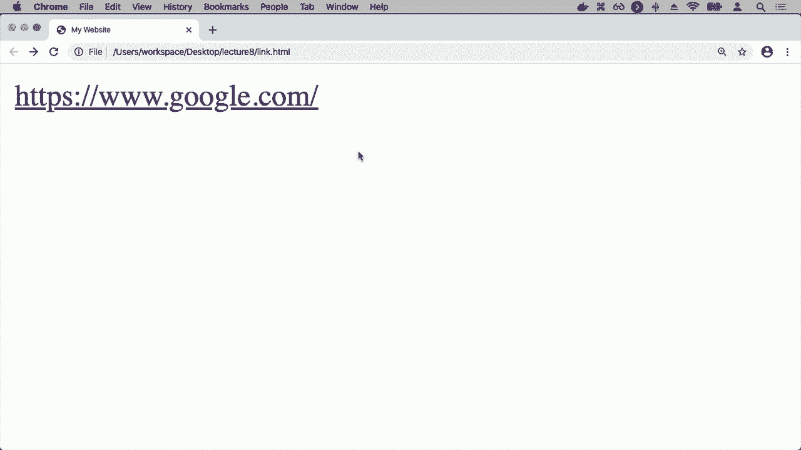
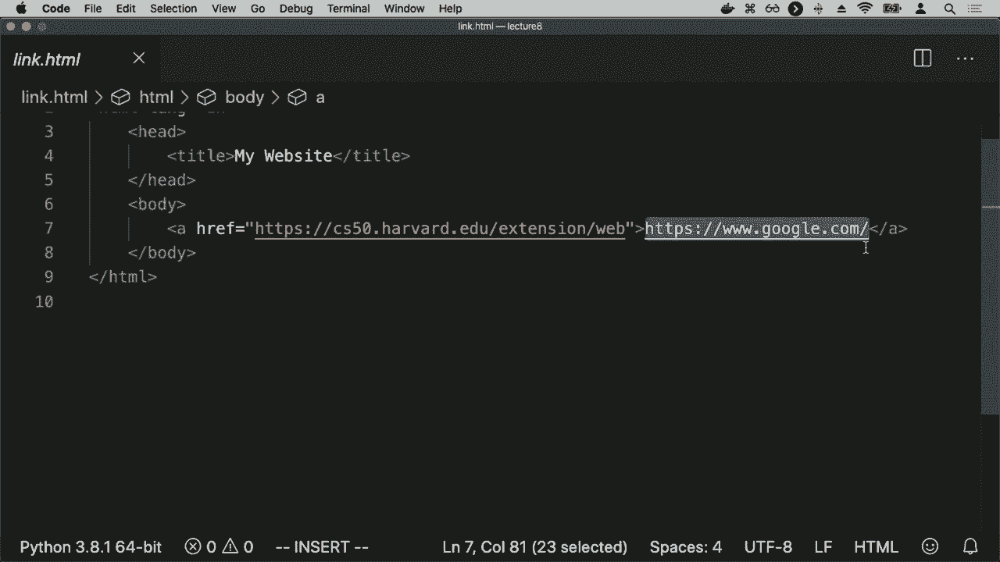
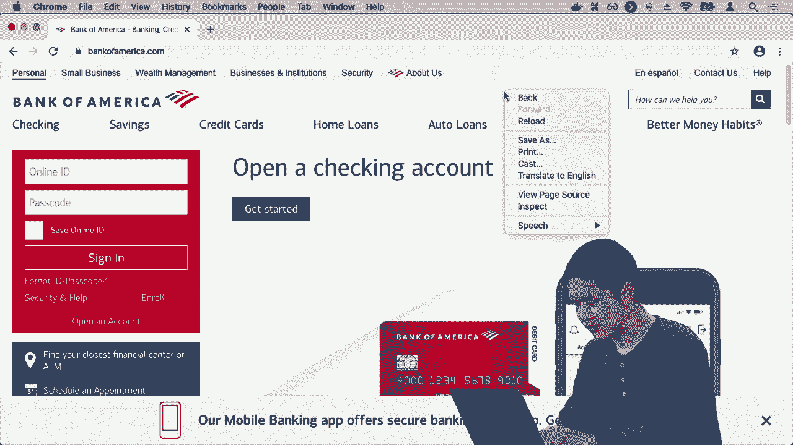
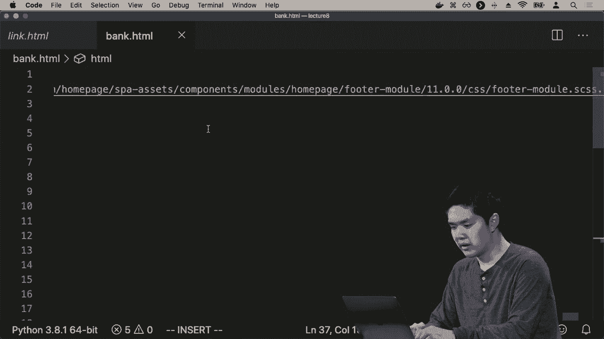
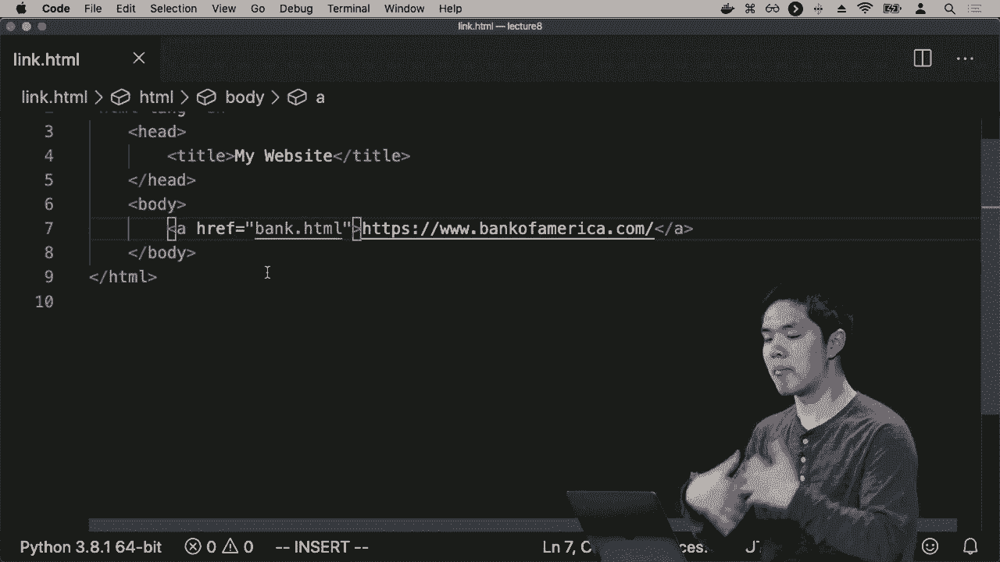
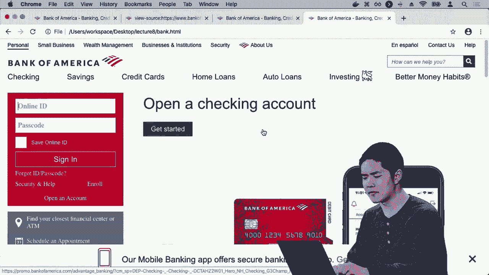

# 【双语字幕+资料下载】哈佛 CS50-WEB ｜ 基于Python ／ JavaScript的Web编程(2020·完整版) - P25：L8- 拓展性与安全 2 (缓存，安全，https) - ShowMeAI - BV1gL411x7NY

articles might not be changing all that，frequently if one person makes a request。

one second and another person makes the，same request half a second later it。

probably is not going to be useful to，re-request all the information from the。

database regenerate that template yet，again because it's an expensive process。

of requesting data from the database of，generating that template we'd ideally。

like some way of dealing with that，problem and the way we can deal with。

that problem is some form of caching and，caching refers to a whole bunch of。

different types of ideas and tools that，we can use of various different places。

inside of our system but in general when，we're talking about caching we're。

talking about storing a saved version of，some information in a way that we can。

is it more quickly so that we don't need，to continue making requests to a。

database for example and so there are a，number of ways we can do caching one way。

we can do caching is on the client side，via client-side caching where the idea。

is that your browser whether it's Safari，or Chrome or something else is able to。

cache data store information so that the，browser doesn't need to re-request the。

same information the next time if it is，the page for example if you request a。

page and it loads an image on the page，for example and you reload the page well。

your web browser might try and make a，request again for the exact same image。

and then display it to you but an，alternative might be that your web。

browser could just save a copy of the，image inside of a cache to locally store。

a version of the image so that the next，time that the user makes a request to。

the website the user doesn't need to，reload that entire image and that might。

be true of entire web pages and web，resources that if there's some page that。

doesn't change very often then if the，web browser just stores a cached a saved。

version of that page then the next time，the user goes to their web browser tries。

to access that page rather than re，request to the server and make a new。

request that the server needs to respond，to if the browser has that page cached。

the browser can just display the cached，saved version of the page if saving the。

need to talk to the server at all so，this can certainly help to reduce the。

load on any given server that if users，are caching information inside of the。

web browser it makes the experience，faster for the user because they can see。

the information immediately rather than，need to make a request and wait for a。

response to come back and it's good for，the server because the server doesn't。

need to be dealing with as many requests，if some of those requests are getting。

cached and so one approach to trying to，do this is by adding this inside of the。

headers of an HTTP response that when，your web server responds to some。

requests the web server can include a，line like this inside of the response。

something like cache control max-age，86，400 in effect specifying the number。

of seconds that you should cache this，resource for but if I try to access this。

page 10 seconds later well that's less，than 80 6400 so rather than reload and。

read request the entire page，we're just going to use the version of。

the page that happens to be cached，inside of the web browser and so this。

has several advantages that we've talked，about in terms of reducing the amount of。

time it takes to see the content of a，page because it's already saved and。

reducing the load on any particular，server but it also has drawbacks that if。

for example the resource changes within，this amount of time that maybe in 60。

seconds the page has changed if I try，and load the page again well then if。

it's loading the cached version of the，page I might be seeing an outdated。

version of a webpage I'm seeing an older，version of the webpage because my web。

browser just so happens to have that，particular resource cached and this。

might be true of a web page it's，especially true of other like static。

resources things like CSS files of，JavaScript files but the CSS of a web。

page probably doesn't change all that，often and so as a result it's pretty。

natural that your web browser rather，than request the exact same CSS files。

again and again and again might just，save a copy of that those CSS files。

cache them such that it's able to just，reuse the cached version but if the。

website were to update their CSS you，might not see the latest changes and you。

might have experienced this yourself if，you're working on your own web。

applications when you change your CSS，and refresh the page you might not。

always see those changes reflected if，your web browser is caching those。

results and so in most web browsers you，can do a hard refresh to say ignore。

whatever is in the cache and actually go，out and make a new request and get some。

new data but ultimately if you don't do，that you're subject to this cache。

control where the web browser is going，to say unless this number of seconds has。

elapsed we're going to reuse the，existing version of the page and so an。

alternative to this approach and this，approach certainly works and is quite。

popular we can add to this approach by，adding what's known as an e-tag and the。

e-tag for a resource like a CSS file or，an image or a JavaScript file is just。

some unique sequence of characters that，identifies a particular version of a。

resource it identifies a particular，version of a CSS file or a JavaScript。

file for example and what this allows a，program to do like a web browser is that。

when a web browser requests a resource，like makes a request for a CSS file or a。

JavaScript file they get it back，and they get its associated etag value。

so I know that this is the value that is，associated with this version of the CSS。

file and if the web browser web server，were ever to change that CSS file。

replace it with a new updated CSS file，the corresponding e tag will also change。

so why is this helpful well it means，that if I am trying to decide should I。

load a new version of the resource or，not should I try and make another。

request to get the latest version of the，CSS what I can do first is just ask for。

what is the e-tag value this short，sequence that can be answered very。

quickly very quickly we can just respond，and say you know what if the e-tag value。

is the same as what I remembered from，last time well then I don't need to get。

a whole new version of that resource and，so this is quite common - that our web。

browser will say hey let me request this，resource but I already have a version of。

the resource with this particular etag，so if that etag is still the retag for。

the most recent version of a particular，resource like a CSS or JavaScript file。

then no need for the web server to send，a new version of that file just go ahead。

and respond and say the version you have，that one works totally fine but if there。

is a new version well then the web，server can respond with the new asset。

the new CSS file for example but also，the new etag value so these two。

approaches can work in concert with each，other that you can say go ahead and cash。

this for some number of seconds so that，for some number of seconds you're not。

going to ever request a new version of，that resource but even if you do ask for。

a new version of the resource after this，number of seconds is elapsed if the。

e-tag value hasn't updated then no need，to redownload a whole new version of a。

particular file you can just reuse the，version and that happens to be cached。

already in the browser so caching and，the browser can be an incredibly。

powerful tool for trying to speed up，these requests for trying to reduce the。

load on any particular server but the，client-side is not the only place where。

we can begin to do this kind of caching，we also have the ability to do。

server-side caching and in server-side，caching we're going to introduce to our。

picture the notion of a cache that we，have these multiple servers that are all。

communicating with the database but，these servers can also communicate with。

a cache someplace where we've stored，information that we might want to reuse。

later rather than have to do all of that，recalculation and jangling turns out has。

an entire cache framework a whole host，of features that Django offers that。

allow us to leverage this ability to use，the cache to be able to speed up。

requests so there are per view caches，where you can specify a cache on a。

particular view to say that rather than，run through all this Python code every。

time someone makes a request to this，particular view instead and just cache。

the view so that for the next 30 seconds，or 30 minutes the next time someone。

tries to visit the same view go ahead，and just reuse the results of the last。

time that that view was loaded and this，can work not just for a single view it。

can work for fragments inside of a，template that your template might have。

multiple different parts that on your，webpage you might render the navigation。

bar in the sidebar and the footer may be，based on information about today that。

might change the next day but if you，expect that the sidebar of your page is。

not going to change very often within，the same minute or within the same hour。

well then you might imagine caching that，part of the template so the next time。

that django tries to load that entire，template it doesn't need to recalculate。

how to generate the sidebar for your，website it just knows that we can use。

the saved version of the sidebar from，the last time that we loaded this。

website instead and jingle also gives，you access to a lower level cache API。

where for any information that you might，want to cache and store for use later。

you can save that information inside of，the API you make an expensive database。

query that takes a couple of，milliseconds or a couple of seconds to。

process you can save those results，inside of a cache to make it easier to。

access that same data if ever you tried，to get access to that again so caching。

allows us to be able to deal with these，issues of scale by reducing load on our。

servers but also on our databases that，rather than need to talk to the database。

every single time we make a new request，for a particular web application we can。

just reuse information that happens to，be in the cache to allow our web。

applications to become even more，scalable so that then was a look at some。

issues concerning scalability and will，next turn our attention to。

security trying to make sure that as we，build our web applications as we deploy。

our web applications and more users，start to use them we want to make sure。

that they're secure and there are a，whole bunch of security considerations。

to take into account across all of the，topics we've looked at in the course。

we've looked at a number of different，topics and with each of them there are。

security vulnerabilities there are ideas，to be mindful of when it comes towards。

making sure that our applications are，secure and we can begin our story in。

fact by talking about git and version，control git is all about trying to make。

sure we're able to keep track of，different versions of our code and one。

thing that goes hand-in-hand with git is，this idea of open source software that。

on websites like github and other，services that hosts get repositories。

increasingly a lot of software is，becoming open source where anyone can。

see and contribute to the source code of，an application and this is great in the。

sense that it allows for many people to，be able to collaborate work together in。

order to try to find bugs that might，exist inside of a web application but it。

also comes with drawbacks drawbacks，where if there is a bug in the。

application now someone who's looking，through the source code of our program。

might be able to spot that bug or you，might imagine that because gate keeps。

track of different versions of our code，every time we make a commit to our。

repository you have to be very careful，when it comes towards credentials or。

things that might leak inside of the，source code you generally never want to。

put passwords or any secure information，inside of the git repository because the。

git repository could be shared with，other people it might be open to anyone。

to look at and so those are security，considerations to be mindful there as。

well that if you make a commit and，accidently make a commit to your code。

where you expose those credentials you，might remove those credentials and。

commit again so the latest version of，your program doesn't have those。

credentials in it but someone who has，access to the gate repository has access。

not just to the latest version of your，code but to every version of your code。

and that person could theoretically go，back through the history of the。

repository and find the commit where the，credentials were exposed and see those。

credentials as well so while get is a，very powerful tool it's also one to be。

mindful of that any change you make，could potentially get saved inside of a。

commit could potentially therefore be，accessed later on and so if ever。

credentials that are exposed inside，the repository you want to make sure to。

wipe out all those previous commits and，not just make some new commits in order。

to try and hide the previous credentials，that can be exposed because they can。

still be retrieved as someone goes back，through the history of any particular。

repository and so that then was a look，at some issues that might get we also。

talked to the beginning of the course，about HTML and about what it is that we。

can use with HTML and how we can use，this language in order to design the。

structure of a web page in order to，decide where all of the paragraphs are。

going to be what tables are going to be，on the page we talked about links and。

how we can use anchor tags to link one，page to another page now one concern and。

is this type of attack known as a，phishing attack with HTML and a phishing。

attack really just comes down to a，little bit of HTML that looks like this。

very easy to write where I have an，anchor tag that is going to direct the。

user to URL 1 but it looks like it，directs the user to URL 2 so what might。

an example of this be all right so we'll，take a look I'll go ahead and open up。

link dot HTML and in linked out HTML I，have a website that I've written that。

appears to have a link to Google but if，I click on that link I'm suddenly。

directed to this courses web site for，example so how did that happen why did。

that happen it seems like it's linking，to Google well if you look at the code。

if I go ahead and open up linked on HTML，we'll see that here I have an anchor tag。

that actually links to the course，website but appears to be linking the。

text that the user sees it appears that，it is linking instead to Google and so。

this is a very common attack vector。

especially in emails for example you，might see an email that tells you to。

click on a particular link but that link，takes you to somewhere else entirely。

instead and as a result someone might，inadvertently share their bank account。

credentials or other sensitive，information and so here too，something to be mindful of if you。

interact with the web maybe not，necessarily on your own website but in。

other websites you might interact with，just to be mindful about where links are。

actually taking you and most web，browsers if you hover over a link will。

show you where that link might actually，be directing you to because it might be。

different than what the text of that，particular anchor tag might appear to，link you to instead。

and so HTML has all these various，different vulnerabilities where because。

you can just decide what you want the，structure of the page to be it leaves。

open the possibility that someone might，try to trick you into thinking that。

you're going to a page that you're not，actually on and this problem is more。

widespread because anyone can look at，the HTML for any page HTML comes back。

from the server and therefore the web，browser has access to all of that HTML。

and can use that HTML in order to render，a page for example and this leaves open。

other vulnerabilities too so for example，let me go ahead and go to Bank of。

America calm just Bank of America's，website you go to any other website。

instead if I wanted to create a fake，version of Bank of America's website for。

example to trick people into thinking，they're going to Bank of America's。

website when really they're going to my，website well then what I can do is just。

go ahead and view the source of this。

page I'll go ahead and view page source，and here is all of the HTML for Bank of。

America's website and nothing then stops，me from copying all this content going。

into an HTML file and creating a new，file then I'll just call like Bank HTML。

then I'll go ahead and paste in the。

contents of that HTML file so here then，is all of Bank of America's HTML and now。

if I open up Bank HTML that HTML file，that I have now written but really just。

copied from Bank of America I open it up，and now here on my page is a web page。

that appears to look like Bank of，America it's using all of Bank of。

America's HTML but instead it is my HTML，page and not actually Bank of America。

and so you might imagine combining these，to create an even more concerning attack。

vector where instead of linking to，Google com let me try and link to Bank。

of America com but where I'm actually。

going to link to is Bank dot HTML my，version of Bank of America's website。

where now if I open up link HTML here，appears to be a link that links me to。

Bank of America com if I click on that，link I get to a page that looks like。

Bank of America's website but it's not。

Bank of America's website it's my bank，HTML file that I have written the。

so happens to look like Bank of，America's website because I copied all。

of that underlying HTML so HTML has the，ability to describe the structure of our。

webpage but anytime you're writing this，HTML it's good to be mindful of the fact。

that anyone can copy your HTML could，theoretically pretend to be Yumi's are。

security vulnerabilities that are worth，bearing in mind as we start to develop。

web applications and interacting with，web applications as well so ultimately。

we used HTML in the context of designing，web applications using Django a。

framework and how exactly then did these，web frameworks work in terms of creating。

these web servers that are listening for，requests and that are responding to。

those requests well ultimately much of，the internet is based around this idea。

of a client communicating with a server，or more generally any one computer。

communicating with another computer，using HTTP and in particular HTTP a more。

secure version of the HTTP protocol and，so you might imagine that what these。

protocols are really about is how，information gets from one person to。

another and what we're storing with that，information that we have one computer。

trying to communicate with some other，computer and in order to do so。

information is generally going to flow，through these routers that you might。

imagine information going back and forth，between one computer and another。

computer going through these，intermediate routers along the way and。

as a result one thing to be cautious，about is how do you know that this。

information that's getting passed back，and forth is getting passed back and。

forth securely then ideally when I send，a message to another computer I'm。

sending an email to someone else I'm，sending a message I'm making a request。

to a website that might contain，sensitive information like my bank。

account for example I don't want it so，that any intercepting router that is。

taking my requests and passing it along，I don't want those routers to be able to。

look at that request and see the，contents of my email or the contents of。

what password I happen to be sending，across the web or not ideally I'd like。

for this information to be encrypted and，so here we'll talk a little bit about。

cryptography this process of trying to，make sure that I am able to communicate。

with some other person without some，eavesdropper in the middle being able to。

intercept that message obviously if I，just take a plain，next version of the message I'm trying。

to send and just literally take the text，of the message I'm trying to send and，Internet。

well then anyone who is able to see that，message is going to know what the text。

of that message is and so I want to do，some kind of encryption some way of。

encrypting that message so that someone，along the way won't be able to do that。

decryption if a router in the middle or，someone in the middle is able to。

intercept that message and so the first，approach we'll look at is what's known。

as secret key cryptography in secret key，cryptography I have not just the。

plaintext but some key some secret piece，of information that can be used in order。

to encrypt or decrypt information and so，I'll use both the key and the plaintext。

to generate what's known as the cipher，text the encrypted version of the。

message I'm trying to send and then，incentives instead of sending the。

plaintext across the Internet to the，other person I might instead want to。

just send the ciphertext across the，internet to the other person so that I'm。

not sending the plain version of the，message across the internet so the。

ciphertext goes across and the other，person will also need the key and now if。

the other person has both the ciphertext，and the key well then using that。

information the other person can use the，key to decrypt the ciphertext and obtain。

the original plaintext this key is what，we might call a symmetric key encryption。

and decryption key you use the key in，order to encrypt messages and you use。

the same key in order to do the，decryption process and as long as both I。

and the person I'm communicating with，both have access to that key well then。

we'll be able to encrypt messages and，decrypt messages and someone who just。

has the ciphertext but not the key，likely won't be able to figure out what。

that original message was but there's a，problem here especially in the context。

of the Internet and that is that both I，and the other person need to have access。

to this key the key is what I use to do，the encryption and the decryption and I。

can't just send the key across the，internet to the other person because if。

I do that well then someone in the，middle who's intercepting all of my。

requests could intercept both the，ciphertext and the key and therefore，they would be able。

to decrypt the message because they have，both the ciphertext and the key now if I。

were able to go to another person in，person and exchange the secret key in。

secret well then this scheme might work，because we both have the key and I。

didn't share the key publicly with，anyone who might intercept the message。

only I and the other person have the key，but in general when communicating on the。

internet you're not communicating with，servers you've necessarily communicated。

with before I might be trying to make a，request to a new website and we somehow。

still need to agree on a system where I，can encrypt messages but only the other。

person on the other side is able to，decrypt those messages instead so this。

kind of cryptography probably not great，for trying to initially try and create a。

secure connection on the Internet and，for that reason a major advancement in。

cryptography that allows for the，internet to work is this notion of。

public key cryptography in secret key，cryptography it's important the key is。

secret because if the key were known by，everyone well then anyone would be able。

to decrypt messages in public key，cryptography were able to create a。

secure encryption system where the key，is allowed to be public or one of the。

keys as well soon see and the idea here，is that we're using two keys instead of。

just one that we have both a public key，and what's known as a private key the。

private key your private key is，something you should not share with。

other people to keep the encryption，scheme secure but the public key is one。

that is okay to share with other people，and the distinction between the two is。

that the public key will be used in，order to encrypt information and the。

private key will be used to decrypt，information that was encrypted。

by the public key and the public key and，the private key are mathematically。

related there are a couple of ways that，we might imagine doing that but the idea。

now is that if I want to communicate，with another person that person sends me。

their public key and it's okay for the，public key to travel across the internet。

anyone is allowed to see the public key，because the public key is only used for。

encrypting that data so I can then take，the plaintext and the public key and use。

that to generate the ciphertext the，am trying to，and across the Internet and then I send。

the ciphertext to the other person with，whom I'm trying to communicate and the。

other person now using the ciphertext，then uses the private key the private。

key that they did not share in the，private key that has the ability to。

decrypt information that was encrypted，using the public key so using a。

combination of the ciphertext and the，private key the person I'm communicating。

with can decrypt that information and，get back whatever the original plaintext。

of that information happened to be and，so this then is how we can do a lot of。

this communication on the Internet by，using this public private key pair we。

can say use the public key to do the，encryption use the private key to do the。

decrypting and now two computers that，have never interacted with each other。

before without having the opportunity to，meet to exchange some secret information。

can use a technique like this in order，to securely communicate with each other。

to send a message back and forth without，anyone in the middle being able to。

intercept the message and identify what，the message is about and once you have。

this ability the ability to communicate，with another secretly well then you。

could imagine agreeing on some secret，key and then using secret key encryption。

to be able to encrypt and decrypt，messages as well and so that's an。

approach that you can also take when，trying to communicate with other people，across the Internet。

this idea of encryption is what allows，for HTTPS a secure version of the HTTP。

protocol to actually work to make sure，that when you are communicating with。

your bank's website for example someone，along the way won't be able to intercept。

that information and identify what it is，that you're communicating about and。

instead only has the encrypted version，of the information and a plant in a。

public key with which they can encrypt，information but not a private key that。

can ultimately be used in order to，decrypt information as well and so that。

then is how we might allow for this kind，of secure communication on the Internet。

and allow our web applications to be，secure but in addition to our web。

applications just listening for requests，and then providing some sort of response。

our web applications we're also dealing，with data we introduced the idea of。

sequel data tables where we had tables，of data with rows and columns that are。

representing information and we've also，created web application。

in this course where we've had，applications that have users uses sign。

