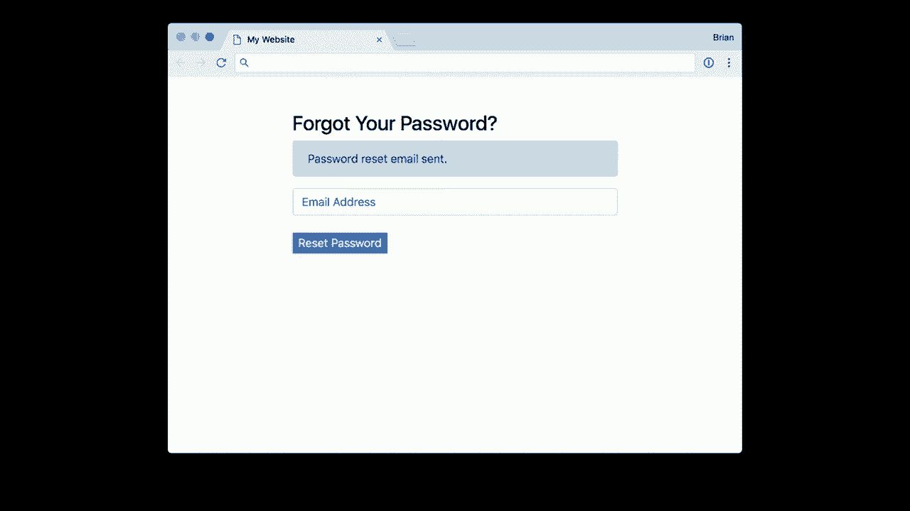
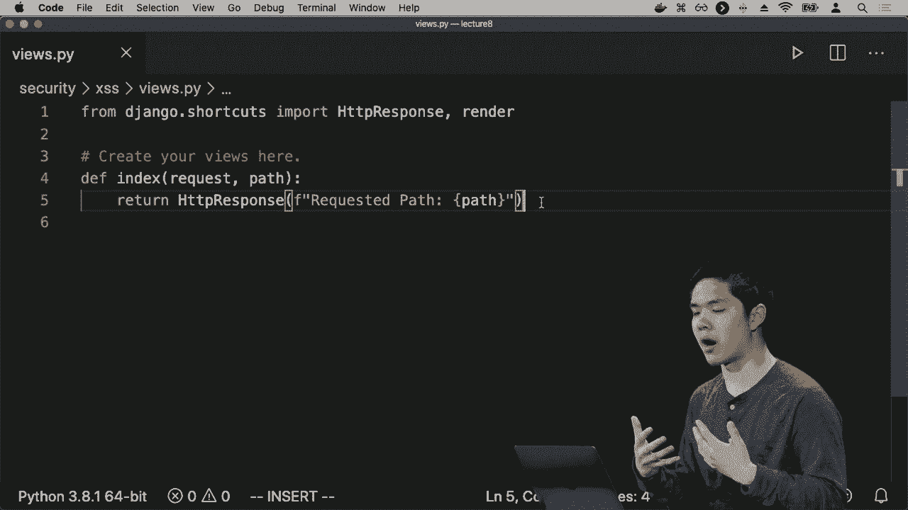
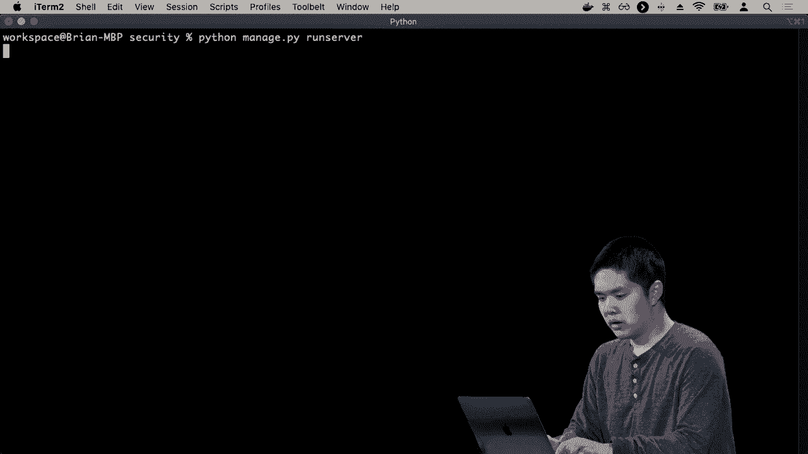
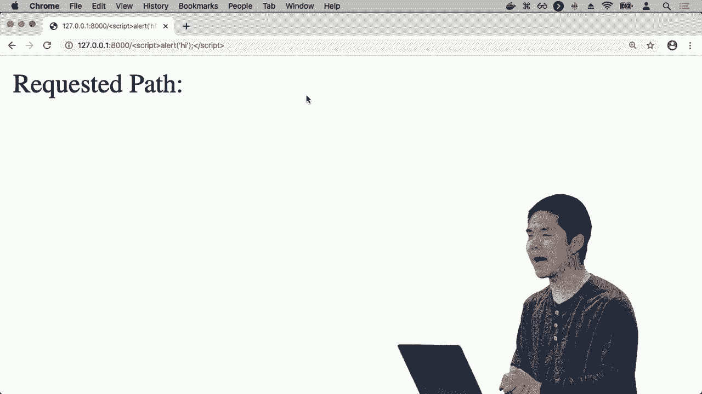

# 【双语字幕+资料下载】哈佛 CS50-WEB ｜ 基于Python ／ JavaScript的Web编程(2020·完整版) - P26：L8- 拓展性与安全 3 (数据库，JS) - ShowMeAI - BV1gL411x7NY

in with a username and a password for，example and so how might we represent。

that information about users and their，passwords well one way would be just a。

stored inside of a table like this，here's a table of user isn't every user。

has an ID they have a username and they，have a password but this turns out to be。

an incredibly insecure way to store，passwords to be storing passwords in。

what might be called plain text just to，literally store the passwords inside of。

a database and we should never do this，in practice because of the security。

vulnerabilities associated with it if，ever someone were to unauthorised get。

access to this database they would be，able to see all of the passwords for all。

of the users so if this database ever，leaked for whatever reason suddenly all。

of these passwords are now known and，this kind of thing does happen that if。

companies are not careful about how they，represent usernames and passwords inside。

of their databases 'm and if ever，there's sort of some sort of database。

leak suddenly a whole bunch of passwords，and could potentially be compromised and。

it's for that reason that the，recommended approach rather than store。

an actual password is to store a hashed，version of the same password using a。

hash function where a hash function in，this context is some function that takes。

a password as input and outputs some，hash some sequence of characters and。

numbers in this case that represents，that particular password a hashed。

version of the password but the，important thing about this hash function。

is that it's a one-way hash function，from the password you can get to the。

sequence of letters and numbers but it，is very very difficult to go the other，way around。

to use this information to figure out，what the original password actually was。

and so what this means is that the，companies won't actually know what any。

particular user's password is when a，user tries to log in what we'll do is。

take their password if they're trying to，login with will hash it and compare that。

hash against the hash that we've stored，in the database if the hash is match up。

that means the user probably typed in，their password correctly and therefore。

we can sign the user in and otherwise，that's a sign that the user did not type。

their password in correctly，so this then is the reason why companies。

if they're obeying these best practices，usually can't tell you what your。

password actually is if you forget your，password if you forget your password the。

company will let you reset your password，they can update the data inside of the。

table but the company won't be able to，tell you what your password actually is。

because the company doesn't know your，password the company only knows some。

hashed version of the password some，result of passing that password through。

a hash function and as a result they're，able to know whether you logged in。

successfully or not with the correct，credentials without actually knowing。

what your password actually is and so，this is another area where you might。

imagine that if you're not careful about，how you're storing this data it could be。

a security vulnerability inside of your，program wherever that data is leaked，passwords。

suddenly become known and there are，other more subtle ways that web。

applications could potentially leak，information that you as the web。

developer need to decide if you're ok，with or not imagine a website for。

example where you do have a place where，you can say if you forgot your password。

you can be sent a place where you can，reset your password for example you。

might imagine that if you type in your，email address click reset password you。

might get a message like all right，password reset email has been sent but。

you might imagine typing in an email，address and getting something like error。

there is no user with that email address，and here again is a potential security。

vulnerability in terms of leaked，information this page that just seems to。

send you an email if you forgot your，password is now leaking information。

about which users happen to have，accounts on your website in which users。

do not because all someone needs to do，is type in an email address and find out。

whether it results in an error or not in，order to know whether a user happens to。

have an account on the website or not，and maybe that's not a big deal if。

that's not something you care about，securing but if it's a website where you。

do care about making sure that if，someone has an account or doesn't have。

an account that information is kept，private and secure only to the user。

unless they want to share it well then，this type of page this type of interface。

with the database could potentially be，leaking that kind of information an。

information can be leaked in all sorts，of different ways you can even leak。

information just based on the time it，takes for the database to be able to，respond。

to a particular request that you might，imagine if you make a request about a。

user and it takes longer to respond that，might tell you something about the。

number of database queries it needs to，run or the amount of information that's。

stored about that user as opposed to if，a request takes less time so even。

something like how many milliseconds it，takes for a web server to respond to a。

request can reveal or leak information，about the data that is stored inside of。

the database and there have been，examples of researchers who actually try。

and see what information they can get，just from looking at these kinds of。

information that it doesn't seem like，would leak information but might。

actually reveal information as well now，another concern when dealing with sequel。

and databases we've talked about is the，context of sequel injection this threat。

where if you're not careful but how it，is that you run your sequel code you。

could inadvertently end up executing，code that you don't mean to be executed。

situations like here we're in a username，and password field we've seen this。

example before or if a user tries to log，in you might imagine a query like this。

is run selecting from the users table，where username equals whatever was typed。

in as the user name and password equals，whatever was typed in as the password。

and we saw how for a normal user someone，who types in like Harry and one two。

three four five as their username and，password and that this type of query。

works just fine but if a hacker tries to，log into a website and maybe includes a。

double quotation mark and two hyphens，for example where two hyphens mean a。

comment in sequel and we were to，literally substitute these values into。

our sequel queries well then you might，end up substituting hacker - - - -。

creating a comment that ignores the rest，of this query effectively ignoring any。

kind of password checking that we might，want our web application to be doing so。

this - another vulnerability that comes，about whenever we're dealing with。

executing sequel code inside of a，database and in order to deal with this。

we want to make sure that we're escaping，any of these potentially dangerous。

characters that might show up inside of，our sequel queries and Django's models。

do this for us that when we do these，kinds of queries using Django saying。

like dot objects dot filter to be able，to filter out for only certain versions。

of a particular model it is going to，take care of the process of making sure。

that it's not subject to，these kinds of sequel injection attacks，but if ever you're writing a web。

application that is directly executing，sequel code which you might imagine。

doing you do want to be careful about，making sure that you're not exposing the。

application to be vulnerable to these，kinds of threats as well so that then。

our potential threats to come about when，we're just talking about what's。

happening on the server but we also can，think about what might happen when we're。

interacting with other servers when，we're interacting with api's for example。

and so we talked about JavaScript and，using javascript to be able to make。

additional requests to api's or to other，services that are able to return back。

with certain types of information and，with API is there are a number of。

techniques that we can use in api's to，allow them to be more scalable to allow。

them to be more secure one is this，notion of rate limiting where we might。

want to make sure that no user is able，to make more than a certain number of。

requests to an API in any Pernik，particular amount of time this is in。

response to a security threat that has，to do with the scalability of a system。

which is known as or denial of，service attack where effectively if you。

just make a whole bunch of requests to a，single server over and over and over。

again you could potentially shut down，that system because you're making so。

many requests that it's not able to，handle that many requests all at the。

same time and for that reason because，it's so easy to make an API request you。

can do so using just a single line of，like Python or JavaScript for example。

the api's will often Institute some kind，of rate limiting to limit the number of。

requests you can make so that you're not，going to overwhelm the server or。

overwhelm the database that needs to be，queried in order to respond to those。

requests and so this kind of limiting，might work as well api's might also want。

to add some kind of route authentication，you might not want everybody to access。

the same data by an API maybe there's，some sort of permission model where only。

certain users are able to access certain，pieces of data from the API so you might。

imagine that a user needs to have an API，key for example some effectively like a。

password that they need to pass around，anytime they're making an API request to。

your API and that allows you to then be，able to look at that key and verify that。

they are who they say they are now with，those API keys comes other potential。

security vulnerabilities to be mindful，of one is that just as you should never。

be putting like passwords inside of your，source code inside of your git。

repository for example you likewise，generally shouldn't be putting your API。

keys inside of your web applications as，well inside of the source code of those。

web applications because then anyone who，has access to the source code for the。

web application can see what your API，key is could then use the API key to。

pretend to be you and therefore get，access to potential API routes that they。

should not be able to access one common，solution to this is to use what are。

known as environment variables where，effectively you and your program say。

that your API key is not going to be，some predetermined string that is in the。

text of your program but instead is，going to be drawn from the environment。

in which the program is being run and，then on the server when you're running。

the web application you'll first make，sure the server has all of those。

environment variables set correctly so，that rather than have the API key。

actually in the source code of the，program the API key is simply in the。

environment on the server where the web，application is running and the server。

can just draw that information from the，environment so that it knows what the。

API should key should be without the API，key actually having to be inside of the。

web application source code itself and，so as we begin to deal with api's you。

might notice that many api's will，require you to have an API key and often。

it's for these sorts of reasons to make，sure that we're able to authenticate。

users effectively and also to make sure，that we're able to limit users to make。

sure that they're not making too many，requests to the server or to the。

database at any particular time but this，then starts to get us into other。

potential vulnerabilities in particular，vulnerabilities concerning JavaScript。

JavaScript again as a programming，language that we use in order to write。

code that runs inside of our web browser，a browser like Chrome or Safari or。

something like that and as a result，JavaScript has a lot of power to。

manipulate things on the page it can，simulate the clicking of buttons it can。

change the content of what happens to be，on any particular page and as a result。

there are many many vulnerabilities that，come about when it comes to thinking。

about JavaScript and one such，vulnerability is this notion of，cross-site scripting that in general。

went on your，web application you only want javascript，to run if you yourself have written it。

cross-site scripting as a potential，threat where someone else might be able。

to get JavaScript code to run on your，website when it's JavaScript code that。

someone else wrote instead of you，yourself and this is a potential。

vulnerability because if someone else，can write the JavaScript code they can。

manipulate the contents of what happens，to be on your website make intentionally。

manipulate the user experience to get a，result that it's not actually desired so。

let's go ahead and take a look and one，example of cross-site scripting all。

right so I've prepared a web application，in advance，it's called security inside of which is。

a single Django app called XS x XSS for，cross-site scripting and inside of here。

we'll first take a look at the URLs so，there's a single URL that just allows us。

to provide any path and then it's going，to load the index view and on the index。

view we're gonna display an HTTP，response that says here was the path。

that just happened to be requested so，you might imagine this is a simplified。

version of what you might see on other，websites for example where websites。

might show you on any particular page，what path you're on in order to get to。

that page some sort of indication of。

where you are inside of this web，application so I'll go ahead and CD into。

security and run the server Python。

managed up I run server so I am now，running the server and now now I'll go。

ahead and go into my web application，/hello for example and so what I see。

here is requested path hello which is，what I would expect it to be I can。

change it to something else like hi，so here's requested path hi here's hi /。

- for example whatever page I visit it，gives me a page that says requested path。

and then whatever path I happen to be，visiting but watch what happens if I try。

and visit this URL instead I'm gonna，visit URL slash script alert hi and then。

end script so I run it and suddenly an，alert shows up on my page that says hi。

and then press okay and it says I。

requested path that alert was a，JavaScript alert it was javascript code。

running on my web application but it was，not code that was javascript code inside。

of my web application it was someone，else who wrote based on the URL to run。

particular JavaScript on my particular，page and so someone linked to my web。

application and passed in this script，tag as part of the URL，someone who clicked on that link might。

have been taken to my web application，but ultimately had JavaScript run that。

was created by someone else and that，ultimately is potentially dangerous it。

leaves open the possibility that someone，else could run JavaScript code on my。

page and it might not just be something，like a script you might imagine someone。

not just displaying an alert but，modifying something inside of the Dom。

changing the contents of the webpage，making API requests doing other types of。

tasks that you can do using JavaScript，inside of a web browser that ultimately。

leave my page open to potential security，vulnerabilities and so these are cases。

where it's important to be mindful of，when you're designing these pages if。

ever there's a possibility that someone，could inject their own JavaScript into。

your page somehow you'll want to either，detect that or escape it in some way or。

take other precautions to make sure that，this kind of cross-site scripting isn't。

going to be possible you might imagine，that in a messaging application for。

example if you're messaging back and，forth you don't want it to be the case。

that if you message someone else some，JavaScript code that when they receive。

it that code actually ends up running as，some JavaScript that runs on that。

particular page you want to be sure to，escape that information so that they。

just see the text of the JavaScript code，but the code isn't actually executed and。

this is a similar threat to that threat，of sequel injection it all comes back to。

the idea of not wanting to allow someone，else to be able to inject their own code。

into your program you don't want someone，else to be able to inject sequel code。

into the queries you run on your，database and you don't want someone to。

be able to inject JavaScript code into，your web page because that leaves open。

potential security vulnerabilities as，well one type of security vulnerability。

the Django is quite good at defending，again this is one that we've seen before。

but we'll explore them in more detail，cross，I request forgery where you fake a。

request to a website when you didn't，intend to actually make a request to。

that website so you might imagine that，if your bank for example had a URL that。

allowed you to transfer money from one，person to another person we've talked。

about this idea a little bit but imagine，now how you could implement this if it。

really was just a URL that you could go，to like slash transfer and say as get。

parameters Who am I transferring money，to and what is the amount that I'm。

transferring then someone else on some，other website could in the body of their。

page just have a link where that link，says click here and it links to your。

bank column or whatever your bank is，transferring money like to me in this。

amount and if some user unknowingly just，clicked on that link not knowing where。

it would take them this website might be，able to forge a request to the bank make。

it seem like the user had gone to the，bank and tried to initiate some kind of。

transfer and ultimately tried to，transfer money and it doesn't even。

necessarily need to be in a link how，else might you get some new request to。

happen inside of the web browser you，might imagine though it might seem a bit。

strange to put this inside of an image，image source the source of the image is。

this particular URL the banks transfer，page now doesn't really make any sense。

the transfer page is not an image but it，doesn't matter all an image tag is going。

to do is try to make a request to this，source URL to get that image and then。

try to display it in the users web，browser but the first part is what's。

important the fact that this source ends，up being requested by the web browser。

without the user having to click on or，do anything they might try and request。

from your bank on flash transfer this，particular request which might initiate。

some sort of bank transfer without the，user even realizing it and it's for that。

reason that we generally suggest that，anytime you're recreating a website that。

is going to allow for the manipulation，of some kind of state that allows for。

some change to happen something like，transferring money you don't want that。

to be via a get request something you，could just load in an image or load by。

clicking on a link that takes you to，another page you don't want that to。

happen because then it makes it very，easy for someone else to fake a request，to your page by just。

creating an image or linking to somehow，a website like transferring funds from。

one user to another so a solution to，this as we've talked about is that。

generally we only want post requests to，be able to manipulate something inside。

of the database to be able to actually，initiate a transfer from one user to，another user。

but even then this is not perfectly，secure that you could still be tricked。

into submitting a post request imagine，an adversarial website that had a form。

like this a form whose action was your，bank comm slash transfer and whose。

method was post and now here two input，fields whose type is hidden meaning you。

won't actually be able to see those，input fields when the user is looking at。

the page they'd only know about it if，they inspected the source code of this。

particular HTML page here there's a，hidden input whose name is - meaning the。

person I'd like to transfer money to，here's the amount the value that I would。

like to transfer and all the user is，going to see is a button that says click。

here they're not going to see either of，the input fields because they're hidden，button。

well then suddenly they're going to be，submitting a post request to the bank。

and initiating some transfer when they，didn't intend to now maybe this seems。

like oh it's not a big deal because the，user still needs to click a button and。

the user shouldn't be clicking on a，button if they don't know what the。

button is going to do well for one it's，probably reasonable to imagine that an。

adversary might embed this button inside，of a page where it looks totally safe to。

be able to click on a button but，moreover the user doesn't even need to。

click on it in order to submit the form，we can just add a little bit of。

JavaScript you might imagine that an，adversary could do something like this。

add an onload attribute to the body that，says when the body of the page is done。

loading go to document forms meaning all，of the forms for this webpage get the。

first one and submit it submit the form，and what that's going to do is even。

without the user doing anything even，without the user clicking on the click。

here button as soon as this page is，loaded this form is going to submit。

submitting a post request to the bank，and attempting to transfer funds from。

one user to another user and so this is，what we might call a cross-site request。

forgery where some adversarial website，has forged a request to our website and。

ideally we wouldn't like for that to be，able to happen so how did we guard，against this。

well what Django allows us to do and a，very common approach is to add a CSRF。

token a cross-site request forgery token，that is going to be regenerated for。

every session such that only if that，token is present will the transfer be。

able to go through so on our website we，can include the CSRF token inside of。

this HTML form and as a result make sure，that we're able to transfer money only。

when the CSRF token is present but if，some other website tries to forge a。

request they won't know what the CSRF，token should be because it changes for。

every session and therefore they won't，be able to actually forge a request from。

one user to another so all across the，various different tools and technologies。

we've been using python HTTP django HTML，in terms of creating these web。

applications using javascript and the，api so we might be interacting with。

there are security considerations all，throughout we've only touched on a。

couple of them here but just goes to，show how it's important to be mindful if。

you think about the practice of web，programming thinking about what you're。

going to add to your web applications，and what features your web application。

supports to think about what the，potential vulnerability is there are as。

well how someone might exploit your web，application in order to do something。

with it that they probably shouldn't and，as you take your web applications from。

applications that are just running on，your own local computer to applications。

that are running in some web server that，many people are starting to use these。

are the types of questions to start to，be asking how can you make sure the your。

web application is scalable how can you，make sure that your web application is。

secure so now that we've explored that a，lot of web programming what comes next。

in this course we've explored a number，of different tools and technologies and。

languages but there are many other web，frameworks and ways you can build web。

applications as well we spent most of，our time looking at the Django web。

framework written in Python but you can，use other programming languages to build。

web applications as well，express j/s for example is a very，popular javascript framework for。

building web applications Ruby on Rails，is a popular server-side web framework，that built。

using Ruby and there are many others as，well and they're also client-side。

frameworks used primarily with，JavaScript to be able to build user。

interfaces we've seen a little bit of，react to build dynamic and interactive。

user interface ISM other popular，client-side frameworks include angularjs。

and view j/s and a number of others as，well and then once you've built these。

web applications using any of these，server-side frameworks and client-side。

frameworks then you might imagine，wanting to take these applications and。

deploy them to the web and to do that，there are a number of ways we can do。

this as well a number of different，services including Amazon Web Services。

AWS Google cloud and Microsoft Azure，that can be used in order to deploy。

these web applications Heroku is a，service that uses AWS and tries to。

simplify the process of making it easier，to deploy your web applications and if。

your web application is really just，static it's just HTML and CSS and。

JavaScript well then you can use，something like github pages to be able。

to host a web application for free on，github zone servers instead and there。

are many other ways you can imagine，deploying web applications as well。

different services that you can use in，order to take the web applications that。

you have been building or web，applications you might build in the。

future and make them available on the，internet for others to be able to use as。

well so as we look back on the various，topics within web programming is。

explored we've seen a lot of tools and，technologies we can use that we can。

leverage in order to build interesting，web applications we started by taking a。

closer look at HTML and CSS diving into，how we can use that to describe the。

structure of our page and then taking，advantage of tools like sass that allow。

us to generate CSS that allows for much，more complex styling for our website。

that would have been much more difficult，to do with just CSS alone as we started。

to build larger web applications we took，a look at git version control tools that。

we can use in order to make sure that we，keep track of versions and changes we。

make to our code allowing multiple，people to collaborate on a project。

simultaneously we then took a look at，Python looking at various different。

features that the language offered，functions and in the conditions and。

loops as we've seen in many other，programming languages but also。

object-oriented programming the ability，to represent objects and methods and。

functions that operate on those，particular objects which proved。

especially powerful in the context of，dealing with data，web applications Django was the example。

of a web framework written in Python，that we use to very quickly be able to。

start up a web application that's able，to listen for requests and make。

responses Django has a whole lot of，features built-in that really make it。

easy to get started with building a web，application and in particular it makes。

it easy for writing web applications，that deal with data so Django allows us。

the ability to build models that，interact with sequel without us having。

to actually write any sequel code Django，can generate the sequel for us just。

using these models and migrations that，allow us to continually apply changes。

that we make to our database that as we，add new tables and add and modify。

existing fields on those tables Django，can take care of all of that after that。

as you'll recall we took our attention，towards the second of the main。

programming languages in the course，JavaScript which was has a lot of uses。

and is very very popular but we，primarily used on the client side to be。

able to build interesting user，interfaces using javascript to。

manipulate the Dom structure of the page，to change what it is the user sees them。

and also to add event handling so that，when the user clicks on a button when。

the user hovers over something when the，user interacts with the page in some。

sort of way our code is able to respond，to it and we saw react a web framework。

that your client-side framework that，uses JavaScript in order to allow us to。

create really interesting and，interactive user interfaces with not all。

that much code at all and then finally，in these last couple of lectures we've。

been looking at some best practices how，we can design tests test the test the。

server but also the client to make sure，that our code is working appropriately。

and also some industry practices like，continuous integration and continuous。

delivery that just helped to make sure，that as we make changes to our code。

we're able to deploy and deliver them，rapidly and effectively and make sure。

that we're able to make incremental，changes to our code base rather than。

need to wait on longer release cycles，and then finally today we've been。

talking about issues about scalability，and security especially important as we。

begin to take our application and move，them to the web we want to make sure。

that these applications are scalable，that they're able to handle multiple。

different users and also to make sure，that they're secure that we're not。

exposing ourselves to potential，vulnerabilities like someone who might。

inject sequel or inject JavaScript code，into our pages or who might try to。

access some data that they're not，to access we want to make sure that when。

we go about designing these web，applications we're able to do so in a。

scalable and ultimately in a secure way，so hopefully you enjoyed this。

exploration into the world of web，programming with Python and JavaScript a。

best of luck with the web programs that，you yourself might build with the tools。

we've seen here today and also other，tools that are inspired by or use。

similar tools and techniques and ideas，as the things that we've ultimately。

talked about here a big things to the，courses teaching staff and the。

production team for making this entire，class possible I look forward to seeing。

the web applications that you might go。