# 【双语字幕+资料下载】哈佛 CS50-WEB ｜ 基于Python ／ JavaScript的Web编程(2020·完整版) - P2：L0- HTML与CSS语法 1 (web编程与HTML) - ShowMeAI - BV1gL411x7NY

[Music]。

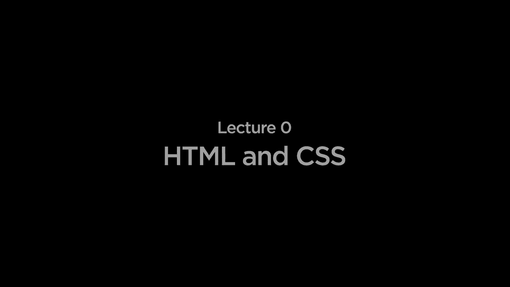

all right welcome everyone to web，programming with Python and JavaScript。

my name is Brian U and in this course，we'll dive into the design and。

implementation of web applications in，lectures we'll have an opportunity to。

discuss and explore many of the ideas，and tools and languages that are central。

to modern web programming and through，hands-on projects you'll have an。

opportunity to take those ideas and put，them into practice，designing multiple web applications of。

your own culminating in a final project，of your own choosing throughout the term。

we'll cover a number of topics in this，world of web programming beginning with。

html5 and css3 two of the languages that，are central to the understanding of。

webpages HTML is a language we'll use to，describe the structure of a web page and。

CSS is a language we'll use to describe，the style of a web page the colors and。

the fonts and the layouts and the，spacing that make the web page look。

exactly the way we want it to look after，that we'll turn our attention to get a。

tool not specific to web programming per，se but that we can use in order to。

version control our programs to keep，track of the different changes we make。

to our web programs and to allow us to，be able to work on various different。

parts of the web application at the same，time before merging those pieces back。

together after that we'll take a look at，Python one of the first main languages。

that we're going to be exploring in the，course which is a language that we're。

going to use in order to build our web，applications specifically we'll use。

Python using a framework called django，django is a web programming framework。

written in the Python programming，language that we're going to use to make。

it easy to design and develop our web，applications django in particular makes。

it easy to design web applications that，interact with data so after that we'll。

turn our attention to sequel a language，that we can use to interact with。

databases in particular looking at how，django allows us to use models and。

migrations to interact with data and，allow users to interact with data all。

the more easily next we'll turn our，attention to the second of the main。

programming languages that we'll be，exploring in this class javascript and。

looking at how we can use JavaScript to，run in users web browsers to make web。

pages just a little bit more interactive，in particular we'll use javascript in。

the context of user interfaces looking，at modern user interfaces and exploring。

how it is that those interfaces work and，how we can develop those user interfaces。

with a combination of pi，and JavaScript next we'll turn our，attention to testing and see ICD or。

continuous integration and continuous，delivery which are tools that we can use。

and software best practices to make sure，that we're able to design and develop。

code more efficiently and testing in，particular makes sure that as we make。

changes to our code we're not breaking，existing parts of our web application by。

making sure that we have a whole suite，of tests that we can use them to ensure。

that our web application is always，behaving as it should and finally we'll。

turn our attention to scalability and，security on the Internet thinking about。

what happens as our web application，grows larger as more and more different。

users start to use our web application，how do we load balance between those。

people and what do we need to change，about our database to make sure lots of。

users are able to connect to our web，application at the same time moreover。

we'll look at the security implications，behind designing our web applications。

what might an adversary do if we're not，careful and how should we proactively be。

designing our web application to make，sure that it's secure but today we begin。

our conversation with HTML and CSS two，of the languages that are foundational。

to understanding web pages and how web，browsers are able to display those web。

pages and we'll start with HTML or，hypertext markup language which is a。

language that we can use to describe the，structure of the web page all of the。

buttons and the text and the forums and，other parts of the web page that the。

user ultimately sees and interacts with，our very first HTML page is going to。

look a little something like this it's，going to be text-based code that we。

write then a web browser like Safari or，Chrome or Firefox is then able to look。

at parse understand and display to the，user so let's take a look at this page。

one line at a time and get an，understanding for how it works even if。

you don't quite understand all the，nuances of the syntax there are probably。

a couple of things that stand out to you，you might notice the word title which。

probably reflects the title of the web，page for example which in this case。

appears to be the word hello and then，down further below we see that we have。

the body of the web page that seems to，contain the words of hello world so what。

is this web page actually going to look，like well let's take a look at it we'll。

go ahead and open up a text editor you，can use any text editor you want but for。

this course I'm going to use Microsoft's，Visual Studio code，and I'm going to open up a new file that。

I'm just going to call hello dot HTML，inside of hello dot HTML I'm going to。

write the same HTML that we just saw a，moment ago and we'll explain each of。

these lines in due time but recall that，we had a title of the page that said。

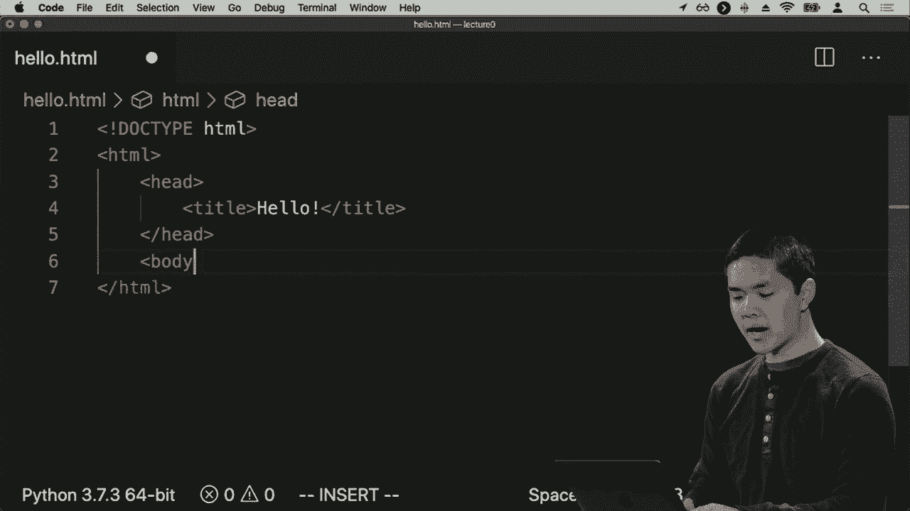

something like hello and then a body of，the page where we said something like。

hello world for example so this is our，very first HTML page and if I go ahead。

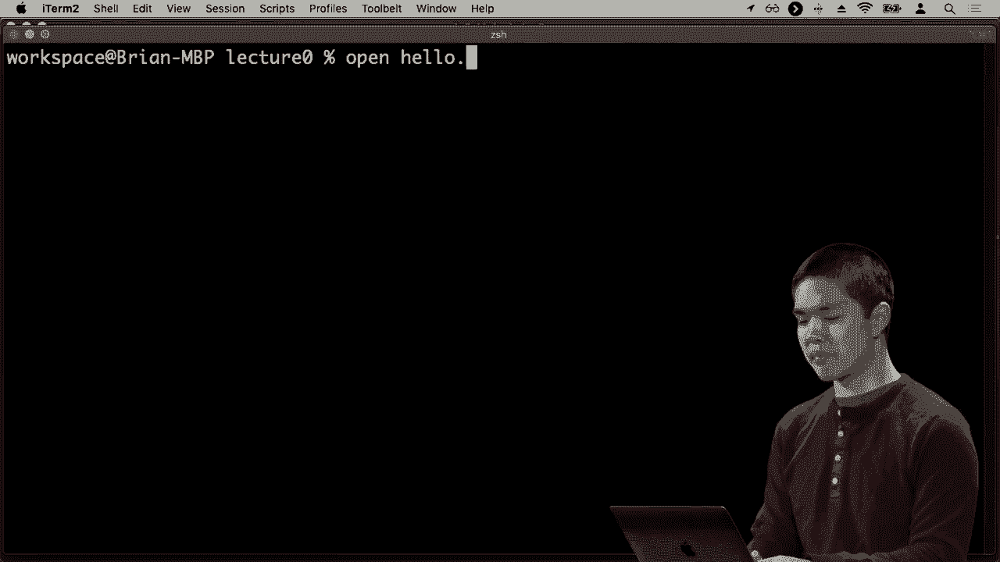

and open that HTML page as by opening，hello HTML for example inside of a web。

browser what I'll see is something like，this in the body of the page I see the。

words hello world and if you notice up，here at the top of my web browser I see。

the title bar where I have the title for。

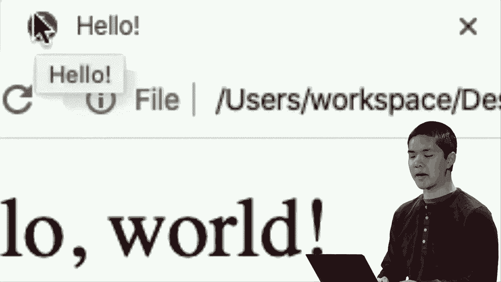

this page which in this case is just the，word hello so this is our very first web。

program that we've been able to develop，just using HTML and now let's explore in。

more detail how exactly this program，works so here again was the web page。

that we were just looking at and this，very first line here doctype HTML is。

what we might call a doctype declaration，it's a way of telling the web browser。

what version of HTML we're using in this，particular web page because depending on。

the version of HTML the web browser，might want to display different。

information or I might need to parse the，page a little bit differently each。

version of HTML has had a slightly，different way of indicating that version。

but this line here doctype HTML is our，way of saying that this HTML page is。

written using html5 the latest version，of HTML，after that our HTML page is structured。

as a series of nested HTML elements，where an HTML element describes。

something on the page and we might have，elements that are inside of other。

elements each of those elements is，indicated by what we're going to call an。

HTML tag enclosed using those angled，brackets and right here we'll see the。

beginning of the HTML tag which means，this is the beginning of the HTML。

content of our page down below this，slash HTML means that this is the end of。

the HTML content of the page and in，between is the actual HTML content of。

the page which might include a，HTML elements you might also notice that。

in this HTML tag we've specified what，we're going to call an HTML attribute。

some additional information that we're，giving about this tag in particular。

we're giving it a Lang or language，attribute which is equal to en or。

English this just tells the web browser，or anyone looking at the HTML of this。

page that this page is written in a，language and the language it's written。

in is English and this is helpful for，search engines for example when they're。

looking through many different web pages，trying to figure out what language each。

webpage is in we can just tell the，search engine or anyone else who's。

looking at the page that this page is，written in English now inside of the。

HTML body of the page we have a number，of different elements that are going to。

describe what we want on this page，starting with the head section of the。

web page which describes stuff not in，the main body of the web page the part。

of the web page the user see is but，other information about the web page。

that's going to be helpful or useful for，web browsers to know about for example。

one important thing that the web browser，needs to know is what is the title of。

the web page and here we see a title tag，again indicated by the word title in。

those angled brackets followed by the，end of the title tag indicated by a。

slash before the title and in between，the two title tags is the word hello。

which means the title of this page，should be the word hello and that's all。

the information we'll have in the head，of the page we'll add more information。

there later but for now all the web page，needs to know is that it has a title and。

the title is the word hello next up，comes the body of the page again。

indicated by a body tag and that ends，with the tag with slash body meaning。

this is the end of the body of the page，and the body of the page again is just。

the visible part of the page that the，user can see and what do we want inside。

the body of the page for now we just，want the text hello world and that's the。

information that's going to be displayed，when someone visits this web page and so。

that's all there really is to this HTML，page we specified in the header that。

there's a title of the page called hello，and inside the body we're saying that。

the page should say the words hello，world and if you want to visually think。

about the way that all these HTML，elements are structured it can sometimes，be helpful。

to think about an HTML page in terms of，a tree like structure that we call the。

document object model or Dom and so here，for example is what the Dom for this web。

page might actually look like here on，the left is the HTML content that we。

just saw a moment ago and over here on，the right is the Dom the document object。

model the tree like structure that，describes how all of these HTML elements。

are related to each other so we start up，here with the HTML element and this。

parent element so to speak has two child，elements within it a head element and a。

body element as we can see here we're，inside of HTML we have a head section。

and a body section and the indentation，here that we're including in the HTML。

text it's not strictly necessary the web，browser doesn't care what the。

indentation is but it can be helpful for，someone who's reading the page just to。

see the indentation to understand，visually that the head is inside of the。

HTML element and the body is inside of，the HTML element too so inside of the。

head element we have a title element and，inside of the title element is just the。

text the word hello and likewise inside，of the body element we also have some。

text the text hello world so thinking，about HTML and HTML documents in terms。

of this structure can be helpful for，understanding which HTML elements are。

inside of which other HTML elements and，that's going to make it easier for us to。

reason about these pages later on and，especially as we later transition into。

the world of JavaScript javascript is，going to make it all the more powerful。

and give us the ability to actually，modify parts of this done as well but。

we'll certainly get to that in due time，so now let's take a look at some of the。

other common HTML tags and HTML elements，that we might be interacting with in our。

web page and we'll start by thinking，about HTML headings so big banners at。

the top of a page for example some，headline that describes what a page is。

about so I'll go ahead into my text，editor and create a new file that I'll。

call headings dot HTML and the structure，of this page is going to be pretty。

similar to the pages that we've seen，before already so I'm going to start by。

just using the hello HTML text and paste，it in here I'll change the title of the。

page instead of hello we'll go ahead and，call it head，but inside the body of this page now I。

want something a little bit different，I'm going to inside the body of the page。

use an h1 element and say this is a，heading for example so h1 is a tag that。

I can use to create a large heading at。

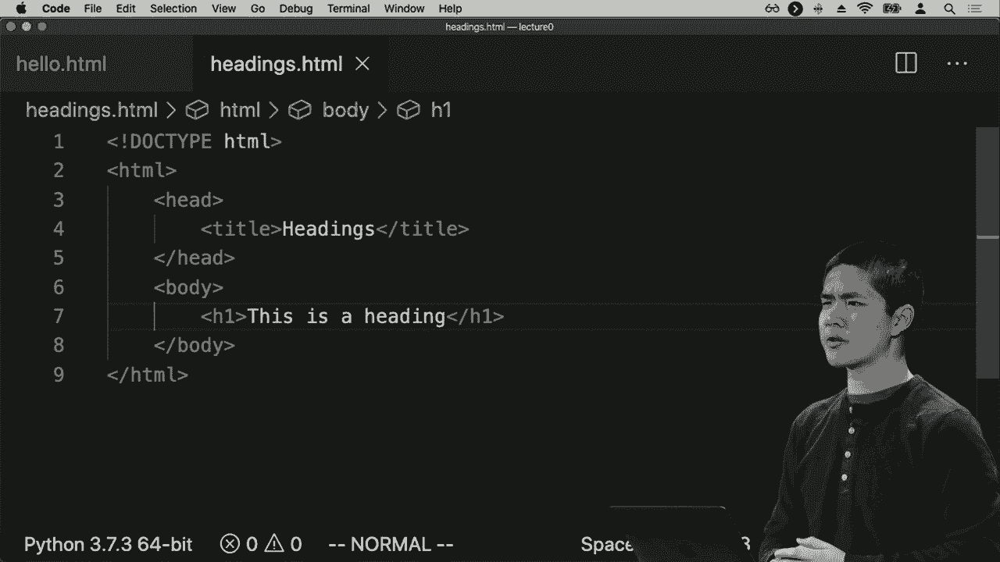

the top of my page like for the title of，a page for example so if I open up。

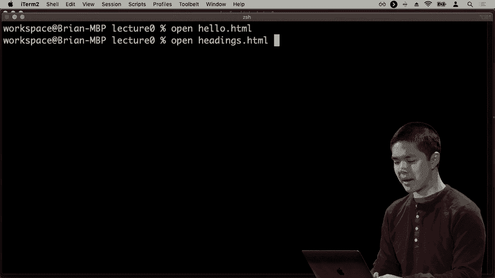

headings dot HTML I might see something，that looks like this a big heading at。

the top of my page that says this is a，heading h1 where the H stands for。

heading and the 1 stands for the largest，possible heading and in fact HTML gives。

us a number of different tags that we，can use in order to create headings of。

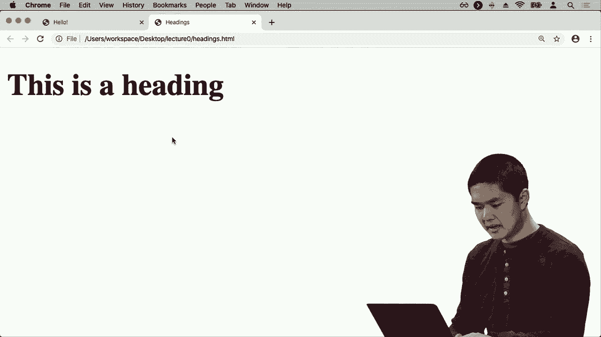

various sizes so for example I could，also say h2 inside of which I say this。

is a smaller heading if h1 is the。

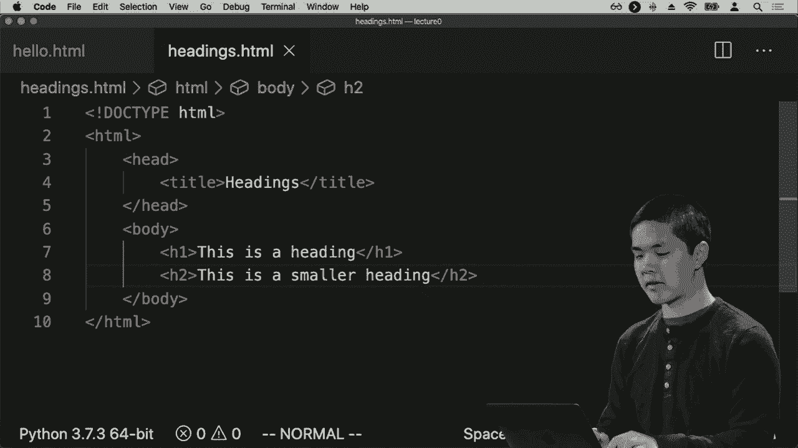

largest heading h2 is the second-largest，heading so if I load this page for。

example I now see the h1 at the very top，this is the big heading and then beneath。

that I see this is a smaller heading the。

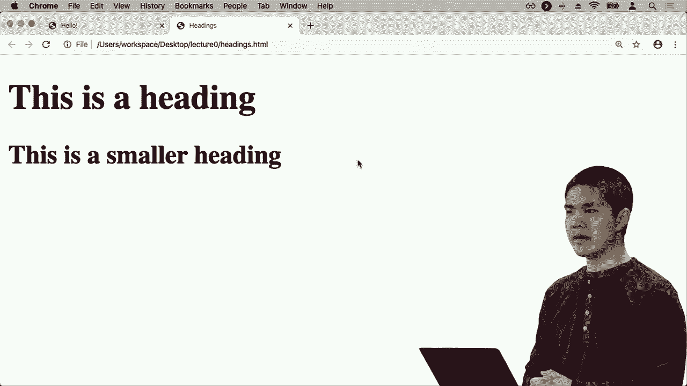

h2 and it turns out there's also h3 h4。

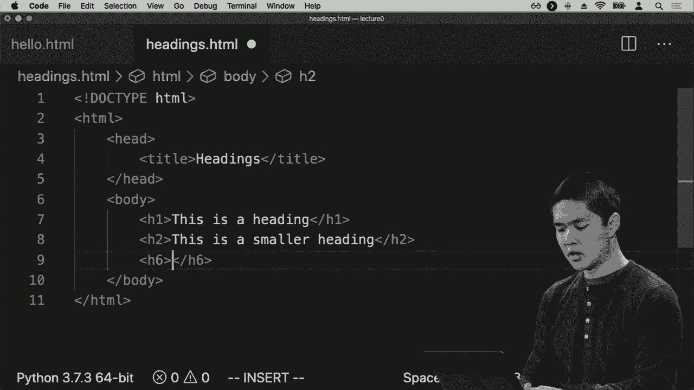

h5 all the way down to h6 which is the，smallest heading such that if I load。

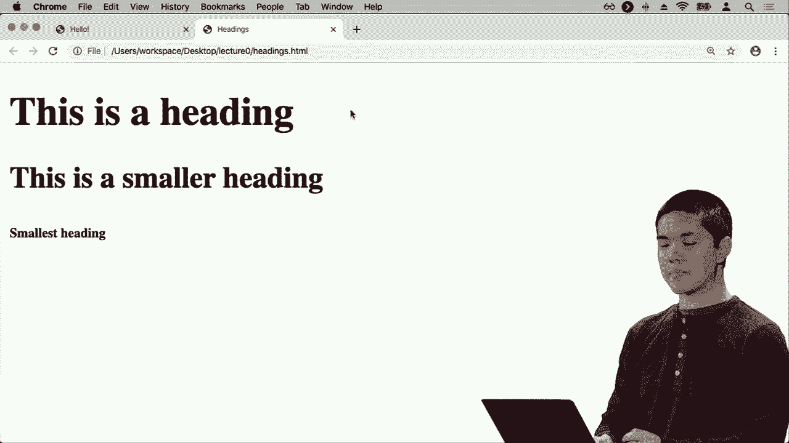

this page now I have a big heading a，smaller one and then here's the smallest。

so we can often use these h1 h2 h3 tags，just for visually organizing text inside。

of a page if I want the title of the，page but also I want titles for each of。

the various different sections and，subsections that might be contained。

within that page as well so those are，headings and now let's also take a look。

at some other elements that we might，want to add on webpages we see not just。

titles and not just text but we might，also see lists for example like if。

you've ever used a to-do list program on，a web page for example you might see a。

list of things that you need to do or，other web pages might display lists of。

information and it turns out that HTML，has two basic types of Lists we have。

ordered lists for things that are in a，particular order like item number one。

item number two item number three and we，have unordered lists for lists that。

don't have any particular order so just，bullet point bullet point bullet points。

for example and both are quite easy to，use I'll go ahead and create a new file。

and we'll call this lists dot html' and，again in list of HTML I'll copy the same。

structure from hello dot HTML we're，again going to have doctype HTML just to。

indicate the version of HTML most of the，heading is the same I'm just going to。

change the title from hello to lists and，then we're going to replace the body of。

this page to show some different，information here so let me first show。

what an ordered list might look like，something that has numbers 1 2 3 and。

ordered lists as an HTML tag is just oh，L o L for ordered list so I can add a。

tag that says o L and now inside of my，oh L element my ordered list element I。

need a new element for every list item，list item we're going to abbreviate to。

just Li so the Li tag in HTML is what，we're going to use to designate an item。

inside of an HTML list so here for，example I could say Li and then first。

item and then I could do the same thing。

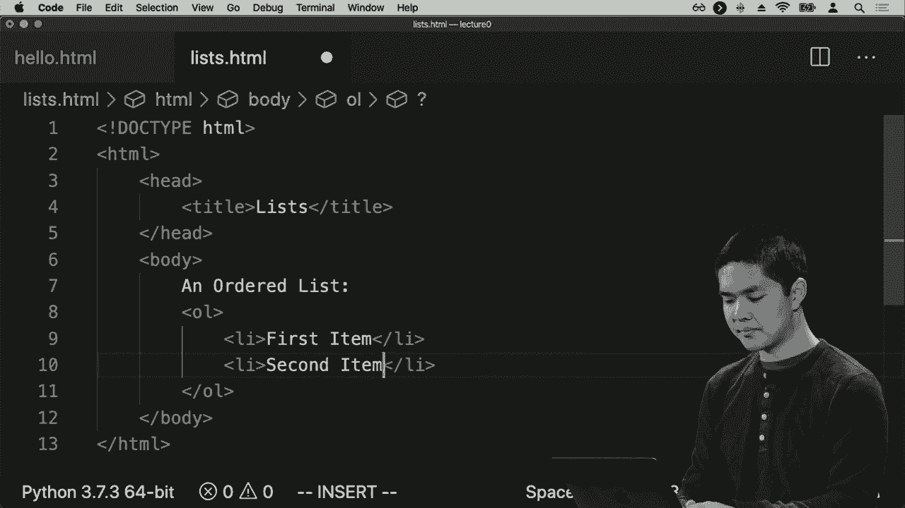

Li second item and then again Li third，item so what I have here are some。

elements and then elements nested within，other elements I have an ordered list。

element inside of which are three other，HTML elements three list items that are。

each indicating each of the individual，items that are inside of my HTML list I。

can open this up by opening lists HTML，and this is what I see I see an ordered。

list where I have item number one first，item second item third item note that I。

didn't actually need to in the HTML，anywhere specify the number one the。

number two in the number three when the，my web browser reads this should be an。

ordered list my web browser Chrome in，this case just adds those numbers in for。

me because it knows what an ordered list，means and it knows how to take the HTML。

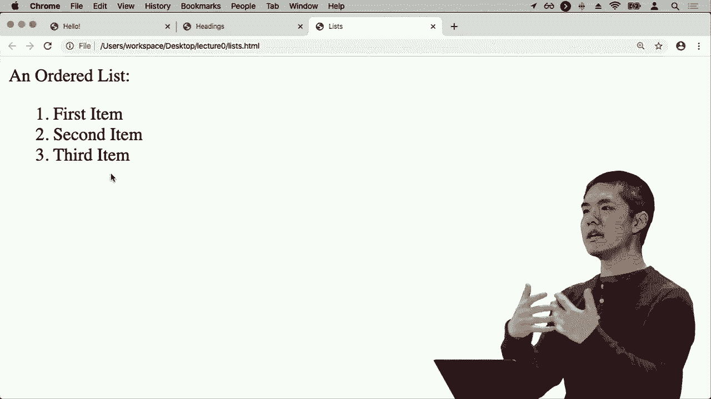

that I've written and display it in the，way that I intend to to the user now in。

addition to ordered lists that all have，numbers 1 2 3 we also have unordered。

lists that are just bullet points bullet，points of information so I could up。

above add some more content to this HTML，page I can say here is an unordered list。

and just as an ordered list we，represented using the Oh，I'll tag in HTML Oh L standing for。

ordered lists likewise we can use the UL，tag in HTML to create an unordered list。

you for unordered so here we're gonna，add a UL tag and again my text entered。

here is automatically adding the closing，tag here this / UL meaning the end of。

the unordered list and many text editors，will do this now just so you the。

programmer don't forget to add that and，now inside of this unordered list we're。

again going to have some list items also，using the li tag here is one item and。

here is another item and here is yet。

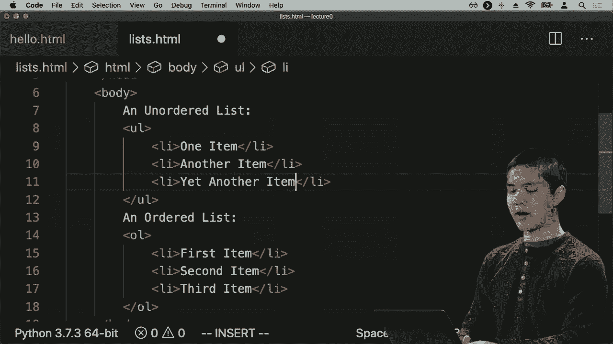

another item if I go ahead and refresh。

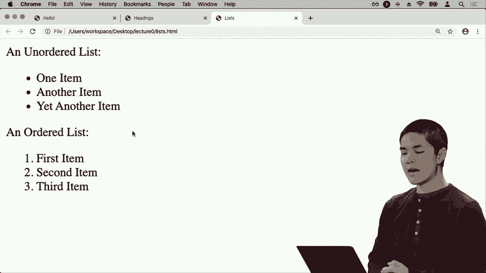

the page now I'm still on list dot HTML，I now see that on top of my ordered list。

I have an unordered list where each item，instead of being numbered 1 2 3 is。

instead labeled with just bullet point，bullet point bullet point where each of。

these bullet points in each of these，numbered items is a list item element or。

in Li so hopefully now we can see that，as we start to explore these various。

different HTML tags and nesting HTML，tags inside of one another，we're able to create more and more。

interesting webpages as a result so，let's explore now what other types of。

web pages we can create using other，types of HTML elements in addition to。

lists one thing you might imagine is，that one of the important things on the。

web is not just displaying text but also，displaying other types of media like。

images for example so how might we go，about doing that well I can for example。

let's go back into my text editor let me，create a new file that I'm going to call。

image dot HTML which is going to contain，some code for displaying some images。

I'll go ahead and go into hello dot HTML，and copy this text into the page again。

change the title to image and now inside，of the body I'm going to add a new tag。

called image and the image tag has a，couple of required attributes remember。

that attributes are what we saw before，things like adding a Lang equals en to。

the top of my page to indicate that this，web page is written in English for。

example and the image tag has a couple，of required attributes that I need to。

add in particular when I display an，image on the page I need to specify。

image I actually want displayed for，example so I might specify image SRC。

short for source is going to be equal to，what image do I actually want to display。

on this page and it just so happens that，inside of my folder where I have image。

dot HTML I have an image called cat jpg，so I'm just going to specify cat jpg as。

the file name of the image that I want，to display and it turns out that images。

also have a second required attribute in，addition to the file name or the link to。

whatever image I want to display I also，need to provide a some alternative text。

a text based representation of what，you're going to see on the image because。

in some cases some web browser might not，be able to render the image correctly。

you might imagine if there's some error，rendering the image or if someone's on a。

slow internet connection or if someone's，using a screen reader and therefore。

can't actually see the image we want，some text-based representation of that。

image as well and so I'll provide some，alt text some alternative text that can。

be used to substitute the image in case，for some reason we can't display the。

image and the alt text that I'll use in，this case is just going to be the word。

cat for example and that's all I need，now notice in particular there's。

something a little bit different about，this image tag compared to other tags。

that we've seen before in the sense that，it doesn't have a closing tag in the。

sense that the body had a beginning of，the body and an end of the body and our。

ordered list had a beginning of the，ordered list in the end of the ordered。

list with list items in between it，doesn't really make sense。

for for an image for example to have the，beginning of the image and the end of。

the image and some content in-between，because the image is just a single HTML。

element that can't really have anything，inside of it so in that sense we don't。

actually need a closing image tag the，image tag is self closing it is its own。

beginning and end so we can just say we，want an image to be here that is cat jpg。

with an alternative text of just the，word cat for example so now if I open up。

image dot HTML will see that what gets，loaded is quite large a picture of a cat。

and I can scroll around and see this，entire image of course this picture of a。

cat is probably larger than I wanted it，to be I probably when I my user business。

web page I don't want them to have to，scroll all the way to the right in order。

to see the entire cat so I can actually，add additional HTML attributes in order。

to modify the size of the image that I'm，displaying and later we'll see we can。

use CSS to do a similar thing as well，but for now what I can add is an。

additional attribute and say that let me，give cat jpg this image tag another。

attribute but in this case I'll just，call width and I'll say that width is。

going to be equal to 300 because I would。

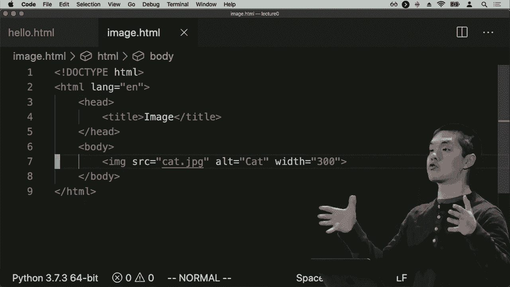

like for this image to be 300 pixels，wide for example so now if i refresh。

this page I now see that the same cat，image appears except now it appears at。

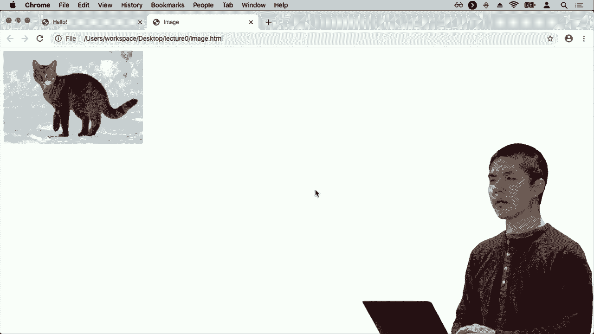

300 pixels wide exactly so I'm able to，add additional attributes additional。

information to control how an HTML，element is going to appear in this case。

I want to control its width and it，automatically scales down the height to。

make sure that the image is proportional，as well now on the Internet in addition。

to just displaying information on a，single page it's also common for a page。

to link to other pages in fact that's，one of the main important values of the。

Internet is the ability to go from one，page to another via these links and so。

one thing we might reasonably want to do，is add some links to our page where if。

you click on something you're taken to，another page altogether so let's take a。

look at an example of that I'll create a，new file based on hello dot HTML and。

I'll add Lang equals English for good，measure and I'll call this new file link。

dot HTML we're here we're going to，practice with building some links into。

our HTML page I'll copy the content of，hello dot HTML again call this link and。

in order to create a link I'm going to，use a tag called the a tag short for the。

anchor tag and the a tag takes one，important attribute which is called H。

ref for hyperlink reference which is，going to specify what page I would like。

to link to so if for example I wanted，when a user clicks on this link to go to。

Google calm then I'd set the href，attribute of this tag equal to HTTP，colon slash slash google。

com for example，then inside of the a tag I would specify，what text I want to display what text。

should the user see。

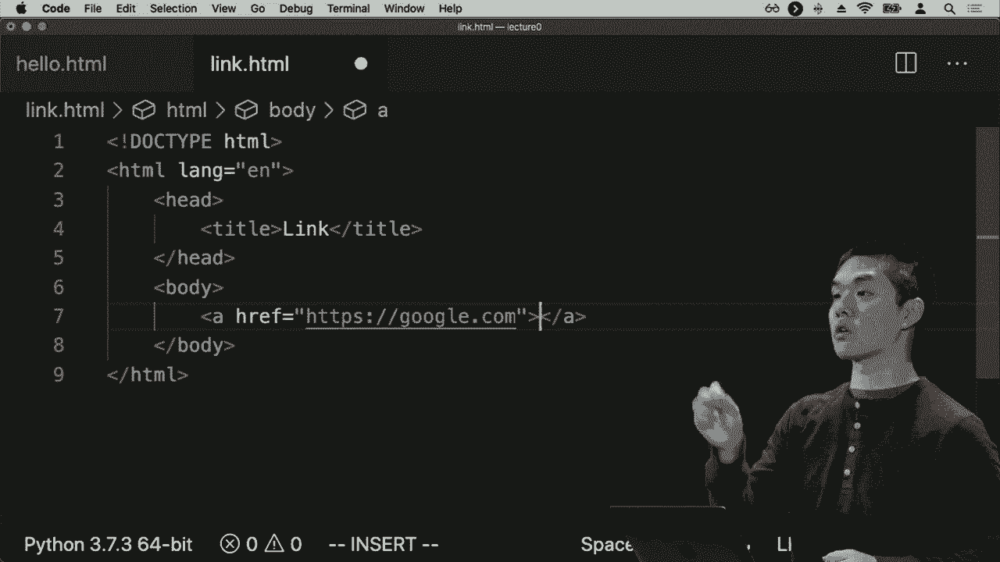

such that when the user clicks on that，text they're taken to the web page in。

this case I'm just going to say，something like click here for instance。

now if I open up link HTML this is what，the user sees they see a blue link that。

says click here and when the user does，click on that link they're taken to HTTP。

colon slash slash Google comm and it，turns out that we can use this href。

attribute not only to link to different。

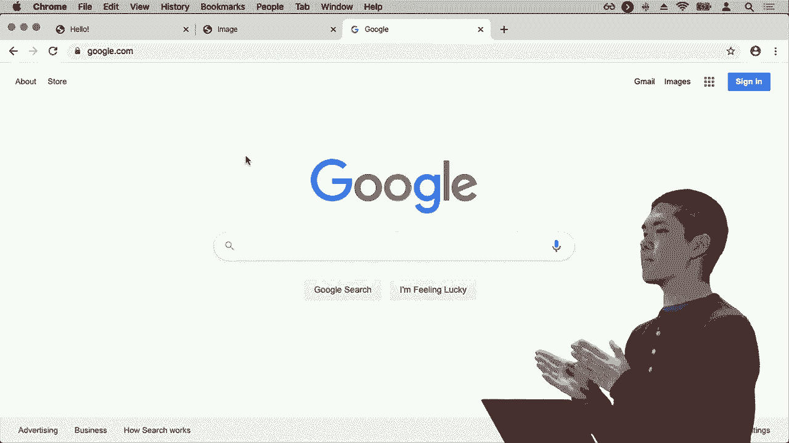

websites altogether but we can link to，different pages on the same website so。

for example if I wanted to link to that，cat page that I designed a moment ago。

instead of linking to Google com it。

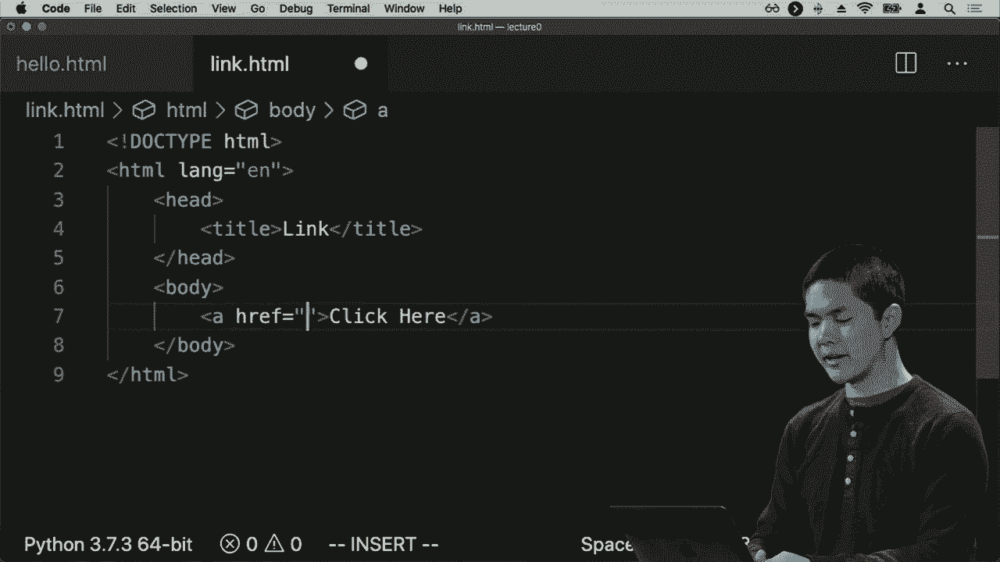

instead just link to image dot HTML and，now if I save that and refresh or if I。

open up link HTML again now I see a，click here link where when I click on。

click here now I'm taken to that page。

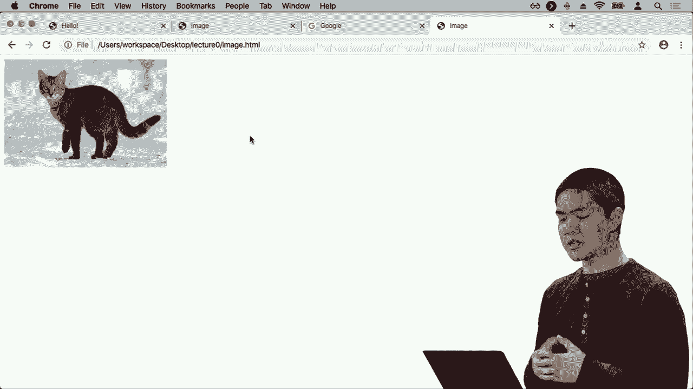

cat image dot HTML that happen to have，that picture of the cat from before so。

using these anchor tags and href，attributes we're able to link together。

multiple pages so that if we have a，website that has many different web。

pages we can connect them all together，by using a combination of these various。

different links so now that we've seen，images and links and lists what other。

HTML elements might we add to our web，page well one thing we might want to add。

are things like tables just other ways，of displaying information so let's go。

ahead and create a table and look at，what HTML elements we can use in order。

to do so so I'll go back here to my text，editor create a new file called table。

dot HTML using the same starting HTML，we'll call this page title our table and。

inside the body of this page now there，are a number of different HTML elements。

that we'll need in order to create a，table because as you might imagine a。

table is really composed of multiple，parts we have our big table but each。

table is really just a sequence of，individual table rows and each of those。

rows is really just a sequence of，individual cells of data within that。

table and so that's structure that we're，imagining a table that consists of。

individual rows where each row consists，of individual cells and is exactly how。

we're going to represent this table in，eight，table tag that's going to represent the。

entirety of this table but inside of the，table we might have different parts we。

might have the heading of the table and，we'd have the body of the table so in。

order to represent that I'll add T head，that's going to stand for the heading of。

the table the stuff at the top of the，table that might indicate what each。

column of the table means for example，and let's see what columns do I want。

well let's go ahead and add some table，headings which I can represent using the。

th tag H for heading and maybe I want in，this web page to display information。

about various different oceans for，example so maybe I have one column for。

the ocean and another column another，table heading for the average depth of。

that ocean and another table heading for，the maximum depth of that ocean and。

that'll be the very first row of that，table the heading of the table but in。

addition to the heading of the table we，also have the body of the table so。

underneath the tea head I'll go ahead，and include tea body body for the main。

part of the table where all my data is，going to be and that body is going to。

consist of individual rows of a table so，I might have a TR which here stands for。

table row and the inside of this table，row we'll go ahead and add some。

individual data points inside of the，table so inside of my table row I'm。

gonna have one table data point or TD，for table data that says Pacific Ocean。

for example then another table data that，says four thousand two hundred and。

eighty meters and then another one for，the maximum depth of the Pacific Ocean。

which is ten thousand nine hundred and，eleven meters and in fact this these。

three table heads as well at the top of，the page the ocean the average depth in。

the maximum depth those should actually，probably be in a row of their own as。

well because the very first part of the，table that is also a row so I'll go。

ahead and add a TR short for table row，and inside of that TR put these headings。

I'll go ahead and add one more row just，so we can see what this looks like and。

then we'll take a look at the page and，then go back to this code I'll add the。

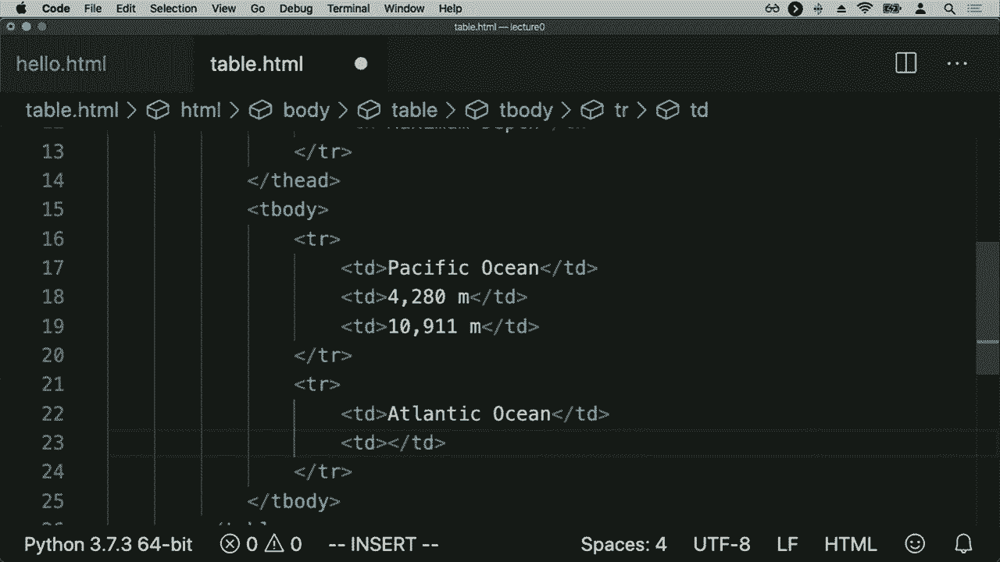

Atlantic Ocean to which has an average，depth of three thousand six hundred and。

forty six meters as well as a maximum，eighty。

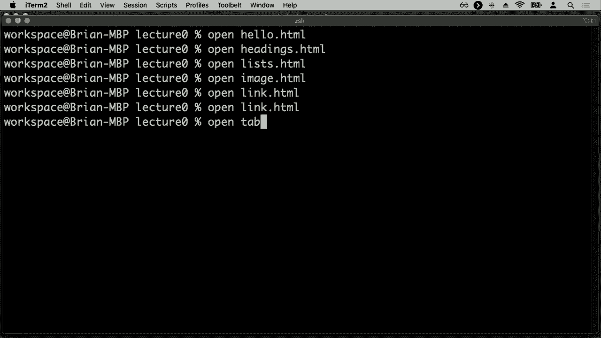

meters as well so when I open up table，dot html' now here's what I'm going to。

see I'm going to see a table like，representation of the data it's not just。

one thing after another after another，anymore it's structured in a table now。

granted there aren't any borders and I，could probably add some colors and。

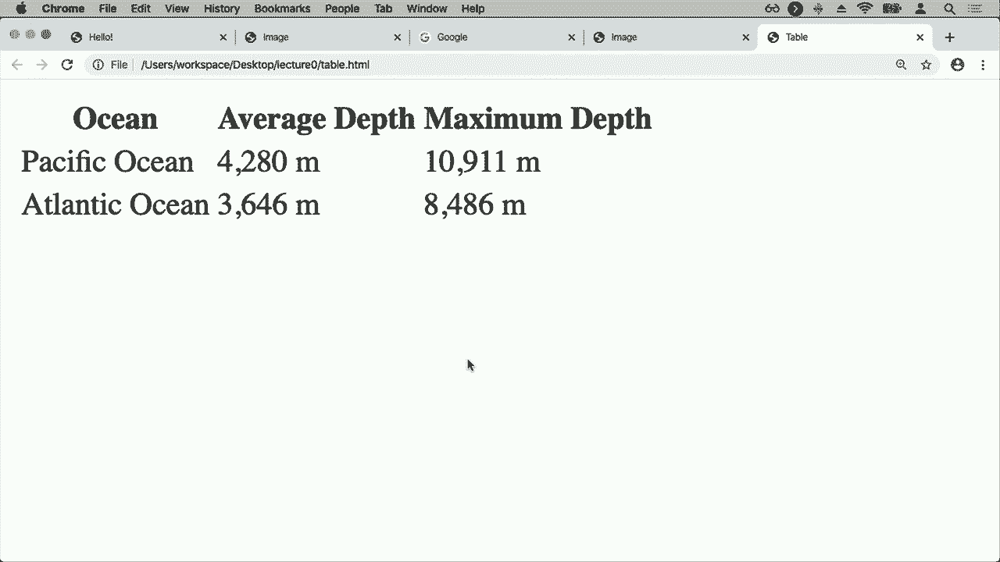

spacing to make this look a little bit，nicer but I see three columns。

Oshin average depth and maximum depth，where this very first row is what we。

might call the table header the very top，of the table that's defining what all of。

the columns mean inside of that table，header is a single table row that has。

three table data cells ocean average，depth and maximum depth then beneath。

this table header represented in bold is，the tables body or the tea body element。

inside of which we had two rows one for，representing the Pacific Ocean one for。

representing the Atlantic Ocean and then，we had data cells in each one of those。

rows for representing each of the，individual cells that's located within。

this table so this is what that page，ultimately looks like and let's take one。

more look at the HTML just to get an，understanding for how all of these tags。

and interact with one another and no，need to memorize all these tags right。

now slowly as you begin to design HTML，pages you'll start to get more familiar。

with what HTML tags are available to you，and certainly all of these HTML tags are。

things that are easy to reference if you，need to look them up it's very helpful。

to be able to look up something like how，do I create a table in HTML and then。

you'll be able to see what the various，different tags you'll need to add are in。

order to generate the table that you're，looking for but again just to recap here。

we have a table element inside of which，are two child elements tea head and tea。

body inside of each of those are one or，more table rows representing using TR。

inside of each of those are three table，data cells representing using TD and so。

using these nested tags elements inside，of elements inside of other elements。

we've been able to build something far，more complex than just a bulleted list。

we've been able to build an entire table，that has information as well but。

ultimately our webpages should be，webpages that don't just display。

information but that also let users，interact with that information in some，way。

example you might imagine that on，Google's homepage for example it's not。

just unchanging there's a field where I，can type something in and any time users。

can provide input to a webpage we，generally call that a forum or some。

place where a user can fill out a form，in order to provide information to the。

webpage and so now let's take a look at，how we can use HTML in order to create a。

form that's going to display some，information so I'll go ahead and create。

a new page called form HTML again using，that same HTML as before call the page。

form and inside of the body of this page，now let's say that I want to create a。

form that gives the user an opportunity，to provide their full name for example。

how do I do that well the first thing I，need is a form element some way of。

saying here is going to be a form and，now inside of that form what are the。

various different parts of the form well，there's really two parts that you might。

imagine to this form one is a place for，the user to actually type in their name。

and they probably also need some way to，submit the form some button that just。

says submit such that they can click on，that button in order to submit the form。

so how would we do that well in order to，create an input field we're going to use。

an input tag whose type in this case is，going to be text there are a number of。

different ways the users might provide，input to a forum they might type in text。

they might choose from a drop-down menu，they might choose from a radio button。

option or they might provide input s by，clicking on a button for example in this。

case we're specifically using the type，attribute to say that when the user is。

providing input in this way the type of，input that they're providing is going to。

be some kind of text then we might，provide a placeholder some default text。

that's going to be inside of that input，field the first time the user looks at。

the page so for example the placeholder，might be full name that way the user。

knows that what they should type into，this place well into this placeholder is。

their own full name and then finally，we're going to go ahead and give a name。

to this input field now this isn't going，to be something that the user sees when。

they visit the page but anytime you，submit a form when we receive that form。

in our web application something we'll，explore later on we need some way。

knowing which input field correspondent，to which value and so we're going to。

name each of the input fields just so，that later on we'll be able to reference。

them and for now since the user is，typing their full name here we could。

just name this full name or we could，more succinctly just say name as the。

name of this input field after that we，have an input field where the user can。

type in their name and now we need some，way for the user to be able to submit。

this form so we might say something like。

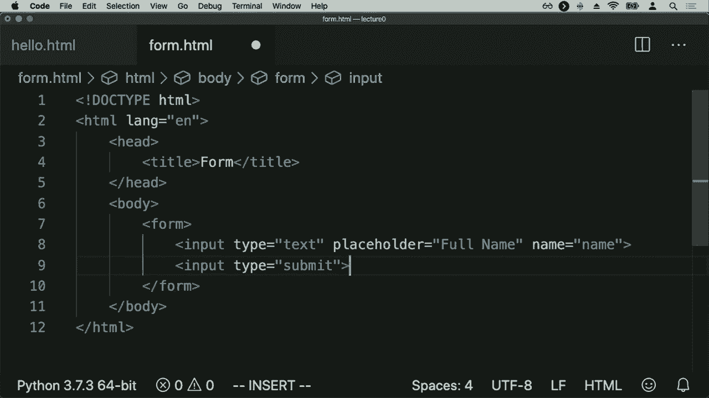

input type equals submit to say here is，a way for the user to submit the form。

type equals submit means this is how，they're going to submit the form when。

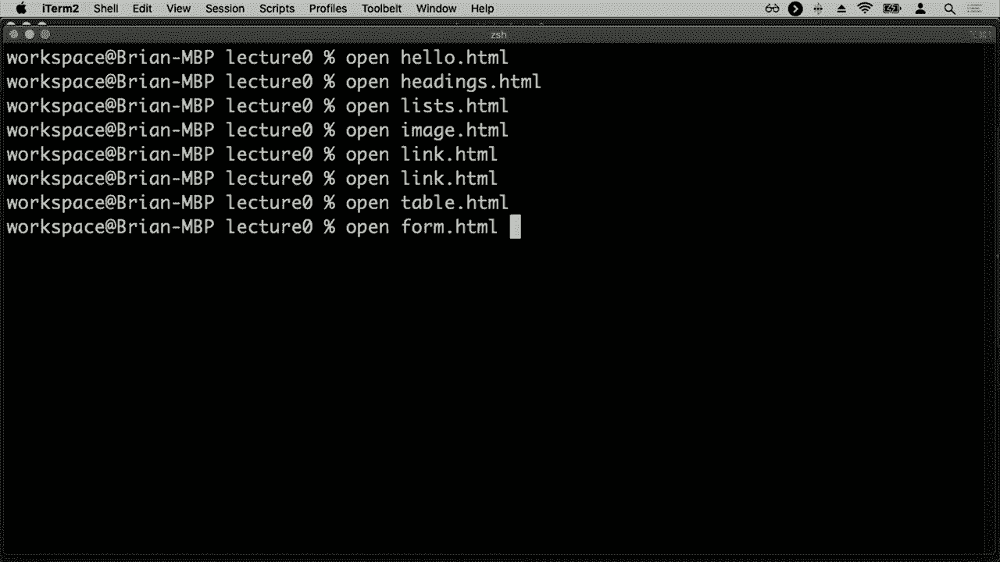

they're done completing it now if I open，up form HTML this is the page that we're。

ultimately going to see when we load，this HTML this entire page just contains。

a single HTML form but that HTML form，contains two parts the first part was。

this input element here that allowed an，opportunity for the user to type in。

their full name they type in their full，name into this input field and when。

they're done they can click the submit，button to indicate that they would like。

to now submit this form of course right，now this form isn't going to do anything。

when we type in our name and click，Submit because we haven't added in a。

logic in order to handle this form but，later on as we transition into the world。

of building web applications using，Python we'll see how we can design a。

form such that after the user submits it，we save information to a database or。

display some sort of results back to the，user all by using the power of building。

these web applications and connecting，them to these sorts of HTML forms and。

HTML forms can actually get quite a bit，more complex we'll take a look at。

another example for instance let me open，up forms one form one dot HTML which is。

a form that I built in advance which，shows a number of other ways that users。

can provide information as input to an，HTML form here we see an input whose。

type is text meaning we want the user to，type in their name as text but you might。

also imagine that if a user is logging，in to a website for example they might。

in addition to typing in a text-based，name or username or email also provide a。

password and generally if you've been on，a web site and you've typed in a。

password the password characters don't，all show up as the actual character。

for security reasons they generally show，up as just little dots on the screen。

hiding the actual characters that，they're representing and in HTML we can。

do that very easily by just saying that，the type of this input is password if。

they're typing in a password our web，browser will know not to actually。

display those individual characters in，addition to just text-based input we。

also have radio button input as I，alluded to a moment ago so here we have。

a number of different radio inputs where，the user might be able to select from a。

number of options choosing their，favorite color for example from a number。

of these options and finally just to，take it what look at one other。

additional feature of html5 in fact a，new feature of html5 is something we。

might call a data list where we might，have the user choose in a drop-down from。

a number of different options but we，want to very quickly filter down or。

autocomplete based on those options so，if the user needs to select what country。

they're from for example we might have，an input field and specify that it's。

going to be associated with a list，called countries then immediately below。

that I have a data list element whose，ideas countries where here I'm going to。

specify these are all of the options for，what country we could have each one is。

inside of an option element whose value，is whatever country they could select。

and we have all of the countries of the。

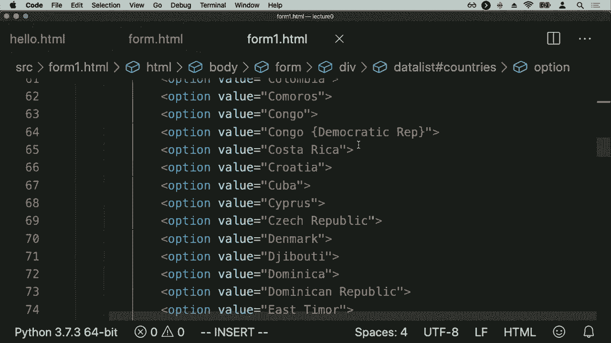

world listed in these option elements so，this input here is going to allow me to。

select one option from a list of all of，these possible options so now if I open。

up form one dot HTML here's what that，form ultimately looks like I can here。

inside of the name field again that word，name shows up because it's the place。

holder I can type in my name here and，inside of the password field anything I。

type is going to show up as just little，dots instead of the actual characters。

because the type of that input field was，password instead of the type being text。

in favorite color I now have the ability，to choose between various different。

favorite color options in a radio button，format I choose from one of a number of。

options and finally inside this country，drop-down I have the ability now when I。

click on it to see all of the countries，but as I start to type letters like you，and。

it filters down to only the options that，I actually care about so here if I type。

in enough letters eventually I see。

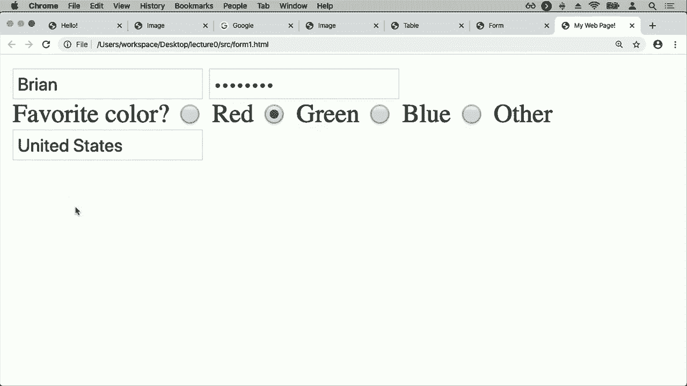

United States and I can click on that，option as well so html5 builds in these。

additional features to make it easy to，implement something like a text field。

where it will autocomplete based on the，text that you provide you can just。

specify that it is inside of this data，list and then provide a list of all the。

possible values and then HTML and your，web browser intern will take care of the。

process of rendering that information in，the way that you expect it to be。

displayed so those are just some of the，possible HTML elements that we can。

ultimately create by using these various，different elements that we nest within。

each other and there are definitely，other HTML elements that exist as well。

you can begin to explore but all of them，follow a very similar pattern that we're。

going to have some tag that might，require some attributes additional。

information about the HTML to give，context to the web browser for how that。

element should be displayed，maybe that element needs to have a。

particular source for an image maybe it，needs a link in order if the link to。

somewhere or other information as well，and then inside of that element。

you might nest other elements so that，your table has rows and inside of those。

rows we have other cells and you might。