# 【双语字幕+资料下载】哈佛 CS50-WEB ｜ 基于Python ／ JavaScript的Web编程(2020·完整版) - P4：L0- HTML与CSS语法 3 (响应设计，Booststrap) - ShowMeAI - BV1gL411x7NY

precisely define how we want our web，pages to be styled but one other thing。

we can use CSS for that's quite powerful，is responsive design and responsive。

design is all about making sure that our。

web pages look good no matter how you're，looking at the web page nowadays people。

aren't always looking at web pages on，their computers but they're looking at。

web pages on their mobile phones or on，their tablets as well and it's important。

as we begin to design web pages that we，design our web pages in a responsive way。

so we'll look at a number of different，ways we can implement responsive design。

in our web pages starting with the，discussion of the viewport and what the。

viewport is is the viewport is the，visual part of the screen that the user。

can actually see so the viewport is this，entire area of the web page that。

displays content to the user so one，question you might ask is what's going。

to happen when you take this page and，translate it on to a mobile screen well。

one thing that many mobile devices do by，default is treat their viewport as。

though it is the same width as a，computer screen because not all web。

pages are optimized from old device，mobile devices you want to make sure。

that on a mobile device you can see，everything and so many phones will take。

a web page like this and just shrink it，down to fit onto a mobile screen that。

looks a little something like that now，of course that's probably not really。

what we want it to look like ideally we，want our page to adapt to different size。

screens maybe we want the heading in the，image in the text if that's what these。

are to grow a little bit to fill that，entire screen and so one simple thing we。

can do is just to add a little line of，code to our HTML inside the head section。

of our page that controls the viewport，this line of code here is providing some。

metadata to our HTML page and saying I，would like you to change the viewport to。

be specifically the width of the device，by default many phones will use a。

viewport that's actually wider than the，width of device treated as if they're。

loading a page on a computer and then，shrinking it down to the size of a。

mobile device if you and your web page，specify though that you want the。

viewport to be just the device width off，times a page is going to look a whole。

lot better on a mobile device but in，addition to just adding a line like this。

there are other actual changes we can，make to our page to make it look a。

little better on different screens and，one of those has to do with media。

queries and media queries are all about，controlling how our page is going to。

look depending on how we render that，particular page or what size screen were。

rendering that page on so let's take a，look at an example of how we might go。

about do using media queries in order to，control what a page actually looks like。

depending on what type of page or what，type of browser were using to view it so。

I'll go ahead and open a new file that，I'll call responsive HTML because we're。

going to try and build a responsive web，page now and now I'll go ahead and。

inside the body of my page just include，a big heading that says welcome to my。

web page for example and just to，demonstrate what you can do now with。

responsive design is I could say，something like let me add a style tag。

here where I want to say that if the，size of the screen is a certain width。

then I want to style the page in one way，and if the size of the page is a。

different width then I might want to，style the page in a different way you。

might imagine that as you shrink the，screen you want to move elements around。

in order to rearrange them to make the，page just look a little bit nicer on a。

mobile screen so we'll do a very simple，example of just changing the color。

depending on the size of the screen so，let me specify now in a media query and。

the syntax for a media query looks like，this I'm going to use the @ symbol and。

say media and then specify for what type，of media I would like to apply this。

query I can say something like if the，minimum width of the page is 600 pixels。

in other words if the width of the page，is 600 pixels or anything larger than。

600 pixels well then go ahead and take，the body and give it a background color。

of red but then I could also add another，media query and say you know what for。

this media query let me give it a max，width of 599 pixels meaning if the size。

of the screen is 599 pixels or fewer，then maybe I'd like to take the body。

and give it a background color of blue。

for example so now let's take a look at，what happens when I take this page and。

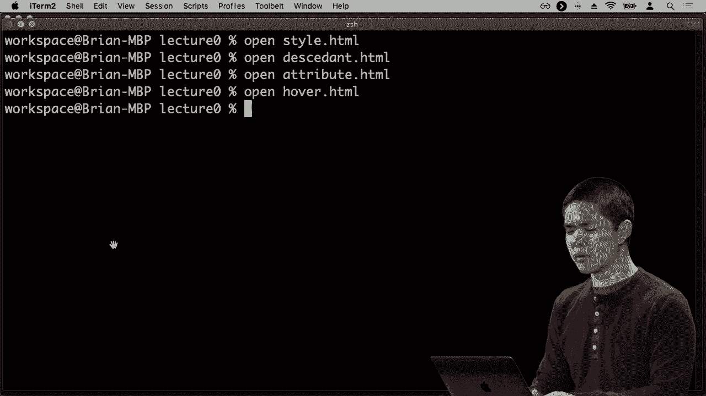

actually open it and see what's going on，I'll open up responsive dot HTML and。

here's what I see normally I see a red，web page because my screen is longer。

than 600 pixels wide but notice what，happens as I shrink this web page if I。

go ahead and shrink it looking at on a。

smaller screen eventually it turns to，blue if it's above 600 pixels wide it's。

going to be red and if it's below 600。

pixels wide the color changes to blue so，we're able to now use these media。

queries to really fine-tune the control，how our page is going to look on various。

different types of devices if it's on a，big screen maybe you want the elements。

to look a certain way if it's a smaller，screen maybe they look differently and。

you don't just need to control，background color you can control any CSS。

property you want just by using these，media queries you can say on a big。

screen you want certain amounts of，spacing or padding you can even hide。

elements on smaller screens if you want，to by using a particular CSS property。

called the display property that，controls whether or not an element is。

even visible and ultimately put together，this can help to make your pages a。

little bit more responsive and there are，a number of different media queries that。

we can apply to our page as well we can，check to see whether a mobile device is。

vertical or landscape we can check to，see whether the user is viewing the page。

on their computer screen or if they've，tried to print out the contents of the。

page as well so there are a number of，different options that we have to really。

control how a page is going to look，there are some other tools we have in。

our toolbox as well though for dealing，with mobile responsiveness and one of。

the tools built into the latest version，of CSS is something called flex box and。

flex box is quite helpful if we have，multiple elements and we're all trying。

to display on the same page at the same，time that might overflow if we're not。

careful about how we do responsive，design if we're really not careful let's。

imagine I have six elements that show up，on my computer's monitor when you。

translate that to a mobile screen you，can imagine they made all shrink down so。

that they're barely visible something，like this this is probably not what we。

want if we're trying to design a mobile，responsive page for example so you might。

imagine how can we do a little bit。

better well another thing we could do，is take these elements and go ahead and。

keep them the same size but make you，have to scroll through them this isn't a。

slightly better the elements are at，least still visible and they're large。

enough on the screen but it'd be nice，not to have to scroll through them what。

would be really nice is given that we，have all this extra space I would like。

to be able to wrap around elements if I，don't have enough space for them such。

that if I'm translating these six，elements to a mobile screen they。

translate but I get them in like two，rows for example three on the top and。

three below and flexbox is an easy way，to be able to implement something like。

this inside of our web pages so let's，take a look at what that might actually。

look like to add flexbox to our page so，I'll go ahead and create a new file。

called flexbox HTML we'll start with the，same HTML code and now inside of the。

body I'm going to create first a div，that is going to be called the container。

and we're creating a container because，we're going to specifically say that。

everything inside the container I would，like to add flexbox to to be able to。

wrap it around so the things can go on，to multiple lines if I ever need to and。

now let me just add some sample text so，this is some sample text inside of a div。

to demo flexbox and I'll go ahead and，repeat this maybe like 12 times。

it'll number each one here's one two，three four，and I'll number all the rest and this is。

just to give a demonstration of what，these elements could actually look like。

ideally these would be different pieces，of content though so now inside of my。

style tag here's what I'm going to say，just to demonstrate I'll say take the ID。

container again the hash tag specifies，get me something with a particular ID。

and I want to display it using flexbox，and in particular I would like to use。

the Flex wrap property to say if there's，not enough room at the end of a line for。

all of the elements go ahead and wrap，around those elements onto the next line。

instead and now I can specify some，additional CSS properties for the divs。

inside of the container I so I can say，for the container all of the divs inside。

of that container again using this child，selector to get all of the divs that are。

inside of the container I can add some，CSS to that too I can say let's give。

these a background color of like a shade，of green I can give them a particular。

font maybe 20 pixel font give them some，margin and padding just to add some。

space and maybe each one is going to be。

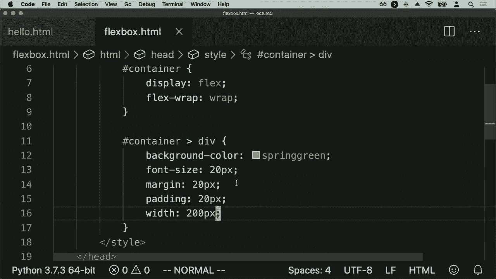

200 pixels wide so just adding some，spacing to those individual divs the。

important part is this right here where，I've said that this whole container is。

going to be a flexbox container and I'd，like to wrap around elements if you ever。

reach the end so now open up flexbox，HTML and so here I now see 12 elements。

that are on multiple lines but notice，what happens as I shrink the page if。

there isn't room for all of them。

elements move on to other lines now，there's only three elements in any。

particular row now there's only two，elements on a particular row and so I。

can use flexbox to very well adapt，myself to different sized screens and no。

matter whether you're looking at this on，a big screen or a small screen the。

content is still going to look good，because I'm able to adapt responsively。

to whatever might be happening so this，is one layout paradigm that exists。

within CSS this flexbox layout there are，other layouts that exist as well。

one common one is the grid layout for，anytime you want to arrange things in a。

particular grid or maybe certain columns，need to be certain whit's but others。

could maybe be a little bit more，flexible choice I'll show one example of。

that too just to give you a，demonstration of what that grid layout，might look like。

so here's grid HTML where I'll go ahead，and inside the body of this page give。

myself a div whose I'll give it an ID of，grid and then let me just add div class。

equals grid item again a class because，there might be multiple items but I'll。

go ahead and just create a whole bunch，of great items and number each one so 2。

3 4 5 6 7 8 9 10 11 12 so I have a whole，bunch of great items inside of a div。

whose ID is grid and now I'd like to add，some style here I'll say for the grid。

let's give it a background color maybe，gonna be a background color。

should be green a display is going to be，grid I want this to show up as a grid。

and now there are a couple of attributes，I'm going to or properties and I'm going。

to specify here maybe I want some，padding around the grid first but the。

important grid properties are grid，column gap how much space goes between。

each of the columns maybe I'll say like，20 pixels likewise there's also a grid。

row gap how much space goes between each，of the rows of the grid maybe I'll say。

10 pixels here and then finally grid，template columns is a way for me to。

specify how many columns that are going，to be and how wide should each of those。

columns be so if I want maybe three，columns I can specify that the first。

column should be 200 pixels the second，column should also be 200 pixels and the。

third column can be automatically sized，just grow or shrink to fill the screen I。

said we'll say Auto so first column 200，pixel is a second column 200 pixels。

third column just do it automatically，and now for all of the grid items。

well those I can add some styling to to，also well I'll give them a background。

color of white just to distinguish them，and also give them some font size and。

some padding and maybe Center them as，well so just adding some additional CSS。

properties in order to make it display，the way I want to but the important ones。

to care about here our display is grid，and then I'm specifying here's how the。

grid should be laid out how much space，between columns how much space between。

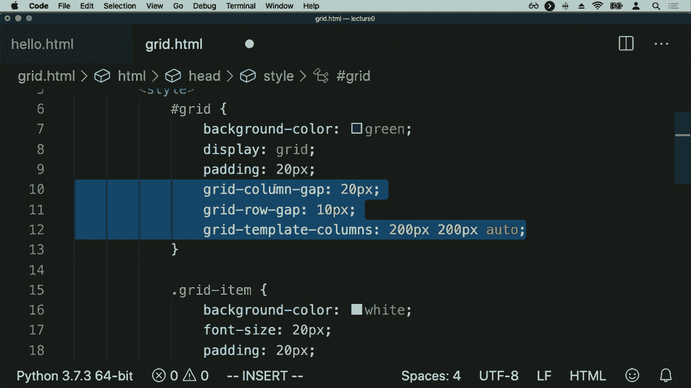

rows and how wide are each of those rows，going to be now if I open up grid dot。

HTML here's what that grid looks like I，now have a first column 200 pixels wide。

a second column also 200 pixels wide and，a third column that's going to resize。

dynamically based on how wide or how，narrow my screen happens to be so as I。

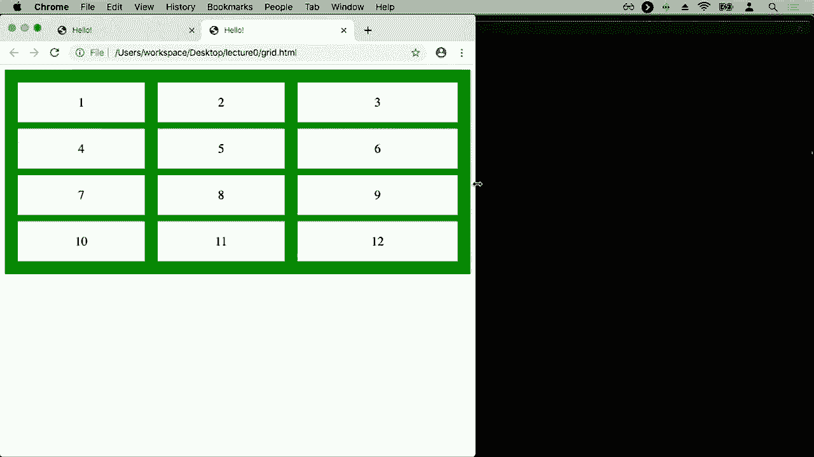

shrink the screen the third column，shrinks with it as I grow the screen it。

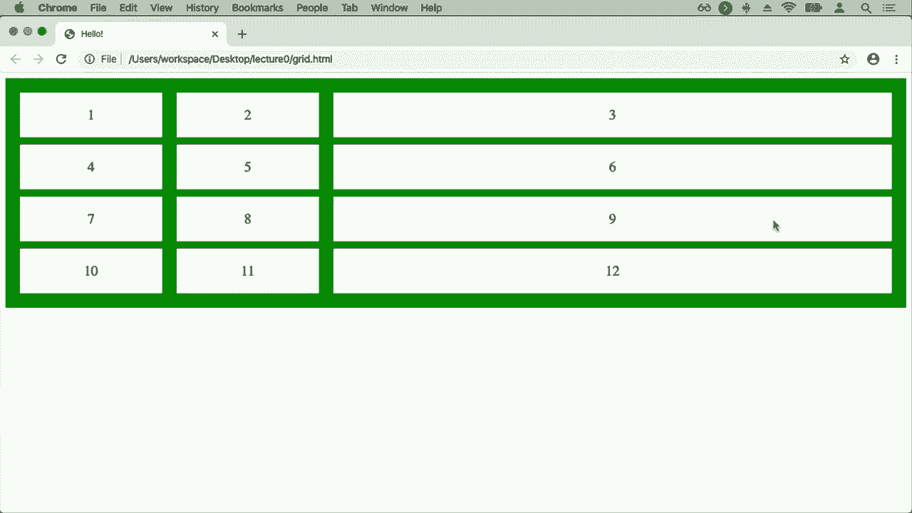

also grows alongside with how big this。

window happens to be and so flexbox in，grid are some very powerful tools that。

we can use just to make it easier for us。

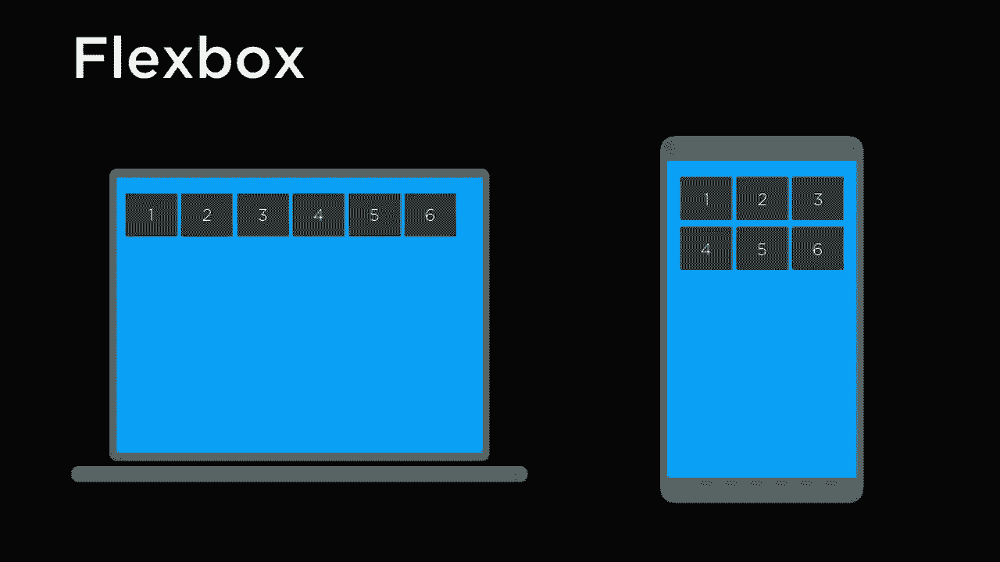

to be able to use mobile responsive，design to be able to make sure that our。

pages look good no matter what kind，of browser or what kind of device the。

user is using in order to look at our，page but it turns out that our exists a。

lot of libraries out there that do a lot，of this for us some people that have。

already written CSS code to make our，text look good to make our buttons look。

good in order to make sure that things，are mobile responsive and one of those。

is called bootstrap bootstrap is a very，popular CSS library that we can use in。

order to use some styling that they have，written such that we don't need to write。

all the styling from scratch so this is，what bootstraps website looks like I'll。

go ahead and show it to you now just to，give you a sampling for what's available。

inside of a library like bootstrap if I，go to get bootstrap calm here's。

bootstraps website and if I go to their，documentation on this first link here I。

can look at all of the bootstrap，components that I'm given access to。

these are things like alerts for example，that here's an alert that's styled in a。

very particular way it's in a specific，font it's gotten a certain amount of。

padding in certain colors and if I want，to just copy this alert once I've used。

bootstraps code I can just apply certain，classes to a div and bootstrap will。

handle the process of applying the right，styles for me I don't need to write all。

of these styles by myself from scratch，bootstraps written a lot of the styling。

already so how do you actually go about，using bootstrap well to get started with。

bootstrap all you need to do is copy the。

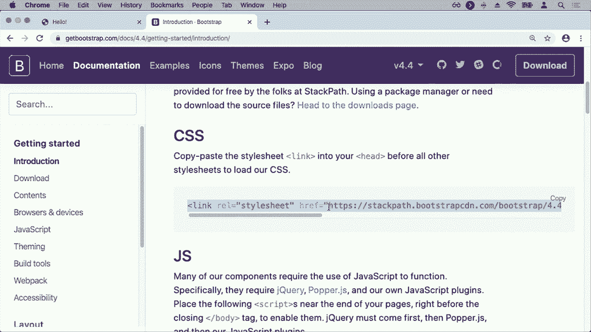

CSS link the bootstrap gives you to the，top of your file so if I take the CSS。

link and then go back to something like。

hello dot HTML which you'll recall，originally looks something like this。

just hello world，I can add some bootstrap to it to say。

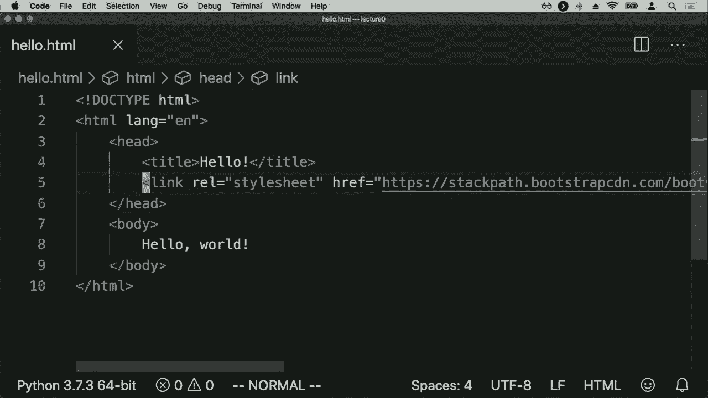

alright I would like to take this HTML，file and apply bootstrap styling to it。

to make it look a little bit nicer，so I refresh the page and now you'll。

notice bootstraps chosen a custom font，for me just to make things look a little。

nicer in bootstraps own eyes and now if，I want to add bootstrap elements I can。

say all right let me go to their，components and I want to add an alert I。

can just copy their alert code here's。

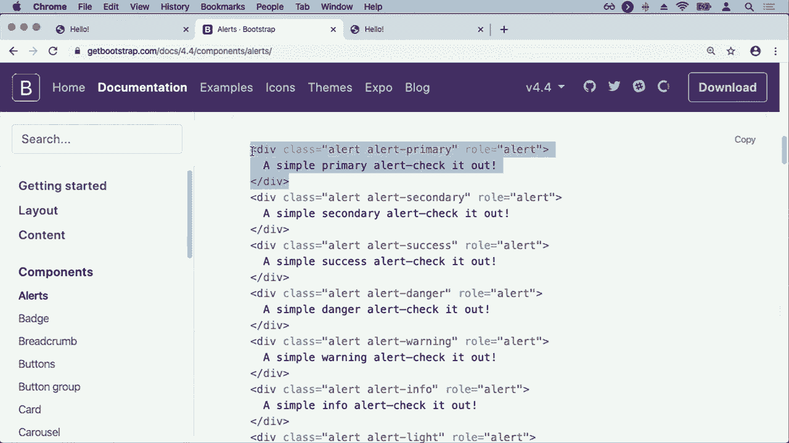

their alert code for a primary alert an，alert that looks blue and I can just。

inside the body of my page go ahead and，add an alert and maybe change the text。

here is my alert for example now when I，reload hello dot HTML I now see an alert。

that shows up styled according to，bootstrap styling and again I can change。

that styling just by changing these，classes so a primary alert shows up as。

blue a success alert shows up as green a。

danger alert is red so if I want to give，a danger alert the user is doing。

something wrong on the webpage for，example I can change alert primary here。

inside my HTML to something like alert，danger instead and now when i refresh。

this page I now see the alert shows up，as red instead of blue so bootstrap。

gives us access to a lot of these，various different types of components。

different ways of adding breadcrumbs and，alerts and carousels and other elements。

to our page just to make it easy to make，our page look good very very quickly。

without having to worry too much about，writing our own CSS because bootstraps。

written a lot of that for us bootstrap，even includes a way to make sure that。

webpages are mobile responsive using，something called bootstraps column model。

so I'll show you an example of that now，bootstrap divides its page into twelve。

distinct columns so one thing I can do，is I've pulled this up in an example I。

have an advanced called column zero HTML，notice that inside of the body of my。

page now I have a div whose classes，container and then a div whose classes。

row and bootstrap divides every row into，a twelve unit column。

so here for example I have a whole bunch，of divs that are each three unit columns。

so if I have four three unit columns，that will take up a total amount of，space equal to 12。

meaning filling up the entirety of the。

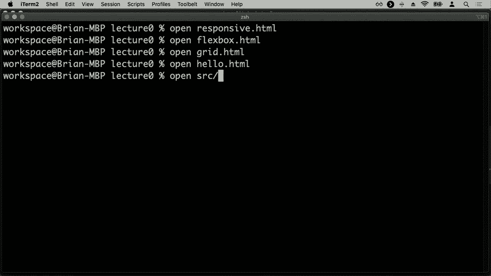

screen so if I now open up source，columns zero dot HTML here's what that。

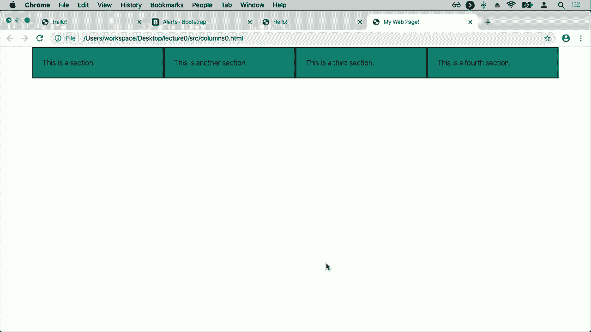

looks like I have four columns each of，which is of width three and as a result。

as I shrink it those columns will，automatically resize to make sure that。

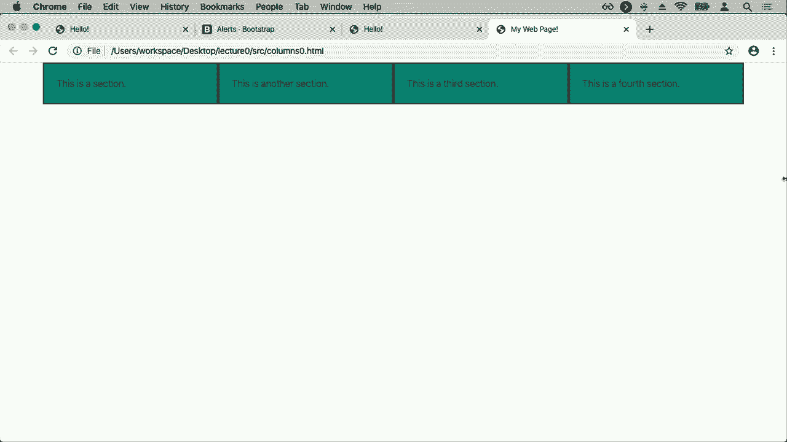

they're always the appropriate size now，as long as they add up to 12 they don't。

all need to be the same size so for。

example if I only wanted three columns，instead of four I could get rid of the。

fourth column by deleting those rows and，maybe change the second column in。

set of to being a column of size three，let's make it a column of size six so。

there's a length six column instead and，now if i refresh the page now suddenly I。

see three columns where the middle one，is twice as large as the ones on either。

end and as I shrink this down，I can see that it shrinks down as well。

and one of the advantages of using，bootstrap columns is that they too can。

be mobile responsive they too can wrap。

around to other lines if they ever need，to so for example let me pull up columns。

one dot HTML here for example I have a，row and let's take a look at what's。

going on in here recall that every row，in bootstrap is divided up into twelve。

column units but bootstrap in addition，to letting me specify how many units a。

column should take up also lets me，specify how many units that column。

should take up depending on the size of，the screen so if I'm on a large screen。

as indicated by LG this is saying that，on a large screen this div should take。

up three units of space and this day of，should also take up three units of space。

and for each of these four divs on a，large screen each will take up three of。

the total twelve units of space so，they'll all show up on one row what。

happens on a small screen though well，here call SM for column on a small。

screen I've said on a small screen each，column should only take up should take。

up six units of space six or half of the，total twelve that I have in the row and。

so I use up six here six here for a，total of twelve and one row which means。

the next two also a size six need to go，on to a second row and bootstrap is，***********。

figure out how exactly these elements，should ultimately be laid out so now if。

I open up columns one dot HTML and see，what's there on a large screen I see。

four columns all on the same row but as。

I found a smaller screen eventually，we'll see that things change I now see。

the third and fourth sections，move down on to the second row because。

on a smaller screen now when the caught，when the window is smaller now I only。

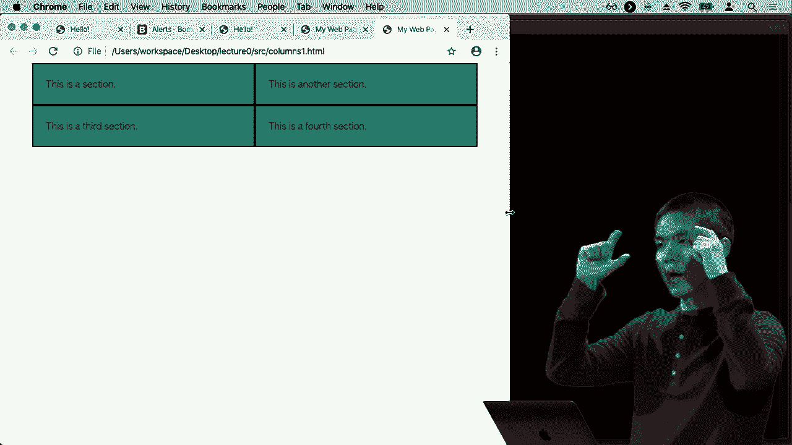

have the ability to show two elements in，first，and then two on the row underneath that。

so all in all there are a lot of，different ways to know that we can use。

CSS in order to make sure our pages are，mobile responsive we can use bootstraps。

column model to make sure that columns，move around whenever a size of the。

window shrinks or grows and we can also，use things like flexbox。

and the grid model writing our own CSS，to make sure that our page is responsive。

depending on the size of the screen that，the user happens to be using in order to，visit our web page。

so these are some of the very powerful，features that we get using just CSS but。

one thing you might imagine is that as，we begin to write more and more CSS。

there's going to be more and more，repetition things that appear again and。

again and again and we've already seen，in some ways that we can minimize。

redundancy in CSS we've seen how we can，move CSS into the Style section of our。

web page we've even seen how we can move，CSS to an entirely different file。

however what we haven't yet seen is how，to deal with other types of redundancy。

and so let's take a look at an example，of that now let's imagine for example。

that I want to style multiple different，elements in different ways but using。

some common properties so for example，let me create a new file that all in。

this case call variables HTML and you'll，see why in a moment I'll go ahead and。

copy hello dot HTML but I'll get rid of，all this bootstrap inside of it let's。

imagine that here I have in maybe two，lists an ordered list and an unordered。

list where my unordered list has，unordered item maybe three unordered。

items and my ordered list also has three，ordered items again just for sake of。

demonstration I'm showing that we have。

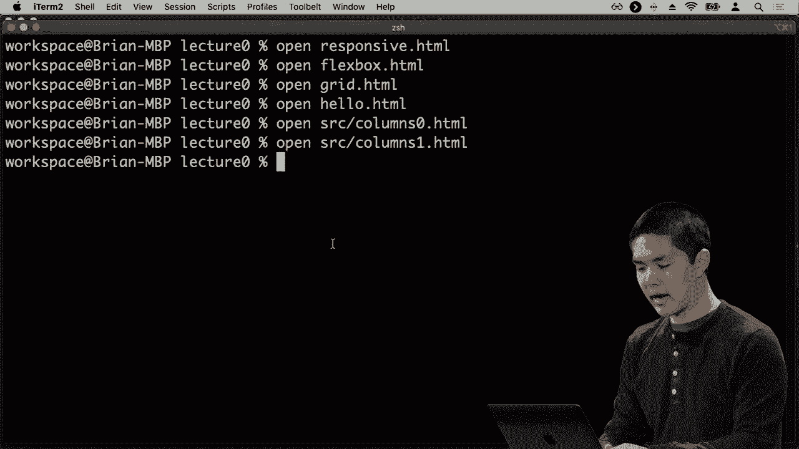

these two lists now and I'll open up，variables HTML just to give you a sense。

for what that could look like we have，three unordered items in an unordered。

list three ordered items in an ordered，list let's imagine I wanted to style。

these a little bit differently maybe，inside the Style section of my page I。

want to style the unordered list to have，a font size of 14 pixels and maybe a，color of red。

and my ordered list I would like that to，have a font size of maybe larger 18。

pixels but also a color of red I want to，keep the same color for all the text but。

I want the font sizes to be different，now if i refresh this page here's what I。

see they are indeed of different sizes，the ordered list items are larger than。

the unordered list items and they're all，red but there was some redundancy some。

repetition that was introduced when I，was writing my CSS code in particular。

when I was writing my CSS code I've，repeated this usage of the color red if。

I ever want to change the color from red，to blue for example I'm going to have to。

change my code in two different places，ultimately I'd just like for my CSS to。

be a little bit more powerful and so，that brings us to our last topic today。

which is a language called sass and sass，is a language that is essentially an。

extension to CSS it adds additional，features to what CSS has to offer just。

to make it a little bit more powerful，for us to be able to use and manipulate。

CSS in a way that's going to be faster，and remove some of the repetition that。

we might have had in CSS previously and，one of the key features of sass is the。

ability to have variables so let's take，a look at an example of this now I'm。

going to create a new file normally when，we created our CSS files we call them。

like variables dot CSS something dot CSS，to stand for a CSS file sass is a。

different language though so it's going，to require a different extension we're。

going to conventionally use dot s CSS to，stand for this is a sass file so here's。

now variables that dot s CSS and now，what I can do in sass is I can actually。

create variables in the same way that we，could create variables in a programming。

language like Python which we'll see in，C CSS normally doesn't support variables。

but sass is going to give us that power，in sass all variables begin with a。

dollar sign so I can create a variable，dollar sign color to create a variable。

called color and I can say the variable，called color is going to be equal to red。

so this line here line one is my way of，telling sass I'd like to create a。

variable called color and I'd like for，its value to be red and now I can add。

the same styling I had before，I can just use normal CSS and say for an。

unordered list I'd like the font size to，be 14 pixels but the color instead of。

saying red here I can use the name of a，variable I can say dollar sign color to。

mean go ahead and use the value of the，variable color as the color for this。

unordered list then for an ordered list，I'll also say font size 18 pixels and。

say color should also be this variable，called color by using a variable I've。

removed the repetition rather than，having the word red show up in multiple。

places in my code where I would need to，change it twice if I ever needed to。

change it now I have defined the，variable once and I only ever need to。

change it in one place if I ever need to，make modifications to this particular。

file so now let's try and link this file，instead of we'll go back to variables。

HTML instead of putting the style code。

here I'll go ahead and link a stylesheet，and say the href should be variables s。

CSS because that's the file where my，styling exists so now let me try and。

open up variables HTML after I've linked。

the CSS and all right something seems，not quite right I specified font size as。

I specified that everything should be，read but it's not showing up everything。

is showing up black and I don't see any，of the differences in sizing and the。

reason for this is while the web browser，things like Chrome and Safari and。

Firefox can understand CSS they can't by，default understand s CSS or sass sass is。

an extension to CSS that web browsers，don't understand out of the box so in。

order to solve this problem once we've，it，chain convert it translate it so to。

speak from sass into plain old CSS so，that our browser is able to understand。

it and so you'll need to in order to do，this you'll need to install a program。

called sass onto your computer you can，install it on Mac or PC or Linux and now。

in the terminal in order to do this，compilation I'm going to say sass。

variables dot s CSS the file I'd like to，compile colon variables dot CSS。

so variables got SCSS is the file that I，would like to compile and the file I'd。

like to generate is variables dot CSS，I'd like to turn my sass file into a。

plain old CSS file I'll go ahead and，press return and the write that。

compilation process is now done and so，now inside a variables data HTML instead。

of representing the s CSS file I'm going，to reference the CSS file as the style。

sheet because my web browser only，understands CSS it doesn't understand。

sass now when I load the page now I see，the result I expect everything shows up。

as red and the font sizes are different，so ultimately this was a two-step。

process I first needed to take my sass，code compile it into CSS and then I。

could link the CSS to this particular，page but the advantage now is that if。

ever I want to make some sort of change，I want to change the color rather than。

change it in two places or you might，imagine in a more complex page like tens。

or dozens of places I just go to the CS，CSS file and I change the color from red。

to blue now if i refresh the page all，right everything is still red and it's，because I forgot a step。

I changed the sass file but that doesn't，automatically change the CSS file I need。

to now recompile the CSS file by saying，sass variables des CSS variables dot CSS。

to compile the file again using the。

updated sass file and now I see the，updated changes and if you're curious as。

what the updated file looks like I'm，actually look at variables dot CSS to。

see what code happens to be there and，though it's styled a little bit。

strangely you can see that I have a ul，with a font size of 14 and a color of。

blue so they've substituted the word，blue for this variable and they've done。

the same thing for ordered lists as well，now in practice it's going to be pretty。

annoying if I'm building a web page，building using sass if I constantly need。

to go back and recompile my sass into，CSS every single time what I'd like to。

do is just automate that process and，sass makes it easy to do this I can just。

say sass - - watch variables that a CSS，variables dot CSS，and what that's going to do is now you。

see sass is watching for changes sass is，going to monitor the variables dot CSS。

CSS file and if ever I change my sass，file sass is going to know about it and。

it's automatically going to recompile，the corresponding CSS file and you can。

do this now just with single files but。

entire directories as well if you have，multiple different sass files so now。

what I can do is if in the variables s，CSS file I change the color instead of。

blue I now want it to be green for，example I now save the variables that s。

CSS file and now without doing anything，take a look at my terminal sass detected。

a change to variables s CSS so it gave。

me a new version of my original CSS file，if I go back to my web browser now。

refresh the page now all of the text is，green as I would expect it to be so。

that's one of the very powerful features，that sass gives us it gives us the。

ability to add variables to our CSS code，just to factor out commonalities if。

there are collin fonts common colors，common borders common styling that i。

want to apply to a lot of different，things it becomes much easier just to。

use sass in order to do so and finally，we'll take a look at a couple of other。

features that sass gives us the ability，to do one of them is the ability to nest。

CSS selectors inside of other CSS，selectors so one thing you've seen so。

far for example is that in CSS if i，wanted to style all of the unordered。

lists that are inside of divs for，example i could say like div arrow。

unordered list in order to style，unordered lists that are inside of divs。

what CSS what sass will do is that will，give us a bit of a nicer syntax for。

doing this type of thing in particular，by allowing us to nest CSS inside of。

other pieces of CSS so just as an，example of this i'll go ahead and open。

up a file i already brought called，nesting HTML and so here's what we might。

see inside of nesting dot HTML here's，the body of the page inside the body of。

the page I have a div inside of which is，a paragraph inside the div and also a，list in。

ordered list or ul that's inside of this，div as well and then we also have a。

paragraph that's outside of the div and，a list that's outside of the div in。

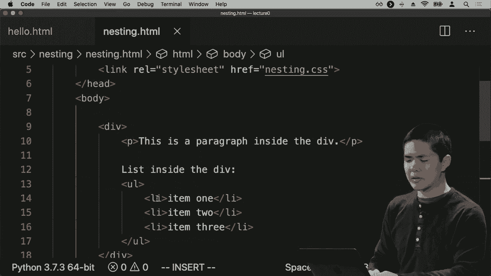

addition to that so a number of，different elements some of which are。

located inside of other elements and，what I'd like to do is be very precise。

about how I style these pages，what sass is going to allow us to do is。

it lets us write a sass file that looks，a little something like this。

let's take a look at what it's doing，it's saying for the entire div I would。

like to give that div a font size of 18，pixels and then what CSS normally。

doesn't allow us to do but we can do now，using the power of sass is say for any。

paragraphs that are inside of that div，go ahead and give those paragraphs a。

color of blue and for any unordered，lists that are inside of the div give。

those unordered lists a color of green，by nesting these CSS selectors inside of。

others we've been able to get across the，idea that I only want to style the。

paragraph if it is inside of a div and，this is just a little bit of a nicer。

cleaner syntax for doing some of these，more complex styling tasks that might。

come up so what does this actually look，like if I like take this as CSS file and。

turn it into normal CSS what is the，result going to be well let's take a。

look we can try it out by let me go into，my nesting folder where all these files。

are located and if I run sass nesting。

data CSS turn it into nesting dot CSS，now let's open up nesting CSS and see。

what it looks like here it's turned into，take all of the divs that give them a。

font size of 18 pixels and then we're，using the same descendant selector。

notation that we saw before where all，the paragraphs inside of Dizz should be。

colored blue all the unordered lists，inside of a div should be colored green。

and this certainly works and we could，have just written this CSS from the。

beginning but it can be a little bit，cleaner a little bit easier to read to。

use sass in order to really say，paragraphs inside of dans should be。

structured this way unordered lists are，styled in some other way and using this。

nesting approach just makes it often，easier to take a look at this s CSS page，and。

really understand how all of the。

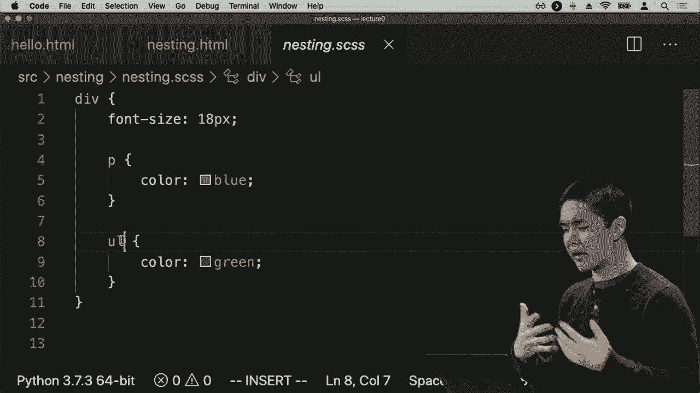

different style code interacts with each，other so after all of this now if I open。

up nesting HTML we might see something，that looks a little something like this。

the paragraph inside the daiva and the，list inside of the div those both get。

changes to the way that they've been，styled but unlike them these paragraphs。

outside of the David and the list that，is also outside of the div those get。

styled a little bit differently so two，features now we've seen inside of sass。

we've first seen the ability to have，variables to make sure we're not。

repeating ourselves in many places，throughout the code and now we've seen。

the ability to nest CSS selectors inside。

of each other by taking advantage of，sass and finally we'll take a look at。

one last feature that sass is going to，give us and that is something called。

inheritance if we have certain CSS，selectors that are related to other CSS。

selectors but they're maybe adding some，additional information and in this case。

I'm actually going to show you the。

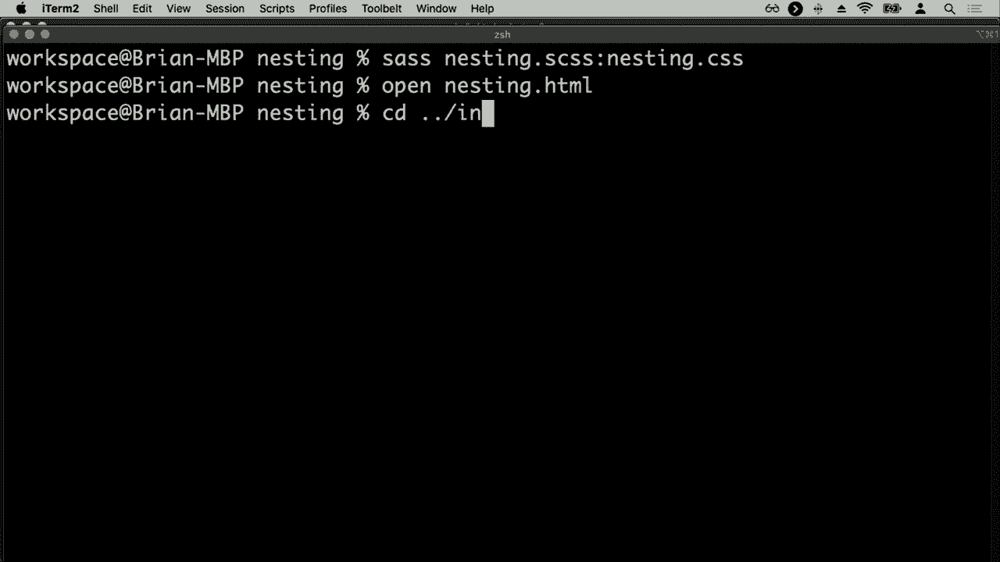

finished product first so let's go into，inheritance and let me open up。

inheritance dot HTML and here you see，I've tried to almost implement bootstrap。

style alert messages in HTML I have a，success message up at the top a warning。

message and then an error message in，each of these messages you'll notice our。

style differently in particular they're。

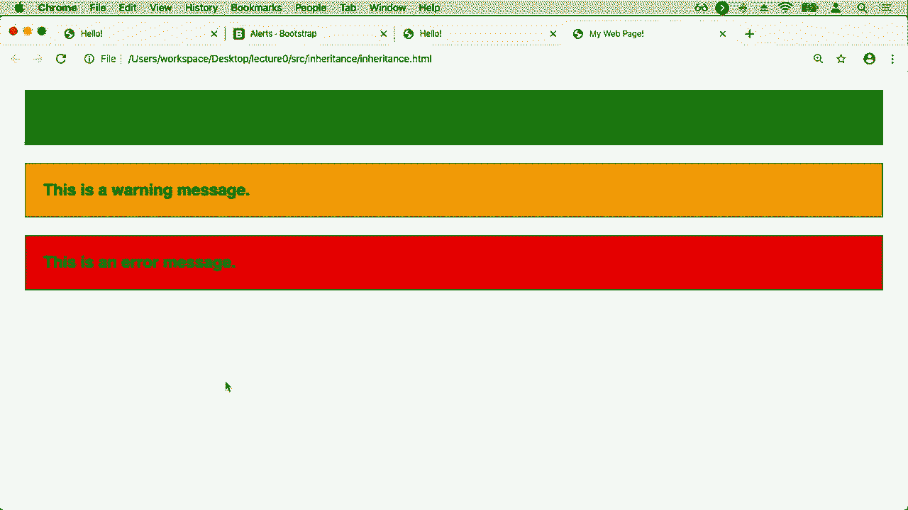

each a different color but despite that，they share a lot in common they share a。

common border they share a common font，they share a common size and many other。

properties are all shared between these，elements there are just some things that。

are a little bit different about them I，could have written three different CSS。

selectors to deal with all of these，cases but there might be some repetition。

there so here's what I can do by taking，advantage of the features that sass。

gives me let me go ahead and look at，inheritance s CSS to look at the code。

for doing this and it looks a little bit，cryptic at first but here's what I've。

defined I've here defined using a % that，this is what a generic message is going。

to be something that I can extend later，to add additional information to all of。

the messages whether they be success，messages or danger messages or warning，same。

they're all going to have the same，border they're all gonna have the same。

padding and margin spacing around and，outside of it but each of the specific。

messages are going to be slightly，different how are they different well，let's take a look down here。

anything with a class of success I'm，going to say extends this message and by。

extends this message what I mean is that，anything with a class of success is。

going to inherit all of these CSS，properties the font the border the。

padding and the margin but it's going to，add additional information to it in。

particular we're going to add a color，we're going to say that for success。

messages the background color is going，to be green I've extended the basics of。

what a message is but said that this，message in particular has some。

additional style that we're going to，assign to it as well and the other two。

messages behave in very similar ways my，warning message extends the message but。

instead says the background color should，be orange and finally the error message。

also extends the message but this time，gives us a background color of red。

instead so now when you compile this all，together into inheritance dot CSS which。

are compiled in advance this is what，this is ultimately going to look like it。

translates what I've written into saying，all right success and warning and errors。

should have all of these properties but，success should also have this background。

color warning should have this。

background color error should have this，background color so you again we could。

have written this CSS there's nothing，that SAS does that we couldn't have。

written ourselves using CSS SAS we'll，just make it a little bit easier to do。

many of the same things so we can write，things on a little bit of a nicer syntax。

by saying the success message inherits，from the message but adds a background。

color and likewise the warning and error，messages do the same thing but in a。

simpler syntax and a bit of a nicer，syntax such that later we can let the。

computer take the SAS code and compile，it into CSS instead and so those now are。

some of the fundamentals of what we've，seen in building web programs using HTML。

and CSS we've seen how we can use HTML，to describe the structure of our web。

page deciding what's going to show up，where on the page and then we looked at。

CSS and how CSS can then be used to，style our，Paige in various different ways adding。

custom styling like colors and layouts，but also thinking about things like。

responsive design like what happens on a，mobile screen or on a tablet and making。

sure that our web pages look good on，those screens too and then finally we。

took a look at sass an extension to CSS，that adds a number of additional。

features features like variables and，nesting and inheritance that make it。

even easier for us to be able to write，style that we can apply to our webpages。

from there we're going to be，transitioning now to looking at how we。

can use HTML and CSS in larger web，applications as we begin to incorporate。

other tools tools like Python and，JavaScript and other languages and。

frameworks altogether so this is web，programming with Python and JavaScript。

