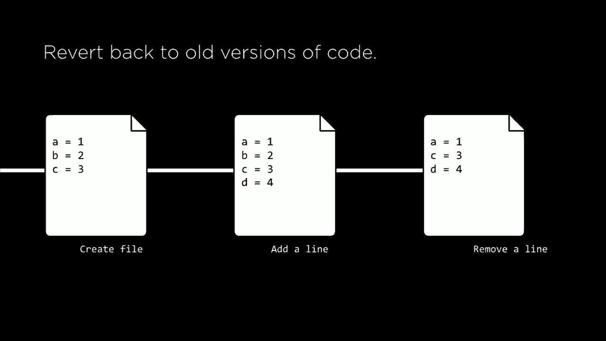

# 【双语字幕+资料下载】哈佛 CS50-WEB ｜ 基于Python ／ JavaScript的Web编程(2020·完整版) - P5：L1- github操作 1 (Git与GitHub基本操作) - ShowMeAI - BV1gL411x7NY

[Music]。

all right welcome back everyone to web，programming with Python and JavaScript。so last time we took a look at two，languages HTML and CSS both of which can。be used to design web pages HTML we used，in order to describe the structure of。web pages to decide what content we want，in the layout of the page and then CSS。

we use to describe the style of the page，what color we want and things how much。space we wanted around things as well，today we're going to turn our attention。to a tool that we can use as we begin to，develop these web applications and in。particular we're going to be looking at，a tool called git and what get is is it。

as a version control tool not specific，to web programs necessarily but that。we're going to use as we begin to，develop bigger and more sophisticated。web applications over the course of this，term so what is get going to enable us。to do well it's going to do a couple of。

things first and foremost what get is it，is a command-line tool that's going to。allow us to first keep track of changes，that we make to code so once upon a time。the first time I was starting to develop，web applications I remember working on a。file and then when I wanted to make，changes I might have wanted to save the。

old version so I would duplicate the，file and then just make changes to the。duplicate but this quickly gets messy，especially if you have lots of different。versions of your code in various，different stages keeping track of them。just starts to become a nightmare so，what git is going to enable us to do is。

to keep track of changes that we make to，our code so we might create a file。initially save that version of it but，over time as we make changes add to it。remove things from it we can save，snapshots so to speak of various。different parts of our code at different，points in time such that we can quickly。

and easily reference all of those，changes that we've made to that code。additionally git is going to make it，easy for us to synchronize code between。different people in larger scale web，applications is rarely just one person。who's working on the entire application，usually you're working with a co-worker。

and multiple co-workers all on the same，application and all at the same time and。one definitely tricky part of this，process is figuring out how to。synchronize your work between different，people if I make a change on my part of。the web application I want to make sure，that my colleagues are also able to see。

those changes and get access to the，latest changes that I've made and then I。want to be able to get access to the，latest changes that the people I'm。working with have made too so we need。

some way to keep everything in sync and，it is going to enable us to do that what。we're going to effectively have is one，version of the code stored in what we're。gonna call a repository somewhere online，and both I and someone I'm working with。a partner for example might both be able，to get access to that exact same。

repository those same files in the same，state and if ever I and the other person。make changes to those files we can each，make changes to those files and then。

synchronize them back up pushing them，back up to the server so to speak so。that the server will have the most，recent most up-to-date version of this。code then after that after we've both，pushed our changes up to the server then。we can both pull changes from the server，so to speak in order to get access to。

the latest version of the code so that，no matter what so long as I've been。working on the same project that my，partner has we can use git to。synchronize our work so that I have，access to my colleagues most recent，changes and vice versa。git also enables us to do a number of。

other things for example get allows us，to test changes to our code without。

removing access to the original so for，example you might imagine that as I'm。working on writing a program I might，want to try making some changes but I'm。not sure if they're quite going to work，so I want to test those changes but I。don't want to lose access to my original，working version of the program just in。

case something goes wrong，so what get enables us to do is it lets。

us make changes to code on a separate，branch so to speak such that later once。we're happy and satisfied with the，changes we can merge those changes back。into the original version of our code，being able to test those changes before。we're really sure that they're the ones，that we want to make and finally one。

powerful feature that git gives us，access to is the ability to revert back。

to old versions of our code so you might，imagine in the situation where I've been。working on some code and I realized that，actually what I'm doing right now isn't，what I want。get enables us to say you know what this，most recent change isn't something that。I wanted I would like to revert back to，a previous version of the code instead。

and get makes it very easy to go back to，those previous versions so the goal for。today is going to be to learn how to use，this tool to learn the various different。git commands that will be quite popular，and quite common as you go about working。on web applications or really any other，code related project because version。

control really allows a number of useful，features that are practical as you begin。to work on larger and larger projects，but ultimately as we begin working on。these get projects they need to be，stored somewhere online such that we're。able to download them from anywhere such，that me and a partner can both be。

working on the same files in the same，code and so in order to do that we need。to host our git code somewhere and there，are a number of different websites that。can do this but one of the most popular，is a web site known as github github as。

a website that stores get repositories，where all the repository is is you can。think of it as a folder that holds a，whole bunch of code and files related to。our code so we're gonna host this code，online on a website called github and。then on our computer we'll be able to，access these github repositories and。

manipulate those repositories by，changing the files that are within them。so let's go ahead and take a look at，github and see how we can go ahead and。

create our very first github repository，if you don't already have a github。account you can create one by going to，github comm and signing up for an。account for free and I'll now go to，github comm slash new github。com slash。new is the page I go to if I want to，create a new github repository and so。

let's take a look at what I need to do，in order to create a repository the。first thing I need to do is give my，repository a name so in this case I'm。just going to call the repository hello，we can give it any name you want so long。as that name doesn't collide with other，repository names that you already have。

github optionally lets me provide a，description for this repository I'll。just say web programming with Python and，JavaScript and then github gives me the。choice do I want this to be a public，repository such that anyone can see the，repository。not everyone can necessarily make，changes to it but it's publicly。

available if anyone wants to download my，code and try it out public means that。anyone can access it or private meaning，by default only I can see this。repository but I can choose if I would，like other people to be able to see it。as well and I can select which，individuals for now I'll go ahead and。

make this repository public and I'll go，down here and click on the green create。repository button in order to make this，new repository so I click the Create。repository button and here it is this is，the github repository page and right now。you'll notice that there's a lot of，instructions here but，are no files because right now when I。

first created my first get repository I，got an empty repository with nothing in。it so what I'd like to do now is somehow，download this repository onto my own。computer such that I can add say an HTML，file that contains some HTML that I want。

to keep track of using git so how am I，going to do that well in order to do。that we're going to take a look at the，very first git command that's going to。be involved with git which is known as，git clone get clone as a command that we。can run in order to take a repository，from the internet and download it onto。

our own computer so you'll need to have，git installed onto your computer you can。

install it on any Mac or PC or Linux，machine and once you do what you're。going to do is on your computer in the，terminal you'll run git clone followed。

by the URL of the git repository that，you're trying to download so you might。imagine that here's your computer over，here and up here is some server where a。git repository is located github for，example is one such server but there are。others as well and up there is the，repository that potentially has files or。

maybe other folders with other files，that contain the contents of the，repository that you care about。downloading so if I run git clone，followed by the URL the repository I。want the effect of that is that the，repository and all of its contents get。downloaded onto my computer such that I，on my computer now have a copy of。

everything that was originally inside of，that git repository so now now that we。

know how to clone a repository let's，actually try it we've just created a。repository using github and now let me，go into my terminal and actually try to。clone this repository so that I have a，copy of it on my computer and I can。begin to make some changes to it so I'll，go into my terminal now and I'll go into。

my lecture 1 directory and the first。

thing that I'm going to need is I'm，going to need the URL of the git。repository so if I go back into github，what you'll notice is that it gives me。an HTTP link in order to download my git，repository so there are a couple of。different ways that I can use to clone a，myself，one is using HTTP which will eventually。

involve like a username and password，that I'll have to type in in order to。prove to get that I these are my github，credentials，alternatively you familiar with。SSH this is another method of，authentication you can give as github。you are a public SSH key in order to，authenticate as well but no need to。

worry about that if you're not as，familiar with that technology the key。here is that this URL is the github URL，that corresponds to my repository so I'm。

going to copy that URL and then inside，of my terminal I'll type git clone and。then I'll just paste in the URL that I，would like to clone that contains that。repository I'll go ahead and press，return it says I'm cloning into a。directory called hello and then it's，saying you appear to have cloned an。

empty repository it's saying that's a，warning but that's okay because I know。that I've cloned an empty repository，because the repository is brand new and。now I can type the command LS in my，terminal the LS command in the terminal。stands for list and effectively what，it's going to do is list all of the。

files that are currently inside of this，directory all the files and folders that。are inside of my lecture one directory，where directory is just a fancy name for，all right。I now have a folder called hello inside，of my lecture one directory which I。didn't have before I'll go ahead and，move into this hello directory in order。

to change into a directory or folder you，can use the CD command CD stands for。change directory and so if I type CD，hello I will now move myself into the。hello directory and if i type LS you'll，see that there's nothing inside of this。hello directory right now because again，this repository was empty I cloned it。

and there was nothing in it so now I'd，like to actually put something in this。repository the repository is only useful，if I'm keeping track of my code and。keeping track of the changes that I make，to that code so I'll go ahead and。actually try now to add some code to the，repository the first thing I'll do is。

create a new file and we could create a，new file just by opening up a text。editor but on the terminal there's，actually a command for creating a new。file called touch so in the terminal，I can type touch hello dot HTML and what。that's going to do is create a new file，called hello dot HTML and if I type ls'。

I can see that indeed I do have a file，called hello dot HTML now inside of my，hello。

let me now open up this directory in the，hello dot HTML file inside of a text。editor again I'm using vs code and let，me now add just some text to hello dot。HTML I'll just add a simple HTML page，same thing we've seen before where I。give it a header a title will be hello，and inside the body of the page will be。

hello world same HTML page we've seen a，number of times now now just now inside。of this repository of course I haven't，yet made any saving to this repository I。haven't said that I want to save these，changes to the repository and the。repository isn't keeping track of every，single character I write I need to tell。

git that this is a state of my current，files that I would like to keep track of。something that I would like to save and，in the world of get we call those save。points commits when I say I am making a，commit I mean I would like to save the。current state of all of the files and，folders and other assets that exist。

inside of the repository and basically，take a snapshot of their current。

position such that later I might be able，to refer back to them but in order to do。that they're actually a couple of steps，so the first step we need to follow is。an additional command so we saw that git，clone was the command we could use in。order to clone a repository take a，repository and download it onto our own。

computer the next command will take a，look at is a command called git add and。what get add is going to do is it's，going to let us tell git that I would。like to add a file as one to track the，next time I save the next time I make a。commit to say that I would like to take，a snapshot of all these files such that。

I'm able to refer back to them later and，in order to do that I need to tell git。what files to keep track of so if for，example I'm keep working on this file。and I'd like to tell git that I'd like，to track it I can run a command like git。add followed by the name of the file，like food pie or dot HTML or whatever。

file it happens to be and then get will，display a message saying that alright。now we have added food by this is now a，file that will be saved the next time I。make a commit so why are these two，separate steps well one reason you might。imagine is that if I'm working on a lot，of different files say I'm working on 10。

different files and they're only three，that I'm happy with，three that I want to save it I don't。want to just say save and have，everything be saved in a commit I might。want to say that you know what these are，the only three files that I actually。want to save right now and the other，ones I'm still working on，so get gives us that ability to have。

this separation to say let me explicitly，say that I want to track this file the。next time I save the next time I make a，commit and not all of the files for。example though there are shortcuts we，can use if we do want to add all of the。files and we'll see those in a moment as，well so let's go ahead and try that。

we'll go back to our repository where，I've created this hello dot HTML file。and now what I'd like to do is say that，I would like to add the hello dot HTML，my terminal。I'll now say again I have a hello dot，HTML file here I'll say git add followed。by hello dot HTML and you'll notice it，so far nothing seems to have happened。

because so far I haven't yet saved，anything I've just said that I would。like to add hello dot HTML as a file，that the next time I say save the next。time I commit my repository it is going，to keep track of the changes I have now。

made - hello HTML so how do I actually，make a commit how do I actually say save。the state of these files well that's，going to be one more git command which。is known as git commit when I say git，commit I am going to tell my git。repository that I would like to save a，snapshot of the current state of the。

repository keeping track of any of the，changes that have been made to files。

that I've added using git add and the，way we run it is by running git commit。followed by - M and then in quotation，marks a message and this message is。known as a commit message and what it is，is it a description in English or。whatever your language is of what，changes you've made in this most recent。

commit because over time as you work on，a big project you're probably going to。make lots of commits as you make lots of，changes to your program you'll commit。and commit again after each new edition，you make to the project and you might。want to refer back to a previous commit，but it's only valuable to do so if you。

can identify in which commit you made a，particular change for example so by。providing some English message just some，note to yourself such that later you can。refer back to all your commit messages，and know that all right at this。point in time in this commit this is the，change that I made that can just make it。

easier to keep track of all the changes，that you've made to a particular git。repository so when you type git commit，followed by - M you might include a。message something like I added a new，line for example and when you do get is。going to save a new snapshot of a，version of your code right now keeping。

track of the old version or old versions，that used to exist there inside of the。repository so let's try and actually，make a commit now and see how that's。actually going to work so we've already，added the file as by running git add to。say add the hello HTML file as one to，keep track of but now when we're happy。

with it and we could make additional，changes to the file if we want to I can。go back into the terminal and now say，git commit and then - M and then I can。specify the commit message some English，description of what it is that I did in。this most recent commit and what I did，was I added the hello dot HTML file so。

I'm just gonna say I added the hello to，the HTML file that was the change I made。in this most recent commit I'll go ahead，and press return and here's what it's。telling me it's telling me one file has，been changed with nine insertions so it。keeps track of changes in terms of how，many lines have been added or inserted。

and how many lines have been deleted or，removed and in this case it's telling me。there have been nine insertions to one，file because previously the file didn't。exist and now a file that has nine lines，does exist and now I have saved hello。

dot HTML to this git repository so now，you might imagine if I go back to my git。repository on github website and refresh，it that maybe I'll see that hello dot。HTML file that I refresh and alright，nothing happened nothing changed I don't。see my hello dot HTML file and that's。

because there's one final step here I'm，missing before my changes are going to。be reflected online recall that when I，ran the git clone step in order to clone。the repository from github github had a，version of the repository and I ran get。cloning to download a copy of that，repository onto my own computer and when。

I ran get add to add the hello dot HTML，file or I ran get commit to say I would。like to save these changes，I was always making those changes only。to my local version of the repository，I was never effecting anything that was。already on github the changes I was，making were only happening on my own。

computer if I want to push those changes，up to github then I'm gonna need some。additional commands and in fact we can，see what's currently going on inside of。my repository using a command called git，status and what git status will do is。it'll tell us what's currently happening，inside of my repository so for example。

if I were to in this current state run，the command git status then git is going。to report back to me and tell me that I，am currently on branch master more on。branches later but then it's saying my，branch is ahead of origin master by one。commit so this is a long-winded way of，saying that my local version of the。

repository the version of the repository，on my computer is ahead of the origin。version of the repository the version of，the repository that's up on github by。one commit that I have one commit that，the origin github does not have and it's。helpfully telling me I can use the，command git push to publish your local。

commits get pushed as a command that I，can use in order to say I would like to。take my changes and actually push them，up to the server push them up to github。so that they're reflected there so after，we've checked our current status with。git status we can use the command git。

push to say that now whatever changes，that I've made when I run git push those。changes get pushed up to github so if，github has access to all of the commits。that I have now made so let's try those，two commands now get status to see。what's currently going on inside of my，repository and then get push to say I。

would like to now push those changes to，github so that the online version of the。repository has the same contents as the，local version on my own computer alright。so in my terminal now I can run git，status and I see that I am on branch。master same as before it's a slightly，different message because there's。

nothing currently inside the repository，but the key here is that now I can run。the command to get push to say take all，of the changes that I have made to my。repository and go ahead and push them up，to github so I'll type git push and。what's going to happen is going to，compress all the information and it's。

going to push it up to github。

to this URL and now if I go back to，github website github。com slash my。repository and refresh the page I'll see，that I do actually now see something。different and so this is what github x'。

user interface actually looks like it，gives me a few pieces of information。

it's telling me for example that there's，one commit currently made to the。repository that's the one I just made，that is on one branch so if I have only。created one branch the default one but，we'll see how to create more branches。later and in particular down below，you'll see the files that currently。

exist inside of this repository that，right now I have this hello HTML file。which is the one that I pushed and in，particular next to it is the commit。message the message from the most recent，time that I touched to this file which。is in particular telling me that I added，the hello HTML file in the most recent。

commit that affected hello dot HTML and，if it were not Ida now to click on hello。dot HTML to actually see what's inside，of it I would see the same content that。I wrote in that file before I see，doctype HTML and then the hello world。page that we've seen a couple of times，now so I made the change on my own。

computer and I've now pushed them up to，github so they're now inside of this。repository that's now public such that，anyone else if they wanted to。collaborate on this project could take，this URL clone it to their own computer。and make their own changes locally as，well and so now we can explore how we。

might be able to make additional changes，to this web page as well so if for。example I wanted to add a heading to，this web page for instance I might at。the top of the body say something like。

in an h1 tag welcome to my website and，now if I you know just for good measure。open up hello dead HTML see what it。

looks like this is not what my web page，now looks like and now I've made changes。to my hello dot HTML file changes that，have not yet been saved and I can tell。that if I run get status get status is，your go-to for telling you what's。currently going on inside of your，repository so here we see changes not。

staged for commit which is a fancy way，of saying files that have been changed。but I haven't said I would like to keep，track of them in the next commit it's。telling me that I've modified hello dot，HTML but，it's not something that get is currently。going to keep track of the next time I，make a save so if I want to save hello。

dot HTML when I commit for the next time，then I'll first need to run get ad hello。HTML and then I could run and get commit，but there's actually a bit of a。shorthand here if you want to add all of，the files that have been changed and。commit at the same time the shorthand is，git commit - am remember before we just。

used - M to say specify a message，- a。m。means git commit all of the files。that have been changed a for all and，also provide a message so you can。combine the git add step and get commit，step into just a single step by saying。I'd like to commit all of the files that，I've changed and then I'll provide a。

message what exactly did I change I，added a headache I'll go ahead and press。return it's kept track of the fact that，I have now changed one file with one。insertion all I did was add one new line，to that file and now if I run git status。it's going to tell me I'm on branch，master and I am ahead of origin/master。

origin master being the version on，github by one commit that I have this。

add a heading commit but right now on，github if i refresh this page it's still。showing the old version of that page in，order to take my changes that I've made。

on my computer and make sure they're，updated on github I can just run git。

push to say push those changes up to，github and once that's done I can now。refresh the page on github and I'll now，see that github now has the latest。version of my program as well it now has。

this h1 it says welcome to my website，so that's get push now the ability for。me to say I would like to make the take，the changes that I have made to the。Myatt repository and push them up to，some remote server the remote server on。github for example but we can also go in，the opposite way you might imagine that。

maybe the version that's up on github is，more recent than the version that I have。

on my computer and in that case I would，like to download the latest version of。the repository that currently exists on。

github and in order to do that we can，use a command called get pole how does。

that work well when I run it get pulled，what's going to happen is the opposite，of what get pushed。well get push took my changes on my，computer and pushed them up to github。get pull will say take the changes that，currently exist on github and go ahead。and pull the most recent changes down so，that I and my local version of the。

repository have access to the latest，version of all of the code that is。currently on github and we can，demonstrate this for example if I go。back and take a look at github website，itself because on github I actually have。the ability to edit files using github，interface so I'm gonna simulate like。

someone else working on this project for，example maybe someone else added a。second heading so they add an h2 that，says just hello for example and then。they can provide a commit message this，is sort of a graphical equivalent to the。dash M and then a message that we，provided before they can say added h2。

and then commit so this is another way，to edit a git repository is by literally。adding it in editing it inside of github，interface again up allows you to just。edit a file and then add or modify any，of the lines there so now the version on。github is actually different from the，version that we have on our computer。

that if we look at hello dot HTML here I，only see the h1 and I don't see the h2。that was just added because it's a more，recent commit that I don't yet have。

access to but if I want to download that，commit then what I can say is inside my。terminal I can say git pull in order to。

download it and alright it's updated one，file it's made some changes and so now。if I go back to the file you'll notice，that automatically I now have the latest。version of the file I now have this h2，that says hello because I've pulled the。latest version of the file down from。

github so by a combination of get push，and get pull I can make changes to my。code push them up to github and also get，access to the latest version of code。that already is on github but as we do，this you might imagine that we could run。into some sort of problem in particular，we might run into a problem if I've been。

making changes to my code and some，someone else working on my same project。