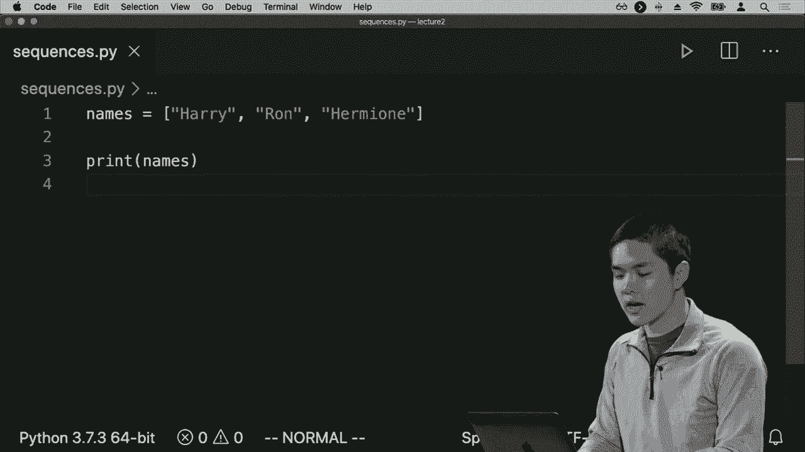

# 【双语字幕+资料下载】哈佛 CS50-WEB ｜ 基于Python ／ JavaScript的Web编程(2020·完整版) - P7：L2- Python编程语言全解 1 (变量，字符串格式化，条件与循环) - ShowMeAI - BV1gL411x7NY

[Music]。

all right welcome back everyone to web，programming with Python and JavaScript。and today we take a look at one of the，two main languages we're going to be。looking at in this course in particular，we're going to be looking at Python。Python is a very powerful language that，makes it very easy to build applications。

quickly because there are a lot of，features that are built into the。language that just make it convenient，for quick and productive development so。one of the goals of today is to，introduce you to the Python programming。language if you haven't seen it before，and even if you have seen it before to。

give you a taste for what the language，has to offer，exploring some of the more advanced。features and some of the techniques we，can use using Python to be able to。develop applications all the more，effectively so we begin with our very。first Python program just a program that，says hello world we're going to be。

writing it in a text file and the。

program just looks like a single line，just like this and if you've used other。programming languages before like C or，Java or other languages this probably。looks pretty familiar syntax wise but，just to break it down we have a function。called print built into the Python，programming language for us and like。

many other programming languages，functions in Python take their arguments。inside of parentheses so inside of these，parentheses are the argument or the。input to the print function which in，this case is just the words hello world。followed by an exclamation point so，here's how we can actually take this。

program and run it I'm going to go into，my text editor and create a new file。that I'll call hello dot P Y dot py or，dot pi is the conventional extension for。Python programs so I'll create a file，called hello dot PI inside of which will。just be the Python code that we just saw，a moment ago，we'll call the print function and as an。

argument or the input to the print，function I'll say hello world。exclamation point now in order to run，this program we're going to use a。

program in our terminal that also just，so happens to be called a Python Python。is what you might call an interpreted，language meaning we're going to run a。program called Python which is an，interpreter that is going to read our。dot PI file line-by-line executing each，line and interpreting what it is is that。

it means in a way that the computer can，actually understand so we'll run Python，we'd like。interpret in this case hello depay and，when we run this program we see that the。words hello world are printed to the，terminal and that's it that's the end of。

the program and that's the very first，program that we've written using the。Python programming language so now，already we've seen a couple of features。of Python the ability to interpret，Python there's no need to compile it。into a binary first in order to run a，Python program we've seen functions and。

we've also seen strings just text that，we can provide in quotation marks that。we can provide as input to other，functions or manipulate in other ways。and we'll see some examples of string，manipulation a little bit later like。many other programming languages Python，also supports variables and in order to。

assign a new value to a variable the，syntax looks a little something like。this if I have a line like a equals 28，what that's going to mean is take the。value 28 and assign it store it inside，of this variable called a now unlike。other languages like C or Java which you，might be familiar with where you have to。

specify the type of every variable you，create have to say like int a to mean a。is an integer Python doesn't require you，to tell you what the types of each of。these variables actually are so we can，just say a equals 28 and Python knows。that because this number is an int that，it's going to represent without the。

variable a as an int and it knows it's，able to infer what the types of any of。these values happen to be so all the，values do indeed have types。you just don't explicitly need to state，them so for example this here the number。28 is of type int it's an integer a，number like 1。5 has a decimal in it it's。

a floating-point number so that in，python is what we might call a float。type any type of text something like the，word hello wrapped in either double。quotation marks or single quotation，marks Python supports both is what we。would call the ster type short for，string we also have a type for boolean。

values things that can be either true or，false in Python those are represented。using a capital T true and a capital F，false those are of type bool and also we。have a special type in Python called the，none type which only has one possible。value this capital n none and none as a，value will use whenever we want to。

represent the lack of a value somewhere，so if we have a function。that if not returning anything it is，really returning none effectively and so。you might imagine that none can be，useful if ever you want a variable to。represent the absence of something for，example so lots of different possible。

types and there are more types in just，this but here's a sampling of the。possible variables and types that might，exist inside of this language so now。let's try and actually use a variable in，order to do something a little bit more。interesting inside of our program and，we'll write a program that's able to。

take input from the user in order to say，hello to them for example so I'll create。a new file we'll call it name dot PI and，input，I'd like to prompt the user to for。example type in their name so how might，we do that well just as there is a print。function that is built into Python that，just prints out whatever the argument。

happens to be Python also has a built-in，function called input that prompts the。user for input and ask them to just type，in some input so let's provide some。input and ask the user to type in their，name for example and then we can save。the result the output of that function，inside of a variable and in this case。

I'll save it inside of a variable that，in this case also just happens to be。

called name now we can run the program I，can run the program by going into my。terminal and typing python named i i'll，press return and we'll see the program。prompts me to type in my name i see name，colon space which is that string i。provided as the argument to the input，function and this now prompts me to type，in my name so i will。

and after that nothing seems to happen，so far so now i'd like to do something。

with that input i typed in my name i'd，like to say like hello for example to。myself so i'll go back into this program，and now what i can do is i can say print。hello comma and then i can say plus name，this plus operator in python does a。number of different things if I have two，numbers that will add those two numbers。

together but with two strings plus can，actually concatenate or combine two。strings together so I can combine hello，comma space with whatever the value of。

name happens to be so now I'll rerun，this program，Python named PI type in my name and now。

we see hello Brian as the output of the，program so this is one way that you can。manipulate strings in Python another way，that's quite popular in later versions。of Python 3 is a method known as using f，strings short for formatted strings and。in order to use f strings in Python it's，going to be a similar but slightly。

different syntax instead of just having，a string in double quotation marks we'll。put the letter F before the string and，inside of the string I can now say hello。comma and then if in a formatted string，if I want to plug in the value of a。variable I can do so by specifying it in，curly braces so what I'll say here is。

inside of curly braces name and so，what's going on here is I am Telling。

this formatted string to substitute，right here the value of a variable。so I prompted the user for input to type，in their name we took their name saved。it inside of this variable called name，and now here in this print statement on。line two I'm printing out a formatted，string that is hello comma and then in。

curly braces here I'm saying plug in the，value of the variable name and so that。is going to have the effect of taking，whatever name was provided as input and。printing it out and this is a slightly，more efficient way of being able to。quickly create strings as by plugging in，values into those strings so now I'll。

see the exact same behavior if I run，Python name pi then prompted to type in。my name I'm like Brian and then I save。

the result hello Brian for example and，so those are a couple of ways that we。can deal with strings manipulating，strings and combining strings using this。technique so in addition to variables，Python also supports all the same other。features that are core to many，procedural programming languages such as。

conditions for example so let's take a，look at an example now of seeing whether。a number is positive or negative or zero，for example so I'll create a new file。that I'll call conditions pi and inside，of conditions depay i'll first prompt。the user to type in some input I'll say，input，number two mean you know type in a。

number and we'll save that input inside，of a variable that I'm just going to。call n and now I can ask questions I can，say something like if n is greater than。zero then print and he's positive and so，what's going on here is I have a Python。condition and the way a Python condition，works is it begins with this keyword a。

keyword like if followed by a boolean，expression some expression that's going。to evaluate to true or false or，something kind of like true or false we。can be a little bit loose about that as，we may see you later and then a colon。means alright here is the beginning of，the body of the S statement and in。

Python the way we know that we're inside，the body of an if statement or inside。the body of any other block of code is，via indentation so in some languages。like C or in languages like HTML which，we saw a couple of lectures ago the。indentation isn't strictly required by，the computer to be able to parse and。

understand what's inside the program in，Python it's different the indentation is。required because the indentation is how，the program knows what code is inside of。the if statement and what code is，outside of the if statement so we have。if n is greater than 0 colon and then，everything indented underneath the F is。

all of the body of the estate 'men it is，the lines of code that will execute if。this condition this boolean expression，and greater than zero happens to be true。so if n is greater than 0 we'll print，out and is positive and then we can add。an additional condition I can say，something like well I could say，something like else print n is not。

positive but I can be a little bit more，specific than that here is sort of two。branches one if n is greater than 0 and，one else case to handle all of the other。possible scenarios but really what I'd，like to do is perform a second check in。other languages this might be called an，else if like if this condition is not。

true but this other condition is true，Python abbreviates this to just lf-ii。LIF just short for else if so I can say，L if n is less than 0 then let's go。ahead and print out n is negative，and else print n is zero so the idea。here now is that if n is greater than，zero we perform some tasks L if in other。

words if it's not greater than zero then，we check to see if it is less than zero。in which case we print out that n is，negative else if neither of those two。conditions are true it's not positive，and it's not negative，the only remaining possibility is that N。is zero so we can print out that n is，zero and so we might like for this。

program to work but watch what happens，if I now try and run conditions pas even。though logically in our heads and，looking at it now it probably seems，pretty logical if I run Python。conditions pi and type in a number I'll，type in the number five for example just，see what happens。

all right something weird just happened，and this is our very first Python。exception an error that happens because，something didn't quite go right inside。of our Python program and over time，you'll begin to learn how to parse this。exception and understand what it means，and where to begin to debug but learning。

how to read these exceptions and figure，out how to deal with them is definitely。a very valuable skill on your way to，becoming a Python developer and so let's。see if we can figure out what this，exception is saying oftentimes I start。by looking at the bottom I see that，there is a type error that is the type。

of the exception that has happened there，are a lot of exceptions that can go。wrong in Python things that we can do，that cause errors in this case it's the。type error which generally means that，there's some mismatch of types that。Python expected something to be of one，type but it turned out to be a different。

type so let's try and understand what，this might be we says greater than sign。not supported between instances of stur，short for string and int so what does。that mean well I guess it means that the，greater than symbol that checks if one。thing is greater than another doesn't，work if you're comparing a string to an。

integer and that's probably pretty，reasonable it doesn't really make sense。to say a string is greater than or less，than an integer when we're talking about。greater than or less than usually we're，talking about numbers so they should。both be integers for example so why do，we think that greater than is comparing。

a string and an integer well now we can，look a little bit further up at the。trace back which will show which parts，of the code are，causing this problem and in this case。the trace back is pretty short it's just，pointing me to a single line of a single。file it's saying in the file conditions，PI on line 3 here is the line that。

triggered the exception if n is greater。

than 0 so what's the exception here well，0 is obviously an integer because that。just is an integer and so if greater，then thinks that it's comparing a string。with an integer then n somehow must be a。

string even though I typed in the number，5 you must still think and is a string。so why might that be let's take a look，at the code again and see if we can。figure out what's going on well it seems，that this input function doesn't care。what you type in it's always going to，give you back a string and somehow is。

ending up as a string which it's pretty，reasonable because the input function。has no idea whether I typed in a number，or whether I typed in a letter or I。typed in other characters altogether，some input doesn't know to give back its。data in the form of an int or in the，form of a float or in any other form so。

by default it's just going to return a，string what characters did the user type。in as their input so what I'd like to do，now in order to make this program work。the way I wanted to is take this and，convert it into an integer or cast it。into an integer so to speak and the way，that I can do that is by using a。

function in Python called int that takes，anything and turns it into an integer so。here I can say int and then as the，argument to the int function the input。to the nth function I'm just going to，include this whole expression input。number so I'm going to ask the user to，input a number they type in some text。

the input function gives me back a，string and that string is going to serve。as the input to the int function which，then gets saved inside of this variable。

called n so now that we know that n is，indeed an integer let's try and run this。program again I'll go back into the，terminal run Python conditions PI I'm。asked to type in a number I type in a，number like 5 and alright that's still。doesn't seem to have worked and it，didn't work because I didn't save the。

file so I go ahead and save the file，try it again type in a number and。we see that indeed n is positive we get，no more exception we were able to run。the codes successfully and see that the，value of n is positive and I could try。this again to test the other two，conditional branches type in negative。

one for example to see that n is，negative and otherwise if it is neither。

positive or negative then we know that n，is zero and so here was our first。exposure to conditions in Python the，ability to have multiple different。branches and do different code depending，on some expression that we're going to。evaluate to either be a true expression，or a false expression all right so let's。

take a look at some of the other，features that are going to be present。inside the Python language and one of，the most powerful features of Python are。its various different types of sequences，data types that store values in some。sort of sequence or some collection of，values altogether so I'll go ahead and。

create a new file that will call，sequences pi and there are a number of。different types of sequences that all，obey similar properties but one of the。types of sequences is a type we've，already seen which is just a string for。example so if I have a name and the name，is something like Harry for instance and。

this sequence allows me to access，individual elements inside of the。sequence and in order to do so it's much，like an array in other languages if。you've experienced them before but I can，print out name squ*re bracket 0 this。squ*re bracket notation takes a sequence，some ordered sequence of elements and。

gets me access to one particular element，inside of that sequence and so if I have。a string like name and I say name squ*re，bracket 0 the effect of that is going to。be take this long sequence and get me，the zeroth element in many programming。languages and in programming more，generally we often start counting things。

at 0 so the very first item in the，sequence is item 0 the second item is。item 1 so it's easy to get slight，off-by-one errors there but just know。

that item 0 of the name should be the，first character in the name and I can。see that for sure if I run Python I'll，save this file run Python sequences PI。and what I get is just the first，character of Harry's name which in this。

case is the letter H，if I instead asked to print out。

character 1 which will be the second，character in the name if I rerun the。program now I get the letter A and this，type of indexing works for many。different types of sequences not just a。

string which so happens to be a sequence，of characters but other types as well。Python for example has a type for lists，of data so if I have a sequence of any。type of data that I want to store I can，store that information inside of a list。in Python so maybe instead of storing，one name I have multiple names that I。

want to store so I want to store our，names like Harry and Ron and Hermoine。for example so now I have three names，all stored in the sequence inside of a。Python list and I can you know I can，print out all of the names for example。just to print out all of the names to。

see what the value of the variable names，is equal to and we'll see that when I do。that I get a printout of the contents of。

that list Harry Ron Hermione in that，particular order but you could also much。as you could index into a string index，into a list to say get me just the very。

first item inside of this names list，which in this case when I run the。program is going to just be Harry so，there are a number of different sequence。types you can use in order to represent。

data another one just so happens to be，called a tuple and a tuple is often used。if you have a couple of values that，aren't going to change but you need to。store a pair of values like two values，together or three values together or。something like it you might imagine that，if you're writing a program to deal with。

graphing in two dimensions for example，you might want to represent a point as。an x value and a Y value and you could，create two variables for it I could say。you know let me do say a coordinate X is，going to be equal to ten point O and。coordinate Y is equal to twenty point O，but now I'm creating two variables for。

what's really one unit that just so，happens to have two parts and so to。represent this we can use a tuple in，Python and just say something like。coordinate equals ten point O comma，twenty point O so whereas in lists we。use squ*re brackets to denote where the，list begins and where the list ends up。

in a tuple we just use parentheses，say we're grouping a number of values。together we're grouping one value ten，point O with a second value twenty point。O and now we can pass around these two，values as a single unit。just by referencing them using a single，name which in this case is coordinate so。

there are a number of different types of，these various different sequences and。some of those sequences we'll take a，look at are these data structures here。so list for example is the sequence of，mutable values which we took a look at。and mutable just meaning we can change，the elements in the list if I have a。

list I can add something to the end of，the list I can delete something from the。list I can modify the values inside the，list a tuple on the other hand is a。sequence of immutable values those，values can't change you can't add。another element to the existing couple，you'd have to create a new tuple in。

order to do so and there are other data，structures that exist as well a couple。that we'll take a look at in a moment，include sets which are a collection of。unique values so if you're familiar with，sets from the world of mathematics it's。a very similar idea that where as a list，in a tuple keeps things in a particular。

order a set does not keep things in any，particular order it's just a collection。and in particular all of the values need，to be unique in a list or in a tuple you。might have the same value appearing，multiple times in a set every value。appears exactly once and there are some，advantages to set some ways that you can。

make your programs more efficient by，using sets if you know that you just。need a collection if you don't care，about the order if something is only。going to show up exactly once at most，then you can use a set to potentially。make your programs a little more，efficient and a little more elegantly。

designed and finally one other data，structure that's quite powerful and。that's going to come up a number of，times during this course is a dictionary。in Python shortened to just a dict which，is a collection of what we're gonna call。key value pairs and the way I like to，think of this is with an actual physical。

dictionary that you might find at a，library that map's words to their。definitions in a physical dictionary you，open up the dictionary and you look up a。word and you get the definition an，addicted Python is going to be very。similar it's going to be a data，structure where I can look something up。

by one keyword or one value and get some，other value as a result we call the。thing that I'm looking up the key and we，call what I get when I do。looking up the value so we keep pairs of，keys and values in the case of an actual。dictionary in the real world the key is，the word that we want to look up and the。

value is its definition but we can use，this more generally in Python anytime we。want to map something to some other，value such that we can very easily look。up that value inside of this data，structure so we'll see examples of。dictionaries as well so let's now，explore the first of these data。

structures these lists to explore what，we can do by taking advantage of the。features that are given to us by a，Python list for example so we'll go。ahead and create a new program that I'll，call lists dot pi and here I'm just。going to create a list of names so names，equals Harry Ron Hermione and Ginny for。

example and as I start to write multiple，lines of code especially as my Python。programs start getting longer it can be，a good idea to document what it is that。I'm doing so I can say let me add a，comment to this particular line of code。just so I know what it is that I've done，in this line of code and in Python there。

are a couple of different ways to create，a comment but the simplest way is just。to use the pound sign or the hash tag as，soon as you include that everything。after that for the remainder of the line，is a comment the interpreter is going to。ignore that comments you can say，whatever you want it's more for you the。

programmer and for someone who's reading，your program to be able to look at the。program understand what it's saying and，figure out what they need to do about it。so I can just say define a list of names，for example just to make it clear to me。what it is that I have done inside of，this line of code so I can print out。

that list of names as we've done before。

and we'll see that when I print out that，list of names what I get is let me run。list up I what I get is this list Harry。

Ron Hermione and Ginny but I could also，print out as we've seen before just the。first of those mam say you know print，out just name squ*re bracket zero in。which case I'm going to get just Harry，for example but now recall that a list。is mutable I can modify the elements，that happen to exist inside of this list。

so I could say names that dot append a，new name something like，Rico for example and so lists have a。number of built-in methods or functions，which are functions that I can run on an。existing list to access particular，elements to the lists or to modify the。list in particular way ISM and in the，case of a list the append method is a。

method or function that I can run that，just adds a value to the end of an。existing list so I've added Drako to the，list and there are a number of other。methods that I can use on lists one of，which is for example sorting a list no。need to write your own sorting algorithm，in order to sort a sequence of objects。

in Python there is a built-in sort，method that works on lists where I can。just say names dot sort that will，automatically sort everything in the。list and now if I print out all of those，names go and print them out and get rid。

of this old print statement now we see，that we get five names that are printed。out because I had four elements，originally in this list but then I added。a fifth one and notice now that they are，actually in alphabetical order starting。with Drako ending with Ron because I was，able to sort the list by modifying the。

order in which those elements actually，show up and so list can definitely be。quite powerful anytime you need to store。

elements in order a list is definitely a，useful tool the Python gives to you if。you don't care about the order of the，elements though and if you know that all。the elements are going to be unique then，you can use a set which is another。Python data structure that works in，similar ways the syntax is slightly。

different so let's do an example with，those I'll create a new file call it。sets pi and let me first create an empty，set and we can do that by just saying s。equals s is going to be the variable，that will store my set and I'll say set。and then parentheses that will just，create an empty set that just so happens。

to have nothing inside of it now we'll，add some elements to the set so I can。say s dot add let's add the number one，to the set let's add the number two。let's add the number three and let's add，the number four and then we can print。

out the set to see what happens to be，inside the set right now now when I run。this program Python set pi we see that，inside the set are four values。one two three and four that happened to。

be an order but sets are not naturally，ordered they're not gonna always keep。track of what the order is going to be，but I could add for example if I add。three again to the set now I've added。

three to the set twice I added one two，three four and then three again when I。print out the contents of the set it's，still just contains the elements one two。three four no element ever appears twice，in the set following with the。mathematical definition of a set where。

no element ever appears more than once，inside of a set you can also remove。elements from sets as well so if I，wanted to remove the number two from the。set for example I could say s dot remove，2 and then print out s to say print out。

whatever happens to be inside of that，set now and now when I rerun this。

program I only get 1 3 & 4 because I，removed 2 from the set so sets allow you。to add to them remove from them and also，all sequences whether they be strings or。lists or sets allow you to get how many，elements are in the set by taking。advantage of a function built into，Python called Len so Len will give you。

the length of a sequence so the number，of items inside of a list or the number。of characters inside of a string or the，number of elements inside of a set and。so if I wanted to print out how many，elements are in the set I might do。something like this in a formatted，string say the set has a sum number of。

elements and how do I know how many，elements well again inside of these。curly braces I can include any，expression in Python that I would like。to substitute into this string so how，many elements are in the set I can get。

that by calculating Len of s so what，I've done here is I've said with Len of。s I would like to calculate the length，of the set s in other words how many。elements are actually inside of that set，and then using this curly brace notation。I'm saying take that number and plug it，into this string so we can see the set。

has some number of elements for example，so now if I run this program。pythons at PI I see that I get these，three elements that happen to be inside。of the set right now which is one and，then three and then four，and then it tells me that the set has。three elements inside of it which is the。

number of elements that are in the set，right now so now we've seen a number of。different language features inside of，Python we see in variables we've seen。conditions so that we can additionally，do things if something is true if。something else is true and we've seen，some of the data structures that are。

core to the way Python works lists and，sets and tuples and other data。structures it can be helpful too and now，let's take a look at another feature of。the Python programming language common，to many programming languages the idea。of looping if I want to be able to do，something multiple times now go ahead。

and create a new file called loops pi，and let's just create a simple loop the。simplest loop we could create in Python，is just one that's going to count a。bunch of numbers so in order to do that，what I could say is something like this。for I in 1 2 3 4 5 or maybe I want to，count 0 1 2 3 4 5 just to start counting。

at 0 print I so here's the basic syntax，for a Python loop and here's what seems。to be going on over here on the very，first line I have a Python list as。denoted by those squ*re brackets that，contains a 6 numbers 0 1 2 3 4 5 and now。I have a for loop for I in this list and，the way Python interprets this is to say。

go through this list one element at a，time and for each element call that。element I we could have called it，anything but in this case I is just a。conventional choice for a number that，keeps incrementing and we're going to。print out now the value of I for each，iteration of this loop so we can try。

this out now and run Python loops pi we，see 1 0 1 2 3 4 5 great it printed out。all of the numbers from 0 to 5 one at a，time in practice though if we wanted to。count all the way up to 5 or for print，six numbers for example this is fine for。now but if we wanted to print like，hundred numbers or a thousand numbers。

this is going to start to get tedious so，Python has a built-in function called。

range where I can say for I in range 6，to achieve exactly the same thing。six means get me a range of six numbers，so if we start at zero it's going to go。from zero all the way up to five and，then we can print out each one of the。elements inside of that sequence so if I。

rerun Python loops top I we get 0 1 2 3，4 5 so loops enable us to loop over any。type of sequence so if the sequence is a，list I can say something like if I have。a list of names like Harry and Ron and，Hermoine and this is my list of names I。can have a loop that says that for each，name in my list of names let's print out。

that name for example so we have a list，the list is called names we're looping。

over at one element at a time and，printing it out now if i run the program。i see three names printed one on each。

line and you can do this for other，sequences as well maybe i have just a。single name that is called harry and now，i could have a line that says you know。for every character in that name print，the character if the name is this is the。sequence is a sequence of individual，characters because it's a string then。

when I loop over that string I'll be。

looping over each individual character，in that string so I can run the program。and see one on each line each of the，letters that just so happens to be。

inside of Harry's name so now we've seen，conditions we've seen loops and we've。seen a number of different data，structures we've seen lists and sets as。well as tuples the last important data，structure that we're going to be taking。a look at are Python dictionaries which，as you'll recall are some mapping of。

keys to values if I want to be able to，look something up I can use a Python。dictionary just as a data structure to，be able to store these sorts of values。so I'll create a new file called，dictionary stop PI and maybe I want to。create a dictionary that is going to，keep track of say what house each of the。

students at Hogwarts happen to be in so，I might have a dictionary called houses。and the way we specify a dictionary is，by specifying a key ： a value when we're。defining a dictionary for the first time，so I might say Harry， Gryffindor and then Draco ： Slytherin。for example and so what this line of，code is doing is it is creating a new。

dictionary this dictionary is called，houses and inside this dictionary I have。two keys two things that I can look up I，can look up Harry or I can look up Draco。and when I look up those keys I get the，value that follows there ： so after。Harry if I look up Harry I get，Gryffindor if they look up Draco I get。

Slytherin for example so now if I wanted，to print out what house Harry is in I。can print out houses squ*re brackets，Harry so I can here say I would like to。print out take the houses dictionary and，the squ*re bracket notation is how I。look something up inside of a dictionary，it's similar to how we use squ*re。

brackets to look up a specific element，inside of a list to say like get me。element 0 or element 1 in this case，we're using a Python dictionary to say。take the House's dictionary and look up。

harry's value which hopefully should be，Gryffindor and we'll see that if we look。

up run Python dictionary and we do get，Gryffindor as the value of Harry's house。we can add things to this dictionary as，well using the same syntax in the same。way that I use squ*re brackets to access，the value inside of a dictionary if I。want to change the value in a dictionary，or add something new to it I could say。

houses and Hermione and say that，Hermione is also in Gryffindor for。example and so this line of code here，says take the houses dictionary and look。up Hermione in houses dictionary and，when you do that should be set equal to。this value here Gryffindor so we took，that value and we are going to assign it。

to Hermione inside of the dictionary，such that now if we wanted to we could。

print out Hermione's house at what as，well run the program and see that。

Hermione is also in Gryffindor so，anytime we want to be able to map some。value to some other value whether we're，mapping people to what house they happen。to be in or were mapping users to some，information about those users inside of。our web application dictionaries are，going to be very，very powerful tools for us to be able to。

