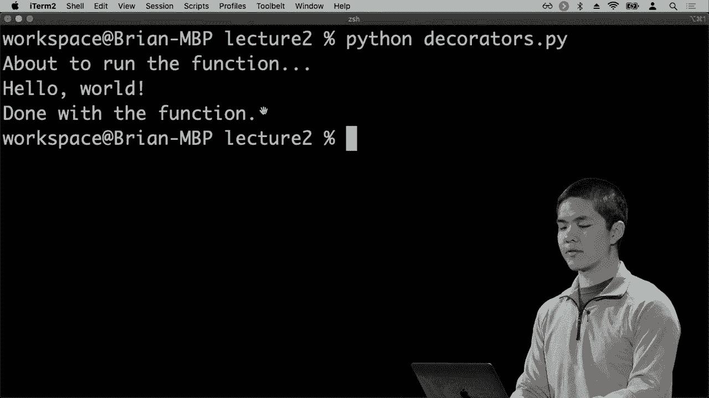

# 【双语字幕+资料下载】哈佛 CS50-WEB ｜ 基于Python ／ JavaScript的Web编程(2020·完整版) - P8：L2- Python编程语言全解 2 (函数，面向对象，异常处理) - ShowMeAI - BV1gL411x7NY

we'll take a look at our functions in，Python that are going to be some way for。us to write our own functions that take，an input and produce some output we've。already seen a number of different，functions that already exist in Python。we've seen the input function that takes，an input from the user we've seen the。

print function that takes some text or，some other information and prints it to。the screen but if we want to define our，own functions we can do so as well。so here I'll go ahead and write a new，program called function stop PI and。let's write a function that takes a，number and squ*res it so the squ*re of。

10 is 10 times 10 or 100 I would like a，function that very easily takes a number。and returns its squ*re the way I define，a function in Python is using the DEF。keyword def short for define and here I，can say let me define a function called。squ*re and then in parentheses what，inputs it takes in this case squ*re just。

takes a single input that I'm gonna call，X but if there were multiple inputs I。could separate them with commas like X Y，Z for a function that took three inputs。for example but in this case there's，just a single input X and the squ*re。function could have any logic in it，indented underneath the squ*re function。

but ultimately this function is fairly，simple all it's going to do is return x。times X X multiplied by itself and now，if I want to print out a whole bunch of。squ*res of numbers I can do so I can say，for I in range let's say 10 let's print。

out that the squ*re of I is squ*re I so，let's try and parse out what's going on。here line 4 says for I in range 10 do，some loop ten times looping from 0 all。the way up to 9 and for each time we，loop we're going to print something out。we're gonna print out the squ*re of plug，in the value of I here is plug in the。

value of calling our squ*re function，using I as input so that is going to。have the result of running this loop ten，times and printing out this line 10。different times each with a different，value of I so I can run Python functions，pi and here's。I see the squ*re of zero is zero squ*re。

of one is one two is for someone and so，forth all the way up to the squ*re of 9。is 81 so we've now written a function，and been able to use it but ideally when，we write functions。we'd like to not just be able to use，them in the same file but for others to。be able to use them as well and so how，can we do that well in order to do that。

you can import functions from other，Python modules or files so to speak so。let me create a new file called squ*res，PI for example so then instead of。running this loop here let's instead run，this loop in squ*res PI again separating。out different parts of my code I have，one file that defines the squ*re。

function inside of functions pi and then。

another file called squ*res pi where I'm，actually calling the squ*re function now。

if I try to run Python squ*res pi you'll，notice I'll run into an error here's。another error you'll see quite，frequently it's a name error another。type of exception which here says the，name squ*re is not defined meaning I'm。trying to use a variable or a function，name or something else that doesn't。

actually have a definition I've never，said what squ*re is and that's because。by default Python files don't know about，each other if I want to use a function。that was defined inside of another file，I need to import it from that file and I。can do so like so I can say from，functions import squ*re functions was。

the name of this file function stop PI，and I'm saying from that Python module I。would like to import the squ*re function。

as a function that I would like to use。

now I can run Python squ*res da PI and，we get the output that we expect no more。exception I've now been able to import，something from another module and access。it this way so this is one way to import，to literally say from functions import a。squ*re function import a particular name，that is defined inside a function stop。

PI another way I could have done this is，just to say import functions just import。that whole module but then I would need，to say instead of just squ*re I would，need to say from。Shin's dot squ*re to mean go inside the，functions module and get the squ*re。function and run that function and this，would operate in exactly the same way so。

a couple of different options either，import the entire module in which case I。use this dot notation to say access a，particular part of that module or I say。from functions of import squ*re to just，import the name squ*re into this file。entirely so that I can just use the word，squ*re whenever I want to and this works。

not just for modules that we have，written but also Python comes with a。number of built-in modules if you want，to write programs that interact with CSV。files which are a spreadsheet file，format I can import pythons built in CSV。module to get access to a whole bunch of，CSV related features there are a whole。

bunch of math related features you can，get by importing the math module so on。and so forth and there are additional，Python modules and packages that you can。install that other people have written，time comes，and next time as we take a look at。Django this is one of the techniques，that we're going to be looking at is。

using functions that have been written，by people that are not ourselves so that。now is modules and how we can use，modules to be able to import functions。in order to allow for certain behavior，and this is one way that we can program。using the Python programming language，but another key technique the Python。

supports that are supported by a number，of other programming languages as well。is an idea of object-oriented，programming a special type of，programming or a programming paradigm so。to speak which is a way of thinking，about the way that we write programs and。in object-oriented programming we think，about the world in terms of objects。

where objects might store information，store some data inside of them and also。support the ability to perform types of，operations some sort of actions or。methods or functions as we might call，them that can operate on those objects。so now we're going to take a look at，some of the object-oriented capacities。

that the Python programming language is，going to give us the ability to have so，types。it has types for lists it as types for，sets and so on and so forth。let's imagine though that we want to，create a new type in Python some way of。representing other types of data，for example two-dimensional points。

things we talked about before something，that has an x value and the y value now。as we've already discussed you could do，this using the tupple just using one。number comma another number but we could，create an entire class of objects to be。able to represent this data structure as，well and so that's what we'll take a。

look at now is how to create a class in，Python so a create a new file called。classes PI and all a class is if you can，think of a class as a template for a。type of object we are going to define a，new class called point and then after。we've defined what a point is we will be，able to create other points we'll be。

able to create points to store x and y，values for example and so what do we。need in order to create a class well we，need some way to say that when I create。a point what should happen and in Python，this is defined using of what's called a。magic method called underscore，underscore init an underscore underscore。

in it is a method or function that is，going to automatically be called。every time that I try to create a new，point and this function takes a couple。of arguments all functions that operate，on objects themselves otherwise known as。methods are going to take the first，argument called self and this argument。

self represents the object in question，and this is going to be important。because we don't just want a single，variable called X to store the points。x-coordinate or a single variable called，Y to store the y-coordinate because two。different points might have different X，and different Y values and we want to be。

able to store those separately and we're，going to store them inside of the object。itself so this variable self references，the object that we are currently dealing。with and it might change depending on，which point we happen to be interacting，with at any given time。what other inputs does a point need will，a point also needs an x value and a Y。

value so when we create a point we're，going to provide to that point an x。value and a y value now what do we need，to do in order to store all this data。inside of the point well recall that，self is representing，the point itself and so if we want to。store data inside of that point allow，the point to store its own x and y。

values then weenus we need to store that，data inside of the cells so to speak and。in order to do that we can use this dot，notation to say self dot X is equal to。whatever this input X happens to be and，self dot Y is equal to whatever this。argument Y happens to be and these，values x and y they could be called。

anything they could just be called like，input 1 and input 2 for example and then。you would just reflect them here the，important thing is that these two input。values are being stored inside of the，point itself in properties that we're。going to call x and y all right so that，was a little bit abstract but let now。

let's see how we could actually use this，if I want to create a new point called P。I can say P equals point and then the，self argument is going to be provided。automatically I don't need to worry，about that but I do need to provide。input 1 and input 2 the x value and the，y value so I'll go ahead and provide an。

x value of 2 and a y value of 8 for，example so now I've created this point。and now that I have a point I can print，out information about the point I can。print out the x value of the point and I，can print out the Y value of the point。again I'm using this dot notation to say，go into the point and access data that。

is stored inside of that point access。

its x value and excesses Y value so now，when I run this program Python classes。pi what I get is 2 on the first line。

that is the x value and then 8 on the，second or 8 on the second line that is。the Y value so what we have here is a，function called init that creates a。point by storing the two inputs inside，of the object inside of a property。called X and a property called Y such，that later I can create a point which。

calls this init function implicitly and，after we've created the point I can。access the data inside of it I can say，print out whatever P dot X is equal to。print out whatever P dot Y is equal to，as well，so that was a fairly simple example of。creating a class just creating a class，for representing a point in X and a y。

value let's look at a more interesting，example let's imagine that we're trying。to write a program for an airline where，the airline needs to keep track of。booking passengers on a flight and，making sure that no flight gets。overbooked we don't want more passengers，on the flight then there is capacity on。

that flight so let's define a new class，that we're gonna call flight and this。time the init method is just going to，take a single argument other than the。self which is the capacity every flight，needs some sort of capacity to know how。many people can fit on the plane and so，I'll store that inside of a value called。

self dot capacity equals capacity and，what other information do we need to。store about a flight well a flight has a，capacity and it also has all of the。passengers on the flight and so we could，represent this in a number of ways but。we know that lists can be used in order，to store a sequence of values so we'll。

go ahead and just create a list that，will store in self dot passengers that。is going to be equal to the empty list，so we start out with an empty list of。passengers so now if I want to create a，flight I can say flight equals and then。capital F flight that's the name of the，class and then provide a capacity I can。

say capacity of three to mean three，people can go in the flight but no more。than three that is the capacity because，that is the argument that's specified。inside of this init function and when I，do so I'm automatically going to get。this empty list of passengers so now，let's think about what methods or what。

functions we might care about performing，when it comes to a flight so one。reasonable function to add would be a，function that says alright let's add a。passenger to the flight if I want，someone new to go on this light so how。might I go about doing that well let's，define a new method also known as a。

function to this flight class called add，a passenger this method can be called。whatever we want because this is a，method that's going to work on an。individual object we need some way of，referencing that object itself so we'll。use the keyword self again and when we，add a passenger we need to add a path。

by their name so I need to specify their，name as well such that now here I want。to add that name to the passengers list，how do I get access to the passengers。list will I have access to the self the，object itself and I stored the。passengers inside of self in self dot，passenger in attribute of this object。

and self dot passengers is a list that，initially starts out as an empty list。but if I want to add something to the，end of the list we've already seen that。in order to do that I can say self dot，passengers dot append name so that adds。someone new to the end of this，passengers list now what could good。

potentially go wrong here well every，time we call this add passenger function。what's going to happen is we are going，to append to the end of this passengers。list this name but we haven't taken into，consideration the capacity of the flight。ideally our add passengers function，shouldn't let someone be added to a。

flight if the flight is already at，capacity so there are a number of things。we could do here we could just check it，inside of this function but just for。good measure let's create a new function，let's add a new function called open。seats that is going to return the number，of open seats that are on the plane。

other than self there are no other，inputs that we need to calculate how。many open seats there are the only thing，we need to know in order to calculate。open seats is we need to know the，capacity - however many passengers there。are remember self dot passengers is our，list of all the passengers and anytime。

we have a sequence to get the length of，that sequence I can say Len or length of。that sequence to say get me the number，of passengers that there are so now we。have this function called open seats，which will return capacity - the number。of passengers and tell us how many open，seats there are and now in this add。

passenger function I can add some，additional logic I can say if，not self dot open seats so this is。equivalent to me saying in this case，like if self don't open seats equals。equals zero meaning there are no open，seats a more pythonic way so to speak of。expressing this idea is just saying if，not self not open seats in other words。

if there aren't any more open seats then，what should we do we should return and。maybe you might imagine this add，passenger function returns true if it。was able to successfully add a passenger，and false otherwise so in this case I。can return false to say you know what，there aren't enough open seats let me。

return false from this function to，indicate that there was some sort of。error but otherwise if there are open，seats we can add the passenger and。return true to mean that everything was，okay we were able to add the passenger。successfully so now we have these three，functions in it that creates a new。

flight add passenger that adds a new，passenger to that flight and open seats。which tells us how many open seats there，are and now let's use those functions to。actually add some passengers to this，flight let me get a list of people will。say Harry Ron Hermione and Ginny and now，let me loop over all of those people for。

every person in that list of people，let's try to flight add passenger person。and we can save the result in a variable，called success for example and then I，can say if success。well then let's print out that we added，the person to flight successfully but。else otherwise let's print out no。

available seats for that person so，what's going on here we have a list of。people for people and for each of those，people we're gonna try and add the。passenger to the flight calling flight，add passenger calling this method。passing as input the person's name and，save the result true or false in this。

variable called success if success is，true we print out we've added them。successfully otherwise we print out，there are no available seats for that，person。and now we can try running this program，I'll run Python classes Piatt and now we。see we've added Harry Ron and Hermione，to the flight successfully but the。

flight had a capacity of three which，means there are no available seats for。Ginny which we get as the error message，on the fourth line and if you're really。trying to optimize you might notice that，you don't really need this variable I。could just take this entire expression，flight add passenger person and put it。

in the condition itself I can say try，and add a passenger add passenger will。return true or false and if it returns，true that means it was a success and。then I can print out that we've added，the person to the flight successfully so。that is a brief look at object-oriented，programming this technique within Python。

and other programming languages to，represent objects like this particular。flight and then to manipulate those，objects using methods like the add。passenger method that takes a flight and，adds people to it at least as long as。there is available capacity on that，flight so one of the many powerful。

features of Python but will be，definitely taking a look at later in the。term and using as we go about building，these web applications now there are a。couple of final examples that are Juris，worth taking a look at just to give you。some exposure to some of the other，features that are available in python。

one thing that will be coming up soon is，the idea of decorators and just as we。can take a value in python like a number，and modify the value decorators are away。in Python of taking a function and，modifying that function adding some。additional behavior to that function so，I'll create a new file called decorators。

pi just to demonstrate what we can do，with decorators and the idea of a。decorator is a decorator is going to be，a function that takes a function as。input and returns a modified version of，that function as output so unlike other。programming languages where functions，just exist on their own and they can't。

be passed in as input or output to other，functions in Python a function is just a。value like any other you can pass it as，input to another function you can get it。as the output of another function and，this is known as a functional。programming paradigm where functions are，themselves values so let's create a。

function that modifies another function，by announcing，that the function is about to run and。that the function is completed running，just to demonstrate so this announced。function will take us input a function f，and it's going to return a new function。and usually this function wraps up this，function f with some additional behavior。

and for that reason is often called a，wrapper function so we may call this。wrapper to say that alright what is my，wrapper function going to do its first。going to print about to run the function，just to announce that we're about to run。the function that's what I want my，announced decorator to do then let's。

actually run the function f and then，let's print done with the function so。what my announced decorator is doing is，it's taking the function f and it's。creating a new function that just，announces via a print statement before。and after the function is done running，and then at the end we'll return this。

new function which is the wrapper，function so this right here is what we。might call a decorator a function that，takes a function modifies it by adding。some additional capabilities to it and，then gives us back some output and so。now here I can define a function called，hello that just prints hello world for。

example and then to add a decorator I，use the @ symbol I can say at announce。to say add the announced decorator to，this function and then I'll just run the。

happens，I'll run Python decorators dot Pi and I，see about to run the function then hello。

world then done with the function so，again why did that work it's because our。hello function that just printed hello，world is wrapped inside of this。announced decorator where what the，announced decorator does is it takes our。hello function of input and gets us a，new function that first prints an alert。

warning that we're about to run the，function actually runs the function and。then prints another message so a bit of，a simple example here but there's a lot。of power in decorators for being able to，very quickly take a function and add。capability to it you might imagine in a，web application if you only want certain。

functions to be able to run it if a user，is logged in you can imagine writing a。decorator that checks to make sure that，a user is logged in and。just using that decorator on all of the，functions that you want to make sure。only work when a user so happens to be，logged in so decorators are a very。

powerful tool that web application，frameworks like Django can make use of。just to make the web application，development process a little bit easier。as well let's take a look at a couple，other techniques that exist within。Python one is how we might be able to，more efficiently represent functions so。

let's imagine that I now have I'm gonna，call this lambda PI for a reason you'll。see in a moment let's imagine that I，have a list of names or people for。example and inside of this list of，people each person instead of being just。a string is going to be a dictionary，that has both a name like Harry and a，house like Gryffindor。

and let me add another name like Cho and，a house like Ravenclaw and then another。name like Draco and a house like，Slytherin，so here we have a list where each of the。elements inside of that list is a，dictionary a mapping of keys and values。and that's totally okay in Python we，have the ability to nest data structures。

within one another we can have lists，inside of other lists or lists inside of。dictionaries or in this case，dictionaries inside of a list and in。fact this nesting of data structures is，one of the reasons why it's very easy in。python to be able to represent，structured data like a list of people。

where every person has various different，properties what I might like to do now。is something like sort all of these，people and then print them all out so I。might want to say people dot sort and，then print all the people but if I try。

to run this I'll get an exception I get，an exception type error less than not。supported between dict and depth which，is sort of weird because I'm not using。any less than symbol at all anywhere my，program but in the trace back you'll see。that the line of code that is catching，on is people dot sort somehow people dot。

sort is causing a type error because，it's trying to use less than to compare。

to dictionaries and what this appears to，mean is that Python doesn't know how to。sort these dictionaries it doesn't know，does Harry belong before or after。Choa because it doesn't know how to，compare these two elements and so if I。want to do something like this then I，need to tell the sort function how to。

sort these people and so in order to do，that one way I could do this is by。defining a function that tells the sort，function how to do the sorting what to。look at when sorting so if I want to，sort by people's name let me define a。function that I'll just call f that，takes a person as input and returns that。

person's name by looking up the name，field inside of that dictionary and now。I can sort people by their name by，saying sort key equals F what this means。is sort all the people and the way to，sort them the way you know how to。compare them is by running this function，where this function takes a person and。

gives us back their name and this will，sort everyone by name now if I run。Python lambda PI you'll see that I first，get show then Drako。

then Harry in alphabetical order by name，whereas if instead I had tried to sort。

people by their house by changing my，function that I'm using to sort and then。rerun this now I see that it's first，Harry who's in Gryffindor then Ravenclaw。then Slytherin for example so we get the。

houses in alphabetical order instead but，the reason I show this is because this。function is so simple and is only used，in one place Python actually gives us an。easier way to represent a very short，one-line function using something called。a lambda expression and this is a way of，including the function just as a single。

value on a single line I can say instead，of defining a function called F I can。get rid of all of this and just say sort，by this key a lambda which is a function。that takes a person and returns the，person's name so we say person is the，input ：

 person name as the output this，is a condensed way of saying the same。thing we saw a moment ago of defining a，function giving it a name and then。passing in the name here this right here，is a complete function that takes a。

person and as input and returns their。

name so python lambda pi that will，actually sort the people by their name。

Cho then Draco then Harry whereas if I，have left off this key altogether。

and then tried to sort well then we get，this type error because we can't compare。these two dictionaries so we've seen a，lot of different exceptions now that are。out Python so the very last example，we'll take a look at is an example of。how to deal with these exceptions like，what to do when things might go wrong if。

we want our program to be able to handle，those possible exceptional cases。situations where things might in fact go，wrong so let's try an example I'll。create a new file that I'm going to call，exception stop PI and what exceptions。that PI is going to do is it's going to，get some input it's going to say let's。

get an integer input called X and let's，get an integer input called Y and then。it let's go ahead and print out the，result of X divided by Y so result。equals x divided by Y and then let's，print out something like X divided by y。equals result and we can literally print，out the values of x and y so this is a。

simple program that's just performing，some division get a value of X get a。value of y divide the two and print out。

the result we can try running this，running Python exception stop I am if I。type in like 5 and then 10 5 divided by，10 is 0。5 exactly where my I might。expect but what could go wrong now you，remember from math in division what。could go wrong is if I type in 5 and，then 0 and try and do 5 divided by 0。

what's going to happen well when I do，that I get an exception I get a 0。division error which is an error that，happens whenever you try to divide by 0。what I'd like to happen though in this，case is not for my program to display。kind of a messy error and a traceback，like this but to handle the exception。

gracefully so to speak to be able to，catch when the user does something wrong。

and report a nicer looking message，instead and so how might I go about。doing that well one thing I can do here，is instead of just saying result equals。x over Y I can say try to do this try to，set result equal to X divided by Y and。then say except if a 0 division error，happens then let's do something else，let's print。

I cannot divide by zero and then exit，the program how do you exit the program。it turns out there's a module in Python，called sis and if I import the Syst。module I can say sis dot exit one to，mean exit the program with a status code。of one where a status code of one，generally means something went wrong in。

this program so now I'm trying to divide，X divided by Y except I have an。exception handler this is a try except，expression I'm saying try to do this。except if this exception happens rather，than have the program crash just print。out this error message can't divide by。

zero and then exit the program so now，let's try it，python exception stop PI again 5 and 10。works totally normally gets me a value，of 0。5 and but now if I try 5 and 0。press return I get an error cannot，divide by 0 no long exception that's。gonna look complicated to the user it's，no longer messy I've been able to handle。

the exception gracefully now one other，exception that might come up is what if。instead of X is 5 I type in a word like，hello something that's not a number now。I get another type of exception a value，error which is happening when I try and。convert something to an int because，integer，you can't take text that is not a number。

and turn it into an integer so instead。

I'm getting this value error here how，can I deal with that well I can deal。with it in much the same way when I'm，getting this input X&Y I can say rather。than just get the input just try to get。

the input except if a value error，happens which is the error that we got a。

moment ago this value error then print，error invalid input and go ahead and sis。not exit 1 so now I've been able to。

handle that error as well I can say，Python exception stop I am I can say。hello and I just get error invalid input，I can divide by zero I get error cannot。divide by zero but if I do type a valid，x and a y value then I get the result of。

dividing one number by the other so，exception handling is often a helpful。tool for if you expect that some lines，of code you might be running might run。into some sort of problem，be they a value error or zero division。error or some other error altogether to，be able to handle those errors。

gracefully and that's probably what you，want if you're going about building a。web application using Python is the，ability to say that if something goes。wrong we want to handle the error nicely，display a nice error message to the user。telling them what was wrong instead of，having the program entirely crash so。

those are some of the key features now，this Python programming language this。language that gives us the ability to，define these functions and loops and。conditions and very convenient ways to，create classes where we can begin to。build objects that are able to perform，various different types of tasks and。

next time using Python we'll be able to，design web applications such that users。are able to make requests to our web，applications and get some sort of。response back so we will see you next。