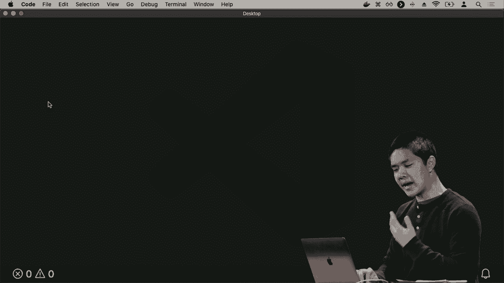
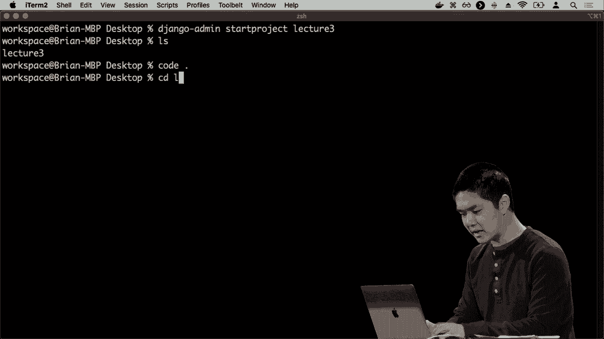
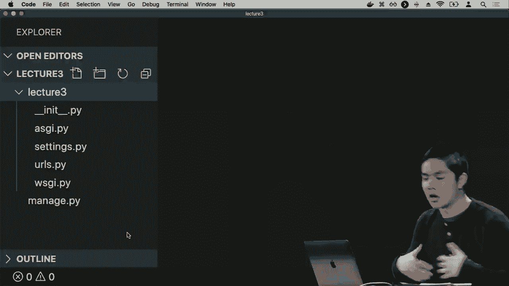
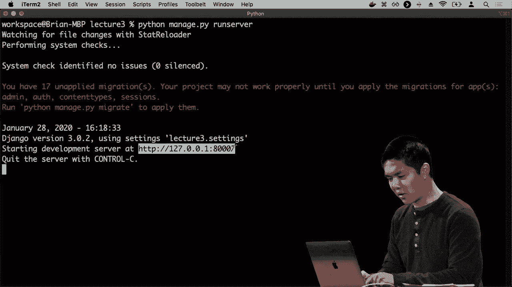
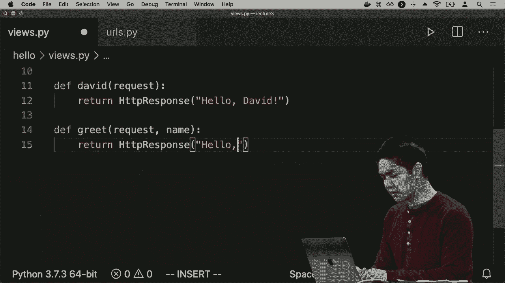
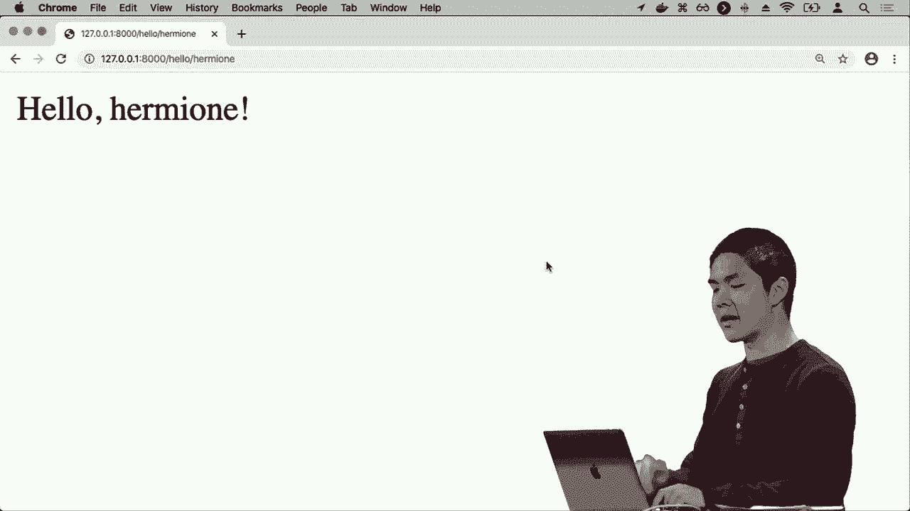
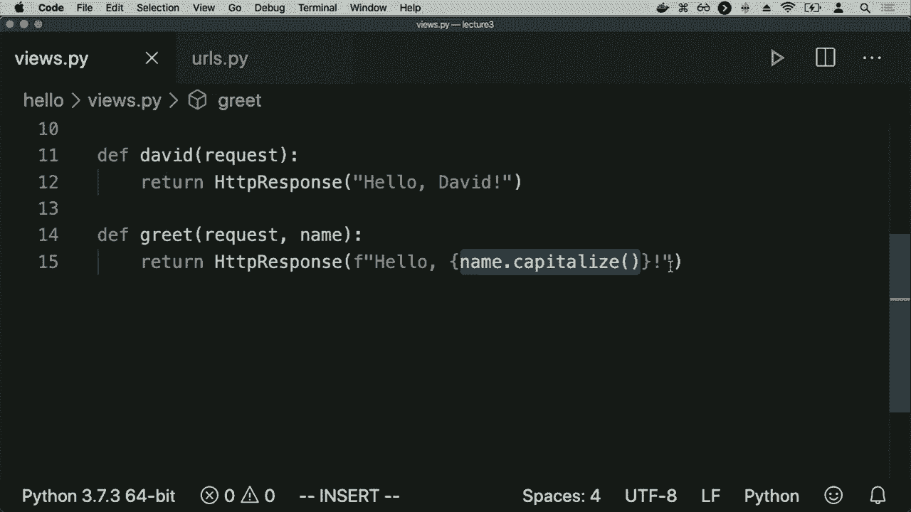

# 【双语字幕+资料下载】哈佛 CS50-WEB ｜ 基于Python ／ JavaScript的Web编程(2020·完整版) - P9：L3- Django网络编程 1 (web应用，http，路由) - ShowMeAI - BV1gL411x7NY

[Music]，okay welcome back everyone to web，programming with Python and JavaScript。so thus far in the course we've taken a，look at a couple of different。technologies we took a look at HTML and，CSS which are languages we can use to。describe the structure of a web page and，then style it appropriately and then we。

also took a look at Python a programming，language that we could use to get。programming features features like loops，and conditions and variables and。functions and more and what we're going，to do today is introduce Django which is。going to combine these two Django is a，Python web framework which is going to。

allow us to write Python code that is，able to dynamically generate HTML and。CSS ultimately allowing us to build a，dynamic web application so what is this。now going to enable us to do that we，weren't able to previously do using just。HTML and CSS well using HTML and CSS the，web pages that we created were static。

web pages they were the same and every，time you visited the web page the page。you were looking at was identical but，ultimately if you think about websites。you interact with on a day to day basis，say like the New York Times for example。it's not the case that every time you go，to the New York Times home page you're。

seeing the exact same HTML it changes，the next day you might see the new date。you might see the next day's articles，whenever someone comments on an article。you can see those comments and you can，see how many people have commented on an。article for example and it's probably，not the case that someone is sitting。

there updating the HTML of the New York，Times website every time something。changes but rather more likely there is，some program may be written Python may。be written in some other language that，is dynamically generating that HTML and。CSS and allowing the web application to，respond based on how users are。

interacting with it and this is，ultimately what we're going to be trying。to create using this django web，framework we're going to be creating。software that's going to run on a web，server such that clients running in。their web browser can make requests to，our web server and our server is going。

to respond back with some sort of，response and so how does this process。actually happen well ultimately it boils，down to this protocol HTTP otherwise。known as the hypertext Transfer Protocol，which is the protocol for how messages。are going to be sent back and forth over，the Internet in this case you can think。

about this as a computer some user which，we might call the client and then our。server which is going to be the server，that is going to contain our web。application we are going to write，a web application that is going to run。on this server and clients are going to，make requests to that server the server。

is going to process that request and，then return some sort of response that。request might look a little something，like this underneath the hood it might。start with the word get get is just an，example of a request method a way that。you might try to get a page so get just，means I would like to get a particular。

page in this case the page I'm trying to，get is the slash page just denoting the。root of the website usually the default。

page for the website HTTP 1-1 is just，the version of HTTP that we're using and。the host is what URL we're trying to，access the web page for so example。com。or some other website for example that I，might be trying to make a request to so。this request ultimately gets sent by my，web browser when I type in a URL and。

press return for example the server，processes that request and then gives。back some sort of response and the，response will generally look a little，something like this。beginning with the HTTP version 1。1 or，in some cases - version 2 now and then。some sort of response code 200 is a，response code that just means okay。

everything was okay the page was，returned successfully for example and。here on the second line we see content，type text slash HTML which just means。the format of the data that's coming，back in this response is HTML data its。HTML data that the user's web browser on，the client should then render as HTML。

for example and there are other content，types as well and other information that。comes back in that response but the key，idea is just thinking about the web in。terms of requests and responses one user，makes a request to get a particular。webpage and what they get back is a，response like this that hopefully。

includes status code 200 which means ok，but there are a number of other status。codes as well some of the more popular，200 means okay you've probably seen 404。the status code that means not found if，you try to request a web page that。doesn't exist for example others you，might see your 301 moved permanently。

that often happens if you're redirected，from one website to another for example。we'll take a look at an example of that，shortly 403 generally means forbidden。you're trying to access a page you're，not supposed to have access to and 500。usually refers to some sort of internal，server error usually meaning that。

whoever was writing the server maybe our，Django web application has。something that's buggy in it and we，might need to go back and figure out。where that bug is in order to fix it and，again there are other status codes as。well but these are some of the most，common that we're going to be seeing and。

interacting with as we go about building，web applications using Django。so Django is a web framework it's a set，of tools it has already built for us。that's just going to make it easy to get，started by writing Python code in order。to design a fully fledged web，application by taking care of some of。

the stuff that most web pages all have，to do such that we can focus on the。interesting logic of building our own，web applications，so the first step you'll need to do in。order to use Django is to install it if，you're using Python you may be familiar。with pip the Python package manager。

which makes it easy to be able to，install new packages and the first thing。we'll probably want to do is install at，Django and here we're gonna be using。Python 3 so you might need to specify，pip 3 and install Django to install。Django on your system and after you do，we can run a command to be able to。

create a Django project and that command，looks something like this。Django - admin start project followed by，the name of the project that we would。like to create when we run this command，Django is automatically going to create。some starter files for us just to get，started with the process of building a。

web application so let's try creating a，project now I'll go ahead and go into my。terminal window and what I'm going to do，is type that command I'm gonna type。Django admin and then start project and，then I need to give this project a name。and I'm just going to give this project，a name of lecture 3 for example you can。

name the project whatever you'd like and，when that happens if I type ls' what I。see is that a lecture 3 directory or，folder has been created for me by Django。

and if I go ahead and open this up，inside of my text editor we can take a。

look at what files are inside of this，lecture 3 directory so actually I'll go。

ahead and CD into lecture 3 and open it，up and what we see inside of lecture 3。

are a couple of files that were given，just to get started so there are a。couple files not all of them are really，interesting to us right now but first。and foremost manage PI is a file that，Django is going to create for us will。generally not need to touch that file，but we're going to use the manage by。

file to be able to execute commands on，this Django project，and we'll see a couple of examples of。that now and a couple of examples of，that in future lectures as well and then。the other important one that we'll be，looking at is settings dot pi which just。contains important configuration，settings for our Django application。

settings dot pi comes preloaded with a，couple of default settings but we might。want to change those settings to be able，to add features to our application as。well or make some modifications to how，the application behaves and then the。other important file that's pre created，for us now here is urls dot pi and you。

can think of urls pi as a sort of table，of contents for our web application then。on any given web application on a，website there are a number of different。URLs or routes that you can visit on，Google for example you can visit slash。search or slash images and URLs pi is，just going to be a table of contents of。

all of the URLs on my web application，that I can ultimately visit and so if。I'd like to try running this web，application just to see what it looks，the terminal。I'll run Python manage PI followed by a，command and the command is called run。server and so this is generally how，we'll use manager op I will run manage。

PI followed by an argument specifying，what command we would like to run and。python managed by run server means go，ahead and actually run this web server。if I do this I'm now running this web，server locally and I see a bunch of。debugging output but the interesting，point to me is that it says down here。

starting development server at HTTP，colon slash slash one 27001 colon 8000。and so this is where my web application，is currently running one 27001 is an IP。address and address on the internet that，just refers to my local computer the。computer I'm looking at right now so，only I can access this not anyone else，on the Internet and 8。

000 is what we，would call a port number it just refers，to what type of service is being run and。you might have multiple different，internet services running on different。ports in this case our django，application is running on port 8000 so。

if i copy this URL and just go ahead and，go into my web browser and paste that。URL in what i see is just Django's，default page to say our installation of。django works and this now is the default，page that django is going to give to us。to say the Django has been loaded for，this web application and we can now。

actually start to begin building this，web application，by adding the features we want to it and。so what we've created here is what we，call a Django project and in terms of。the way a Ginga project is structured is，that every Django project generally。consists of one or more Django，applications so one project may have。

multiple applications within it and the，reason for this division is if you think。about big websites oftentimes a big，website a big project has multiple。different apps that are sort of separate，services that operate within it Google。for example has Google search but also，Google Images and Google News and Google。

Maps where you can think of each of，those individual services as a separate。app oh under one larger project like，Google for example or Amazon's web site。for instance might be one big project，that is a couple of different apps。within it one app for shopping maybe and，one application for Amazon's video。

service for example and so Django comes，pre-loaded with this ability to take a。project and divide it into multiple，distinct apps maybe for simpler apps。we're only going to have a project that，has one app inside of it instead of。multiple but it has the ability to allow，us to create these separate apps that。

have different capacities so if we want，to get started with Django the first。thing we'll need to do after we create a，project is create a django app and so，terminal。i'll go ahead and exit out of this，server by pressing ctrl C to say I would。like to exit stop running the server so，now if I go back to that URL and refresh。

it it won't work because the jenga，server is no longer running but I'll run。the command Python managed up I start，app and then the name of the app that I。would like to create and for our very，first app I'll just call this app hello。for example so I've now created one，Django project called lecture 3 and。

inside of which I've created the very。

first app that I've now called hello and，so if we take a look at our files now。you'll see that it in addition to a，lecture 3 directory which existed before。we also now have a hello directory the，Django created for us that is going to。contain the information needed for the，hello app to work and there are a number。

of files again that are generated by，default we're not going to look at all。of them today we're going to focus，primarily on views dot pi we'll see why。in a moment which is going to be the，file that lets us describe what it is。the user sees when they visit a，particular route for example where we。

can decide what gets rendered to the，and the other files we'll take a look at。over the course of this term taking a，look at what additional features Django，has to offer。so we've now created this hello app that，we would like to install into this。project and in order to install it we，need to go into the settings for this。

particular Django project so if I go，into the lecture 3 directory and open up。settings dot PI what I'll see here is a，big file all created for me by Django I。didn't write any of this code but this，is all just the default configuration。for a Django project and if you scroll，down somewhere there you'll see a。

variable called installed apps which is，where Django configures what apps are。installed on this project and there are，a whole bunch of individual apps that。are installed by default that are just，created by Django one for example。manages sessions which we'll take a look，at a little bit later but if I want to。

add my new app that I've just created，called hello to these installed apps。I'll go ahead and just add to this list，of strings this installed apps variable，I'll just add hello。and so now Hello is going to be an，installed app on this particular Django。project so now what I'd like to do is，actually make this app this hello app do。

something and display something when I，try and visit a particular route for。example so how can I go about doing that，well let's go ahead and go into the。Hello directory and let's take a look at，views dot PI inside of my hello app so。here's the default file I get four views，PI I see a comment that's given to me。

that by default that says create your，views here and you can think of each。view as something the user might want to，see so let's go ahead and just create a。default view and in order to create a，view in Django we're going to define a。function so this function I'll just call，index this function by convention takes。

as argument a request argument and this，is going to be an argument that's going。to represent the HTTP request that the，user made in order to access our web。server so if we want information about，that request we can look inside of this。request object to get access to some，other data and we'll take a look at that。

momentarily too but now what would I，like for this request to do well what I。want to do for now is let's just do，something simple and return an HTTP，response of hello。world for example now HTTP response is a，special class created by Jango and so if。I want to use it I'll generally need to，import it and so Jango is going to give。

us a lot of features that we might want，to use in our web applications but if we。want to use them we generally have to，import them first and it just so happens。and I only know this from reading，Django's documentation that I can。include a line like this from Jango HTTP，import HTTP response to say I would like。

to import the ability to give an HTTP，response and now what I have is a。function representing my view this，function is called index and what the。index function does is it just returns，an HTTP response of hello world and so。this is a response but now we need to，tell the app like when should you。

actually return this response what URL，is the user going to visit and this is。where we now begin to create some URL，configuration some sort of setting to。tell Jango when a particular URL is，visited then this function should be run。in order to return that particular HTTP，response so how'd it do that。

well in order to do that we're going to，need to create a URL spy file for this。particular app so Jango has one URL spy，file that works for the entire project。but oftentimes will have each app，contain its own URLs that PI file just。for the sake of separating things out in，two different places such that if we。

have multiple different apps each of，which is doing something independent we。can have each of those individual apps，have its own URL spy file to control。what URLs are available for that，particular app so I'll go ahead and go。into the hello directory and I'll create，a new file inside of the hello directory。

called URLs PI and what URLs that PI，needs is it needs to define a variable。called URL patterns which will be a list，of all of the allowable URLs that can be。accessed for this particular app and the，way you create a URL is by first。importing from Jango URLs import path，and let's create our first URL I'll say。

path and then the first argument here，I'm going to give the empty string to。mean no additional argument and we'll，see what that means in just a moment。meaning nothing at the end，the route and then the second argument。to path is what view should be rendered，when this URL is visited and so if I。

want to render my index view，recall that in views dot PI over here I。have this index function then what I，want to render when someone visits this。URL the empty URL is going to be views，dot index views that is represents views。PI that file where I've defined all of，my views and index just so happens to be。

the name of the function that I want to，call when someone visits this URL for。example and then you can optionally，provide a path with a string name to。represent this URL I'm gonna give this a，name of index we'll see why this can be。useful later on but the idea is giving a，name to a particular URL pattern makes。

it easy to reference it from other parts，of the application so later when we。might want to link two things or have，forms that are submitting to different。parts of the web application giving a，name to a path can be a useful tool in。order to use views last line I need to，add URLs dot pi is to say from dot in。

other words from the current directory，go ahead and import views anytime I'm。using a variable name like views I'm，using that name I need to import it from。somewhere and it just so happens that，views dot PI and URL CI are located in。the same directory so I can just say，from dot import views to import all of。

that into this particular file so this，now is the URLs PI file for this。application but the last step in order，to get all of this working for the very。first time is to go back into the，lecture 3 directory and open up URLs PI。here this is the URLs PI file for the，entire project for all of the apps that。

might be contained within this project，and it just so happens that there's one。path already given to us by default，called admin which runs a default Django。application called the admin application，we'll see more about that in the next。lecture but for now I'd like to add my，own route here to say that I would like。

for a particular path to lead to not the，admin app but the hello app that I have。just now created so I'll go ahead and，give this a path of hello and what I'd。like to do is say that after you've，included the path hello go ahead and。include all of the URLs from the URLs PI，of my，low application I basically like to link。

these two URL configuration Styles，together and so the command to do that。is include hello dot URLs inside of the，Hello module get at the URLs URLs file。there and that is now what I would like，to add as a URL pattern and in order to。do this I also need to import include，since I'm using include inside of URL。

patterns so that was a lot of steps just，to get things started but just to get a。high-level overview of how this is all，working I have a Django project called。lecture 3 and inside of lecture 3，there's a URLs file that decides what。URLs I can access I can access slash，admin which takes me to the admin。

application which is created by Django，we don't have to worry about that just。yet but now I've just added that you can，go to slash hello to go to the hello。application and when you do that I'm，telling Django to look at the URLs PI。inside of the hello directory to figure，out what additional URLs I can get to。

from there so this is one master URLs，dot pi file that might connect to，multiple different other URL。configurations that exists as well then，inside of the URLs PI for my app for the。hello app I've said that when someone，visits just the default route on this。

particular application go ahead and just，run the index function that is one of my。views so all that's decided now that，that is done I should be able to go back。into my terminal and run Python manish，up I run server to actually start up。

this web server and now I can go back to，this URL but instead of just going to。that default URL I'll go ahead and go to，that URL slash hello and when I go to。

slash hello what I see is hello world so，what was happening there is that I typed。in the URL that you are L went to Django，and Django looked at that URL and looked。at my URLs dot PI file and said you know，anytime something starts with slash。hello that belongs to the hello app and，inside of our hello configuration we。

said that when we go to the default，route we should run the index function。and the index function returns this，hello world response and now we can。begin to change that response we can，begin to adjust what it is that views hi。is actually doing right，now it says hello world but if I want to。

change it to just say like hello for。

example I can just edit it now say the，index function just returns an HTTP。

response of hello for example and so now，I fir refreshed this page now it just。says hello so I can edit my files when I，do django notices that a change has been。made and it will reappear with my latest，code such that now I can visit slash。hello and I can see that an HTTP，response of hello is what ultimately。

comes back to me so now let's take a，look at the idea that in addition to。just having one view inside of us by I，can have as many views as I want I can。create additional functions that each，return different responses maybe I'd。like a route that says hello to me for，example so let me define a new function。

then I'll call Brian that accepts the，request argument and this function is。just going to return HTTP response hello，Brian for example and now I need to。associate this new view that I've，created with a URL so I'll go ahead and。go back to URLs PI inside of my hello，directory and so I have a default route。

represented by the empty string that，loads the index function but I can add。to this just add to this list add a new，path where if I type Brian into the URL。instead that will load the Brian，function and I'll go ahead and give that。

a name as well so now if i refresh the，page I'm still on just a slash hello。route and that just displays hello for。

example but if I go to slash Brian for，example now I see hello Brian I have two。different URLs one that is just slash，hello with nothing after it which was。that empty string and one which was，slash hello with Brian following it that。loads a different view function that，returns a different HTTP response and so。

we could imagine continuing to do this I，might want a web application that has a。number of different URLs that I can，visit so I could go ahead and add like a。david function for example that returns，an HTTP response of hello David and then。again inside of my URL configuration I，would say go ahead and give me another。

route called David that loads the david，function，each time I'm giving it a URL so what。

comes after the slash hello I'm giving，it a function to run the David function。inside of the UCI and giving it a name，just to make it easier to reference a。little bit later and so now I have slash，hello / Brian and now I have slash hello。

/ David each of which displays a，different HD view response so you can。imagine starting to use this feature to，begin to build a web application that。has a number of different routes that，has different routes that do different。things and many web applications are，parameterised by what it is it's。

actually in the URL so for example on，Twitter you can go to twitter。com slash。someone's user name to see all of that，users tweets for example or github a。service we've taken a look at now you，can go to github。com slash your github。username to be able to see all of the，repositories for a particular user for。

example so if you think about how that，might be implemented if either of these。services we're using Django they might，have a URL spy file or something like it。that is just defining a whole bunch of，URLs and saying what route should be。associated with them when someone visits，that page but you can imagine ultimately。

that this is probably gonna start to get，tedious that if I want to say hello to。anyone if I want to not only support，slash hello slash Brian and slash David。but I also want to support arbitrary，names like slash Harry or slash wrong or。slash Hermione well then it would seem，that I need to create a whole bunch of。

different functions each of which says，hello to a different person and then。create a whole bunch of different URLs，to be able to do that as well but it。turns out that what I can do is create，URL patterns that have placeholders in。effect things that allow me to parameter，eyes the path via certain paths。

converters so to speak so what does that，actually mean，well let's instead of creating functions。that just say hello Brian and hello，David let me create a new function。that's just called greet for example，that also takes a request but takes an。additional parameter takes a parameter，like someone's name for example and this。

greet function is going to return an。

HTTP response of hello comma and then I，go ahead and plug in the name here I。don't need to add an F to the，the string to indicate that it's a。formatted string this is just python，syntax to say that i would like to say，hello。not just to anyone but to whatever the，value of the name variable happens to be。

i'd like to substitute the name variable，into that greet function and then what I。can do is inside of URLs PI I'll go，ahead and add another path but instead。of saying a name like Brian or David or，Harry for example here I'm going to say。in angled brackets stir colon name and，when someone visits that route let's go。

to the views greet function and the name，for this route will be greet and so。what's going on here is we have a，fundamentally different kind of path。rather than prescribing exactly what the，URL should look like like nothing after。the end of the route or Brian at the end，of the route or David at the end of the。

route this route here on line 7 is，saying this route could be any string。that we're going to give a variable name，of name to but you could replace a name。with something else entirely，and this could be any string so it could。be Brian or David or could be any other，name and when that happens we'll call。

the greet function and when that，function is called it will pass in this。argument this name as a parameter to，that function so now be able to create a。custom route that allows me to specify，any string and figure out how to deal。with that appropriately so now if I，visit slash hello / Harry for example。

not a route that I explicitly created，but that is a string Harry is a string I。press return it says hello Harry，I can go to slash hello slash Ron and。say hello Ron and slash Hermione to see，hello Hermione as well and you know what。maybe just for good measure I'd like to。

capitalize this name like Hermione for，example well the way to do that is that。I can add arbitrary Python logic it，turns out that with any Python string。there is a function or method on that，string called capitalism that I can say。is just dot capitalized and if I can do，it in Python then Django allows me to。

incorporate it into the response that，I'm giving back so I'm now using Python。

to take the name capitalize it and use，that in the response that gets sent back。to the user so now / remaining returns，hello Hermione with a capital H likewise，for hello。

likewise for hello Harry I've now been，able to add a route that takes an HTTP。request as well as a parameter that name，whatever was in the URL and returned an。HTTP response that just says hello to，that person so these HTTP responses can。be any HTML content right now we're just，using text but you can imagine adding。

lists or tables to this as well but you，might imagine that if I have to include。an entire HTML page just inside these，double quotes that's gonna get unwieldy。very quickly very quickly we're gonna，find that there's a lot of HTML to just。go in a single string inside of a Python，program and if we think back to the。

principles and the ideas that we've been，looking at in this course so far we've。generally tried to separate out，different parts of our application。wherever possible and there's a lot of，value in that one and just keeping。things clean too and making sure that，people are able to collaborate if you。

want one person working on the Python，logic and one person working on the HTML。you'd rather they not step on each，other's toes as they're working and so。what we can do in Django is well is，separate the response the HTML from the。actual Python code here as well and so，the way we can do that is instead of。

returning an HTTP response I can instead，let's say for this default route instead。of returning an HTTP response of hello，let me go ahead and render and when I。render something I need to pass in the，HTTP request but I'll also pass it pass。in the name of a template and I'll go，ahead and call this template hello /，index。

html so if I don't want to render，just a string but I want to render an。entire HTML file I can call this render。

function pass in the request but then，also pass in the name of a template and。