# 【双语字幕+资料下载】哈佛CS50-AI ｜ Python人工智能入门(2020·完整版) - P10：L2- 不确定性 3 (采样，马尔可夫，HMM) - ShowMeAI - BV1AQ4y1y7wy

through a procedure known as sampling in，the process of sampling I'm going to。

take a sample of all of the variables，inside of this Bayesian network here and。

how am I going to sample well I'm going，to sample one of the values from each of。

these nodes according to their，probability distribution so how might I。

take a sample of all these nodes we'll，all start at the root I'll start with。

rain here's the distribution for rain，and I'll go ahead and using a random。

number generator or something like it，randomly pick one of these three values。

I'll pick none with probability 0。7，light with probability 0。2 and heavy，with probability 0。

1 so I'll randomly，just pick one of them according to that，distribution and maybe in this case I。

pick none for example then I do the same，thing for the other variable maintenance。

also has a probability distribution and，I'm going to sample now there are three。

probability distributions here but I'm，only going to sample from this first row。

here because I've observed already in my，sample that the value of rain is nunim。

so given that rain is none I'm going to，sample from this distribution to say all。

right what should the value of，maintenance be and in this case，maintenance is going to be let's just。

say yes which happens 40% of the time in，the event that there is no rain for。

example and we'll sample all the rest of，the nodes in this way as well that I。

want a sample from the train，distribution and I'll sample from this。

first row here where there is no rain，but there is track maintenance and I'll。

sample 80% of the time I'll say the，train is on time 20% of the time I'll。

say the train is delayed and finally，we'll do the same thing for whether I。

make it to my appointment or not did I，attend or miss the appointment。

well sample based on this distribution，and maybe say that in this case I attend。

the appointment which happens 90% of the，time when the train is actually on time。

so by going through these nodes I can，very quickly just do some sampling and。

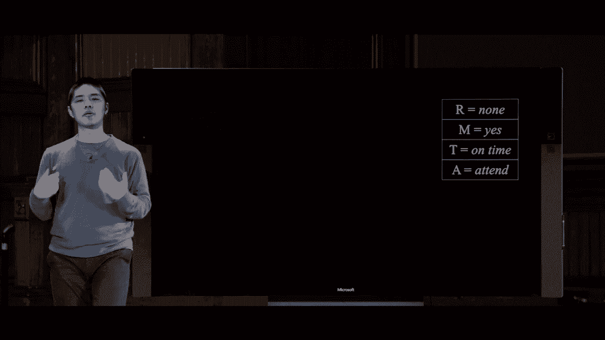

get a sample of the possible values that，could come up from going through this。

entire Bayesian network according to，those probability distributions and。

where this becomes powerful is if I do，this not once but I do this thousands or。

tens of thousands of times and generate，a whole bunch of samples all using this。

distribution I get different samples，maybe some of them are the same but get。

a value for each of the possible，variables that could come up and so then。

if I'm ever faced with a question a，question like what is the probability。

that the train is on time you could do，an exact inference procedure this is no。

different than the inference problem we，had before where I could just。

marginalize look at all the possible，other values as variables and do the。

computation of inference by enumeration，to find out this probability exactly but。

I could also if I don't care about the。

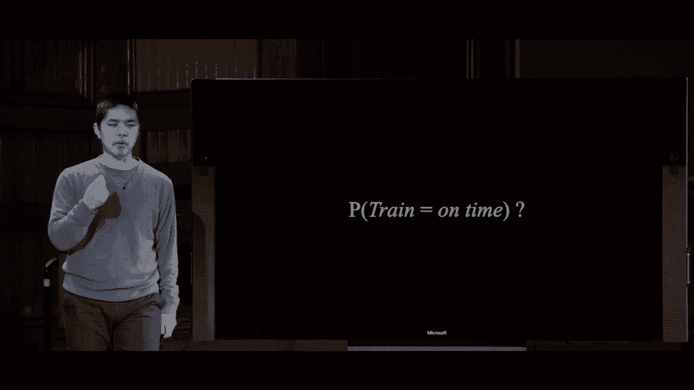

exact probability just sample it，approximate it to get close and this is。

a powerful tool in AI we don't need to，be right a hundred percent of the time。

or we don't need to be exactly right if，we just need to be right with some。

probability we can often do so more，effectively more efficiently and so here。

now are all of those possible samples，I'll sort of highlight the ones that。

where the train is on time I'm ignoring，the ones where the train is delayed and。

you know in this case there's like six，out of eight of the samples have the。

train is arriving on time and so maybe，in this case I can say that in six out。

of eight cases that's the likelihood，that the train is on time and with eight。

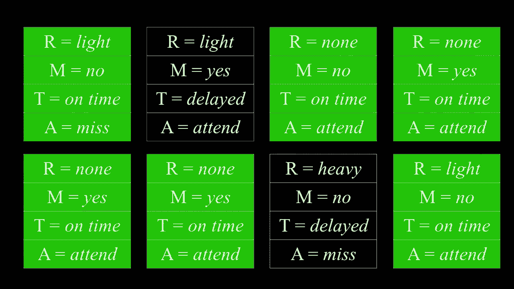

samples that might not be a great，prediction but if I had thousands upon。

thousands of samples then this could be，a much better inference procedure to be。

able to do these sorts of calculations，so this is a direct sampling method to。

just do a bunch of samples and then，figure out what the probability of some。

event is now this from before was an，unconditional probability what。

is the probability that the train is on，time and I did that by looking at all。

the samples and figuring out all right，here the ones where the train is on time。

but sometimes what I want to calculate，is not an unconditional probability but。

rather a conditional probability，something like what is the probability。

that there is light rain given that the，train is on time something to that。

effect and to do that kind of，calculation well what I might do is here。

are all the samples that I have and I，want to calculate a probability。

distribution given that I know that the，train is on time so to be able to do。

that I can kind of look at the two cases，where the train was delayed and ignore。

or reject them sort of exclude them from，the possible samples that I'm。

considering and now I want to look at，these remaining cases where the train is。

on time here the cases where there's，light rain and I say okay these are two。

out of the six possible cases that can，give me an approximation for the。

probability of light rain given the fact，that I know the train was on time and I。

did that in almost exactly the same way，just by adding an additional step by。

saying but all right when I take each，sample let me reject all of the samples。

that don't match my evidence and only，consider the samples that do match what。

it is that I have in my evidence that I，want to make some sort of calculation。

about and it turns out using the，libraries that we've had for bayesian。

networks we can begin to implement this，same sort of idea like implement。

rejection sampling which is what this，method is called to be able to figure。

out some probability not by a direct，inference but instead by sampling so。

what I have here is a program called，sample PI imports the exact same model。

and what I define first is a program to，generate a sample and the way I generate。

a sample is just by looping over all of，the states the states need to be in some。

sort of order to make sure I'm looping，in the correct order but effectively if。

it is a conditional distribution I'm，going to sample based on the parents and。

otherwise I'm just going to directly，sample the variable like rain which has。

no parents it's just an unconditional，distribution and keep track of all those。

parent samples and return the final，sample the exact syntax of this again。

not particularly important it just，happens to be part of the implementation。

details of this particular library the，interesting logic is down below。

that I have the ability to generate a，sample if I want to know the。

distribution of the appointment random。

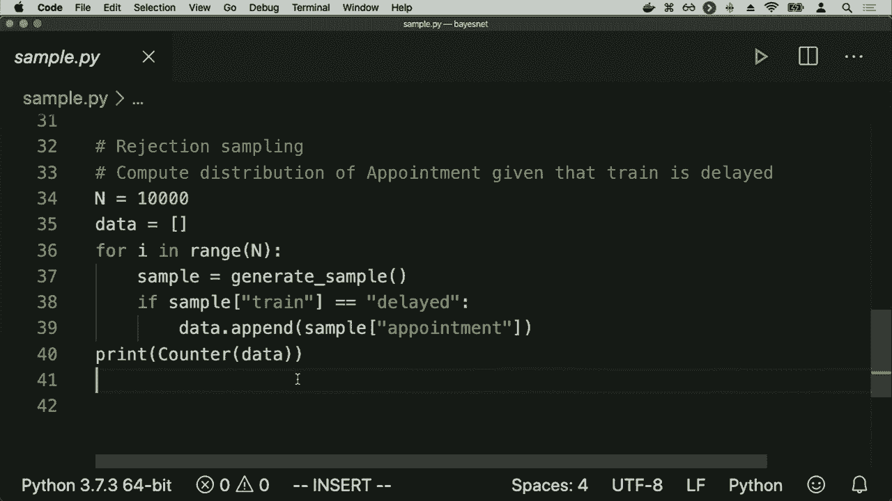

variable given that the train is delayed，well then I've can begin to do。

calculations like this let me take，10，000 samples and assemble all my。

results in this list called data I'll go，ahead and loop n times in this case。

10000 times I'll generate a sample and I，want to know the distribution of。

appointment given that the train is，delayed so according to rejection。

sampling I'm only going to consider，samples where the train is delayed if。

the trains not delayed I'm not going to，consider those values at all so I'm。

going to say all right if I take the，sample look at the value of the train。

random variable if the train is delayed，well let me go ahead and add to my data。

that I'm collecting the value of the，appointment random variable that took。

that it took on in this particular，sample so I'm only considering the。

samples where the train is delayed item，and for each of those samples of。

considering what's the value of，appointment is and then at the end I'm。

using a Python class called counter，which quickly counts up all the values。

inside of a data set so I can take this，list of data and figure out how many。

times was my appointment made and how，many times was my appointment missed and。

so this here with just a couple lines of，code is an implementation of rejection。

sampling and I can run it by going ahead，and running Python sample dot PI and。

when I do that here's the result I get，this is the result of the counter 1251。

times I was able to attend the meeting，and 856 times I was able to miss the。

meaning and you can imagine by doing，more and more samples I'll be able to。

get a better and better more accurate，result and this is a randomized process。

it's going to be an approximation of the，probability if I run at a different time。

you'll notice the numbers are similar，1272 and 905 but they're not identical。

because there's some randomization some，likelihood that things might be higher。

or lower and so this is why we generally，want to try and use more samples so that。

we can have a greater amount of，confidence in our result be more sure。

about the result that we're getting of，whether or not it accurately reflects or。

represents the actual underlying，probabilities that are inherent inside。

of this distribution and so this then，with an instance of rejection sampling。

and it turns out there are a number of，other sample，methods that you could use to begin to。

try to sample one problem that rejection，sampling has is that if the evidence。

you're looking for is a fairly unlikely，event well you're going to be rejecting。

a lot of samples like if I'm looking for，the probability of X given some evidence。

e if E is very unlikely to occur like，occurs maybe one every thousand times。

and then I'm only going to be，considering one out of every thousand。

samples that I do which is a pretty，inefficient method for trying to do this。

sort of calculation I'm throwing away a，lot of samples and it takes。

computational effort to be able to，generate those samples so I'd like to。

not have to do something like that so，there are other sampling methods that。

can try and address this one such，sampling method it's called likelihood。

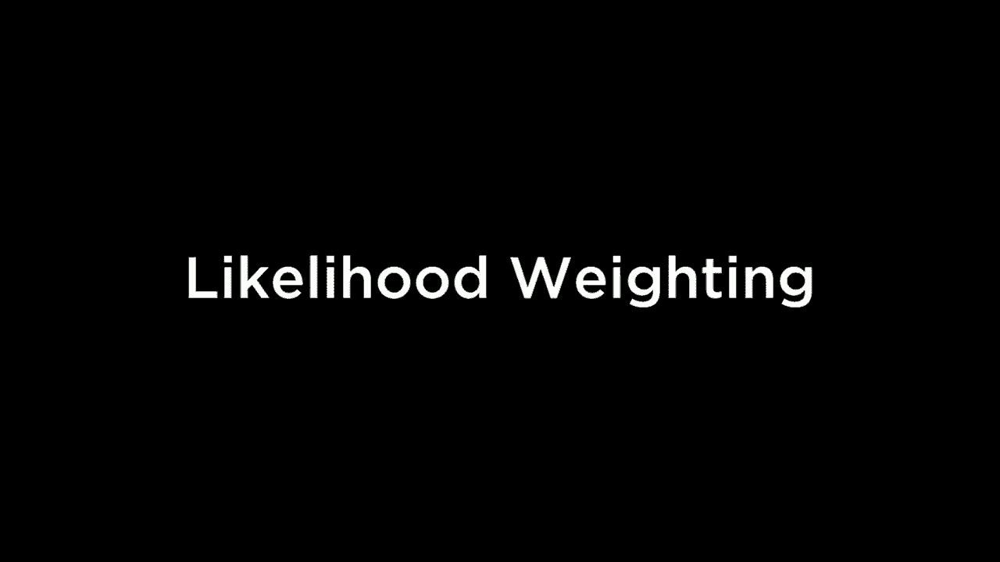

waiting in likelihood waiting we follow，a slightly different procedure and the。

goal is to avoid needing to throw out，samples that didn't match the evidence。

and so what we'll do is we'll start by，fixing the values for the evidence。

variables rather than sample everything，we're going to fix the values of the。

evidence variables and not sample those，then we're going to sample all the other。

non evidence variables in the same way，just using the Bayesian network looking。

at the probability distributions，sampling all the non evidence variables。

but then what we need to do is wait each，sample by its likelihood right if our。

evidence is really unlikely we want to，make sure that we've taken into account。

how likely was the evidence to actually，show up in the sample if I have a sample。

where the evidence was much more likely，to show up than another sample then I。

want to wait the more likely one higher，so we're gonna wait each sample by its。

likelihood where likelihood is just，defined as the probability of all the。

evidence given all the evidence we have，what is the probability that it would。

happen in that particular sample so，before all of our samples were weighted。

equally they all had a weight of 1 when，we were calculating like the overall。

average in this case we're going to，weight each sample multiply each sample。

by its likelihood in order to get the，more accurate distribution so what would。

this look like well if I ask the same，question what is the probability of。

light rain given that the train is on，time when I do the sampling procedure。

and start by trying the sample I'm going，to start by fixing the evidence variable。

I'm already going to have in my sample，know，anything I'm only sampling things where。

I know the value of the variables that，are my evidence are what I expect them。

to be so we'll go ahead and sample from，rain and maybe this time a sample light。

rain instead of no rain then I'll sample，from track maintenance and say maybe yes。

there's track maintenance then for train，well I've already fixed it in place。

train was an evidence variable so I'm，not gonna bother sampling again I'll。

just go ahead and move on I'll move on，to appointment and go ahead and sample。

from appointment as well so now I've，generated a sample I've generated a。

sample by fixing this evidence variable，and sampling the other three and the。

last step is now waiting this sample，like how much weight should it have it。

and the weight is based on like how，probable is it that the train was。

actually on time this evidence actually，happened given the values of these other。

variables light rain and the fact that，yes there was track maintenance well to。

do that I can just go back to the Train，variable and say all right if there was。

light rain and track maintenance the，likelihood of my evidence the likelihood。

that my train was on time is 0。6 and so，this train this particular sample would，have a weight of 0。

6 and I could repeat，the sampling procedure again and again，each time every sample would be given a。

weight according to the probability of，the evidence that I see associated with。

it and there are other sampling methods，that exist as well but all of them are。

designed to try and get it the same idea，to approximate the inference procedure。

of figuring out the value of a variable，so we've now dealt with probability as。

it pertains to particular variables that，have these discrete values but what we。

haven't really considered is how values，might change over time that we've。

considered something like a variable for，rain where rain can take on values of。

none or light rain or heavy rain but in，practice usually when we consider values。

for variables like rain we like to，consider it for overtime how do the。

values of these variables change what do，we do with when we're dealing with。

uncertainty over a period of time which，can come up in the context of weather。

for example if I have sunny days and I，have rainy days and I'd like to know not。

just like what is the probability that。

it's raining now but what is the，probability that it rains tomorrow or。

the day after that or the day after that，and so to do this we're going to。

introduce a slightly different kind of，model but，here we're gonna have a random variable。

not just one for the weather but for，every possible time step and you can。

define time step however you like a，simple way is just to use days as your。

time step and so we can define a，variable called X sub T which is going。

to be the weather at time T so X sub 0，might be the weather on day 0 X sub 1。

might be the weather on day 1 so on and，so forth X sub 2 is the weather on day 2。

but as you can imagine if we start to do，this over longer and longer periods of。

time there's an incredible amount of，data that might go into this if you're。

keeping track of data about the weather，for a year now suddenly you might be。

trying to predict the weather tomorrow，given 365 days of previous pieces of。

evidence and that's a lot of evidence to，have to deal with and manipulate and。

calculate probably nobody knows what the，exact conditional probability。

distribution is for all of those，combinations of variables and so when。

we're trying to do this inference inside，of a computer when we're trying to。

reasonably do this sort of analysis it's，helpful to make some simplifying。

assumptions some assumptions about the，problem that we can just assume are true。

to make our lives a little bit easier，even if they're not totally accurate。

assumptions if they're close to accurate，or approximate they're usually pretty。

good and the assumption we're going to，make is called the Markov assumption。

which is the assumption that the current，state depends only on a finite fixed。

number of previous days so the current，day's weather depends not on all the。

previous day's weather for the rest of，for all of history but the current days。

whether I can predict just based on，yesterday's weather or just based in the。

last two days weather or the last three，days weather but oftentimes we're gonna。

deal with like just the one previous，state helps to predict this current。

state and by putting a whole bunch of，these random variables together using。

this Markov assumption we can create，what's called a Markov chain where a。

Markov chain is just some sequence of，random variables where each of the。

variables distribution follows that，Markov assumption and so we'll do an。

example of this where the Markov，assumption is I can predict the weather。

is it sunny or rainy or and we'll just，consider those two possibilities for now。

even though there are other types of，weather but I can predict each day's。

weather just on the prior days weather，using today's weather I can come up with。

a probability distribution for，tomorrow's weather and here's what this，weather might。

it's formatted in terms of a matrix as，we might describe it as sort of rows and。

columns of values we're on the left hand，side I have today's weather represented。

by the variable X sub T and over here in，the columns，I have tomorrow's weather represented by。

the variable X sub t plus 1 T plus 1，day's weather instead and what this。

matrix is saying is if today is sunny，well then you know it's more likely than。

not that tomorrow is also sunny then，oftentimes the weather stays consistent。

for multiple days in a row and for，example let's say that if today is sunny。

our model says that tomorrow with，probability 0。8 it will also be sunny。

and with probability point to what we，rated and likewise if today is raining。

then it's more likely than not that，tomorrow is also rated with probability，0。

7 it'll be rating with probability 0。3，it will be sunny so this matrix this。

description of how it is we transition，from one state to the next state is what。

we're gonna call the transition model，and using the transition model you can。

begin to construct this Markov chain by，just predicting you know given today's。

weather what's the likelihood of，tomorrow's weather happening and you can。

imagine doing a simpler similar sampling，procedure where you take this。

information you sample what tomorrow's，weather is going to be using that you。

sample the next day's weather and the，result of that is you can form this。

Markov chain of like X zero time and ten，day zero is sunny the next day is sunny。

maybe the next day it changes to raining，then raining and raining and the pattern。

that this Markov chain follows given the，distribution that we had access to this。

transition model here is that when it's，sunny it tends to stay sunny for a。

little while the next couple days tend，to be sunny too and when it's raining it。

tends to be raining as well and so you，get a Markov chain that looks like this。

and you can do analysis on this you can，say you know given that today is raining。

what is the probability that tomorrow is，raining or you can begin to ask。

probability questions like what is the，probability of this sequence of five。

values Sun Sun rain rain rain and answer，those sorts of questions too and it。

turns out there again many Python，libraries for interacting with models。

like this of probabilities that have，distributions and random variables that，are based on previous。

variables according to this markup，assumption and pomegranate 2 has ways of。

dealing with these sorts of variables so，I'll go ahead and go into the Markov or。

the I'll go ahead and go into the chain。

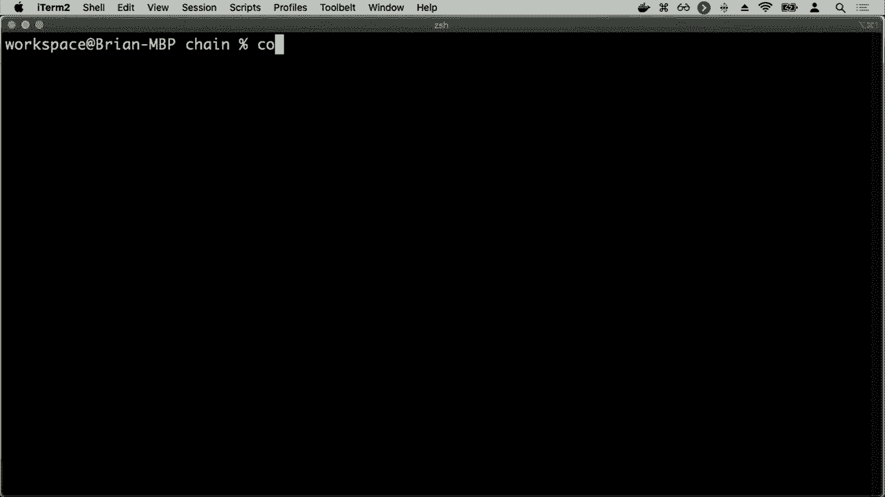

directory where I have some information，about Markov chains and here I've。

defined a file called model pi where，I've defined in a very similar syntax。

and again the exact syntax doesn't，matter so much as the idea that I'm。

encoding this information into a Python，program so that the program has access。

to these distributions I've heerd to，find some starting distribution so every。

Markov model begins at some point in，time and I need to give it some starting。

distribution and so we'll just say you，know at the start you can pick 50-50。

between sunny and rainy we'll say it's，sunny 50% of the time rainy 50% of the。

time and then down below I've here，defined the transition model how it is。

that I transition from one day to the，next and here I've encoded that exact，sunny today。

then with probability 0。8 it will be，sunny tomorrow and it'll be rainy，tomorrow with probability 0。

2 and I，likewise have another distribution for，if it was raining today instead and so。

that alone defines the Markov model you，can begin to answer questions using that。

model but one thing I'll just do is，sample from the Markov chain it turns。

out there's a method built into this，Markov chain library that allows me to。

sample 50 seats from the chain basically。

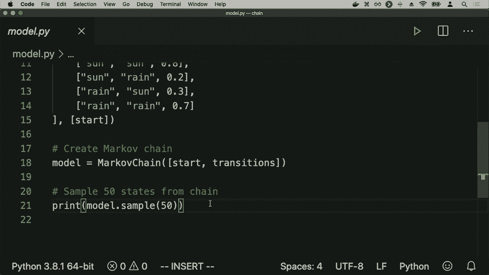

just simulating like 50 instances of，weather and so let me go ahead and run。

this Python model pi and when I run it，what I get is that it's going to sample。

from this Markov chain 50 states 50 days。

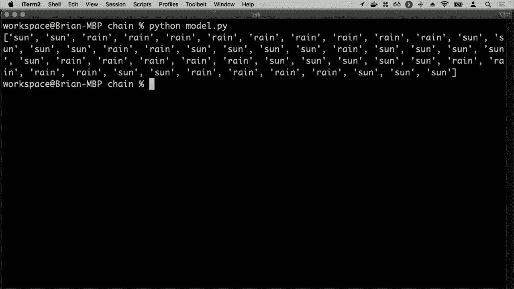

worth of weather that it's just going to，randomly simple and you can imagine。

sampling many times to be able to get，more data to be able to do more analysis。

but here for example it's you know sunny，to day in day days in a row raining a。

whole bunch of days in a row before it，changes back to Sun and so you get this。

model that follows the distribution that，we originally described that follows the。

distribution of sunny days tend to lead，to more sunny days of rainy days tend to。

lead to more rainy days and that then is，a Markov model and Markov models rely on。

us knowing the values of these，individual states I know that today is。

sunny or that today is raining and using，that information，I can draw some sort of inference about。

what tomorrow is going to be like but in，practice this often isn't the case it。

often isn't the case then I know for，certain what the exact state of the。

world is oftentimes the state of the，world is exactly unknown but I'm able to。

somehow sense some information about，that state that a robot or an AI doesn't。

have exact knowledge about the world，around it but it has some sort of sensor。

whether that sense there is a camera or，like sensors that detect distance or。

just a microphone that is sensing audio，for example it is sensing data and using。

that data that data is somehow related，to the state of the world even if it。

doesn't actually know our AI doesn't，know what the underlying true state of。

the world actually is and for that we，need to get into the world of sensor。

models the way of describing how it is，that we translate what the hidden state。

the underlying true state of the world，is and with what the observation what it。

is that the AI knows that the air has，access to actually is and so for example。

a hidden state might be a robot's，position if a robot is exploring new。

uncharted territory the robot likely，doesn't know exactly where it is but it。

does have an observation it has robot，sensor data where it can sense you know。

how far away are possible obstacles，around it and using that information。

using the observed information that it，has it can infer something about the。

hidden state because what the true，hidden state is influences those。

observations whatever the robots true，position is of affects it has some。

effect upon what the sensor data the，robot is able to collect is even if the。

robot doesn't actually know for certain，what its true position is likewise if。

you think about a voice recognition or a，speech recognition program that listens。

to you and is able to respond to you，something like Alexa or your or what。

Apple and Google are doing with their，voice recognition as well that you might。

imagine that the hidden state the，underlying state is what words are。

actually spoken the true nature of the，world contains you saying a particular。

sequence of words but your phone or your，a home smart home device doesn't know。

for sure exactly what words you said the，only absorb servation。

that the AI has access to is like some，audio waveforms and those audio。

waveforms are of course dependent up，this hidden state and you can infer。

based on those audio waveforms what the，word spoken likely were but you might。

not know with a hundred percent，certainty what that hidden state。

actually is and it might be a task to，try and predict given this observation。

given these audio waveforms can you，figure out what the actual words spoken。

are likewise you might imagine on a，website true user engagement might be。

information you don't directly have，access to you can observe data like。

website or app analytics about how often，was this button clicked or how often are。

people interacting with a page in a，particular way and you can use that to。

infer things about your users as well so，this type of problem comes up all the。

time when we're dealing with AI and，trying to infer things about the world。

that often AI doesn't really know the，hidden true state of the world all the。

AI has access to is some observation，that is related to the hidden true state。

but it's not direct there might be some，noise there the audio waveform might。

have some additional noise it might be，difficult to parse the sensor data might。

not be exactly correct there's some，noise that might not allow you to。

conclude with certainty what the hidden，state is but can allow you to infer what。

it might be and so the simple example，we'll take a look at here is imagining。

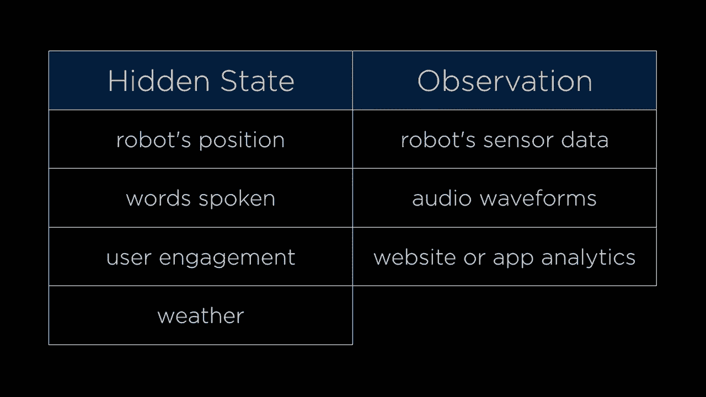

the hidden state as the weather whether，it's sunny or rainy or not and imagine。

you are programming an AI inside of a，building that maybe has access to just a。

camera to inside the building and all，you have access to is an observation as。

to whether or not employees are bringing，an umbrella into the building or not you。

can detect whether it's an umbrella or，not and so you might have an observation。

as to whether or not an umbrella is，brought into the building or not and。

using that information you want to，predict whether it's sunny or rainy even。

if you don't know what the underlying，weather is so the underlying weather。

might be sunny or rainy and if it's，raining obviously people are more likely。

to bring an umbrella and so whether or，not people bring an umbrella your。

observation tells you something about，the hidden state and of course this is a。

bit of a contrived example but the idea，here is to think about this more broadly。

in terms of more generally anytime you，observe something it having to do with，some underlying。

hidden state and so to try and model，this type of idea where we have these。

hidden states and observations rather，than just use a Markov model which has。

state state state state each of which is，connected，by that transition matrix that we。

described before we're going to use what，we call a hidden Markov model very。

similar to a Markov model but this is，going to allow us to model a system that。

has hidden states that we don't directly，observe along with some observed event。

that we do actually see and so in，addition to that transition model that。

we still need of saying you know given，the underlying state of the world if。

it's sunny or rainy what's the，probability of tomorrow's weather we。

also need another model that given some，state is gonna give us an observation of。

like Green yes someone brings an，umbrella into the office or red no。

nobody brings umbrellas into the office，and so the observation might be that if。

it's sunny then odds are nobody's gonna，bring an umbrella to the office but。

maybe some people are just being，cautious and they do bring an umbrella。

to the office anyways and if it's，raining then with much higher。

probability then people are gonna bring，umbrellas into the office but maybe if。

the rain was unexpected people didn't，bring an umbrella and so they might have。

some other probability as well so using，the observations you can begin to。

predict with reasonable likelihood what，the underlying state is even if you。

don't actually get to observe the，underlying state if you don't get to see。

what the hidden state is actually equal，to this here we'll often call the sensor。

model it's also often called the。

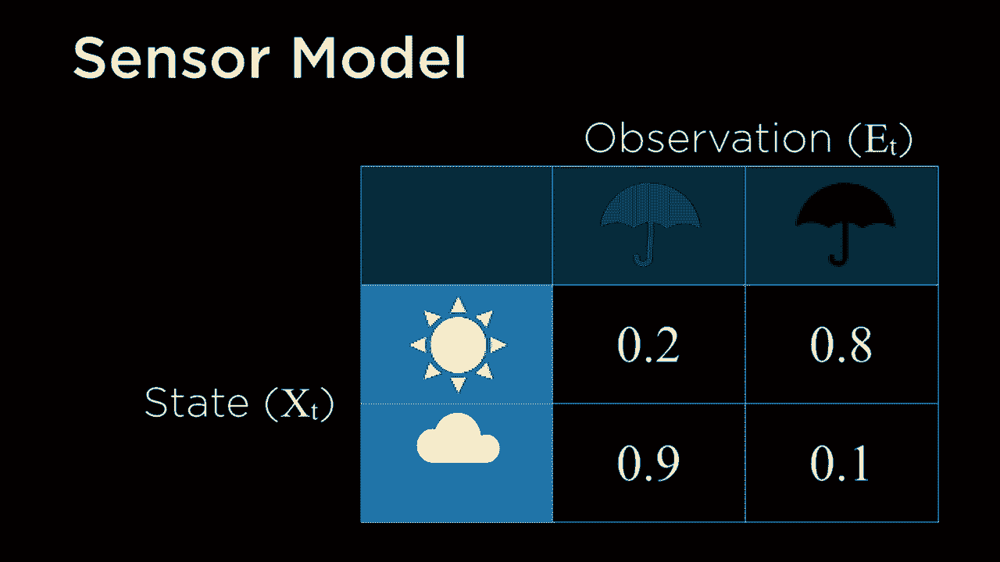

emission probabilities because the state，the underlying state emits some sort of。

emission that you then observe and so，that can be another way of describing。

that same idea and the sensor Markov，assumption that we're going to use is。

this an assumption that the evidence，variable the thing we observe the。

emission that gets produced depends only，on the corresponding state meaning it。

can predict whether or not people will，bring umbrellas or not entirely。

dependent just on whether it is sunny or，rainy today of course again this。

assumption might not hold in practice，that in practice you might depend。

whether or not people bring umbrellas，might depend not just on today's weather。

but also when yesterday's weather and，the day before but for simplification。

purposes it can be helpful to apply this，sort of assumption just to allow us to。

be able to reason about these，probabilities a little more easily and。

if we're able to approximate it we can，still often get a very good answer and。

so what these hidden Markov models end，up looking like is a little something，have。

chain of states like Sun Sun rain rain，rain we instead have this upper level。

which is the underlying state of the，world is it sunny or is it rainy and。

those are connected by that transition，matrix we described before but each of。

these states produces an emission，produces an observation that I see that。

on this day it was sunny and people，didn't bring umbrellas and on this day。

it was sunny but people did bring，umbrellas and on this day it was raining。

and people did bring umbrellas and so on，and so forth and so each of these。

underlying States represented by X sub T，for X sub 1 0 1 2 so on and so forth。

produces some sort of observation or，omission which is what the e stands for。

e sub 0 e sub 1 Y sub 2 so on and so，forth and so this too is a way of trying。

to represent this idea and what you want，to think about is that these underlying。

states are the true nature of the world，the robot's position as it moves over。

time and that produces some sort of，sensor data that might be observed or。

what people are actually saying and，using the emission data of what audio。

waveforms do you detect in order to，process that data and try and figure it。

out and there are a number of possible，tasks that you might want to do given。

this kind of information and one of the，simplest is trying to infer something。

about the future or the past or about，these sort of hidden states that might。

exist and so the tasks that you'll often，see and we're not going to go into the。

mathematics of these tasks but they're，all based on the same idea of。

conditional probabilities and using the，probability distributions we have to。

draw these sorts of conclusions one task，is called filtering which is given。

observations from the start until now，calculate the distribution for the。

current state meaning you know given，information about from the beginning of。

time until now on which days that people，bring an umbrella or not bring an。

umbrella can I calculate the probability，of the current state that today is it。

sunny or is it rain in another task that，might be possible is prediction which is。

looking towards the future given，observations about people bringing。

umbrellas from the beginning of the when，we started counting time until now can I。

figure out the distribution that，tomorrow is it sunny or is it raining。

and you can also go backwards as well by，a smoothing where I can say given。

observations from start until now，the distributions for some passed state。

like I know that today people brought，umbrellas and tomorrow people brought。

umbrellas and so given two days worth of，data people bringing umbrellas what's。

the probability that yesterday it was，raining and that I know that people。

brought umbrellas today that might，inform that decision as well and might。

influence those probabilities and，there's also a most likely explanation。

task in addition to other tops that，might exist as well which is combining。

some of these given observations from，the start up until now figuring out the。

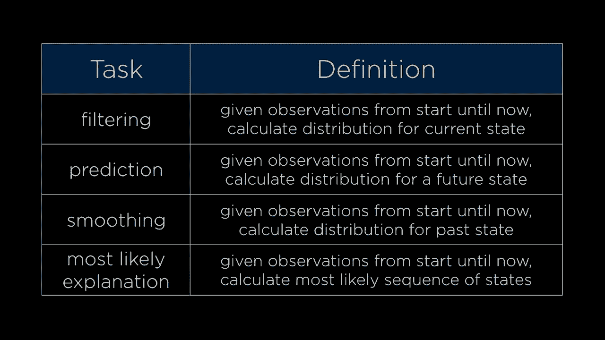

most likely sequence of states and this，is what we're gonna take a look at now。

this idea that if I have all these，observations umbrella no umbrella。

umbrella no umbrella can I calculate the，most likely states of Sun rain Sun rain。

and whatnot that actually represented，the true weather that would produce。

these observations and this is quite，common when you're trying to do。

something like voice recognition for，example that you have these emissions of。

these audio waveforms and you would like，to calculate based on all of the。

observations that you have what is the，most likely sequence of actual words or。

syllables or sounds that the user，actually made when they were speaking to。

this particular device or other tasks，that might come up in that context as。

well and so we can try this out by going，ahead and going into the hmm directory。

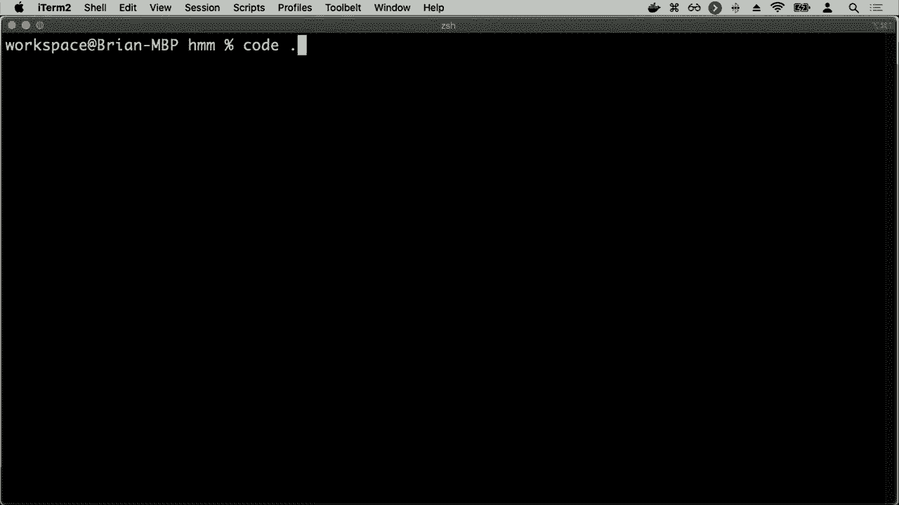

hmm for hidden Markov model and here，what I've done is I've defined a model。

where this model first defines my，possible state Sun in rain along with。

their emission probabilities the，observation model or the emission model。

where here given that I know that it's，sunny the probability that I see people。

bring an umbrella is point to the，probability of no umbrella is 0。8 and。

likewise if it's raining then people are，more likely to bring an umbrella，umbrella has probability 0。

9 no umbrella，has probability 0。1 so the actual，underlying hidden States those states。

are sun and rain but the things that I，observe the observations that I can see。

are either umbrella or no umbrella as，the things that I observe as a result so。

this then I also need to add to it a，transition matrix same as before saying。

that if today is sunny then tomorrow is，more likely to be sunny and if today is。

rainy then tomorrow is more likely to be，raining，as it before I give it some starting。

probabilities saying at first you know，50-50 chance for whether it's sunny or。

rainy and then I can create the model，based on that information again the。

exact syntax of this is not so important，so much as it is the data that I am now。

encoding into a program such that now I，can begin to do some inference so I can。

give my program for example a list of，observations，you know umbrella umbrella no umbrella。

umbrella umbrella so on and so forth no，umbrella no umbrella and I would like to。

calculate I would like to figure out the，most likely explanation for these。

observations what is likely is is where，the rain rain is this rain or is it more。

likely that this was actually sunny and，then it switched back to it being rainy。

and you know that's an interesting，question we might not be sure because it。

might just be that it just so happened，on this rainy day people decided not to。

bring an umbrella or it could be that it，switched from rainy to sunny back to。

rainy which doesn't seem too likely but，it certainly could happen and using the。

data we give to the hidden Markov model，our model can begin to predict these。

answers can begin to figure it out so，we're going to go ahead and just predict。

these observations and then for each of，those predictions go ahead and print out。

what the prediction is and this library，just so happens to have a function。

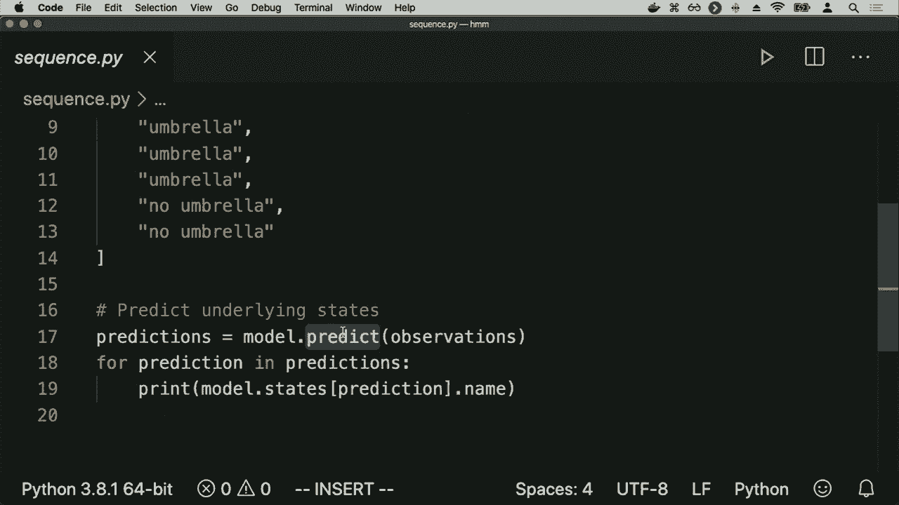

called predict that does this prediction，process for me I'll run Python sequence。

pi and the result I get is this this is。

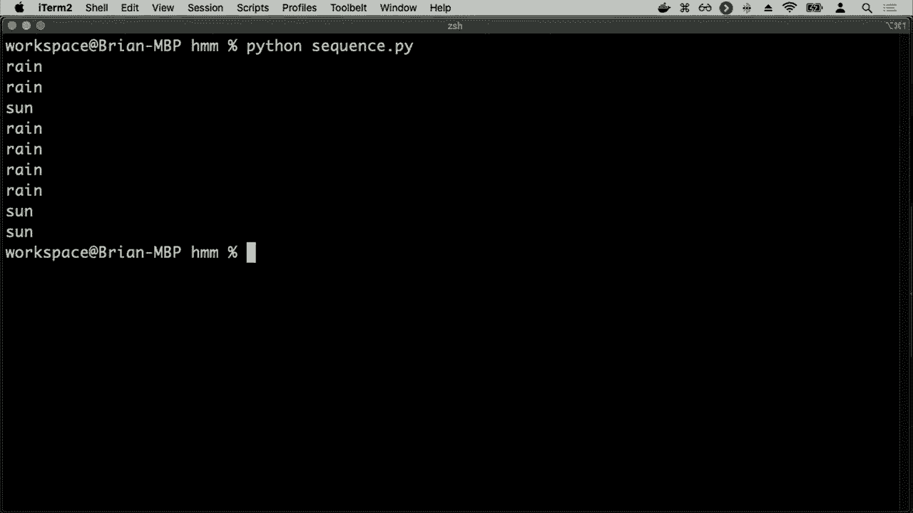

the prediction based on the observations，of what all of those states are likely。

to be and it's likely to be rain and，rain in this case it thinks that what。

most likely happened is that it was，sunny for a day and then went back to。

being rainy but in different situations，if it was raining for longer maybe or if。

the probabilities were slightly，different you might imagine that it's。

more likely that it was rainy all the，way through and it just so happened on。

one rainy day people decided not to，bring umbrellas and so here two Python。

libraries can begin to allow for the，sort of inference procedure and by。

taking what we know and by putting it in，terms of these tasks that already exist。

these general tasks that work with，hidden Markov models then anytime we can。

take an idea and formulate it as a，hidden Markov model formulate it as。

something that has hidden states and，observe emissions that result from those。

states then we can take advantage of，these algorithms that are known to exist。

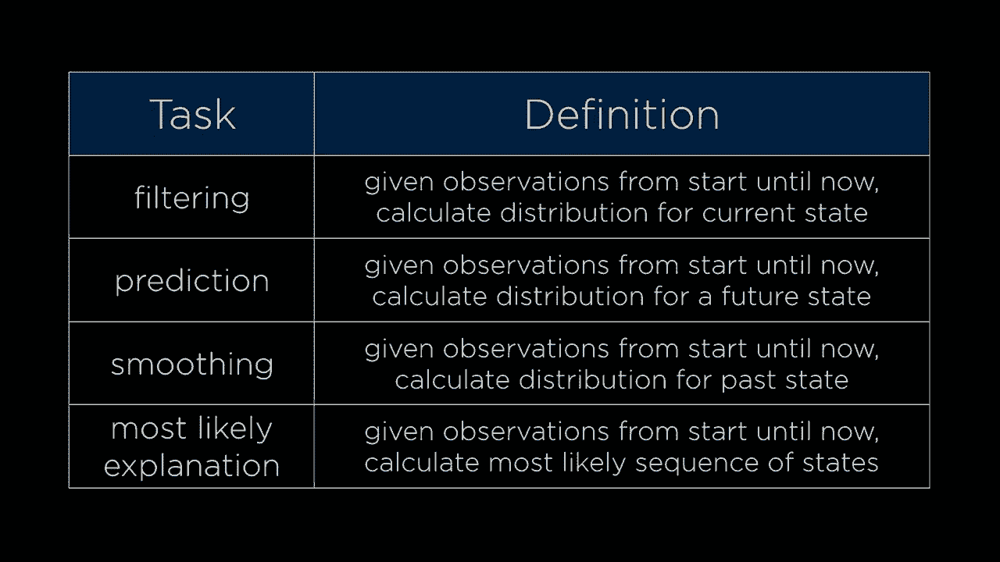

for trying to do this sort of，friends so now we've seen a couple of。

ways that a I can begin to deal with，uncertainty we've taken a look at。

probability and how we can use，probability to describe numerically。

things that are likely or more likely or，less likely to happen than other events。

or other variables and using that，information we can begin to construct。

these standard types of models things，like Bayesian networks and Markov chains。

and hidden Markov models that all allow，us to be able to describe how particular。

events relate to other events or how the，values of particular variables relate to。

other variables not for certain but with，some sort of probability distribution。

and by formulating things in terms of，these models that already exist we can。

take advantage of Python libraries that，implement these sort of models already。

and allow us just to be able to use them，to produce some sort of resulting effect。

so all of this then allows our AI to，begin to deal with these sort of。

uncertain problems so that our AI，doesn't need to know things for certain。

but can infer based on information it，doesn't know next time we'll take a look。

at additional types of problems that we，can solve by taking advantage of a I。

related algorithms even beyond the world，of the types of problems we've already。

