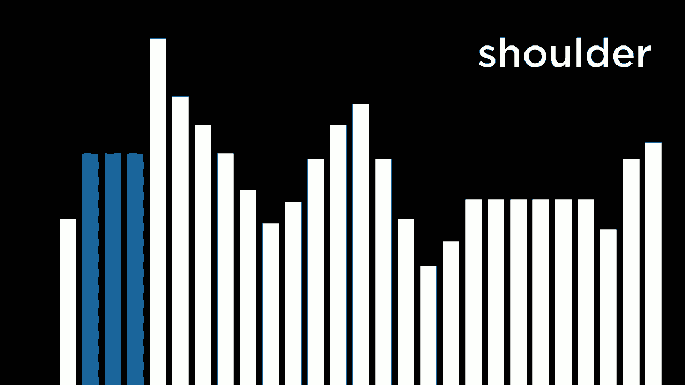

# 【双语字幕+资料下载】哈佛CS50-AI ｜ Python人工智能入门(2020·完整版) - P11：L3- 优化算法 1 (优化，局部搜索，Hill Climbing) - ShowMeAI - BV1AQ4y1y7wy

[Music]，okay welcome back everyone to an，introduction to artificial intelligence。with Python and now so far we've taken a，look at a couple of different types of。problems we've seen classical search，problems where we're trying to get from。an initial state to a goal by figuring，out some optimal path we've taken a look。

at adversarial search where we have a，game playing agent that it's trying to。make the best move we've seen，knowledge-based problems when we're。trying to use logic and inference to be，able to figure out and draw some。additional conclusions and we've seen，some probabilistic models as well where。

we might not have certain information，about the world but we want to use the。knowledge about probabilities that we do，have to be able to draw some conclusions。today we're going to turn our attention，to another category of problems。generally known as optimization problems，where optimization is really all about。

choosing the best option from a set of，possible options and we've already seen。an optimization in some contexts like，game playing where we're trying to。create an AI that chooses the best move，out of a set of possible moves but what。we'll take a look at today is a category，of types of problems and algorithms to。

solve them that can be used in order to，deal with a broader range of potential。optimization problems and the first of，the algorithms that we'll take a look at。

is known as a local search and local，search differs from search algorithms。we've seen before in the sense that the，search algorithms we've looked at so far。which are things like breadth-first，search or a-star search for example。generally maintain a whole bunch of，different paths that were simultaneously。

exploring and we're looking at a bunch，of different paths at once trying to。find our way to the solution on the，other hand in local search this is going。to be a search algorithm that's really，just going to maintain a single node。looking at a single state and will，generally run this algorithm by。

maintaining that single node and then，moving ourselves to one of the。neighboring nodes throughout this search，process and this is generally useful in。context not like these problems which，we've seen before like a maze solving。situation where we're trying to find our，way from the initial state to the goal。

by following some path but local search，is most applicable when we really don't。care about the path at all and all we，care about is what the solution is and。in the case of a solving a maze the，solution was always obvious you could。point to the solution you know exactly，what the goal is and the real question。

is what is the path to get there but，local search is going to come up in。cases where figuring out exactly what，the solution is exactly what the goal，looks like is。the heart of the challenge and to give，an example of one of these kinds of。problems we'll consider a scenario where，we have two types of buildings for。

example we have houses and hospitals and，our goal might be in a world that's。formatted as this grid where we have a，whole bunch of houses a house here house。here two houses over there maybe we want，to try and find a way to place two。hospitals on this map so maybe a，hospital here and a hospital there and。

the problem now is we want to place two，hospitals on the map but we want to do。so with some sort of objective and our，objective in this case is to try and。minimize the distance of any of the，houses from a hospital so you might。imagine all right what's the distance，from each of the houses to their nearest。

hospital there are a number of ways we，could calculate that distance but one。way is using a heuristic we've looked at，before which is the Manhattan distance。this idea of how many rows and columns，would you have to move inside of this。grid layout in order to get to a，hospital for example and it turns out if。

you take each of these four houses and，figure out all right how close are they。to their nearest hospital you get，something like this where this house is。three away from a hospital this house is，six away and these two houses are each。four away and if you add all those，numbers up together you get a total cost。

of 17 for example so for this particular，configuration of hospitals a hospital。here and a hospital there that state we，might say has a cost of 17 and the goal。of this problem now that we would like，to apply a search algorithm to figure。out is can you solve this problem to，find a way to minimize that cost。

minimize the total amount if you sum up，all of the distances from all the houses。to the nearest hospital how can we，minimize that final value and if we。think about this problem a little bit，more abstract abstracting away from this。specific problem and thinking more，generally about problems like it you can。

often formulate these problems by，thinking about them as a state space。landscape as will seem Colin here in，this diagram of a state space landscape。each of these vertical bars represents a，particular state that our world could be。in so for example each of these vertical，bars represents a particular。

configuration of two hospitals and the，height of this vertical bar is generally。going to represent some function of that，state some value of that state so maybe。in this case the height of the vertical，bar wrappers，and what is the cost of this particular。configuration of hospital ism in terms，of what is the sum total of all the。

distances from all of the houses to，their nearest hospital and generally。speaking when we have a state-space，landscape we want to do one of two。things we might be trying to maximize，the value of this function trying to。find a global maximum so to speak of，this state space landscape a single。

state whose value is higher than all of，the other states that we could possibly。choose from and generally in this case，maximum，we'll call the function that we're。trying to optimize them some objective，function some function that measures for。any given state how good is that state，such that we can take any state pass it。

in to the objective function and get a，value for how good that state is and。ultimately what our goal is is to find，one of these states that has the highest。possible value for that objective，function an equivalent but reversed。problem is the problem of finding a，global minimum some state that has a。

value after you pass it into this，function that is lower than all of the。other possible values that we might，choose from and generally speaking when。we're trying to find a global minimum we，call the function that we're calculating。a cost function generally each state has，some sort of cost whether that cost is a。

monetary cost or a time cost or in the，case of the houses and hospitals we've。been looking at just now a distance cost，in terms of how far away each of the。houses is from a hospital and we're，trying to minimize the cost find the。state that has the lowest possible value，of that cost so these are the general。

types of ideas we might be trying to go，for within a state space landscape。trying to find a global maximum or，trying to find a global minimum and how。exactly do we do that will recall that，in local search we generally operate。this algorithm by maintaining just a，single state just some current state。

represented inside of some node may be，inside of a data structure where we're。keeping track of where we are currently，and then ultimately what we're going to。do is from that state move to one of its，neighbor States so in this case。represented in this one dimensional，space by just the state immediately to。

the left or to the right of it but for，any different problem you might define。what it means for there to be a neighbor，of a particular state in the case of a。hospitals for example that we were just，looking at a neighbor might be moving。one hospital one space to the left or to，the right or up or down some state that。

is close to our current state but，slightly different，and as a result might have a slightly。different value in terms of its，objective function or in terms of its。cost function so this is going to be our，general strategy in local search to be。able to take a state maintaining some，current node and move where we're。

looking at in the state space landscape，in order to try to find a global maximum。or a global minimum somehow and perhaps，the simplest of algorithms that we could。use to implement this idea of local，search is an algorithm known as hill。climbing and the basic idea of hill，climbing is let's say I'm trying to。

maximize the value of my state I'm，trying to figure out where the global。maximum is I'm gonna start at a state，and generally what hill climb is go is。going to do is it's going to consider，the neighbors of that state that from。this state you know alright I could go，left or I could go right and this。

neighbor happens to be higher and this，neighbor happens to be lower and in hill。climbing if I'm trying to maximize the，value I'll generally pick the highest。one I can between the state to the left，and right of me this one is higher so。we'll go ahead and move myself to，consider that state instead and then。

I'll repeat this process continually，looking at all of my neighbors and。picking the highest neighbor doing the，same thing looking at my neighbors。picking the highest of my neighbors，until I get to a point like right here。where I consider both of my neighbors，and both of my neighbors have a lower，value than I do。

this current state has a value that is，higher than any of its neighbors and at。

that point the algorithm terminates and，I can say all right here I have now。found the solution and the same thing，works in exactly the opposite way for。trying to find a global minimum but the，algorithm is fundamentally the same if。I'm trying to find a global minimum and，say my current state starts here I'll。

continually look at my neighbors pick，the lowest value that I possibly can。until I eventually hopefully find that，global minimum a point at which when I。look at both of my neighbors they each，have a higher value and I'm trying to。minimize the total score or cost or，value that I get as a result of。

calculating some sort of cost function，so we can formulate this graphical idea。in terms of pseudocode and the，pseudocode for hill climbing might look。like this we define some function called，hill climb，that takes as input the problem that。we're trying to solve and generally，we're going to start in some。

sort of initial state so I'll start with，a variable called current that is。keeping track of my initial state like，an initial configuration of hospitals。and maybe some problems lend themselves，to an initial state someplace where you。begin in other cases maybe not in which，case we might just randomly generate。

some initial state just by choosing two，locations four hospitals at random for。example and figuring out from there how，we might be able to improve but that。initial state we're going to store，inside of current and now here comes our。loop some repetitive process we're gonna，do again and again until the algorithm。

terminates and what we're going to do is，first say let's figure out all of the。neighbors of the current state from my，state what are all of the neighboring。states for some definition of what it，means to be a neighbor and I'll go ahead。and choose the highest-valued，of all of those neighbors and save it。

inside of this variable called neighbor，so keep track of the highest-valued。neighbor this is in the case where I'm，trying to maximize the value in the case。where I'm trying to minimize the value，you might imagine here you'll pick the。neighbor with the lowest possible value，but these ideas are really fundamentally。

interchangeable and it's possible in，some cases there might be multiple。neighbors that each have an equally high，value or an equally low value in the。minimizing case and in that case we can，just choose randomly from among them。just choose one of them and save it，inside of this variable neighbor and。

then the key question to ask is is this，neighbor better than my current state。and if the neighbor the best neighbor，that I was able to find is not better。than my current state well then the，algorithm is over and I'll just go ahead。and return the current state if none of，my neighbors are better but I may as。

well stay where I am is the general，logic of the hill climbing algorithm but。otherwise if the neighbor is better then，I may as well move to that neighbor so。you might imagine setting current equal，to neighbor where the general idea is if。I'm at a current state and I see a，neighbor that is better than me then。

I'll go ahead and move there and then，I'll repeat the process continually。moving to a better neighbor until I，reach a point at which none of my。neighbors are better than I am and at，that point we'd say the algorithm can。just terminate there so let's take a，look at a real example of this with。

these houses and hospitals so we've seen，now that if we put the hospitals in。these two locations that has a total，cost of 17 and now we need to define if。we're going to implement this hill，climbing algorithm what it means to take。this particular configuration of，hospitals this particular state and get。

a neighbor of that state and a simple，definition of neighbor might be just。let's pick one of the hospitals and move，it by one square the left or right or up。or down for example and that would mean，we have six possible neighbors from this。particular configuration we could take。

this hospital and move it to any of，these three possible square ism or we。take this hospital and move it to any of，those three possible squares and each of。those would generate a neighbor and what，I might do is say alright here is the。locations and the distances between each，of the houses and their nearest hospital。

let me consider all of the neighbors and，see if any of them can do better than a。cost of 17 and it turns out there are a，couple of ways that we could do that and。it doesn't matter if we randomly choose，among all the ways that are the best but。one such possible way is by taking a，look at this hospital here and。

considering the directions in which it，might move if we hold this Hospital。constant if we take this hospital and，move it one square up for example that。doesn't really help us it gets closer to，the house up here but it gets further。away from the house down here and it，doesn't really change anything for the。

two houses along the left-hand side but，if we take this hospital on the right。and move it one square down it's the，opposite problem it gets further away。from the house up above and it gets，closer to the house down below the Abril。idea the goal should be to be able to，take this hospital and move it one。

square to the left by moving at one，square to the left we move it closer to。both of these houses on the right，without changing anything about the。houses on the left for them this，hospital is still the closer one so they。aren't affected so we're able to improve，the situation by picking a neighbor that。

results in a decrease in our total cost，and so we might do that move ourselves。from this current state to a neighbor by，just taking that hospital and moving it。and at this point there's not a whole，lot that can be done with this hospital。but there's still other optimizations we，can make other neighbors we can move to。

that are going to have a better value if，we consider this hospital for example we。might imagine that right now it's a bit，far up that both of these houses that。are a little bit lower so we might be，able to do better by taking this。hospital and moving it one Square down，moving it down so that now instead of a。

cost of 15 we're down to a cost of 13，for this particular configuration and we，can do even better by。the hospital and moving it one Square to，the left now instead of a cost of 13 we。have a cost of 11 because this house is，one away from the hospital。this one is four away this one is three，away and this one is also three away so。

we've been able to do much better than，that initial cost that we had using the。initial configuration just by taking，every state and asking ourselves the。question can we do better by just making，small incremental changes moving to a。neighbor moving to a neighbor and moving，to a neighbor after that and now at this。

point we can potentially see that at，this point the algorithm is going to。terminate there's actually no neighbor，we can move to that is going to improve。the situation get us a cost that is less，than 11 because if we take this hospital。and move it up or to the right well，that's going to make it further away if。

we take it and move it down that doesn't，really change the situation it gets。further away from this house but closer，to that house and likewise the same。story was true for this hospital any，neighbor we move it to up left down or。right is either going to make it further，away from the houses and increase the。

cost or it's gonna have no effect on the，cost whatsoever and so the question we。might now ask is is this the best we，could do is this the best placement of。the hospital's we could possibly have，and it turns out the answer is no。because there's a better way that we，could place these hospitals and in。

particular there are a number of ways，you could do this but one of the ways is。by taking this hospital here and moving，it to this square for example moving it。diagonally by one square which was not，part of our definition of neighbor we。can only move left right up or down，but this is in fact better it has a。

total cost of nine it is no closer to，both of these houses and as a result the。total cost is less but we weren't able，to find it because in order to get there。we had to go through a state that，actually wasn't any better than the。current state that we had been on，previously and so this appears to be a。

limitation or a concern you might have，as you go about trying to implement a。hill climbing algorithm is that it might，not always give you the optimal solution。if we're trying to maximize the value of，any particular state we're trying to。find the global maximum a concern might，be that we could get stuck at one of the。

local Maxima highlighted here in blue，where a local Maxima is any state whose。value is higher than any of its，neighbors if we ever find ourselves。at one of these two states when we're，trying to maximize the value of the。state we're not going to make any，changes we're not going to move left or。

right we're not going to move left here，because those states are worse but yet。we haven't found the global optimum we，haven't done as best as we could do and。likewise in the case of the hospital is，what were ultimately trying to do is。find a global minimum find a value that，is lower than all of the others but we。

have the potential to get stuck at one，of the local minimum any of these states。whose value is lower than all of its，neighbors but still not as low as the。local minimum and so the takeaway here，is that it's not always going to be the。case that when we run this naive，hill-climbing algorithm that we're，always going to find the optimal。

solution there are things that could go，wrong if we started here for example and。tried to maximize our value as much as，possible we might move to the highest。possible neighbor move to the highest，possible neighbor move to the highest。possible neighbor and stop and never，realize that there's actually a better。

state way over there that we could have，gone to instead and other problems you。might imagine just by taking a look at，this state space landscape are these。various different types of plateaus，something like this flat local maximum。here we're all six of these states each，have the exact same value and so in the。

case of the algorithm we showed before，none of the neighbors are better so we。might just get stuck at this flat local，maximum and even if you allowed yourself。to move to one of the neighbors it，wouldn't be clear which neighbor you。would ultimately move to and you could，get stuck here as well and there's。

another one over here this one is called，a shoulder it's not really a local。maximum because there's still places，where we can go higher not a local。minimum because we can go lower so we，can still make progress but it's still。this flat area where if you have a local，search algorithm there's potential to。

get lost here unable to make some upward，or downward progress depending on。whether we're trying to maximize or，minimize it and therefore another。potential for us to be able to find the，solution that might not actually be the。optimal solution and so because of this，potential the potential that hill。

climbing has to not always find us the，optimal result it turns out there are a。number of different varieties and，variations on the hill climbing。algorithm that help to solve the problem，better depending on the context and。depending on the specific type of，problem some of these variants might be。

more applicable than others but we've，taken a look at so far，is a version of hill climbing generally。called steepest ascent hill climbing，where the idea of steepest ascent hill。climbing is we are going to choose the，highest-valued neighbor in the case。where we're trying to maximize or the，lowest valued neighbor in cases where。

we're trying to minimize but generally，speaking if I have five neighbors and。they're all better than my current state，I will pick the best one of those five。now sometimes that might work pretty，well it's sort of a greedy approach of。trying to take the best operation at any，particular time step but a might not。

always work there might be cases where，actually I want to choose an option that。is slightly better than me but maybe not，the best one because that later on might。lead to a better outcome ultimately so，there are other variants we might。consider of this basic hill climbing，algorithm one is known as stochastic。

hill climbing and in this case we choose，randomly from all of our higher value。neighbors so if I'm at my current state，and there are five neighbors that are。all better than I am rather than，choosing the best one as steepest a。sudden would do stochastic will just，choose randomly from one of them。

thinking that if it's better then it's，better and maybe there's a potential to。make forward progress even if it is not，locally the best option I could possibly。choose first-choice hill climbing ends，up just choosing the very first highest。valued neighbor that it follows behaving，on a similar idea rather than consider。

all of the neighbors as soon as we find，a neighbor that is better than our。current state we'll go ahead and move，there so maybe some efficiency。improvements there and maybe has the，potential to find a solution that the。other strategies weren't able to find，and with all of these variants we still。

suffer from the same potential risk this，risk that we might end up at a local。minimum or a local maximum and we can，reduce that risk by repeating the。process multiple times so one variant of，hill climbing is random restart hill。climbing where the general idea is will，conduct hill climbing multiple times if。

we apply its steepest ascent hill，climbing for example will start at some。random state try and figure out how to，solve the problem and figure out what is。the local maximum or local minimum we，get to and then we'll just randomly。restart and try again choose a new，starting configuration try and figure。

out what the local maximum or minimum is，and do this some number of times and。then after we've done at some number of，times we can pick the best one out of。all of the ones that we've taken a look，at so there's another option we have。access to as well and then although I，said the general，local search will usually just keep。

track of a single node and then move to，one of its neighbors there are variants。of hill climbing that are known as local，beam searches where rather than keep。track of just one current best state，we're keeping track of K highest valued。neighbors such that rather than starting，at one random initial configuration I。

might start with three or four or five，randomly generate all the neighbors and。then pick like the three or four or five，best of all of the neighbors that I find。and continually repeat this process with，the idea being that now I have more。options that I'm considering more ways，that I could potentially navigate myself。

to the optimal solution that might exist，for a particular problem so let's now。take a look at some actual code that can，implement some of these kinds of ideas。something like steepest ascent hill，climbing for example for trying to solve。a this hospital problem so I'm going to。

go ahead and go into my hospital's，directory where I've actually set up the。basic framework for solving this type of，problem I'll go ahead and go into。hospitals PI and we'll take a look at，the code we've created here I've defined。a class that is going to represent the，state space so the space has a height。

and a width and also some number of，hospitals so you can configure how big。is your map how many hospitals should go，here we have a function for adding a new。house to the state space and then some，functions that are going to get me all。of the available spaces for if I want to，like randomly place hospitals in。

particular locations and here now is the，hill climbing algorithm so what are we。gonna do in the hill climbing algorithm，well we're going to start by randomly。initializing where the hospitals are，going to go we don't know where the。hospitals should actually be so let's，just randomly place them so here I'm。

running a loop for each of the hospitals，that I haven't I'm going to go ahead and。add a new hospital at some random，location so I basically get all of the。available space ISM and I randomly，choose one of them as where I would like。to add this particular hospital I have，some logging output and generating some。

images which we'll take a look at a，little bit later but here is the key。idea so I'm going to just keep repeating，this algorithm I could specify a maximum。of how many times I wanted to run or I，could just run it up until it hits a。local maximum or local minimum and now，we'll basically consider all of the。

hospitals that could potentially move so，consider each of the two hospitals and。more hospitals if they're more than that，and consider all of the places where。that hospital could move to some，neighbor of that hospital that we can。move the neighbor to and then see you，know is this going to be better than。

where we were currently so if it is，going to be better then we'll go ahead。and update our best neighbor and keep，track of this new best neighbor that we。found and then afterwards we can ask，ourselves the question if best neighbor。cost is greater than or equal to the，cost of the current set of hospitals。

meaning if the cost of our best neighbor，is greater than the current cost meaning。our best neighbor is worse than our，current state well then we shouldn't。make any changes at all and we should，just go ahead and return the current set。of hospitals but otherwise if we can，update our hospitals in order to change。

them to one of the best neighbors and if，there are multiple that are all。equivalent I'm here using random choice，if they go ahead and choose one randomly。so this is really just a Python，implementation of that same idea that we。were just talking about this idea of，taking a current state some current set。

of hospitals and generating all of the，neighbors looking at all the ways we。could take one hospital and move it one，Square to the left or right or up or。down and then figuring out based on all，of that information which is the best。neighbor or the set of all the best，neighbors and then choosing from one of。

those and each time we go ahead and，generate an image in order to do that。and so now what we're doing is if we，look down at the bottom I'm going to。randomly generate a space with height 10，and width 20 and I'll say go ahead and。put three hospitals somewhere in the，space I'll randomly generate 15 houses。

that I just go ahead and add in random，locations and now I'm going to run this。

hill climbing algorithm in order to try，and figure out where we should place。those hospitals so we'll go ahead and，run this program by running Python。hospitals and we see that we started our，initial state had a cost of 72 but we。were able to continually find neighbors，that were able to decrease that cost。

decrease to 69 66 63 so on and so forth，all the way down to 53 as the best。

neighbor we were able to ultimately find，and we can take a look at what that。

looked like by just opening up these，files so here for example was the。initial configuration we randomly，selected a location for，each of these 15 different houses and。then randomly selected locations for one，two three hospitals that were just。located somewhere inside of this state，space and if you add up all the。

distances from each of the houses to，their nearest hospital you get a total。cost of about 72 and so now the question，is what neighbors can we move to that。improve the situation and it looks like，the first one the algorithm found was by。taking this house that was over there on，the right and just moving it to the left。

and that probably makes sense because if，you look at the houses in that general。area really these five houses look thick，they're probably the ones that are going。to be closest to this hospital over here，moving it to the left decreases the。total distance at least to most of these，houses though it does increase that。

distance for one of them and so we're，able to make these improvements to the。situation but continually finding ways，that we can move these hospitals around。until we eventually settle at this，particular state that has a cost of 53。or we figured out a position for each of，the hospital ISM and now none of the。

neighbors that we could move to are。

actually going to improve the situation，we can take this hospital and this。hospital on that hospital and look at，each of the neighbors and none of those。are going to be better than this，particular configuration and again。that's not to say that this is the best，we could do there might be some other。

configuration of hospitals that is a，global minimum and this might just be a。local minimum that is the best of all of，its neighbors that may be not the best。in the entire possible state space and，you could search through the entire。state space by considering all of the，possible configurations for hospitals。

but ultimately that's going to be very，time intensive especially as our state。space gets bigger and there might be，more and more possible states it's going。to take quite a long time to look，through all of them and so being able to。use these sort of local search，algorithms can often be quite good for。

trying to find the best solution we can，do and especially if we don't care about。doing the best possible and we just care，about doing pretty good and finding a。pretty good placement of those hospitals，then these methods can be particularly。powerful but of course we can try and，mitigate some of this concern by instead。

of using hill climbing to use random，restart this idea of rather than just。hill climb one time we can hill climb，multiple times and say try hill climbing。a whole bunch of times on the exact same，map and figure out what is the best one，that we。been able to find and so i've here，implemented a function for random。

restart that restarts some maximum，number of times and what we're going to。do is repeat that number of times this，process i've just go ahead and run the。hill-climbing algorithm figure out what，the cost is of getting from all the。houses to the hospitals and then figure，out is this better than we've done so。

far so I can try this exact same idea，we're instead of running hill-climbing。i'll go ahead and run random restart and。

I'll randomly restart maybe 20 times for，example and we'll go ahead and now I'll。remove all the images and then rerun the，program and now we started by finding a。original state when we initially ran，hill-climbing the best cost we were able，to find was 56。each of these iterations is a different，iteration of the hill climbing algorithm。

we're running hill climbing not one time，but 20 times here each time going until。we find a local minimum in this case and，we look and see each time did we do。better than we did the best time we've，done so far from 56 to 46 this one was。greater so we ignored it this one was 41，which was less so we went ahead and kept。

that one and for all of the remaining 16，times that we tried to implement hill。climbing and we tried to run the hill，climbing algorithm we couldn't do any。better than that 41 again maybe there is，a way to do better that we just didn't。find but it looks like that way ended up，being a pretty good solution to the。

problem that was attempt number three，starting from counting in zero so we can。take a look at that open up number three，and this was the state that happened to。

have a cost of 41 that after running the，hill climbing algorithm on some。particular random initial configuration，of hospitals this is what we found was。the local minimum in terms of trying to，minimize the cost and it looks like we。did pretty well that this hospital is，pretty close to this region this one is。

pretty close to these houses here this，hospital looks about as good as we can。do for trying to capture those houses，over on that side and so these sorts of。algorithms can be quite useful for，trying to solve these problems but the。real problem with many of these，different types of hill climbing。

steepest ascent stochastic first choice，and so forth is that they never make a。move that makes our situation worse，right they're always going to take。ourselves in our current state look at，the neighbors and consider。can we do better than our current state，and move to one of those neighbors which。

of those neighbors we choose might vary，among these various different types of。algorithms but we never go from a，current position to a position that is。worse than our current position and，ultimately that's what we're going to。need to do if we want to be able to find，a global maximum or a global minimum。

because sometimes if we get stuck we，want to find some way of dislodging。ourselves from our local maximum or，local minimum in order to find the。