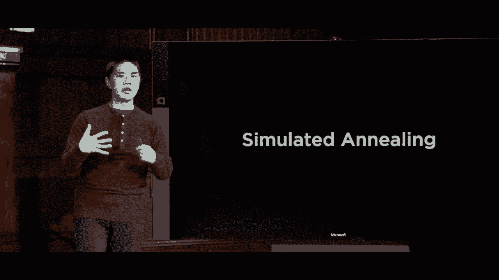
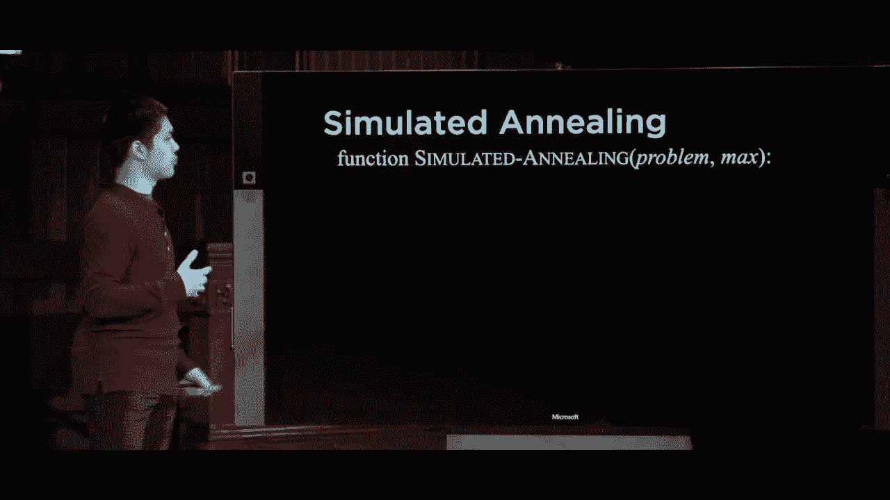
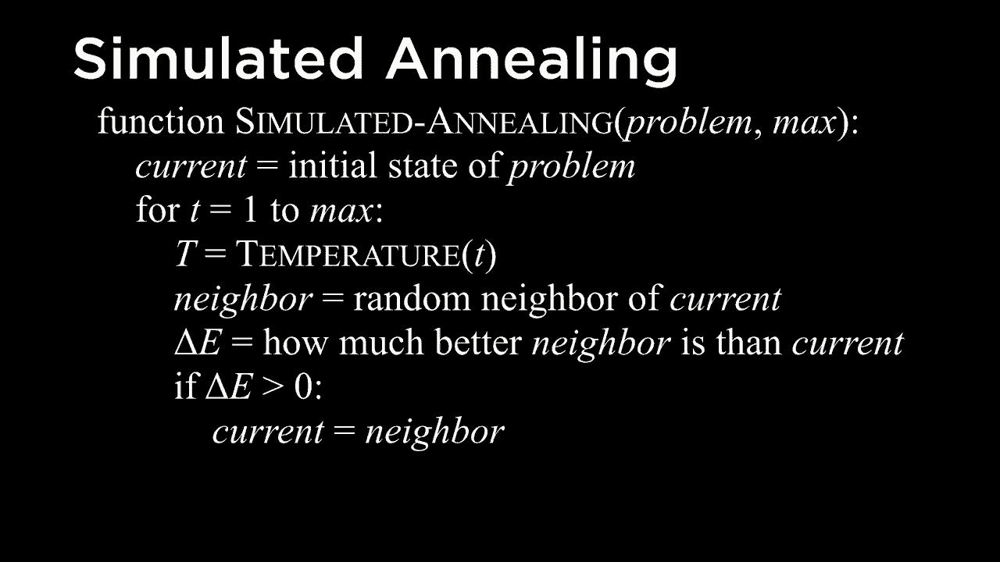
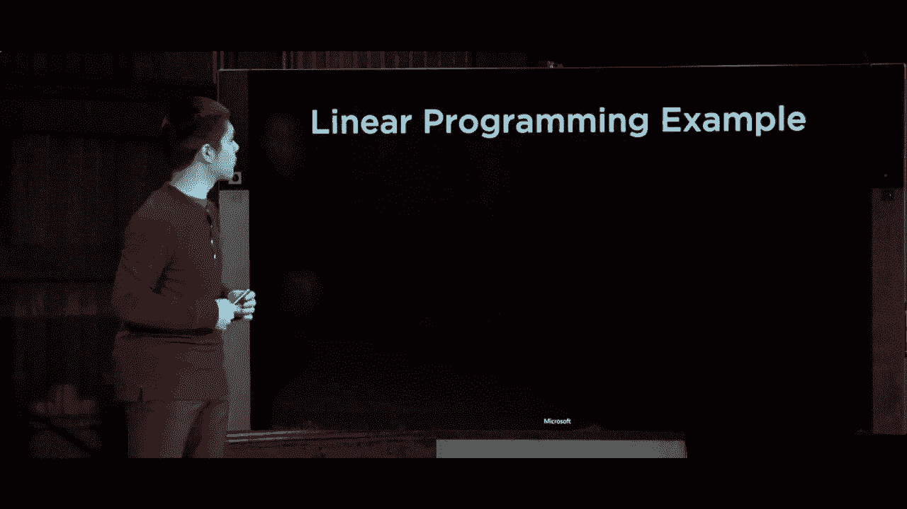
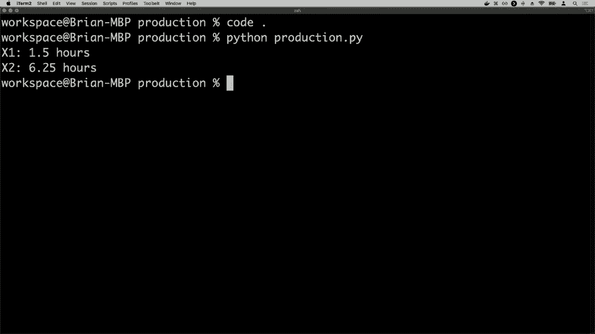
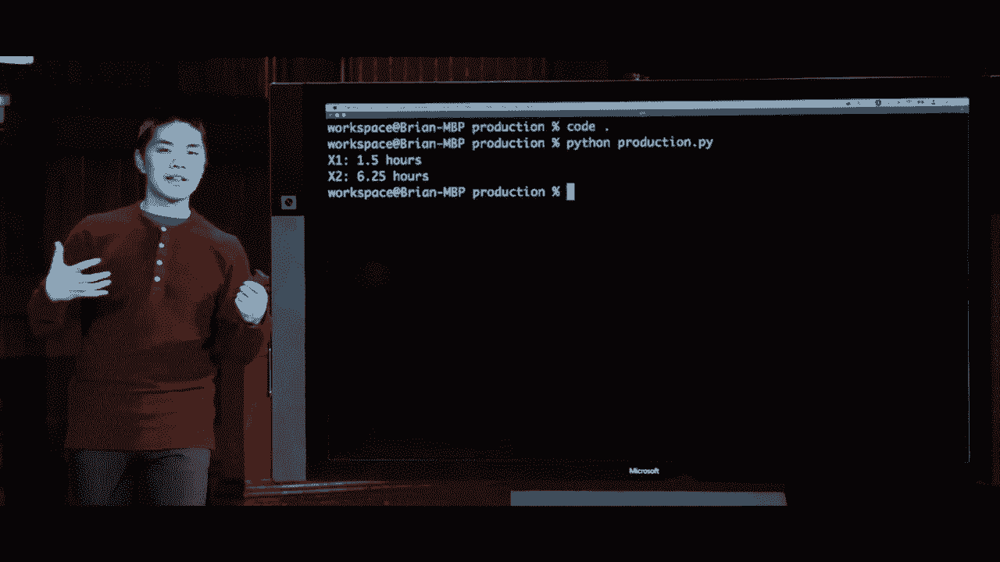
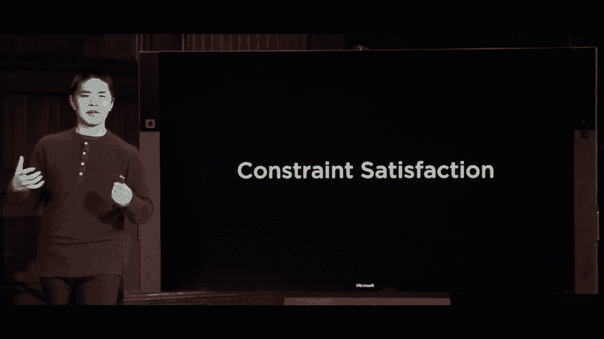
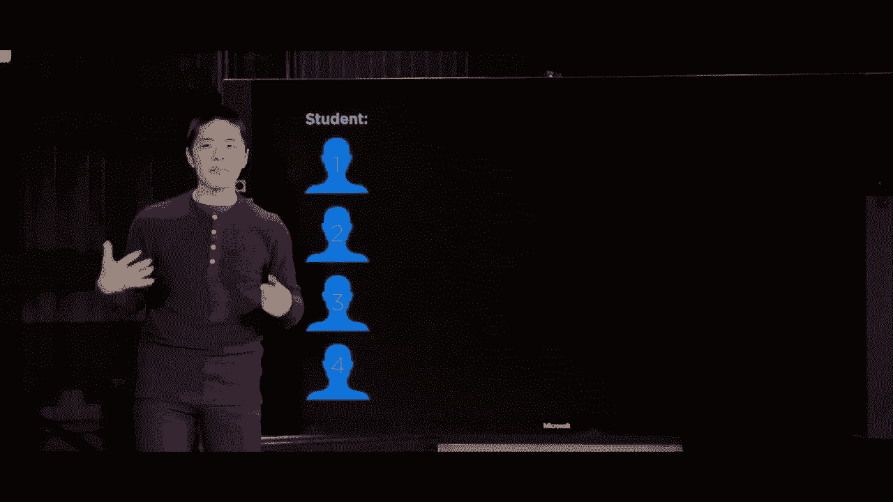
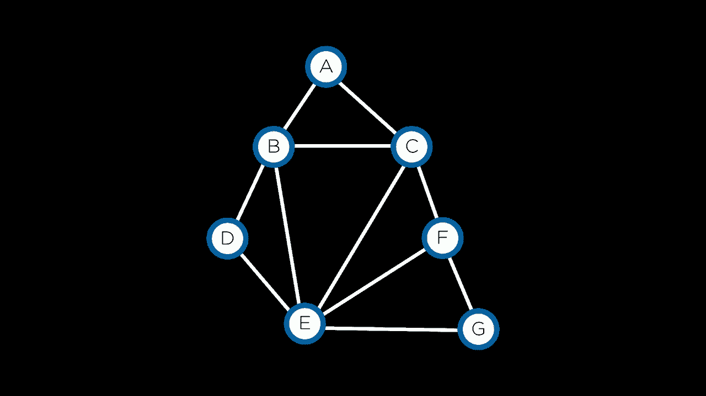

# 【双语字幕+资料下载】哈佛CS50-AI ｜ Python人工智能入门(2020·完整版) - P12：L3- 优化算法 2 (线性搜索，节点一致性) - ShowMeAI - BV1AQ4y1y7wy

increase the probability that we do find，it and so the most popular technique for。trying to approach the problem from that。

angle is a technique known as simulated，annealing simulated because it's。modeling after a real physical process，of annealing where you can think about。this in terms of physics a physical，situation where you have some system of。particle ISM and you might imagine that，when you heat up a particular physical。

system there's a lot of energy there，things are moving around quite randomly。but over time as the system cools down，it eventually settles into some final。position and that's going to be the，general idea of simulated annealing。we're going to simulate that process of，some high-temperature system where。

things are moving around randomly quite，frequently but over time decreasing that。

temperature until we eventually settle，at our ultimate solution and the idea is。going to be if we have some state space，landscape that looks like this and we。begin at its initial state here if we're，looking for a global maximum and we're。trying to maximize the value of the，state our traditional hill climbing。

algorithms would just take this state，and look at the two neighbor ones and。

always pick the one that is going to，increase the value of the state but if。we want some chance of being able to，find the global maximum we can't always。make good moves we have to sometimes，make bad moves and allow ourselves to。make a move in a direction that actually，seems for now to make our situation。

worse such that later we can find our，way up to that global maximum in terms。of trying to solve that problem of，course once we get up to this global。maximum once we've done a whole lot of，the searching then we probably don't。want to be moving to states that are，worse than our current state and so this。

is where this metaphor for annealing，starts to come in where we want to start。making more random moves and over time，start to make fewer of those random。moves based on a particular temperature，schedule，so the basic outline looks something。like this early on and simulated，annealing we have a higher temperature。

state and what we mean by a higher，temperature state is that we are more。likely to accept neighbors that are，worse than our current state but we。might look at our neighbors and if one，of our neighbors is worse than the。current state especially if it's not all，that much worse if it's pretty close but。

just slightly worse then we might be，more likely to accept that and go ahead。and move to that neighbor anyways but，later on as we run simulated annealing。we're going to decrease that temperature，and at a lower temperature we're going。to be less likely to accept neighbors。

that are worse than our current state，now to formalize this and put a little。bit of pseudocode to it here is what。

that algorithm might look like we have a，function called simulated annealing that。takes as input the problem we're trying，to solve and also potentially some。maximum number of times we might want to，run the simulated annealing process how。many different neighbors were going to，try and look for them and that value is。

going to vary based on the problem，you're trying to solve well again start。with some current state that will be，equal to the initial state of the。problem but now we need to repeat this，process over and over for max number of。times repeat some process some number of，times where we're first going to。

calculate a temperature and this，temperature function takes the current。time T starting at 1 going all the way，up to max and then gives us some。temperature that we can use in our，computation where the idea is that this。temperature is going to be higher early，on and it's going to be lower later on。

so there are a number of ways this，temperature function could often work。one of the simplest ways is just the，same it is like the proportion of time。that we still have remaining out of like，max units of time how much time do we。have remaining you start off with a lot，of that time remaining and as time goes。

on the temperature is going to decrease，because you have less and less of that。remaining time still available to you so，we calculate a temperature for the。current time and then we pick a random，neighbor of the current state no longer。we're going to be picking the best，neighbor that we possibly can or just。

one of the better neighbors that we can，we're gonna pick a random neighbor it。might be better it might be worse but，we're gonna calculate that we're gonna。calculate Delta e at U for energy in，this case which is just how much better。is the neighbor than the current state，so if Delta e is positive that means the，state。

if delta e is negative that means the，neighbor is worse than our current state。and so we can then have a condition that，looks like this if delta e is greater。than 0 that means the neighbor state is，better than our current state and if。ever that situation arises we'll just go，ahead and update current to be that。

neighbor same as before move where we，are currently to be the neighbor because。the neighbor is better than our current，state we'll go ahead and accept that but。now the difference is that whereas，before we never ever wanted to take a。move that made our situation worse，now we sometimes want to miracle make a。

move that is actually going to make our，situation worse because sometimes we're。going to need to dislodge ourselves from，a local minimum or local maximum to。increase the probability that we're able，to find the global minimum or the global。maximum a little bit later and so how do，we do that how do we decide to sometimes。

accept some state that might actually be，worse well we're going to accept a worse。state with some probability and that，probability needs to be based on a。couple of factors it needs to be based，in part on the temperature where if the。temperature is higher we're more likely，to move to a worse neighbor and if the。

temperature is lower we're less likely，to move to a worse neighbor but also to。some degree should be based on Delta e，if the neighbor is much worse than the。current state we probably want to be，less likely to choose that than if the。neighbor is just a little bit worse than，the current state so again there are a。

couple of ways you could calculate this，but it turns out one of the most popular。is just to calculate e to the power of，Delta e over T where e is just a。constant Delta e over T are based on，Delta e and T here we calculate that。value and that'll be some value between，0 and 1 and that is the probability with。

which we should just say all right let's，go ahead and move to that neighbor and。it turns out it than if you do the math，for this value when Delta e is such that。the neighbor is not that much worse than，the current state that's going to be。more likely that we're going to go ahead，and move to that state and likewise when。

the temperature is lower we're going to，be less likely to move to that。neighboring state as well so now this is，the big picture for simulated annealing。this process of taking the problem and，going ahead and generating random。neighbors will always move to a neighbor，if it's better than our current state。

but even if the neighbor is worse than，our current state will sometimes move，there。depending on how much worse it is and，also based on the temperature and as a。result the hope the goal of this whole，process is that as we begin to try and。find our way to the local the global，maximum or the global minimum we can。

dislodge ourselves if we ever get stuck，at a local maximum or local minimum in。order to eventually make our way to，exploring the part of the state space。that is going to be the best and then as，the temperature decreases eventually we。settle there without moving around too，much from what we found to be the。

globally best thing that we can do thus，far so at the very end we just return。whatever the current state happens to be，and that is the conclusion of this。algorithm we've been able to figure out，what the solution is。and these types of algorithms have a lot，of different applications anytime you。

can take a problem and formulate it as，something where you can explore a。particular configuration and then ask，are any of the neighbors better than。this current configuration and have some，way of measuring that then there's an。applicable case for these hill climbing，simulated annealing types of algorithms。

so sometimes it can be for facility，location type problems like for when。you're trying to plan a city and figure，out where the hospital should be but。there are definitely other applications，as well and one of the most famous。problems in computer science is the，Traveling Salesman problem traveling。

salesman problem generally is formulated，like this I have a whole bunch of cities。here indicated by these dots and what，I'd like to do is find some route that。takes me through all of the cities and，ends up back where I started。so some route that like starts here goes，through all these cities and and ends up。

back where I originally started and what，I might like to do is minimize the total。distance that I have to travel in order，to or the total cost of taking this。entire path and you can imagine this is，a problem that's very applicable in。situations like when delivery companies，are trying to deliver things to a whole。

bunch of different houses they want to，figure out how do I get from the。warehouse to all these various different，houses and get back again all using as。minimal time and distance and energy as，possible so you might want to try to。solve these sorts of problems but it，turns out that solving this particular。

kind of problem is very computationally，difficult it's a very computationally。expensive task to be able to figure it，out this falls under the category of。what are known as np-complete problems，problems that there is no known。efficient way to try and solve these，sorts of problems and so what we。

ultimately have to do is come up with，some approximation some ways of trying。to find a good solution even if we're，not going to find the globally best。solution that we possibly can at least，not in a feasible or tractable amount of。time and so what we could do is take the，Traveling Salesman problem and try to。

formulate it using local search and ask，a question like all right I can pick。some state some configuration some route，between all of these nodes and I can。measure the cost of that state figure，out what the distance is and I might we。now want to try to minimize that cost as，much as possible and then the only。

question now is what does it mean to，have a neighbor of this state what does。it mean to take this particular route，and have some neighboring route that is。close to it but slightly different and，such that it might have a different。total distance and there are a number of，different definitions for what a。

neighbor of a traveling salesman，configuration might look like but one。way is just the same a neighbor is what，happens if we pick two of these edges。between nodes and switch them，effectively so for example I might pick。these two edges here these two that just，happen to cross this node goes here this。

node goes there and go ahead and switch，them and what that process will。generally look like is removing both of，these edges from the graph taking this。node and connecting it to the node it，wasn't connected to so connecting it up。here instead we'll need to take these，arrows that were originally going this。

way and reverse them so move them going，the other way and then just fill in that。last remaining blank add an arrow that，goes in that direction instead so by。taking two edges and just switching them，I have been able to consider one。possible neighbor of this particular，configuration and it looks like this。

neighbor is actually better it looks，like this probably travels a a shorter。distance in order to get through all the，cities through this route then the。current state did and so you could，imagine implementing this idea inside of。a hill climbing or simulated annealing，algorithm where we repeat this process。

to try and take a state of this，Traveling Salesman problem look at all。the neighbors and then move to the，neighbors if they're better or maybe。even move to the neighbors if they're，worse until we eventually settle upon。some best solution that we've been able，to find and it turns out that these。

types of approximation algorithms even，if they don't always find the very best。solution can often do pretty well at，to find solutions that are helpful too。so that then was a look at local search，particular category of algorithms that。can be used for solving a particular，type of problem where we don't really。

care about the path to the solution I，didn't care about the steps I took to。decide where the hospital should go I，just cared about the solution itself I。just care about where the hospitals，should be or what the route through the。Traveling Salesman journey really ought，to be another type of algorithm that。

might come up are known as these，categories of linear programming types。of problems and linear programming often，comes up in the context where we're。trying to optimize for some mathematical，function but oftentimes linear。programming will come up when we might，have real real numbered values so it's。

not just like discrete fixed values that，we might have but any decimal values。that we might want to be able to。

calculate and so linear programming is a，family of types of problems where we。might have a situation that looks like，this where the goal of linear。programming is to minimize a cost，function and you can invert the numbers。and say try and maximize it but often，we'll frame it as trying to minimize a。

cost function that has some number of，variables X 1 X 2 X 3 all the way up to。X n just some number of variables that，are involved things that I want to know。the values to and this cost function，might have coefficients in front of。those variables and this is what we，would call like a linear equation we。

just have all of these variables that，might be multiplied by a coefficient and。then add it together we're not gonna，square anything or cube anything because。that'll give us different types of，equations with linear programming we're。just dealing with linear equations in，addition to linear constraints we're a。

constraint it's going to look something，like if we sum up this particular。equation that is just some linear，combination of all these variables and。it is less than or equal to some bound B，and we might have a whole number of。these various different constraints that，we might place onto our linear。

programming exercise and likewise just，as we can have constraints that are。saying this linear equation is less than，or equal to some bound B it might also。be equal to something but if you want，some sum of some combination of。variables to be equal to a value you can，specify that and we can also may be。

specifying that each variable has lower，and upper bounds that it needs to be a。positive number for example or it needs，to be a number that is less than 2。for example and there are a number of，other choices that we can make there for。defining what the balance of a variable，are but it turns out that if you can。

take a problem and formulate it in these，terms formulate the problem as your goal。is to minimize a cost function and，you're minimizing that cost function。subject to particular constraints，subjects to equations that are of the。form like this of some sequence of，variables is less than a bound or is。

equal to some particular value then，there are a number of algorithms that。already exist for solving these sorts of，problems so let's go ahead and take a。look at an example here's an example of，a problem that might come up in the。world of linear programming often this，is going to come up when we're trying to。

optimize for something and we want to be，able to do some calculations and we have。constraints on what we're trying to。

optimize them and so it might be，something like this in the context of a。factory we have two machines x1 and x2，x1 cost $50 an hour to run x2 costs $80。an hour to run and our goal what we're，trying to do our objective is to。minimize the total cost so that's what，we'd like to do but we need to do so。

subject to certain constraints so there，might be a labor constraint that x1。requires 5 units of labor per hour，x2 requires 2 units of labor per hour。and we have a total of 20 units of labor，that we have to spend so this is a。constraint we have no more than 20 units，of labor that we can spend and we have。

to contend it across x1 and x2 each of，which requires a different amount of。labor and we might also have a，constraint like this that tells us x1 is。going to produce 10 units of output per，hour x2 is going to produce 12 units of。output per hour and the company needs 90，units of output so we have some goal。

something we need to achieve we need to，achieve 90 units of output but there are。some constraints that x1 can only，produce 10 units of output per hour。x2 produces 12 units of output per hour，these types of problems come up quite。frequently and you can start to notice，patterns in these types of problems。

problems where I am trying to optimize，for some goal minimizing cost maximizing。output maximizing profits or something，like that and there are constraints that。are placed on that process and so now we，just need to formulate this problem in，with this first。two machines x1 and x2 X costs $50 an，hour x2 cost $80 an hour here we can。

come up with an objective function that，might look like this this is our cost。function rather 50 times x1 plus 80，times x2 where x1 is going to be a。variable representing how many hours we，run machine x1 4 x2 is going to be a。variable representing how many hours are，we running machine x2 4 and what we're。

trying to minimize is this cost function，which is just how much it cost to run。each of these machines per hour summed，up this is an example of a linear。equation just some combination of these，variables plus coefficients that are。placed in front of them and I would like，to minimize that total value but I need。

to do so subject to these constraints x1，requires 50 units of labor per hour。excuse to and we have a total of 20，units of labor to spend and so that。gives us a constraint of this form five，times x1 plus 2 times x2 is less than or。equal to 20 20 is the total number of，units of labor we have to spend and。

that's spent across x1 and x2 each of，which requires a different number of。units of labor per hour for example and，finally we have this constraint here x1。produces 10 units of output per hour，x2 produces 12 and we need 90 units of。output and so this might look something，like this that 10 x1 plus 12x - this is。

amount of output per hour it needs to be，at least 90 if we can do better great。but it needs to be at least 90 and if，you recall from my formulation before I。said that generally speaking in linear，programming we deal with equals。constraints or less than or equal to，constraints so we have a greater than or。

equal to sign here that's not a problem，whenever we have a greater than or equal。to sign we can just multiply the，equation by negative 1 and that'll flip。it around to a less than or equals，negative 90 for example instead of a。greater than or equal to 90 and that's，going to be an equivalent expression。

that we can use to represent this，problem so now that we have this cost。function and these constraints that it's，subject to it turns out there are a。number of algorithms that can be used in，order to solve these types of problems。and these problems go a little bit more，into geometry and linear algebra than。

we're really going to get into but the，most popular of these types of，algorithms。our simplex which was one of the first，algorithms discovered for trying to。solve linear programs and later on a，class of interior point algorithms can。be used to solve this type of problem as，well the key is not to understand。

exactly how these algorithms work but to，realize that these algorithms exist for。efficiently finding solutions anytime we，have a problem of this particular form。and so we can take a look for example at。

the production directory here we're here，I have a file called production PI where。here I'm using scifi which is the，library for a lot of science related。functions within Python and I can go，ahead and just run this optimization。function in order to run a linear，program dot Lin prog here is going to。

try and solve this linear program for me，where I provide to this expression to。this function call all of the data about，my linear program so it needs to be in a。particular format which might be a，little confusing at first but this first。argument to scifi optimized lin，programming is the cost function which。

is in this case just an array or a list，that has 50 and 80 because my original。cost function was 50 times X 1 plus 80，times X 2 so I just tell Python 50 and。80 those are the coefficients that I am，now trying to optimize for and then I。provide all of the constraints so the，constraints and I wrote them up above。

and comments is the constraint one is 5，X 1 plus 2 X 2 is less than or equal to。20 and constraint 2 is negative 10 X 1，plus negative 12 X 2 is less than or。equal to negative 90 and so Syfy expects，these constraints to be in a particular。format it first expects me to provide，all of the coefficients for the upper。

bound equations ub is just 4 4 upper，bound where the coefficients of the。first equation are 5 and 2 because we，have 5 x1 + 2 x2 and the coefficients。for the second equation are negative 10，and negative 12 because i have negative。10 x 1 plus negative 12 X 2 and then，here we provide it as a separate。

argument just to keep things separate，what the actual bound is what is the。upper bound for each of these，constraints well for the first，was，number one and then for constraint。

number two the upper bound is an ID so a，bit of a cryptic way of representing it。it's not quite as simple as just writing，the mathematical equations what really。is being expected here are all of the，coefficients and all of the numbers that。are in these equations by first，providing the coefficients for the cost。

function then providing all the，coefficients for the inequality。constraints and then providing all of，the upper bounds for those inequality。constraints and once all of that，information is there then we can run any。of these interior point algorithms or，the simplex algorithm even if you don't。

understand how it works you can just run，the function and figure out what the。result should be and here I said if the，result of the success we were able to。solve this problem go ahead and print，out what the value of x1 and x2 you。should be otherwise go ahead and print，out no solution and so if I run this。

program by running Python production pi，it takes a second to calculate but then。we see here is what the optimal solution。

should be x1 should run for 1。5 hours x2，should run for 6 point 2 5 hours and we。

were able to do this by just formulating，the problem as a linear equation that we。were trying to optimize some cost that，we were trying to minimize them and then。some constraints that were placed on，that and many many problems fall into。this category of problems that you can，solve if you can just figure out how to。

use equations and use these constraints，to represent that general idea and thus。Athena is going to come up a couple of，times today where we want to be able to。take some problem and reduce it down to，some problem we know how to solve it in。order to begin to find a solution and to，use existing methods that we can use in。

order to find a solution more，effectively or more efficiently and it。turns out that these types of problems，where we have constraints show up in。other ways too and there's an entire，class of problems it's more generally。just known as constraint satisfaction，problems and we're going to now take a。

look at how you might formulate a，constraint satisfaction problem and how。you might go about solving a constraint，satisfaction problem but the basic idea。

of the constraint satisfaction problem，is we have some number of variables that。need to take on some values and we need，to figure out what values each of those，variable。are subject to particular constraints，that are going to limit what values。those variables can actually take on so，let's take a look at a real world。

example for example let's look at exam，scheduling that I have for students here。

students 1 2 3 inform each of them is，taking some number of different classes。classes here are going to be represented，by letter ISM so student 1 is enrolled。in courses a b and c student 2 is，enrolled in courses b d and e so on and。so forth and now say university for，example is trying to schedule exams for。

all of these courses but there are only，3 exam slots on Monday Tuesday and。Wednesday and we have to schedule an，exam for each of these courses but the。constraint now the constraint we have to，deal with with the scheduling is that we。don't want anyone to have to take two，exams on the same day we would like to。

try and minimize that or eliminate it if，at all possible so how do we begin to。represent this idea how do we structure，this in a way that a computer with an AI。algorithm can begin to try and solve the，problem well let's in particular just。look at these classes that we might take，and represent each of the courses 'm as。

some node inside of a graph and what，we'll do is we'll create an edge between。two nodes in this graph if there is a，constraint between those two nodes so。what does this mean well we can start，with student 1 who's enrolled in courses。a B and C what that means is that a and，B can't have an exam at the same time。

and C can't have an exam at the same，time and B and C also can't have an exam。at the same time and I can represent，that in this graph by just drawing edges。one edge between a and B 1 between B and，C and then one between c na and that。encodes now the idea that between those，nodes there is a constraint and in。

particular the constraint happens to be，other，though there are other types of。constraints that are possible depending，on the type of problem that you're。trying to solve and then we can do the，same thing for each of the other。students so for student 2 who's enrolled，in courses B D and E well that means B D。

and E or those all need to have edges，that connect each other as well student。3 is enrolled in courses C E and F so，we'll go ahead and take C E and F and。connect those by drawing edges between，them two and then finally student fours。rolled in courses EF and G and we can，represent that by drawing edges between。

EF and G although ENF already had an，edge between them we don't need another。one because this constraint is just，encoding the idea that course Ian's。course F cannot have an exam on the same，day so this then is what we might call。the constraint graph there's some，graphical representation of all of my。

variables so to speak and the，constraints between those possible。variables where in this particular case，each of the constraints represents an。inequality constraint and an edge，between B and D means whatever value the。variable B takes on cannot be the value，that the variable D takes on as well。

so what then actually is a constraint，satisfaction problem well a constraint。satisfaction problem is just some set of，variables x1 all the way through xn some。set of domains for each of those，variables so every variable needs to。take on some values maybe every variable，has the same domain but maybe each。

variable has a slightly different domain，and then there's a set of constraint so。we'll just call a set C that is some，constraints that are placed upon these。variables like X 1 is not equal to X 2，like maybe，x1 equals x2 plus 1 if you if these。variables are taking on numerical values，in their domain for example the types of。

constraints are going to vary based on，the types of problems and constraint。satisfaction shows up all over the place，as well in any situation where we have。variables that are subject to particular，constraints so one popular game is。Sudoku for example this 9 by 9 grid，where you need to fill in numbers in。

each of these cells but you don't want，to make sure there's you want to make。sure there's never a duplicate number in，any row or in any column or in any grid。of 3x3 cells for example so what might，this look like as a constraint。satisfaction problem well my variables，are all of the empty squares in the。

puzzle so represented here is just like，an X comma y coordinate for example as。all the squares where I need to plug in，a value where I don't know what value it。should take on the domain is just going，to be all of the numbers from 1 through。9 any value that I could fill in to one，of these cells so that is going to be。

the domain for each of these variables，and then the constraints are going to be。of the form like this，can't be equal to this cell can't be，equal to cell can't be and all these。need to be different for example and，same for all of the rows and the columns。and the 3x3 squares as well so those，constraints are going to enforce what。

values are actually allowed and we can，formulate the same idea in the case of。this exam scheduling problem where the，variables we have are the different。courses a up through G the domain for，each of these variables is going to be。Monday Tuesday and Wednesday those are，the possible values each of the。

variables can take on that in this case，just represent when is the exam for that。class and then the constraints are of，this form a is not equal to B a is not。equal to C meaning a and B can't have an，exam on the same day a and C can't have。an exam on the same day or more formally，these two variables cannot take on the。

same value within their domain so that，then is this formulation of a constraint。satisfaction problem that we can begin，to use to try and solve this problem and。constraints can come in a number of，different forms there are hard。constraints which are constraints that，must be satisfied for a correct solution。

so something like in the Sudoku puzzle，you cannot have this cell and the cell。that are in the same row take on the，same value that is a hard constraint but。problems can also have soft constraints，where these are constraints that express。some notion of preference that may be a，and B can't have an exam on the same day。

but maybe someone has a preference that，A's exam is earlier than B's exam。doesn't need to be the case but there's，some expression that some solution is。better than another solution and in that，case you might formulate the problem as。trying to optimize for maximizing，people's preferences you want people's。

preferences to be satisfied as much as，possible in this case though we'll。mostly just deal with hard constraints，constraints that must be met in order to。have a correct solution to the problem，so we want to figure out some assignment。of these variables to their particular，values that is ultimately going to give。

us a solution to the problem by allowing，us to assign some day to each of the。classism such that we don't have any。

conflicts between classes so it turns，out that we can classify the constraints。in a constraint satisfaction problem，into a number of different categories。the first of those category，perhaps the simplest of the types of。constraints which are known as unary，constraints where a unary constraint is。

a constraint that just involves a single，variable for example the unary。constraint might be something like a it，does not equal Monday meaning course a。

cannot have its exam on Monday if for，some reason the instructor for the。course isn't available on Monday you，might have a constraint in your problem。that looks like this something that just，has a single variable a in it and maybe。says a is not equal to Monday or a is，equal to something or in the case of。

numbers greater than or less than。

something a constraint that just has one，variable we consider to be a unary。constraint and this is in contrast to，something like a binary constraint which。is a constraint that involves two，variables for example so this would be a。constraint like the ones we were looking。

at before something like a does not，equal B is an example of a binary。constraint because it is a constraint，that has two variables involved in an A。and B and we represented that using some，arc or some edge the K'NEX variable a。two variable B and using this knowledge，of okay what does a unary constraint。

what is the binary constraint there are，different types of things we can say。about a particular constraint。

satisfaction problem and one thing we，can say is we can try and make the。problem node it consistent so what does，no consistency mean node consistency。means we have all of the values in a，variables domain satisfying that。variables unary constraints so for each，of the variables inside of our。

constraint satisfaction problem if all，of the values satisfy the unary。constraints for that particular variable，we can say that the entire problem is。node consistent or we can even say that，a particular variable is node consistent。if we just want to make one node，consistent within himself so what does。

that actually look like let's look at，now a simplified example where instead。of having a whole bunch of different，classes we just have two classes a and B。each of which has an exam on either，Monday or Tuesday or Wednesday so this。is the domain for the variable a and，this is the domain for the variable B。

and now let's imagine we have these，constraints a not equal to Monday B not。equal to Tuesday B not equal to Monday a，not equal to B so those are the。constraints that we have on this，particular problem and what we can now，try to do is enforce No。consistency and node consistency just，means we make sure that all of the。

values for any variables domain satisfy，its unary constraints and so we could。start by trying to make node a node，consistent like is it consistent does。every value inside of a domain satisfy，its unary constraints well initially。we'll see that Monday does not satisfy a，unary constraints because we have a。

constraint a unary constraint here that，a is not equal to Monday but Monday is。still in a z-- domain and so this is，something that is not node consistent。because we have Monday in the domain but，this is not a valid value for this。particular node and so how do we make，this node consistent well to make the。

node node consistent what we'll do is，we'll just go ahead and remove Monday。from the AA's domain now a can only be，on Tuesday or Wednesday because we had。this constraint that said a is not equal，to Monday and at this point now a is。node consistent for each of the values，that a can take on Tuesday and Wednesday。

there is no constraint that is a unary，constraint that conflicts with that idea。there is no constraint that says that a，can't be Tuesday there's no unary。constraint that says that a cannot be on，Wednesday and so now we can turn our。attention to B B also has a domain，Monday Tuesday and Wednesday and we can。

begin to see whether those variables，satisfy the unary constraints as well。well here's a unary constraint B is not，equal to Tuesday and that does not。appear to be satisfied by this domain of，Monday Tuesday and Wednesday because。Tuesday this possible value that the，variable B could take on is not。

consistent with this unary constraint，that B is not equal to Tuesday so to。solve that problem we'll go ahead and，remove Tuesday from B's domain now B's。domain only contains Monday and，Wednesday but as it turns out there's。yet another unary constraint that we，placed on the variable B which is here B。

is not equal to Monday and that means，that this value Monday inside of B's。domain is not consistent with B's unary，constraints because we have a constraint。that says the B cannot be Monday and so，we can remove Monday from B's domain and。now we've made it through all of the，unary constraints we've not yet。

considered this constraint which is a，binary constraint but we've considered。all of the unary constraints all of the，constraints that，volved just a single variable and we've。made sure that every node is consistent，with those unary constraint so we can。say that now we have enforced node，consistency that for each of these。

possible nodes we can pick any of these，values in the domain and there won't be。a unary constraint that is violated as a，result of it so node consistency is。fairly easy to enforce we just take each。