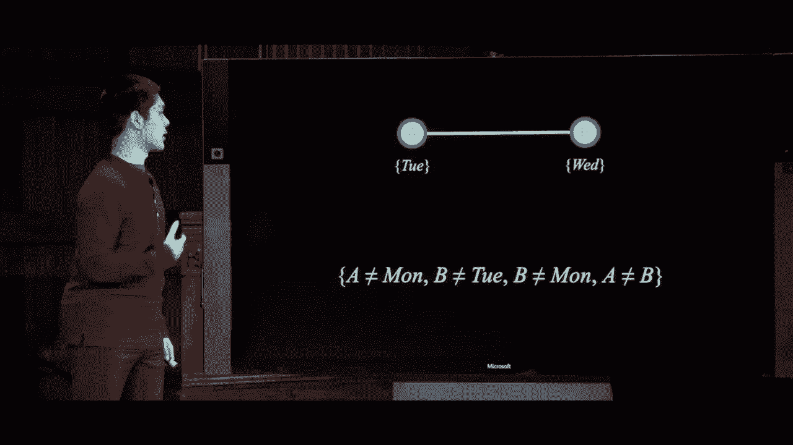
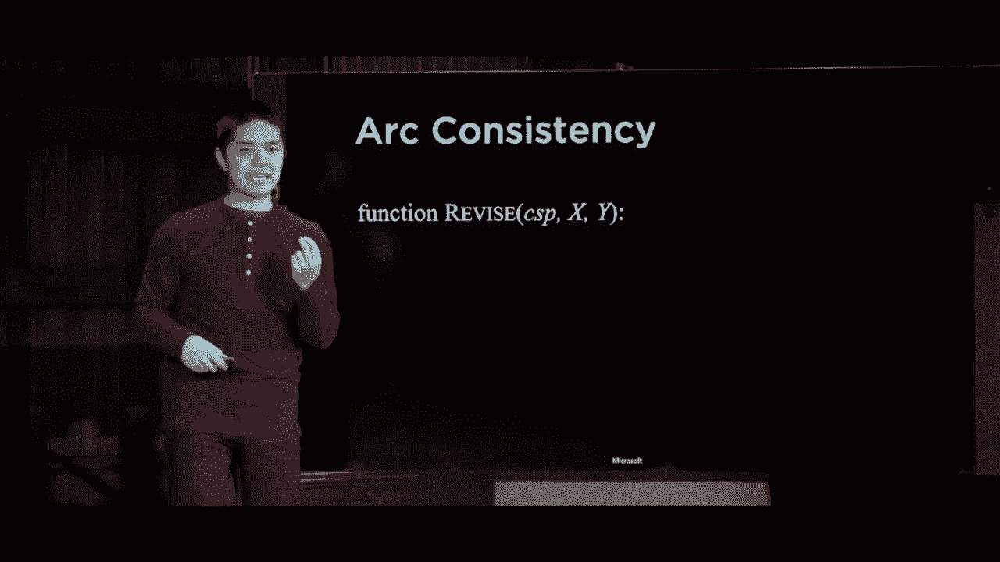
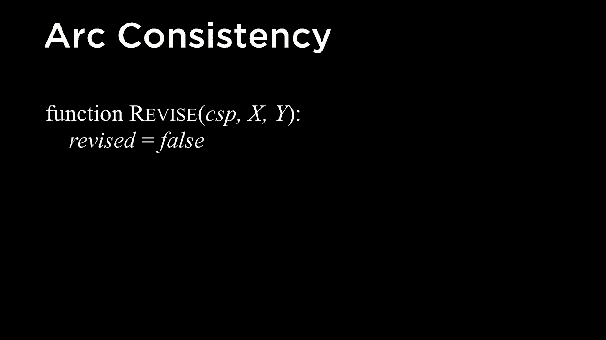
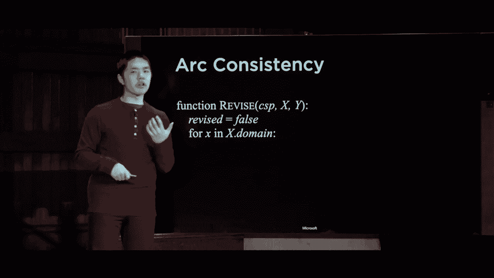
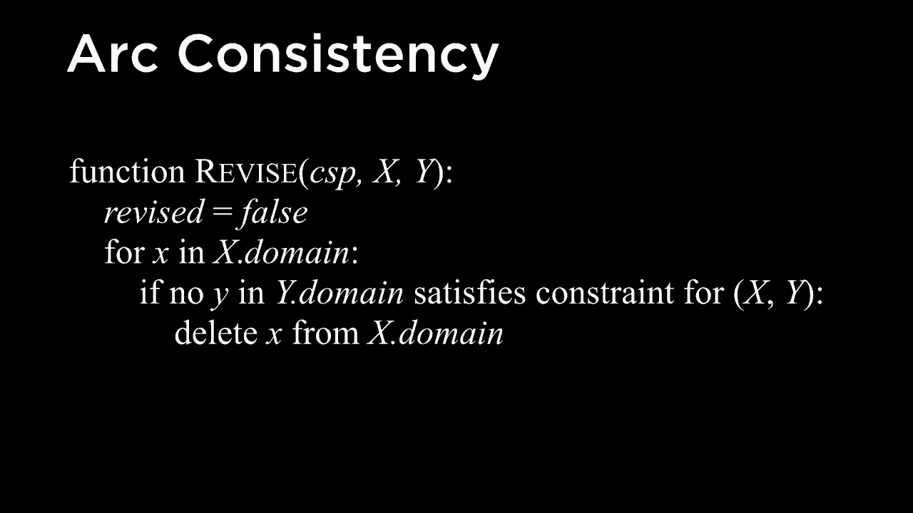
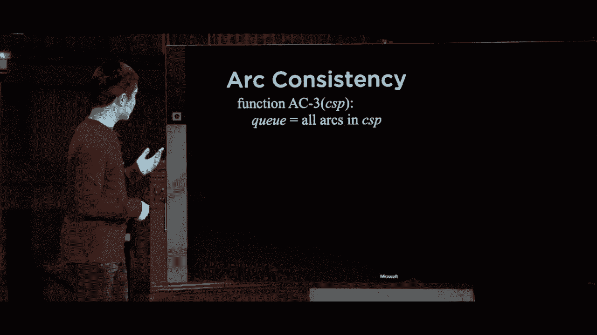
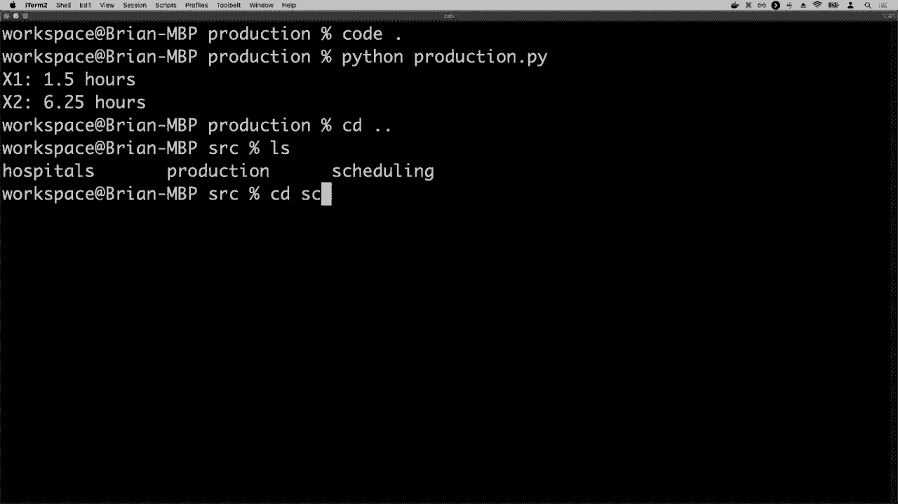
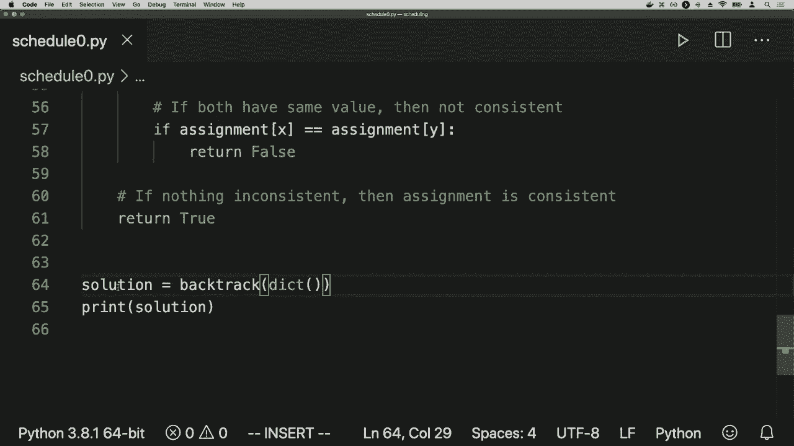
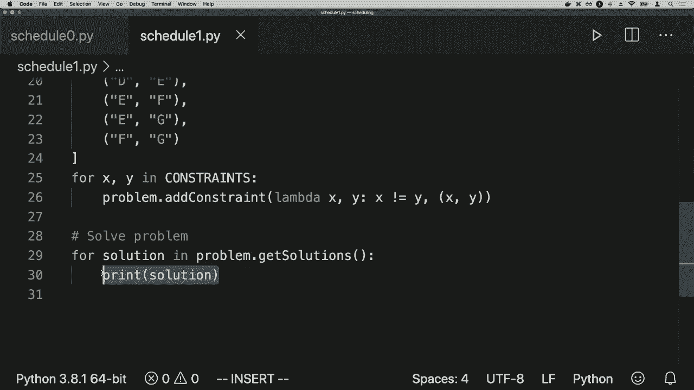

# 【双语字幕+资料下载】哈佛CS50-AI ｜ Python人工智能入门(2020·完整版) - P13：L3- 优化算法 3 (回溯搜索等) - ShowMeAI - BV1AQ4y1y7wy

domain satisfy the unary constraints，where things get a little bit more。

interesting is when we consider，different types of consistency something。

like Arc consistency for example an arc，consistency refers to when all of the。

values in a variables domain satisfy the，variables binary constraints so when。

we're looking at trying to make a are，consistent we're no longer just。

considering the unary constraints that，are involve a we're trying to consider。

all of the binary constraints that，involve a as well so any edge that。

connects a to another variable inside of，that constraint graph that we were。

taking a look at before put a little bit，more formally arc consistency and arc。

really is just another word for like an，edge that connects two of these nodes。

inside of our constraint graph we can，define our consistency a little more。

precisely like this in order to make，some variable X are consistent with。

respect to some other variable Y we need，to remove any element from X's domain to。

make sure that every choice for X every，choice in X's domain has a possible。

choice for Y so put another way if I，have a variable X and I want to make X。

and are consistent then I'm going to，look at all of the possible values that。

X can take on and make sure that for all，of those possible values there is still。

some choice that I can make for Y if，there's some arc between x and y to make。

sure that Y has a possible option that I，can choose as well so let's look at an。

example of that going back to this，example but from a form we enforced node。

consistency already by saying that a can，only be on Tuesday or Wednesday because。

we knew that a could not be on Monday，and we also said that bees only domain。

only consists of Wednesday because we，know that B does not equal Tuesday and，also be the。

equal Monday so now let's begin to，consider our consistency let's try and。

make a are consistent with B and what，that means is to make a are consistent。

with respect to B means that for any，choice we make in a is domain there is。

some choice we can make in B is no main，that is going to be consistent and we。

can try them for a we can choose Tuesday，as a possible value for a if I choose。

Tuesday for a is there a value for B，that satisfies the binary constraint。

well yes B Wednesday would satisfy this，constraint that a does not equal B。

because Tuesday does not equal Wednesday，however if we chose Wednesday for a well。

then there is no choice in B's domain，that satisfies this binary constraint。

there is no way I can choose something，for B that satisfies a does not equal B。

because I know B must be Wednesday and，so if ever I run into a situation like。

this where I see that here is a possible，value for a such that there is no choice。

of value for B that satisfies the binary，constraint well then this is not art。

consistent and to make it art consistent，I would need to take Wednesday and。

remove it from a is domain because，Wednesday was not going to be a possible。

choice I can make for a because it，wasn't consistent with this binary。

constraint for beet there was no way I，could choose Wednesday for a and and。

still have an available solution by，choosing something for B as well so here。

now I've been able to enforce arc，consistency and in doing so I've。

actually solved this entire problem that，given these constraints where a and B。

can have exams on either Monday or，Tuesday or Wednesday the only solution。

that it would appear is that A's exam，must be on Tuesday and B's exam must be。

on Wednesday and that is the only option。

available to me so if we want to apply，our consistency to a larger graph not。

just looking at one particular pair of，our consistency there are ways we can do。

that too and we can begin to formalize，what the pseudocode would look like for。

trying to write an algorithm that，enforces our consistency and we'll start。

by defining the function called revise。

revise is going to take as input a CSP，otherwise known as a constraint。

satisfaction problem and also two，variables x and y and what revise is，going to do。

it is going to make X Ark consistent，with respect to Y meaning remove。

anything from X's domain that doesn't，allow for a possible option for y how。

does this work well we'll go ahead and，first keep track of whether or not we've。

made a revision revised is ultimately，going to return true or false。

it'll return true in the event that we，did make a revision to X's domain it'll。

return false if we didn't make any，change to X's domain and we'll see in a。

moment why that's going to be helpful，but we start by saying revised equals。

false we haven't made any change in this，then we'll say all right let's go ahead。

and loop over all of the possible values，in X's domain so loop over X's domain。

for each little X in X's domain I want，to make sure that for each of those。

choices I have some available choice in，Y that satisfies the binary constraints。

that are defined inside of my CSP inside，of my constraint satisfaction problem so。

if ever it's the case that there is no，value Y in y's domain that satisfies the。

constraint for x and y well if that's，the case that means that this value X。

shouldn't be in X's domain so we'll go。

ahead and delete X from X's domain and，all set revives equal to true because I。

did change X's domain I changed X's，domain by removing little X and I。

removed little X because it wasn't art，consistent there was no way I could。

choose a value for y that would satisfy，this XY constraint so in this case we'll。

go ahead and set revised equal true and，we'll do this again and again for every。

value in X's domain sometimes it might，be fine in other cases it might not。

allow for a possible choice for y in，which case we need to remove this value。

from X's domain and at the end we just，return revised to indicate whether or。

not we actually made a change so this，function then this revised function is。

effectively an implementation of what，you saw me do graphically a moment ago。

and it makes one variable X are，consistent with another variable in this。

case Y but generally speaking when we，want to enforce our consistency will。

often want to enforce our consistency，not just for a single arc but for the。

entire constraint satisfaction problem，and it turns out there's an algorithm to。

do that as well and that algorithm is，known as，see three ac3 takes a constraint。

satisfaction problem and it enforces art，consistency across the entire problem。

how does it do that well it's going to，basically maintain a queue or basically。

just a line of all of the arcs than it，needs to make consistent and overtime we。

might remove things from that queue as，we begin dealing with art consistency。

and we might need to add things to that，queue as well if there are more things。

we need to make are consistent so we'll，go ahead and start with a queue that。

contains all of the arcs in the，constraint satisfaction problem all of。

the edges that connect to nodes that，have some sort of binary constraint。

between them and now as long as the，queue is not empty there is work to be。

done the queue is all of the things that，we need to make are consistent so as。

long as the queue is not empty there's，still things we have to do what do we。

have to do well we'll start by D queuing，from the queue remove something from the。

queue and strictly speaking it doesn't，need to be a queue but a queue is a。

traditional way of doing this，well DQ from the queue and that will，give us an arc x and y these two。

variables where I would like to make X，are consistent with Y so how do we make。

X are consistent with Y well we can go，ahead and just use that revised function。

that we talked about a moment ago，we called the revise function passing as。

input the constraint satisfaction，problem and also these variables x and y。

because I want to make X are consistent，with Y in other words remove any values。

from X's domain that don't leave an，available option for Y and recall what。

does revise return well it returns true，if we actually made a change if we。

removed something from X's domain，because there wasn't an available option。

for Y for example and it returns false，if we didn't make any change to X's。

domain at all and it turns out if revise，returns false if we didn't make any。

changes well then there's not a whole，lot more work to be done here for this。

arc we can just move ahead to the next，arc that's in the queue but if we did。

make a change if we did reduce X's，domain by removing values from X's。

domain well then what we might realize，is that this creates potential problems。

later on that it might mean that some，arc that was are consistent with X that。

node might no longer be our consist，with ex because while there used to be。

an option that we could choose for X now，there might not be because now we might。

have removed something from X that was，necessary for some other arc to be art。

consistent and so if ever we did revise，X's domain we're going to need to add。

some things to the queue some additional，we do that，well first thing we want to check is to。

make sure that X's domain is not 0 if X，is domain is 0 that means there are no。

available options for X at all and that，means that there's no way you can solve。

the constraint satisfaction problem if，we've removed everything from X's domain。

we'll go ahead and just return false，here to indicate there's no way to solve。

the problem because there's nothing left，in X's domain but otherwise if there are。

things left in X's domain but fewer，things than before well then what we'll。

do is we'll loop over each variable Z，that is in all of X's and neighbors。

except for y y we already handled but，we'll consider all of X as other's。

neighbors and ask ourselves all right，will that arc from each of those Z's to。

X that arc might no longer be our，consistent because well for each a Z。

there might have been a possible option，we could choose for X to correspond with。

each of these possible values now there，might not be because we removed some。

elements from X's domain and so what，we'll do here is we'll go ahead and end。

Q adding something to the Q this arc Z X，for all of those neighbors Z so we need。

to add back some arcs to the Q in order，to continue to enforce our consistency。

at the very end if we make it through，all this process then we can return true。

but this now is a c3 this algorithm for，enforcing arc consistency on a。

constraint satisfaction problem and the，big idea is really just keep track of。

all of the arcs that we Knight might，need to make art consistent make it art。

consistent by calling the revise，function and if we did revise it then。

there are some new arcs that might need，to be added to the queue in order to。

make sure that everything is still are，consistent even after we've removed some。

of the elements from a particular，variables of domain so what then would。

happen if we try to enforce arc，consistency on a graph like this on a。

graph where each of these variables has，a domain of Monday Tuesday and Wednesday。

well it turns out that by enforcing art，consistency on this graph well it can。

solve some types of problems nothing，actually changes here for any particular。

art just considering two variables，there's always a way for me to just for。

any of the choices I make for one of，them make a choice for the other one。

because there are three options and I，just need the two to be different from。

each other so this is actually quite，easy to just take an arc and just。

declare that it is aren't consistent，because if I pick you know Monday for D。

then I just pick something that isn't，Monday for B in art consistency we only。

consider consistency between a binary，constraint between two nodes and and。

we're not really considering all of the，rest of the nodes yet so just using a c3。

the enforcement of art consistency that，can sometimes have the effect of。

reducing domains to make it easier to，find solutions but it will not always。

actually solve the problem we might，still need to somehow search to try and。

find a solution and we can use classical，traditional search algorithms to try to。

do so you'll recall that a search，problem generally consists of these。

parts we have some initial State some，actions a transition model that takes me。

from one state to another state a goal，test to tell me have I satisfied my。

objective correctly and then some path，cost function because in the case of。

like maze solving I was trying to get to，my goal as quickly as possible so you。

could formulate a CSP or a constraint，satisfaction problem as one of these。

types of search problems the initial，state will just be an empty assignment。

where an assignment is just a way for me，to assign any particular variable to any。

particular value so if an empty，assignment is no variables are assigned。

to any values yet then the action I can，take is adding some new variable equals。

value pair to that assignment saying for，this assignment let me add a new value。

for this variable then the transition，model just defines what happens when you。

take that action you get a new，assignment that has that variable equal。

to that value inside of it the goal test，is just checking to make sure all the。

variables have been assigned and making，sure all the constraints have been。

satisfied and the path cost function I'm，sort of irrelevant I don't really care。

about what the path really is I just，care about finding some assignment that。

actually satisfies all of the，constraints so really all the paths have。

the same cost I don't really care about。

the path to the goal I just care about，the solution itself much as we've talked。

about now before the problem here though，is that if we just implement this naive。

search algorithm just by implementing，like breadth-first search or depth-first。

search this is going to be very very，inefficient and there are ways we can。

take advantage of efficiencies in the，structure of a constraint satisfaction。

problem itself and one of the key ideas，is that we can really just order these。

variables and and it doesn't matter what，order we assign variables in the。

assignment a equals 2 and then B equals，8 is identical to the assignment of B。

equals 8 and then a equals 2 switching，the order doesn't really change anything。

about the fundamental nature of that，assignment and so there are some ways。

that we can try and revise this idea of，a search algorithm to apply it。

specifically for a problem like a，constraint satisfaction problem and it。

turns out the search algorithm will，generally use when talking about。

constraint satisfaction problems if，something known as backtracking search。

and the big idea of backtracking search，is we'll go ahead and make assignments。

to from variables to values them and if，ever we get stuck we arrive at a place。

where there is no way we can make any，forward progress while still preserving。

the constraints that we need to enforce，we'll go ahead and backtrack and try。

something else instead so the very basic，sketch of what backtracking search looks。

like is it looks like this function，called backtrack that takes as input an。

assignment and a constraint satisfaction，problem so initially we don't have any。

assigned variables someone would begin，backtracking search this assignment is。

just going to be the empty assignment，with no variables inside of it but we'll。

see later this is going to be a，recursive function so backtrack takes as。

input the assignment and the problem if，the assignment is complete meaning all。

of the variables have been assigned we，just return that assignment that of。

course won't be true initially because，we start with an empty assignment but。

over time we might add things to that，assignment so if ever the assignment。

actually is complete then we're done，then just go ahead and return that。

assignment but otherwise there is some，work to be done I said what we'll need。

to do is select an unassigned variable，for this particular problem。

need to take the problem look at the，variables that have already been。

assigned and pick a variable that has，not yet been assigned and I'll go ahead。

and take that variable and then I need，to consider all of the values in that。

variables domain so we'll go ahead and，call this domain values function we'll。

talk a little more about that later that，takes a variable and just gives me back。

an ordered list of all of the values in，its domain so I've taken a random。

unselected variable I'm going to loop，over all of the possible values and the。

idea is let me just try all of these，values as possible values for the。

variable so if the value is consistent，with the assignment so far it doesn't。

violate any of the constraints well then，let's go ahead and add variable equals。

value to the assignment because it's so，far consistent and now let's recursively。

call backtrack to try and make the rest，of the assignments also consistent so。

we'll go ahead and call backtrack on，this new assignment that I've added this。

new variable equals value to and now I，recursively call backtrack and see what。

the result is and if the result isn't a，failure well then let me just return。

that result and otherwise what else，could happen well if it turns out the。

result was a failure well then that，means this value was probably a bad。

choice for this particular variable，because when I assign this variable。

equal to that value eventually down the，road I ran into a situation where I。

violated constraints it was nothing more，like a doom so now I'll remove variable。

equals value from the assignment，effectively backtracking say all right。

that value didn't work let's try another，value instead and then at the very end。

if we were never able to return a，complete assignment we'll just go ahead。

and return failure because that means，that none of the values worked for this。

particular variable this know is the，idea for backtracking search to take。

each of the variables that try values，for them and recursively try。

backtracking search see if we can make，progress and if ever we run into a dead。

end we run into a situation where there，is no possible value we can choose that。

satisfies the constraints we return，failure and that propagates up and。

eventually we make a different choice by，going back and trying something else。

instead so let's put this algorithm into，practice it's actually try and use back。

search to solve this problem now where I，need to figure out how to assign each of。

these courses to an exam slot on Monday，or Tuesday or Wednesday。

in such a way that it satisfies these，constraints that each of these edges。

mean those two classes cannot have an，exam on the same day so I can start by。

just like starting at a node doesn't，really matter which I start with but in。

this case we'll just start with a and，I'll ask a question like all right let。

me loop over the values from the domain，and maybe in this case I'll just start。

with Monday and say all right let's go，ahead and assign a to Monday we'll just。

go and order Monday Tuesday Wednesday，and now let's consider a node B all。

right so I've made an assignment to a so，I recursively call backtrack with this。

new part of the assignment now I'm，looking to pick another on assigned。

variable like B and I'll say all right，maybe I'll start with Monday because。

that's the very first value in B is，domain and I ask all right doesn't。

Monday violate any constraints and it，turns out yes it does it violates this。

constraint here between a and B because，a and B are now both on Monday and that。

doesn't work because B can't be on the，same day as a so that doesn't work so we。

might instead try Tuesday try the next，value in B's domain and is that。

consistent with the assignment so far，well yeah be Tuesday a Monday that is。

consistent so far because they're not on，the same day so that's good now we can。

recursively call backtrack try again，pick another unassigned variable。

something like D and say alright let's，go through its possible values is Monday。

consistent with this assignment well yes，it is B and D are on different days。

Monday versus Tuesday and a and B are，also on different days Monday versus。

Tuesday so that's fine so far too well，go ahead and try again maybe we'll go to。

this variable here e say can we make，that consistent let's go through the。

possible values we've recursively called，backtrack we might start with Monday and。

say all right that's not consistent，because D and E now have exams on the。

same day so we might try Tuesday instead，going to the next one ask is that。

consistent well no it's not because b，and e those have exams on the same day。

and so we try all right is Wednesday，consistent and it turns out all right。

yes it is Wednesday is consistent，because D and E now have exams on。

different days B and E now have exams on，different days all seems to be well so。

far I recursively call backtrack select，another unassigned variable we'll say，let's try the。

values that si could take on let's start，with Monday and it turns out that's not。

consistent because now a and C both have，exams on the same day so I tried to z'。

day and say that's not consistent either，because B and C now have exams on the。

same day and then I say alright let's go，ahead and try Wednesday but that's not。

consistent either because C and eeeh，each have exams on the same day too so。

now we've gone through all the possible，values for C Monday Tuesday and。

Wednesday and none of them are，consistent there is no way we can have a。

consistent assignment backtrack in this，case we'll return to failure and so then。

we'd say all right we have to backtrack，back here well now for e we've tried all。

of Monday Tuesday and Wednesday and none，of those work because Wednesday which。

seemed to work turned out to be a，failure so that means there's no。

possible way we can assign e so that's a，failure too we have to go back up to D。

which means that Monday assignment to D，that must be wrong we must try something。

else so we can try right what if D is 2，what if instead of Monday we try to x'。

day Tuesday it turns out is not，consistent because B and D now have an。

exam on the same day but Wednesday as it，turns out works and now we can begin to。

mix them forward progress again we go，back to E and say all right which of。

these values works Monday turns out to，work by not violating any constraints。

then we go up to C now Monday doesn't，work as a violate the constraint，violates two actually。

Tuesday doesn't work as a violate to，constraint as well but Wednesday does。

work then we can go to the next variable，F and say all right does Monday work。

we'll know what violates a constraint，but Tuesday does work and then finally。

we can look at the last variable G，recursively calling backtrack one more。

time Monday is inconsistent that，violates a constraint Tuesday also。

violates a constraint but Wednesday that，doesn't violate a constraint and so now。

at this point we recursively call，backtrack one last time we now have a。

satisfactory assignment of all of the，variables and at this point we can say。

that we are now done we have now been，able to successfully assign a variable。

or a value to each one of these，variables in such a way that we're not。

violating any constraints we're gonna go，ahead and have classes a and E ax have。

their exams on Monday classes B and F，can have their exams on Tuesday and，classes C D and。

gee can have their exams on Wednesday，and there's no violated constraints that。

might come up there so that was a，graphical look at how this might work。

let's now take a look at some code we，could use to actually try and solve this。

problem as well so here I'll go ahead。

and go into the scheduling directory，we're here now we'll start by looking at。

schedule 0 PI we're here I define a list，of variables，ABCD efg those are all the different。

classes then underneath that I define my，list of constraints so constraint a and。

B that is a constraint because they，can't be on the same day and likewise a。

and C B and C so on and so forth，enforcing those exact same constraints。

and here then is what the backtracking，function might look like first if the。

assignment is complete if I've made an，assignment of every variable to a value。

go ahead and just return that assignment，then we'll select an unassigned variable。

from that assignment then for each of，the possible values in the domain Monday。

Tuesday Wednesday let's go ahead and，create a new assignment that assigns the。

variable to that value I'll call this，consistent function which I'll show you。

in a moment that just checks to make，sure this new assignment is consistent。

but if it is consistent we'll go ahead，and call backtrack to go ahead and。

continue trying to run backtracking，search and as long as the result is not。

none meaning it wasn't a failure we can，go ahead and return that result but if。

we make it through all the values and，nothing works then it is a failure。

there's no solution we go ahead and，return none here what are these。

functions do select unassigned variable，it's just going to choose a variable not。

yet assigned so it's going to loop over，all the variables and if it's not。

already assigned we'll go ahead and just，return that variable and what does the。

consistent function do well the，consistent function goes through all the。

constraints and if we have a situation，where we've assigned both of those。

values to variables but they are the，same well then that is a violation of。

the constraint in which case we'll，return false but if nothing is。

inconsistent then the assignment is，consistent and we'll return true and。

then all the program does is it calls，empty，dictionary that has no variable assigned。

to no values yet save that inside a，solution and then print out dot solution。

so by running this now I can run Python，schedule 0 PI and what I get as a result。

of that is an assignment of all these，variables to values and turns out we。

sign a to Monday is we would expect be，it a Tuesday C to Wednesday and exactly。

the same type of thing we were talking，about before an assignment of each of。

these variables to values that doesn't。

violate any constraints and I had to do，a fair amount of work in order to。

implement this idea myself I had to，write the BACtrack function that went。

ahead and went through this process of，recursively trying to do this。

backtracking search but it turns out the，constraint satisfaction problems are so。

popular that there exist many libraries，that already implement this type of idea。

again as with before the specific，library is not as important as the fact。

that libraries do exist this is just one，example of a Python constraint library。

where now rather than having to do all，the work from scratch inside of schedule。

1 dot pi i'm just taking advantage of a，library that implements a lot of these。

ideas already so here i create a new，problem add variables to it with。

particular domains i add a whole bunch，of these individual constraints where i。

call add constraint and pass in a，function describing what the constraint。

is and the constraint basically says the，function that takes two variables x and。

y and makes sure that X is not equal to，Y enforcing the idea that these two。

classes cannot have exams on the same，day and then for any constraint。

satisfaction problem I can call get，solutions to get all the solutions to。

that problem and then for each of those。

solutions print out what that solution，happens to be and if I run Python。

schedule 1 dot PI and I see they're，actually a number of different solutions。

that can be used to solve the problem，there in fact 6 different solutions。

assignments of variables to values that，will give me a satisfactory answer to。

this constraint satisfaction problem so，this then was an implementation of a。

very basic backtracking search method，where really we just went through each。

of the variables picked one that wasn't，assigned tried the possible values the。

variable could take on and then if it，was what if it worked if it didn't。

violate any constraints then，kept trying other variables and if ever。

we hit a dead end we had to backtrack，but ultimately we might be able to be a。

little bit more intelligent about how we，do this in order to improve the。

efficiency of how we solve these sorts，of problems and one thing we might。

imagine trying to do is going back to，this idea of inference using the。

knowledge we know to be able to draw，conclusions in order to make the rest of。

the problem-solving process a little bit，easier and let's now go back to where we。

got stuck in this problem the first time，when we were solving this constraint。

satisfaction problem we dealt with B and，then we went on to D and we went ahead。

and just assigned D to Monday because，that seemed to work with the assignment。

so far it didn't violate any constraints，but it turned out that later on that。

choice turned out to be a bad one that，that choice wasn't consistent with the。

rest of the values that we could take on，here and the question is is there。

anything we could do to avoid getting，into a situation like this avoid trying。

to go down a path that's ultimately not，going to lead anywhere by taking。

advantage of knowledge that we have，initially and it turns out we do have。

that kind of knowledge we can look at，just the structure of this graph so far。

and we can say that right now C's domain，for example contains values Monday，Tuesday and Wednesday。

and based on those values we can say，that this graph is not arc consistent。

recall that art consistency is all about，making sure that for every possible。

value for a particular node that there，is some other value that we are able to。

choose and as we can see here Monday and，Tuesday are not going to be possible。

values that we can choose for C they're，not going to be consistent with a node，like B for example。

because b is equal to tuesday which，means that c cannot be Tuesday and。

because a is equal to Monday see also，cannot be Monday so using that。

information by making C are consistent，with a and B we could remove Monday and。

Tuesday from C's domain and just leave C，with Wednesday for example and if we。

continued to try and enforce our，consistency we'd see there are some。

other conclusions we can draw as well we，see that B is only option is Tuesday and。

C's only option is Wednesday and so if，we want to make Yi are consistent well。

II can't be Tuesday because that，wouldn't be our consistent with。

b & e cant be wednesday because that，wouldn't be are consistent with c so we。

can go ahead and say e and just set that，equal to monday for example and then we。

can begin to do this process again and，again that in order to make d are。

consistent with b and e then d would，have to be wednesday that's the only。

possible option and likewise we can make，the same judgments for F and G as well。

and it turns out without having to do，any additional search just by enforcing。

our consistency we were able to actually，figure out what the assignment of all。

the variables should be without needing，to backtrack at all and the way we did。

that is by interleaving this search，process and the inference step by this。

step of trying to enforce our，consistency and the algorithm to do this。

is often called just the maintaining our，consistency algorithm which just。

enforces our consistency every time we，make a new assignment of a value to an。

existing variable so sometimes we can，enforce our consistency using that ac3。

algorithm at the very beginning of the，problem before we even begin searching。

in order to limit the domain and the，variables in order to make it easier to。

search but we can also take advantage of，the interleaving of enforcing our。

consistency with search such that every，time in the search process we make a new。

assignment we go ahead and enforce our，consistency as well to make sure that。

we're just eliminating possible values，from domains whenever possible and how。

do we do this well this is really，equivalent to just every time we make a。

new assignment to a variable X we'll go，ahead and call our ac3 algorithm this。

algorithm that enforces our consistency，on a constraint satisfaction problem and。

we go ahead and call that starting it，with a Q not of all of the arcs which we。

did originally but just of all of the，arcs that we want to make are consistent。

with X this thing that we have just made，an assignment to so all arcs YX where Y。

is a neighbor of X something that shares，a constraint with X for example and by。

maintaining our consistency in the，backtracking search process we can。

ultimately make our search process a，little bit more efficient and so this is。

the revised version of this backtrack，function same as before the changes here。

highlighted in yellow every time we add，a new variable equals value to our，assignment。

we'll go ahead and run this inference，procedure which might do a number of。

different things but one thing it could，do is call the maintaining our。

consistency algorithm to make sure we're，able to enforce our consistency on the。

problem and we might be able to draw new，inferences as a result of that process。

get new guarantees of this variable，needs to be equal to that value for。

example that might happen one time it，might happen many times and so long as。

those inferences are not a failure as，long as they don't lead to a situation。

where there is no possible way to make，forward progress well then we can go。

ahead and add those inferences there's，new knowledge that new pieces of。

knowledge I know about what variables，should be assigned to what values I can。

add those to the assignment in order to，more quickly make forward progress by。

taking advantage of information that I，can just a deuce information I know。

based on the rest of the structure of，the constraint satisfaction problem and。

the only other change I'll need to make，now is if it turns out this value。

doesn't work well then down here I'll go，ahead and need to remove not only。

variable equals value but also any of，those inferences that I made remove that。

from the assignment as well and so here，then we're often able to solve the。

problem by backtracking less and we，might originally have needed to just by。

taking advantage of the fact that every，time we make a new assignment of one。

variable to one value that might reduce，the domains of other variables as well。

and we can use that information to begin，to more quickly draw conclusions in。

order to try and solve the problem more，efficiently as well and it turns out。

there are other heuristics we can use to，try and improve the efficiency of our。

search process as well and it really，boils down to a couple of these。

functions that I've talked about but we，haven't really talked about how they're。

working and one of them is this function，here select unassigned variable where。

we're selecting some variable in the，constraint satisfaction problem that has。

not yet been assigned so far I've sort，of just been selecting variables random。

just like picking one variable and went，on to find a variable in order to decide。

alright this is the variable that we're，going to assign next and then going from。

there but it turns out that by being a，little bit intelligent by following。

certain heuristics we might be able to，make the search process much more。

efficient just by choosing very，carefully which variable we should。

explore next so some of those heuristics，include the，minimum remaining values or MRV。

heuristic which generally says that if I，have a choice between which variable I。

should select I should select the，variable with the smallest domain the。

variable that has the fewest number of，remaining values left with the idea。

being if there are only two remaining，values left well I may as well like。

prune one of them very quickly in order，to get to the other because one of those。

two has got to be the solution if a，solution does exist，sometimes minimum remaining values might。

not give a conclusive result if all the，nodes have the same number of remaining。

values for example and in that case，another heuristic that can be helpful to。

look at is the degree heuristic the，degree of a node is the number of nodes。

that are attached to that node the，number of nodes that are constrained by。

that particular node and if you imagine，which variable should I choose should I。

choose a variable that has a high degree，that is connected to a lot of different。

things or a variable with a low degree，that is not connected to a lot of。

different things well it can often make，sense to choose the variable that has。

the highest degree that is connected to，the most other nodes as the thing you。

would search first why is that the case，well it's because by choosing a variable。

with a high degree and that is，immediately going to constrain the rest。

of the variables more and it's more，likely to be able to eliminate large。

sections of the state space that you，don't need to search through at all so。

what could this actually look like let's，go back to this search problem here in。

this particular case I've made an，assignment here I've made an assignment。

here and the question is what should I，look at next，and according to the minimum remaining。

values heuristic what I should choose is，the variable that has the fewest。

remaining possible values and in this，case that's this node here node C that。

only has one variable left in this，domain which in this case is Wednesday。

which is a variable read very reasonable，choice of a next assignment to make。

because I know it's the only option for，example I know that the only possible。

option for C is Wednesday so I may as，well make that assignment and then。

potentially explore him the rest of the，space after that but meanwhile at the。

very start of the problem when I didn't，have any knowledge of what nodes should。

have what values yet I still had to pick，what node should be the first one that I。

try and assign a value to and I，arbitrarily just chose the one in the，more Intel。

about that we can look at this，particular graph all of them have。

domains of the same size domain of size，3 some minimum reigning values it。

doesn't really help us there but we，might notice that node e has the highest。

degree it is connected to the most，things and so perhaps it makes sense to。

begin our search rather than starting at，node a at the very top start with the。

node with the highest degree start by，searching from node e because from there。

that's going to much more easily allow，us to enforce the constraints that are。

near by eliminating large portions of，the search space that I might not need。

to search through and in fact by，starting with e we can immediately then。

assign other variables and following，that we can actually assign the rest of。

the variables without needing to do any，backtracking at all even if I'm not。

using this inference procedure just by，starting with a node that has a higher。

degree that it's going to very quickly，restrict the possible values that other。

nodes can take on so that then is how we，can go about selecting an unassigned。

variable in a particular order rather，than randomly picking a variable if。

we're a little bit intelligent about how，we choose it we can make our search。

process much much more efficient by，making sure we don't have to search。

through portions of the search space，that ultimately aren't going to matter。

the other variable we haven't really，talked about the other function here is。

this domain values function this domain，values function that takes a variable。

and gives me back a sequence of all of，the values inside of that variables。

domain the naive way to approach it is，what we did before which is just go in。

order go Monday then Tuesday then，Wednesday but the problem is that going。

in that order might not be the most，efficient order to search in that。

sometimes it might be more efficient to，choose values that are likely to be。

solutions first and then go to other，values now how do you assess whether a。

value is likelier to lead to a solution，or less likely to lead to a solution。

well one thing you can take a look at is，how many constraints get added how many。

things get removed from domains as you，make this new assignment of a variable。

to this particular value and the，heuristic we can use here is the least。

constraining value heuristic which is，the idea that we should return variables。

in order based on the number of choices，that are ruled out for neighboring。

values and I want to start with the，least constraining value the。

value that rules out the leap fewest，possible options and the idea there is。

that if all I care about doing is，finding a solution if I start with a。

value that rules out a lot of other，choices I'm ruling out a lot of。

possibilities that maybe is going to，make it less likely that this particular。

choice leads to a solution whereas on，the other hand if I have a variable and。

I start by choosing a value that doesn't，rule out very much well then I still。

have a lot of space where there might be，a solution that I could ultimately find。

and this might seem a little bit，counterintuitive and a little bit at。

odds with what we were talking about，before where I said when you're picking。

a variable you should pick the variable，that is going to have the fewest。

possible values remaining but here I，want to pick the value for the variable。

that is the least constraining but the，general idea is that when I am picking a。

variable I would like to prune large，portions of the search space by just。

choosing a variable that is going to，allow me to quickly eliminate possible。

options and whereas here within a，particular variable as I'm considering。

values of that variable could take on I，would like to just find a solution and。

so what I want to do is ultimately，choose a value that still leaves open。

the possibility of me finding a solution，to be as likely as possible by not。

ruling out many options I leave open the，possibility that I can still find a。

solution without needing to go back，later and backtrack so an example of。

that might be in this particular，situation here if I'm trying to choose a。

variable for a value for node see here，that C is equal to either Tuesday or。

Wednesday we know it can't be Monday，because it conflicts with this domain。

here where we already know that a is，Monday so C must be Tuesday or Wednesday。

and the question is should I try to x'，day first or should I try Wednesday。

first and if I try to x' day what gets，ruled out well one option gets ruled out。

here a second option gets rolled out，here and a third option gets rolled out。

here so choosing Tuesday would rule out，three possible options and what about。

choosing Wednesday well choosing，Wednesday would rule out one option here。

and it would rule out one option there，and so I have two choices，I can choose Tuesday that rules out。

three options or Wednesday that rules，out two options，and according to the least constraining。

value heuristic what I should probably，one，that rules out the fewest number of。

possible options leaving open as many，chances as possible for me to eventually。

find the solution inside of the state，space and ultimately if you continue。

this process we will find a solution an，assignment of variables to values that。

allows us to give each of these exams，each of these classes in exam date that。

doesn't conflict with anyone that，happens to be enrolled in two classes at。

the same time so the big takeaway now，with all of this is that there are a。

number of different ways we can，formulate a problem the ways we've。

looked at today are we can formulate a，problem as a local search problem a。

problem where we're looking at a current，node and moving to a neighbor based on。

whether that neighbor is better or worse，than the current node that we are。

looking at we looked at formulating，problems as linear programs we're just。

by putting things in terms of equations，and constraints were able to solve。

problems a little bit more efficiently，and we saw formulating a problem as a。

constraint satisfaction problem creating，this graph of all of the constraints。

that connect to variables that have some。

constraint between them and using that，information to be able to figure out。

what the solution should be and so the，takeaway of all of this now is that if。

we have some problem in artificial，intelligence if we would like to use AI。

to be able to solve them whether that's，trying to figure out where hospitals。

should be or trying to solve the，Traveling Salesman problem trying to。

optimize productions and costs and，whatnot or trying to figure out how to。

satisfy certain constraints whether，that's in a Sudoku puzzle or whether。

that's in trying to figure out how to，schedule exams for a university or any。

number of a wide variety of types of，problems if we can formulate that。

problem as one of these sorts of，problems then we can use these known。

algorithms these algorithms for，enforcing art consistency and。

backtracking search these hill climbing，and simulated annealing algorithms these。

simplex algorithms and interior point，algorithms that can be used to solve。

linear programs that we can use those，techniques to begin to solve a whole。

wide variety of problems all in this，world of optimization inside of。

artificial intelligence this was an，introduction to artificial intelligence。

with Python for today we will see you。

