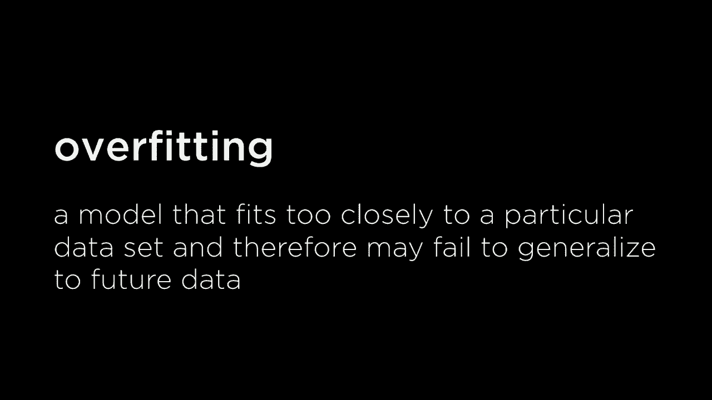
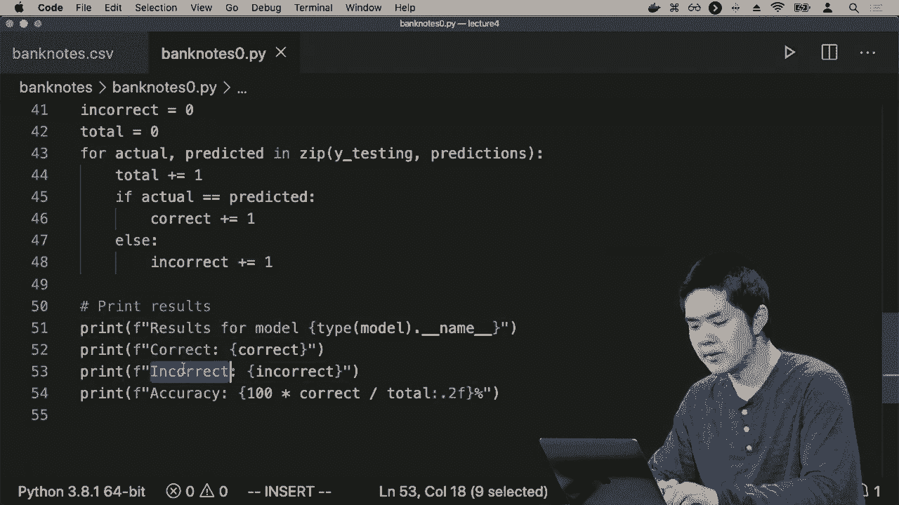
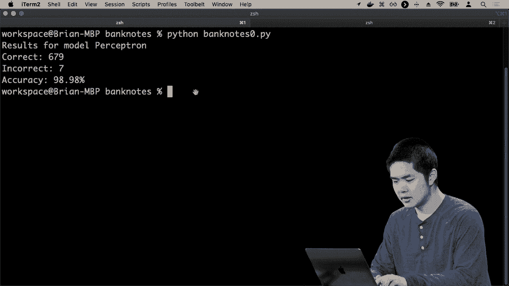
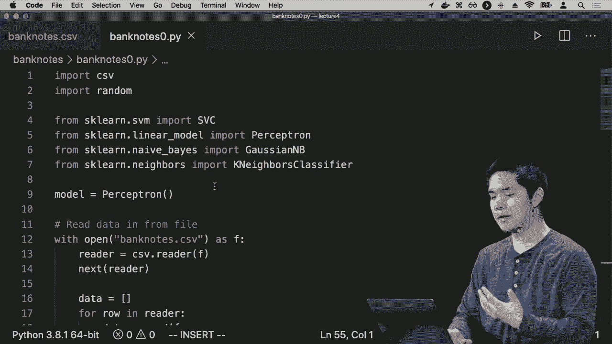
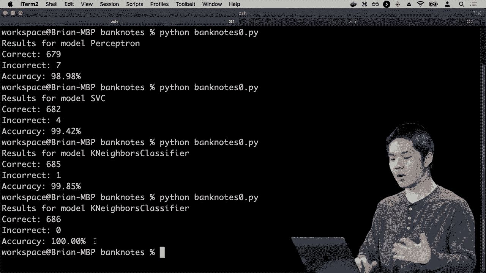
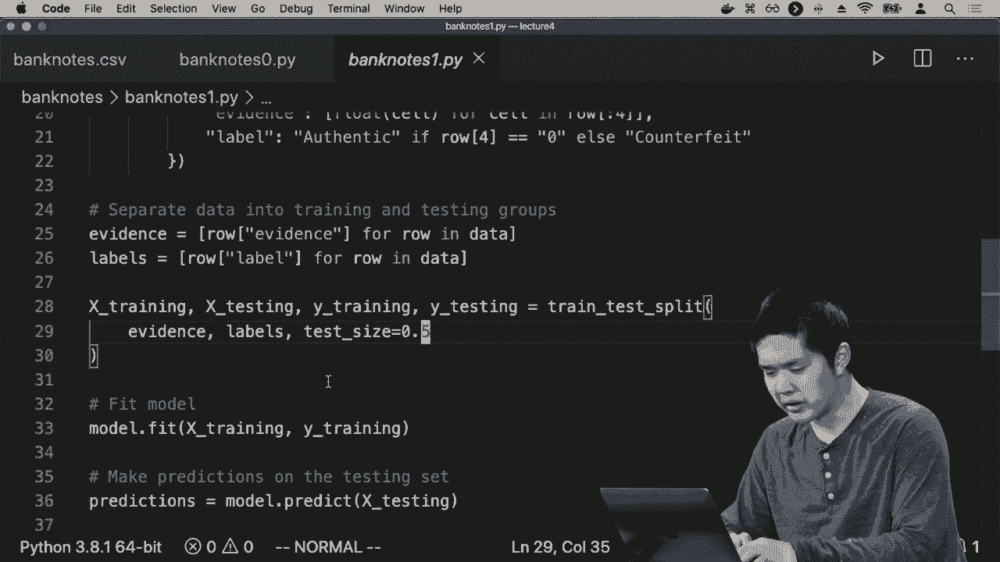

# 【双语字幕+资料下载】哈佛CS50-AI ｜ Python人工智能入门(2020·完整版) - P15：L4- 模型学习 2 (回归，损失函数，过拟合，正则化，强化学习，sklearn) - ShowMeAI - BV1AQ4y1y7wy

not rain authentic or counterfeit but，sometimes what we want to predict is a。real numbered value and for that we have，a related problem not classification but。instead known as regression and，regression is the supervised learning。problem where we try and learn a，function mapping inputs to outputs same。

as before but instead of the outputs，being discrete categories things like。rain or not rain in a regression problem，the output values are generally。continuous values some real number that，we would like to predict happens all the。time as well you might imagine that a，company might take this approach if it's。

trying to figure out for instance what，the effective it's advertising is like。how do advertising dollars spent，translate into sales for the company's。product for example and so they might，like to try to predict some function。that takes as input the amount of money，spent on advertising and here we're just。

going to use one input but again you，could scale this up，many more inputs as well if you have a。lot of different kinds of data you have，access to and the goal is to learn a。function that given this amount of，spending on advertising we're gonna get。this amount in sales and you might judge，based on having access to a whole bunch。

of data like for every past month here's，how much we spent on advertising and。here is what sales were and we would，like to predict some sort of hypothesis。function that again given the amount，spent on advertising can predict in this。case some real number some number，estimate of how much sales we expect。

that company to do in this month or in，this quarter or whatever unit of time。we're choosing to measure things in and，so again the approach to solving this。type of problem we could try using a，linear regression type approach where we。take this data and we just plot it on，the x-axis we have advertising dollars。

spent on the y-axis we have sales and we，might just want to try and draw a line。that does a pretty good job of trying to，estimate this relationship between。advertising and sales and in this case，unlike before we're not trying to。separate the data points into discrete，categories but instead in this case。

we're just trying to find a line that，approximates this relationship between。advertising and sales so that if we want，to figure out what the estimated sales。are for a particular advertising budget，you just look it up in this line figure。out for this amount of advertising we，would have this amount of sales and just。

try and make the estimate that way if，you can try and come up with a line。again figuring out how to modify the，weights using various different。techniques to try and make it so this，line fits as well as possible so with。all of these approaches then to trying，to solve machine learning style problems。

the question becomes how do we evaluate，these approaches how do we evaluate the。various different hypotheses that we，could come up with because each of these。algorithms will give us some sort of，hypothesis some function that map's。inputs to outputs and we want to know，how well does that function work and you。

can think of evaluating these hypotheses，and trying to get a better hypothesis as。kind of like an optimization problem in，an optimization problems you'll recall。from before we were either trying to，maximize some objective function by。trying to find a global maximum or we，were trying to minimize some cost。

by trying to find some global minimum，and in the case of evaluating these。hypotheses ISM one thing we might say is，that this cost function the thing we're。trying to minimize we might be trying to，minimize what we would call a loss。function and what a loss function is if，it is a function that is going to。

estimate for us how poorly our function，performs more formally it's like a loss。of utility by whenever we predict，something that is wrong that is a loss。of utility that's going to add to the，output of our loss function and you。could come up with any loss function，that you want just some mathematical way。

of estimating you know given each of，these data points given what the actual。output is and given what our projected，output is our estimate you could。calculate some sort of numerical loss，for it but there are a couple of popular。loss functions that are worth discussing，just so that you've seen them before。

when it comes to discrete categories，things like rain or not rain counterfeit。or not counterfeit one approaches the 0，1 loss function and the way that works。is for each of the data points our loss，function takes as input what the actual。output is like whether it was actually，raining or not raining and takes our。

prediction into account did we predict，given this data point that it was。raining or not raining and if the actual，value equals the prediction well then。the 0 1 loss function will just say the，loss is 0 there was no loss of utility。because we were able to predict，correctly and otherwise if the actual。

value was not the same thing as what we，predicted well then in that case our。loss is 1 we lost something lost some，utility because what we predicted was。the output of the function was not what，it actually was and the goal then in a。situation like this would be to come up，with some hypothesis that minimizes that。

the total empirical loss the total，amount that we've lost if you add up for。all these data points what the actual，output is and and what your hypothesis。would have predicted so in this case for，example if we go back to classifying。days as raining or not raining and we，came up with this decision boundary how。

would we evaluate this decision boundary，how much better is it then drawing the。line here or drawing the line there well，we could take each of the input data。points and each input data point has a，label whether it was raining or whether。it was not raining and we could compare，it to the prediction where。

we predicted it would be raining or not，raining and assign it a numerical value。as a result so for example these points，over here they were all rainy days and。we predicted they would be rainy because，they fall on the bottom side of the line。so they had a loss of zero nothing lost，from those situations and likewise Amos。

true for some of these points over here，where it was not raining and we。predicted it would not be raining either，where we do have loss our points like。this point here and that point there，where we predicted that it would not be。raining but in actuality it's a blue，point it was raining or likewise here we。

predicted that it would be raining but，in actuality it's a red point it was not。written and so as a result we，miscategorized these data points that we。were trying to train on and as a result，there's some loss here one loss here。there here and there for a total loss of，four for example in this case and that。

might be how we would estimate or how we，would say that this line is better than。a line that goes somewhere else or，alignments further down because this。line might minimize the loss so there's，no way to do better than just these four。points of loss if you're just drawing a，straight line through our space so the 0。

1 loss function checks did we get it，right did we get it wrong if we got it。right the loss is zero nothing lost if，we got it wrong then our loss function。for that data point says one and we add，up all of those losses across all of our。data points to get some sort of，empirical loss how much we have lost。

across all of these original data points，that our algorithm had access to there。are other forms of loss as well that，work especially well when we deal with。more real valued cases cases like the，mapping between advertising budget and。amount that we do in sales for example，because in that case you care not just。

that you get the number exactly right，but you care how close you were to the。actual value if the actual value is you，did like $2，800 in sales and you。predicted that you would do $2，900 in，sales you know maybe that's pretty good。that's much better than if you had，predicted you do $1，000 in sales for。

example and so we would like our loss，function to be able to take that into。account as well take apart take into，account not just whether the actual。value in the expected value are，exactly the same but also take into。account how far apart they were and so，for that one approaches what we call l1。

loss l1 loss doesn't just look at，whether actual and predicted are equal。to each other but we take the absolute，value of the actual value minus the。predicted value in other words we just，ask how far apart were the actual and。predicted values and we sum that up，across all of the data points to be able。

to get what our answer ultimately is so，what might this actually look like for。our data set well if we go back to this，representation where we had advertising。along the x axis sales along the y axis，our line was our prediction our estimate。for any given amount of advertising what，we predicted sales was going to be and。

our l1 loss is just how far apart，vertically along the sales axis our。prediction was from each of the data，points so we could figure out exactly。how far apart our prediction was from，each of the data points and figure out。as a result of that what our loss is，overall for this particular hypothesis。

just by adding up all of these various，different individual losses for each of。these data points and our goal then is，to try and minimize that loss to try and。come up with some line that minimizes，what the utility losses by judging how。far away our estimate amount of sales is，a from the actual amount of sales and。

turns out there are other loss functions，as well one that's quite popular is the。l2 loss the l2 loss instead of just，using the absolute value like how far。away the actual value is from the，predicted value it uses the square of。actual minus predicted so how far apart，are the actual and predicted value and。

it squares that value effectively，penalizing much more harshly anything。that is a worse prediction so you，imagine if you have two data points that。you predict as being you know one value，away from their actual value as opposed。to one data point that you predict as，being too away from its actual value the。

l2 loss function will more harshly，penalize that one that is two away。because it's going to square however，much the differences between the actual。value and the predicted value and，depending on the situation you might。want to choose the loss function depend，what you care about minimizing if you。

really care about minimizing the error，on more outlier cases then you might。want to consider something like this but，if you've got a lot of outliers and you。don't necessarily care about modeling，them then maybe in l1 loss function is。preferable but there are trade-offs here，that you need to decide based on a。

particular set of data but what you do，run the risk of with any of these loss。functions with anything that we're，trying to do is a problem known as。overfitting and overfitting is a big，problem you can encounter in machine。learning which happens anytime a model。

fits too closely with a data set and as，a result fails to generalize we would。like our model to be able to accurately，predict data and inputs and output pairs。for the data that we have access to but，the reason we wanted to do so is because。we want our model to generalize well to，data that we haven't seen before。

I would like to take data from the past，year of whether it was raining and not。raining and use that data to generalize，it towards the future to say in the。future is it going to be raining or not，raining or if I have a whole bunch of。data on what counterfeit and not，counterfeit US dollar bills look like in，them。

I'd like to train a computer to be able，to in the future generalize to other。dollar bills that I might see as well，and the problem with overfitting is that。if you try and tie yourself too closely，to the data set that you're training。your model on you can end up not，generalizing very well so what does this。

look like well we might imagine the，rainy day and not rainy day example。again from here where the blue points，indicate rainy days and the red points。indicate not rainy day isn't and we，decided that we felt pretty comfortable。with drawing a line like this as the，decision boundary between rainy days and。

not rainy days so we can pretty，comfortably say that points on this side。more likely to be rainy days at points，on that side more likely to be not rainy。days but the loss the empirical loss，isn't zero in this particular case。because we didn't categorize everything，perfectly，there was this one outlier this one day。

that it wasn't raining but yet our model，sealed still predicts that it is raining。but that doesn't necessarily mean our，model is bad it just means the model。isn't 100% accurate if you really wanted，to try and find a hypothesis that，resulted in minim。the loss you could come up with a，different decision boundary it wouldn't。

be a line but it would look something，like this like this decision boundary。does separate all of the red points from，all of the blue points because the red。points fall on this side of this，decision boundary the blue points fall。on the other side of the decision，boundary but this we would probably。

argue is not as good of a prediction，even though it seems to be more accurate。based on all of the available training，data that we have for training this。machine learning model we might say that，it's probably not going to generalize。well but if there were other data points，like here and there we might still want。

to consider those to be rainy days，because we think this was probably just。an outlier so if the only thing you care，about is minimizing the loss on the data。you have available to you you run the，risk of overfitting and this can happen。in the classification case it can also，happen in the regression case that here。

we predicted what we thought was a，pretty good line relating advertising to。sales trying to predict what sales were，going to be for a given amount of。advertising but I could come up with a，line that does a better job of。predicting the training data and it，would be something that looks like this。

just you know connecting all of the，various different data points and now，there's no loss at all。now I've perfectly predicted given any，advertising what sales are and for all。the data available to me it's going to，be accurate but it's probably not going。to generalize very well I have overfit，my model on the training data that is。

available to me and so in general we，want to avoid overfitting we'd like。strategies to make sure that we have an，overfit our model to a particular data。set and there are a number of ways that，you could try to do this one way is by。examining what it is that we're，optimizing for in an optimization。

problem all we do is we say you know，there's some cost and I want to minimize。that cost and so far we've defined that，cost function the cost of a hypothesis。just as being equal to the empirical，loss of that hypothesis like how far。away are the actual data points the，outputs away from what I predicted them。

to be based on that particular，hypothesis and if all you're trying to。do is minimize cost meaning minimizing，the loss in this case then the result is。going to be that you might over fit，that to minimize cost you're going to。try and find a way to perfectly match，all the input data and that might happen。

as a result of overfitting on that，particular input data so in order to。address this you could add something to，the cost function what counts as cost。will not just loss but also some measure，of the complexity of the hypothesis。there were the complexity of the，hypothesis is something that you would。

need to define for you know how，complicated does our line look this is。sort of an Occam's razor style approach，where we want to give preference to a。simpler decision boundary like a，straight line for example some simpler。curve as opposed to something far more，complex that might represent the。

training data better but might not，generalize as well we'll generally say。that a simpler solution is probably the，better solution and probably the one。that is more likely to generalize well，to other inputs so we measure what the。loss is but we also measure the，complexity and now that all gets taken。

into account when we consider the，overall cost that yes something might。have less loss if it better predicts the，training data but if it's much more。complex it still might not be the best，option that we have and we need to come。up with some balance between loss and，complexity and for that reason you'll。

often see this represented as，multiplying the complexity by some，parameter that we have to choose。parameter lambda in this case where，we're saying you know if lambda is a。greater value then we really want to，penalize more complex hypotheses。whereas if lambda is smaller we're gonna，penalize more complex hypotheses a。

little bit and it's up to the machine，learning programmer to decide where they。want to set that value of lambda for how，much do I want to penalize a more。complex hypothesis that might fit the，data a little better and again there's。no one right answer to a lot of these，things the depending on the data set。

depending on the data you have available，to you and the problem you're trying to。solve your choice of these parameters，may vary and you may need to experiment。a little bit to figure out what the，right choice of that is ultimately going。to be this process then of considering，not only loss but also some measure of。

the complexity is known as，regularization regularization is the。process of penalizing hypothesis that is，more complex，in order to favor a simpler hypothesis。than is more likely to generalize well，more likely to be able to apply to other。situations that are dealing with other，input points unlike the ones that we've。

necessarily seen before so oftentimes，you'll see us add some regularizing term。to what we're trying to minimize it in，order to avoid this problem of。overfitting now another way of making，sure we don't over fit is to run some。experiments and to see whether or not we，are able to generalize our model that。

we've created to other data sets as well，and it's for that reason that oftentimes。when you're doing a machine learning，experiment when you've got some data and。you want to try and come up with some，function that predicts given some input。what the output is going to be you don't，necessarily want to do your training on。

all of the data you have available to，you that you could employ a method known。as holdout cross-validation，we're in holdout cross-validation we。split up our data we split up our data，into a training set and a testing set。the training set is the set of data that，we're going to use to train our machine。

learning model and the testing set is，the set of data that we're going to use。in order to test to see how well our，machine learning model actually。performed so the learning happens on the，training set we figure out what the。parameters should be we figure out what，the right model is and then we see all。

right now that we've trained the model，see how well it does at predicting。things and inside of the testing set，some set of data that we haven't seen。before and the hope then is that we're，going to be able to predict the testing。set pretty well if we're able to，generalize based on the training data。

that's available to us if we've overfit，the training data though and we're not。able to generalize well then when we，look at the testing set it's likely。going to be the case that we're not，going to predict things in the testing。set nearly as effectively so this is one，method of cross-validation validating to。

make sure that the work we have done is，actually going to generalize to other。data sets as well and there are other，statistical techniques we can use as。well one of the downsides of this just，hold out cross-validation is if you say。I just like split it 50/50 I train using，50% of the data and test using the other。

50% or you could choose other，percentages as well is，that there's a fair amount of data that。I am now not using to train that I might，be able to get a better model as a。result for example so one approach is，known as k-fold cross-validation in。k-fold cross-validation rather than just，divide things into two sets and run one。

experiment we divide things into K，different sets so maybe I divide things。up into 10 different sets and then run，ten different experiments so if I split。up my data into ten different sets of，data then what I'll do is each time for。each of my 10 experiments I will hold，out one of those sets of data where I'll。

say let me train my model and these 9，sets and then test to see how well it。predicts onset number 10 and then pick，another set of 9 sets to train on and。then test it on the other one that I，held out where each time I train the。model on everything - the one set that，I'm holding out and then test to see how。

well our model performs on the test that，I did hold out and what you end up。getting is like ten different results，ten different answers for how accurately。our model worked and oftentimes you，could just like take the average of。those 10 to get an approximation for how，well we think our model performs overall。

but the key idea is separating the，training data from the testing data。because you want to test your model on，data that is different from what you。trained the model on because the，training you want to avoid overfitting。you want to be able to generalize and，the way you test whether you're able to。

generalize them is by looking at some，data that you haven't seen before and。seeing how well we're actually able to，perform and so if we want to actually。implement any of these techniques inside，of a programming language like Python。number of ways we could do that we could，write this from scratch on our own but。

there are libraries out there that allow，us to take advantage of existing。implementations of these algorithms that，we can use the same types of algorithms。in a lot of different situations and so，there's a library very popular one known。as scikit-learn which allows us in，python to be able to very quickly get。

set up with a lot of these different，machine learning models this library has。already written an algorithm for nearest，neighbor classification for doing。perceptron learning for doing a bunch of，other types of inference and supervised。learning that we haven't yet talked，about but using it we can begin to try，actually。

how these methods work and how，accurately they perform so let's go。ahead and take a look at one approach to，try to solve this type of problem。alright so I'm first going to pull up，bank notes dot CSV which is a whole。bunch of data provided by UC Irvine，which is information about various。

different bank notes so people took，pictures of various different bank notes。and measured various different，properties of those Bank notes and in。particular some human categorized each，of those Bank notes as either a。counterfeit banknote or as not，counterfeit and so what you're looking。

at here is each row represents one bank，note this is formatted as a CSV。spreadsheet we're just comma separated，values separating each of these various。different fields we have four different，input values for each of these data。points just information some measurement，that was made on the bank note and what。

those measurements exactly are aren't as，important is the fact that we do have。access to this data but more importantly，we have access for each of these data。points to a label where 0 indicates，something like this was not a，counterfeit bill meaning it was an。authentic bill and a data point labeled，1 means that it is a counterfeit bill at。

least according to the human researcher，who labeled this particular data so we。have a whole bunch of data representing，a whole bunch of different data points。each of which has these various，different measurements that were made on。that particular bill and each of which，has an output value 0 or 1 0 meaning it。

was a genuine bill 1 meaning it was a，counterfeit bill and what we would like。to do is use supervised learning to，begin to predict or model some sort of。function that can take these four values，as input and predict what the output。would be we want our learning algorithm，to find some sort of pattern that is。

able to predict based on these，measurements something you could measure。just by taking a photo of a bill predict，whether that bill is authentic or。whether that bill is counterfeit and so，how can we do that，well I'm first going to open up bank。notes 0 PI and see how it is that we do，this I'm first importing a lot of things。

from scikit-learn but importantly I'm，going to set my model equal to the。perceptron model which is one of those，models that we talked about before we're。just going to try and figure out some，setting of weights that is able to。divide our data into two different，groups，then I'm going to go ahead and read data。

in for my file from bank notes CSV and，basically for every row I'm going to。separate that row into the first four，values of that row which is the evidence。for that row and then the label where if，the if the final column in that row is a。zero the label is authentic and，otherwise it's going to be counterfeit。

so I'm effectively reading data in from，the CSV file dividing into a whole bunch。of rows where each row has some evidence，those four input values that are going。to be inputs to my hypothesis function，and then the label the output whether it。is authentic or counterfeit that is the，thing that I am then trying to predict。

so the next step is that I would like to，split up my dataset into a training set。and a testing set some set of data that，I would like to train my machine。learning model on and some set of data，that I would like to use to test that。model see how well it performed so what，I'll do is I'll go ahead and figure out。

length of the data how many data points，do I have I'll go ahead and take half of。them save that number is a number called，holdout that is how many items I'm going。to hold out for my dataset to save for，the testing phase I'll randomly shuffle。the data so it's in some random order，and then I'll say my testing set will be。

all of the data up to the holdout so，I'll take hold up many data items and。that will be my testing set my training，data will be everything else the。information that I'm going to train my，model on and then I'll say I need to。divide my training data into two，different sets I need to divide it into。

my X values where X here represents the，inputs so the X values the X values that。I'm going to train on are basically for，every row in my training set I'm gonna。get the evidence for that row those four，values where it's basically a vector of。four numbers where that is going to be，all of the input and then I need the Y。

values what are the outputs that I want，to learn from the labels that belong to。each of these various different input，points well that's going to be the same。thing for each row in the training data，but this time I take that row and get。what its label is whether it is，authentic or counterfeit so I end up。

with one list of all of these vectors of，my input data and one list which follows。the same order but as all of the labels，that correspond with each of those。vectors and then to train my model which，in this case is just this。Sep Tron model I just called model dot，fit pass in the training data and what。

the labels for those training data are，and scikit-learn will take care of。fitting the model will do the entire，algorithm for me and then when it's done。I can then test to see how well that，model performed so I can say let me get。all of these input vectors for what I，want to test on，so for each row in my testing data set。

go ahead and get the evidence and the，y-values those are what the actual。values were for each of the rows and the，testing data set what the actual label。is but then I'm going to generate some，predictions I'm gonna use this model and。try and predict based on the testing，output is，and my goal then is to now compare why。

testing with predictions I want to see，how well my predictions based on the。model actually reflect what the Y values，were what the output is that we're。actually labeled because I now have this，label data I can assess how well the。algorithm worked and so now I can just，compute how well we did I'm going to。

this zip function basically just lets me，look through two different lists one at。one by one at the same time，so for each actual value and for each。predicted value if the actual is the，same thing as what I predicted I'll go。ahead and increment the counter by one，otherwise I'll increment my incorrect。

counter by one and so at the end that，can print out here are the results。here's how many I got right here's how。

many I got wrong and here was my overall，accuracy for example so I can go ahead。and run this I can run Python banknote 0，dot pi and it's going to Train on half。the data set and then test on half the，data set and here are the results for my。perceptron model in this case it，correctly was able to classify 679 bills。

as correctly eyes are authentic or，counterfeit and incorrectly classified。seven of them for an overall accuracy of，close to 99% accurate so on this。particular dataset using this perceptron，model we were able to predict very well。

what the output was going to be and we，can try different models to the。scikit-learn makes it very easy just to。

swap out one model for another model so，instead of the perceptron model I can。use the support vector machine using the，SVC otherwise known as a support vector，class。fire using a support vector machine to，classify things into two different。groups and now see alright how well does，this perform and alright this time we。

were able to correctly predict 682 and，incorrectly predicted for for accuracy，of 99。4% and we could even try the K，neighbors classifier as the model。instead and this takes a parameter and，neighbors for how many neighbors you。want to look at let's just look at one，neighbor the one nearest neighbor and。

use that to predict go ahead and run，this as well and it looks like based on。the K neighbors pasta fire looking at，just one neighbor we were able to。correctly classify 685 data points，incorrectly classified one maybe let's。try three neighbors instead instead of，just using one neighbor do more of a K。

nearest neighbors approach where I look，at the three nearest neighbors and see。

how that performs and that one in this，case seems to have gotten a hundred。percent of all of the predictions，correctly described as either authentic。banknotes or as counterfeit banknotes，and you know we could run these。experiments multiple times because I'm，randomly reorganizing the data every。

time we're technically training these on，slightly different data sets and so you。might want to run multiple experiments，to really see how well they're actually。going to perform but in short they all，perform very well and while some of them。perform slightly better than others here，that might not always be the case for。

every data set but you can begin to test，now by very quickly putting together。these machine learning models using，scikit-learn to be able to train on some。training set and then test on some，testing set as well and this splitting。up into training groups and testing，groups and testing happens so often that。

scikit-learn has functions built-in for，trying to do it I did it all by hand。just now but if we take a look at bank，notes one we take advantage of some。

other features that exist in，scikit-learn where we can really，simplify a lot of our logic that there。is a function built-in to scikit-learn，called train test split which will。automatically split data into a training，group and a testing group I just have to。say what proportion should be in the，testing group something like point five。

half the data inside the testing group，then I can fit the model on the training。data make the predictions on the testing，data and then just count up and。scikit-learn have some nice methods for，just counting up how many times are。data match the predictions how many，times our testing data didn't match the。

predictions so very quickly you can，write programs with not all that many。lines of code it's maybe like 40 lines，of code to get through all these。predictions and then as a result see how，well we're able to do so these types of。libraries can allow us without really，knowing the implementation details of。

these algorithms to be able to use the，algorithms in a very practical way to be。able to solve these types of problems so，that then was supervised learning this。task of given a whole set of data some，input-output pairs we would like to。learn some function that map's those，inputs to those outputs but turns out。

there are other forms of learning as，well and another popular type of machine。learning especially nowadays is known as，reinforcement learning and the idea of。reinforcement learning is rather than，just being given a whole data set at the。beginning of input-output paradism，reinforcement learning is all about，learning from experience in。

reinforcement learning our agent whether，it's like a physical robot that's trying。to make actions in the world or just，some virtual agent that is a program。running somewhere our agent is going to，be given a set of rewards or punishments。in the form of like numerical values but，you can think of them as reward or。

punishment and based on that it learns，what actions to take in the future that。our agent our AI will be put in some，sort of environment it will make some。actions and based on the actions that it，makes it learns something it either gets。a reward when it does something well it，gets a punishment when it does something。

poorly and it learns what to do or what，not to do in the future。based on those individual experiences，and so what this will often look like is。it will often start with some agent some，AI which might again be a physical robot。if you're imagining a physical robot，moving around but it can also just be a。

program and our agent is situated in，their environment where the environment。is where they're going to make their，actions and it's what's going to give。them rewards or punishments for various，actions that they're in so for example。the environment is going to start off by，putting our agent inside of a state our。

agent has some state that in a game，might be the state of the game that the。agent is playing in a world that the，agent is exploring might be some。position inside of the grid representing，age，in some sort of state and in that state。the agent needs to choose to take in，action the agent likely has multiple。

actions that can choose from but they，pick an action so they may they take an。action in a particular state and as a，result of that the agent will generally。get two things in response we model them，the agent gets a new state that they。find themselves in after being in this，state taking one action they end up in。

some other state and they're also given，some sort of numerical reward positive，thing。negative generally meaning they did，something bad they received some sort of。punishment and that is all the，information the agent has it's told what。state it's in it makes some sort of，action and based on that it ends up in。

another state and it ends up getting，some particular reward and it needs to。learn based on that information what，actions to begin to take in the future。and so you could imagine generalizing，this to a lot of different situations。this is oftentimes how you train if，you've ever seen those robots that are。

now able to like walk around sort of the，way humans do it would be quite。difficult to program the robot in，exactly the right way to get it to walk。the way humans do you could instead，train it through reinforcement learning。give it some sort of numerical reward，every time it does something good like。

take steps forward and punish it every，time it does something bad like fall。over and then let the AI just learn，based on that sequence of rewards based。on trying to take various different，actions you can begin to have the agent。