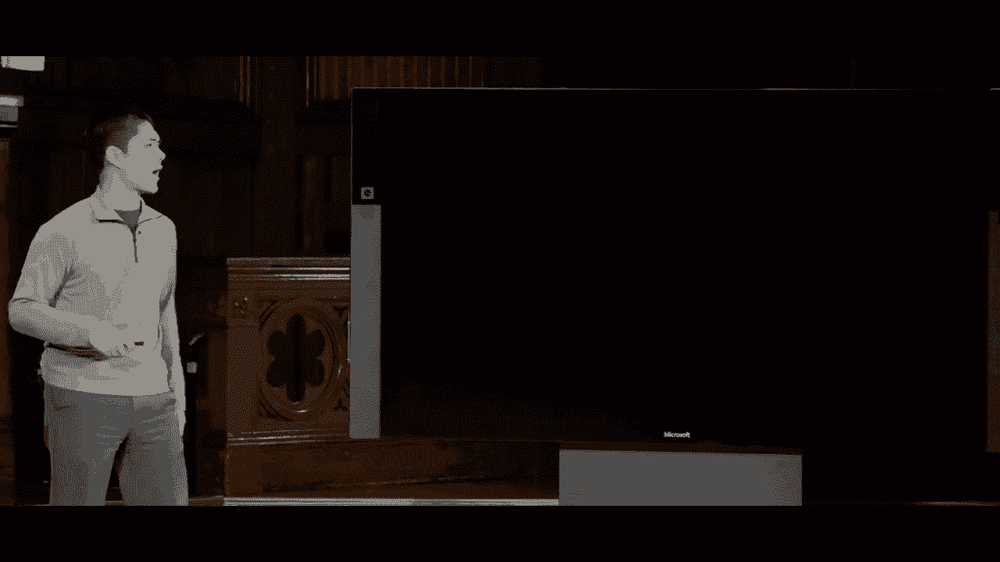

# 【双语字幕+资料下载】哈佛CS50-AI ｜ Python人工智能入门(2020·完整版) - P17：L5- 神经网络 1 (神经网络，激活函数，梯度下降，多层网络) - ShowMeAI - BV1AQ4y1y7wy

[Music]，all right welcome back everyone to an，introduction to artificial intelligence。

with Python now last time we took a look，at machine learning a set of techniques。

that computers can use in order to take，a set of data and learn some patterns。

inside of that data learn how to perform，a task even if we the programmers didn't。

give the computer explicit instructions，for how to perform that task today we。

transition to one of the most popular，techniques and tools within machine。

learning that of neural networks and，neural networks were inspired as early。

as the 1940s by researchers who were，thinking about how it is that humans。

learn studying neuroscience in the human，brain and trying to see whether or not。

we could apply those same ideas to，computers as well and model computer。

learning off of human learning so how is，the brain structured well very simply。

put the brain is consists of a whole，bunch of neurons and those neurons are。

connected to one another and communicate，with one another in some way in。

particular if you think about the，structure of a biological neural network。

something like this there are a couple，of key properties of scientists observed。

one was that these neurons are connected，to each other and receive electrical。

signals from one another that one neuron，can propagate electrical signals to。

another neuron and another point is that，neurons process those input signals and。

then can be activated that a neuron，becomes activated at a certain point and。

then can propagate further signals onto，neurons in the future and so the。

question then became could we take this，biological idea of how it is that humans。

learn with brains and with neurons and，apply that to a machine as well in。

effect designing an artificial neural，network or an A and n which will be a。

mathematical model for learning that is，inspired by these biological neural。

networks and what artificial neural，networks will allow us to do is they。

will first be able to model some sort of，mathematical function every time you。

look at a neural network which we'll see，more of later today each one of them is。

really just a mathematical function that，is mapping certain inputs to particular。

outputs based on the structure of the，network that depending on where we place。

particularly units inside of the sonoran。

network that's going to determine how it，is that the network is going to function。

and in particular artificial neural，networks are going to lend themselves to。

a way that we can learn what the，network's parameters should be we'll see。

more on that in just a moment but in，effect we want to model such that it is。

easy for us to be able to，some code that allows for the network to。

be able to figure out how to model the，right mathematical function given a。

particular set of input data so in order，to create our artificial neural network。

instead of using biological neurons，we're just going to use what we're gonna。

call unit units inside of a neural，network which we can represent kind of。

like a node in a graph which will here，be represented just by a blue circle。

like this and these artificial units，these artificial neurons can be。

connected to one another so here for，instance we have two units that are。

connected by this edge inside of this。

graph effectively and so what we're，going to do now is think of this idea as。

some sort of mapping from inputs to，outputs so we have one unit that is。

connected to another unit that we might，think of this side of the input and that。

side of the output and what we're trying，to do then is to figure out how to solve。

a problem how to model some sort of，mathematical function and this might。

take the form of something we saw last。

time which was something like we have，certain inputs like variables x1 and x2。

and given those inputs we want to，perform some sort of task a task like。

predicting whether or not it's going to，rain and ideally we'd like some way。

given these inputs x1 and x2 which stand，for some sort of variables to do with。

the weather we would like to be able to，predict in this case a boolean。

classification is it going to rain or is，it not going to rain and we did this。

last time by way of a mathematical，function we define some function H for。

our hypothesis function that took as，input x1 and x2 the two inputs that we。

cared about processing in order to，determine whether we thought it was。

going to rain or whether we thought it，was not going to rain the question then。

becomes what does this hypothesis，function do in order to make that。

determination and we decided last time，to use a linear combination of these。

input variables to determine what the，output should be so our hypothesis。

function was equal to something like，this weight 0 plus weight 1 times x1。

plus weight 2 times x2 so what's going，on here is that x1 and x2。

those are input variables the inputs to，this hypothesis function and each of。

those input variables is being，multiplied by some weight which is just。

some number so x1 is being multiplied by，weight 1 x2 is being multiplied by。

weight 2 and we have this，wait wait zero that doesn't get，multiplied by an input variable at all。

that just serves to either move the，function up or move the functions value。

down you can think of this as either a，weight that's just multiplied by some。

dummy value like the number one it's，multiplied by one and so it's not。

multiplied by anything or sometimes，you'll see in the literature people call。

this variable weight zero a bias so that，you can think of these variables are。

slightly different we have weights that，are multiplied by the input and we。

separately add some bias to the result，as well you'll hear both of those。

terminologies used when people talk，about neural networks and machine。

learning so in effect what we've done，here is that in order to define a。

hypothesis function we just need to，decide and figure out what these weights。

should be to determine what values to，multiply by our inputs to get some sort。

of result of course at the end of this，what we need to do is make some sort of。

classification like rainy or not rainy，and to do that we use some sort of。

function so that defines some sort of，threshold and so we saw for instance the。

step function which is defined as 1 if，the weight if the result of multiplying。

the weights by the inputs is at least，zero otherwise it's zero and you can。

think of this line down the middle as，kind of like a dotted line effectively。

it stays at zero all the way up to one，point and then the function steps or。

jumps up to one so it's zero before it，reaches some threshold and then it's one。

after it reaches a particular threshold。

and so this was one way we could define，what will come to call an activation。

function a function that determines when，it is this output becomes active changes。

to a z1 instead of being a zero but we，also saw that if we didn't just want a。

purely binary classification we didn't，want purely one or a zero but we wanted。

to allow for some in-between real，numbered values we could use a different。

function and there are a number of，choices but the one that we looked at。

was the logistic sigmoid function that，has sort of an s-shaped curve where we。

could represent this as a probability，that maybe somewhere in between the。

probability of rain of something like，0。5 maybe a little bit later the，probability of rain is 0。

8 and so rather，than just have a binary classification，of 0 or 1 we can allow for numbers that。

are in between as well and it turns out，there are many other different types of。

activation functions where an activation，function just takes the output of。

multiplying the weights together and out，that bias and then figuring out what the。

actual output should be another popular，one is the rectified linear unit。

otherwise known as relu and the way that，works is that it just takes its input。

and takes the maximum of that input and，0 so if it's positive it remains。

unchanged but if it's 0 if it's negative，it goes ahead and levels out at zero and。

there are other activation functions，that we can choose as well but in short。

each of these activation functions you，can just think of as a function that。

gets applied to the result of all of，this computation we take some function G。

and apply it to the result of all of，that calculation and this then is what。

we saw last time the way of defining，some hypothesis function that takes in。

inputs calculate some linear combination，of those inputs and then passes it。

through some sort of activation function，to get our output and this actually。

turns out to be the model for the，simplest of neural networks that we're。

going to instead represent this，mathematical idea graphically by using a。

structure like this here then as a，neural network that has two inputs we。

can think of this as x1 and this is x2，and then one output which you can think。

of a classifying whether or not we think，it's going to rain or not rain for。

example in this particular instance and，so how exactly does this model work well。

each of these two inputs represents one，of our input variables x1 and x2 and。

notice that these inputs are connected，to this output via these edges which are。

going to be defined by their weights so，these edges each have a weight。

associated with them weight 1 and weight，- and then this output unit what it's。

going to do is it is going to calculate，an output based on those inputs and。

based on those weights this output unit，is going to multiply all the inputs by。

their weights add in this bias term，which you can think of as an extra w0。

term they get to add it into it and then，we pass it through an activation。

function so this then is just a，graphical way of representing the same，idea we saw last time just。

mathematically and we're gonna call this，a very simple neural network and we'd。

like for this a neural network to be，able to learn how to calculate some。

function that we want some function for，the neural network to learn and the。

neural network is going to learn what，should the values of w0 w1 and w2 be。

what should the activation function，in order to get the result that we would。

expect so we can actually take a look at，an example of this what then is a very。

simple function that we might calculate，well if we recall back from when we were。

looking at propositional logic one of，the simplest functions we looked at with。

something like the or function that，takes two inputs X and y and outputs one。

otherwise known is true if either one of，the inputs or both of them are 1 and。

outputs a 0 if both of the inputs are 0，or false so this then is the or function。

and this was the truth table for the or，function that as long as either of the。

inputs are 1 the output of the function，is 1 and the only case where the output。

is 0 is where both of the inputs are 0，so the question is how could we take。

this and train a neural network to be，able to learn this particular function。

what would those weights look like well，we could do something like this here's。

our neural network and I'll propose that，in order to calculate the or function。

we're going to use a value of 1 for each，of the weights and we'll use a bias of。

negative 1 and then we'll just use this，step function as our activation function。

how then does this work well if I wanted，to calculate something like 0 or 0 which。

we know to be 0 because false or false，is false then what are we going to do。

well our output unit is going to，calculate this input multiplied by the。

weight 0 times 1 that's 0 same thing，here 0 times 1 that's 0 and we'll add to。

that the bias minus 1 so that'll give us，a result of negative 1 if we plot that。

on our activation function negative 1 is，here it's before the threshold which。

means either 0 or 1 it's only one after，the threshold since negative 1 is before。

the threshold the output that this unit，provides is going to be 0 and that's。

what we would expect it to be that 0 or，0 should be 0 what if instead we had had。

1 or 0 where this is the number 1 well，in this case in order to calculate what。

the output is going to be we again have，to do this weighted sum 1 times 1 that's。

1 0 times 1 that's 0 sum of that so far，is 1 add negative 1 to that well then。

the output is 0 and if we plot 0 on the，step function 0 ends up being here it's。

just at the threshold and，the output here is going to be one。

because the output of one or zero that's，what so that's what we would expect as。

well and just for one more example if I，had one or one what would the result be。

well 1 times 1 is 1 1 times 1 is 1 some，of those is 2 I add the bias term to。

that I get the number 1 1 plotted on，this graph is way over there that's well。

beyond the threshold and so this output，is going to be 1 as well the output is。

always 0 or 1 depending on whether or，not we're past the threshold and this。

neural network then models the or，function a very simple function。

definitely but it still is able to model，it correctly if I give it the inputs it。

will tell me what x1 or x2 happens to be，and you could imagine trying to do this。

for other functions as well a function，like the and function for instance that。

takes two inputs and calculates whether，both x and y are true so if X is 1 and Y。

is 1 then the output of X and y is 1 but，in all the other cases the output is 0。

how could we model that inside of a，neural network as well well it turns out。

we could do it in the same way except，instead of negative 1 as the bias we can。

use negative 2 as the bias instead what，does that end up looking like well if I。

had 1 and 1 that should be one because，one true in true is equal to true well I。

take 1 times 1 that's 1 1 times 1 is 1 I，get a total sum of 2 so far now I add。

the bias of negative 2 and I get the，value 0 and 0 when I plotted on the。

activation function is just past that，threshold and so the output is going to。

be 1 but if I add any other input for，example like 1 and 0 will the weighted。

sum of these is 1 plus 0 it's going to，be 1 minus 2 is going to give us。

negative 1 and negative 1 is not past，that threshold and so the output is。

going to be 0 so those then are some，very simple functions that we can model。

using a neural network that has two，inputs and one output where our goal is。

to be able to figure out what those，weights should be in order to determine。

what the output should be and you could，imagine generalizing this to calculate。

more complex functions as well that may，be given the humidity and the pressure。

we want to calculate what's the，probability that it's going to rain for。

example or we might want to do a，russian-style problem were given some。

amount of advertising and given what，month it is maybe we want to predict。

what our expected sales are going to be，for that particular month so you could。

imagine these inputs and outputs being，different as well and it turns out that。

in some problems we're not just going to，have two inputs and the nice thing about。

these neural networks is that we can，compose multiple units together make our。

networks more complex just by adding，more units into this particular neural。

network so the network we've been，looking at has two inputs and one output。

but we could just as easily say let's go，ahead and have three inputs in there or。

have even more inputs where we could，arbitrarily decide however many inputs。

there are to our problem all going to be，calculating some sort of output that we。

care about figuring out the value of how，then does the math work for figuring out。

that output well it's going to work in a，very similar way in the case of two。

inputs we had two weights indicated by，these edges and we multiplied the。

weights by the numbers adding this bias，term and we'll do the same thing in the。

other cases as well if I have three，inputs you'll imagine multiplying each。

of these three inputs by each of these，weights if I had five inputs instead。

we're gonna do the same thing here I'm，saying sum up from 1 to 5 X I multiplied。

by weight I so take each of the five，input variables multiply them by their。

corresponding weight and then add the，bias to that so this would be a case。

where there are five inputs into this，internal network for example but there。

could be more arbitrarily many nodes，that we want inside of this neural。

network where each time we're just going，to sum up all of those input variables。

multiplied by their weight and then add，the bias term at the very end and so。

this allows us to be able to represent，problems that have even more inputs just。

by growing the size of our neural，network now the next question we might。

ask is a question about how it is that，we train these neural networks in the。

case of the or function in the an，function they were simple enough。

functions that I could just tell you，like here what the weights should be and，yourself。

what the weights should be in order to，calculate the output that you want but。

in general with functions like，predicting sales or predicting whether。

or not it's going to rain these are much，trickier functions to be able to figure。

out we would like the computer to have，some mechanism of calculating what it is，that the way。

should be how it is to set the weights，so that our neural network is able to。

accurately model the function that we，care about trying to estimate and it。

turns out that the strategy for doing，this inspired by the domain of calculus。

is a technique called gradient descent。

and what gradient descent is it is an，algorithm for minimizing loss when。

you're training a neural network and。

recall that loss refers to how bad our，hypothesis function happens to be that。

we can define certain loss functions and，we saw some examples of loss functions。

last time that just give us a number for，any particular hypothesis saying how。

poorly does it model the data how many，examples does it get wrong how are they。

worse or less bad as compared to other，hypothesis functions that we might。

define and this loss function is just a，mathematical function and when you have。

a mathematical function in calculus what，you could do is calculate something。

known as the gradient which you can，think of it's like a slope it's the。

direction the loss function is moving at，any particular point and what it's going。

to tell us is in which direction should，we be moving these weights in order to。

minimize the amount of loss and so，generally speaking we won't get into the。

calculus event but the high-level idea，for gradient descent is going to look。

something like this if we want to train，a neural network we'll go ahead and。

start just by choosing the weights，randomly just pick random weights for。

all of the weights in the neural network，and then we'll use the input data that。

we have access to in order to train the，network in order to figure out what the。

weights should actually be so we'll，repeat this process again and again the。

first step is we're going to calculate，the gradient based on all of the data。

points so we'll look at all the data and，figure out what the gradient is at the。

place where we currently are for the，current setting of the weights which。

means that in which direction should we，move the weights in order to minimize。

the total amount of loss in order to，make our solution better and once we've。

calculated that gradient which direction，we should move in the loss function well。

then we can just update those weights，according to the gradient take a small。

step in the direction of those weights，in order to try to make our solution a。

little bit better and the size of the，step that we take that's going to vary。

and you can choose that when you're，training a particular neural network but。

in short the idea is going to be take，all the data points figure out based on。

those data points in what direction the，weights should move and。

and then move the weights one small step，in that direction and if you repeat that。

process over and over again adjusting，the weights a little bit at a time based。

on all the data points eventually you，should end up with a pretty good，problem。

at least that's what we would hope to，happen now if you look at this algorithm。

a good question to ask，anytime you're analyzing an algorithm is。

what is going to be the expensive part，of doing the calculation what's going to。

take a lot of work to try to figure out，what is going to be expensive to。

calculate and in particular in the case，of gradient descent the really expensive。

part is this all data points part right，here having to take all of the data。

points and using all of those data，points figure out what the gradient is。

at this particular setting of all of the，weights because odds are in a big。

machine learning problem when you're，trying to solve a big problem with a lot。

of data you have a lot of data points in，order to calculate and figuring out the。

gradient based on all of those data，points is going to be expensive and。

you'll have to do it many times you'll，likely repeat this process again and。

again and again going through all the，data points taking one small step over。

and over as you try and figure out what，the optimal setting of those weights。

happens to be it turns out that we would，ideally like to be able to train our。

neural networks faster to be able to，more quickly converge to some sort of。

solution that is going to be a good，solution to the problem so in that case。

there are alternatives to just standard，gradient descent which looks at all of。

the data points at once，we can employ a method like stochastic，gradient descent which will randomly。

just choose one data point at a time to，calculate the gradient based on instead。

of calculating it based on all of the，data points so the idea there is that we。

have some setting of the weights we pick，a data point and based on that one data。

point we figure out in which direction，should we move all of the weights and。

move the weights in that small direction，then take another data point and do that。

again and repeat this process again and，again maybe looking at each of the data。

points multiple times but each time only，using one data point to calculate the。

gradient to calculate which direction we，should move in now just using one data。

point instead of all of the data points，probably gives us a less accurate。

estimate of what the gradient actually，is but on the plus side it's going to be。

much faster to be able to calculate the，can much more quickly calculate what the。

gradient ISM based on one data point，instead of calculating based on all of。

the data points and having to do all of，that computational work again and again。

so they're trade-offs here between，looking at all of the data points and。

just looking at one data point and it，turns out that a middle ground that was。

also quite popular is a technique called，mini-batch gradient descent where the。

idea there is instead of looking at all，of the data versus just a single point。

we instead divide our data set up into，small batches groups of data points。

where you can decide how big a，particular batch is but in short you're。

just gonna look at a small number of，points at any given time hopefully。

getting a more accurate estimate of the，gradient but also not requiring all of。

the computational effort needed to look，at every single one of these data points。

so gradient descent then is this，technique that we can use in order to。

train these a neural networks in order，to figure out what the setting of all of。

these weights should be if we want some，way to try and get an accurate notion of。

how it is that this function should work，some way of modeling how to transform。

the inputs into particular outputs now，so far the networks that we've taken a。

look at have all been structured similar，to this we have some number of inputs。

maybe two or three or five or more and，then we have one output that is just。

predicting like rain or no rain or just，predicting one particular value but。

often in machine learning problems we，don't just care about one output we。

might care about an output that has，multiple different values associated。

with it so in the same way that we could，take a neural network and add units to。

the input layer we can likewise add，input or out outputs to the output layer。

as well instead of just one output you，could imagine we have two outputs or we。

could have like four outputs for example，we're in each case as we add more inputs。

or add more outputs if we want to keep，this network fully connected between。

these two layers we just need to add，more weights that now each of these。

input nodes has four weights associated，with each of the four outputs and that's。

true for each of these various different，input nodes so as we add nodes we add。

more weights in order to make sure that，each of the inputs can somehow be。

connected to each of the outputs so that，each output value can be calculated。

based on what the valley，of the input happens to be I said what。

made a case be where we want multiple，different output values well you might。

consider that in the case of weather，predicting for example we might not just。

care whether it's raining or not raining，there might be multiple different。

categories of weather that we would like，to categorize the weather into with just。

a single output variable we can do a，binary classification like rain or no。

rain for instance 1 or 0 but it doesn't，allow us to do much more than that with。

multiple output variables I might be，able to use each one to predict。

something a little different maybe I，want to categorize the weather into one。

of four different categories something，like is it going to be raining or sunny。

or cloudy or snowy and I now have 4，output variables that can be used to。

represent maybe the probability that it，is rainy as opposed to sunny as opposed。

to cloudy or as opposed to snowy how，then with this neural network work where。

we have some input variables that，represent some data that we have。

collected about the weather each of，those inputs gets multiplied by each of。

these various different weights we have，more multiplications to do but these are。

fairly quick mathematical operations to，perform and then what we get is after。

passing them through some sort of，activation function in the outputs we。

end up getting some sort of number where，that number you might imagine you can。

interpret it as like a probability like，a probability then it is one category as。

opposed to another category so here，we're saying that based on the inputs we。

think there is a 10% chance that it's，raining a 60% chance that it's sunny a。

20% chance of cloudy a 10% chance that，it's snowy and given that output if。

these represent like a probability，distribution well then you could just。

pick whichever one has the highest value，in this case sunny and say that well。

most likely we think that this，categorization the inputs means that the。

output should be snowy and or it should，be sunny and that is what we would。

expect the weather to be in this，particular instance and so this allows。

us to do these sort of multi-class，classification we're instead of just。

having a binary classification 1 or 0 we，can have as many different categories as。

we want and we can have our neural，network output these probabilities over。

which categories are most more likely，than other categories and using that，inference。

what it is that we should do so this was，sort of the idea of supervised machine。

learning I can give the minister neural，network a whole bunch of data a whole。

bunch of input data corresponding to，some label some output data like we know。

that it was raining on this day we know，that was sunny on that day and using all。

of that data the algorithm can use，gradient descent to figure out what all。

the weights should be in order to create，some sort of model that hopefully allows。

us a way to predict what we think the，weather is going to be but neural，networks have a lot of other。

applications as well you can imagine，applying the same sort of idea to a。

reinforcement learning sort of example，as well where you remember that in。

reinforcement learning what we wanted to，do is train some sort of agent to learn。

what action to take depending on what，state they currently happen to be in so。

depending on the current state of the，world we wanted the agent to pick from。

one of the available actions that is，available to them and you might model。

that by having each of these input，variables represent some information。

about the state some data about what，state our agent is currently in and then。

the output for example could be each of，the various different actions that our。

agent could take action one two three，and four and you might imagine that this。

network would work in the same way the，based on these particular inputs we go。

ahead and calculate values for each of，these outputs and those outputs could。

model which action is better than other，actions and we could just choose based。

on looking at those outputs which action，should with we should take and so these。

neural networks are very broadly，applicable that all they're really doing。

is modeling some mathematical function，so anything that we can frame as a。

mathematical function something like，classifying inputs into various。

different categories or figuring out，based on some input state what action we。

should take these are all mathematical，functions that we could attempt to model。

by taking advantage of this neural，network structure and in particular。

taking advantage of this technique，gradient descent that we can use in。

order to figure out what the weights，should be in order to do this sort of。

calculation now how is it that you would，go about training a neural network that。

has multiple outputs instead of just one，well with just a single output we could。

see what the output for that value，should be and then you update all the。

weights that correspond into it，and when we have multiple outputs at。

least in this particular case we can，really think of this as four separate。

neural networks that really we just have，one network here that has these three。

inputs corresponding with these three，weights corresponding to this one output。

value and the same thing is true for，this output value this output value。

effectively defines yet another neural，network that has these same three inputs。

but a different set of weights that，correspond to this output and likewise。

this output has its own set of weights，as well and same thing for the fourth。

output too and so if you wanted to train，a neural network that had four outputs。

instead of just one in this case where，the inputs are directly connected to the。

outputs you could really think of this，as just training for independent neural。

networks we know what the outputs for，each of these four should be based on。

our input data and using that data we，can begin to figure out what all of。

these individual weights should be and，maybe there's an additional step at the。

end to make sure that we turn these，values into a probability distribution。

such that we can interpret which one is，better than another or more likely than。

another as a category or something like，that so this then seems like it does a。

pretty good job of taking inputs and，trying to predict what outputs should be。

and we'll see some real examples of this，in just a moment as well but it's。

important then to think about what the，limitations of this sort of approach is。

of just taking some linear combination，of inputs and passing it into some sort。

of activation function and it turns out，that when we do this in the case of。

binary classification of trying to，predict like does it belong to one。

category or another we can only predict，things that are linearly separable。

because we're taking a linear，combination of inputs and using that to。

define some decision boundary or，threshold then what we get is a。

situation where if we have this set of，data we can predict like a line that。

separates linearly the red points from，the blue points but a single unit that。

is making a binary classification，otherwise known as a perceptron can't。

deal with a situation like this where，we've seen this type of situation before。

where there is no straight line that，just goes straight through the data that。

will divide the red points away from the，blue points it's a more complex decision。

boundary the decision boundary somehow，needs to capture the things inside of。

Circle and there isn't really a line，that will allow us to deal with that so。

this is the limitation of the perceptron，these units that just make these binary。

decisions based on their inputs that a，single perceptron is only capable of。

learning a linearly separable decision，boundary all it can do is define a line。

and sure it can give us probabilities，based on how close to that decision。

boundary we are but it can only really，decide based on a linear decision。

boundary and so this doesn't seem like，it's going to generalize well to。

situations where real-world data is，involved because real-world data often。

isn't linearly separable it often isn't，the case that we can just draw a line。

through the data and be able to divide，it up into multiple groups so what then。

is the solution to this well what was，proposed with the idea of a multi-layer。

neural network that's so far all the，neural networks we've seen have had a。

set of inputs and a set of outputs and，the inputs are connected to those。

outputs but in a multi-layer neural，network this is going to be an。

artificial neural network that has an，input layer still it has an output layer。

but also has one or more hidden layers，in between other layers of artificial。

neurons or units that are going to，calculate their own values as well so。

instead of a neural network that looks，like this with three inputs and one。

output you might imagine in the middle，here injecting a hidden layer something。

like this this is a hidden layer that，has four nodes you could choose how many。

nodes or units end up going into the，hidden layer you can have multiple。

hidden layers as well and so now each of，these inputs isn't directly connected to。

the output each of the inputs is，connected to this hidden layer and then。

all of the nodes in the hidden layer，those are connected to the one output。

and so this is just another step that we，can take towards calculating more。

complex functions each of these hidden，units will calculate its output value。

otherwise known as its activation based，on a linear combination of all the。

inputs and once we have values for all，these nodes as opposed to this just。

being the output we do the same thing，again calculate the output for this node。

based on multiplying each of the values，for these units by their weights as well。

so in effect the way this works is we，start with inputs they get multiplied by，weights。

to calculate values for the hidden nodes，those get multiplied by weights in order。

to figure out what the ultimate output，is going to be and the advantage of。

layering things like this is it gives us，an ability to model more complex。

functions but instead of just having a，single decision boundary a single line。

dividing the red points from the blue，points each of these hidden nodes can。

learn a different decision boundary and，we can combine those decision boundaries。

to figure out what the ultimate output，is going to be and as we begin to。

imagine more complex situations you，could imagine each of these nodes。

learning some useful property or，learning some useful feature of all of。

the inputs and us somehow learning how，to combine those features together in。

order to get the output that we actually，want now the natural question will when。

you begin to look at this now is to ask，the question of how do we train a neural。

network that has hidden layers inside of，it and this turns out to initially be a。

bit of a tricky question because the，input data we are given is we are given。

values for all of the inputs and we're，given what the value of the output。

should be what the category is for，example but the input data doesn't tell。

us what the values for all of these，nodes should be so we don't know how far。

off each of these nodes actually is，because we're only given data for the。

inputs and the outputs the reason this，is called a hidden layer is because the。

data that is made available to us，doesn't tell us what the values for all。

of these intermediate nodes should。