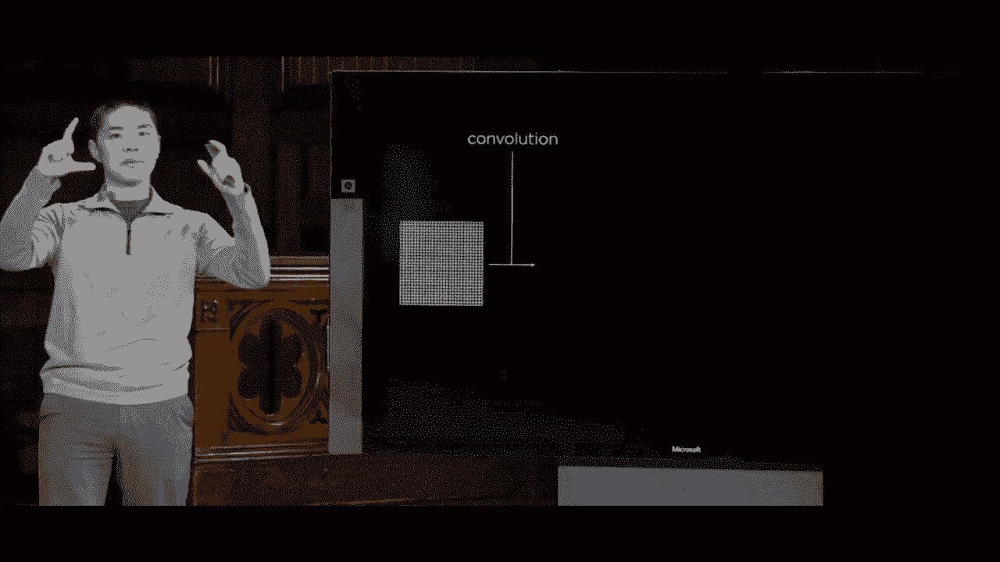
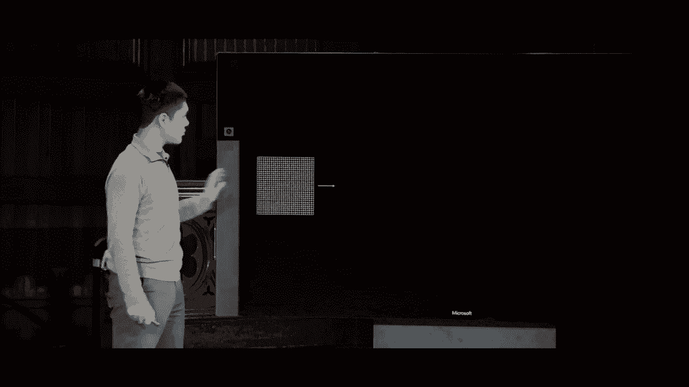
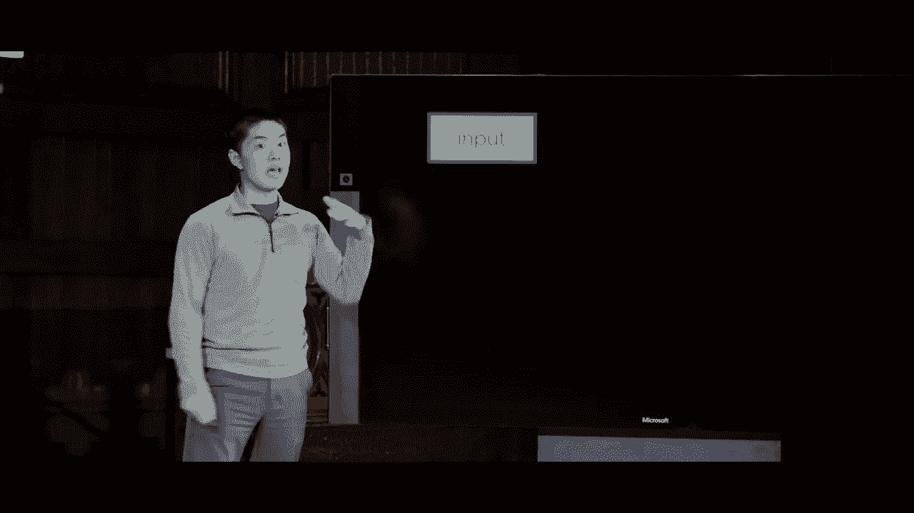

# 【双语字幕+资料下载】哈佛CS50-AI ｜ Python人工智能入门(2020·完整版) - P19：L5- 神经网络 3 (卷积神经网络，循环神经网络) - ShowMeAI - BV1AQ4y1y7wy

regions inside of the image and now we，can put all of these ideas together。pooling image convolution and neural，networks all together into another type。of neural network called a convolutional，neural network or a CNN which is a。neural network that uses this，convolution step usually in the context。

of analyzing an image for example and so，the way that a convolutional neural。network works is that we start with some，sort of input image some grid of pixels。

but rather than immediately put that，we've seen before，we'll start by applying a convolution。step where the convolution step involves。

applying some number of different image，filters to our original image in order。to get what we call a feature map the，result of applying some filter to an。image and we could do this once but in，general we'll do this multiple times。getting a whole bunch of different，feature Maps each of which might extract。

some different relevant feature out of，the image some different important。characteristic of the image that we，might care about using in order to。calculate what the result should be and，in the same way that when we to when we。train neural networks we can train，neural networks，learn the weights between particular。

units inside of the neural networks we，can also train neural networks to learn。what those filters should be what the，values of the filters should be in order。to get the most useful most relevant，information out of the original image。just by figuring out what setting of，those filter values the values inside of。

that kernel results in minimizing the，loss function minimizing how poorly our。hypothesis actually performs in figuring，out the classification of a particular。image for example so we first apply this，convolution step get a whole bunch of。these various different feature Maps but，these feature maps are quite large right。

there's a lot of pixel values that，happen to be here and so a logical next。step to take is a pooling step where，we've reduced the size of these images。by using max pooling for example，extracting the maximum value from any。particular region there are other，pooling methods that exist as well。

depending on the situation you could use，something like average pooling we're。instead of taking the maximum value from，a region you take the average value from。a region which has its uses as well，but in fact what pooling will do is。it'll take these feature maps and reduce，their dimensions so that we end up with。

smaller grids with fewer pixels and this，then is going to be easier for us to。deal with it's gonna mean fewer inputs，that we have to worry about and it's。also going to mean we're more resilient，more robust against potential movements。of particular values just by one pixel，when ultimately we don't really don't。

care about those one pixel differences，that might arise in the original image。and now after we've done this pooling，step now we have a whole bunch of values。that we can then flatten out and just，put it into a more traditional neural。network so we go ahead and flatten it，and then we end up with a traditional。

neural network that has one input for，each of these values in each of these。resulting feature Maps after we do the，convolution and after we do the pooling。step and so this then is the general，structure of a convolutional Network we。begin with the image apply convolution，apply pooling flatten the results and。

then put that into a more traditional，neural network that might itself have。hidden layers you can have deep，convolutional networks that have hidden。layers in between this flattened layer，and the eventual output to be able to。calculate various different features of，those values but this then can help us，to be able to use。

convolution and pooling to use our，knowledge about the structure of an。image to be able to get better results，to be able to train our networks faster。in order to better capture particular，parts of the image and there's no reason。necessarily why you can only use these，steps once in fact in practice you'll。

often use convolution and pooling，multiple times in multiple different。steps see what you might imagine doing。

is starting with an image first applying，convolution to get a whole bunch of maps。then applying pooling then applying，convolution again because these maps are。still pretty big you can apply，convolution to try and extract relevant。features out of this result then take，those results apply pooling in order to。

reduce their dimensions and then take，that and feed it into a neural network。that maybe has fewer inputs so here I，have two different convolution and。pooling steps I do convolution and，pooling once and then I do convolution。and pooling a second time each time，extracting useful features from the。

layer before it each time using pooling，to reduce the dimensions of what you're。ultimately looking at and the goal now，of this sort of model is that in each of。these steps you can begin to learn，different types of features of the。original image that may be in the first，step you learn very low-level features。

just learn and look for features like，edges and curves and shapes because。based on pixels and their neighboring，values you can figure out alright what。are the edges one of the curves what are，the various different shapes that might。be present there but then once you have，a mapping that just represents where the。

edges and curves and shapes happen to be，you can imagine applying the same sort。of process again to begin to look for，higher-level features look for objects。maybe look for people's eyes and facial，recognition for example maybe look her。more complex shapes like the curves on a，particular number if you're trying to。

recognize a digit in a handwriting，recognition sort of scenario and then。after all of that now that you have，these results that represent these。higher-level features you can pass them，into a neural network which is really。just a deep neural network that looks，like this where you might imagine making。

a binary classification or classifying，into multiple categories or performing。various different tasks on this sort of，model so convolutional neural networks。can be quite powerful and quite popular，when it comes towards trying to analyze，could。just use the vanilla neural network that，just operates with layer after layer as。

we've seen before but these，convolutional neural networks can be。quite helpful in particular because of，the way they model the way a human might。look at an image that instead of a human，looking at every single pixel。simultaneously and trying to convulse，applying them together you might imagine。

that what convolution is really doing is，looking at various different regions of。the image and extracting relevant，information and features out of those。parts of the image the same way that a，human might have visual receptors that。are looking at particular parts of what，they see and using those combining them。

to figure out what meaning they can draw，from all of those various different。inputs and so you might imagine applying，this to a situation like handwriting。recognition so we'll go ahead and see an，example of that now where I'll go ahead。and open up handwriting dot pi again，what we do here is we first import。

tensorflow and then tensorflow it turns，out has a few data sets that are built。in built into the library that you can，just immediately access and one of the。most famous data sets in machine，learning is the EM NIST data set which。is just a data set of a whole bunch of，samples of people's handwritten digits I。

showed you a slide of that a little，while ago and what we can do is just。immediately access that data set which，is built into the library so that if I。want to do something like train on a，whole bunch of handwritten digits I can。just use the data set that it's provided，to me of course if I had my own data set。

set of handwritten images I can apply，the same idea I'd first just need to。take those images and turn them into，like an array of pixels because that's。the way that these are going to be，formatted they're gonna be formatted as。effectively an array of individual，pixels now there's a bit of reshaping I。

need to do just turning the data into a，format that I can put into my。convolutional neural network so this is，doing things like taking all the values。and dividing them by 255 if you remember，these color values tend to range from 0。to 255 so I can divide them by 255 and，just to put them into 0 to 1 range which。

might be a little bit easier to train on，and then doing various other。modifications to the data just to get it，into a nice usable format but here's the。interesting and important part here is，where I create the convolutional neural。network the CNN where here I'm saying go，ahead and use a sequential model。

and before I could use model add to say，add a layer add a layer add a layer。another way I could define it is just by，passing as input to this sequential。neural network a list of all of the，layers that I want and so here the very。first layer in my model is a convolution，layer where I'm first going to apply。

convolution to my image I'm going to use，13 different filters so my model is。going to learn there 32 rather 32，different filters that I would like to。learn on the input image where each，filter is going to be a 3x3 kernel so we。saw those 3x3 kernels before where we，could multiply each value in a 3x3 grid。

by a value multiplied and add all the，results together so here I'm gonna learn。32 different of these 3x3 filters I can，again specify my activation function and。I specify what my input shape is my，input shape in the banknotes case was。just 4 I had 4 inputs my input shape，here is going to be 28 comma 28 comma 1。

because for each of these handwritten，digits it turns out that the NS dataset。organizes their data each image is a 28，by 28 pixel grade so we're gonna have a。28 by 28 pixel grid and each one of，those images only has one channel value。these handwritten digits are just black，and white so it's just a single color。

value representing how much black or how，much white you might imagine that in a。color image if you were doing this sort，of thing you might have three different。channels a red a green in a blue channel，for example but in the case of just。handwriting recognition recognizing a，digit we're just gonna use a single。

value for like shaded in or not shade it，in and it might range but it's just a。single color value and that then is the，very first layer of our neural network a。convolutional layer that will take the，input and learn a whole bunch of。different filters that we can apply to，the input to extract meaningful features。

next step is going to be a max pooling，layer also built right in the tensor。flow where this is going to be a layer，that is going to use a pool size of 2 by。2 meaning we're gonna look at two by two，regions inside of the image and just。extract the maximum value again we've，seen why this can be helpful it'll help。

to reduce the size of our input once，we've done that we'll go ahead and。flatten all of the units just into a，single layer that we can then pass into。the rest of the neural network，and now here's the rest of the neural。network here I'm saying let's add a，hidden layer to my neural network with a。

hundred and twenty eight unit so a whole，bunch of hidden units inside of the。hidden layer and just to prevent，overfitting I can add a dropout to that。say you know what when you're training，randomly dropout half of the nodes from。this hidden layer just to make sure we，don't become over Alliant on any。

particular node we begin to really，generalize and stop ourselves from，overfitting。so tensorflow allows us just by adding a，single line to add dropout into our。model as well such that when it's，training it will perform this dropout。step in order to help make sure that we，don't over fit on this particular data。

and then finally I add an output layer，the output layer is going to have ten。units one for each category that I would，like to classify digits into so zero。through nine ten different categories，and the activation function I'm going to。use here is called the softmax，activation function and in short with。

the softmax activation function is going，to do is it's going to take the output。and turn it into a probability，distribution so ultimately it's going to。tell me like what did we estimate the，probability is that this is a two versus。a three versus a four and so it will，turn it into that probability。

distribution for me next up I'll go，ahead and compile my model and fit it on。all of my training data and then I can，evaluate how well the neural network。performs and then I've added to my，Python program if I've provided a。command-line argument like the name of a。

file I'm gonna go ahead and save the，model to a file and so this can be quite。useful too once you've done the training，step which could take some time in terms。of taking all the time going through the，data running backpropagation with。gradient descent to be able to say，alright how should we adjust the weight。

to this particular model you end up，calculating values for these weights。calculating values for these filters，you'd like to remember that information。so you can use it later and so，tensorflow allows us to just save a。model to a file such that later if we，want to use the model we've learned use。

the weights that we've learned to make，some sort of new prediction we can just。use the model that already exists so，what we're doing here is after we've。done all the calculation we go ahead and，save the model to a file such that we。can use it a little bit later so for，example if I，going to go into digits。

I'm gonna run handwriting that piyah I，won't save it this time we'll just run。it and go ahead and see what happens，what will happen is we need to go。through the model in order to train on，all of these samples of handwritten。digits that the MS dataset gives us，thousands and thousands of sample。

handwritten digits in the same format，that we can use in order to train and so。now what you're seeing is this training，process and unlike the bank notes case。where there was much much fewer data，points the data was very very simple。here this data is more complex and this，training process takes time and so this。

is another one in those cases where when，training neural networks this is why。computational power is so important that，you often times you see people wanting。to you is a sophisticated GPUs in order，to more efficiently be able to do this。sort of neural network training it also，speaks to the reason why more data can。

be helpful the more sample data points，you have the better you can begin to do。this training so here we're going，through 60，000 different samples of。handwritten digits and I said gonna，we're gonna go through them ten times so。we're gonna go through the data set ten，times training each time hopefully。

improving upon our weights with every，time we run through this data set and we。can see over here on the right what the，accuracy is each time we go ahead and。run this model that the first time it，looks like we got an accuracy of about。92% of the digits correct based on this，training set we increased that to 96 or。

97 percent and every time we run this，we're going to see hopefully the。accuracy improve as we continue to try，and use that gradient descent that。process of trying to run the algorithm，to minimize the loss that we get in。order to more accurately predict what，the output should be and what this。

process is doing is it's learning not，only the weight but it's learning the。feature is to use the kernel matrix to，use when performing that convolution。step because this is a convolutional，neural network where I'm first。performing those convolutions and then，doing the more traditional neural。

network structure this is going to learn，all of those individual steps as well。and so here we see the tensorflow，provides me with some very nice output。telling me about like how many seconds，are left with each of these training。runs that allows me to see just how well，we're doing so we'll go ahead and see。

how this Network performs it looks like，we've gone through the data set seven。times we're going through it in eight，now and at this point the accuracy is。pretty hot we saw we went from 92，percent up to 97 percent now it looks。like 98 percent and at this point it，seems like things are starting to level。

out there's probably a limit to how，accurate we can ultimately be without。running the risk of overfitting of，course what's enough nodes you could。just memorize the input and overfit upon，them but we'd like to avoid doing that。and drop out will help us with this but，now we see we're almost done finishing。

our training step we're at fifty five，thousand all right we finished training。and now it's going to go ahead and test，for us on ten thousand sample ISM and it。looks like on the testing set we were，ninety eight point eight percent。accurate so we ended up doing pretty，well it seems on this test on this。

testing set to see you know how，accurately can we predict these。handwritten digits and so what we could，do then is actually test it up I've。written a program called recognition dot，pi using PI game if you pass it a model。that's been trained and I pre trained in，an example model using this input data。

what we can do is see whether or not，we've been able to train this。convolutional neural network to be able，to predict handwriting for example so I。can try just like drawing a handwritten，digit I'll go ahead and draw like the。number two for example so there's my，number two again this is messy if you。

tried to imagine how would you write a，program with just like ifs and then x'。to be able to do this sort of，calculation it would be tricky to do so。but here I'll plus classify and all，right it seems it was able to correctly。classify that what I drew was the number，two I'll go ahead and reset it try it。

again will draw like an eight for。

example so here is an eight press，classifying and all right it predicts at。the digit that I drew was an eight and，the key here is this really begins to。show the power of what the neural，network is doing somehow looking at。various different features of these，different pixels figuring out what the。

relevant features are and figuring out，how to combine them to get a。classification and this would be a，difficult task to provide explicit。instructions to the computer on how to，do like two views a whole bunch of if。bends to process all these pixel values，to figure out what the handwritten digit。

is like everyone's gonna draw their，eights a little bit differently if I。drew the eight again it would look a，little bit different and yet ideally we。want to train a network to be robust，enough，so that it begins to learn these。patterns on its own all I said was here，is the structure of the network and here。

is the data on which to train the，network and the network learning。algorithm just tries to figure out what，is the optimal set of weights what is。the optimal set of filters to use them，in order to be able to accurately。classify a digit into one category or，another just going to show the power of。

these sorts of convolutional neural，networks and so that then was a look and。how we can use a convolutional neural，networks to begin to solve problems with。relate with regards to computer vision，the ability to like take an image and。begin to analyze it so this is the type，of analysis you might imagine that's。

happening in self-driving cars that are，able to figure out what filters to apply。to an image to understand what it is，that the computer is looking at or the。same type of idea that might be applied，to facial recognition in social media to。be able to determine how to recognize，faces in an image as well you can。

imagine a neural network that instead of，classifying into one of ten different。ten different digits could instead，classify like is this person a or is。this person B trying to tell those，people apart just based on convolution。and so now what we'll take a look at is，yet another type of neural network that。

can be quite popular for certain types，of tasks but to do so will try to。generalize and think about our neural，network a little bit more abstract Li。that here we have a sample deep neural，network where we have this input layer a。whole bunch of different hidden layers，that are performing certain types of。

calculations and then an output layer，here that just generates some sort of。output that we care about calculating，but we could imagine representing this a。little more simply like this here is，good just a more abstract representation。of our neural network we have some input，that might be like a vector of a whole。

bunch of different values as their input，that gets passed into a network to。perform some sort of calculation or，computation and that network produces。some sort of output that output might be，a single value it might be a whole bunch。of different values but this is the，general structure of the neural networks。

that we've seen there is some sort of，input that gets set into the network and。using that input than it were calculates，what the output should be and this sort。of model for an oral network is what we，might call a feed-forward neural network。feed-forward neural networks have，connection，only in one direction they move from one。

layer to the next layer to the layer，after that such that the inputs pass。through various different hidden layers，and then ultimately produce some sort of。output so feed-forward neural networks，were very helpful for solving these。types of classification problems that we，saw before we have a whole bunch of。

input we want to learn what setting of，weights will allow us to calculate the。output effectively but there are some，limitations on feed-forward neural。networks that we'll see in a moment in，particular the input needs to be like of。a fixed shape like a fixed number of，neurons or in the input layer and。

there's a fixed shape for the output，like a fixed number of neurons in the。output layer and that has some，limitations of its own and a possible。solution to this and we'll see examples，of the types of problems we can solve。with this in just a second is instead of，just a feed-forward neural network where。

there are only connections in one，direction from left to right effectively。across the network we could also imagine，a recurrent neural network where a。recurrent neural network generates，output that gets fed back into itself as。input for future runs of that network so，whereas in a traditional neural network。

we have inputs that get fed into the，network that gets fed into the output。and the only thing that determines the，output is based on the original input。and based on the calculation we do，inside of the network itself this goes。in contrast with a recurrent neural，network where in a recurrent neural。

network you can imagine output from the，network feeding back to itself into the。network again as input for the next time，you do the calculations and inside of。the network what this allows is it，allows the network to maintain some sort。of State to store some sort of，information that can be used on future。

runs of the network the previously the，network just to find some weights and we。passed inputs through the network and it，generated outputs but the network wasn't。saving any information based on those，inputs to be able to remember for future。iterations or for future runs what a，recurrent neural network will let us do。

is let the network store information，that gets passed back in as input to the。network again the next time we try and，perform some sort of action and this is。particularly helpful when dealing with，sequences of data so we'll see a，actually。Microsoft has developed an AI，known as the caption bot and what the。

caption butt does is it says I can，understand the content of any photograph。and I'll try to describe it as well as，any human I'll analyze your photo but I。won't store it or share it and so what，Microsoft's caption bot seems to be。claiming to do is it can take an image，and figure out what's in the image and。

just give us a caption to describe it，so let's try it out here for example is。an image of Harvard Square and some，people walking in front of one of the。buildings at Harvard Square I'll go，ahead and take the URL for that image。and I'll paste it into caption bot and，just press GO so caption bot is。

analyzing the image and then it says I，think it's a group of people walking in。front of the building which seems，amazing the AI is able to look at this。image and figure out what's in the image，and the important thing to recognize。here is that this is no longer just a，classification task we saw being able to。

classify images with a convolutional，neural network where the job was you。know take the image and then figure out，is it a 0 or a 1 or a 2 or if this。person's face or that person's face what，seems to be happening here is the input。is an image and we know how to get，networks to take input of images but the。

output is text like it's a sentence of，the phrase like a group of people。walking in front of the building and，this would seem to pose a challenge for。our more traditional feed-forward neural，networks for the reason being that in。traditional neural networks we just have，a fixed size input and a fixed size。

output there are a certain number of，neurons in the input to our neural。network and a certain number of outputs，for our neural network and then some。calculation that goes on in between but，the size of the inputs and the number of。values in the input and the number of，values in the output those are always。

going to be fixed based on the structure，of the neural network and that makes it。difficult to imagine how a neural，network could take an image like this。and say you know it's a group of people，walking in front of the building because。the output is text like it's a sequence，of words now it might be possible for a。

neural network to output like one word，one word you could represent as like a。vector of values and you can imagine，ways of doing that next time we'll talk。a little bit more about AI as it relates，to language and language processing but。a sequence of words is much more，challenging because depending on the。

image you might imagine the output，different number of words we could have。sequences of different lengths and，somehow we still want to be able to。generate the appropriate output and so，the strategy here is to use a recurrent。neural network a neural network that can，feed its own output back into itself as。

input for the next time and this allows，us to do what we call a one-to-many。relationship for inputs to outputs that，in vanilla more traditional neural。networks these are what we might，consider to be one-to-one neural。networks you pass in one set of values，as input you get one vector of values as。

the output but in this case we want to，pass in one value as input the image and。we want to get a sequence many values as，output where each value is like one of。these words that gets produced by this，particular algorithm and so the way we。might do this is we might imagine。

starting by providing input the image，into our neural network and the neural。network is going to generate output but，the output is not going to be the whole。sequence of words because we can't，represent the whole sequence of words。and using just a fixed set of neurons，instead the output is just going to be。

the first word we're gonna train the，network to output what the first word of。the caption should be and you can，imagine that Microsoft has trained to。this by running a whole bunch of，training samples through the AI giving。it a whole bunch of pictures and what，the appropriate caption was and having。

the AI begin to learn from that but now，because the network generates output。that can be fed back into itself you，could imagine the output of the network。being fed back into the same network，this here looks like a separate network。but it's really the same network that's，just getting different input that this。

network's output gets fed back into，itself but it's going to generate。another output and that other output is，going to be like the second word in the。caption and this recurrent neural，network then is this network is going to。generate other output that can be fed，back into itself to generate yet another。

word set back into itself to generate，another word and so recurrent neural。networks allow us to represent this sort，of one-to-many structure you provide one。image as input and the neural network，can pass data into the next run of the。network and then again and again such，that you could run the network multiple。

times each time generating a different，output still based on that original。input and this is where recurrent neural，networks become particularly useful when。dealing with sequences of inputs or，outputs and my output is a sequence of。words and since I can't very easily，represent outputting an entire sequence。

of words and I'll instead output that，sequence one word at a time by allowing。my network to pass information about，what still needs to be spit said about。the photo into the next stage of running，the network so you could run the network。multiple times the same network with the，same weights just getting different。

input each time first getting input from，the image and then getting input from。the network itself as additional，information about what additionally。needs to be given in a particular，caption for example so this then is a。one-to-many relationship inside of a，recurrent neural network but it turns。

out there are other models that we can，use other ways we can try and use。recurrent neural networks to be able to，represent data that might be stored in。other forms as well we saw how we could，use neural networks in order to analyze。images in the context of convolutional，neural networks that take an image。

figure out various different properties，of the image and were able to draw some。sort of conclusion based on that but you，might imagine that something like。YouTube they need to be able to do a lot，of learning based on video they need to。look through videos to detect if they're，like copyright violations or they need。

to be able to look through videos to，maybe identify what particular items are。inside of the video for example and，video you might imagine is much more。difficult to put in as input to a neural，network because whereas an image you can。just treat each pixel as a different，value videos or sequences there's。

sequences of images and each sequence，might be of different lengths and so it。might be challenging to represent that，entire video as a single vector of。values that you could pass in to a，neural network and so here two recurrent。neural networks can be a valuable，solution for trying to solve this type。

of problem then instead of just passing，in a single input into our neural。network we could pass in the input like，one frame at a time you might imagine。first taking the first frame of the，video passing it into the network and。then maybe not having the network output，anything at all yet let it take in。

another input and this time pass it into，the network but the network gets。information from the last time we，provided an input，the network then we pass in a third。input and then a fourth input where each，time what the network gets is it gets。the most recent input like each frame of，the video but it also gets information。

the network processed from all of the，previous iterations so on frame number。four you end up getting the input for，frame number four plus information the。network has calculated from the first，three frames and using all of that data。combined this recurrent neural network，can begin to learn how to extract。

patterns from a sequence of data as well，and so you might imagine if you want to。classify a video into a number of，different genres like an educational。video or a music video or different，types of videos that's a classification。task where you want to take as input，each of the frames of the video and you。

want to output something like what it is，what category that it happens to belong。to and you can imagine doing this sort，of thing sort of many to one learning。anytime your input is a sequence and，some input is a sequence in the context。of video it could be in the context of，like if someone has typed a message and。

you want to be able to categorize that，message like if you're trying to take a。movie review and trying to classify it，as is it a positive review or a negative。review that input is a sequence of words，and the output is a classification。positive or negative there to a，recurrent neural network might be。

helpful for analyzing sequences of words，and they're quite popular when it comes。to dealing with language could even be，used for spoken language as well that。spoken language is you know an audio，waveform that can be segmented into。distinct chunks and each of those could，be passed in as an input into a。

recurrent neural network to be able to，classify someone's voice for instance if。you want to do voice recognition to say，is this one person or is this another。here are also cases where you might want，this many-to-one architecture for a。recurrent neural network and then as one，final problem just to take a look at in。

terms of what we can do with these sorts，of networks imagine what like Google。

Translate is doing so what Google，Translate is doing is it's taking some。text written in one language and，converting it into text written in some。other language for example where now，this input is a sequence of data it's a。sequence of words and the output is a，sequence of words as well it's also a。

sequence so here we want effectively，like a many-to-many，relationship our input is a sequence and。our output is a sequence as well and，it's not quite going to work to just say。like take each word in the input and，translate it into a word in the output。because ultimately different languages，put their words in different orders and。

maybe one language uses two words for，something whereas another language only。uses one so we really want some way to，take this information this input encode。it somehow and use that encoding to，generate what the output ultimately。should be and this has been one of the，big advancements in automated。

translation technology is the ability to，use the neural networks to do this。instead of older more traditional，methods and this has improved accuracy。dramatically and the way you might，imagine doing this is again using a。recurrent neural network with multiple，inputs and multiple outputs we start by。

passing in all the input input goes into，the network another input like another。word goes into the network and we do，this multiple times like once for each。word in the input that I'm trying to，translate and only after all of that is。done does the network now is start to，generate output like the first word of。

the translated sentence and the next，word of the translated sentence someone。and so forth where each time the network，passes information to itself by allowing。for this model of giving some sort of，state from one run in the network to the。next run assembling information about，all the inputs and then passing an。

information about which part of the，output in order to generate next and。there are a number of different types of，these sorts of recurrent neural networks。one of the most popular is known as the，long short term memory neural network。otherwise known as LST M but in general，these types of networks can be very very。

powerful whenever we're dealing with，sequences whether those are sequences of。images or especially sequences of words，when it comes towards dealing with。

natural language so that then we're just，some of the different types of neural。networks that can be used to do all，sorts of different computations and。these are incredibly versatile tools，that can be applied to a number of。different domains we only looked at a，couple of there are the most popular。

types of neural networks for more，traditional feed-forward neural networks。convolutional neural networks and，recurrent neural networks but there are。other types as well they're adversarial，networks where networks compete with。each other to try and be able to，generate new types of data as well as，other networks。

can solve other tasks based on what they，happen to be structured and adapted for。and these are very powerful tools in，machine learning for being able to very。easily learn based on some set of input，data and to be able to therefore figure。out how to calculate some function from，inputs to outputs whether its input to。

some sort of classification like，analyzing an image and getting a digit。or machine translation where the input，is in one language and the output is in。another these tools have a lot of，applications for machine learning more。generally next time we'll look at，machine learning and AI in particular in。

the context of natural language we，talked a little bit about this today but。looking at how it is that our AI can，begin to understand natural language and。can begin to be able to analyze and do，useful tasks with regards to human。language which turns out to be a，challenging and interesting task so。

