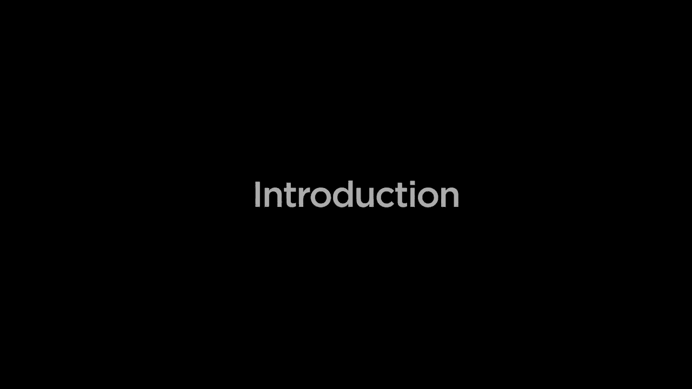
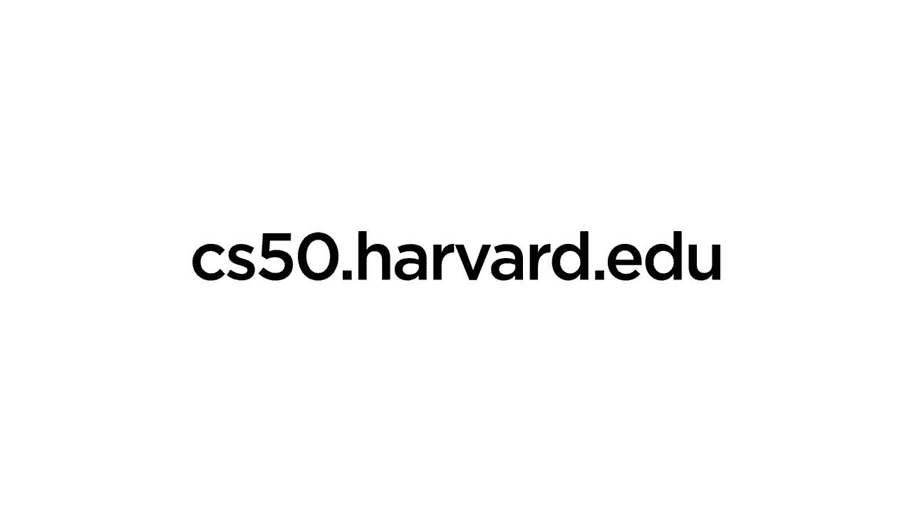

# 【双语字幕+资料下载】哈佛CS50-AI ｜ Python人工智能入门(2020·完整版) - P1：课程内容介绍 - ShowMeAI - BV1AQ4y1y7wy

Hello world this is CS 15 and this is an introduction to artificial intelligence with python with cs50 Zone Brian you。

Self leaves off and explore the concept at the foundation of modern day I will start with a look at how a I can search for solutions to problems with those problems are。

Learning how to play a game or trying to find driving directions to destination。

Well then look at how a I can represent information with knowledge 。

that Rai certain about but also information and events about which Rai might be uncertain learning how to represent them for。

And more importantly how to use that information to draw inferences and conclusions as well。

Will explore how a I can solve various types of optimization problems trying to maximize profits or minimize costs or satisfy some other constraints。

Before turning our attention to the fast-growing field of machine learning where we won't tell her exactly how to solve a problem。

But instead，Rai access to data and experiences so that Rai can learn on its own how to perform at these tasks。

In particular will look at neural networks one of the most popular tools in modern machine learning 。

inspired by the way that human brains learn and reason as well before finally taking a look at the world。

Natural language processing submit it's not just us humans learning to learn artificial intelligence is able to speak 。

but also AI learning how to understand and interpret human language as well。

We'll explore these ideas and algorithms and along the way give you the opportunity to build your own AI programs to implement all of this and this is cs50。

