# 【双语字幕+资料下载】哈佛CS50-AI ｜ Python人工智能入门(2020·完整版) - P20：L6- 自然语言处理 1 (语言，语法与语义，nltk，n-grams) - ShowMeAI - BV1AQ4y1y7wy

[Music]。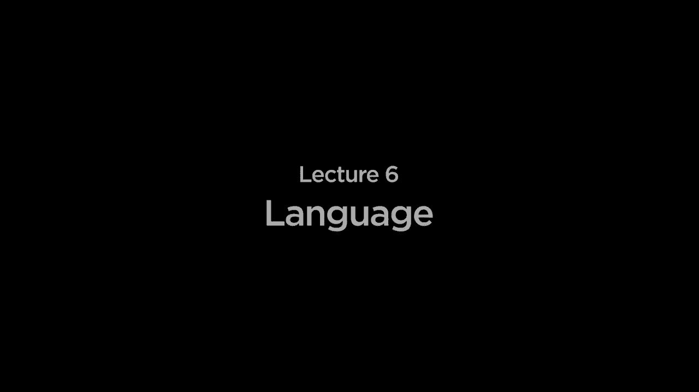

okay welcome back everyone to our final，topic in an introduction to artificial。intelligence with Python and today the，topic is language so thus far in the。class we've seen a number of different，ways of interacting with AI artificial。intelligence but it's mostly been，happening in the way of us formulating。

problems in ways that AI can understand，learning to speak the language of AI so。to speak by trying to take a problem and，formulate it as a search problem or by。trying to take a problem and make it a，constraint satisfaction problem。something that our AI is able to，understand today we're going to try and。

come up with algorithms and ideas that，allow our AI to meet us halfway so to。speak to be able to allow AI to be able，to understand and interpret and get some。sort of meaning out of human language。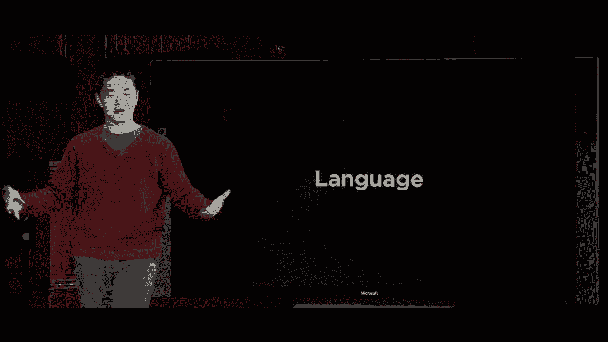

the type of language in the spoken，language like English or some other。language that we naturally speak and，this turns out to be a really。challenging task for AI and it really，encompasses a number of different types。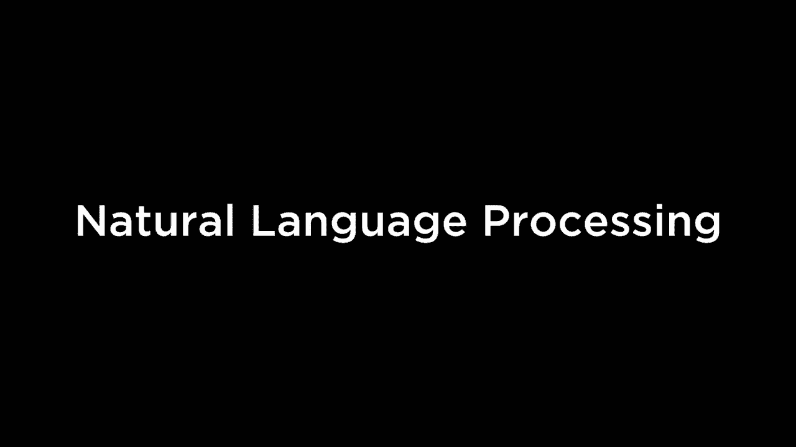

of tasks all under the broad heading of，natural language processing the idea of。coming up with algorithms that allow our，AI to be able to process and understand，natural language。so these tasks vary in terms of the，types of tasks we might want in AI to。perform and therefore the types of，algorithms that we might use them but。

some common tasks that you might see are，things like automatic summarization you。give an AI a long document and you would，like for the AI to be able to summarize。that come up with a shorter，representation of the same idea but。still in some kind of natural language，like English something like information。

extraction given a whole corpus of，information in some body of documents or。on the internet for example we'd like，for our AI to be able to extract some。sort of meaningful semantic information，out of all that content that is able to。look at and read language identification，the task of given a page can you figure。

out what language that document is，written in this is the type of thing you。might see if you use a web browser where，if you open up a page in another。language that web browser might ask you，oh I think it's in this language would。you like me to translate it into English，for you for example and that language。

identification process is a task that，RAI needs to be able to do which is then。related then to machine translation the，process of taking text in one language。and translating it into another language，which there's been a lot of research and。development on really over the course of，the last several years and it keeps。

getting better in terms of how it is，that AI，able to take text in one language and。transform that text into another，language as well in addition to that we。have topics like named entity，recognition given some sequence of text。can you pick out what the named entities，are these are like names of companies or。

names of people or names of locations，for example which are often relevant or。important parts of a particular document，speech recognition as a related task not。to do with the text that is written but，text that is spoken being able to。process audio and figure out what are，the actual words that are spoken there。

and if you think about smart home，devices like Siri or Alexa for example。these are all devices that are now able，to listen to when we are able to speak。figure out what words we are saying and，draw some sort of meaning out of that as。well we've talked about how you could，formulate something for instance as a。

hidden Markov model to be able to draw，those sorts of conclusions and text。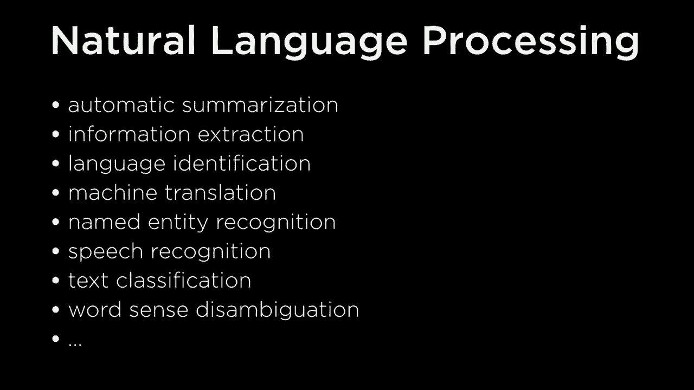

classification more generally is a broad，category of types of ideas whenever we。want to take some kind of text and put，it into some sort of category and we've。seen these classification type problems，and how we can use statistical machine。learning approaches to be able to solve，them we'll be able to do something very。

similar with natural language that we，may need to make a couple of adjustments。that we'll see soon and then something，like word sense disambiguation the idea。that unlike in the language of numbers，where AI is has very precise。representations of everything words are，a little bit fuzzy in terms of their。

meaning and words can have multiple，different meanings that natural language。is inherently ambiguous and we'll take a，look at some of those ambiguities in due。time today but one challenging task if，you want an AI to be able to understand。natural language is being able to，disambiguate or differentiate between。

different possible meanings of words if，I say a sentence like I went to the bank。you need to figure out do I mean like，the bank where I deposit and withdraw。money or do I mean the bank like the，river bank and different words can have。different meanings that we might want to，figure out and based on the context in。

which a word appears the wider sentence，or paragraph or paper in which a。particular word appears that might help，to inform how it is that we disambiguate。between different meanings or different，senses that a word might have and there。are many other topics within natural，language processing many other。

algorithms that have been devised in，order to deal with and address these。sorts of problems and and today we're，really just going to scratch the surface。looking at some of the fundamental ideas，and that are，find many of these ideas with a natural。language processing within this idea of，trying to come up with AI algorithms。

that are able to do something meaningful，with the languages that we speak every。day and so to introduce this idea when，we think about language we can often。think about it in a couple of different，parts the first part refers to the。syntax of language this is more to do，with just the structure of language and。

how it is that that structure works and。

if you think about natural language，syntax is one of those things that if。you're a native speaker of a language it，comes pretty readily to you you don't。have to think too much about it if I，give you a sentence from Sir Arthur。Conan Doyle's Sherlock Holmes for，example a sentence like this just before。

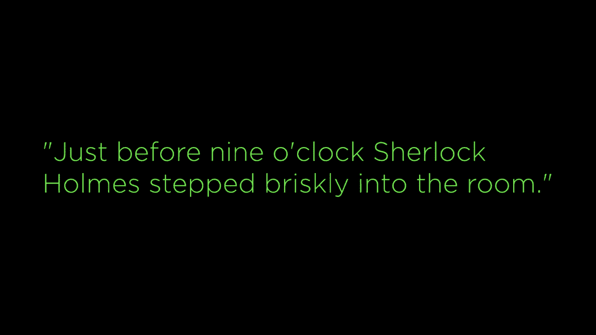

nine o'clock Sherlock Holmes stepped，briskly into the room I think we could。probably all agree that this is a，well-formed grammatical sentence。syntactically it makes sense in terms of，the way that this particular sentence is。structured and syntax applies not just a，natural language but to programming。

languages as well if you've ever seen，like a syntax error in a program that。you've written it's likely because you，wrote some sort of program that was not。syntactically well-formed the structure，of it was not a valid program in the。same way we can look at English。

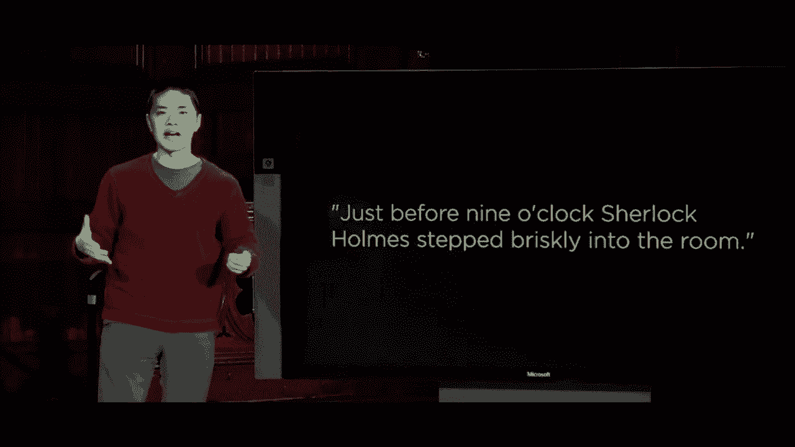

sentences or sentences in any natural，language and make the same kinds of。judgments I can say that this sentence，is syntactically well-formed when all。the parts that put together all these，words are in this order it constructs a。grammatical sentence or a sentence that，most people would agree is grammatical。

but there are also grammatically，ill-formed sentences the sentence like。just before Sherlock Holmes nine o'clock。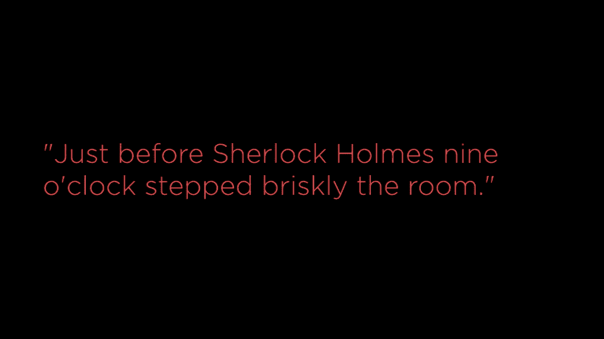

stepped briskly the room well I think we，would all agree that this is not a。well-formed sentence and tactically it，doesn't make sense and this is the type。of thing that if we want our AI for，example to be able to generate natural。language to be able to speak to us the，way like a chatbot would speak to us for。

example well then our AI is going to，need to be able to know this distinction。somehow it's going to be able to know，what kinds of sentences our grammatical。what kinds of sentences are not and we，might come up with rules or ways to。statistically learn these ideas and，we'll talk about some of those methods。

as well syntax can also be ambiguous，like there are some sentences that are。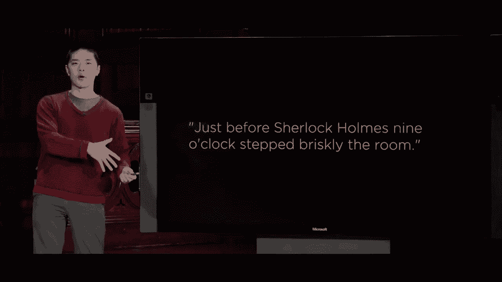

well-formed and not well-formed that but，certain way there are certain ways that。you could take a sentence and，potentially construct multiple different，structures for that sentence。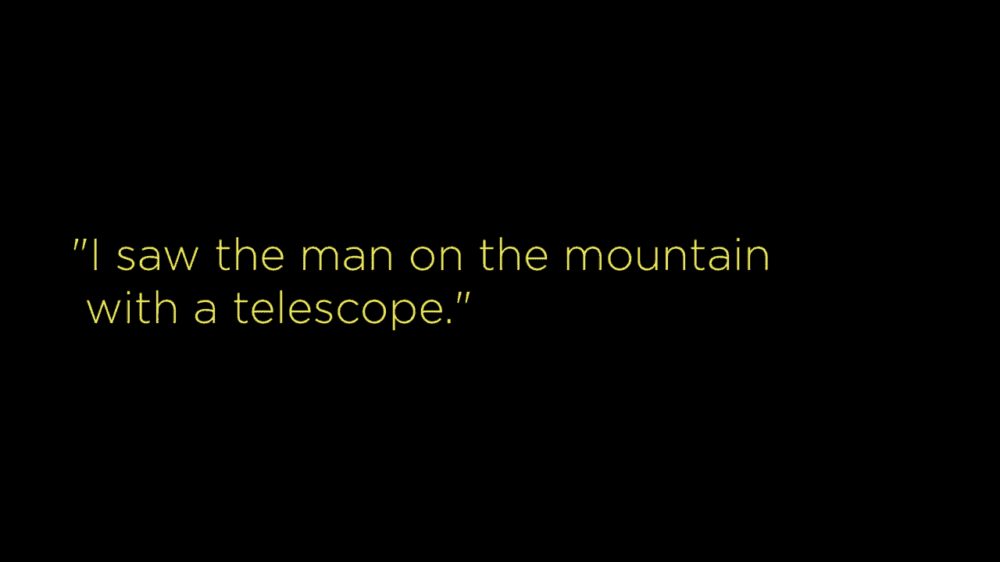

like I saw the man on the mountain with，the telescope well this is grammatically。well formed syntactically it makes sense。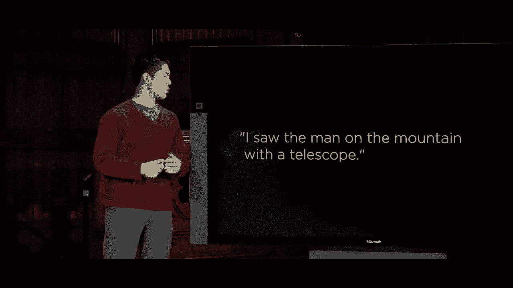

but what is the structure of this，sentence is it the man on the mountain。who has the telescope or am i seeing the，man on the mountain and I am using the。telescope in order to see the men on the，mountain there's some interesting。ambiguity here where it could have，potentially two different types of。

structures and this is one of the ideas，that we'll come back to also in terms of。how to think about dealing with AI when，natural language is inherently ambiguous。so that then is syntax the structure of，language and getting an understanding。for how it is that depending on the，order and placement of words we can come。

up with different structures for，language but in addition to language。having structure language also has，meaning and now we get into the world of。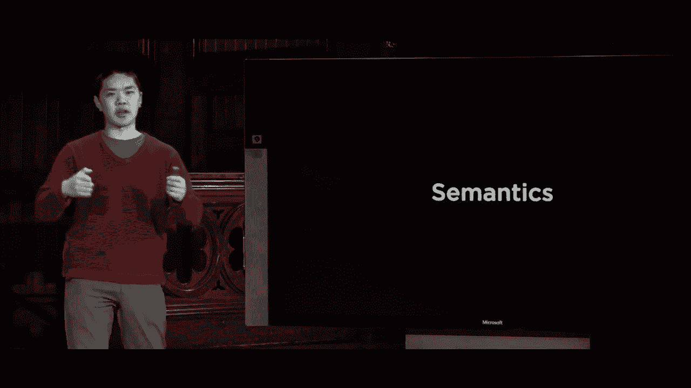

semantics the idea of what is it that a，word or a sequence of words or a。sentence or an entire essay actually，means and so you know a sentence like。just before nine o'clock Sherlock Holmes，stepped briskly into the room is a。different sentence from a sentence like，Sherlock Holmes stepped briskly into the。

room just before 9 o'clock and yet they，have effectively the same meaning。they're different sentences so when AI，reading them would recognize them as。different but we as humans can look at，both of those sentences and say yeah。they mean basically the same thing and，maybe in this case who was dressed。

because I moved the order of the words，around originally 9 o'clock was near the。beginning of the sentence now 9 o'clock，is near the end of the sentence you。might imagine that I could come up with，in different sentence entirely a。sentence like a few minutes before 9，Sherlock Holmes walked quickly into the。

room and okay that also has a very，similar meaning but I'm using different。words in order to express that idea and，ideally AI would be able to recognize。that these two sentences these different，sets of words that are similar to each。other have similar meanings and to be，able to get at that idea as well and。

there are also ways that a syntactically，well-formed sentence might not mean。anything at all a famous example from。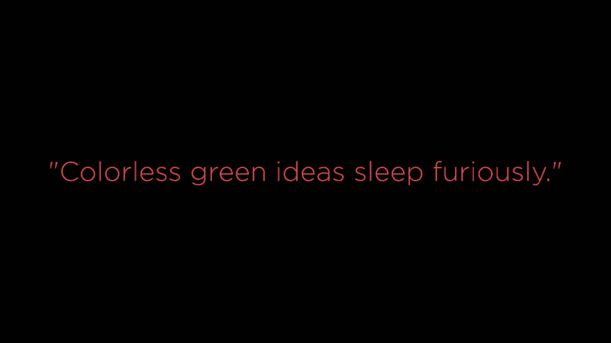

linguist Noam Chomsky is this sentence，here colorless green ideas sleep。furiously syntactically that sentence is，perfectly fine colorless and green are。adjectives that modify the noun ideas，sleep is a verb variously as an adverb。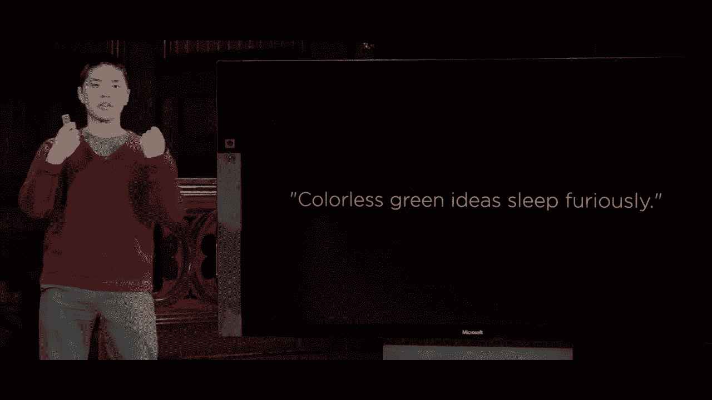

of the old，of words but it turns out this sentence，is sort of meaningless if you tried to。ascribe meaning to the sentence what，does it mean and it's not easy to be。able to determine what it is that it，might mean semantics itself can also be。ambiguous given that different，structures can have different types of。

meanings different words can have，different kinds of meanings so the same。sentence with the same structure might，end up meaning different types of things。my favorite example from the LA Times is，a headline that was in the Los Angeles。Times a little while back it is the。

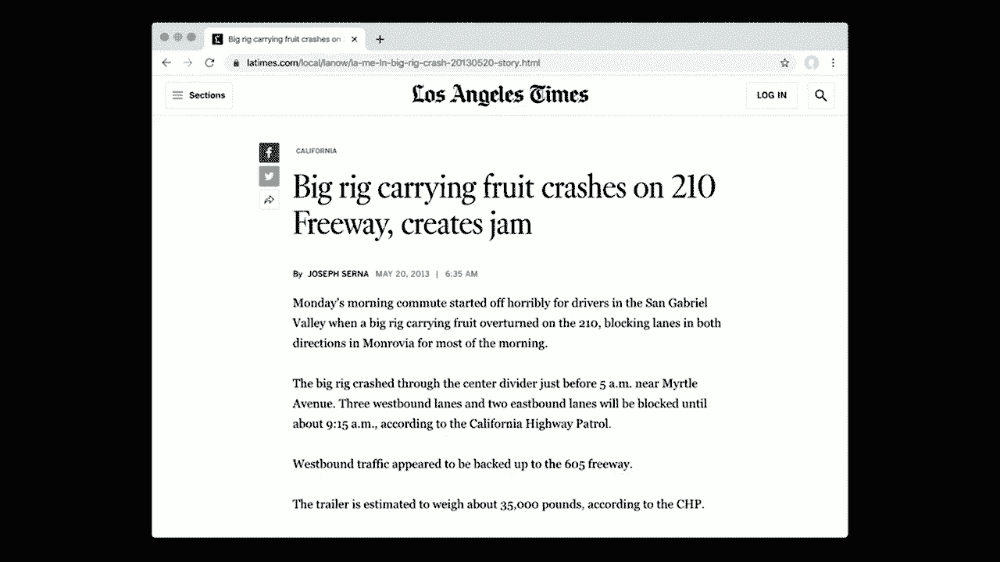

headline says big rig carrying fruit，crashes on 210 freeway，creates Jam so depending on how it is。you look at the sentence how you，interpret the sentence it can have。multiple different meanings and so here，two are challenges in this world of。natural language processing being able，to understand both the syntax of。

language and the semantics of language，and today we'll take a look at both of。those ideas we're gonna start by talking，about syntax and getting a sense for how。it is at that language is structured and，how we can start by coming up with some。rules some ways that we can tell our，computer tell our AI what types of。

things are valid sentences what types of，things are not valid sentence ism and。ultimately we'd like to use that，information to be able to allow our AI。to draw meaningful conclusions to be，able to do something with language and。so to do so we're gonna start by，introducing the notion of formal grammar。

and what formal grammar is all about is，formal grammar is a system of rules that。generate sentences in a language I would，like to know what are the valid English。sentences not in terms of what they mean，just in terms of their structure。there's syntactic structure what，structures of English are valid correct。

sentences what structures of English are，not valid and it's going to apply in a。very similar way to other natural，languages as well where language follows。certain types of structures and we，intuitively know what these structures。mean but it's going to be helpful to try，and really formally define what those。

structures mean as well there are a，number of different types of formal。grammar all across what's known as the，Chomsky hierarchy of grammars and you。may have seen some of these before if，you've ever worked with regular。expressions before him those belong to a，class of regular languages they。

correspond to regular languages which is，a particular type of the language but。also on this hierarchy is a type of，grammar known as a context-free grammar，the most time。taking a look at today and what a，context-free grammar is is it is a way。of taking generating sentences in a，language via what are known as rewriting。

rules replacing one symbol with other，symbols and we'll take a look in a。moment at just what that means so let's，imagine for example a simple sentence in。English a sentence like she saw the city。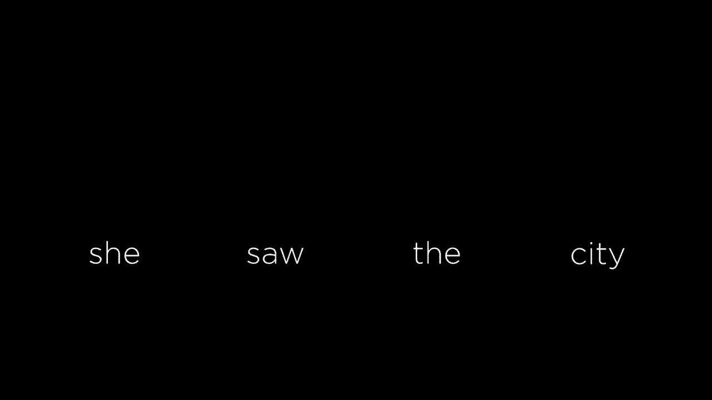

a valid syntactically well-formed，English sentence but we'd like for some。way for our AI to be able to look at，this sentence and figure out what is the。structure of the sentence because in，order to answer a question if you。imagine AI in a question answering，format if you want to ask the AI a。

question like what did she see well then，the AI wants to be able to look at this。sentence and recognize that what she saw，is the city to be able to figure that。out and it requires some understanding，of what it is that the structure of this。sentence really looks like so where do，we begin each of these words she saw the。

city we are going to call terminal，symbols there are symbols in our。language where each of these words is，just a symbol where this is ultimately。what we care about generating we care。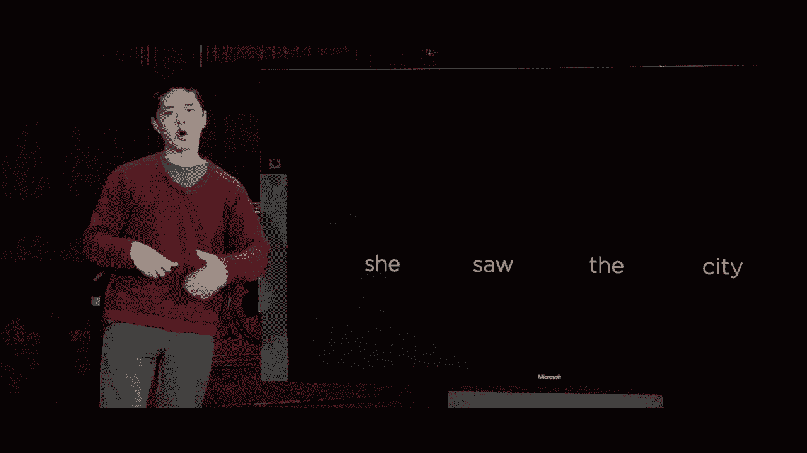

about generating these words but each of，these words we're also going to。associate with what we're gonna call a。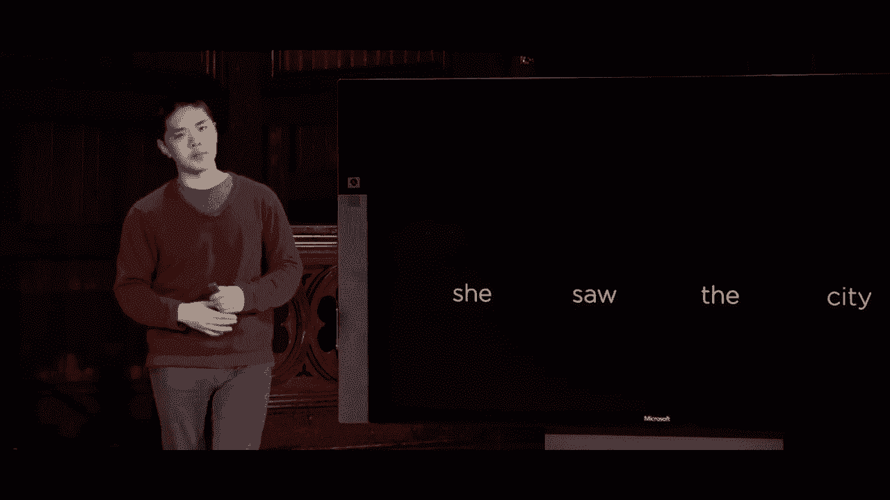

non-terminal symbol and these，non-terminal symbols initially are gonna。look kind of like parts of speech if you，remember back to like English grammar。where she is a noun saw is a V for verb，the is a D D stands for determiner these。are words like the and a and an for。

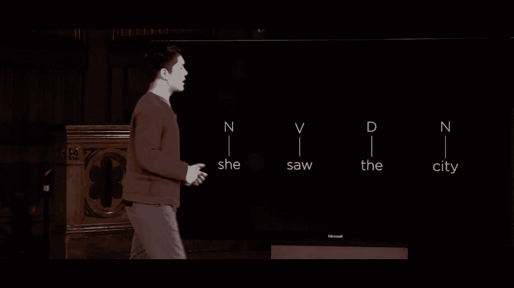

example and then city well city is also，a noun so an n it goes there so each of。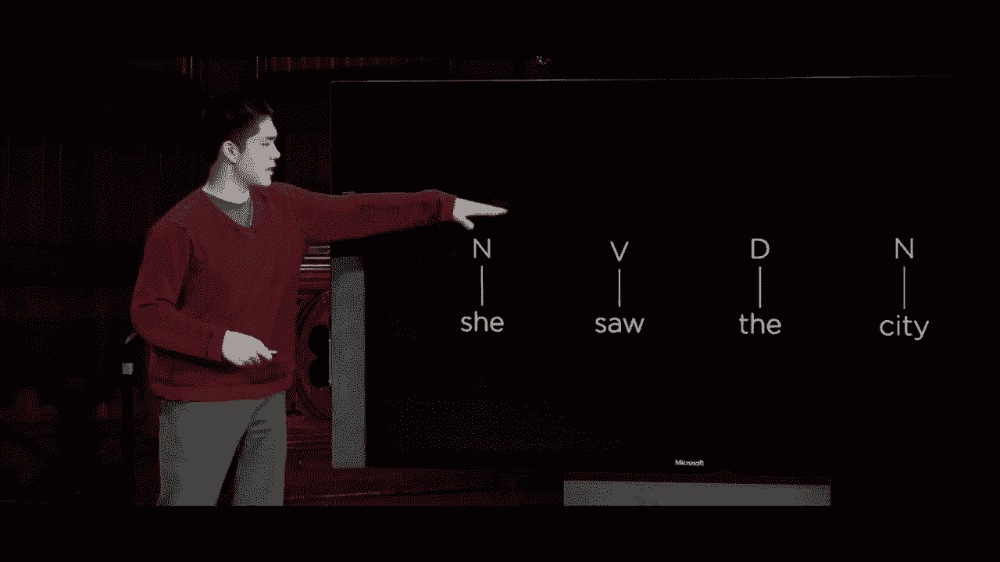

these NV and D these are what we might，call non-terminal symbols they're not。actually words in the language she saw，the city those are the words in the。language but we use these non-terminal，symbols to generate the terminal symbols。the terminal symbols which are like she，saw the city the words that are actually。

in a language like English and so in，order to translate these non-terminal。symbols into terminal symbols we have，what are known as rewriting rules and。these rules look something like this we，have a n on the left side of an arrow。and the arrow says if I have an N，non-terminal symbol then I can turn it。

into any of these various different，possible。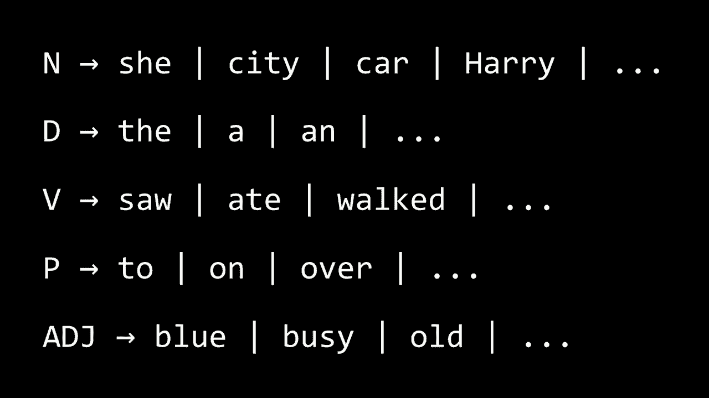

that are separated with a vertical line，so a noun，could translate into the word she a noun。could translate into the word city or，car or Harry or any number of other。things these are all examples of nouns，for example meanwhile a determiner D。could translate into the or a or an，v4 verb could translate into any of。

these verbs P for preposition could，translate into any of those prepositions。to on over and so forth and then a DJ，for adjective couldn't translate into。any of these possible adjectives as well，so these then are rules in our。context-free grammar when we are，defining what it is that our grammar is。

what is the structure of the English，language or any other language and we。give it these types of rules saying that，a noun could be any of these。possibilities a verb could be any of，those possibilities but it turns out we。can then begin to construct other rules，where it's not just one non-terminal。

translating into one terminal symbol，we're always going to have one non。terminal on the left-hand side of the，arrow but on the right-hand side of the。arrow we could have other things we，could even have other non-terminal。symbols so what do I mean by this well，we have the idea of nouns like she city。

car Harry for example but there are also，noun phrases like phrases that could。work as nouns that are not just a single，word but that are multiple words right。like the city is two words that together，operate as what we might call a noun。phrase it's multiple words but they're，together operating as a noun or if you。

think about a more complex expression，like the big city three words all。operating as a single noun or the car on，the street multiple words now but that。entire set of words and operates kind of，like a noun it substitutes as a noun。phrase and so to do this we'll introduce，the notion of a new non terminal symbol。

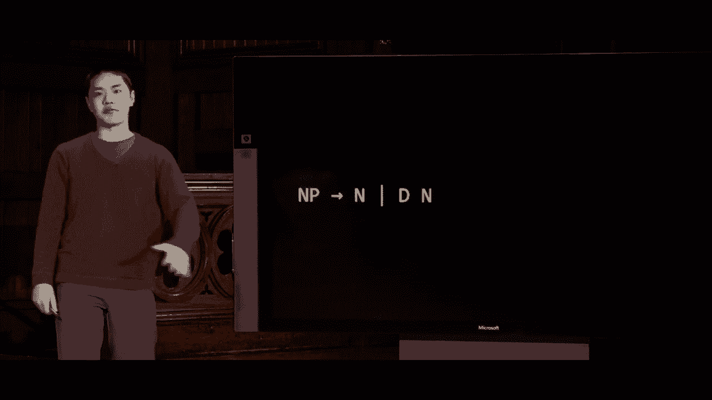

called NP which will stand for noun，phrase and this rewriting rule says that。a noun phrase it could be a noun so，something like she is a noun and。therefore it can also be a noun phrase，but a noun phrase could also be a。

determiner D followed by a noun so two，ways we can have a noun phrase in this。very simple grammar of course English。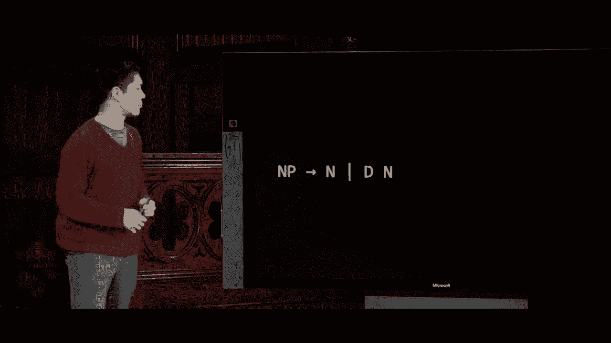

language is more complex than just this，but a noun phrase is I，the renowned or it is a determiner。followed by a noun so for the first，example a noun phrase that is just a。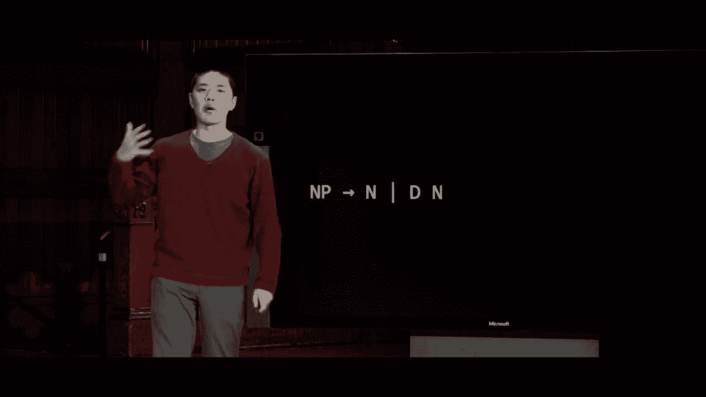

noun that would allow us to generate，noun phrases like she because a noun。phrase is just a noun and a noun，could be the word she for example。meanwhile if we wanted to look at one of，the examples of bees where a noun phrase。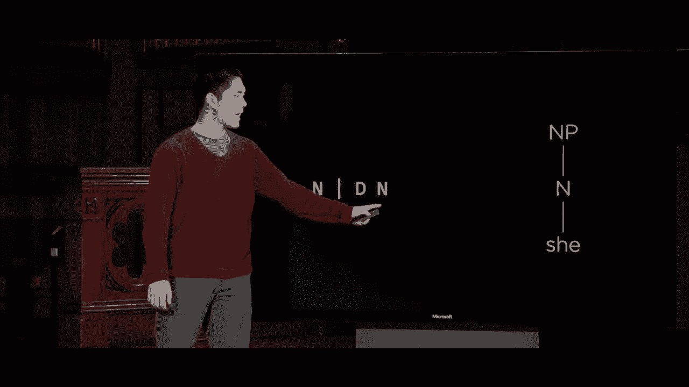

becomes a determiner and a noun then we，get a structure like this and now we're。starting to see the structure of，language emerge from these rules in a。syntax tree as we'll call this tree like，structure that represents the syntax of。our natural language here we have a noun，phrase and this noun phrase is composed。

of a determiner and a noun where the，determiner is the word the' according to。that rule and noun is the word city so，here then is a noun phrase that consists。of multiple words inside of the，structure and using this idea of taking。one symbol and rewriting it using other，symbols that might be terminal symbols。

like the and city but might also be，non-terminal symbols like D for。determiner or n for noun then we can。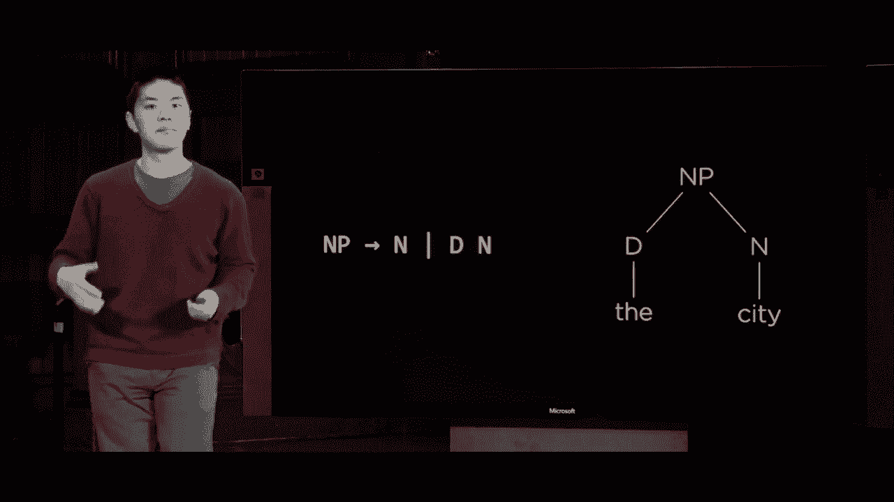

begin to construct more and more complex，structures in addition to noun phrases。we can also think about verb phrases so。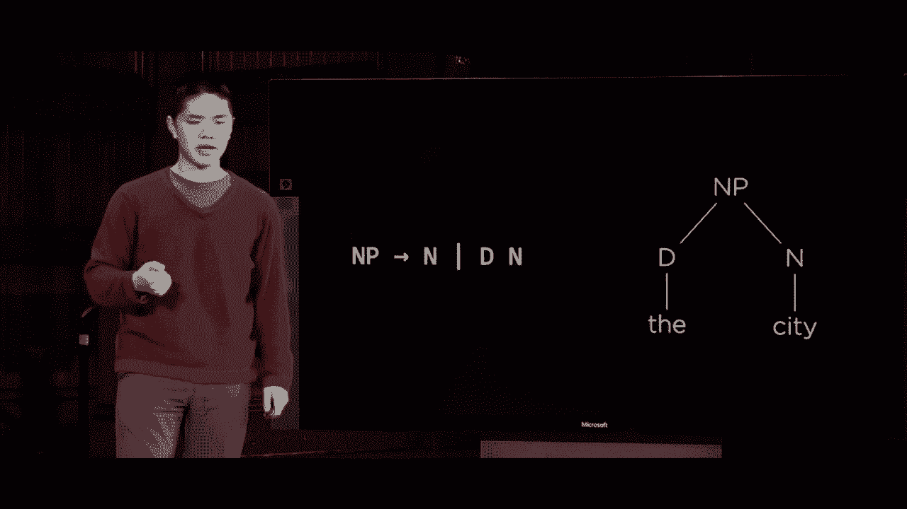

what might a verb phrase look like well，a verb phrase might just be a single。verb in a sentence like I walked walked，is a verb and that is acting as the verb。phrase in that sentence but there are，also more complex verb phrases that。aren't just a single word but there are，multiple words if you think of the。

sentence like she saw the city for，example saw the city is really that。entire verb phrase it's taking up like，what it is that she is doing for example。and so our verb phrase might have a rule。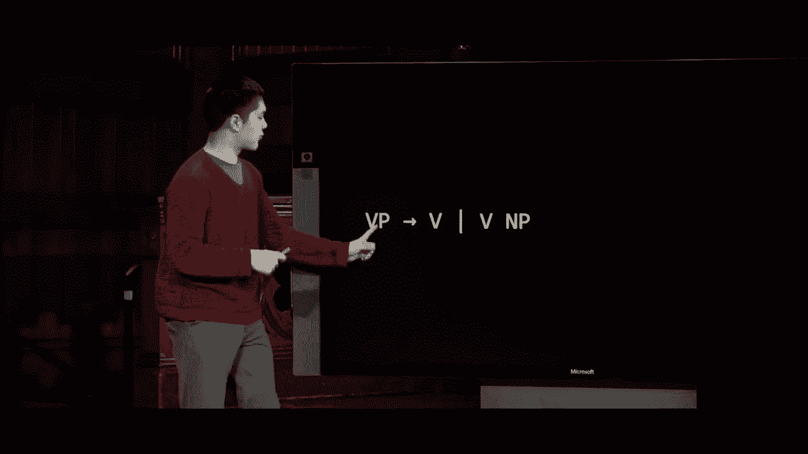

like this a verb phrase is either just a，plain verb or it is a verb followed by a。noun phrase and we saw before that a。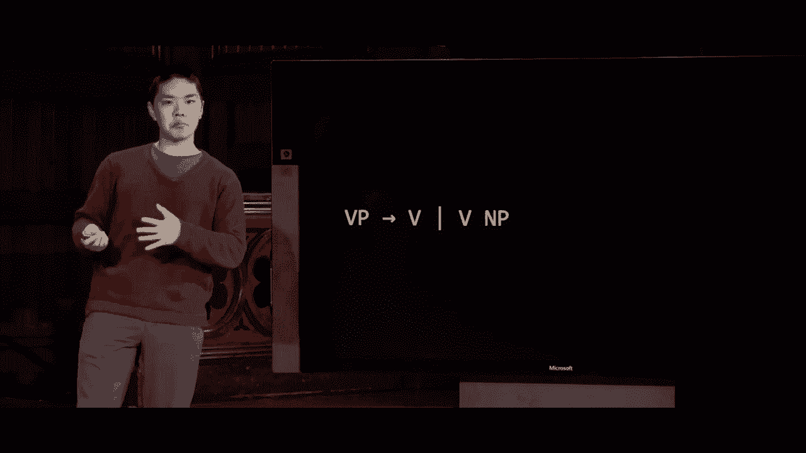

noun phrase is either a noun or it is a，determiner followed by a noun and so a。verb phrase might be something simple，like verb phrase is just a verb and that。verb could be the word walked for，example but it could also be something。more sophisticated something like this，now where we begin to see a larger。

syntax tree where the way to read this，syntax tree is that a verb phrasing is a，verb and。phrasing where that verb could be，something like psalm and this is a noun。phrase we've seen before this noun，phrase that is the city a noun phrase。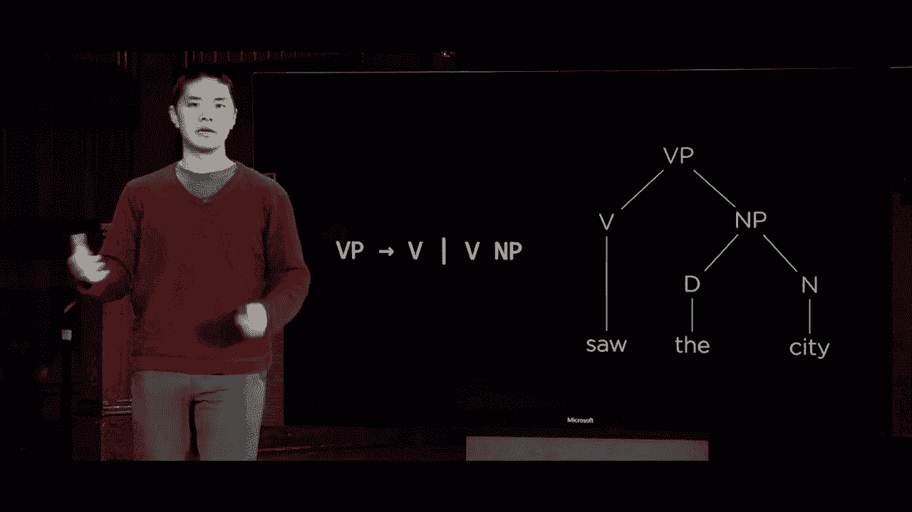

composed of the determiner the and the，noun city all put together to construct。this larger verb phrase and then just to，give one more example of a rule we could。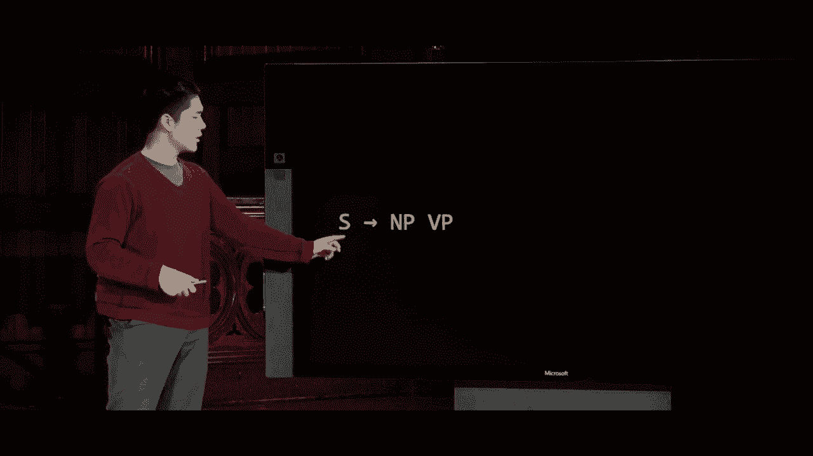

also have a rule like this sentence s，goes to noun phrase and a verb phrase。the basic structure of a sentence is。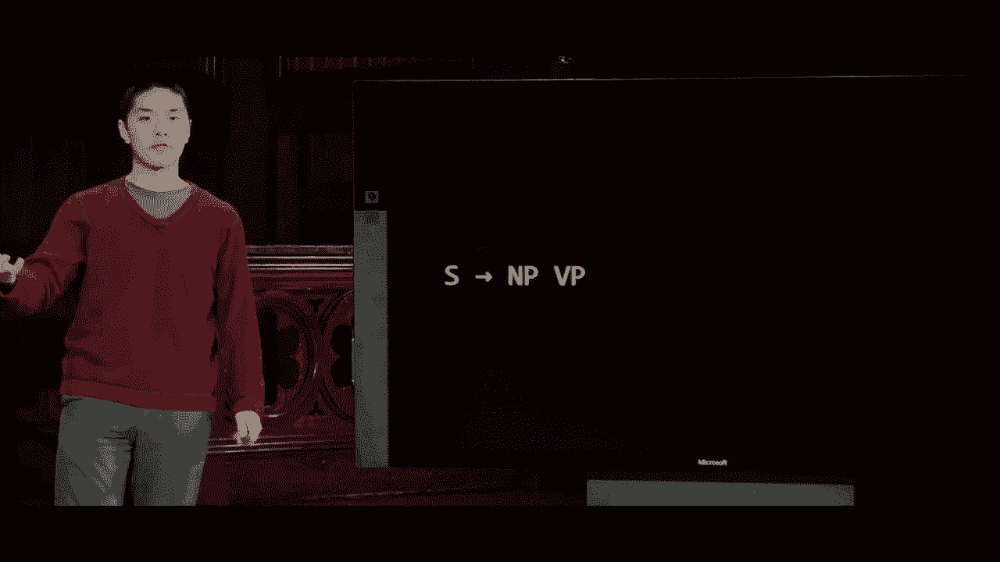

that it is a noun phrase followed by a，verb phrase and this is a formal grammar。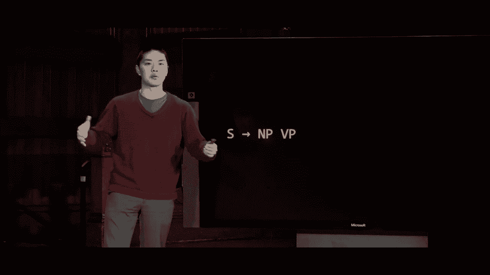

way of expressing the idea that you，might have learned when you learned。English grammar when you read that a sub，a sentence is like a subject and a verb。subject in action something that's，happening to a particular noun phrase。and so using the structure we could，construct a sentence that looks like。

this a sentence consists of a noun，phrase and a verb phrase a noun phrase。could just be a noun like the word she，the verb phrase could be a verb and a。noun phrase where this is something，we've seen before the verb is saw and。the noun phrase is the city and so now，look what we've done here what we've。

done is by defining a set of rules there，are algorithms that we can run that take。these words and thus Eyk algorithm for，example is one example of this if you。want to look into that where you start，with a set of terminal symbols like she。saw the city and then using these rules，you're able to figure out how is it that。

you go from a sentence to she saw the，city and then all through these。rewriting rules so the sentence is a，noun phrase and a verb phrase a verb。phrase could be a verb and a noun phrase，of so on and so forth where you can。imagine taking the structure and，figuring out how it is that you could。

generate a parse tree a syntax tree for，that set of terminal symbol of that set。of words and if you tried to do this for，a sentence that was not grammatical。something like saw the city she well，that wouldn't work there'd be no way to。take a sentence and use these rules to，be able to generate that sentence that。

is not inside of that language so this，sort of model can be very helpful if the。rules are expressive enough to express，all the ideas that you might want to。express inside of natural language of，course using just the simple rules we。have here there are many sentences that，we won't be able to generate sentences。

that we might agree are grammatically，and syntactically well-formed but that。we're not going to be able to construct，using these rules and then in that case。we might just need to have some more，complex rules in order to deal with。those sorts of cases and so this type of，approach can be powerful if you're。

dealing with sort of a limited set of，rules and words that you really care。about dealing with and one way we can，actually interact with this in Python is。by using a Python library called NLT Kay，short for natural language toolkit which。we'll see a couple of times today which。

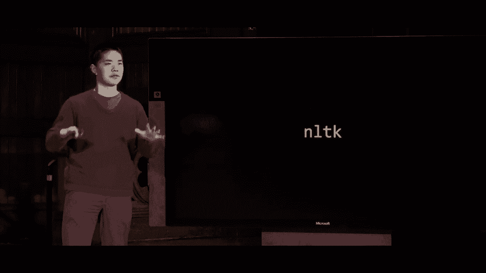

has a wide variety of different，functions and classes that we can take。advantage of it that are all meant to，deal with natural language and one such。algorithm that it has is the ability to，parse a context-free grammar to be able。to take some words and figure out，according to some context-free grammar。

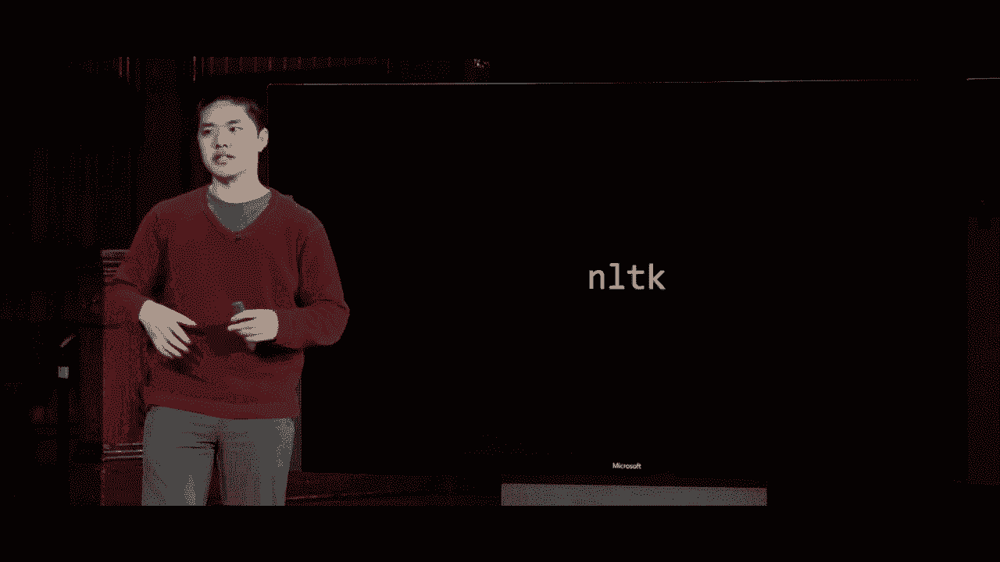

how would you construct the syntax tree，for it so let's go ahead and take a look。at NLT kay now by examining how we might，construct some context-free grammars。with it so here inside of CFG zero CFG，short for context-free grammar I have a。sample context-free grammar which has，rules that we've seen before so sentence。

goes to noun phrase followed by a verb，phrasing noun phrase is either a。determiner and a noun or a noun verb，phrase is either a verb or a verb and a。noun phrase the order of these things，doesn't really matter，determiners could be the word though or。the word a a noun could be the word she，city or car and a verb could be the word。

saw or it could be the word walked now，using n ltk which i've imported here at。the top I'm going to go ahead and parse，this grammar and save it inside of this。variable called parser next my program，is going to ask the user for input just。like type in a sentence and dot split，will just split it on all of the spaces。

so I end up getting each of the，individual words we're gonna save that。inside of this list called sentence ISM，and then we'll go ahead and try to parse。the sentence and for each sentence we，parse we're going to pretty print it to。the screen just so it displays in my，terminal and we're also going to draw it。

it turns out that NLT Kay has some，graphics capacity so we can really。visually see what that tree looks like，as well and there are multiple different。ways the sentence might be parsed which，is why we're putting it inside of this。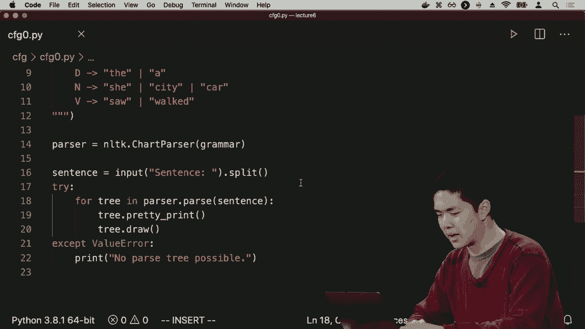

for loop and we'll see why that can be，helpful in a moment too so alright now，it。I'll CD into CFG and we'll go ahead and，run CFG 0，so it then is going to prompt me to type。in a sentence and let me type in a very，simple sentence something like she。walked for example press return so what，I get is on the left hand side you can。

see a text-based representation of the，syntax tree and on the right side here。let me go ahead and make it bigger we，see a visual representation of that same。syntax tree this is how it is that my，computer has Mia parsed the sentence she。walked is the sentence that consists of，a noun phrase and a verb phrase where。

each phrase is just a single noun or，verb she and then walked the same type。of structure we've seen before but this，now is our computer able to understand。the structure of the sentence to be able，to get some sort of structural。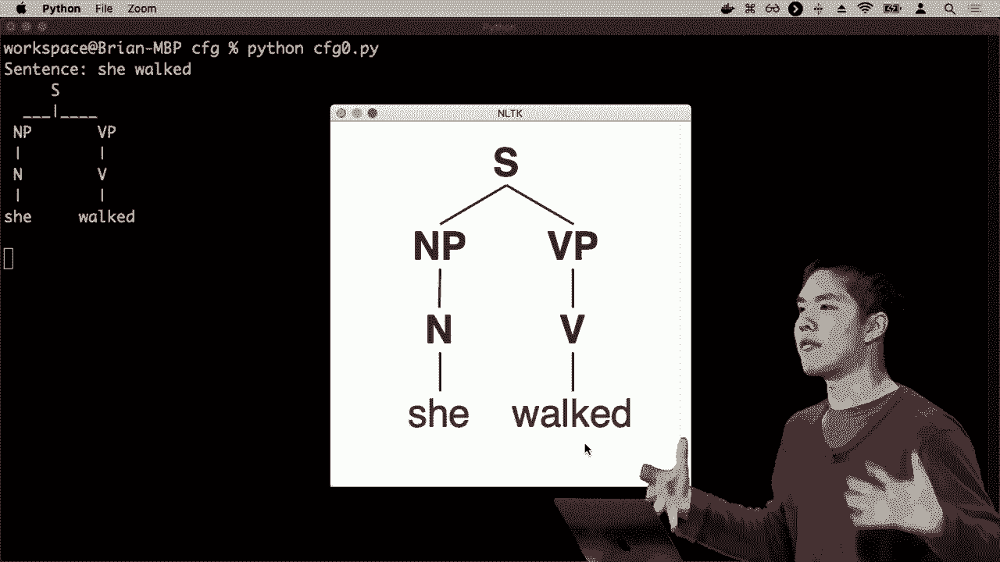

understanding of how it is the parts of，the sentence relate to each other let me。now give it another sentence I could try，something like she saw the city for。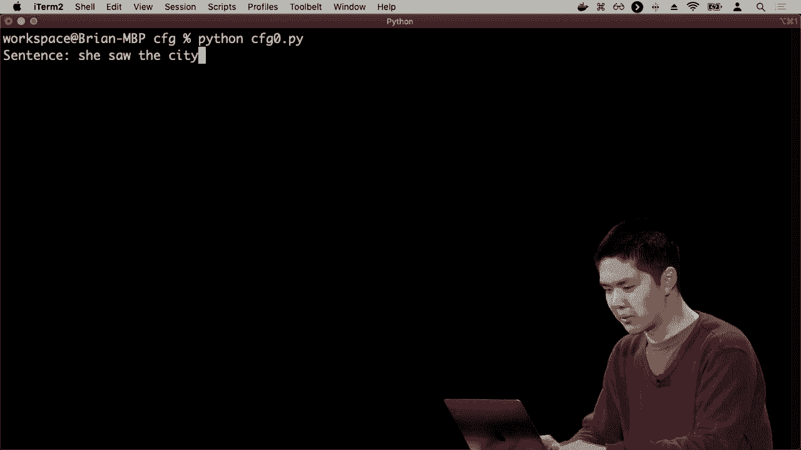

example the words we were dealing with a，moment ago and then we end up getting。this syntax tree out of it again a，sentence that has a noun phrase and a。verb phrase the noun phrase is fairly，simple it's just she but the verb phrase。is more complex it doesn't now saw the。

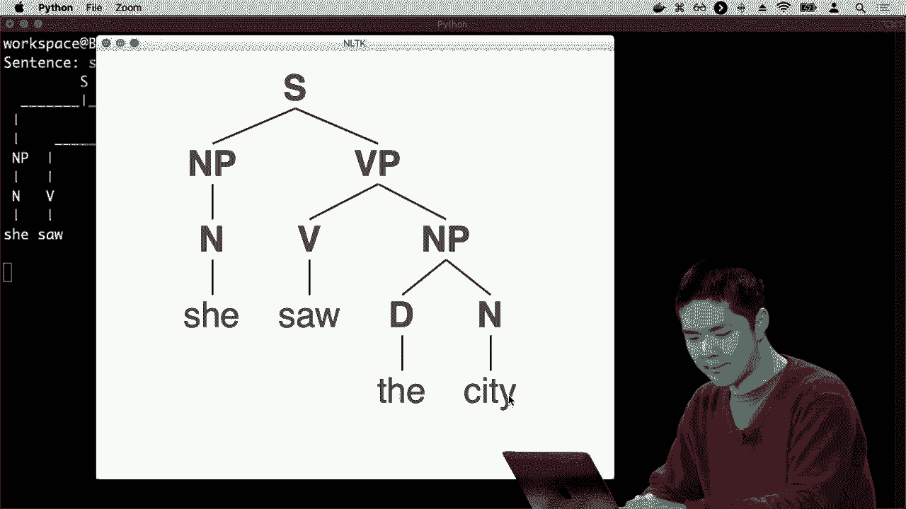

city for example and let's do one more。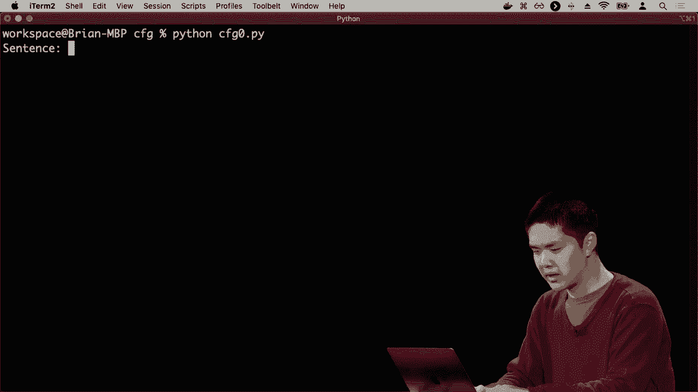

with this grammar let's do something，like she saw a car and that is going to。look very similar that we also get she，but our verb phrase is now different it。saw a car because there are multiple，possible determiners in our language and。multiple possible nouns I haven't given，this grammar all that many words but if。

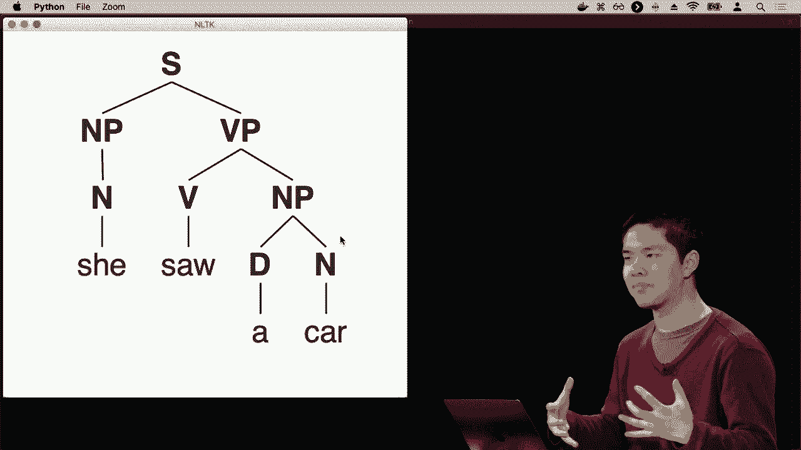

I gave it a larger vocabulary it would，then be able to understand more and more。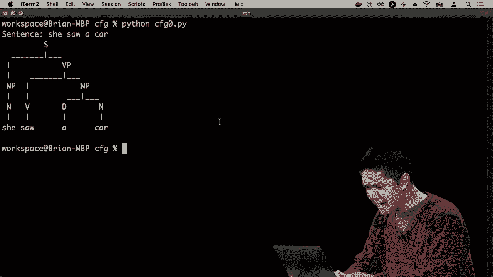

different types of sentences and just to，give you a sense of some added。complexity we could add here the more，complex our grammar the more rules we。Adam the more different types of，sentences will then have the ability to。generate so let's take a look at CFG one，for example where I've added a whole。

number of other different types of rules，I've added adjective phrases where we。could have multiple adjectives，inside of a noun phrase as well so a。noun phrase could be like an adjective，phrase followed by a noun phrase if I。wanted to say something like the big，city that's an adjective phrase followed。

by a noun phrase or we could also have a，noun and a prepositional phrase so the。car on the street for example on the，street is a prepositional phrase and we。might want to combine those two two，ideas together，because the car on the street can still。operate as something kind of like a noun，phrase as well so no need to understand。

all of these rules in too much detail it，starts to get into the nature of English。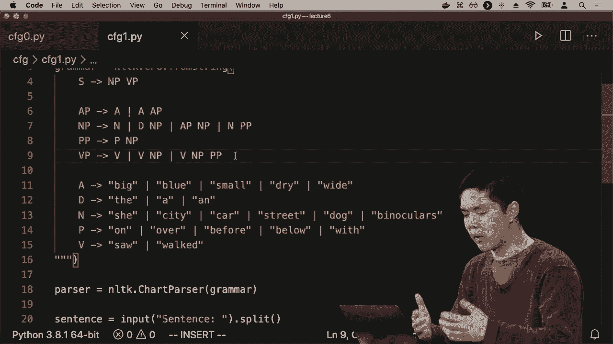

grammar but now we have a more complex，way of understanding these types of。sentences so if I run Python CFG one and，I can try typing something like she saw。the wide street for example a more。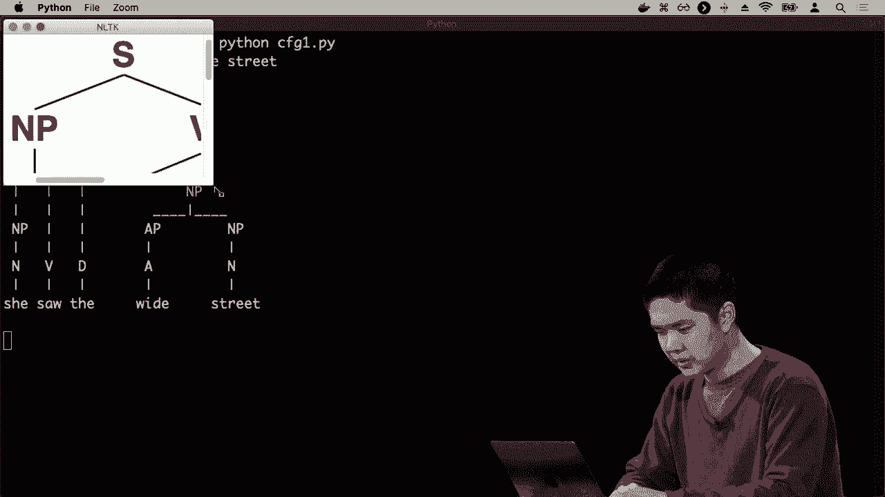

complex sentence and if we make that，larger you can see what this sentence。looks like I'll go ahead and shrink it a，little bit so now we have a sentence。like this she saw the wide street the，wide street is one entire noun phrase。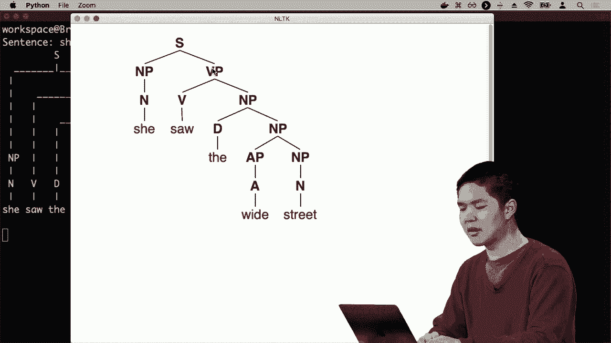

saw the wide street is an entire verb，phrase and she saw the wide street ends。up forming that entire sentence so let's，take a look at one more example to。introduce this notion of ambiguity so I，can run Python CFG one let me type a。sentence like she saw a dog with，binoculars so there's our sentence and。

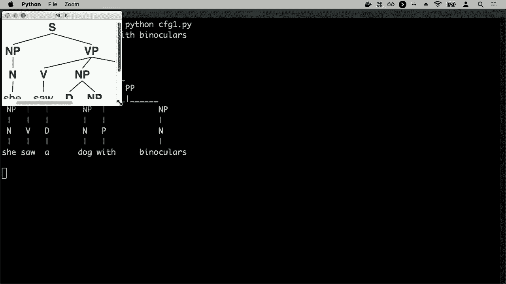

here now is one possible syntax tree to，represent this idea she saw the noun。phrase a dog and then the prepositional，phrase with binoculars and the way to。interpret the sentence is that what it，is that she saw was a dog and how did。she do the seeing she did the seeing，with binoculars and so this is one。

possible way to interpret this she was，using monocular ISM using those。binoculars she saw a dog but another。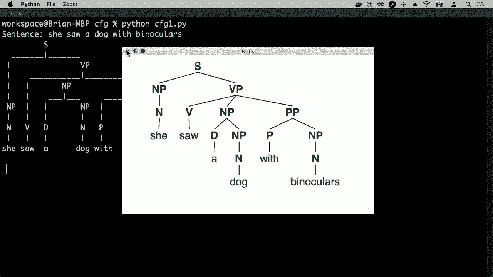

possible way to parse that sentence，would be with this tree over here where。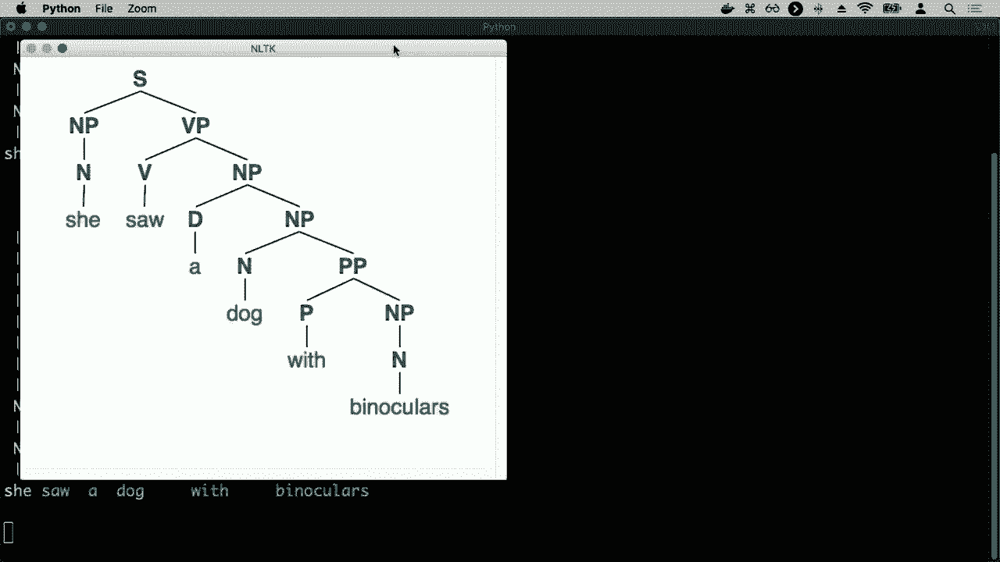

you have something like she saw a dog，with binoculars where a dog with。binoculars forms an entire noun phrase，of its own same words in the same order。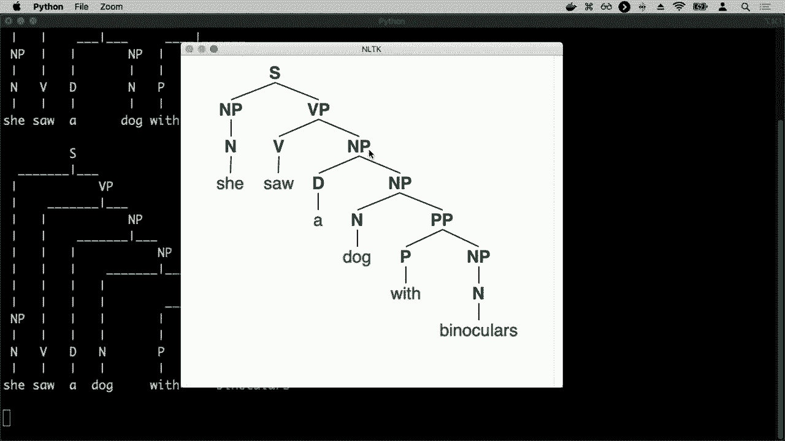

but a different grammatical structure，where now we have a dog with binoculars。all inside of this noun phrase meaning，what did she see what she saw was a dog。and that dog happened to have binoculars，with the dog so different ways to parse。the sentence structures for the sentence，even given the same possible sequence of。

words and NLT Kay's algorithm in this，particular algorithm has the ability to。find all of these to be able to，understand the different ways that you。might be able to parse the sentence，and be able to extract some sort of。useful meaning out of that sentence as，well so that then is a brief look at。

what we can do using getting that the，structure of language of using these。context-free grammar rules to be able to，describe the structure of language but。what we might also care about is，understanding how it is that these。sequences of words are likely to relate，to each other in terms of the actual。

words of themselves the grammar that we，saw before，could allow us to generate a sentence。like I ate a banana for example where I，is the noun phrase and ate a banana is a。verb phrase but it would also allow for，sentences like I ate a blue car for。example which is also syntactically，well-formed according to the rules but。

it's probably a less likely sentence，that a person is likely to speak and we。might want for our AI to be able to，encapsulate the idea that certain。sequences of words are more or less，likely than others so to deal with that。we'll introduce the notion of an Engram。

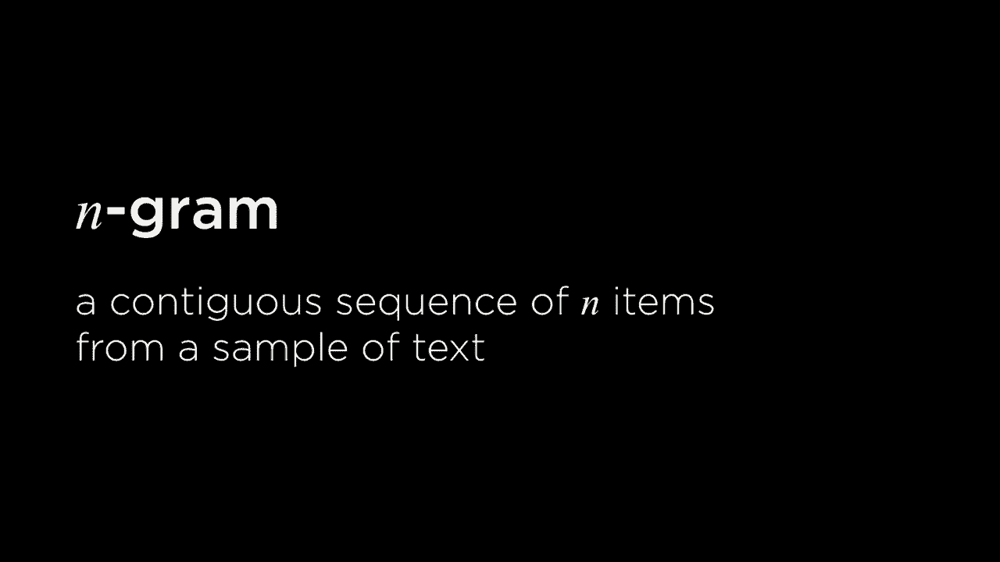

and an Engram more generally just refers，to some sequence of n items inside of。our text and those items might take，various different forms we can have a。character engrams which are just a，contiguous sequence of n characters so。three characters in a row for example of，four characters in a row we can also。

have word engrams which are a contiguous。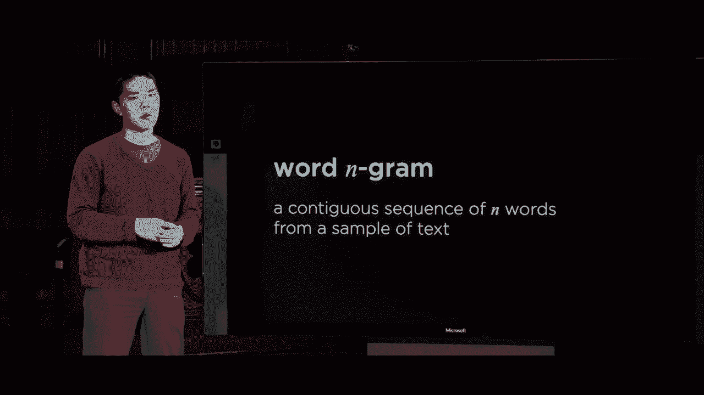

sequence of n words in a row from a，particular sample of text and these end。up proving quite useful and you can，choose our n to decide like how many our。sequence going to be so when n is 1，we're just looking at like a single word。or a single character and that is what，we might call a unigram just one item if，words。

that's generally called a bigram so an，Engram where n is equal to two looking。at two words that are consecutive and，then if there are three items you might。imagine will often call those trigrams，so three characters in a row or three。words that happen to be in a contiguous，sequence and so if we took a sentence。

for example here's a sentence from again，Sherlock Holmes how often have I said to。you that when you have eliminated the，impossible whatever remains no matter。however improbable must be the truth，what are the trigrams that we can。extract from the sentence if we're，looking at sequences of three words well。

the first trigram would be how often，have just the sequence of three words。and then we can look at the next trigram，often have I the next trigram is have I。said then I said to said to you to you，that for example those are all trigrams。of words sequences of three contiguous，words that show up in the text and。

extracting those diagrams and trigrams，or engrams more generally turns out to。be quite helpful because often when，we're dealing with analyzing a lot of。text it's not going to be particularly，meaningful to it for us to try and。analyze the entire text at one time but，instead we'll want to segment that text。

into pieces that we can begin to do some，analysis of that our AI might never have。seen this entire sentence before but，it's probably seen the trigram to you。that before because to you that is，something that might have come up in。other documents that Rai has seen before，and therefore it knows a little bit。

about that particular sequence of three，words in a row or something like have I。said another example of another sequence，of three words that's probably quite。popular in terms of where you see it，inside the English language so we'd like。some way to be able to extract these，sorts of engrams and how do we do that。

how do we extract like sequences of，three words well we need to take our。input and somehow separate it into all，of the individual words and this is the。process generally known as tokenization。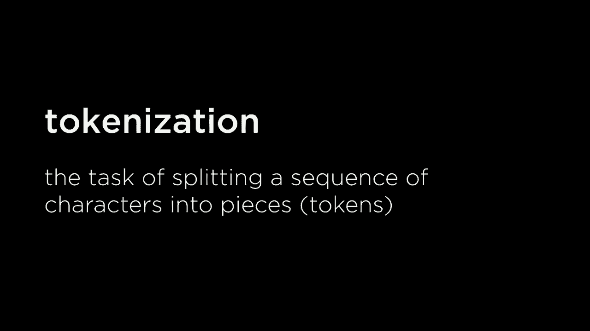

the task of splitting up some sequence，into distinct pieces where we call those。pieces tokens most commonly this refers，to something like word tokenization I。have some sequence of text and I want to，split it up into all of the words that。show up in that text but it might also，come up in the context of something like。

sentence tokenization I have a long，sequence of texts and I'd like to split。it up into sentences for example and so，how might word tokenization work the。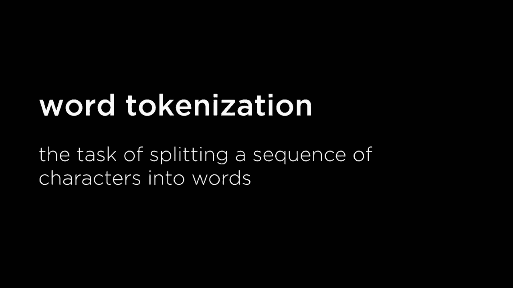

task of splitting up our sequence of，characters into words，well we've also already seen this idea。we've seen that in word tokenization，just a moment to go，I took an input sequence and I just。called pythons split method on it or the，split method took that sequence of words。and just separated it based on where the，spaces show，in that word and so if I had a sentence。

like whatever remains however improbable。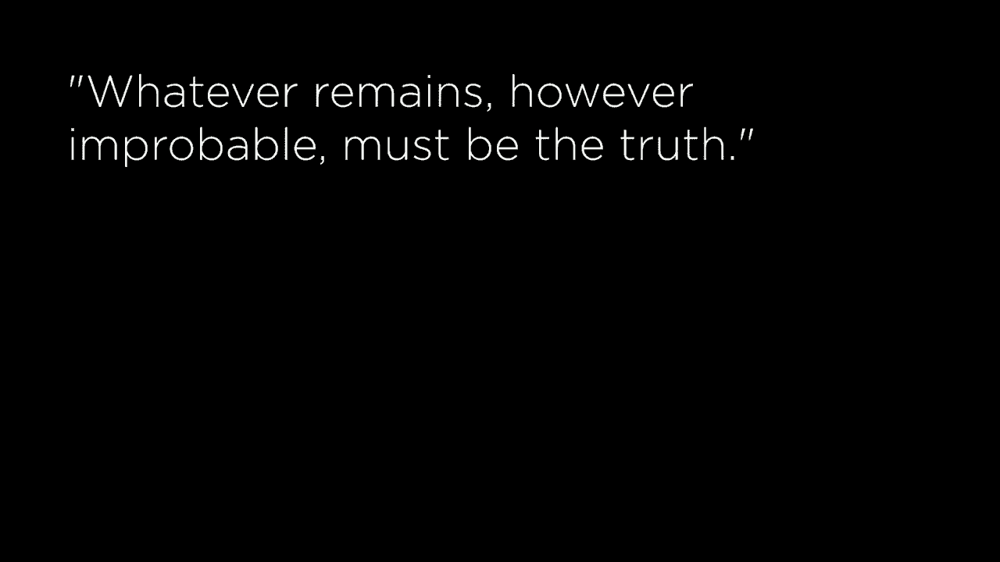

must be the truth how would I tokenize，this well the naive approach is just to。say anytime you see a space go ahead and，split it up we're gonna split up this。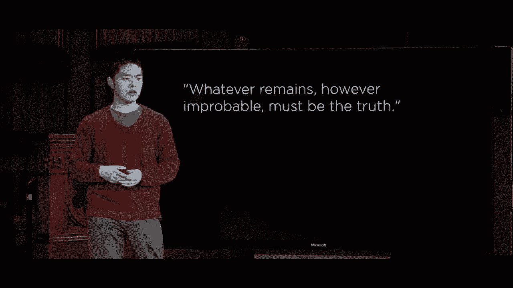

particular string just by looking for，spaces and what we get when we do that。is a sentence like this whatever remains，however improbable must be the truth but。what you'll notice here is that if we，just split things up in terms of where。the spaces are we end up like keeping，the punctuation around there's a comma。

after the word remains there's a comma，after improbable a period after truth。and this poses a a little bit of a，challenge when we think about trying to。tokenize things into individual words，because if you're comparing words to。each other this word truth with a period，after it if you just string compare it。

it's going to be different from the word，truth without a period after it and so。this punctuation can sometimes pose a，problem for us and so we might want some。way of dealing with it either treating，punctuation as a separate token。altogether or maybe removing that，punctuation entirely from our sequence。

as well so that might be something we，want to do but there are other cases。where it becomes a little bit less clear，o'clock，Sherlock Holmes stepped briskly into the。room well this apostrophe after 9，o'clock all right after the O in 9。o'clock is that something we should，remove should we split based on that as。

well in - oh and clock there are some，interesting questions there too and it。gets even trickier if you begin to think，about like hyphenated words something。like this where we have a whole bunch of，words that that are hyphenated and then。you need to make a judgment call is that，a place where you're going to split。

things apart into individual words or，are you going to consider frock-coat and。well-cut and pearl-grey to be individual，words of their own and so those tend to。post challenges that we need to somehow，deal with and something we need to。decide as we go about trying to perform，this kind of analysis similar challenges。

arise when it comes to the world of，sentence tokenization imagine this。sequence of sentences for example if you，take a look at this particular sequence。of sentences and you could probably，imagine you could extract the sentences。pretty readily here is one sentence and，here is a second sentence so we have two。

different sentences inside of this，particular passage，and the distinguishing feature seems to。be like the period that a period，separates one sentence from another and。maybe there are other types of，punctuation you might include here as。well an exclamation point for example or，a question mark but those are the types。

of punctuation that we know tend to come，at the end of sentences but it gets。trickier again if you look at a sentence，like this not just sure talking to。Sherlock but instead of talking to，Sherlock talking to mr。Holmes well now。we have a period at the end of mr。 and，so if you were just separating on。

periods you might imagine this would be，a sentence and then just Holmes would be。a sentence and then we'd have a third，sentence down below things do get a。little bit trickier as you start to，imagine these sorts of situations and。dialogue to notes to make this trickier，as well that if you have a these sorts。

of lines that are inside of something，that he said for example that he said。this particular sequence of words and，this particular sequence of words。they're interesting challenges that，arrives there too in terms of how it is。that we take the sentence and split it，up into individual sentences as well and。

these are just things that our algorithm，needs to decide in practice they're。usually some heuristics that we can use，and we know there are certain。occurrences of periods like the period，after mr。when other examples where we。know that is not the beginning of a new，sentence and so we can encode those。

rules into our AI to allow it to be able，to do this tokenization the way that we。wanted to so once we have these two，ability to tokenize a particular passage。take the passage split it up in，individual words from there we can begin。to extract what the engrams actually are，so we can actually take a look at this。

by going into a Python program that will，serve the purpose of extracting these。engrams and again we can use n ltk the，natural language toolkit in order to。help us here so we'll go ahead and go，into engrams and we'll take a look at。Engram spy and what we have here is we，are going to take some corpus of text or。

some sequence of documents and use all，those documents and extract what the。most popular engrams happen to be so in，order to do so we're going to head it go。ahead and load data from a directory，that we specify as a command that。argument will also take in a number n as，a command-line argument as well in terms。

of what our number should be in terms of，how many sequences words we're going to。look at in sequence then we're going to，go ahead and just count up all of the。NLT K dot Engram so we're gonna look at，all of the engrams across this entire。corpus and save it inside this variable，engrams and then we're gonna look at the。

most common ones and go ahead and print，them out and so in order to do so I'm。not only using NLT Kay and I'm also，using counter which is built into Python。as well where I can just count up how，many times do these various different，engrams。

appear so we'll go ahead and show that，will go into engrams and I'll say。something like python engrams and let's，just first look for the unigram。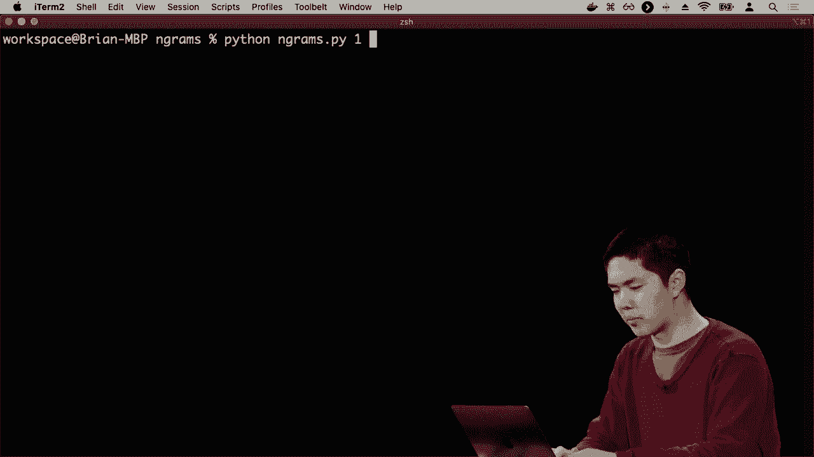

sequences of one word inside of a corpus，and the corpus that I've prepared is I。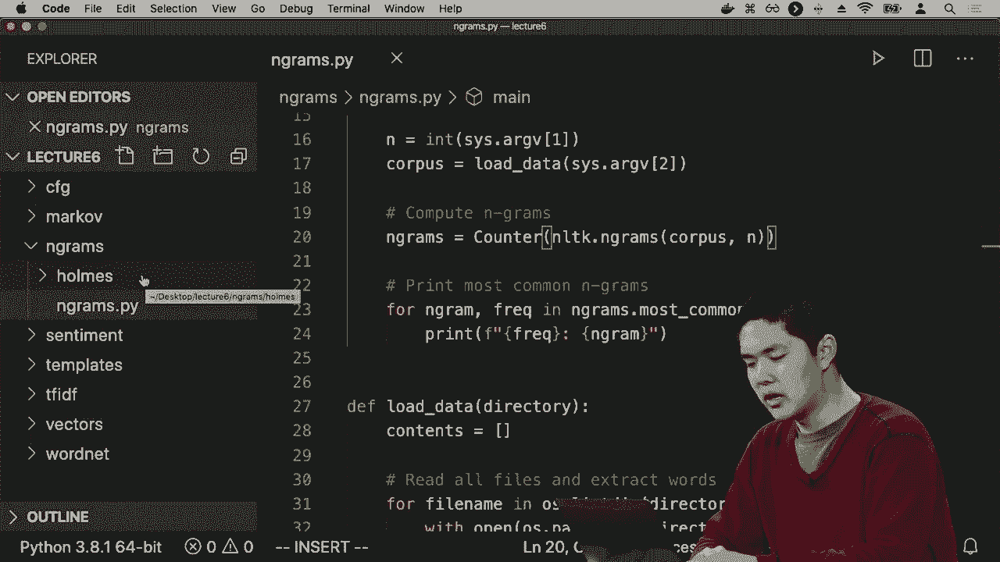

have all of the or some of these stories，from Sherlock Holmes all here where each。one is just you know one of the Sherlock，Holmes stories and so I have a whole。bunch of text here inside of this corpus，and I'll go ahead and provide that。corpus as a command-line argument and，now what my program is going to do is。

it's going to load all of the Sherlock，Holmes stories into memory or all the。ones that I've provided in this corpus，at least and it's just going to look for。the most popular unigram and those，popular sequences of one word and it。seems the most popular one is just the，word though used 97 hundred times and。

followed by I used five thousand times，and used about five thousand times the。kinds of words you might expect so now，let's go ahead and check for buy grams。for example and grams to Holmes and all，right again sequences of two words now。that appear multiple times of the in the，it was to the it is I have some one and。

so forth these are the types of bye，Gramps that happen to come up quite。often inside this corpus of an inside of，the Sherlock Holmes stories and it。probably is true across other corpuses，as well but we could only find out if we。actually test in it and now just for，good measure let's try one more maybe。

try three looking out for trigrams that，happen to show up and now we get like it。was one of the I think that out of these。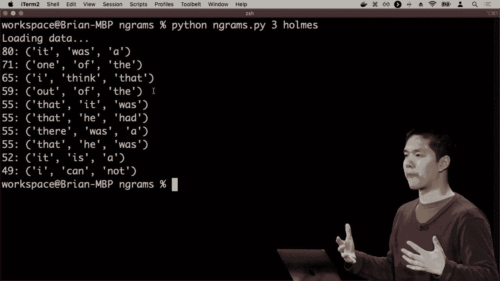

are sequences of three words now that，happen to come up multiple times across。