# 【双语字幕+资料下载】哈佛CS50-AI ｜ Python人工智能入门(2020·完整版) - P21：L6- 自然语言处理 2 (马尔可夫，词袋，朴素贝叶斯，信息检索，tf-idf) - ShowMeAI - BV1AQ4y1y7wy

happen to come up multiple times across。

this particular corpus so what are the，potential use cases here now we have。some sort of data we have data about how，often particular sequences of words show，up in。particular order and using that we can，begin to do some sort of predictions we。might be able to say that if you see the，words it was you know there's a。

reasonable chance the word that comes，after it should be the word a and if I。see the words one of it's reasonable to，imagine that the next word might be the。word the for example because we have，this data about trigram sequences of。three words and how often they come up，and now based on two words you might be。

able to predict what the third word，happens to be and one model we can use。for that is a model we've actually seen，before it's the Markov model recall。again that the Markov model really just，refers to some sequence of events that。

happen one time step after a one time，step where every unit has some ability。to predict what the next unit is going，to be or maybe the past two units。predict what the next unit is going to，be or the past three predict what the。next one is going to be and we can use a，Markov model and apply it to language。

for a very naive and simple approach at，trying to generate natural language at。getting our AI to be able to speak，English like text and the way it's going。to work is we're going to say something，like come up with some probability。distribution given these two words what，is the probability distribution over。

what the third word could possibly be，based on all the data if you see it was。what are the possible third words we，might have how often do they come up and。using that information we can try and，construct what we expect the third word。to be and if you keep doing this the，effect is that our Markov model can。

effectively start to generate text and。

be able to generate text that was not in，the original corpus but that sounds kind。of like the original corpus it's using，the same sorts of rules that the。original corpus was using so let's take，a look at an example of that as well。we're here now I have another corpus，that I have here and it is the corpus of。

all of the works of William Shakespeare，so I've got a whole bunch of stories。from Shakespeare and all of them are，just inside of this big text file and so。what I might like to do is look at what，all of the engrams are maybe look at all。the trigrams inside of Shakespeare text，and figure out given two words。

can I predict what the third word is，likely to be and then just keep。repeating this process I have two words，predict the third word then from the。second and the third word predict the，fourth word and from the third and。fourth word predict the fifth word，ultimately generating random sentences。

that sound like Shakespeare that are，using similar patterns of words that。Shakespeare used but that never actually，showed up in Shakespeare itself instead。to do so I'll show you generator dot Pi，which again is just going to read data。from a particular file and I'm using a，Python library called Markova Phi which。

is just going to do this process for me，so there are libraries out here that can。just train on a bunch of text and come，up with a Markov model based on that。text and I'm gonna go ahead and just。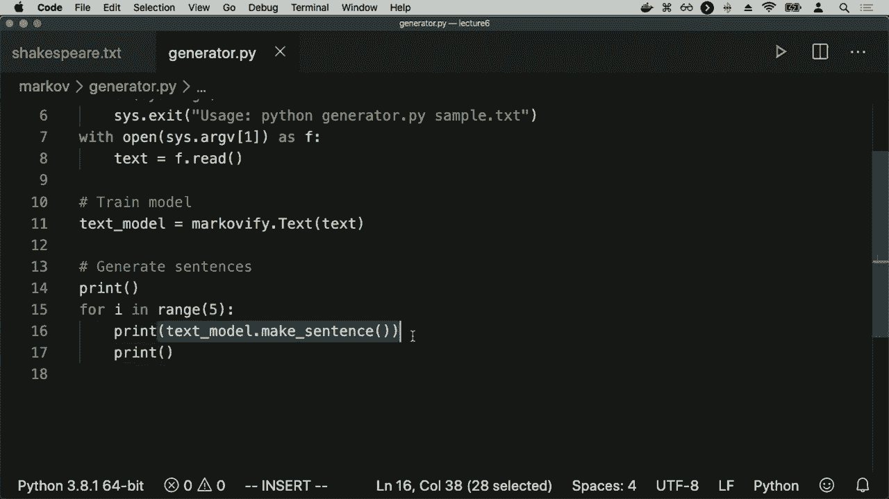

generate five randomly generated，sentences so we'll go ahead and go into。Markov I'll run the generator on，Shakespeare text what we'll see is it's。going to load that data and then here's，what we get we get you know five。different sentences and these are，sentences that never showed up in any。

Shakespeare play but that are designed，to sound like Shakespeare that are。designed to just take two words and，predict given those two words what would。Shakespeare have been likely to choose，as the third word that follows him and。you know these sentences probably don't，have any meaning it's not like the AI is。

trying to express any sort of underlying，meaning here it's just trying to。understand based on the sequence of，words what is likely to come after it。as a next word for example and these are，the types of sentences that it's able to。come up with just generating and if you，ran this multiple times and you would。

end up getting different results that I，could run this again then get an。entirely different set of five different，sentences that also are supposed to。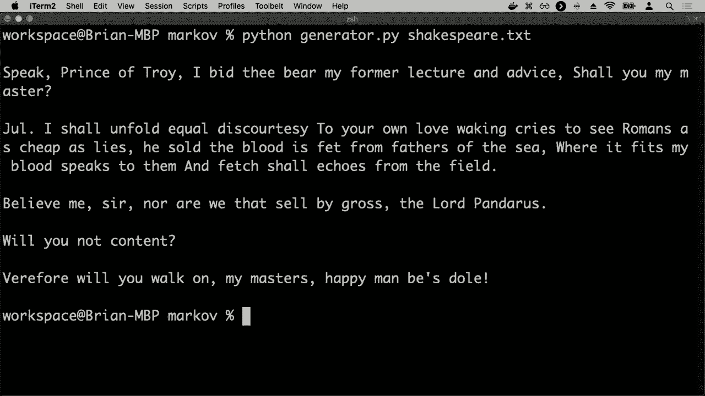

sound kind of like the way that，Shakespeare sentences sounded as well。and so that then was a look at how it is，we can use Markov models to be able to。naively attempt just generating language，the language doesn't mean a whole lot。right now you wouldn't want to use the，system in this current form to do。

something like machine translation，because it wouldn't be able to，encapsulate any meaning but we're。starting to see now that our AI is，getting a little bit better at trying to。speak our language or trying to be able，to process natural language in some sort，of meaningful way。so we'll now take a look at a couple of，other tasks that we might want our AI to。

be able to perform and one such task is，text categorization which really is just。

a classification problem and we've，talked about classification problems。already these problems where we would，like to take some object and categorize。it into a number of different classes。

and so the way this comes up in text is，anytime you have some sample of text and。you want to put it inside of a category，where I want to say something like given。an email does it belong in the inbox or，does it belong in spam like which of。these two categories does it belong in，and you do that by looking at the text。

and being able to do some sort of，analysis on that text to be able to draw。conclusions to be able to say that given，the words that show up in the email I。think this is probably belonging in the，inbox or I think it probably belongs in。spam instead and you might imagine doing，this for a number of different types of。

classification problems of this sort so，you might imagine that another common。example of this type of idea is，something like sentiment analysis where。I want to analyze given a sample of text，doesn't have a positive sentiment or。does it have a negative sentiment and，this might come up in the case of like。

product reviews on a website for example，or feedback on a website where you have。

a whole bunch of data samples of texts，that are provided by users of a website。and you want to be able to quickly，analyze are these reviews positive are。the reviews negative what is it the，people are saying just to get a sense。for what it is that people are saying to，be able to categorize texts into one of。

these two different categories so how。

might we approach this problem well，let's take a look at some sample product。reviews here are some sample product，reviews that we might come up with my。grandson loved it so much fun product，broke after a few days one of the best。games I've played in a long time kind of，cheap and flimsy not worth it right。

different product reviews that you might，imagine seeing on Amazon or Ebay or some。other website where people are selling，products for instance and we humans。could pretty easily categorize these，into positive sentiment or negative。sentiment we'd probably say that the，first and the third one those are。

positive sentiment messages the second，one and the fourth one those are。probably negative sentiment messages but，how，it try and take these reviews and assess。you know are they positive or are they，negative well ultimately it depends upon。the words that happen to be in this，particular these particular reviews。

inside of these particular sentences for，now we're going to ignore the structure。and how the words are related to each，other and we're just going to focus on。what the words actually are so they're，probably some key words here words like。loved and fun and best those probably，show up in more positive reviews。

whereas words like broke and cheap and，flimsy well those are words that。probably are more likely to come up，inside of negative reviews instead of。positive reviews so one way to approach，this sort of text analysis idea is to。say let's for now ignore the structures，of these sentences to say we're not。

gonna care about how it is the words，relate to each other we're not gonna try。and parse these sentences that，constructs their grammatical structure。like we saw a moment ago but we can，probably just rely on the words that。were actually used rely on the fact that，the positive review ISM are more likely。

to have words like best and loved and，fun and that the negative reviews are。more likely to have the negative words，that we've highlighted there as well in。this sort of model this approach to，trying to think about language is。generally known as the bag of words，model where we're going to model a。

sample of text not by caring about its。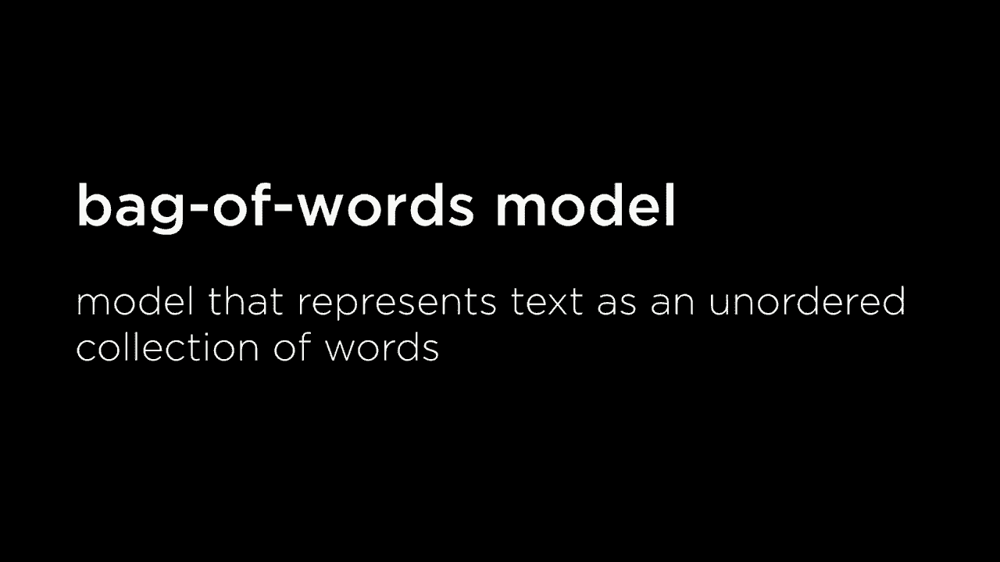

structure but just by caring about the，unordered collection of words that show。up inside of a sample that all we care，about is what words are in the text and。we don't care about what the order of，those words is we don't care about the。structure of the words we don't care，what nouns goes with what adjectives or。

how things agree with each other and we，just care about the words and it turns。out this approach tends to work pretty，well for doing classifications like。positive sentiment or negative sentiment，and you could imagine doing this in a。number of ways we've talked about，different approaches to trying to solve。

classification style problems but when，it comes to natural language one of the。most popular approach ISM is the naive，Bayes approach and this is one approach。to trying to analyze the probability，that something is you know positive。sentiment or negative sentiment or just，trying to categorize some text into。

possible categories and it doesn't just，work for text it works for other types。of ideas as well but it is quite popular，in the world of analyzing text and。natural language and the naivebayes，approach is based on Bayes rule which。you might recall back from when we，talked about probability that the Bayes。

rule looks like this that the，probability of some event B given a can。be expressed using this expression over，here probability of B given a is the。probability of a given B multiplied by，the probability of B divided by the。probability of a and we saw that this，came about as a result of just the。

definition of conditional independence，and looking at what it means for two。events to happen together，this was our formulation then of Bayes，rule which turned out to be quite。helpful we were able to predict one，event in terms of another by flipping。the order of those events inside of this，probability calculation and it turns out。

this approach is going to be quite，helpful and we'll see why in a moment。for being able to do this sort of，sentiment analysis because I want to say。you know what is the probability that a，message is positive or what is the。probability that the message is negative，and I'll go ahead and simplify this just。

using the emojis just for simplicity，like probability of positive probability。of negative and that is what I would，like to calculate but I'd like to。calculate that given some information，given information like here is a sample。of text my grandson loved it and I would，like to know not just what is the。

probability that any message is positive，but what is the probability that the。message is positive given my grandson，loved it as the text of the sample so。given this information that inside the，sample are the words my grandson loved。it what is the probability then that，this is a positive message well。

according to the bag of words model what，we're going to do is really ignore the。ordering of the words not treat this as，like a single sentence that has some。structure to it but just treat it as a，whole bunch of different words we're。gonna say something like what is the，probability that this is a positive。

message given that the word my was in，the message given that the word grandson。was in the message given that the word，loved within the message and given the。word it was in the message the bag of，words model here we're treating the。entire symp sample as just a whole bunch，of different words and so this then is。

what I'd like to calculate this，probability probability given although。words what is the probability that this，is a positive message and this is where。we can now apply Bayes rule this is，really the probability of some be given。some a and that now is what I'd like to。

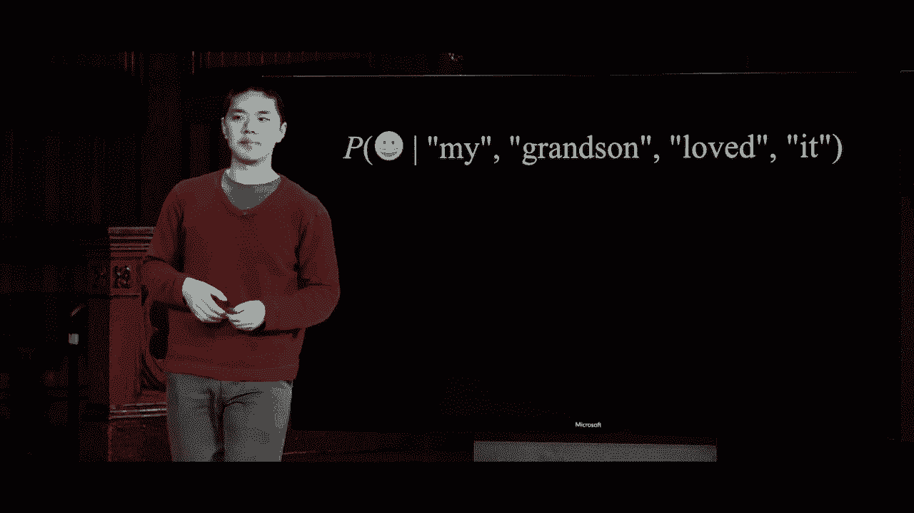

calculate so we're according to Bayes，rule this whole expression is equal to。well it's the probability I switch the，order of them it's the probability of。all of these words given that it's a，positive message multiplied by the。probability that is a positive message，divided by the probability of all of。

those words so this then is just an，application of Bayes rule we've already。seen where I want to express the，positive probability of positive given。the words as related to somehow the，probability of the words given that it's。a positive message and it turns out that，is you might recall back when we talked。

about probability that this denominator，is going to be the same regardless of。whether we're looking at positive or，negative messages the probability of。these words doesn't change because we，don't have a positive or negative down。below so we can just say that rather，than just say that this expression up。

here is equal to this expression down，below it's really just proportional to。just the numerator we can kind of ignore，the denominator for now using the。denominator would get us an exact，probability but it turns out that what。we're really just do is figure out what，the probability is proportional to and。

at the end we'll have to normalize the，probability distribution make sure the。probability distribution ultimately sums，up to the number one so now I've been。able to formulate this probability which，is what I want to care about is。proportional to multiplying these two，things together probability of words。

given positive message multiplied by the，probability of positive message but。again if you think back to our，probability rules we can calculate this。really as just a joint probability of，all of these things happening that the。probability of a positive message，multiplied by the probability of these。

words given the positive message well，that's just the joint probability of all。of these things this is the same thing，as the probability that it's a positive。message and my is in the sentence or in，the message and grandson is in the，sample and love。in the sample and it is in the sample so，using that rule for the definition of。

joint probability I've been able to say，that this entire expression is now。proportional to this sequence this joint，probability of these words and this。positive that's in there as well and so，now the interesting question is just how。to calculate that joint probability how，do I figure out the probability that。

given some arbitrary message that it is，positive and the word my is in there and。the word grandson is in there and the，word loved is in there and the word it。is in there well you'll recall that we，can calculate a joint probability by。multiplying together all of these，conditional probabilities multiplying if。

I want to know the probability of a and，B and C I can calculate that as the。probability of a time's the probability，of B given a time's the probability of C。given a and B I can just multiply these，conditional probabilities together in。order to get the overall joint，probability that I care about and we。

could do the same thing here I could say，let's multiply the probability of。positive by the probability of the word，my showing up in the message given that。it's positive multiplied by the，probability of grandson showing up in。the message given that the word my is in，there and that it's positive multiplied。

by the probability of loved given these，three things multiplied by the。probability of it given these four，things and that's gonna end up being a。fairly complex calculation to make one，that we probably aren't gonna have a。good way of knowing the answer to like，what is the probability that grandson is。

in the message given that it is positive，and the word my is in the message that's。not something we're really gonna have a，readily easy answer to and so this is。where the naive part of naive Bayes，comes about we're gonna simplify this。notion rather than compute exactly what，that probability distribution is we're。

going to assume that these words are，going to be effectively independent of。each other if we know that it's already，a positive message that if it's a。positive message it doesn't change the，probability that the word grandson isn't。the message if I know that the word，loved isn't the message for example and。

that might not necessarily be true in，practice in the real world it might not。be the case that these words are，actually independent，but we're going to assume it to simplify。our model and it turns out that，simplification still lets us get pretty。good results out of it as well，and so what we're going to assume is。

that the probability that all of these，words show up depend only on whether。it's positive or negative I can still，say that loved is more likely to come up。in a positive message than a negative，message which is probably true but we're。also going to say that it's not going to，change whether or not loved is more。

likely or less likely to come up if I，know that the word my is in the message。for example and so those are the，assumptions that we're going to make so。while top expression is proportional to，this bottom expression we're going to。say it's naively proportional to this，expression probability of being a。

positive message and then for each of，the words that show up in the sample I'm。going to multiply what's the probability，that my isn't the message given that。it's positive times the probability of，grandson being in the message given that。it's positive and then so on and so，forth for the other words that happen to。

be inside of the sample and it turns out，that these are numbers that we can。calculate the reason we've done all of，this math is to get to this point to be。able to calculate this probability of，distribution that we care about given。these terms that we can actually，calculate and we can calculate them。

given some data available to us and this，is what a lot of natural language。processing is about these days it's，about analyzing data if I give you a。whole bunch of data with a whole bunch，of reviews and I've labeled them as。positive or negative then you can begin，to calculate these particular terms I。

can calculate the probability that a，message is positive just by looking at。my data and saying all right how many，positive samples were there and divide。that by the number of total samples that，is my probability that a message is。positive what is the probability that，the word loved is in the message given。

that it's positive well I can calculate，that based on my data to let me just。look at how many positive samples have，the word loved in it and divide that by。my total number of positive samples and，that will give me an approximation for。what is the probability that love is，going to show up inside of the review。

given that we know that the review is，positive and so this then allows us to。be able to calculate these probabilities，so let's not actually do this，calculation let's calculate。for the sentence my grandson loved it is，that a positive or negative review how。could we figure out those probabilities，well again this up here is the。

expression we're trying to calculate and，I'll give you here the data that is。available to us and the way to interpret，this data in this case is that of all of。the messages forty-nine percent of them，were positive and fifty-one percent of。them were negative maybe online reviews，tend to be a little bit more negative。

than they are positive or at least based，on this particular data sample that's。what I have and then I have，distributions for each of the various。different words that given that it's a，positive message how many positive。messages had the word my in them you，know it's about 30% and for negative。

messages how many of those had the word，my in them about 20% so it seems like。the word my comes up more often in，positive messages at least slightly more。often based on this analysis here，grandson for example maybe that showed。up in 1% of all positive messages and 2%，of all negative messages had the word。

grandson in it the word loved showed up，in 32% of all positive messages 8% of。all negative messages for example and，then the word it showed up in 30% in。positive messages 40% of negative，messages again this arbitrary data here。just for example but now we have data，with which we can begin to calculate。

this expression so how do I calculate，multiplying all these values together。well it's just going to be multiplying，probability that's positive times the。probability of my given positive times，the probability of grandson given。positive so on and so forth for each of，the other words and if you do that。

multiplication multiply all of those，values together you get this point 0 0 0。1 4 1 1 2 by itself this is not a，meaningful number but it's going to be。meaningful if you compare this，expression the probability that it's。positive times the probability of all of，the words given that I know that the。

message is positive and compare it to，the same thing but for negative。sentiment messages instead I want to，know the probability that it's a。negative message times the probability，of all of these words given them it's a。negative message and so how might I do，that well to do that you just multiply，probability。

negative times all of these conditional，probabilities and if I take those five。values multiply all of them together，then what I get is this value for。negative point zero zero zero zero six，five to eight again in isolation not a。particularly meaningful number what is，meaningful is treating these two values。

as a probability distribution and，normalizing them making it so that both。of these values and sum up to one the，way a probability distribution should。and we do so by like adding these two up，and then dividing each of these values。by their total - in order to be able to，normalize it and when we do that when we。

normalize this probability distribution，you end up getting something like this。positive point six eight three seven，negative point three one six three it。seems like we've been able to conclude，that we are you know about 68% confident。we think there's a probability of 0。68，that this message is a positive message。

my grandson loved it and why are we 68，percent confident well it seems like。we're more confident than not because，the word loved showed up in 32% of。positive messages but only 8% of，negative messages so that was a pretty。strong indicator and for the others well，it's true that like the word it showed。

up more often in negative messages it，wasn't enough to offset that love shows。up far more often in positive messages，than negative messages and so this type。of analysis is how we could apply naive，Bayes we've just done this calculation。and we end up getting not just a，categorization of positive or negative。

but I get some sort of confidence that，like what do I think the probability is。that it's positive and I can say you，know I think it's positive with this。particular probability and so naive，Bayes can be quite powerful at trying to。achieve this using just this bag of，words model where all I'm doing is。

looking at what words show up in the，sample I'm able to draw these sorts of。conclusions now one potential drawback，something that you'll notice pretty。quickly if you start applying this rule，exactly as is is what happens depending。on if zeroes are inside this data，somewhere let's imagine for example this。

same sentence my grandson loved it but，let's instead imagine that this value。here instead of being point zero one，with zero meaning inside of our dataset。it has never before happened that in a，positive message the word grandson。showed up and that's certainly possible，you know if I have a pretty small。

dataset it's probably likely that not，all the messages are gonna have the word。grandson maybe it is the case that no，positive messages have ever had the word。grandson in it at least in my dataset，but if it is the case that 2 percent of。the negative messages have still had the，word grandson in it then we run into an。

interesting challenge and the challenge，is this when I multiply all of the。positive numbers together and multiply，all the negative numbers together to。calculate these two probabilities what I，end up getting is a positive value of。zero point zero zero zero I get pure，zeros because when I multiply all of。

these numbers together when I multiply，something by zero it doesn't matter what。the other numbers are the result is，going to be zero and the same thing can。be said of negative numbers as well so，this then would seem to be a problem。that because grandson has never showed，up in any of the positive messages。

inside of our symbol we're able to say，we seem to be concluding that there is a。zero percent chance that the message is，positive and therefore it must be。negative because in the only cases where，we've seen the word grandson come up is。inside of a negative message and in，doing some we've totally ignored all of。

the other probabilities that a positive，message is much more likely to have the。word loved in it because we've，multiplied by zero which just means none。of the other probabilities can possibly，matter at all so this then is a。challenge that we need to deal with it，means that we're likely not going to be。

able to get the correct results if we，just purely use this approach and it's。for that reason there are a number of，possible ways we can try and make sure。that we never multiply something by zero，it's okay to multiply something by a。small number because then it can still，be counterbalanced by other larger。

numbers but multiplying by zero sort of，means it's the end of the story you。multiply a number by zero and the output，is going to be zero no matter how big。any of the other numbers happened to be，so one approach that's fairly common in。naive Bayes is this idea of additive，smoothing adding some value alpha to。

each of the values in our distribution，just to smooth the data a little bit one。such approach is called Laplace moving。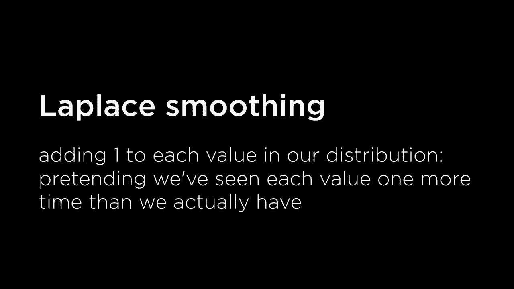

which basically just means adding one to，each value in our distribution so if I，have。100 samples and 0 of them contain the，word grandson well then I might say that。you know what instead let's pretend that，I've seen had one additional sample。where the word grandson appeared and one，additional sample where the word。

grandson didn't appear so I'll say that，all right now I have 1 out of 102 so one。sample that does have the word grandson，out of 102 total I'm basically creating。two samples that didn't exist before but，in order in doing so I've been able to。smooth the distribution a little bit to，make sure that I never have to multiply。

anything by 0 by pretending I've seen，one more value in each category than I。actually have and this gets us at result，of that it's not having to worry about。multiplying a number by 0 so this then，is an approach that we can use in order。to try and apply naive Bayes even in，situations where we're dealing with。

words that we might not necessarily have，seen before and let's now take a look at。how we could actually apply that in，practice that it turns out that MLT came。in addition having the ability to，extract engrams and tokenize things into。words also has the ability to be able to，apply naive Bayes on some samples of。

text for example and so let's go ahead，and do that what I've done is inside of。sentiment I've prepared a corpus of just，you know reviews that I have generated。but you could imagine using real reviews，or I just have a couple of positive。reviews it was great so much fun would，recommend my grandson loved it those。

sorts of messages and then I have a，whole bunch of negative reviews not。worth it kind of cheap really bad didn't，work the way we expected just one in。each line a whole bunch of positive，reviews and negative reviews and what。I'd like to do now is analyze them，somehow so here then is sentiment dot pi。

and what we're going to do first is，extract all of the positive and negative。sentences create a set of all of the，words that were used across all of the。messages and then we're going to go，ahead and train NLT K is naive Bayes。classifier on all of this training data，and what the training data effectively。

is if I take all of the positive，messages and give them the label。positive all the negative messages and，give them the label negative and then。I'll go ahead and apply this classifier，to it where I'd say I would like to take。all of this training data and now have，the ability to classify it as positive，or negative。

I'll then take some input from the user，they can just type in some sequence of。words and then I would like to classify，that sequence as either positive or。negative and then I'll go ahead and，print out what the probabilities of each。happen to be and there are some helper，functions here that just organize things。

in the way that ltk is expecting them to，be but the key idea here is that I'm。taking the positive messages labeling，them taking the negative messages。labeling them putting them inside of a，classifier and then now trying to。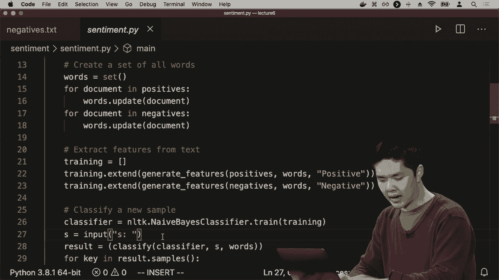

classify some new text that comes about，so let's go ahead and try it I'll go。ahead and go into sentiment and we'll，run Python sentiment passing in as input。that corpus that contains all of the，positive and negative messages because。depending on the corpus that's going to，affect the probabilities the。

effectiveness of our ability to classify，is entirely dependent on how good our。data is and how much data we have and，how well they happen to be labeled so。now I can try something and say like try，review like this was great just some。review that I might leave and it seems，that all right there is a 96% chance。

that estimates that this was a positive，message 4% chance that it was a negative。likely because the word grape shows up，inside of the positive messages but。doesn't show up inside of the negative，messages and that might be something。that our AI is able to capitalize on and，really what it's going to look for are。

the differentiating words that if the，probability of words like this and was。is pretty similar between positive and，negative words then the naive Bayes。classifier isn't going to end up using，those values as having some sort of。importance in the algorithm because if，they're the same on both sides and you。

multiply that value for both positive，and negative you end up getting about。the same thing what ultimately makes the，difference in naive Bayes is when you。multiply by a value that's much bigger，for one category than for another。category when one word like great is，much more likely to show up in one type。

of message than another type of message，and that's one of the nice things about。naive Bayes that without me telling it，that great is more important to care。about than this or was naive Bayes can，figure that out based on the data it can。figure out that this shows up about the，same amount of time between the two but。

great that is a discriminator a word，that can be different between the two。types of messages so I could try it，again type in a sentence like lots of。fun for example all right this one it's，a little less，sure about 62% chance that is positive。37% chance that it's negative maybe，because there aren't as clear。

discriminators or differentiators inside，of the state up I'll try one more say。like kind of overpriced and all right，now 95% 96% sure that this is a negative。sentiment likely because of the word，overpriced because it's shown up in a。negative sentiment expression before and，therefore things you know what this is。

probably going to be a negative sentence，and so now you've base has now given us。the ability to classify text given，enough training data given enough。examples we can train our AI to be able，to look at natural language human words。figure out which words are likely to，show up and positive as opposed to。

negative sentiment messages and，categorize them accordingly and you。could imagine doing the same thing，anytime you want to take text and group。it into categories if I want to take an，email and categorize that as email or as。a good email or as a spam email you，could apply a similar idea try and look。

for the discriminating words the words，that make it more likely to be a spam。email or not and just train a naive，Bayes classifier to be able to figure。out what that distribution is and to be，able to figure out how to categorize an。email as good or a spam now of course，it's not going to be able to give us a。

definitive answer it gives us a，probability distribution something like。63% positive and 37% negative and that，might be why our spam filters and our。emails sometimes make mistakes sometimes，think that a good email is actually spam，or vice versa。because ultimately the best that it can，do is calculate a probability。

distribution these natural language is，ambiguous we can usually just deal in。the world of probabilities to try and，get an answer that is reasonably good。even if we aren't able to guarantee for，sure that it is the number that we。actually expect for it to be so that，then was a look and how we can begin to。

take some text and to be able to analyze，the text and group it into some sorts of。categories but ultimately in addition，just being able to analyze text and。categorize it we'd like to be able to，figure out information about the text。get at some sort of meaning out of the，text as well and this starts to get us。

in the world of information of being，able to try and take data in the form of。text and retrieve information from it so，one type of problem is known as。information retrieval or ir which is the，task of like finding relevant documents。in response to a query so this is，something like you type in a query into。

a search engine like Google or you're，typing in something into some system。that's going to look for inside of a，library catalog for example that's going。to look for responses to a query I want，to look for documents that are about you。know the US Constitution or something，and I would like to get a whole bunch of。

documents that match that query，back to me but you might imagine that。what I really want to be able to do is，in order to solve this task effectively。I need to be able to take documents and，figure out what are those documents。about I want to be able to say like what，is it that these particular documents。

are about one of the topics of those，documents so that I can then more。effectively be able to retrieve，information from those particular。documents and this refers to a set of，tasks generally known as topic modeling。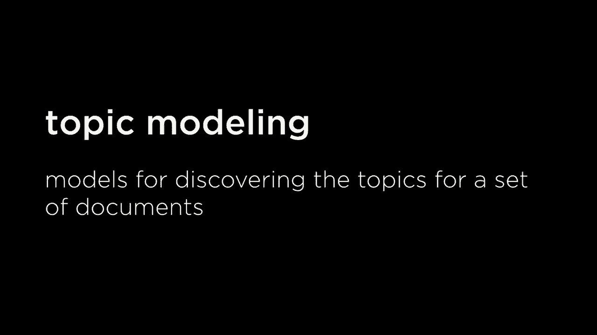

where I'd like to discover what the，topics are for a set of documents and。this is something that humans could do a，human could read a document and tell you。alright here's what this document is，about and give maybe a couple of topics。for who are the important people in this，document what are the important objects。

in the document can probably tell you，that kind of thing but we like for AI to。be able to do the same thing like given，some document can you tell me what the。important words in this document are，what are the words that set the stock。unit apart that I might care about if，I'm looking up documents based on。

keywords for example and so one，instinctive idea and intuitive idea that。

probably makes sense is let's just use，term frequency term frequency is just。defined as the number of times a，particular term appears in a document if。I have a document with a hundred words。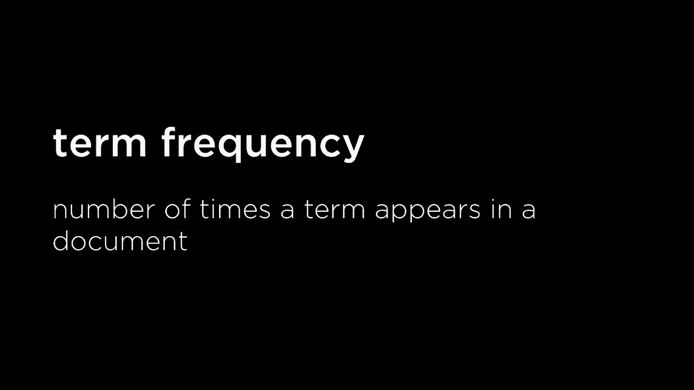

and you know one particular word shows，up ten times it has a term frequency of。ten all right it shows up pretty often，maybe that's going to be an important。word and sometimes you'll also see this，frames is like a proportion of the total。number of words so ten words out of 100，maybe it has a term frequency of 0。1。

meaning like 10 percent of all of the，words are this particular word that I。care about ultimately that doesn't，change relatively how important they are。for any one particular document but，they're the same idea the idea is look。for words that show up more frequently，because those are more likely to be the。

horton words inside of a corpus of。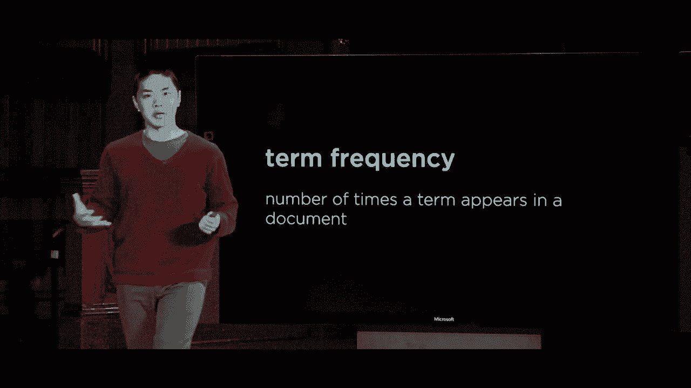

documents and so let's go ahead and give，that a try let's say I wanted to find。out what the Sherlock Holmes stories are，about I have a whole bunch of Sherlock。Holmes stories and I want to know in，general what are they about what are the。important characters who are the，important what are the important objects。

what are the important parts of this，story just in terms of words and I'd。like for the AI to be able to figure，that that on its own and will do so by。looking at term frequency by looking at，what are the words that show up the most。often so we'll go ahead and I'll go，ahead and go into the tf-idf directory。

you'll see why it's called that in a，moment though let's first open up TF 0。pi which is going to calculate the top，10 term frequencies or maybe top 5 term。frequencies for a corpus of documents a，whole bunch of documents where each。document is just a story from Sherlock，Holmes we're going to load all the data。

into your corpus we're gonna figure out，what are all of the words that show up。inside of that corpus and we're going to，basically just assemble all of the。number of the term frequencies we're，gonna calculate how often do each of。these terms appear inside of the，document and we'll print out the top。

size and so there are some data，structures involved that you can take a。look at if you'd like Jim the exact code，is not so much important is the idea of。what we're doing we're taking each of，these documents and extracting first。sorting them we're saying like take all，the words that show up and sort them by。

how often each word shows up and let's，go ahead and just for each document save。at the top 5 terms that happen to show，up in each of those documents so again。some helper functions you can take a。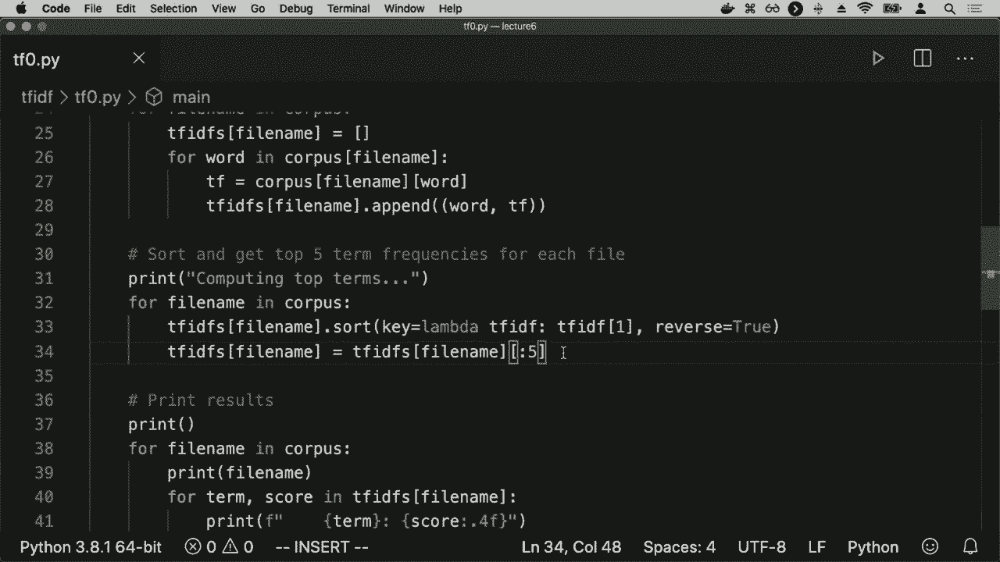

look at if you're interested but the key，idea here is that all we're going to do。is run T of 0 on the Sherlock Holmes，stories and what I'm hoping to get out。of this process is I am hoping to figure，out what are the important words in。Sherlock Holmes for example so we'll go，ahead and run this and see what we get。

and it's loading the data and here's，what we get for this particular story。the important words are the and and an i，and ii and of those are the words that。show up more frequently in this，particular story gets the and and an i，and a and of。all right this is not particularly，useful to us like we're using term。

frequencies we're looking at what words，show up the most frequently in each of。these various different documents but，what we get naturally are just the words。that show up a lot in English like the，word the' and of and and happen to show。up a lot in english and therefore they，happen to show up a lot in each of these。

various different documents this is not，a particularly useful metric for us to。be able to analyze what words are，important because these words are just。part of the grammatical structure of，english and it turns out we can。categorize words into a couple of，different categories these words happen。

to be known as what we might call，function words functions the words that。have little meaning on their own but，that are used to grammatically connect。different parts of a sentence these are，words like am and buy and do when is and。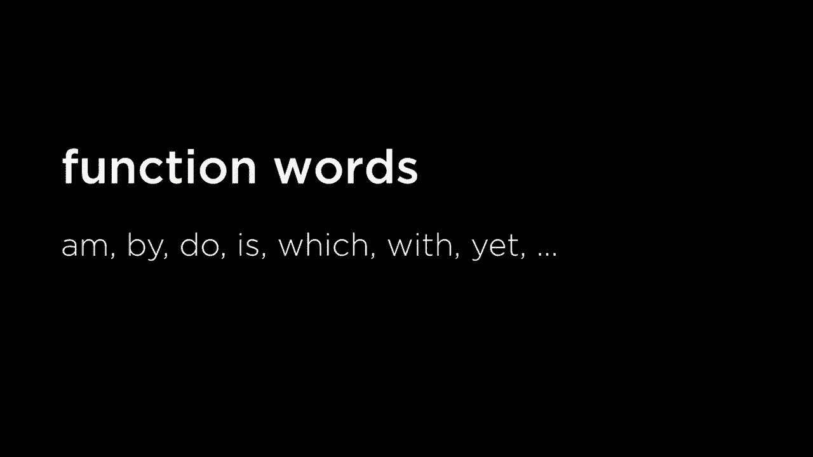

which and with and yet words that on，their own like what do they mean it's。hard to say they get their meaning from，how they connect to different parts of。the sentence and these function words。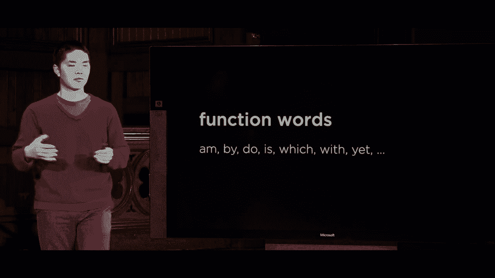

are what we may call a closed class of，words in a language like English there's。really just some fixed list of function，words and they don't change very often。there's just some list of words that are，commonly used to connect other。grammatical structures in the language，and that's in contrast with what we。

might call content words words that，carry meaning independently words like。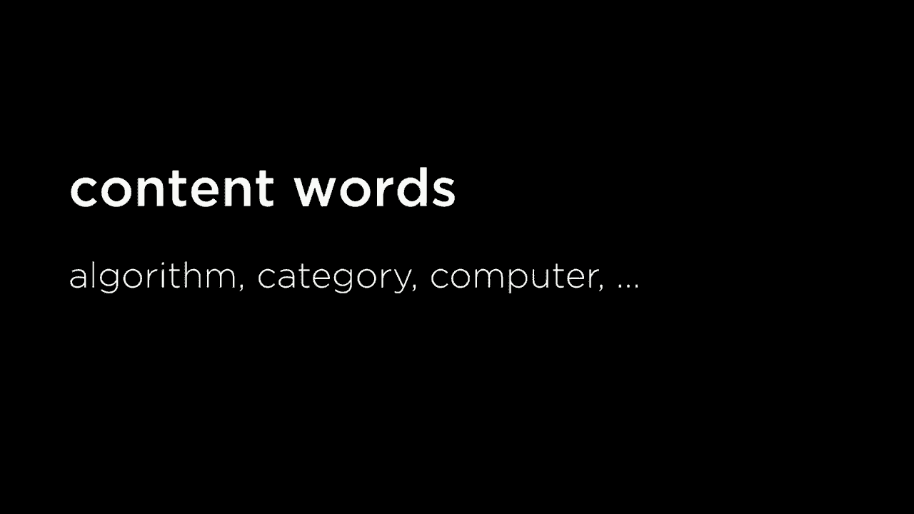

algorithm category computer words that，actually have some sort of meaning and。these are usually the words that we care。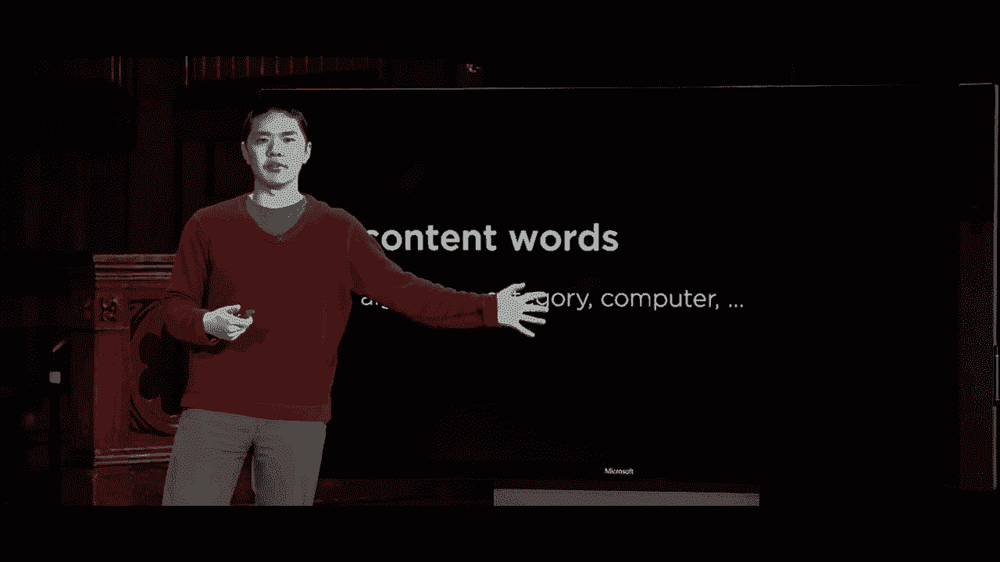

about these are the words where we want，to figure out you know what are the。important words in a document we，probably care about the content words。more than we care about the function，words and so one strategy we could apply。is just ignore all of the function words，so here in TF one dot pi I've done the。

same exact thing except I'm going to，load a whole bunch of words from a。functions words dot text file inside of，which are just a whole bunch of function。words in alphabetical order these are，just a whole bunch of function words。that are just words that are used to，connect other words in English and。

someone has just compiled this，particular list and these are the words。that I just want to ignore if any of，these words let's just ignore it as one。of the top terms because these are not，words that I probably care about if I。want to analyze what the important terms，inside of a document happen to be。

so in tf-idf one what we're Altima doing，is if the word is in my set of function。words I'm just going to skip over it，just ignore any of the function words by。continuing on to the next word and then，just calculating the frequencies for。those words instead so I'm gonna pretend。

the function words aren't there and now，I see maybe I can get a better sense for。what terms are important in each of the，various different Sherlock Holmes。stories so now let's run T f1 on the，sherlock holmes corpus and see what we。get now and let's look at like what is，the most important term in each of the。

story ISM well it seems like for each of，the stories all right the most important。word is holes I guess that's what we，would expect they're all Sherlock Holmes。stories and Holmes is not a function，word it's not the or a or an so it。wasn't ignored but Holmes and man like，these are probably not what I mean when。

I say what are the important words even，though Holmes does show up the most。often it's not giving me a whole lot of，information here about what each of the。different Sherlock Holmes stories are，actually about and the reason why is。because Sherlock Holmes shows up in all，the stories and so it's not meaningful。

for me to say that like this story is，about Sherlock Holmes if I want to try。and figure out the different topics，across the corpus of documents what I。really want to know is you know what，words show up in this document that show。up less frequently in the other，documents for example and so to get at。

that idea we're going to introduce the，notion of inverse document frequency。inverse document frequency is a measure，of how common or rare a word happens to。be across an entire corpus of words and，mathematically it's usually calculated。like this as the logarithm of the total。

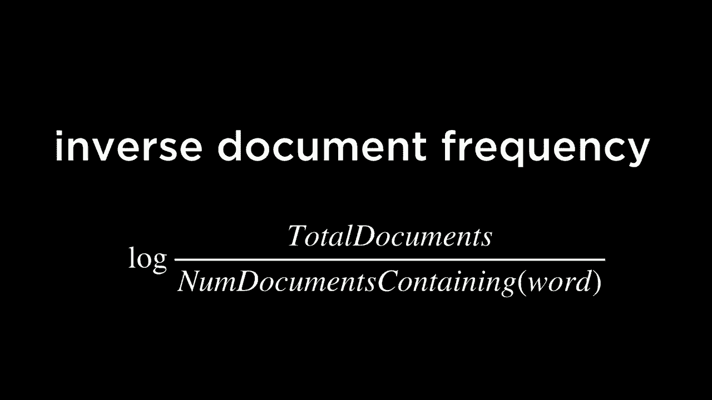

number of documents divided by the，number of documents containing the word。so if a word like Holmes shows up in all，of the documents，well then total documents is a you know。however many documents there are a，number of documents containing Holmes is。going to be the same number so when you，divide these two together you'll get one。

and the logarithm of 1 is just 0 and so，what we get is if Holmes shows up in all。of the documents it has an inverse，document frequency of 0 and you can。think now of inverse document frequency，as a measure，of you know how rare is the word that。shows up in this particular document，then if a word doesn't show up across。

many documents at all this number is，going to be much higher and this then。gets us at our model known as tf-idf，which is a method for ranking what words。are important in a document by，multiplying these two ideas together。multiplied term frequency or TF by。

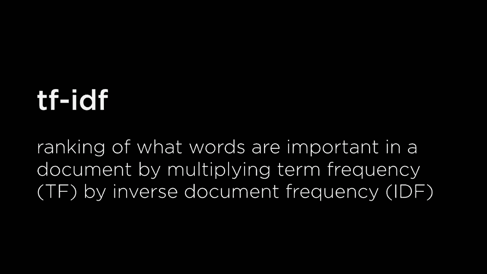

inverse document frequency or I D F，where the idea here now is that how。important a word is depends on two，things it depends on how often it shows。up in the document using the heuristic，that if a word shows up more often it's。probably more important and we multiply，that by inverse document frequency IDF。

because if the word is rarer but it，shows up in the document it's probably。more important than if the word shows up，across most or all of the documents。because then it's probably a less，important factor in what the different。topics across the different documents in，the corpus happened to be and so now。

let's go ahead and apply this algorithm，on the Sherlock Holmes corpus and here。is tf-idf now what I'm doing is for each，of the documents for each word I'm。calculating its TF score term frequency，multiplied by the inverse document。frequency of that word not just looking，at the single value but multiplying。

these two values together in order to，compute the overall values and now if I。run tf-idf on the holmes corpus this is，going to try and get us a better。approximation for what's important in，each of the stories and it seems like。it's trying to extract here probably，like the names of characters that happen。

to be important in the story characters，that show up in this story that don't。show up in the other story and in，prioritizing the more important。characters that happen to show up more，often and so this then might be a better。analysis of what types of topics are。

more or less important I also have，another corpus which has a corpus of all。

of the Federalist Papers from American，history if I go ahead and run tf-idf on。the Federalist Papers we can begin to，see what the important words in each of。the various different Federalist Papers，happen to be that in Federalist paper。number 61 seems like it's a lot about，about the set。

and impeachments you can start to，extract what the important terms and。what the important words are just by，looking at what things show up across。and don't show up across many of the，documents but show up frequently enough。in certain of the documents and so this，can be a helpful tool for trying to。

figure out this kind of topic modeling，figuring out what it is that a。particular document happens to be about，and so this then is starting to get us。into this world of semantics like what，it is that things actually mean when。we're talking about language now we're，not going to think about like the bag of。

words when we just say treat a sample of，text just dressed a whole bunch of words。