# 【双语字幕+资料下载】哈佛CS50-AI ｜ Python人工智能入门(2020·完整版) - P22：L6- 自然语言处理 3 (信息抽取，词网，word2vec) - ShowMeAI - BV1AQ4y1y7wy

and we don't care about the order now，when we get into the world of semantics。we really do start to care about what it。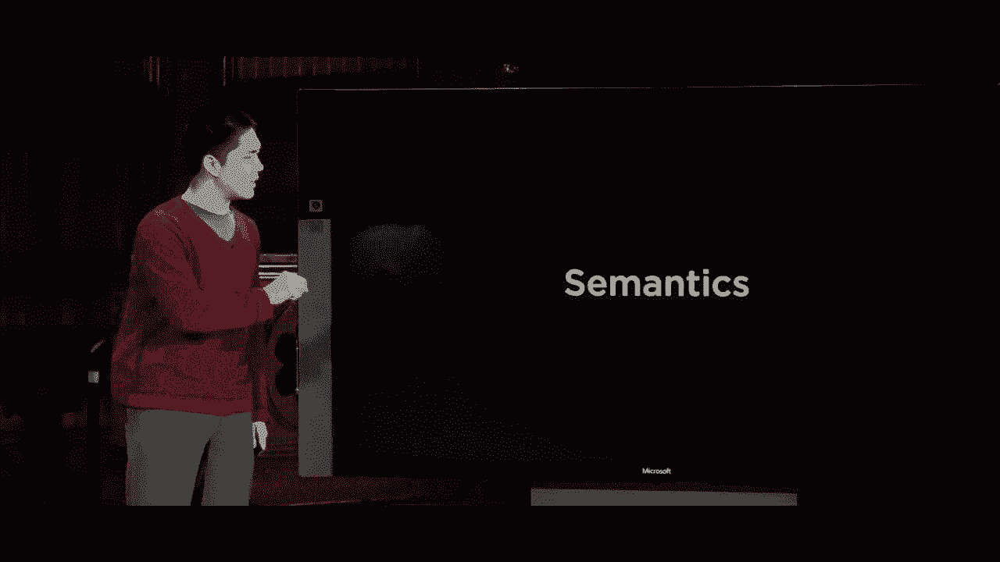

is that these words actually mean how it，is these words relate to each other and。in particular how we can extract，information out of that text information。extraction is somehow extracting，knowledge from our documents figuring。out given a whole bunch of text can we，automate the process of having an AI。

look at those documents and get out what。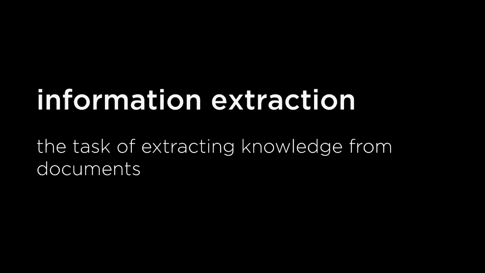

they useful or relevant knowledge inside，those documents happens to be so let's。take a look at an example I'll give you，two samples from news articles here up。above is a sample of a news article from，the Harvard Business Review。there was about Facebook down below is，an example of a Business Insider article。

from 2018 that was about Amazon and。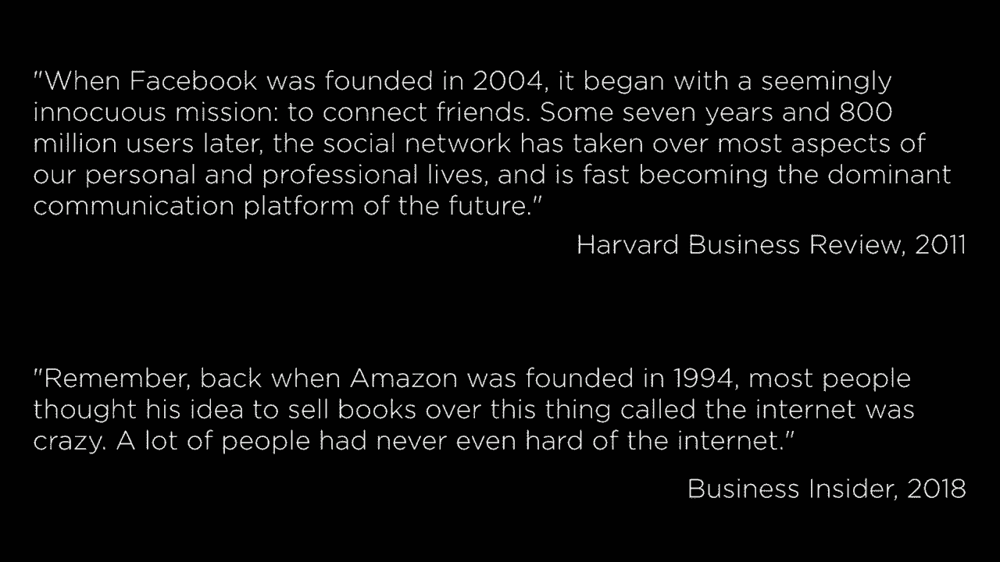

there's some information here that we，might want an AI to be able to extract。information knowledge about these，companies we might want to extract and。in particular what I might want to，extract is let's say I want to know data。about when companies were founded but I，want to know that Facebook was founded。

in 2004 and was on founded in 1994 that，that is important information that I。happen to care about well how do I，extract that information from the text。what is my way of being able to，understand this text and figure out all。right Facebook was founded in 2004 well，what I can look for are templates or。

patterns seen seen things that happen to，show up across multiple different。documents that give me some sense for，what this knowledge happens to mean and。we'll notice is a common pattern between，both of these passages which is this。phrasing here when Facebook was founded，in 2004 comma，and then down below when Amazon was。

founded in 1994 ，and those two templates end up giving us，a mechanism for trying to extract。information that this notion when，company was founded in year comma this。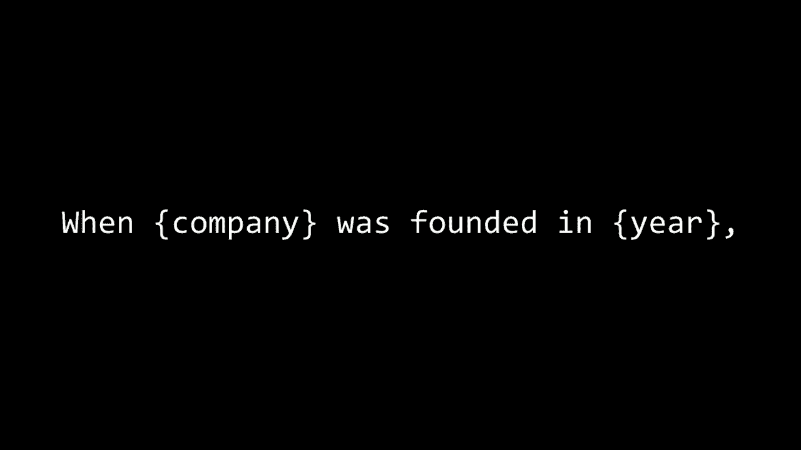

can tell us something about when a，company was founded because if we set。our a I loose on the web let it look at，a whole bunch of papers or a whole bunch。of article ism and it finds this pattern，when blank was founded in blank comma。well then our a I can pretty reasonably，conclude there's a good chance that this。

is going to be like some company and，this is going to be like the year that。company was founded for example might，not be perfect but at least it's a good。heuristic and so you might imagine that，if you wanted to train an AI to be able。to look for information you might give，the AI templates like this not only give。

it a template like when company blank，was founded in blank but give it like。the book blank was written by a blank，for example just give it some templates。where it can search the web search a，whole big corpus of documents looking。for templates that match that and if it，finds that then it's able to figure out。

all right here's the company and here's，the year but of course that requires us。to write these templates it requires us，to figure out like what is the structure。of this information likely going to look，like and it might be difficult to know。that different websites are of course，going to do this differently this type。

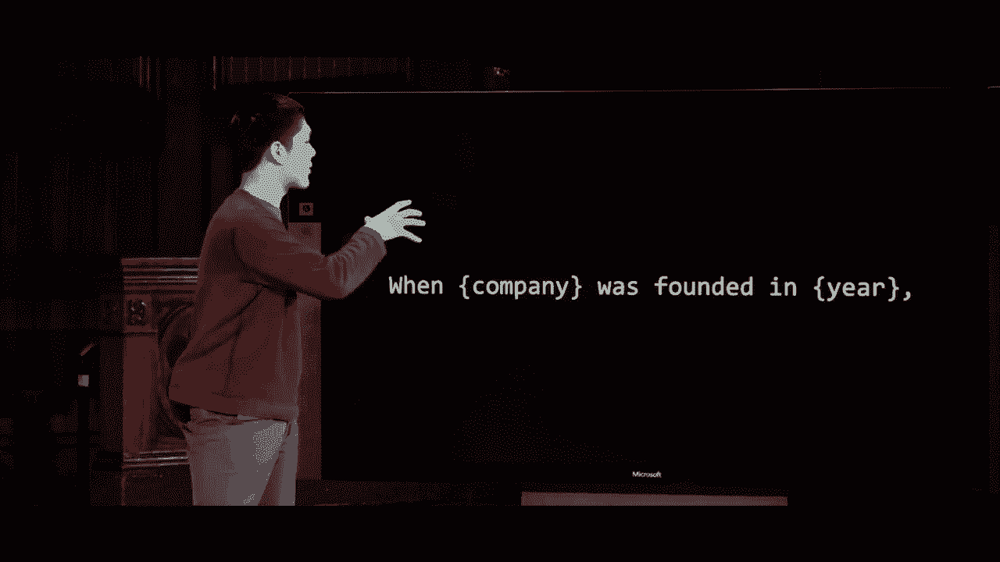

of method isn't going to be able to，extract all of the information because。if the words are slightly in a different，order it won't match on that particular。template but one thing we can do is。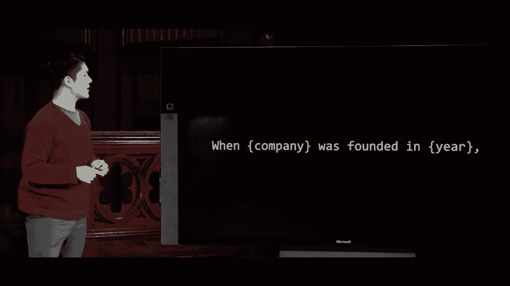

rather than give our AI the template we，can give a I'd the data we can tell the。AI you know Facebook was founded in 2004，and Amazon was founded in 1994 and just。how the AI those two pieces of，information and then set the AI loose on。the web and now the idea is that the AI，can begin to look for where to Facebook。

in 2004 show up together where to Amazon，in 1994 show up together and it can。discover these templates for itself it，can discover that this kind of phrasing。when blank was founded in blank tends to，relate Facebook to 2004 and it relates。Amazon to 1994 so maybe it will hold the，same relation for others as well and。

this ends up being this kind of，automated template generation ends up。being quite powerful and we'll go ahead，and take a look at that now as well what。I have here inside of templates，directory is a file called company in。CSV and this is all of the data that I，am going to give to my AI I'm gonna give。

it the pair Amazon 1994 and Facebook，2004 and what I'm going to tell my a AI。to do is search a corpus of documents，for other data these pears like this。other relationships I'm not telling the，eye that this is a company and the date。that it was founded I'm just giving it，Amazon 1994 and Facebook 2004 and。

letting the AI do the rest and what the，AI is going to do is it's going to look。through my corpus here's my corpus of，documents and it's gonna find like。inside of Business Insider that we have，sentences like back when Amazon was。founded in 2004 comma and that kind of，phrasing is going to be similar to like。

this Harvard Business Review story that，has a sentence like when Facebook was。founded in 2004 and it's going to look，across a number of other documents for。similar types of patterns to be able to，extract that kind of information and。

what it'll do is if I go ahead and run，I'll go ahead and go into templates so。I'll say Python search PI I'm going to，look for the data like the data in。company of CSV inside of the company's，directory which contains a whole bunch。of news articles that I've curated in，advance and here's what I get Google in。

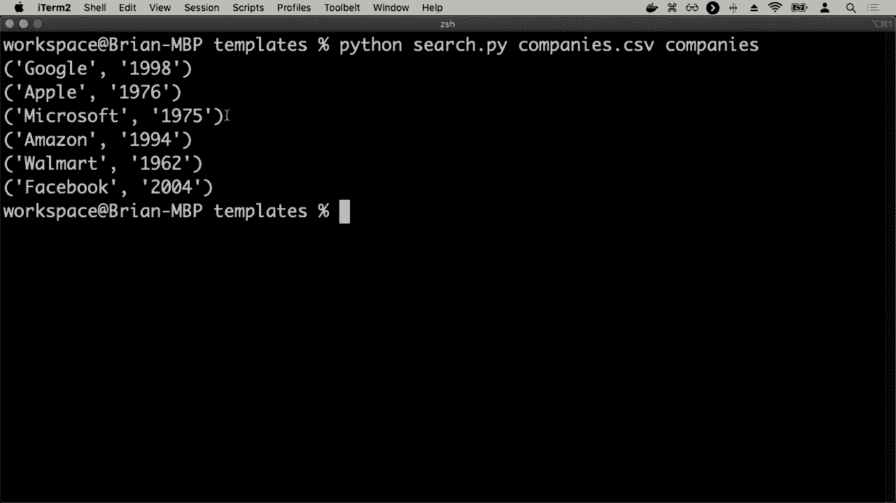

1998 Apple 976 Microsoft 1975 so on and，so forth Walmart 1962 for example these。are all of the pieces of data that，happened to match that same template。that we were able to find before and how，was it able to find this well it's。probably because if we look at like the，Forbes article for example that it has a。

phrase in it like when Walmart was，founded in 1962 comma that it's able to。identify these sorts of patterns and，extract information from them now。granted I have curated all these stories，in advance in order to make sure that。there is data that is able to match on，and in practice it's not always going to。

be in this exact format when you're，seeing a company of related to the year。in which it was founded but if you give，the AI access to enough data like all of。the data of text on the internet and，just have the AI crawl the internet。looking for information it can very，reliably or with some probability try。

and extract information you，these sorts of templates and be able to。generate interesting sense of knowledge，and the more knowledge it learns the。more new templates is able to construct，looking for constructions that show up。in other locations as well so let's take，a look at another example。

then I'll here show you president's CSV，where I have two presidents and their。inauguration dates are George Washington，1789 Barack Obama 2009 for example and I。also am going to give to our AI a corpus，that just contains a single document。which is the Wikipedia article for the，list of presidents of the United States。

for example just information about。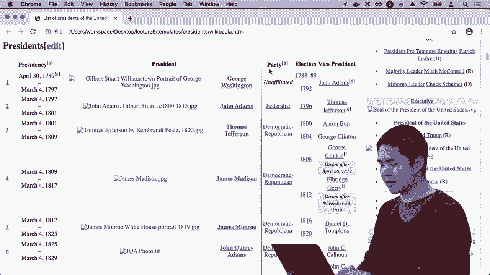

presidents and I'd like to extract from，this like raw HTML document on a web。page information about the President so，I can say search in president's ESV。president's and what I get is a whole，bunch of data about presidents and what。year they were likely inaugurated in by，looking for patterns that matched Barack。

Obama 2009 for example looking for these，sorts of patterns that happen to give us。some clues as to what it is that a story，happens to be about so here's another。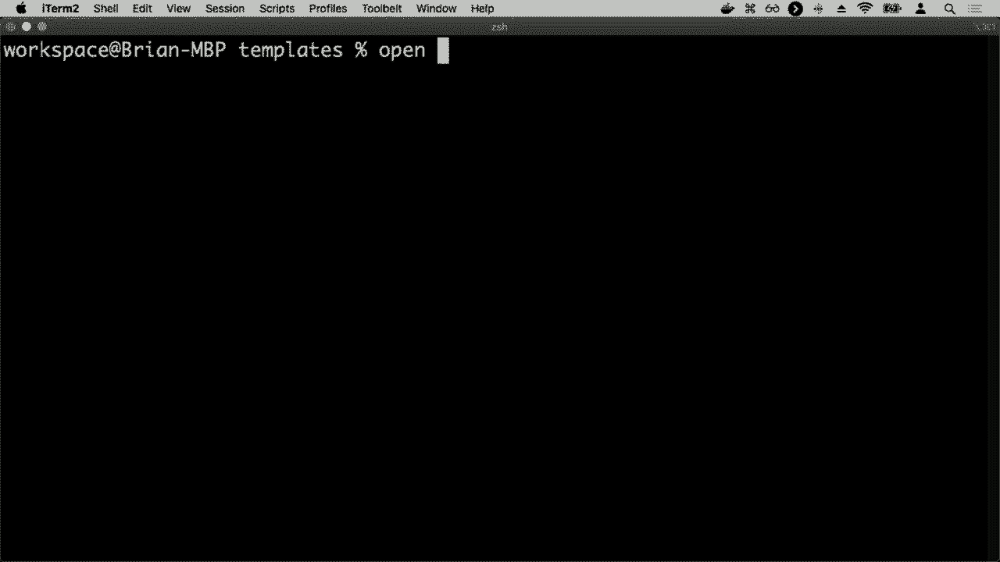

example if I open up inside the Olympics，here is a scrape version of the Olympic。homepage that has information about，various different Olympics and maybe I。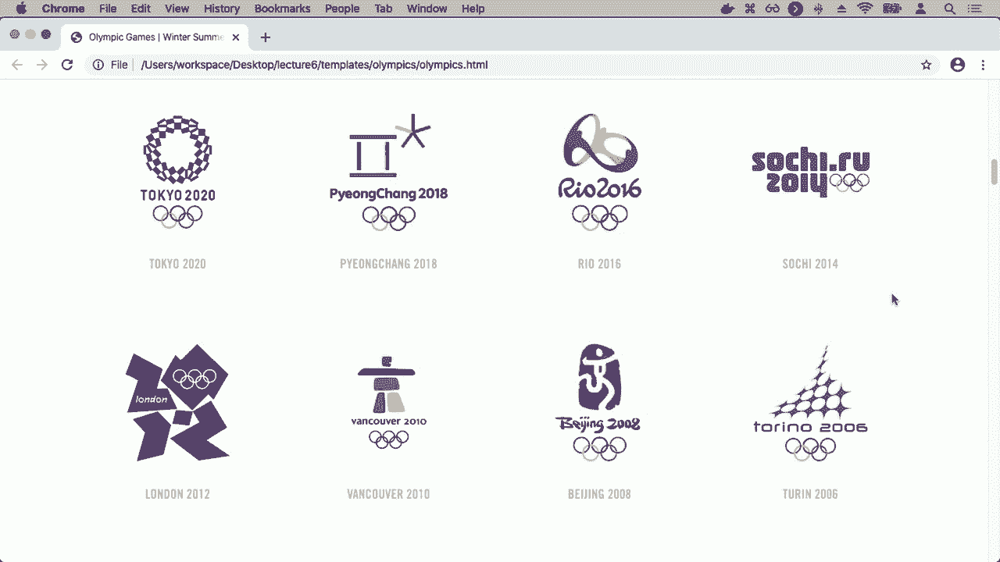

want to extract like Olympic locations，and years from this particular page。well the way I can do that is using the，exact same algorithm I'm just saying。alright here are two Olympics and where。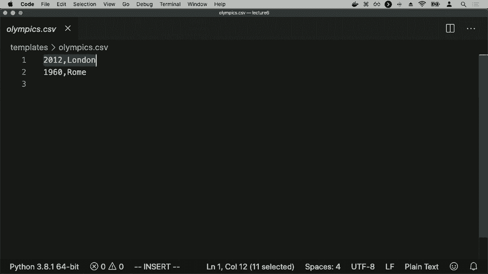

they were located so 2012 London for，example let me go ahead and just run in。this process Python search on Olympics，CSV look at all the Olympic data set and。here I get some information back now，this information not totally perfect。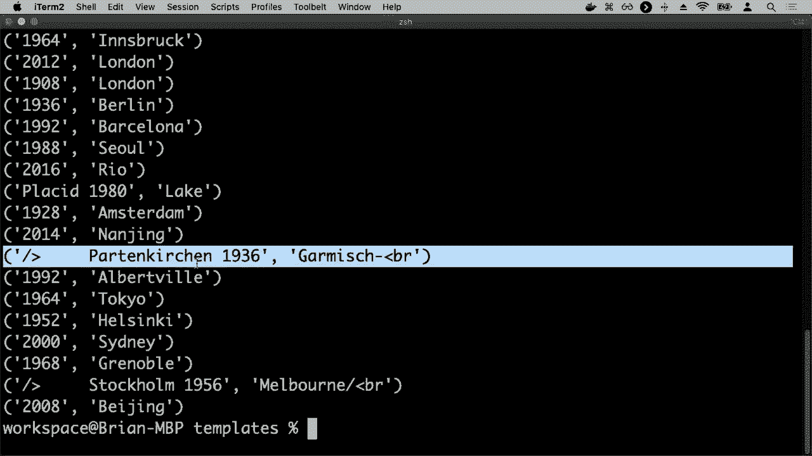

there are a couple of examples that are，obviously not quite right because my。template might have been a little bit，too general like maybe it was looking。for a broad category of things and，certain strange things happen to capture。on that particular template so you can，imagine adding rules to try and make。

this process more intelligent making，sure the thing on the left is just a。year for example for instance and doing，other sorts of analysis but purely just。based on some data we are able to，extract some interesting information。using some algorithms and all search pi，is really doing here is it is taking my。

corpus of data finding templates that，match it，here I'm filtering down to just look up。like the top two templates that happen，to match and then using those templates。to extract results from the data that I，have access to being able to look for。all the information that I care about，and that's ultimately what's going to。

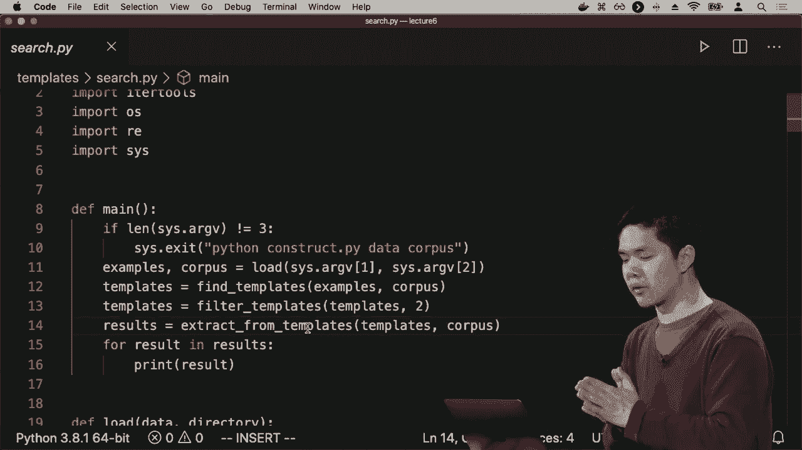

help me to print out those results to，figure out what the matches happen to be。and so information extraction is another，powerful tool when it comes towards。trying to extract information but of，course it only works in very limited。context it only works when I'm able to，find templates that look exactly like。

this in order to come up with some sort。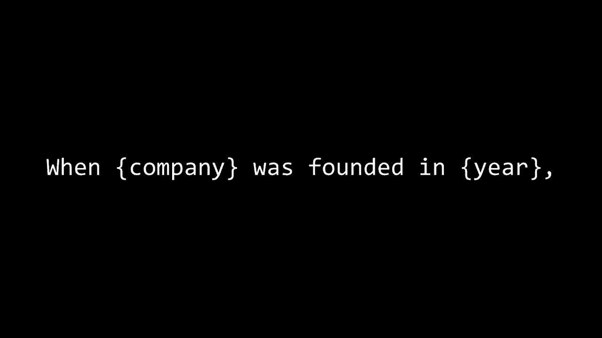

of match that is able to connect this to，some pair of data that this company was。founded in this year what I might want，to do is we start to think about the。semantics of words and is to begin to，imagine some way of coming up with。definitions for all words being able to，relate all of the words in a dictionary。

to each other because that's ultimately，what's going to be necessary if we want。our AI to be able to communicate we need，some representation of what it is that。words mean and one approach of doing，this as famous data set called word net。and word net is is the human curated，researchers have curated together a。

whole bunch of words their definitions。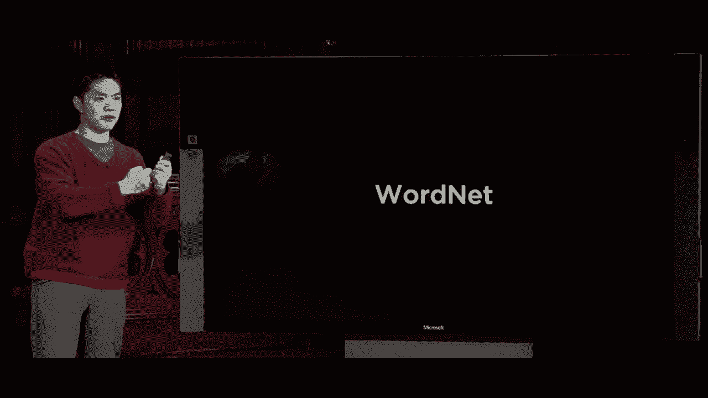

their various different senses because a，word might have multiple different。meanings and also how those words relate。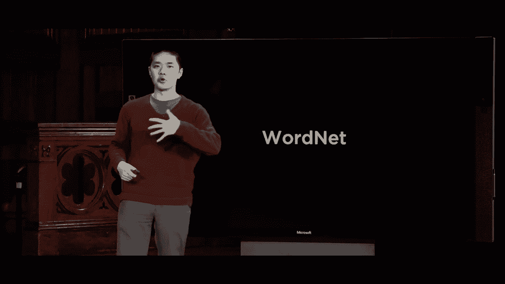

to one another and so what we mean by，this is I can show you an example of。word net word net comes built into n ltk，using NLT k you can download and access。word net and so let me go into word net，and go ahead and run word net and。extract information about a word a word，like city for example go to impress。

return and here is the information that，I get back about a city it turns out。that city has three different senses，three different meanings according to。word net and it's really just kind of，like a dictionary where each sense is。associated with its meaning just some，definition provided by human and then。

it's also got categories for example，that a word belongs to that a city is a。type of municipality a city is a type of，administrative district and that allows。me to relate words to other words so one，of the powers of wordnet is the ability。to like take one word and connect it to，other related words that we might be。

able to say for example if I do another，example let me try the word house。since I'll type in the word house and，see what I get back well all right the。house is a kind of building the house is，somehow related to like a family unit。and so you might imagine trying to come，up with these various different ways of。

describing houses it is a building and，as a dwelling and researchers have just。curated this these relationships between，these various different words to say。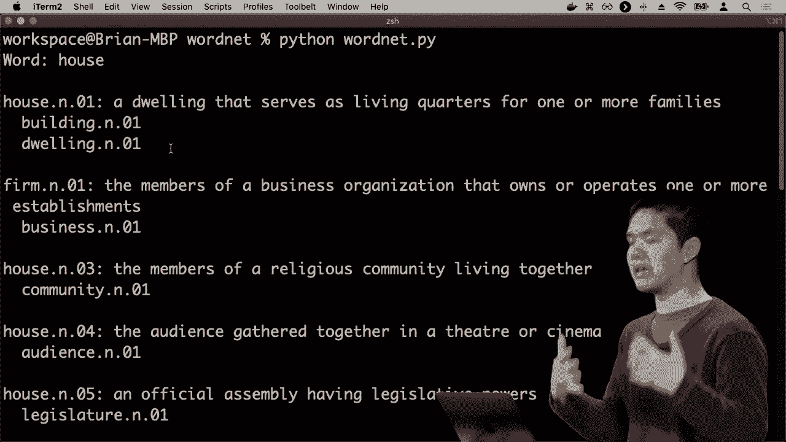

that a house is a type of building that，a house is a type of dwelling for。example but this type of approach while，certainly helpful for being able to。relate words to one another doesn't，scale particularly well as you start to。think about language changing as you，start to think about all the various。

different relationships that words might，have to one another this challenge of。word representation ends up being，difficult but what we've done is just。defined a word yes just like a sentence，that explains what it is that that word。is but what we really would like in some，way to represent the meaning of a word。

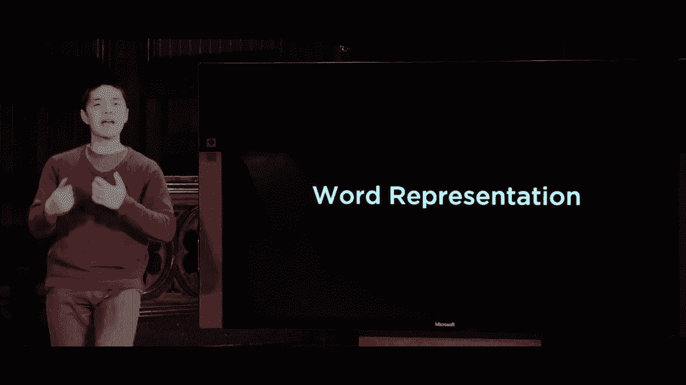

in a way that our AI is going to be able，to do something useful with that anytime。we want our AI to be able to look at，text and really understand what that。text means to relate text and words to，similar words and understand the。relationship between words we'd like，some way that a computer can represent。

this information and what we've seen all，throughout the course multiple times now。is the idea that when we want our AI to，represent something it can be helpful to。have the AI represent it using numbers，that we've seen that we can represent。utilities in a game like winning or，losing or drawing as a number one。

negative one or two zero we've seen，other ways that we can take data and。turn it into like a vector of features，where we just have a whole bunch of。numbers that represent some particular，piece of data and if we ever want to。pass words into a neural network for，instance to be able to say given some。

word translate this sentence into，another sentence or to be able to do。interesting classifications with neural，networks on individual words we need。some representation of words just in，terms of vectors way to represent two。words just by using individual numbers，do we do that，how do we take words and turn them into。

vectors that we can use to represent the，meaning of those words well one way is。to do this if I have four words and I，want to encode like he wrote a book。I can just say let's let the word he be，this vector 1 0 0 0 wrote will be 0 1 0。2 0 a will be 0 0 1 0 book will be 0 0 0，1 effectively what I have here is what's。

known as a one hot representation or a，one hot encoding which is a。representation of meaning where meaning。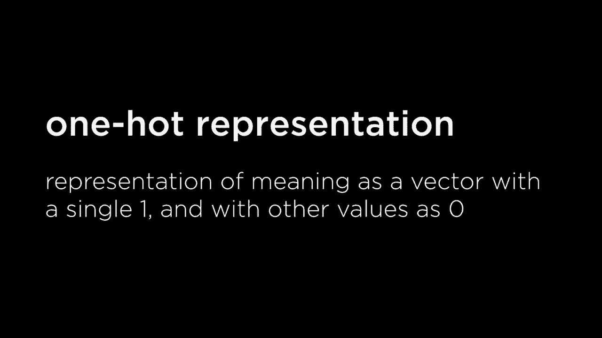

is a vector that has a single one in it，and the rest are zeros the location of。the 1 tells me the meaning of the word，that one in the first position that。means he 1 in the second position that，means wrote and every word in the。dictionary is going to be assigned to，some representation like this where we。

just assign one place in the vector that，has a 1 for the word and 0 for the other。words and now I have representations of，words that are different for a whole。bunch of different words this is this，one hot representation so what are the。drawbacks of this why is this not，necessarily a great approach well here。

I'm only creating enough vectors to，represent four words in a dictionary。if you imagine a dictionary with you，know 50，000 words that I might want to。represent now these vectors get enormous，ly long these are 50，000 dimensional。vectors to represent a vocabulary of，50，000 words that you know he is 1。

followed by all these wrote has a whole，bunch of zeros in it that's not a。particularly tractable way of trying to，represent numbers if I'm gonna have to。deal with you know vectors of length，50，000 another problem a subtler problem。is that ideally I'd like for these，vectors to somehow represent meaning in。

a way that I can extract useful，information out of that if I have the。sentence he wrote a book and he authored，a novel well wrote and authored are。going to be two totally different，vectors and book and novel are going to。be two totally different vectors inside，of my vector space that have nothing to。

do with each other the one is just，located in a different position and。really what I would like to have happen，is for wrote and authored to have。vectors that are similar to one another，and for book and novel to have vector。representations that are similar to one，another because they're words that have。

similar meanings because their meanings，are similar ideally I'd like for when I。put them in vector form and use a vector，to represent meaning，I would like for those vectors to be。similar to one another as well so rather，than this one hot representation where。we represent a words meaning by just，giving it a vector that is 1 in a。

particular location what we're going to，do which is a bit of a strange thing the。first time you see it is what we're，going to call a distributed。representation we are going to represent，the meaning of a word as just a whole。bunch of different values not just a，single one in the rest zeroes but a。

whole bunch of values so for example in，he wrote a book he might just be a big。vector maybe it's 50 dimensions maybe，it's a hundred dimensions but certainly。less than like tens of thousands where，each value is just you know some number。in same thing for wrote an A and book，and the idea now is that using these。

vector representations I'd hope that，wrote and authored have vector。representations that are pretty close to，one another their distance is not too。far apart and same with the vector，representations for book and novel so。this is going to be the goal of a lot of，what statistical machine learning。

approaches the natural language，processing is about is using these。vector representations of words but how，on earth do we define a word is just。like a whole bunch of these sequences of，numbers like what does it even mean to。like talk about the meaning of a word，well to answer the question the famous。

quote that answers this question is from，a British linguist on the 1950s jr。Firth who said you shall know a word by。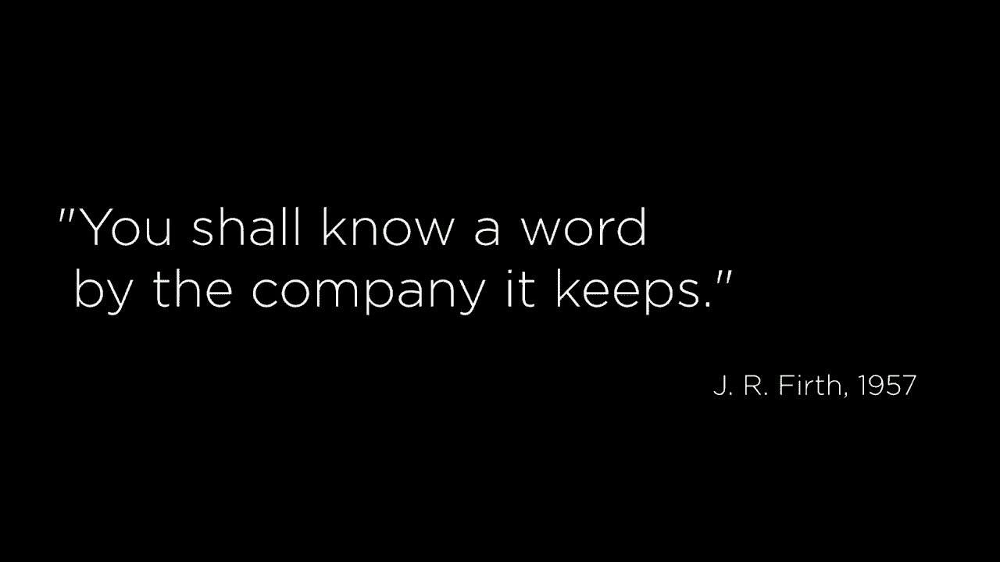

the company it keeps you shall know a，word by the company it keeps and what we。mean by that is the idea that we can，define a word in terms of the words that。show up around it that we can get at the，meaning of a word based on the context。in which that word happens to appear and，that if I have a sentence like this for。

words and sequence for blank he ate what，goes in the blank。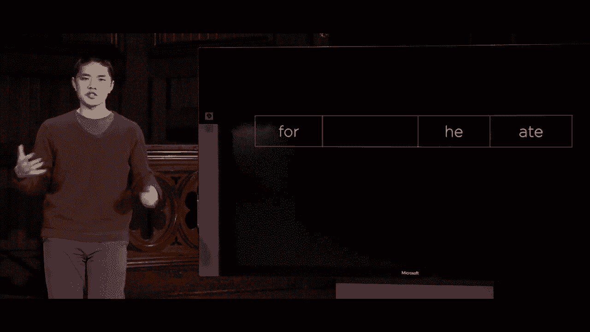

well you might imagine that in English，the types of words that might fill the。blank are words like breakfast or lunch，or dinner these are the kinds of words。that fill in that blank and so if we，want to define you know what does lunch。or dinner mean we can define it in terms，of what words happen to show up around。

it that if a word shows up in a，particular context and another word。happens to show up in very similar，context then those two words。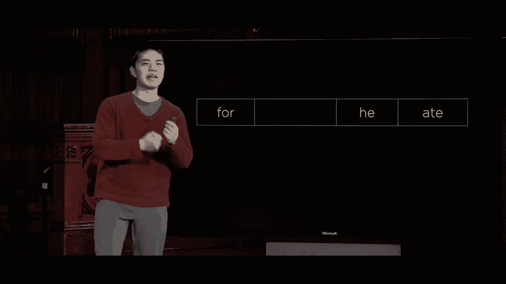

are probably related to each other they，probably have a similar meaning to one。another and this then is the。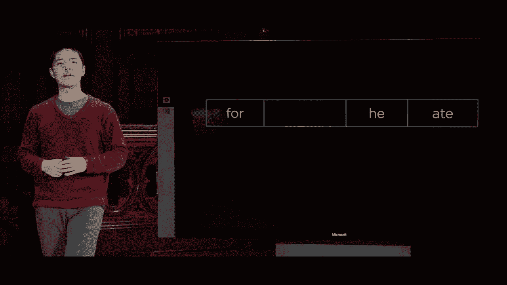

foundational idea of an algorithm known，as word to Veck which is a model for。generating word vectors you give word，Tyvek a corpus of documents just a whole。bunch of text and what word Tyvek will，produce is it will produce vectors for。each word and there are number of ways，that it can do this one common way is。

through what's known as the Skip Graham，architecture which basically uses a。neural network to predict context words，given a target word so given a word like。lunch use a neural network to try and，predict given the word lunch what words。are going to show up around it and this，is the way we might represent this is。

with a big neural network like this，where we have one input cell for every。word every word gets one node inside，this neural network and the goal is to。use this node network to predict given a，target word a context word given a word。like lunch can I predict the，probabilities of other words showing up。

in a context of like one word away or，two words away for instance in some sort。of window of context and if you just，give the AI this neural network a whole。bunch of data of words and what words，show up in context you can train a。neural network to do this calculation to，be able to predict given a target word。

can I predict what those context words，ultimately should be and it will do so。using the same methods we've talked，about back propagating the error from。the context word back through this，neural network and what you get is if we。use the single layer just a single layer，of hidden nodes what I get is for every。

single one of these words I get you know，from this word for example I get five。edges each of which has a weight to each，of these five hidden nodes in other。words I get five numbers and then，effectively are going to represent this。particular target word here and the，number of hidden nodes I choose in this。

middle layer here I can pick that maybe，I'll choose to have 50 hidden nodes or。100 hidden nodes and then for each of，these target words I'll have 50。different values or a hundred different，values and those values we can。effectively treat as the vector new，erekle representation of that word and。

the general idea here is that if two，words are similar，two words show up in similar context。meaning using those same target words，I'd like to predict similar contexts。where it's well then these vectors in，these values I choose in these vectors。here these numerical values for the，weights of these edges are probably。

going to be similar because for two of，different words that show up in similar。contexts I would like some these values，that are calculated to ultimately be。very similar to one another and so，ultimately the high-level way you can。picture this is that what this word，Tyvek training method is going to do。

it's given a whole bunch of words where，initially recall we initialize these。weights randomly and just pick random，weights that we choose over time as we。train the neural network we're going to，adjust these weights adjust the vector。representations of each of these words，so that gradually words that show up in。

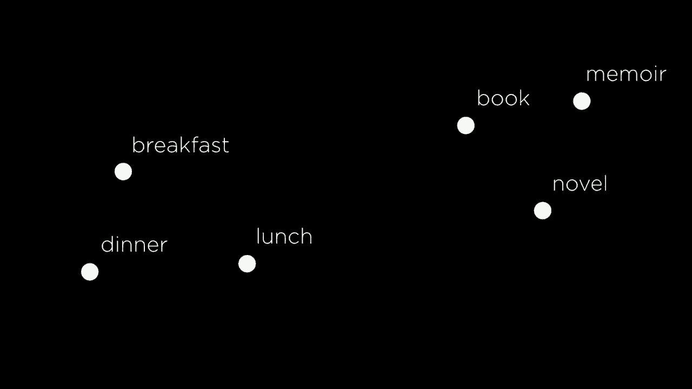

similar contexts grow closer to one，another and words that show up in。different contexts get farther away from。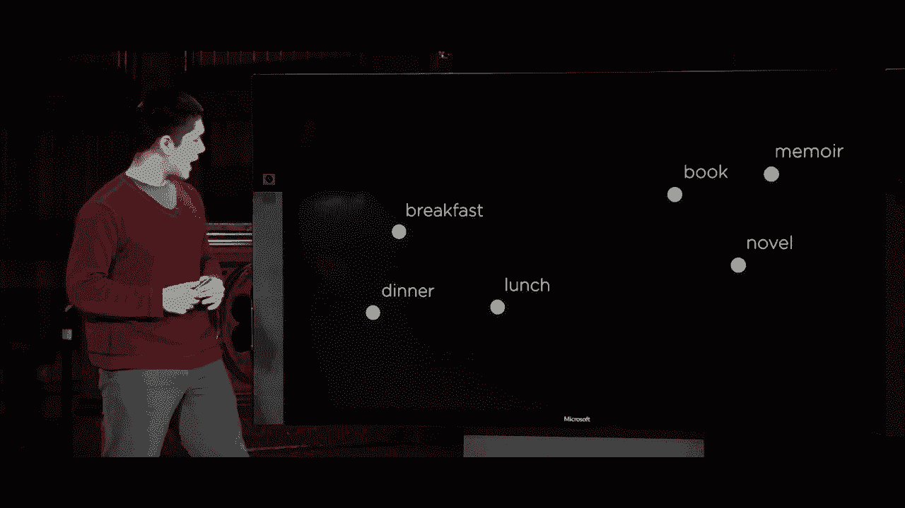

one another and as a result hopefully I，get vector representations of words like。breakfast and lunch and dinner that are，similar to one another and then words。like book and memoir and novel are also，going to be similar to one another as。well so using this algorithm we are able，to take a corpus of data and just train。

our computer train this neural network，to be able to figure out what vector。what sequence of numbers is going to，represent each of these words which is。again a bit of a strange concept to，think about like representing a word。just as a whole bunch of numbers but，we'll see in a moment just how powerful。

this really can be so we'll go ahead and，go into vectors and what I have inside。of vectors dot pi which will open up now，is I'm opening up words text which is a。pre trained model that just I've already，run word Tyvek and it's already given me。a whole bunch of vectors for each of，these possible words and and I'm just，going to take like 50。

000 of them and go，ahead and save their vectors inside of a，dictionary called words and then I've。also defined some functions called，distance closest words that'll get me。like what are the closest words to a，particular word and then closest word。that just gets me the one closest word。

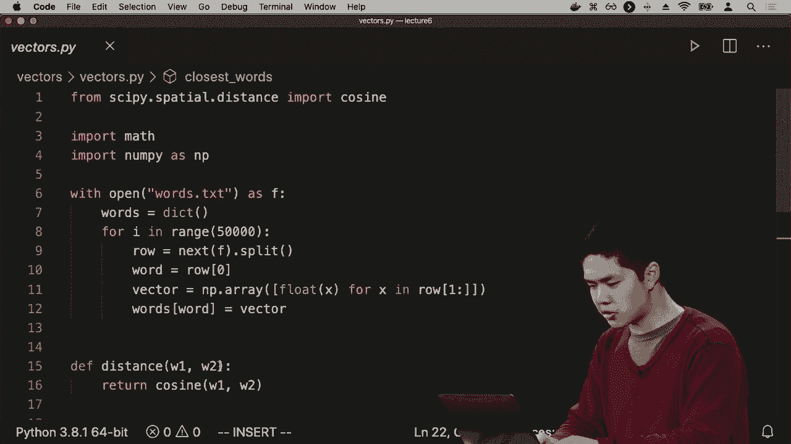

for example and so now let me try doing，this let me open，the Python interpreter and say something。like from vectors import star just，import everything from vectors and now。let's take a look at the meanings of，some words let me look at the word like。city for example and here is a big array，that is the vector representation of the。

word city and you know this doesn't mean，anything in terms of what these numbers。exactly are but this is how my computer，is representing the meaning of the word。city and into a different word like，words house and here then is the vector。representation of the word house for，example just a whole bunch of numbers。

and this is encoding somehow the meaning，of the word house and how do I get at。that idea well one way to measure how，good this is is by looking at what is。the distance between various different，words so distance there are a number of。ways you can define distance in context，of vectors one common way is what's。

known as like the cosine distance that，has to do with measuring the angle。between vectors but in short it's just，measuring like how far apart are these。two vectors from each other so if I take，a word like you know the word book how。far away is it from itself like how far，away is the word book from book。

well that's zero right the word book is，zero distance away from itself but let's。see how far away word book is from a，word like breakfast what we're gonna say。like one is very far away zero is not，far away all right book is about point。six four away from breakfast they seem，to be pretty far apart but let's now try。

and calculate the distance from words，book two words novel for example now。those two words are closer to each other，point three four that the vector。representation of the word book is，closer to the vector representation of。the word novel than it is to the vector，representation of the word breakfast and。

I can do the same thing and say compare，breakfast to lunch for example and those。two words are even closer together that，they have an even more similar。relationship between one word and，another so now it seems we have some。representation of words representing a，word using vectors that allows us to be。

able to say something like words that，are similar to each other ultimately，have a small。distance that happens to be between them，and this turns out to be incredibly。powerful to be able to represent the，meaning of words in terms of their。relationships to other words as well I，can show you as well I have a function。

called closest words that basically just，takes a whole bunch of words and gets。all the closest words to it so let me，get the closest words - like book for。example and maybe get it like the ten，closest words will limit ourselves to。ten and the right book is obviously，closest to itself the word book but is。

also closely related to like books and，essay and memoir and essays and novella。anthology the and why are these words，that I was able to computer close to it。well because based on the corpus of，information that this this algorithm was。trained on the vector is that a rose a，rose based on what words show up in a。

similar context that the word book shows，up in a similar context similar other。words to words like memoir and essays，for example and if I do something like。let me get the closest words to city you，end up getting in a city town township。village these are words that happen to。

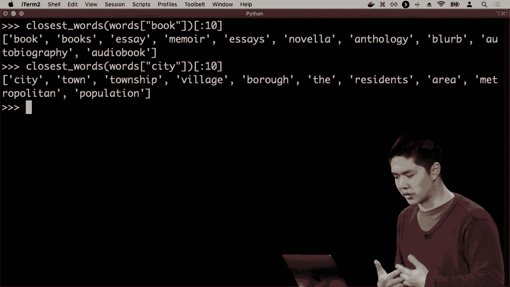

show up in a similar context to the word，city now where things get really。interesting is that because these are，vectors we can do mathematics with them。we can calculate the relationships，between various different words so I can。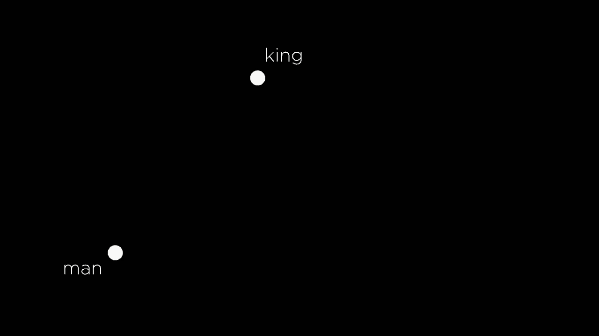

say something like alright what if I had，like man and King these are two。different vectors and this is a famous。

example that comes out of word Tyvek you，know I can take these two vectors and。just subtract them from each other this，line here this distance here is another。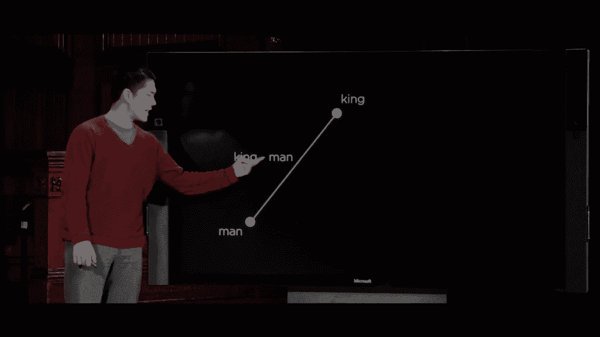

vector that represents like king - man，now what does it mean to like take a。word and subtract another word normally，that doesn't make sense in the world of。vectors though you can take some vector，some sequence of numbers subtract some。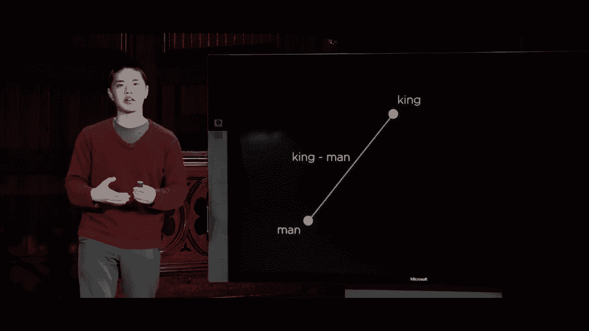

other sequence of numbers and get a new，vector get a new sequence of numbers and。what this new sequence of numbers is，effectively going to do is it is going。to tell me like what do I need to do to，get from man to King what is the。relationship then between these two，words and this is some vector。

representation of what makes go takes us，from man to king and we can then take。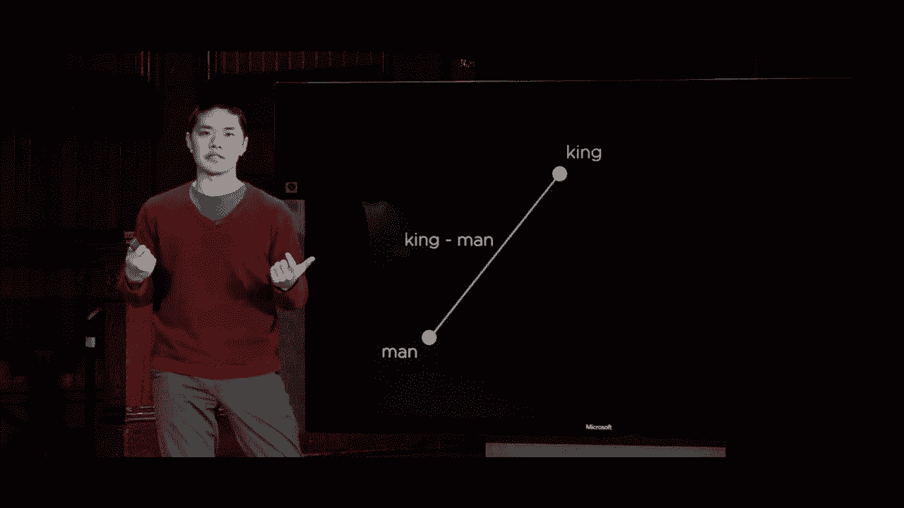

this value and add it to another vector，you might imagine that like the word，woman for exam。is another vector that exists somewhere，inside of this space somewhere inside of。this vector space and what might happen，if I took this same idea King - man took。that same vector and just added it -，woman like what would we find。

around here it's an interesting question，we might ask and we can answer it very。easily because I have vector，representations of all of these things I。can say let's go back here let me look，at the representation of the word man。here's the vector representation of man，let's look at the representation of the。

word King here's the representation of，the word King and I can subtract these，of King。- man into this array right here a whole，bunch of values so King - man now。represents the relationship between King，and man in some sort of numerical vector。format so what happens then if I add，woman to that say whatever took us from。

man to King go ahead and apply that same，vector to the vector representation of。the word woman and that gives us this，vector here and now just out of。curiosity let's take this expression and，find what is the closest word to that。expression and amazingly what we get is。

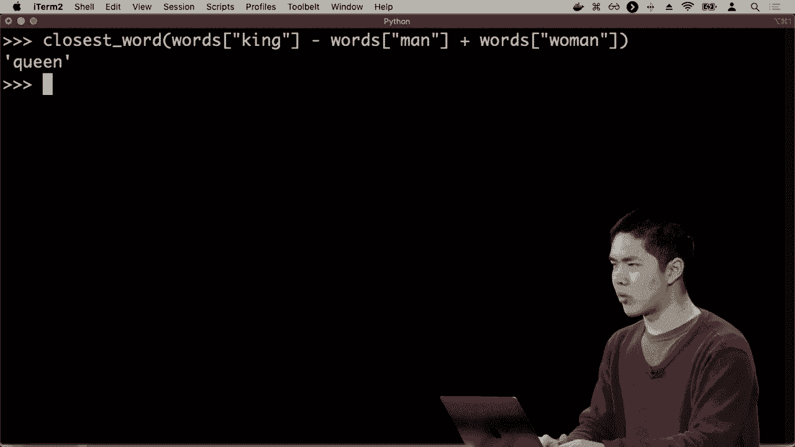

we get the word queen that somehow when，you take the different distance between。men and King this numerical，representation of how man is related to。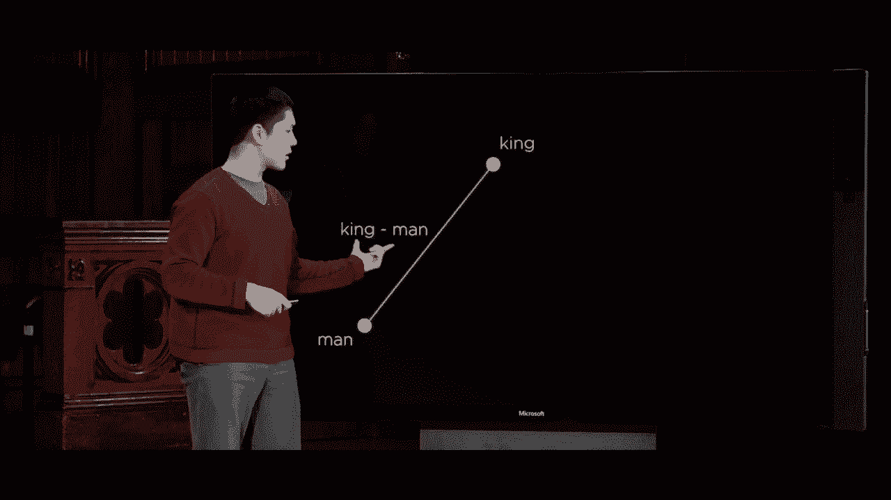

King and add that same notion King - men，to the vector representation of the word。woman what we get is we get the vector，representation or something close to the。vector representation of the word Queen，because this distance somehow encoded。the relationship between these two words，when you run it through this algorithm。

it's not programmed to do this but if，you just try and figure out how to。predict words based on context words and，you get vectors that are able to make。these sort of like SAT like analogies，out of the information that it's been。given so there are more examples of this，we can say all right let's figure out。

what is the distance between Paris and，France so Paris and France are words the。each of a vector representation this，then is a vector representation of the。distance between Paris and France like，what takes us from France to。Paris and let me go ahead and add the，vector representation of England to that。

so this then is the vector，representation of going Paris - France。plus England so the distance between，friends and Paris as vectors add the。england vector and let's go ahead and，find the closest word to that and it。turns out to be london do you do this，relationship the relationship between。

France and Paris go ahead and add the，england vector to it and the closest。vector to that happens to be the vector，for the word london we can do more。examples i can say you know what let's，take the word for teacher that vector。representation and let me subtract the，vector representation of school so what。

I'm left with is what takes us from，school to teacher and apply that vector。to a word like hospital and see what is，the closest word to that turns out the。closest word is nurse let's try a couple，more example as a closest word to you。know ramen for example subtract closest，word to Japan so what is the。

relationship between Japan and ramen add，the word for America to that we take a。guess is what you might get as a result，it turns out you get burritos as the。relationship if you do the subtraction，do the addition this is the answer that。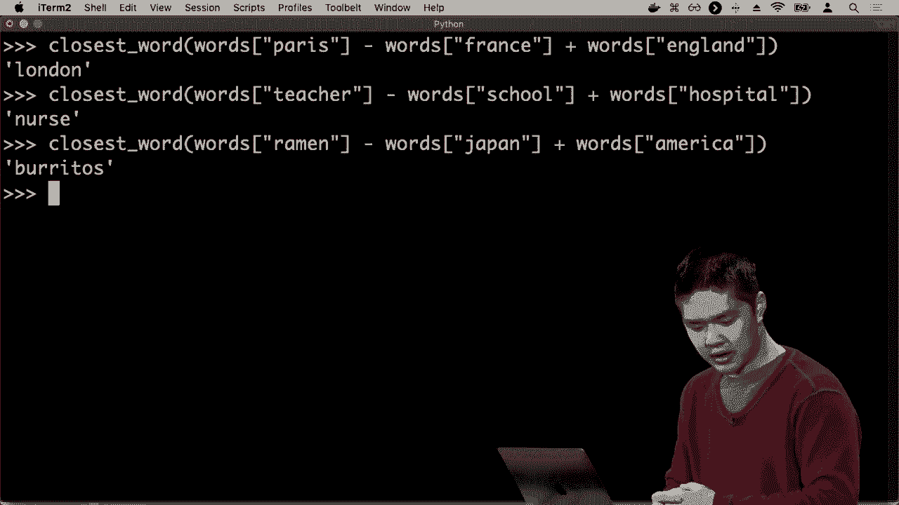

you happen to get as a consequence of，this as well so these very interesting。analogies arise in the relationships，between these two words but if you just。map out all of these words into a vector，space you can get some pretty。interesting results as a consequence of，that and this idea of representing words。

as vectors turns out to be incredibly，useful and powerful anytime we want to。be able to do some statistical work with，regards to natural language to be able。to have represent words not just this，their character ISM but to represent。them as numbers numbers that say，something or mean something about the。

words themselves and somehow relate the，meaning of a word to other words that。might happen to exist some many tools，then for being able to work inside of。this world of natural language the，natural language is tricky we have to。deal with the syntax of language and the，semantics of language but we've really。

just seen just the beginning of some of，the ideas that are underlying。a lot of natural language processing the，ability to like take text extract。information out of it get some sort of，meaning out of it generate sentences。maybe by having some knowledge of the，grammar or maybe just by looking at。

probabilities of what words are likely，to show up based on other words that。have shown up previously and then，finally the ability to take words and。come up with some distributed，representation of them to take words and。represent them as numbers and use those，numbers to be able to say something。

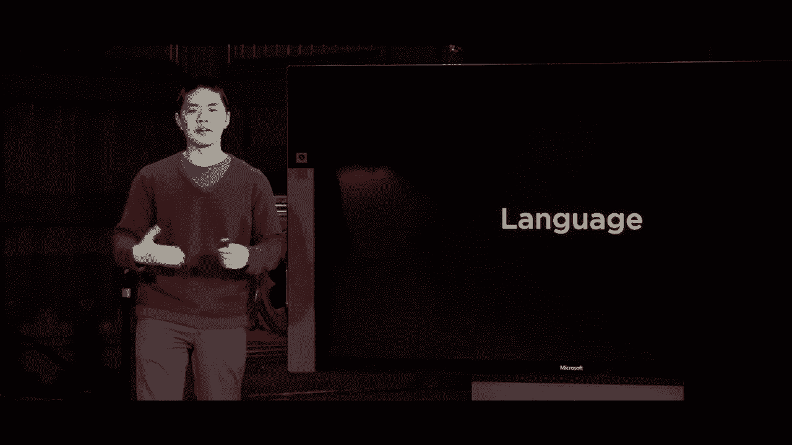

meaningful about those words as well so，this then is yet another topic in this。broader heading of artificial，intelligence and just as a look back at。where we've been now we started our，conversation by talking about the world。of search about trying to solve problems。

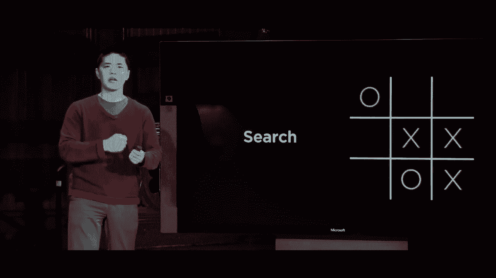

like tic-tac-toe by searching for a，solution by exploring our various。different possibilities and looking at，what algorithms we can apply to be able。to efficiently try and search a space we，looked at some simple algorithms and。then looked at some optimizations we，could make to those algorithms and。

ultimately that was in service of trying，to get our AI to know things about the。world and this has been a lot of what，we've talked about today as well trying。to get knowledge out of text-based，information the ability to take。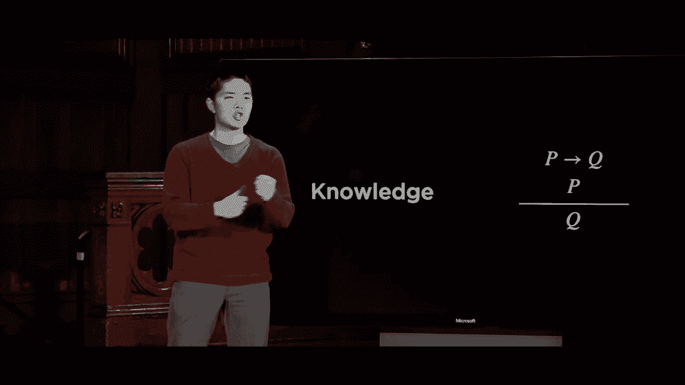

information draw conclusions based on，those information if I know these two。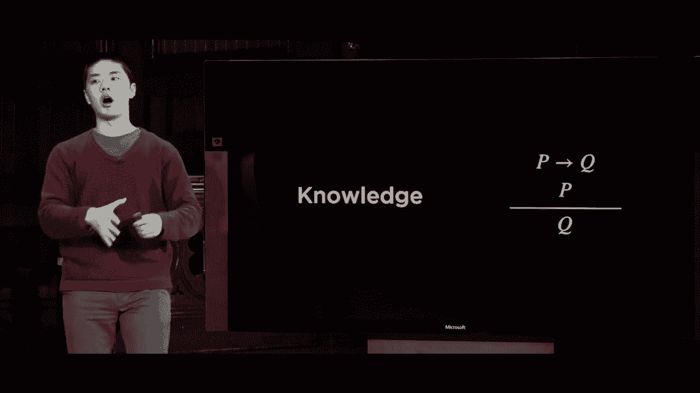

things for certain maybe I can draw a，third conclusion as well that then words。related to to the idea of uncertainty if，we don't know something for sure and can。we predict something figure out the，probabilities of something and we saw。that again today in the context of，trying to predict whether a tweet or。

whether a message is positive sentiment，or negative sentiment and trying to draw。that conclusion as well then we took a，look at optimization the sorts of。problems where we're looking for a local。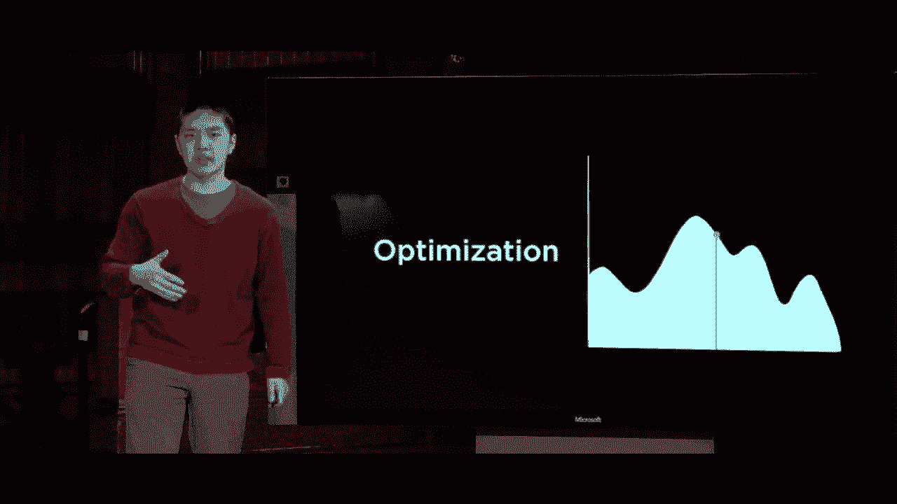

global or local maximum or minimum this，has come up time and time again。especially most recently in the context，of neural networks which are really just。a kind of optimization problem where，we're trying to minimize the total。amount of loss based on the setting of，our weights of our own neural network。

based on the setting of you know what，vector representations for words we。happen to choose them and those，ultimately helped us to be able to solve。learning related problems the ability to，take a whole bunch of data and rather。than us tell the AI exactly what to do，let the AI learn patterns from the data。

for itself let it figure out what makes，an inbox message different from a spam。message let it figure out what makes a，counterfeit bill different from an，authentic bill and。being able to draw that analysis as well，and one of the big tools in learning。that we used were neural networks these，structures that allow us to relate。

inputs to outputs by training these，neural networks to learn some sort of。function that map's us from some input，to some output ultimately yet another。model in this language of artificial，intelligence that we can use to。communicate with our AI and then finally，today we looked at some ways that AI can。

begin to communicate with us looking at，ways that AI can begin to get an。understanding for the syntax and the，semantics of language to be able to。generate sentences to be able to predict，things about text that's written in a。spoken language or a written language，like English and to be able to do。

interesting analysis there as well and，there's so much more in active research。that's happening all over the areas，within artificial intelligence today and。we've really only just seen the，beginning of what AI has to offer so I。hope you enjoyed this exploration into，this world of artificial intelligence。

with Python a big thank you to the，courses teaching staff and the。production team for making this class，possible this was an introduction to。