# 【双语字幕+资料下载】哈佛CS50-AI ｜ Python人工智能入门(2020·完整版) - P2：L0- 搜索算法 1  (搜索问题，深度优先搜索) - ShowMeAI - BV1AQ4y1y7wy

[Music]。

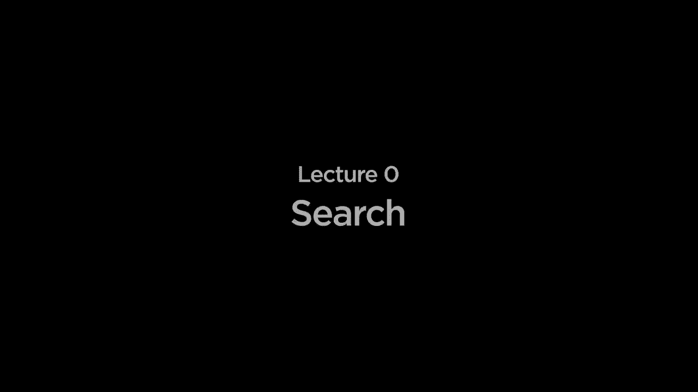

all right welcome everyone to an，introduction to artificial intelligence。

with Python my name is Brian you and in，this class we'll explore some of the。

ideas and techniques and algorithms that，are at the foundation of artificial。

intelligence now artificial intelligence，covers a wide variety of types of。

techniques anytime you see a computer do，something that appears to be intelligent。

or rational in some way like recognizing，someone's face in a photo or being able。

to play a game better than people can or，being able to understand human language。

when we talk to our phones and they，understand what we mean and are able to。

respond back to us these are all，examples of AI or artificial，intelligence and in this class we'll。

explore some of the ideas that make that，AI possible so we'll begin our。

conversations with search the problem of，we have an AI and we would like the AI。

to be able to search for solutions to，some kind of problem no matter what that。

problem might be whether it's trying to，get driving directions from point A to。

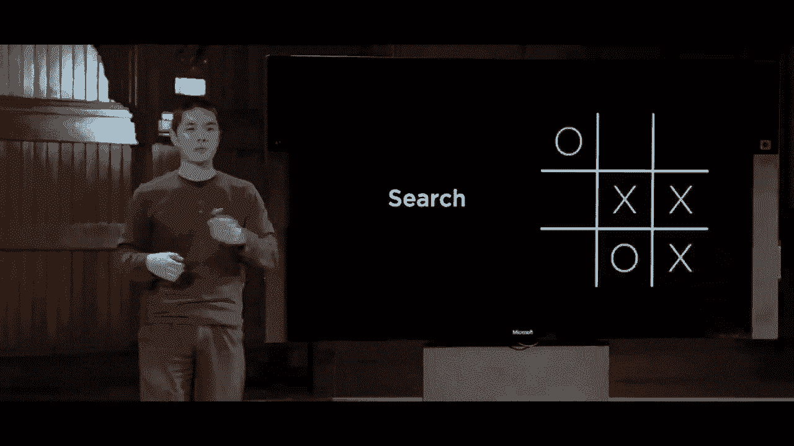

point B or trying to figure out how to，play a game given a tic-tac-toe game for。

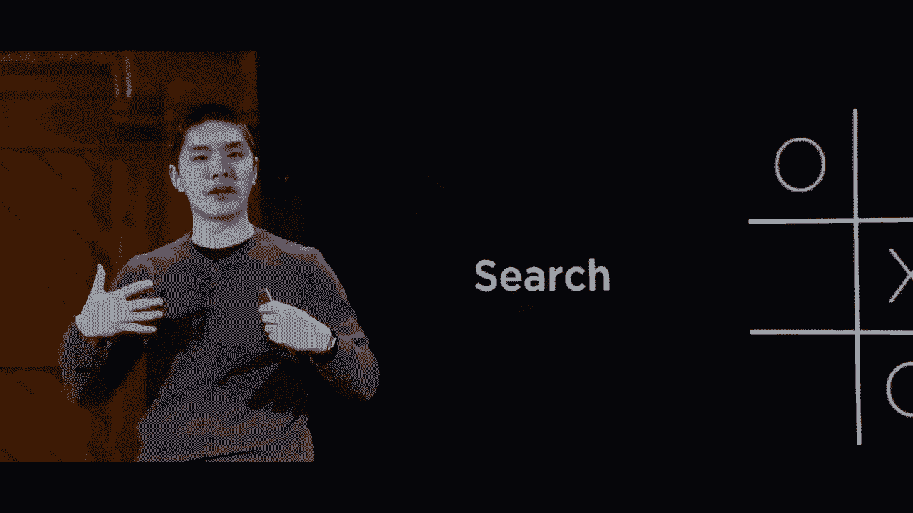

example figuring out what move it ought，to make after that we'll take a look at。

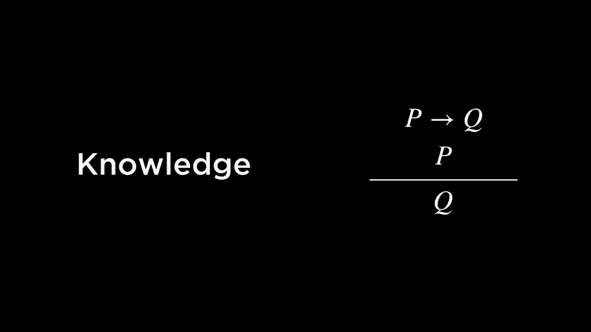

knowledge ideally we want our AI to be，able to know information to be able to。

represent that information and more，importantly to be able to draw。

inferences from that information to be，able to use the information it knows and。

draw additional conclusions so we'll，talk about how a I can be programmed in。

order to do just that then we'll explore，the topic of uncertainty talking about。

ideas of what happens if a computer，isn't sure about a fact but maybe is。

only sure with a certain probability so，we'll talk about some of the ideas。

behind probability and how computers can，begin to deal with uncertain events in。

order to be a little bit more，intelligent in that sense as well。

after that we'll turn our attention to，optimization problems of when the。

computer is trying to optimize for some，sort of goal especially in a situation。

where there might be multiple ways that，a computer might solve a problem but。

we're looking for a better way or，potentially the best way if that's at。

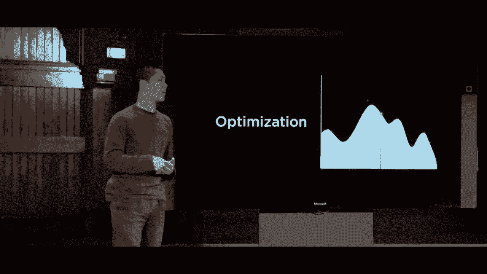

all possible then we'll take a look at，machine learning or learning more。

generally and looking at how when we，have access to data our computers can be。

programmed to be quite intelligent by，learning from data and learning from。

experience being able to perform a task，better and better。

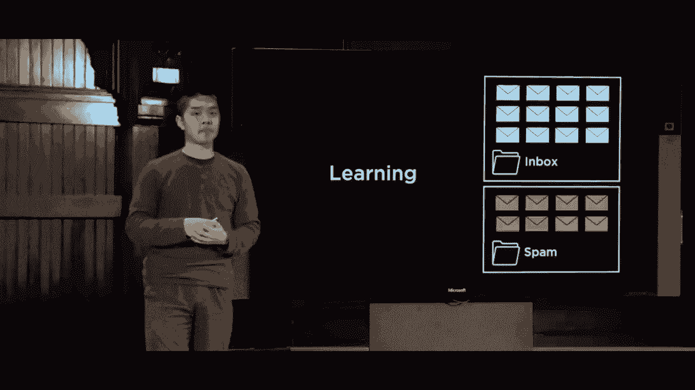

based on greater access to data so your，email for example where your email inbox。

somehow knows which of your emails are，good emails and whichever。

emails are spam these are all examples，of computers being able to learn from。

past experiences and past data well take，a look too at how computers are able to。

draw inspiration from human intelligence，looking at the structure of the human。

brain and how neural networks can be a，computer analog to that sort of idea and。

how by taking advantage of a certain，type of structure of a computer program。

we can write neural networks that are，able to perform tasks very very。

effectively and then finally we'll turn，our attention to language not。

programming languages but human，languages that we speak every day and。

taking a look at the challenges that，come about as a computer tries to。

understand natural language and how it，is some of the natural language。

processing that occurs in modern，artificial intelligence can actually。

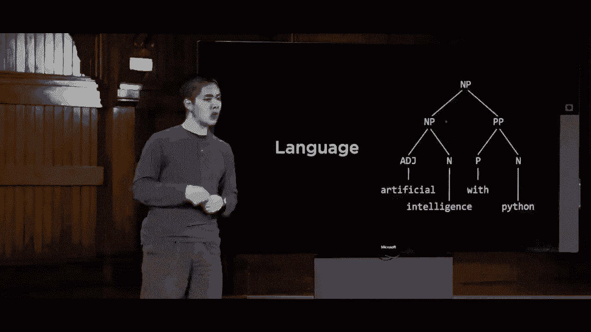

work but today we'll begin our，conversation with search this problem of。

trying to figure out what to do when we，have some sort of situation that the。

computer is in some sort of environment，that an agent is in so to speak and we。

would like for that agent to be able to，somehow look for a solution to that。

problem now these problems can come in，any number of different types of formats。

one example for instance might be，something like this classic 15 puzzle。

with the sliding tiles that you might，have seen where you're trying to slide。

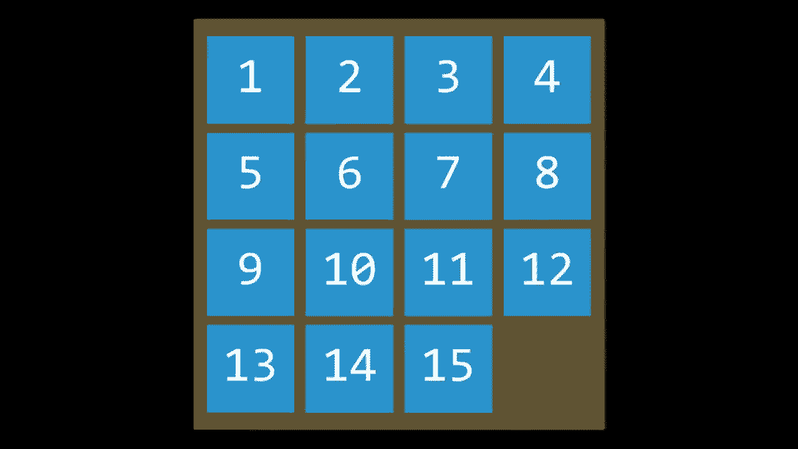

the tiles in order to make sure that all，the numbers line up in order this is an。

example of what you might call a search，problem the 15 puzzle begins in an。

initially mixed-up mixed-up state and we，need some way of finding moves to make。

in order to return the puzzle to its，solved state but there are similar。

problems you can frame in other ways，trying to find your way through a maze。

for example is another example of a，search problem you begin in one place。

you have some goal of where you're，trying to get to and you need to figure。

out the correct sequence of actions that，will take you from that initial state to。

the goal and while this is a little bit，abstract any time we talk about maze。

solving in this class you can translate，it to something a little more real-world。

something like driving directions if you，ever wonder how Google Maps is able to。

figure out what is the best way for you，to get from point A to point B and what。

turns to make it what time depending on，traffic for example it's often some sort。

of search algorithm you have an AI that，is trying to get from an initial。

position to some sort of goal by taking，some sequence of actions so we'll start。

our conversations today by thinking，about these types of search problems and，like this。

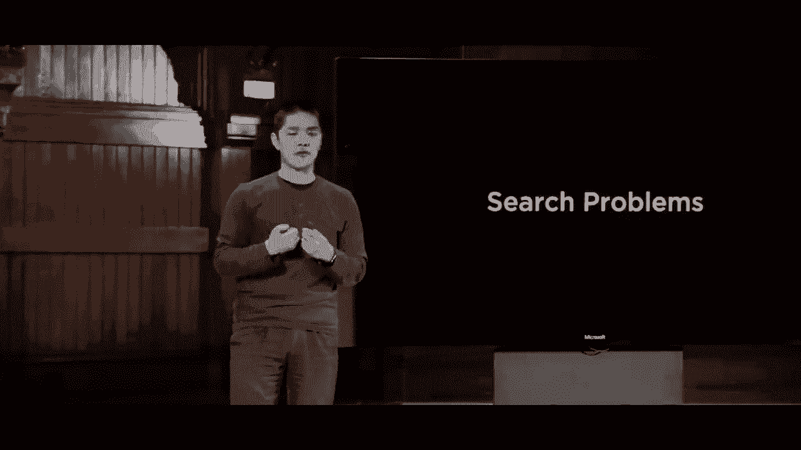

in order for an AI to be able to find a，good solution in order to do so though。

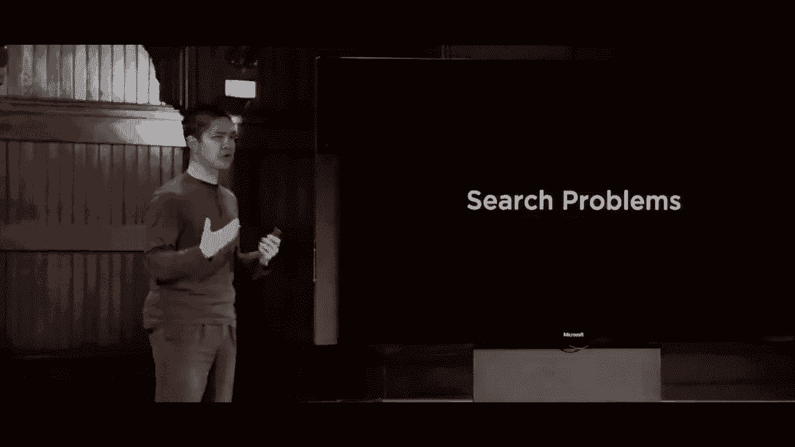

we're going to need to introduce a，little bit of terminology some of which。

I've already used but the first term，we'll need to think about is an agent an。

agent is just some entity that perceives，its environment it somehow is able to。

perceive the things around it and act on，that environment in some way so in the。

case of the driving directions your，agent might be some representation of a。

car that it's trying to figure out what，actions to take in order to arrive at a。

destination in the case of the 15 puzzle，with the sliding tiles the agent might。

be the AI or the person that is trying，to solve that puzzle to try and figure。

out what tiles to move it in order to，get to that solution next we introduce。

the idea of a state a state is just some，configuration of the agent in its。

environment so in the 15 puzzle for，example any state might be any one of。

these three for example a state is just，some configuration of the tiles and each。

of these states is different and is，going to require a slightly different。

solution a different sequence of actions，will be needed in each one of these in。

order to get from this initial state to，the goal which is where we're trying to。

get so the initial state thing what is，that the initial state is just the state。

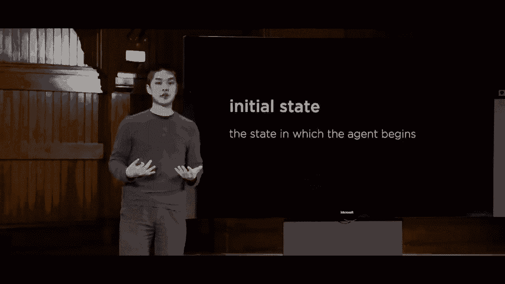

where the agent begins it is one such，state where we're going to start from。

and this is going to be the starting，point for our search algorithms so to。

speak we're going to begin with this。

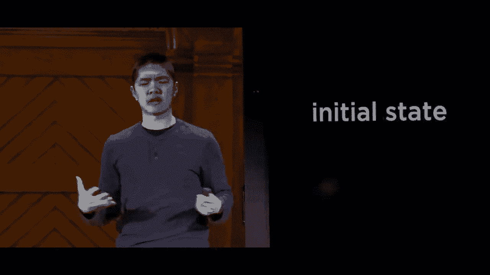

initial state and then start to reason，about it to think about what actions。

might we apply to that initial state in，order to figure out how to get from the。

beginning to the end from the initial，position to whatever our goal happens to。

be and how do we make our way from that，initial position to the goal well。

ultimately it's via taking actions，actions they're just choices that we can。

make in any given state and in AI we're，always going to try to formalize these。

ideas a little bit more precisely such，that we could program them a little bit。

more mathematically so to speak so this，will be a recurring theme and we can。

more precisely define actions as a，function we're going to effectively。

define a function called actions that，takes an input s where s is going to be。

some state that exists inside of our，environment and actions of s is going to。

take the status input and return as，output the set of all actions that can。

be executed in that state and so it's，possible that some action。

are only valid in certain states and not，in other states and we'll see examples。

of that soon too so in the case of the。

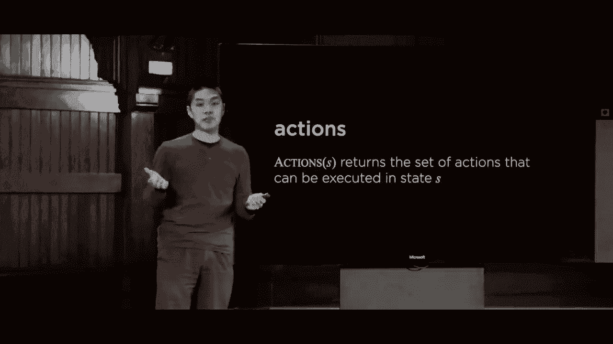

15 puzzle for example they're generally，going to be four possible actions that。

we can do most of the time we can slide，a tile to the right slide a tile to the。

left slide our tile up or slide a tile，down for example and those are going to。

be the actions that are available to us，so somehow our AI our program needs some。

encoding of the state which is often。

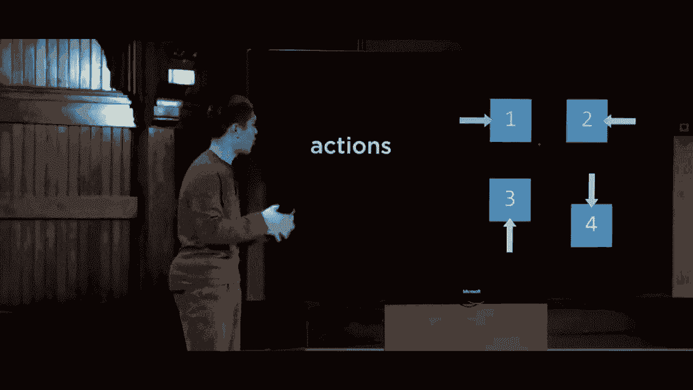

going to be in some numerical format and，some encoding of these actions but it。

also needs some encoding of the，relationship between these things how do。

the states in actions relate to one，another and in order to do that we'll。

introduce to our AI a transition model，which would be a description of what。

state we get after we perform some，available action in some other state and。

again we can be a little bit more，precise about this define this，transition model a little bit more。

formally again as a function the，function is going to be a function。

called result that this time takes two，inputs input number one is s some state。

and input number two is a some action，and the output of this function result。

is it is going to give us the state that，we get after we perform action a in。

state s so let's take a look at an，example to see more precisely what this，actually means。

here's an example of a state of the 15，puzzle for example and here's an example。

of an action sliding a tile to the right，what happens if we pass these as inputs。

to the result function again the result，function takes this board this state as。

its first input and it takes an action，as a second input and of course here I'm。

describing things visually so that you，can see visually what the state is and。

what the action ISM in a computer you，might represent one of these actions is。

just some number that represents the，action or if you're familiar with enums。

that allow you to enumerate multiple，possibilities it might be something like。

that and this state might just be，represented as an array or，two-dimensional array of all of these。

numbers that exists but here we're going，to show it visually just so you can see。

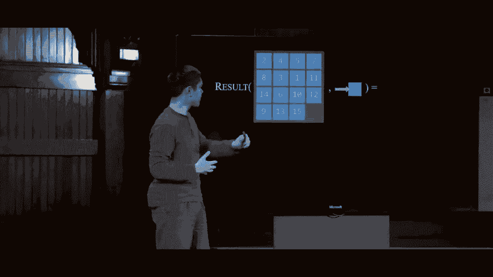

it but when we take this state and this，action pass it into the result function。

the output is a new state the state we，get after we take a tile and slide it to。

the right and this is the state we get，as a result if we had a different action。

and the different State for example and，pass that into the result function we'd。

get a different answer，altogether so the result function needs。

to take care of figuring out how to take，a state and take an action and get what。

results and this is going to be our，transition model that describes how it。

is that states and actions are related，to each other if we take this transition。

model and think about it more generally，and cross the entire problem we can form。

what we might call a state space the set。

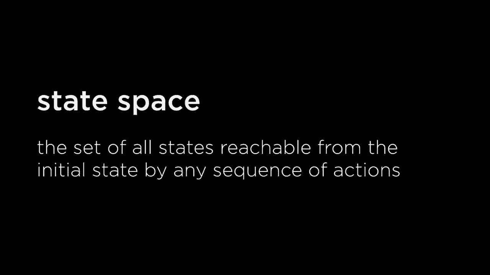

of all of the states we can get from the，initial state via any sequence of。

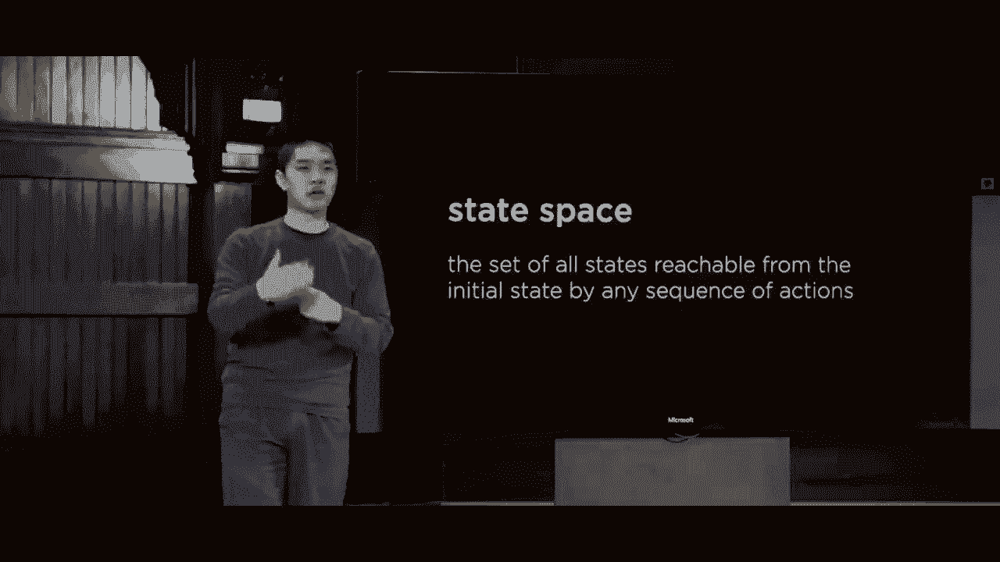

actions by taking zero or one or two or，more actions in addition to that so we。

could draw a diagram that looks，something like this，where every state is represented here by。

a game board and there are arrows that，connect every state to every other state。

we can get to from that state and the，state space is much larger than what you。

see just here this is just a sample of，what the state space might actually look。

like and in general across many search，problems whether there this particular。

15 puzzle or driving directions or，something else the state space is going。

to look something like this we have，individual states and arrows that are。

connecting them and oftentimes just for，simplicity we'll simplify our。

representation of this entire thing as a，graph some sequence of nodes and edges。

that connect nodes but you can think of，this more abstract representation as the。

exact same idea each of these little，circles or nodes is going to represent。

one of the states inside of our problem，and the arrows here represent the。

actions that we can take in any，particular state taking us from one。

particular state to another state for，example all right so now we have this。

idea of nodes that are representing，these states actions that can take us。

from one state to another and a，transition model that defines what。

happens after we take a particular，action so the next step we need to。

figure out is how we know when the AI is，done solving the problem the AI needs。

some way to know when it gets to the，goal that it's found the goal so the。

next thing we'll need to encode into our，artificial intelligence is a goal test。

some way to determine whether a given，state is a goal state in the case of。

something like driving directions it，might be pretty easy if you're in a。

state that corresponds to whatever the，user typed in as their intended，a goal State。

in the 15 puzzle it might be checking，the numbers to make sure they're all in，ascending order。

but the AG is some way to encode whether，or not any state that happen to be in is。

a goal and some problems might have one，goal like a maze where you have one。

initial position and one ending position，and that's the goal in other more。

complex problems you might imagine that，there are multiple possible goals that。

there are multiple ways to solve a，problem and we might not care which one。

the computer finds it as long as it does。

find a particular goal however sometimes，a computer doesn't just care about。

finding a goal but finding a goal well，or one with a low cost and it's for that。

reason that the last piece of，terminology that we'll use to define。

these search problems and is something，called a path cost you might imagine。

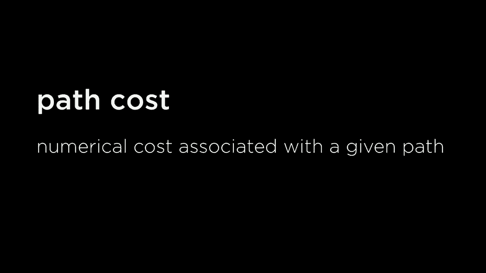

that in the case of driving directions，it would be pretty annoying if I said I。

wanted directions from point A to point，B and the route that Google Maps gave me。

was a long route with lots of detours，that were unnecessary that took longer。

than it should have for me to get to，that destination and it's for that。

reason that when we're formulating，search problems will often give every。

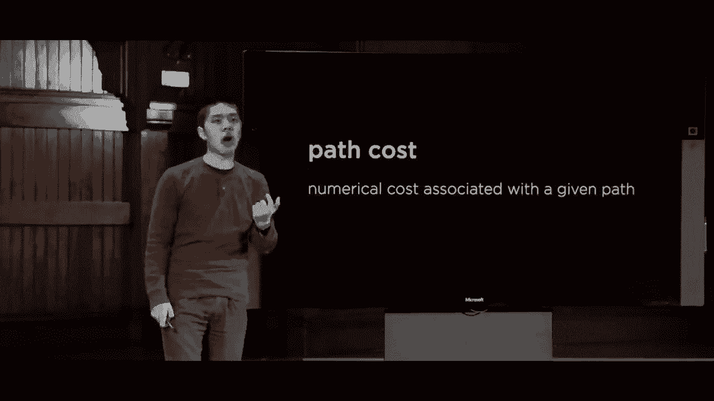

path some sort of numerical cost some，number telling us how expensive it is to。

take this particular option and then，tell our AI that instead of just finding。

a solution some way of getting from the，initial state to the goal we'd really。

like to find one that minimizes this，path cost that is less expensive or。

takes less time or minimizes some other，numerical value we can represent this。

graphically if we take a look at this，graph again and imagine that each of。

these arrows each of these actions that，we can take from one state to another。

state has some sort of number associated，with it that number being the path cost。

of this particular action where some of，the costs for any particular action。

might be more expensive than the cost，for some other action for example。

although this will only happen in some，sorts of problems in other problems we。

can simplify the diagram and just assume，that the cost of any particular action。

is the same and this is probably the，case in something like the 15 puzzle for。

example where it doesn't really make a，difference whether I'm moving right or。

moving left the only thing that matters，is the total number of steps that I have。

to take to get from point A to point B，and each of those steps is of equal cost。

we can just assume it's of some constant，cost like one and so this now forms the。

basis for what we might consider to be a，search problem a search problem has some。

sort of initial state some place where，we begin some sort of action that we can。

take or multiple actions that we can，take in any given state and it has a。

transition model some way of defining，what happens when we go from one state。

and take one action what state do we end，up with as a result in addition to that。

we need some goal test to know whether，or not we've reached a goal and then we。

need a path cost function that tells us，for any particular path by following。

some sequence of actions how expensive，is that path what is its cost in terms。

of money or time or some other resource。

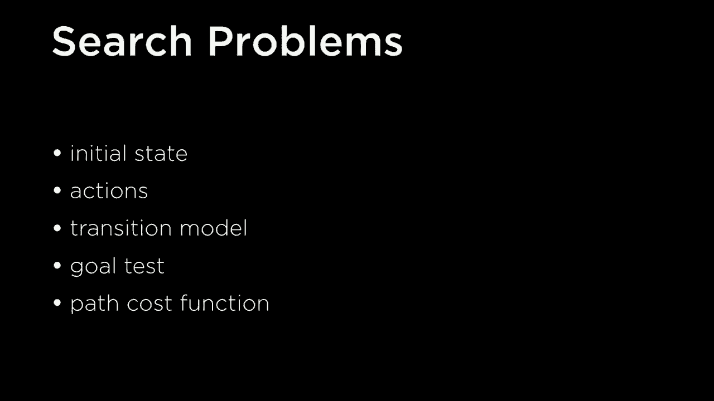

that we are trying to minimize our user，job and the goal ultimately is to find a。

solution where a solution in this case，is just some sequence of actions that。

will take us from the initial state to，the goal State，and ideally we'd like to find not just。

any solution but the optimal solution，which is a solution that has the lowest。

path cost among all of the possible，solutions and in some cases there might。

be multiple optimal solutions but an，optimal solution just means that there。

is no way that we could have done better。

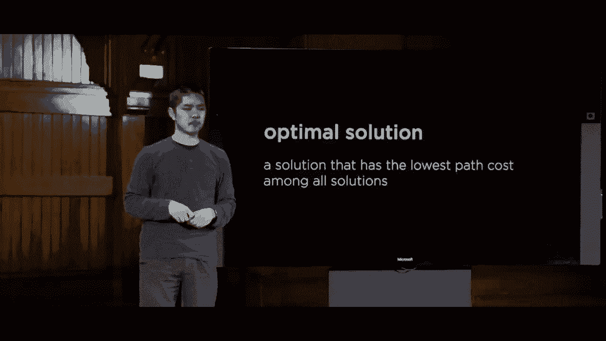

in terms of finding that solution so now，we've defined the problem and now we。

begin need to begin to figure out how it，is that we're going to solve this kind。

of search problem and in order to do so，you'll probably imagine that our。

computer is going to need to represent a，whole bunch of data about this。

particular problem we need to represent，data about where we are in the problem。

and we might need to be considering，multiple different options at once and。

oftentimes when we're trying to package，a whole bunch of data related to a state。

together we'll do so using a data，structure that we're going to call a。

node a node is a data structure that is，just going to keep track of a variety of。

different values and specifically in the。

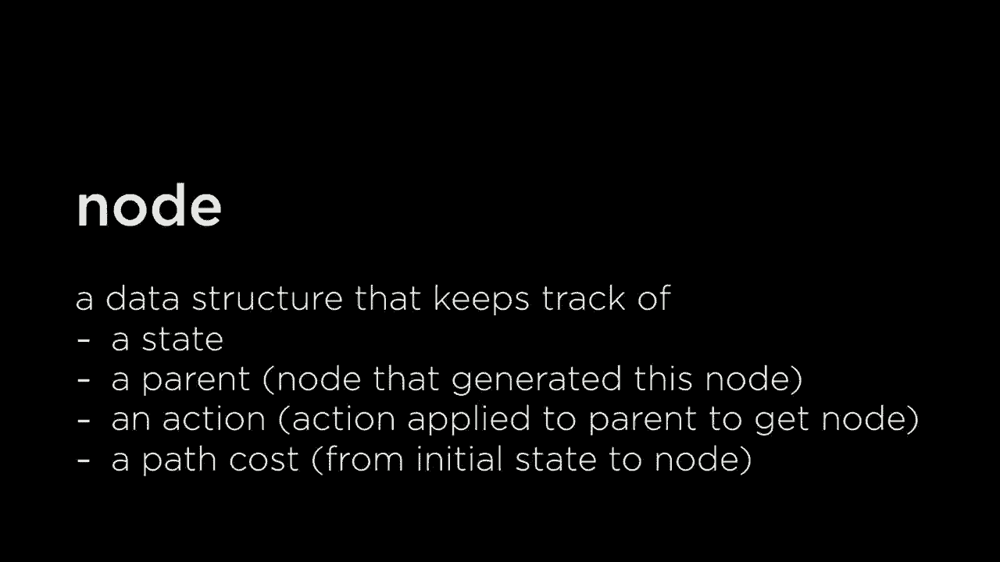

case of a search problem it's going to，keep track of these four values in。

particular every node is going to keep，track of a state the state we're。

currently on and every node is also，going to keep track of a parent a parent。

being the state before us or the node，that we used in order to get to this。

current state and this is going to be，relevant because eventually once we。

reach the goal node once we get to the，end we want to know what sequence of。

actions we use in order to get to that，goal and the way we'll know that is by。

looking at these parents to keep track，of what led us to the goal and what led。

us to that state and what let us，to the state before that so on and so。

forth backtracking our way to the，beginning so that we know the entire。

sequence of actions we needed in order，to get from the beginning to the end the。

note is also going to keep track of what，action we took in order to get from the。

parent to the current state and the note，is also going to keep track of a path。

cost in other words it's going to keep，track of the number that represents how。

long it took to get from the initial，state to the state that we currently。

happen to be at and we'll see why this，is relevant as we start to talk about。

some of the optimizations that we can，make in terms of these search problems。

more generally so this is the data，structure that we're going to use in。

order to solve the problem and now let's，talk about the approach how might we。

actually begin to solve the problem well，as you might imagine what we're going to。

do is we're going to start at one，particular state and we're just going to。

explore from there the intuition is that，from a given state we have multiple。

options that we could take and we're，going to explore those options and once。

we explore those options will find that，more options than that are going to make。

themselves available and we're going to，consider all of the available options to。

be stored inside of a single data，structure that will call the frontier。

the frontier is going to represent all，of the things that we could explore next。

that we haven't yet explored or visited。

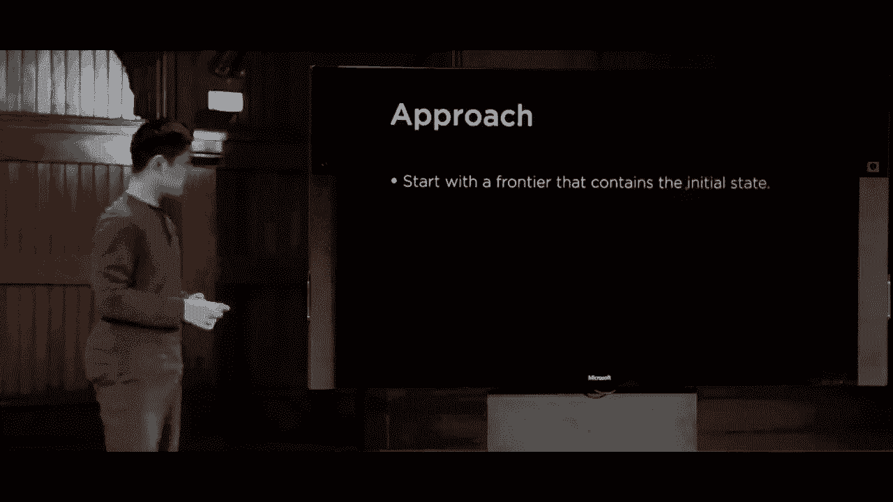

so in our approach we're going to begin，the search algorithm by starting with a。

frontier that just contains one state，the frontier is going to contain the。

initial state because at the beginning，that's the only state we know about that。

is the only state that exists and then，our search algorithm is effectively。

going to follow a loop we're going to，repeat some process again and again and。

again the first thing we're going to do，is if the frontier is empty then there's。

no solution and we can report that there，is no way to get to the goal and that's。

certainly possible there are certain，types of problems that an AI might try。

to explore and realize that there is no，way to solve that problem and that's。

useful information for humans to know as，well so if ever the frontier is empty。

that means there's nothing left to，explore and we haven't yet found a。

solution so there is no solution there's，nothing left to explore otherwise what。

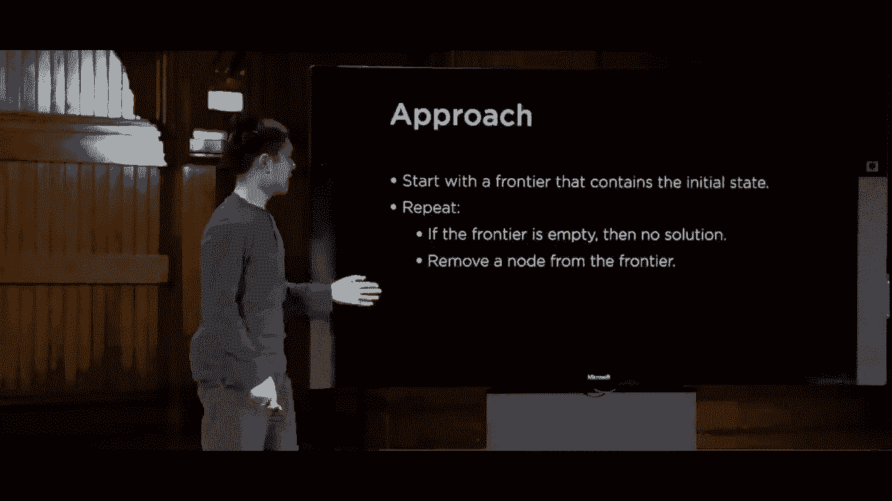

we'll do is we'll remove a node from the，frontier so our right now at the。

beginning the frontier just contains one，node representing the initial state but。

over time the frontier might grow it，might contain multiple states and so。

here we're just going to remove a single，node from that frontier if that node。

happens to be a goal then we found a，solution so we remove a node from the。

frontier and ask ourselves is this the，goal and we do that by applying the goal。

test that we talked about earlier asking，if we're at the destination or asking if。

all the numbers of the 15 puzzle happen，to be in order so if the node contains。

the goal we found a solution，great we're done and otherwise what。

we'll need to do is we'll need to expand，the node and this is a term of art in。

artificial intelligence to expand the，node just means to look at all of the。

neighbors of that node in other words，consider all of the possible actions。

that I could take from the state that，this node is representing and what nodes。

could I get to from there we're going to，take all of those notes the next nodes。

that I can get to from this current one，I'm looking at and add those to the。

frontier and then we'll repeat this，process so at a very high level the idea。

is we start with a frontier that，contains the initial State and we're。

constantly removing a node from the，frontier looking at where we can get to。

next and adding those nodes to the，frontier repeating this process over and。

over until either we remove a node from，the frontier and it contains a goal。

meaning we've solved the problem，or we've run into a situation where the。

frontier is empty at which point we're，left with no solution，so let's actually try and take the。

pseudocode put it into practice by，taking a look at an example of a sample。

search problem so right here I have a，sample graph a is connected to B via。

this action B is connected to node C and，DSC is connected，edie is connected to F and what I'd like。

to do is have my AI find a path from A，to E we want to get from this initial。

state to this goal State so how are we，going to do that well we're going to。

start with the frontier that contains，the initial State this is going to。

represent our frontier so our frontier，initially will just contain a that。

initial state where we're going to begin，and now we'll repeat this process if the。

frontier is empty no solution that's not，a problem because the frontier is not。

empty so we'll remove a node from the，frontier as the one to consider next。

there's only one node in the frontier so，we'll go ahead and remove it from the。

frontier but now a the，initial node this is node we're，currently considering we follow the next。

step we ask ourselves is this node the，goal no it's not a is not the goal he is。

the goal so we don't return the solution，so instead we go to this last step。

expand the node and add the resulting，nodes to the frontier what does that。

mean well it means take this state a and，consider where we could get to next and。

after a what we could get to next is，only B so that's what we get when we。

expand a we find B and we add B to the，frontier and now B is in the frontier。

and we repeat the process again we say，all right the frontier is not empty so。

let's remove B from the frontier B is，now the node that we're considering we。

ask ourselves is B the goal no it's not，so we go ahead and expand B and add its。

resulting nodes to the frontier what，happens when we expand B in other words。

what nodes can we get to from B well we，can get to C and D so we'll go ahead and。

add C and D from the frontier and now we，have two nodes in the frontier C and D。

and we repeat the process again we，remove a node from the frontier for now。

I'll do so arbitrarily just by picking C，we'll see why later how choosing which。

node you removed from the frontier is，actually quite an important part of the。

algorithm but for now I'll arbitrarily，remove seeing say it's not the goal so。

we'll add e the next one to the frontier，then let's say I remove you from the。

frontier and now I check I'm currently，looking at state e is that a goal State。

it is because I'm trying to find a path，from A to E so I would return the goal。

and that now would be the solution that，I'm now able to return the solution and。

I found a path from A to E so this is，the general idea the general approach of。

this search algorithm to follow these，steps constantly removing nodes from the。

frontier until we're able to find a，solution so the next question you might。

reasonably ask is what could go wrong，here what are the potential problems。

with an approach like this and here's。

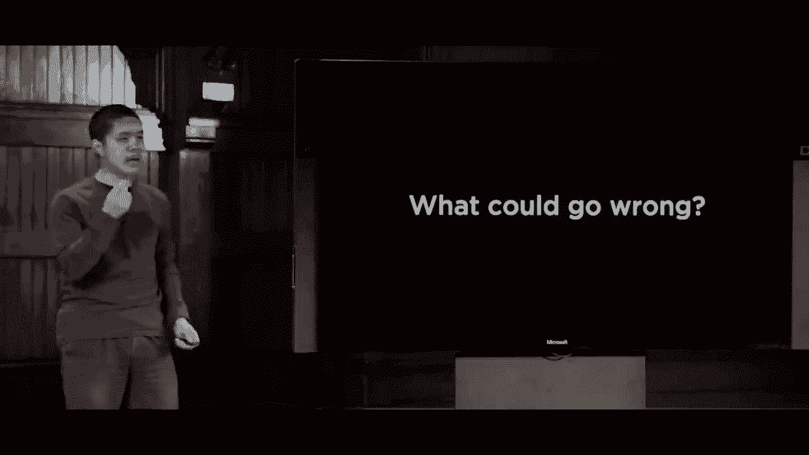

one example of a problem that could，arise from this sort of approach imagine。

this same graph same as before with one，change the change being now instead of。

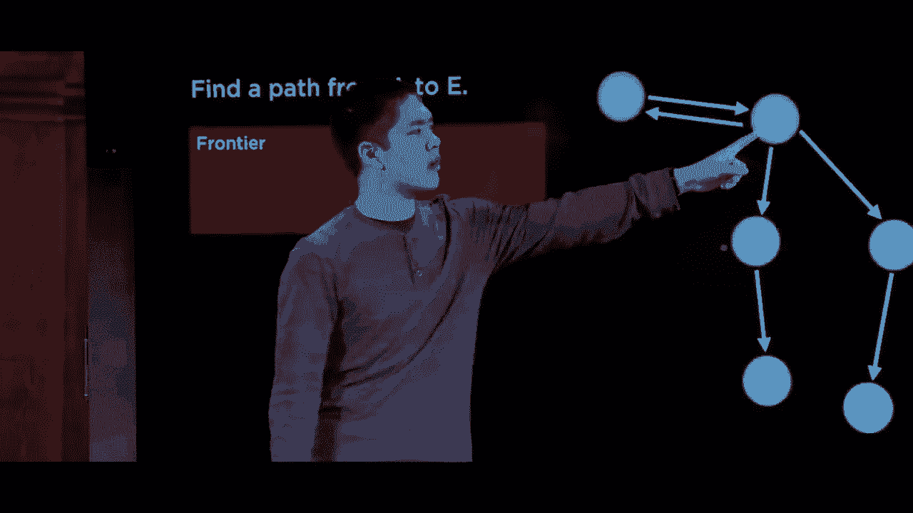

just an arrow from A to B we also have，an arrow from B to a meaning we can go。

in both directions and this is true in，something like the 15 possible where。

when I slide a tile to the right I could，then slide a tile to the left to get。

back to the original position I could go，back and forth between a and B and。

that's what these double arrows，symbolize the idea that from one state I。

can get to another and then I can get，back and that's true in many search。

problems what's going to happen if I try。

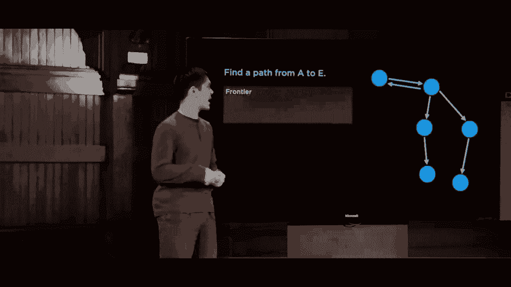

to apply the same approach now we'll all，begin with a same as before and I'll。

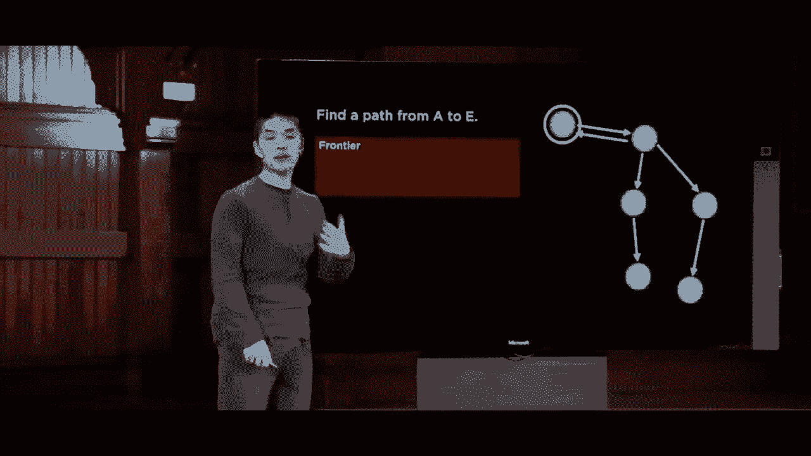

remove a from the frontier and then I'll，consider where I can get to from a and。

after a the only place I can get to is B，so B goes into the frontier then I'll。

say all right let's take a look at B，that's the only thing left in the。

frontier where can I get to from B，before it was just C and D but now。

because of that reverse arrow I can get，to a or C or D so all three a C and D。

all of those now go into the frontier，there are places I can get to from B and。

now I remove one from the frontier and，you know maybe I'm unlucky and maybe I。

pick a and now I'm looking at a again，and I consider where can I get to from a。

and from a well I can get to B and now，we start to see the problem but if I'm。

not careful I go from A to B and then。

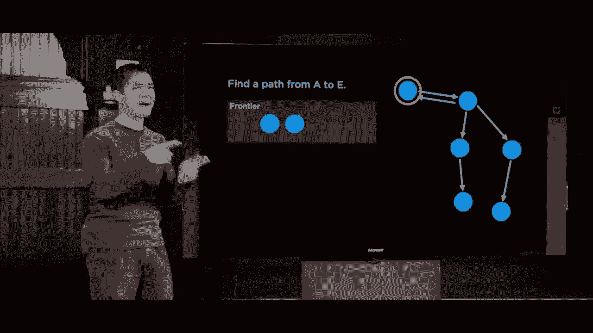

back to a and then to B again and I，could be going in this infinite loop。

where I never make any progress because，I'm constantly just going back and forth。

between two states that I've already，seen so what is the solution to this we。

need some way to deal with this problem，and the way that we can deal with this。

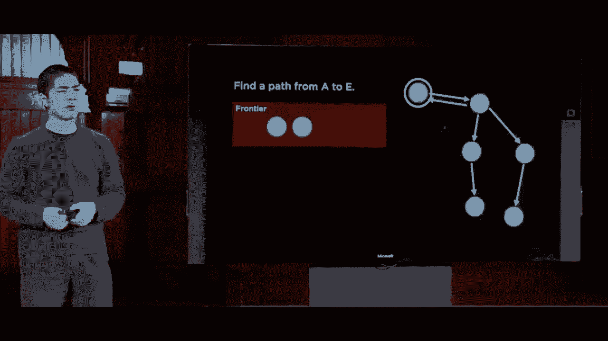

problem is by somehow keeping track of，what we've already explored and the。

logic is going to be well if we've，already explored the state there's no。

reason to go back to it once we've，explored a state don't go back to it。

don't bother adding it to the frontier。

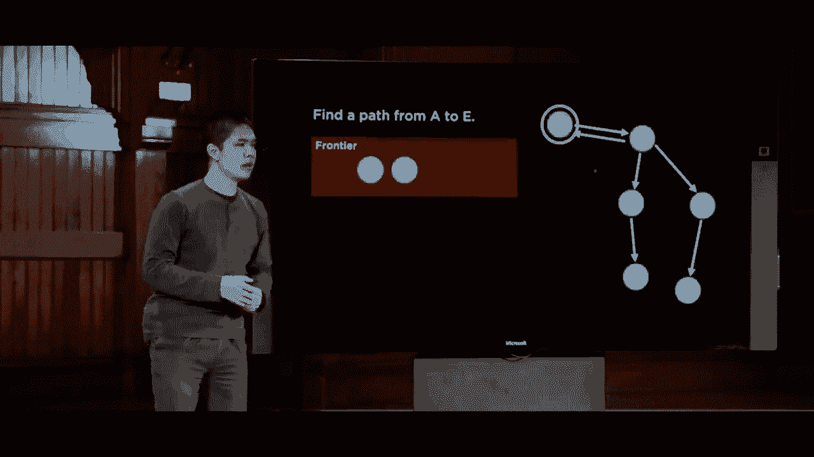

there's no need to so here is going to，be our revised approach a better way to。

approach this sort of search problem and，it's going to look very similar just。

with a couple of modifications we'll，start with a frontier that contains the。

initial state same as before but now，we'll start with another data structure。

which will just be a set of nodes that，we've already explored so what are the。

states we've explored initially it's，empty we have an empty explored set and。

now we repeat if the frontier is empty，no solution same as before we remove a。

node from the frontier we check to see，if it's a goal state returned the。

solution none of this is any different，so far but now what we're going to do is。

we're going to add the node to the，explored state so if it happens to be，frontier。

and it's not the goal we'll add it to，the explored set so that we know we've。

already explored it we don't need to go，back to it again if it happens to come。

up later and then the final step we，expand the node and we add the resulting。

nodes to the frontier but before we just，always added the resulting nodes to the。

frontier we're gonna be a little clever，about it this time we're only going to。

add the nodes to the frontier if they，aren't already in the frontier and if。

they aren't already in the explored set，so we'll check both the frontier and the。

explored set make sure that the node，isn't already in one of those two and so。

long as it isn't then we'll go ahead and，add it to the frontier but not otherwise。

and so that revised approach is，ultimately what's going to help make。

sure that we don't go back and forth，between two nodes now the one point that。

I've kind of glossed over here so far is，this step here removing a node from the。

frontier before I just chose arbitrarily，like let's just remove a node and that's。

it but it turns out it's actually quite，important how we decide to structure our。

frontier how we Adam and how we remove，our nodes the frontier is a data。

structure and we need to make a choice，about in what order are we going to be。

removing elements and one of the，simplest data structures for adding and。

removing elements is something called a，stack and a stack is a data structure。

that is a last in first out data type，which means the last thing that I add to。

the frontier is going to be the first，thing that I remove from the frontier so。

the most recent thing to go into the，stack or the frontier in this case is。

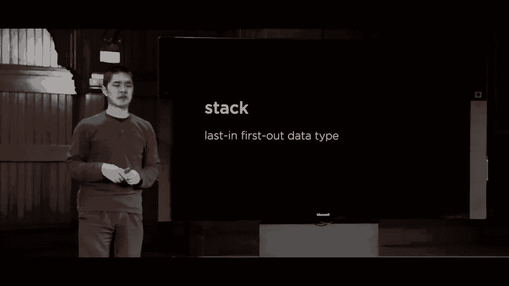

going to be the node that I explore so，let's see what happens if I apply this。

stack based approach to something like，this problem finding a path from A to E。

what's going to happen well again we'll，start with a and we'll say all right。

let's go ahead and look at a first and，then notice this time we've added a to。

the explored set a is something we've，now explored we have this data structure。

that's keeping track we then say from a，we can get to B and alright from B what。

can we do well from B we can explore B，and get to both C and D so we added C。

and then D so now when we explore a node，we're going to treat the frontier as a。

stack last in first out D was the last，explore，that next and say alright where can we。

get to from D well we can get to F and，it's alright we'll explore it put F into。

the frontier and now because the，frontier is a stack F is the most recent。

thing that's gone in the stack so F is，what we'll explore next we'll explore F。

and say alright where can we get do from，F well we can't get anywhere so nothing。

gets added to the frontier so now what，was the new most recent thing added the。

frontier well it's now see the only，thing left in the frontier we'll explore。

that from which we can see all right，from C we can get to e so e goes into。

the frontier and then we say alright，looks like an E and E is now the。

solution and now we've solved the，problem so when we treat the frontier。

like a stack a last in first out data，structure that's the result we get we go。

from A to B to D to F and then we sort，of backed up and went down to C and then。

e and it's important to get a visual，sense for how this algorithm is working。

we went very deep in this search tree so，to speak all the way until the bottom。

where we hit a dead end and then we，effectively backed up and explore this。

other route that we didn't try before，and it's this going very deep in the。

search tree idea this way the algorithm，ends up working when we use a stack that。

we call this version of the algorithm，depth-first search depth-first search is。

the search algorithm where we always，explore the deepest node in the frontier。

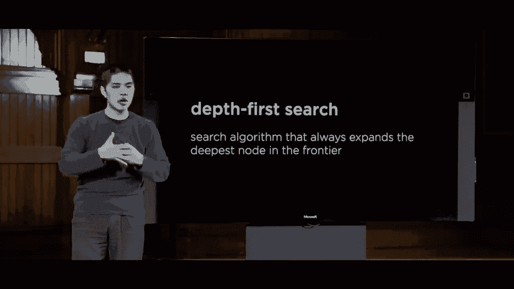

we keep going deeper and deeper through，our search tree and then if we hit a。

