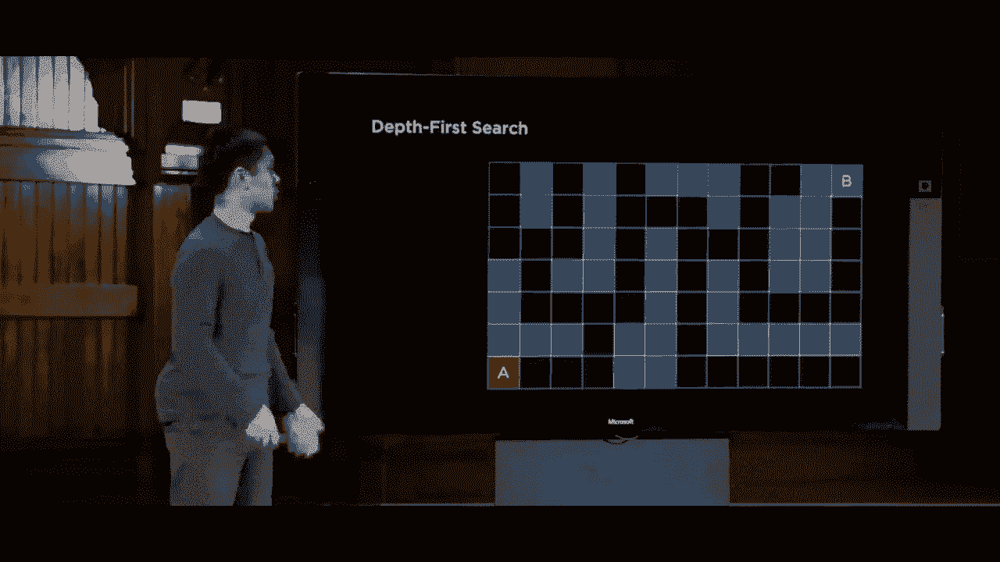
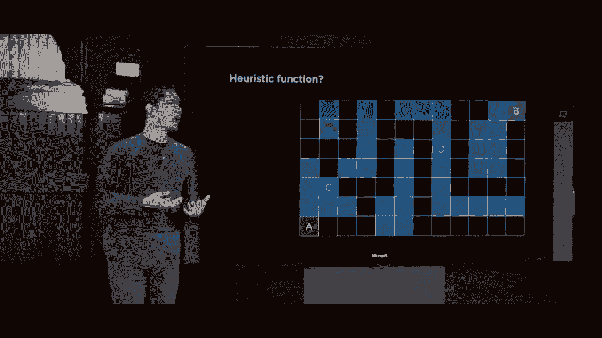

# 【双语字幕+资料下载】哈佛CS50-AI ｜ Python人工智能入门(2020·完整版) - P3：L0- 搜索算法 2 (广度优先搜索，贪心搜索，A＊算法) - ShowMeAI - BV1AQ4y1y7wy

else instead，but depth-first search is just one of，the possible search options that we。

could use it turns out that there's，another algorithm called breadth-first。

search which behaves very similarly to，depth-first search，with one difference instead of always。

exploring the deepest node in the search，tree the way the depth-first search does。

breadth-first search is always going to，explore the shallowest node in the。

frontier so what does that mean well it，means that instead of using a stack。

which depth-first search or DFS used，where the most recent item added to the。

frontier is the one we'll explore next，in breadth-first search or BFS will。

instead use a queue where a queue is a，first in first out data type where the。

very first thing we add to the frontier，is the first one we'll explore and they。

effectively form a line or a queue，where the earlier you arrive in the。

frontier the earlier you get explored I，said what would that mean for the same。

exact problem finding a path from A to E。

will we start with a same as before then，we'll go ahead and have explored a and。

say where can we get to from a well from，a we can get to B same as before。

from B same as before we can get to C，and D so C and D get added to the。

frontier this time though we added C to，the frontier with for D so we'll explore。

C first so C gets explored and from C，where can we get to well we can get to e。

so e gets added to the frontier but，because D was explored before E we'll。

look at D next so we'll explore D and，say where can we get to from D we can。

get to F and only then we say alright，now we can get to e and so what。

breadth-first search or BFS did is we，started here we looked at both C and D。

and then we looked at e effectively，we're looking at things one away from。

the initial state then two away from the，initial State and only then things that。

are three away from the initial State，unlike depth-first search which just。

went as deep as possible into the search，tree until it hit a dead end and then。

ultimately had to back up so these now，are two different search algorithms that。

we could apply in order to try and solve，a problem and let's take a look at how。

these would actually work in practice，with something like maze solving for。

example so here's an example of a maze，these empty cells represent places where。

our agent can move them these darkened，gray cells represent walls that the。

agent can't pass through and ultimately，our agent our AI is going to try to find。

a way to get from position a to position，B via some sequence of actions where。

those actions are left right up and down，what will depth-first search do in this。

case well depth-first search，will just follow one path if it reaches。

a fork in the road where it has multiple，different options depth-first search is。

just in this case going to choose one it，wasn't a real preference but it's going。

to keep following one until it hits a，dead end and when it hits a dead end。

depth-first search effectively goes back，to the last decision point and tries the。

other path fully exhausting this entire，path and when it realizes that okay the，goal is not here。

it turns his attention to this path it，goes as deep as possible when it hits a。

dead end it backs up and then tries this，other path keeps going as deep as。

possible down one particular path and，when it realizes that's a dead end。

then it'll back up and then ultimately，find its way to the goal and maybe you。

got lucky and maybe you made a different，choice earlier on but ultimately this is。

how depth-first search is going to work，it's going to keep following until it，end。

it backs up and looks for a different，solution and so one thing you might。

reasonably ask is is this algorithm，always going to work will it always。

actually find a way to get from the，initial state to the goal and it turns。

out that as long as our maze is finite，as long as they're only finitely many。

spaces where we can travel then yes，depth-first search is going to find a。

solution because eventually it'll just，explore everything if the maze happens。

to be infinite and there's an infinite，state space which does exist in certain。

types of problems then it's a slightly，different story but as long as our maze。

has finitely many squares we're going to，find a solution，the next question though that we want to。

ask is is it going to be a good solution，is it the optimal solution that we can。

find and the answer there is not，necessarily and let's take a look at an。

example of that in this maze for example，we're again trying to find our way from。

A to B and you notice here there are，multiple possible solutions we could go。

this way or we could go up in order to，make our way from A to B now if we're。

lucky depth-first search we'll choose，this way and get to beam but there's no。

reason necessarily why depth-first，search would choose between going up or。

going to the right it's sort of an，arbitrary decision point because both。

are going to be added to the frontier，and ultimately if we get unlucky。

depth-first search might choose to，explore this path first because it's。

just a random choice at this point，it'll explore explore explore and it'll。

eventually find the goal this particular，path when in actuality there was a。

better path there was a more optimal，solution that used fewer steps assuming。

we're measuring the cost of a solution，based on the number of steps that we。

need to take so depth-first search if。

we're unlucky might end up not finding，the best solution when a better solution。

is available，so if that's DFS depth-first search how。

does BFS or breadth first search compare，how would it work in this particular。

situation well the algorithm is going to，look very different visually in terms of。

how BFS explores because BFS looks at，shallower nodes first the idea is going。

to be BFS will first look at all of the，nodes that are one away from the initial。

State look here and look here for，example just that the two nodes that are。

immediately next to this initial state，then it will explore nodes that are two。

away looking at this state and that，state for example then it'll explore。

nodes that are three away this state in，that state whereas depth-first search。

just picked one path and kept following，it breadth-first search on the other。

hand is taking the option of exploring，all of the possible paths。

kind of at the same time bouncing back，between them looking deeper and deeper。

at each one but making sure to explore，the shallower ones or the ones that are。

closer to the initial state earlier so，we'll keep following this pattern。

looking at things that are far away，looking at things that are five away。

looking at things that are six away，until eventually we make our way to the。

goal and in this case it's true we had，to explore some states that ultimately。

didn't lead us anywhere but the paths，that we found to the goal was the。

optimal path this is the shortest way，that we could get to the goal and so。

what might happen then in a larger maze，well let's take a look at something like。

this and how breadth-first search is，going to behave well breadth-first。

search again will just keep following，the states until it receives a decision。

point it could go either left or right，and while DFS just picked one and kept。

following that until it hit a dead end，BFS on the other hand will explore both。

it'll say look at this node then this，node and will look at this node then。

that node so on and so forth and when it，hits a decision point here rather than。

pick one left or two right and explore，that path it'll again explore both。

alternating between them going deeper，and deeper we'll explore here and then。

maybe here and here and then keep going，explore here and slowly make our way you。

can visually see further and further out，once we get to this decision point we'll。

explore both up and down until，ultimately we make our way to the，and what you'll notice is yes。

breadth-first search did find our way，from A to B by following this particular。

path but it needed to explore a lot of，states in order to do so and so we see。

some trade-offs here between DFS and BFS，that in DFS there may be some cases。

where there is some memory savings as，compared to a breadth-first approach。

where breadth-first search in this case，had to explore a lot of states but maybe。

that won't always be the case so now，let's actually turn our attention to。

some code and look at the code that we，could actually write in order to。

implement something like depth-first，search or breadth-first search in the。

context of solving a maze for example so，I'll go ahead and go into my terminal。

and what I have here inside of maze pipe，is an implementation of the same idea of。

maze solving I've defined a class called，node that in this case is keeping track。

of the state the parent in other words，the state before the state and the。

action in this case we're not keeping，track of the path cost because we can。

calculate the cost of a path at the end，after we found our way from the initial。

state to the goal in addition to this，I've defined a class called a stack。

frontier and if unfamiliar with a class，a class is a way for me to define a way。

to generate objects in Python it refers，to an idea of object-oriented。

programming where the idea here is that，I would like to create an object that is。

able to store all of my frontier data，and I would like to have functions。

otherwise known as methods on that，object that I can use to manipulate the。

object and so what's going on here if，unfamiliar with the syntax is I have a。

function that initially creates a，frontier that I'm going to represent。

using a list and initially my frontier，is represented by the empty list there's。

nothing in my frontier to begin with I，have an add function that adds something。

to the frontier as by appending it to，the end of the list I have a function。

that checks if the frontier contains a，particular state I have an empty，empty。

if the frontier is empty that just means，the length of the frontier is 0 and then。

I have a function for removing something，from the frontier I can't remove。

something from the frontier if the，frontier is empty so I check for that，first。

but otherwise if the frontier isn't，empty recall that I'm implementing this。

frontier as a stack a last in first out，data structure which means the last。

thing I add to the frontier in other，words the last thing in the list is the。

item that I should remove from this，frontier so what you'll see here is I。

have removed the last item of a list and，if you index into a Python list with。

negative one that gets you the last item，in the list since zero is the first item。

negative one kind of wraps around and，gets you to the last item in the list so。

we give that the node we call that node，we update the frontier here on line 28。

to say go ahead and remove that node，that you just removed from the frontier。

and then we return the node as a result，so this class here effectively。

implements the idea of a frontier it，gives me a way to add something to a。

frontier and a way to remove something，from the frontier as a stack I've also。

just for good measure implemented an，alternative version of the same thing。

called a queue frontier which in，parentheses you'll see here it inherits。

from a stack frontier meaning it's going，to do all the same things that the stack。

frontier did except the way we remove a，node from the frontier is going to be。

slightly different instead of removing，from the end of the list the way we。

would in a stack were instead going to，remove from the beginning of the list。

self dot frontier 0 will get me the，first node in the frontier the first one。

that was added and that is going to be，the one that we returned in the case of。

a queue then under here I have a，definition of a class called Mae ism。

this is going to handle the process of，taking a sequence a maze-like text file。

and figuring out how to solve it so it，will take as input a text file that。

looks something like this for example，where we see hash marks that are here。

representing walls and I have the，character a representing the starting，position and the character B。

representing the ending position and you，can take a look at the code for parsing。

this text file right now that's the less，interesting part the more interesting。

part is this solve function here where，the solve function is going to figure。

out how to actually get from point A to，point B and here we see an。

implementation of the exact same idea we，saw from a moment ago we're going to，keep track。

how many states we've explored just so，we can report that data later but I。

start with a node that represents just，the start state and I start with a。

frontier that in this case is a stack，frontier and given that I'm treating my。

frontier as a stack you might imagine，that the algorithm I'm using here is now。

depth-first search because depth-first，search or DFS uses a stack as its data。

structure and initially this frontier is，just going to contain the start State we。

initialize an explored set that，initially is empty there's nothing we've。

explored so far and now here's our loop，that notion of repeating something again。

and again first we check at the，frontiers empty by calling that empty。

function that we saw the implementation，of a moment to go and if the frontier is。

indeed empty we'll go ahead and raise an，exception or a Python error to say sorry。

there is no solution to this problem，otherwise we'll go ahead and remove a。

node from the frontier as by calling，frontier dot remove it and update the。

number of states we've explored because，now we've explored one additional state。

so we say self dot numb explored a plus，equals 1 adding 1 to the number of，states we've explored。

once we remove a node from the frontier，recall that the next step is to see。

whether or not it's the goal the goal，test and in the case of the maze the。

goal is pretty easy I check to see，whether the state of the node is equal。

to the goal initially when I set up the，maze I set up this value called goal。

which is a property of the maze so I can，just check to see if the node is。

actually the goal and if it is the goal，then what I want to do is backtrack my。

way towards figuring out what actions I，took in order to get to this goal and。

how do I do that well recall that every，node stores its parent the node that。

came before it that we use to get to，this node and also the action used in。

order to get there so I can create this，loop where I'm constantly just looking。

at the parent of every node and keeping，track for all of the parents what action。

I took to get from the parent to this，current node so this loop is going to。

keep repeating this process of looking，through all of the parent nodes until we。

get back to the initial state which has，an apparent where node dot parent is。

going to be equal to none as I do so I'm，going to be building up the list。

all of the actions that I'm following，and a list of all the cells that are。

part of this solution but I'll reverse，them because when I build it up going。

from the goal back to the initial state，and building the sequence of actions。

from the goal to the initial state but I，want to reverse them in order to get the。

sequence of actions from the initial，state to the goal and that is ultimately。

going to be the solution so all of that，happens if the current state is equal to。

the goal and otherwise if it's not the，goal well then I'll go ahead and add。

this state to the explored set to say，I've explored the state now no need to。

go back to it if I come across it in the，future and then this logic here。

implements the idea of adding neighbors，to the frontier I'm saying look at all。

of my neighbors and I implemented a，function called neighbors that you can。

take a look at and for each of those，neighbors I'm gonna check is the state。

already in the frontier is the state，already in the explored set and if it's。

not in either of those then I'll go，ahead and add this new child node this。

new node to the frontier so there's a，fair amount of syntax here but the key。

here is not to understand all the。

nuances of the syntax so feel free to，take a closer look at this file on your。

own to get a sense for how it is working，but the key is to see how this is an。

implementation of the same pseudo code，the same idea that we were describing a。

moment ago on the screen when we were，looking at the steps that we might。

follow in order to solve this kind of，search problem so now let's actually see。

this in action I'll go ahead and run，maze spy on maze one dot text for。

example and what we'll see is here we，have a printout of what the maze。

initially looked like and then here down，below is after we've solved it we had to。

explore eleven states in order to do it，and we found a path from A to B and in。

this program I just happened to generate。

well，so I can open up maze dot PNG which is，generated by this program that shows you。

where in dark the darker color here are，the walls red is the initial state green。

as the goal and yellow is the path that，was followed we found a path from the。

initial state to the goal but now let's，take a look at a more sophisticated maze。

to see what might happen instead let's，look now at maze to dot text we're now。

here we have a much larger maze again，A，to point B but now you'll imagine that。

depth-first search might not be so lucky，it might not get the goal on the first。

try you might have to follow one path，then backtrack and explore something。

this，we run Python maze da pie of maze two，texts this time trying on this other。

maze and now depth-first search is able，to find a solution here as indicated by。

the Stars is a way to get from A to B，and we can represent this visually by。

opening up this maze here's what that，maze looks like and highlighted in。

yellow is the path that was found from，the initial state to the goal but how。

many states do we have to explore before，we found that path well recall that in。

my program I was keeping track of the。

number of states that we've explored so，far and so I can go back to the terminal。

and see that all right in order to solve，this problem we had to explore 399。

different states and in fact if I make，one small modification with the program。

and tell the program at the end when we，output this image I added an argument。

called a show explored and if I set show，explored equal to true and rerun this。

program Python may stop i running it on，maze 2 and then I open the maze and what。

you'll see here is highlighted in red，are all of the states that had to be。

explored to get from the initial state，to the goal depth-first search or DFS。

didn't find its way to the goal right，away it made a choice to first explore。

this direction and when it explored this，direction it had to follow every。

conceivable path all the way to the very，end even this long and winding one in。

order to realize that you know what，that's a dead end and instead the。

program needed to backtrack after going，this direction it must have gone this。

direction it got lucky here by just not，choosing this path but it got unlucky。

here exploring this direction exploring，a bunch of states that didn't need to。

and then likewise exploring all of this，top part of the graph when it probably。

didn't need to do that either so all in，all depth-first search here really not。

performing optimally or in probably，exploring more seats than it needs to it。

finds an optimal solution the best path，to the goal but the number of excites。

needed to explore in order to do so the，number of steps I had to take that was，much higher。

so let's compare how would breadth-first，search or BFS do one this exact same。

maze instead and in order to do so it's，a very easy change the algorithm for DFS。

and BFS is identical with the exception，of what data structure we use to。

represent the frontier then in DFS I，used a stack frontier last in first out。

whereas in BFS I'm going to use aq，frontier first in first out，we're the first thing I add to the。

frontier is the first thing that I。

remove so I'll go back to the terminal，rerun this program on the same maze and。

now you'll see that the number of states，we had to explore was only 77 as。

compared to almost 400 when we used，depth-first search and we can see。

exactly why we can see what happened if，we open up maze dot PNG now and take a。

look again yellow highlight is the，solution that breadth-first search found。

which incidentally is the same solution，the depth-first search found they're。

both finding the best solution but，notice all the white unexplored cells。

there was much fewer states that needed，to be explored in order to make our way。

to the gold because breadth-first search，operates a little more shallowly it's。

exploring things that are close to the，initial state without exploring things。

that are further away so if the goal is，not too far away then breadth-first。

search can actually behave quite，effectively and on a maze that looks a。

little something like this now in this，case both BFS and DFS ended up finding。

the same solution but that won't always，be the case and in fact let's take a。

look at one more example for instance，maze 3 texts in maze 3 text notice that。

here there are multiple ways that you，could get from A to B it's a relatively。

small maze but let's look at what，happens if I use and I'll go ahead and。

turn off show explored so we just see，the solution if I use BFS breadth-first。

search to solve a maze three texts well。

then we find a solution and if I open up，the mazey here is the solution that we。

found it is the optimal one with just，four steps we can get from the initial。

state to what the goal happens，to be but what happens if we tried to。

use depth-first search or DFS instead，well again I'll go back up to my cue。

frontier where cue frontier means that，we're using breadth-first search and。

I'll change it to a stack frontier which，means that now we'll be using。

depth-first search I'll rerun Python，maybe I am and now you'll see that we。

find the solution but it is not the，optimal solution this instead is what。

our algorithm finds and maybe，depth-first search would have found the。

solution it's possible but it's not，guaranteed that if we just happen to be。

unlucky if the we choose this state，instead of that state then depth-first。

search might find a longer route to get，from the initial state to the goal so we。

do see some trade-offs here where，depth-first search might not find the。

optimal solution so at that point it，seems like breadth first search is。

pretty good is that the best we can do，where it's going to find us the optimal。

solution and we don't have to worry，about situations where we might end up。

finding a longer path to the solution，than what actually exists where the goal。

is far away from the initial State and，we might have to take lots of steps in。

order to get from the initial state to，the goal what ended up happening is that。

this algorithm BFS ended up exploring，basically the entire graph having to go。

through the entire maze in order to find，its way from the initial state to the，goal State。

what we ultimately like is for our，algorithm to be a little bit more。

intelligent and now what would it mean，for our algorithm to be a little bit。

more intelligent in this case well let's，look back to where breadth-first search。

might have been able to make a different，decision and consider human intuition in。

this process as well like what might a，human do when solving this maze that is。

different than what BFS ultimately chose，to do well the very first decision point。

the BFS made was right here when it made，it five steps and ended up in a position。

where it had a fork in the road it could，either go left or it could go right in。

these initial couple steps there was no，choice there was only one action that。

could be taken from each of those states，and so the search algorithm did the only。

thing that any search algorithm could do，which is keep following that state after。

the next day but this，point is where things get a little bit。

interesting depth-first search that very，first search algorithm we looked at。

chose to say let's pick one path and，exhaust that path see if anything that。

way has the goal and if not then let's，try the other way Brett first search，you know what。

let's explore things that are shallow，close to us first look left and right。

then back left and back right someone，and so forth alternating between our。

options in the hopes of finding，something nearby but ultimately what。

made a human doom if confronted with a，situation like this of go left or go。

right well a human might visually see，that all right I'm trying to get to。

state B which is way up there，and going right just feels like it's。

closer to the goal like it feels like，going right should be better than going。

left because I'm making progress towards。

getting to that goal now of course there，are a couple of assumptions that I'm。

making here I'm making the assumption，that we can represent this grid as like。

a two dimensional grid where I know the，coordinates of everything I know that a。

is in coordinates 0 0 and B is in some，other coordinate pair and I know what。

coordinate I'm at now so I can calculate，that yeah going this way。

that is closer to the goal and that，might be a reasonable assumption for。

some types of search problems but maybe，not in others but for now we'll go ahead。

and assume that that I know what my，current coordinate pair is and I know。

the coordinate XY of the goal that I'm，trying to get to and in this situation。

I'd like an algorithm that is a little，bit more intelligent that somehow know。

is that I should be making progress，towards the goal and this is probably。

the way to do that because in a maze，moving in the coordinate direction of。

the goal is usually though not always a，good thing and so here we draw a。

distinction between two different types，of search algorithms uninformed search。

and informed search uninformed search，algorithms are algorithms like DFS and。

BFS the two algorithms that we just，looked at which are search strategies。

that don't use any problem specific，knowledge to be able to solve the。

problem DFS and BFS didn't really care，about the structure of the maze or。

anything about the way that a maze is in，order to solve the problem they just。

look at the actions available and choose，from those actions，and it doesn't matter whether it's a。

maze or some other problem the solution，or the way that it tries to solve the。

problem is really fundamentally going to，be the same what we're going to take a。

look at now is an improvement upon，uninformed search we're going to take a。

look at informed search informed search，are going to be search strategies that。

use knowledge specific to the problem to，be able to better find a solution and in。

the case of a maze this like problem，specific knowledge is something like if。

I'm in a square that is geographically，closer to the goal that is better than。

being in a square that is geographically，further away and this is something we。

can only know by thinking about this，problem and reasoning about what。

knowledge might be helpful for our AI，agent to know a little something about。

there are a number of different types of，informed search specifically first we're。

going to look at a particular type of，search algorithm called greedy。

best-first search greedy best-first，search often abbreviated G BFS is a。

search algorithm that instead of，expanding the deepest nodes like DFS or。

the shallowest node like BFS this，algorithm is always going to expand the。

node that it thinks is closest to the，goal now the search algorithm isn't。

going to know for sure whether it is the，closest thing to the goal because if we。

knew what was closest to the goal all，the time then we would already have a。

solution like the knowledge of what is，close to the goal we could just follow。

those steps in order to get from the，initial position to the solution but if。

we don't know the solution meaning we，don't know exactly what's closest to the。

goal instead we can use an estimate of，what's closest to the goal otherwise。

known as a heuristic just some way of，estimating whether or not we're close to。

the goal and we'll do so using a，heuristic function conventionally called。

H of n that takes a status input and，returns our estimate of how close we are。

to the goal so what might this heuristic，function actually look like in the case。

of a maze solving algorithm where we're，trying to solve a maze what is the。

heuristic look like well the heuristic，needs to answer a question like between。

these two cells C and D which one is，better which one would I rather be in if。

I'm trying to find my way to the goal，well any human could probably look at。

this and tell you you know what D looks，like it's better even if the maze is a。

convoluted and you haven't thought about，all the walls D is probably better and。

why is the better well because if you，ignore the walls let's just pretend the。

walls don't exist for a moment and relax，the problem so to speak D just in terms。

of like coordinate pairs is closer to，this goal it's fewer steps that I would。

need to take to get to the goal as，compared to C even if you ignore the。

walls if you just know the XY coordinate，of C and the XY coordinate of the goal。

and likewise you know the XY coordinate，of D you can calculate the D just。

geographically ignoring the walls looks，like it's better and so this is the。

heuristic function that we're going to，use and in something called the。

Manhattan distance one specific type of，heuristic where the heuristic is how。

many squares are vertically and，horizontally and then left to right so。

not allowing myself to go diagonally，just either up or right or left or down。

how many steps do I need to take to get，from each of these cells to the goal。

well as it turns out D is much closer，there are fewer steps it only needs to。

take six steps in order to get to that，goal again here ignoring the walls we've。

relaxed the problem a little bit we're，just concerned with if you do the math。

to subtract the X values from each other，and the Y values from each other and。

what is our estimate of how far we are，away we can estimate the D is closer to。

the goal than C is and so now we have an，approach we have a way of picking which。

node to remove from the frontier and at，each stage in our algorithm we're going。

to remove a node from the frontier we're，going to explore the node if it has the。

smallest value for this heuristic，function if it has the smallest。

Manhattan distance to the goal and so，what would this actually look like well。

let me first label this graph label this，maze with a number representing the。

value of this heuristic function the。

value of the Manhattan distance from any，of these cells so from this cell for。

example we're one away from the goal，from this cell we're two away from the。

goal three away four away and here were，five away because we have to go one to。

the right and then four up from，somewhere like here the Manhattan。

distance is two we're only two squares，though in fact，we're gonna have to take a longer path。

but we don't know that yet the heuristic。

is just some easy way to estimate how，far we are away from the goal and maybe。

our heuristic is overly optimistic it，thinks that yeah we're only two steps。

away when in practice when you consider，the walls it might be more steps so the。

important thing here is that the，heuristic isn't a guarantee of how many。

steps it's going to take it is a，estimating it's an attempt at trying to。

approximate and it does seem generally，the case that the squares that look。

closer to the goal have smaller values，for the heuristic function then squares。

that are further away so now using，greedy best-first search what might this。

algorithm actually do well again for，these first five steps there's not much。

of a choice we started this initial，state a and we say all right we have to。

explore these five states but now we，have a decision point now we have a。

choice between going left and going，right and before when DFS and BFS would。

just pick arbitrarily because it just，depends on the order you throw these two。

nodes into the frontier and we didn't，specify what order you put them into the。

frontier only the order you take them，out here we can look at 13 and 11 and，say that all right。

this square is a distance of 11 away，from the goal according to our heuristic。

according to our estimate and this one，we estimate to be 13 away from the goal。

so between those two options between，these two choices I'd rather have the 11。

I'd rather be 11 steps away from the，goal so I'll go to the right we're able。

to make an informed decision because we，know a little something more about this。

problem so then we keep following 10 9 8，between the two 7s we don't really have。

much of a way to know between those so，then we do just have to make an。

arbitrary choice and you know what maybe，we choose wrong but that's ok because。

now we can still say all right let's try，this 7 we say 7 6 we have to make this。

choice even though it increases the，value of the heuristic function but now。

we have another decision point between 6，and 8 and between those two and really。

we're also considering this 13 but，that's much higher between 6 8 and 13。

well the six is the smallest value so，we'd rather take the 6 we're able to。

make an informed decision that going，this way to the right is probably better。

going down so we turn this way we go to，five and now we find a decision point。

where we'll actually make a decision，that we might not want to make but。

there's unfortunately not too much of，Oya around this we see four and six four。

looks closer to the goal right it's，going up and the goal is further up so。

we end up taking that route which，ultimately leads us to a dead end but。

that's okay because we can still say all，right now let's try the six and now。

follow this route that will ultimately，lead us to the goal and so this now is。

how greedy best-first search might try，to approach this problem by saying。

whenever we have a decision between，multiple nodes that we could explore。

let's explore the node that has the，smallest value of h of n this heuristic。

function that is estimating how far I，have to go and it just so happens that。

in this case we end up doing better in，terms of the number of states we needed。

to explore then BFS needed to BFS，explored all of this section and all of。

that section but we were able to，eliminate that by taking advantage of。

this heuristic this knowledge about how，close we are to the goal or some。

estimate of that idea so this seems much，better so wouldn't we always prefer an。

algorithm like this over an algorithm，like breadth-first search well maybe one。

thing to take into consideration is that，we need to come up with a good heuristic。

how good the heuristic ism is going to，affect how good this algorithm is and。

coming up with a good heuristic can，oftentimes be challenging but the other。

thing to consider is to ask the question，just as we did with the prior two。

algorithms is this algorithm optimal，will it always find the shortest path。

from the initial state to the goal and，to answer that question let's take a。

look at this example for a moment take a，look at this example again we're trying。

to get from A to B and again I've，labeled each of the cells with their。

Manhattan distance from the goal the，number of squares up and to the right。

you would need to travel in order to get，from that Square to the goal and let's。

think about would greedy best-first，search that always picks the smallest。

number end up finding the optimal，solution what is the shortest solution。

and would this algorithm find it and the，important thing to realize is that right。

here is the decision，we're estimated to be 12 away from the，goal and we have two choices we can go。

to the left which we estimate to be 13，away from the goal or we can go up where。

we estimate it to be 11 away from the，goal and between those two greedy。

best-first search is going to say the 11，looks better than the 13 and in doing so。

greedy best-first search will end up，finding this path to the goal but it。

turns out this path is not optimal there，is a way to get to the goal using fewer。

steps and it's actually this way this，way that ultimately involved fewer steps。

even though it meant at this moment，choosing the worst option between the。

two or what we estimated to be the worst，option based on the heuristics and so。

this is what we mean by this is a greedy，algorithm it's making the best decision。

locally at this decision point it looks，like it's better to go here than it is。

to go to the 13 but in the big picture，it's not necessarily optimal that it。

might find a solution when in actuality，there was a better solution available so。

we want like we would like some way to，solve this problem we like the idea of。

this heuristic of being able to estimate，the path the distance between us and the。

goal and that helps us to be able to，make better decisions and to eliminate。

having to search through entire parts of，this state space but we would like to。

modify the algorithm so that we can，achieve optimality so that it can be。

optimal and what is the way to do this，what is the intuition here well let's。

take a look at this problem in this，initial problem greedy best-first search。

found us this solution here this long，path and the reason why it wasn't great。

is because yes the heuristic numbers，went down pretty low but later on they。

started to build back up they built back，8 9 10 11 all the way up to 12 in this。

case and so how might we go about trying，to improve this algorithm well one thing。

that we might realize is that you know，if we go all the way through this。

algorithm through this path and we end，up going to the 12 and we've had to take。

this many steps like who knows how many，steps that is just to get to this 12 we。

could have also as an alternative taking，much fewer steps just six steps and，more。

12 so it looks like it's not as good but，it required far fewer steps and it only。

took six steps to get to this 13 versus，many more steps to get to this 12 and。

while greedy best-first search says oh，well 12 is better than 13 so pick the 12。

we might more intelligently say I'd，rather be somewhere that heuristic aliy。

looks like it takes slightly longer if I，can get there much more quickly and。

we're going to encode that idea this，general idea into a more formal。

algorithm known as a star search a star，search is going to solve this problem by。

instead of just considering the，heuristic also considering how long it。

took us to get to any particular state，so the distinction is greedy best-first。

search if I am in a state right now the，only thing I care about is what is the。

estimated distance the heuristic value，between me and the goal whereas a-star。

search will take into consideration two，pieces of information you know take into。

consideration how far do I estimate I am，from the goal but also how far did I。

have to travel in order to get here，because that is relevant to so we'll。

search algorithms by expanding the node，with the lowest value of G of n plus h。

of n H of n is that same heuristic that，we were talking about a moment ago。

that's going to vary based on the，problem but G of n is going to be the。

cost to reach the node how many steps I，had to take in this case to get to my。

current position so what is that search，algorithm look like in practice well。

let's take a look again we've got the，same maze and again I've labeled them。

with their Manhattan distance this value，is the H of n value the heuristic。

estimate of how far each of these，squares is away from the goal but now as。

we begin to explore states we care not，just about this heuristic value but also。

about G of n the number of steps I had，to take in order to get there and I care。

about summing those two numbers together，so what does that look like on this very。

first step I have taken one step and now，I am estimated to be sixteen steps away。

from the goal so the total value here is，seventeen then I take one more step I've。

now taken two steps and I estimate，myself to be fifteen away from the goal。

again a total value of 17 now I've taken，three steps and I'm estimated to be 14。

away from the goal so on and so forth，four steps some estimate of thirteen。

five steps estimate of twelve and now，here's a decision point I could either。

be six steps away from the goal with the，heuristic of thirteen for a total of 19。

or I could be six steps away from the，goal with the heuristic of eleven with。

an estimate of seventeen for the total，so between 19 and 17 I'd rather take the。

17 the six plus eleven so so far no，different than what we saw before we're。

still taking this option because it，appears to be better and I keep taking。

this option because it appears to be，better but it's right about here that。

things get a little bit different now I，could be fifteen steps away from the。

goal with an estimated distance of six，so 15 plus six total value of 21。

alternatively I could be six steps away，from the goal because this is five steps。

away so this is six steps away with a，total value of thirteen as my estimate，so six plus thirteen。

that's nineteen so here we would，evaluate G of n plus H of n to be。

nineteen six plus thirteen whereas here，we would be 15 plus six or 21 and so the。

intuition is 19 less than twenty-one，pickier but the idea is ultimately I'd。

rather be having taken fewer steps get，to a thirteen then having taken fifteen。

steps and be at a six because it means，I've had to take more steps in order to。

get there maybe there's a better path，this way so instead we'll explore this。

route now if we go one more this is，seven steps plus 14 is twenty-one so。

between those two it's sort of a toss-up，we might end up exploring that one。

anyways but after that as these numbers，start to get bigger in the heuristic。

values and these heuristic values start，to get smaller you'll find that will。

actually keep exploring down this path，and you can do the math to see that at。

every decision point a star search is，going to make a choice based on the sum。

of how many steps it took me to get to，my current position and then how far I。

estimate I am from the goal so what we，did have to explore some of these states，fact。

an optimal solution it did find us the，quickest possible way to get from the。

initial state to the goal and it turns，out that a star is an optimal search。

algorithm under certain conditions so，the conditions are H of n my heuristic。

needs to be admissible what does it mean，for a heuristic to be admissible well a。

heuristic is admissible if it never，overestimates the true cost H of n。

always needs to either get you exactly，right in terms of how far away I am or。

it needs to underestimate so we saw an，example from before where the heuristic。

value was much smaller than the actual，cost it would take that's totally fine。

but the heuristic value should never，overestimate it should never think that。

I'm further away from the goal than I，actually am and meanwhile to make a。

stronger statement H of n also needs to，be consistent and what does it mean for。

it to be consistent mathematically it，means that for every node which we'll。

call n + successor the node after me，that I'll call n prime where it takes a。

cost of C to make that step the，heuristic value of n needs to be less。

than or equal to the heuristic value of，n prime plus the cost so it's a lot of。

math but in words what that ultimately，means is that if I am here at this state。

right now the heuristic value from me to，the goal shouldn't be more than the。

heuristic value of my successor the next，place I could go to plus however a lot。

much it would cost me to just make that，step from one step to the next step and。

so this is just making sure that my，heuristic is consistent between all of。

these steps that I might take so as long，as this is true then a star search is。

going to find me an optimal solution and，this is where much of the challenge of。

solving these search problems can，sometimes come in that a star search is。

an algorithm that is known and you could，write the code fairly easily but it's。

choosing the heuristic that can be the，interesting challenge the better the。

heuristic is the better I'll be able to，solve the problem in the fewer states。

that I'll have to explore and I need to，make sure that the heuristic satisfies。

these particular constraints so all in，all these are some of the examples of。

search algorithms that might work and，certainly there are many more than just。

this a star for example does have a，tendency to use quite a bit of memory。

so there are alternative approaches to a，star that ultimately use less memory。

than this version of a star happens to，use and there are other search。

algorithms that are optimized for other，cases as well but now so far we've only。

been looking at search algorithms where，there's one agent like I am trying to。

find a solution to a problem I am trying，to navigate my way through a maze I am。

trying to solve a 15 puzzle I am trying。