# 【双语字幕+资料下载】哈佛CS50-AI ｜ Python人工智能入门(2020·完整版) - P4：L0- 搜索算法 3 (极大极小算法，剪枝，深度限制) - ShowMeAI - BV1AQ4y1y7wy

to find driving directions from point A，to point B sometimes in search。

situations though we'll enter an。

adversarial situation where I am an，agent trying to make intelligent。

decisions and there's someone else who，is fighting against me so to speak that。

has opposite objectives someone where I，am trying to succeed someone else that。

wants me to fail and this is most，popular in something like a game a game。

like tic-tac-toe where we've got this，3x3 grid and X and O take turns either。

writing an X or an O and any one of，these squares and and the goal is to get。

three X's in a row if you're the X，player or three O's in a row if you're。

the Oh play ER and computers have gotten，quite good at playing games。

tic-tac-toe very easily but even more，complex games and so you might imagine。

what does an intelligent decision in a。

game look like so maybe X makes an，initial move in the middle and a plays。

up here like what does an intelligent，move for X now become like where should。

you move if you were X and it turns out，there are a couple of possibilities but。

if an AI is playing this game optimally，then the AI might play somewhere like。

the upper right we're in this situation，o has the opposite objective of X X is。

trying to win the game to get three in a，row diagonally here and O is trying to。

stop that objective opposite of the，objective and so o is going to place。

here to try to block but now X has a，pretty clever move X can make a move。

like this where now X has two possible，ways that X can win the game X could win。

the game by getting three in a row，across here or X could win the game by。

getting three in a row vertically this，way so it doesn't matter where Oh makes。

their next move o could play here for，example blocking the three in a row。

horizontally but then X is going to win。

the game by getting a three in a row，vertically and so there's a fair amount，order for the。

computer to be able to solve a problem，and it's similar in spirit to the。

problems we've looked at so far right，their actions there's some sort of state。

of the board and some transition from，one action to the next but it's。

different in the sense that this is now，not just a classical search problem but。

an adversarial search problem that I am，at the ex-player trying to find the best。

moves to make but I know that there's，some adversary that is trying to stop me。

so we need some sort of algorithm to，deal with these adversarial type of。

search situations and the algorithm，we're going to take a look at is an。

algorithm called minimax which works，very well for these deterministic games。

where there are two players it can work，for other types of games as well but。

we'll look right now at games where I，make a move then my opponent makes a。

move and I am trying to win and my，opponent is trying to win also or in。

other words my opponent is trying to get，me to lose and so what do we need in。

order to make this algorithm work well，anytime we try and translate this human。

concept it's like playing a game winning，and losing to a computer we want to。

translate it in terms that the computer，can understand and ultimately the。

computer really just understands at，numbers and so we want some way of。

translating a game of X's and O's on a，grid to something numerical something。

the computer can understand the computer，doesn't normally understand notions of。

like win or lose but it does understand，the concept of like bigger and smaller。

and so we want mean white money I do is。

we might take each of the possible ways，that a tic-tac-toe game can unfold and。

assign a value or a utility to each one，of those possible ways and in a。

tic-tac-toe game and in many types of，games there are three possible outcomes。

the outcomes are o wins and X wins or，nobody wins so player 1 wins player 2。

wins or nobody wins and for now let's go，in and head an assign each of these。

possible outcomes a different value will，say o winning that'll have a value of。

negative 1 nobody winning that'll have a，value of 0 and X winning that will have，a value of 1。

so we've just assigned numbers to each，of these three possible outcomes and now。

we have two players we have the X player，and the O player and we're going to go。

ahead and call the X player the map，player and we'll call the Oh player the。

min player and the reason why is because，in the minimax algorithm the max player。

which in this case is X is aiming to，maximize the score right these are the。

possible options for the score negative，1 0 & 1 X wants to maximize the score。

meaning if at all possible X would like，this situation where X wins the game and。

we give it a score of 1 but if this，isn't possible if X needs to choose。

between these two options negative 1，meaning a winning or 0 meaning nobody。

winning X would rather that nobody wins，score of 0 then a score of negative 1 o。

winning so this notion of winning and，losing in tying has been reduced。

mathematically to just this idea of try，and maximize the score the X player。

always wants the score to be bigger and，on the flip side the min player in this。

case o is aiming to minimize the score，the o player wants the score to be as。

small as possible so now we've taken，this game of X's and O's and winning and。

losing and turned it into something，mathematical something where X is trying。

to maximize the score o is trying to，minimize the score let's now look at all。

of the parts of the game that we need in，order to encode it in an AI so that an。

AI can play a game like tic-tac-toe so，the game is going to need a couple of。

things will need some sort of initial，state that will in this case call s0。

that which is how the game begins like，an empty tic-tac-toe board for example。

will also need a function called player，where the player function is going to。

take as input a state here represented，by s and the output of the player。

function is going to be which players，turn is it right we need to be able to。

give a tic-tac-toe board to the computer，run it through a function and that。

function tells us whose turn it is we'll，need some notion of actions that we can。

take we'll see examples of that in just，a moment we need some notion of a。

transition model same as before if I，have a state and I take an action I need。

to know what results as a consequence of，it I need some way of knowing when the。

game is over so this is equivalent to，kind of like a goal test but I need some。

terminal test some way to check to see，if a state is，a terminal state where a terminal state。

means the game is over in the classic，game of tic-tac-toe a terminal state。

means either someone has gotten three in，a row or all of the squares of the。

tic-tac-toe board are filled either of，those conditions of make it a terminal。

state in a game of chess it might be，something like when there is checkmate。

or if check Mina's no longer possible，that that becomes a terminal State and。

then finally we'll need a utility，function a function that takes a state。

and gives us a numerical value for that，terminal state some way of saying if X。

wins the game that has a value of 1 if，oh is won the game that has a value of。

negative 1 if nobody is won the game，that has a value of 0 so let's take a。

look at each of these in turn at the，initial state we can just represent in。

tic-tac-toe as the empty game board this，is where we begin it's the place from。

which we begin this search and again，I'll be representing these things。

visually but you can imagine this really，just being like an array or a。

two-dimensional array of all of these，possible squares then we need the player。

function that again takes a state and，tells us whose turn it is assuming X。

makes the first move if I have an empty，game board then my player function is。

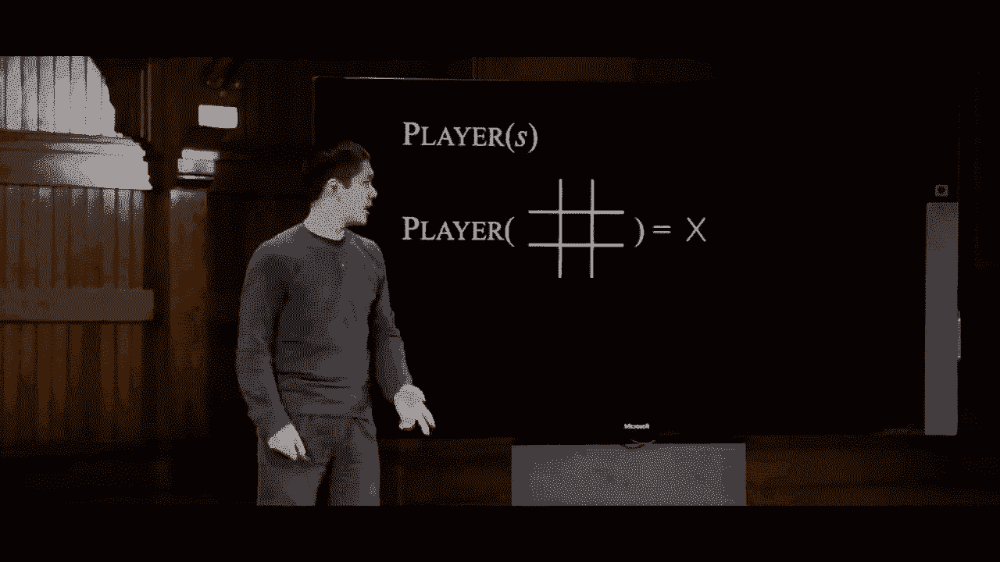

going to return X and if I have a game，board where X has made a move then my。

player function is going to return o the，player function takes a tic-tac-toe game。

board and tells us whose turn it is next，up we'll consider the actions function。

the actions function much like it did in，classical search takes a state and gives。

us the set of all of the possible，actions we can take in that state so。

let's imagine it's always turned to move，in a game board that looks like this。

what happens when we pass it into the，action function so the action function。

takes this state of the game as input，and the output is a set of possible。

actions it's a set of I could move in，the upper left or I could move in the。

bottom middle those are the two possible，action choices that I have when I begin。

in this particular state now just as，before when we had states and actions we。

need some sort of transition model to，tell us when we take this action in the。

state what is the new state that we get，and here we define that using the result。

function that takes a state as input as，well as an action，and when we applied the result function。

to this state saying that let's let o，move in this upper left corner the new。

state we get is this resulting state，where o is in the upper left corner and。

now this seems obvious to someone who，knows how to play tic-tac-toe like of。

course you play in the upper left corner，that's the board you get but all of this。

information needs to be encoded into the，tic-tac-toe，until you tell the AI how the rules of。

tic-tac-toe work and this function，defining this function here allows us to。

tell the AI how this game actually works，and how actions actually affect the。

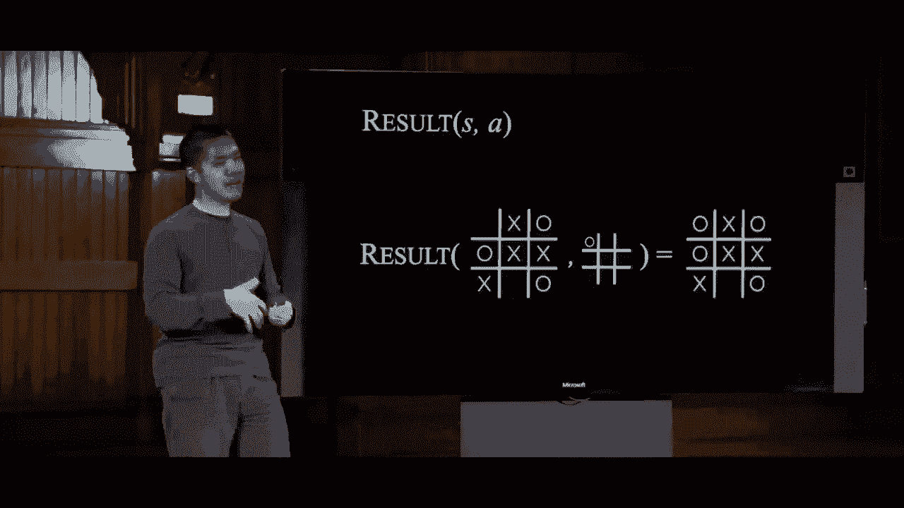

outcome of the game so the AI needs to，know how the game works the AI also。

needs to know when the game is over as，by defining a function called terminal。

that takes as input a state s such that，if we take a game that is not yet over。

pass it into the terminal function the，output is false the game is not over but。

if we take a game that is over because X，has gotten three in a row along that。

diagonal pass that into the terminal，function then the output is going to be。

true because the game now is in fact，over and finally we've told the AI how。

the game works in terms of what moves，can be made and what happens when you。

make those moves we've told the AI when，the game is over now we need to tell the。

AI what the value of each of those，states is and we do that by defining。

this utility function that takes a state，s and tells us the score or the utility。

of that state so again we said that if X，wins the game that utility is a value of。

1 whereas if oh wind again then the，utility of that is negative 1 and the AI。

needs to know for each of these terminal，States where the game is over what is。

the utility of that state so I can give，you a game board like this where the。

game is in fact over and I ask the AI to，tell me what the value of that state is。

it could do so the value of the state is，1 where things get interesting though is。

if the game is not yet over，let's imagine a game board like this。

we're in the middle of the game it's，always turn to make a move so how do we。

know it's always turn to make a move we，can calculate that using the player。

function we can say player of s pass in，the state o is the answer so we know。

it's always turn to move and now what is，the value of this board。

what action should I take well that's，going to depend we have to do some。

calculation here and this is where the，minimax algorithm really comes in recall。

that X is trying to maximize the score，which means that o is trying to minimize。

the score Oh we'd like for the to，minimize the total value that we get at。

the end of the game and because this，game isn't over yet we don't really know。

just yet what the value of this game，board is we have to do some calculation。

in order to figure that out and so how，do we do that kind of calculation well。

in order to do so we're going to，consider just as we might in a classical。

search situation what actions could，happen next and what states will that。

take us to and it turns out that in this，position there are only two open squares。

which means there are only two open，places where ou can make a move Oh could。

either make a move in the upper left or，o can make a move in the bottom middle。

and minimax doesn't know right，out-of-the-box of which of those moves。

is going to be better so it's going to，consider both but now we sort of run。

into the same situation now I have two，more game boards neither of which is。

over what happens next and now it's in，this sense that minimax is what we'll。

call a recursive algorithm it's going to，now repeat the exact same process。

although now considering it from the，opposite perspective it's as if I am now。

going to put myself if I am the O player，I am going to put myself in my。

opponent's shoes my opponent as the X，player and consider what would my。

opponent do if they were in this，position what would my opponent do the X。

player if they were in that position and，what would then happen well the other。

player my opponent the X player is，trying to maximize the score whereas I。

am trying to minimize the score as the，OU player so X is trying to find the。

maximum possible value that they can get，and so what's going to happen well from。

this board position X only has one，choice X is going to play here and。

they're going to get three in a row and，we know that that board X winning that。

has a value of 1 if X wins the game the，value of that game board is 1 and so。

from this position if this state can，only ever lead to the state it's the。

only possible option and this state has，a value of 1，then the maximum possible value that the。

ex player can get from this game board，is also one from here the only place we。

can get is to a game with the value of，one so this game board also has a value。

of one now we consider this one over，here what's going to happen now well X。

needs to make a move the only move X can，make is in the upper left so X will go。

there and in this game no one wins the，game nobody has three in a row so the。

value of that game board，is zero nobody's won and so again by the。

same logic if from this board position，the only place we can get to is a board。

where the value is zero then this state，must also have a value of zero and now。

here comes the choice part the idea of，trying to minimize I as the Oh player。

now know that if I make this choice，moving in the upper left that is going。

to result in a game with a value of 1，assuming everyone plays optimally and if。

I instead play in the lower middle，choose this fork in the road that is。

going to result in a game board with a，value of 0 I have two options I have a 1。

and a 0 to choose from and I need to，pick and as the min player I would。

rather choose the option with the，minimum value so whenever a player has。

multiple choices the min player will，choose the option with the smallest。

value the max player will choose the，option with the largest value between。

the 1 and the 0 the 0 is smaller meaning，I'd rather tied the game then lose the。

game and so this game board will say，also has a value of 0 because if I am。

playing optimally I will pick this fork，in the road I'll place my o here to。

block X is three in a row X will move in，the upper left and the game will be over。

and no one will have won the game so，this is now the logic of minimax to。

consider all of the possible options，that I can take all of the actions that。

I can take and then to put myself in my，opponent's choose I decide what move I'm。

going to make now by considering what，move my opponent will make on the next。

turn and to do that I consider what move，I would make on the turn after that so。

on and so forth until I get all the way，down to the end of the game to one of。

these so-called terminal States in fact，this very decision point where I am。

trying to decide as the OU player what，to make a decision about might have just。

been a part of the logic that the X，player my opponent was using the move，before me this my。

be part of some larger tree where X is，trying to make a move in this situation。

and needs to pick between three，different options in order to make a。

decision about what to happen and the，further and further away we are from the。

end of the game the deeper this tree has，to go because every level in this tree。

is going to correspond to one move one，move or action that I take one move or。

action that my opponent takes in order，to decide what happens and in fact it。

turns out that if I am the X player in，this position and I recursively do the。

logic and see I have a choice three，choices in fact one of which leads to a。

value of zero if I play here and if，everyone plays optimally the game will。

be a tie if I play here then always，going to win and I'll lose playing。

optimally or here where I the X player，can win well between a score of zero and。

negative one and one I'd rather pick the，board with a value of one because that's。

the maximum value I can get and so this，board would also have a maximum value of。

one and so this tree can get very very，deep especially as the game starts to。

have more and more moves in this logic，works not just for tic-tac-toe but any。

of these sorts of games where I make a，move my opponent makes a move and。

ultimately we have these adversarial，objectives and we can simplify the。

diagram into a diagram that looks like，this this is a more abstract version of。

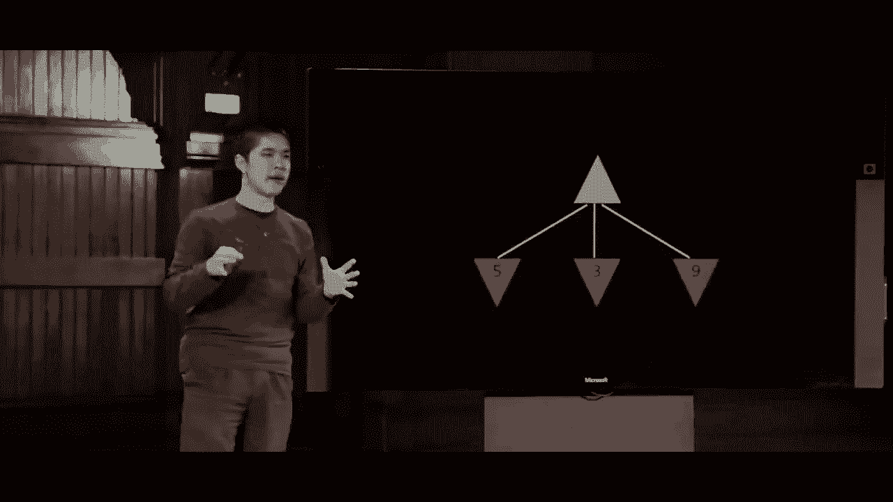

the minimax tree where these are each，States but I'm no longer representing。

them it's exactly like tic-tac-toe，boards and this is just representing。

some generic game that might be，tic-tac-toe might be some other game。

altogether any of these green arrows，that are pointing up that represents a。

maximizing state I would like the score，to be as big as possible and any of。

these red arrows pointing down those are，minimizing states where the player is。

the min player and they are trying to，make the score as small as possible so。

if you imagine in this situation I am，the maximizing player this player here。

and I have three choices one choice，gives me a score of five one choice。

gives me a score of three and one choice，gives me a score of nine。

well then between those three choices my，best option is to choose this nine over。

here the score that maximizes my options，out of all the three options and so I。

can give this state a value of nine，because among my three options。

that is the best choice that I have，available to me so that's my decision。

now you imagine it's like one move away，from the end of the game but then you。

could also ask a reasonable question。

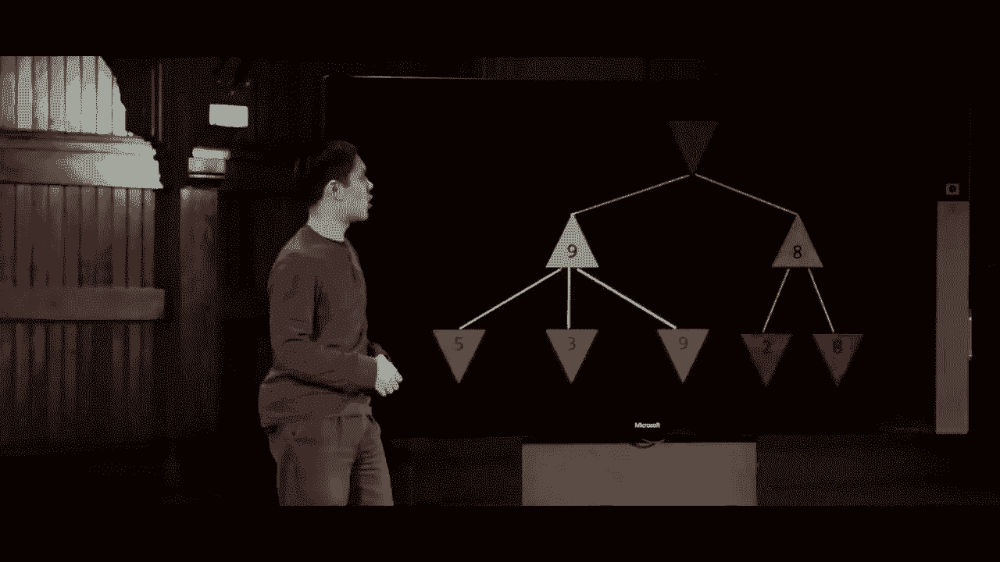

what might my opponent do two moves away，from the end of the game my opponent is。

the minimizing player they are trying to，make the score as small as possible。

imagine what would have happened if they，had to pick which choice to make one。

choice leads us to this state where I，the maximizing player I'm going to opt。

for nine the biggest score that I can，get and one leads to this state where I。

the maximizing player would choose eight，which is then the largest score that I。

can get now the minimizing player forced，to choose between a 9 or an 8 is going。

to choose the smallest possible score，which in this case is an 8 and that is。

then how this process would unfold but，the minimizing player in this case。

considers both of their options and then，all of the options that would happen as。

a result of that so this now is a，general picture of what the minimax。

algorithm looks like let's now try to，formalize it using a little bit of。

pseudocode so what exactly is happening，in the minimax algorithm。

well given a state s we need to decide。

what to happen the max player if it's，Max's players turn then max is going to。

pick an action a in actions of us recall，that actions is a function that takes a。

state and gives me back all of the，possible actions that I can take it。

tells me all of the moves that are，possible the max player is going to。

specifically pick an action a in the set，of actions that gives me the highest。

value of min value of result of SN a so，what does that mean well it means that I。

want to make the option that gives me，the highest score of all of the actions。

a but what score is that going to have，to calculate that I need to know what my。

opponent the min player is going to do，if they try to minimize the value of the。

state that results so we say what state，results after I take this action and。

what happens when the min player tries，to minimize the value of that state I。

consider that for all of my possible，options and after I've considered that。

for all of my possible options I picked，the action a，that has the highest value likewise the。

min player is going to do the same thing，but backwards they're also going to。

consider what are all of the possible，actions they can take if it's their turn。

and they're going to pick the action a，that has the smallest possible value of。

all the options and the way they know，what the smallest possible value of all。

the options is is by considering what，the max player is going to do by saying。

what's the result of applying this，action to the current state and then。

what would the max player try to do what，value would the max player calculate for。

that particular state so everyone makes，their decision based on trying to。

estimate what the other person would do，and now we need to turn our attention to。

these two functions max value and min，value how do you actually calculate the。

value of a state if you're trying to，maximize its value and how do you。

calculate the value of a state if you're，trying to minimize the value if you can。

do that then we have an entire，implementation of this minimax algorithm。

so let's try it let's try and implement，this max value function that takes a。

state and returns as output the value of，that state if I'm trying to maximize the。

value of the state well the first thing，I can check for is to see if the game is。

over because if the game is over in，other words if the state is a terminal。

state then this is easy I already have，this utility function that tells me what。

the value of the board is if the game is，over I just checked like did x-wind a no。

win is it a tie and this utility，function just knows what the value of。

the state is what's trickier is if the，game isn't over because then I need to。

do this recursive reasoning about，thinking what is my opponent going to do。

on the next move and I want to calculate，the value of this state and I want the。

value of the state to be as high as，possible and I'll keep track of that。

value in a variable called V and if I，want the value to be as high as possible。

I need to give V an initial value and，initially I'll just go ahead and set it。

to being as low as possible because I，don't know what options are available to。

me yet so initially I'll set V equal to，negative infinity which seems a little。

bit strange but the idea here is I want，the value initially to be a low as low。

as possible because as I consider my，actions I'm always going to try and do，better。

than V and if I set V to negative，infinity I know I can always do better。

than that so now I consider my actions，and this is going to be some kind of。

loop where for every action in actions，of state recall actions as a function。

that takes my state and gives me all the，possible actions that I can use in that。

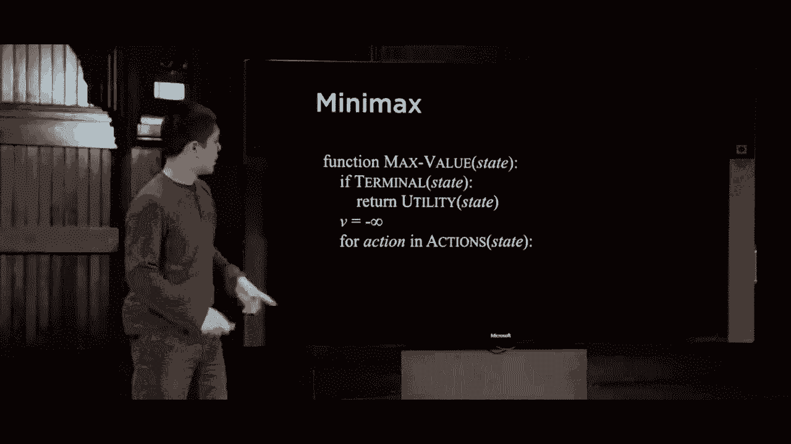

state so for each one of those actions I，want to compare it to V and say alright。

V is going to be equal to the maximum of，V and this expression so what is this。

expression well first it is get the，result of taking the action in the state。

and then get the min value of that in，other words let's say I want to find out。

from that state what is the best that，the min player can do if they're gonna。

try and minimize the score so whatever，the resulting score is of the min value。

of that state compare it to my current，best value and just pick the maximum of。

those two because I am trying to。

maximize the value in short with these，three lines of code are doing are going。

through all of my possible actions and，asking the question how do I maximize。

the score given what my opponent is，going to try to do after this entire。

loop I can just return via and that is，now the value of that particular state。

and for the min player it's the exact，opposite of this the same logic just。

backwards to calculate the minimum value，of a state first we check if it's a。

terminal state if it is we return into，utility otherwise we're going to now try。

to minimize the value of the state given，all of my possible actions so I need an。

initial value for V the value of the，state and initially I'll set it to。

infinity because I know it can always，get something less than infinity so by。

starting with V equals infinity I make，sure that the very first action I find。

that will be less than this value of V，and then I do the same thing loop over。

all of my possible actions and for each，of the results that we could get when。

the max player makes their decision，let's take the minimum of that and the。

current value of e so after all is said，and done I get the smallest possible。

value of V that I then return back to。

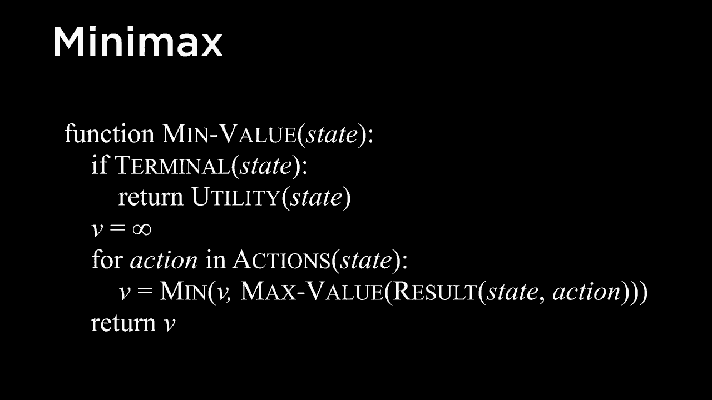

the user so that in effect is the pseudo，code for minimax that is how we take a。

game and figure out what the best move，to make is by recursively using these。

max value and min value functions where，max value calls min value min value。

calls Max value back and forth all the，way until we reach a terminal state at。

which point our algorithm can simply，return the utility of that particular。

state what you might imagine is that，this is going to start to be a long。

process especially as games start to get，more complex as we start to add more。

moves and more possible options and，games that might last quite a bit longer。

so the next question to ask is what sort，of optimizations can we make here how。

can we do better in order to use less，space or take less time to be able to。

solve this kind of problem and we'll，take a look at a couple of possible。

optimizations but for one we'll take a，look at this example again returning to。

these up arrows and down arrows let's，imagine that I now and the max player。

this green arrow I am trying to make，this score as high as possible and this。

is an easy game where there are just two，moves I make a move one of these three。

options and then my opponent makes a，move one of these three options based on。

what move I make and as a result we get，some value let's look at the order in。

which I do these calculations and figure，out if there are any optimizations I。

might be able to make to this，calculation process I'm gonna have to。

look at these states one at a time so，let's say I start here on the left and。

say all right now I'm gonna consider，what will the min player my opponent try，to do here。

well the min player is going to look at，all three of their possible actions and。

look at their value because these are，terminal states they're the end of the。

game and so they'll see alright this，node is a value of four value of eight。

value of five and the min player is，going to say well alright between these。

three options for eight and five I'll，take the smallest one I'll take the four。

so this state now has a value of four，then I is the max player say all right。

if I take this action it will have a，value of four that's the best that I can。

do because min player is going to try，and minimize my score so now what if I。

take this option we'll explore this next，and now explore what the min player。

would do if I choose this action and the，min player is going to say alright what。

are the three options the min player has，options between nine three and seven and。

so three is the smallest among nine，seven so we'll go ahead and say this。

state has a value of three so now I as，the max player I have now explored two。

of my three options I know that one of，my options will guarantee me a score of。

four at least and one of my options will，guarantee me a score of three and now I。

consider my third option and say all，right what happens here same exact logic。

the min player is gonna look at these，three states two four and six say the。

minimum possible option is two so the，min player wants the two now I as the。

max player have calculated all of the，information by looking two layers deep。

by looking at all of these nodes and I，can now say between the four the 3 and。

the 2 you know what I'd rather take，before because if I choose this option。

if my opponent plays optimally they will，try and get me to the 4 but that's the。

best I can do I can't guarantee a higher，score because if I pick either of these。

2 options I might get a 3 or and I get a，2 and it's true that you know down here。

is a 9 and that's the highest score out，of any of the scores so I might be。

tempted to say you know what maybe I，should take this option because I might。

get the 9 but if the min player is，playing intelligently if they're making。

the best moves and each possible option，they have when they get to make a choice。

I'll be left with the 3 whereas I could，better playing optimally have guaranteed。

that I would get the 4 so that is an，effect the logic that I would use as a。

mini max player trying to maximize my，score from that node there but it turns。

out they took quite a bit of computation，for me to figure that out I had to。

reason through all of these nodes in，order to draw this conclusion and this。

is for a pretty simple game where I have，three choices my opponent has three。

choices and then the game's over so what，I'd like to do is come up with some way。

to optimize this maybe I don't need to，do all of this calculation to still。

reach the conclusion that you know what，this action to the left that's the best。

that I could do let's go ahead and try，again and try and be a little more。

intelligent about how I go about doing，this so first I start the exact same way。

I don't know what to do initially so I，just have to consider one of the options。

and consider what the min player might，do min has three options for 8 and 5 and。

between those three options min says 4，is the best they can do because they。

want to try to minimize the score now I，the max play，we'll consider my second option making。

this move here and considering what my，opponent would do in response。

what will the min player do well the min，player is going to from that state look。

at their options and I would say all，right 9 is an option 3 is an option and。

if I am doing the math from this initial，state doing all this calculation when I。

see a 3 that should immediately be a red，flag for me because when I see a 3 down。

here at this state I know that the value，of this state is going to be at most 3。

it's going to be 3 or something less，than 3 even though I haven't yet looked。

at this last action or even a few，further actions if there were more。

actions that could be taken here how do，I know that well I know that the min。

player is going to try to minimize my，score and if they see a 3 the only way。

this could be something other than a 3，is if this remaining thing that I。

haven't yet looked at is less than 3，which means there is no way for this。

value to be anything more than 3 because，the min player can already guarantee a 3。

and they are trying to minimize my score，so what does that tell me。

well it tells me that if I choose this，action my score is going to be 3 or。

maybe even less than 3 if I'm unlucky，but I already know that this action will。

guarantee me a 4 and so given that I，know that this action guarantees me a。

score of 4 and this action means I can't，do better than 3 if I'm trying to。

maximize my options there is no need for，me to consider this triangle here there。

is no value no number that could go here，that would change my mind between these。

two options I am always going to up for，this path that gets me a 4 as opposed to。

this path where the best I can do is a 3，if my opponent plays optimally and this。

is going to be true for all the future，states that I look at too but if I look。

over here at what min player might do，over here if I see that this state is a。

2 I know that this state is at most a 2，because the only way this value could be。

something let other than two is if one，of these remaining states is less than。

the 2 and so the min player would opt，for that instead so even without looking。

at these remaining states I is the，maximizing player can know that choosing，better。

then choosing either of those two paths，to the right because this one can't be。

better than three this one can't be，better than two and so for in this case。

is the best that I can do so in order to，do this guy and I can say now that this。

state has a value of four so in order to，do this type of calculation I was doing。

a little bit more bookkeeping keeping，track of things keeping track all the。

time of what is the best that I can do，what is the worst that I can do and for。

each of these states saying all right，well if I already know that I can get a。

four then if the best I can do at this，consider it，I can effectively prune this leaf and。

anything below it from the tree and it's，for that reason this approach this。

optimization to minim acts it's called，alpha beta pruning alpha and beta stand。

for these two values you'll have to keep，track of the best you can do so far and。

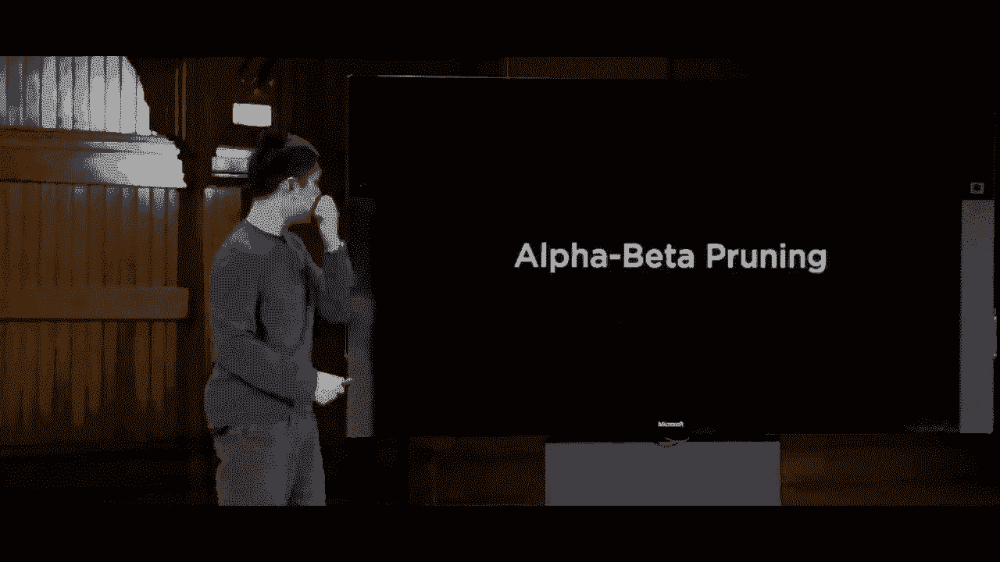

the worst you can do so far and pruning，is the idea of if I have a big long deep。

search tree I might be able to search it，more efficiently if I don't need to。

search through everything if I can，remove some of the nodes to try and。

optimize the way that I look through，this entire search space so alpha beta。

pruning can definitely save us a lot of，time as we go about the search process。

by making our searches more efficient，but even then it's still not great as，games get more complex。

tic-tac-toe fortunately it's a，relatively simple game and we might。

reasonably ask a question like how many。

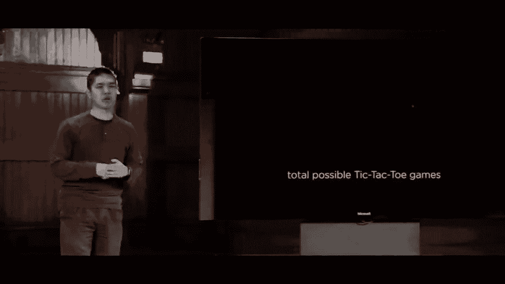

total possible tic-tac-toe games are，there you can think about it you can try。

and estimate you know how many moves are，there at any given point。

how many moves long in the game last it。

turns out there are about two hundred，and fifty-five thousand possible。

tic-tac-toe games that can be played but，compare that to a more complex game。

something like a game of chess for，example far more pieces far more moves。

games that last much longer how many。

total possible chess games could there，be it turns out that after just four。

moves each four moves by the white，player four moves by the black player。

that there are 288 billion possible，chess games that can result from that，situation。

after just four moves each and going，even further if you look at entire chess。

games and how many possible chess games。

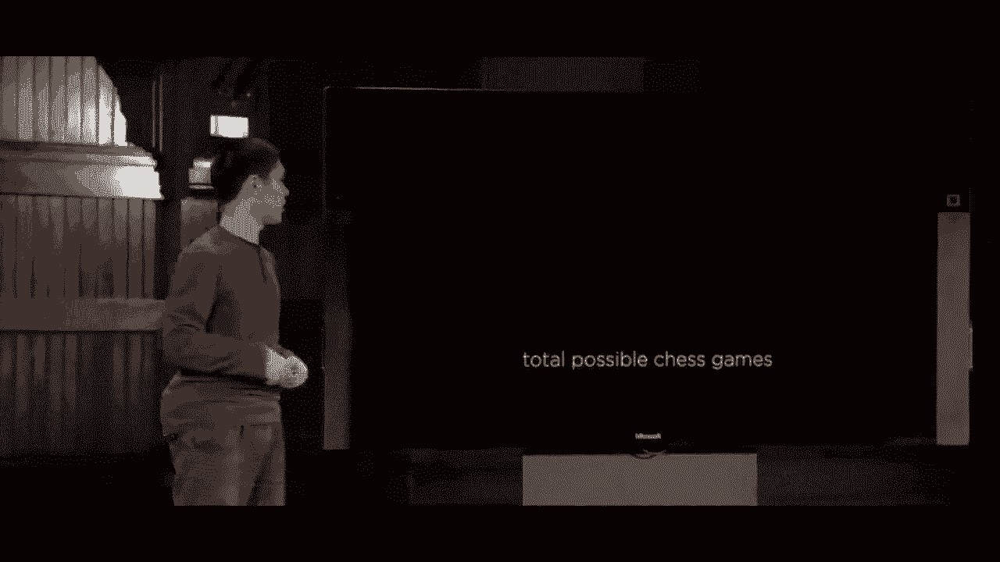

there could be as a result，they're there more than ten to the，twenty-nine thousand possible chess。

games far more chess games than could，ever be considered and this is a pretty。

big problem for the minimax algorithm，because the minimax algorithm starts。

with an initial state considers all the，possible actions and all the possible。

actions after that all the way until we，get to the end of the game and that's。

going to be a problem if the computer is，going to need to look through this many。

states which is far more than any，computer could ever do in any reasonable。

amount of time so what do we do in order，to solve this problem instead of looking。

through all these states which is，totally intractable for a computer we。

need some better approach and it turns，out that better approach generally takes。

the form of something called depth。

limited minimax where normally minimax，is depth unlimited we just keep going。

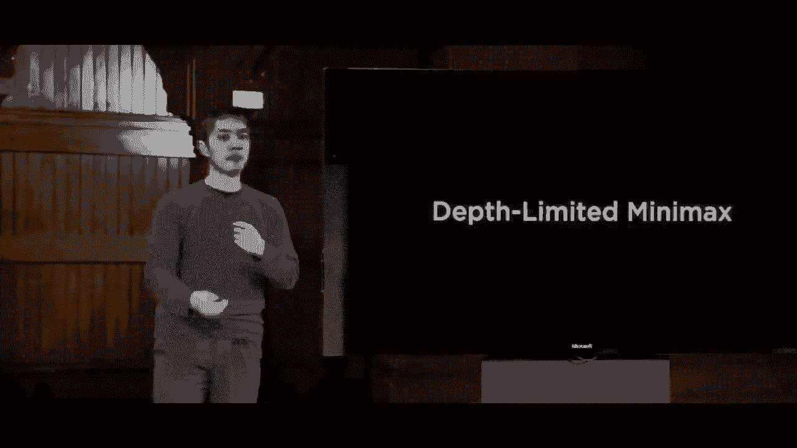

layer after layer move after move until，we get to the end of the game depth。

limited minimax is instead going to say，you know what after a certain number of。

moves maybe I'll look ten moves ahead。

maybe I'll look twelve moves ahead but，after that point I'm going to stop and。

not consider additional moves that might。

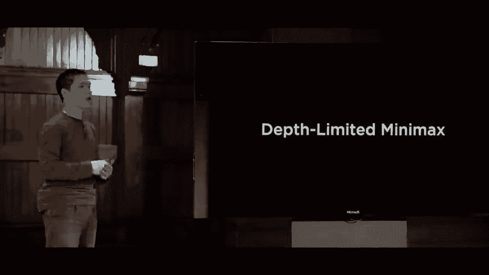

come after that just because it would be，computationally intractable to consider。

all of those possible options but what，do we do after we get ten or twelve。

moves deep and we arrive at a situation，where the game's not over minimax still。

needs a way to assign a score to that，game board or game state to figure out。

what its current value is which is easy，to do if the game is over but not so。

easy to do if the game is not yet over，so in order to do that we need to add。

one additional feature to depth limited，minimax called an evaluation function。

which is just some function that is，going to estimate the expected utility。

of a game from a given state so in a，game like chess if you imagine that a。

game value of 1 means white wins，a draw，then you might imagine that a score of，like 0。

8 means white is very likely to，win now certainly not guaranteed and you。

would have an evaluation function that，estimates how good the game state。

happens to be and depending on how good，that evaluation function is that is。

ultimately what's going to constrain how，good the a is the better the AI is at。

estimating how good or how bad any，gamestate is the better the AI is going。

to be able to play that game if the，evaluation function is worse and not as。

good as it estimating what the expected，utility is then it's going to be a whole。

lot harder and you can imagine trying to，come up with these evaluation functions。

in chess for example you might write an，evaluation function based on how many。

pieces you have as compared to how many，pieces your opponent has because each。

one has a value and your evaluation，function function probably needs to be a。

little bit more complicated than that，to consider other possible situations。

that might arise as well and there are，many other variants on minimax and add。

additional features in order to help，perform better under these larger more。

computationally intractable situations，where we couldn't possibly explore all。

of the possible moves so we need to，figure out how to use evaluation。

functions and other techniques to be，able to play these games ultimately。

better but this now was a look at this，kind of adversarial search these search。

problems where we have situations where，I am trying to play against some sort of。

opponent and these search problems show，up all over the place throughout。

artificial intelligence we've been，talking a lot today about more classical。

search problems like trying to find，directions from one location to another。

but anytime an eye is faced with trying，to make a decision like what do I do now。

in order to do something that is，rational or do something that is。

intelligent or trying to play a game，like figuring out what move to make。

these sort of algorithms can really come，in handy it turns out that for。

tic-tac-toe the solution is pretty，simple because it's a small game xkcd is。

famously put together a webcomic where，he will tell you exactly what move to。

make is the optimal move to make no。

matter what your opponent happens to do，this type of thing is not quite as。

possible for a much larger game like，checkers or chess for example where。

chess is totally computationally，intractable for most computers to be。

able to explore all the possible States，so we really need our AI to be far more。

intelligent about how they go about，trying to deal with these problems and。

how they go about taking this，environment that they find themselves in。

and ultimately searching for one of，these solutions so this then was a look。

at search in artificial intelligence，next time we'll take a look at knowledge。

thinking about how it is that our AIS，are able to know information reason。

about that information and draw，conclusions all。