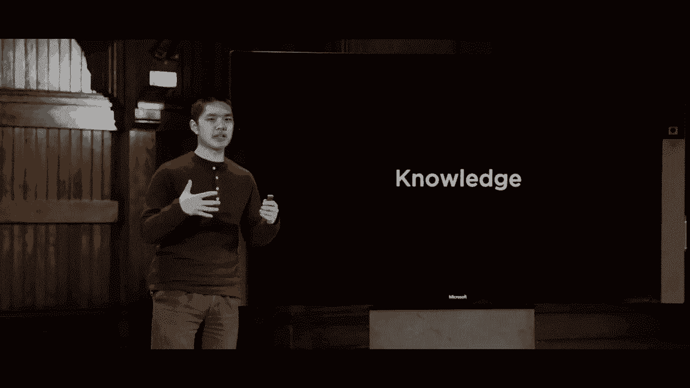
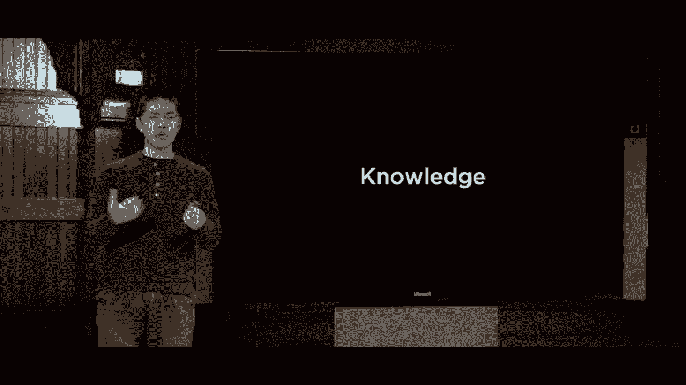
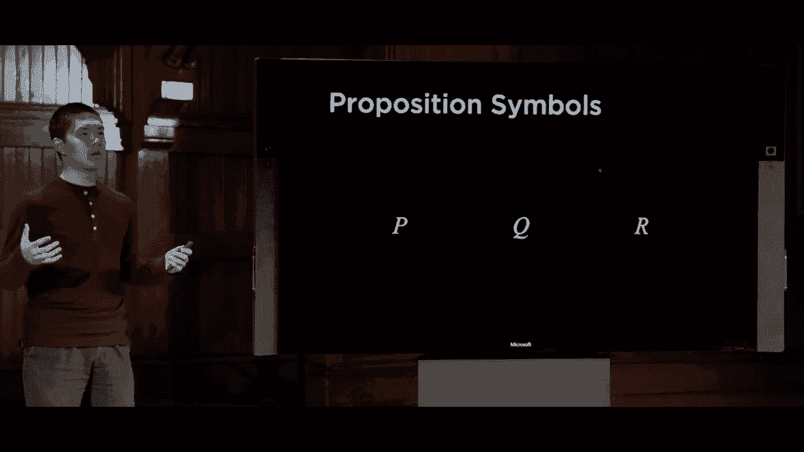
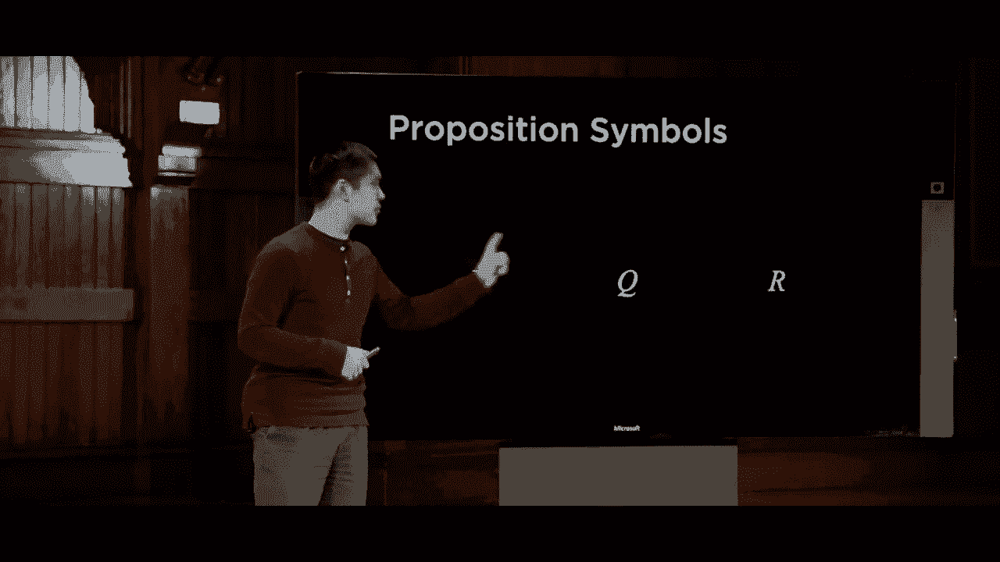
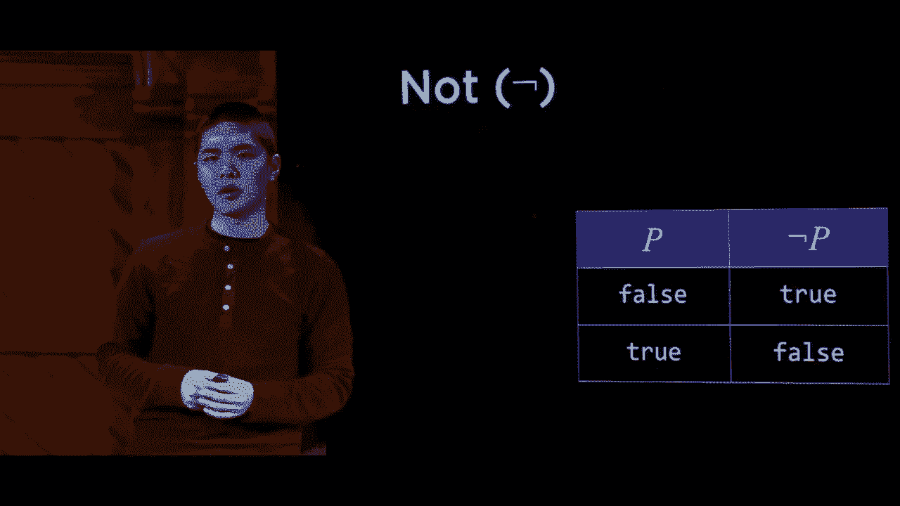
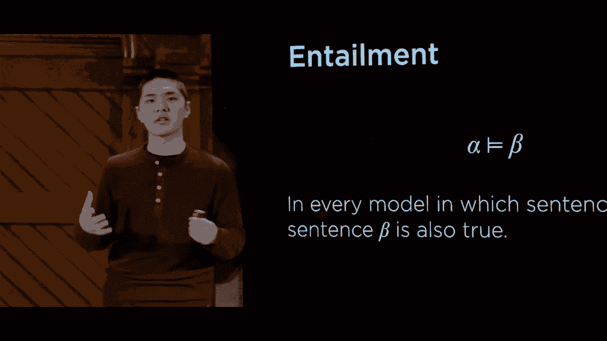
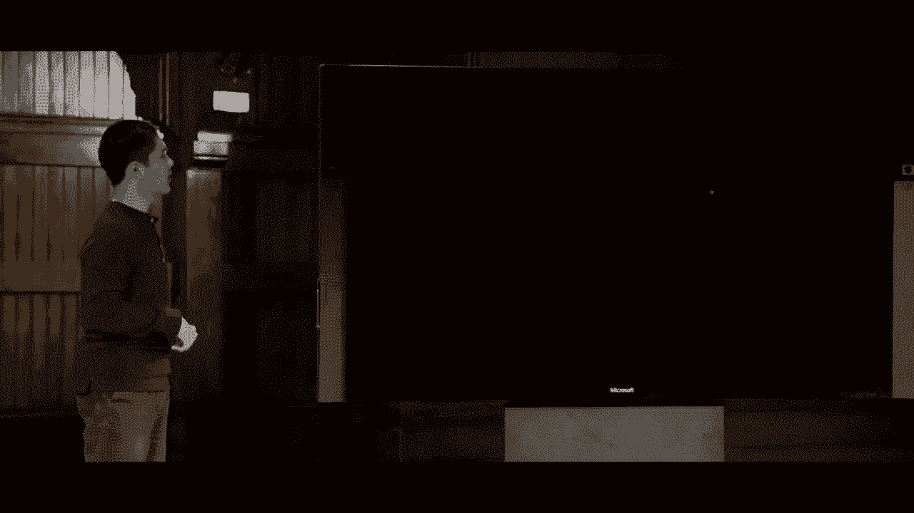

# 【双语字幕+资料下载】哈佛CS50-AI ｜ Python人工智能入门(2020·完整版) - P5：L1- 知识系统知识 1 (知识，逻辑) - ShowMeAI - BV1AQ4y1y7wy

Alright welcome back everyone to an introduction to artificial intelligence with python。Last time we talked to look at search problems in particular，We have ai agents。They're trying to solve some sort of problem，I taking actions and some sort of environment where does that environment is。I take actions by playing moves in a game or whether those actions or something like。

Trying to figure out where to make turns in order to get driving directions from point A，Point。This time we're going to turn our attention more generally to just this idea of knowledge。

A lot of intelligence is based on knowledge especially if we think about，Intelligence。People know information we know facts about the world and using that information that we know。

Able to draw conclusions reason about the information that we know。In order to figure out how to do something or figure out，Other piece of information that we conclude。

Based on the information we already have available to us，We'd like to focus on now。Is the ability to take this idea of knowledge and being able to reason based on knowledge and applied as ideas。Artificial intelligence，Particular we're going to be building。Are known as knowledge-based agents agents that are able to reason and act by representing knowledge internally。

Somehow inside of Rai，I have some understanding of what it means to know something，Ideally。How some algorithms are some techniques that can use based on that knowledge that they know in order to。Figure out the solution to a problem，Figure out，Additional piece of information。Can be helpful in Somerset，What do we mean by reasoning based on knowledge。

Be able to draw conclusions，Well let's look at a simple example drawn from the World of Harry Potter。We take one sentence that we know to be true，Imagine if it didn't even did it rain。Read Harry visited hybrid today，One fact，We might know about the world，Another fact。Harry visited Hagrid or Dumbledore today，Not though。

Tells us something about the world that Harry either visited Hagrid but not Dumbledore。Or Harry visited Dumbledore but not Hagrid，Now we have a third piece of information about the world。Harry visited Dumbledore，We now have three pieces of information out three facts inside of a knowledge base。Information that we know，And now we as humans can try and reason about this and figure out based on this information。

What additional information can we begin to conclude，Looking at these last two statements。Harry either visited Hagrid or Dumbledore，Not both，And we know the Perry visited Dumbledore today。It's pretty reasonable that we can draw the conclusion that you know what。Harry must not have visited Hagrid today，Based on a combination of these two statements。

You can draw this，Conclusion，Harry did not visit，Soccer today。Turns out we can even do a little bit better than that get some more information。I taking a look at this first statement and reasoning about that。First statement says if it didn't rain，Harry visited Hagrid today。

What does that mean in all cases where it didn't rain，We know that Harry visited Hagrid。If we also know now，Harry did not visit hybrid，That tells us something about our initial premise that we were thinking about。Particular，Pelvis，It did rain today，Because we can reason if it didn't rain。Harry would have visited Hagrid，We know for a fact，Harry did not，Hagrid today，This kind of reason。

A sort of logical reasoning where we use a logic based on the information that we know。In order to take information，And reach conclusions。Is going to be the focus of what we're going to be talking about today，How can we。Make artificial intelligence，Logix，The bacon performed，Same kind of deduction。

Same times of reasoning，We've been doing，Humans reason about logic generally in terms of human language that I just now。Speaking in English talking in English about these sentences and trying to reason through。How it is if they relate to one another and we're going to need to be a little bit more formal when we turn our attention to computers and being able to encode。Notion of logic and truth and falsehood，Inside of a machine。

We're going to need to introduce a few more terms，Nephew symbols。It'll help us reason through if idea of logic，Inside of an artificial。We'll begin with the idea of a sentence。

Now a sentence in a natural language like English is just。Something that I'm saying like what I'm saying right now，In the context of AI though，Sentences。Assertion about the world，What we're going to call a knowledge representation。Some way of representing knowledge，Inside，Harkin theaters。

And wait we're going to spend most of today，Reasoning about knowledge。Through a type of logic known as propositional。

Number of different types of logic some of which will touch on，Propositional logic。Is based on the logic of，Proposition statements about the world，Beginning propositional logic。Definition of propositional symbol。

People have certain symbols，Often times just letters something like P or Q or are we reach of those symbols is going to represent。Fun fact or sentence，About the world，P4 example，I represent the fact that，It is raining。Poppy is going to represent a symbol，Represents that idea and Q4 example might represent。Harry visited Hagrid today，Which of these propositional symbols，Represent，Sentence with some。

About the world，Listen to just having individual tax about the world。

I want some way to connect，Propositional symbols together，In order to reason more complexly。But other facts that might exist inside of the world in which we reasoning。

Phone order to do that we'll need to introduce some additional symbols。Better known as logical connective，There are a number of these logical connective。5 of the most important in the ones we're going to focus on today，Are these five up here。Is represented by a logical symbol，Not，Is represented by this symbol here。

And is represented as sort of an upside-down V or is represented by a v-shape implication and we'll talk about what that means and just a moment。Is represented by an arrow，Biconditional again we'll talk about what that means in a moment。Is represented by these Double Arrow，These five logical connectives。The main ones were going to be focusing on，In terms of thinking about，How it is that a computer can。

Reason about facts，Rock inclusions，Based on the facts。But in order to get there we need to take a look at each of these logical connective。And build up an understanding for what it is that they actually mean，Let's go ahead and begin。It's not simple here，What we're going to show for each of these logical connectors。

But we're going to call a truce，Table that demonstrates what this word not means。When we attach it to，Propositional symbol or any sentence，Inside of our logical language，Truth table。Sean right here，Propositional symbol or some other sentence even，False，Then not pee，It's true。And if p is true，Then not pee，You can imagine that placing this not symbol in front of some sentence of propositional logic。

The opposite of，If for example。Presented，It is raining，Been naughty，Represent the idea that。It is not raining，Expect if p is false，Meaning if a sentence，It is raining。Well then the sentence not pee，Paw Patrol，Sentence that it is not raining，Is there for trip。

Not you can imagine just takes whatever is in pee and it inverts，False。

The true，True，Much analogously，What the English word not mean，Ticking。Whatever comes after it and inverting it to mean the opposite，Next up and also very English like。Is a tidy of ants represented by this upside down V shape for this point shape。And as opposed to just taking a single argument the way not does we have p，We have not pee。

And going to combine，Two different，Sentences in propositional logic，So I might have one sentence p。Enloe sentence Q，I want to combine them together，Say，P and Q。And the general Logic for what p&q means，It means that both，With operandi，He is true，And also。Here's what that truth table，What time we have two variables p and Q。

When we have two variables Each of which can be into possible States，True or false。That leads to two squared or 4，Possible combinations of Truth and falsehood。The assault Incubus Falls，PS alternative is true，He is true Incubus false，P and Q both。Those are the only four possibilities，What p and Q could mean，Each of the situation。

Fifth Third column here pnq is telling us a little bit about what it actually means，Pnq。The only case where P and he was true，Fitness for throw here，PA，Happens to be true，Q。Also happens to be true，All other situations，B&Q，Going to evaluate to false。This again is much in line with what our intuition up and bite me if I say p and Q，Probably mean。

I expect both p and Q，Also potentially consistent with what we mean，Is this word or。Represented by this v-shaped sort of an upside-down and simple，And or。As the name suggests is true if，Either of its arguments are true，As long as p is true or two is true。Send peor Que，Going to betray him，Which means the only time，P or Q is false。

Is if both of its operations are false，PS false，And kiwi sauce，Ben peor Que，Going to be false。But in all other cases，At least one of the operand is true。Maybe they're both true in which case P or Q，Going to evaluate the trip。This is mostly consistent with the way that most people might use the word。

Or innocence of speaking the word or in normal English。There is sometimes when we might say or where we mean，Eeyore too，But not both。Weenie in there they can only be one or the other，It's important to note that this symbol here this or。Means P or Q，For those are totally okay，As long as either or both of them are true。

Any or is going to evaluate，Be true as well it's only in the case，All of the operations are false。Peor Que，Ultimately evaluates to false as well，Logic there's a number another symbol。Notice Me exclusive or which encodes this idea of exclusivity of like one or the other，Not both。We're not going to be focusing on that today whenever we talked about or。

Always talking about either or both in this case，Represented，Table，That now is not an and and or。Next up is what we might call implication，Fascinated by this arrow symbol。Do we have p and two and this sentence here will generally read as p，Implies Q。What P implies Q means，If p is true，Ben，Finite say something like，If it is raining。

Then I will be indoors，Meeting，It is raining，Plies，I will be indoors，Illogical sentence。Something there，The truth table for this，Sometimes be a little bit tricky，Obviously if p is true。And Q is true，Askew，That's true，Definitely makes sense。And it should also stand to reason that when p is true，She was false，PM v q is false，Cousin。

If I said to you，If it is raining then I will be out indoors，And it is raining，But I'm not indoors。Well then it would seem to be that my original statement was，Not true，Pm5k，The FPS true。BenQ also needs to be true and if it's not well then，Statement is salt。Also worth noting though is what happens when p is，PS4，Implication，Makes no claim at all。

If I say something like，If it is raining then I will be indoors，And it turns out it's not raining。Not case I am not making any statement as to whether or not I will be indoors or not，Askew。Just means that if Pia stroke you must be true，50 is not true。Can we make no Claim about whether or not Q，Neither takes，If p is false。

It doesn't matter what Q it's weather is false or true。Not making any Claim about you whatsoever we can still evaluate，Invitation。The only way that the implication is over false is if，Apprentice p is true，With the conclusion。We're drying Q，That case we would say，Does not，Like you。

Finally the last connected but will discuss is this biconditional。You can think of a biconditional as a condition that goes in both directions。Originally when I said something like，If it is raining then I will be indoors。I didn't say what would happen if it wasn't written，Maybe I'll be indoors maybe I'll be outdoors。

This biconditional you can read，Even if，And only if，So I can say。If it is I will be indoors if and only if，It is raining。Meeting if it is raining then I will be indoors，And if I'm indoors it's reasonable to conclude。Where is all terrain，This biconditional is only true，When p and Q，PS3，And Q is true。

Dennis biconditional is also true p。m。5q，But also the reverse is True Q also，5p，So。Pnq both happen to be false，You would still say it's true but in any of these other two situations this P if and only if Q is going to ultimately evaluate the fall。A lot of Truth and Salsas going on there，These five basic logical connectives。Going to form the core of the language of propositional logic。

Language that we're going to use in order to describe ideas。The language we're going to use in order to reason about those ideas，In order to draw。Let's not take a look at some of the additional terms will need to know about。In order to go about trying to form this language of propositional logic。

Writing a guy that's actually able to understand the sort of logic，Next thing we're going to need it。Is the notion of what is actually true，About the world we have a whole bunch of propositional symbols p and Q and R and maybe others。We need some way of knowing，What actually is true in the world is p true or false is Q true or false so on。Do that will introduce the notion，Model，Assigns a truth value，Retrieve value is either true or false。

Every propositional Simba，Otherwise it's creating we might call a，Possible world。Example if for example I have two propositional symbols，He is it is raining，Q is it is a Tuesday。A model just takes each of these to its symbolism，Find the truth value today，Either true。Or false the here's a sample model，This model，Another words in this，Possible world，It is possible。

PS4 you meaning it is raining，Thank you is false meaning it is not。There are other possible worlds are other models ，as well there is some model we're both of these variables are true。N variables，Propositional symbols like this that are either true。False in the number of possible models，YouTube，Each of these possible models。

Possible variables within my model，Either true，Or false if I don't know any information。So now that I have the the symbols and they can't use the symbols in the connectives that I'm going to need。In order to construct，These parts of knowledge，Need some way to represent。It's due so we're going to allow Rai access what will call，Knowledge base。

Your knowledge base is really just，Instead of sentences，Rai，Nearest beach。Set of sentences in propositional logic，Things that are AI，No，Route to work。We might tell Rai some information，Information about a situation，Find itself in。Situation about a problem，Happened to me trying to solve。

We would give that information to the AI the AI would storm inside of its knowledge base。What happens next is the a I would like to use that information in the knowledge base。Be able to draw conclusions about the rest of the world，What do those conclusions look like。Understand those conclusions will need to introduce one more idea one more symbol。

That is the notion of entailment，So，This sentence here with this double turnstile in these Greek letters this is the Greek letter Alpha and the Greek letter beta。Read this as，Alpha，Entails，Alpha and beta are are just sentences，Propositional logic。And what this means，Is the alpha entails beta，Means that in every model。In other words in every possible world，In which sentence is true，Alphas true。

In sentence betta is also true，Do something entails something else if Alpha entails beta。It means that if I know Alpha to be true，10 beta，Must therefore also，If my Alpha，Something like。I know，That it is a Tuesday in January，Then a reasonable beta，Might be something like。I know that it is genuine，Because it all worlds where the Tuesday in January。

I know for sure that it must be January，Definition this first statement or sentence about the world。

Entails，Second statement and we can reasonably use deduction。Based on that first sentence to figure out，Second sentence，As well。Ultimately it's this idea of entailment，We're going to try and code，For computer we want Rai agent。Be able to figure out，What the possible entailment are。

Monterey eye to be able to take these three sentences sentences like。Didn't train Harry visited Hagrid，Harry visited Hagrid or Dumbledore but not both。And Harry visited Dumbledore，And just using that information，Like Rai to be able to infer。Or figure out，Using these three sentences inside of a knowledge base，Can draw，Conclusion。

Particular we can draw the conclusions here，1，Harry did not visit Agra today。We can drop the entailment to，Did，Rain today，This process is known as in。That's what we're going to be focusing on today in this process，Deriving new sentences。I give you these three sentences you put them in the knowledge base inside the IIA。

Any AI is able to use some sort of inference algorithm，Figure out，These two sentences，Also。That is how we Define，Let's take a look at an inference examples of how we might actually go about inferring things。Human sense，Before we take a more algorithmic approach the same。How we can encode this idea of inference in Ai and we'll see there are a number of ways。

We can actually achieve，So again will deal with a couple of propositional symbols。

I will deal with p q and r，He is it is it Tuesday，Kiwis it is raining。And our is Harry will go for a run，Propositional sandbothe，We're just defining。Not saying anything yet about whether they're true or false，Or just defining。Now we'll give ourselves or an AI，Access to knowledge base abbreviated to KB。

Knowledge that we know about the world we know，Statement。Parentheses here just use for president so we can see，What associate with what。But you would read this as，And，Not too，Plies，What is that meaning of put a b piece by piece。He is it is a Tuesday，Q is it is raining，Not to is it is not raining。

And implies are is Harry will go for a run，The way to read this entire sentence in human natural language release。If it is a Tuesday，And it is not raining，Then Harry will go for a run。So if it is a Tuesday and it's not raining，Then Harry will go for a run。That is now inside of our knowledge base，Let's now imagine that our knowledge base has two other pieces of information as well。

The information that p is true，It is a Tuesday，And we also have the information，Not cute。It is not raining，This sentence Q it is raining happens to be false。North of the three sentences do we have access to，He and not q implies are，P，Accu。Using that information we should be able to draw some inferences，Key and not to。

Is only true if both p，And not your true alright we know the PS4。And we know that not cutest true so we know that this whole expression is true。The definition of implication，Give if this whole thing on the left is true。Turn this thing on the right，Also be true，If we know the piano。 Q is true，When are。

Must be true as well to the inference we should be able to draw from all of this，Is that are is true。We know that Harry，Go for a run，Taking this knowledge inside of our knowledge base。Being able to reason。