# 【双语字幕+资料下载】哈佛CS50-AI ｜ Python人工智能入门(2020·完整版) - P6：L1- 知识系统知识 2 (推断，知识工程) - ShowMeAI - BV1AQ4y1y7wy

reason based on that idea and so this，ultimately is the beginning of what we。might consider to be some sort of，inference algorithm some process that we。can use to try and figure out whether or，not we can draw some conclusion and。ultimately what these inference，algorithms are going to answer is the。

central question about entailment given，some query about the world something。we're wondering about the world and，we'll call that query alpha the question。we want to ask using these inference，algorithms is does K be that our。knowledge base entail alpha in other，words using only the information we know。

inside of our knowledge base the，knowledge that we have access to can we。conclude that this sentence alpha is，true and that's ultimately what we would。like to do so how can we do that how can，we go about writing an algorithm。that can look at this knowledge base and，figure out whether or not this query。

alpha is actually true well it turns out，there are a couple of different。algorithms for doing so and one of the，simplest perhaps is known as model。checking now remember that a model is，just some assignment of all of the。propositional symbols inside of our，language to a truth value true or false。

and you can think of a model as a，possible world that there are many。possible worlds where different things，might be true or false and we can。enumerate all of them and the model，checking algorithm does exactly that so。what does our model checking algorithm，do well if we wanted to determine if our。

knowledge base entails some query alpha，then we are going to enumerate all。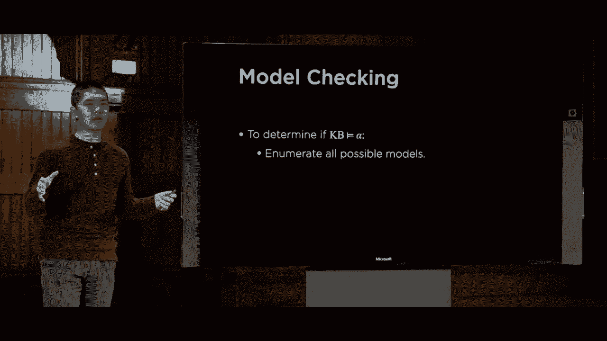

possible models in other words consider，all possible values of true and false。for our variables all possible states in，which our world can be in and if in。every model where our knowledge base is，true alpha is also true then we know。that the knowledge base entails alpha so，let's take a closer look at that。

sentence and try and figure out what it，actually means if we know that in every。model in other words in every possible，world no matter what assignment of true。and false two variables you give if we，know that whenever our knowledge is true。what we know to be true is true that，this query alpha is also true well then。

it stands to reason that as long as our，knowledge base is true then alpha must。also be true and so this is going to，form the foundation of our model。checking algorithm we're going to，enumerate all of the possible worlds and。ask ourselves whenever the knowledge，base is true is alpha true and if it's。

up that's the case then we know alpha to，be true and otherwise there is no。entailment our knowledge base does not，entail alpha alright so this is a little。bit abstract but let's take a look at an，example to try and put real。propositional symbols to this idea so，again we'll work with the same example P。

is it is a Tuesday Q is it is raining R，as hairy we'll go for a run our。knowledge base contains these pieces of，information P and not Q implies R we。also know P it is a Tuesday and not Q it，is not raining and our query our alpha。in this case the thing we want to ask is，are we，- no is it guaranteed is it entailed。

that Harry will go for a run so the，first step is to enumerate all of the。possible models we have three，propositional symbols here P Q and R。which means we have two to the third，power or eight possible models all false。false false true false true false false，true true etc eight possible ways you。

could assign true and false to all of，these models and we might ask in each。one of them is the knowledge base true，here the set of things that we know in。which of these worlds could this，knowledge base possibly apply to in。which world is this knowledge base true，well in the knowledge base for example。

we know P like we know it is a Tuesday，which means we know that these four。first four rows where P is false，none of those are going to be true or。going to work for this particular，knowledge base our knowledge base is not。true in those worlds likewise we also，know not Q we know that it is not。

raining so any of these models where Q，is true like these two and these two。here those aren't going to work either，because we know that Q is not true and。finally we also know that P and not Q，implies R which means that when P is。true or P is true here and Q is false Q，is false and these two then R must be。

true and if ever P is true Q is false，but R is also false，well that doesn't satisfy this。implication here that implication does，not hold true under those situations so。we could say that for our knowledge base，we can conclude under which of these。possible worlds is our knowledge base，true and under which of the possible。

worlds is our knowledge base false and，it turns out there is only one possible。world where our knowledge base is，actually true in some cases there might。be multiple possible worlds where the，knowledge base is true but in this case。it just so happens that there is only，one one possible world where we can。

definitively say something about our，knowledge base and in this case we would。look at the query the query of R is our，true R is true and so as a result we can，draw。conclusion and so this is this idea of，model checking enumerate all the。possible models and look in those，possible models to see whether or not if。

our knowledge base is true is the query，in question true as well so let's now。take a look at how we might actually go，about writing this in a programming。language like Python take a look at some，actual code that would encode this。notion of propositional symbols and，logic and these connectives like and and。

or and not an implication and so forth，and see what that code might actually。look like so I've written in advance a，logic library that's more detailed than。we need to worry about entirely today，but the important thing is that we have。one class for every type of a logical，symbol or connective that we might have。

so we just have one class for logical，symbols for example where every symbol。is going to represent and store some，name for that particular symbol and we。also have a class for naught that takes，an operand so we might say not one。symbol to say something is not true or，some other sentence is not true we have。

1/4 and 1/4 or so on and so forth and，I'll just demonstrate how this works and。you can take a look at the actual logic，pie later on but while go ahead and call。this file hairy pie we're gonna store，information about this world of Harry。Potter for example so I'll go ahead and，import from my logic module I'll import。

everything and in this library in order，to create a symbol you use capital S。symbol and I'll create a symbol for rain，to mean it is raining for example and。I'll create a symbol for Hagrid to mean，Harry visited Hagrid is what this symbol。is going to mean so this symbol means it，is raining this symbol means Harry。

visited Hagrid and I'll add another，symbol called Dumbledore for Harry。visited Dumbledore now I'd like to save，these symbols so that I can use them。later as I do some logical analysis so，I'll go ahead and save each one of them。inside of a variable so like rain Hagrid，and Dumbledore so you could call the。

variables anything and now that I have，these logical symbols I can use logical。connectives to combine them together so，for example if I have a sentence like。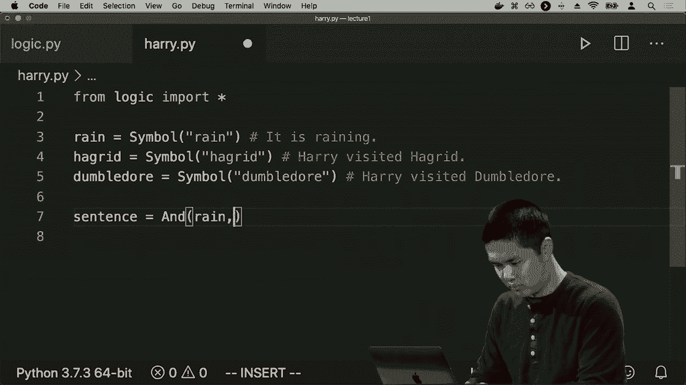

and rain and hagrid for example which is，not necessarily true but just for。demonstration I can now try and print，out sentence dot formula which is a。function I wrote that takes a sentence，in propositional logic and just prints。it out so that we the programmers can，now see this in order to get an。

understanding for how it actually works，so if I run Python Harry PI what we'll。

see is this sentence and propositional，logic rain and Hagrid this is the。logical representation of what we have，here in our Python program of saying and。whose arguments are rain and Hagrid so，we're saying rain and Hagrid by encoding。that idea and this is quite common in，Python object-oriented programming where。

you have a number of different classes，and you pass arguments into them in。order to create a new and object for，example in order to represent this idea。but now what I'd like to do is somehow，encode the knowledge that I have about。the world in order to solve that problem，from the beginning of class what we。

talked about trying to figure out who，Harry visited and trying to figure out。if it's raining or if it's not raining，and so what knowledge do I have I'll go。ahead and create a new variable called，knowledge and what do I know will I know。the very first sentence that we talked，about was the idea that if it is not。

raining then Harry will visit Hagrid so，alright how do i encode the idea that it。is not raining well I can use not and，then the rain symbol so here's me saying。that it is not raining and now the，implication is that if it is not raining。then Harry visited Hagrid so I'll wrap，this inside of an implication to say if。

it is not raining this first argument to，the implication，well then Harry visited Hagrid。so I'm saying implication the premise is，that it's not raining and if it is not。raining then Harry visited Hagrid and I，can print out knowledge dot formula to。see the logical formula equivalent of，that same idea so I run Python of Harry。

PI and this is the logical formula that，we see as a result which is a text-based。version of what we were looking at，before that if it is not raining then。that implies that Harry visited，Hagrid but there was additional，information。that we had access to as well in this，case we had access to the fact that。

Harry visited either Hagrid or，Dumbledore so how do I encode that well。this means that in my knowledge I've，really got multiple pieces of knowledge。going on I know one thing and another，thing and another thing so I'll go ahead。and wrap all of my knowledge inside of，an and and I'll move things on a new。

lines just for good measure but i know，multiple things so I'm saying knowledge。is an and of multiple different，sentences I know，multiple different sentences to be true。one such sentence that I know to be true，is this implication that if it is not。raining then Harry visited Hagrid，another such sentence that I know to be。

true is or Hagrid Dumbledore in other，words either，so Hagrid or Dumbledore is true because。I know that Harry visited Hagrid or，Dumbledore but I know more than that。

actually that initial sentence from，before said that Harry visited Hagrid or。Dumbledore but not both so now I want a，sentence that'll encode the idea that。Harry didn't visit both Hagrid and，Dumbledore well the notion of Harry。visiting Hagrid and Dumbledore would be，represented like this and of Hagrid and。

Dumbledore and if that is not true if I，want to say not that then I'll just wrap。this whole thing inside of a knot so now，these three lines line eight says that。if it is not raining then Harry visited，Hagrid line nine says Harry visited。Hagrid or Dumbledore and line 10 says，Hagrid didn't or Harry didn't visit both。

Hagrid and Dumbledore that it is not，true that both the Hagrid symbol and the。Dumbledore symbol are true only one of，them can be true and finally the last。piece of information that I knew was the，fact that Harry visited Dumbledore so。these now are the pieces of knowledge，that I know one sentence and Enloe the。

sentence and another and another and I。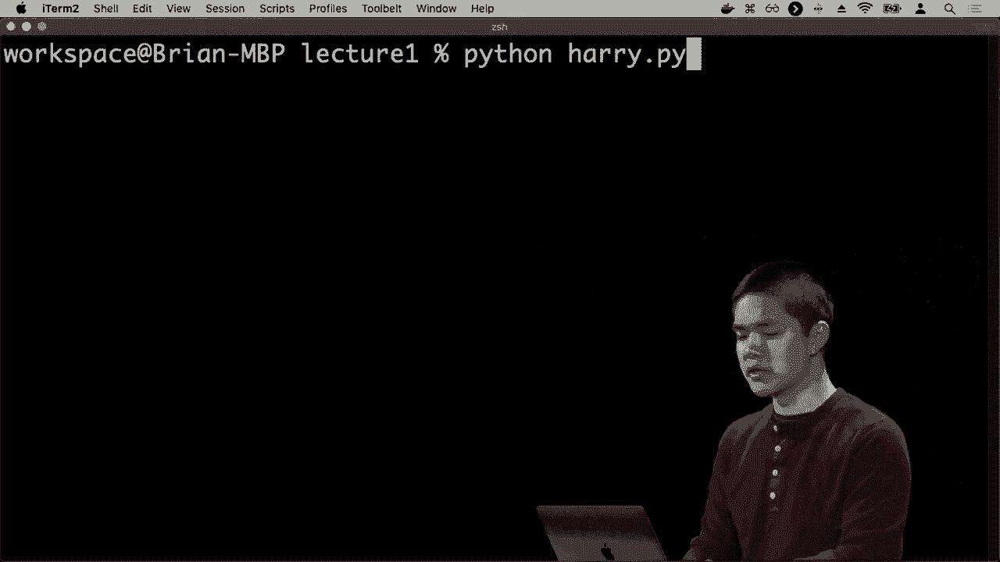

can print out what I know just to see it，a little bit more visually and here now。is a logical representation of the，information that my computer is now。internally representing using these，various different Python objects and。again take a look at logic pi if you，want to take a look at how exactly it's。

implementing this but no need，to worry too much about all of the。details there we're here saying that if，it is not raining then Harry visited。Hagrid we're saying that Hagrid or，Dumbledore is true and we're saying it。is not the case that Hagrid and，Dumbledore is true that they're not both。

true and we also know that Dumbledore is，true so this long logical sentence。represents our knowledge base it is the，thing that we know and now what we'd。like to do is we'd like to use model，checking to ask a query to ask a。question like based on this information，do I know whether or not it's raining。

and we as humans were able to logic our，way through it and figure out that all。right based on these sentences we can，conclude this and that to figure out。that yes it must have been raining but，now we'd like for the computer to do。that as well so let's take a look at the，model checking algorithm that is going。

to follow that same pattern that we drew，out in pseudocode a moment ago so I've。defined a function here in logic pi that，you can take a look at called model。check model check takes two arguments，the knowledge that I already know and。the query and the idea is in order to do，model checking I need to enumerate all。

of the possible models and for each of，the possible models I need to ask myself。is the knowledgebase true and is the，query true so the first thing I need to。do is somehow enumerate all of the，possible models meaning for all possible。symbols that exist I need to assign true，and false to each one of them and see。

whether or not it's still true and so，here is the way we're going to do that。we're going to start so I've defined，another helper function internally that。we'll get to in just a moment but this，function starts by getting all of the。symbols in both the knowledge and the，query by figuring out what symbols am i。

dealing with in this case the symbols，I'm dealing with are rain and Hagrid and。Dumbledore but there might be other，symbols depending on the problem and。we'll take a look soon at some examples，of situations where ultimately we're。going to need some additional symbols in，order to represent the problem and then。

we're going to run this check all，function which is a helper function。that's basically going to recursively，call itself checking every possible。configuration of propositional symbols，so we start out at by looking at this。check all function and what do we do，so if not symbols means if we finished。

assigning all of the symbols we've，assigned every symbol of value so far we。haven't done that but if we ever do then，we check in this model is the knowledge。true that's what this line is saying if，we evaluate the knowledge propositional。logic formula using the models，assignment of truth values is the。

knowledge true if the knowledge is true，then we should return true only if the。query is true because if the knowledge，is true we want the query to be true as。well in order for there to be entailment，otherwise we don't know that there。otherwise there won't be an INT element，if there's ever a situation where what。

we know in our knowledge is true but the，query the thing we're asking happens to。be false so this line here is checking，that same idea that in all worlds where。the knowledge is true the query must，also be true otherwise we can just。return true because if the knowledge，isn't true then we don't care this is。

equivalent to when we were enumerated，this table from a moment ago in all。situations where the knowledge base，wasn't true all of these seven rows here。we didn't care whether or not our query，was true or not we only care to check。whether the query is true when the，knowledge base is actually true which。

was just this green highlighted row，right there so that logic is encoded。using that statement there and otherwise，if we haven't assigned symbols yet which。we haven't seen anything yet then the，first thing we do is pop one of the。symbols I make a copy of the symbols，first just to save an existing copying。

but I pop one symbol off of the，remaining symbols so that I just pick。one symbol at random and I create one，copy of the model where that symbol is。true and I create a second copy of the，model where that symbol is false so I。now have two copies of the model one，where the symbol is true and one where。

the symbol is false and I need to make，sure that this entailment holds in both。of those models so I recursively check，all on the model where the statement is。true and check all on the model where，the statement is false so again you can。take a look at that function to try to，get a sense for how exactly this logic。

is working but in effect what it's doing，is recursively calling this check all，function。and again and again and on every level，of the recursion we're saying let's pick。a new symbol that we haven't yet，assigned assign it to true and assign it。to false and then check to make sure，that the entailment holds in both cases。

because ultimately I need to check every，possible world I need to take every。combination of symbols and try every，combination of true and false in order。to figure out whether the entailment，relation actually holds so that function。we've written for you but in order to，use that function inside of hairy pie。

what I'll write is something like this I，would like to model check based on the。knowledge and then I provide us a second，argument what the query is what the。thing I want to ask is and what I want，to ask in this case is is it raining。some model check again takes two，arguments the first argument is the。

information that I know this knowledge，which in this case is this information。that was given to me at the beginning，and the second argument rain is encoding。the idea of the query what am I asking I，would like to ask based on this。knowledge do I know for sure that it is。

rated and I can try and print out the，result of that and when I run this。program I see that the answer is true，that based on this information I can。

conclusively say that it is raining，because using this model checking。algorithm we were able to check that in，every world where this knowledge is true。it is raining in other words there is no，world where this knowledge is true and。it is not written so you can conclude。

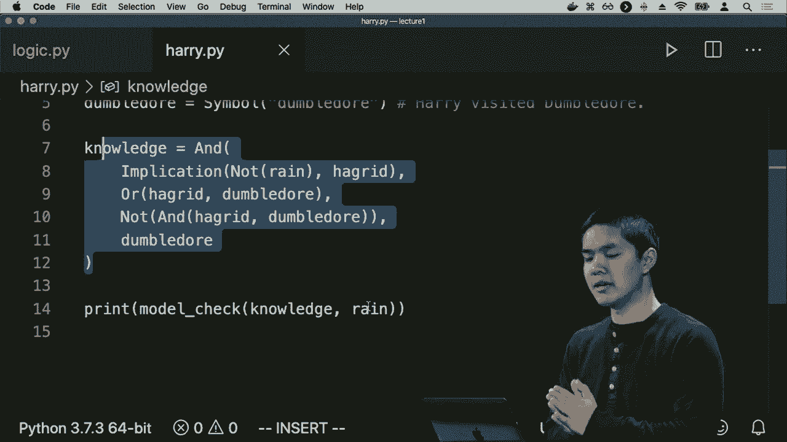

that it is in fact raining and this sort，of logic can be applied to a number of。different types of problems that if，confronted with a problem where some。sort of logical deduction can be used in，order to try to solve it，you might try thinking about what。propositional symbols you might need in，order to represent that information and。

what statements in propositional logic，you might use in order to encode that。information which you know and this，process of trying to take a problem and。figure out what propositional symbols to，use in order to encode that idea or how。to represent it logically is known as，knowledge engineering that software。

engineers and AI engineers will take a，problem and try and figure out how to。distill it down into knowledge that is，rep，by a computer and if we can take any。general-purpose problem some problem，that we find at the human world and turn。it into a problem the computer does know，how to solve as by using any number of。

different variables well then we can，take a computer that is able to do。something like model checking or some，other inference algorithm and actually。figure out how to solve that problem so，now we'll take a look at two or three。examples of knowledge engineering and，practice of taking some problem and。

figuring out how we can apply logical，symbolism and use logical formulas to be。able to encode that idea and we'll start，with a very popular board game in the US。and UK known as clue in the game of Clue，there's a number of different factors。that are going on but the basic premise，of the game if you've never played it。

before is that there are a number of，different people for now we'll just use。three Colonel Mustard professor plum and，Miss Scarlet there are a number of。different rooms like a ballroom a，kitchen and a library and there are a。number of different weapons a knife a，revolver and a wrench，and three of these one person one room。

and one weapon is the solution to the，mystery the murderer and what room they。were in and what weapon they happen to，use it and what happens at the beginning。of the game is that all these cards are，randomly shuffled together and three of。them one person one room and one weapon，are placed into a sealed envelope that。

we don't know and we would like to，figure out using some sort of logical。process what's inside the envelope which，person which room and which weapon and。we do so by looking at some but not all，of these cards here by looking at these。cards to try and figure out what might，be going on and so this is a very。

popular game but let's now try and，formalize it and see if we could train a。computer to be able to play this game by，reasoning through it logically so in。order to do this we'll begin by thinking，about what propositional symbols were。ultimately going to need remember again，that propositional symbols are just some。

symbol some variable that can be either，true or false in the world and so in。this case the propositional symbols are，really just going to correspond to each。of the possible things that could be，inside the envelope Mustard's is a。propositional symbol then in this case，will just be true if Colonel Mustard is。

inside the envelope if he is the，murderer，and false otherwise and likewise for。plumbing for professor plum and scarlet，for Miss Scarlet and likewise for each。of the rooms and for each of the weapons，we have one propositional symbol for。each of these ideas then using those，propositional symbols we can begin to。

create logical sentences create。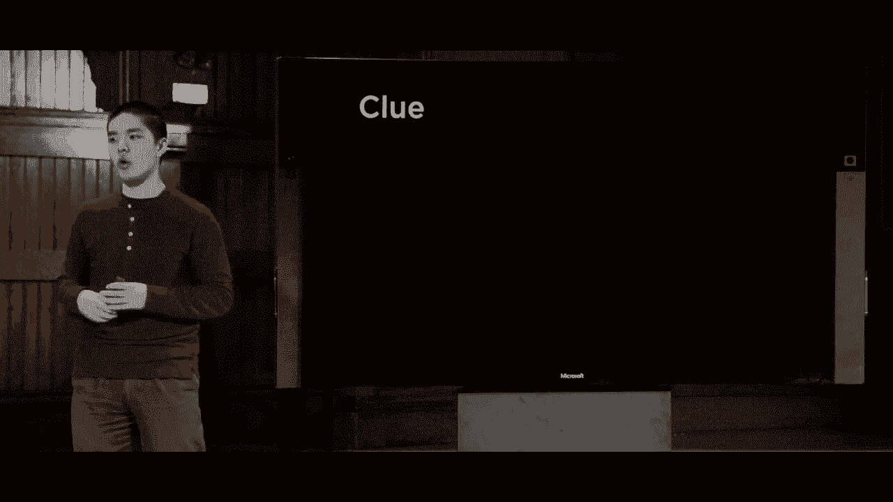

knowledge that we know about the world，so for example we know that someone is。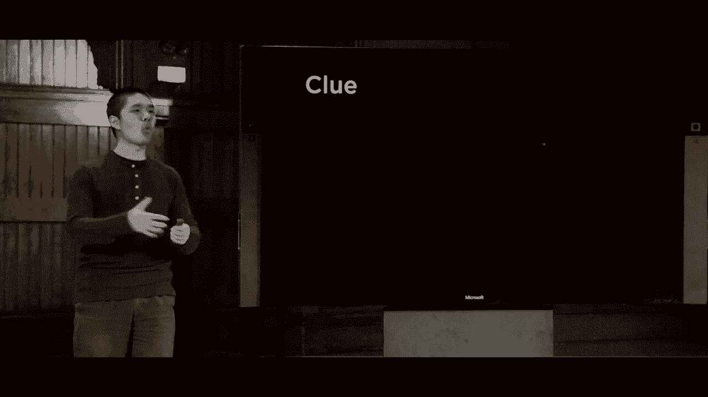

the murderer that one of the three，people is in fact the murderer and how。would we encode that well we don't know，for sure who the murderer is but we know。it is one person or the second person or，the third person so I could say。something like this mustard or plum or，scarlet and this piece of knowledge。

encodes that one of these three people。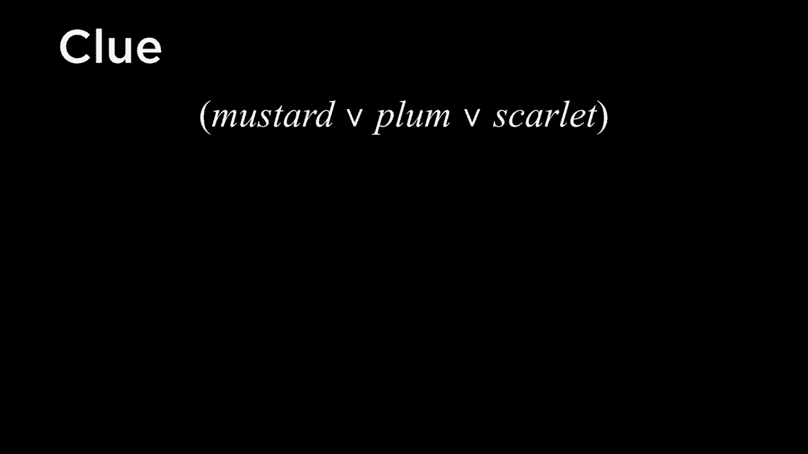

is the murder we don't know which but，one of these three things must be true。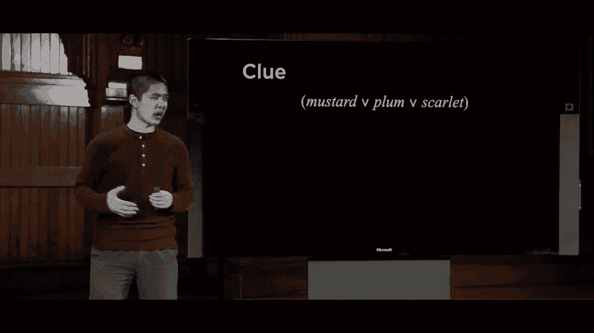

what other information do we know well，we know that for example one of the。rooms must have been the room in the，envelope that the crime was committed。either in the ballroom or the kitchen or，the library again right now we don't。know which but this is knowledge we know，at the outset knowledge that one of。

these three must be inside the envelope，and likewise we can say the same thing。about the weapon that it was either the，knife or the revolver or the wrench that。one of those weapons must have been the，weapon of choice and therefore the。weapon in the envelope and then as the，game progresses the gameplay works by。

people get various different cards and，using those cards you can deduce。information that if someone gives you a，card for example I have the professor。plum card in my hand then I know the，professor plum card can't be inside the。envelope I know that professor plum is，not the criminal so I know a piece of。

information like not plum for example I，know that professor plum has to be false。this propositional symbol is not true，and sometimes I might not know for sure。that a particular card is not in the，middle but sometimes someone make a。guess and I'll know that one of three，possibilities is not true like someone。

will guess Colonel Mustard in the，library with the revolver or something。to that effect and in that case a card，might be revealed that I don't see him。but if it is a card and did this either，Colonel Mustard or the revolver or the。library then I know that at least one of，them，can't be in the middle so I know。

something like it is either not mustard，or it is not the library or it is not，the revolver。now maybe multiple of these are not true，but I know that at least one of mustard。library and revolver must in fact be，false and so this now is a propositional。logic representation of this game of，Clue a way of encoding the knowledge。

that we know inside this game using，propositional logic that a computer。algorithm something like model checking，that we saw a moment ago can actually。look at and understand so let's now take，a look at some code to see how this。algorithm might actually work in，practice all right so I'm going to open。

up a file called clue dot pi which I've，started already and what we'll see here。is I've defined a couple of things I，have to find some symbols initially。notice I have a symbol for Colonel，Mustard a symbol for professor plum a。symbol for Miss Scarlet all of which，I've put inside of this list of。

characters I have a symbol for ballroom，and kitchen and library inside of a list。of rooms and then I have symbols for，knife and revolver and wrench these are。my weapons and so all of these，characters and rooms and weapons all。together those are my symbols and now I，also have this Czech knowledge function。

and what the Czech knowledge function，does is it takes my knowledge and it's。going to try and draw conclusions about，what I know so for example we'll loop。over all of the possible symbols and，we'll check do I know that that symbol。is true and a symbol is going to be，something like professor plum or the。

knight for the library and if I know，that it is true in other words I know。that it must be the card in the envelope，then I'm going to print out using a。function called C print which prints，things in color I'm going to print out。the word yes and I'm gonna print that in，green just to make it very clear to us。

and if we're not sure that the symbol is，true maybe I can check to see if I'm。sure that the symbol is not true like if，I know for sure that it is not professor。plum for example and I do that by，running model check again this time。checking if my knowledge is not the，symbol if I know for sure that the。

symbol is not true and if I don't know，for sure that the symbol is not true。because I say L if not model check，meaning I'm not sure that the symbol is，false。well then I'll go ahead and print out，maybe next to the symbol because maybe。the symbol is true maybe it's not I，don't actually know so what knowledge。

you actually have well let's try and，represent my knowledge now so my。knowledge is I know a couple of things，so I'll put them in an N and I know that。one of the three people must be the，criminal so I know or mustard a plum。scarlet this is my way of encoding that，it is either Colonel Mustard or。

professor plum or Miss Scarlet I know，that it must have happened in one of the。rooms so I know or ballroom kitchen，library for example and I know that one。of the weapons must have been used as，well so I know or knife revolver wrench。so that might be my initial knowledge，that I know that it must have been one。

of the people I know it must have been。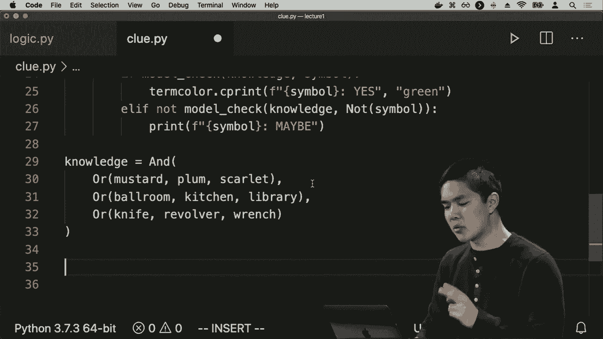

in one of the rooms and I know that it，must have been one of the weapons and I。can see what that knowledge looks like，as a formula by printing out knowledge。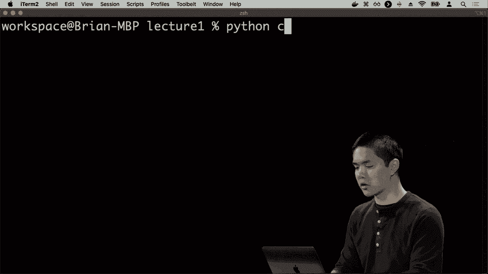

dot formula so I'll run Python clue dot，P and here now is the information that I。know in logical format I know that it is，Colonel Mustard or professor plum or。Miss Scarlet and I know that it is the，ballroom the kitchen or the library and。I know that it is the knife the revolver，or the wrench but I don't know much more。

than that I can't really draw any firm，conclusions and in fact we can see that。if I try and do let me go ahead and run，my knowledge check function on my。knowledge now let's check is this，function that I check knowledge rather。is this function that I just wrote that，looks over all of the symbols and tries。

to see what conclusions I can actually，draw about any of the symbols so I'll go。

ahead and run clue Pi and see what it is，that I know and it seems that I don't。really know anything for sure I have all，three people or maybe is all three of。the rooms or maybe is all three of the，weapons or maybes I don't really know。anything for certain just yet，but now let me try and add some，additional information and see if。

additional information additional，knowledge can help us to logically。reason our way through this process and，we are just going to provide the。information Rai is going to take care of，doing the inference and figuring out。what conclusions it's able to draw so I，start with some cards and those cards，colonel。

Mustard's card for example I know that，the mustard symbol must be false。in other words mustard is not the one in，the envelope is not the criminal so I。can say knowledge supports something，called every and in this library。supports dot ad which is a way of adding，knowledge or adding in additional。

logical sentence to an end clause so I，can say knowledge add not mustard red I。happen to know because I have the，mustard card that colonel mustard is not。the suspect it may be have a couple of，other cards too maybe I also have a card。for the kitchen so I know it's not the，kitchen and maybe I have another car。

that says that it is not the revolver so，I have three cards Colonel Mustard the。kitchen and the revolver and I encode，that into my a I this way by saying it's。not Colonel Mustard it's not the kitchen。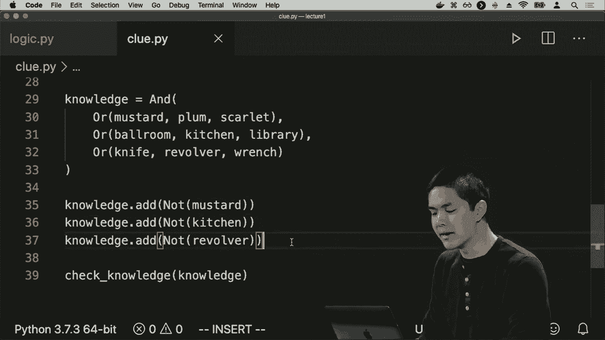

and it's not the revolver and I know，those to be true，so now when I rerun clued up I will see。that I've been able to eliminate some，possibilities before I wasn't sure if it。was the knife or the revolver or the，wrench and the knife was maybe a。revolver was maybe wrenches maybe now，I'm down to just the knife and the。

wrench between those two I don't know，which one it is they're both maybes but。I've been able to eliminate the revolver，which is one that I know to be false。because I have the revolver card and so。

additional information might be acquired，over the course of this game and we。would represent that just by adding，knowledge to our knowledge set or。knowledge base that we've been building，here so if for example we additionally。got the information that someone made it，guess someone guessed like Miss Scarlet。

in the library with the wrench and we，know that that a card was revealed which。means that one of those three cards are，there Miss Scarlet or the library or the。wrench one of those at minimum must not，be inside of the envelope so I could add。some knowledge say knowledge add and I'm，gonna add an or clause because I I don't。

know for sure which one it's not but I，know one of them is not in the envelope。so it's either not Scarlett or it's not，the library and or supports multiple。arguments that can say it's also or not，needs，Scarlett library and wrench at least one。of those needs to be false I don't know，which though maybe it's multiple maybe。

it's just，but at least one I know needs to hold，and so now if I rerun clued up I I don't。actually have any additional information，just yet nothing I can say conclusively。I still know that maybe it's professor，plum maybe it's Miss Scarlet。I haven't eliminated any options but，let's imagine that I get some more。

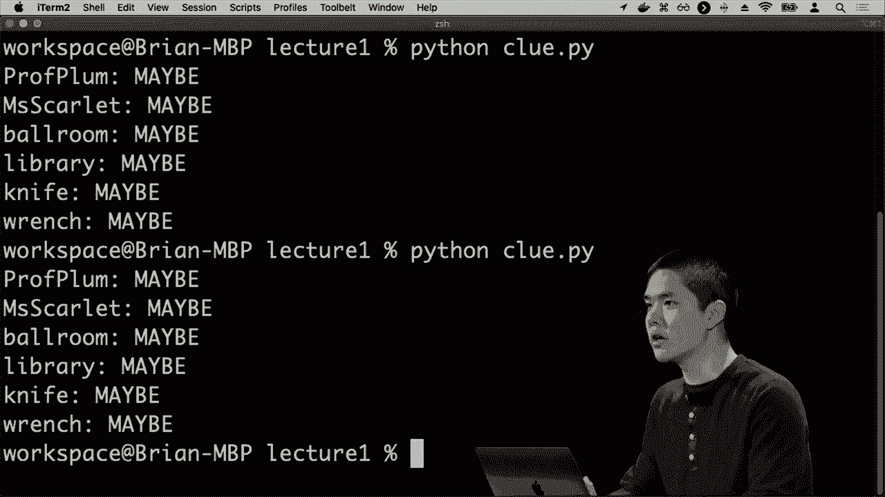

information that someone shows me the，professor plum card for example so I say。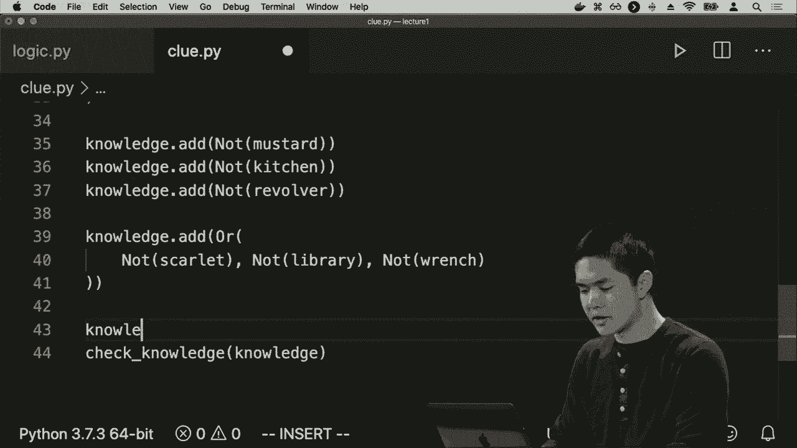

all right let's go back here knowledge，add not plum so I have the professor。plum card I know the professor plum is，not in the middle I rerun clue dot PI。and all right now I'm able to draw some，conclusions now I've been able to。eliminate professor plum and the only，person it could left remaining B is Miss。

Scarlet so I know yes Miss Scarlet this，variable must be true and I've been able。to infer that based on the information I，already had now between the ballroom in。the library and the knife and the wrench，for those two I'm still not sure so。let's add one more piece of information，let's say that I know that it's not the，ballroom。

someone has shown me the ballroom card，so I know it's not the ballroom which。means at this point I should be able to。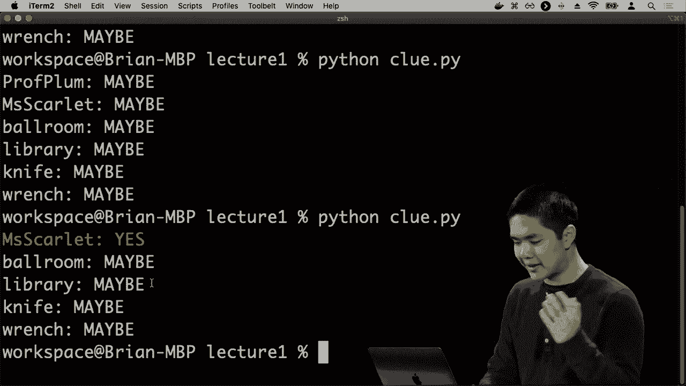

conclude that it's the library let's see。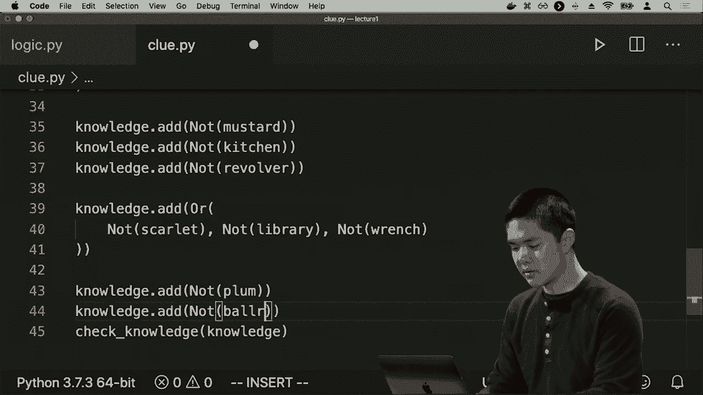

I'll say knowledge dot ad not the，ballroom and we'll go ahead and run that。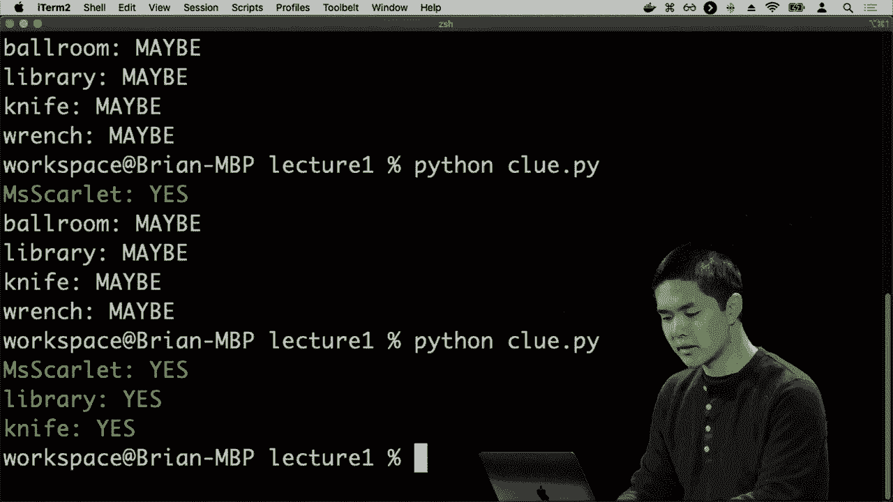

and it turns out that after all of this，not only connect conclude that I know。that it's the library but I also know，that the weapon was the knife and that。might have been an inference it was a，little bit trickier something I wouldn't。have realized immediately but the AI via，this model checking algorithm is able to。

draw that conclusion that we know for，sure that it must be Miss Scarlet in the。library with the knife and how did we，know that well we know it from this or。clause up here that we know that it's，either not scarlet or it's not the。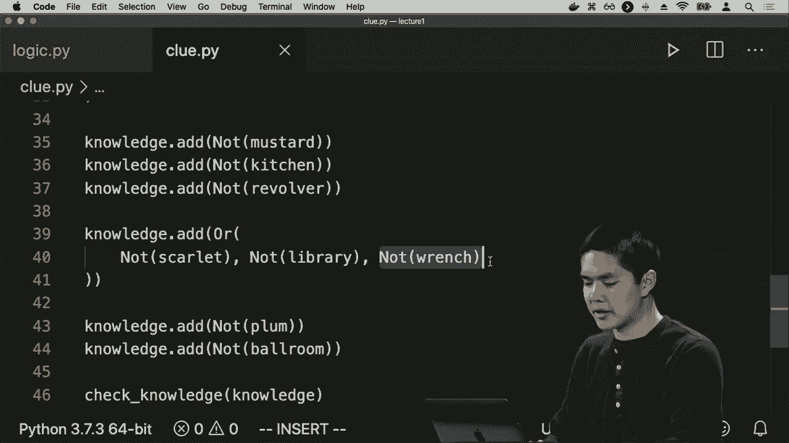

library or it's not the wrench and given，that we know that it is Miss Scarlet and。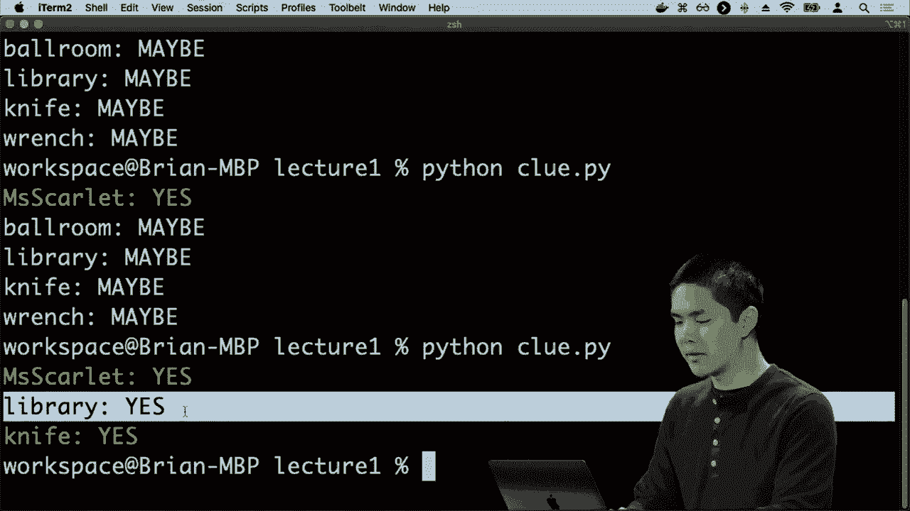

we know that it is the library then the，only remaining option for the weapon is。that it is not the wrench which means，that it must be the knife so we as。humans now can go back and reason，through that even though it might not。

have been immediately clear and that's，one of the advantages of using an AI or。some sort of algorithm in order to do，this is that the computer can exhaust。all of these possibilities and try and，figure out what the solution actually。should be and so for that reason，it's often helpful to be able to，represent knowledge in this way。

knowledge engineering some situation，where we can use a computer to be able。to represent knowledge and draw，conclusions based on that knowledge and。anytime we can translate something into，propositional logic symbols like this。this type of approach can be useful so，you might be familiar with logic puzzles。

where you have to puzzle your way，through trying to figure something out。this is what a classic logic puzzle，might look like something like Gilda Roy。Minerva Pomona and Horace each belong to，a different one of the four houses。Gryffindor Hufflepuff Ravenclaw and，Slytherin and then we have some。

information the Gilderoy belongs to，Gryffindor or ravenclaw Pomona does not。belong in Slytherin and Minerva does，belong to Gryffindor we have a couple。pieces of information and using that，information we need to be able to draw。some conclusions about which person，should be assigned to which house and。

again we can use the exact same idea to，try and implement this notion so we need。some propositional symbols and in this，case the propositional symbols are going。to get a little more complex although，we'll see ways to make this a little bit。cleaner later on but we'll need 16，propositional symbols one for each。

person and house so we need to say，remember every propositional symbol is。either true or false so Gilderoy，Gryffindor is either true or false。either he's in Gryffindor or he is not，likewise Gilderoy Hufflepuff also true。or false either it is true or its false，and that's true for every combination of。

person and house that we could come up，with we have some sort of propositional。symbol for each one of those using this，type of knowledge we can then begin to。think about what types of logical，sentences we can say about the puzzle。that if we know what before we even，think about the information we were。

given we can think about the premise of。

the problem that every person is，assigned to a different house so what，does that tell us。well it tells us sentences like this it，tells us like Pomona Slytherin implies。not Pomona Hufflepuff something like if，Pomona is in Slytherin then we know that。Pomona is not in Hufflepuff and we know，this for all four people and for all。

combinations of houses that no matter，what person you pick if they're in one。house then they're not in some other，house so I'll probably have a whole，bunch of knowledge。statements that are of this for that if，we know Pomona's and Slytherin then we。know Pomona is not in Hufflepuff we were，also given the information that each。

person is in a different house so I also，have pieces of knowledge that look。something like this Minerva Ravenclaw，implies not Gilderoy ravenclaw if。they're all in different houses，then if Minerva is in Ravenclaw then we。know the guild Roy is not in ravenclaw，as well and I have a whole bunch of。

similar sentences like this that are，expressing that idea for other people。and other houses as well and so in，addition to sentences of these form I。also have the knowledge that we've given，to me information like Gilderoy was in。Gryffindor or in ravenclaw that would be，represented like this guild or a。

Gryffindor or guild or a raven club and，then using these sorts of sentences I。can begin to draw some conclusions about，the world so let's see an example of。this we'll go ahead and actually try and，implement this logic puzzle to see if we。can figure out what the answer is I'll，go ahead and open up puzzle pi where。

I've already started to implement this，sort of idea I've defined a list of。people and a list of houses and I've so，far created one symbol for every person。and for every house that's what this，double for loop is doing looping over。all people looping over all houses，creating a new symbol for each of them。

and then I've added some information I，know that every person belongs to a。house so I've added the information for，every person that person Gryffindor or。person Hufflepuff or person ravenclaw or，person Slytherin that one of those four。things must be true every person belongs，to a house what other information do I。

know I also know that only one house per，person so no person belongs to multiple。houses so how does this work，well this is going to be true for all。people so I'll loop over every person，and then I need to loop over all。different pairs of houses the idea is I，want to encode the idea that if Minerva。

is in Gryffindor then Minerva can't be，in ravenclaw，so I'll loop over all houses h1 and I'll。loop over all houses again h2 and as，long as they're different h1 not equal。to h2 then I'll add to my knowledge base，this piece of information。that implication in other words and if，then if the person is in h1 then I know。

that they are not in house h2 so these，lines here are encoding the notion that。for every person if they belong to house，1 then they are not in house 2 and the。other piece of logic we need to encode，is the idea that every house can only。have one person in other words if Pomona，is in Hufflepuff then nobody else is。

allowed to be in Hufflepuff either and，that's the same logic but sort of。backwards I loop over all of the houses，and loop over all different pairs of。people so I loop over people once loop，over people again and only do this when。the people are different，p1 not equal to p2 and I add the，knowledge that if as given by the。

implication if person one belongs to the，house then it is not the case that。person 2 belongs to the same house so，here I'm just encoding the knowledge。that represents the problems constraints，I know that everyone's in a different。house I know that any person can only，belong to one house and I can now take。

my knowledge and try and print out the，information that I happen to know so。I'll go ahead and print out knowledge。

formula just to see this in action and，I'll go ahead and skip this for now but。we'll come back to this in a second。

let's print out the knowledge that I，know by running Python puzzle pie it's a。lot of information a lot that I have to，scroll through because there's 16。different variables all going on but the，basic idea if we scroll up to the very。top is I see my initial information，Gilderoy is either in Gryffindor or。

Gilda Royce and Hufflepuff or Gilda，Royce and Raven claw or Gilda Royce and。Slytherin and and then way more，information as well，so this is quite messy more than we。really want to be looking at and soon to，will see ways of representing this a。little bit more nicely using logic but，for now we can just say these are the。

variables that we're dealing with and，now we'd like to add some information so。the information we're going to add is，Gilda Roy is in Gryffindor or he is in。ravenclaw so that knowledge was given to，us so I'll go ahead and say knowledge。dot add and I know that either-or，Gilderoy Gryffindor，or Gilderoy ravenclaw one of those two。

things must be true I also know that，Pomona was not in Slytherin so I can say。knowledge dad not this symbol not the，Pomona Slytherin symbol and then I can。add the knowledge that Minerva is in，Gryffindor by adding the symbol Minerva。Gryffindor so those are the pieces of，knowledge that I know and this loop here。

at the bottom just loops over all of my，symbols checks to see if the knowledge。entails that symbol by calling this，model check function again and if it。does if we know the symbol is true we。

print out the symbol so now I can run，Python puzzle PI and python is going to。solve this puzzle for me we're able to，conclude the Gilderoy belongs to。ravenclaw Pomona belongs to Hufflepuff，Minerva to Gryffindor and Horus to。Slytherin just by encoding this，knowledge inside the computer although。

it was quite tedious to do in this case，and as a result we were able to get the。conclusion from that as well，and you can imagine this being applied。to many sorts of different deductive，situations so not only these situations。when we're trying to deal with Harry，Potter characters in this puzzle but if。

you've ever played games like mastermind，where you're trying to figure out which。

order different colors go in and trying，to make predictions about it I could。tell you for example let's play a。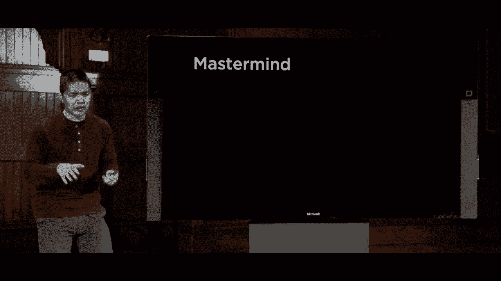

simplified version of mastermind where，there are four colors red blue green and。yellow and they're in some order but I'm，not telling you what order you just have。to make a guess and I'll tell you of red，blue green and yellow how many of the。four you got in the right position so a。

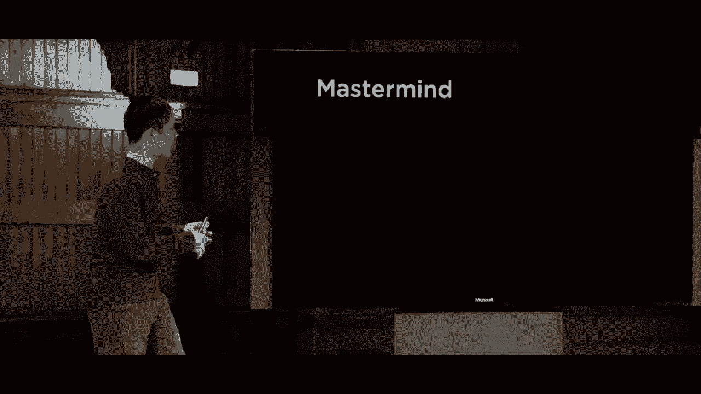

simplified version of this game you，might make a guess like red blue green。yellow and I would tell you something，like two of those four are in the。correct position but the other two are。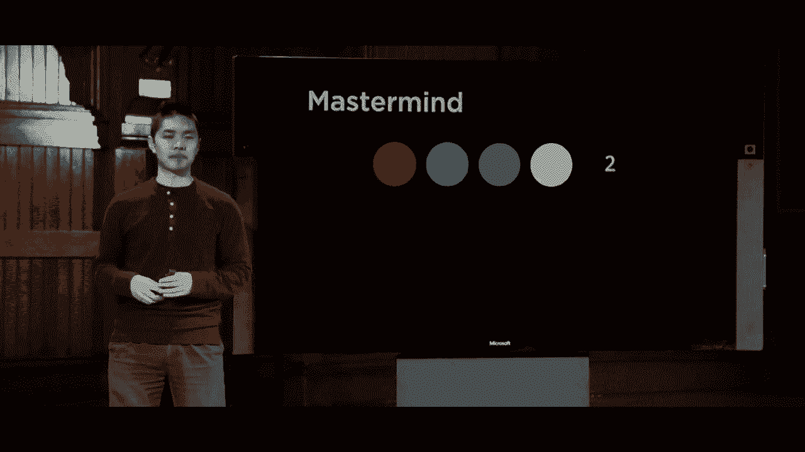

not then you could reasonably make a，guess and say all right let's try this。blue red green yellow try switching two，of them around and this time maybe I。tell you you know what none of those are，in the correct position and the question。then is alright what is the correct，order of these four colors and we as。

humans could begin to reason this，through all right well if none of these。were correct but two of these were，correct well it must have been because I。switched to the red in the blue and，means red-and-blue here must be correct。which means green and yellow are，probably not correct you can begin to do。

this sort of deductive reasoning，we can also equivalently try and take。this and encode it inside of our，computer as well and it's going to be。very similar to the logic puzzle that we，just did a moment ago so I won't spend。too much time on this code because it is，fairly similar but again we have a whole。

bunch of colors and four different，positions in which those colors can be。and then we have some additional，knowledge and I encode all of that。

knowledge and you can take a look at，this code and on your own time but I。just want to demonstrate that when we。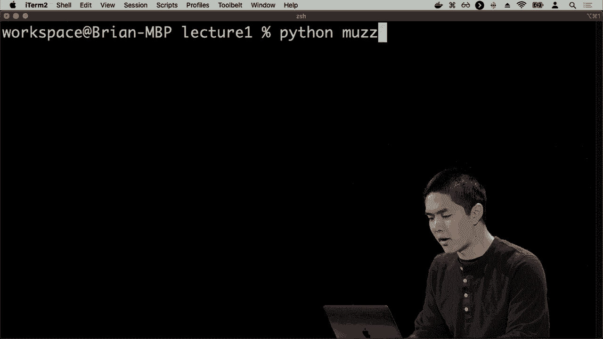

run this code run Python mastermind PI，and run and see what we get we。ultimately are able to compute read 0 in，the z-row position blue in the one。

position yellow in the two position and，green in the three position as the。ordering of those symbols now ultimately，what you might have noticed is this。process was taking quite a long time and，in fact model checking is not a。particularly efficient algorithm right，what I need to do in order to model。

check is take all of my possible，different variables and enumerate all of。the possibilities that they could be it，if I have n variables I have two to the。N possible worlds that I need to be，looking through in order to perform this。model checking algorithm and this is，probably not tractable especially as we。

start to get to much larger and larger，sets of data we have many many more。variables that are at play right here we，only have a relatively small number of。variables so this sort of approach can，actually work but as the number of。variables increases model checking，becomes less and less good of a way of。

trying to solve these sorts of problems，so while it might have been ok for。something like mastermind to conclude，that this is indeed the correct sequence。where all four are in the correct，position what we'd like to do is come up。with some better ways to be able to make，inferences rather than just enumerate。

all of the possibilities and to do so，what we'll transition to next is the。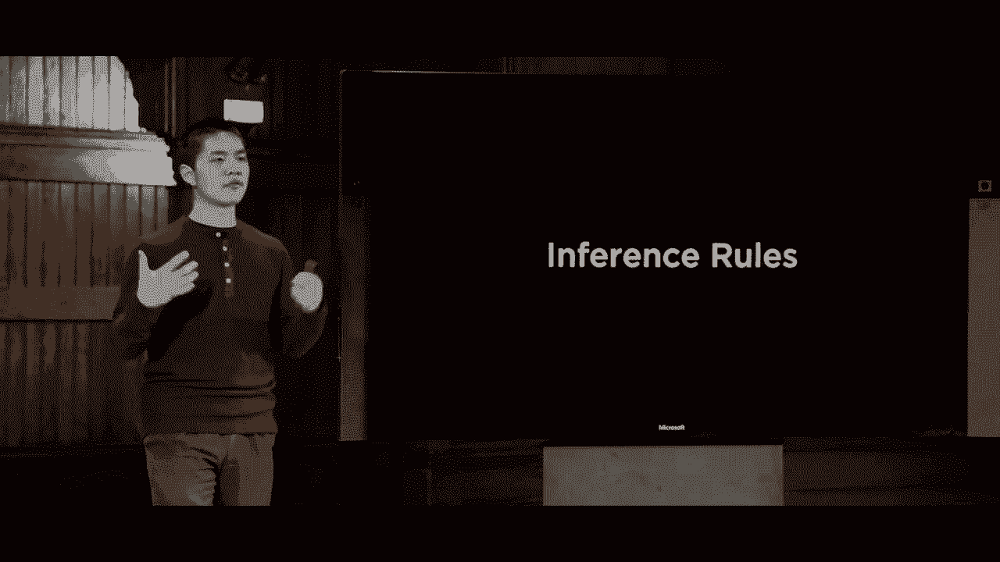