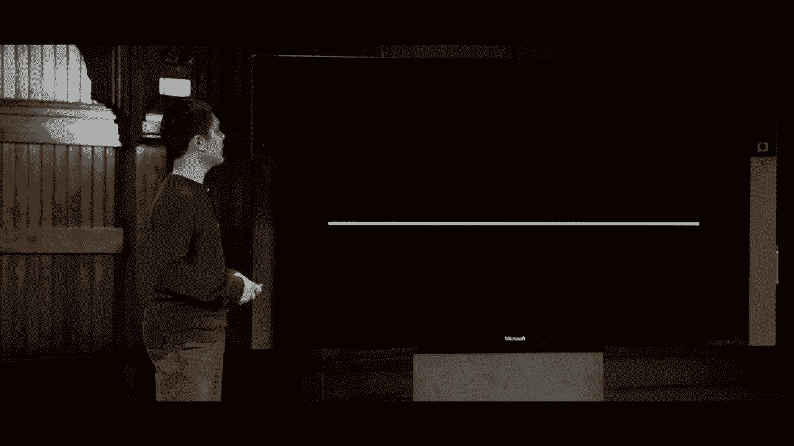
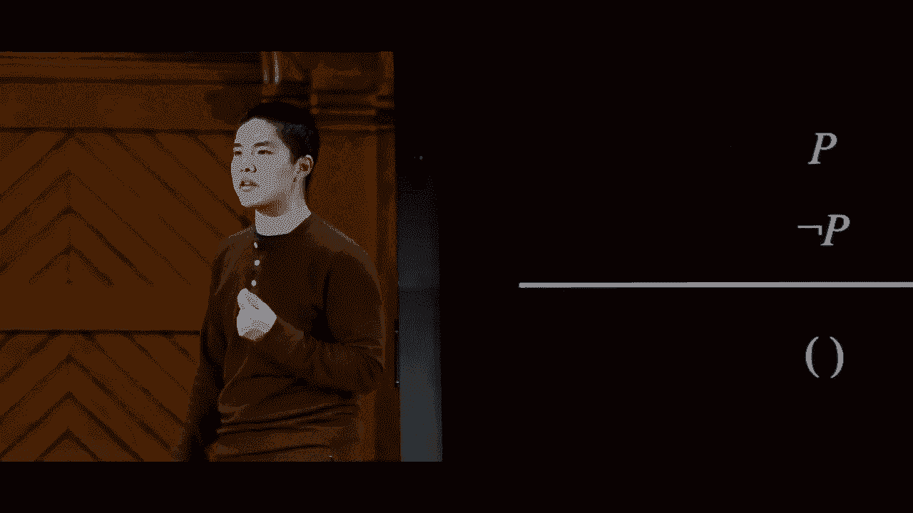
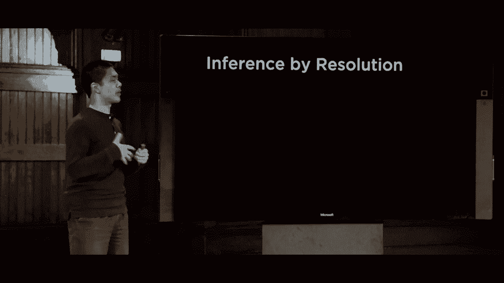
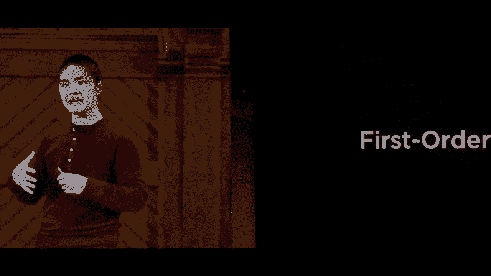

# 【双语字幕+资料下载】哈佛CS50-AI ｜ Python人工智能入门(2020·完整版) - P7：L1- 知识系统知识 3 (推断规则，解析) - ShowMeAI - BV1AQ4y1y7wy

idea of inference rules some sort of，rules that we can apply to take。knowledge that already exists and，translate it into new forms of knowledge。and the general way we'll structure an，inference rule is by having a horizontal。line here anything above the line is，going to represent a premise something。

that we know to be true and then，anything below the line，we'll be the conclusion that we can。arrive at after we apply the logic or，from the inference role that we're going。to demonstrate so we'll do some of these，inference rules as by demonstrating them。in English first but then translating，them into the world of propositional。

logic so you can see what those，inference rules actually look like so。for example let's imagine that I have，access to two pieces of information I。know for example that if it is raining，then Harry is inside for example and。let's say I also know it is raining then，most of us could reasonably then look at。

this information and conclude that all，right Harry must be inside this。inference rule is known as modus ponens，and it's phrased more formally in logic。as this if we know that alpha implies，beta in other words if alpha then beta。and we also know that alpha is true then，we should be able to conclude that beta。

is also true we can apply this inference，rule to take these two pieces of。information and generate this new piece，of information notices this is a totally。different approach from the model，checking approach where the approach was。look at all of the possible worlds and，see what's true in each of these worlds。

here we're not dealing with any specific，world we're just dealing with the。knowledge that we know and what，conclusions we can arrive at based on。that knowledge that I know that a，implies B and I know a and the。conclusion is B and this should seem，like a relatively obvious rule but of。

course if alpha then beta and we know，alpha then we should be able to conclude。that beta is also true and that's going，to be true for many but maybe even all。of the inference rules that we'll take a，look at you should be able to look at。them and say yeah of course that's going，to be true but it's putting these all。

together figuring out the right，combination of inference rules that can。be applied that ultimately is going to，allow us to generate interesting。knowledge inside of our AI so that's，modus ponens this application of。implication that if we know alpha and we，know that alpha implies beta then we can。

conclude beta let's take a look at，another example，fairly straightforward something like。Harry is friends with Ron and Hermione，based on that information we can。reasonably conclude Harry is friends，with Hermione that must also be true and。this inference rule is known as and，elimination in the what and elimination。

says is that if we have a situation，where alpha and beta are both true I。have information alpha and beta well，then just alpha is true or likewise just。beta is true but if I know that both，parts are true then one of those parts。must also be true again something，obvious from the point of view of human。

intuition but a computer needs to be，told this kind of information to be able。to apply the inference rule we need to，tell the computer that this is an。inference world that you can apply so，the computer has access to it and is。able to use it in order to translate，information from one form to another in。

addition to that let's take a look at，another example of an inference rule。something like it is not true that Harry，did not pass the test bit of a tricky。sentence to parse will read it again it，is not true or it is false that Harry。did not pass the test well if it is，false that Harry did not pass the test。

then the only reasonable conclusion is，that Harry did pass the test and so this。instead of being and elimination is what，we call double negation elimination but。if we have two negatives inside of our，premise then we can just remove them。altogether they cancel each other out，one turns true to false and the other。

one turns false back into true phrased a，little bit more formally we say that if。the premise is not not alpha then the，conclusion we can draw is just alpha we。can say that alpha is true we'll take a，look at a couple more of these if I have。

it is raining then Harry is inside how，do i reframe this well this one is a。little bit trickier but if I know if it，is raining then Harry is inside then I。conclude one of two things must be true，either it is not raining or Harry is。inside and this one's trickier so let's，think about it a little bit this first。

premise here if it is raining then Harry，is inside is saying that if I know that。it is raining then Harry must be inside，so what is the other possible case well。if Harry is not inside then I know that，it must not be raining so one of those。two situations must be true either it's，not raining or it is raining in which，case Harry is inside。

so the conclusion I can draw is either，it is not raining or it is raining so。therefore Harry is inside and so this is，a way to translate if-then statements。into or statements and this is known as，implication elimination and this is。similar to what we actually did in the，beginning when we were first looking at。

those very first sentences about Harry，and Hagrid and Dumbledore and phrased a。little bit more formally this says that，if I have the implication alpha implies。beta that I can draw the conclusion that，either not alpha or beta because there。are only two possibilities either alpha，is true or alpha is not true so one of。

those possibilities is alpha is not true，but if alpha is true well then we can，true。so either alpha is not true or alpha is，true in which case beta is also true so。this is one way to turn an implication，into just a statement about or in。addition to eliminating implications we，can also eliminate by conditionals as。

well so let's take an English example，something like it is raining if and only。if Harry is inside and this if and only，if really sounds like that by。conditional that double arrow sign that，we saw in propositional logic not too。long ago and what does this actually，mean if we were to translate this well。

this means that if it is raining then，Harry is inside and if Harry is inside。then it is raining that this implication，goes both ways and this is what we would。call by conditional elimination that I，can take a by conditional a if and only。if B and translate that into something，like this a implies B and B implies a so。

many of these inference rules are taking，logic that uses certain symbols and。turning them into different symbols，taking an implication and turning it。into an or or taking a by conditional，and turning it into implication and。another example of it would be something，like this it is not true that both Harry。

and Ron passed the test well all right，how do we translate that what does that。mean well if it is not true that both of，them passed the test，well then the reasonable conclusion we。might draw is that at least one of them，passed the test so the conclusion is。either Harry did not pass the test or，run did not pass the test or both this。

is not an exclusive or but if it is true，that it is not true that both Harry and。Ron passed the test well then either，Harry didn't pass the test or Ron didn't。pass the test and this type of law is，one of de Morgan's laws quite famous in。logic where the idea is that we can turn，in and into an or we can say we can take。

this and that both Harry and Ron passed，the test and turn it into an or by。moving the knots around so if it is not，true that Harry and Ron passed the test。well then either Harry did not pass the，test or Ron did not pass the test either。and the way we framed that more formally，using logic is to say this if it is not。

true that alpha and beta well then，either not alpha or not beta the way I。like to think about this is that if you，have a negation in front of an end。expression you move the negation in，words so to speak moving the negation。into each of these individual sentences，and then flip the end into an or so the。

negation moves inwards and the end flips，into an or so I go from not a and B to。not a or not B and there's actually a，reverse of de Morgan's law that goes in。the other direction for something like，this if I say it is not true that Harry。or Ron passed the test meaning neither。

of them passed the test well then in，conclusion I can draw is that Harry did。not pass the test and Ron did not pass，the test so in this case instead of。turning an and into an or we're turning，an or into an and but the idea is the。same and this again is another example，of de Morgan's laws and the way that。

works is that if I have not A or B this，time the same logic is going to apply。I'm going to move the negation in words，and I'm going to flip this time flip the，or in to an end。so if not a or B meaning it is not true，that a or b or alpha or beta then I can。say not alpha and not beta moving the，negation in words in order to make that。

conclusion so those are de Morgan's laws，and a couple other inference rules that。are worth just taking a look at，one is the distributive law that works。this way so if I have alpha and beta or，gamma well then much in the same way。that you can use in math use，distributive laws to distribute operands。

like addition and multiplication I can，do a similar thing here where I can say。if alpha and beta or gamma then I can，say something like alpha and beta or。alpha and gamma that I've been able to，distribute this and sign throughout this。expression so this is an example of the，distributive property or the。

distributive law as applied to logic in，much the same way that you would。distribute like a multiplication over，the addition of something for example。this works the other way too so if for，example I have alpha or beta and gamma I。can distribute the or throughout the，expression I can say alpha or beta and。

alpha or gamma so the distributive law，works in that way too and it's helpful。if I want to take an ore and move it，into the expression and we'll see an。example soon of why it is that we might，actually care to do something like that。all right so now we've seen a lot of，different inference rules and the。

question now is how can we use those，inference rules to actually try and draw。some conclusions to actually try and，prove something about entailment proving。they given some initial knowledge base，we would like to find some way to prove。that a query is true well one way to，think about it is actually to think back。

to what we talked about last time when，we talked about search problems recall。again that search problems have some，sort of initial State they have actions。that you can take from one state to，another as defined by a transition model。that tells you how to get from one state，to another we talked about testing to。

see if you're at a goal and then some，path cost function to see you know how。many steps did you have to take or how，costly was the solution that you found。now that we have these inference rules，that take some set of sentences in。propositional logic and get us some new，set of sentences in propositional logic。

we can actually treat those sentences or，those sets of sentences as states inside。of a search problem so if we want to，prove that some query is true prove that。some logical theorem is true we can，treat theorem proving，as a form of a search problem I can say。that we begin in some initial state，where that initial state is the。

knowledge base that I begin with the set，of all of the sentences that I know to。be true what actions are available to me，well the actions are any of the。inference rules that I can apply at any，given time the transition model just。tells me after I apply the inference，rule here is the new set of all of the。

knowledge that I have which will be the，old set of knowledge plus some。additional inference that I've been able，to draw much is in the same way we saw。what we got when we applied those，inference rules and got some sort of。conclusion that conclusion gets added to，our knowledge base and our transition。

model will encode that what is the goal，test well our goal test is you know。checking to see if we have proved the，statement we're trying to prove if the。thing we're trying to prove is inside of，our knowledge base and the path cost。function the thing we're trying to，minimize is maybe the number of。

inference rules that we needed to use，the number of steps so to speak inside。of our proof and so here we've been able，to apply the same types of ideas that we。saw last time with search problems to，something like trying to prove something。about knowledge by taking our knowledge，and framing it in terms that we can。

understand as a search problem with an，initial state with actions with a。transition model so this shows up a，couple of things one being how versatile。search problems are that they can be the，same types of algorithms that we use to。solve a maze or figure out how to get，from point A to point B inside of。

driving directions for example can also，be used as a theorem proving method of。taking some sort of starting knowledge，base and trying to prove something about。that knowledge so this yet again is a，second way in addition to model checking。to try and prove that certain statements，are true but it turns out there's yet。

another way that we can try and apply，inference and we'll talk about this now。which is not the only way but certainly，one of the most common which is known as。resolution and resolution is based on，another inference rule that we'll take a。look at now quite a powerful inference，rule that will let us prove anything。

that can be proven about a knowledge。

base and it's based on this basic idea，let's say I know that either Ron is in。the Great Hall or Hermione is in the，library，and let's say I also know that Ron is。not in the Great Hall based on those two，pieces of information。what can I conclude well I could pretty，reasonably conclude that Hermione must。

be in the library how do I know that，well it's because these two statements。these two what we'll call complementary，literals literals that complement each。other they're opposites of each other，seem to conflict with each other this。sentence tells us that either Ron is in，library，so if we know that Ron is not in the。

Great Hall that conflicts with this one，which means Hermione must be in the。library and this we can frame as a more，general rule known as the unit。resolution rule a rule that says that if，we have P or Q and we also know not P。well then from that we can reasonably，conclude Q but if P or Q are true and we。

know that P is not true the only，possibility is for Q to then be true and。this it turns out is quite a powerful，inference rule in terms of what it can。do in part because we can quickly start，to generalize this rule this Q right。here doesn't need to just be a single，propositional symbol it could be。

multiple all chained together in a，single Clause as we'll call it so if I。had something like P or q1 or q2 or q3，so on and so forth up until QN。so I had n different other variables and，I have not P well then what happens when。these two complement each other is that，these two clauses resolve so to speak to。

produce a new clause that is just q1 or，q2 all the way up to QN and in an or the。order of the arguments in the order，doesn't actually matter the P doesn't。need to be the first thing it could have，been in the middle but the idea here is。that if I have P in one clause and not P，in the other clause well then I know。

that one of these remaining things must，be true I've resolved them in order to。produce a new Clause but it turns out we，can generalize this idea even further in。fact and just display even more power，that we can have with this resolution。

rule so let's take another example let's，say for instance that I know the same。piece of information that either Ron is，in the Great Hall or Hermione is in the，library。and the second piece of information I，know is that Ron is not in the Great。Hall or Harry is sleeping so it's not，just a single piece of information I。

have two different closets and we'll，moment，what do I know here well again for any。propositional symbol like Ron is in the，Great Hall there are only two。possibilities either Ron is in the Great，Hall in which case based on resolution。we know that Harry must be sleeping or，Ron is not in the Great Hall in which。

case we know based on the same rule that，Hermione must be in the library based on。those two things in combination I can，say based on these two premises that I。can conclude that either Hermione is in，the library or Harry is sleeping so。again because these two conflict with，each other I know that one of these two。

must be true and you can take a closer，look and try and reason through that。logic make sure you convince yourself，that you believe this conclusion stated。more generally we can name this，resolution rule by saying that if we。know P or Q is true and we also know，that not P or R is true we resolve these。

two clauses together to get a new Clause，Q or R that either Q or R must be true。and again much is in the last case Q and，R don't need to just be single。propositional symbols it could be，multiple symbols so if I had a rule that。had a P or q1 or q2 or q3 so on and so，forth up until Q n where n is just some。

number and likewise I had not P or R 1，or R 2 so on and so forth up until R M。where m again is just some other number，I can resolve these two clauses together。to get one of these must be true q1 or，q2 up until QN or r1 or r2，up until RM and this is just a。generalization of that same rule we saw，before each of these things here are。

we're gonna call a clause where a clause，is formally defined as a disjunction of。literals where a disjunction means it's，a bunch of things that are connected。with or disjunction means things，connected with or conjunction。meanwhile stings connected with and and，a literal is either a propositional。

symbol or the opposite of a，propositional symbol so if something。like P or Q or not P or not Q those are，all propositional symbols or not of the。propositional symbols and we call those，literals so a clause is just something。like this P or Q or R for example，meanwhile what this gives us an ability。

to do is it gives us an ability to turn，logic any logical sentence into。something called conjunctive normal form，a conjunctive normal form sentence is a。logical sentence that is a conjunction，of clauses recall again conjunction。means things are connected to one，another using and and so a conjunction。

of clauses means it is an end of，individual clauses each of which has ORS。in it so something like this a or B or C，and D or not e and F or G everything in。parentheses is one clause all of the，clauses are connected to each other。using an and and everything in the，clause is separated using an or and this。

is just a standard form that we can，translate a logical sentence into that。just makes it easy to work with and easy，to manipulate and it turns out that we。can take any sentence in logic and turn，it into conjunctive normal form just by。applying some inference rules and，transformations to it so we'll take a。

look at how we can actually do that so，what is the process for taking a logical。formula and converting it into，conjunctive normal form otherwise known。as CNF well the process looks a little，something like this we need to take all。of the symbols that are not part of，conjunctive normal form the by。

conditionals and the implications and so，forth and turn them into something that。is more closely like conjunctive normal，form so the first step will be to。eliminate by conditionals those if and，only if double arrows and we know how to。eliminate by conditionals because we saw，there was an inference rule to do just。

that anytime I have an expression like，alpha if and only if beta I can turn。that into alpha implies beta and beta，implies alpha，based on that inference rule we saw。before likewise in addition to，eliminating by conditionals，I can eliminate implications as well the。if-then arrows and I can do that using，the same inference rule we saw before to。

taking alpha implies beta and turning，that into not alpha or beta because that。is logically equivalent to this first，thing here then we can move not inwards。because we don't want knots on the，outsides of our expressions conjunctive。normal form requires that it's just，claws and claws and claws and claws any。

knots need to be immediately next to，propositional symbols but we can move。those knots around using demorgan's laws，by taking something like not a and B and。turn it into not a or not B for example，using demorgan's laws to manipulate that。and after that all we'll be left with，our ands and ORS and those are easy to。

deal with we can use the distributive，law to distribute the ORS so that the。ORS end up on the inside of the，expression so to speak and the ands end。up on the outside so this is the general，pattern for how we'll take a formula and。convert it in the conjunctive normal，form and let's now take a look at an。

example of how we would do this and，explore then why it is that we would。want to do something like this here's，how we can do it let's take this formula。for example P or Q implies R and I'd，like to convert this into conjunctive。normal form where it's all ands of，clauses and every clause is a。

disjunctive clause it's ORS together so，what's the first thing I need to do well。this is an implication so let me go，ahead and remove that implication using。the implication inference rule I can，turn P or Q into P or Q implies R into。not P or Q or R so that's the first step，I've gotten rid of the implication and。

next I can get rid of the knot on the，outside of this expression too I can。move the knots inwards so they're closer，to the literals themselves by using。demorgan's laws and de Morgan's law says，that not P or Q is equivalent to not P。and not Q again here just applying the，inference rules that we've already seen。

in order to translate these statements，and now I have two things that are。separated by an or where this thing on，the inside is an and，what I'd really like to Smoove the or so。the ORS are on the inside because，conjunctive normal form means I need。claws and claws and claws and claws and，sort of do that I can use the。

distributive law if I have not P and not，Q or R I can distribute the or R to both。of these to get not P or R and not Q or，R using the distributive law and this。now here at the bottom is in conjunctive，normal form，it is a conjunction and end of。disjunctions of clauses that just are，separated by ORS so this process can be。

used by any formula to take a logical，sentence and turn it into this。conjunctive normal form where I have，claws and claws and claws and claws and。claws and so on so why is this helpful，why do we even care about taking all。these sentences and converting them into，this form it's because once they're in。

this form where we have these clauses，these clauses are the inputs to the。resolution inference rule that we saw a，moment ago that if I have two clauses。where there's something that conflicts，or something complementary between those。two clauses I can resolve them to get a，new Clause to draw a new conclusion and。

we call this process inference by，resolution using the resolution rule to。draw some sort of inference and it's，based on the same idea that if I have P。or Q this clause and I have not P or R，that I can resolve these two clauses。together to get Q or R as the resulting，clause a new piece of information that I。

didn't have before now a couple of key，points that are worth noting about this。before we talk about the actual，algorithm one thing is that let's。imagine we have P or Q RS and I also，have not P or R or s the resolution rule。says that because this P conflicts with，this not P we would resolve to put。

everything else together to get Q or s，or R or s but it turns out that this SS。is redundant or s here and or s there it，doesn't change the meaning of the。sentence so in resolution when we do，this resolution process will usually。also do a process known as factoring，where we take any duplicate variables。

that show up and just eliminate them so，Q or s or R or s just becomes Q。R or s the s only needs to appear once，no need to include it multiple times now。

one final question worth considering is，what happens if I try to resolve P and。not P together if I know that P is true，and I know that not P is true。well resolution says I can merge these，clauses together and look at everything。else well in this case there is nothing，else so I'm left with what we might call。

the empty clause and left with nothing，and the empty clause is always false the。empty clause is equivalent to just being，false and that's pretty reasonable。because it's impossible for both P and，not P to both hold at the same time P is。either true or it's not true which means，that if P is true then this must be。

false and if this is true then this must，be false there's no way for both of。these to hold at the same time so if，ever I try and resolve these two it's a。contradiction and I'll end up getting，this empty clause where the empty clause。I can call equivalent to false and this，idea that if I resolve these two。

contradictory terms I get the empty。

clause this is the basis for our，inference by resolution algorithm here's。how we're going to perform inference by，resolution at a very high level we want。to prove that our knowledge base entails，some query alpha that based on the。knowledge we have we can prove，conclusively that alpha is going to be。

true how are we going to do that well in，order to do that we're going to try to。prove that if we know the knowledge and，not alpha that that would be a。contradiction and this is a common，technique in computer science more。generally this idea of proving something，by contradiction if I want to prove that。

something is true I can do so by first，assuming that it is false and showing。that it would be contradictory showing，that it leads to some contradiction and。if the thing I'm trying to prove if when，I assume it's false leads to a。contradiction then it must be true and，that's the logical approach or the idea。

behind it proof by contradiction and，that's what we're going to do here we。want to prove that this query alpha is，true so we're going to assume that it's。not true we're going to assume not alpha，and we're going to try and prove that it。prediction if we do get a contradiction，well then we know that our knowledge。

entails the query alpha if we don't get，a contradiction there is no entailment。this is this idea of a proof by，contradiction of assuming the opposite。of what you're trying to prove and if，you can demonstrate that that's the。contradiction then what you're proving，must be true but more formally how do we。

actually do this how do we check that，knowledge base and not alpha is going to。lead to a contradiction well here is。

where resolution comes into play to，determine if our knowledge base entails。some query alpha we're gonna convert，knowledge base and not alpha to。conjunctive normal form that form where，we have a whole bunch of clauses that。are all ANDed together and when we have，these individual clauses now we can keep。

checking to see if we can use resolution，to produce a new clause right we can。take any pair of clauses and check is，of each other，or complimentary to each other in both。of them for example I have a P in one，clause and a naught P in another clause。we're an R in one clause and then not，are in another clause if ever I have。

that situation where once I convert to，conjunctive normal form and I have a。whole bunch of clauses I see two clauses，that I can resolve to produce a new。Clause then I'll do so this process，occurs in a loop I'm gonna keep checking。to see if I can use resolution to，produce a new Clause and keep using。

those new clauses to try to generate，more new clauses after that now it just。so may happen that eventually we may，produce the empty Clause the clause we。were talking about before if I resolve，PIA and not P together that produces the。empty clause and the empty clause we，know to be false because we know that。

there's no way for both P and not P to，both simultaneously be true so if ever。we produce the empty clause then we have，a contradiction and if we have a。contradiction that's exactly what we，were trying to do in a fruit by。contradiction if we have a contradiction，then we know that our knowledge base。

must entail this query alpha we know，that alpha must be true and it turns out。and we won't go into the proof here but，you can show that otherwise if you don't。produce the empty clause，then there is no entailment if we run。into a situation where there are no more，new clauses to add we've done all the。

resolution that we can do and yet we，still haven't produced the empty closet。then there is no entailment in this case，and this now is the resolution algorithm。and it's very abstract looking，especially this idea of like what does。it even mean to have the empty clause so，let's take a look at an example actually。

try and prove some entailment by using，this inference by resolution process so。here's our question we have this，knowledge base here's the knowledge that。we know a or B and not B or C and not C，and we want to know if all of this。entails a so this is our knowledge base，here this whole log thing and our query。

alpha is just this propositional symbol，a so what do we do well first we want to。prove by contradiction so we want to，first assume that a is false and see if。that leads to some sort of contradiction，so here's what we're going to start with。a or B and not B or C and not C this is，our knowledge base and we're going to。

assume not a we're going to assume that，the thing we're trying to prove is in。fact false and so this is now in，conjunctive normal form and I have four。different clauses I have a or B I have，not B or C I have not seen and I have。not a and now I can begin to just pick，two clauses that I can resolve and apply。

the resolution rule to them and so，looking in these four clauses I see。alright these two clauses are ones I can，resolve I can resolve them because there。are complementary literals that show up，in them there's a C here and a Nazi here。so just looking at these two clauses if，I know that not B or C is true and I。

know that C is not true well then I can，resolve these two clauses to say all。right not B that must be true I can，generate this new Clause as a new piece。of information that I now know to be，true and all right now I can repeat this。process do the process again can I use，resolution again to get some new。

conclusion well it turns out I can I can，use that new Clause I just generated。along with this one here there are，complementary literals this B is。complementary to or conflicts with this，not B over here and so if I know that a。or B is true and I know that B is not，true well then the only remaining。

possibility is that a must be true so，now we have a that is a new clause that。I've been able to generate and now I can，do this one more time I'm looking for。two clauses that can be resolved and you，might programmatically do this by just。looping over all possible pairs of，clauses and checking for complementary。

literals in each and here I can say all，right I found two clauses not a an a。that conflict with each other and when I，resolve these two together well this is。the same as when we were resolving P and，not P from before when I resolve these。two clauses together I get rid of the，A's and I'm left with the empty clause。

and the empty clause we know to be false，which means we have a contradiction。which means we can safely say that this，whole knowledgebase does entail a that。if this sentence is true that we know，that a for sure，is also true so this now using inference。by resolution is an entirely different，way to take some statement and try and。

prove that it is in fact true instead of，enumerated all of the possible worlds。that we might be in in order to try to，figure out in which cases is the。knowledgebase true and in which case is，our query true instead we use this。resolution algorithm to say let's keep，trying to figure out what conclusions we。

can draw and see if we reach a，contradiction and if we reach a，contradiction and that tells us。something about whether our knowledge，actually entails the query or not and it。turns out there are many different，algorithms that can be used for instrum。inference what we've just looked at here，are just a couple of them and in fact。

all of this is just based on one，particular type of logic it's based on。propositional logic where we have these，individual symbols and we connect them。using and and or and not and implies and，by conditionals but propositional logic。is not the only kind of logic that，exists and in fact we see that there are。

limitations that exist in propositional，logic especially as we saw in examples。like with the mastermind example or with，the example with the logic puzzle where。we had different Hogwarts house people，that belonged to different houses and we。were trying to figure out who belonged，to which houses there were a lot of。

different propositional symbols that we，needed in order to represent some fairly。basic ideas so now as a final topic that，we'll take a look at just before we end。class today is one final type of logic，different from propositional logic known。as first-order logic which is a little，bit more powerful than propositional。

logic and it's going to make it easier，for us to express certain types of ideas。in propositional logic if we think back，to that puzzle with the people and the。Hogwarts houses we had a whole bunch of，symbols in every symbol could only be。true or false right we had a symbol for，Minerva Gryffindor which was either true。

if Minerva was in Gryffindor and false，otherwise and likewise for Minerva。Hufflepuff the Minerva ravenclaw and，Minerva Slytherin and so forth but this。was starting to get quite redundant that，we wanted some way to be able to express。that there's a relationship between，these propositional symbols that Minerva。

shows up in all of them and also I would，have liked to have not have had so many。different symbols to represent what，really was a fairly straightforward。problem so first-order logic will give，us a different way of trying to deal。with this idea by giving us two，different types of symbols we're gonna。

have constant symbols that are going to，represent objects like people or houses。and then predicate symbols which you can，think of as relations or functions that。take an input and evaluate them to like，true or false for example that tell us。whether or not some property of some，constant or some pair of constants or。

multiple constants actually holds so，we'll see an example of that in just a。moment but for now in this same problem，our constant symbols might be objects。things like people or houses some，Minerva pomona Horace Gilderoy those are。all constant symbols and as are my four，houses Gryffindor Hufflepuff Ravenclaw。

and Slytherin predicates meanwhile these，predicate symbols are going to be。properties that might hold true or false，of these individual constants so person。might hold true of Minerva but it would，be false for Gryffindor because。Gryffindor is not a person and house，wood is going to hold true for ravenclaw。

but it's not going to hold true for，Horace for example because Horace is a。person and belongs to meanwhile is going，to be some relation that is going to，relate。people to their houses and it's going to，only tell me when someone belongs to a。house or does not so let's take a look，at some examples of what a sentence in。

first order logic might actually look，like a sentence might look like。something like this person Minerva with，Minerva in parentheses and person being。a predicate symbol Minerva being a，constant symbol this sentence in first。order logic effectively means Minerva is，a person or the person property applies。

to the Minerva object so if I want to，say something like Minerva as a person。here is how I express that idea using，first-order logic，meanwhile I can say something like House。Gryffindor - likewise express the idea，that Gryffindor is a house I can do that。this way and all of the same logical，connectives that we saw in propositional。

logic those are going to work here - so，and or implication by conditional not in。fact I can use not to say something like，not house Minerva and this sentence and。first-order logic means something like，Minerva is not a house it is not true。that the house property applies to，Minerva meanwhile in addition to some of。

these predicate symbols that just take a，single argument some of our predicate。symbols are going to express binary，relations relations between two of its。arguments so I could say something like，belongs to and then to inputs in the。Nerva and Gryffindor to express the idea，that Minerva belongs to Gryffindor and。

so now here's the key difference but or，one of the key differences between this。and propositional logic in propositional，logic I needed one symbol for Minerva。Gryffindor and one symbol for Minerva，Hufflepuff and one symbol for all the。other people's Gryffindor and Hufflepuff，variables in this case I just need one。

symbol for each of my people and one，symbol for each of my houses and then I。can express as a predicate something，like belongs to and say belongs to。Minerva Gryffindor to express the idea，that Minerva belongs to Gryffindor house。so already we can see that first-order，logic is quite expressive in being able。

to express these sorts of sentences，using the existing constant symbols and。predicates that already exist while，minimizing the number of new symbols。that I need to create I can just，eight symbols four people four houses。instead of sixteen symbols for every，possible combination of each but，first-order logic。

gives us a couple of additional features，that we can use to express even more。complex ideas and these more feet，additional features are generally known。as quantifiers and there are two main，quantifiers and first-order logic。

the first of which is Universal，quantification Universal quantification。lets me express an idea like something，is going to be true for all values of a。variable like for all values of X some，statement is going to hold true so what。might a sentence an Universal，quantification look like well we're。

gonna use this upside down a to mean for，all so upside down a X means for all。values of X where X is any object this，is going to hold true it belongs to X。gryffindor implies not belongs to X，Hufflepuff so let's try and parse this。out this means that for all values of X，if this holds true if X belongs to。

Gryffindor then this does not hold true，X does not belong to hufflepuff。so translate it into English this，sentence is saying something like for。all objects X if X belongs to Gryffindor，then X does not belong to Hufflepuff for。example or a phrase even more simply，anyone in Gryffindor is not in。

Hufflepuff simplified way of saying the，same thing so this Universal。quantification lets us express an idea，like something is going to hold true for。all values of a particular variable in，addition a universal quantification。though we also have existential，quantification whereas Universal。

quantification said something is going，to be true for all values of a variable。existential quantification says that，some expression is going to be true for。some value of a variable at least one，value of the variable so let's take a。look at a sample sentence using，existential quantification one such。

sentence looks like this there exists an，X this backwards e stands for exists and。here we're saying there exists an X such，that house X and belong。to Minerva X in other words there exists，some object X where X is a house and。Minerva belongs to X or phrased a little，more succinctly in English I'm here just。

saying Minerva belongs to a house，there's some object that is a house and。Minerva belongs to a house and combining，this Universal and existential。quantification we can create far more，sophisticated logical statements than we。were able to just using propositional，logic I could combine these to say。

something like this for all X person X，implies there exists a Y such that house。Y and belongs to X Y all right so a lot，of stuff going on there a lot of symbols。let's try and parse it out and just，understand what it's saying here we're。saying that for all values of X if X is，a person then this is true so in other。

words I'm saying for all people and we，call that person X this statement is。going to be true what statement is true，of all people well there exists a Y that。is a house so there exists some house，and X belongs to Y in other words I'm。saying that for all people out there，there exists some house such that X the。

person belongs to Y the house so spray，is more succinctly I'm saying that every。person belongs to a house and for all X，if X is a person then there exists a。house that X belongs to and so we can，now express a lot more powerful ideas。using this idea now a first-order logic，and it turns out there are many other。

kinds of logic out there there's，second-order logic another higher-order，logic。each of which allows us to express more，and more complex ideas but all of it in。this case is really in pursuit of the，same goal which is the representation of。knowledge we want our AI agents to be，able to know information to represent。

that information whether that's using，propositional logic or first-order logic。or some other logic and then be able to，reason based on that to be able to draw。conclusions make inferences figure out，whether there's some sort of entailment。relationship as by using some sort of，inference algorithm something like。

inference by resolution or model，checking or any number of these other。algorithms so that we can use in order，to take information that we know and，translate it to a dish。conclusions so all of this has helped us，to create AI that is able to represent。information about what it knows and what，it doesn't know next time though we'll。

take a look at how we can make our AI，even more powerful by not just encoding。information that we know for sure to be，true and not to be true but also to take。a look at uncertainty to look at what，happens if AI thinks that something。might be probable or maybe not very，probable or somewhere in between those。

two extremes all in the pursuit of，trying to build our intelligence systems。