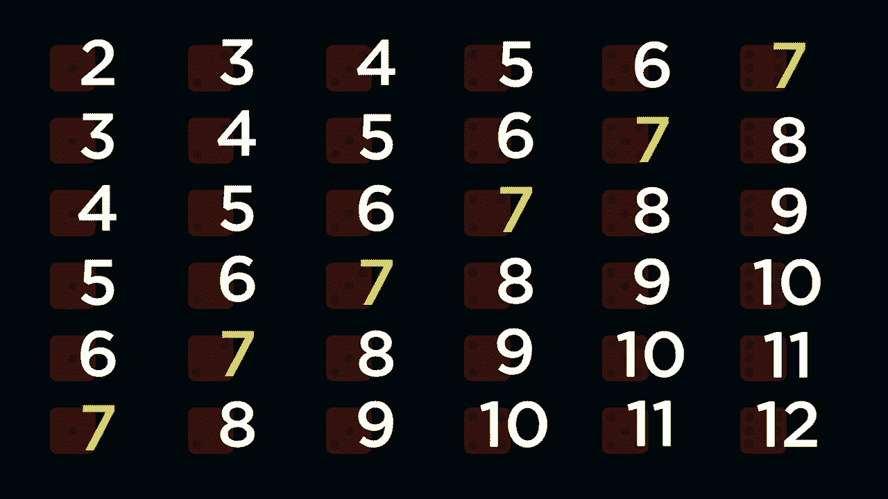
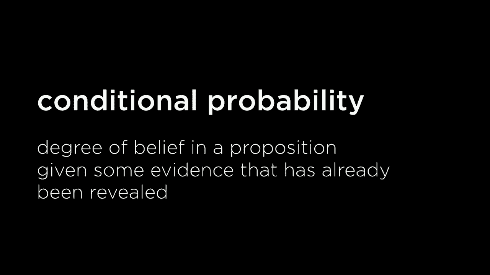
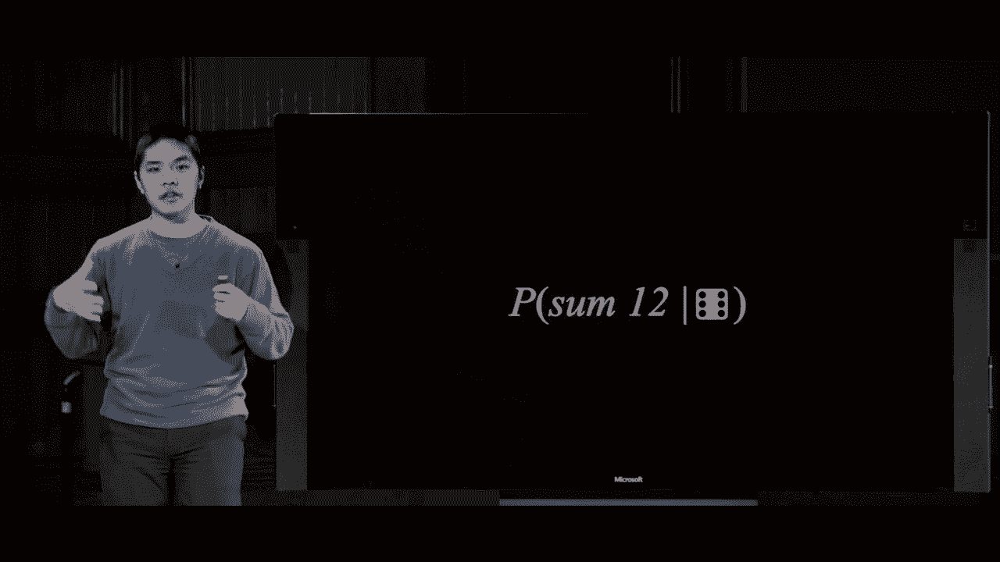
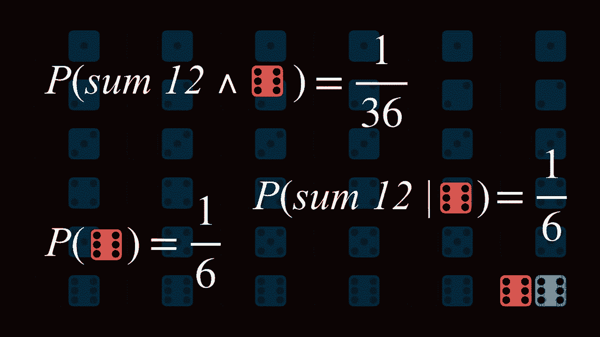
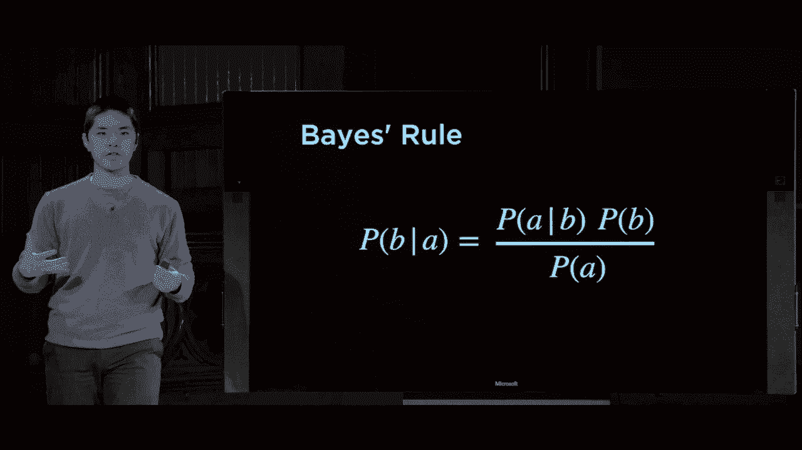
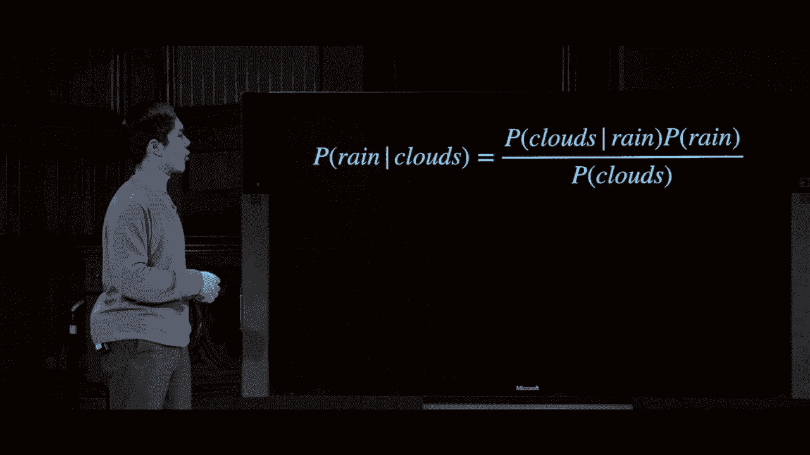
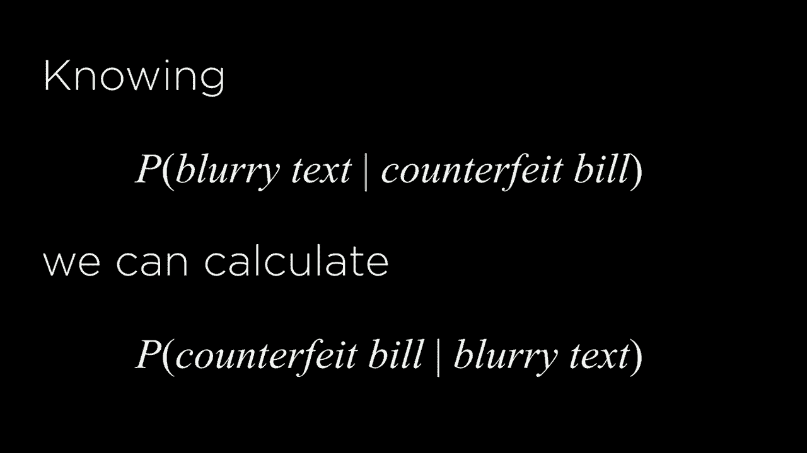

# 【双语字幕+资料下载】哈佛CS50-AI ｜ Python人工智能入门(2020·完整版) - P8：L2- 不确定性 1 (概率模型，条件概率，随机变量，贝叶斯规则) - ShowMeAI - BV1AQ4y1y7wy

[Music]。

all right welcome back everyone to an，introduction to artificial intelligence。with Python and last time we took a look，at how it is that AI inside of our。computers can represent knowledge we，represented that knowledge in the form。of logical sentences in a variety of，different logical languages and the idea。

was we wanted our AI to be able to，represent knowledge or information and。somehow use those pieces of information，to be able to derive new pieces of。information via inference to be able to，take some information and deduce some。additional conclusions based on the，information that it already knew for。

sure but in reality when we think about，computers and we think about AI very。rarely are our machines going to be able，to know things for sure oftentimes。there's going to be some amount of，uncertainty in the information that our。a eyes or our computers are dealing with，where it might believe something with。

some probability as well soon discuss，what probability is all about and what。it means but not entirely for certain，and we want to use the information that。it has some knowledge about even if it，doesn't have perfect knowledge to still。be able to make inferences still be able，to draw conclusions so you might imagine。

for example in the context of a robot，that has some sensors and is exploring。some environment it might not know。

exactly where it is or exactly what's，around it but it does have access to。some data that can allow it to draw，inferences with some probability there's。some likelihood that one thing is true，or another or you can imagine in context。where there is a little bit more，randomness and uncertainty something。

like predicting the weather where you，might not be able to know for sure what。tomorrow's weather is with a hundred，percent certainty but you can probably。infer with some probability what，tomorrow's weather is going to be based。on maybe today's weather and yesterday's，weather and other data that you might。

have access to as well and so oftentimes，we can distill this in terms of just。possible events that might happen and，what the likelihood of those events are。this comes a lot in games for example，where there is an element of chance。inside of those games so you imagine。

rolling a dice you're not sure exactly，what the die roll is going to be but you。know it's going to be one of these，possibilities from 1 to 6 for example。and so here now we introduced the idea，of probability theory and what we'll。take a look at today is beginning by，looking at the mathematical foundations。

of probability theory getting a nurse，understanding for some of the key。concepts within probability and then，diving into how we can use probability。and the ideas that we look at，mathematically to，present some ideas in terms of models。that we can put into our computers in，order to program an AI that is able to。

use information about probability to，draw inferences to make some judgments。about the world with some probability or，likelihood of being true so probability。ultimately boils down to this idea that，there are possible worlds that we're。here representing using this little，Greek letter Omega and the idea of a。

possible world is that you know when I，roll a die there are six possible worlds。that could result from it I can roll a 1，or a 2 or a 3 or a 4 or a 5 or a 6 and。each of those are a possible world and，each of those possible worlds has some。probability of being true the，probability that I do roll a 1 or a 2 or。

a 3 or something else and we represent，that probability like this using the。capital letter P and then in parentheses，a what it is that we want the。

probability of so this right here would，be the probability of some possible。

world as represented by the little，letter Omega now there are a couple of。basic axioms of probability that become，relevant as we consider how we deal with。probability and how we think about it，first and foremost every probability。value must range between 0 and 1，inclusive so the smallest value any。

probability can have is the number 0，which is an impossible event something。like I roll a die and the die is of 7 is，the roll that I get if the die only has。numbers 1 through 6 the event that I，roll a 7 is impossible so it would have。probability 0 and on the other end of，the spectrum probability can range all。

the way up to the positive number 1，meaning an event is certain to happen。that I roll a die and the number is less，than 10 for example that is an event。that is guaranteed to happen if the only，sides on my die are 1 through 6 for。instance and then there can range，two values，we're generally speaking a higher value。

for the probability means an event is，more likely to take place and a lower。value for the probability means the，event is less likely to take place and。the other key rule for probability looks，a little bit like this this Sigma。notation if you haven't seen it before，refers to summation the idea that we're。

going to be adding up a whole sequence，of values and this Sigma donation is。going to come up a couple of times today，because as we deal with probability。oftentimes we're adding up a whole bunch，of individual values or individual。probabilities to get some other value so，we'll see this come up a couple of times。

but what this notation means is that if，I sum up all of the possible worlds。Omega that are in big Omega which，represents the set of all the possible。worlds meaning I take for all of the，worlds in the set of possible worlds and。add up all of their probabilities what I，ultimately get is the number 1 so if I。

take all the possible worlds add up with，each of their probabilities is I should。get the number one at the end meaning，all probabilities just need to sum four。to one so for example if I take dice for，example if you imagine I have a fair die。with numbers 1 through 6 and I roll the，die each one of these rolls has an equal。

probability of taking place and the，probability is 1 over 6 for example so。each of these probabilities is between 0，& 1 0 meaning impossible and 1 meaning。for certain and if you add up all of，these probabilities for all of the。possible worlds and you get the number 1，and we can represent any one of those。

probabilities like this the probability，that we roll the number 2 for example is。just 1 over 6 every 6 times we roll the，die we'd expect that one time for。instance that I might come up as a 2 its，probability is not certain but it's a。little more than nothing for instance，and so this is all fairly。

straightforward for just a single dime，but things get more interesting as our。models of the world get a little bit，more complex let's imagine now that。we're not just dealing with a single，dime but we have two dice for example I。have a red die here and a blue die there，and I care not just about what the。

individual roll is but I care about the，sum of the two rolls in this case the。sum of the two rolls is the number three。

how do I begin to know reason about like，what does the probability look like if。instead of having one die I now have two，dice well what we might imagine is that。we could first consider what are all of，the possible worlds and in this case all。of the possible worlds are just every，combination of the red and blue dye that。

I could come up with for the red dime it，could be a 1 or a 2 or a 3 or a 4 or a 5。or a 6 and for each of those，possibilities the blue die likewise。could also be either 1 or 2 or 3 or 4 or，5 or 6 and it just so happens that in。this particular case each of these，possible combinations is equally likely。

equally likely are all of these various，different possible worlds that's not。always going to be the case if you，imagine more complex models that we。could try to build and things that we，could try to represent in the real world。it's probably not going to be the case，that every single possible world is。

always equally likely but in the case of，fair dice where in any given die roll。any one number has just as good a chance，of coming up as any other number we can。consider all of these possible worlds to，be equally likely，but even though all of the possible。worlds are equally likely that doesn't，necessarily mean that their sums are。

equally likely so if we consider what，the sum is of all of these two so one。plus one that's a - two plus one is a，three and consider for each of these。possible pairs of numbers what their sum，ultimately is we can notice that there。are some patterns here where it's not，entirely the case that every number。

comes up equally likely if you consider，seven for example what's the probability。that when I roll two dice their sum is 7。

there are several ways this can happen，there you know six possible worlds where。the sum is 7 it could be a 1 and a 6 or，a 2 and a 5 or a 3 and a 4 or 4 and a 3。and so forth but if you instead consider，you know what's the probability that I。roll two dice and the sum of those two，die rolls is 12 for example we're。

looking at this diagram there's only one，possible world in which that can happen。and that's the possible world where both，the red die and the blue die both come。up as sixes to give us a sum total of 12，so based on just taking a look at this。diagram we see that some of these，probabilities are likely different the。

probability that the sum is a 7 must be，greater than the probability that the。sum is a 12 and we can represent that，even more formally by saying okay the。probability that we summed to 12 is 1，out of 36 out of the 36 equally likely。probable possible worlds 6 squared，because we have 6 options for the red。

dye and 6 options for the blue dye out，of those 36 options only one of them。sums to 12 whereas on the other hand the，probability that if we take two dice。rolls and they sum up to the number 7，well out of those 36 possible worlds。there were 6 worlds where the sum was 7，and so we get 6 over 36 which we can。

simplify as a fraction to just 1 over 6，so here now we're able to represent。these different ideas of probability，representing some events that might be。more likely and then other，events that are less likely as well and。these sorts of judgments where we're，figuring out just in the abstract what。

is the probability that this thing takes，place are generally known as。unconditional probabilities some degree，of belief we have in some proposition。some fact about the world in the absence，of any other evidence without knowing。any additional information if I roll a，die what's the chance that comes up as a。

two or if I roll two dice what's the，chance that the sum of those two die。rolls and is a seven but usually when，we're thinking about probability。especially when we're thinking about，training an AI to intelligently be able。to know something about the world and，make predictions based on that。

information it's not unconditional，probability that our AI is dealing with。but rather conditional probability，probability where rather than having no。

original knowledge we have some initial，knowledge about the world and how the。world actually works so conditional，probability is the degree of belief in a。proposition given some evidence that has，already been revealed to us so what does。this look like well it looks like this，in terms of notation we're going to。

represent conditional probability as，probability of a and then this vertical。bar and then B and the way to read this，is the thing on the left hand side of。the vertical bar is what we want the，probability of here now I want the。probability that a is true there's a，real world but it is the event that。

actually does take place and then on the，right side of the vertical bar is our。evidence the information that we already，know for certain about the world for。example that B is true so the way to，read this entire expression is what is。the probability of a given B the，probability that a is true given that we。

already know that B is true and this，type of judgment conditional probability。the probability of one thing given some，other fact comes up quite a lot when we。think about the types of calculations we，might want our AI to be able to do for。example we might care about the，probability of rain today given that we。

know that it rained yesterday we could，think about the probability of rain。today just in the abstract what is the，chance that today it rains but usually。we have some additional evidence I know，for certain that it rained yesterday and。so I would like to calculate the，probability that it rains today。

that I know that it rained yesterday or，you might imagine that I want to know。the probability that my optimal route to，my destination changes given the current。traffic conditions so whether or not，traffic conditions change that might。change the probability that this route，is actually the optimal route or you。

might imagine in a medical context I，want to know the probability that a。patient has a particular disease and，given some results of some tests that。have been performed on that patient and，I have some evidence the results of that。test and I would like to know the，probability that a patient has a。

particular disease so this notion of，conditional probability comes up。everywhere as we begin to think about，what we would like to reason about but。being able to reason a little more，intelligently by taking into account。evidence that we already have we're more，able to get an accurate result for what。

is the likelihood that someone has this，disease ISM if we know this evidence the。results of the test as opposed if we，were just calculating the unconditional。

probability of saying what is the，probability they have the disease。without any evidence to try and back up，our result one way or the other so now。that we've got this idea of what，conditional probability is the next。question we have to ask is all right how，do we calculate conditional probability。

how do we figure out mathematically if I，have an expression like this how do I。get a number from that what does，conditional probability actually mean。well the formula for conditional，probability looks a little something。like this the probability of a given B，the probability that a is true given。

that we know that B is true is equal to，this fraction the probability that a and。B are true divided by just the，probability that B is true and the way。to intuitively try to think about this，is that if I want to know the。probability that a is true given that B，is true well I want to consider all the。

ways they could both be true out of the，only worlds that I care about are the。worlds where B is already true I can，sort of ignore all the cases where B。isn't true because those aren't relevant，to my ultimate computation they're not。relevant to what it is that I want to，get information about so let's take a。

look at an example let's take go back to，that example of rolling two dice and the。idea that those two dice might sum up to，the number 12 we discussed earlier that。the unconditional probability that if I，roll two dice and they sum to 12 it is。one out of 36 because out of the 36，possible，that I might care about in only one of。

them is the sum of those two dice twelve，it's only when red is six and blue is。also six but let's say now that I have，some additional information I now want。to know what is the probability that the，two dice some to twelve given that I。know that the red dye was a six so I。

already have some evidence I already，know the red dye is a six I don't know。what the blue dye is that information，isn't given to me in this expression but。given the fact that I know that the red，dye rolled a six what is the probability。that we sum to twelve and so we can，begin to do the math using that。

expression from before here again are，all of the possibilities all of the。possible combinations of red dye being，one through six and blue dye being one。through six and I might consider first，alright what is the probability of my。evidence my B variable where I want to，know what is the probability that the。

red dye is a six well the probability，of six，so these one out of six options are。really the only worlds that I care about，here now all the rest of them are。irrelevant to my calculation because I，already have this evidence that the red。dye was a six so I don't need to care，about all of the other possibilities。

that could result so now in addition to，the fact that the red dye rolled as a 6。and the probability of that the other，piece of information I need to know in。order to calculate this conditional，probability is the probability that both。of my variables a and B are true the，probability that both the red dye is a 6。

and they all sum to 12 so what is the，probability that both of these things。happen well it only happens in one，possible case in 1 out of these 36 cases。and it's the case where both the red and，the blue dye are equal to 6 isn't。information of information that we，already knew and so this probability is。

equal to 1 over 36 and so to get the，conditional probability that the sum is。12 given that I know that the red dice，is equal to 6 well I just divide these。two values together and 1 over 36，divided by 1 over 6 gives us a。probability of 1 over 6 given that I，know that the red dye rolled a value of。

6 the probability that the sum of the，two dice is 12 is also 1 over 6 and that。probably makes intuitive sense to you，too because if the red dye is a 6。the only way for me to get to a12 is if，the blue dye also rolls a6 and we know。that the probability of the blue dye，rolling a6 is whatever six so in this。

case the conditional probability seems，fairly straightforward but this idea of。calculating a conditional probability by，looking at the probability that both of。these events take place is an idea。

that's going to come up again and again，this is the definition now of。conditional probability and we're going，to use that definition as we think about。probability more generally to be able to，draw conclusions about the world this。

again is that formula the probability of，a given B is equal to the probability。that a and B take place divided by the，probability of B and you'll see this。

formula sometimes written in a couple of，different ways you could imagine。algebraically multiplying both sides of，this equation by probability of B to get。rid of the fraction and you'll get an，expression like this the probability of。a and B which is this expression over，here it's just the probability of B and。

times the probability of a given B or，you could represent this equivalently。since a and B in this expression are，interchangeable，a and B is the same thing as B and a and。you could imagine also representing the，probability of a and B as the。probability of a time's the probability，of B given a just switching all of the。

A's and B's these three are all，equivalent ways of trying to represent。what joint probability means and so，you'll sometimes see all of these。equations and we might be useful to you，as you begin to reason about probability。and to think about what values might be，taking place in the real world now。

sometimes when we deal with probability，we don't just care about a boolean event。like did this happen or did this not，happen sometimes we might want the。ability to represent like variable，values in a probability space where some。variable might take on multiple，different possible values and in，probability we call a variable in。

probability theory a random variable a，random variable and probability is just。some variable and probability theory，that has some domain of values that it。can take on so what am I mean by this，what I mean is I might have a random。variable that is just called roll for，example that has six possible values。

roll is my variable and the possible，values the domain of values that it can，take on are 1 2 3 and 4。five and six and I might like to know，the probability of each in this case。they happen to all be the same but in，other very random variables that might。not be the case for example I might have，a random variable to represent the。

weather for example where the domain of，values it could take on are things like。Sun or cloudy or rainy or windy or snowy，and each of those might have a different。probability and I care about knowing，what is the probability that the weather。equals Sun or that the weather equals，clouds for instance and I might like to。

do some mathematical calculations based，on that information other random。variables might be something like，traffic what are the odds that there is。no traffic or light traffic or heavy，traffic traffic in this case is my。random variable and the values that that，random variable can take on are here。

it's either none or light or heavy and I，the person doing these calculations I。the person encoding these random，variables into my computer need to make。the decision as to what these possible，values actually are you might imagine。for example for a flight if I care about，whether or not I make it or to a flight。

on time my flight has a couple of，possible values that I could take on my。flight could be on time my flight could，be delay a time my flight could be。cancelled so flight in this case is my，random variable and these are the values。that it can take on and often I want to，know something about the probability。

that my random variable takes on each of，those possible values and this is what。we then call a probability distribution，a probability distribution takes a。random variable and gives me the，probability for each of the possible。values in its domain so in the case of，this flight for example my probability。

distribution might look something like，this my probability distribution says。the probability that the random variable，flight is equal to the value on time is，0。6 or otherwise put into more English，human friendly terms the likelihood that。my flight is on time is 60% for example，and in this case the probability that my。

flight is delayed is 30% the probability，that my flight is canceled is 10% or 0。1。and if you sum up all of these possible，values the sum is going to be 1 right if。you take all of the possible worlds I'm，here my three possible worlds for the。value of the random variable flight add，them all up together the result needs to。

be the number one per that axiom of，probability theory that we've，before so this now is one way of。representing this probability，distribution for the random variable，flight sometimes you'll see it。represented a little bit more concisely，that this is pretty verbose for really。just trying to express three possible，values and so often you'll instead see。

the same notation representing using a，vector and all a vector is is a sequence。of values as opposed to just a single，value I might have multiple values and。so I could extend instead represent this，idea this way bold P so a larger P。generally meaning the probability，distribution of this variable flight is。

equal to this vector represented in，angle brackets the probability，distribution is 0。6 0。3 and point 1 and，I would just have to know that this，probability distribution is in order of。on-time or delayed and canceled to know，how to interpret this vector to mean the。first value in the vector is the，probability that my flight is on time。

the second value in the vector is the，probability that my flight is delayed。and the third value in the vector is the，probability that my flight is canceled。and so this is just an alternate way of，representing this idea a little more。verbose Lee but oftentimes you'll see us，just talk about a probability。

distribution over a random variable and，whenever we talk about that what we're。really doing is trying to figure out the，probabilities of each of the possible。values that that random variable can，take on but this notation is just a。

little bit more succinct even though it，can sometimes be a little confusing。depending on the context in which you，see it so we'll start to look at。examples where we use this sort of，notation to describe probability and to。describe events that might take place a，couple of other important ideas to know。

with regards to probability theory one，is this idea of Independence and。independence refers to the idea that the，knowledge of one event doesn't influence。

the probability of another event so for，example in the context of my two dice。rolls where I had the red die and the，blue die the probability that I roll the。red die in the blue die those two events，red die and blue time are independent。knowing the result of the red die，doesn't change the probabilities for the。

blue die it doesn't give me any，additional information about what the，value of the blue。is ultimately going to be but that's not，always going to be the case you might。imagine then in the case of whether，something like clouds and rain those are。probably not independent that if it is，cloudy that might increase the。

probability that later in the day it's，going to rain so some information。informs some other event or some other，random variable so independence refers。to the idea that one event doesn't，influence the other and if they're not。independent then there might be some，relationship so mathematically formally。

what does independence actually mean，well recall this formula from before。that the probability of a and B is the，probability of a time's the probability。of B given a and the more intuitive way，to think about this is that to know how。likely it is that a and B happen well，let's first figure out the likelihood。

that a happens and then given that we，know that a happens let's figure out the。likelihood that B happens and multiply，those two things together but if a and B。were independent meaning knowing a，doesn't change anything about the。likelihood that B is true well then the，probability of B given a meaning the。

probability that B is true given that I，know a is true well that I know a is。true shouldn't really make a difference，if these two things are independent but。a shouldn't influence B at all so the，probability of B given a is really just。the probability of B if it is true that。

a and B are independent and so this，right here is one example of a。definition for what it means for a and B，to be independent the probability of a。and B is just the probability of a，time's the probability of B anytime you。find two events a and B where this，relationship holds then you can say that。

a and B are independent so an example of，that might be the dice that we were。taking a look at before here from one of，the probability of red being a six and。blue being a six well that's just the，probability that red is a six multiplied。by the probability that blue is a sex is，both equal to 1 over 36 so I can say。

that these two events are independent，what wouldn't be independent for example。would be an example so this for example，has a probability of 1 over 36 we talked，about before but。wouldn't be independent would be a case，like this the probability that the red。die rolls a six and the red die rolls a，four if you just naively took okay red。

die six red die for well if I'm only，rolling the die once you might imagine。that naive approach it's the same well，each of these has a probability of one。over six so multiply them together and，the probability is 1 over 36 but of。course if you're only rolling the red，die once there's no way you could get。

two different values for the red die I，couldn't both be a six and a four so the。probability should be zero but if you，were to multiply probability of red six。times probability of red four well that，would equal 1 over 36 but of course。that's not true because we know that，there is no way probability zero that。

when we roll the red die once we get，both a six and the four because only one。of those possibilities can actually be，the result and so we can say that the。event that red roll is six and the event，that red roll is for those two events。are not independent if I know that the，red roll is a six I know that the red。

roll cannot possibly be a four so these，things are not independent and instead。if I wanted to calculate the probability，I would need to use this conditional。probability as is the regular definition，of the probability of two events taking。place and the probability of this now，will the probability of the red roll。

being a six that's one over six but，what's the probability that the roll is。a four given at the roll as a six well，this is just zero because there's no way。for the probe for the red roll to be a，four given that we already know the red。roll is a six and so the value if we do。

at all that multiplication is we get the。

number zero so this idea of conditional，probability is going to come up again。and again especially as we begin to，reason about multiple different random。variables that might be interacting with，each other in some way and this gets us。to one of the most important rules in，probability theory which is known as。

Bayes rule and it turns out that just，using the information we've already。learned about probability and just，applying a little bit of algebra we can。actually derive Bayes rule for ourselves。

but it's a very important rule when it，comes to inference and thinking about。probability in the context of what it is。

that a computer can do，or what a mathematician could do by，having access to informations about。probability so let's go back to these，equations to be able to derive Bayes。rule ourselves we know the probability，of a and B the likelihood that a and B。take place is the likelihood of B and，then the likelihood of a given that we。

know that B is already true and likewise，the probability of a given a and B is。the probability of a time's the，probability of B given that we know that。a is already true this is sort of a，symmetric relationship where it doesn't。matter the order of a and B and B and a，mean the same thing and so in these。

equations we can just swap out a and B，to be able to represent the exact same。idea so we know that these two equations，are already true we've seen that already。and now let's just do a little bit of，algebraic manipulation of this stuff。both of these expressions on the right，hand side are equal to the probability。

of a and B so what I can do is take，these two expressions on the right hand。side and just set them equal to each，other right if they're both equal to the。probability of a and B then they both，must be equal to each other so。probability of a times probability of B，given a is equal to the probability of B。

times the probability of a given B and，now all we're gonna do is do a little。bit of division I'm gonna divide both，sides by P of a and now I get what is。Bayes rule the probability of B given a，is equal to the probability of B times。the probability of a given B divided by，the probability of a and sometimes in。

Bayes rule you'll see the order of these，two arguments switched so instead of B。times a given B it'll be a given B times，B that ultimately doesn't matter because。in multiplication you can switch the，order of the two things you're。multiplying and it doesn't change the，result but this here right now is the。

most common formulation of Bayes rule，the probability of B given a is equal to。the probability of a given B times the，probability of B divided by the。

probability of a and this rule it turns，out is really important when it comes to。trying to infer things about the world，because it means you can express one。conditional probability the conditional，probability of B given a。using knowledge about the probability of，a given B using the reverse of that。

conditional probability so let's first，do a little bit of an example with this。just to see how we might use it and then，explore what this means a little bit。more generally so we're going to，construct a situation where I have some。information there are two events that I，care about the idea that it's cloudy in。

the morning and the idea that it is，rainy in the afternoon those are two。

different possible events that could，take place cloudy in the morning or the，a。m。rainy in the p。m。and what I care，about is given clouds in the morning，what is the probability of rain in the。afternoon a reasonable question I might，ask in the morning I look outside or in。a eyes camera looks outside and sees，that there are clouds in the morning and。

we want to conclude we want to figure，out what is the probability that in the。afternoon there is going to be rain of，course in the abstract we don't have。access to this kind of information but，we can use data to begin to try and。figure this out so let's imagine now，that I have access to some pieces of。

information I have access to the idea，that 80% of rainy afternoons start out。with a cloudy morning and you might，imagine that I could have gathered this。data just by looking at data over a，sequence of time but I know that 80% of。the time when it's raining in the，afternoon it was cloudy that morning。

I also know that 40% of days have cloudy。

mornings and I also know that 10% of，days have rainy afternoons and now using。this information I would like to figure，out given clouds in the morning what is。the probability that it rains in the，afternoon I want to know the probability。of afternoon rain given morning clouds，and I can do that in particular using。

this fact the probability of so if I，know that 80% of rainy afternoons start。with cloudy mornings then I know the，probability of cloudy mornings given。rainy afternoons so using sort of the，figure that out，expressed in terms of Bayes rule this is。what that would look like probability of，rain given clouds is the probability of。

clouds given rain times the probability，of rain divided by the probability of。clouds here I'm just substituting in for，the values of a and B from that equation。

a Bayes rule from before and then I can，just do the math，this information I know that 80% of the。time if it was raining then there were，clouds in the morning it's a point eight。here the probability of rain is 0。1，because 10% of days were raining and 40%。of days were cloudy I did the math and I，can figure out the answer is point two。

so the probability that it rains in the，afternoon given that it was cloudy in。the morning is zero point two in this，case and this now is an application of。Bayes rule the idea that using one，conditional probability we can get the。reverse conditional probability and this，is often useful when one of the。

conditional probabilities might be，easier for us to know about or easier。for us to have data about and using that，information we can calculate the other。conditional probability so what does，this look like well it means that。knowing the probability of cloudy，mornings given rainy afternoons we can。

calculate the probability of rainy，afternoons given cloudy mornings or for。example more generally if we know the，probability of some visible effect some。effect that we can see and observe given，some unknown cause that we're not sure。about well then we can calculate the，probability of that unknown unknown。

cause given the visible effect so what，might that look like well in the context。of medicine for example I might know the，probability of some medical test result。given a disease like I know that if，someone has a disease then X percent of。the time the medical test result will，show up as this for instance and using。

that information then I can calculate，alright what is the probability that。given I know the medical test result，what is the likelihood that someone has。disease this is the piece of information，that is usually easier to know easier to。immediately have access to data for and，this is the information that I actually。

want to calculate or I might want to，know for example if I know that what。some probability of counterfeit bills，them have like blurry text around the。edges because counterfeit printers，aren't nearly as good at printing texts。precisely so I have some information，about given that something is a。

counterfeit bill like X percent of，counterfeit bills have blurry text for。example and using that information then，I can calculate some piece of。information that I might want to know，like given that I know there's blurry，text on a build。what is the probability that that bill，is counterfeit so given one conditional。

probability I can calculate the other，conditional probability as well and so。now we've taken a look at a couple of，different types of probability we've。looked at unconditional probability，where I just look at what is the。probability of this event occurring，given no additional evidence that I。

might have access to and we've also，looked at conditional probability where。I have some sort of evidence and I would，like to using that evidence be able to。