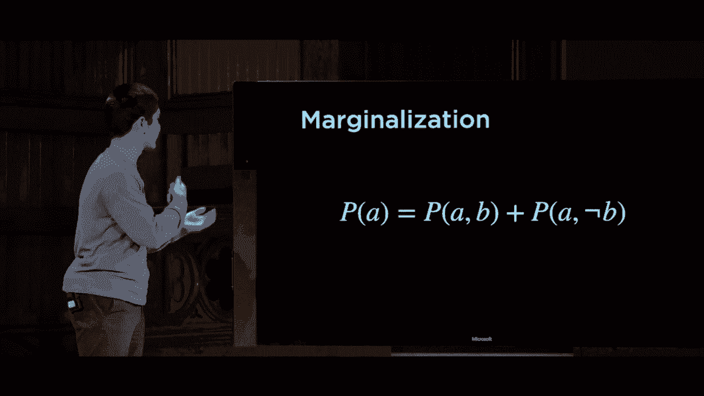

# 【双语字幕+资料下载】哈佛CS50-AI ｜ Python人工智能入门(2020·完整版) - P9：L2- 不确定性 2 (联合概率，贝叶斯网络) - ShowMeAI - BV1AQ4y1y7wy

calculate some other probability as well，the other kind of probability that'll be。

important for us to think about is joint，probability and this is when we're。

considering the likelihood of multiple，different events simultaneously and so。

what do we mean by this，well for example I might have。

probability distributions that look a，little something like this like oh I。

want to know the probability，distribution of clouds in the morning。

and that distribution looks like this，40% of the time see which is my random。

variable here is equal to it's cloudy，and 60% of the time it's not cloudy so。

here is just a simple probability，distribution that is effectively telling。

me that 40% of the time it's cloudy I，might also have a probability。

distribution for rain in the afternoon。

where 10% of the time or with，probability 0。1 it is raining in the，afternoon and with probability 0。

9 it is，not raining in the afternoon and using，just these two pieces of information I。

don't actually have a whole lot of，information about how these two。

variables relate to each other but I。

could if I had access to their joint，probability meaning for every。

combination of these two things meaning，morning cloudy and afternoon rain and。

morning cloudy and afternoon not rain，morning not cloudy and afternoon rain。

and morning not cloudy and afternoon not。

raining if I had access to values for，each of those four I have more。

information so information that be，organized in a table like this and this。

rather than just a probability，distribution is a joint probability。

distribution it tells me the probability，distribution of each of the possible。

combinations of values that these random，variables can take on so if I want to。

know what is the probability that on any，given day it is both cloudy and rainy。

well I would say all right，looking at cases where it is cloudy and，cases where it is raining and the。

intersection of those two that row in。

that column is 0。08 so that is the，probability that it is both cloudy and。

rainy using that information and using，this conditional probability table are。

using this joint probability table I can，begin to draw other pieces of，information about things like。

conditional probability so I might ask a，question like what is the probability。

distribution of clouds given that I know，that it is raining meaning I know for。

sure that's rain that it's raining tell，me the probability distribution over。

whether it's cloudy or not given that I，know already that it is in fact raining。

and here I'm using C to stand for that，random variable I'm looking for a。

distribution meaning the answer to this，is not going to be a single value it's。

going to be two values a vector of two，values where the first value is。

probability of clouds the second value，is probability that it is not cloudy but。

the sum of those two values is going to，be one because when you add up the。

probabilities of all of the possible，worlds and the result that you get must。

be the number one and well what do we，know about how to calculate a。

conditional probability well we know，that the probability of a given B is the。

probability of a and B divided by the，probability of B so what does this mean。

well it means that I can calculate the，probability of clouds given that it's。

raining as the probability of clouds and，raining divided by the probability of。

rain and this comma here if for the，probability distribution of clouds and。

rain this comma sort of stands in for，the word and you'll sort of seen the。

logical operator and and the comma used，interchangeably this means the。

probability distribution over the clouds，and knowing the fact that it is raining。

divided by the probability of rain and，the interesting thing to note here and。

what we'll often do in order to simplify，our mathematics is that dividing by the。

probability of rain the probability of，rain here is just some numerical。

constant it is some number dividing by，probability of rain is just dividing by。

some constant or in other words，multiplying by the inverse of that，constant and it turns out that。

oftentimes we can just not worry about，what the exact value of this is and just。

know that it is in fact a，in value and we'll see why in a moment。

so instead of expressing this as this，joint probability divided by the。

probability of rain sometimes we'll just，represent it as alpha times the。

numerator here the probability，distribution of see this variable and。

that we know that it is raining for，instance so all we've done here is said。

this value of 1 over the probability of，rain that's really just a constant we're。

gonna divide by or equivalently，multiplied by the inverse of at the end。

and we'll just call it alpha for now and，deal with it a little bit later but the。

key idea here now and this is an idea，that's going to come up again is that。

the conditional distribution of C given，rain is proportional to meaning just。

some factor multiplied by the joint，probability of C and rain being true and。

so how do we figure this out well this，is going to be the probability that it。

is cloudy given that it's raining which，is 0。08 and the probability that it's。

not cloudy given that it's rainy which，is 0。02 and so we get alpha times here。

now is that probability distribution，0。08 is clouds and rain 0。02 is not。

cloudy and rain but of course point O，eight and point O two don't sum up to。

the number one and we know that in a。

probability distribution if you consider，all of the possible values they must sum。

up to a probability of 1 and so we know，that we just need to figure out some。

constant to normalize so to speak these，values something we can multiply or。

divide by to get it so that all these，probabilities sum up to 1 and it turns。

out that if we multiply both numbers by，10 then we can get that result of 0。8。

and point to the proportions are still，equivalent but now 0。8 plus 0。2 those。

sum up to the number 1 so take a look at，this and see if you can understand step。

by step how it is we're getting from one，point to another but the key idea here。

is that by using the joint probably，probabilities these probabilities that。

it is both cloudy and rainy and that it，is not cloudy and rainy I can take that。

information and figure out the，conditional probability given that it's。

raining what is the chance that it's，cloudy versus not cloudy just by。

multiplying by some normalization，constant so to speak and this is what a。

computer can begin to you is that，to be able to interact with these。

various different types of probabilities，and it turns out there are a number of。

other probability rules that are going，to be useful to us as we begin to。

explore how we can actually use this，information to encode into our computer。

ism some more complex analysis that we，might want to do about probability and。

distributions and random variables that，we might be interacting with so here a。

couple of those important probability，rules one of the simplest rules is just。

this negation rule what is the，probability of not event a so a is an。

event that has some probability and I，would like to know what is the。

probability that a does not occur and it。

turns out it's just 1 minus P of a which。

makes sense because if those are the two，possible cases either a happens or a。

doesn't happen then when you add up。

those two cases you must get 1 which，means that P of not a must just be 1。

minus P of a because a P of a and P if，not a must sum up to the number one they。

must include all of the possible cases，we've seen an expression for calculating。

the probability of a and B we might also，reasonably want to calculate the。

probability of A or B what is the，probability that one thing happens or。

another thing happens so for example I，might want to calculate what is the。

probability that if I roll two dice a，red dye and a blue dye，what is the likelihood that a is a six。

or B is a six like one or the other and，what you might imagine you could do and。

the wrong way to approach it would be，just to say all right well a comes up as。

a six with the red dye comes up as a six，with probability one over six the same。

for the blue dye it's also one over six，add them together and you get two over。

six otherwise known as one-third but，this does a suffers from a problem of。

over counting that we've double counted，the case where both a and B both the red。

dye and the blue dye，both come up as a six role and I've，counted that instance twice so to。

resolve this the actual expression for，calculating the probability of A or B。

uses what we call the inclusion，exclusion formula so whele take the，probability of a add it to the。

probability of B that's all same as，before but then I need to exclude the。

cases that I've double counted so I，subtract from that。

the probability of a and B and that gets，me the results for a or B I consider all。

the cases where a is true and all the，cases where B is true and if you imagine。

this is like a Venn diagram of cases，where a is true cases where B is true I。

just need to subtract out the middle to，get rid of the cases that I have over。

counted by double counting them inside，of both of these individual expressions。

one other rule that's going to be quite，helpful is a rule called marginalization。

some marginalization is answering the，question of how do I figure out the。

probability of a using some other，variable that I might have access to。

like B even if I don't know additional，information about it I know that B some。

event can have two possible states，either B happens or B doesn't happen。

assuming it's a boolean true or false。

and well what that means is that for me，to be able to calculate the probability。

of a there are only two cases either a，happens and B happens or a happens and B。

doesn't happen and those are two，disjoint meaning they can't both happen。

together either B happens or B doesn't，happen they're disjoint or separate。

cases and so I can figure out the，probability of a just by adding up those。

two cases the probability that a is true，is the probability that a and B is true。

plus the probability that a is true and。

B isn't true so by marginalizing I've，looked at the two possible cases that。

might take place either B happens or B，doesn't happen and in either of those。

cases I look at what's the probability，that a happens and if I add those。

together well then I get the probability。

that a happens as a whole so take a look，at that rule it doesn't matter what B is。

or how it's related to a and so long as，I know these joint distributions I can。

figure out the overall probability of a，and this can be a useful way if I have a。

joint distribution like the Joint，Distribution of a and B to just figure。

out some unconditional probability like。

the probability of a and we'll see，examples of this soon as well now。

sometimes these might not just be random，might not just be variables that are。

events that are like they happened or，they didn't happen like B is here there。

might be some broader probability，distribution where there are multiple。

possible values and so here in order to，use this marginalization rule I need to。

sum up not just over B，not B but for all of the possible values，that the other random variable could。

take on and so here we'll see a version，of this rule for random variables and。

it's going to include that summation，notation to indicate that I'm summing up。

adding up a whole bunch of individual，values so here's the rule looks a lot。

more complicated but it's actually the。

equivalent exactly the same rule what，I'm saying here is that if I have two。

random variables one called X and one，called Y well the probability that X is。

equal to some value X sub I this is just，some value that this variable takes on。

how do I figure it out well I'm going to，sum up over J where J is going to range。

over all of the possible values that Y，can take on well let's look at the。

probability that x equals x I and y，equals YJ so the exact same rule the。

only difference here is now I'm summing，up over all of the possible values that。

Y can take on saying let's add up all of，those possible cases and look at this。

Joint Distribution destroy probability，that X takes on the value I care about。

given all of the possible values for Y。

and if I add all those up then I can get，this unconditional probability of what X。

is equal to whether or not X is equal to。

some value X sub I so let's take a look，at this rule because it does look a。

little bit complicated let's try and put，a concrete example to it here again is。

that same Joint Distribution from before，I have cloud not cloudy rainy not rainy。

and maybe I want to access some variable，I want to know what is the probability，that it is cloudy。

well marginalization says that if I have，this joint distribution and I want to。

know like what is the probability that。

it is cloudy well I need to consider the，other variable the variable that's not。

here the idea that it's rainy and I，considered the two cases either it's。

raining or it's not raining and I just，sum up the values for each of those。

possibilities in other words the，probability that it is cloudy is equal。

to the sum of the probability that it's，cloudy and it's rainy and the。

probability that it's cloudy and it is，not rain，and so these are now are values that I。

have access to these are values that are，just inside of this joint probability。

table what is the probability that it is，both cloudy and rainy well it's just the。

intersection of these two here which is，point zero eight and the probability。

that it's cloudy and not raining is all，right here's cloudy，here's not raining it's 0。32 so it's。

point zero eight plus 0。32，which just gives us equal to zero point，four that is the unconditional。

probability that it is in fact cloudy，and so marginalization gives us a way to。

go from these joint distributions to，just some individual probability that I。

might care about and you'll see a little，bit later why it is that we care about。

that and why that's actually useful to，us as we begin doing some of these。

calculations last rule we'll take a look，at before transitioning something a。

little bit different is this rule of，conditioning very similar to the。

marginalization rule but it says that，again if I have two events a and B but。

instead of having access to their joint，probabilities I have access to their。

conditional probabilities how they，relate to each other well again if I。

want to know the probability that a，happens and I know that there's some。

other variable B either B happens or B，doesn't happen and so I can say that the。

probability of a is the probability of a，given B times the probability of B。

meaning B happened and given that I know，B happen what's the likelihood that a。

happened and then I consider the other。

case that B didn't happen so here's the，probability that B didn't happen and。

here's the probability that a happens，given that I know that B didn't happen。

and this is really the equivalent rule，just using conditional probability。

instead of joint probability where I'm，saying let's look at both of these two。

cases and conditioned on B look at the，case where B happens and look at the。

case where B doesn't happen and look at。

what probabilities I get as a result and，just as in the case of marginalization。

where there was an equivalent rule for，random variables that could take on。

multiple possible values in a domain of，possible values here to conditioning has。

the same equivalent rule again there's a，summation to mean I'm summing over all。

of the possible values that some random，variable Y could take on but if I want。

to know what is the probability that X，takes on this value then I'm going to，sum up over all。

values J that Y could take on and say，all right what's the chance that Y takes。

on that value YJ and multiply it by the，conditional probability that X takes on。

this value given that Y took on that，value YJ so equivalent rule just using。

conditional probabilities instead of，joint probabilities and using the，equation we know about joint。

probabilities we can translate between，these two so alright we've seen a whole。

lot of mathematics and we've just sort，of laid the foundation for mathematics。

and no need to worry if you haven't seen，probability in a too much detail up。

until this point these are sort of the，foundations of the ideas that are going。

to come up as we begin to explore how we，can now take these ideas from。

probability and begin to apply them to，represent something inside of our。

computer something inside of the AI，agent we're trying to design that is。

able to represent information and，probabilities and the likelihoods。

between various different events so，there are a number of different，probabilistic models that we can。

generate but the first of the models，we're going to talk about our water。

known as Bayesian networks and a，Bayesian network is just going to be。

some network of random variables。

connected random variables that are，going to represent the dependence。

between these random variables that odds，are most random variables in this world。

are not independent from each other that，there's some relationship between things。

that are happening that we care about if，it is rainy today you know that might。

increase the likelihood that my flight，or my train gets delayed for example。

there are some dependence between these，random variables and a Bayesian network。

is going to be able to capture those，dependencies so what is a Bayesian。

network what is its actual structure and，how does it work，well a Bayesian network is going to be a。

directed graph and again we've seen，directed graphs before they are。

individual nodes with arrows or edges，that connect one node to another node。

pointing in a particular direction and，so this directed graph is going to have。

nodes as well where each node in this，directed graph is going to represent a。

random variable something like the，weather or something like whether my。

train was on time or delayed and we're，going to have an arrow from a node X to。

a node Y to mean that X is a parent of Y，so that'll be our notation if there's an。

arrow from X to Y X is going to be，considered a parent of Y，and the reason that's important is。

because each of these nodes is going to，have a probability distribution that。

we're going to store along with it which，is the distribution of X given some。

evidence given the parents of X so the，way to more intuitively think about this。

is the parent seam we thought of as sort，of causes for some effect that we're。

going to observe and so let's take a，look at an actual example of a Bayesian。

network and think about the types of，logic that might be involved in。

reasoning about that Network let's，imagine for a moment that I have an。

appointment out of town and I need to，take a train in order to get to that。

appointment so what are the things I，might care about well I care about you。

know getting to my appointment on time，either I make it to my appointment and。

I'm able to attend it or I miss the，appointment and you might imagine that。

that's influenced by the train that the，train is either on time or it's delayed。

for example but that train itself is，also influenced whether the train is on。

time or not depends maybe on the rain，you know is there no rain is it light。

rain is there heavy rain and it might，also be influenced by other variables。

too it might be influenced as well by，whether or not there's you know。

maintenance on the train track for，example if there is maintenance on the。

train track that probably increases the，likelihood that my train is delayed and。

so we can represent all of these ideas，using a Bayesian network that looks a。

little something like this，here I have four nodes representing four。

random variables that I would like to，keep track of I have one random variable。

called rain that can take on three，possible values in its domain either。

none or light or heavy for no rain light，rain or heavy rain I have a variable。

called maintenance for whether or not，there's maintenance on the train track。

which it has two possible values just，either yes or no either there is。

maintenance or there's no maintenance，happening on the track then I have a。

random variable for the Train indicating，whether or not the train was on time or。

not that random variable has two，possible values in its domain the Train。

is either on time or the Train is，delayed and then finally I have a random。

variable for whether I make it to my，appointment for my appointment down here。

I have a random variable called，appointment that itself has two possible。

values attend and miss and so here are，the possible values here are my four。

nodes each of which represents a random，variable each of which。

a domain of possible values that it can，take on and the arrows the edges。

pointing from one node to another encode，some notion of dependence inside of this。

graph that whether I make it to my，appointment or not is dependent upon。

whether the train is on time or delayed，and whether the train is on time or。

delayed is dependent on two things given，by the two arrows pointing at this node。

it is dependent on whether or not there，was maintenance on the train track and。

it is also dependent upon whether or not，it was raining or whether it is raining。

and just to make things a little，complicated let's say as well that。

whether or not there's maintenance on，the track this too might be influenced。

by the rain then if there's heavier rain，well maybe it's less likely that's going。

to be maintenance on the train track，that day because they're more likely to。

want to do maintenance on the track on，days when it's not raining for example。

and so these nodes might have different，relationships between them but the idea。

is that we can come up with a，probability distribution for any of。

these nodes based only upon its parents，and so let's look node by node at what。

this probability distribution might，actually look like and we'll go ahead。

and begin with this root node this rain，node here which is at the top and has no。

arrows pointing into it which means it's，probability distribution is not going to。

be a conditional distribution it's not，based on anything I just have some。

probability distribution over the，possible values for the rain random。

variable and that distribution might，look a little something like this。

none light and heavy each have a。

possible value here I'm saying the，likelihood of no rain is 0。7 of light。

rain is 0。2 of heavy rain is 0。1 for，example so here is a probability。

distribution for this root node in this，Bayesian network and let's now consider。

the next node in the network maintenance，track maintenance is yes or no and the。

general idea of what this distribution，is going to encode at least in this。

story is the idea that the heavier the，rain is the less likely it is that。

there's going to be maintenance on the，track because the people that are doing。

maintenance on the track probably want，to wait until a day when it's not as。

raining in order to do the track，maintenance for example and so what。

might that probability distribution look，like well this now is going to be a。

conditional probability distribution，that here are the three possible values。

for the rain random variable which I'm，here just going to abbreviate to are。

either no rain light rain or heavy rain，and for each of those possible values。

either there is yes track maintenance or，no track maintenance and those have。

probabilities associated with them，that I see here that if it is if it is。

not raining then there is a probability，of 0。4 that there's track maintenance，and a probability of 0。

6 that there，isn't but if there's heavy rain then，here the chance that there is track。

maintenance is 0。1 and the chance that，there is not track maintenance is 0。9。

each of these rows is going to sum up to，one because each of these represent。

different values of whether or not it's，raining the three possible values of。

that random variable can take on and，each is associated with its own。

probability distribution that is，ultimately all going to add up to the。

number one so that there is our，distribution for this random variable。

called maintenance about whether or not，there is maintenance on the train track。

and now let's consider the next variable，here we have a node inside of our。

Bayesian network called train that has，two possible values on time and delayed。

and this node is going to be dependent，upon the two nodes that are pointing。

towards it that this whether or not the，train is on time or delayed it depends。

on whether or not there's track，maintenance and it depends on whether or。

not there's rain that heavier rain，probably means more likely that my train。

is delayed and if there is track，maintenance that also probably means。

it's more likely that my train is，delayed as well and so you could，construct a larger probability。

distribution a conditional probability，distribution that instead of。

conditioning on just one variable as was，the case here is now conditioning on two。

variables conditioning both on rain，represented by R and on maintenance。

represented by yes again each of these，rows has two values and sum up to the。

number one one for whether the train is，on time one for whether the train is。

delayed and here I can say something，like alright if I know there was light。

rain and track maintenance well okay，that would be R is light and M is yes。

well then there's a probability of zero，point six that my train is on time and a，probability of zero。

point for the train is delayed and you，could imagine gathering this data just。

by looking at real world data looking at，data about alright if I knew that it was。

light rain and there was track，maintenance how often was a train delay。

it or not delayed and you could begin to，construct this thing but the interesting。

thing is intelligently being able to try，to figure out how might you go about。

ordering these things what things might，influence other nodes inside of this。

Bayesian network and the last thing I，care about is whether or not I make it。

to my appointment so did I attend or，missed the appointment and ultimately。

whether I attend or missed the，appointment you know it is influenced by。

track maintenance because it's，indirectly this idea that right if there。

is track maintenance well then my train，might more likely be delayed and if I。

train this more likely to be delayed，then I'm more likely to miss my。

appointment but what we encode in this，Bayesian network are just what we might。

consider to be more direct relationship，so the train has a direct influence on。

the appointment and given that I know，whether the train is on time or delayed。

knowing whether there's track，maintenance isn't going to give me any。

additional information that I didn't，already have that if I know train these。

other nodes that are up above isn't，really going to influence the result and。

so here we might represent it using，another conditional probability，distribution that looks a little。

something like this the train can take，on two possible values either my train。

is on time or my train is delayed and，for each of those two possible values I。

have a distribution for what are the，odds that I'm able to attend the meeting。

and what are the odds that I missed a，meeting and obviously if my train is on。

time I'm much more likely to be able to，attend the meeting then if my train is。

delayed in which case I'm more likely to，miss that meeting so all of these nodes。

put all together here represent this，Bayesian network this network of random。

variables whose values I ultimately care，about and that have some sort of。

relationship between them some sort of，dependence where these arrows from one。

node to another indicate some dependence，that I can calculate the probability of。

some node given the parents that happen。

to exist there so now that we've been，able to describe the structure of this。

Bayesian network and the relationships，between each of these nodes by。

associating each of the nodes in the，network with a probability distribution。

whether that's an unconditional，probability distribution in the。

case of this root node here like rain，and a conditional probability。

distribution in the case of all of the，other nodes whose probabilities are。

dependent upon the values of their，parents we can begin to do some。

computation and calculation using the，information inside of that table so。

let's imagine for example that I just，wanted to compute something simple like。

the probability of light rain how would，I get the probability of light rain。

well light rain rain here is a root node，and so if I wanted to calculate that。

probability I could just look at the。

probability distribution for rain and，extract from it the probability of light。

rains just a single value that I already，have access to but we could also imagine。

wanting to compute more complex joint，probabilities like the probability that。

there is light rain and also no track，maintenance this is a joint probability。

of two values light rain and no track，maintenance and the way I might do that。

is first by starting by saying all right，well let me get the probability of light。

rain but now I also want the probability，of no track maintenance but of course。

this node is dependent upon the value of，rain so what I really want is the。

probability of no track maintenance，given that I know that there was light。

rain and so the expression for，calculating this this idea that the。

probability of light rain and no track，maintenance is really just the。

probability of light rain and the，probability that there's no track。

maintenance given that I know that there，already is light rain so I take the。

unconditional probability of light rain，multiply it by the conditional。

probability of no track maintenance，given that I know there's light rain and。

you can continue to do this again and，again for every variable that you want。

to add into this joint probability that，I might want to calculate if I wanted to。

know the probability of light rain and，no track maintenance and a delayed train。

well that's going to be the probability，of light rain multiplied by the。

probability of no track maintenance，given light rain multiplied by the。

probability of a delayed train given，light rain and no track maintenance。

because whether the train is on time or，delayed is dependent upon both of these。

other two variables and so I have two，pieces of evidence that go into the，calculation of that。

conditional probability and each of，these three values is just a value that。

I can look up by looking at one of these，individual probability distributions。

that is encoded into my Bayesian network，and if I wanted a joint probability over。

all four of the variables something like，the probability of light rain and no。

track maintenance and a delayed train，and I miss my appointment well that's。

going to be multiplying four different，values one from each of these individual。

nodes and it's going to be the，probability of light rain then of no。

track maintenance given light rain then，of a delayed train given light rain and。

no track maintenance and then finally，for this node here for whether I make it。

to my appointment or not it's not，dependent upon these two variables given。

that I know whether or not the train is，on time I only need to care about the。

conditional probability that I miss my，train or that I miss my appointment。

given that the train happens to be，delight and so that's represented here。

by four probabilities each of which is，located inside of one of these。

probability distributions for each of，the nodes all multiplied together until。

I can take a variable like that and，figure out what's the joint probability。

is by multiplying a whole bunch of these，individual probabilities from the。

Bayesian network but of course just as，with last time or what I really wanted。

to do was to be able to get new pieces，of information here to this is what。

we're going to want to do with our，Bayesian network in the context of。

knowledge we talked about the problem of，inference given things that I know to be。

true can I draw conclusions make，deductions about other facts about the。

world that I also know to be true and，what we're gonna do now is apply the。

same sort of idea to probability using，information about which I have some。

knowledge whether some evidence or some，probabilities can I figure out not other。

variables for certain but can I figure，out the probabilities of other variables。

taking on particular values and so here，we introduced the problem of inference。

in a probabilistic setting in a case，where variables might not necessarily be。

true for sure but they might be random，variables that take on different values。

with some probability so how do we。

formally define what exactly this，inference problem actually is well the。

inference problem has a couple of parts，to it we have some query some variable X。

that we want to compute the distribution，or maybe I want the probability that I。

miss my train or I want the probability，that the there is truck maintenance。

something that I want information about，and then I have some evidence variables。

maybe it's just one piece of evidence，maybe it's multiple pieces of evidence。

but I've observed certain variables for。

some sort of event so for example I，might have observed that it is raining。

this is evidence that I have I know that。

there is light rain or I know that there，is heavy rain and that is evidence I。

have in using that evidence I want to，know what is the probability that my。

train is delayed for example and that is，a query that I might want to ask based。

on this evidence so I have a query some，variable evidence which are some other。

variables that I have observed inside of，my Bayesian network and of course that。

does leave some hidden variables why，these are variables that are not。

evidence variables and not query，variables so you might imagine in the。

case where I know whether or not it's，raining and I want to know whether my。

train is going to be delayed or not the，hidden variable the thing I don't have。

access to is something like is there，maintenance on the track or am I gonna。

make or not make my appointment for，example these are variables that I don't。

have access to they're hidden because，they're not things I observed and。

they're also not the query the thing，that I'm asking and so ultimately what。

we want to calculate is I want to know，the probability distribution of X given。

E the event that I observed so given，that I observe some event I observed。

that it is raining I would like to know，what is the distribution over the。

possible values of the Train，random variable is it on time is it。

delayed what's the likelihood that's，going to be there and it turns out we。

can do this calculation just using a lot，of the probability rules that we've。

already seen in action and ultimately，we're gonna take a look at the mass on a。

little bit of a high level at an，abstract level but ultimately we can。

allow computers and programming，libraries that already exist to begin to。

do some of this math for us but it's，good to get a general sense for what's。

actually happening when this inference，process takes place let's imagine for。

example that I want to compute the，probability distribution of the。

appointment random variable given some。

evidence given that I know that there，was light rain and no track maintenance。

so there's my evidence these two。

variables that I observe the values of I，observe the value of rain I know there's。

rain and I know that there is no track，maintenance going on today and what I。

care about knowing my query is this，random variable appointment I want to。

know the distribution of this random，variable appointment like what is the。

chance that I am able to attend my，appointment what is the chance that I。

miss my appointment given this evidence，and the hidden variable the information。

that I don't have access to is this，variable train this is information that。

is not part of the evidence that I see。

not something that I observe but it is，also not the query that I am asking for。

and so what might this inference，procedure look like well if you recall。

back from a memory defining conditional。

probability and doing math with，conditional probabilities we know that a。

conditional probability is proportional，to the joint probability and we remember。

this by recalling that the probability，of a given B is just some constant。

factor alpha multiplied by the，probability of a and B that constant。

factor alpha turns out to be like，dividing over the probability of B but。

the important thing is that it's just，some constant multiplied by the Joint。

Distribution the probability that all of，these individual things happen so in。

this case I can take the probability of，the appointment random variable given。

light rain and no track maintenance and，say that is just going to be。

proportional some constant alpha，multiplied by the joint probability the。

probability of a particular value for，the appointment random variable and。

light rain and no track maintenance well，all right how do I calculate this。

probability of appointment and light，rain and no track maintenance when what。

I really care about is knowing like I，need all four of these values to be able。

to calculate a Joint Distribution across，everything because in a particular。

appointment depends upon the value of，train well in order to do that here I。

can begin to use that marginalization，trick that there are only two ways I can。

get any configuration of an appointment，light rain and no track maintenance。

either this particular setting in，variables happens and the train is on。

time or this particular setting of，variables happens and the train is。

delayed those are two possible cases，that I would want to consider and if I。

add those two cases up well then I get，the result just by adding up all of the。

possibilities for the hidden variable or，variables if there are multiple but，since there's only one。

variable here train all I need to do is，iterate over all the possible values for。

that hidden variable train and add up。

their probabilities so this probability，expression here becomes probability。

distribution over appointment light no，rain and train is on time and the。

probability distribution over the，appointment light rain no track，maintenance and that the train is。

delayed for example so I take both of，the possible values for train go ahead。

and add them up these are just joint，probabilities that we saw earlier how to。

calculate just by going parent parent，parent parent and calculating those。

probabilities and multiplying them，together and then you'll need to。

normalize them at the end speaking at a，high level to make sure that everything。

adds up to the number one so the formula，for how you do this and in process known。

as inference by enumeration looks a，little bit complicated but ultimately it。

looks like this and let's now try to，distill what it is that all of these。

symbols actually mean let's start here，what I care about knowing is the。

probability of X my query variable given，some sort of evidence what do I know。

about conditional probabilities will a，conditional probability is proportional。

to the joint probability so in some，alpha some normalizing constant。

multiplied by this joint probability of，that，well to do that I'm going to marginalize。

over all of the hidden variables all the，variables that I don't directly observe。

the values for I'm basically going to，iterate over all of the possibilities。

that it could happen and just sum them，all up and so I can translate this into。

a sum over all Y which ranges over all，the possible hidden variables and the。

values that they could take on and adds，up all of those possible individual。

probabilities and that is going to allow，me to do this process of inference by。

enumeration now ultimately it's pretty，annoying if we as humans have to do all。

this math for itself or ourselves but，turns out this is where computers and AI。

can be particularly helpful that we can，program a computer to understand a。

Bayesian network to be able to，understand these inference procedures。

and to be able to do these calculations，and using the information you've seen。

here you could implement a Bayesian，network from scratch yourself but turns。

out there are a lot of libraries，especially written in Python that allow。

us to make it easier to do this sort of，probabilistic inference to be able to。

take a Bayesian network and do these，sorts of calculations so，you don't need to know and understand。

all of the underlying math though it's，helpful to have a general sense for how。

it works but you just need to be able to，describe the structure of the network。

and make queries in order to be able to，produce the result and so let's take a。

look at an example of that right now it，turns out that there are a lot of。

possible libraries that exist in Python。

for doing the sort of inference it，doesn't matter too much which specific。

library use they all behave in fairly，similar ways but the library I'm going。

to use here is one known as pomegranate，and here inside of model pi I have。

defined a Bayesian network just using，the structure and the syntax of the。

pomegranate library expects and what I'm，effectively doing is just in python。

creating nodes to represent each of the，nodes of the bayesian network that you。

saw me describe a moment ago so here on，line 4 after I've imported pomegranate。

I'm defining a variable called 'rain，that is going to represent a node inside。

of my bayesian network it's going to be，a node the behave befall is this。

distribution where there are three，possible values none for no rain light。

for light rain heavy for heavy rain and，these are the probabilities of each of，those taking place 0。

7 is the likelihood，of no rain 0。2 for light rain 0。1 for，heavy rain then after that we go to the。

next variable the variable for track，maintenance for example which is。

dependent upon that rain variable and，this instead of being an unconditional。

distribution is a conditional，distribution as indicated by a，conditional probability table here and。

the idea is that I'm following this is，conditional on the distribution of rain。

so if there is no rain then the chance，that there is yes track maintenance is，0。

4 if there's no rain the chance that，there's no track maintenance is 0。6。

likewise for light ray and I have a，distribution for heavy rain I have a。

distribution as well but I'm effectively，encoding the same information you saw。

represented graphically a moment ago but，I'm telling this Python program that the。

maintenance node obeys this particular，conditional probability distribution and。

we do the same thing for the other，random variables as well train was a。

node inside my distribution that was a，conditional probability table with two。

parents it was dependent not only on，rain but also on track maintenance and。

so here I'm saying something like given，that there is no rain and yes track，maintenance。

the probability that my train is on time，is 0。8 and the probability that it's，delayed is 0。

2 and likewise I can do the，same thing for all of the other possible。

values of the parents of the train node，inside of my Bayesian network by saying。

for all of those possible values here is，the distribution that the Train node。

should follow and I do the same thing，for an appointment based on the。

distribution of the variable train then，at the end what I do is actually。

construct this network by describing，what the states of the network are and。

by adding edges between the dependent，nodes so I create a new Bayesian network。

add States to it one for rain one for，maintenance one for the Train one for。

the appointment and then I add edges，connecting the related pieces rain has。

an arrow to maintenance because rain，influences track maintenance rain also。

influences the Train maintenance also，influences the train and train。

influences whether I make it to my，appointment and bake just finalizes the。

model and does some additional，computation so the specific syntax of。

this is not really the important part，pomegranate just happens to be one of。

several different libraries that can all，be used for similar purposes and you。

could describe describe and define a，library for yourself that implemented。

similar things but the key idea here is，that someone can design a library for a。

general Bayesian network that has nodes，that are based upon its parents and then。

all a programmer needs to do using one，of those libraries is to define what。

those nodes and what those probability，distributions are and we can begin to do。

some interesting logic based on it so，let's try doing that like conditional or。

joint probability calculation that we，saw us do by hand before by going into。

likelihood hi we're here I'm importing，the model that I just defined a moment。

ago and here I'd just like to calculate，modeled up probability which calculates。

the probability for a given observation，and I'd like to calculate the。

probability of no rain no track。

maintenance my train is on time and I'm，able to attend the meeting so sort of。

the optimal scenario that there's no，rain and no maintenance on the track my，the meeting。

what is the probability that all of that，actually happens and I can calculate。

that using the library and just print，and run，iPhone of likelihood PI and I see that。

okay the probability is about zero point，three four so about a third of the time。

everything goes right for me in this，case no rain no track maintenance trane。

is on time and I'm able to attend the，meeting but I could experiment let's try。

and calculate other probabilities as，well what's the probability that。

everything goes right up until the Train，but I still miss my meeting so no rain。

no track maintenance train is on time，but I missed the appointment let's。

calculate that probability and write，that has a probability of about 0。04 so。

about 4% of the time the train will be，on time there won't be any rain no track。

maintenance and yet I'll still miss the，meeting and so this is really just an。

implementation of the calculation of the，joint probabilities that we did before。

what this library is likely doing is，first figuring out the probability of no。

rain then figuring that the probability，of no track maintenance given no rain。

then the probability that my train is on，time given both of these values and then。

the probability that I miss my，appointment given that I know that the。

train was on time so this again is the，calculation of that joint probability。

and turns out we can also begin to have，our computer solve inference problems as。

well to begin to infer based on，information evidence that we see it what。

is the likelihood of other variables，also being true so let's go into。

inference top I for example we're here，and again importing that exact same。

model from before importing all the，nodes and all the edges and the。

probability distribution that is encoded，there as well and now there's a function。

for doing some sort of prediction and，here into this model I pass in the。

evidence that I observe so here I've，encoded into this Python program the。

evidence that I have observed I have，observed the fact that the train is。

delayed and that is the value for one of，the four random variables inside of this。

Bayesian network and using that，information I would like to be able to。

draw inspiration and we figure out，inferences about the values of the other。

random variables that are inside of my，Bayesian network I would like to make。

predictions about everything else so all，of the actual computational logic is。

happening in just these three lines，where I'm making this call to this。

prediction down below I'm just，iterating over all of the states and all。

the predictions and just printing them，out so that we can visually see what the。

results are but let's find out given the，train is delayed，what can I predict about the values of。

the other random variables let's go，ahead and run Python infer and stop PI I。

run that and all right here is the，result that I get given the fact that I。

know that the train is delayed this is。

evidence that I have observed well given，that there is a 45 percent chance or a。

46 percent chance that there was no rain，a 31 percent chance there was light rain。

a 23 percent chance it was heavy rain I，can see a probability distribution of。

attract maintenance and a probability，distribution over whether I'm able to。

attend or miss my appointment now we，know that whether I attend or missed the。

appointment that is only dependent upon，the train being delayed or not delayed。

it shouldn't depend on anything else so，let's imagine for example that I knew。

that there was heavy rain that shouldn't，affect the distribution for making the。

appointment and indeed if I go up here。

and add some evidence say that I know，that the value of rain is heavy that is。

evidence and I now have access to I now，have two pieces of evidence I know that。

the rain is heavy and I know that my，train is delayed I can calculate the。

probability by running this inference，procedure again and seeing the result I。

know that the rain is heavy I know my，train is delayed up the probability。

distribution for track maintenance，changed given that I know that there's。

heavy rain now it's more likely that，there's no track maintenance 88% as。

opposed to 64% from here before and now，what is the probability that I make the，before。

it's still going to be attend the，appointment with probability 0。6 missed。

the appointment with probability 0。4，because it was only dependent upon。

whether or not my train was on time or，delayed and so this here is implementing。

that idea of that inference algorithm to，be able to figure out based on the。

evidence that I have and what can we，infer about the values of the other。

variables that exist as well so，inference by enumeration is one way of。

doing this inference procedure just，looping over all of the values the。

hidden variables could take on and，figuring out what the probability is now。

it turns out this is not particularly，efficient and there are definitely。

optimizations you can make by avoiding，same sort，probability multiple times there are。

ways of optimizing the program to avoid，having to recalculate the same。

probabilities again and again but even，then as the number of variables get。

large as the number of possible values，of variables could take on get large。

we're going to start to have to do a lot，of computation a lot of calculation to。

be able to do this inference and at that，point it might start to get unreasonable。

in terms of the amount of time that it，would take to be able to do this sort of。

exact inference and it's for that reason，that often times when it comes towards。

probability and things we're not，entirely sure about we don't always care。

about doing exact inference and knowing，exactly what the probability is but if。

we can approximate the inference，procedure do some sort of approximate。

inference that that can be pretty good，as well that if I don't know the exact。

probability but I have a general sense，for the probability that I can get。

increasingly accurate with more time，that that's probably pretty good。

especially if I can get that to happen，even faster so how could I do。

approximate inference inside of a。