# 【双语字幕+资料下载】哈佛CS50-CS ｜ 计算机科学导论(2020·完整版) - P10：L5- 数据结构 1（数组、链表、树、哈希表、字典树、堆、栈、队列） - ShowMeAI - BV1Hh411W7Up

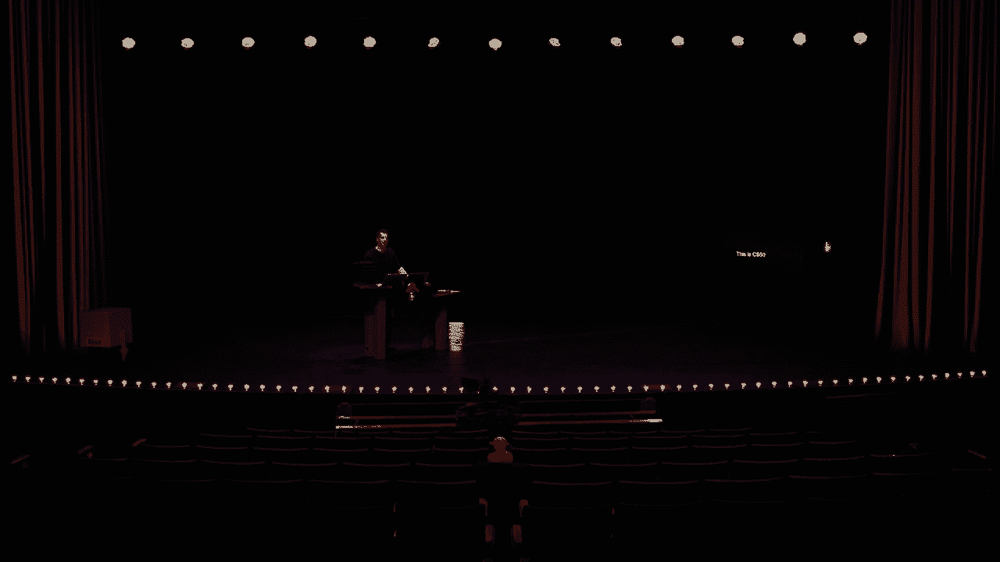

all right。

this is cs50 and this is week five，recall that last week in week four we。introduced a few new building blocks，namely pointers and spoke in great。detail about how you can now manipulate，a computer's memory and begin to do。things at a lower level with it well，today we'll sort of use those basic，building blocks to start。

creating things called data structures，in the computer's memory it turns out。that once you have this ability to refer，to different locations in the computer's，your own。custom shapes your own custom data，structures as they're called，and indeed we'll start doing that by。rolling back for just a moment，to where we first saw a data structure。

in week two so we're calling week two，which was our second week of playing。with c we introduced you to the notion，of an array and an array is just a。contiguous sequence of memory，in which you can store a whole bunch of。integers back to back to back or maybe a，back，and those uh arrays might have been。

represented pictorially like this so，this would be an array of size 3 and。

of，it，start to，bump up against a problem but also solve，a problem today suppose that you want to。add another number to this array but，you've only had the forethought to。create an array of size three the catch，with arrays in c，is that they're not really easily。resizable again you all know that you，have to decide in advance how big the，array is going to be。

so if you sort of change your mind later，or your program's running long enough，it。you're kind of in a bind like，number four，into this array you would ideally just，array。and continue about uh your business but，the catch with an array is that。that chunk of memory is not uh it，doesn't exist in a vacuum recall if we。

sort of zoom out and look at all of your，computer's memory。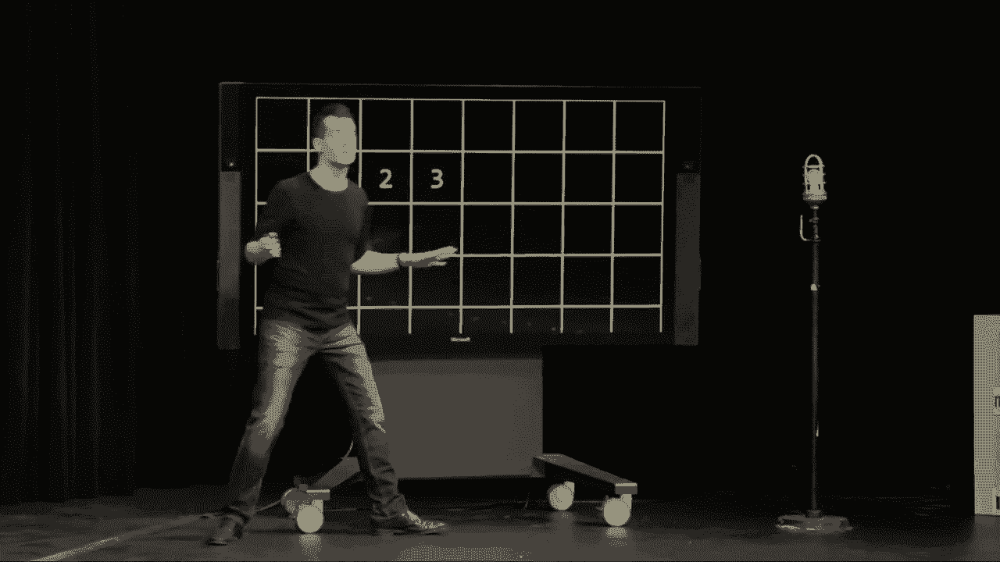

this byte this byte and a whole bunch of，other bytes might very well be in use by。other variables or other aspects of your，discussion，suppose that the program in question has。one array of size three，containing the integers one two three。and then suppose that your same program，has a string，somewhere in the code that you've，world。

by chance，may very well be an h-e-l-l-o，comma space w-o-r-l-d backslash zero。and there might be free memory so to，speak memory you could use。that's filled with garbage values and，garbage isn't bad it just means that you，values are。or were there so there is free space so，to speak each of these oscars represents。

effectively free space，with some garbage value there remnants，may be of some。execution past but the problem here is，that it you，where you might。want to put it so what's the solution if，we have this array of size three。containing three integers one two three，but it's kind of been painted into a，corner whereby h-e-l-l。

and so forth are already immediately，there，without sacrificing the h and that。doesn't really feel like a solution，problem，are we sort of completely out of luck，can you just not。add a number to an array in a situation，like this，or is there a solution perhaps that。comes to mind even if you've never，programmed before，if on the screen there sort of the lay，um。

i would say that um maybe you could，and，create a new array but that's one。size bigger or one element bigger and，then add that new element。yeah that's really good intuition after，all there's all these oscars on the。screen right now which again represent，garbage values or in turn。

free space so i could put one two three，four over here，i could put one two three four down here。so we sort of have some flexibility but，santiago is exactly right。intuitively all we really need to do is，let's focus only on，four of the available spots a new array。of size four if you will which initially，has these four garbage values but that's。

okay because the santiago also notes we，array，one two three into the new array and。heck maybe we can now even，free the memory from the original ray。much like we could if we used malloc，and that leaves us then of course with。just an array of size four with that，fourth garbage value but now。

we do have room for like the number four，itself，so it would seem that there is a。solution to this problem that doesn't，violate the definition of an array again。the only definition of an array really，is that the memory must be contiguous。you can't just pop the four，anywhere in the computer's memory it has。

to become right after your existing，memory if this whole thing。this whole structure is indeed going to，still be an array，but i worry that that might have。cost us a bit of time and in fact let me，go ah**d and open up on the screen here。in just a moment a question that you're，all welcome to buzz，in for what would be the running time。

ahead and，reveal the poll question here feel free，to go to the usual url which brian if。you wouldn't mind copying pasting as，usual，what do you think the running time is of，inserting。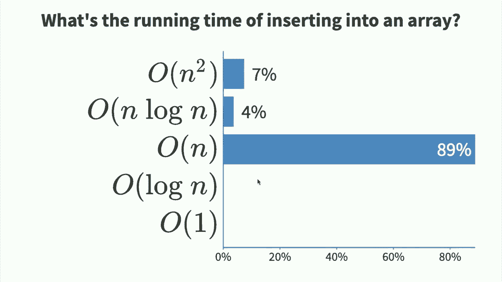

into an array inserting into an array，recall in the past we've talked about，arrays in terms of。time we're really talking about，inserting into them and if we take a，like。80 some percent of you feel that it's，linear time big o of，n whereby it might take as many as n。steps to actually，insert into an array five percent of you，propose n log n seven percent of you。

n squ*red and then two and five percent，well，so this is a kind of an interesting mix，the past。and we talked about searching recall，that we typically achieve，uh big o of log n that's really good。unfortunately，if we have to do what santiago proposed，and actually copy all of the elements。from the old array，into the new array it's going to indeed，take us as many as。

n steps because we have to copy each of，the original elements one two three。over into the new array which is going，to be of size n，plus one so it's on the order of n steps。in total so the running time then of，inserting into an array，in terms of an upper bound at least is。going to be indeed big o of n，because you've got to copy potentially，all of those elements over。

but perhaps we might feel differently，if we consider a lower bound on the，running time of insert。what might the lower bound of insert b，when it comes to an array again omega。notation is what we can use here，how many steps maybe in the best case。might it take me to insert a value into，an array we won't do a poll for this one。

brian why don't we go ah**d and call in。

a hand for this what's a lower bound on，the running time of insert ryan what do，you think。well the best case scenario would be if，there's only one element in the array so，you would just have。into the array，yeah so if you've got an array and let，me emphasize that's already。empty whereby you have room for the new，element then indeed，omega of one constant time is all you。

in the array，and it doesn't matter how large the，array is maybe it's a size。four but you've only put one number in。

it that's okay because you can，immediately put the new number in place。

recall that arrays support random access，and just jump，to any location in so-called constant。time in just one step，and is not，full then yes the lower bound on the。insertion into an array is going to be，constant time omega of one but as we saw。in santiago situation whereby you have，an array that's already filled with。

elements and you want to add another，well in that case then upper bound is，indeed going to be。big o of n because you have to do the，over，from one to the other now those of you，java。you might be familiar with the phrase，vector a vector is kind of like an array。that can be resized can grow and shrink，that's not what arrays are in c arrays。

in c are just contiguous blocks of，memory with values back to back to back。but once you decide on their size that，is it，you're going to have to resize it。essentially yourself they're not going，to automatically，grow for you so an array was。the first and really the simplest of the，data structures we'll see。

but it's also not nearly as powerful as，what we can do now that we have access。to a computer's memory，today we're going to start to leverage，these things called pointers the。addresses by which we can refer to，locations in memory and we're going to。start to stitch together some fancier，data structures first one-dimensional。

in some sense then two-dimensional in，some sense by using some very basic。building blocks recall these three，pieces of syntax。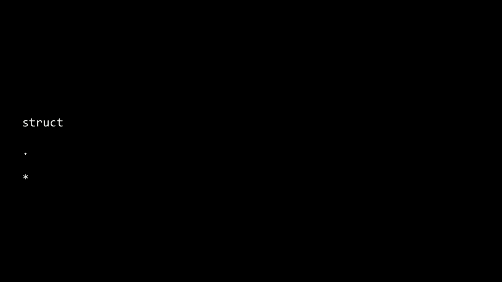

from the past weeks struct recall，is this mechanism this keyword in c，whereby we can define our own。structures in memory we saw one for a，a name，and a number in something like a phone，book and。you've seen the dot operator the dot，operator was how we go inside of such a，structure and get at。dot name or dot number the specific，variables inside of the struct。

and then last week recall we saw the，star operator，whereby the dereference operator which。colloquially means，go to this particular address so just by，using these three。ingredients are we going to be able to，now build up our own custom data，arrays。and can ultimately help us solve，problems more efficiently and in fact。

this is such a common technique in，programming in c，star，intentionally，usage，today。it's pretty much building blocks past，but we're going to use these building。blocks now in new ways to start solving，problems differently and we'll first do。this by way of something called，list，is going to be a data structure that。

solves some of the problems with an，array and what's a problem arguably。well if it takes big o of n steps to，insert into an array，frankly that's kind of annoying that's。kind of expensive because over time if，lots of data，you're the googles of the world the。twitters of the world it's fine if you，array，for the sake of efficient searching。

which recall was big o of log n if we，use something like binary search and，keep everything sorted。but it's going to be pretty painful if，every time you want to add。another tweet to the array or some other，webpage to the array，depending on what the problem is that。you're solving you might potentially as，santiago notes have to copy。

all of the contents of your original，smaller array，into a new bigger array just to add more。tweets or more web pages or the like，so a linked list is going to be a data。structure that's more dynamic，whereby you can grow and shrink the data。structure without having to touch，all of the original data and move it，from old location to new。

so what might like what might this look，like well let's consider again our。computer's memory and let's propose that，i want to store those same values again。so like the number one and just for the，sake of discussion，suppose that it's in my computer's。memory at address ox123，ox just means it's a hexadecimal number。

one two three is completely arbitrary i，discussion，so let me stipulate that that's where。the number one happens to be in the，computer's memory，in this new solution to the problem of。storing lots of data，suppose i want to store number two maybe，it's at address ox456。and then suppose i want to store number，three suppose it's at address，ox 789 so notice deliberately。

these numbers are spread out in the，computer's memory because after all the，arrays。is that you might have hello world or，program，kind of in the way so if i'm proposing，and then two。and then three that's fine plop them，anywhere you want，and you don't have to worry about where。there is already existing values，instead you can just put these values，where there is room。

the problem though is that if you just，start plopping values like one two three，memory，values。right you might know where one is but it，no longer suffices to just。look one location to the right to find，the next value or add two。to find the next value after that in an，array everything is contiguous。

but if we instead start to treat the，computer's memory as just a canvas，we want。that's fine so long as we can somehow，second，to the third irrespective of all the。other stuff that's cluttering up the，computer's memory，so in fact let me propose that we do。this by maybe stealing a bit more space，from the computer，so rather than use just enough memory to。

store one two and three，let me store twice as much information，in addition to every number that i。data，let me store a little metadata so to，speak values that i don't fundamentally。care about but that are going to help me，keep track of my actual data。and let me propose that in this box here，i literally store the value。

ox456 again it's written in hexadecimal，but that's just the number that's the。address of somewhere else in memory，in this box let me propose that i store，ox 789。and in this box let me arbitrarily say，ox0，i done this，even if you've never seen this structure。that's evolving to be what's called a，linked list，why have i just done what i've done in。

addition to storing one two and three，respectively i'm also now storing ox456。in an additional chunk of memory and ox，789 in an additional chunk of memory but，why。so that we know how the first element，like relates to the second or how，they're linked together。exactly between the first and second，yeah so now i'm using essentially twice，as much space to store。

respectively，storing，a pointer to the next element，in the thing i'll now think of as a list。so this is ox456 because the number two，care about，lives at ox456 this number is ox 789，i care about。is that address ox 789 so it's just a，helpful way now of kind of leaving。myself breadcrumbs so that i can plop，the one the two the three anywhere i。

want in the computer's memory，wherever there's available space and。still figure out how to get from one，to the other to the other and we've。actually seen some of this syntax before，bits，that's just uh the technical uh that's，called。null n-u-l-l which we introduced last，week is a special symbol。

indicating that something has gone wrong。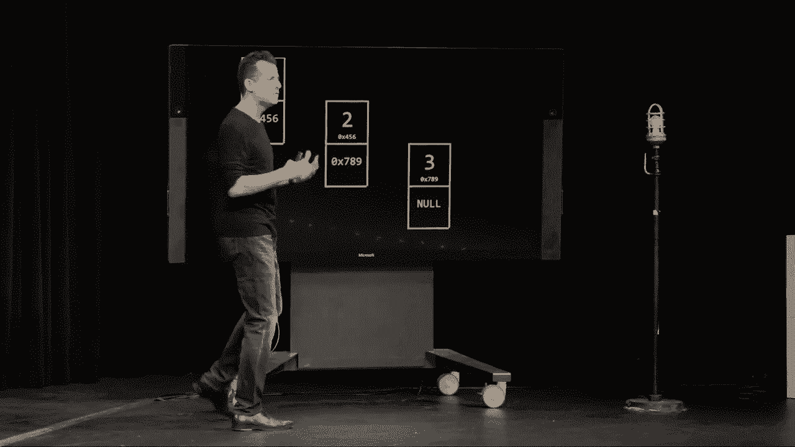

with memory or you're out of space，it's sort of the absence of an address c。guarantees that if you use ox0，of any，useful address there but you know what。again like last week this is sort of，getting way into the weeds i don't，really care about ox， *****。so let's just kind of abstract this away，and start thinking about this really as。

a list of numbers that are somehow。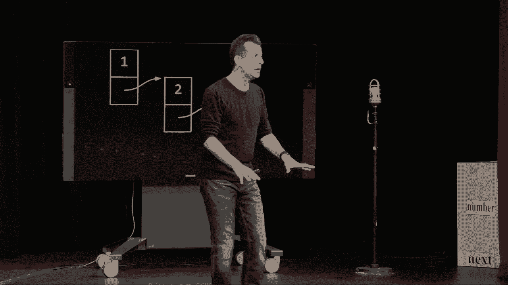

linked together underneath the hood the，links are implemented by way of，addresses or pointers。those low level numbers like ox123 456，789，but pictorially it kind of suffices for。us to just start thinking of，linked，list as being a collection of nodes。

so to speak n-o-d-e that are connected，via pointers，so a node is just a generic computer。science term that refers to some kind of，about，what i care about here is a number and a，this。is a linked list and each of these，rectangles represents a node，ultimately，struct。but let me pause here to see first if，there are any questions，about the structure we've built up any。

questions about，this thing called a linked list before，we see it。in some code brian yeah a question came，in in the chat asking isn't this kind of。a waste of memory that we're now using，too，yeah really good observation isn't this。kind of a waste of memory and that we're，storing all of these addresses in。

addition to the numbers one two three，that we care about，yes and in fact that is exactly the。price we are paying and this is going to，be thematic this week last week and。really every week thereafter，anytime we solve a problem in cs and，programming in particular。there's always going to be some price，trade-off，so if a moment ago it was unacceptable。

that inserting，into an array is in big o of n because，man that's going to take so many steps，array。into the new array if that is，reasons or，whatever the problem is that you're。

solving well that's fine，you can solve that problem and now have，your numbers。anywhere in memory without having to，move the existing numbers anywhere else。thereby saving yourself time，but the price you're going to pay indeed。is more space so at that point it kind，of depends what's more important to you。

the computer's time your human time or，maybe the space or the cost of the space。the more memory that you might really，need to literally buy，for that computer so this is going to be。and time，is omnipresent really in programming，well let's consider how we might，recall that。when we last saw structs in c we did，something like this to define a person。

as having two things associated with，them a name and a number so。today we don't care about persons and，names and numbers we care about these，nodes。so let me go ah**d and rewind from that，erase that and let's instead say that。every node in this structure renaming，person as well to node，an int。

in our case here and i've left room for，one other value，because we ultimately need to be able to。store that second piece of data，that second piece of data is going to be，a pointer it's going to be。express，obvious，but we laid the foundation last week，with pointers。how could i describe this structure as，having a pointer to，another such structure any thoughts on。

verbally the syntax to use，or even if you're not sure of exactly，the incantation exactly。what symbols we should use to express in，address，to another such node，brian。uh someone is suggesting we use a node，star as a pointer to a node，node star all right so star i i。definitely remember from last week in，indicating that if you have int star。

this is the address of an int if you，char，so if all of these arrows really just。represent addresses of nodes it stands，to reason that the syntax。is probably going to be something akin，to node star now i can call this pointer。anything i want by convention i'll call，life，structure，and that's going to be in addition to。

the int called number that i'll propose，describes the top，of that individual data structure but。there's a subtle problem here in c，recall that in c it's kind of a，simplistic language。complicated though it might often seem，in that it doesn't understand anything。that it hasn't seen before，so at the moment notice that the very，first time。

i have mentioned node up until now was，code，the problem is that by nature of how，typedef works。actually exist，until the compiler is done reading that，last line of code and the semicolon。which is to say that it would actually，be incorrect，to use or refer to quote unquote node。inside of this structure because，works，a node does not exist until again that，executed。

thankfully there's a workaround it's a，do，in c is this you can actually add an，additional word。after literally the keyword struct and，we'll keep it simple we'll use the exact，necessary。and now i'm going to change the inside，of the structure to say this。instead so it feels a little verbose and。

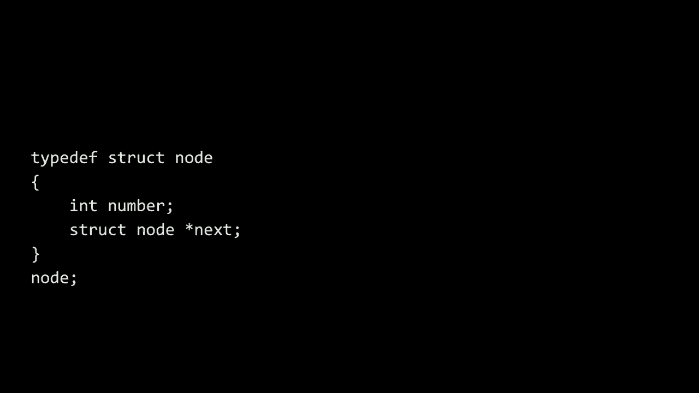

it feels like a little bit of copy paste，but this is the way it is done in，hint。similar in spirit to the prototypes，we've talked about for functions。that gives the compiler a clue that okay，something called a struct node is going，to exist。you can then use it inside of that data，structure and refer to，it as struct node star it's more of a。

multiple，words like this but it's similar to char，star or instar。like last week and i'm going to call，that arbitrarily next，and down here the same thing happens as。in the past with persons，by calling this node at the very last，compiler。you know what you don't have to refer to，it as struct node all over the place you。

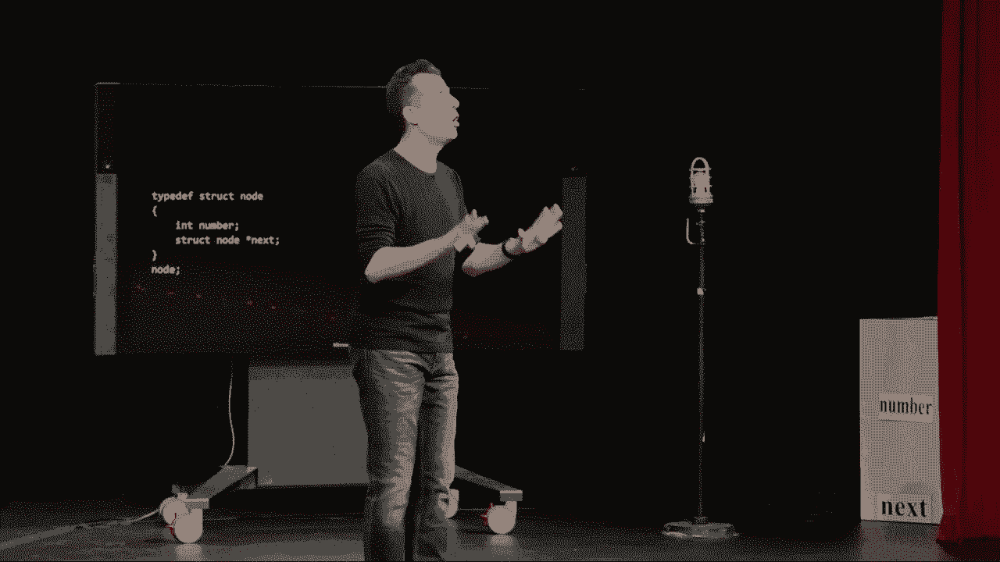

can just call this thing，node so it's a little bit of um，it's a little verbose in this case but。all this is done is create for me，in the computer the definition of a node，as we have depicted it。pictorially with that that rectangle，all right so how can we now translate。this into more useful code not just，how do we begin，building up linked lists well let me。

propose that a linked list，really begins with just a pointer and in，fact here we have thanks to the。theater's prop shop just kind of a null，pointer if you will i'm going to call，this variable。list and list is currently pointing to，nothing the arrow will say is just。pointing at the floor which means it's，null it's not actually pointing at，anything useful。

suppose i now want to start to begin to，allocate a linked list，with three numbers one two and three。

well how am i going to do this well at，the moment the only thing that exists in，called list。there's no array in the story that was，last uh that was uh，in week two today is all about linked。lists so how do i get myself a，wooden block that represents one another。wooden block that represents two and a，third that represents three。

we need to use our new friend from last，week malloc recall that malloc。allows you to allocate memory uh as much，memory as you might want so long as you。tell it the size of that thing，so frankly i think what we could do，ultimately today is use malloc。

to allocate dynamically one struct，and put the number one in it another。struct put the number two on it，another struct put the number three in，here。to actually stitch them together having，one point to the other，so thankfully the prop shop has。wonderfully created a whole bunch of，these for us，let me go ah**d and malloc a very heavy，node。

that has room for two values and you'll，see it has a room for，a number and a next pointer so the。number i'm going to first install here，is going to be the number。one for instance and i'm going to leave，ground，indicating that this is a null pointer，else。but now that i'm starting to instantiate，that is create this list。

now i'm going to do something like this，and say that all right my variable，called list。whose purpose in life is to keep track，of where this list is in memory。i'm going to connect one to the other by，actually having this variable。point at this node when it comes time，then to allocate，another node i want to insert into this。

linked list back in the world of arrays，memory，copy this value over into the new values。i don't have to do that，in the world of linked lists i just call，malloc for a second time。and say give me another chunk of memory，big enough to fit a node。thankfully from the prop shop we have，and，there's nothing in it，just the placeholder so it's garbage。

there，until i actually say that the number，shall be number two，and then i go over to my linked list。whose variable name is list，and i want to insert this thing so i，follow the arrow。i then point the next field of this node，at this third node here so now i have a，linked list of size。two there's three things in the picture，but this is just a simple variable this，is a pointer。

that's pointing at the actual node which，in turn is pointing at an actual other。node now suppose i want to insert the，number three，into this linked list recall that malloc。is powerful in that it takes memory from，wherever it's available。the so-called heap from your computer，and that means by definition that it，might not be contiguous。

the next number might not actually be，memory，it might be way over there so that might，malloc now。and allocate a third node it might not，be available anywhere in the computer's。memory except for like，way over here and that's fine it doesn't，have to be contiguous as it did。the number，three in its place but if i want to keep，a pointer to that node so that all these。

things are stitched together i again，start at the beginning，i follow the arrows i follow the arrows。one is，i'm going to have to connect these，things and so，now that pointer needs to point。at this block here and this visual is，very much deliberate these nodes can be。anywhere in the computer's memory，they're not necessarily going to be，contiguous。

the downside of that is that you cannot，rely on binary search our friend from，like week 0，it's big o。of log n you can find stuff way faster，than big o of n that was the whole point。of even the phone book example in the，very first week，but the price the upside of this。approach is that you don't have to，actually keep allocating and copying。

more memory and all of your values，anytime you want to resize。this thing and i'm a little embarrassed，to admit that i'm out of breath for some。reason just mall locking nodes here，but the point is like using malloc and。

some price，um it's it's exhausting frankly but it's，also going to spread things out in。memory but you have this dynamism and，honestly if you are the twitters of the。world the googles of the world we have，lots and lots of data，to have to copy。all of your data from one location into，another santiago originally proposed。

as a solution to the array so using，these dynamic，data structures like a linked list where，available。and you somehow remember where that is，by stitching things together as with，these physical pointers。is really the state of the art and how，you can create these more dynamic。structures if it's more important to you，questions，before we now translate these physical，blocks。

any questions or confusion brian and as，always feel free to verbalize anything。in the chat too if folks are more，comfortable there，a question came in in the chat when in。this whole process of linked lists are，we actually using malloc and what is，malloc being used for。really good question so where are we。

using malloc every time i went off stage，and grabbed one of these big blocks。

that was my acting out the process of，mallocking a node so when you call。malloc that returns to you per，last week the address of the first byte。of a chunk of memory and if you call，malloc of one that gives you the address。of one byte if you call malloc of 100，hundred bytes，that are contiguous so each of these。

nodes then represents，call，to malloc and in fact perhaps brian the。best way to translate to answer that，question in more detail is to translate。this now to some actual code so let's do，that and then revisit。so here is for instance a line of code，that represents the beginning of our。

story where we only had a variable，called list that was initialized to。nothing initially this arrow was not，pointing at anything，and in fact if it was just pointing up。down left or right it would be，considered a garbage value right this is，inside of it。before i actually put actual values in，it so if i don't assign it a value who。

knows what it's pointing to，but let me go ah**d and change the code。this list variable by default has some，something like，null so i'll represent that here。figuratively by just pointing at the，ground that now represents null。this would be the corresponding line of，code that just creates for you。

an empty linked list that was the，beginning of the story，now recall that the next thing i did was。bring back，one of these big boxes at that code，might instead look like this node star。n though i could call the variable，anything i want malloc，size of node so size of we might have。seen briefly in that it's just an，bytes，large any data type is so i could do the。

math and figure out in my mac or pc or，cs50 ide just，how many bytes these nodes are supposed。to take up sizeof just answers that，question for me，so malloc again takes one argument the。number of bytes you want to allocate，dynamically and it returns to the。address of the first of those bytes，so if you think of this as like one of。

my earlier slides in yellow，it returns to like the address of the。top left byte of this chunk of memory，if you will and i'm going to go ah**d。and assign that to a variable i'll call，n to represent a node and it's node star，address。and the syntax we saw last week for，star，syntax here so this gave me a block。

that initially just had garbage values，so there was no number in place and who，knows where the arrow。was pointing at so it looked a little，something like this if i draw it now on，the screen。list is initialized to null it's not，pointing at anything right now。but n the variable i just declared is，pointing at a node，but inside of that node or who knows。

what it's garbage values number and next，are just garbage values because that's。what's there by default remnants of the，past but now，let me propose that we do this code so。long as n is not，null which is something you want to get，into the habit always now of checking。any time in c when you call a function，that returns to you a pointer you should，almost always check。

is it null or is it not null because you，do not want to try touching it。if it is indeed null because that means，there is no valid address here。that's the human convention when using，pointers but if，n does not equal null that's a good。thing that means it's a valid address，somewhere in the computer's memory。

let me go ah**d now and go to that，address，the syntax for which is star n just like，last week。and then the dot operator means go，inside of the structure that's there。and go into the variable inside of it，called number in this case。so when i go ah**d and do something like，this when i，where this。

variable is pointing at the one and only，node at the moment and it's storing the，number one。when i go ah**d and at when i rather，it's going to have the number one in it。as soon as i execute this line of code，star n，means start at the address embodied here，go to it。and then put the number one in this case，in place，i want to，um i want to go ah**d too and replace。

the garbage value that represents the，next pointer in that structure and，replace it with null。null just indefinite this is the end of，the list there's nothing there i don't。want it to be garbage value，because a garbage value is an arbitrary。number that could be pointing this way，this way this way，metaphorically i want to actually change。

that to be null，and so i can use the same syntax but，there's this clever approach now i don't。the place as mentioned，earlier star and dot comes with some，syntactic sugar。you can replace the star and the，parentheses and the dot that we just saw。with an arrow notation which means，follow the arrow，and then set this thing equal to null。

having the arrow，literally point at the floor for clarity，star，parentheses。is the same thing as this and the reason，that most people prefer using the arrow。notation so to speak，is that it really does capture this this，physicality you start at the address。you go there and then you look at the，field number，or next respectively but it's equivalent。

to the syntax we saw a moment ago，with the star and the dot as before so。after these two steps have we，initialized this node to containing the，number one。and null inside of it，but what comes next what comes next well，at this point in the story。in this code i have some other variable，here that's not pictured because we're。

now transitioning from the world of，woodwork to actual code，so there's another variable n which i。might as well be，representing myself if i am this，at this value。it's not until i actually execute this，line of code，list equals n that i remember。where this node is in the computer's，memory so n up until now has really just。

been a temporary variable it's a，variable that i can use to actually。keep track of this thing in memory but，if i want to add this node ultimately，null。recall that this pointer was pointing at，the ground representing null。but when i now want to remember that，this linked list has a node in it。

i need to actually execute a line of，code like this，list equals null all right what did we。next do let's take one more step further，so at this point in the story。if i was representing n i'm also，pointing at the same block，n is temporary so it can eventually go。away but at this point in the story we，have a linked list of size one。

let's go ah**d and take this further，suppose now i execute these lines of。code and we'll do it a little faster in，in context，the first line of code is the same as。before hey malloc give me a chunk of，memory that's big enough for the size of。a node and again let's use this，temporary variable n，to point to that and suppose that means。

that i if i'm representing this，temporary variable i'm pointing at this，new chunk of memory here。i then check if n does not equal null，then and only then do i go ah**d and。install the number two as i did，physically earlier，and do i initialize the pointer，originally。to pointing not at some other node which，doesn't yet exist，floor。

thereby representing null and that's it，that has now allocated the second node，but notice。literally this disconnect just because，i've allocated a new node，and put the number i care about and。initialized its next pointer to null，that doesn't mean it's part of the data。structure the linked list，new，so we need to execute one other line of。

code now so that we can get from this，picture ultimately，to the final one and here's where we can。use the same kind of syntax as before，the arrow，as per that code and then i update the，next field。allocated，node now after that final line of code，do i have a link list of size two。because i've not only allocated the node，initialized its two variables。

number and next respectively i've also，chained it together，with the existing node on the linked，list。and let me do this one even slightly，thing，just so we can see it all together at。once now that we have this picture，let's execute the same kind of code，of code。is that i'm initializing number to three，so what has this done for me that chunk，of code has malloc。

a third and final note i've initialized，the top to the number three i've，initialized the bottom。to null as i'll represent by just，pointing the arrow at the ground。there's one final step then if i want to，go ah**d and insert that third node into，now。and not just pointed it myself me，variable，n i need to now do this and this is。

syntax you won't do often，we'll see it in an actual program in，just a moment but it just speaks to。the basic building blocks we're，manipulating if i want to go ah**d and，list。i can follow the arrow once i can follow，the arrow again，to，n because again n is the current address。of that most recently allocated，node so even though the syntax is，getting a little。

new the two arrows i'm using are，literally just like a code。

manifestation of just follow the pointer，follow the pointer，boom assign one value to the next。all right so at this point in the story，as i，and i'm still in the picture but if i。temporary variable，voila we've just built up step by step，a brand new linked list。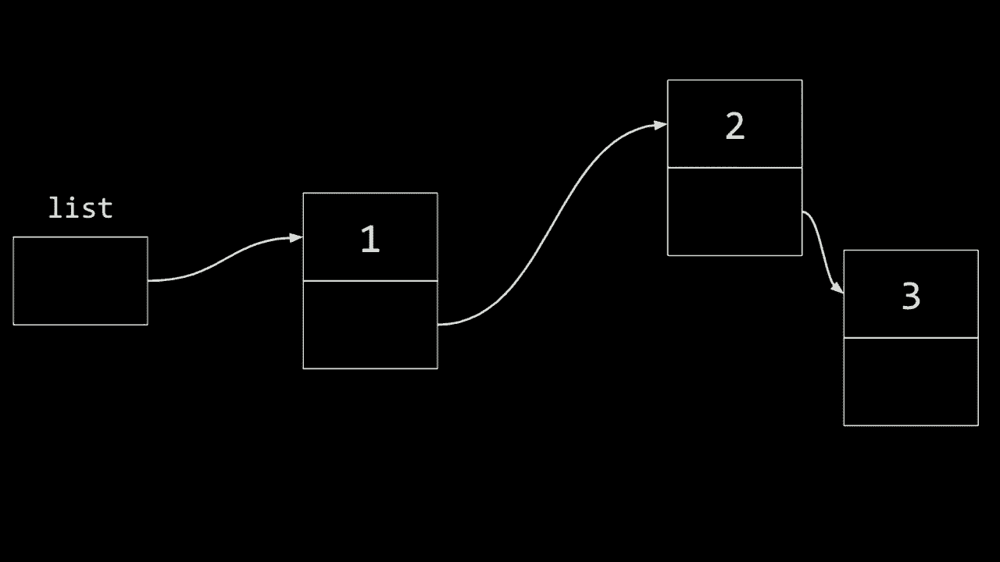

seems like a lot of work but it allows，us to now grow this thing。dynamically but let me pause here any，questions or confusion，on linked lists any questions or。confusions on the linked，chat，if we're trying to make a list that's。going to be much longer like more than，three elements wouldn't it get tedious，and over again。

yeah really good observation and so，that's why i said you won't usually。write it like this we'll do it，temporarily in a full-fledged program in。just a moment just to demonstrate it，but in general you'll probably use。something like a loop and what you'll do，at this one，then iterates again then iterates again。

and let me stipulate for now that if you，use a loop in the right way。you can end up writing just a single，arrow by just keep updating the variable。again and again so there is a way to，avoid that and you can do it much more。dynamically let me go ah**d and ask a，question of my own here，let me go ah**d and ask this one if。

you'd like to buzz in，to this question what is the running，time of searching。a linked list what's the running time of，searching a linked list in big o，notation so。what's an upper bound worst case of。

searching a linked list like this one，whether it has three elements or even，many more。so it looks like as before about eighty，it's big o of n，and this is actually correct because。consider the worst case suppose you're，looking for the number three。you're going to have to look at all，three numbers big o of n if you're，looking for the number 10。

you're going to start here at the，beginning you're going to keep looking。looking looking looking you're going to，get to the end realize oh the number 10。is not even here at which point，you've already looked at n elements but，linked lists。

the list in，constant time you could just use a。

little bit of arithmetic you could jump，to the middle element or the first。element all using constant time。

a linked list unfortunately is，represented ultimately by，just a single address the address that。points to the very first node，and so even though you all on camera can。see this node in this node and this one，as humans all at once，the computer can only follow these。list，is going to be big o of n in that case，but let me ask a follow-up question。

a follow-up question here what's the，running time of，inserting into a linked list。what's the running time of inserting，into a linked list so you've got some，new number，negative 5。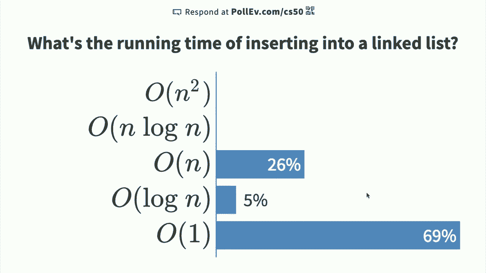

whatever it may be there's going to be a，malloc involved，but that's constant time it's just one。function call but you're going to have，to insert it somewhere。and here it looks like 68 percent of you，are proposing big o of one which is。interesting constant time，of n，would anyone be comfortable chiming in，verbally or on the chat。

as to why you feel it's one or the other，it is indeed one of those answers。it is indeed one of those answers any，thoughts behind your thinking it's okay，if it ends up being。otherwise any thoughts in the chat，um i guess it could be o，n and because because of the fact that。create，a new node essentially i think uh all，the computers doing。

when you assign it is gonna as use like，those arrows like，going from one hour to the next to the。next to the next and that way i would，think it would be all，and it is own event as you've described。it but you two are making an assumption，like 80 or like 25 of other，people are making you seem to be。

assuming that if the new number suppose，it's number four，has to go at the end or if it's the。number five it has to go at the end and，i kind of deliberately set things up。that way i've happened to maintain them，in sorted order one two three。from left to right but up until now i，have not made the condition that the。

linked list has to be sorted even though，the examples we've seen thus far，deliberately that way。but you know what if you want to get，fancy and a little more efficient。and you want to allocate the number four，and frankly you don't really care。about keeping the linked list in sorted，order well heck，just pull this out put your new node。

here plug it in here plug the other one，back in here and just insert。the new element at the beginning of the，list and for every number thereafter。malloc as before but just keep inserting，here，now it's not going to take a single step。because as i verbalized it there's like，the malloc step i have to unplug this i。

have to plug it back in，so it's like three or four steps total，but four steps is also。constant that's big o of one because，it's a fixed number of steps。so if you're able to sacrifice sorted，order when it comes to this list you can。

in constant time insert insert insert，insert and the list is going to get，longer and longer。but from the beginning of it rather than，the end so that too is a trade-off if。you don't care about sorted order and，none of your algorithms or code。require that it be sorted then you can，go ah**d and cut that corner，and achieve constant time insert。

whichever twitter or google or the like，maybe that's actually a net savings and，a good thing。but again you sacrifice the sorted order，and，let's translate this to some actual code。let me go ah**d here，in uh cs50 ide and let's go ah**d and，that now。actually do something with numbers and，start to manipulate things。

in memory so i'm going to go ah**d here，and create a program called list。dot c and my first version is going to，and，made and void，and then inside of here let me go ah**d。like we began and give myself a list，of integers of size three so this is，three。and this array of size three i'm going，to go ah**d and hard code some new。

values into it so at the very first，location i'll put the number one。at the second location i will put the，put，the number three and then just to，demonstrate that this。is working as i think i intend i'm gonna，do a quick for loop，so for int i get zero i less than three。i plus plus and then inside this loop，i'm going to go ah**d and print out。

percent i and then i'm going to print，out the value，of i so now that i've printed out all of。these values in my loop let me go ah**d，and do make，list let me go ah**d then and do dot，slash list。and hit enter and indeed i get oops not，not what i wanted，so good uh teachable moments not。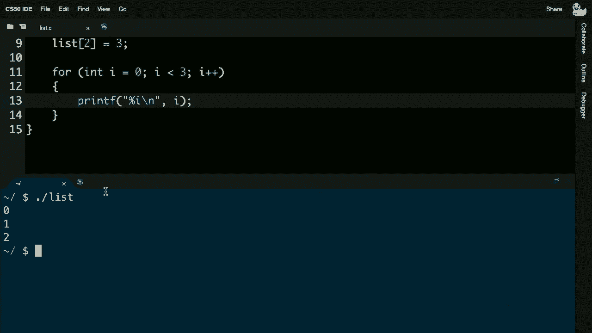

intended admittedly but what have i done，wrong here，brian has anyone noticed already if i。if i my goal is to print out the list，but somehow i printed out 0 1。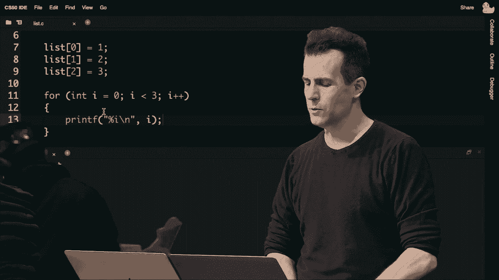

2 and those are indeed not the numbers，in this list uh，so you've printed i you should have。printed list of i，yes so i should have printed the，contents of the array which is list。bracket eye so that was just a，newbie mistake by me here so let me fix，list。dot slash list and voila i've now，printed the list so this is sort of week，raise。

in week two but now let me go ah**d and，transition now to something more dynamic。where i don't have to commit in advance，to creating uh an array i can do this。with a dynamically allocated chunk of，memory so let me delete everything i've，done inside of main。and let me go ah**d and give myself this，let me go ah**d and declare。

a list of values where list is now going，operator，and i'm going to go ah**d and malloc。let's see i want space for three，integers so the simplest way to do this。if i'm just going to keep it simple i，can actually do this，three times sizeofint so this。version of my program isn't going to use，an array per se，it's going to use malloc but it's going。

to dynamically allocate that array，for me and we'll see what the syntax for，this is as always now。anytime you use malloc i should check，whether list，equals equals null and if so you know。what i'm just going to return one recall，that you can return zero。or one or some other value for main to，effectively quit your program。

i'm going to go ah**d and just return，something，very badly went wrong like i'm out of。memory altogether，but now that i have this chunk of memory，ant。this is actually the malloc way to give，yourself an array，up until now every time we've created a。raise for ourselves we've used squ*re，bracket notation and you all have put a。

number inside the squ*re brackets to，give yourself an array of that size。but frankly if we have malloc and the，memory，well if i want to store three integers。why don't i ask malloc for three times。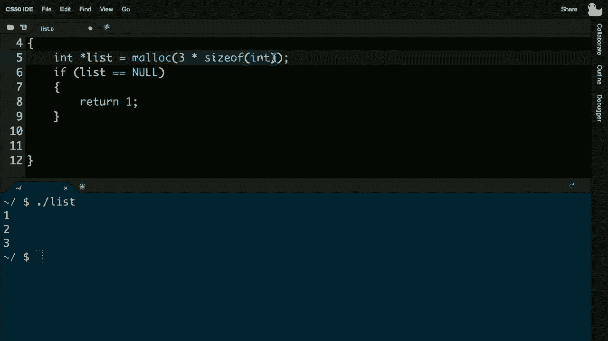

the size of an integer and the way，malloc works is it's actually going to，return to me a contiguous。

chunk of memory of that size so that，that's just，like we'll uh that's um a technique that。we'll use in just a moment when，allocating actual nodes，so at this point in the story so long as。list does not equal null，i now have a chunk of memory that's big，enough to fit the size of。three ins and as before i can go ah**d，and initialize those，the first element will be one the second。

element will be two the third element，will be three，and notice this sort of equivalence now。between using arrays and using，pointers c is kind of versatile in this。way in that if you have a chunk of，memory returned to you by malloc。you can per last week use squ*re bracket，notation，you can use squ*re bracket notation and。

treat that chunk of memory as an array，because after all what's an array。it's a contiguous block of memory and，that is exactly what malloc。returns if you want to be fancy instead，you could actually say go to that。address and put the number one there，you could say go to that address plus。

one and put the next number there，you could say go to that address plus，two。and put the third number there but，honestly this just be very quickly。becomes unreadable at least to most，people this is that thing called pointer，pointers。that is equivalent to using the syntax，that we've used for a while now。

which is to just use the squ*re brackets，and the nice thing about squ*re brackets。is that the computer，will figure out for you how far apart，each of those integers are because it。knows the size，story，things get interesting and also annoying，and santiago recall was the one that。helped to solve this earlier，allocated，three integers on line five there。

but now at line 13 i'm like oh damn it，the list，i could obviously just redo all the code。but suppose that part of the story here，more memory，well how can i do this well let me go。ahead and allocate another chunk of，memory temporarily so i'll call it temp。by convention and this time i'm going to，go ah**d and allocate four，sake of the story。

i've messed up and i want to allocate，enough space now for that original。i haven't so much messed up i have now，decided that i want to add a fourth，number to this array。as always i should check if temp equals，equals null，you know what i'm going to go ah**d and。free the memory i already allocated and，then i'm just going to get out of here，return 1。

 something went wrong，there's nothing to demonstrate so i'm，going to exit out of main entirely。but if malloc did not return null and，all is well，what am i going to do well let's first，began this。this conversation for int i gets 0，i less than 3 i plus plus let's go ah**d，and copy。into this new temporary chunk of memory，whatever is at the original chunk of，copy，the new array。

here's how we might do that in code just，using a simple for loop。a la week two and then let me go ah**d，now and add one more value。temp bracket three which is the fourth，location if you're starting from zero。i'm gonna go ah**d and put the number，four there and now at this point。

i'm gonna go ah**d and remember the fact，that，temp is my new list so i'm going to go。ahead and free the original list，and i'm going to update my old list to。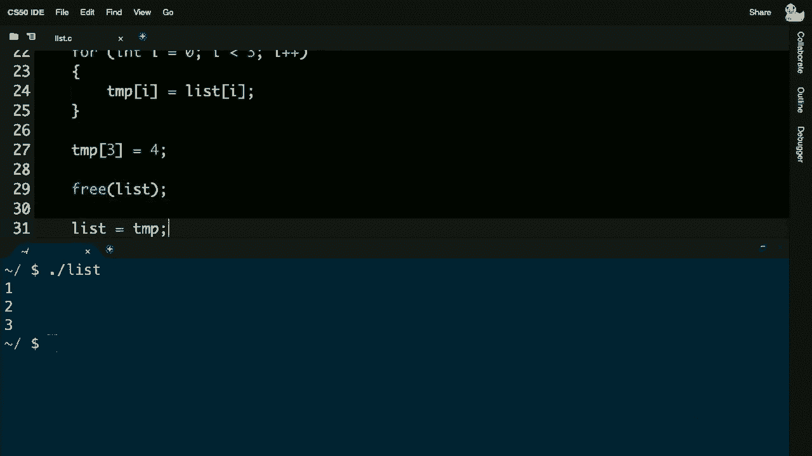

point at the new list，and then lastly i'm going to go ah**d，and use another for loop just to。demonstrate that i think i did this，correctly this time iterating up to four。instead of three i'm going to go ah**d，and print out with percent i。the contents of list bracket i so let's，rewind real quick，we began the story by allocating a。

this time，dynamically to demonstrate that malloc，just returns a chunk of memory and if，as an array。you absolutely can this stuff here if，list equals equals null is just error，went wrong。the interesting code resumes here i'm，putting the numbers 1 2 and 3。at location 0 1 and 2 respectively in，that chunk of memory which again i'm，treating like an array。

but now at this point in the story i've，stipulated that wait a minute。i want to go ah**d and add a fourth，value how can i do that and let's。stipulate that i want to go back and，change the existing program because。suppose that for the sake of discussion，this is code that's running at google or。

twitter over time and it's only after，receiving another tweet that。their code realizes oh we need more，15，this time i allocate enough space for，four integers。and i again do some error checking if。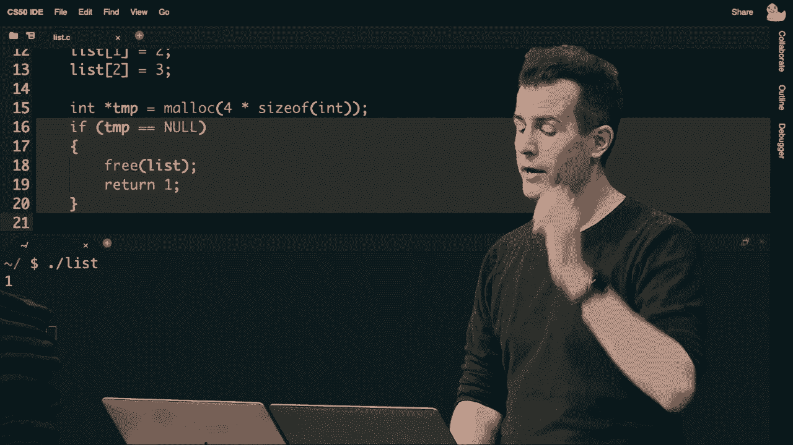

won't，happen let's just exit altogether but if，nothing bad happened let's take。santiago's suggestion and translate his，english advice into c，let's use a for loop from 0 to 3 and。memory。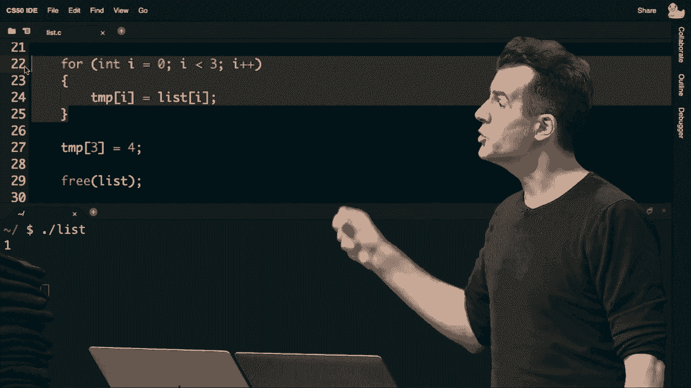

the contents of the original chunk of，memory so temp i gets list i。and then here which was the point of，number，at temp bracket three which is the，from zero。but at this point in the story much like，my earlier slides，i have both the one two three in an。array of size three and i have one two，four，let me go ah**d and free the original。

list and give back to the computer that，original chunk of memory。let me then remember using my better，named variable，what the address of this new chunk of。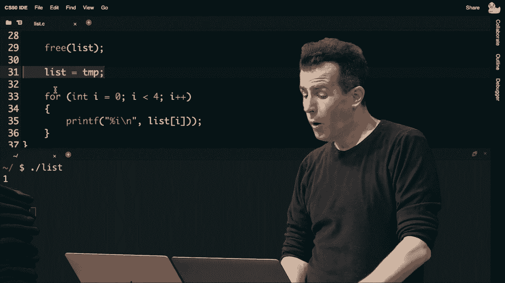

memory is and then just to show off let，me go ah**d and with another for loop。this time counting four times not three，let me print out all of those values now。here's where i'll cross my fingers，compile my new program it does not，compile okay。because it looks like i have one too，many parentheses there，so let's recompile the program with make。

list another error，so let me scroll up there and oh，interesting。so this is a this is a a common mistake，implicitly declaring library function。malloc something something，so anytime you get an implicitly，declaring error。odds are it means you just did something，simple like this you forgot。

the requisite header file in which that，from last week，malloc is in standard lib as is free so。now let's do make list cross my fingers，again that time it worked dot slash list，voila。one two three four so this is now a。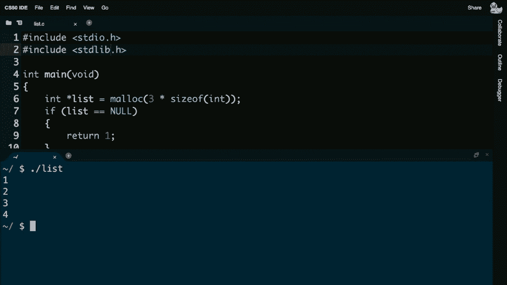

completely literal translation，program，that again starts off by using。uh an array of size three having，dynamically allocated it and then it。resizes it by creating a new one of size，old，and then proceeding as before and i've。deliberately used malloc both times here，as follows if you create an array in c。

using squ*re bracket notation，you have painted yourself into a corner。

have seen，and resize an array that you have，declared using squ*re brackets。

more technically speaking when you use，the squ*re brackets you are statically。allocating the array on the stack you're，computer's memory，that belongs to that computer to that uh。functions，stack frame per the diagram last week，if however you use malloc our new。tool our new tool from last week and say，give me a chunk of memory that comes，from the heap。

give back，and take more of and back and forth and，in fact there's even a more。simple way of doing this relatively，speaking if you want to reallocate。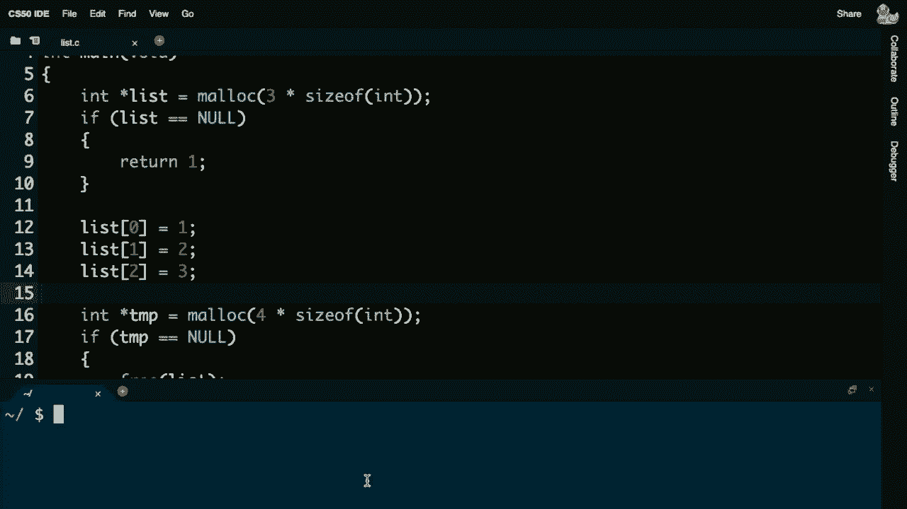

an array of a chunk of memory by，resizing it，you don't have to do all of this which i。did before you don't have to use malloc，twice you can use malloc once at the。beginning and then you can use a，new function that's actually kind of，helpful in this case called。reallock and you can actually do this，reallock，in a chunk of memory of size four times。

size of end but specifically。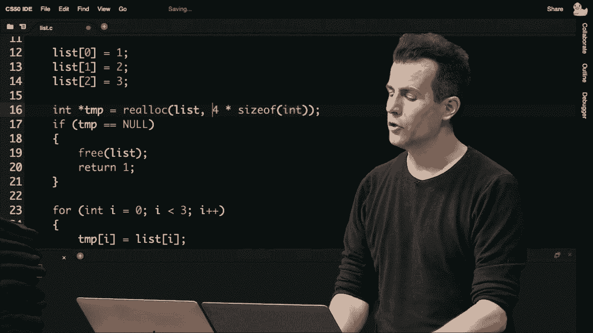

reallocate the thing called list so，reallock is very similar to malloc but，it takes two arguments。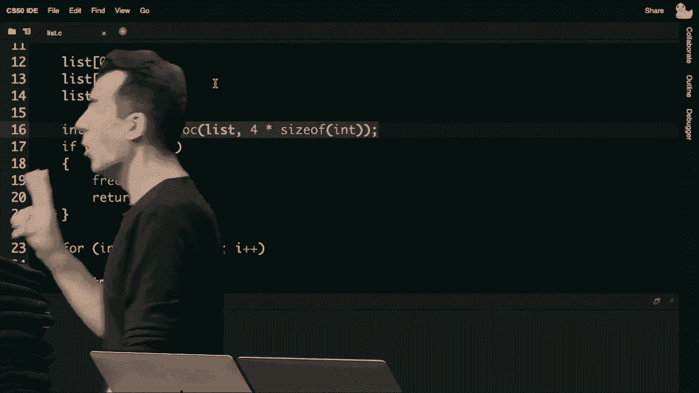

one is the size of the memory you want，whether bigger or smaller。but it takes a second argument its very，first argument now is，the address of a chunk of memory that。you have already allocated，as with malloc so again at the top of，malloc。to give myself a list that points at a。

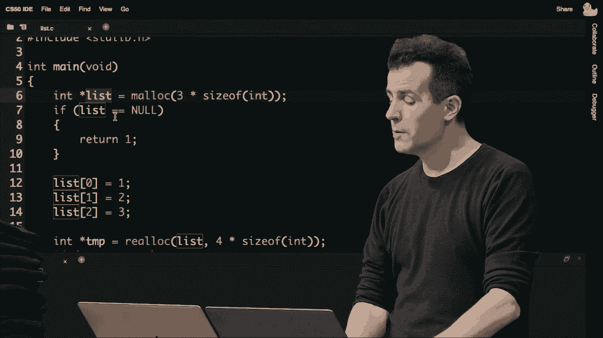

integers，on line 16 i'm now handing that address。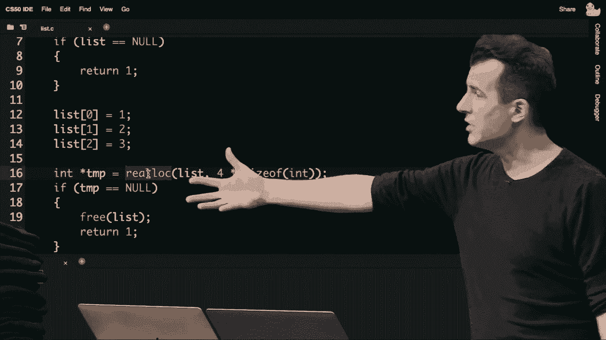

back to reallock saying wait a minute，here's that same address you gave me，please now resize it。reallocate it to be of size four and，well，it returns to you the address uh in，memory。that it is now of sufficient size，bad one，happens so i'll leave that code alone，this。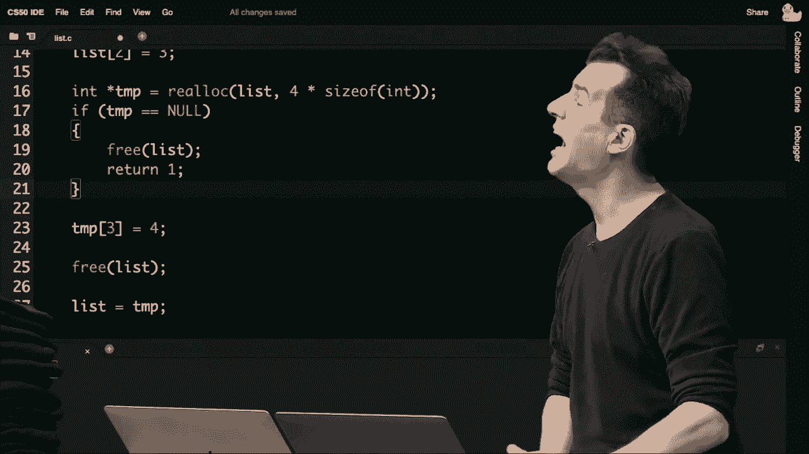

reallock actually copies the old into，the new for you so again coming back to。santiago's story at the beginning of，today，reallock will not only give you a bigger。chunk of memory if you ask for it，by handing back the address of the，memory you already requested。and it's going to hand you back the，address of a new chunk of memory。

that is big enough to fit all of those，new values and it's smart too。

if there happens to be room at the very，end of the existing chunk of memory。

slide earlier，then you're actually going to get back，the exact same address but the。computer's operating system windows mac，os or linux is going to remember。okay yes i know i gave you three bytes，originally there happened to be room at。the end of that chunk of memory so now，i'm going to remember instead，integers。

or whatever number you pass in so again，yourself，you can let the computer actually do the。reallocation，for you any questions then，on malloc on re-alloc on free。

notice that this isn't yet a list this，is still an array，so we still need to take this program。

one step further and actually transition，from this chunk of memory using arrays。to these actual nodes but before we do，that any questions，or confusion brian anything we should。touch on here yeah a question came in，why do you not need to free，not need to free。temp at the end of the program because，i'm an idiot and glossed over that key。

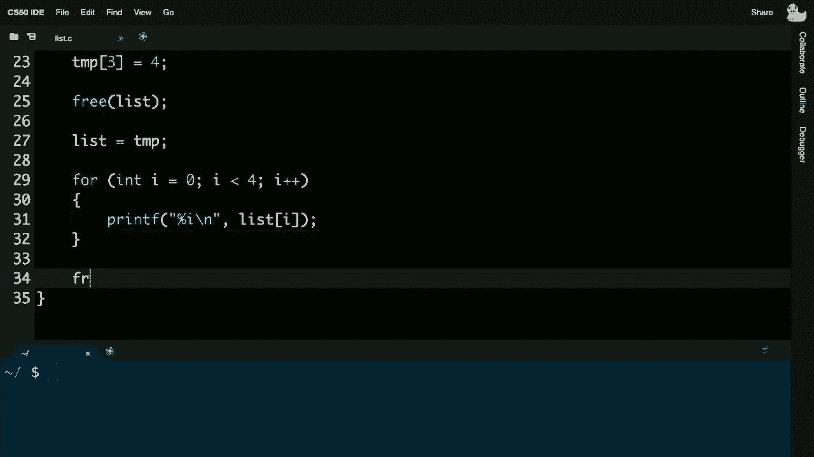

free not，temp in this case but list so temp i，already，well it is equivalent at this point at。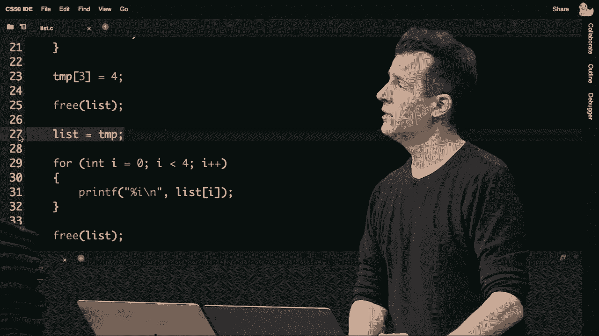

this line here 27，better name。

and i make it equal to temp so that i，can just refer to it as a bigger list。but you are quite right that was an，oversight on my part valgrind would not。have liked that at the very end of this，program i should absolutely free list。however i don't need to free temp per se，name。

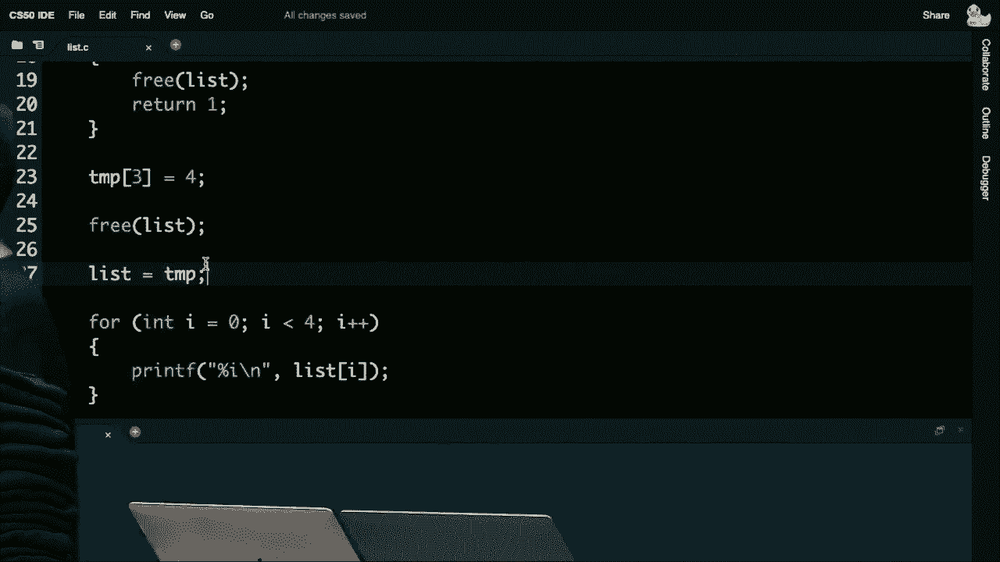

through that assignment good question，and good catch，unintended other questions or comments。a question came in why does the linked，just use，arrays and reallock and malloc to do all。this stuff yeah really good question so，how have we improved the situation if we，can just use arrays。in this way recall that with this kind，of a regression what i just did is a。

regression to where we started the story，just wrote。

i reallocated more space for this array，which means that i。

manually with that for loop or reallock，with its own for loop how to copy all of。the old values into the new。

so the approach we've taken in all three，versions of this program that i've。written thus far on the fly。

they've all been big o of n when it，comes to insert。

they have not given us the dynamism of a，duplication。

and we haven't had the ability yet to，just do an insert for instance at the。beginning of the structure in big o of，one time so again this is the code，approach。from which we began so the ultimate goal，now is going to be to，change this code and give us that。as a proper，integers，but we're about an hour in let's go，ahead and take our first five minute。

break here and we'll come back。