# 【双语字幕+资料下载】哈佛CS50-CS ｜ 计算机科学导论(2020·完整版) - P11：L5- 数据结构 2（数组、链表、树、哈希表、字典树、堆、栈、队列） - ShowMeAI - BV1Hh411W7Up

all right we are back and recall that we，began today，by revisiting arrays and pointing out。

that searching is great in arrays if you，log，n that we liked back from week zero but。

as soon as you want to start dynamically，modifying an array it gets very，expensive quickly。

it might take you a big o of n steps to，into a new，bigger array and honestly over time，lots of data。

even big o of n is expensive like you，don't want to be constantly copying and。

copying and copying all of your data，avoid that，by using pointers and in turn stitching。

together these structured called，linked list albeit at a price of，spending more memory。

but with that additional memory that，additional cost comes dynamism so that。

if we want we can even achieve constant，time when it comes to inserting。

but of course then we have to sacrifice，things like sortability so。

this theme of trade-offs we've just seen，a few examples of actual c。

programs that implement first the，old-school array per week zero where we，unfortunately。

we painted ourselves into a corner using，the bracket notation alone。

so we deployed instead malloc which is，more versatile tool that lets us get as。

much memory as we want，and we use that to recreate the idea of，a list implemented as arrays。

but even then we saw that i had to copy，using a for loop or we had a copy using，again。

for these small programs you don't even，like that，but for large real-world software all of。

up quickly，so it's best if we can try to avoid it，all together and achieve dynamism。

so the code by which you can，add to linked lists dynamically is，actually part of the challenge for。

problem set five this coming week but，let's see some of the building blocks，allocate。

nodes and stitch them together when we，know in advance，how many we want which is not going to，now。

is indeed the case because i only want，three of these things so i'm going to go。

back to my program from before and i'm，inside of main，and i'm going to go ah**d and declare。

myself a type，called struct node initially with a，number inside of it，inside of that。

and i'm going to call this whole thing，quite simply node so that's quite。

similar to what we did with a person but，now it's a little fancier in that i'm。

giving the structure itself a temporary，name struck node，i'm referring to that temporary name。

inside of the structure so that i can，have a pointer there too，now node。

now let's go ah**d and actually use this，thing inside of main，so let me go ah**d and create an empty。

linked list，the simplest way to translate the simple，block with which we began today。

is just doing new node star list，semicolon，unfortunately anytime you declare in a。

variable that does not have an assigned，value it's garbage，and garbage is bad in the world of。

pointers again to be clear，and you do not，explicitly initialize its value。

to be something like null pointing at，the ground but instead leave it as a。

garbage value it's the sort of，pointing this way，this way this other way that is to say。

you might accidentally in your own code，follow this arrow to a completely bogus，have。

what are called segmentation faults as，some of you might have experienced。

already with problem set four，when you touch memory that you shouldn't。

so garbage values are bad ever more so，reason，so you rarely want to do this you almost。

always want to initialize the pointer，to some known value in the absence of an，actual address。

we're going to use null to indicate that，there's nothing there，but that's deliberate on our part now。

suppose i want to insert just as i did，physically by lugging the block number，one onto stage before。

let me go ah**d and allocate a node，we'll call it n temporarily。

using malloc this time asking for the，size of a node，so the story is now changing i'm not，individual。

nodes inside of which is enough room，node，and this size of operator figures out。

from the definition of this structure，needed to store an。

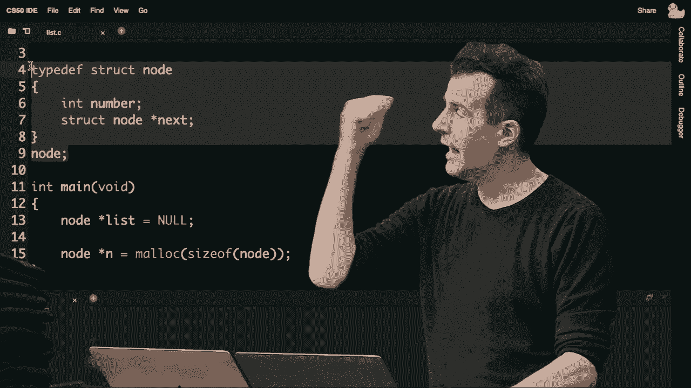

integer and a pointer to a struct node，so as always now i'm always going to，check if n。

equals equals null i'm going to get out，of this program immediately and just。

return one because something went wrong，and there's just not enough memory。

but if all went well i'm going to go，ahead now and go into that node。

n i'm going to go into its number field，and assign it to value 1。

and i'm going to go into that node n and，go into its next field and for now，assign it the value null。

so this is as though i've just allocated，the wooden block with a 1 in it，to null。

now i'm going to go ah**d and update the，list itself to point，called list。

is the variable by which i'm，representing the whole list，and now that i have an actual node to。

point to i'm setting，list which again is a pointer to a node。

equal to whatever n is the address of an，actual node，so at this point in the story i have the。

small wooden block connected to the，larger block containing one let's。

suppose for the sake of discussion i now，want to add the number two to this list，an integer。

i'm going to go ah**d and allocate n，using malloc，giving myself the size of another node。

i'm going to again just going to check，ahead and，free the list so i don't leak memory。

then let me go ah**d and return one so，sure i free，any memory i've already allocated before。

but if all goes well，and that's what i'm hoping for i'm going，to go ah**d and go into this node n。

and store in its number field literally，the number two，and then now because this thing also。

inserted in sorted order for now，next，as null and if i indeed want to put。

this number two node after the number，list，i can go to the next node and inside of。

its value i can say n，so this line of code here starts at the，little block。

follows the arrow and then updates the，next pointer of that first node，address。

of this new node n and then lastly let's，do one more of these so n gets。

malloc sizeof node one last time，let me go ah**d and do my sanity check。

one more time if n equals equals null，something bad happened，so now i'm going to go ah**d and don't。

worry about the syntax just yet but i'm，going to go ah**d and free。

list next and i'm going to go ah**d and，free list and then i'm going to go ah**d，time。

that's just in the corner case where，something bad happened but if nothing。

bad happened i'm going to update the，number field to be three。

i'm going to update the next field to be，null and now i'm going to update the，list，one。

n and then here after this i can proceed，to print all of these things if i want，this。

with a loop the loop is going to look a，case，but it turns out we can use for loops。

pretty powerfully here too but at this，point in the story，my list pointer is pointing at the one。

node which is pointing at the two node，which is pointing at the three node and。

again as someone observed earlier，it's not common to use this double arrow，notation in this case。

i bet i could actually use an in a loop，to iterate over these things one at a。

time and we can see this here，when it's time to print let me go ah**d，and do this。

four and instead of using i because，there really aren't any numbers in。

question this is no longer an array，so i can't use squ*re bracket notation。

or pointer arithmetic i need to use，pointers，so this might feel a little weird at。

first but there's nothing stopping me，with a for loop from doing this。

give me a temporary pointer to a node，called temp，and initialize it to be whatever is at。

the beginning of the list，keep doing the following so long as temp，does not equal null。

and on each iteration of this loop don't，do something like i plus plus which。

again is not relevant now，but go ah**d and update my temporary，pointer。

to be whatever the value of the，temporary pointer's next field is。

so this looks crazy cryptic most likely，especially if you're new to pointers。

as of last week as most of you are but，it's the same idea as a typical for loop。

you initialize some variable before the，semicolon，you check some condition after the first。

semicolon and you perform an，update of that variable after the second。

semicolon in this case they're not，integers though，instead i'm saying give myself a。

temporary pointer to the beginning of，the list like my finger pointing at or。

if you prefer the foam finger pointing，at some node，in the list go ah**d and call that。

temporary variable，temp，is not null that is so long as it's，block。

what do i want to do let me go ah**d and，print out，using printf and percent i as always。

whatever value，is in the number field of that，node there and that's it with this，simple for loop。

relatively simple for loop i can，essentially point at the very first node，in my list。

and keep updating it to the next field，updating it to the next field updating，this。

until my finger sort of walks off the，end of the list of wooden blocks，thereby pointing it null ox0。

at which point the loop stops and，there's nothing more to print so in。

answer to that question earlier，do we need to use this double arrow，notation short answer no。

this is kind of the secret ingredient，here this syntax inside of the for loop。

takes whatever you're pointing at，follows one arrow，and then updates the temporary variable。

now to point at that structure instead，so this is kind of the equivalent in the，doing i。

plus plus but it's not as simple as i，plus plus you can't just look one byte。

to the right or to the left，follow an arrow，but by reassigning this temporary。

variable to wherever you just followed，it's a way of following each of these，orange arrows as we did。

physically a moment ago after this，i should for good measure go ah**d and。

free the whole list and let me just，linked list，i can actually do something like this。

while list not equals null，so while the whole list itself does not。

equal null go ah**d and get a temporary，pointer like this，to the next field so i remember what。

comes after the current，head of the list free the list node，itself and then。

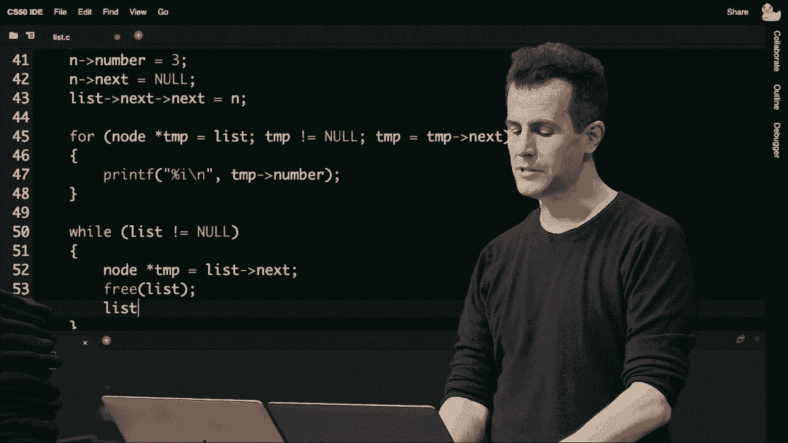

update list to be temp so again this，probably looks crazy，cryptic and certainly in the coming days。

especially with problem set 5，you'll work through this kind of logic a。

little more logically a little more。

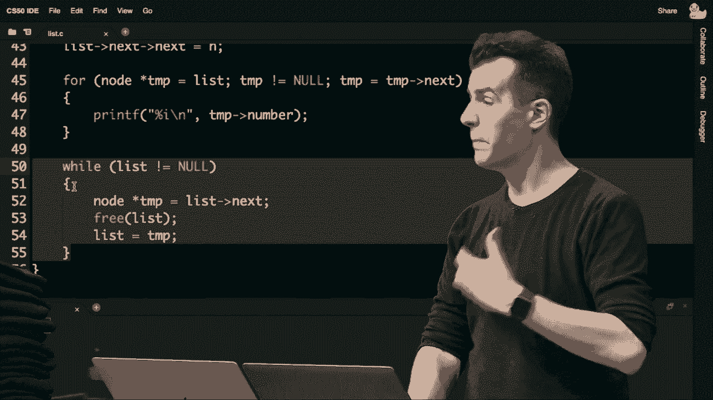

pictorially perhaps，but what am i doing here first i'm going。

to do the following so long as my linked，list is not null and if i've got three。

nodes in it by definition it's not null，free，all of the memory i've allocated from。

left to right so to speak，so how do i do that well if i've got two。

wooden block if i've got a wooden block，in front of me，yet，because that wooden block recall。

contains the pointer to the next，node so if i free this memory，prematurely。

i've then stranded all subsequent nodes，because they are no longer accessible。

once i've told the computer，you can take back this chunk of memory，for the first node so。

this line of code here on line 52 is，just saying temporarily give me a，variable called temp。

first node，point at the next node so it's like，using my right hand to point at the，the next node。

so that i can then on line 53 free the，list itself which，is should not be taken literally list。

represents the first，node in the linked list not the whole，thing so when you say free list。

that's like freeing just the current，node but that's okay even now。

this memory has been given back i still，have my left hand pointing at every。

subsequent node by way of the next one，so now i can update list to equal that，temporary variable。

and just continue this loop so it's a。

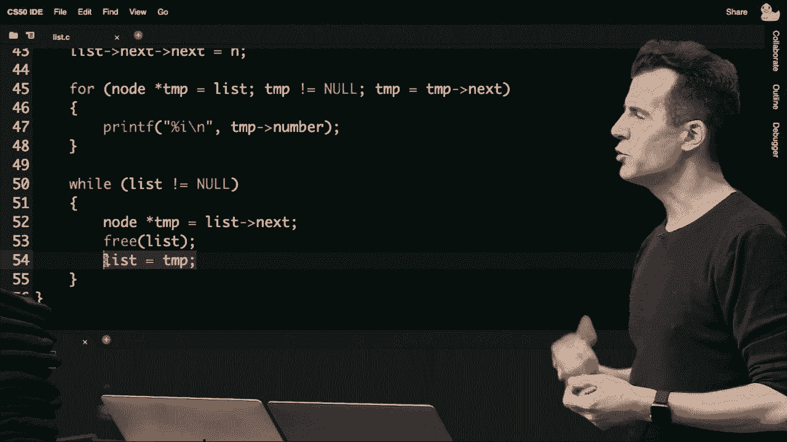

way of sort of pac-man style like，left to right，by freeing the first node the second。

node the third node and then you're done，but by using a temporary variable to。

look one step ahead to make sure you，don't chomp，the free the memory too soon and。

therefore lose access to，all of those subsequent nodes all right。

that was a big program but it was meant，to be in succession starting with。

an array transitioning into a，dynamically allocated array，followed by finally an implementation。

using linked list albeit hard coded to，support only three nodes，but in that example do you see some。

sample syntax by which you can，manipulate，these kinds of nodes questions or，confusion that i can。

help address anything on your end brian，yeah someone asked similar to one of the。

examples you did before why could we not，have just done malloc，three times sizeof node to get three。

nodes and do it that way，really good question could i not just，use malloc and allocate all three at。

once absolutely yes that is completely，your prerogative i did it a little more。

pedantically one at a time，but you could absolutely do it all three，at once。

you would then need to use some pointer，arithmetic though，or you would need to use squ*re bracket。

memory，as essentially an array of nodes and，then stitch them together so。

i am assuming for demonstration purposes，that even though we have these little，syntax。

in a real world system you're not going，to be inserting one，then two then three odds are you're。

going to be inserting one，sometime passes then you want to insert。

two so you allocate more memory then，some more time passes，then you want to insert three and so。

there's gaps in between these，these chunks of code in the real world，other questions or confusion。

yeah another question came in why would，malloc ever fail to allocate memory。

why would malik ever fail it's rarely，of memory，so essentially if you're writing such a。

memory hungry program with so many，of data，you may very well run out of memory。

maybe that's two gigabytes maybe it's，four gigabytes or more，but malloc may very well return null to。

you and so you should，always check for it in fact i dare say，on macs and pcs。

one of the most common reasons to this，day for programs to freeze。

to crash for your whole computer to，reboot is truly because someone did。

something stupid like i've done multiple，times now already today and last week。

by touching memory that you shouldn't，have so in problem set four and now five。

anytime you experience one of those，segmentation faults whereby your program，just crashes。

that is the uh the problem set，version of like your whole mac or pc，crashing because someone more。

experienced than you made that same，mistake in their code，let's take a quick。

final example involving linked lists，which again are this very。

one-dimensional structure left to right，and then we'll add a second dimension。

and see what that buys us but we've，still have our list，but it's first pointing at the number。

pointing to some，other chunk of memory that's been，the number four。

and this then is the number five so we，have a linked list of size three。

but i've deliberately spread the numbers，out this time two four five because。

suppose that we do want to insert more，numbers into this list。

but in sorted order it turns out that we，have to think a little bit differently。

when we're adding nodes not to the end，and not to the beginning。

but in the middle like when we want to，allocate more nodes in the middle。

there's a bit more work that actually，has to happen，so how might we go about doing this。

suppose that we want to allocate for，instance the number，one and we want to add the number one。

well we could use code like this this is，the same code as we used before。

we allocate the size of a node we check，whether it equals null we。

initialize it with the value we care，to null，and pictorially it might look like this。

it's kind of floating somewhere in the，variable n。

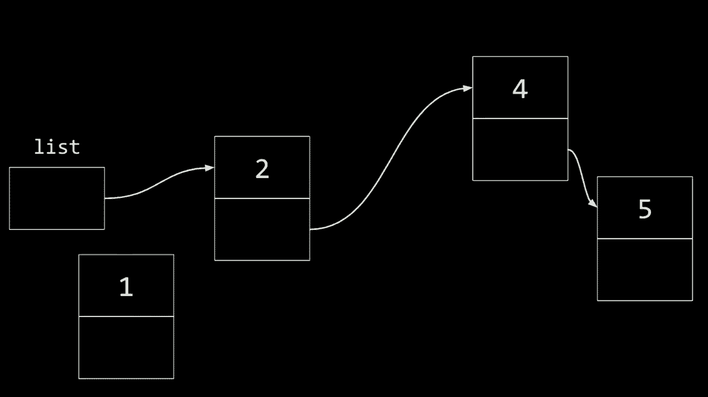

no longer pictured that i'm just，pointing at when i allocate the number。

one so what does this look like this is，like having the number one，put it in place we。

got lucky and there's a chunk of memory，right there so what do i want to now do。

well i want to go ah**d and connect this，so what i could do，just intuitively if i one should go。

before two i can unplug this，and i can plug this into here which，makes sense。

but there's already a problem if i have，done nothing else up until this point。

i have just orphaned three nodes，two four and five to orphan a node means。

to forget where it is and if i don't，have another variable in my code or if，pointing at。

the original beginning of the list i，have literally orphans the rest of the，list and the technical。

implication of that per last week is，that now i have a massive memory leak，nodes in memory。

that you can literally never get back，until you reboot the computer for，instance or the program。

quits and the operating system cleans，things up for you so you don't want to。

do this like order of operations，actually matters so what i should，probably do，first。

i should probably recognize that well，list，so what i should really do is point this，sort of。

do it a little sloppily like that but，let me stipulate those are both pointing，at the same node。

now that my new node aka n in the code i，showed is pointing at this thing。

now i can do kind of a switcheroo，because i'm already pointing at。

the final destination there and now i，my list，this is n therefore i have variables，insert。

that correctly so long story short order，of operations matters so。

graphically if i were to do this as，before just by saying，list equals n if this is n，first。

bad things are going to happen indeed we，end up orphaning，2 4 and 5 thereby leaking a significant。

amount of memory potentially and leaking，any memory typically is bad。

so i don't want to do that so let's look，at the correct code the correct code is。

going to be to start at n，here，to point at the same thing as the list，was originally pointing at。

and then go ah**d and update the list，such that both of them are currently，pointing in duplicate。

then update the list to point to the new，node so again，the code's a little different this time。

from before because before we kept，adding it to the end or i，proposed verbally that we just added to。

the beginning here we're adding it。

indeed at the beginning and so the，actual steps the actual code。

are a little bit different well let's do，one final example if we want to allocate。

three well i gotta malloc another node，the number three，suppose that ends up somewhere in the。

computer's memory，here，so now three is in place how do i now。

insert this thing well similar to before，i'm not going to want to update this。

pointer and go like this，and then plug this guy in over here，because now i've orphaned those two。

nodes so that again is the wrong step，when you're in beside the middle of a，insert into the middle。

if you care about inserting in sorted，order this should be updated first。

and odds are i should kind of cheat and，there's only，one physical plug at the moment so we'll。

just pretend that this is working，safely say that，n and the previous note are already，it's safe。

for me to unplug this one and go ah**d，and update this final arrow，to point at the new node。

in the correct location so let's see，that in code again if i go here。

i've got graphically the number the node，three kind of floating in space，also at the four。

point to the three，the goal being again to avoid any，leaking of memory or。

orphaning of nodes all right，we are about to leave linked lists。

behind because as multiple of you have，noted or probably，thought they're good but maybe not great。

they're good in that they are dynamic，and i can add to them as by inserting at，the beginning。

if i really want and don't care about，sorted order but there's still a good，amount of work to do。

if i want to keep them in sorted order，and i insert them in the middle or the。

end because that's like big o of n，if i keep traversing all of these darn。

arrows so we get the dynamism but we，increase，but we fundamentally have opened up a。

whole new world to ourselves we can now，memory，using pointers as our thread if you will。

we can just use memory as a canvas，painting on it any values we want and we，values are，dimensional。

left to right what if we give ourselves，a second dimension，what if we start thinking sort of not。

left right but also left right，up down so again this is meaningless to。

the computer the computer just thinks of，memory as being bite0123。

but we humans can kind of think of these，data structures a little more abstractly，about them。

in a way familiar perhaps to us in the，real world trees not the ones so much。

that grow from the ground，but if you're familiar with family trees。

where you might have a matriarch or，patriarch and then sort of descendants。

hanging off of them graphically on a，piece of paper something you might have。

made in grade school for instance，we can leverage this idea of a tree，structure that has a root。

that kind of branches and branches and，branches and grows，top to bottom so again more like a。

family tree than an actual tree，in the soil so with trees it turns out。

this idea of a tree we can take some of，the lessons learned from。

linked lists but we can gain back some，of the features of arrays。

and we can do that as follows consider，gonna，we're about to call a binary search tree，from the first。

new，one week two，whenever and it's of size seven and，recall that if it's sorted we can apply。

binary search to this array and that's，value，we can start looking in the middle then。

we can go either left or right，halfway between each and then we can，similarly go left。

or right so binary search on a，was big o of，having him having。

the problem again and again uh define it，tearing the phone book in half。

again and again and again but the，problem with binary search is that it，requires that you use，you。

have to be able to index into the array，in constant time，using simple arithmetic like bracket。

zero bracket n minus one，bracket n minus one divided by two to，get the halfway point you have to be。

able to do arithmetic，on the data structure and we've just，proposed getting rid of。

that random access by you more，transitioning to a dynamic data，an array。

but what if we do this what if you and i，start thinking not on one dimension。

but on two dimensions and what if we，alter our thinking to be like this。

so think of an array perhaps as being a，two-dimensional structure that has not，only width or length。

but also height and so we maintain its，seams visually this relationship between。

all of these values but you know what we，can stitch，all of these values together using what。

well pointers pointers are this new，together，things in memory if the things in memory。

are numbers that's fine they're integers，but if we throw a little more memory at。

them if we use a node and we kind of，wrap the integer in a node。

such that that node contains not only，numbers but pointers，we could probably draw a picture like。

this not unlike，a family tree where there's a root node，at the very top in this case and then。

children so to speak left child and，right child，and that definition repeats again and。

again and it turns out that computer，scientists do use this data structure，linked。

list where you can add more more nodes，to the tree，by just adding more and more squ*res。

even lower than the one the three the，five and the seven and just use more。

pointers to kind of stitch them together，to sort of grow the tree，but。

a good computer scientist would，recognize that you shouldn't just put。

these numbers in random locations，your time，you should use some algorithm and notice。

does anyone notice the pattern，to this tree can anyone verbalize or，textualize in the chat，nodes。

in this tree they're not randomly，ordered they're very deliberately。

ordered left to right top to bottom in a，certain way can anyone put their finger，on。

what the definition of this thing is，what is the most important，characteristic besides it just being。

drawn like，you have put in the middle of them，on top of them you have put the middle。

you have put two，between 5 and 7 you have put 6，so on top of them you have put the，middle number。

exactly there's this pattern to all of，the numbers between 1 and 3 is 2 between，5 and 7 is 6。

have to be the，middle number per se i can generalize it，pick，any node in this tree so to speak its。

left child will be less than its value，and its right child will be greater than，again。

so here's four it's left child is two，that's less than here's four it's right。

child to six that's greater than we can，do this again let's go to two。

its left child is one which is less its，right child is three which is more。

six its left child is five which is less，six it's right child to seven。

which is more and so this is actually if，you don't mind the，uh revisiting recursion from last week。

recursive，data structure so it's not only，recursive，by calling themselves a data structure。

can also be recursive after all，what is this thing this is a tree yes，i'll stipulate，trees。

right this node here number four，technically has two children and each of，those children。

is itself a tree it's a smaller tree but，it's the same exact definition again，data structure。

it's actually going to be an opportunity，to use recursive code which we'll take a。

look at in just a moment but for now，notice what we've achieved again the。

dynamism of using pointers so that we，can if we want，add more nodes to this tree as by。

stringing them along the bottom in the，correct order and yet we've preserved an，important order。

this data structure，binary search tree by making sure that，left child is always less。

right child is always more because now，we can go about searching this thing。

more efficiently how well if i want to，search for the number three what do i do。

well i start at the beginning of the，tree just like with an um，a linked list you start at the end of。

list，so with the tree you start with the root，search for three，well what do i do well three is。

obviously less than four，so just like in week zero where i tore，of this as like。

chopping down half of the tree because，definitely，not going to be anywhere over here so we。

the number two，this is another tree it's just a smaller，sub tree if you will how do i find the。

number three well i look to the right，because it's greater than，and boom i found it but by contrast。

eight，i would start here i would look here i，would look here and then conclude no。

it's not there but again every time i，search for that eight，i'm ignoring this half of the tree this。

half of the sub tree，and so forth so you're going to achieve。

it would seem the same kind of power the，same kind of performance as we saw from。

week zero so how do we translate this，idea now into code，we have all the building blocks already。

let me go ah**d and propose that instead，of the node we used before。

for a linked list which looked like this，with a number and one pointer called。

next but again we could have called，those things anything，let's go ah**d and make room for not。

just a number，left，one that i'll call right both of those，is still a pointer to a struct node。

so same terminology as before but now i，have two pointers instead of one。

so that one can conceptually point to，tree，one can point to the right and point to，a larger sub-tree。

so how do we go about implementing，something like binary search well let's，recursion。

really gets kind of cool we kind of，forced it when building morrow's pyramid。

with recursion like yeah you can do it，but like and yes the pyramid was i，claimed a recursive。

physical structure or virtual structure，pointers，now recursion really starts to shine so。

let's consider this，if i declare a function in c whose，a number。

it's going to by definition search from，the root on down，how do we implement this well my。

function i'll propose is going to return，a bool true or false。

the number is in the tree yes or no it's，going to take two arguments，a pointer to a node aka tree。

i could call it root or anything else，and it's going to take a number which is。

the number i care about whether it's，four or six or eight or anything else so。

what's going to be my first，chunk of code well let me do the best，practice that i keep preaching。

anytime you're dealing with pointers，check for null so that your program。

doesn't freeze or crash or bad thing，happens because who knows maybe you。

will accidentally or maybe intentionally，pass this function a null pointer，screw up。

and that's okay so long as your code is，for null，if so if the tree is null that is。

there's no tree there，obviously the number's not present so，you just return false。

so that's one of our base cases so to，speak else，than，the tree's own number so again this。

arrow notation means，take tree which is a node star so take，this pointer，its own。

number field if the number you're，looking for from the argument。

is less than the number in the tree's，own number field，well that means that you want to go left。

and whereas in the phone book i went to，the left of the phone book here we're。

going to go to the left，sub-tree but how do i search a sub-tree，here's where it's important that a。

tree is a tree is a recursive data，structure a tree，before，so i already have code by which i can。

search a smaller tree，subtree，as expressed here which means start at，the current node and。

go to the left child and pass in the，same number the number's not changing。

but the tree is getting smaller i've，effectively in code，chopped the tree in half and i'm。

ignoring the right half and i'm，returning whatever that answer is。

otherwise if the number i care about is，greater than the number in the current。

node do the opposite search，number，so again just like with the phone book。

it kept getting smaller and smaller，here i keep searching a smaller and，smaller sub tree。

because i keep chopping off branches，left or right as i go from top to bottom。

there's one final case and let me toss，this out up to the，toss this out to the group there's a。

fourth case，verbally or textually what else should i，be checking for and doing here。

a few people are suggesting if the tree，itself is the number，if the tree itself contains the number。

yeah so if，the number in the tree equals equals the，number i'm looking for，true。

and this is where the code again gets，kind of recursion rather。

gets a little mind bending i only have，false up here，true here but not in either of these，middle two。

branches no pun intended if you will but，that's okay，because my code is designed in such a。

way that if i search the left subtree，i'm at the，leaf of the tree so to speak then it's。

going to return false so that's fine，that's like if i search for the number。

eight it's not even in the tree，i'm only going to realize that once i。

fall off the end of the tree and see，oops null，i'll just return false but if i ever see。

the number along the way，calls，to search these two recursive calls to，buck。

instead of answering true or false，themselves they're returning whatever。

the answer to a smaller question is，by searching the left or right tree，instead respectively。

so again this is where recursion starts，to get not really forced or。

even necessarily as really as forced，but really as appropriate when your data。

is itself recursive then recursion in as，a coding technique，really rather shines so if ultimately。

we have oh and minor optimization as we，scratch，we of course don't need to explicitly。

check if the number is equal we can get，assume，that if it's not null and it's not to。

must be，standing right on top of it and so we，just returned true there。

well let me re-summarize the picture，here this is now a two-dimensional data。

structure and it's sort of，better than a linked list in that now。

it's two dimensions i gain back binary，search which is amazing so long as i。

keep my data in sorted order per this，binary search tree definition。

but i've surely paid a price right，nothing，is absolutely better than anything else。

in our story thus far so what is the，downside of a tree，what price have i secretly or not so。

secretly paid here while preaching，and again the answer is often in this，context sort of space。

or time or developer time or money or，some resource personal or，physical or real world。

any thoughts yeah how about over to uh，um yeah so i think that inserting is。

no longer constant time and i guess you，need more memory you need memory。

to sort two pointers instead of one this，longer，constant time because if i need to。

preserve sorted order，i can't just put it at the top i can't，just keep pushing everything else down。

because things might get out of order in，that case it would seem。

or rather even if i maintain the order，it might kind of get very long and，stringy if i add。

for instance uh another number another，number and i keep jamming it at the top。

i probably need to kind of keep things，balanced if you will，and yeah the bigger point too is that。

pointers，so now my node is sort of getting even，bigger than these things。

i now have room for not only a number，and a pointer but another pointer。

which is of course going to cost me more，space again so a trade-off there and。

let's go ah**d and ask the group，here when it comes to insertion why。

don't we consider for a moment what the，running time of insertion might be。

when inserting into a binary search tree，if you'd like to pull up the url as。

always let me go ah**d and，present this one what's the running time。

of inserting into a binary search tree，so if you want to insert the number zero。

into that tree if you want to insert the，number，eight or anything in between。

or bigger or smaller what are the，victory，for the tallest bar about 60 percent of。

you think log n and the good instincts，there frankly are so that is going to be。

the right answer and that's the kind of，the right instinct anytime you have。

binary search odds are you're talking，something logarithmic，but we've also seen divide and conquer。

in merge sort with n log n so not，unreasonable that about ten percent of，you think that too。

and squ*red would actually be bad so n，squ*red is like the worst of the。

times we've seen thus far and that would，suggest that，a tree is even worse than a link list is。

even worse than an array and thankfully，we're not at that point，assumptions。

so why is that so if we consider the，graph here from a moment ago。

if we consider the sorry if we consider，the tree from a moment ago。

it looked a little something like this，and what is involved in inserting。

into a linked into a tree well suppose i，want to insert the number eight。

well i start here and it obviously，belongs to the right because 8 is bigger。

i go here belongs to the right because 8，is bigger i go here it belongs to the。

right because 8 is bigger，and so a new node is going to be created。

somewhere down here and even though it，doesn't fit on the screen i could。

absolutely call malloc i could update a，couple of pointers and boom。

we've added an eighth node to the tree，so if it took me that many steps。

starting at the root one two three，how do i generalize this into big o，notation well。

a binary search tree if you lay it out，nice and prettily like this。

nice and balanced if you will the height，of that binary search tree。

it turns out is going to be log of n if，now，in the story then log base 2 of n is。

going to be the height of the tree，so if you take n nodes n numbers and you。

kind of balance them in this nice，sorted way the total height is going to，be log n so。

what is the running time of insert well，equivalent to，how many steps does it take you to find。

the location，into which the new number belongs well，that's one two three。

and as it turns out log base two of，eight is indeed three so the math，case。

sometimes there might be a little，rounding error but in general it's going，to indeed be。

big o of log n，but what if we get a little sloppy what，if we get a little sloppy and we start。

inserting nodes，that are giving us a bit of bad luck if，you will so for instance suppose that。

i go ah**d and let me do something on，the fly here，suppose that i go ah**d and insert。

the number one the number two and the，number three，such that this is what logically happens。

this adheres to the definition of a，binary search tree if this is the root。

it's one it has no left subtree and，that's not strictly a problem。

because there's nothing violating the，definition of a search tree here there's，just nothing there。

two is in the right place three is in，the right place so this too。

technically is a binary search tree but，it's a bit of a corner case a perverse，case if you will。

where the way you inserted things ended，up in the binary search tree。

actually resembling more of a what would，chat，and brian if you might want to relay。

a binary people are saying it looks like，a linked list yeah so even though i've。

drawn it sort of top down，so in the sort of second dimension。

that's really just an artist's rendition，this tree is a binary search tree。

but it's kind of sort of also a linked，list and so even the，given，some bad design。

could devolve into a different data，structure just by chance，even。

with these values when i insert 1 2，3 i could allow for this perverse。

situation where it just gets long and，stringy at which point everything is big。

o of n it's just a linked list it just，happens to be drawn diagonally instead，of left right。

intuitively not，in terms of code no formal language but，there is a solution here。

to make sure that this tree with one two，three does not get long，and stringy in the first place what。

a few people in the chat are suggesting，the top of the tree，so if i instead make two the new root。

node let me go ah**d and，mock this up real quickly and in a，moment i'll reveal what i think you've。

just verbalized what if instead i make，sure that when inserting these nodes i。

don't naively just keep going to the，right to the right to the right。

i exercise some judgment and if i notice，maybe that my data structure my tree is。

getting kind of long and stringy，maybe i should kind of like rotate it，real。

so that i change what the root is and we，won't go through the code for doing this。

but it turns out this is the solution，like that is exactly the right intuition。

if you take a higher level class on，data structures and algorithms。

specifically in computer science you'll，study trees like avl，trees or red black trees which are。

different types of tree data structures，they kind of have built into them the。

algorithms for kind of like shifting，things as needed to make sure that as。

you insert or maybe as you delete，you constantly rebalance the tree and，long story short。

doing so might cost you a little extra，time but if you've got a lot of data。

keeping that thing balanced and，logarithmic in height so to speak。

and not long and stringy and linear in，height is probably，depending on your application going to。

save you quite a bit of time，overall so we might say that insert，indeed。

big o of login but that is conditional，on you making sure that you keep it。

balanced and that's going to be more，code than we'll go into today。

but indeed a possible design decision，all right any questions then on now，trees。

and binary search trees in particular we，started with arrays a few weeks ago。

we've now got linked lists which are，good better but not great trees which。

seem maybe to be great but again，it's always a trade-off they're costing，us more space。

but i bet we can continue to stitch some，of these ideas together，for other structures still brian。

anything outstanding，yeah one question came in as to why it's，a problem if you have like the one and。

the two and the three all in just one，sequence on the right side。

yeah really good question why is it a，problem maybe it isn't like if you don't。

have a very large data set，and you don't have many values in the。

structure honestly who cares like if，it's three elements，definitely don't care if it's ten。

elements if it's a thousand heck if your，computer is fast enough it might be a。

million elements and it's not a big deal，but if it's two million elements or a，again on。

what is what is the business you're，building what is the application you're。

writing how big is your data how fast or，how slow is your computer。

it might very well matter ultimately and，indeed when we've seen some of our，compared。

linear when we compared uh bubble sort，and selection sort and merge sort even。

though those were in a different，category of running times，n log n and n squ*red just recall the。

appreciable difference，and log of n in the context of searching，is way better。

than n so if your data structure is，stringy，recall that's like searching a phone。

book a thousand total pages，but binary search and not letting it get，long and stringy。

gives you like 10 steps instead of a，thousand steps in order to search those，same pages so again。

even in week zero we saw the appreciable，difference between these different。

categories of running times，all right well let's see if we can't，maybe take some of the best of both。

we've seen，linked lists we've seen trees what if we，kind of get a little frankenstein here。

and mash things together and take sort，of the best，features of these things and build up。

something grander in fact i feel like，the holy grail of a data structure。

would be something for which cert and，insertion aren't，n big o of n aren't big o of log n but。

wouldn't it be amazing if there's a data，structure out there where the running。

time is like constant time big o，of one like that's the holy grail if you，memory。

in such a way that if you want to search，for insert a value boom you're done。

boom you're done and none of this linear，or logarithmic running time。

so let's see if we can't pursue that，goal let me propose that we introduce。

this topic called hash tables hash table，is another data structure that's，essentially an。

array of linked lists so again it's this，combined，arrays ultimately with linked lists。

let's see how this is done let me，array，of size 26 and i'm going to start。

drawing my arrays vertically just，because it sort of works out better。

pictorially but again these are all，artists renditions anyway even though we。

always draw arrays left to right that's，start for now，drawing my array top to bottom and，about now。

is going to be even more interesting，than numbers suppose i want to store。

things like names like dictionaries，or names like contacts in your phone if。

you want to keep track of all the people，you know it would be great if it doesn't，find people。

even better，and i，propose that deliberately in english，there's 26 letters a through z。

so let's consider location 0 is a，location 25 is z，and if i now go and start inserting all。

of my friends into my new phone，into the contacts application where，and do this。

let me go ah**d and think of each of，these elements is again 0 through 25。

or really a through z and let me upon，inserting a new friend or。

contact into my phone let me put them，into a location that has some。

relationship with the name itself，let's not just start putting them at the。

very beginning let's not necessarily put，them alphabetically per se，location。

in this array not just top to bottom but，at a specific，entry so suppose the first person i want。

to add to my contacts is albus，well i'm going to propose that because，albus starts with an a。

he is going to go into the a location so，the very first，entry in this array suppose i next want。

to add zacharias，well his name starts with z so he's，again，i'm jumping around i went to from 0 to。

25 but it's an array，and i can do that in constant time you，squ*re brackets。

so this is both constant time i don't，have to just put him right after albus i。

can put him wherever i want，suppose the third person is hermione。

well i'm going to put her at location，h why because i can do the math and i。

can figure out h okay i can just jump，immediately to that letter of the。

alphabet and in turn thanks to ascii and，doing a bit of arithmetic。

i convert that to a number as well so，five，six seven because h uh ends up mapping。

to the eighth character or location，these other people，end up in my address book and so they're。

all spread out i don't have as many as，data there，but i fit everyone here but there might。

this coming，thus far i've kind of gotten lucky and，i've only know people whose names are。

uniquely start with a letter but as soon，as i meet someone at。

uh you know school and i add them to my，contacts well now harry，for instance has to go in the same。

location now this is a problem，if i want to store both hermione and，with h。

but again if it's an array it's，absolutely a deal breaker at that point，all things break down。

because i could yes grow the array but，if i grow the array then it's size。

27 and then it's like how do i know what，number is what letter at that point it。

just devolves into a complete mess，but if i borrow the idea of a linked，list what if i make my。

array an array of linked lists so yes，even though there's this collision where。

both hermione and harry，that's fine，in the event this happens i'm just going。

to kind of stitch them together into a，linked list from left to right。

so it's not ideal because now it takes，me two steps to get to harry instead of，bracket notation。

but heck at least i can still fit him in，my address book so a bit of a trade-off。

but feels reasonable，well someone else hagrid all right it's，not ideal that now it takes me three。

steps to get to hagrid in my address，book but three，there at all。

so again we see a manifestation of a，problem，and a hash table is indeed exactly this。

data structure it，is an array of linked lists at least it，can be implemented as such。

and it is predicated on introducing the，notion of a hash function。

this is actually something we'll see in，function，is going to allow us to map not only。

hermione harry and hagrid but also ron，and remus severus and sirius，to their respective locations。

deterministically，that is there's no randomness involved，here every time i look at these people's。

names i'm going to，figure out the location at which they，belong and that location is never going。

to change，so how do i do this well it turns out，that even uh，back to，problem solving itself and what。

functions are so this is problem solving，as we've defined it this is also。

the function a function in any language，function，is going to be sort of the secret sauce。

inside of this black box for now，and so what is a hash function well hash。

function is literally a function，either mathematically or in programming，that takes as input。

or harry，and it returns some output and the，output of a hash function is usually。

a number in this case the number i want，is going to be between 0，notion of a hash。

table not just pictorially on the screen，but in actual code，i'm literally going to have to write a c。

function that takes a string or if you，will char star，as input and returns an int between 0。

and 25 so that i know，hagrid，to the number 7 in this case so what，does this hash function do。

it takes as input something like albus，and it outputs 0。 it takes someone like。

zacharias and it outputs 25。 and you can，probably see the pattern here。

the code i would write in order to，implement something like this is。

probably going to look at the user's，input that char star，and it's going to look at the first。

character which is，a or z respectively for these two and，it's then going to do a little bit of。

math and subtract off like 65 or，or whatnot and it's going to get me a，number between 0。

and 25 just like with caesar or some of，our past manipulations，of strings so from here。

we can now take this building block，though and perhaps solve our problems a。

little more effectively like i don't，love the fact，that even though yes i've made room for。

harry and hermione and hagrid and now，luna and lily and lucious and lavender。

these some of these linked lists are，getting a little long and there's，kind of like。

chains if you will because they look，like chain-link fences or little links，in a chain。

this is these are chains or linked lists，long，and it's a little stupid that i'm trying。

to achieve constant time big o of one，but technically even though some of the。

names literally take one step，some of them are taking two or three or。

four steps so it's starting to devolve，so what would be an optimization here if。

you start to get uncomfortable because，you're so popular and you've got so many。

names in your contacts，l's，is taking more time than the others，what could we do to improve the。

situation and still use a hash table，maybe the，logical solution be when you have too，many collisions。

you have too many names colliding with，one another，how could we improve our performance and。

get at locations，again closer to one step not two not，three not four so。

literally one step because that's our，holy grail here，a few people have suggested you should。

look at more than just the first letter，for example，yeah nice so if looking at one letter of。

the person's name is obviously，insufficient because all of，a whole bunch of us have names that。

start with h or or a，or z or the like well why don't we look，at two letters and therefore decrease。

the probability，that we're going to have these，collisions so let me go ah**d and。

restructure this and focusing on the，hermione harry and hagrid problem。

why don't we go ah**d and take our array，here，and let's think of it as maybe not just。

being h at that location，but what if we think of that location，specifically as being h a。

and then h b h c h d h e h f，all the way down to h z and then i，enumerate。

all possible pairs of letters，from a a to z z but this would seem to，hermione。

goes in the h e location in the array，now harry goes in the ha and now hag。

oh damn it like hagrid still goes in the，same location，so what would maybe be a better fix。

again this isn't，horrible like two steps is not a big，deal especially on fast computers。

but again with large enough data sets，and if we're no longer talking about。

people in your contacts but maybe all，the people in the world who are。

uh who have google accounts or twitter，accounts and the like where you want to。

search this information quickly you're，names start with，h and a nz and everything else it would。

be nice to spread them out further，so what could we do well instead of，using the first two letters。

frankly i think the logical extension of，this is to use the first。

three letters so maybe this is the h-a-a。

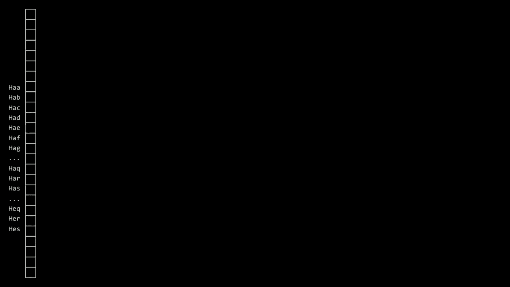

bucket this is the h-a-b，a e dot h-a-c-h-a-d-h-a-e dot all the，way down to h z z。

and then i a a but now when we，hash our three friends hermione goes in，the h e r。

bucket so to speak the element of the，array harry h，a r goes in that bucket and hagrid now。

gets his own bucket h-a-g，as would everyone else so it seems to。

have solved this specific problem you，could still imagine and i have to think，there's other。

harry potter names that start with hag，or h-a-r or，h-e-r to find another collision because。

you could imagine using，four letters instead but what price are，we paying。

like i'm solving this problem again and，again and i'm getting myself，it's giving me。

one step i can mathematically figure out，by just doing a bit of ascii math。

what the number of the index is that i，should jump to in this bigger and bigger。

array but what price am i paying，brian any thoughts you'd like to relay。

yeah a few people are saying it's going，to take a lot of memory。

yeah my god like this is taking a huge，amount of memory now，previously how much memory did it take。

well let me pull up a little uh，*****，*****，26 buckets so to speak elements in the。

array that of course isn't that bad that，feels pretty reasonable 26 slots。

but the downside was that the chains，might get kind of long three names four，names maybe even more。

but if we have a a through z z，instead of a through z that's 26 times，26 that's 676 buckets。

doesn't sound like a huge deal though，that's bigger than most things we've，done in memory thus far。

not a huge deal but if we have 3 that's，26 possibilities times 26 times 26 for，aaa through zzzz。

now we have 17 576，buckets in my array and the problem，isn't so much that we're using that。

memory because honestly if you need the，memory use it that's fine。

just throw hardware at the problem buy，and upgrade more memory。

but the problem is that i probably don't，know that many people，whose names start with hzz or。

a z z or any number of these，combinations of letters of the alphabet。

a lot of those buckets are going to be，empty，if you want an array and you want random。

access they have to be present so that，your arithmetic，works out per week too where you just。

use squ*re bracket notation and jump to，care about，so finding that trade-off or finding the。

inflection point with those trade-offs，is kind of an art and or a science。

figuring out for your particular data，your particular application。

which is more important time or space or，some happy medium，in between the two and with problem set。

five as you'll see you'll actually have，to figure out this balance in part by。

trying to minimize ultimately your own，use of memory，and your own use of computers time but。

let me point something out actually，this notion of hash table which up until。

now definitely the most sophisticated，data structure that we've looked at，already like。

these are probably larger than the，playing cards you have at home but if，and，you've。

at some point needed to sort them for，one game or another sometimes you need。

to shuffle them entirely，if you want to be a little neat you，might sort them not just by number but。

also by suits so hearts and spades and，clubs and diamonds into separate。

categories so honestly i have this，literally here just for the sake of the。

metaphor we have four buckets here，and we've gone ahead uh and labeled them。

in advance with spade there so that's，one bucket，here we have a diamond shape here。

and here we have uh，here we have hearts here，and then clovers here so if you've ever，haven't really。

thought about this very hard because，it's not that interesting you probably。

mindlessly start laying them out and，sorting them by，by suit and then maybe by number but if。

you've done that，you have hashed values before if you，see that oh。

it's the dime it's the ace of diamonds，you know yes you might care ultimately。

that it's a diamond but that it's an ace，but for now i'm just going to put it for，instance into the。

ace into the diamond bucket here's the，two of diamonds here，i'm going to put that into the diamond。

going to put that，over here and you can just progressively，hash one。

card after the other and indeed hashing，really just means to look at some input。

and produce in this case some numeric，one，two or three based on some，characteristic of that input。

whether it's actually the suit on the，card like i'm doing here or maybe it's。

based on the letter of the alphabet here，and why am i doing this right i'm not。

going to do the whole thing because like，52 steps is going to take a while and。

get boring quickly if not already，but why am i doing this because odds are，drama of like。

actual buckets you probably just kind of，laid them out in front of you but why，have you done that。

there's a possibility that we could，actually get to things faster like if we，know what bucket it is。

we might be able to even search things，for like oh one or less。

yeah something like that yeah you start，to gain these optimizations right like。

at least as a human honestly，like i can just i can process four。

smaller problems just much easier than，solve，for 13 card problems a little faster。

especially if i'm looking for a，particular card now i can find it among，13 cards instead of 52。

so there's just kind of an optimization，cards，hash them into a particular bucket and。

then proceed to solve the smaller，problem now that's not what a hash table。

itself is all about a hash table is，about storing information。

but storing information so as to get to，it more quickly so to sophia's point if。

indeed she just wants to find like，the uh ace of uh ace of uh diamonds，through a 13。

size problem a linked list of size 13 if，list，bucketize，your inputs if you will colloquially and。

get access to data more quickly not，necessarily，in time one in one step it might be two。

might be four might be 13 steps，but it's generally more fewer steps than，if you were doing something。

purely linearly or even logarithmically，ideally you're trying to pick your hash。

function in such a way that you minimize，the number of elements that collide by。

using not a through z but a a through zz，and so forth so let me go ah**d here and，ask a question。

what then is the running time when it，comes to this data structure，and search，in there。

once all of my contacts are there how，many steps does your phone have to take。

given n contacts in your phone to find，hermione or hagrid。

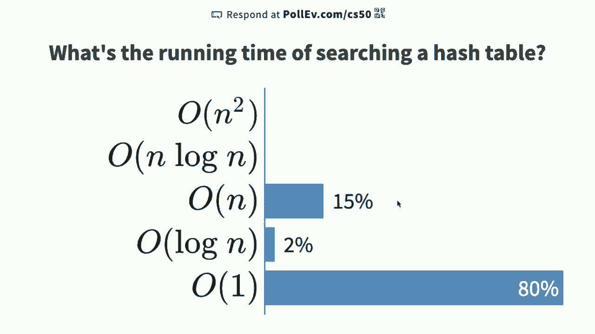

or anyone else，so i see again eighty percent of you are，saying constant time big o of one and。

again constant time might mean one step，two steps four steps but some fixed。

number not dependent on n eighteen，percent of you or so are saying。

linear time and i have to admit the，twenty percent of you or so that said，linear time。

are technically asymptotically，mathematically，a distinction，between like the real world and academia。

so the academic here，or rather uh the real world，here the real world programmer would say。

just like sophia did，it is strictly，better than one bigger bucket with 52。

cards like that is just faster it's，literally four times as fast。

to find or to fill us flip through those，13 cards instead of 52 like that is，objectively faster。

but the academic would say yes but，asymptotically and asymptotically is，really large。

the sort of wave of the hand that i keep，describing asymptotically，taking 13 steps is technically。

cards here，it's technically n divided by 4。 like，yes it's 13 but if there's n。

cards total technically the size of this，bucket is going to end up being n，divided by 4。

 and what did we talk about，when we talked about big o and omega，well you throw away the lower order。

terms you get rid of the constants like，the divide by four，or the the the plus something else so we。

get rid of that and it's technically，a hash table searching it is still in，big o of n。

but here again we see a contrast between，like the real world，and the theoretical world like yes if。

you want to get into an academic debate，linked list，or an array at which point you might as。

well just search the thing left to right，linked list，but come on like if you actually hash。

these values in advance，buckets，it comes to，wall clock time so when you literally。

look at the clock on the wall，less time will pass taking sophia's，approach than taking an array。

or linked list approach so here the，ant those of you who said big o of n are。

correct but when it comes to the real，world programming honestly，that may。

very well be a net positive and so，practice，and less sometimes on the theory of。

these things and indeed that's going to，be the challenge the problems that five。

to which i keep alluding，is going to challenge you to implement，table。

with a hundred thousand plus english，words we're going to in a nutshell give，you a big text file。

containing one english word per line and，among your goals is going to be to load。

all of those hundred and forty thousand，plus words，table，now if you are simplistic about it and。

you use a hash table，with 26 buckets a through z you're going，140。

000 plus english words there's a lot of，words in there that start with a。

or b or z or anything in between if you，maybe then go with a，a through zz maybe that's better or aaa。

through zzz maybe that's better but at，some point you're going to start to use。

too much memory for your own good，and one of the challenges optionally of。

problem set five is going to be to，playfully challenge your classmates。

whereby if you opt into this you can run，a command that will put you on the big。

board which will show，on the course's website exactly how much，or how little ram。

or memory you're using and how little or，how much time，your code is taking to run and so we。

just sort of put aside the sort of，academic hand waves of the hand saying，but a big。

uh but n divided by four sophia's，approach is way better in practice。

than n itself and we'll begin to tease，apart the dichotomy between theory here。

and practice but these aren't the only，ways to lay things out in memory and we，ideas。

that come out now that we have all of，these building blocks，one of which is a data structure that。

we're going to call a try the tri，is actually short for the word retrieval。

even though it's not quite pronounced，tree，and it's a different type of tree that。

is typically used to store，words or other more sophisticated pieces，of data instead of just。

numbers alone so a try is，actually a tree made up of a raise，so you can kind of see a pattern here。

lists，an，array so at some point computer，scientists started getting a little。

creative and started just like literally，smashing together different data，up with it seems。

and so a try begins to look like this，better than，here is，sense that this would be like a。

rectangle or a squ*re，but inside of that node is literally an，array of size 26，or，z。

and what we're going to do is anytime we，insert a word，like a name like harry or hagrid or。

hermione or anyone else，we are going to walk through the letters，of their name like h a。

g r id and we are going to，follow a series of pointers，from one node to another as follows so。

for instance if this is a through z or，zero through 25，here is location h so if the goal at the。

moment is to insert the first，of our contacts for instance harry。

i'm going to start by looking at the，first node the root of the tree。

looking up the h location and i'm going，to kind of make mental note that harry。

starts there the h in harry starts there，then if i want to insert the a in harry。

i'm going to go ah**d，letters，but i'm going to sort of keep track of，the fact that okay a is here。

so now i'm going to have another pointer，oh i'm sorry not harry hagrid first，uh h a g r i。

d so what have i just done a try again，is a tree each of whose nodes。

is an array and each of those arrays，is an array of pointers to other nodes。

so again we're really just mashing up，everything together here but it's the。

same building blocks as before，each node in this tree top to bottom is，an array of pointers，check。

if hagrid is in my contacts i literally，start at the first node。

and i follow the h pointer i then follow，the a pointer i then follow the g。

pointer the r pointer the i pointer and，then i check at the d。

pointer is there a boolean value inside，time，perhaps that just says yes or no there。

is someone named h-a-g-r-i-d，in my contacts notice there's no other。

letters noted at the moment and there's，no other green boxes，green just denotes a boolean value for。

our purposes now so that means there's，no one whose name is h-a-g-r-i-a，h-a-r-h-a-g-r-i-d。

that exists in my contacts but notice，what happens next now if i go ah**d and，insert harry。

notice that harry and hagrid share the h，the a and then this third node but then，pointer。

to store the r and the y and notice the，green there it's sort of a check mark in。

the data structure a boolean value，that's saying yes i have someone in my，context name h-a-r-r-y。

and then if we add hermione she shares，the h，and then also the second node but。

hermione requires some new nodes。

property，the reason for this sort of complexity，because this is probably the weirdest。

structure we've seen thus far，is that even if i have a billion names，in my phone book。

how many steps literally does it take me，to find hagrid，someone feel free to chime in in the。

text the chat window if you'd like，even if i have a billion names in my。

contacts how many steps does it take for，me to look up and check if hagrid is，among them。

people are saying six six h a g，r i d if i have two billion names four，take，time。

constant time at least in the length of，these uh the humans names in the book。

in the book in the in the data structure，so what does this mean，try。

data structure the number of other names，does not impact how many steps it takes，hermione。

or anyone else it is only dependent on，the length of their name and here's。

where we can get a little academic if，you assume that there's a finite number。

of characters in any human，real or imaginary's name maybe it's 20。

or 100 or whatever it's more than six，but it's probably fewer than hundreds。

then you can assume that that's constant，so it might be big o of like 200，name。

but that's constant and so technically a，try gives you that holy grail of lookup。

times and insertion times of big o of 1，because it is not dependent on n which。

is the number of other names，in the data structure it is dependent，inputting。

and if you assume that all names in the，world are reasonably length less than，some finite value like。

6 or 200 or whatever it is then you can，call that and it technically is。

big o of 1 that is constant time，so here is that the goal of this whole。

day like trying to get to constant time，would seem，linear time or logarithmic time or。

anything else we've seen but but but，price，have we just paid if you see it。

why are tries not necessarily，all that there's still a catch，um yeah so actually。

like for example if let's say you wanted，you had two people in your contact list。

one person was named daniel，and one person was named danielle and。

and you know that daniel is in your list，so the l would have this like。

boolean operator of like true but then，how would you get to danielle。

if your l was an operator and it didn't，point to another l for danielle。

really good question a corner case if，you will what if someone's name，so daniel。

daniel d-a-n-i-e-l and i think you're，saying danielle d-a-n-i-e-l-l-e。

so the second name is a little longer，let me stipulate that we can solve that，i have not shown。

code that represents each of the nodes，in this tree let me propose that we，could continue having。

arrows even below so if we were to have，daniel in this tree，we could also have danielle by just。

having a couple of more nodes below，daniel and just having another green。

check mark so it is solvable in code，even though it's not obvious from the。

graphical representation but absolutely，solvable。

in tries what might another downside be，though of a try，like you do get big o of one time you。

can solve the daniel danielle problem，any thoughts yeah how about over to uh。

oh still muted uh there we go，oh there we go uh yeah i'm eating um i，lot of。

uh memory to house all of that and that，could take a lot of time a lot of um。

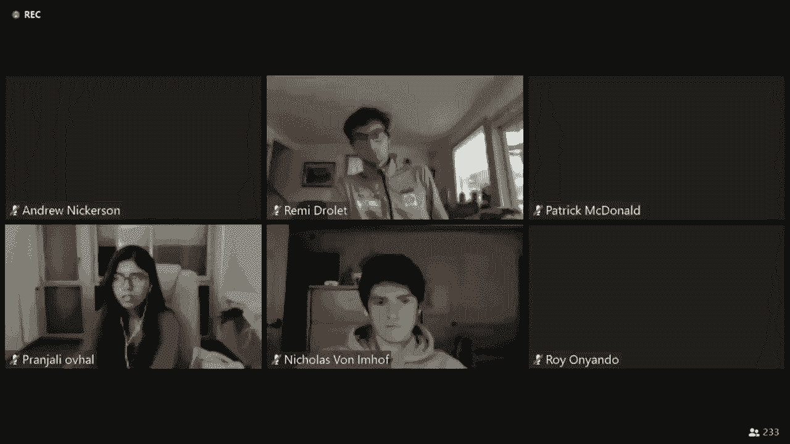

could slow down the system exactly yeah，you can kind of see it from my picture。

alone we only added three names to this，data structure but my god like，pointers。

pictured here even though they might all，be null right if the absence of an arrow。

here suggests that they're null，o x zero but even storing null ox0，is eight zero bits so this is not。

lacking for，actual memory usage we're just not using，it very efficiently we have spent a huge。

number of bits，or bytes or however you want to measure，it because look even with the h's。

i'm using one pointer out of 26 25，pointers are probably initialized to。

null which means i'm wasting 25 pointers，and you can imagine the lower and lower。

you get in this tree the less，likely there is to be a name that even，starts with h-a-g-r-i-d。

daniel came up with a good example with，danielle but that's not going to。

often happen certainly the lower you get，in this tree so as e10 says。

you're wasting a huge amount of memory，so yes you're gaining，price。

you might be using megabytes gigabytes，of storage space because again the most。

important property of an array，is that it's all contiguous and，you have to have。

every node containing an array of size，26 or anything else，the memory。

over and over again so there too is a，trade-off while this might be，theoretically ideal。

theory does not necessarily mean，something that is，textbook less efficient might actually。

be more efficient in the real world and，in problem set five in your own。

uh spell checker uh when you build up，this dictionary that we then use to。

spell check very large corpuses of text，will you begin to experience some of。

those real world trade-offs yourself，well we wanted to end today with a look。

at what else you can do with these kinds，of data structures just to give you a。

taste of where else you can go with this，and what other kinds of problems you can。

solve again thus far we've looked at，arrays which are really the simplest of。

data structures and they're not even，structures per se it's just contiguous，blocks of memory。

course where you have this，one-dimensional，data structure that allows you to stitch。

together nodes in memory giving you，de-allocation，inserting and deleting nodes if you want。

then we had，trees which kind of gives us the best of，both worlds arrays。

and linked lists but we have to spend，more space and use more pointers。

then of course hash tables kind of merge，together two of those ideas arrays。

and linked lists and that starts to work，well and indeed that's what you'll，checker。

but then of course there's tries which，at first glance seem better。

but not at great not without great cost，as e10 says，so it turns out with all of those。

building blocks at your disposal，you can actually use them as lower level，implementation details。

to solve higher level problems and this，is what are known as abstract data。

structures or abstract data types an，abstract data structure，is kind of a mental structure that you。

can imagine implementing some real world，problem typically，that's implemented with some other data。

at this level，but you're thinking about what you've，built ultimately at this level and。

that's abstraction，taking lower level implementation，details simplifying them。

for the sake of discussion or problem，solving higher up，so what's one such data structure a。

queue is a very common，abstract data structure what is a queue。

well those of you who grew up and say in，queue，and that's indeed where it gets its name。

a queue is a data structure that has，certain properties so if you're standing。

outside of a store or a restaurant in，healthier times waiting to get in。

you're generally in a queue but there's，an important property of a cue at least。

if you live in a fair society，you'd like to think that if you are the，first one in line，first in。

first out it would be kind of obnoxious，if you're first in line and then they。

start letting people in who are behind，you in that queue，so a queue if it's implemented correctly。

has a property known as，fifo first in first out and we humans，property。

and a queue generally has two operations，associated with it at least。

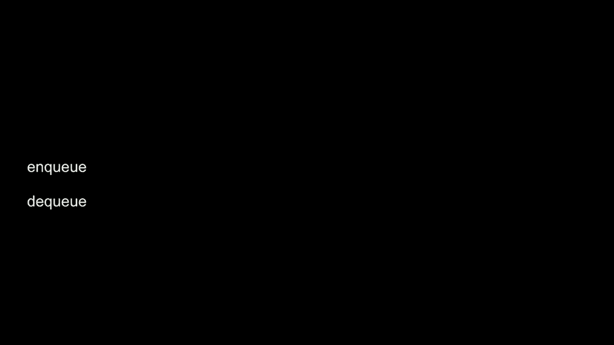

nq and dq those are just conventions you，could call it add and remove or insert，delete whatever。

but nq and dq are sort of the more，common ones to say，so enqueuing means you walk up to the。

have to wait，dq means they're ready to serve you or，that's dq，that describes。

a key property of that which is that，it's first in first，out so how could you implement。

a queue then well what's interesting，about that data structure is that it's，than an。

actual thing in code you want to，implement some kind of fair。

queuing system and so you think of it as，a queue but frankly。

if we're going to translate that example，array，of persons that could implement a cue。

you could use a linked list of persons，work，underneath the hood is the lower level。

implementation details，but what would be a problem if we，translate this real world。

analogy like queuing up outside of a，store to get in，into code and you used an array what。

would a downside be，of using an array to represent a q，in general even though we're making a。

bit of a leap from like real world to，code suddenly but there's probably a，downside。

what might a downside be of using an，oh still muted if you're，if you're using an array you can't。

really just，take out the existing values you would，still have a bunch of。

because if you're thinking about doing，this in a line you would have to take，person。

but you can't really dynamically sort of。

change the memory after that，yeah yeah that's a really good point。

think about a line suppose that there's，like a line，that can fit 10 people outside the apple。

now during，the health crisis of letting people in，only so many at a time so suppose they。

have room for 10 people six feet apart，that's actually a pretty apt analogy，this year more than ever。

but as ryan says if you want to take，someone if you want to dq someone。

then the first person in line is going，to go into the store and then the second，into the store。

the problem with an array it would seem，is that now you have essentially empty。

spaces at the beginning of the line but，you still don't have room at the end of。

the line for new people now there's an，obvious real world solution there you。

just say hey everyone would you mind，taking a few steps forward。

but that's inefficient like not so much，the store，but in code that's copying of values you。

have to move like eight values，two places over if two people were just，let into the store。

so now your dq operation is big o of n，and that doesn't feel quite ideal and we。

can do better than that if we're a，and such，but that would be one challenge of a，queue certainly。

using，an array so you might imagine too and，array is limited too because it would。

kind of be obnoxious if you get to the，apple store there's already 10 people。

online and they don't let，you get in line they say sorry we're all，not。

because eventually there'll be more room，in the queue a linked list would allow。

you to keep appending more and more，people and even if the line outside the，store gets crazy long。

at least the linked list allows you to，service all of the customers。

who are showing up over time an array of，fixed size，would make that harder and again you。

could allocate a bigger array but then，you're going to have to ask all the，here。

no go back over there i mean you're，constantly moving humans or。

values and memory back and forth so that，is only to say that to implement this。

real world notion of a cue which is very，commonly used even in the computer world。

to represent certain ideas uh for，instance，printer queue when you send something to，a company。

there's a queue and ideally the first，person who printed is the first one who。

gets their printouts thereafter，queues are also used in software but，there。

besides cues one of them is called a，stack so a stack，is a data structure that can also be。

implemented underneath the hood，using arrays or linked lists or heck，maybe something else，it's last。

in first out last in first，out so if you think about the trays in a。

cafeteria in healthier times when，everyone is on campus using trays from a，cafeteria。

you'll recall of course that trays tend，to get stacked like this and the，uh last uh the last tray。

to go on top of the stack is the first，one to come out，if you go to a clothing store or your。

own closet if you don't hang things on，hangers or put them in drawers but kind。

of stack them like here，like all of these sweaters this is a，sweater i want。

well the easiest way to do it is with，last in first，out so i constantly take the black。

sweater the black sweater but if i've，stored all of my sweaters in this stack，you may never get to。

the sort of lower level ones like the，red or the blue sweater。

because again of this data structure so，lifo last in，first out is in fact the property used。

to characterize，stacks and stacks are useful，or not useful depending on the real，computing。

we'll see applications over time where，stacks indeed come into play and those。

two operations that those things support，are generally called push and pop it's。

the same thing as add or remove or，insert or delete but the terms of art。

are generally push，off of the stack，this is me pushing a value onto the，stack but again，as lifo。

and then there's this other data，world，uh analog known as a dictionary a。

dictionary is an abstract data type，which means you can implement it with。

arrays or linked lists or hash tables or，tries or whatever else。

an abstract data type that allows you to，associate keys with values。

and the best analog here is indeed in，the real world what is a dictionary like。

an old school dictionary that's actually。

printed on paper in book form，what is that what is inside that book a。

whole bunch of keys a whole bunch of，bold-faced words，like apple and banana and so forth each。

of which have，definitions otherwise known as values，and they're often alphabetized to make。

it easier for you to find things so that，you can look things up more quickly。

but a dictionary is an abstract data，type that associates，keys with values and you look up the。

values by way of their keys just like，you look up a word's definition，by way of the word itself and。

dictionaries，are actually kind of all around us too，you don't think of them in these terms。

probably but if you've ever been to，sweet green for instance，um in new haven or in cambridge or。

elsewhere this is a salad place，where nowadays especially you can order。

in advance online or on an app and then，go into the store，and pick up your food from a shelf but。

cambridge，and in other cities is they actually，have letters of the alphabet on the，shelves a b。

c d e f all the way through z the idea，being that if i go in to pick up my。

salad it's probably on the d，section if brian goes in to pick up his，it's in the b section。

and so forth now here too you can，imagine perverse，corner cases where this data structure。

this dictionary whereby letters of the，salad，is not necessarily fail proof like can。

you think of a perverse，corner case where sweet green's very，wonderful methodical system。

actually breaks down can you think of a，limitation here，even if you've never been to sweet green。

or never eaten salad like what，could break down with this system if。

going into a store and picking something，up based on，your name any thoughts a few people say。

there might be a problem if two people，have the same name，yeah if two people have the same names。

you start to sort of stack things up so，literally sweet green will start。

stacking one solid on top of the other，so there is actually an interesting。

incarnation of one data type being built，on top of yet another data type so again。

all of these are sort of like custom，scratch pieces if you will that we're。

constantly sort of reassembling into，more interesting and powerful ideas。

but at some point if there's a lot of b，alphabet，i surely see a finite height to this。

shelf so it's kind of as though sweet，using，stacks with arrays because arrays are。

fixed size so there's surely only，so many inches of space here vertically。

so you can see a real world limitation，so what does sweep green do if that，cheat。

and put the b's in the c section or the，d's and the e section like who really。

cares in the real world your eyes are，probably going to skim left and right。

but algorithmically that is slowing，things down and in the worst case if，salad。

or sweet green is really popular and，shelf，your name might be albus but your salad，section。

if they're just out of room and so that，too is a valid，algorithmic decision to just make room。

somewhere else but again，trade-offs between time and space and so，some。

friends of ours at another institution，distinguish，these notions of stacks versus queues a。

stack and again a queue or these，abstract data types that can be。

implemented in different ways they have，different properties，each of them respectively fifo or lifo。

and here for instance is a final look in，our final moments together here today。

about how these ideas manifest，unlike，[Music]。

once upon a time there was a guy named，jack when it came to making friends。

jack did not have the knack so jack went，to talk to the most popular guy he knew。

he went up to blue and asked what do i，distressed。

well lou began just look how you're，a，different look yes said jack i sure do。

come to my house and i'll show them to。

you so they went off the jacks and jack，showed lou the box，where he kept all his shirts and his。

pants and his socks，luce said i see you have all your，clothes in a pile why don't you wear。

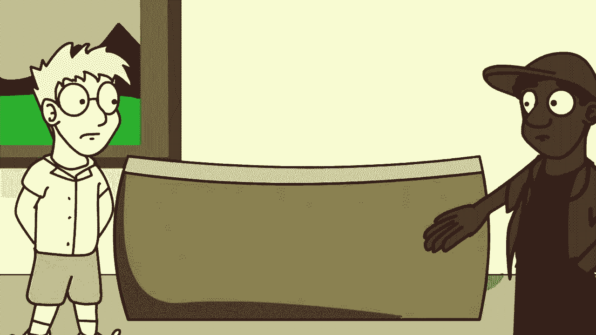

some others once in a while，socks。

i wash them and put them away in the box，then comes the next morning and up。

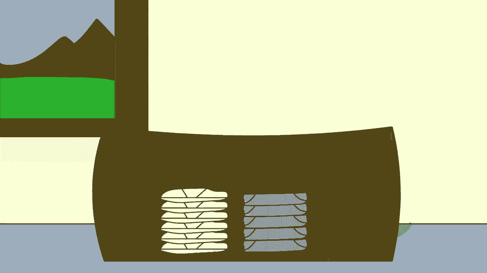

i hop i go to the box and get my clothes，off the top，lou quickly realized the problem with。

stack，when he reached for something to read or，to wear he chose a top book。

or underwear then when he was done he。

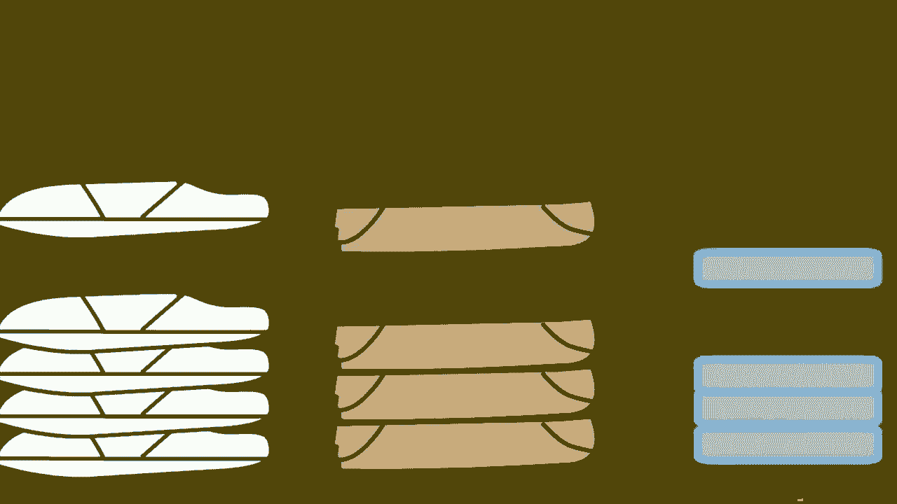

would put it right back，back it would go on top of the stack i。

know the solution said a triumphant lou，you need to learn to start using a queue。

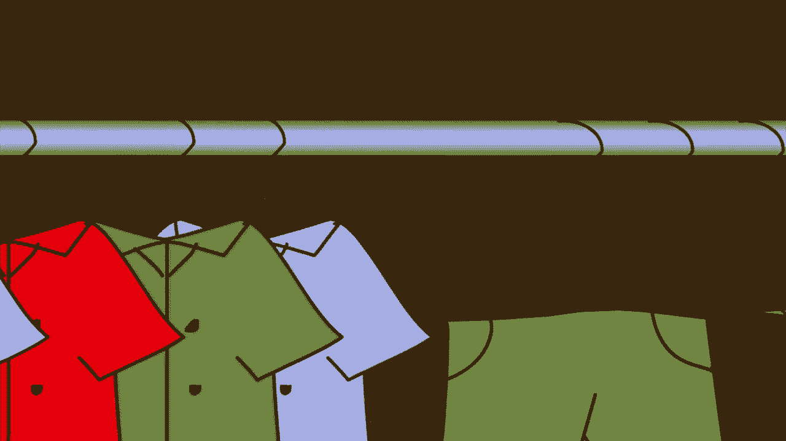

a closet，and when he had emptied the box you just，tossed it then he said now jack。

at the end of the day put your clothes，on a left when you put them away。

then tomorrow morning when you see the，sunshine get your clothes from the right。

from the end of the line don't you see，said lou it will be so nice。

you'll wear everything once before you。

wear something twice，and with everything in queues in his，closet and shelf。

jack started to feel quite sure of，himself all thanks to lou。

and his wonderful cue，alright that's it for cs50 we will see。

