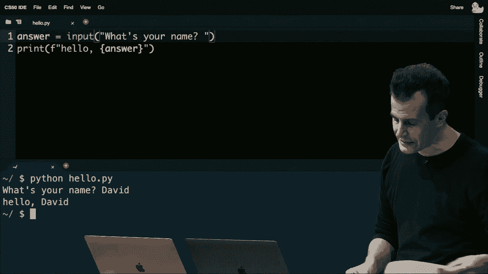

# 【双语字幕+资料下载】哈佛CS50-CS ｜ 计算机科学导论(2020·完整版) - P12：L6- Python从语法到应用实战 1 - ShowMeAI - BV1Hh411W7Up

hey everyone it's good to see everyone，on the holiday，or，comments or concerns that brian or i can。help address，hello to brandon and uh andrew and，others who are here。no and brendan i i miss red brendan，let's see summerwick good to see you。brian do you want to see are there any。

all right this is cs50 and this is week。

six and this is again one of those rare，days where in just a bit of time you'll，be able to say。that you learned a new language and that，language today is going to be this，language called python。and we thought we'd begin by introducing，python by way of some more familiar，began the course。back in week zero when we introduced，simply。

says hello world and then very quickly，things escalated，and became a lot more cryptic a lot more。arcane and we introduced，c and syntax like this which of course。do the exact same thing just printing，out hello world on the screen。but with the requirement that you，understand and you include all of this，various syntax。

so today all of this complexity，all of the the syntax from c suddenly，begins to。melt away such that we're left with this，new language called python。that's going to achieve the exact same，goal simply with this line of code here。which is to say that python tends to be，easier，but that's because it's built on this。

tradition of having started，as humans years ago building these，low-level languages like c。realizing what features are missing what，some of the pain points are and then。layering on top of those older languages，languages so，there are dozens hundreds really of。there's always a，subset of them that tend to be very，popular very in vogue at any given time。

python is among those very popular，languages and it's the third of our，languages that we'll look at。indeed at this point in the term so，let's go ah**d and introduce。some of the syntax of python really by，way of comparison with what we've seen。in the past because no matter how new，some of today's topics are。

they should all be familiar in the sense，that we're going to see loops again。conditions variables functions return，values there's pretty much just going to，be a translation。of features passed to now features，present so this of course in the world，of scratch was just one。puzzle piece or a function whose purpose，screen，in week one we translated this to the。

more cryptic syntax here，that you have to，this backslash，n to re represent a new line character。

and then of course this kind of，statement has to end with a semicolon。the equivalent line of code today on out，in this language called python。is going to be quite simply this so it，print，instead of printf we still have the。

double quotes but，gone are the backslash n as well as the，semicolon so if you've been kicking。yourself all too frequently for，forgetting stupid things like the，semicolons。python is will now be your friend well，let's take a look at，another example here uh how we might go。about getting user input，as well well here notice that we have a，puzzle piece called ask。

and it says ask what's your name and，wait and the next puzzle piece。said whatever the human had typed in，preceded with the word hello。starting today we're going to see some，code like this string，answer。equals get string what's your name and，then printing out with printf，for the other。

in python some of this complexity is，about to melt away too，and in python we're going to see a。little something like this，so no longer present is the mention of，the type of variable。no longer present is the semicolon at。

percent，s and that additional argument to print，so in fact let's go ah**d and see these，and。go over to cs50 ide here for just a，moment and within cs50 ide。i'm going to go ah**d and write my very，first python program。and to do that i'm going to go ah**d and。

create a file that will initially called，hello。hi，much like in the world of c python。programs have a standard file extension，being dot pi instead of dot c and i'm。just gonna do what i proposed was the，simplest translation，i'm just gonna go ah**d and say and。print hello comma，world i'm gonna save my file and then，i'm gonna go down to my terminal window，used。

make and then we would have done dot，slash uh，hello or the like but today i'm quite。simply going to run a command that，itself is called，python i'm going to pass in the name of。the file i just created as its command，line argument and voila hitting enter。there is my very first command line，argument so，there is my very first program in python。

so that's pretty powerful let's go ah**d，and create this second program。that i proposed a moment ago instead of，time，i'm also going to go ah**d this time and，answer。i'm going to go ah**d now and get input，from the user and i'm going to go ah**d，and use the familiar。get string that we did cnc i'm going to，go ah**d and ask what's。

your name question mark i'm not going to，bother with a semicolon。but down here i'm going to go ah**d and，say print hello，comma and then a space inside of the。like percent，s i'm actually going to go ah**d and，just do a plus operator。

and then literally the word answer but，work，just yet this isn't going to work just。yet because get string it turns out just，like it doesn't come with c。it also doesn't come with python so i，need to do one thing that's going to be，instead of。hash including something i'm going to，literally say from cs50，import getstring so in the world of c。

recall that we included cs50。h which had，declarations for functions like。

getstring and getint and so forth，in the world of python we're going to do。something similar in spirit but the。

syntax is just a little different，we're going to say from cs50 which is，wrote。import that is include a function，specifically called getstring。

and now any errors that i might have，disappeared，if i go ah**d and save this file and now，do python。space hello dot pi and hit enter now i。

can go ah**d and type in my actual name，and voila，i see hello comma david so let's tease。apart what's different about this code，and consider，what more we can do after this so again。notice on line three，there's no mention of string anymore if，i want a variable i just go ah**d and。give myself a variable called answer，the function is still called get string，the c，a semicolon。

on my final line of code here print it's，now indeed print instead of printf。and then this is new syntax but in some，sense it's going to be a lot more。straightforward instead of having to，think in advance where i want the，percent s and my placeholder。this plus operator seems to be doing，something for me and let me go ah**d and。

ask a question of the group here，what does that plus operator seem to be，doing because it's not。addition in the arithmetic sense we're，not like adding numbers together。but the plus is clearly doing something，that gives us a visual result。any thoughts from uh peter what's this，plus doing，it's concatenating strings yeah it's。

concatenating strings which is the term，of art to describe，the joining of one string and the other。so it's quite like therefore，literal，translation of that join block which we，didn't have in c。in c we had to use printf we had to use，percent s python is going to be a little。more user friendly such that if you want，space，and the contents of that variable we can。

just use this plus operator instead，and the last thing that we had to do was，of course import。this library so that we have access to，the getstring function itself。well let's go ah**d and take a tour of，just some other features of python and。then dive in primarily to a lot of，hands-on examples today so recall that。

in uh the example we just saw we had，this first line of code which gets a。string from the user stores it in a，variable called answer，we had the second line of code which is。together，but it turns out even though this is，definitely more convenient than in。c in that you can just take an existing，together，without having to use format strings or。

the like well it turns out there's，another way there's frankly many ways in，same result。and i'm going to go ah**d and propose，that we now change this line here。to this funky syntax so definitely ugly，at first glance，and that's partly because this is a。relatively new feature of python，but notice that in python can we use。

these curly braces，to plug in an，actual value of a variable here so，instead of percent s。python's print function uses these curly，braces that essentially say。plug in a value here but there's one，oddity here，you can't just start putting curly。braces and variable names，python，you also have to tell the language that，what follows。

is a formatted string so this is perhaps，the weirdest thing we've seen yet。but when you do have a pair of double，quotes like i have here，prefixing it with an f will actually。tell the computer to format the contents，of that string plugging in values。between those curly braces，as opp*sed to literally printing those，curly braces themselves。

so let me go ah**d and transition to my，actual code here and try this out。instead of using the concatenation，operator，comma，going to be the right。approach because if i rerun this program，python of hello。pi，it's going to ask me what's my name i'm。going to type in david and it's going to，ignore me altogether because i've。

literally hard-coded hello，comma answer but it's also not going to，be quite right。to just start putting that in curly，braces because if i，again run this program python of，hello。pi and type in my name，now it's going to say hello，squigglybrace answer。so here is just a subtle change where i，have to tell python，that this type of string between the。

string，and type in david。

i now get hello david so it's marginally，more convenient than c because again you。don't have to have a placeholder here a，placeholder here and then a comma。separated list of additional arguments，so it's just a more succinct way if you。will to actually introduce，more values into a string that you want，to create these are called。

format strings or for short f strings，in our tool kit，when programming with this new language。called python well let's take a look at，a few other translation。of puzzle pieces to see and then turn to，python and then start building，scratch。this was an example early on of a，variable called counter，initializing it to zero in c in week one。

this，int counter equals zero semicolon and，that gave us a variable。of type int whose initial value was zero，in python the code's going to be。similar similar but it's going to be a，little simpler，python，mention the type of variable i want it。will infer from context what it is，and i also don't have to have the。

semicolon there so counter equals zero，in python is going to give you a，variable called counter。and because you're assigning it the，will，an int，or an integer what else did we see in。scratch change counter by one so this，was a way of increasing the value of a，variable by one。in c we had a few different ways to，implement this we could say counter。

equals counter plus one it's kind of，pedantic it's kind of long and tedious，notation，instead。in pi in c we were able to do counter，plus equals one and that was going to，achieve the same result。well in python we actually have a couple，of approaches as well。we can much like in c say it explicitly，like this but just omit the semicolon so。

counter equals counter plus one the，logic in python is exactly the same。as in c and as for this shorthand，notation this also exists in python。again without the semicolon the one，thing that does not，story，or i。plus plus that syntactic sugar that made，a variable，unfortunately does not exist in python。

but you can do counter plus，equals one or whatever your variable，happens to be。well what else did we see in scratch and，course，conditions pretty early on and those。conditions use boolean expressions to，thing or，something else altogether in c you we。converted this to，what looked kind of similar and indeed，the curly braces kind of hug。

the printf line just like the yellow，condition here hugs the purple say block，and we had parentheses。less than y，we again used printf inside of the curly，braces which had double quotes。a backslash n for a new line and a，semicolon，python nicely enough is going to be sort。of identical in spirit，but simpler syntactically what python is，going to look like henceforth，the x。

less than y go away the curly braces，semicolon，goes away and here you see just a tiny。example of evolution of humans，programming languages，right if you and i have been frustrated。for some time about all the stupid，semicolons and curly braces all over the，for your code to read。let alone being correct humans decided，know what，why don't we just say what we mean and。

not worry as much about all of this，syntactic complexity，let's keep things simpler and indeed。that's what we see here is one example，in python but there's a key detail if。any of you have been in the habit，sloppy，when it comes to your indentation and。maybe style 50 is constantly yelling at，you to add spaces add spaces or remove，spaces or lines。

well in python it is now necessary，to indent your code correctly in c of，course we cs50 and。a lot of the world in general recommend，that you indent your code by four spaces。typically or one tab，in the context of python you must do so，if you accidentally omit these spaces。just to the left of the print，going to run at，so，no more sloppiness python is going to。

don't have to bother，including the curly braces what about a，two，uh paths you can follow if or else。well in this case in c we translated it，pretty straightforwardly like this。again parentheses up here curly braces，here and here，backslash n backslash n and semicolon。you can perhaps guess in python that，this is going to get a little more，compact because boom。

now we don't need the parentheses，anymore we do need to indent but we，need the new line。and we don't need the semicolon so we're，sort of shedding features that。can be taken now for granted but what，about this example，in scratch when we had a three-way fork。in the road if，c，we would have translated this like this，and there's not much going on there but。

it's a pretty substantive number of，lines of code some 12，in python。notice what's going to go away here is，again those parentheses again those。curly braces again the backslash n，and the semicolon there's only one，oddity here。

there's only one oddity what looks wrong，or weird to you，maybe what looks like a typo。to you and i promise i haven't screwed，up here，um i would say the lift instead of elsif。is different syntactically exactly so，whereas in c we would literally say。

else if in python humans，years ago decided heck why say else if。and waste all that time typing that out，one word，e-l-i-f so indeed this is correct syntax。here and you can have more of those you，can have four，six any number。thereafter but the syntax is indeed a，little different but it's a little。

tighter right there's less syntactic，distraction when you glance at this code。you don't have to ignore as many，semicolons and curly braces in the life。like python tends to just be a little，cleaner syntactically and indeed that's，more modern。languages like it all right let's take a，and turn c，in scratch when we wanted to do。

something again and again as a loop，perhaps forever，we would literally use the forever block，in c。we could implement this in a few，different ways and we proposed quite，simply this one。while true print out hello world again，and again and again and because the。boolean expression never changes it's，going to indeed execute forever。

so python's actually pretty similar but，there are a couple of subtle differences，like here。we have true in parentheses the curly，braces the new line，the semicolon a lot of that's about to。go away，but there's still going to be a slight，difference notice that we're indenting。as i keep emphasizing we no longer have，the new line or the semicolon or the，curly braces。

but true and it turns out false now must，be capitalized so whereas in c。it was lowercase false lowercase true，and python it's going to be capitalized。false capitalized true y，just because but there is one other，with our，loops here as well as with our。conditions just as before if i rewind to，our most recent condition。

notice that even though we've gotten rid，of the curly braces and we've gotten rid，of the parentheses。we now have introduced these colons，which are necessary，after this expression this expression。that the，lines of code that follow indented，underneath are indeed relevant。to that if l if or else and we see that，same feature again here，in the context of a loop well we saw。

other loops of course in，scratch when we wanted to do something a，finite number of times like three。we would repeat the following three，times in c we had a few different。approaches to this and all of them i，dare say were very mechanical。like if you want to do something three，times the onus in c，is on you to like declare a variable。

keep track of how many times you've，counted already，increment the thing like there's a lot。of moving parts and so in c，a variable called，i equals zero but we could call it。anything we want we have a while，block here that's asking a boolean，than zero。is i less than three and then inside of，the loop we printed out hello world。

and using c's syntactic sugar the plus，plus notation we kept adding one。to i add one to i add one to i until we，implicitly break out of the loop because。it's of course no longer，less than three so in python similar in。spirit but again some of that clutter，goes away，i equals zero is all we need say to give。

ourselves a variable，while i less than three is all we need，to say there but with the colon。then inside of that indented properly we，print out hello world，and we can't do the plus plus so we。minor disappointment，but i plus equals 1 increments i so this，would be one way of implementing in。python the exact same thing，a loop that executes three times but we，saw other approaches of course。

in c and there's other approaches，possible in python，as well you might recall in c that we。saw this approach the for loop and odds，are you've been reaching for the for。loop pretty frequently because even，though it looks a little more cryptic。you can pack more features into that one，line of code in between those。

those semicolons if you will so same，exact logic it just prints out。this hello world three times using a for，loop instead，in python things start to get a little。elegant here now it's a little weird at，first glance but it's definitely more，succinct。if you want to do something three times，it turns out in python。

you can use a more succinct syntax for，the for loop for，i in and then in squ*re brackets a list。of values，so just as we used in the past squ*re，connote，arrays and indexing into arrays in the。world of python，whenever you surround a bunch of values，them，and you encapsulate them all using。that's what we're going to call in，spirit to an，array but we'll call it in the context。

of python a list，and so what this line of code says is，for i in012 what does that mean。this is a for loop in python that says，give me a variable called i。and on the first iteration of this loop，set i equal to zero，on the second iteration of this loops at。of this loop set i，equal to two for me it just does all of，that for you。

now at the end of the day it actually，doesn't matter what i is per se。because i'm not printing the value of i，and that's totally fine。odds are you've used for loops or you，did something again and again like，printing hello world。even though you didn't print out the，put，any three things in these squ*re，would be。

just enumerate just like in c zero one，two just like a computer scientist，counting from zero。but this could break down pretty easily，does anyone，see a problem with for loops in python。if you have to put in between those，squ*re brackets the list of values that，you want to iterate。

um if you want to do for example like a，thing 50 times you'd have to write out。zero one two three four，five six yeah my god it would start to。look hideous quickly and it's funny you，mentioned 50 because in preparing this。this demonstration for lecture today i，went back to week zero，when actually the analog in week zero。

was to indeed print out hello world 50，times and i thought to myself damn it。like this is going to look atrocious now，because i literally have to put inside，of squ*re brackets。noah says，which would just look atrocious like，surely there's got to be a better way，and there is。while this might be compelling for very，short values there's a simpler way in。

python when you want to do something，some number of times，we can replace this list of three values。takes an input，which is the number of things that you，want to return and essentially what。

range will do for you，past an input like three it will，three values，iterate。over those three values for you so to，know as concerned a moment ago。if i now want to iterate 50 times i just，change the 3 to a 50，and i don't have to create this crazy。mess of a manually typed out，list of 0 through 49 which of course，would not be a very。

well designed a program it would seem，just because of the the length of it and。the opportunity to mess up，and the like so in python this is，perhaps now if you will the most。pythonic way to do something some number，of times and indeed this is a term of，short。technical people programmers they tend，to be pretty religious in some sense。

when it comes to the right way of doing，things and indeed within the world of，python programming。a lot of python programmers do have both，opinions but also standardized。recommendations that dictate how you，this，are what are considered pythonic you are。doing something pythonically if you're，doing it the quote-unquote right way。

which doesn't mean right in the absolute，other people，rather agree with you in this sense all。right let's see a few final，features of python before we now start，to build some of our own features。in c recall we had this whole list of，data types and there are more and you。can create your own of course，but the primitives that we looked at，float。

int long string and so forth in python，even though i haven't needed them。because i can give myself a variable，it a name，like counter or i or answer and then。assigning it a value and python infers，from what you're assigning it what data，type it should be。python does have data types it's just，what's known in in the programming world，as a loosely，strongly。

exist，you must use them explicitly in the，world of python you have what's called a，loosely typed。language which in which types exist，but you can often infer them implicitly。the burden is not on you the programmer，to specify those data types incessantly。let the computer figure it out for you，so this is our list from c。

this now is going to be our analogous，to have，bull still true is and false but capital。t capital f we're going to have floats，which are real numbers with decimal。points we're going to have ins，which of course are numbers like，negative 1 0 and 1 and so forth，str。and whereas in the world of c there was，technically no，string type that was a feature offered。

by the cs50 library which just made more，recall that c，has strings and they're called strings。but there's no data type called string，the way you give yourself a string of，course in c。is to declare something as a char star，char，star a synonym a nickname an alias，called string。in python there are actual there is an，actual data type for strings，and for short it's called str。

all right so with that said what other，can use here，well there's other data types as well in。python that are actually going to prove，super useful，as we begin to develop more。sophisticated programs and do even，cooler things with the language，we've seen range already strictly。within python，that gives you back a range of values by，default zero on。

up based on the input you provide list i，keep mentioning verbally。a list is a proper data type in python，that's similar in spirit to arrays but。whereas in arrays recall，we've spent great emphasis over the past，few weeks noting that。arrays are a fixed size you have to，going to be，and like last week if you decide oops i。

need more memory，you have to dynamically allocate more，space for it copy values over and then，much。jumping through hoops so to speak when，you want to use arrays and c。if you want to grow them or even shrink，them python，and other higher level languages like it。an array，that automatically resizes itself bigger，and smaller that feature now you get for。

free in the language so to speak，you don't have to implement it yourself。python has what are called tuples uh in，or gps，you might have x and y coordinates or。latitude and longitude coordinates so，like comma separated values。tuples are one way of implementing those，in python，dict or dictionaries so python has。

dictionaries that allow you to store，human world，if you have a human dictionary here for。instance for english much like a，dictionary in physical form，lets you store words and their。definitions a dictionary in python，more generally lets you store any keys。and any values you can associate one，thing with another and we'll see that。

this is a wonderfully useful，and versatile data structure and then。lastly for today's purposes there's，these things called sets，which if we recall from math a set is a。three，without duplicates but python manages，that for you you can add items to a set。you can remove items from a set，python will make sure that there are no，duplicates for you。

and it will manage all of the memory for，you as well，so what we have uh in the way of。functions meanwhile，c，we use the cs50 library to get chars，doubles floats ins longs and strings。in python thankfully we don't have to，worry about doubles or longs anymore。more on that in a bit but the cs50，library for python which you saw me，import a few minutes ago。

does give you a function called get，float it does give you a function called。getint it does give you a function，called getstring，that at least for this week's purposes。are just going to make your life easier，these two are training wheels that we。will very quickly take off so that，you're only using，native python code ultimately and not。

cs50 zone library，but for the sake of transitioning this，week from c to python you'll find that。these will just make your life easier，before we relax and take those，away too so in c。to use the library you had to include，cs50。h，in python again you're going to go ah**d。and import cs50 or，more explicitly the specific function。

that you might want to import so it，import things，they ultimately achieve essentially the。same goal you can with lines like this，explicitly import one function at a time，like i did earlier。using get string or you can import the，whole library all at once by just saying，more succinctly。import cs50 it's going to affect the，syntax we have to use hereafter。

but there we'll see multiple ways of，doing this in our examples here on out。you can also simplify this a bit and you，can import a comma separated list。of functions from a library like ours，and this is a convention we'll see quite。frequently as well because as we start，using，popular third-party libraries written by。

other programmers on the internet，they will very commonly give us lots of。functions that we ourselves can use，after the other，by just specifying them here in this way。if there's any，questions on python syntax like that's。

essentially it for our crash course in，python syntax，we're now going to start building things。and explore what the features of python，are and what some of the nuances are and。really the power of python but first，any questions on on syntax。we've seen loops conditions variables，olivia question or comment，um if in a for loop if you want to。

increment by something besides，one but you don't want to explicitly，type out the list。how would you do that really good，question so if you wanted to。use a for loop and iterate over a range，be，0 2 4 6 8，instead of 0 1 2 3 let me go ah**d and。go back to that slide from a moment ago，and i can actually change this on the，fly let me go。

what i can do。

actually is specify another value which，might be this，if i change if i change the input to。

range to be not one value，to the computer，that it should count a total of three。values but it should increment，two at a time instead of the default。which is one and there's even other，capabilities there too you don't have to，that as well。which is to say that with python you're，going to find a lot more features come。

with the language and even more，powerfully the，functions that you can write and the。functions that you can use in python，also can take different numbers of。arguments sometimes it's zero sometimes，it's one sometimes it's two but it's。

ultimately often，up to you good catch other questions，okay we'll come back to ryan oh sophia。over to you，will we see sequences like primarily in，the for loops or。are there other applications where，they're very useful sequences in what。sense in the sense of ranges or lists or，something else，oh back to you i think we muted you。

yeah um yeah in terms of ranges，good question will we use them in other，contexts generally speaking。it's pretty rare i mean i'm i'm racking，my brain now as to other use cases that。i have used range for，and i'm sure i could come up with，something but i think hands down the。iteration，as in a for loop and i'll think on that，to see other applications but anytime。

you want to generate a long list of，values that follow some pattern。whether it's 0 1 2 or as olivia points，out a range of values with gaps。range will allow you to avoid having to，hard code it entirely and you can。actually write your own generator，function so to speak，a function that returns whatever pattern。

of values that you want，anything on your end brian from the chat，or beyond。uh looks like all the questions are，answered here all right well let's go。ahead now and do something more，after all，this is where programming really gets。fun really gets powerful。

when you and i no longer have to，implement those low level implementation。details when you had to implement，memory management for your hash table or。memory management for a linked list or，copying values in array。we've been spent the past several weeks，focusing really on some low level。

primitives that are useful to understand，but they're not fun to write and i i。concede that they might not be fun to，write in problem set form。and they're certainly not going to be，fun to write for the rest of your life。every time you want to just write code，to solve some problem。

but again that's where libraries come in，come in，better，a much easier language to use for。solving certain types of problems among，them some of the problems you。we have been solving in past problem，sets so in fact let me go ah**d and do，this。i'm going to go ah**d and grab a，file here give me one moment。

called bridge。bitmap which you might，recall from a past problem set this is a。beautiful week's bridge，down by the charles river in cambridge。mass by harvard and this is a very clear，photograph taken by one of cs50's team。members and in recent weeks of course，you wrote code，to do all sorts of mutations of this。

image among them blurring the image，and blur i dare say was not the easiest。

problem to solve you had to sort of look，up down left and right。sort of average all of those pixels you，had to understand how an image is。represented one pixel at a time，so there's a lot of low level minutiae，want to do is。just blur an image so whereas in past，weeks we sort of had to think at。

and write at this lower level now with，python it turns out，we're going to have the ability to think。at a higher level of abstraction，and write far less code for ourselves so。let me go ah**d and do this i'm going to，use my mac for this instead of cs50 ide。just so i can open the images more，quickly this is to say that even though。

we'll continue using cs50 ide，for python and for other languages over，the remainder of the course。you can also install the requisite，software on a mac，phone today，languages。on your own devices but again we tend to，use cs50 ide during the class so as to，works。so i'm going to go ah**d and write，though on my computer a program called，blur。

pi pi of course being the file，extension for python programs that my。program looks a little different now，i've got this black and blue and white。window but this is just a text editor，on my own personal mac here i'm going to，go ah**d and do this。i need to have some functionality，image，so i'm going to go ah**d and import from。

a pill library a pillow library，so to speak a special feature called。image and a special feature called image，filter that is to say。these are essentially two functions that，someone else smarter than me when it。comes to image manipulation wrote，they made their code freely available on。

the internet free and open source which，means anyone can use the code。and i am allowed now to import it into，my program because i before class。downloaded and installed it beforehand，now i'm going to go ah**d and do this。i'm going to give myself a variable，called before and i'm going to call，image。open on bridge。bmp。

so again even though we've never seen，this before never used this before you，going on。i've got a variable on the left called，called，image。open and i'm passing in the name，kind of like。f open in the world of c now notice this，dot is kind of serving a new role here，only for，person。object or into a a node object and we，want to go inside of it and access some，variable therein。

well it turns out in python you have，things similar in spirit，containing，only variables or data like。name and number like we did for the，person struct a few weeks back，structure。not only data that is variables you can，also have functions，open up。all sorts of possibilities in terms of，features available to you。

so it seems that i've got this image，uh object this image struck that i've。again imported from someone else，inside of it is an open function that，open。so we'll see this syntax increasingly，over the course of today's examples let。me give myself a second variable，this variable called，images，filter function passing in。

image filter dot box blur of one。

not going to spend time on this，particular syntax because odds are in。life you're not going to have that many，opportunities to want to blur an image。

code，but for today's purposes notice that，inside of my before variable。because i assigned it the return value，of this new feature，also。functions one of them now called filter，and this filter function takes as input。the return value of some other function，call that long story short，will blur my image using a box of。

uh with a one pixel radius so just like，and c，this code is going to tell my code to。look up down left and right，average，around them and that's kind of it after。that i'm going to do after dot save and，i'm going to save this as like out。bmp。i just want to create a new file called，out。bmp and if i've made no mistakes。

let me go ah**d now and run python of，blur。pi，and hit enter no error messages so。that's usually a good thing if i type，which i already，opened blur。pi which i just wrote and，out。bmp and if i go ah**d and open，out。bmp，let's go ah**d and take a look here's，before。here's after huh before，after now over the internet it probably，mac，right here a few inches away it。

definitely looks blurred but let's do it，a little more compellingly。how about instead of looking one pixel，up down left and right why don't we look，by looking。

at more values and averaging more let me，go ah**d now and run python，reopen。and now you see before and after，before and after so what is this to say。

well here is what problem set four，in four lines of code blurring an image。so pretty cool pretty powerful by，standing on the shoulders of others and，things，here。too is uh solve a more recent problem，let me go over to a different directory。where i have an advanced and you can，website，one，is called speller。pie so long story。

short in speller。pie，is a translation from c into python，uh the code for speller。c recall that。that was part of the distribution code，for problem set five，and in speller。c we translated it now to。texts，five，two different size dictionaries and a，whole bunch of short and long texts。what hasn't been created yet is the，equivalent of dictionary。c，aka now dictionary。

pi so let me go ah**d，and implement my spell checker in python。let me go ah**d and create a file called，dictionary。pi as is again the convention。and let's go ah**d we have to implement，implement check，load size and unload but i probably need。like a global variable here to store my，dictionary and this is where you all。

implemented your hash table with a，pointer and then linked lists and arrays。and all of that a lot of complexity，you know what i'm just going to go ah**d。and give myself a variable called words。

and declare it as a set so recall that a，set is just a collection of values。that handles duplicates for you and，to be able to store，all of the words in a dictionary and。just throw them into a set，so that there's no duplicate values and。

i can just check is one word in the set，or is it not well let's go ah**d now and。load words into that set i'm going to go，ahead and define a function called load。that takes the name of a file to open，and here is submittedly some new syntax。so thus far we've only typed code，into the file itself in fact the most，striking difference thus far。

dare say about python versus c is that i，have never once，even written a main function and that。too is a feature of python if you want，to write a program，you don't have to bother writing your。default code in a function called main，just start writing your code and that's。how we were able to get hello world，down from this many lines of code in c，to one line。

in python we didn't even need to have，main but if i want to define my。own functions it turns out in python，you use the keyword def for define then。you put the name of the function and，then in parentheses，like in c you put the names of the。variables or parameters that you want，the function to take，you don't have to specify data types。

though and again we don't use curly，braces we're instead using a colon so，this says hey python。give me a function called load that，takes an argument called。dictionary and what should this function，do well the purpose of the load function。in speller was to load each word from，the dictionary and somehow put it into，your hash table。

i'm going to go ah**d and do the same，read each word from the dictionary and，variable called。words so i'm going to go ah**d and open，the file which i can do with this，function here。in python you don't use f open you just，use a function called。open and i'm going to assign the return，value of open，to a variable called file but i could。

call that anything i want，this is where python gets really cool，python。from the file in c was kind of arduous，right you had to use，like f read or some other function。in order to read character after，time，well here in python you know what if i，the file，going to。automatically give me a for loop that，initial that，assigns the variable line to each。

successive line in the file for me，lines are，what do i want to do with each line well。i want to go ah**d and add to my，word，rep each line represents a word i just，want to add。to my global variable words that line，and that's not quite right because，file。every line in my file by definition has，a backslash n right that is why。

all of the words in the big dictionary，we gave you are one per line。so how do you get rid of the new line at，the end of a，like，use malloc to make a copy and then move。all of the characters over，and then shorten it a little bit by，getting rid of the backslash n。uh-uh in python if you want to strip off，the new line at the end of a string，strip。

characters means by default to strip off，space bar，the tab character and backslash n so if。you want to take each line，the end of it，you can simply say line dot r strip and。this is where strings again in python，are powerful，because they are their own data type。they have inside of them，not only all of the characters composing，the string。

but also functions like r strip which，strips from the end of the line any。white space that might be there，uh you know what after this i think i'm。done i'm just going to go ah**d and，close the file，and i'm going to go ah**d and return。true so that's it，that's the load function in python open，the dictionary，global variable。

close the file return true i mean i'm，pretty sure that my code is probably，several lines。and certainly many hours shorter than，your code might have been for，implementing that as well。well what about checking right maybe the，complexity is just elsewhere well let me，check。that takes a specific word as input as，its argument，and then i'm just going to check if that。

given word，is in my set of words well it turns out，in c you would probably have to use a。for loop or a while loop and you'd have，to iterate over the whole。list of words that you've loaded using，binary search or linear search or like。like i'm so past that at this point so，many weeks in i'm just going to say。

if word in words go ah**d and，return true else，return false and that now is my。implementation of check，now it's a little buggy and i will fix，this does anyone spot the bug even if。you've never seen python before，but having spent hours implementing your，own version of check。is there some step i'm missing，logically there is a bug here。

does anyone spot what i'm not doing that。

you probably did，do when checking if a given word，is in fact in the dictionary a couple。people are commenting on case，sensitivity，yeah case sensitivity so odds are in。your implementation in c，you probably forced the word to all，lowercase。totally doable but you probably had to，do it like character for character you，malloc。

or putting it into an array character，for character then using。a two upper or two lower to capitalize。

oh，like that would take forever as indeed，it might have so you know what。if you want to take a given word and，lowercase it just say word。lower。and python will take care of all of，character，changing each one to lower case and。returning to you the new result，and indeed this now i would think is，consistent with what you did。

size well，function，that doesn't take any inputs but returns，the number of words。in the set of words and i'm going to go，ahead here and actually i got my。indentation slightly off here，let me fix this real fast if you want to。return the size of your dictionary or，really the number of words in your set。

you can just return the length of that，global variable words，the。dictionary let me go ah**d and unload，things doesn't take input as well。honestly because i've not done any，equivalent of malloc，i've not done any memory management why。you don't have to，in python i can literally just return，true in all cases。

because my code is is undoubtedly，correct because i didn't have to bother。with pointers and addresses and memory，management so all of the stress that。might have been induced over the past，few weeks as you understood the lower。level details of memory management，now go away not because uh，underneath the hood，and i did spot。

relapsed into c，is it's actually，and load，i actually have to call file。close。because now that function close，is associated with that variable for me，happening。malloc and free or re-alloc are all，happening sort of for you underneath the。hood but what python the language is，doing for you now，is managing all of that for you that's。

what you get by using a so-called higher，language，you get more features and in turn in，taken。care of for you so that you and i can，focus on building our spell checker so。you and i can focus on building our，instagram filters，not on allocating memory copying strings。uppercasing things，which honestly while it might have been，fun and very gratifying the first time。

you got those things working，programming would very quickly become。the most tedious thing in the world，you have to think，and write code at that low level。all right let me go ah**d and really，here，and go ah**d and run this code so i'm。going to go ah**d and run python，of speller。pie which admittedly i wrote。

in advance because just like the，distribution code in speller we，wrote speller。c for you we wrote。speller。pie in advance but we won't look，at the internals of that。i'm going to go ah**d and test this on，how about something big like shakespeare。and i'm going to cross my fingers here，and so far so good the words are kind of，flying by。

i'm going to assume they're correct，hopefully we'll get to the output and it。looks like yeah i think i see some，familiar numbers here i've got 143 000，91 words。and then down here the total time，involved was just under one second so。that's pretty darn fast and to be clear，my，numbers might be a little different than。

in the cloud but 0。90 seconds，but you know what out of curiosity let。me open up a different tab real quick，and let me go ah**d and make speller。from problem set five so i i，brought in advance our own，solution，written in c in dictionary。c and。speller。c，and i've just compiled it with make and，speller，using the same text on shakespeare so。

again i just ran the python version now，i want to run the c version using the。

staffs，implementation all right，wow all right it flew by way faster kind，of twice as fast。and notice even though the numbers are，the same up above the times are not。my c version took point five two seconds，so half a second。

my python version took point nine or，roughly one second，faster，my python version is slower why might。why might that be because i，kind of disappointed if we just spent。all this time preaching the virtues of，python and yet here we are，writing worse code in some sense。it's，low level it it explicitly says tells，the computer what to do。

and so um that makes it a little faster，whilst in python，it all happens like underneath the hood。as you were saying so that could make it，a little slower，yeah in python you have a general。purpose solution to the problem of，memory management and capitalization and。all of these other features that we，c。

python has general purpose，implementations of all of those，but there's a price you pay by using。

someone else's code to implement all of，those things for you，and you pay an even greater price by，is。in a sense so there's been this other，salient difference between，code。i would compile my code from source code，into machine code and recall that。machine code are zeros and ones，understood by the computer's brain the，so-called cpu。

or central processing unit we always had，to compile our code every time we，changed the source code。

and then we did like dot slash hello to，run the program，but every demo thus far in python i。haven't used make or clang，rather，why is that，well it turns out that python is often。implemented as what we describe，only a language，like we've been writing it's also a。program unto itself，the python program i keep running is an，identically named program that。

understands the python language，using an，programs。

you're incurring some amount of overhead，you're paying a performance price why。well computers recall from week zero at。

the end of the day only understand zeros，and ones that's what makes them。

them tick but i have not outputted any，zeros and ones i the human have only，been writing python。

so there needs to be some kind of，translation，between my python code in this english，like syntax。into what the computer itself，understands and if you're not going to，code。every time you make a change but instead，you're just going to run your code，through an interpreter。as is the norm in the python world，you're going to pay a price。

because someone had to implement a，translator for you，and in fact there's formal terminology。for this in the world of python，we have for instance a picture that，looks more like this。whereas in the world of c we would，actually take our source code as input。and output first machine code as output，and then run the machine code。

in the world of python thus far i'm，writing source code，and then i'm immediately running it i'm。not compiling it into zeros and ones in，program，coincidentally called python whose。purpose in life is to translate，that code for me into something the，computer does understand。and what does that actually mean in real，terms well it means that。

if i were to think back to an algorithm，like this which，probably cryptic to many of you though。not all might be a spanish，algorithm for searching a phone book for。someone and suppose that i don't speak，spanish at all，this，algorithm into something i do understand。spanish，to english like voila this english，version much better reading and，algorithm。

pretty fast because i'm pretty good at，english but if you only。

give me the spanish version the source，code and you require that i。translate it or interpret it line by，line honestly that's really going to。slow me down because it's like me having，to go take like a spanish dictionary。and look up every word record telefonica，all right well what's up i have to look，that up what's ghia。

what's telephonica oh okay pick up phone，book got that step one what's step two，abread。telefonica so open to the middle well，wait i don't know that，spoiler what does that mean abre all。right let me look that up and it means，middle，uh de gea telefonica of the phone book，phone book so。i'm struggling to go back and forth here，clearly but it's clearly a slower。

process and if i keep going de la pahina，look at the page looking up translating。every line it's undoubtedly going to，slow down the process，and so that's effectively what's。happening for us when we run these，python programs，there is a translator like a man in the。middle so to speak，that's looking at your source code and，reading it top to bottom left to right。

and essentially translating each line，respectively，into the corresponding code that the。computer understands，so the upside of this is that thankfully，we don't have to run make or claim we。right like，how many people here have made a change，to an earlier pset in c。forgotten to save the file but you rerun，the file。

and you rerun it and the program，obviously has not changed because you，haven't actually。

not only saved but recompiled it so that，stupid annoying human step is gone。in the world of python you change your，reinterpret it，you can save that step but the price。you're going to pay is a little bit of，overhead and indeed we see that here。

in terms of my python version taking，shakespeare。

and my c version taking only one half of，a second so here too i promised in past。weeks this theme of trade-offs this is，so prevalent in the world of computer。science and programming and frankly in，the real world，anytime you make some improvement or。gain some benefit，odds are you're paying some price maybe。

it's time maybe it's space，maybe it's money maybe it's complexity，maybe it's anything else。

there's this perpetual trade-off of，ultimately，is about finding those inflection points。and knowing ultimately，what tools to use for the trade，all right let's go ah**d here take a。five minute break and when we come back，we'll look at other features of python。and we'll end ultimately today some，with some really uh powerful。

all right we are back and uh first a，retraction if i may brian kindly pointed。out that my answer to olivia and noah's，follow-up question unfortunately missed，fly instead of。reading the documentation so let me，recall for us，this example here wherein we had the。range function returning three values so，the，value zero one and two but what i think。

olivia asked was if you wanted to skip，values and for instance，do every two digits how do we do that。and i unfortunately screwed up the，syntax for that providing only two。inputs to range instead of three as，would be needed here，so for instance suppose that we wanted，0。and 100 inclusive um but skipping every，other so 0，2 4 6 8。 so all the even numbers on up。

through 100。um we would actually want to do，something like this instead，101。

comma 2。why is that well we'll pull up，the documentation in just a moment but 0。is where you want to start counting the，stop，counting but it is by definition，exclusive。so we have to go one past the value we，care about and then the two，do you want to。increment at a time from zero to two to，four to six to eight on。

up through one hundred so how could i，have figured this out in advance rather。than embarrassing myself now，well it turns out there is official，documentation for python and we'll。always link this to you，and here there is this search box at the。very top and you can see that during the，break i was searching for the，documentation for range。

and sure enough if i search for the，range documentation at first glance it，there's a lot of。mentions of something like range in the，result here，is the one we want and if i click on。

that you'll see some documentation，that's a little cryptic at first glance。but what's interesting about this is，that range comes in two different，it a function。technically it's what's called the class，but more on that another time it behaves。for our purposes as a function，notice that there's two lines here and，they're similar but different。

function，range function can take one input the，to stop，three，it stands to reason that by default if。3，that will get you to use i equals 0 1，and 2。but there's another flavor of the，range function。which is not the one that i proposed，exists there's another that takes in。potentially three arguments here or，technically two，but it works in the following way when。

you see syntax like this in python's，documentation，this means that the alternate form of。range takes an argument called start，followed by，optionally a third argument called step。and i know as the reader it's optional，because it's in squ*re brackets here so。nothing to do with lists or arrays or，anything like this this is just human，documentation。

anytime you see things in squ*re，human reader，that this is optional so what does that。mean well notice that there is no，stop，and a step which i thought there was a。moment ago when answering olivia noah，version so，if i specify i want to start at zero i，what。the 100 i care about and then provide an，optional step of two，this will give me a program ultimately。

that will print out all of those even，numbers so let me do this。first let me go into a program here i'll，call it count dot pi。and i'm gonna go ah**d and start at zero。

go up 2 but not through 101，stepping two at a time and this time i'm，going to print out i。and here too another handy feature of，python no more percent s。and also no more percent i if you want，called i，just say print open paren i close paren。you don't need another，format string as in c let me go ah**d，now and run python of count。

dot pi enter and it scrolled by really，fast but notice that it stopped at 100。and if i scroll to the beginning，it started at zero so my apologies maya。culpa for messing that up earlier but，what a wonderful opportunity to，python。which will soon become your friend，cryptic though it might feel。

at first glance all right let's go ah**d，then and revisit one，other program that we started with。earlier and that program was again this，relatively simple hello program。that we left off in this state we were，using the getstring function from the，cs50 library in python。we had a variable called answer that was，getting the return value。

of that version of getstring and we were，printing out hello comma。so and so and we were using that new，cryptic feature but handy，which just means。replace whatever's in curly braces with，the actual value，so let's start to now take off the。training wheels that we just put on only。

library，how can we actually get input in python。

like，cs50 well getstring no longer exists but，can use，called quite simply input input is a。function that quite similar to getstring，in both c and python prompts the user，your name。waits for them to type in a value and as，soon as they hit enter it returns，whatever the human。has typed in for you so if i go ah**d，now and rerun this program python of，hello。pi。

after getting rid of the cs50 library，and using input instead of getstring。what's my name david hello comma david，so already there now this is raw。

native python code completely unrelated，to anything，cs50 specific but now let's go ah**d and。let's keep using the cs50 library，initially because we'll see that very，quickly are there。advantages of using it because we do a，lot of error checking for you。but we'll eventually take those training，wheels off entirely。

as well but notice indeed how relatively，simple it is to do so，let me go ah**d and open up a program。that um，we wrote in advance and i'm going to go，ahead and grab this this is available as。always on the courses website，and i'm going to go ah**d and open a，file called edition0。c。which we've actually seen before and i'm，thing here，where in just a moment i'm going to。

split my window so that i can see two，files at a time，and over here i'm going to create a new。

file and i'll call this addition。pie，so that is to say i'm just going to。rearrange my ide temporarily today，so that we can see one language on the。left c and then corresponding language，on the right in python and again you can。download all these examples online if，you'd like to follow along。

on your own so if i'm translating this，the right，let's first recall what the program on。the left actually did，this was a program that prompts the user，for x prompts the user for y。and quite simply performs addition on，the two so this was week one stuff way，back when now。well let's go ah**d and translate this i，will use the get in function from the。

cs50 library because it's going to make，my life a little easier for now，int。i'm going to then go ah**d and get an in，from the user using getint and prompting。them for x i'm going to then go ah**d，and get an in from the user prompting，them for y。i'm going to then finally go ah**d and，let's say print out，x plus y and let me go ah**d down here。

and run python，of addition dot pi i'm now even，protected for x let's type in one。y let's type in two and voila three is，my program here so，pretty straightforward fewer lines of。code because one i don't have these，unnecessary includes like standard io。h。i don't have any of the curly braces to，be fair i don't have any of the comments。

so let me write comments in python，it's going to be a different symbol，prompt user for x。should be prefixed with a hash symbol，now instead of，a slash slash but i'll go ah**d and。prompt user for why，but even still，it's pretty tight it's only 10 lines of，code with some of those。comments there all right well what might，i do that's a little bit different well。

let's take off the training wheels let's，take off the training wheels and get rid。of the cs50 library again，and get input here well if i go ah**d，and get input here。get input here assigning the values to x，and y respectively，of，addition。pi x will be 1 again。y will be 2 again and the answer of，course is 12。that's wrong what's going on。

how did i screw up such a simple program，already，albeit in a new language for me python。what did i do here yeah ben，um because um it's probably taking it in，as two strings so it's just。*****，*****，*****，exactly so input this function that，comes with python。really is analogous to cs50s getstring，going to come back as，keyboard input characters or ascii。

weeks past，even if they look like numbers they're，not going to be treated as numbers aka，remember in。c we had this ability to cast values，from one to another，casting meant to convert one data type。to another and we were allowed to do，that for chars to ins，or instachars but you could not do it。for strings to ins，or from inst to strings for that we，needed special functions and some of you。

might have used a to i，actually looks at，all of the characters in an ascii string，integer。in python frankly it's a little simpler，another，so i'm going to go ah**d and cast the。return value of，input as using this，int and i'm going to do the same for y。passing the return value of，input to it there to convert what looks。

like a string to what's actually what，looks like an int，to what's actually an int and now let me。go ah**d and perform the addition again，python of addition。pi and notice this。time hopefully to ben's point it's not，saw，uh is the default behavior of plus when。you have two strings left and right，hopefully now it will do a do addition，on what x equals one。

y equals two and voila now we're back in，business，cooperative，or sharp user and i type in cat，happen。so notice we've triggered our very first，error when it comes to running a program。whereby my program won't even run in the，somewhat cryptic，last。file edition dot pi line two all right，that's at least familiar i screwed up。

somewhere on line two it's showing me，the line of code here，and it's saying value error invalid。literal for int with base 10。

cat that's a very cryptic way of saying，i just have tried to cast。something that's not an integer to an，integer and so this is why we use things，like the cs50 library。it's actually kind of annoying to write，all of the code that checks and makes。sure did the user type in a number and，only a number and not cat or dog or some，other cryptic string。

we ourselves now would have to implement，that kind of error checking if we don't，trade-off。maybe you feel more comfortable writing，all of the code yourself you don't want。to use some random person on the，internet's library whether it's cs50s or。someone else's even if it's free，and open source you want to write it，it yourself。

now i've got to add a bunch more lines，of code to check，did the human type in a decimal digit，other。ascii characters so again trade-off，between using libraries or not。generally the answer is going to be use，a common library to do to solve these，kinds of problems。well let's go ah**d and change the，program a little bit let me go ah**d and。

open a new file called division。

dot pi just to do a bit of division here，and let me go ah**d on the right hand。side and copy paste what we did before，but just change to division here。let me go ah**d and divide x by y and i，keep typing in 1 for x 2 for y in a，moment i'm going to run。python of division。pi and type in 1 for，x and 2 for y but before i hit enter，the answer。

if you'd like，if this were a program in c and i'm，dividing x by y。what would i have gotten in week one and，every week since brian，the consensus looks like zero yeah。because of truncation if one divided by，two of course is，one half or 0。5 0。5 is a float but if。i'm dealing with integers even though，it's implicitly integers thus far。

and now explicitly now that i've casted，them i would seem to throw away the 0。5，and run。python of division。pi and putting x，equals one y，equals two and voila wow one of the most。

annoying，to have been in，seems to have been solved in python by。division doing what you want and if you，divide one integer by another in python。it turns out one of the other features，of today's language，is that it does what you the programmer。the weeds of，the nuances of floats and ants it just。

