# 【双语字幕+资料下载】哈佛CS50-CS ｜ 计算机科学导论(2020·完整版) - P15：L7- 数据库与SQL知识体系 2 - ShowMeAI - BV1Hh411W7Up

table。

shows and so forth so that is to say now，in this database there is a file or，rather there is a table。

called shows inside of which is all of，the data from that csv。

how do i actually get at that data well，it turns out there's other commands，recalled not just create。

but also select it turns out select is，the equivalent of read。

getting data from the database and this，one's pretty powerful，and the reason that so many data。

scientists and statisticians，use and like using languages like sql，data and。

filter that data and analyze that data，using new syntax for us today。

but relatively simple syntax relative to，other things we've seen，the select command in sql lets you。

select one or more columns，from your table by the given name，so we'll see this now in just a moment。

here how might i go about doing this，well let me go ah**d and now。

at my prompt after just clearing the，this out，let me go ah**d and select。

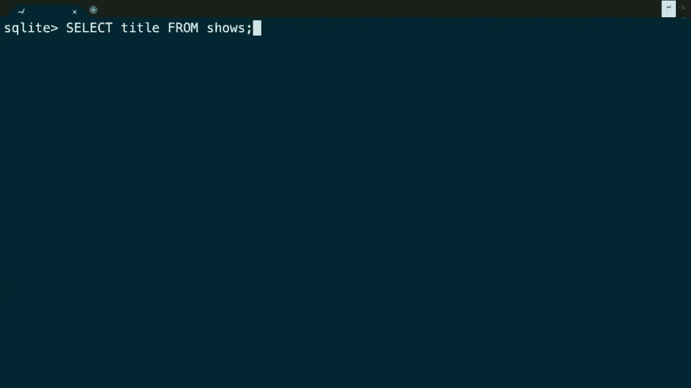

let's say title from shows，semicolon so why am i doing this well。

select command，more columns，then literally the preposition from and。

then the name of the table from which，you want to select that data，column is called。

title it stands to reason that select，title from shows，should give me back the data i want now。

notice a couple of stylistic choices，that aren't strictly required but are，good style。

conventionally i would capitalize any，sql keywords including select and from。

in this case and then lowercase anything，that's a column name，or a table name assuming you created。

those columns and tables，in in fact lowercase there's different。

conventions out there some people will，uppercase some people use something，like。

but generally speaking i would encourage，all caps for sql syntax。

and lowercase for the column and table，enter，values，outputted from the database and if you。

think way back you'll，might recognize that this actually，happens to be the same order。

as before because the csv file was，loaded top to bottom，into this same database table and so。

same data，duplicates and miscapitalizations and，weird spacing。

and all but suppose i want to see all of，the data from the csv，well it turns out you can select。

title，but maybe timest*mp was of interest and，this one admittedly was capitalized，spreadsheet。

that was not something i chose manually，so if i just use a comma separated list。

of column names notice what i can do now，it's a little hard to see for us humans。

because there's a lot going on now，but notice that in double quotes on the。

left there are all of the time st*mps，which represent the time at which you。

all submitted your favorite shows and on，the right of the comma there's another，quoted string。

that is the title of the show that you，liked although sqlite omits the com。

the quotes if it's just a single word，like friends just by convention。

you know in fact if i want to get all of，the columns turns out there's some。

shorthand syntax for that。

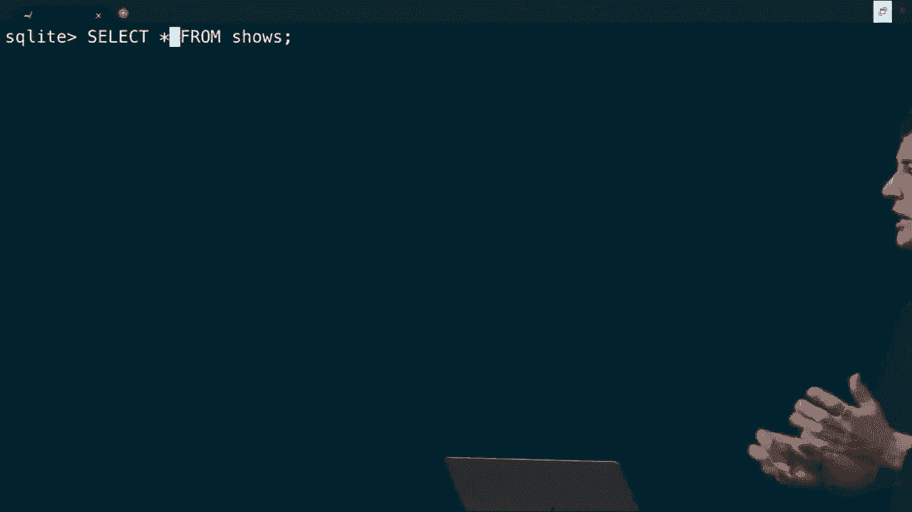

and it will get me，all of the columns from left to right in，my table and voila now i see，genres。

as well so now i effectively have three，columns being outputted，useful。

thus far in fact all i've been doing is，the csv，but sql is powerful because it comes。

with other features right out of the box，somewhat similar in spirit to functions，and excel。

but now we can use them ultimately in，count，distinct lower max min and upper and，bunches more。

these are all functions built into sql，that you can use as part of your query。

to sort of uh alter the data as it's，coming back from the database not，you。

so that it's in a format you actually。

care about so for instance one of my，distinct，the unique titles and we had to write。

all that annoying code，using a set and add things to the set，and then loop over it again right like。

that was not a huge amount of code but，it definitely took us what five ten。

minutes to get the job done at least，in sql you can do all of that in one，this。

select not just title from，shows let me go ah**d and select，distinct。

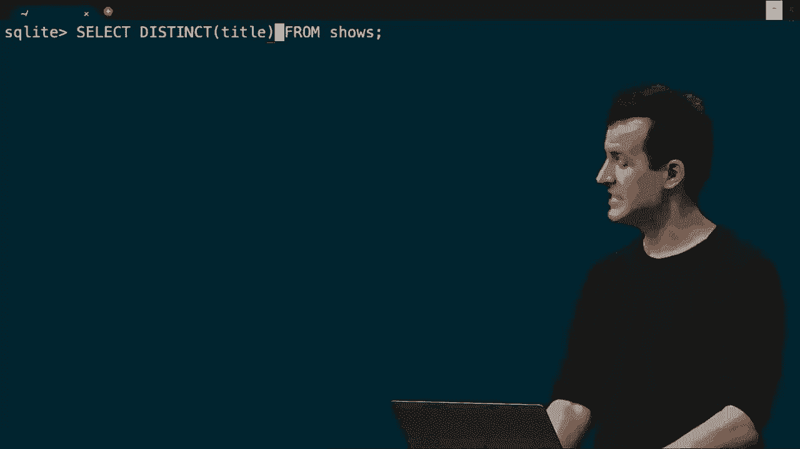

title from shows so distinct again is an，available function in sql。

that does what the name says it's going。

to filter out all of the titles to just，give me the distinct ones back so if i，hit enter now。

you'll see a similarly messy list but，including no idea someone that doesn't，watch tv including。

an unsorted list of those titles so i，think we can probably，start to clean this thing up as we did。

before let me go ah**d and now select，not just distinct but let me go ah**d。

and uppercase everything as well，and i can use upper as another function。

and notice i'm just nesting things like，the output of one function as we've seen，to another。

let me hit enter now and now it's，getting a little，more canonicalized so to speak because。

i'm using capitalization for everything，but it would seem that things still，aren't really。

sorted it's just the same order in which，you inputted them but without，that sql has。

other syntax that we can use to make our，queries more precise and more powerful。

so in addition to these kinds of，functions that you can use to alter the，coming back。

you can also use these kinds of clauses。

or syntax in sql queries，you can say where which is the，equivalent of a condition。

you can say give select all of this data，where something is true or。

false you can say like where you can say，give me data that doesn't isn't exactly。

this but is like this，you can order the data by some column，you can limit the number of。

rows that come back and you can group，identical values together in some way so。

let's see a few examples of this，with uh，how about the office that was the one we，select title。

from shows where title equals，i've added this，title，equals quote unquote the office so sql。

is nice similar in spirit to python，it's more user-friendly perhaps than c。

where everything kinda sort of reads，like an english sentence even though，it's a little more。

precise and it's a little more succinct，let me go ah**d and hit enter。

and voila that's how many of you，inputted the office，but notice it's not everyone is it we're。

missing some still，it seems that i got back only those of，you who typed in literally。

the office capital t capital o so what，if i want to be a little more resilient。

than that well let me get back any，rose where you all typed in office maybe，you omitted the um。

the article the so let me go ah**d and，say not title，equals office but let me go ah**d and。

say where the title is，be office，i want to allow for maybe some stuff at，end。

and even though this seems like a bit of，an inconsistency in the context。

of using like there's another wild card，character the percent sign，the left。

and this percent sign represents zero or，more characters to the right。

so it's kind of this catch-all that will，now find me all，titles that somewhere have o-f-f-i-c-e。

inside of them and it turns out like is，case insensitive so i don't even need to。

worry about capitalization with like，now let me hit enter and voila now i get。

back more answers and you can really see，the messiness now notice up here。

one of you used lowercase you know that，tends to be common when。

typing things in quickly one of you did，it lower case here and then also gave us。

an extra white space at the end，one of you just typed in office one of，space at the end。

and so there's a lot of variation here，and that's why when we forced everything，things。

we were able to get rid of a lot of，those redundancies，well in fact let's go ah**d and and。

order this now so let me go back to，selecting，distinct，upper of title uh。

from shows and let me now order by which，is a new clause，uh the uppercased version of title。

so now notice there's a few things going，on here but i'm just building up more。

complicated queries similar learnings of，scratch where we just started throwing。

more and more puzzle pieces at a problem，i'm selecting all of the distinct，uppercase titles。

from the shows table but i'm going to，order the results this time。

by the uppercase version of title so，everything's going to be uppercase and。

then it's going to be sorted a through z，hit enter now and now things are a。

little easier to make sense of notice，the quotes are there only when。

there are multiple words in a title，us，but notice here's all the the shows and，the。

m's the l's and so forth it's indeed，alphabetized，thanks to using order by all right let。

me pause for just a second because i，know that's a lot all at once，any questions thus far on select。

or on distinct or on upper table names，the where clause the order by clause。

it's a lot quickly but it just generally，expresses the kinds of problems we've，already seen。

anything on your end brian no hands here，all right well let's start to solve more。

similar problems now in sql，bit ago，in python suppose i want to actually，figure out the counts of。

combine，all of the identical shows and figure，out all of the corresponding counts well。

let me go ah**d and try this，let me go ah**d and select again um。

the uppercase version of title but i'm，not going to do distinct this time，differently。

i'm going to select the uppercase，version of title the count。

of those titles so the number of times a，given title appears so count as a new，keyword now，what the。

count is well if you think about this，table as having a lot of。

titles uh title title title title title，it would be nice to kind of group the。

identical titles together，and then actually count，how many such titles we group together，say。

group by upper title this tells sql，to group all of the uppercase titles。

together kind of collapse multiple rows，into one，but keep track of the count of titles，and。

hit enter and you'll see very similar to，wrote，all of the titles on the left followed。

by a comma followed by the count so one，of you really likes tom and jerry one of。

you really likes top，top gear if i scroll up though two of，you really liked the wire。

23 of you here like the office although，we still haven't trimmed。

the issue here so we could still combine，that further by trimming white space if。

we want but now we're getting these，kinds of counts，well how can i go ah**d and order this。

as we did before let me go ah**d here，and add，order by count of，title and then hit semicolon now。

and now notice just as in python，everything is from smallest to largest。

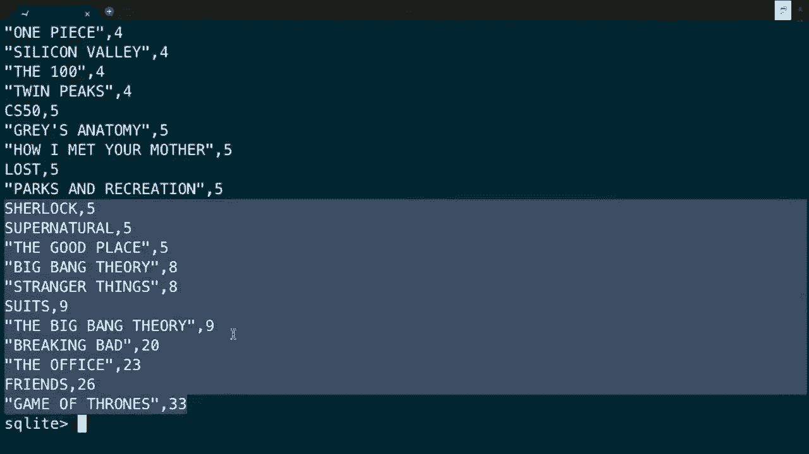

on the bottom，how can i fix this well it turns out if，you can order things in descending order。

d-e-s-c for short instead of asc which，is the default for ascending。

so if i do it in descending order now，i'd have to scroll all the way back up，to the a's the very top。

to see where the lines begin whoops，if i scroll all the way back up to the，begin。

up here and now if i want to，whoops whoops did i do that right，sorry i don't want to uh there we go。

order by count descending，now let me go ah**d and this is just a。

little too unwieldy to see let me just，limit myself to the top 10 and keep it。

simple and only look at the top 10，values here，voila now i have game of thrones at 33。

friends at 26 the office at 23 though i，think i'm still missing a few brian do。

you recall the sequel function for，trimming leading and trailing white，space。

i think it's just trim trim okay i，myself did not remember so when in doubt，fix。

this let me go ah**d and select，uppercase of，going to，it there。

and now enter and voila thank you brian，so now we're up to our。

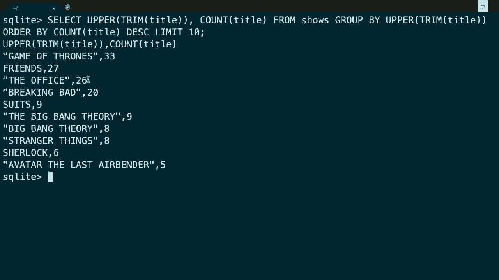

26 offices here so in short，it took us a little while to get to this。

point in the story in sql but notice，what we've done we've taken a program。

that took us a few minutes and certainly，a dozen or more lines of code。

and we've distilled it into something，that yes is a new language。

but it's just kind of a one-liner and，once you get comfortable with a language，like sql especially。

if you're not even a computer scientist，but maybe a data scientist。

or an analyst of some sort who spends a，lot of their day looking at financial。

information or medical information or，really any data set，that can be loaded into rows and columns。

once you start to speak。

and read sql as a human can you start to，express some pretty powerful queries，your answer。

and by using a command line program like。

results there，albeit as very simplistic text but as，mentioned too there's also some，commercial。

that also supports sql where you can，still type these commands and then it。

will show it to you in a more，user-friendly way，much like in windows or mac os would by，default。

so any questions now on the syntax or，capabilities，of select statements，any questions on selects。

seeing anything on your end brian uh one，question came in where is the file with。

this data actually being stored，where is the good question where is the。

file actually being stored so，before quitting i can actually save this。

file as anything i want the file，extension would typically be，db and in fact brian do you mind just。

checking what's the syntax for writing，the file manually with dot something。

i think it's dot save if followed by the，name of the file dot save so i'll call，this shows dot。

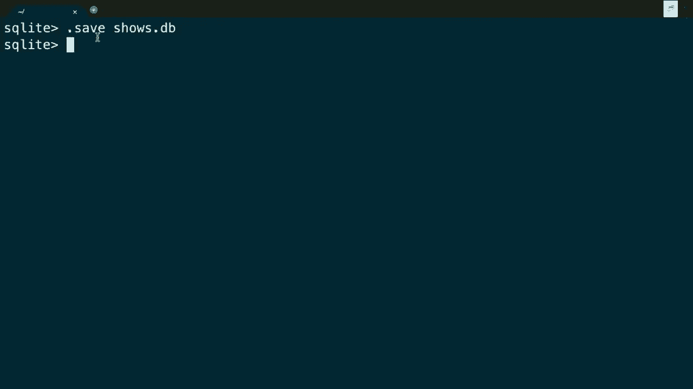

uh db enter and now if i open up another，terminal window just to demonstrate，whoops。

sorry close the whole thing if i now，will go ah**d and open up another，ls。

you'll see that now i have a csv file i，have my python file from before and i，i've created。

that is the binary file that contains，the tables that i the table that i've，loaded dynamically in。

from that csv file，any other questions on select queries or，anything on your end brian yeah a few。

people are asking about what the run，time of this is，yeah really good question what is the。

run time i'm going to come back to that，okay，right now it's admittedly big o of n。

i've not actually done anything better，than we did with our csv。

file or our python code right now it's，still big o of n by default but there's。

going to be a better answer to，that that's going to make it something。

much more logarithmic so let me come，back to that feature，when it's time to enable it but in fact。

let's start to take some steps toward，that because it turns out。

when loading in data we're not always，going to have the luxury of just having，one big file in csv。

format that we import and we go about，our business we're gonna have to decide。

in advance how we wanna store the data，and what data we wanna store。

and what the relationships might be，across not one single table。

but multiple tables so let me go ah**d，and run one other command here that。

actually introduces the first of a，problem let me go ah**d and select，title from shows where。

genres equals for instance comedy that，was one of the genres，and notice that we get back a whole。

bunch of results but i get i bet i'm，missing some，i'm skimming through this pretty quickly。

but i bet i'm missing some，because if i check if genre is equals，comedy what am i omitting。

well those of you who checked multiple，boxes might have said something is a，comedy and a drama。

or comedy and romance or maybe a couple，of other permutations of genres。

if i'm searching for equality here，equals comedy i'm only going to get，those favorites from you。

where you only said my favorite tv show，is a a comedy，comedy，what if we want to do something like。

like comedy instead，and we could say something like well so，long as the word comedy is in there。

then we should get back even more，results and let me stipulate that indeed。

i now have a longer list of results，now we have all shows where you checked，at least the comedy box。

but unfortunately this starts to get a，little sloppy because recall what the，select。

genres from shows semicolon notice that，this table，list，of genres that's just the way google。

purposes，that's kind of fine for sql purposes but，this is kind of messy。

like generally speaking storing comma，separated lists，of values in a sql database。

is not what you should be doing the，whole point of using a sql database。

is to move away from commas and csvs and，to actually store things more cleanly。

because in fact let me propose a problem，for，comedy but maybe also music。

like this thereby allowing me to find，any shows where the word music。

is somewhere in the comma separated list，there's a subtle bug here and you might。

have to think back to where，that you pulled up，i can't show the whole thing here but we，biography。

dot dot music musical，was also there so distinct a music video，versus a musical。

are two different types of genres but，notice my query at the moment。

what's problematic with this at the，whereby，but also，musical and so this is just where things。

are getting messy now yeah you know what，we could kind of clean this up。

maybe we could put a comma here so that，it can't just be，music something it has to be music comma。

but what if music is the last box that，you checked well then it's music。

nothing there is no comma so now i need，to like or things together。

so maybe i have to do something like，we're music like this or or，genres like quote-unquote music。

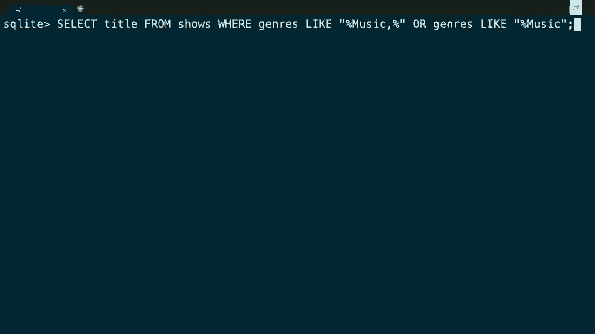

like this but honestly this is just，getting messy like this is poorly。

designed if you're just storing your，inside of a column，and you have to resort to this kind of。

hack to figure out well maybe it's over，here or here or here and thinking about。

all the permutations of syntax，you're doing it wrong you're not using a。

sql database to its fullest potential，so how do we go about designing this。

thing better and actually load this csv，short，how do we get rid of the stupid commas，in the genres。

column and instead put one word，those cells，so to speak not two not three one only，genres。

well let me introduce a few building，blocks that'll get us there。

it turns out in sql that when you want，to，create your own tables we can um sorry。

it turns out when creating your own，on your own，we're going to need more than just，reading。

but if we're going to do this better and，not just use sqlite 3's。

built-in dot import command but instead，we're going to write some code，tables。

one for the titles one for the genres，we're going to need a little more，expressiveness。

when it comes to sql，and so for that we're going to need one。

the ability to create our own tables and，we've seen a glimpse of this before but。

we're also going to need to see another，piece of syntax as well，so inserting inserting is another。

command that you can，actually，add data to a database which is great，because if i want to。

ultimately iterate over that same csv，but this time manually add all of the，rows to the database。

myself well then i'm going to need some，is，table，the column or columns that you want to。

insert values into，then literally the word values and then，literally in parentheses again。

the actual list of values so it's a，generic form。

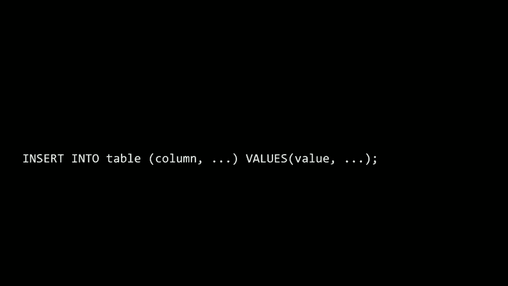

just，a moment here as well so when it comes，to inserting something into a database。

let's go ah**d and try this so，a show，that uh the muppet show like i grew up，like the 70s。

and i don't think it was on the list but，i can check this for sure so，select star from shows where。

uh title like let's just search for，muppets with a wild card，and i'm guessing no one put it there。

good so it's a missed opportunity i，forgot to fill out the form。

i could go back and fill out the form，and re-import the csv but let's go ah**d，and，insert into shows。

what columns title and genres，for kicks，and then i'm going to insert what values，whatever。

time it is now so i'm going to cheat，and the time，the title will be like the muppet show。

and the genres will be it was kind of a，kind of。

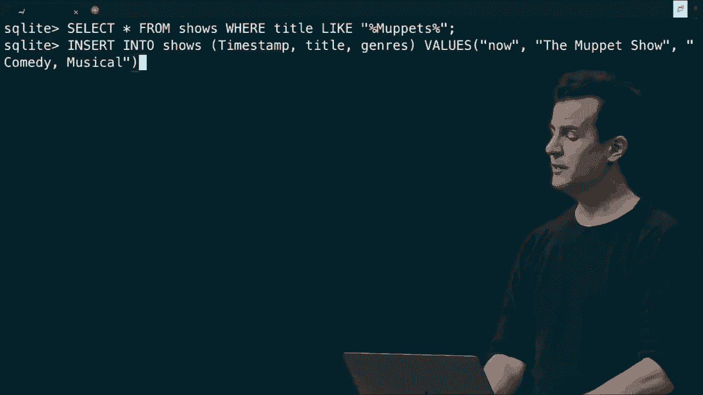

leave it at that semicolon so again this，follows the standard syntax here。

of specifying the table you want to，insert into the columns you want to，insert into。

and the values you want to put into。

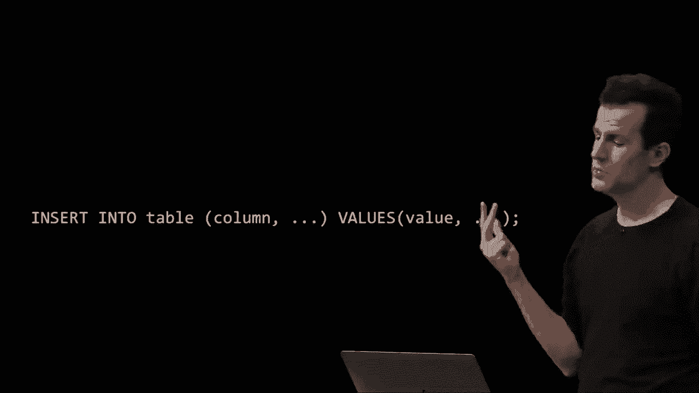

those columns and i'm going to go ah**d，and hit enter now，nothing seems to have happened but if i。

now select，oh okay it's still nothing because i，made a subtle mistake。

uh not i'm not searching for muppets，plural i'm searching for muppet，see my。

row in this database and so insert would，give us the ability now to insert new。

rows into the database suppose you want，to update something maybe you know。

some of the muppet shows were actually，pretty dramatic so how might we do that。

well i can say update shows set，let's see genres equal to comedy，drama musical where。

title equals the muppet show，so again i'll pull up the canonical。

syntax for this in a bit but for now，just a little teaser，you can update things pretty simply and。

even though it takes a little getting，used to the syntax，it kind of does what it says update。

shows set genres，equal to this where title equals that，and now i can go ah**d and enter if i go。

ahead and select the same thing just，like in a terminal window you can go up，quickly。

i'm just going up and down to previous，commands voila now i see that the muppet。

show is a comedy a drama，drama and a musical well i i take，issue though with one of the more。

popular shows that was in the list a，whole bunch of you liked um，let's say friends which i've never。

really been a fan of and let me go ah**d，and select，a title from shows where。

title equals friends and maybe i should，be a little more rigorous than that i，should say title。

like friends just in case there was，different capitalizations enter。

a lot of you really liked friends in，fact how many of you well recall that i。

can do this i can say count，and i can let sequel do the count for me。

26 of you i disagree with strongly and，there's a couple of you that even added，later。

so suppose i do take issue with this，well delete from，shows where title equals quote unquote。

friends uh actually title like friends，let's get them all。

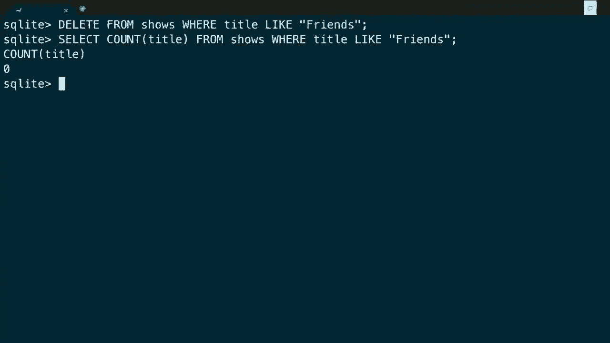

enter and now if we select this again，i'm sorry friends has been cancelled so，you can again。

update the you can execute these，fundamental commands of crud create read，update and delete，select。

by using update literally and delete，literally as well，and that's about it like even though。

this was a lot quickly there really are，just those four fundamental operations。

in sql plus some of these add-on，features like these additional functions。

like count that you can use and also，the like，well let me propose that we now do，data。

and create tables and insert data let's，go ah**d and write our own。

python script that uses sql，as in a loop to read over my csv file。

and to insert insert insert insert each，of the rows manually because honestly it。

will take me forever to like manually，type out like hundreds of sql queries to。

import all of your rows into a new，does this instead，and i'm going to propose that we design。

it in the following way，i'm going to have two tables this time。

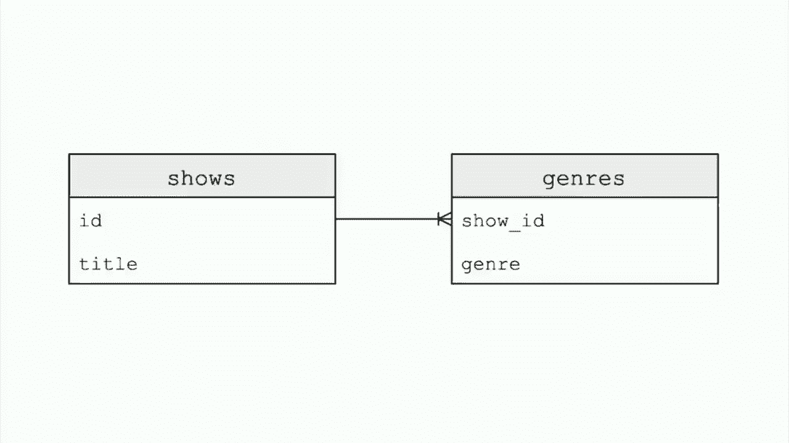

rendition，one is going to be called shows one is，going to be called genres。

and this is a fundamental principle，of designing relational databases to。

figure out the relationships，among data and to normalize，your data to normalize your data means。

to eliminate redundancies，to normalize your data means to，eliminate mentions of the same words，*****。

*****，mean by that，i'm going to propose that we instead，create a simpler table called。

shows that has just two columns one is，going to be called id，which is new the other is going to be。

called title as before honestly i don't，care about timest*mps so we're just。

going to throw that value away which is，another upside of writing our own，want。

for id i'm introducing this which is，going to be a unique identifier，literally a simple integer one。

two three all the way up to a billion or，have，i'm just going to let this auto，increment as we go why。

i propose that we move to another table。

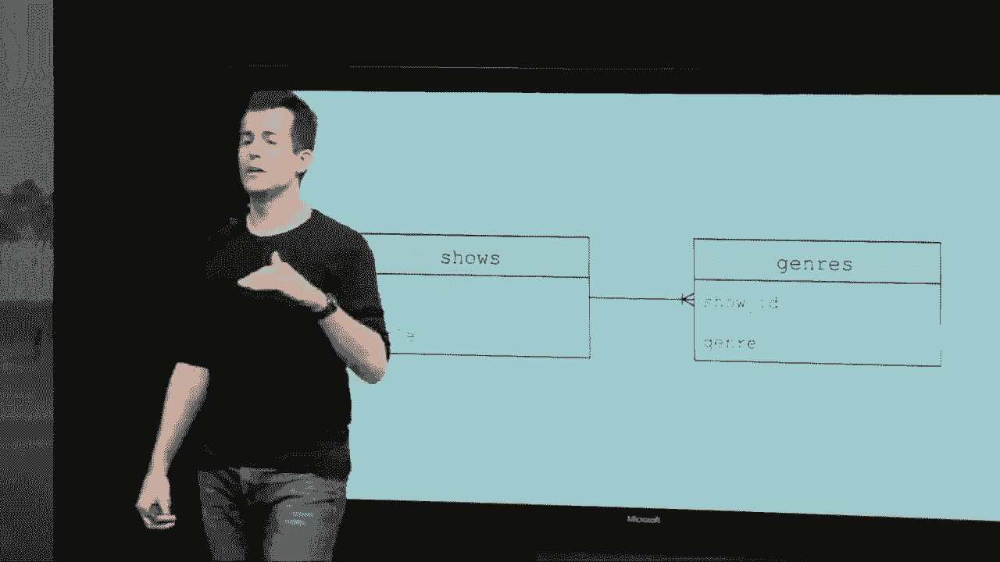

having，one or two or three or five genres in，list，which is stupid only in the sense that。

it's just messy right it means that i，have to run stupid commands where i'm。

checking for the comma here the comma，there it's very hackish，that。

i'm going to create another table that，also has two columns，one is going to be called show id and。

the other is going to be called，genre and genre here is just going to be，a single word now。

that column will contain single words，for genres like，comedy or music or musical but，genres。

with the original show to which they，belong per your google form submissions。

by using this show id here so what does，this mean in particular。

by adding to our first table shows this，five six，i can now refer to that same show。

in a very efficient way using a very，simple number instead of redundantly。

having the office the office the office，just one，canonical number which is only going to。

be like four bytes or 32 bits，pretty efficient but i can still。

associate that show with，one genre or two or three or more or，even none，table。

is going to become one or more rows，in our new pair of tables we're，factoring out the genres。

so that we can add multiple rows，for every show potentially but still，remap those。

genres back to the original show itself，so what is some of the the buzzwords。

here or what's some of the the language，what kinds of，types are at our disposal here so for。

that let me propose this，here，it turns out in sql lite there are five。

main data types and that's a bit of an，data types，some of which look familiar a couple of。

which are a little weird um。

integer is a thing uh real，is the same thing as float so an integer。

might be a 32 bit or four byte value，negative，a real number is going to have a decimal。

point in it a floating point value，probably 32 bits by default but those。

kinds of things the sizes of these types，vary by system just like they。

technically did in c so do they vary by，system in the world of sql but generally。

speaking these are good rules of thumb，text is just that it's sort of the。

equivalent of a string of some length，but then in sql light it turns out。

there's two other data types we've not，seen before numeric and blob。

but more on those in just a little bit，can store，zeros and ones in your database numeric。

is going to be something that's，number like but isn't a number per se，it's like a year or a time。

something that has numbers but isn't，just a simple integer，at that and then we propose two that sql。

light is going to allow us to specify，manually，by executing the sql code ourselves we。

can specify that a column，cannot be null thus far we've ignored，this but some of you might have。

taken the fifth and just not given us，the title of a show or a genre。

your answers might be blank some of you，may be in registering for a website。

don't want to provide information like，where you live or your phone number so a。

to support，null values but you might want to say，that it can't be null a website probably。

needs your email address needs your，password and a few other fields but not。

everything and there's another keyword，in sql just so you've seen it。

called unique where you can additionally，column，also use that，if you want to make sure that the same。

email address can't register for your，website multiple times，you just specify that the email column。

multiple people，long story short，this is just more of the tools in our。

sql toolkit because we'll see some of，these now indirectly，and the last piece of jargon we need。

before designing our own tables，sql，there's this notion of primary keys and。

foreign keys and we've not seen this in，spreadsheets，odds are unless you've been working in。

the real world for some years and you。

have fairly fancy spreadsheets in front，and the like，odds are you've not seen keys or unique。

identifiers in quite the same way。

but they're relatively simple in fact，let me go back to，our picture before and propose that。

when you have two tables like this and，you want to use a simple integer to，uniquely identify。

that's called，technically an id that's what i'll call，it by convention you could call it。

anything you want but id just means it's，a unique identifier，but semantically this id is what's。

called a primary key，a primary key is the column in a table，that uniquely identifies every row。

this means you can have multiple，versions of the office in that。

title field but each of those rows is，going to have its own number uniquely。

potentially so primary key uniquely，like，genres which i'm proposing we create in，just a moment，refer。

back to another table by way of that，unique identifier，called。

a foreign key so even though i've called，it show id，here that's just a convention in a lot。

of sql databases to imply that，this is technically a column called id，in a table。

called show or shows plural in this case，so if there's a number one here and，suppose that。

the office has a unique id of one，we would have a row in this table called，id is one，in。

the comedy category the drama category，ones，output，three rows the number one one one，comedy。

respectively，so again the goal here is to just design，our database better。

not have these stupid comma separated，list of values，inside of a single column we want to。

kind of blow that up explode it，into individual rows you might think，columns。

but again per our principle from，spreadsheets you should not be in the，habit of adding more and more。

columns when the data is all the same，like genre genre genre right the sort of。

stupid way to do this in the spreadsheet，genre one，another column called genre two another。

column called genre three，genre four and you can imagine just how，stupid and inefficient this is。

a lot of those columns are going to be，empty for shows with very few。

genres and it's just kind of messy at，that point so better，in the world of relational databases to。

have something like a second table，where you have multiple rows that，somehow link back to。

that primary key by way of what we're，calling conceptually，a foreign key all right so let's go。

ahead now and try to write this code let，me go back to my ide，let me quit out of sql lite now。

and let me just move away i'm going to，move this away，my file for just a moment so that we're。

only left with our original data，let's go about implementing a final，version of my python file。

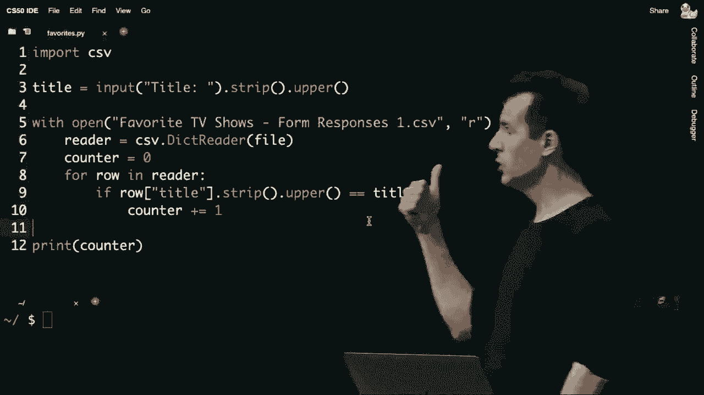

called，shows one called genres and then two，in a for loop iterates over that csv and。

inserts some data into the shows and，other data into the genres how can we do，this programmatically。

well there's a final piece of the puzzle，that we need we need some way of。

bridging the world of python and sql，and here we do need a library because it。

would just be way too painful to do，without a library，it can be cs50 cs50s as we'll see makes。

this very simple，there are other third-party commercial，and open source libraries that you can。

also use in the real world as well，that do the same thing but the syntax is，a little less friendly。

so we'll start by using the cs50 library，which in python recall has functions。

like getstring and getint and getfloat，out。

for sql capabilities as well so i'm，going to go back to my favorites file。

and i'm going to import not only csv but，i'm also going to import，from the cs50 library a feature。

you will，inside of the cs50 library or rather a，called，sql that if i call it will allow me to。

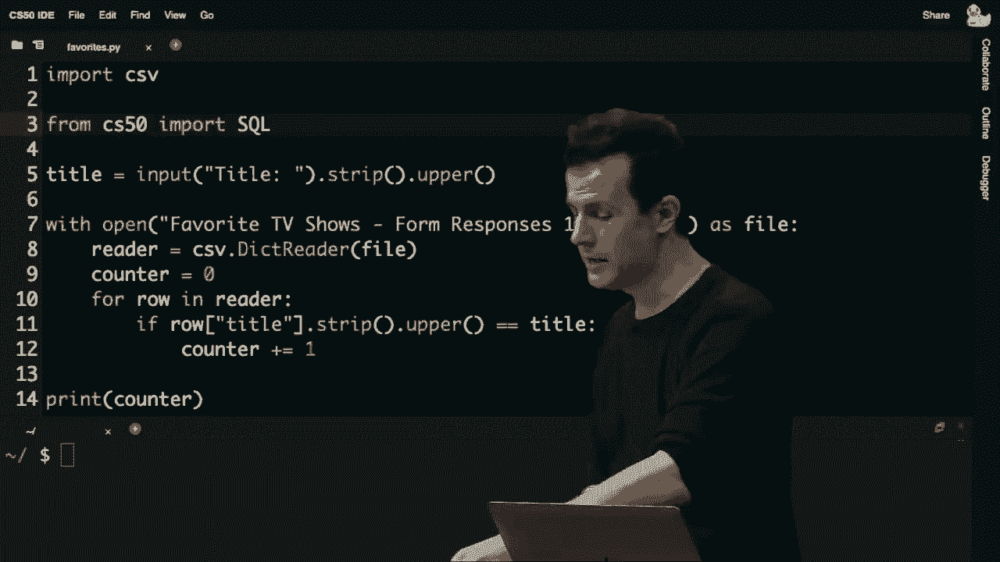

load a sql lite，database into memory so how do i do this，well let me go ah**d and add a couple of。

new lines of code，let me go ah**d and um open up，a file called shows。db。

but this time in write mode and then，just for kick just for now rather i'm，away。

this is a a pythonic way of creating an，empty file it's kind of stupid looking。

but by opening a file called shows。db in，write mode and then immediately closing，file。

closing the file so i now have an empty，file with which to interact。

i could also do this as an aside by，doing this touch，shows。db touch kind of a strange command。

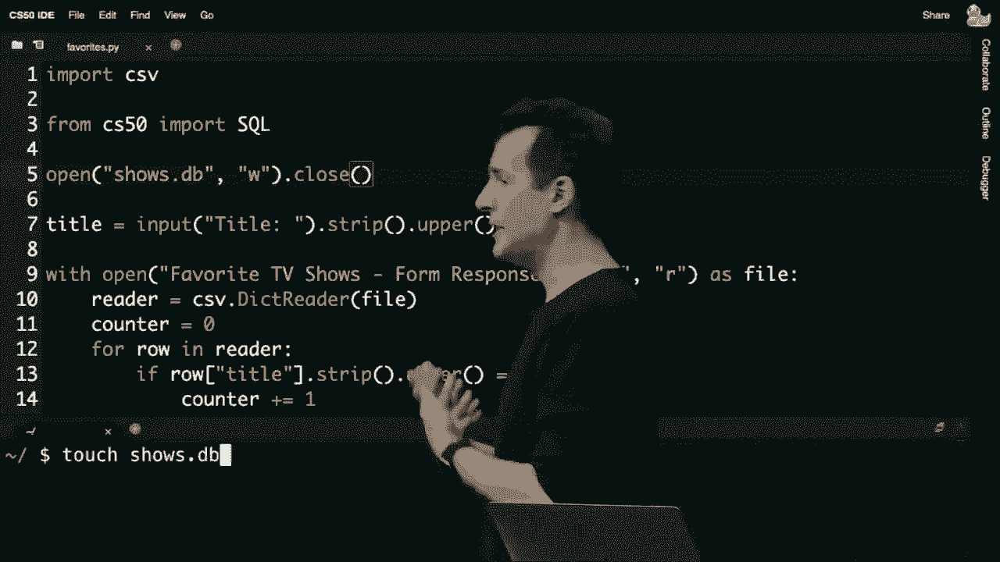

but in a terminal window it means to，create a file，if it doesn't exist so we could also do。

that instead but that would be on，uh that would be independent of python。

so once i've created this file，a，sqlite database i'm going to declare a。

variable called db for database，i'm going to use the sql function from，cs50s library。

and i'm going to open via somewhat，cryptic string this，sqlite colon slash slash，shows。

db now it looks like a url，http colon slash but it's sql lite，instead and there's three。

uh slashes instead of the usual two but。

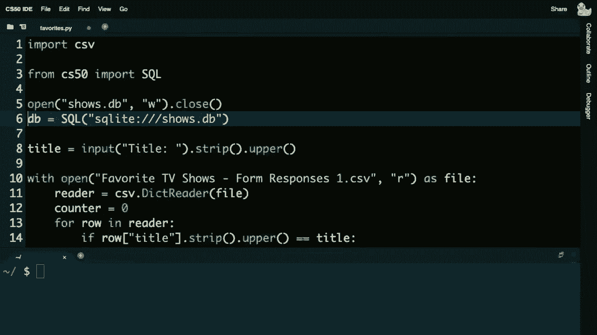

result of，with nothing，in it yet as being a sqlite database，using cs50s library why did i do that。

well i did that because i now want to，create my first table，let me go ah**d and execute db。execute。

so there's a function called，execute inside of the cs50 sql library。

and i'm going to go ah**d and run this，create table，called shows the type of which。

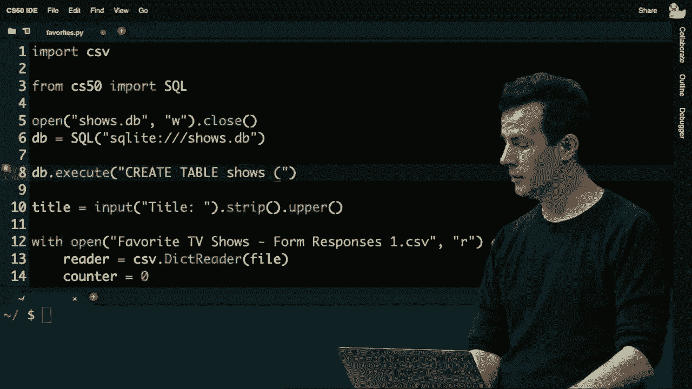

the columns of which are an id which is，going to be an integer，a title which is going to be text the。

primary key，in which is going to be the id column，so this is a bit cryptic but let's see。

what's happening，i seem to now in line 8 be combining，python with sql and this is where now。

like programming gets really，powerful fancy cool difficult whatever，however you want to perceive it。

i can actually use one language inside，of another how well，sql is just a bunch of textual commands。

up until now i've been typing them out，light 3。there's nothing stopping me though from，strings。

and then passing them to a database，using code，the code i'm using is a function called。

execute and its purpose in life and cs50，staff wrote this，is to pass the argument。

from your python code into the database，for execution so it's like the。

programmatic way of just typing things，manually at the sql lite prompt a few，minutes ago。

so that's going to go ah**d and create，my table called shows in which i'm going。

to store all of those unique ids，and also the titles and then let me do，this again db。execute。

create table genres and that's going to，have a column called show id。

which is an integer also genre which is，text and lastly it's going to have a。

foreign key it's going to wrap onto two，it's going to wrap a little long here on，show id。

which references the shows table id，all right so this is a lot so let's just，recap left to right。

db execute is my python function that，executes any sql i want，create table genres creates a table。

called genres the columns，in that table will be something called，show id which is an integer。

and genre which is a text field but it's，going to be one genre at a time。

not multiple and then here i'm，specifying a foreign，key will be the show id column。

which happens to refer back to the shows，tables，brian over to you uh never mind no okay。

did i just fix the bug，yes okay brian's very good at secretly，it first so。

well i knew that something was wrong all，right so it's a little cryptic。

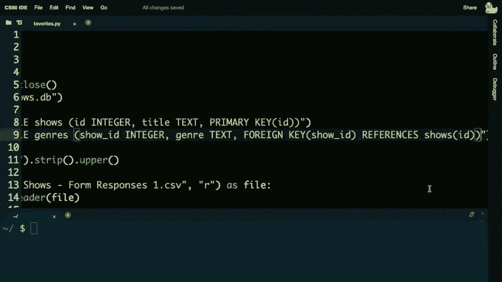

but all this is doing is implementing，here，i could have manually typed both of。

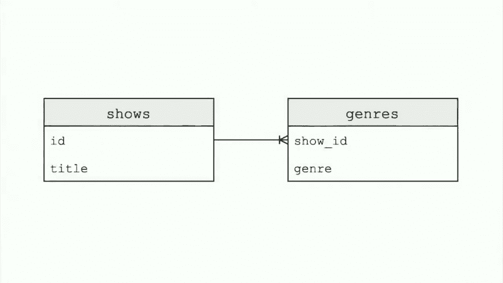

these sql commands，at that blinking prompt but again no i，want to write a program now in python。

that creates the tables for me and now，more interestingly loads the data into。

that that database so let's go ah**d and，do this now i'm not going to select a。

title from the user because i want to，import everything，i'm not going to use any counting or。

anything like that so let's go ah**d and，just go inside of my loop as before。

and this time let's go ah**d and for，row in reader let's go ah**d and get the。

current title as we've always done，but let's also as always go ah**d and，strip it of white space。

and capitalize it just to canonicalize，execute db，execute quote unquote insert into。

shows the title column the value，of quote-unquote uh，title so i want to put the title here it。

turns out that，sql libraries like ours supports one a，placeholder。

in c we used percent s in python we just，there，in sql we have a third approach to the，different but。

conceptually the same you put a question，mark where you want to put a placeholder。

and then outside of this string i'm，going to actually type in。

the value that i want to plug into that，question mark so this is so similar to，printf in week one。

mark now，and then a comma separated list of the，arguments you want to plug in for those，placeholders。

so now this line of code 16 has just，inserted，all of those values into my database and。

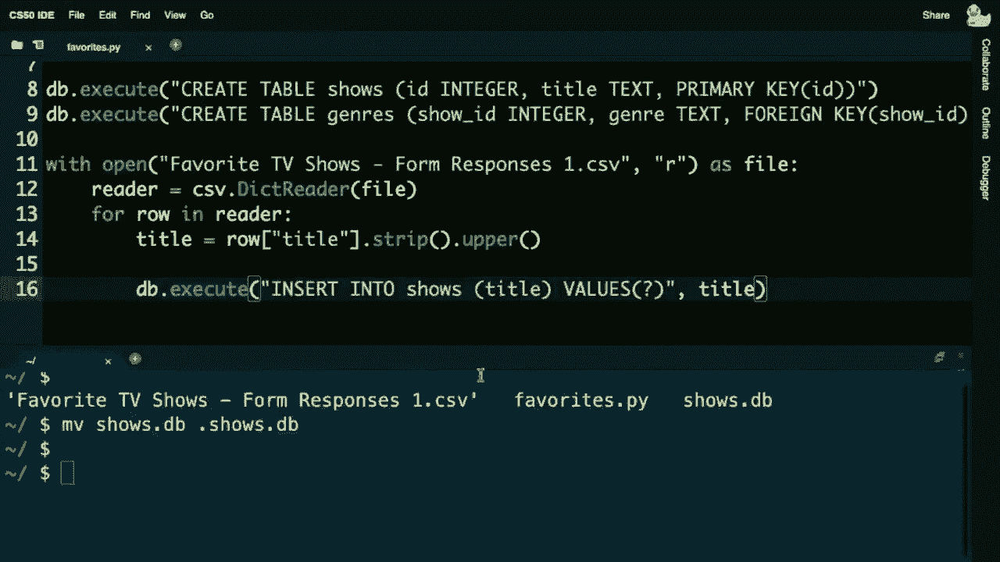

any further，let me go ah**d and do this i'm going to，go ah**d now and run python。

a favorite stop pi and cross my fingers，as always，it's taking a moment taking a moment。

that's because there's a decent，sized file there or i screwed up。

take this is taking too long what did i，do wrong，okay this is inexplicably taking too。

it's getting bigger and bigger for some，oh okay i should have just been more，patient all right。

so it just seems my connection's a，little slow so，uh as i expected everything is 100。

correct and it's working fine so now，did，if i type ls notice that i have a file，called shows。db。

this is brand new because my python，program created it this time，let's go ah**d and run sqlite3 of。

inside of it，notice that i can do。schema just to see，tables，exist。

but notice that there's if i do select，star from shows let's see all the data。

voila there is a table that's been，programmatically created，and it has noticed this time no time。

st*mps no genres，title，ids。

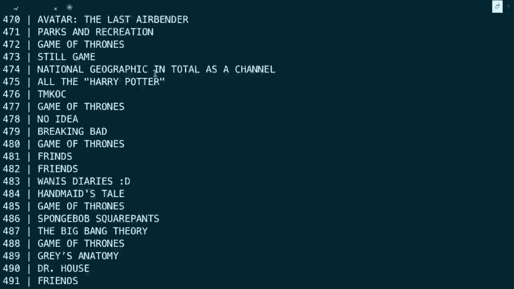

are monotonically increasing from 1 on，up to 513 in this case why is that。

well one of the features you get in a，sql database is if you define a column。

as being a primary key in sql lite，it's going to be auto incremented for。

you recall that nowhere in my code，did i even have a line an integer。

inputting one then two then three i，could absolutely do that，i could have done something like this。

counter rather，i could have done something like this，counter equals one。

and then down here i could have said id，comma title，give myself two placeholders and then。

pass in the counter each time，i could have implemented this myself and。

then on each iteration done counter plus，equals one，but with sql databases as we've seen you。

get a lot more functionality built in，i don't have to do any of that because。

if i've declared that id as being a，primary key。

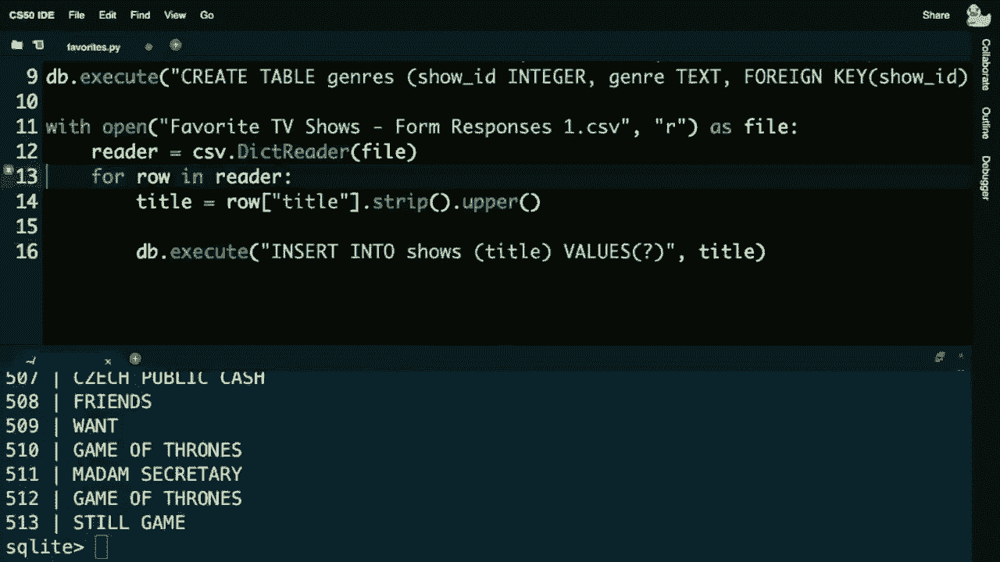

sqlite is going to insert it for me and，right，so if i go back to sql lite though。

notice that i do have ids and titles but，if i select star，there yet。

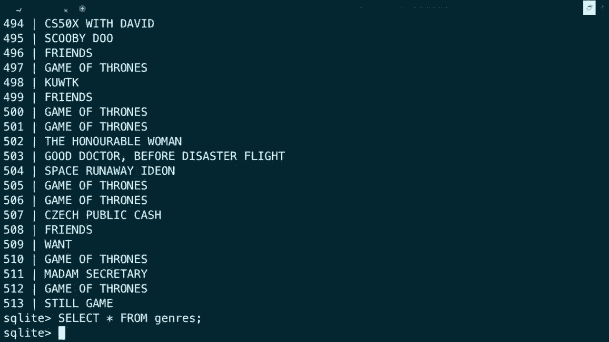

so how now do i get all of the genres，for each of these shows in i need to，finish my script。

only the title，in my current row but i also have genres，in the current row。

but the genres are separated by commas，recall that in the csv，next to every title there's a comma。

separated list of titles so how do，genres how do i get at each genre，say for，genre in row bracket。

genres but this is not going to work，because that's not，going to be split up based on those。

iterate over，in fact all of the characters in that，string as we saw last week。

but it turns out that strings in python，have a fancy split function。

whereby i can split on a comma followed，by a space，and what this function will do for me in，genres。

and explode it so to speak split it on，every comma space into a python list。

containing genre after genre，in an actual python list allah squ*re，brackets so now i can。

iterate over that list of individual，genres and inside of here。

i can do db execute insert into genres，show id genre the values，question mark question mark but。

huh there's a problem i can definitely，plug in the current，something。

here still for that first question mark，i need a value for the show id how do i，know what the id。

is of the current tv show well it turns，out the library can help you with。

this when you insert new rows into，a table that has a primary key it turns。

out that most libraries will return you，that value in some way，and if i go back to line 15 and i。

actually store the return，value of db execute after using insert。

my the library will tell me what was the，integer that was just used for this。

given show maybe it's one two three，i don't have to know or care as the。

programmer but the return value i can，store in a variable，and then down here i can literally put。

that same id，so that now if i am inputting the office，whose id is one。

into the shows table and its genres are，comedy drama romance，i can now inside of this for loop this。

nested for loop，insert one followed by comedy，romance，three rows all at once and so now let's。

go back down here，uh into my terminal window let me remove，the old shows。db。

with rm just to start fresh let me go，ahead and rerun，uh python of favorites。pi i'll be more。

patient this time because，cloud's being a little slow so it's。

doing some thinking and in fact there's，more work being done now。

at this point in the story my program is，rows，in the csv and it's inserting into，it's inserting。

one or more genres into，the genres table and，that，do its thing there let me let it。

do its thing there let me let it do its，thing there，it's a little slow if we're on a faster。

system or if i were doing it on my own，mac or pc it would probably go。

down more quickly but you can see here，an example of why i used the dot import。

command in the first place，that automated some of this process but，change。

the format of my data but the key point，to make here，is that even though this is taking a。

little bit of time to insert these，hundreds of rows all at once。

i'm only going to have to do this once，and was asked a minute a bit ago。

was the performance of this it turns out，that now that we have full control。

over the sql database it turns out we're，going to have the ability to。

to actually um improve the performance，thereof and i really don't want to keep。

stalling here i really just want this，thing to finish i should have used a，take。

nearly as long on some other systems，but let me just stall for a few more，seconds。

stalling stalling stalling stalling，well let me suspend our，suspense for just a moment and use the。

time wisely let me switch over，oh okay as expected it finished right on。

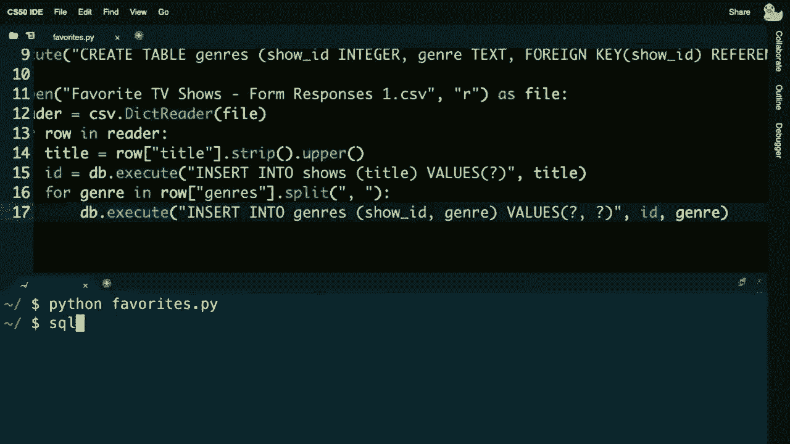

light 3，on shows。db alright so now i'm back in，my raw sql environment，did before。

we'll see all of this as before if i，select star from shows where。

title equals quote-unquote the office，i'll see the actual，uh unique ids of all of those we didn't。

bother eliminating duplicates we just，kept everything as，is but we gave everything a unique id。

but if i now do select star，from genres，we'll see all of the values there and，notice the key detail。

there is only one genre per row here，and so we can ultimately line those up，had，um something's wrong。

let me think for a while i want to get。

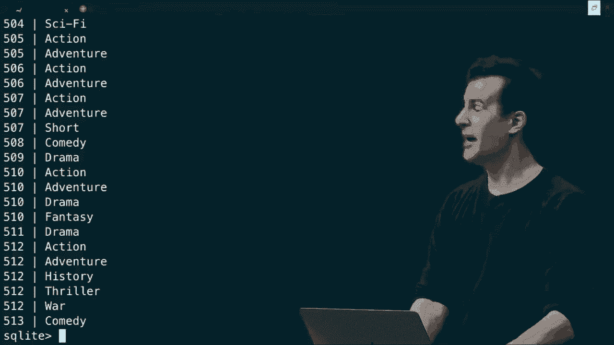

this right let's go ah**d and take our，second and final five minute break here。

and we'll come back and i will explain。

all right we are back and just before we，broke up my own self-doubt was starting。

to creep in but i'm happy to say，with no fancy magic behind the scenes。

everything was actually working fine i，this，get back，two columns one with the unique id the。

so-called primary key followed by the，similarly，search for star from genres i get single。

genres at a time，but on the left hand side are not，primary uh keys per se。

but now those same numbers here in this，context called foreign keys，that map one to the other so for。

instance whatever，show 512 is had five different，genres associated with it and in fact if。

i don't go back a moment to shows，it looks like game of thrones was，decided by one of you，adventure。

action and war as well，those five so now this is what's meant，by relational database you have this。

relation or relationship，across multiple tables that link some，data in one。

to some other data in the like the catch，though is that it would seem a little，harder now to answer。

questions because now i have to kind of，query two tables or，execute two separate queries and then。

the case，suppose that i want to answer the，question of what are all of the musicals。

among your favorite tv shows，i can't select just the shows because。

there's no genres in there anymore but i，because there's no，titles in there but there is a value。

that's bridging，one in the other that foreign key to，primary key relationship。

so you know what i can do off the top of，my head i'm pretty sure i can select all，of the show ids。

from the genres table where a specific，genre equals quote unquote musical。

and i don't have to worry about commas，version，that i have designed programmatically。

with code musical and every other genre，is just a single word，if i hit enter all of these show ids。

were decided by you all as belonging to，musicals but now this is not interesting。

and i certainly don't want to execute 10，or so queries manually。

to look up every one of those ids but，notice what we can do in sql as well。

i can nest queries let me put this whole，query in parentheses for just a moment。

and then prepend to it the following，select title，from shows where the primary key。

id is in this sub query，so you can have nested queries similar。

in spirit a bit like in python and see，when you have nested for loops。

in this case just like in grade school，math whatever's in the parentheses will，be executed first。

using，the results of that inner query so if i，is in，that list of ids voila it seems that。

somewhat amusingly uh several of you，think that breaking bad，supernatural glee sherlock how i met。

the lawyer，and my brother my brother and me are all，musicals i。

take exception to a few of those but so，those shows，so even though we've sort of uh done。

things we've designed things better in，the sense that we've normalized our。

database by factoring out commonalities，or rather we've cleaned up the data。

they're still admittedly some redundancy，but i，at least now have the data in。

clean fashion so that every column has，just a single value in it and not some。

contrived comma separated list suppose i，want to find out all of the genres that，let's。

ask kind of the opposite question well，the office，i'm going to first need to select the id。

from shows，where title equals quote unquote the，office because a whole bunch of you。

uh typed in the office and we gave each，of your answers a unique identifier so。

we could keep track of it and there's，all of those numbers now this is like。

dozens of responses i certainly don't，want to execute that many queries。

but i think a sub query will help us out，again let me put parentheses around this，whole thing。

and now let me say select distinct genre，from genres where the show。

id in the genres table is in that query，and just for kicks let me go ah**d and，order by uh。

genre so let me go ah**d and execute，this and okay somewhat amusingly。

those of you who inputted the office，checked boxes for animation。

comedy documentary drama family horror。

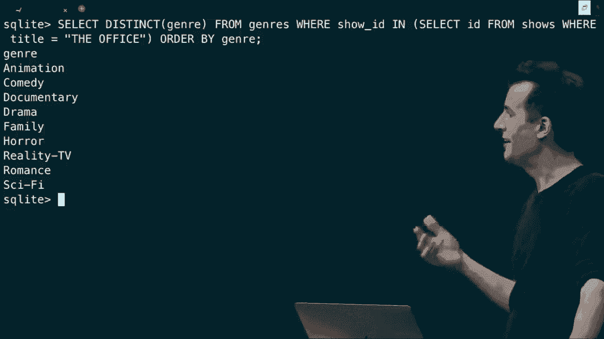

reality tv romance and sci-fi i take a，section exception to a few of those too，user，sql。

language the ability to express fairly，succinctly even though it's a lot of new。

features today all at once what would，otherwise take me a dozen or two lines，in python code。

to implement and god knows how many，lines of code and how many hours it，like this。

in c now admittedly we could do better，than this design，this table or this picture represents。

what we have now，but you'll notice a lot of redundancy，implicit in the genres table。

anytime you check the comedy box i have，a row now that says comedy comedy comedy。

comedy and the show id differs，but i have the word comedy again and，again and now。

that tends to be frowned upon in the，you have a，genre called called comedy or one called。

musical or anything else，you should ideally just have that living。

in one place and so if we really wanted，to be particular，and really truly normalize this database。

which is an academic term referring to，removing all such redundancies。

we could actually do it like this we，could have a shows table still with an。

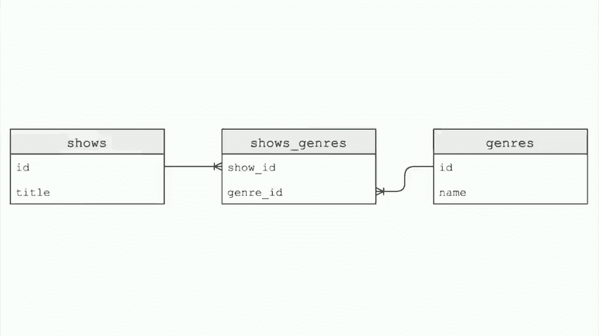

id and title，no difference there but we could have a，genres table。

with two columns id and name now this is，its own id it has no connection with the。

show id it's just its own unique，identifier a primary key here now。

and the name of that genre so you would，have one row in the genres table for。

comedy for drama music musical and，everything else，and then you would use a third table。

which is colloquially called a，join table which i'll draw here in the，want but we've drawn。

called it shows underscore genres to，make clear that this table implements a。

relationship between those two，tables and notice that in this table is。

really no juicy data it's just，foreign keys show id genre id，and by having this third table we can。

now make sure that the word comedy，only appears in one row anywhere the。

word musical only appears in one row，anywhere but we use these more efficient。

integers called show id and genre id，which respectively point to those，primary keys，two together。

and this is an example of what's called，in the world of databases a many-to-many，relationship。

one show can have many genres one，genre can belong to many shows and so by。

having this third table you can have，that many-to-many relationship。

and again the third table now allows us，to truly normalize our data set。

by getting rid of all of the duplicate，comedy comedy comedy，why is this important probably not a。

huge deal for genres，but imagine with my current design if i，misnamed。

comedy i would now have to change every，row with the word comedy again and again。

or if maybe you change the cat the，genres of the shows，you have to change it in multiple places。

tables，you can argue that now you only have to，change the name of a genre。

in one place not all over the place and，that in general in c，and now in python and now sql has。

generally been a good thing，not to copy-paste identical values all，said。

what other tools do we have at our，disposal well it turns out，that there are other data types out。

there in the real world using sql，besides just these five blob integer，binary stuff。

generally not used except for more，specialized applications let's say。

integer which is an int typically 32，bits numeric which is something like a，date or a year or。

time or something like that real numbers，which are floating point values and text。

graduate，ultimately from sql lite on phones and，on macs and pcs to actual。

servers that run oracle mysql and，own，out that uh，databases，come with other subtypes if you will so。

besides integer you can specify，small int for small numbers maybe using，just a few bits instead of。

32 integer itself or bigint which uses，sixty-four bits instead of 32。

the facebooks the twitters of the world，need to use big ants a lot because they，have so much data。

you and i can get away with simple，integers because we're not going to have。

more than 4 billion favorite tv shows in，a class certainly something like real。

you can have 32-bit real numbers or a，little weirdly named，double precision which is like a double。

precision，numeric is kind of this catch-all you，can have not only dates and date times。

but things like boolean values，you can specify the total number of。

digits to store using this numeric scale，and precision，so it relates to numbers that aren't。

just quite integers，and then you also have categories of，text char followed by a number。

which specifies that every value in the，characters，that's helpful for things where you know。

the length in advance like in the us，all states all 50 states have two digit。

code or two character codes，like m a for massachusetts ca for，california。

char two would be appropriate there，because you know every value in the。

column is going to have two characters，when you don't know though you can use。

varchar and varchar specifies a maximum，number of characters and so you might。

specify varchar of like，32 no one might be able to type in a。

name that's longer than 32 characters or，varchar 200 if you want to allow for，something even bigger。

but this is germaine to our real world，experience with the web if you've ever，gone to a website。

start filling out a form and all of a，sudden you can't type any more。

characters your response is too long，why is that well one the programmers。

just might not want you to keep，expressing yourself in more detail。

especially if it's like a complaint form，on a customer service site。

but pragmatically it's probably because，their database，was designed to store a finite number of。

threshold，and you certainly don't want to have a，buffer overflow like in c。

so the database won't force a maximum，value n and then text is for even bigger。

chunks of text if you're letting people，documents，or even larger sets of text you might。

use text instead，set，things get really interesting and all of，these very academic。

ideas and recommendations really come，favorites，but when we have uh thousands instead。

and so what i'm going to go ah**d and do，here is download a file here。

give me just a moment to grab it from，the course's website，i'm going to go ah**d and download a。

file from today which is a，sql lite version of the imdb，internet movie database that some of you。

might have used in website form in order，to look up movies and ratings thereof。

and the like and what we've done in，advance is we wrote a script。

i wrote a script that downloaded all of，that information in advance。

as tsv files it turns out that they，available，all of their data available as uh tsv。

files tab separated values，script，called shows。db，as follows so i'm going to go ah**d in。

just a moment and open up shows。db which，is not the version i created earlier。

based on your favorites，this is now the version that we the，staff created in advance。

by downloading hundreds of thousands of。

movies and tv shows and，actors and directors from imdb。com under，their license。

and then imported into a sqlite database，so how can i see what's in here well let。

me go ah**d and type dot schema recall。

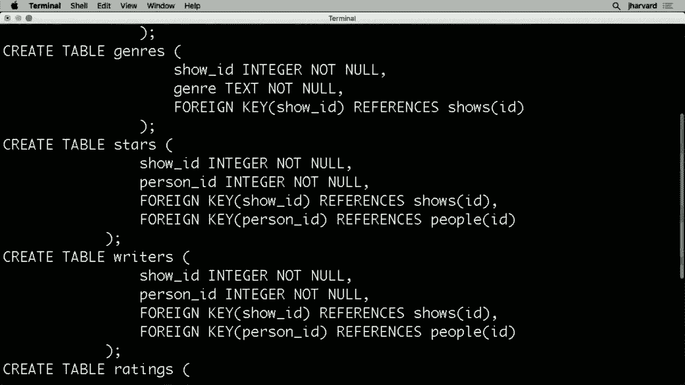

therein，and in fact in pictorial form it，actually looks like this here's a，the land。

there's going to be a people table that，has an id for every person。

a name and their birth year there's，going to be a shows table just like，we've been talking which is。

ids titles of shows also though the year，that the show debuted and the number of。

episodes that the show had，then there's going to be genres similar。

in design to before so we didn't go all，out and factor it out into a third table。

we just have some duplication here，admittedly in genres，but then there's a ratings table and。

here's where you can see where，relational databases get interesting you。

can have a ratings table storing ratings，like one to five，but also associate those ratings with a。

show by way of its show id，and then you can keep track of the，number of votes that that show got。

writers notice is a separate table and，notice this is kind of cool。

this table per the arrows relates to，the shows table and the people table。

because this is a join table a foreign，person id，refer to the shows table and the people。

table respectively，so that a human person can be a writer，for multiple shows and。

on show can have multiple writers，another many-to-many relationship。

and then lastly stars the actors in a，show notice that this too is a join，show id。

and a person id that are referring back，to those tables respectively。

and here's where it really makes sense a，relational database it would be pretty。

stupid and bad design，if you had names of all of the directors，and names of all of the writers and。

names of all of the stars of these shows，in separate tables in duplicate like。

steve carell steve carell，steve carell all of those actors and，directors and writers and every other。

role in the business are just people at，the end of the day so in a relational。

database the advice would be to put all，of those people in a people table。

and then use primary and foreign keys to，refer to to relate them to。

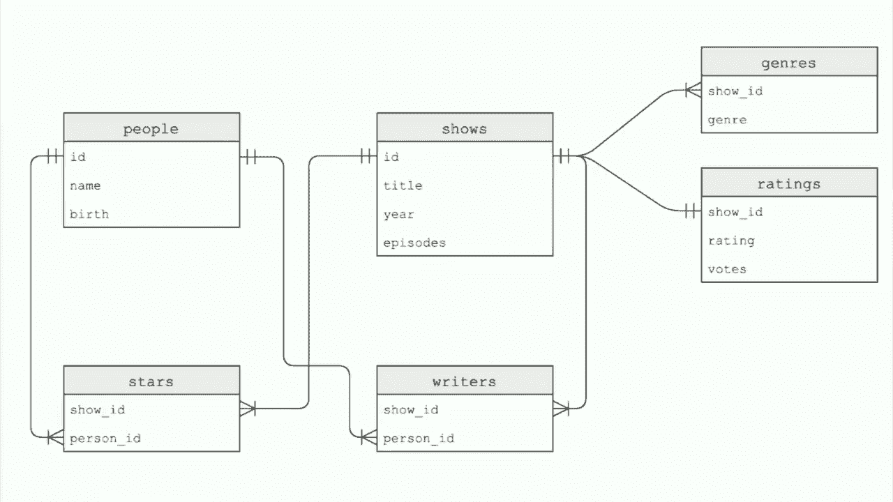

these other types of tables the catch is，though that when we do this。

it turns out that things can be slow，when we have lots of data so for，instance let me go into this。

let me go ah**d and select star from，shows semicolon，that's a lot of data it's pretty fast on，mac。

just to save time because it's a little，in the cloud，let me go ah**d and count the number of。

shows in this imdb，database by using count 153。

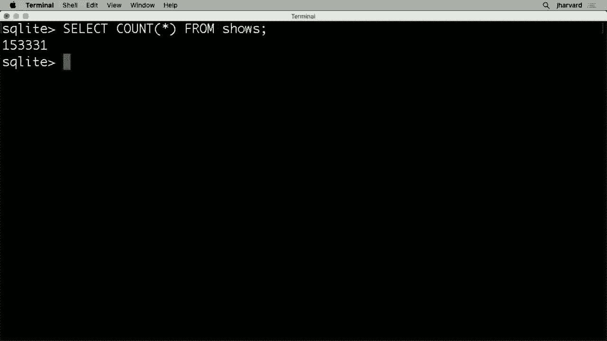

the count of，people from the people table，457 886 people who might be stars。

or writers or some other role as well so，this is a sizable data set。

so let me go ah**d and do something，star from，shows where title equals the office。

and this time i don't have to worry，about weird capitalization or spacing。

this is imdb this is clean data from an，authoritative source。

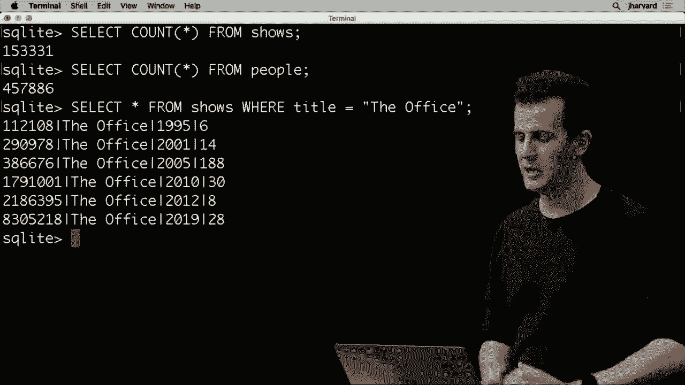

notice that there's actually different，versions of the office you probably know。

the uk one and the us one，there's other shows that are unrelated，to that particular。

type of show but uh each of them is，distinguished notice by the year。

here all right so that's kind of a lot，and let's do this again let me go ah**d。

and turn on a feature temporarily just，in this program，and let me run it again it looks like it。

took 0。012，seconds of real time to do that search，that's pretty fast i barely noticed。

certainly because it's so fast，but let me go ah**d and do this let me，go ah**d and create an，called。

doing，well to answer the question finally from，before about performance by default。

everything we've been doing is indeed，big o of n it's just being linearly。

searched from top to bottom，which seems to call into question the。

whole purpose of sql if we were doing no，better than with csvs。

but an index is a clue to the database，efficiently，in such a way that you get logarithmic。

time an index is a fancy data structure，that the sql lite database or the oracle。

database or the mysql database whatever，product you're using，builds up for you in memory and then it。

does something using syntax like this，something known as a b，tree we've talked a bit about trees in。

trees，things that kind of look like family，tree，that's just very wide and not that tall。

it's a data structure，similar in spirit to what we looked at，in c but it tries to keep all of the。

leaf nodes all of the children or，to speak，as close to the root as possible and the。

algorithm it uses for that，tends to be proprietary or documented，based on the system you're using。

but it doesn't store things in a list it，does not store things，them as。

underneath the hood those tables that，look like very tall structures。

are actually underneath the hood，trees，and if we create those trees by creating。

what they're properly called，indexes like this it might take us a，index。

but now notice what happens previously，office，using linear search it took 0。012。

seconds if i do the same query again，after having created the index。

and having told sql light build me this，fancy tree in memory。

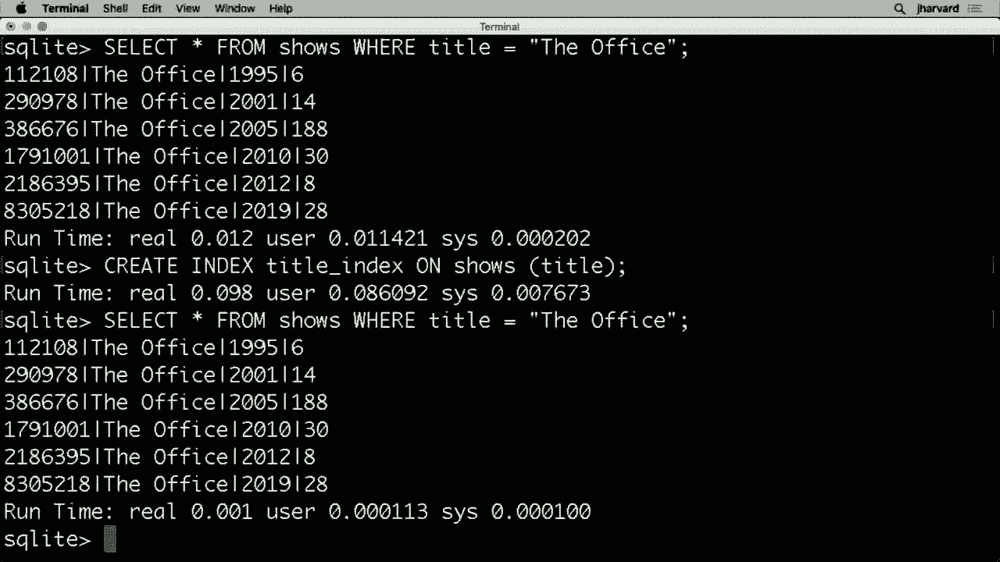

voila 0。001 seconds，so orders of magnitude faster now both，are fast to us human certainly but。

imagine the data set being even bigger，the query being even bigger，that。

uh and they're rather the queries can，take longer than that and therefore take，even more time。

than that but unfortunately if i've got，all of my data all over the place。

as in a chart as in a diagram like this，my god how do i actually get useful work。

done how do i get back the people in a。

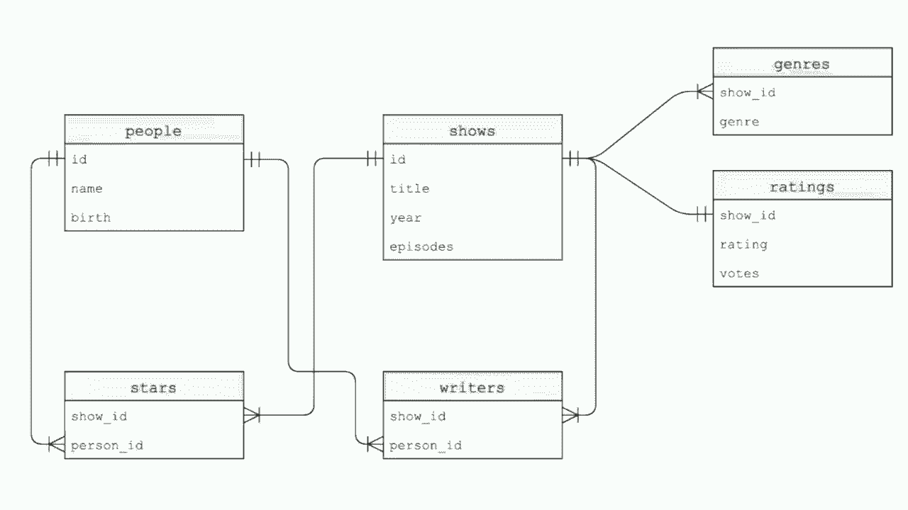

movie and the writers and the stars and，the ratings if it's all over the place i。

would seem to have created such a mess，and that i now need to execute all of，to be。

that complicated it turns out that，there's another，keyword in sql really the last that。

we'll look at here，called join the join keyword which you，can use implicitly or explicitly。

allows you to just join tables together，and sort of reconstitute a bigger more，user-friendly table。

so for instance suppose i want to get，the office，well recall that i can select steve's id。

from the people table，where name equals steve carell so again，he has a different id in this table。

because this is from imdb，but there's his id and let me go ah**d，and turn the timer off。

for now all right so there is his id，136-797 i could copy-paste that into my。

code but that's not necessary，thanks to these nested queries i can do，something like this。

let me go ah**d and now select all of，the show ids，from the stars table where person id。

from that table is in or is equal to，this result，so there's that join table stars that。

links people and shows，the wrong key，retyping it，select show id from stars，where person id equals。

whatever steve carell's ideas all right，so there's all of the show ids of steve。

carell's tv shows that's a lot，and it's very non-obvious what they are。

so let me do another nested query by，putting all of that in parentheses and，now select title。

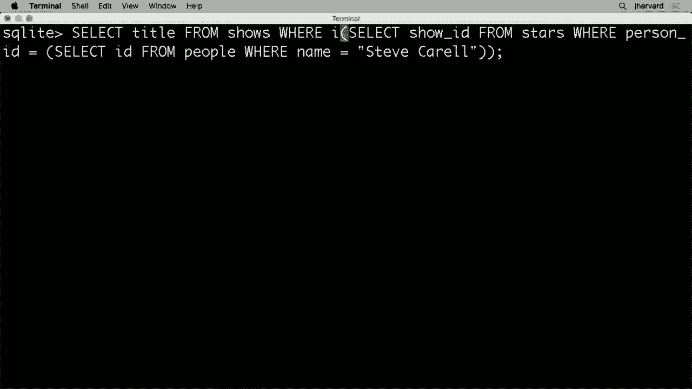

uh from shows where the id of the show，is in this big long list of show ids。

and there are all of the shows that he's，in including，the dana carvey show back when the。

office up at the top and then most，recently shows like the morning show。

on apple tv alright so that's pretty，the data like that，but it turns out there's different ways。

more of this，in the coming weeks and in the problem，sets in labs and the like but it turns。

out we can do other things as well and，let me just show this syntax even though，glance。

you can also use that join keyword as，follow i can select the title。

from the people table joined with，column，equaling the stars person id column。

so in other words i can select a title，from the result of joining。

people and stars like this on the id，column in one and the person id。

column in the other and i can join in，the shows，table on the stars dot。

show id equaling the shows dot id so，again now i'm，joining the primary and foreign keys on。

these two tables，where the name equals quote unquote，steve carell。

so this is the most cryptic thing we've，seen yet but it just means take this。

table and join it with this one，and then join it with this one and。

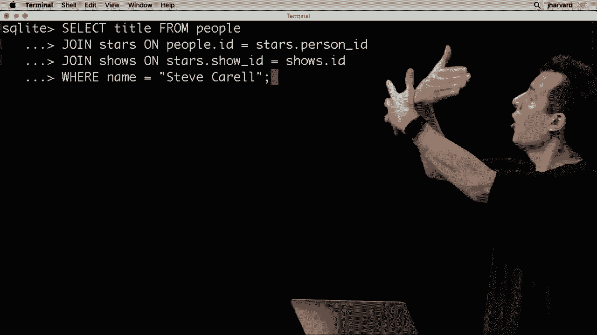

filter all of the resulting joined rows。

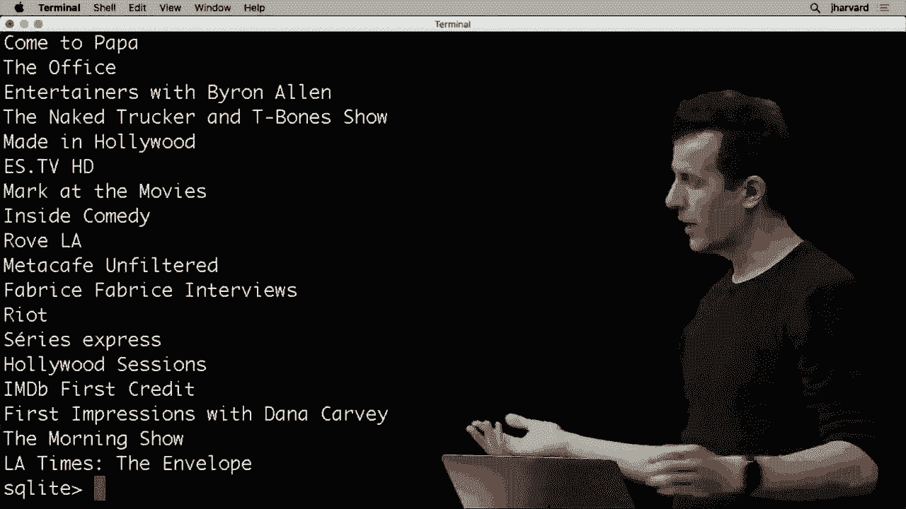

there we have，all of those answers as well and there's，other ways of doing this。

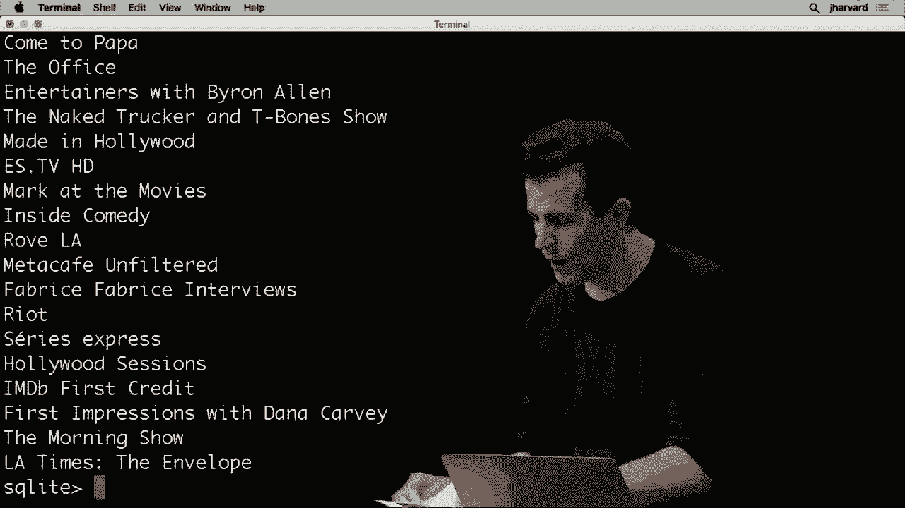

too i'll leave unsaid now some of the，syntax for that but that's felt a little。

slow and in fact let me go ah**d and，turn my timer back on，let me re-execute this last query select。

title from people，joining on stars joining on shows，where name equals steve carell that took。

over half a second。

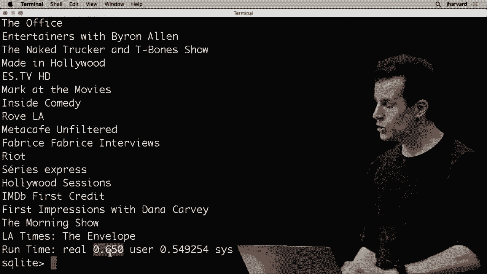

so that was actually admittedly kind of，slow but again。

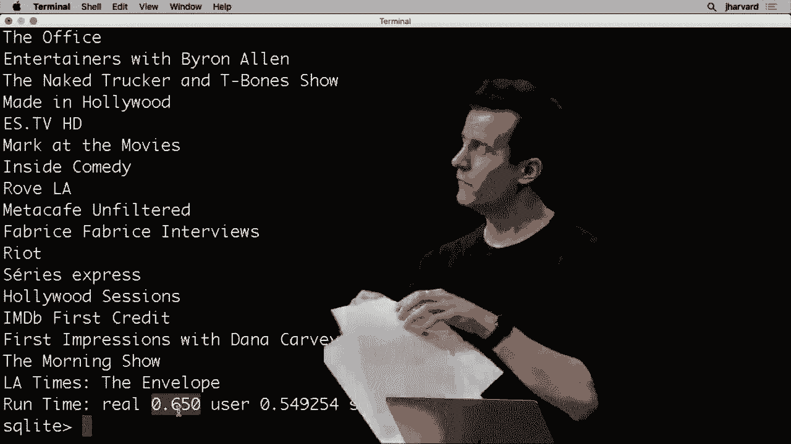

indexes come to the rescue and if again，we don't allow，linear search to dominate but let me go。

ahead and create a few indexes，create an index on called person index，why。

well my query a moment ago used the，person id column it filtered on it so，that might be a bottleneck。

i'm going to go ah**d and create another，index on the called。

show index on the stars table on show id，similarly a moment ago my query used the，show id column。

and so that too might have been a，bottleneck linearly top to bottom。

so let me create that index and then，lastly let me create an index called。

name index and this is perhaps the most，before，on the people table on the name column。

and that too took a moment now in total，this took like almost a full second。

but these these indexes only get created，over time，but you don't incur this with every。

query now let me do my，select again let me select title from，people。

joining the stars table joining the。

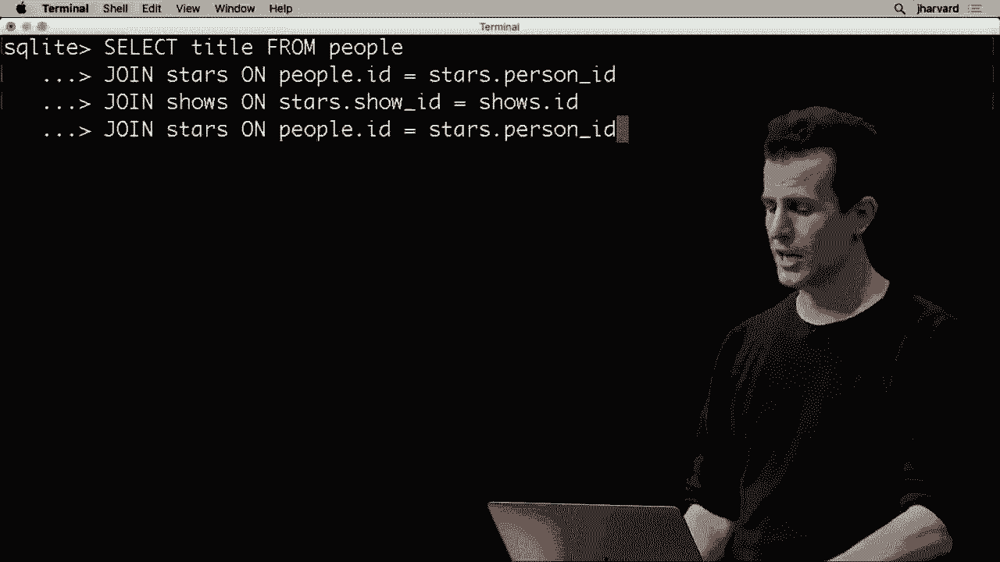

shows table，where name equals steve carell boom。

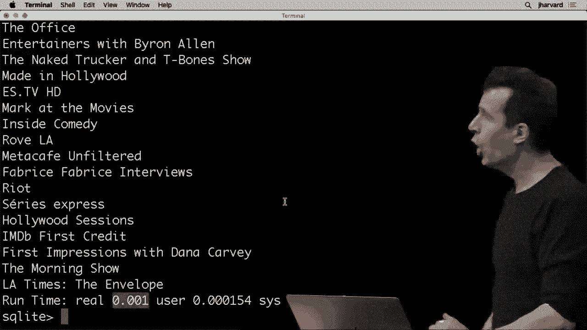

0。001，seconds that it's an order of magnitude，faster than the like more than half a。

second it took us，a little bit ago so here too you see the，power of a relational database。

so even though we've created some，problems for ourselves over time。

we've solved them ultimately granted，with some more sophisticated features，and additional syntax。

but a relational database is indeed why，you use them in the real world for the，the googles。

because they can store data so，efficiently，without redundancy because you can。

normalize them and factor everything out，but they can still maintain the，spreadsheet。

but using something closer to，logarithmic thanks to those tree，structures but there are problems and。

what we wanted to do is end on today two，with sql，and because they are just unfortunately。

so commonly done，notice this here there is something，attack，which you are vulnerable to in any。

application where you're taking user，input that hasn't been an issue for my，favorites。pi。

file where i only took input from a csv，but if one of you were malicious what if。

one of you had maliciously typed in the，word delete，of your show。

and i accidentally plugged it into my，own python code when，executing a query you could potentially。

inject sql，if logging in，via yale you'll typically see a form，like this or logging in via harvard to。

something you'll see a form like this，here's an example that i'm pretty sure，to。

suppose i type in my email address to，this login form as mailand。harvard。edu，sql。

dash dash is the symbol for commenting，if you want to comment something out。

it turns out that the single quote is，something like，steve carell or in this case mailing at。

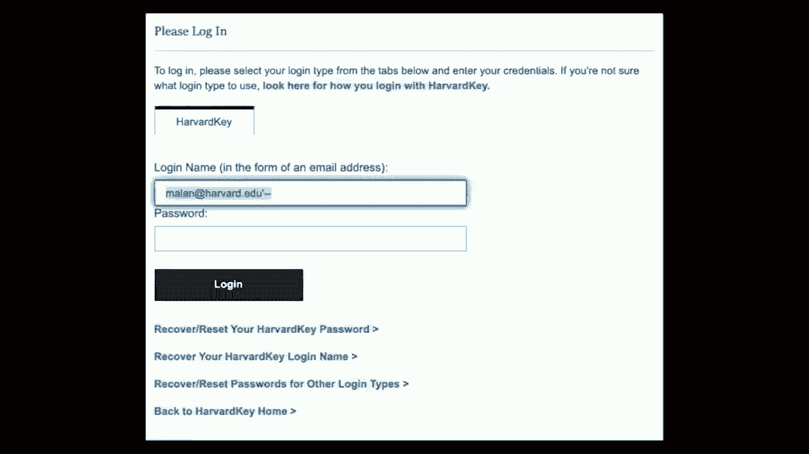

harvard。edu it can be double quotes it，can be single quotes，in this case i'm using single quotes。

here but let's consider some sample，code if you will in python here's a line，of code that i propose。

might exist in the back end for，harvard's authentication or yales or，anyone else's。

maybe someone wrote some python code，like this using select star from users。

where username equals question mark and，password equals question mark。

and they plugged in username and，password whatever the user typed into，that web form a moment ago。

gets plugged in here to these question，marks this is good，this is good code because you're using。

the sql question marks so if you，literally just do what we preach today。

and use these question mark placeholders，you are safe from sql injection attacks。

unfortunately there are too many，developers in the world，that don't practice this or don't。

realize this or do forget this，if you instead resort to python，approaches like this。

where you use an f string instead which，might be your instincts after last week。

because they're wonderfully convenient。

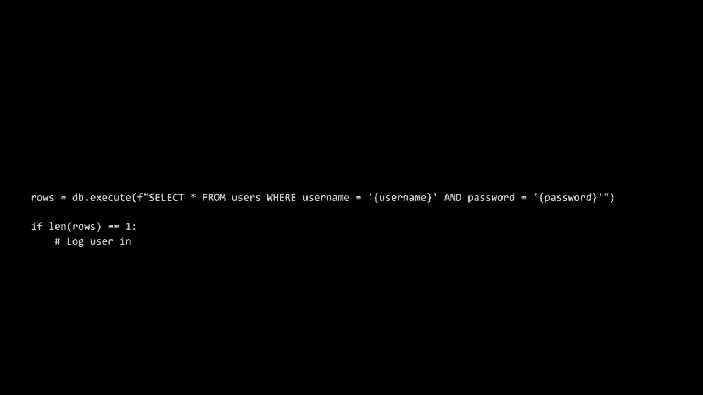

with the curly braces and all，suppose that you literally plug in。

username and password，not with the question mark placeholders，but just literally。

in between those curly braces watch what，happens if my username，mailin harbor。

edu was actually typed in，by me maliciously as mailin。

harvard。edu single quote dash dash，that would have the effect of tricking，this python code。

into doing essentially this let me do a，find and replace，it with trick python into executing。

username equals quote mainland，harvard。edu，quote dash dash and then other stuff。

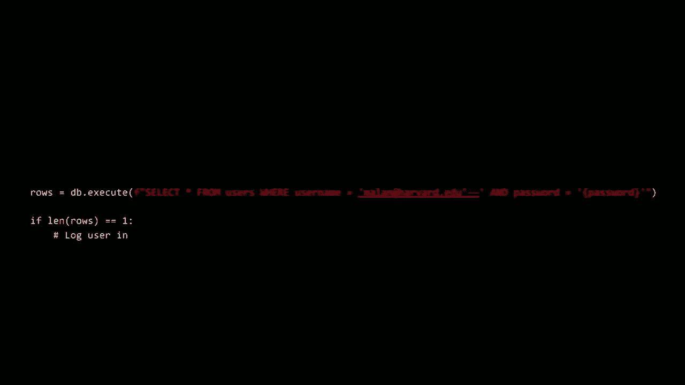

unfortunately the dash dash again means，comment which means，ignoring。

the whole password part of the sql query，is to check，is this username and password valid so。

that you can decide to log the user in，by essentially，commenting out everything related to。

password notice what i've done，i've just now theoretically logged，myself in。

as mainland harvard。edu without even，knowing or inputting a password。

and the dash dash，just ignoring。

the password equality check and so it，turns out that db。

execute when you execute an insert it，returns to you as said，you use。

db execute to select rows from a，database table，it returns to you a list of rows each of。

which is a dictionary so this is now，pseudocode down here with my comment。

but if you get back one row that would，seem to imply that there is a user named，malin at harvard。edu。

don't know what his password is because，whoever this person is maliciously。

tricked the server into ignoring，that syntax so sql injection attacks are。

unfortunately one of the most common，attacks against sql databases they are，completely preventable。

if you simply use placeholders and use，libraries whether it's cs50s or other，down the road。

a common meme on the internet is this，picture here，if we zoom in on this person's license，be。

this is an example of someone，theoretically trying to trick some。

camera on the highway into like dropping，the whole database drop is another，table。

and this person was either intentionally，or just humorously，trying to trick it into executing sql by。

using syntax like this so，semicolons，are all potentially dangerous characters。

in sql if they're passed through，unchanged to the database a very popular。

xkcd comic let me give you a moment to，just read this，now，in computer science if you'd like to。

read this one，in the，um family of，of educated learners who know who little。

bobby tables is unfortunately it's dead，silence in here so i can't tell if，but。

anyhow this is a very well-known meme so，if you're a computer scientist who knows。

sql you know this one，and there's one last problem we'd like，to introduce if you don't mind just a。

couple final moments here，and that is a fundamental problem in。

computing called race conditions which，for the first time is now manifest。

in our discussion of sql it turns out，that sql and sql databases。

are very often used again in the real，world for very high performing。

applications and by that i mean again，the googles the facebooks the twitters。

of the world where lots and lots of data，is coming into servers。

all at once and case in point some of，you might have clicked like。

on this egg uh some time ago this is the，most liked instagram post ever。

as of last night it was up to like 50，plus million likes，uh well eclipsed kim kardashian's。

million or so，this is to say this is a hard problem to，solve um，this uh notion of likes coming in at。

such an incredible rate，because suppose that long story short，instagram。

actually has a server with a sql，c，plus or whatever language that's talking，to that database。

and suppose that they have code that's，trying to increment the total number of。

likes well how might this work logically，well in order to increment the number of。

likes that a picture like this egg has，you might first select from the database。

the current number of likes，for the id of that egg photograph then，you might add one to it。

then you might update the database and i，didn't use it before but just like。

there's insert and delete，there's update as well so you might，update the database with the new count。

plus one so the code for that might look，a little something like this，here。

where you execute select likes from，posts where id，equals question mark where id is the。

unique identifier for that egg，and then i'm storing the result in a，list。

of rows i'm going to go into the first，row so that's rows bracket 0。

and i'm going to go into the likes，column to get the actual number and that。

number i'm going to store in a variable，50 million，and i want it to go to 50 million and。

one so how do i do that，posts，set likes equal to question mark and。

then i just plug in likes plus one，the problem though with the instagrams。

and googles and twitters of the world，is that they don't just have one server。

they have many thousands of servers，and all of those servers might in，and i。

on the internet and those clicks，translate into this code getting，executed executed executed。

and the problem is that when you have，three lines of code and suppose brian。

and i click on that egg at roughly the，same time，my three lines might not get executed。

before his three lines are vice versa，they might get co-mingled。

chronologically my first line might get，executed then brian's first line might。

get executed my second line might get，executed brian's second line，so they might get interspersed on。

different servers or just temporarily，problematic，because suppose brian and i click on。

that egg roughly at the same time and we，query，50 million is the current count then our。

next lines of code execute on the，servers we happen to be on，which adds one to the likes the。

updating，the row for the egg with 50 million one，both times because the fundamental，problem is。

execute，we are both checking the value of a，variable at essentially the same time，oh。

the current likes are 50 million we are，then making a decision let's add 1 to 50，million we are then。

updating the value with 50 million one，the problem is though，that really if brian's code or the。

instagram，happens to have selected the number of，likes first，he should be allowed to finish the code。

that's being executed，so that when i select it i see 50，million one and i add one to that so the。

new count is 50 million，two this is what's known as a race，condition when you write code。

in a multi-server or fancily known as a，multi-threaded environment。

lines of code chronologically can get，given time，the problem fundamentally derives from。

the fact that if brian's，server is in the middle of checking the。

state of a variable i should be locked，out i should not be allowed to click on。

that button at the same time or my logic，code my code might，should not be allowed to execute。

logically so there is a solution，when you have to write code like this as。

is common for twitter and instagram and，facebook and the like，to use what are called transactions。

transactions add some few new pieces of，syntax that we won't dwell on today and。

you won't need to use in the coming days，but they do solve a fundamentally hard。

problem transactions essentially allow，you to lock，a table or really a row in a table。

so that if brian's click on that egg，results in some code executing that's in。

the process of checking what is the，total like count，my click on the egg will not get handled。

by the server，until his code is done executing so in，green here i've proposed the way you。

should do this，you shouldn't just execute the middle，three lines you being in。

facebook in this case instagram should，execute begin transaction first。

then commit the transaction at the end。

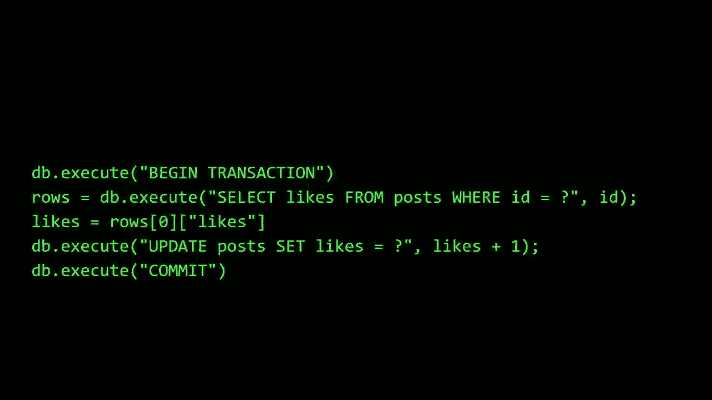

and the design of transactions is that，all of the lines in between will either，succeed altogether。

or fail altogether the database won't，get into this funky state where we start，losing track。

of likes on eggs and though this has not，been an issue in recent years back in。

the day when twitter was first getting，started twitter was super popular。

and super offline a lot of the time，there was this thing called a fail。

whale which is like the picture they，showed on their website when they were。

getting too much traffic to handle，that was because when people are liking。

and tweeting and retweeting things it's，a huge amount of data coming in。

and it turns out it's very hard to solve，these problems but，locking the database table or the rows。

with these transactions is one way，final，extra time today we thought we would。

play this out in the same example that i，ago，suppose that the scenario at hand is。

that you and your roommates have a nice，dorm fridge，and you're all in the habit of drinking。

lots of milk and you want to be able to，drink some milk，but you go to the fridge like i'm about。

to here and you realize，uh oh we're out of milk and so now i'm，inspecting the state of this。

refrigerator which is quite old，this variable，being empty tells me that i should go to。

cvs and buy some more milk。

so what do i then do i'm presumably，going to close the fridge，and i'm going to go and leave and go。

head to cvs，unfortunately the same problem arises，that we'll act out here in our final 60。

or so seconds together，whereby if brian now my roommate in this，story also wants some milk。

he comes by when i'm already headed to，fridge，and realizes oh we're out of milk so he。

nicely will go restock，as well so let's see how this plays out。

and we'll see if there's，isn't a similar uh analogous solution so。

i've checked the state of the variable，back。

do。

all right i am now back from the store，i've picked up some milk，gonna go ah**d and put it into the。

fridge and oh how did this happen now，there's multiple jugs of milk and of。

course you know milk does not last that，long and brian and i don't drink that。

much milk so this is like a really，serious problem，we've sort of tried to update the very。

value of this variable，at the same time so so how do we go，about fixing this what's the。

the actual solution here well i dare say，that we can draw some inspiration。

from the world of transactions and the，world of databases and perhaps create a。

visual for here that we hope you never，forget if you take nothing away from。

today let's go ah**d and act this act，this out one last time。

where this time i'm going to be a little，more extreme i go ah**d and open the。

fridge i realize ah we're out of milk，i'm going to go to the store i do not。

want to allow for this situation where，well，instead，let me go ah**d and drape this through。

a little extreme but i think so long as，he can't get into the fridge，this shouldn't be a problem。

let me go ah**d now and just attach the，lock here，almost got it come on all right。

now the fridge is locked now i'm gonna。

i can come up on stage and just tell me，oh all right that's it for cs50 sorry to。

keep you late we will see you。

