# 【双语字幕+资料下载】哈佛CS50-CS ｜ 计算机科学导论(2020·完整版) - P16：L8- 网络编程全指南（网络协议、HTML、CSS、JavaScript） - ShowMeAI - BV1Hh411W7Up

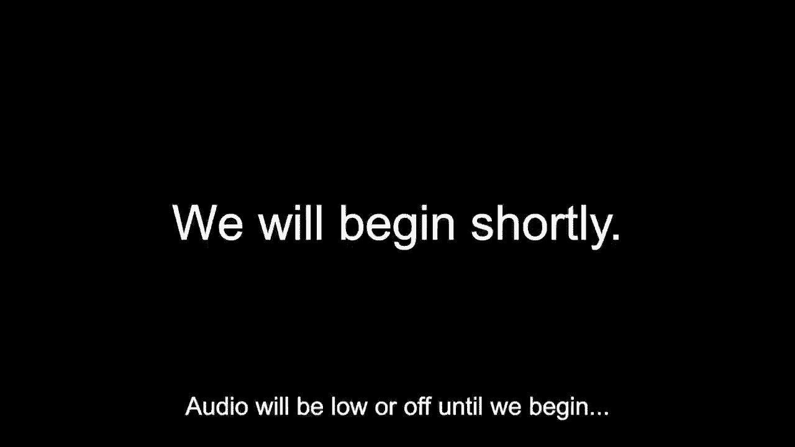

All right，this is CS 50 and this is Week eight，the week of All Hallows Eve。thanks to our friends here in American Repertory Theater。the stage looks amazing today with some special lighting and some special characters。this past week you all explored 50 ville for the very first time looking for the rubber。

duck that had gone missing。the culprits have been found。And allow me to say that a little someone would like to say hello。even he has rather dressed up for the occasion。But thank you for all the hard work there。we transition to the world of Web programming，the motivation being that for the past many weeks。

pretty much all of the code we have written has been focused on command line programs。

compiling your code，but generally just interacting with a fairly mundane，blinking prompt textually。the software that you and I use every day these days is in the form of laptops and。in browsers or on mobile devices or APS。And today we begin to transition to a set of languages instead of technology is。

via which you can start to apply all of the past weeks knowledge and mental models for。procedural programming to a much more familiar，much more graphical domain。over the course of the next couple of weeks will be focus on Web programming。and the use of language is called HTML and CSS and JavaScript。

with which today's websites are made and increasingly。with which today's mobile applications or APS on your phone are made as。But in order to get to that point in the story，we need to consider what the framework is。on top of which we're going to run these Web sites or these Web applications。

and so that invites the question of the Internet。Exactly what is the Internet？

All of us use it every day，but let's take a couple of volunteers from the audience just to define for us what we mean。by the Internet。All of us are literally on the Internet right now。but if you take a step back and think about it，what is Thean turn ette？

How might you define it for someone less technical than you or，how would you define it？

Like the network of all the computers around the world that are kind of taking in information。from the network and also giving information perfect？The Internet is this network of networks。So if you have a small network in your home ah，small network or a large network at your company or your university。and you start to interconnect all of those networks using cables or some kind of wireless technology。

you get the Internet，a network of networks。And this is really the infrastructure。on top of which all of today's applications air run。So when you use the Web when you use chat when you use slack，when you use video conferencing。you're using the Internet。But think of the Internet really is the lower level plumbing that gets the zeros and ones from。

you to someone else and back。And the applications on top of that are all implemented ultimately in software。And so if we consider，then that we've got all of these computers interconnected somehow it stands to reason that we need to somehow。decide as a global community。How to get data from Point A to point B and beyond。And so throughout the Internet are these computers called routers。

and the at the end of the day they're probably a little bigger than the desktops and laptops with which you and I are familiar。there the same kinds of devices with CPU Central processing units。the brains inside of the computer that do all the thinking，ram or memory。air stored and hard disks and where data is persisted and pictured。

is an image from MIT that depicted a few years back。I want some of the most significant peering points on the Internet throughout the。so each of the red dots here represents essentially one router or one very important。place into which a lot of cables come in and then go out and interconnect all。

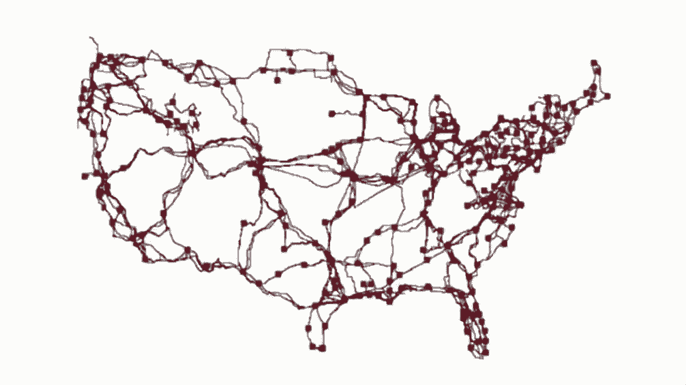

points of the country。And then the story continues well beyond the United States these days。using oceanic cables and other wireless or satellite technologies of the like。So suffices to say there's sort of this mesh，this interconnection of all of these different computers and in turn。networks throughout the world。Which is to say that there's many different pads that data can take to go from point A to point B。

There isn't necessarily a line between you and facebook dot com or stanford dot。there's a whole bunch of routers，sometimes a handful，sometimes as many as 30。That will relay your data from left to right。two down or in some other direction in order to get data from you to the Web server that you're trying。to contact and then back to you with the servers response。So how does all of this work？

humans essentially had to get together and decide as a group what standards，what protocols？

All of these computers they're going to speak。protocol isn't so much a language as it is a set of conventions。right back in healthier times。if we were meeting each other in person，might extend a hand。you would immediately know that you should probably extend your hand to。and we would have a physical handshake，and that's like a human protocol。

I initiate a communication with you by extending my hand。You acknowledge that communication by extending your hand。and then that sort of interaction is complete。So we have these human protocols in the world of computers。They're similar protocols，but obviously it's all zeros and ones。

So if the first computer sends this pattern of zeros and ones。the other computer should reply with a different set of zeros and ones。And so these protocols were about to discuss just standardized。What those patterns of zeros and ones are really what all of the messages are going back and。

And two of the protocols most commonly used to get data on the Internet from Point A to。Point B are called TCP slash i p。TCP and I peer to separate protocols。but they're so often used together that you typically mention them in one breath。TCP i p。And this is These are acronyms you've probably seen maybe on your Mac or PC。

or somewhere on your phone settings。And it refers to essentially two sets of conventions that computers use to get data。from one point to another。So what do we mean by data？

And what do we mean by moving things between A and B？It sort of is an old school envelope。whereby if you wanted to send a letter to someone else in the world。you and I would probably reach for a piece of paper back in the day。we would pick up in envelope and we would write our note on that piece of paper。

put the paper in the envelope，and then the most important step after writing the actual message would be to address the。in the real world you would put the recipients address，typically in the middle of the envelope。You might put your return address in the top corner of the envelope and then maybe postage or。But we humans have pretty much standardized through all of the postal systems。

that kind of convention when using envelope。So the metaphor here is that the envelope and the message there in are generally thought。referred to as packets packets of information，and this would be the physical incarnation of what computers。you're just going to do using zeros and ones。So let's tease apart the two sets of conventions they use for actually putting data in these。addressing these envelopes and sending them out from Point A to Point B。

Let's consider first I P I p stands for Internet Protocol and pretty much any。Mac and PC and iPhone and iPad and Android device these days has。been designed by Apple or Google or someone else to understand。It's a So those companies have written software running on those devices that make。

sure that those devices all support type。Just like I was taught，presumably by some human。this human convention of shaking hands back in the day i p Internet Protocol。simply standardizes how computers address each other。So in our physical human world。if you wanted to send me an envelope，you might write to Harvard's computer science department at 33 Oxford Street。

02138 U。That is presumably a unique postal address that addresses the computer science。building on campus so that if you drop an envelope in the mail in California or anywhere abroad。via some number of hops and mail carriers and the like，make its way to that particular address。then have I similarly unique addresses known as I P，And so when your computer Mac PC。

phone whatever sends data from itself to another server。the address that it writes on the outside of that virtual envelope is the I。P address off the remote server。if I were to send a message to you。I would figure out what your I P address is。I would write that I p address virtually on the outside of this envelope。

I would probably write my own I P address on the top left hand corner of this metaphorical。and then I would send it out on the Internet。And what does that mean？

It would mean I take that envelope and I hand it to the nearest router。So it turns out when you're a home，you actually have a router of your own。It's that device that connects to your cable modem or DSL modem or something like that。If you're on campus like a place like Harvard or Yale，Harvard and Yale have their own routers。

So your computer went on campus，just knows to hand data off to that。And if you're at home using or if you're elsewhere in the world，like in Starbucks or an airport。So your computers generally know where the closest router is。and then routers purpose in life is again to figure out。Does this package go left right up。

in order to get it closer to its destination？But this sort of is a chicken in the egg。If I want to send you a piece of information，I need to know your i p address。but I don't really know your i p address until I know where you are。So there is this other system that you've probably seen an acronym，for two called DNS。

Domain Name System。And this is a technology that's deployed throughout the Internet。That's supported by Max PCs and phones these days。That just translates what we you and I would typically called domain names or fully qualified。domain names from those English like or human readable characters，to the corresponding I P addresses。There's a reason that companies do not advertise their websites as being a，numeric i p address。

None of us would ever remember them。

They instead advertise them as Microsoft dot com and google dot com and New york times dot com。Dryden's is a technology that your Mac and PC and phone support that no when a。human types in one of those human readable addresses。a domain name drones converts those names to the I P，addresses So literally。

if you type in Harvard or Yale。

you enter into your Web browser，your Mac or PC quickly looks up the i P address off that。

Web server using the software that came with the Mac or PC and converts it to the。corresponding i P address and then writes virtually on the outside of the envelope。the I p address of Harvard or Yale's Web server before sending it out on the Internet。So these air just services DNA as a service that your own ISP Internet，service provider provides。

When you're at Starbucks，it's probably Starbucks。it's your own Internet service providers like Verizon or Comcast or the like。So the world just decided to use that technology as well。one other acronym for now，TCP TCP。or Transmission control protocol is a solution to a couple of problems。one of which is that it tends to be pretty convenient for，individual servers on the Internet。

To be able to do multiple things right，There's lots of things the Internet can do。The servers can host email。They can host websites，they can host chat servers。Videoconferencing。that's already a growing list of features of software that you can use on the。And it would be nice financially administratively if one server could do。

multiple things at once。And indeed they can。So when a computer receives one of these virtual envelopes and that computer。that server happens to support multiple services email。It looks at the envelope for one additional piece of information。

and that piece of information is known as a port number。R T number。which is just a small integer that the world has decided represents specific，in the world of TCP。The world decided years ago that our computers should virtually right the number。80 on these envelopes after the I P address to signify that this is a request for a Web。

page or 443 on the outside of the envelope。If it's a secure request for a Web page using something called https more on that。in a bit and there's other numbers as well。Email has its own unique numbers。Zoom has its own unique numbers，and all these other Internet services that you and I might use every day have their own unique TCP。ports so that companies and people can have one server doing multiple things。

But upon receipt of one of these envelopes，the server could look at it and be and realized。this isn't request for email。This is a request for a Web page。This is a request for chat or something else altogether。notably to TCP，also handles delivery。And it's the part of the protocol that also ensures that when you send data，from point A to Point B。

if any data gets lost because literally something's wrong with one of those routers or。because maybe 31 of those writers got overwhelmed and just received way。more packets at once than it can handle。That could happen because these computers have。If you send too much data through one，the Internet might get congested。

your video might buffer and a whole bunch of other symptoms might arise。So TCP also handles the process of re transmitting data as。If any of these packets is lost on the Internet literally。

TCP will also compel your Mac or PC your phone to resend that，data as well。But what's notable about the Internet is that data doesn't necessarily follow one，specific path。if you send multiple packets from one person to another。those packets might actually take different routes each time。And this is actually a feature。

because you can imagine servers getting congested or problems needed to getting needing to。be routed around。And so TC Pipi also supports with other protocols and。adaptive solution to this problem。

whereby maybe your data will go this way。Sometimes maybe it'll go this way some other times。but this is why in part that sometimes your Internet speeds are variable because again。these routers in between might be different or might be a little bit overloaded。So we thought we tried to tell this story by you，invoking some of enlisting the help of some of CS 50 staff。

Would you mind taking on the role in just a moment of playing a Web browser？Someone's own Mac or PC？

Your phone and request of me，maybe something silly，like asking me for a picture of a cat？

So if I want to ask you some Web server for a picture of a cat。I need to send a message to you in order to send that request you。So I might write down my request on ah，on a sheet of paper。and I'll just put that request inside of an envelope。and then I would have to label that envelope with all the information we talked about。in particular with your I p address that I might look up with DNS on。

Send that envelope off，and I think we need a little bit of help here because Brian and I are in different places。And so he and I can't just hand the envelope from one to the other。So let's go ahead and list the help of CS 50 staff here also who have chimed in here on zoom。and see if we can't route this This request from Brian。

who is playing the role of a web browser to me who will play the role of a web server in order。to receive this request for a cat。Let's see if we can enlist the team here。Oh。thank you to Phyllis for having handed me this envelope。And what we have now is the request that Brian sent me。I'm gonna go open it up。

and I did see and a message inside requesting a picture of a cat。which is not uncommon on the internet。if I'm the Web server and I actually have an archive of pictures of cats。I'm gonna go ahead and respond to Brian with one of those cats。I'm gonna go ahead and have to look up on my hard drive or somewhere in the computer。

that picture of a cat and here's one here。So I'm gonna go and send Brian this very happy cat。I've got some envelopes of my own and I'm going to go ahead and write Brian's I P。address on the middle of this envelope。I'm gonna put my I P address on the top left of this envelope and then maybe any other identifying information I。and then I'll go ahead and put the cat into the envelope。this isn't really going to fit。

and this is actually quite commonly the case。Anytime a computer is trying to transmit a decent amount of data。whether it's a big image or maybe it's an even bigger video file for equities sake。it tends to be good for computers to chop up large packets into multiple smaller packets。you might have heard of something called net neutrality or more technical topic known of quality of service。

Net neutrality speaks to just what kinds of decisions computer should make when it comes to。prioritizing data，and a common convention is historically that all of us should chop up our large packets。into smaller packets。Send them out so they could get them commingled with other people's packets。And we all sort of reach our destinations at the same rate。Net neutrality as an aside。

is all about an interest by some parties and prioritizing maybe the。data from certain companies that pay a bit mawr。And so this really speaks to just use or maybe abuse of these basic primitives here。But this is not fair for me to try to cram this one big image into an envelope。So I'm gonna literally go ahead and tear the picture in half。Essentially chop the packet into two。

Let me go ahead now and put this into the envelope because it'll fit a little more easily。So I've got one packet of information for Brian I've got。let's see one MAWR packet of information for Brian。That'll fit the other half of this image into。but I think I'm gonna have to do something else before I drop this out on the。

Internet and hand it back to Phyllis to send out back to Brian。I might need some additional information on these envelopes。I've already got Brian Sipe in the to field。I've got my I P address in the from field。I've also draught it down the port number that I should use for Brian and my own return。

port number and those who have decided，typically by my Mac or PC。But I feel like I probably need a little more information。What more should I virtually right on the outside of this envelope to make。sure that the data is received as intended？Any intuition？No familiarity with TC pipe assumed here。

But if Brian's about to now get two envelopes，what additional data should I perhaps give him grit？

So Brandon confused the top of the photo with the bottom。So you need to somehow to tell Brian that this is the top and this is the bottom。maybe toe converge them perfect。And so we need to make sure Brian knows the order in which these packets should be reassembled so that he indeed gets。the the right way and not the wrong way。so you know what probably suffices is for me to add what we'll call a sequence number to each of these packets。

which is essentially a number。

which you can think of as one of two and on the other one two of two so that，Brian knows when。what order to reassemble the packets，but also more importantly。in case one of the packets or both of them gets lost or somehow dropped by one of the。routers along the way。There's enough information on those packets to enable me and him to recover that and。

resend packet one and or two as needed。So let's go ahead and do this。The help of the team is starting with Phyllis here and Phyllis，if you'd like to go ahead here and。that's only half of the problem。So I'm gonna go ahead now and send the second packet。I would actually send these out in parallel，but there's no reason that they couldn't still follow different paths。

might take a little bit more time。e，you wanna go ahead and open up your envelopes and reassemble them？

so I don't have to envelopes。I guess I'll open up the one says one of two first。and it is the top half of the cat。And then I'll open up the other envelope，which is two of two。and that is the bottom half of the cat。And so together I think I now have the full cat。

Wonderful，Brian into the whole team。I p is this protocol the set of conventions that standardizes what gets written on these。It's how computers uniquely address each other with numbers of some sort。TCP governs a few different things，but among them is this numbering of services like 80 for。

insecure Web traffic or 443 for secure Web traffic。That ensures that the data gets from one point to another and is handled by the right。application running on that particular server。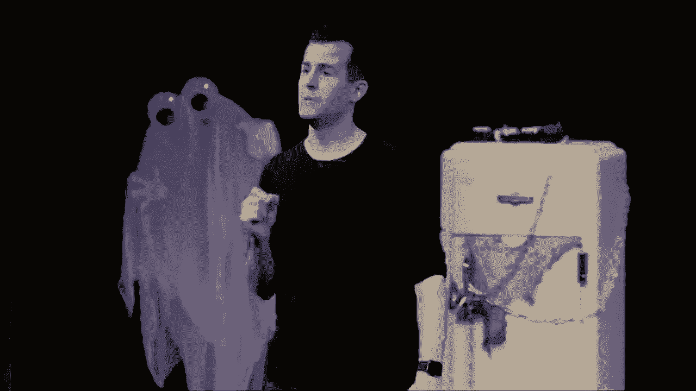

is what we used to begin with。If Brian had his own domain name。my computer would have had a look up his I p address。he would have had to look up mine so that we humans who are actually using the Internet in a human。

friendly way don't have to remember I P addresses，which again are just numbers。but instead can remember things like Harvard，edu and the like。is the Internet the fundamental infrastructure，on top of which we now have the ability to get data from point A to point B。if you're comfortable with that，we can now sort of abstract the Internet away and just think of it as being a。

mechanism that gets data from one point to another。And so long as we can now assume that we have this fundamental public service that gets data from one point。

Now we can start to build on top of it in terms of software and other languages。and actually use it for interesting things。But before we forge ahead to do those things。any questions or confusion，we can clear up on TCP or I P or DNS。Or the Internet or routers or any of these other new，terms grid back to you。I have a question。

So does shopping the information create any problem？Because I don't know。a piece of information can go there for two seconds and another one for three seconds。Does it create any problem for the user？These packets can take different durations of time。And even though I did stipulate that they should go out to Phyllis his hands roughly at the same time。

even if she needs to pass them in two different directions，there can absolutely be delays。as humans will start to notice delays if packets take more than 200。milliseconds to get from Point A to point B。it looks like there's a bit of delay。And certainly if it's two or three seconds，you'll really notice that at that point。

it's not necessarily a problem。Brian hopefully would patiently wait for the second half of the cat for some amount of。time if he only received one packet eventually。A computer would probably get a little anxious and would ask me to re transmit a packet if it。

doesn't arrive after five seconds。These time outs can typically be specified by the software running on the person's computer。but at that point you and I would certainly notice the difference。Other questions or confusion。It looks like all questions have been answered。So if we now have this ability fundamentally。to get data from Point A to point B，what is actually inside of the envelope that Brian sent me and what was inside the。

envelope I sent him，besides just the picture of a cat？

we transition to another language or another protocol，rather called http hypertext transfer protocol。and this is an acronym you've probably seen or typed Bunches of times。what appears in the beginning of URLs uniform resource locators。which are theme the tools that you and I used to actually figure。

what website or what image we actually want to request of the Internet。So the Web。the World Wide Web is really just one of many services that run on，top of the Internet。The Web gives us Web pages。Zoom gives us videoconferencing。Other tools give us text chatting。voice chatting and the like。So the Web is really just an application。On top of the Internet。

it's hands down the most popular application，but it really is just an application。It's a service that's using that underlying plumbing。So http is a different protocol that really governs what，goes inside of these envelopes。TCP I p governs what goes outside the envelopes。Http governs what goes inside of the envelopes。

assuming we are talking about Web browsers and Web servers and not videoconferencing or something else。So with http，it comes with a few different commands or pretty limited vocabulary。two of which are the most important terms to know which is。get in post these air literally English verbs and their two of the commands。

That http supports and what Brian probably did inside of that envelope。

is he probably literally wrote down，Get cat or something like that。Post is used for other applications that will get to before long。But get is the operative word。and it literally is how a browser will request or get information from a server。So somewhere in the envelope Brian sent me was the English word get probably bought。

followed by cat J。Peg or something like that。There's probably a bit more information。but the essence of http means that if Brian wants something from me。and he's the browser and I'm the server。He should start his request with the standardized verb get followed by the。name of the file that he wants to get。So let's put this now into the context of one of the more familiar girl。

a canonical form out of the girl。Let's highlight a few features of it。https。you're seeing this on the Web。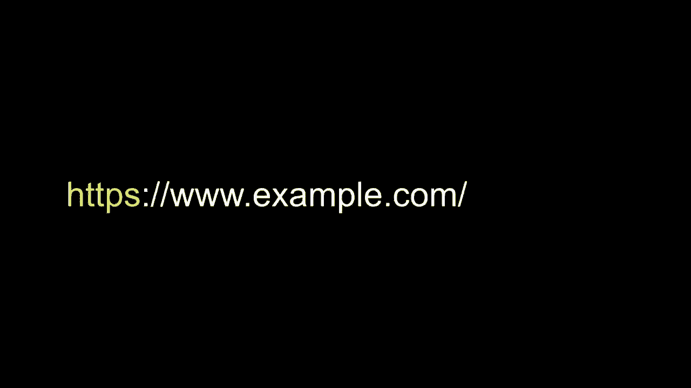

It's often automatically appearing in the address bar of your browser because browser's or Web servers are。S just refers to a secure version of http and we'll come back to this。topic of security next week and beyond。To But in the context off http。this just means that the data between me and Brian and vice versa is。

Somehow it's way better than Caesar or other ciphers。It's way more mathematically sophisticated。but it essentially just scrambles the information so that Brian knows he's asking for a cat。knows he's asking for a cat。But if any of you or any of the TFC who were playing the role of routers sort of。maliciously or knows really opened the envelope instead of handing it off to the next staff member。

they wouldn't understand what's inside the envelope because it would look like similar to Caesar and other。sort of like random zeros in one。So https just means that the contents of these packets are encrypted。What else is salient about these girls？here's what we call a domain name。Odds are most everyone knows what a domain name is。

and it's typically two phrases something dot something else。An example dot com is。edu and millions of others these days。is what we would typically called the top level domain。This is just the type of website historically that you're trying to。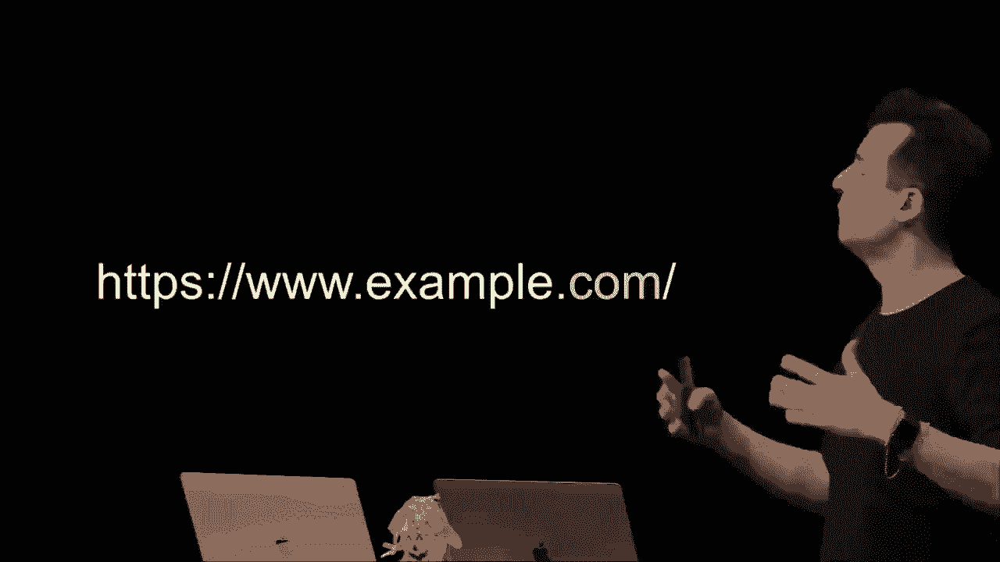

Comment commercial that human education dot net meant some kind of network。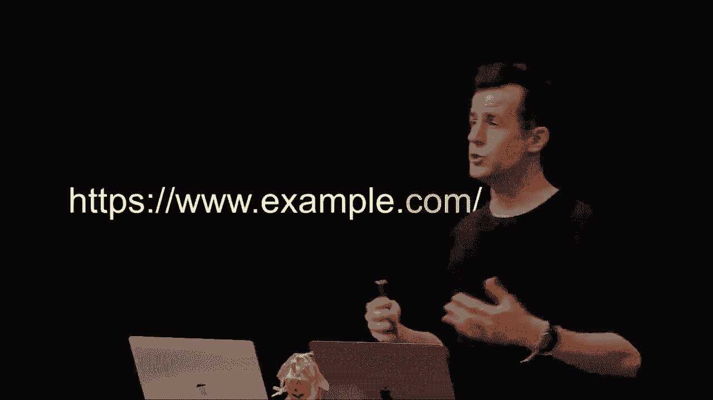

an organization that's no longer really the case。there's hundreds，perhaps even thousands。of top level domains nowadays that you can buy domains in。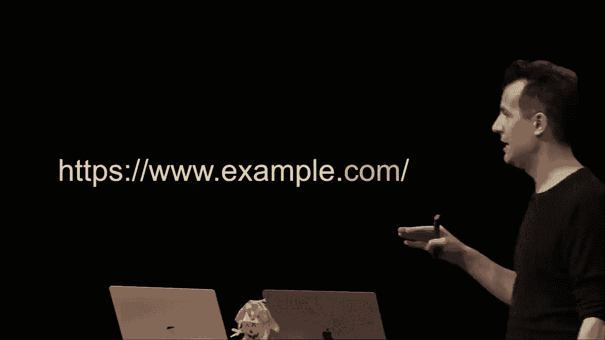

that try to categorize things sometimes，but there's no hard rules around most of those top level domains。You have to be an accredited educational institution to use dot you do you You have to be in the U。Military to do use dot m i l They're similar constraints in other。countries who have their own to character country code T LDs like u dot u。

K for united kingdom dot jp for Japan and many others。each country is free to standardize as it sees fit。But you and I could buy a dot com or go dot net dot us dot There's。you can see a nearly exhaustive list。But this just tends to categorize the type of website that it iss。

there's this prefix。This generally known as，ah host name，and www is just a human convention。pretty much any server on the Internet that had a human friendly，name like this。Www dot example dot com This was just meant to ca note to the user that o W W。W This must be the address of a Web server and not a mail server，not a chat server or something else。

It's not strictly required。It's just human convention。you probably don't even bother typing this in anymore。But it is a historical feature that allows。visual cue clue typically to the humans as to what type of server it is。So besides that there's this one hidden piece of information as well。

If you just want to visit example dot com's homepage。you might just type this girl or even just type example dot com and hit。Enter and let the browser redirect you，take you to this canonical form of the URL。But very often you're technically requesting a specific file and if not。

mentioned that file name is typically index html。It could be other things as well。depending on the language or the server。Technology that someone's using。But implicit at the end of your girls is often the name of a file Brian might have。specifically requested Cat J Peg。But if he were requesting not a picture of a cat but a full fledged Web page with text and other。

odds are there's an implicit file name。They're like index html。and this is now important because when we look inside this envelope。this is a piece of information that needs to then be in there。So let's take a look at some sample http requests and responses。

the more technical dive into what Brian and I and the staff acted out a moment ago。Technically speaking，when Brian sent me a request for that cat。he wrote inside this envelope not only the keyword get and something like Cat。He also specified a couple of other things and let's generis eyes it now away from cats and just proposed this。

Http request that is，any of these virtual envelopes is literally request for。like get followed by slash。If you don't want a cat，you just want the default home page。followed by a mention of what version of http。The browser and server should speak。1。1 is pretty common to is pretty is increasingly common。Three is even now out there。

But there's just different versions of the protocol。It's like humans have refined what it means to shake hands。These versions of protocols evolve over time，but there's also a line like this。Host Colon。Www dot example dot com Because just in case I I'm a particularly fancy。

to server that supports not only example dot com，but maybe Harvard edu and Yale dot edu It's possible long story short for companies。nowadays to host multiple websites and multiple domains on the same server。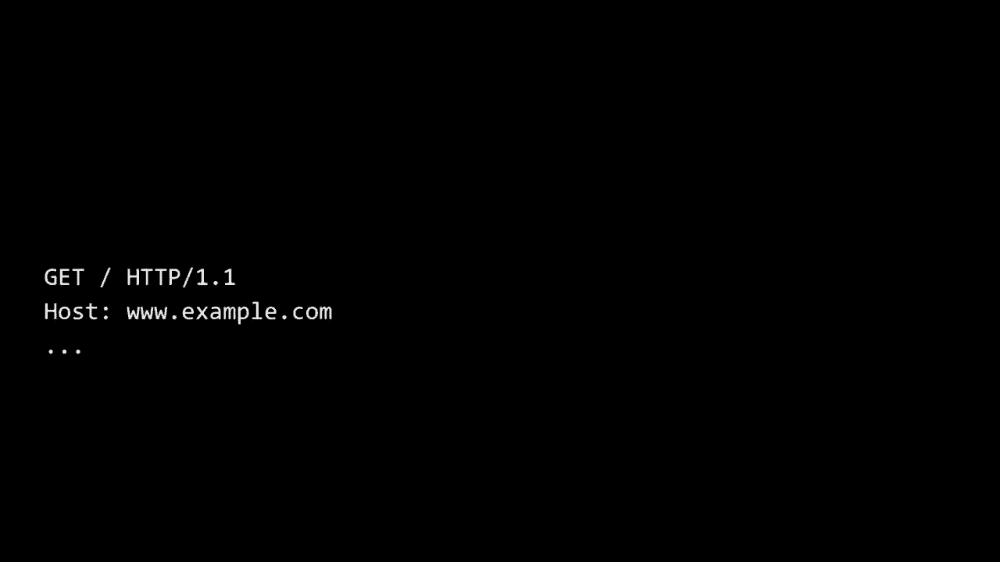

This little clue inside the envelope make sure that it goes to example Com or Harvard。Do you or Yale do with all of these entities are sharing the same physical。server so more specifically，a request might look instead look like this。If you're not just requesting the default home page，but you want a specific file。

it might say slash index HTML instead，what does my response look like？

So I've gotten Brian's envelope。Now I'm gonna go ahead and respond with my own one or two or more envelopes inside of mine。is going to go pieces of that cat，but some additional information as well per the protocol。So my response，just like in the human world，I might extend my hand if I see Brian initiated and handshake。I'm gonna respond with something like this。which just reminds the browser What's version I'm speaking then a number。

which is the status code，followed by a shorthand summary like，piece by piece in these envelopes。and I also put in the envelope a mention of the content type。If it's a Web page。I'm gonna put text slash html。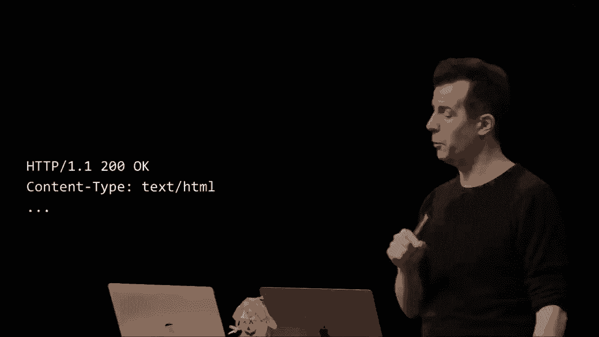

If it's a J peg，I might instead say image slash jpeg。And there's the different content types otherwise known as mind types for all different file。formats in the world。that's not always going to be the case that the response is as simple as that。whereby browser requested information and the server responds with the，requested information。

Sometimes the users make their way to the wrong place。I suppose that's a browser visits www dot harvard dot，The response might not necessarily be okay。it might not be status code 200 in fact we can see this。

Let me go ahead and open up on my screen here，a browser window that's going to take me to。harvard dot e d U。And I'm gonna go ahead and type into the u。R l bar http colon slash slash www dot harvard。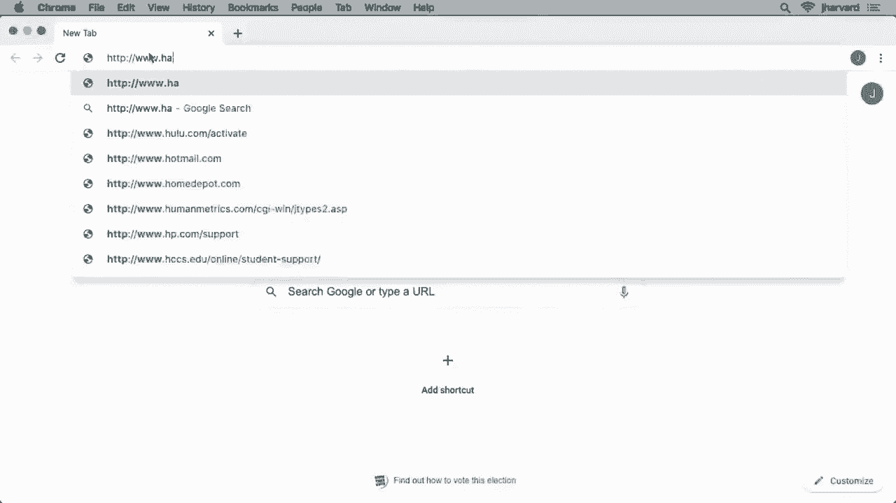

dot e d You enter now？All this happened pretty quickly。But if I click on the URL bar。which has been simplified or shortened by chroma，the moment notice where I actually ended up somehow or other。my browser did not keep me at http。It redirected me，to https。This is probably intentional on Harvard's part。

They would rather that I'd be visiting them securely so that if I'm reading articles or other content。there's really nobody's business except mine。no routers in between should be able to see this。So somehow Harvard redirected me from http to https。how can I see this？

embedded in chrome and edge and Firefox and Safari。all of today's browsers there are often developer tools that sometimes you have to enable via。But these developer tools are so powerful，and they allow you the user or now you the programmer toe。actually see and understand what's going on underneath the hood off these，browsers and servers。

So I'm going to do this in Chrome specifically。

I'm gonna go to view developer，and then I'm gonna go to developer tools。if you're chrome user。this menu option has always been there，even if you never noticed it。So feel free to play along at home and then notice this pops up on the top right here。I'm gonna go ahead and move it down to the bottom just by clicking the dot。

and move the developer tools to the bottom of my screen just so we can see things a little wider。And I'm gonna go ahead and click on the network tab up here。And when I click on the network tab here。I'm going to see a whole bunch of information related to my last request。So I'm gonna go ahead and do this request again。Let me go ahead and go back to the U。

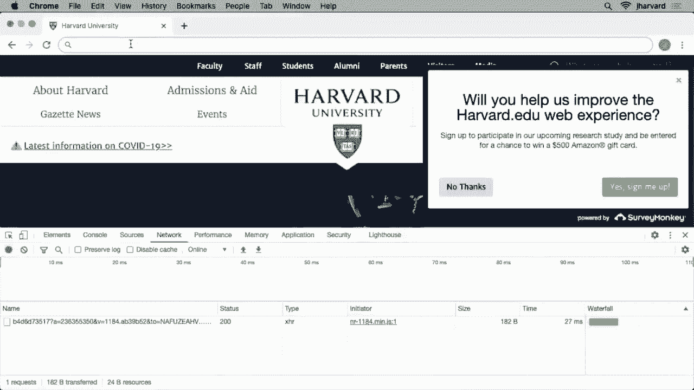

R L Bar and let me go ahead and actually just for good measure，let me do this in incognito mode。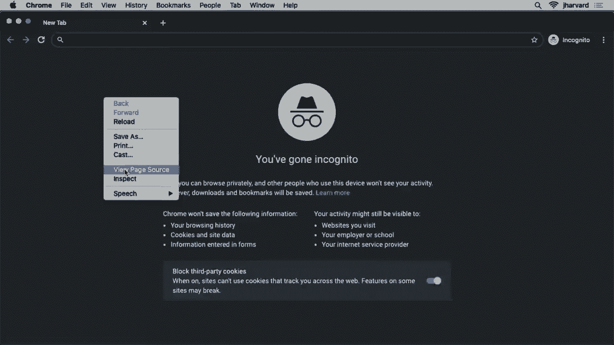

And even though you perhaps you're in the habit of using incognito mode。if you don't want the browser to remember where you've been or what you've logged in as incognito mode is incredibly。powerful for developers Tool so that you can sort of reset the browser state。to like a first condition without any previous network browsing，showing up in your history。

So I'm going to do this again now in incognito mode after having open developer tools。Http colon slash slash www dot harvard dot edu。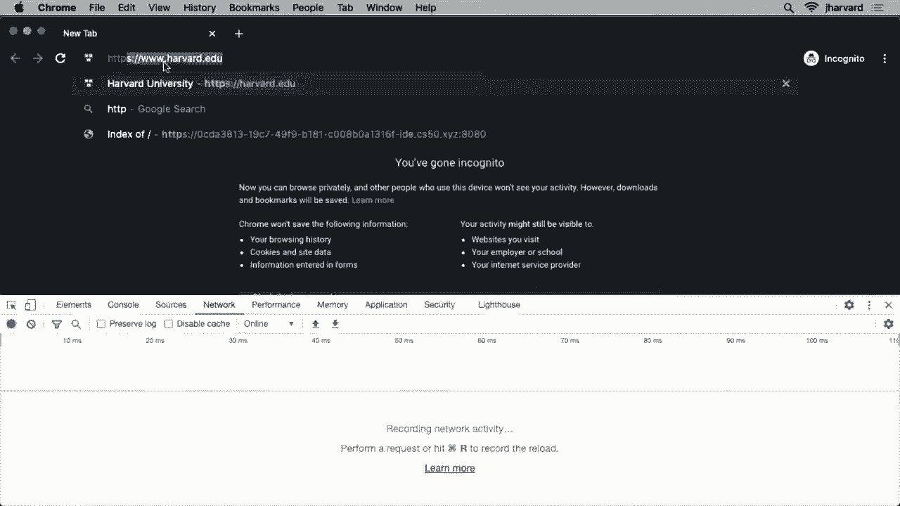

Enter and a whole bunch of stuff just flew by the window。some of which is this chart information。which shows me the performance。So to grade your question earlier about noticing amount of time。you could see that some of the requests that were just induced vary between a few milliseconds and over。1000 milliseconds。But what I care about for now is this fairly arcane listing down here。

whole lot of stuff just flew across the screen。if I zoom in on the bottom simply visiting Harvard。U induces 70 http requests per，this Mentioned in the bottom left hand corner，it resulted in 6。8 megabytes of information being transferred，it took rather atrociously 11。95 seconds。So grid like that is slow，relatively speaking。absolutely speaking。So what's the take away here？

any time you visit a Web page，there's not just the one Web page itself。With all of the text in it。There's probably images，maybe music and other things。All of those get downloaded separately。So if Brian had asked me for a full Web page like the Courses Home website。I might respond not with a single envelope or two envelopes。

I might respond with 70 envelopes containing the responses to every piece。of media that composes CS 50 Zone website or，let's focus on Lee on the first of these requests。If I look at the first row here in chrome，I will see a reminder of where I visited first。But notice the status column over here is 301 301 moved。

It turns out that there's numbers besides 200 that tell browsers what to dio 200，just means okay。here's the data you requested。301 means whatever you requested has moved permanently to a。different girl。So let me go ahead and click this first row and you'll see that a whole different set of。I'm gonna click headers here。And now let me define a term when Brian and I are using http inside of these。

envelopes and I write something like get slash http 1。1 or。host Colin W W example dot com Each of those lines of text is what we'll call，in http header。It's a line of text inside of the envelope。So what we're seeing here is chrome summary of all of the headers that were inside of these。Let me go ahead and look at my request。I'm gonna click view source。

and I can literally see the raw request that my browser sent to。www dot harvard dot you Do you get slash http 1。1，Host Colin Dub dub dub dot harvard dot edu And then a bunch of other stuff which will ignore for。But those are all http headers。But if I scroll back up here，let's look at the response headers。Now what came back in a different envelope from Harvard to my laptop，notice here that it's http 1。1。

it's 301 moved permanently。This is a hint to my browser that，there's nothing at the oral you visited。You need to visit a different location instead to know where I need to go。I need to scroll down and find this header here。Notice that the third line in the response is location。Colon https colon slash slash www dot harvard。

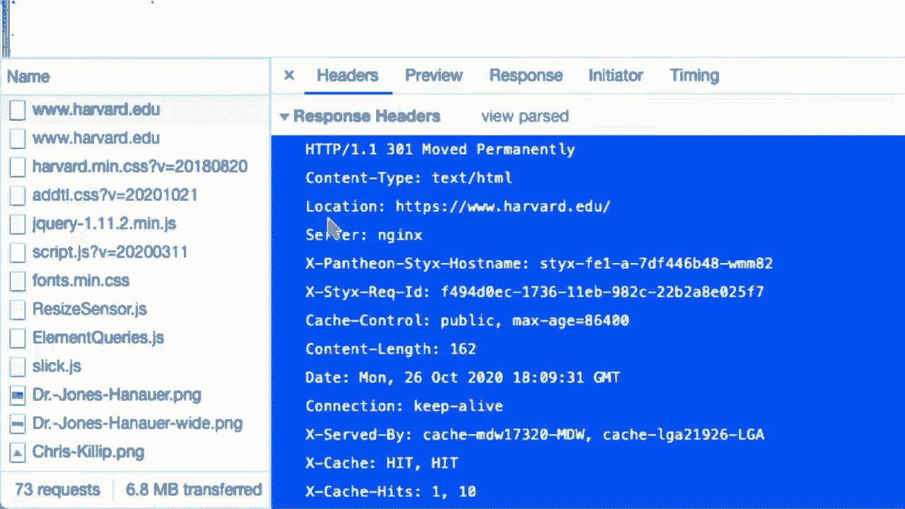

So this is how the envelope that comes back contains a clue to me to say we have。moved permanently to the secure version of the website。And if I zoom out now and click this little X to close those tabs。you'll see that the next request that my browser automatically sent on its own，was to instead。

if I scroll down here to this request，U R L https colon slash slash www dot harvard dot edu and the。response he got this time under this general summary here was now indeed。

So this is just a simple mechanism that allows a browser and server to inter communicate。in a way that can send them from one location to another。And let me make this a little more familiar。Odds are you have seen not this before explicitly，because you as a human would rarely if ever see the number 31 or move permanently until。

now that you're a programmer who's using these developer tools。But odds are you've seen another number。Maybe in the chat if you want to just chime in。If you're thinking about Web pages and numbers，has anyone seen quite often probably a number that maybe now。makes a little more sense？A lot of people saying 404。

I also saw 505 02 s 0404 is the code that humans。

adopted years ago that just signifies not found。So if you visit an incorrect girl or an old girl that's no longer。exists on a server for maybe an old cat that's been deleted，the server will respond not with 200。but with 404 not found there by telling your browser to display some kind of，error message。Weirdly browsers years ago weren't especially user friendly。

and then browsers just told us humans 4444 which，is not very user friendly。But all it boils down to is this little hint inside of the response envelope coming。back that indicates that something went wrong，that something was not found。And there's a whole list of these status codes，and this is certainly not something you need to memorize。

But as we focus more on more on Web programming，you'll just get naturally familiar with some of these。There's other ways of redirecting the user from one place to another 32 and 307 could be。used for efficiency。Servers can sometimes respond with 304 which essentially means you already asked me。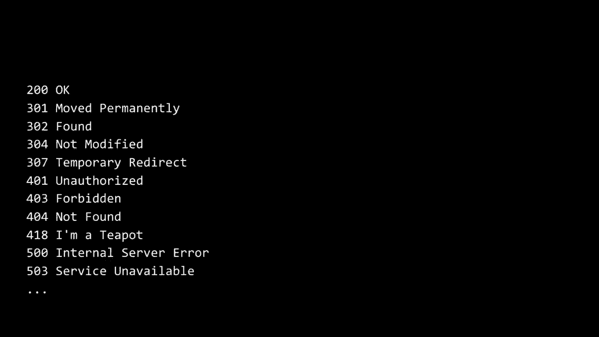

The cat has not changed on the server。Use your own copy of the cat So long。If Brian's own browser were smart，it would cash C a C h e。remember the cat that he just downloaded from me so that if Brian hits reload or。he comes back to that same website again and wants to see the cat again。

his browser loads the local copy instead of bothering me the Web server and wasting time。Sending another cat three or four would just say the cat is the same。Use your own local copy。Then there's others you might have seen 401 or 403 before。not being logged incorrectly or something like that 500 is actually bad。

I can pretty much guarantee that over the next couple of weeks。all of you will experience your very first of several http。That's gonna be next week that you screwed up with your code and you actually wrote buggy python code。That just meant the whole server didn't know what to do。

And that's an internal server error fixable and will help you debug it。that's quite common as well。Five or three just means the server might be overloaded in some way。And so service is unavailable and there's others dot。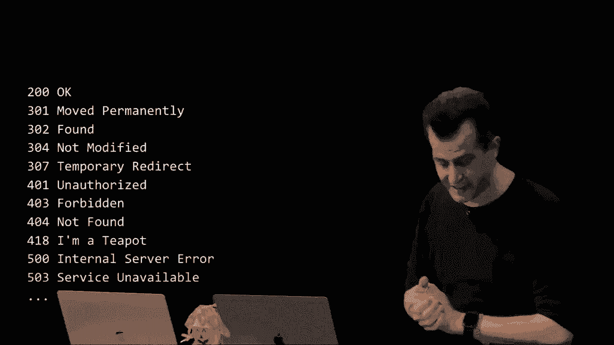

So we can actually have a little bit of fun with this and a couple of different directions。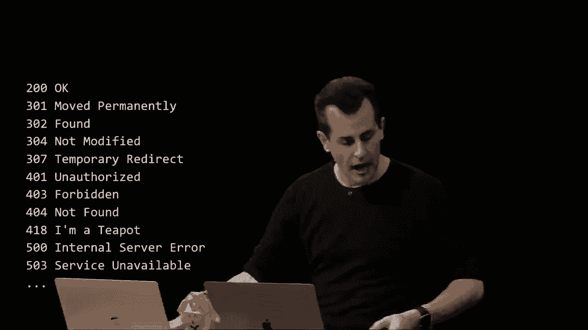

It turns out that if we send this http request，we can take a look at what comes back and let me go ahead and do this instead of using my browser。

I'm gonna use a command line tool，which tends to just be a little cleaner because I don't have to fuss around with all of these buttons。Let me go ahead and use a program called Curl and Curls。Purpose in life is just to connect to a oral。and it's not gonna bother showing me the Web page or any of the contents。It's just going to show me the http headers if I use a command line argument of dash Capital。

I and now I'm gonna go ahead and do HTTP colon slash slash safety。school dot org's and I'm gonna go ahead and enter。And this is my Mac now sending one envelope to safety school dot or。containing get that verb requesting the home page there。presumably going to respond to me with another each envelope inside of which is some kind of response。

Maybe it's a 200。Maybe it's something else。

It looks like forgive May that safety school Orc has moved。permanently per this 301 to this new location。

Www dot gail dot e d u Sorry。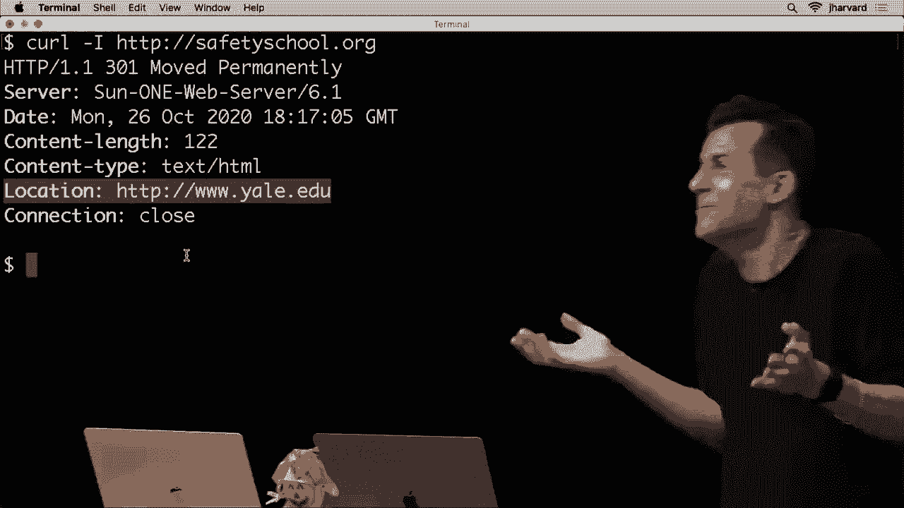

we can do this if I owe copy this URL and let me go into a browser。I'll use incognito again so that I don't have any past history。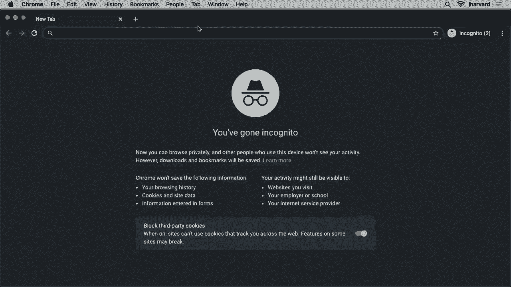

enter and what a lot of the visual effect is。as the headers would imply。with the funny thing about this joke is that someone on the Internet has been paying for the domain name。safety school or for like，20 years now。For this joke on the on Lee thing it does is redirect one domain name。Let me go ahead and transition away from safety school or to Harvard sucks dot org's。

which also exists，and someone on the other side has been hosting this website for some time。

if you visit that girl，let's go to Harvard，sucks dot org's enter。You'll actually see a whole website。So the Yalies really went all out here，and you can actually see an amazing hack here。whereby at Harvard sucks dot org's。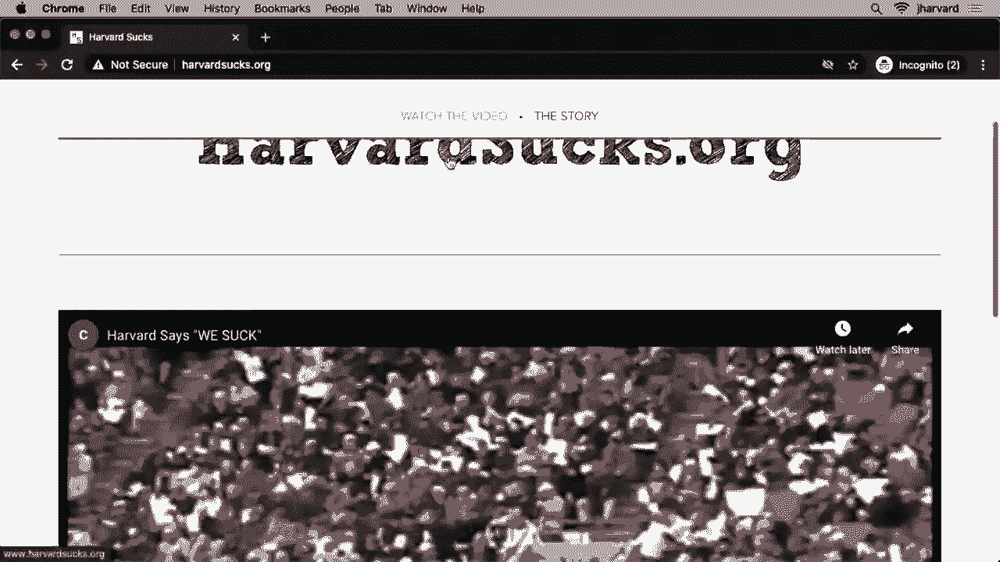

There's an old YouTube video of an amazing hack or prank that was pulled at one of the Harvard Yale football。games some years ago，tricked us into spelling out with a bit map of all things，we suck。So in any bit of a stretch to connect those two underlying HDP messages。But it all indeed relates to these very simple primitives。Let me point out one other thing as well。

We might also see in the form of http，requests even more sophisticated first lines where you're not requesting just。slash the default home page。You're not requesting slash cat J peg or slash index dot html。There might also be question marks and equal signs and notice。This is an excerpt from an envelope my Mac or PC or phone might send to google。

dot com requesting pictures of cats And in fact。

let me go ahead and do this on my browser。Let me go to https。I'm not gonna bother using the insecure version at all。I'm gonna go explicitly to google dot com slash search question，mark Q equals cats。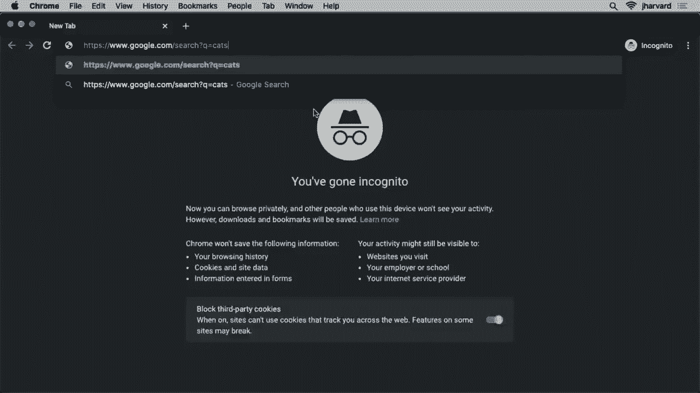

So this is the human version of the URL that my Mac will translate。into this lower level message that's going to be shoved inside of the virtual envelope。So I'm gonna go ahead and enter and voila，I now see indeed，a whole bunch of pictures of cats。including some or horrific photos from a movie that didn't fare well as well。

So that is to say that it seems that once you understand your l formats。you could begin to pass input to servers。And here's now we're re bridge past weeks to future weeks。when we visited Web pages like Harvard do you and Yale dot edu and the like。We're just visiting static Web content。We're not actually providing user input like you would using get string or input。

or any kinds of command line programs we've written。But it turns out that you are else do support user input and their standardized。If you see a question mark and then the name of a variable like Q and then an。equal sign and then a word like cats。

that's like the Web based analog off a command line program。Having asked you what is the value of Q and the human typing in cats？

So this is to say there is a way using you RL's that will actually allow us to pass，input to。that's what's happening when you're visiting google dot com。But it just boils down to understanding these girls。And before we begin to build some of our own solutions on top of this infrastructure。

any questions now，our confusion on http or status codes，or anything we've seen thus far。anything at all？over Thio Santiago。So when you want to，publish a Web page。why is it you have to buy a domain name？Is that because you're you're kind of like using memory and some server？

it's a really good question。Why do you have to buy a domain name？It kind of boils down to capitalism。there is a non zero cost to running certain aspects of the Internet。

certainly a really all aspects of the Internet。There are some non profit and volunteers。nonprofit organizations and volunteers that have historically helped govern it。there's overhead to operationalize ing the Internet。

running things like the main DNS servers and other features and So there are what are called。

Internet registrars，much like a university registrar whose purpose in life is to allow people to。essentially rent domain names on an annual basis。

it's not yours permanently。

Once renewal fee，every one or two or three years or the like。

It might range from a couple of dollars to hundreds or even thousands of dollars。We could go down the rabbit hole talking about domain names。

whereby if you think of a really cool word and you buy the domain name and someone else comes along and wants it。

there's capitalism at play there，potentially a knopper to nitty for you to sell the domain name to someone else。

But in part it helps just regulate exactly who can sign。

up for domain names and presumably put some downward pressure on all of them just disappearing。If you could just sign up for free for as many as you want other questions or。

clarifications on not just http but also TCP I peed ness。or any l thing else from today's alphabet soup。A question came in in the chat。If you have multiple packets that you're trying to send from one place to the other。did they have to be sent out one after the other？Or can you send all the packets out at the same time？

We did not think that we humans could do that very well，choreographically using zoom a bit ago。So we sent one packet of time through through the teaching。

the computer would typically dump all of those packets out at the same time。They would be serialized one after the other，but it would happen very quickly。and by chance they might all follow the same route through the teaching fellows as routers。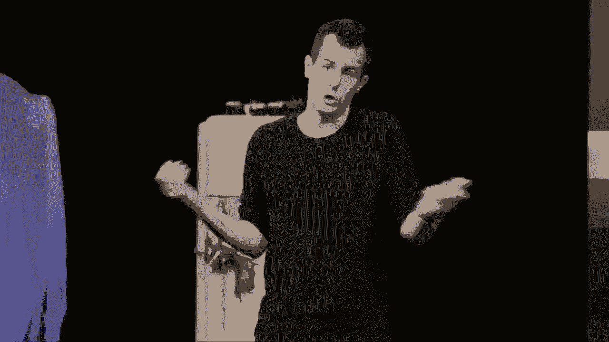

Or they might go in different directions，depending on just how congested or how busy the Internet is at that moment。they might arrive out of order。that's why Brian needs to know what the sequence number is on the outside of the envelope so he can rearrange them。

in the correct order。How did the routers know which way to send any particular packet of data？

Really Good question How did the writers know so back in the day？

And in some cases it's literally hard coded。You can think of a router is having essentially。like an Excel spreadsheet in its memory with it least two columns，one of which is an I P address。the other of which is like the direction it should go out on。like right left up and down like the cables are going in。but you can think of it in metaphorically。

it tells the router that if you receive data for this I p address。send it out on this cable or if it's for this I P address。send it out on that cable on All of these cables are connected to other routers in the same city。in different cities across an ocean to some other end point。That would be very painful。

if humans had to manually configure all of the interconnections。We saw Mitt map just a bit ago。and so it turns out there's other protocols out there that we won't spend time on in this class。but that drought er's rely on in order to dynamically adapt。There are protocols that will figure out if all of a sudden my packets are not getting through。

I'm going to start routing around that dynamically。and the routers are going to figure out that does not seem to be a good destination。

because I'm not getting any response or it's just taking way too long to hear back。So there are protocols that govern how you can decide whether to start dynamically changing。those so called routing tables。

the spreadsheet to which I referred earlier。so we have now at this point an infrastructure known as the Internet that allows us to。send packets of information from point A to point B by writing addresses and port numbers on the。outside of those envelopes，we have another protocol called http。which is specifically used for Web browsers and Web servers separate from video。

which have their own set of conventions and protocols。But we have a mechanism for get requesting information and responding with information。and we know from problems that for how you can respond with a cat，it's just a sequence of bits。Whether it's a bit map or Jay Peak or something else。

but we haven't yet seen what an actual Web page looks like。if we look a little deeper in the envelope that I'm sending to Brian and he's sending to。me and you were getting back from Harvard and we're getting back from Yale。we're going to see another language altogether。It's not a programming language per se。

It's what's known as a markup language，which just means it's more about aesthetics than it is about logic。And there's gonna be a couple of other languages tucked in their CSS cascading style sheets。which is a proper programming language。But let's go ahead and take a five minute break here。we'll learn to make Web pages themselves。

So when you visit a website requesting the home page or a specific，file on the website。exactly what is inside of the virtual envelope a little deeper down below the HDP。headers that you get back from the server。that language is known as HTML hypertext markup language。

which indeed is not a programming language，which means there's no loops，there's no conditions。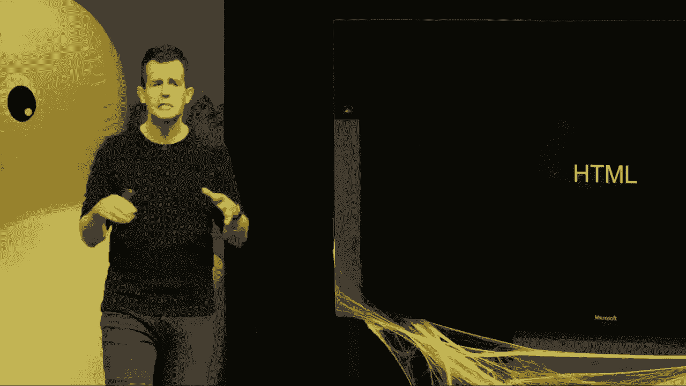

There's no functions or variables per se。It's just text that tells the browser fairly pedantic。Lee top to bottom left to right。What to display and how。

So let's take a look at some examples。HTML pages gonna contain really two different concepts inside of it。

What we call tags or elements Andi also attributes well。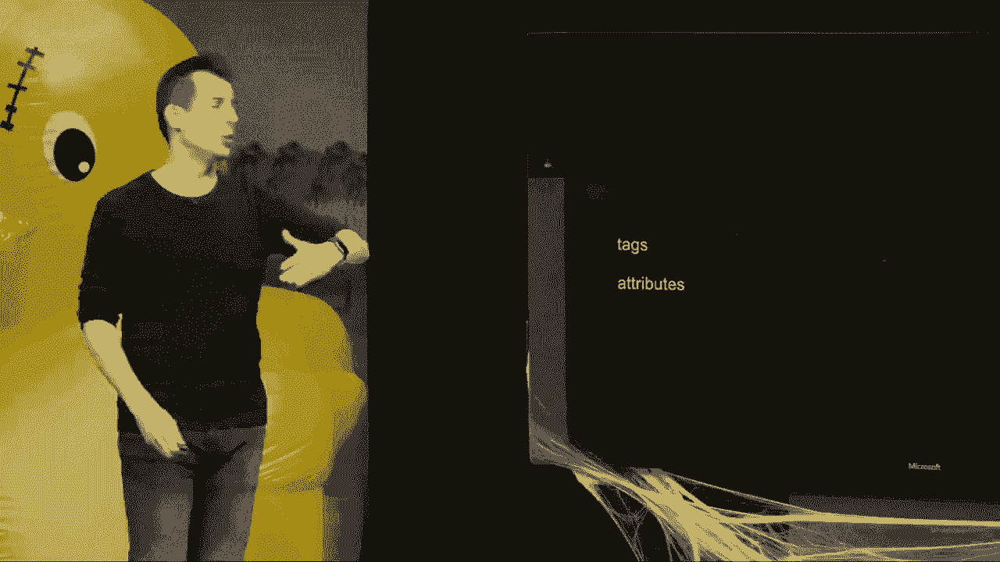

here is perhaps the simplest Web page we can make，and this is HTML itself。and you'll see that it's structured and kind of ah，symmetric way。Something's air indented like in a proper programming language。But there is some symmetry to what's going on here。

So let's tease apart top to bottom exactly what we're looking at here。This very first line is known as a document type declaration。Long story short whenever making a modern Web page。this should just be the very first line of your file。no matter what it signifies that you and I are using the latest version of HTML。which is Version five。this line will probably change as HTML itself。The language evolves as humans and more and more features to it below。then notices a pair of what we're gonna call tags。Tags are things between open brackets。

Let's start with a word like HTML or some succinct phrase like that optionally。with something like this word and an equal sign and maybe something in quotes after that but highlighted in。Here is the first of our HTML tags，this tag is the HTML tag。And the way it works is as follows。When a browser receives of envelope containing text like this。

it first reads that first line and says，this file contains HTML Version five。What's what comes after it？here is the contents of the Web page。browser here comes from HTML。Notice down here is sort of the opposite of that statement。When you get to the end of this file。you'll see a similar looking tag，but there's a forward slash in front of the same word。

That's what we'll call a closed tag if we think of this as an open tag。or if you think of this as a start tag，this is an end tag，and most tags indeed have that symmetry。whereby when you open them once，you should eventually close them ideally in the appropriate order。Notice that you don't have to repeat other stuff when you close a tag。

You just mentioned the name of the tag to keep it fairly succinct。that's it for the HTML。what's inside of that？If we look down below this，you'll see that there's this thing here。which is what's gonna be called an attribute。Attributes tend to be short。succinct phrases that have some special meaning for that particular tag。This particular attributes。

If you read the documentation for the language，HTML will say that if you add Lang equals quote unquote something to。your HTML tag，that's gonna be a clue to the browser that says，Here comes HTML。And by the way。the contents of this Web page are going to be in English，by default for E N。Every language in the world has its own two digit or three digit three character to character or three。

character code that could be placed inside these quotes that will standardized。exactly what the browser interprets it as useful these days。like translation enabled in your browser。It knows what language the pages written in so that it can help you translate it to your own spoken。there's two sets，two pairs of tags，the head tag here and the body tag here。

And I've highlighted them both at the same time because you can think of these as both Children off the。HTML tag。So if we borrow our metaphor of，family tree and some kind of hierarchy here。if you think of like the HTML tag is being like the parent。This parent has two Children ahead tag and a body tag。

each of which is respectively opened and closed。Let's consider the first one the head tag。What's inside of that，Inside of that is the title tag，as you might guess by now。is going to represent the title of the Web page were writing specifically。The title of this Web page is gonna be literally and just goofily Hello。

So that's what you would see in like the tab of this Web page。Let's back up a little bit and look now with the second child of the HTML tag。this so called body tag。This is going to be the big rectangular region of the Web page。otherwise known as the body or view port。And here we see that the contents of that rectangular region of the page is gonna be literally。

this is the HTML for a fairly simplistic Web page whose title。bar in the tab is hello comma title and whose body in the big rectangular region，comma body。And it's perhaps helpful now to call out explicitly that we can think of this all our。Five is really a data structure，even though it's just text inside of that envelope that gets red top to bottom left to right。

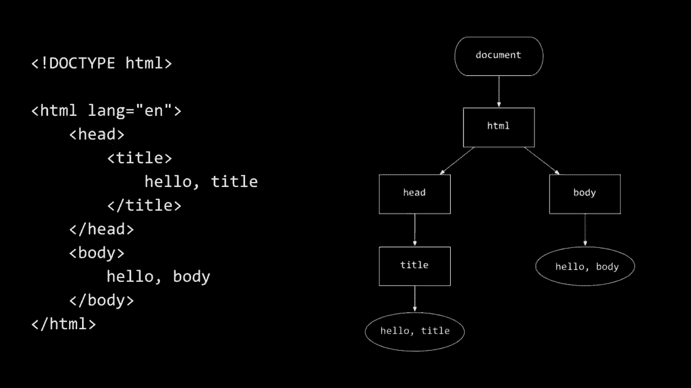

What the browser is actually going to do on your laptop or desktop or phone is actually。build a data structure in memory。So Microsoft，who wrote Chrome or Apple，who wrote Safari。wrote code that reads html top to bottom，left to right like a big long string parses it that is。analyzes it and builds up into the computer's memory。

A tree like data structure like this much like for problems that five。You built up your own hash table in memory for what was otherwise just a big text，file of words。So you can see the hierarchy here。If you think of the whole file is being the so called document will draw a node。the very first and on Lee Child of that is the HTML tag。

every Web page has to start with that HTML tag。It has two Children，as I proposed head and body。and then head has a title child and that has a child itself。which is just text and just to be a little nitpicky of deliberately drawn these nodes in。slightly different shapes，just to ca note that HTML head title and body。

are indeed all tags opened and closed。These ovals here are just text。Those air not inside of those air，not tags themselves。That's just raw text here and here。and then the document note is the one random one。This is the only thing that's going to start with an exclamation point。typically，unless you have what we'll call comments in HTML。

which are just notes to self that we saw and see。And in Python they're similar syntax for those。if this is the simplest Web page we can make，where do we make it？

So you could certainly just open up your Mac or PC and open up something like text。edit or note pad X and type this out。Save the file and open in your browser。But that's not that interesting，because if you just save a HTML file on your Mac or PC。you are going to be literally the only on one in the world who convince it it。

you want to server on which you can write and save your HTML so that other people。can visit the file via the Internet。we all have access to a tool already called CS 50。which itself is a Web based tool for writing code，and the code will start writing now just happens to be an HTML。So let me go ahead and do that。Go ahead and open up a new file。

I'll go ahead and call this say hello dot html dot。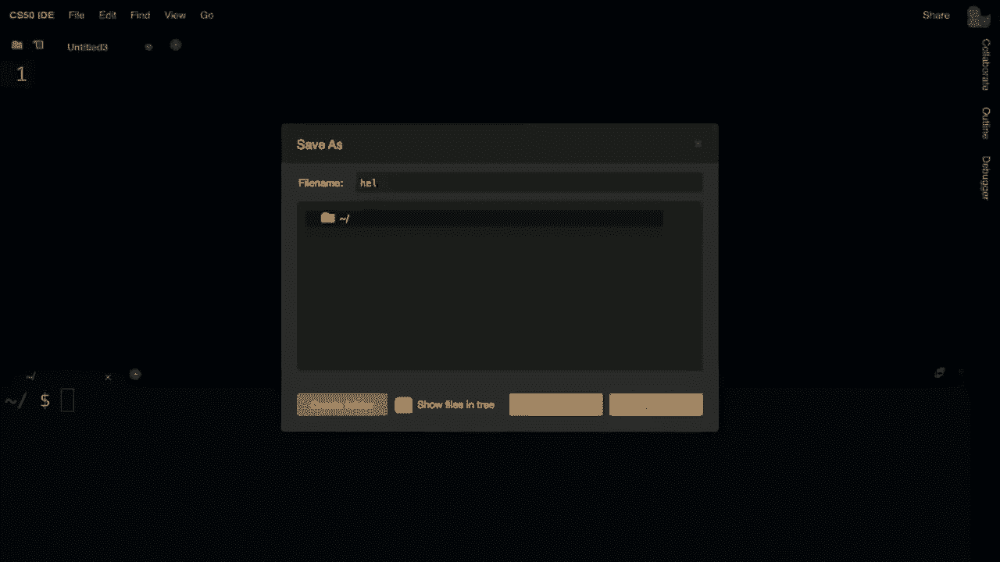

Being the conventional file extension on，let me just go ahead and re type that。So doc type HTML says。Here comes version five html Lang equals quote unquote e n。And now notice what the idea is doing for me，For better or for worse，depending on your preferences。it's gonna try to complete your thoughts for you so you can just type less。

This is increasingly a feature of IEDs，integrated development environments because now I can type roughly half assed much。I'm gonna go ahead and open the head of the page，notice it got automatically closed。I'm gonna go ahead and open the title of the page that will automatically close as。And let me go ahead and just do something like hello title。

And then down here outside of the head tag，I'll do my body tag and do Hello，comma body。strictly speaking，this indentation is not necessary。If I wanted to be a little more terse and not uses many lines。this is totally reasonable is well and it's probably reasonable。If I had a crazy long title。

I probably should move it to a line of its own。these details are not going to matter to the computer。to the browser reading this。But they certainly make it prettier and easier for me。the human and presumably you to read as well。So I've gone ahead and save this file。and in the past I would have used，make for C or I would have used Python for Python。

But neither of those is applicant because we're not writing or running code。I now want to visit this Web page，I need a browser and I'm all set there。I can use chrome safari whatever on my own Mac。But I also need a server。and it turns out that CS 50 i d。In so far as it is already a Web server that we used to write code。

we can use it as a Web server to serve our HTML as well。a moment a little bit ago。when I played the role of a Web server，I need to essentially implement in the idea that same notion of some program that's just。gonna listen and listen and listen。Like I was waiting for Brian。And any time I get a http request from anyone's browser。

I'm going to respond with the appropriate file。Now we're not going to implement a Web server ourselves。Web servers or kind of commodity。anyone can just download or pay for one and use one。the idea comes with one quite simply called http dash server。So this is a program preinstalled in the I。It's free and open source。

You can use it on Lenox or Macs or PCs as well，but it's pre installed in the I D。And when I run it。what it's going to do for me is start curiously，a second Web server。Because the idea itself is already running on CS 50 Zone Web server。I need to now run my own Web server。But in order to distinguish one from the other。

I'm just going to use a different port and by default，the port that ccs 50 i d uses is this 1 80 80。So again by default。Most Web servers in the world to use Port 80 insecure and Port 443，if secure。But those air unfortunately already used by CS 50 Idea itself。which is running already on CS Fifties Web server。So if I want to use the same server。

the same computer in the cloud to listen for other requests of my own。I'm just going to start my own second Web server in parallel and just haven't listened on a different。And that's just so that you and I can run our own Web server。even though we don't have control over the idea itself outside of our own accounts。

Now it's a pretty cryptic looking host name，It's this random thing。Zero CD 83813 and so forth。But at the end of the day，it's just a oral noticed that it ends in CS 50 X y Z。which is a domain name that we bought and we use solely for this purpose of running Web servers。

on CS 50。I'd so if I go ahead and click that and click open Y la。I will now see a fairly arcane textual listing off all of the。files in the folder in which I just ran。Http server and let me go ahead and zoom in a little bit and you'll see that there's only one file in there thus。far that we've written hello dot html。So let me go ahead and click on that file and voila！

There it iss hello body，my very first page。I don't see the title because I'm in full screen mode。but let me go ahead and on full screen myself。if I zoom in on the title and the tab off this page。comma title。So what has just happened？I happen to be using CS 50 I to eat just because it's convenient。You and I already have accounts on it。We're running our own Web server。

implementing the software version of the role I was humanly playing earlier。I'm using chrome as my browser，just like Brian was our browser in the story before。And so when I visit this long U R L in my browser's bar that the server told me。to visit notice that it ends with slash hello dot html So，all in one environment。

I'm sort of serving Web pages and requesting Web pages。because this is what a real world software developer would dio when building their own websites or Web。They want to actually keep everything local and work on it and work on it until they're ready to release it。Any questions or confusions thus far on the web page？We just built any，questions or confusion。

Brian done here？let me go ahead here and point out one thing in the tab here。some of you very cleverly are actually amazingly transcribed that your because I'm seeing more。Http requests coming in right now。Notice that in the terminal window of my ID where I ran http server。I'm seeing row by row，the requests coming in，and so this is kind of a log because my web server is still running。

And if any of you actually want to type out that same u r l again。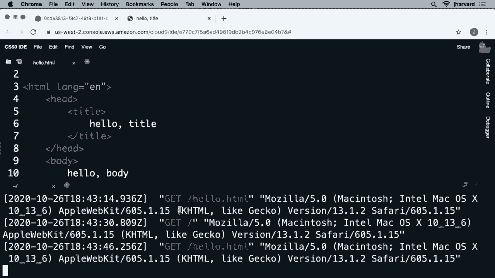

if you rewind in time in the video，you can actually visit my hello dot html file right now on the Internet。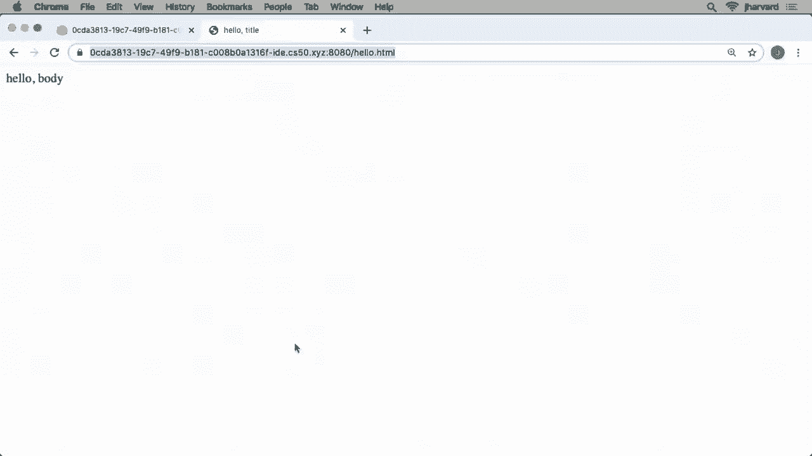

assuming you're watching Lecture live and you can see New Rose appearing in my output here。

But that's just to say it's useful for us，but let me go ahead and do something else here for just a moment。I'm gonna go ahead and in a moment，create another file，this time to demonstrate some other HTML tags。So let's go back here and in my，I'll keep my terminal window running。But I don't really care about the output now，so I'm just gonna go ahead and minimize it down there。

I'm gonna go ahead and create another file appear called paragraphs dot html。

and let's see if we can't introduce some other features of HTML。I'll go ahead and type out the same as before。Doc type html。My HTML tag with my Lang for English attributes。the idea will get confused。If I sort of started thought，don't finish my thought，then try to finish it again。

You might just have to clean up with The idea is trying to do for you to be helpful。I'm gonna go ahead and create the head tag here。I'm going give myself a title here。I'll call this page paragraph，so I'll keep it all in one line just to keep it succinct。Open up my body。And now I'm gonna go ahead and type out like five paragraphs of Latin text。

that I'll just go ahead and put right here。Let me go ahead and invent this nicely just to make it nice and readable。This is your sort of Lauren ipsum text，which is just sort of Latin like nonsense。And here I have five paragraphs of text now。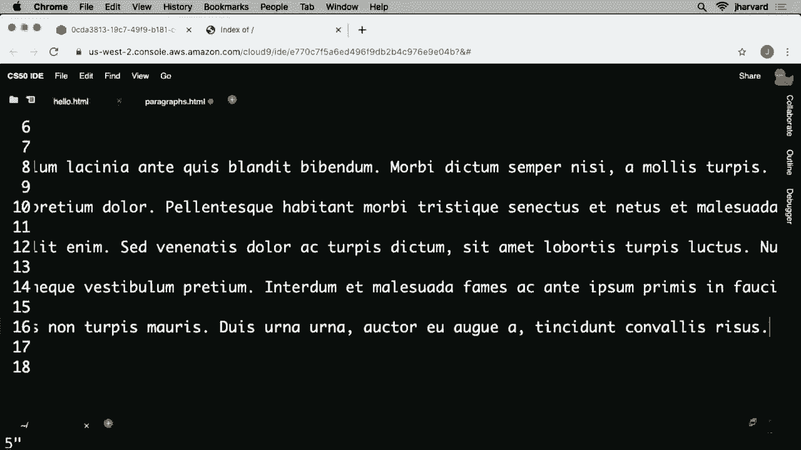

It's way more than just hello body。So let me go ahead and save this file。Let me go back to my other tab here。Notice that nothing has changed until I click Reload。which will reveal the latest contents of my folder。So let me click paragraph。study HTML and I should see five paragraphs of Latin like text。

huh？that's just a big mess。One massive long paragraph。Any instincts for what？The bug here might be？

Any thoughts on the chat？Or were the raised hand，over Thio Ryan？At least from the way it's set up。It doesn't look like HTML has kind of auto line spacing by default。So it's not going to kind of collect them all into this one big string unless you somehow。create a space in between each paragraph。like most any computer language programming or otherwise。

is gonna take you literally。And if you don't tell it what to do using an HTML cases these tags。it's just going to do some default behavior instead。So let me actually go back。Thio CS 50 id。Let me introduce another tag here。Turns out there's a tag called the paragraph tag and the shorthand notation for that is。quite simply open Bracket P closed bracket。The idea is gonna try to finish my thought。

but because I already have the paragraph，I'm gonna need to manually fix this myself。So let me go ahead and open it there and let me go ahead now and just kind of insert a few of these。one there and let me go ahead and copy the closed tag one there。one there and one there and now let me，just for style sake in Dent further。

And I know that pretty much in every past week I've claimed that copy Paste is bad。Not really the case with HTML，because if you want multiple paragraphs，there's no notion of a loop。You can kind of create five paragraphs of Latin like text with HTML alone。in this case is the right solution。let me go ahead now and go back to my other tab and now hit。

Nothing's going to change until you tell it，So just like you would reload a normal website。let me reload my own。And voila！We fixed the problem that Ryan identified by now explicitly using HTML paragraph tag。And it's deliberately the P tag。Because HTML tags tend to be succinct。It's fewer characters to type。And how do I know it's the P tag？You just have to learn it at some point in a class in a book and a website。

and indeed much like with python as with C，we're not going to aspire to teach you the the laundry list off HTML。tags and attributes that are out there but focused today，particularly on concepts and fundamental。so that you can add to your vocabulary quite quickly via any number of online。let's go ahead and do this rather than do everything from scratch。

Let me go ahead and copy this and create another file that I'll call headings dot html。When writing a paper or writing，writing or reading a book。like chapter headings or section or subsection headings。you could do this in HTML as well。So I'm gonna go ahead and introduce a couple more tags here，namely the H one tag。

which is like the biggest heading tag。I'm just going to write the word one here just to keep it simple over here。I'm going to do H two and I'll say to down here，I'm gonna go ahead and say h three and I'll say three and down here。I'll do H four and then four。I'll do H five here，five and then down here。I ran out of paragraphs。so I'm gonna go ahead and give myself one duplicated paragraph just for demonstration sake so that。

we have all six here and go ahead and save it there。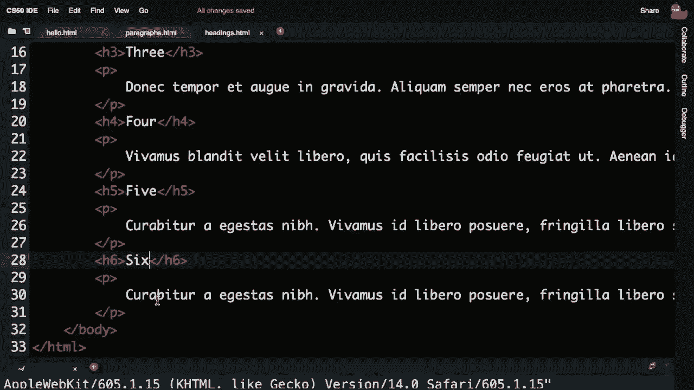

So if I go back now to my browser and reload，Nothing happens because I'm in the wrong file。But if I go back，I now have a file called headings dot html。

and it's the same content。But now it's kind of getting a little prettier，It's big and bold headings。1234 Notice those headings。You're getting smaller and smaller。but that's kind of the convention in a book or an academic paper。where your sections and sub sections and sub sub sections get smaller and smaller。

And we can customize this if we really want。But out of the box HTML gives us the ability to even format things like headings like that。what else can we do in HTML？let me go back to my I d。Let me go ahead and copy paste some of this just to save some time。and then we create another file called Say list dot html。

Turns out HTML makes it really easy to write lists。Two lists and down here if I want to have a list of three things like Foo Bar and。which is sort of generic computer science terms whenever you just need placeholders like X y and Z and math。few Barnabas or what people tend to reach for All right，I have a nice clean list there。

Let me go back to my other tab。Go back to my directory index here and there's list at HTML。Same problem is Ryan identified again。If I don't pedantic Lee，tell the browser，Start a list。It's just going to assume that I just want one big block of text。it preserved white space。It collapsed all of those new lines and tabs into single spaces。

But that's not what I want。So how can I fix this？I need some kind of additional tag。and it turns out there's a couple of approaches。There's the A Northern List tag。So you l for a Nord Erred list，which means it's not numbered and then inside of that。you can have child tags called the L I or list，Let me give myself another one bar and give myself another one。

So it's more to type。And definitely there's almost a many red characters the HTML。which is just being nicely syntax highlighted for me by the ID than there is actual content。But if I now go back here and reload，And if you looked at the Courses website。we actually make heavy use of bulleted lists for content and invitation and so forth。

We're just using ah，whole bunch of ul tags。you wanted the computer to number things for you。you could certainly do like this 123 But you can imagine。that getting a little annoying quickly if you want to reorder things or add things in between。So computers are really good at doing tedious things。

A Northern list toe in ordered list using ol instead。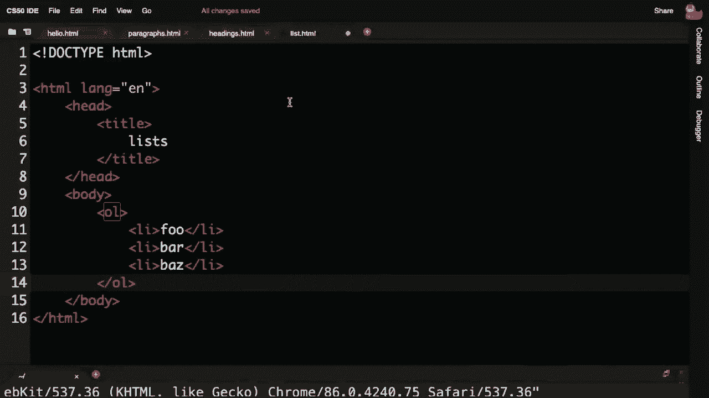

And if I go back to the other tab，Now it's 123 and it's automatically numbered for me。

I don't have to worry about it at all。Let's do one other that speaks to the sort of structure of a page。Let me go ahead and copy my starting point。Hello and create a file called Table HTML。If you ever wanna layout tabular data where you have rows and columns because you want to。make sense of some financial information or just something akin to a spreadsheet in your own。

how can we do this？Let me go ahead and call this table。And down here in my body。let me introduce the table tag and the table tag is a little more involved because you have to。define what are called table Rose so I could do a TR tag there and then inside，So TD for table data。Let me just put like the number one and let me go ahead and make let me mock up something a little familiar。

like a phone keypad two and three。Then let me go ahead and copy this once more and give myself another row with。456 and let me give myself one Mawr of those，with How about seven，89 and then。one mawr of those just to give myself like the equivalent of a keypad and do like the。asterisk and then zero and then the pound key。Let me save this。

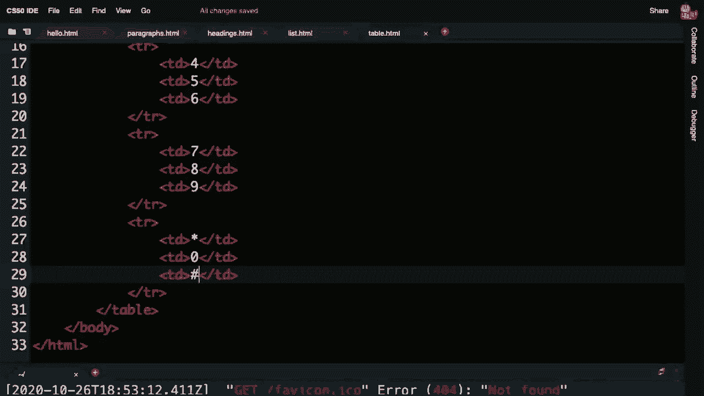

Go to my other browser tab。Open up table dot html and while you see something。Akin toa like an old school phone keypad there and there's sort of implicit rows and。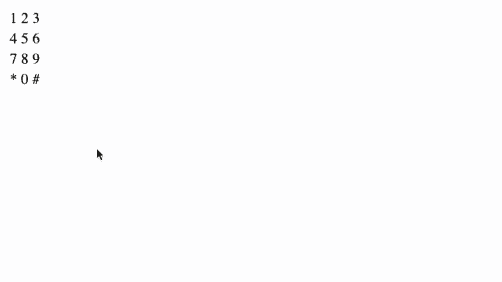

I could make it a little prettier with actual lines or borders in between and around these things。But HTML gives them the ability to lay out tabular data using TR's for。table rose and TDs for the columns there in。this is all pretty boring and textual and really not the Web that you and I all know。So let me go back here and let's do something a little more interesting。

Let me go ahead and start off a file called Maybe Image HTML and。let me go ahead and start with our boilerplate。I'll rename the this title image and down here。let me go ahead and do something like this。Let me go ahead and do image。How about source equals？

Quote unquote harvard dot jpeg。It turns out I came with oven image of Harvard in my i d and let me go ahead and。describe it as much to let me add this。Ault attributes here Harvard University。and we'll come back to what this means in a moment。But here we have the second tag thus far That actually shows us。

how to customize the behavior of a tag。So the Lang attribute earlier customize the behavior of the whole Web page by telling the browser。Here comes a Web page written in English and down here we have two attributes。which has a value after the equal sign and then source SRC。which itself has a value after the equal sign，you can use single quotes or double quotes。

but you should be consistent on do you can。But each of these attributes should have an equal sign in between the key and the value。So how might I go about doing this？let me go ahead and open up this file。Now let me go ahead and grab this real quick。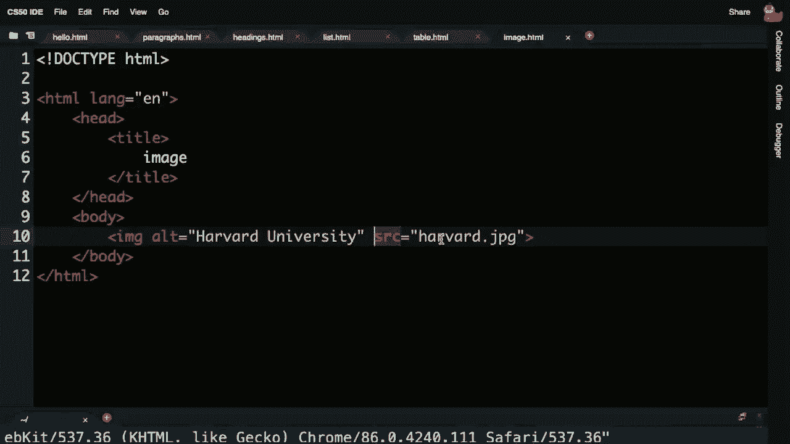

Give me just one second to get this demo ready and let me go。ahead and give me one sec to make sure I have my image in。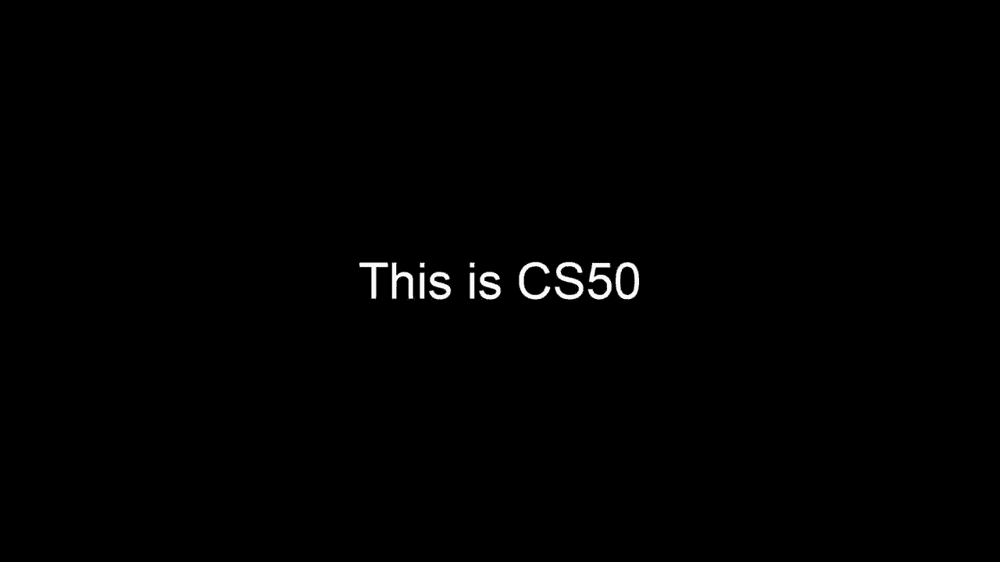

let me go ahead and open up。Our other tab were over in there。Let me go ahead and reload。We should see now image dot html and Harvard JPEG。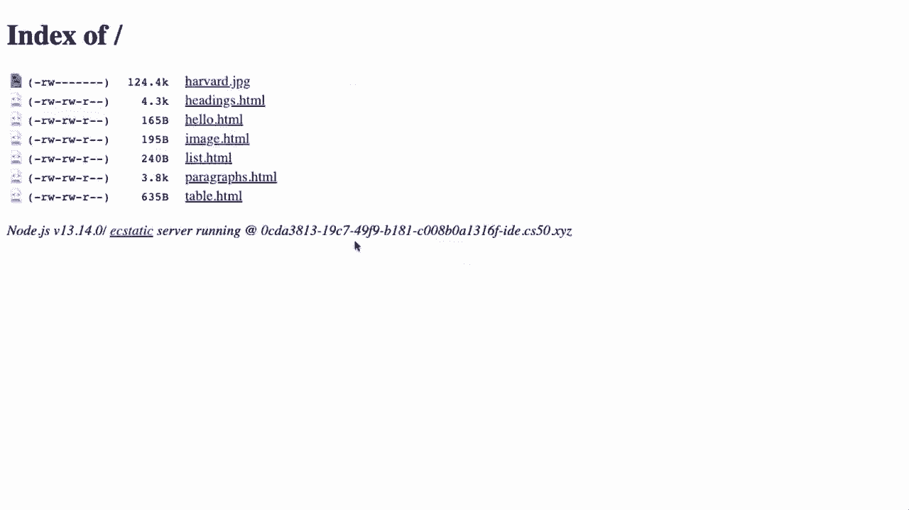

which I just grabbed for my ID and Walla image dot html is theory journal。painting of what's adorned our backdrop here for the past several weeks。You can link to a specific image like that，and what's the role of the altar attributes？

So the altar attributes all too overlooked by new and experienced programmers alike。But this speaks to accessibility。Not all of us can necessarily see and hear and interact with media in the same way as others。And so those who have difficulty with site or with sound or the like。the Ault attributes is a wonderfully powerful and so simple mechanism to include on your。

image tags that literally just describes in English or your own spoken language what it。is a human would otherwise be looking at，even if they are perhaps blind and cannot actually see what's there。And if they have a screen reader installed software that actually can vocalize text on the screen。this incredibly usefully helps people hear what it is that you and I。

might otherwise Onley be looking at。So be sure to be mindful of those kinds of tags。and you would only know that these tags exists by again taking a class reading a book。Looking at our online reference，we're just beginning to add to now our vocabulary。let's take this one step further and do something a little more powerfully and familiar。

let me go ahead and create a file called link dot html。Let me paste my starting point there。I'll re title this as Link。is filled with links。hypertext markup language is all about hypertext。which is an arcane illusion to links。Hypertext is context with links that link elsewhere。So how might I implement a link in a Web page？let me go ahead and in this page initially。

just encourage people to visit Harvard Period。Let me go back to my other browser window open up now linked html。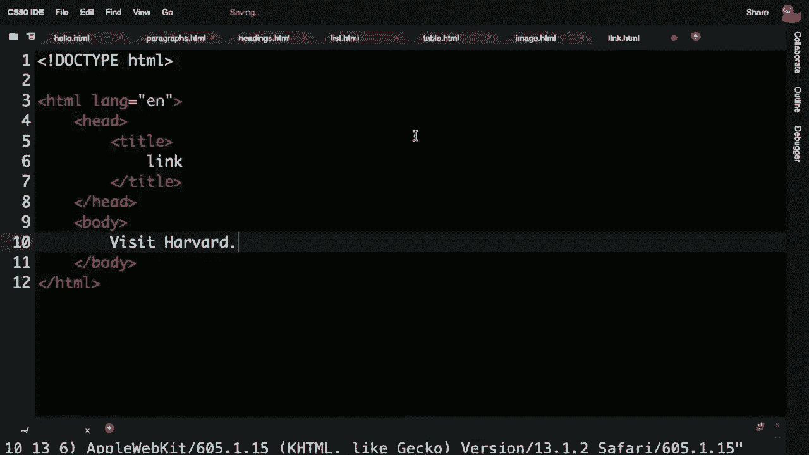

this does not really do anything I can click on Visit or Harvard or anything else and have it do。anything because it's obviously just text。

So how can I actually link the user to some destination？we need another tag。It is called the anchor tag，abbreviated with a single letter A。And it has an attribute of h ref for hyper reference and hyper reference just means。What do you want to link Thio？let's go ahead and keep it simple。

Let's link to a file I already created Image HTML and the，word I want to link is literally Harvard。So on the left of the word Harvard，I have a terrific was quote unquote image html。I have the clothes tag and again notice。Just because I had an attribute on the tag does not mean you need to redundantly copy。paste it in the closed tag。

It suffices to close on Lee the name of the tag。Now let me zoom in a little bit and reload and voila！

Now you see the familiar hyper link that you might see on many Web pages where it's actually。if I hover over that，if I hover over that and then click voila will find ourself at。Harvard University back in 17 92 because now what I'm looking at is image dot。let me go out of full screen mode for just a moment to make clear that the girl at this point in the story。

where I see just visit Harvard in the page is something slash link dot。Your oral will differ from mine，but mine happens to be this long。cryptic string free because it's my account slash link dot html。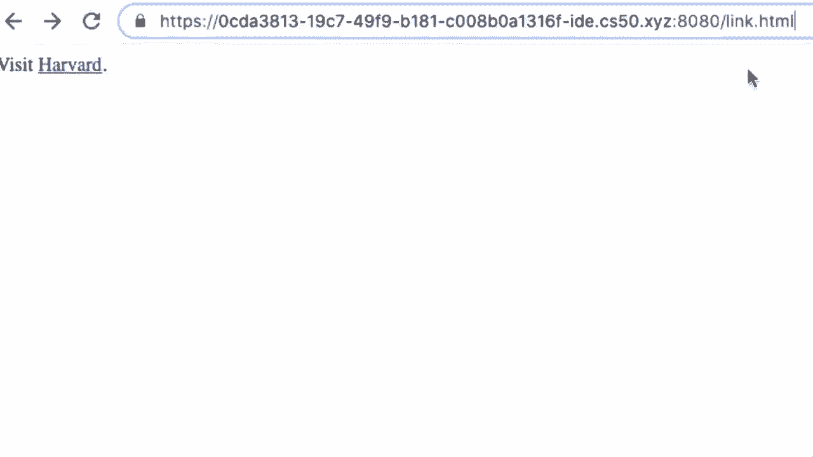

When I click on the link，notice that I end up at image html。thereby taking me to a relative u R l That is a file in my own，If I don't want a link to that file。maybe I want a link to Harvard itself。It's not sufficient to just do Harvard edu。That is not a URL。WwW is not a girl。I need my protocol。

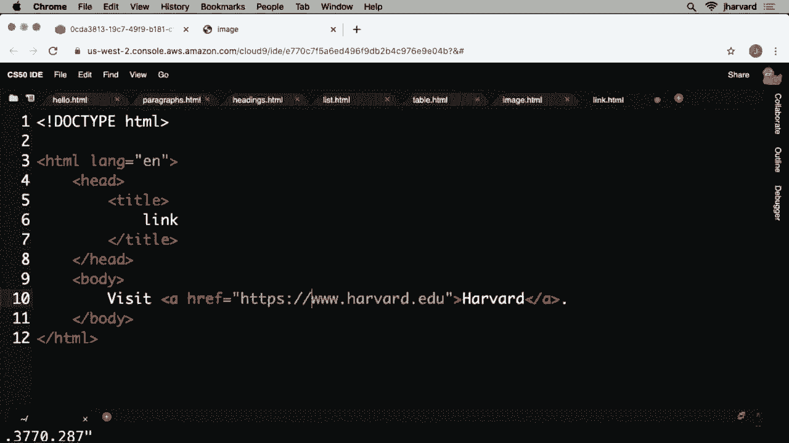

If I save that file now and reload and go back here。The text looks exactly the same。but notice if I hover over it。There's a tiny。

tiny little visual clue at the bottom of the screen that says where I'm going to end up。if I click this now，R L bar is not gonna stay as my i d slash linked HTML。It's gonna whisk me away to the actual Harvard i e。And here it's worth noting that chrome and safari and browsers，for better or for worse。

are increasingly simplifying the user experience or UX of browsers。I am not literally at Harvard I e d。if you click or double click on the address bar。you'll see where you actually are。And this is for developers or worse。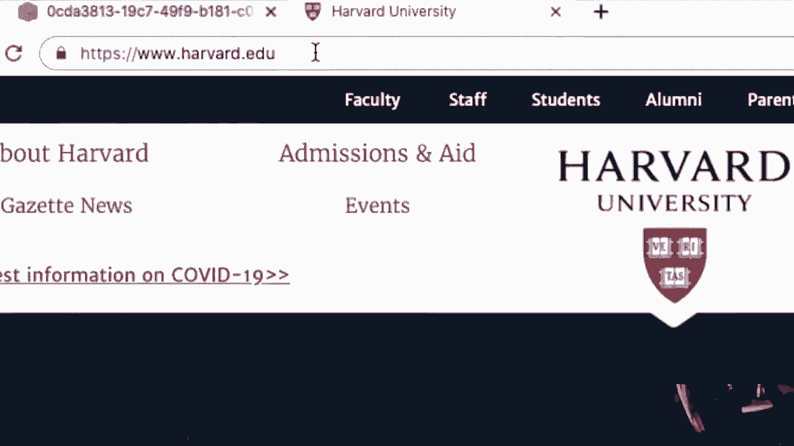

for regular users。It's probably cleaner just to see the domain name。But all of the information is indeed there if you dig for it just a little bit。But there's kind of a new exploit here，There's kind of an exploit here。What if I were to do something somewhat maliciously like this。

like let me change this to Yale dot cdo and leave the word Harvard。If I go back now to my other tab and reload，It looks different at the moment because it's blue instead of purple。Purple by default means I've been there before，which we were a few minutes ago。Blue means I haven't visited before。But if I don't really notice that subtlety。

I might very well think that Oh，this is the university I want to go to。

But while when I click on that wrong place Alright，silly example。But this could really be exploited for ill purposes。What comes to mind or what threats come to mind with this very simple，mechanism right？

Now that you have the ability to make Web pages，you have the ability to sort of say you're going one place。but really lead the user elsewhere。Can you see how this might be abused？

Santiago e think it maybe could be，so evolved hackers who can then insert malicious software to your。and they trick you into doing that？and trick is the operative word。most of us are probably not in the habit of opening up before clicking on a link。hovering over it like I did a moment ago and then very。

paranoiac Li like looking down here to see if my really going to the right place and。even this could be spoofed。You can trick the user into thinking they're going to the right place but still override this behavior。And so if you've ever been the victim of or the near victim of phishing attack，P H I S H I N G。Fishing refers to trying to trick humans and。

Santiago says，via social engineering into doing something that they didn't actually intend。And so you can imagine receiving spam in your email inbox that says。Click this link to visit paypal dot com because you need to verify your password or click here to。tell us your Social Security number。

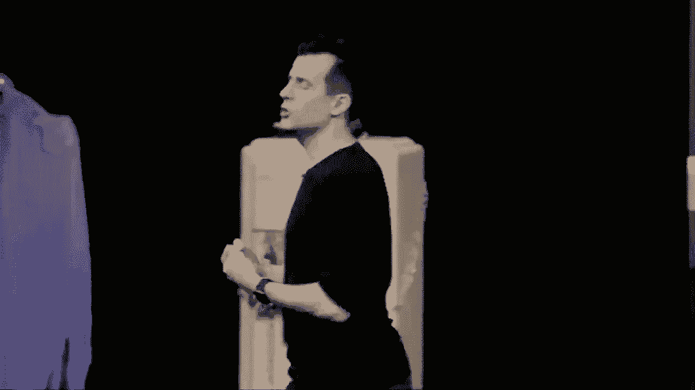

This is so common these days to get emails，which themselves these days are。

If they're not just text，they are HTML itself。When you're looking at any email in Gmail that has clickable links or images。that email contains HTML like we're writing here。It is trivial to trick users into going places。that they didn't actually intend。among the takeaways for today。beyond the mechanics of how to do these things should be consideration for your own personal。

security as to how distrusting you should really be off websites because of。how simple these mechanisms are and how they can lead you indeed，to the wrong place。let's go ahead and clarify just a couple of things Here。Thio one final example and see if we can't Now come back to，that idea of user input。

So let me go back to the idea here and let me grab Ah。little bit of starter code from my hello file as before。and create one final example here called search dot html。That's purely html indeed。I'm gonna name this thing search and then I'm gonna down in my body of the page Cruz，Another new tag。

Turns out HTML also supports a form tag，and that form tag can take a couple of attributes。one of which is action。And this is where you want to have the form lead the user。I'm going to go ahead and come back to that in just a moment。The other is method and the method is the Asian to be verb to use。

I'm going to use get and here inconsistently，it should be lower case。Even though we've previously seen it in upper case inside of the form tag。I'm gonna have a couple of inputs and input whose name is gonna be Q and。whose type is going to be search。I'm gonna have another input whose type is going to be submit and whose value is。

going to be quote unquote search as well。I'm deliberately omitting the name because it's not strictly necessary。But where am I going with this？I haven't actually implemented a search engine。All I'm doing at the moment is implementing a front end to a search engine。front end to google dot com。I'm gonna like Google itself through the hard work of actually searching the date of the Internet for me。

So I'm gonna specify an action of www dot google dot com slash search。So here we have what is about to be，ah form text boxes and buttons that the user can interact with the。action of which is going to be to send the user to this girl using。but that you are l is going to have automatically added to it by my，One http parameter so to speak。

a variable of sorts called Q and why。This will recall earlier that when I visited google dot com。

I was able to simulate a search by literally going to https colon slash slash。www dot google dot com slash search question mark Q equals cats。I claimed that Google is designed by the software engineers。They're to take user input via the URL。you and I do not search for things by typing out long girls like that with Q equals。

anything that would be incredibly poor experience。You and I just type things into search boxes or forms。if I now go into my other tab here for search dot html。you're not gonna be very impressed by the aesthetics of my form。It's just a rectangular text box and a search button。But watch what happens。

My your relative moment ends in search html。I'm gonna go ahead and type in something literally like cats。And now notice if I hit，enter or manually click on the search button。My Web page。which contains an HTML form because it has an action of that's Google's girl and a。method of get my browser is going to convert that into the corresponding，http request and in turn。

girl so that the user is automatically sent thio by double click on it。This full girl here and the users input is automatically by the。browser upended Thio the girl via question mark Q，and it's not just cats。We now have our own very simple Google search engine。

where we can search for dogs to if we want and notice that the U。R L hear changes。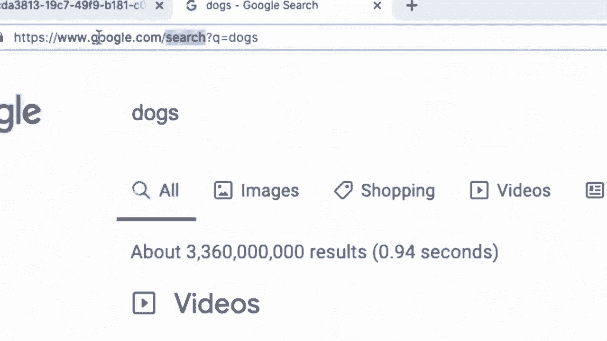

To be question mark Q equals dogs。this is how the Web now works。We talked earlier about how the Internet works，how you just get raw data heroes and once packets of info from point A to point B。This is now how the Web works when you visit a website and don't just want a specific picture of a cat。you want to search for cats or dogs or you want to log into a website or you want to check out of。

providing user input。You are always filling out HTML forms，which look essentially just like this。They might have mawr inputs，and there might be a little more complicated。but they are a form tag on amazon dot com on facebook dot com on any website with one arm。or inputs that when submitted，enter or clicking，submit or search or whatever the button is labeled。

That's how the next request gets submitted to the server。Who so it's a lot。and that's not all the HTML tags out there。But that's all the ideas of HTML。It really is like open tags and close tags，some of which can have zero arm or attributes and just understanding that mental model。And now via forms，we have the mechanism for submitting，user input to search to websites。

toe Web servers and just to call out that other verb here。Turns out Google Onley supports get for its search program at www dot google，You could only use get。But post is also very common。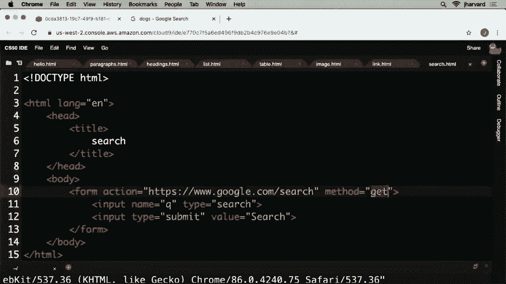

Post is a different verb that could be tucked inside of that envelope。And Post actually changes what happens in the browser so。

that Q equals cats and Q equals dogs does not show up in the URL because this is actually。one other threat to our privacy，If your little sibling comes over to your browser or your parents after you've been searching on the Web。they can scroll through often your entire history of your browser。Because literally everything you searched for on Google or Bing or whatever ended up in the oral。

Because of this mechanism and for user convenience。your browser tends to cash or save all of those girls。Now that's mine early。Intrusive certainly when you have room mates or family members of the like to your privacy。But it's especially concerning if you are registering for websites or checking out with user names and。

passwords and credit card numbers and things that are even mawr sensitive。Long story short post。which is just a different verb that you can use an http that hides the Q。equals cats that hides the credit card number equals this that hides the。

password equals that essentially，deeper in the envelope。It does not put it into the URL bar。

but it still sends it to the server a little more privately。That was a lot of tags all at once。culminating in this ability to get system it user input。the syntax or the implications of making Web pages with this language？Anything at all？

I'm kind of embarrassed by all of the work I've done thus far because all of these pages are incredibly boring。very underwhelming and nowhere close to the sort of user interfaces that you and I are familiar with。day today when using the actual Web。So let me go ahead and close most of these tabs。And let's transition to not focusing on the structure of Web pages alone。

but now focusing on the aesthetics of Web pages，the stylization of Web pages where now you're sort of artistic flair could really come。and we can begin to re create user interface is ultimately more like our world of。where you actually see colors and shapes and images and sounds。but still using these basic building blocks。And for this we need a language called CSS or cascading style sheets。

This to not a programming language，but it is an additional language that you can use in conjunction with。In order to stylized your pages and make them prettier。CSS boils down to the use of what we call properties。Properties are similar and spirits of variables。they're just mawr key value pairs and again notice this recurring theme like we introduced dictionaries。

or dicks in Python a couple of weeks ago。Those air just collections of key value pairs in the form of a hash table。we saw just a moment ago attributes in HTML，which essentially are key value pairs。Q equals cats is a key equals of value。Q equals dogs is a key equals value。CSS has the same idea。But because different people invented this，they call these things properties instead of attributes。

But it's the same idea，just a different vocabulary。and there's going to be different ways to applying different properties like color and font。size and positioning two HTML tags using，So how do we get there？

it turns out that CSS is a language that you can use in conjunction with，HTML。you can start with in HTML page like this like we've already created saying Hello title on hello body。But you can add some additional attributes and or tags to it to begin to。You can actually add a style tag in the head of the Web page here。

which is another thing we could put inside the head，it could go elsewhere in the body as well。Alternatively，you can link to a file in a separate file。and so we'll see a couple of different approaches there。But before we do that。let's make this more real with Cem concrete examples。

Let me go ahead and whip up a new example here in a file called CSS dot html。Just to demonstrate this new language，let me go ahead and start as always。with just my raw HTML with my doc type HTML。Let me go ahead and do my html Lang equals English。Then down here I'll do the head of my page，the title of my page。

I'll just title it simply CSS the body of my Web page。And now let's actually do something interesting。Let me introduce a few more HTML tags。that are available in the language。One is called Header。And here I'm gonna go ahead and say something like John Harvard。

I'm gonna make a home page for John Harvard，the founder of Harvard。and let me go ahead here and do a main section of my page。And I'm going to say Welcome to my home page And then down here。I'm gonna have a so called footer on inside of here。I'm going to say copyright like copyright symbol John Harvard。So super simple Web page three lines。And just here's three new HTML tags。You would only know this again from a class A book or an online reference。but there are tags called Header Main and Footer that don't do anything。

They don't make things big and bold，like the heading tags did。H one to h six。They're just what are called semantic tags they are mawr than generic paragraph tags。and they help the browser know that。this is the header of your page。This is the main part of your page。with screen readers distinguishing what's really important on the page。

It can help with translation tools like Google translate to know what you actually want translated like the main part of the。page and not less important info like the Header or Footer。So just three HTML tags。But you can think of them like paragraph tags，but with more specific names。so let me go ahead and save this file。but go back to the index。And now I have a new file CSS html。

Let's click it and voila！You know it's pretty underwhelming，but it does what it says。It's got three lines With this content。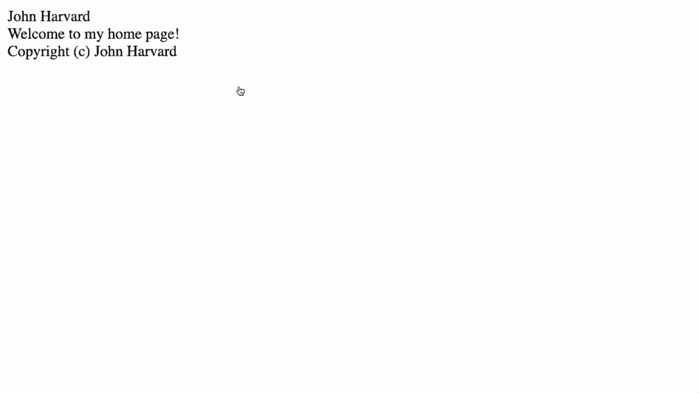

let's begin to style eyes this and try toe，make it a little more inviting。let me go ahead and add a style attribute with equals。Now here's where things get a little weird in the world of HTML and CSS。You do actually or can actually co mingle the two languages，and we kind of saw this already。

We saw Python code with sequel inside of it。Today we're seeing HTML code with CSS inside of it。inside of these quotes，I'm gonna put some of those so called properties key value pairs。Let me go ahead and change the font size of my header to be large and let me go ahead and。align the text as centered and notice the pattern。Here It's new。It's not an equal sign。

there's not additional quotes。left hand wasn't talking to right hand。and different people invented HTML and CSS essentially。But font size is the name of a CSS property and aesthetic detail。Colon is what separates the key from the value，and the value in this case is large。

and I'm choosing large because it's one of available ones。extra large and a bunch of others as well。You can also use specific font sizes or pixel size isas。text Daschle line is gonna align text colon in the center now let me go ahead and do something。similar here on the main tag。Let's do font size medium and then text align，center and then down here。

Let's do style equals font size。Small because it's the foot，Text align center。And I'm sad to say the semi colons air back。They're not strictly necessary in all places。but I'm doing it for consistency。There definitely needed here to separate keys from other keys。

Let me open up this page again。Reload and wa la It's a little prettier。It's nothing to write home about，John Harvard is large。Welcome to my home page is medium and the footer as something small。And let me clean this up to this open parenthesis。closed parenthesis isn't necessarily that pretty。

I don't know where the symbol is on my screen，but let me go ahead here and let me type out this ampersand hash。169 Semi colon。but this is a feature of HTML called in HTML Entity。which is a numeric code that identifies a symbol。

that is often not on your keyboard，but you might want to display anyway。Let me go ahead here and reload。And while a fi zoom in now we have a proper copyright symbol。And there's other HTML entities for other A symbols as well。

especially if you can't see them on your keyboard。what happens after this？

but I feel like there's an in elegance here。Can anyone recognize in the code I've written this far？

Even if you've never seen HTML before，is there an opportunity for better design？I claim it's correct。but feel free to chime in in the chat。Can I improve the design？

And even though I said earlier that Copy Paste is bad。that doesn't mean we can't or is necessary in HTML。That doesn't mean we can't chip away at it in some places。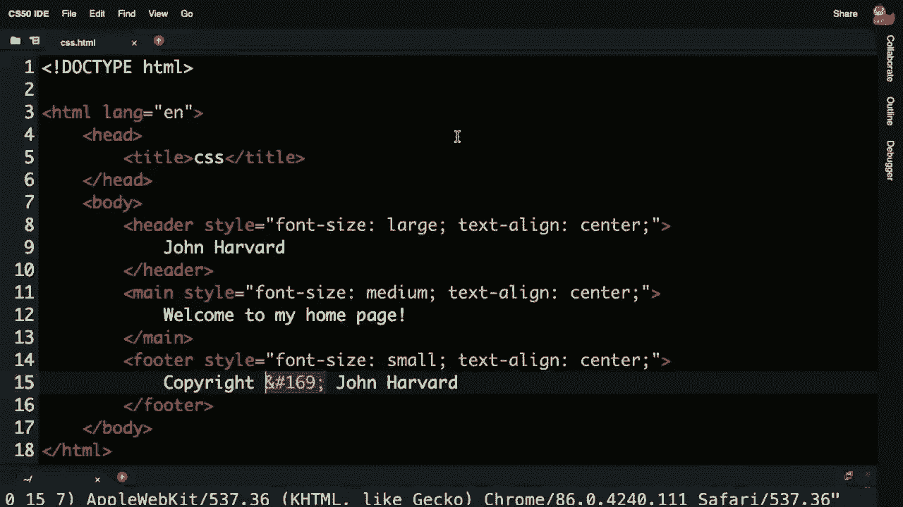

Any thing jumping out。Some people are saying that your style attributes are starting to get very long。They are getting along。

and I definitely redundant，even though the font size is changing，so that seems kind of necessary。Text the line center text the line center text，the line center that seems unnecessary。Like why am I doing that again and again？But here's where the C in C s s comes in。CSS is cascading style sheets which literally refers to kind of a waterfall effect。

off these properties。So what I can actually do is let me go ahead and remove text。align center from each of header main and footer and let me，Let me go up to my body tag。which is the so called parent tag for those three at a style attributes there。and put text the line center there and trust that because body is the parents。

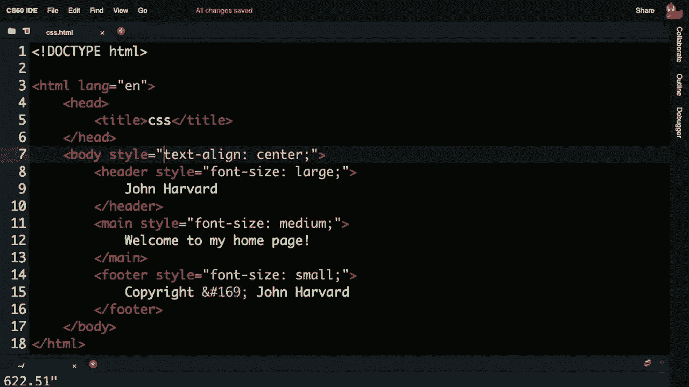

any properties it has will cascade down onto，thereby allowing me to define textile line in one place instead of three。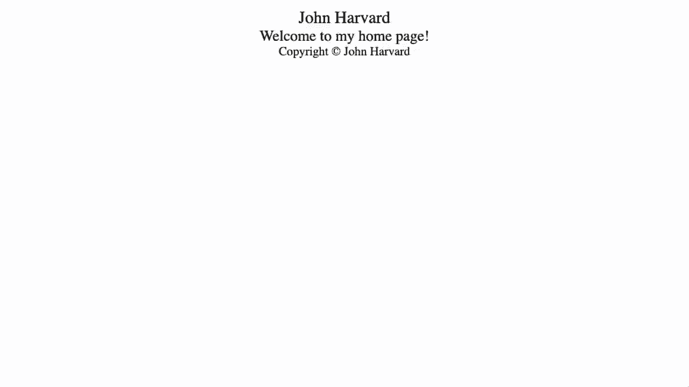

Let me go ahead and reload the page and voila！Nothing has changed。But I claim now that my pages better designed because I've eliminated that。redundancy and made my lines to Brian's point a little shorter as well。but this seems a little bit of a slippery slope。If if I wanted to make a larger home page。

which surely I might with lots more content。Having all of these style attributes all over the place very quickly gets messy。that makes it hard for you and I to collaborate with better artists than you or I might。It might be nice for one of us if working on a team，maybe for even a CS 50 final project。One of us does the HTML one of us does the CSS。This would be a mess if you and I were trying to collaborate on the same exact file。

So let's see if we can take a step toward factoring these out and keeping HTML，and CSS separate。So how might I do this？let me go ahead here and get rid of all of this。Let me get rid of all of these style attributes，which again just doesn't feel very maintainable。My page gets longer and let me transition to that other format。We saw a teaser for before，style tag。

but a tag that can go in the head of the Web page here and let me go ahead and do。something a little different here let me go ahead and say My header should be，text ah line center。My main part should be text a line。Let me do this just like if we didn't see text align center and then my foot。er will be text align center and then just for，consistency with before font size large down here in Maine。

Font size medium down here，font size small。The idea is not recognizing all of these keywords。but it's OK that some are white。Some are blue here，so there's still some redundancy here。but notice what I'm doing now。Inside of my style tag。it is allowed to use what's called a CSS selector，and there's different types of selectors。

But the one we're seeing now is what's called the type selector，and it's a bit arcane。But this just means that if you want to style every instance of a certain tag，every header tag。every footer tag，you can literally inside of a style tag。Put the name of that tag。then a pair of curly braces。They are back for CSS，and then inside of those curly braces you just put those key value pairs。

the properties separated by semicolons and I'm style izing it nice on。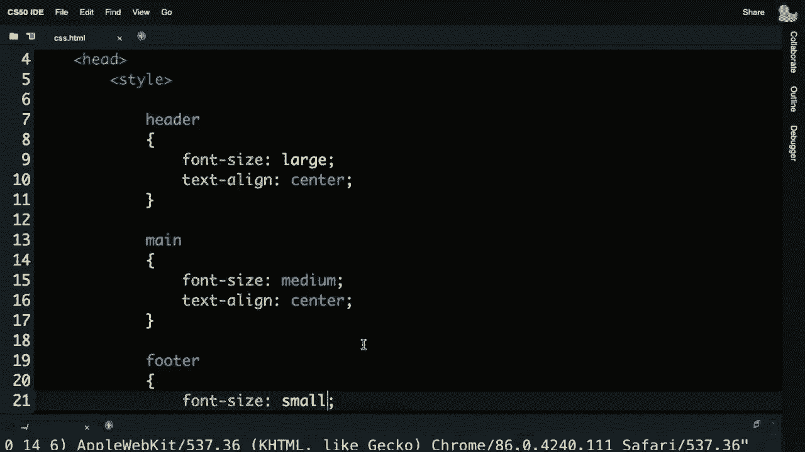

separate lines just so that it's a lot more readable。The effect is not gonna be any different if I go back to my other tab and reload。Nothing has changed。but I've begun toe tease out the CSS from the rest of my page。

But notice there's still some redundancy here and I could remove。text the line center from here。text the line center from here，text the line center from here and maybe apply it to the body instead。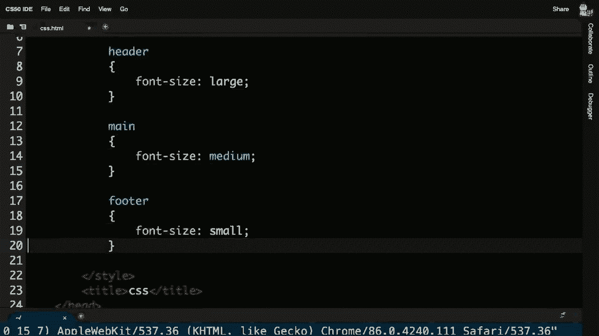

But there's other types of selectors I can use if you want to define one or more properties。in a reusable way such that you can use them on all sorts of tags。Turns out CSS supports what are called classes，and I'm gonna go ahead and do this instead。instead of just saying my header is gonna have a font size of large。

I'm gonna introduce what's called the class in CSS。the syntax for which is to use a dot and then a keyword of your own choice。

and I'm gonna call this first set of properties large this next set of properties。things next set of properties medium and this next set of properties dot small。And this is a little weird that it's starting with the DOT。That's just because humans decided that when you define what's called the class a reusable set of。

you start your keyword with the dot and I'm gonna give myself one other one dot Centered is。going to be text align center。So none of these classes centered large。medium or small are in use yet until I now apply them to my HTML。So let me scroll back down to my HTML where I removed earlier all of those style attributes。

and I'm going to use a different attributes now called Class。I'm gonna go ahead and add to this header，centered large。I'm gonna add class to the main tag as centered medium。and down here I'm going to say class equals centered small so I。can have inside of the attributes called class ah，That's just a space separated list of words and certainly speaking。it could be any number of spaces，but that just looks stupid and his stupid stylistically so just one space suffices。but this just means Hey，Apply the centered class and the medium class to the following contents。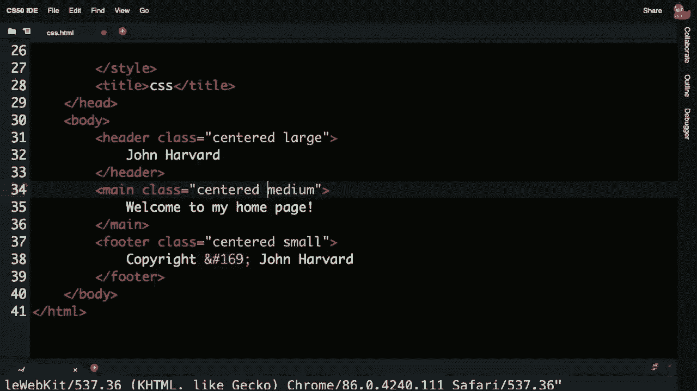

if I go back to the tab and reload。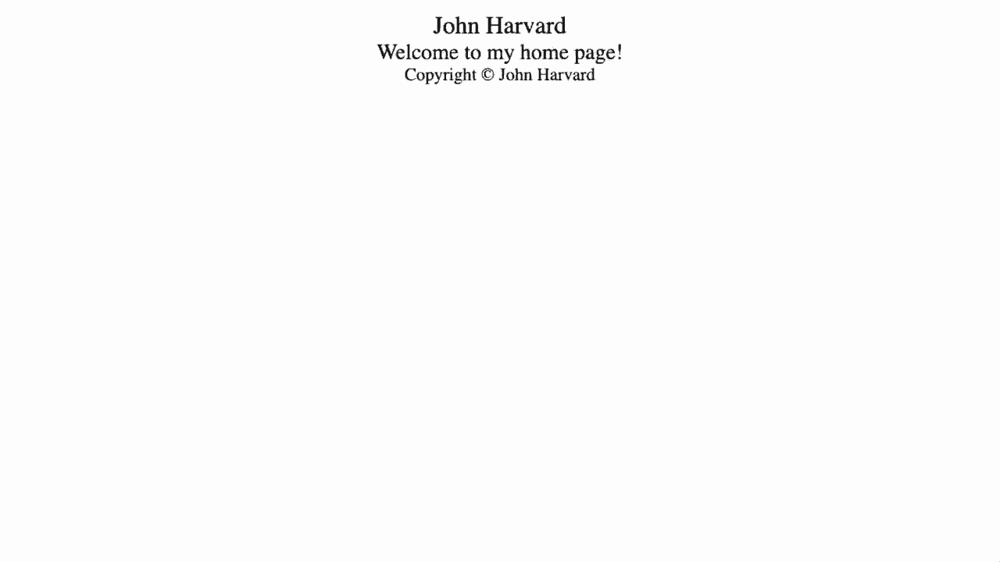

nothing still has changed。I'm just changing the design。I'm hopefully improving the design。But here too you can probably note that using centered again and again is also again dumb。Let me remove that redundancy。Let me add to my body a class of centered And now things are getting a little tight like I've。reintroduced some attributes。But now if I'm collaborating with someone I could say Can you go ahead and create me CSS classes for large。

I'll just assume that you're going to do that correctly。And I can just use those terms those classes and assume that you have。defined code and CSS like this stuff here。I can do one step better。I don't need you to even touch this same file。You and I can work pretty independently。

let me go ahead and propose this。Let me highlight all of the code I just wrote up here and cut it let me。get rid of this style tag altogether。Let me create a new file called Let's Say styles dot。CSS just by convention。But I could call it anything I want dot CSS paste it into their and。save it and let me go ahead and I don't need any of the indentation anymore。

So let me just shift everything over there using a fancy keyboard shortcut。This could be the file you're working on。You create all of these properties in these classes for me in a separate file。Then in my HTML file。If you and I are collaborating，I can use a link tag。hyper reference value of styles dot CSS，the relationship of which is that of style sheet to your。

Now here's where you just have to throw up your hands。we would have called links in Web pages the link tag。and we wouldn't have used open bracket A for anchor。In the clickable sense。This just means link this HTML file to this CSS file with a，relationship off style sheet。

What is the style sheet？It is a sheet of styles。It is a file off properties。

and those properties can be inside of types or classes，or what will soon see our unique IEDs as well。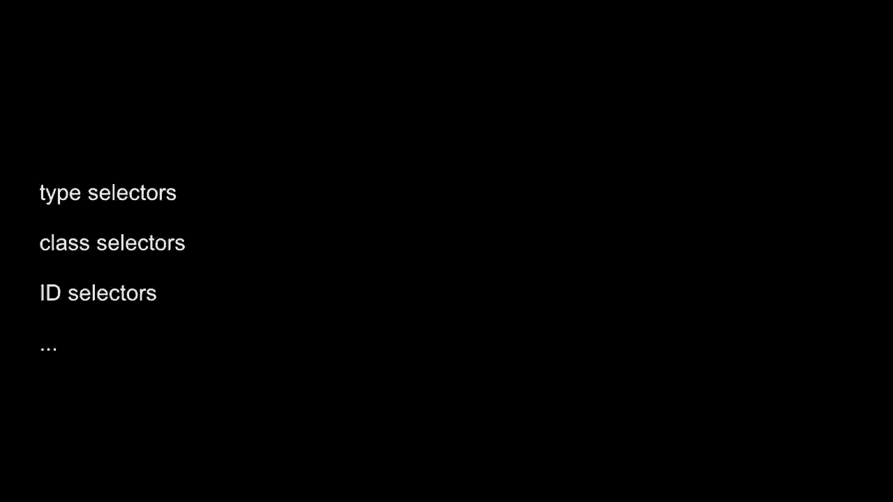

And there's other types for that as well。But here we have now arguably the best design version in that this is pretty compact。html and HTML values in attributes。But all the CSS is in this second file。Now you and I can really collaborate independently。then on CSS and what we can do with it？

We have on Lee scratch the surface of CSS thus far。

But suffice it to say and actually just to tease just how bad it this I might be。Suppose you really want to have ah，colorful background。let me go into my CSS file here。

Styles CSS and I don't have to use Onley classes。I could say something like。let's go ahead and making my body tag have a background color。

How about red semi colon？Let's go back to the browser。

it's getting ugly pretty fast。Let me go ahead and change the color of my text。

Maybe too white to make it stand out a little more on the red。it's back to something there。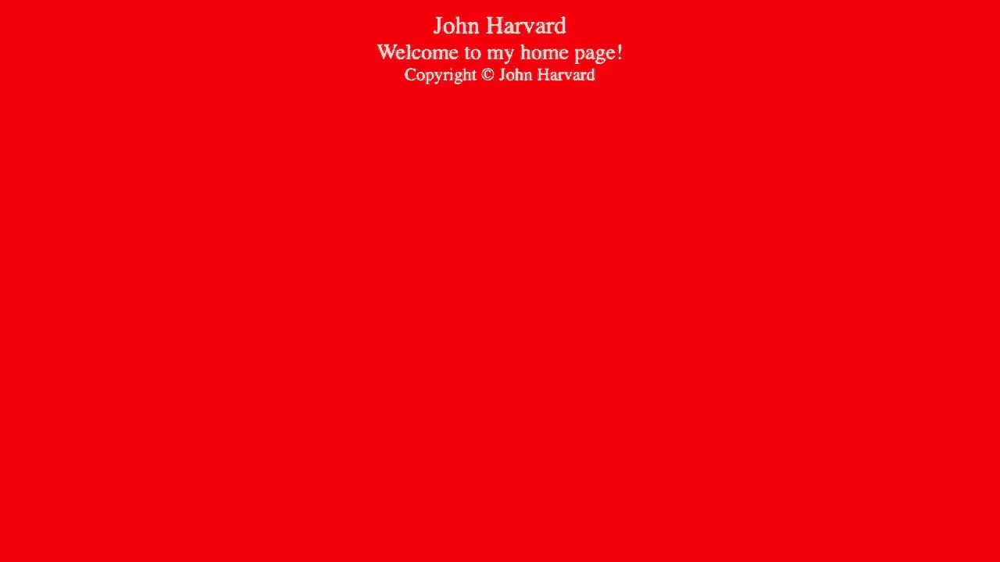

I can change this to any color。Maybe Little Yale Blue over here。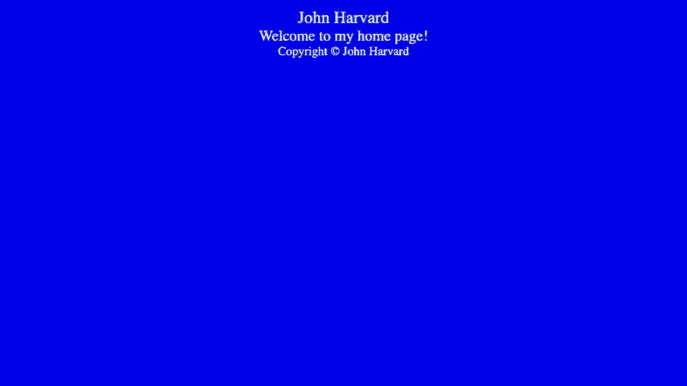

Or if you really want to be fancy per week four。How about we make it 00 f 00。

speaking Hexi decimal。

is gonna make it green for me instead。there's so many different CSS properties out there and again。we're focusing here on Lee on the list。The ideas when it comes time to actually using these properties will point you in the appropriate。Just a flesh out your vocab。All the more are any questions then。on the capabilities of CIA CSS and its relationship，with HTML。

So the one thing we haven't done any of today at all is programming。we actually need a third and final language，that of Java script。And in the past weeks of the course。we've used what we would describe this really server side programming you have written C code you for。

python code on the server specifically on CS 50 i D，which is by nature in the cloud ah server。But it turns out that all this time you haven't really been using your own Mac or your own。PC or your own phone for that matter。Other than is just a very expensive display。a very expensive screen。

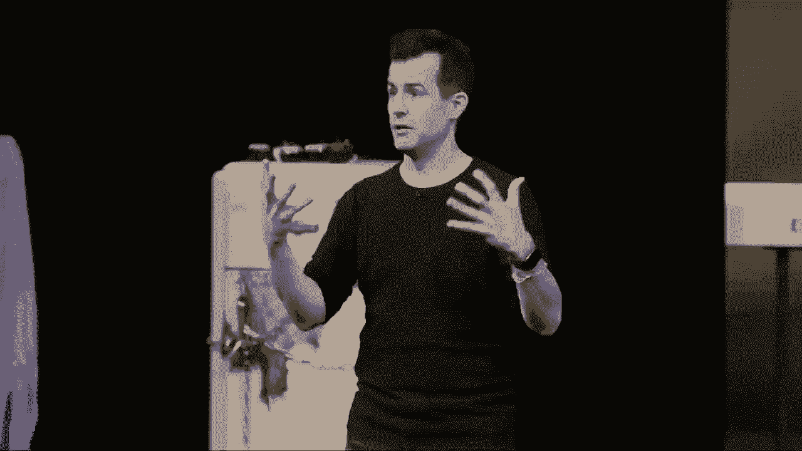

All of the code is written。All of the code is running on this back end server。And that's a missed opportunity because all of your users。all of us are on our own pretty fancy Macs and PCs or phones these days。

It's kind of a shame that those devices all have CPUs and RAM and storage space。

Yet we're not using any of those capabilities were really just using the glass screen to。

see what's elsewhere on a server。But with Java script。we have another language that we'll see in a bit that will allow us to write code。

save it on the server，but run it on user's computers and do what's called client side programming。So we'll still save the code。We write on the server。but we're going to include the code inside of these virtual envelopes that get downloaded by users。And instead of just reading the code top to bottom left to right and displaying information。

as is the case with HTML and CSS will additionally read the JavaScript。code deeper in the envelope and execute that on users，Macs and PCs and phones。And here's where Web programming gets really interesting because you now have a full fledged。computer at your disposal。That's not even your own。

So let's go ahead and take another five minute break here，we'll conclude with a look at JavaScript。

And we're about to introduce a programmatic way of controlling Web pages and even。adding to Web pages and changing the content users see。thereby making our websites no longer just static that is written once and viewable the。same way forever but dynamic，somehow changing in response to user interactions or user input。

But first we need a couple of final building blocks that allow us to tie the world of CSS。together with Java script so that all three of these languages html。CSS and JavaScript or somehow interacting and recall that a bit ago。We wrote this link dot html example，in the correct version a link to w w dot harvard dot edu whose text was the word。

Suppose now that we want to override the browsers default Stylization of links。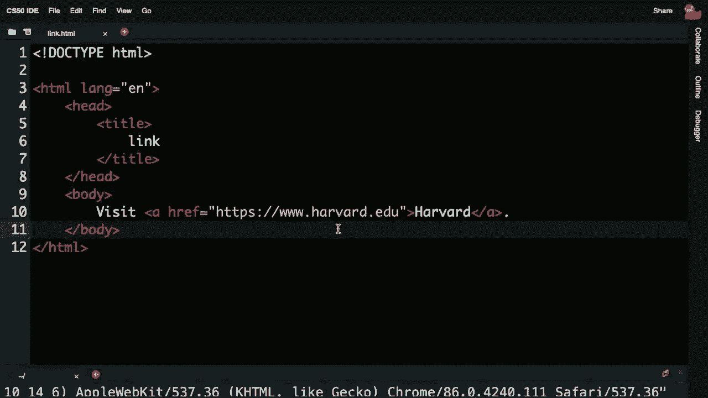

which recall if I now visit in my other tab link dot html is pretty boring。and this has been true for like 20 years。Links tend to be blue and underlined before you visit them or purple and。underlined after you visited them at least once a sort of visual cube。

But most websites today，including CS 50 zone，use different colors and different aesthetics for links on a Web page。with or without underlining different colors，maybe even different background colors。You can style these things using CSS and Bunches of ways。So how might we do this？

let's go ahead and be fair here and say Visit Harvard or，a traffic was quote unquote https。Dub dub dub dot Yale dot e d u Question。No close bracket。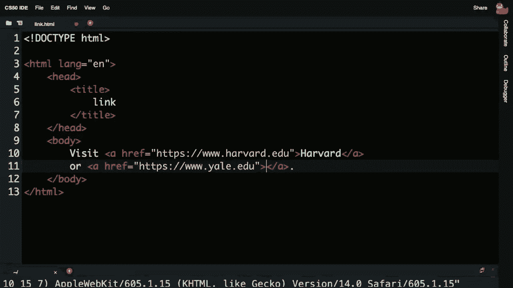

Let's give myself two lengths。if I reload just looks like this。Both of them are now boring and purple because we've been to both places already。

So let me go ahead and add a style tag up here just to keep us in the same file。I'm going to go back to using a style tag rather than introduce a separate file eso to keep things。simple in my style tag。Let me go ahead and change these links。toe have a color of Maybe let's make them all red initially。

f foo and let's go ahead and save that。Let me reload and you'll see that now Both of the links are red and underlines。

I don't really like the Underline，so let's get rid of that。Let's change the text decoration of my A tags to be none。you would only know these properties exist from some form of reference。

just adding to our vocabulary。Let's reload now and now the underlines air gone。but it would be kind of cool，like some websites。If when you hover over the link。at least on a laptop or desktop。

the link then underlines，drawing your attention all them or to it。How can we do that？

it turns out that you can use what are called pseudo selectors。which are work like this if I want to change the behavior of the A tag。when a user is hovering over it，you literally write the name of the tag colon hover。And then inside of this block，I'm going to go ahead and say Text decoration underline So。

make everything red and not underlined by default。But when the user hovers。go ahead and decorate it with an underline。

So let's go back to the file after saving Reload。No visual change yet until I move my cursor up here and voila！

Now it's getting a little more like modern websites。Now this isn't quite fair to Yale that both of the links are red。

So what if we change the colors of different types of links？let me go down here。and I need to distinguish these links in different ways，and I could use classes for that。But if I've only got one Harvard link and one Yale link，I might as well uniquely identify them。Let me go ahead and add an attribute called I'd off quote unquote Harvard。

and I'll keep it all lower case。Kind of like a variable on that。Then here I'm going to say I d equals quote unquote Yale。I could call these things anything I want。but because there's only one Harvard Lincoln，I'm going to add an attributes in HTML that just lets me verbally uniquely。identify each of those links。But up here，notice what I can do。

Now Let me go ahead and remove the color from here and let me。instead say that for any tag that for the tag that has an，idee off Harvard。go ahead and color it as f 0000 But if it has an idea，go ahead and have a color off UH 0000。So that should give me my blue in RGB and notice the new symbol here is the hash。

So in the world of CSS ah，hash symbol before a word means the unique identify or Harvard or the unique identify。or Yale adopt before a word means the class centered，the class large or medium or small。And if you don't have any symbol before the word like a hash or a dot It means。literally the tag called a or literally the tag，called a when it's being hovered over it。

few pieces of syntax。It's not programming code。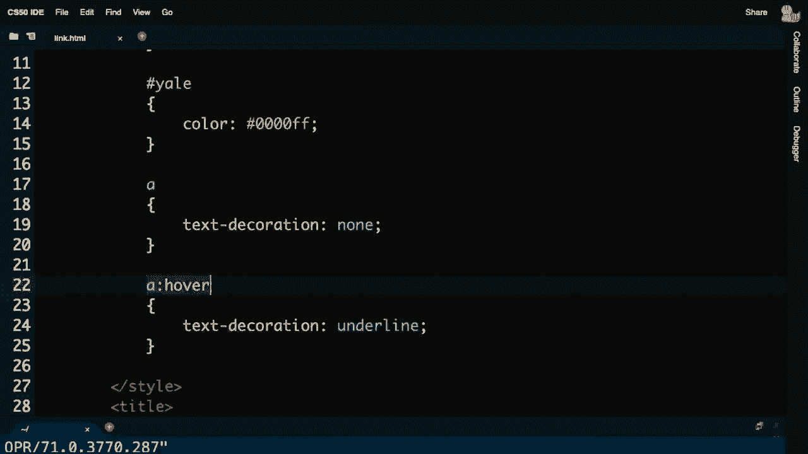

but it is code of some sort。Let me go back to my tab and reload and voila！

Now I have kind of the beginnings of a prettier website where I'm distinguishing Harvard with its。underline in Red and Yale，with its underlined in blue but on Lee under those certain conditions。

with CSS the ability to much more precisely control the，aesthetics of our Web pages。but that's static content。This Web page will never change。Let's now actually introduce another language known as Java script。and consider how we might use JavaScript to start dynamically updating our Web。

Here's a canonical Web page again，just html at the moment。Recall that we can add style tags to it up。Let's go ahead and now consider how we can make our Web page is all the more dynamic by introducing Java script。

So let's go ahead quickly and introduce just some of the syntax of JavaScript and wonderfully。And tactically is pretty similar to see and Python a little more sin tactically。But there's no memory management。so it's kind of like somewhere in between see and Python syntax。But it should all come fairly familiar，fairly easily now in scratch。

Recall when we had a variable called counter initialized to zero。How do we now declare the same in Java script？It's gonna look like this。So it's not quite python。You literally use the keyword let，which means let the following variable exist。The variables called counter equals zero semi colon。the semi colons aren't always necessary。

but for consistency，I'll keep using them here。I suppose you want to change the counter by one as in scratch。implemented by one in Java script。You could do it very，very verbose。You can do it a little more succinctly like this，like in python and see or the plus plus is back。So if you've been missing that in Python，the pleasant assed Nicholas seems to be the plus。

Plus is now back as well。How about something like this？

So if you want to say if X less than why in Java script。it's going to say if X less than why So here we have the curly braces。But the ideas are still the same。If else in scratch look like this in Java script。it's gonna look like that in ah，If else If else looks like this in Java script。

it's gonna look like this。there's no weird L if abbreviation it's literally else。But with the parentheses and with the curly braces。if you get hung up early on in these next few weeks，the stupid details of learning some new language。you got to develop the muscle memory。You got to start remembering what language is what but don't stress when you get hung up on。

curly braces and parentheses like those things have never fundamentally mattered。matter to the computer，certainly intellectually，as we introduce the new。compelling features of this language。How about something like a for loop or wild loop。for that matter in scratch？If you wanted to do something forever。

you can convert that now in JavaScript，similar to see while true or while any expression is true。If you want to repeat something three times almost the same asi。But I'm using let here instead of end。

is loosely typed。It has types，don't need to stress over specifying them the computer will figure it out。So let is how you would declare a keyword。there are other ways to declare variables in JavaScript。including Constance。we'll keep things simple and focused on Lee on this keyword here。So here is that Web page again and the tree representation thereof。And this tree is useful on Leah's。

a mental model for what the computer is doing inside off its memory。After having loaded a Web page with Java script。Now we have the ability to change this tree in real time。When the user clicks something，type something in with Java script。we will now have a programming language that allows us to mutate this tree in real。

thereby making our Web pages no longer static or fixed in one state，but dynamic and changing instead。So how might we do this？let's consider exactly where we can go about writing some JavaScript code。We can do that by adding a script tag in the head like this。it can also go in the body like this。and there are some logical implications of those choices。

Or we can even factor it out to a file like scripts dot Js，just as we did with CSS。So even though the tag is different，and the attribute is different。Its source and it's stupidly written like this。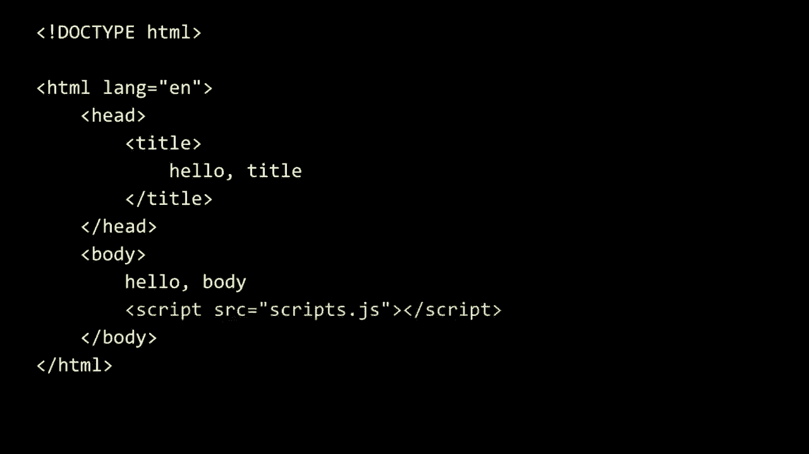

If you are using an external file，you literally close the tag。even though there's nothing inside of it。That's one of these reality of using this particular tag。let me go ahead and propose that we write an actual program in JavaScript。Let me go back over to my ID。Let's create a new file called Actually let's go ahead and open up our old one。

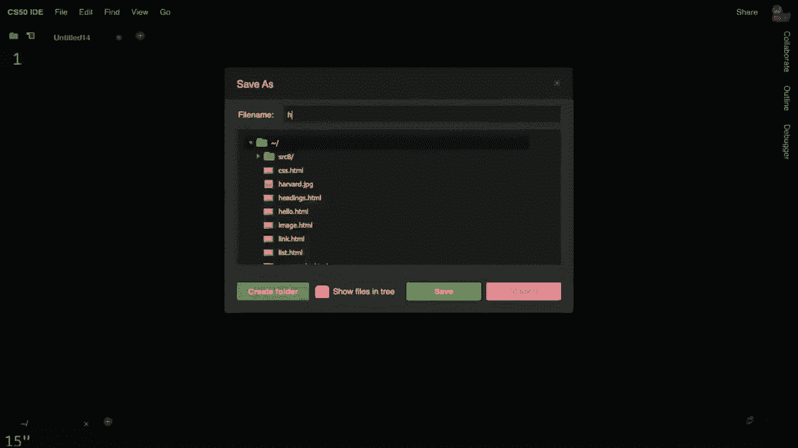

hello dot html and Let's make it interactive rather than say hello body all。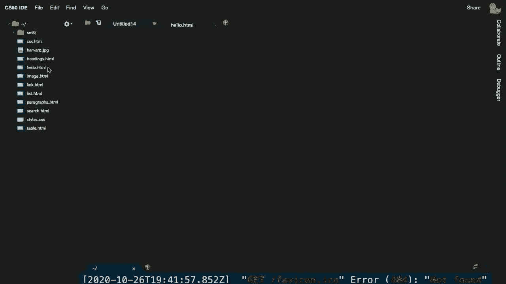

Let's see if we can't make it say a little something to me and to you。So down here in the body of my page，let me go ahead and change this and do something like this form。close form input。How about lets Dio I d of，quote unquote name and type is going to be text。and then let me go ahead and give myself a submit button type equal submit。So super simple。

The only difference now is I want a generic text box。I don't want one that's specific to searching。

and I want a submit button a generic one。I don't care what it says。Let me go back to my other tab。Click hello dot html and we have a form similar to the Google search example。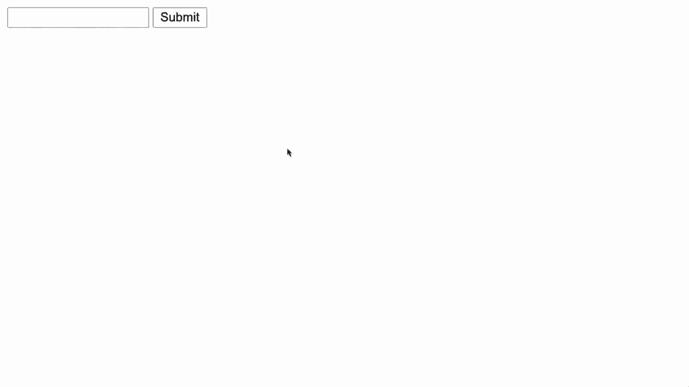

But now I am going to use a Web form in my own，HTML file to interact with the user because after all。this is how humans interact with web pages typically is via these forms。I want to enable the user to type in their name，and then I want my Web page now。Not Google to say hello，Whoever types this in，so I'm not gonna use a form in quite the same way as before。

There's not gonna be in action because I'm not going to send it to Google。I'm not going to send it anywhere else。That's entirely client side in the browser itself。The form to dio When this for miss submitted，I wanted to call a function called greet。We're going to clean this up in a moment。But there is this attributes in html con ALTs on submit the value of which is not。

It's now JavaScript code。I want to call a function called greet。This function doesn't exist yet。but it will soon。How do I go about doing that？let me go ahead and go up here and add my script tag and up here。let me go ahead and define a function in javascript。It's a little similar to see It's a little similar to python you literally。

though in javascript say function。You write the name of your function。any arguments and parentheses and then in curly braces，you define the function。I'm going to go ahead and just say alert，quote unquote Hello。I'm gonna keep it simple and just goofily output。And because this form。

as with all forms typically does get submitted to a server，I'm gonna add one other curiosity。I'm going to say return False。Also inside of this on submit attributes。So I realized things were kind of escalating quickly here because there's a lot of pieces in motion。But focus again on the basics。The attribute is on Submit。

What do you want to do when the user submits？I want to execute these two lines of JavaScript code called the Greek function。and then return false return。False in this context means don't submit the form。but don't submit the form anywhere。I just want to use it as a client side tool for interacting with the user。I don't need to send it to the server or to Google to anyone else。

Let me go ahead now and specify this。I deliberately gave this text field annoy idea of name。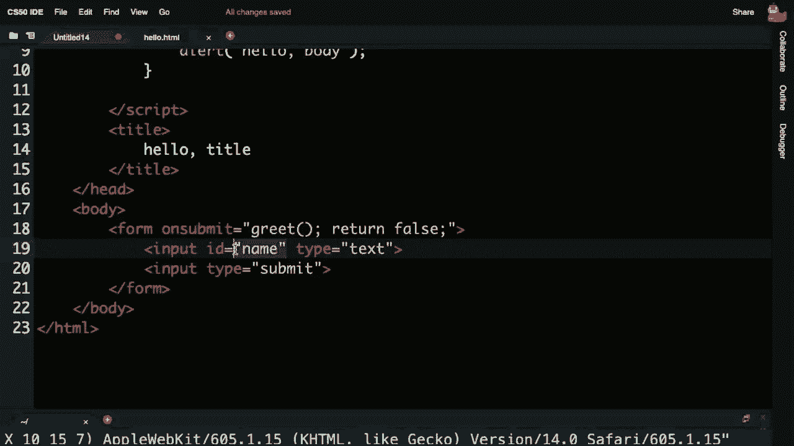

but we'll use that in just a moment。Let me go over to my other tab。Now reload because I've made changes。I can type in David，but I'm gonna be ignored for the moment。submit now notice。It's not the best user interface。but there is an alert on my screen from my specific oral that says。

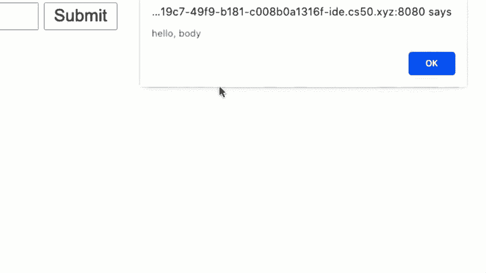

But I'd like it to say hello，So how can I do that？let me go back into my code here and let me go ahead and define a variable called。But I could call it anything I want and let me use this special function document dot，query selector。And this is a function that comes with Java script that allows you to select any，HTML element。but you need to be able to identify it using some kind of selector。

And here's where for better for worse，CSS and HTML and JavaScript start borrowing ideas from each other。If I want to get the value of the users text box，I bet I could give it a unique ID like quote unquote name and Aiken。selected by using my CSS syntax off name。And once I've selected that HTML elements。so to speak that tag，I'm gonna go inside of it and get its value。So this syntax is a little familiar。

We've seen the dot notation before and see when it came to Struck's。We've seen the dot notation in Python when it came to libraries like the C S V library。We're using it in a similar way。Document is the special global variable that just comes with Java script in the browser。and it gives you access to all things related to your document。

Your Web page query selector is a function that comes with that。document that Google and Microsoft and Apple wrote，for you called query selector。whose purpose in life is to take a CSS selector in quotes that。identifies one or mawr nodes that is nodes，from the tree。

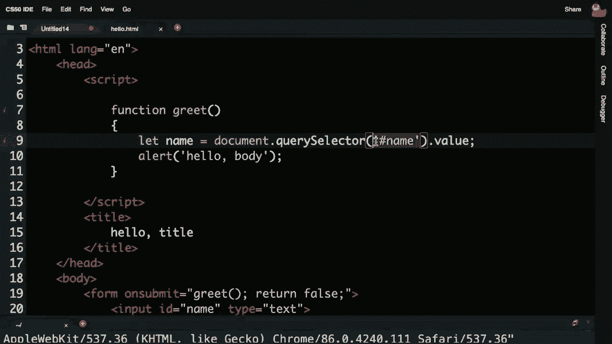

and this tree actually has a name，though I have not used it before。This tree that we keep referring。Teoh is technique called a dom，a document object model。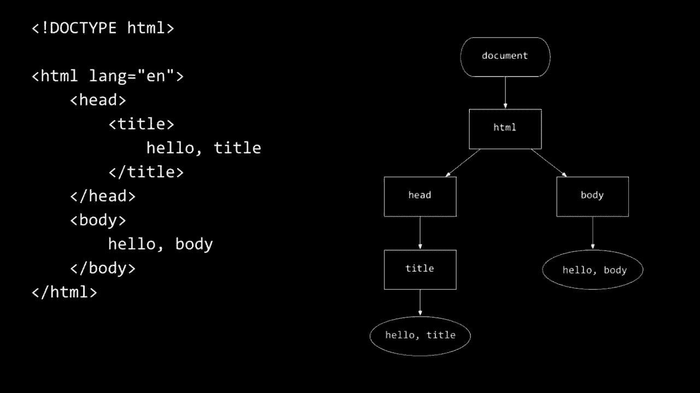

which is just a fancy way of saying that document this global variable gives，you access to this dom。So when you call document Doc query selector that induces your browser for you to search the。whole tree all of those nodes and parents and Children and grandchildren and so forth all of。those nodes looking for the one with the unique identifier of name and then looking inside of that。

node inside that rectangle，getting the actual value that the human typed in。So if I want to now output this value，I'm just gonna use some old school concatenation。Let me add to that string Hello Name and I can use double。quotes I can use single quotes does not matter。So long as you're consistent in the Java script world。

the convention tends to be used single quotes，if only because you can type it almost twice as fast because you don't have to hold the stupid shift key。the type of double quote or to type of single quote。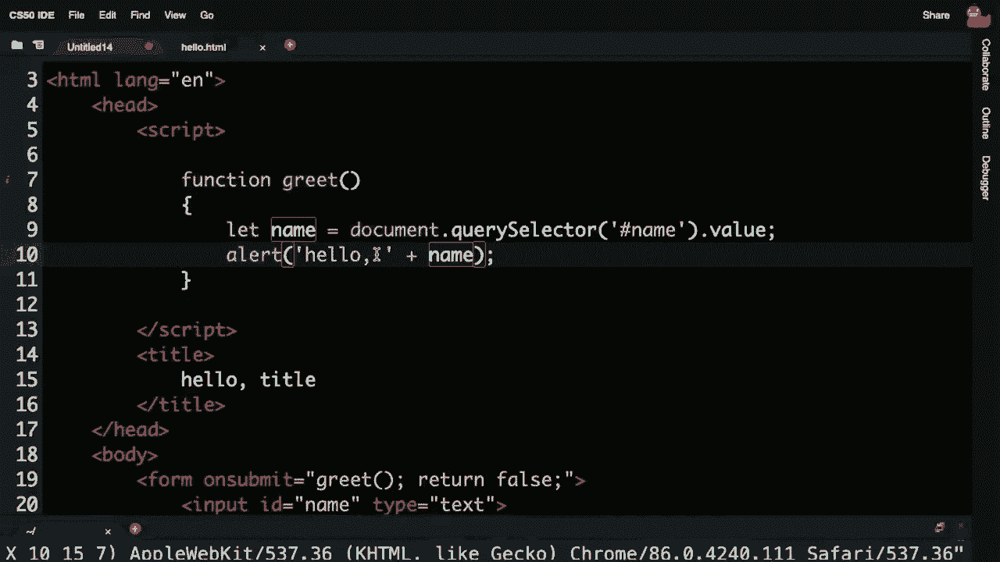

let me go back to this page Reload because I've made changes。Let me type in my name again。Auto complete is popping up nicely。Click submit and voila！Still kind of lame。but it's a least now dynamic，and I can type in anyone's name as you could。Brian submit。and you can change other things about the Web page。

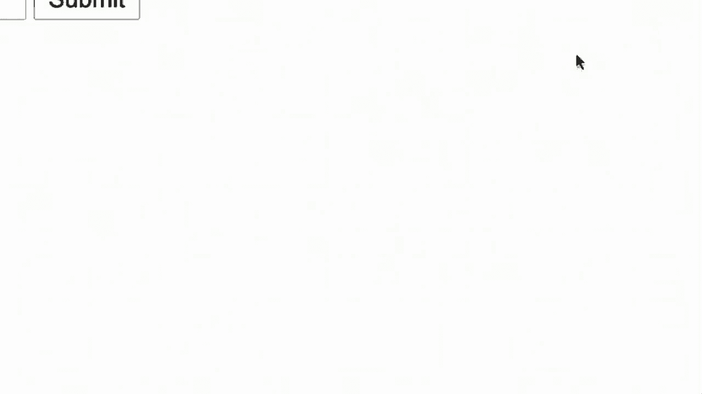

and some of this is just sort of implementation details。But recall that you could give a button of value and you can say something like Greet me now if I go back here。

and reload my But now says Greet me。

Turns out that your input for text can have a placeholder like。

What's your name？And then saving that file on reloading you see in great out text a prompt on the。box that's not actually there，because once you start clicking。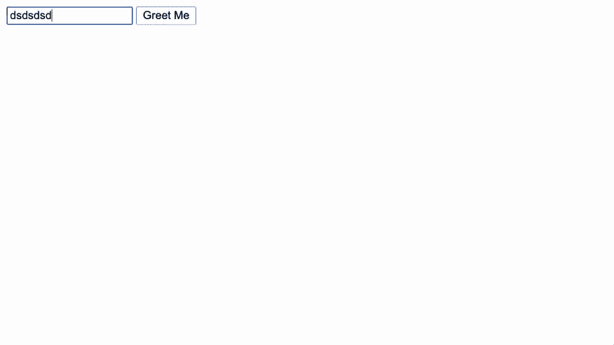

I can also disable that somewhat annoying auto complete by saying auto complete equals。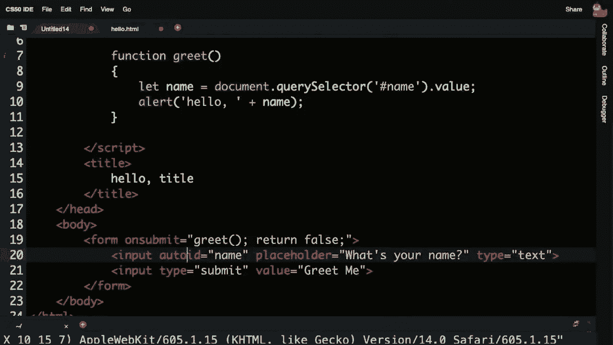

quote unquote off。And then I could go back to my page，me reload and now notice。Even when I click in there，it doesn't auto complete。which is maybe good for privacy sake and notice to I could do one other thing。

Let me go ahead and add auto focus。Notice that Every time I reload the page。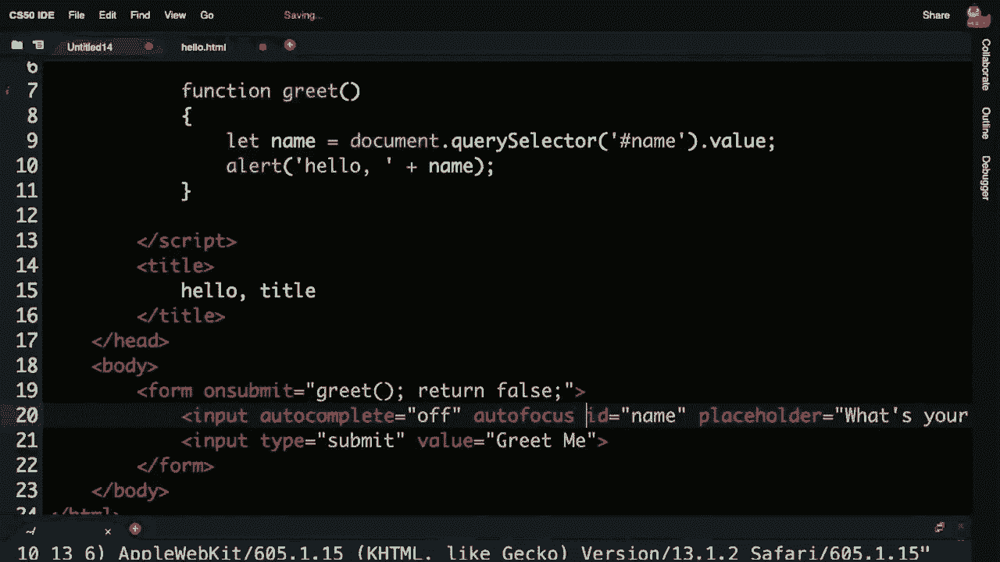

I had to click in the box。when I reload the page，the cursor is already there。blinking and ready to go there by saving your users one step。another vote in favor of accessibility and usability by just putting the user where。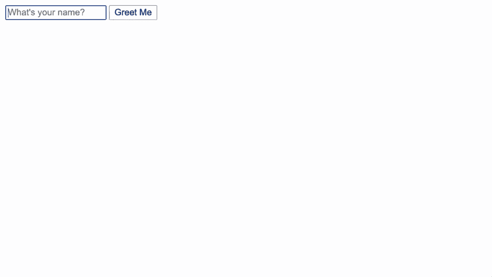

they probably want to be。any questions thus far on this introduction of Java script by way。greet inside of our new script tag and using this new on submit attributes。that calls that function and then short circuits the form submission by just saying Return false。But don't submit the form to the server like we did with Google。Any questions or confusion？

Anything on your end？let me at the risk of making it look more complicated。let me make it more complicated。But in a way that will be familiar over the next couple of weeks。When you see more and more examples and use third party libraries，you've seen some building blocks。We would not expect you to write this this week。based on these examples but just to give you the mental model for how javascript is typically。

like with CSS，tends to be a little poorly designed。When you start co mingling your language is like that makes it hard to collaborate with someone else。It makes it hard to maintain one language independent of another。so it tends to be a good thing to keep these things separate。And that's not always the case。

especially in mobile app development of putting these things back together。But this tends to keep things clean，at least when were first starting out。So let me go ahead and actually go ahead and get rid of my code up。here for now and let me go ahead and get rid of this on。

Submit handler and let me go ahead now and down here，actually appear。Give myself a script tag and let me go ahead and do the same thing a little differently。Document dot query selector This time，let me select the form and I'm not gonna bother giving it a name。so if I just select form that will give me my form and let me use this fancy function。

Add event listener。It turns out that the world of Web programming is filled with what we would call events。When you click on a page，that's an event when you drag on a page，that's an event on a phone。When you touch a page that's an event。Turns out using Java script you。Now the programmer can write code that listens for these events and responds to them by。

So I'm gonna go ahead and add an event listener on my form that's listening for the submit event。What do I want my code to dio When the forms，I want to call the greet function all right for the greet function to work。I need to reintroduce it。So let me quickly whip up the greet function。Let me go ahead and do an alert of hello and then plus name。

So let me say Let name equals document dot，query selector And now let me go ahead and I still have the i d。So let's say quote unquote hash name dot value。So I think Greek now exists。But now this line of code notice does this。find me the form。Then add an event listener listening for the submit event。And when that event is called。

when that event happens，call this function。This is very similar。somewhat similar to our Lambda example last week when we passed a function，into the sorted function。So it's to tell it to sort by value instead of by key。Remember that syntax when we defined a function just to help us sort。

Notice that I do not want to call greet。I do not want to call greet online。I want to tell the browser to call greet when it is ready。

I passed the function in by name。Let me go ahead now and save and reload。Nothing visually has changed。But when I type in David and Great May，Huh，Let me say David greet。Nothing happened。if something's acting up，let's go back to those developer tools。developer developer tools and let's not look at network。But look at console。

And here is where your new friend is going to show you all of the mistakes that you've made in Java。just like in python and see you see the errors in your terminal window because Java。script is being run and the client side in the user's browser。You can't just look at your terminal window。There won't be any errors there。

You need to look in your own browser if you're the one testing things。notice here cannot read property。Add event listener off null So this is a subtle。but I did it deliberately because it's so common。

I promise I did it deliberately。Let me go back here and point out this browsers air Pretty naive。It's fancy and as powerful as they seem to be getting。They still take us literally。just like python and seeded top to bottom，left to right and if Online 13。I am saying query for the form tag，but the form tag doesn't exist until Line 21。

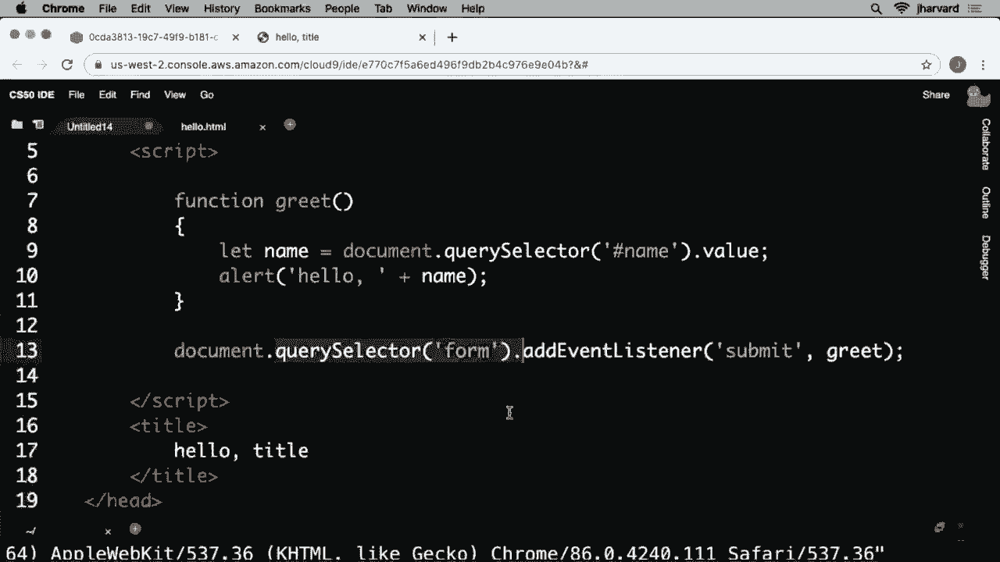

It's not going to work，and therefore the error message I'm seeing makes sense。You cannot read property。Add event listener of null。

Coming from form is currently null。As of line 13 it does not exist until line 2021。So how do we fix this？the sort of quick and dirty way would be。let's just move this down below inside of the body now。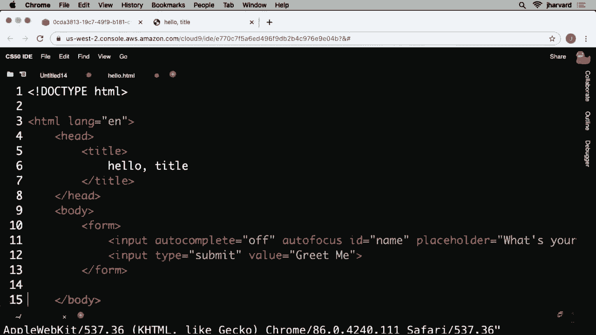

but below the form tag。And I think this will work。Let me go ahead and reload。Now the error goes away。But I haven't done anything yet。Let me click in the box and say，It's back toe working。but much like in python and see。

this is kind of a slippery slope like the solution to our problems。Can't just We'll move it down。There's got to be a better way similar and spirit of prototypes。but not quite in the same way the way Java script handles this problem is as follows。If I undo that and go back to the top where I have my script now。

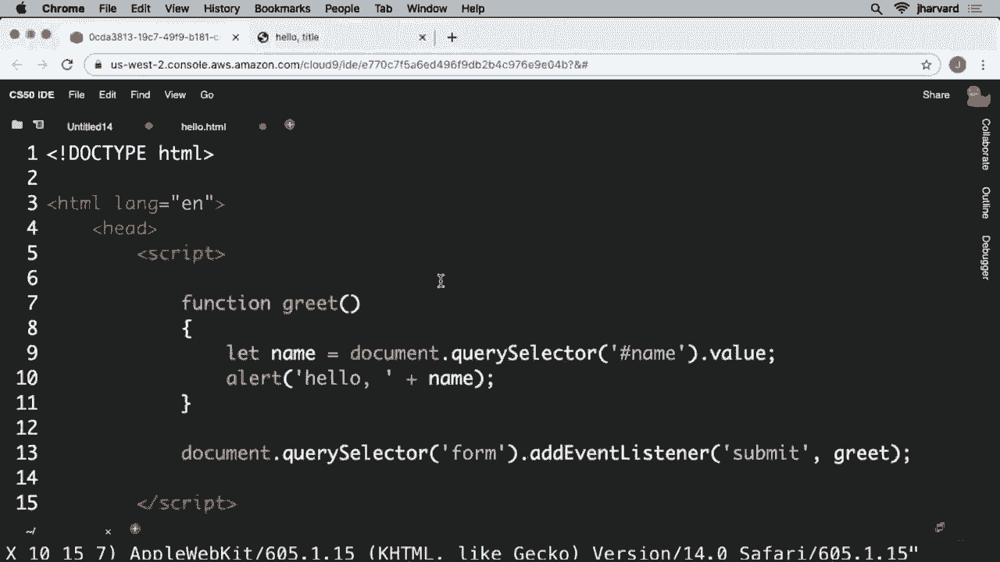

I can actually do this Instead，I can do something like this document。I can do this document dot add event listener and this，But Dom content loaded。this function Listen and let me go here and give myself a，second function function。and inside of this function will be that one line of code。So I've got two functions now。

one of which handles the greeting。Is there a new one called Listen whose purpose in life is just to add that。That's all but notice here online。Now I'm adding an event listener to the document itself。saying when the Dom content is loaded。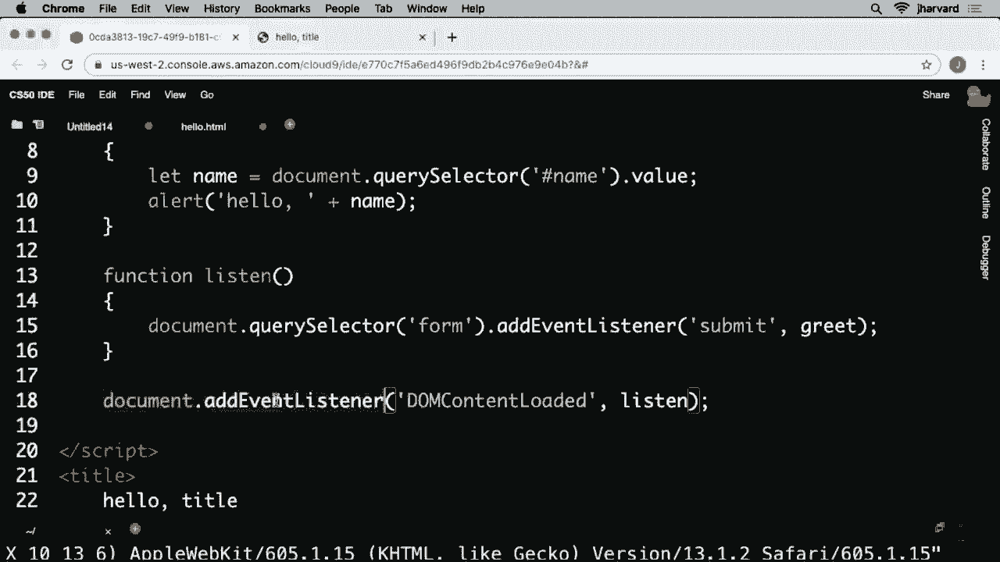

when this whole tree has been loaded and therefore the form tag has been loaded and everything。

else go ahead and call the listen function。The listen function is just going to add another listener to the form。

listening for submissions。And so now if I go ahead and save this reload。I'll keep my developer tools open and type in David and greet May still works。but I haven't had to sort of do this stupid resort of like moving my code down to the bottom in solving the。

I'm just telling the browser，don't do the following until the Dom's content has loaded。all right questions on any of this，and this is absolutely them or the most sophisticated。I think of the syntax and the logic we've done today。we're just planting the seeds for understanding this in the weeks to come。Questions Confusion。

let me go ahead and blow your minds with one other feature of Java script that actually has。similarities with python。Recall that any time we define a function in one place and then use it in。that's generally been kind of lame。Why are you bothering to create a function？

Adding lines of code to write a function that you're only gonna call once last week with。Recall that two weeks ago with Python recall，we defined a function f and then we said。Let's just use a lambda function an anonymous functions because it's only being used in one place。So this is gonna be the ugliest we see。If I know that I want to call a function called listen。

when the Dom's content is loaded，I don't need to give that function a name。I can actually just put the function right there。I'm gonna literally copy and paste this over here。Let me remove the excess white space Here，let me go ahead and now point out and I'm gonna。do this a little stylistically differently，just to be consistent with what other people dio notice。

Now I've done this。I've literally move that function as the second argument toe add event。listener and I don't need its name at this point。I'm gonna go ahead and just do this。The equivalent in Java script of a lambda function is toe literally just say。function with no name and still have open parentheses，with or without a space in between them。

This is now saying a little more elegantly，even though more cryptically on the document object your global variable。Add the event listener Listening for the dom content loaded。what do you want to do when the Dom's content has loaded call this anonymous function。otherwise known as a lambda function。But notice what we're gonna dio。

We're gonna query for the form and we're gonna add an event listener on submit by calling the Greek function。we don't need to do that。Let's go ahead and remove that。Let's go ahead and delete the greet function name and get rid of it。Let's make one mawr anonymous function。Let me paste this in here。

I got to clean up my formatting real quick。So let me go ahead and remove some white space here。Remove the function name。Put my curly brace over there。Get rid of this one here in Dent。That indent this close this Ooh，or at least cryptic looking。depending on whether you like this kind of thing。it's just basic building blocks。

You could define functions that don't have names。because if you wanna pass one function to another function。you can literally just write the code using the supported syntax。which in Java script is not to use the word lambda，but to use the word function no name。but still parentheses and then making sure it's still well formed。

Function with an open curly brace here and close curly brace。Here you can then write out your code and the only reason I have this other parenthesis over。here eyes because I'm already inside of。

ah function called at event listener。that not a problem，certainly at this stage。we're just kind of now stacking these different ideas on top on top，on top of one another。let me show you now a pre made example that shows you exactly what you could do now with these。Here's a non exhaustive list of events that you can listen for in a browser。

not just things like submitting but also，clicking and dragging。Keep pressing，moving your mouse over。moving your mouse down the button up and down。

touching and moving and other such events。There's this whole list of events that you could do such that you can actually do things like this。Let me go back to my ID and let me open up a pre made example。This one called Hello。five html and in hello，five html。I've got this example already that it's just doing a few things。It's listening for Dom content loaded，but it's then listening for key up。

And what's it going to do with key up？Let me go over here into my index。I'm gonna close the debugging tools。Let me reload my directory index here。And that gives me this other file in Source eight called Hello，five html。Now notice here。I'm gonna go ahead and type in。who notice the web page itself is immediately interacting with May。

And as soon as I deleted it says Hello，let me type in Brian。And now we sort of have this auto complete here where I can type in Montague or arithmetic。and it just keeps auto completing。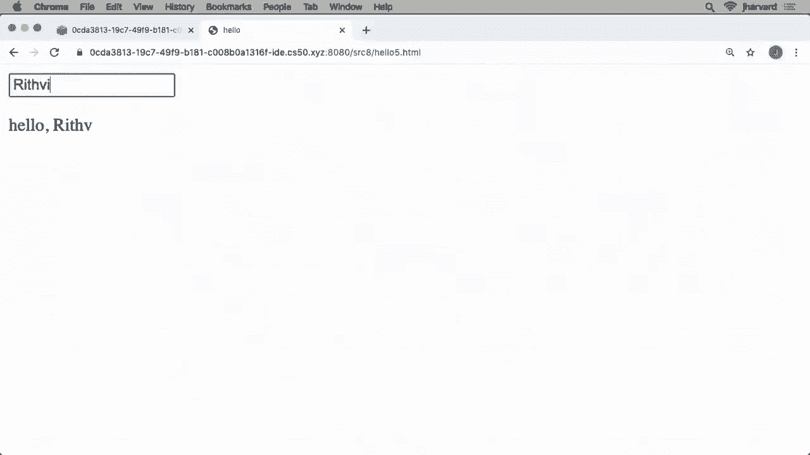

you have the ability even to change the contents of the web page。not just by throwing up a ugly alert。You can use code like you see here。which we won't get into the details off but allows you to change the page itself and notice。This is kind of ugly looking syntax。

You don't even have to concoct。just like python has f strings in Java script。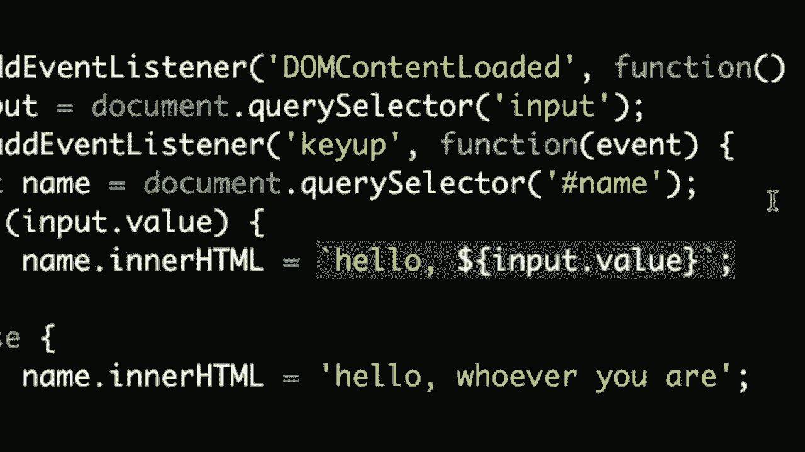

You can use back ticks plus a dollar sign and stupid curly braces and do the same thing。And I'm kind of showing some some bias here。But same exact idea，as it was in python and again。These are the kinds of things that will trip you up early on inevitably。as you get more comfortable with the language，all of the ideas will outshine the particular syntax。

let's look at a few other pre made examples just to give you a sense of the capabilities of Java script。Here's a program called Background HTML，and this Web page you'll see is gonna have three buttons。It turns out you can implement buttons on a Web page in different ways。You can literally use the button tag down here。I have a whole bunch of code using query selector again。

Notice what you can also dio if you go ahead in Java script and select your body。by saying Document a query，You can actually then access ah。special variable inside of the pages body or any tag for that matter called。And then you can change with JavaScript，the style off a CSS property using code，and unfortunately。

left hand was not talking to right hand in CSS。It would be background dash color。in Java script at proper programming language。This would be in background，minus color。like literally arithmetic。So the world decided that any CSS properties with hyphens would instead become something。like background capital color to distinguish the two。

But it's the same exact idea if I go now into this file here。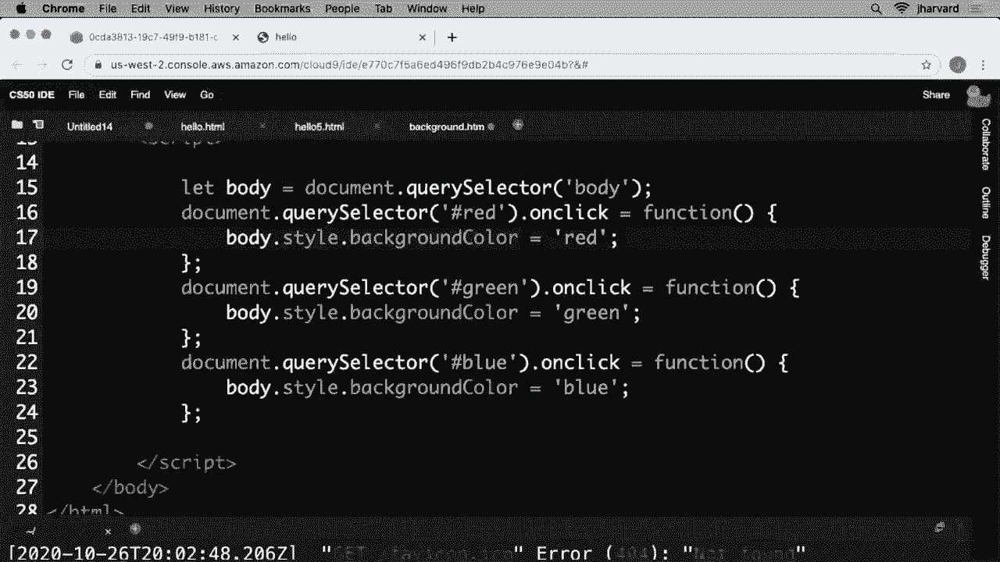

now I have a very simple page with three buttons R。but notice when I click on them I have to find in advance。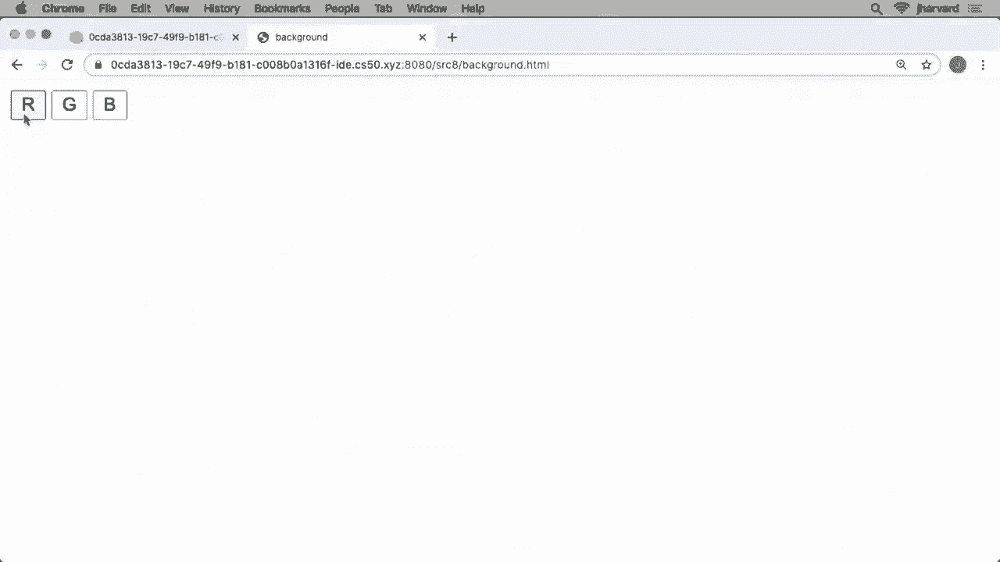

I claim some event listeners for click，and every time I hear the click。

I changed the CSS of the page。And if this weren't cool already，let me open up view Developer Tools。

developer tools here notice the third and final tab。Today is elements no matter how ugly your HTML is，the developer tag the developer tools elements Tab will always show it's you in a very。pretty printed，colorful fashion。But it will also show you the actual CSS as it's changing in real time。So let me reload the page by default。a white background and notice down here。

the body has no style attributes on it，but if I zoom out for a moment。and now click our watch the HTML on the bottom of the page。Chrome just dynamically added background color red If I click green。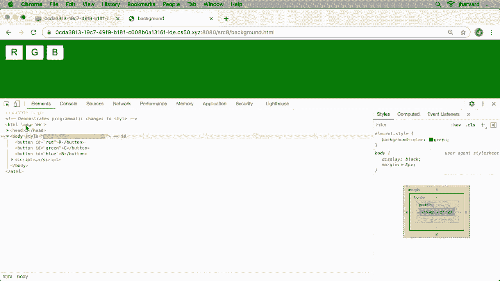

background color green is now there and blue。So using these developer tools。you can interact with your own website and see what's changing in the。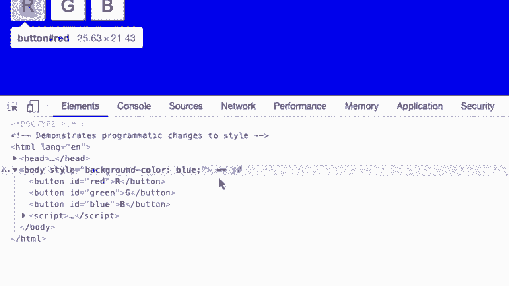

Were changing in real time the attributes of this tree，thereby making the page all the Mawr dynamic。This is powerful to let me go to harvard dot edu。

open up developer tools and notice。Here we can see all of Harvard that you'd use HTML in the Elements。tab notice。It's a lot of HTML tear，but there's all of these triangles that expand it or rather。that collapse it just to make it more succinct。If you wanna look at specific things。let's go ahead and say something like this。Let's see what could be fun to change here？How about this？

I'm gonna go ahead and right click or control click on about Harvard because this I'm finding。

It's gonna automatically open in the Elements Tab，the actual HTML that Harvard used to create about Harvard。It's got some other tags here。Span is another thing。It's like a mini paragraph all on one line class we've seen before。I don't know what LG Navteq is probably large navigational text that Harvard invented as a class。

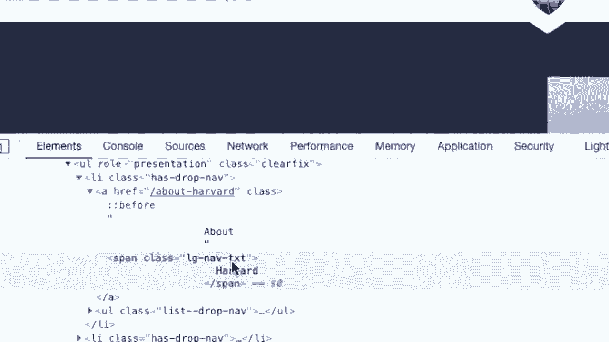

But notice what I could do here。How about we change this to Yale and then hit Enter and Walla。

hacking harvard dot e d。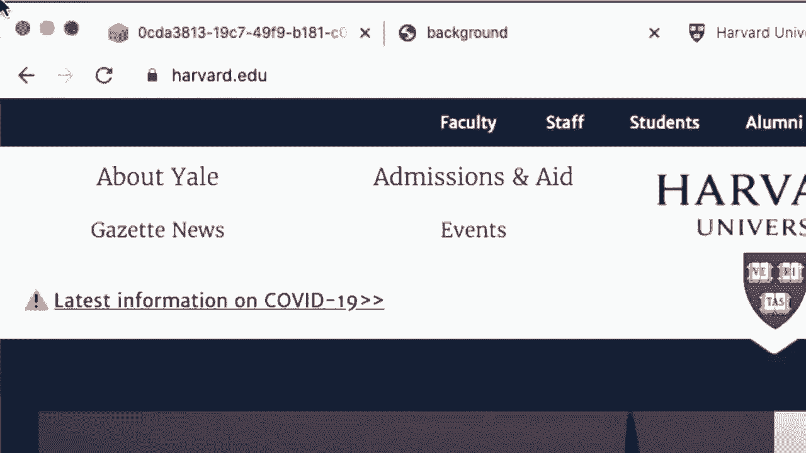

understanding what's going on here is important。I'm on Lee changing my local copy of Harvard you view that's been downloaded onto my。If you've got a Harvard that you do you now，It's not hacking per se。but this is really to how you can learn how to design Web pages if I go to Yale。Edu Aiken Similarly。look at all of Yale's HTML and change things here。Let me right Click on about Yale。Click on Inspect。

Let me go ahead and change this to Harvard。Enter and I could be really malicious。but on my own machine notice。Over here it right in the developer tools。You can see all of the CSS styles that are currently being applied to that particular。tag and notice this。If I change color down here at top bottom right。

let me change it to F 0000 and hit。Enter Wallach。I've changed all of Yale's tags along that row to be read。so this isn't again about hacking some website because it has no effect on the actual server。but it it's so much easier and faster to sort of fine tune your own pages aesthetics。by just using your browser。try new properties and so forth。when you're ready to save it。

then go into your text editor and type out or copy paste those，particular attributes。let me show you a few final examples here to let me go ahead and go into ah size dot。Here's some sample Latin text in an initial font size。but I'm using a little drop down menu that you see commonly on eight Web forms。

Let me make the text larger。Let me make it extra extra large。This is just using JavaScript。listening for change events to this drop down menu and correspondingly。changing the styles size off that particular paragraph of。Let me do this other thing back in my day when I learned html html。We're up to five now。

There was literally in HTML，tag called Blink that would literally do this。My first home page probably greeted visitors would like。Welcome to my Web page in this hideous。hideous blinking aesthetic。we could do the same thing and let me go open and let me go ahead and open。Inspect here and let me move this up here and zoom in notice what's happening。

I wrote some JavaScript code in this file called blink dot html。that every half a second or second is changing the style of my body，to be visible or hidden。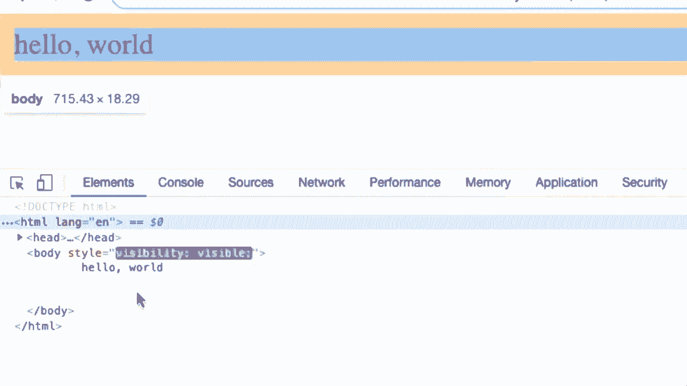

visible or hidden。And if you want a little teaser of that。if I actually look at that html in blink HTML。

that's because in Java script，there's this cool function called window dot set Interval that lets you call a function。every number of milliseconds。

So if I were to change this to be even faster，let's do it every 100 milliseconds and save and reload。You'll see now it's flashing even faster so you can do things again and again。by registering these kinds of intervals in code，even cooler。Let me go ahead and grab another u R l here。And just because of my browser settings。

I'm gonna go ahead and open this one in safari instead of chrome。this is called geo location dot html。we've written some code in advance that's actually gonna try to figure out where in the world you are and notice for privacy。We can't just presume to figure out where you all are。We're instead going to prompt you like this。The browser is going to do that for you。I'm gonna go ahead and allow this query and voila。

This this file geo location。Html just prints out your GPS coordinates。Not particularly interesting。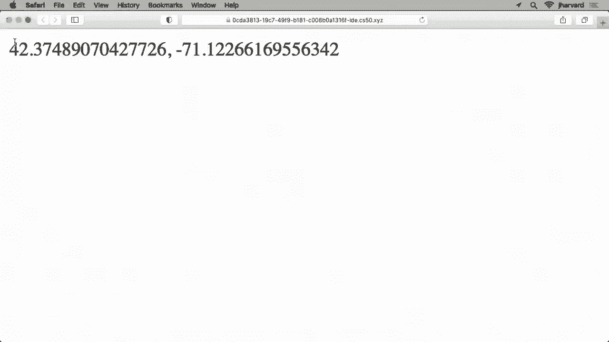

But if I goto like Google Maps，I can literally search for those GPS coordinates。And if you're curious as to where I am right now，But if I go into satellite mode and zoom in。we are indeed roughly in that part of the American Repertory Theater on Brattle，Street in Cambridge。Use a so pretty creepy that using Java script，you can even figure out where your users are creepy at first glance。

But if you've used uber eats or grubhub or merely any website like for the weather。that asks you for your location，how is it doing that？

the programmer of those websites has written some code，as we did in Geo location HTML。that has a line of code like this。Navigator dot geo location。Get current position。And then it's a function built into your browser that，will tell you the users latitude and longitude。

just some built in functionality to the browser and then one final example here in Java。It turns out that you can implement auto complete in an even fancier way。we converted problems at five spellchecker 140，000 plus words。The text file called large into a corresponding Java script file called large dot Js。

and we wrote Auto complete here。So let me go ahead and type in a and I will instantaneously see an a Nordic list of。all of the words that start with a Let me type in AP Now it's changing toe all the words that start。with a p a p p l e。This is how auto complete works using Java script。What am I listening for？

if I go back to this laundry list of events from a moment ago。

I bet I'm listening for one of these key presses or key up events。So listening for the user hitting their key。And as soon as they type their key。I'm using probably that dot value syntax to get the value of whatever the human typed in。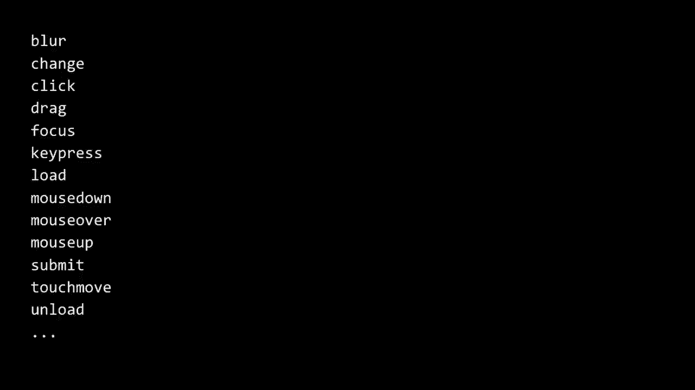

And then I'm displaying it in the Web page and then dynamically adding。or removing L I elements from the Web page dynamically。we've not seen hands on how to do this。But the building blocks are there。You can change the Web pages style。You can add HTML to the page。and you can listen for these kinds of events。Now it turns out that it is not on Lee Java script that could make use of。

girls in this way，and we thought we'd do one final demo here，this one calling back into play Python。whereby I'm going to do a little something with our Jacko lantern Here。let me bring him over closer to me and you'll see that he's got a。

light bulb tucked inside of him。And let's go ahead and face him forward。It turns out that the light bulb inside of this Jack O lantern here，is actually one of these fancier。modern led light bulbs that has an Internet connection。It's an Internet of things device and coyote device。

and it happens to be talking to this little wireless device here that I have on the lectern。so that the light bulb is literally communicating wirelessly to that device on the lectern。is plugged into Harvard's network。is plugged into Harvard's network。And so we have the ability Now it would seem to write code on my Mac or your。

PC that somehow talks to this light bulb by using our local Internet，to connect those two devices。And it turns out that devices like this very often have a P I s application。

programming interfaces that for simplicity are actually based on girls。There's simple u R l so that if I send a certain http request to this light bulb。it will turn itself off or on or do something else。And if I send another request。it will do that thing as well。Now that's not how all a piece work，but indeed。

just because we're transitioning now the Web programming doesn't mean we're leaving Python behind。next week will bring Python back all the more and sequel。Combine all five of these technologies html。Python and Sequel and tie them all together into a full fledged Web application。let me go ahead and create a program here called Light dot Pie in。

so that I'm not in the cloud。I'm actually on Harvard's local network here。let me import a couple of libraries。

import OS and import requests。We've not seen this before。but there's a library that's available with python called requests。which allows you to make with Python。HTTP requests just like a browser。Let me go ahead and declare ah，variable called user name that's going to be the result of just getting what's called an environment。

variable called user name。So for privacy sake，I don't wanna type my own user name and password for Harvard's network into this program。So there exists what are called environment variables on Macs and PCs and Lennox computers。that you can store values sort of secretly elsewhere。And using Python's OS Get n function。you can load those into the computers memories somewhat privately。

Let me go ahead and get the I p address of the light bulb by doing os dot get end quote unquote i p。let me go ahead and constructed u R l by having read the documentation。a colleague constructed you or else that looks like this。Colon slash slash then the i p address off the lightbulb。

slash ap I slash my user name personally in case different people want to control the light。bulb slash lights slash one slash state。So this is a weird looking u R l。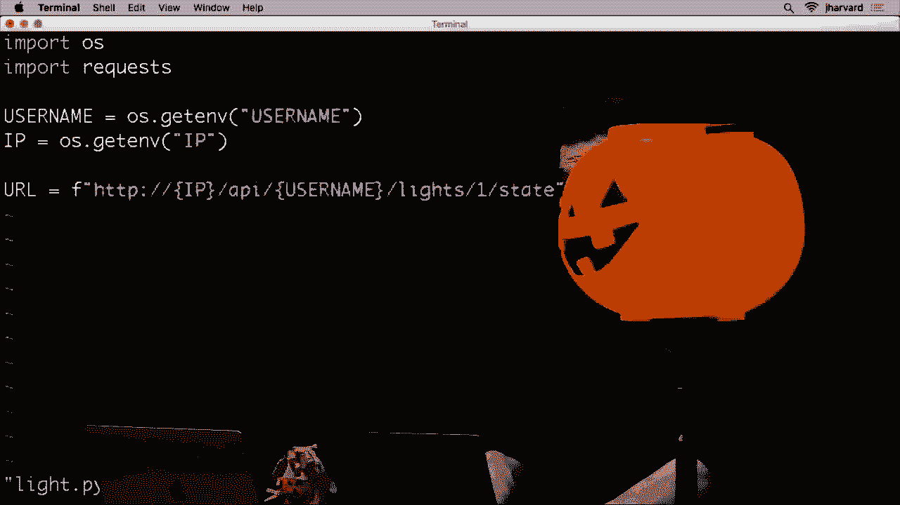

But it's essentially gonna be HDP colon slash slash whatever the numeric I P addresses off this light。bulb slash i p slash my user name slash lights slash one slash。state so I could literally copy and paste that into a browser if I knew what those values were。But I'm gonna do this programmatically。I'm gonna go ahead and write requests。

and I could say Get if I want to send a get request。which is not what I want because I don't want to get the value of the light bulb。I don't want to post the value of the light bulb。It turns out there's a third http verb that we've not seen before。but it's often used for a piece called Put。But in code it's written in lower case dot put。

So this is going to send that it's going to send a message from my Mac to this light bulb。So let me go ahead and put to this u R l The following python。

I'm gonna go ahead and put a value of quote unquote on to the python，Boolean value of false。Now what is Jason？Jason stands for JavaScript object notation。which is just a conventional way of sending textual messages across the Internet so we'll。this is just sending to the lightbulb a dictionary with Chazz AKI of，On and a value of false。

And if I didn't do anything wrong，let me go ahead and close this file。Run python of light dot pie Cross my fingers is always。Now this light bulb doesn't have to be 1 ft for me。It could be literally elsewhere on the Internet。so long as I have an Internet connection and I have access to that I p address over the。

which I didn't want to do today，lest we have hundreds of people turning the light bulb on and off for me。But let me go ahead and change the code a little bit。Now let me go ahead and turn it back on and change on。almost the same code。Let me go ahead now and run Python of light pie again，on and let's make it a little fancier。

Let's go ahead and get a little more logical here，doing things a little more interestingly than we have thus far。and let's see if we can't bring that blink toe life as well。Let me go down here and let's do something infinitely this time。How about while true so forever this demo will go on？While true，go ahead and put to that oral。

not just on and off。Let's go ahead and change the brightness to a value of 254 so really bright。And let's go ahead and change on to true as before。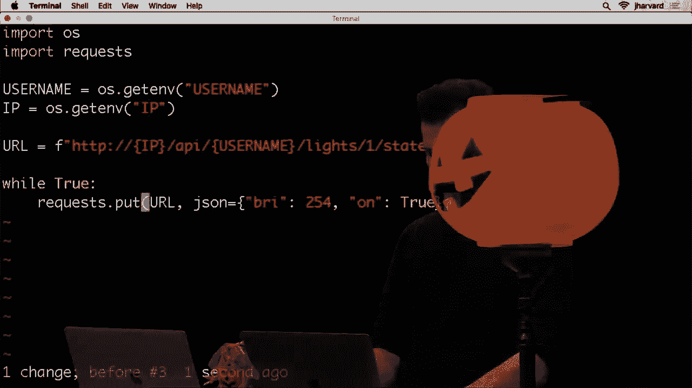

But then let's go ahead and sleep for a moment，so time dot Sleep for one second and then let's go ahead and send another request。after a second to that same oral sending in a python dictionary where on，is now false。And then let's go ahead and sleep for one second。You might have noticed I need another library。I need to import time，which kind of sounds amazing，but it's just the library called time。

I've saved the file，and I'm forever going to send one request，turning it on another request。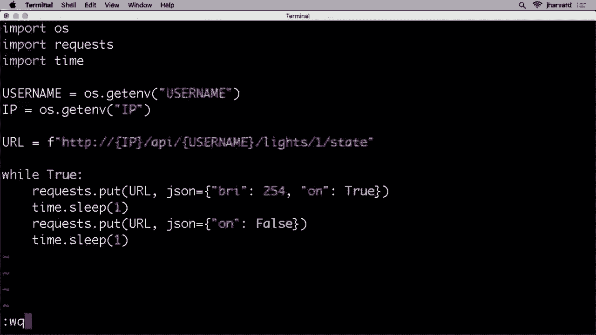

And now the climactic finish python of light pie。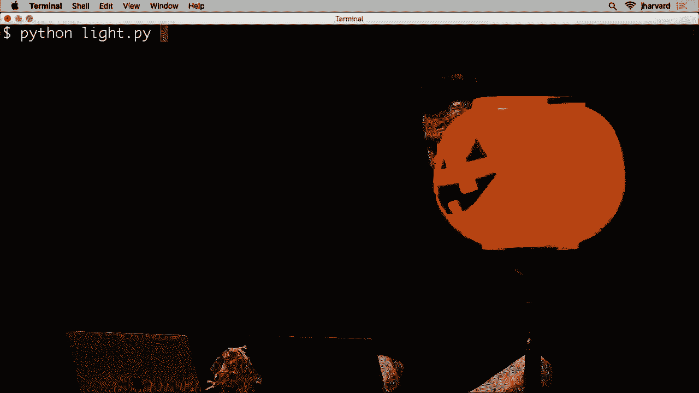

All right。Okay。That's it for CS 50。We will see you next time。