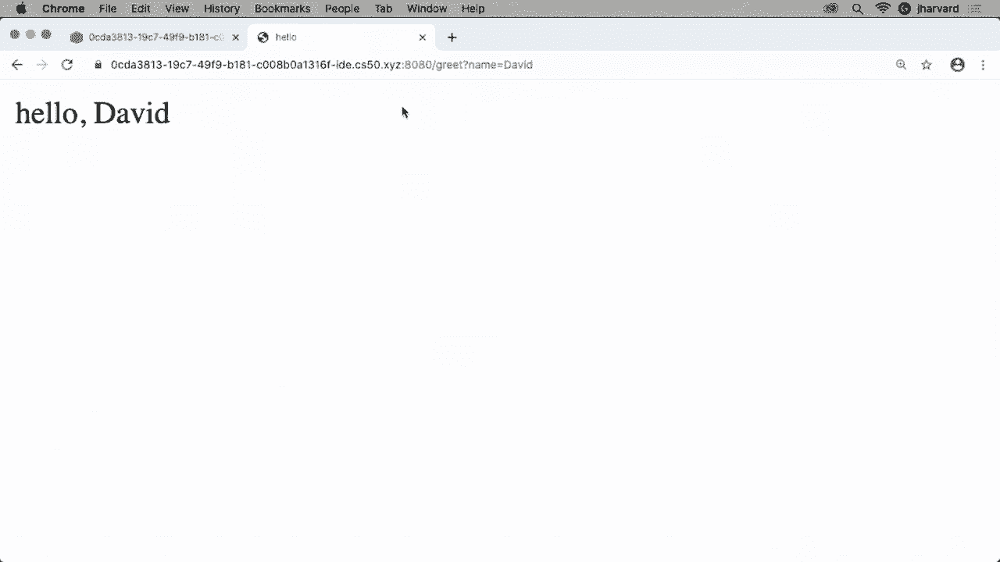

# 【双语字幕+资料下载】哈佛CS50-CS ｜ 计算机科学导论(2020·完整版) - P18：L9- Flask网络请求与爬虫数据编程 1 - ShowMeAI - BV1Hh411W7Up

all right。

this is cs50 and this is week nine the，week where we synthesize the past。

languages，recently，plus some sql plus some python indeed，the goal for this week。is to synthesize all of those materials，into a topic that's broadly described as。web programming now to be fair last week，we did introduce a bit of javascript and。via javascript can you indeed program，but it was entirely client-side as we。

used javascript last week，this week we'll reintroduce a，server-side component and indeed end。

by tying together the browser the，so-called client and the web server。the back end of any web application so，to get there let's consider where we。came from last week in order to，serve up any of your static web pages，them。they don't change fundamentally they，don't particularly take user input，javascript。

we use just this simple program called，http server now there are other。equivalents of this command on macs and，windows and linux and other platforms，but for our purposes。http server the program literally，just runs a web server and a web server。is just a piece of software that's，constantly listening on port 80。

or port 443 in terms of tcp recall，and it's just listening for connections。and anytime your browser connects，it looks at the url that you visited and。maybe some parameters that you may have，provided via that url。or more generally via a form and it then，serves up a web page。

optionally with some kind of output but，of course everything last week really。was just static it was just html files，css files and maybe，some javascript files or javascript。browsers，were sending to that web server will，recall http headers like this。and so among the things that program，http server was doing，and among the things any web server was。

doing was analyzing，the contents of that virtual envelope，top to bottom left to right。trying to understand what is it your，browser or your friend or your family。member if you shared your url with them，was trying to request and if the first，slash。that just means give me the default web，page and by convention recall。

that typically means specifically give，me the file called index。html。that might have been explicit if you，literally typed index。html。into the browser's url bar that would，even more explicitly tell the server to，give you that file。but recall we also played with，google。com，and specifically its search。

functionality and recall that we，manually last week constructed a url，that looked like this。and then we replicated it with an actual，submitting it，colon，slash www。google。com search。question mark q equals cats and last，week http server，is fairly simplistic it only serves。static content so it was pretty much，parameters，but if you actually want to write a，like，google。

com itself you need to be able to，envelope，figure out what path the user wants or，route so to speak。search would be the route here in this，in question and then you have to figure。out what the exact http parameters are，q in this case whose value is cats so。someone somewhere has to write code，that parses that string figuring out。

that you want slash search and then okay，let's ignore the question mark let's。declare a variable called q，and let's give it a value of cats like，be code。that does that and today we introduce，introduce you，to a library called flask and。technically speaking flask is also，called a framework。

a framework is a way of doing things，it's a way of，organizing your code it's a way of。writing your code，that more specifically is just how you，should use this library now why does。flask exist and there are alternatives，well flask exists just to honestly，me。would just get pretty boring pretty，quickly imagine how annoying it would be。

if you wanted to implement some new，website or some new mobile application，code。that analyzed text like this every time，is，wouldn't it be nice if you can just call。a function the equivalent of get string，or get int，and let some other function written by。someone else look at that text figure，out what the parameters are and what，their values are and just。

variables，so that is one of the things that flask，does for you it。analyzes the insides of these virtual，input is，figure out figures out what the route is。like slash search or slash index。html，that the user wants，and makes it more easily available to。you the programmer，and it's a framework now in the sense，that typically when you create as we。

will today，a flask-based web application you're，going to typically organize your files。and folders in this way and this is what，i mean by framework frameworks are not。just libraries where they have functions，that you can call，they typically have a documentation that。additionally，organize your files and folders in this，way and perhaps the simplest flask，application。

would have these files application。pi，which is where really，all of our uh all of our effort is going。to go in writing code in this case in，python，text file，that enumerates top to bottom one per。line what are the other，libraries that you want to use in your，application。static which is going to be a folder，that literally contains static files。

like your gifs your jpegs your pings，your css files your javascript files any。of the files you wrote this past，week now they're going to go into this，static folder。and lastly templates and templates is，going to be where，more of your html goes and we'll see。what the distinction is there versus，last week so in short if you want to。

make a web application not a website，a web application that takes user input。produces user output maybe talks to a，database maybe sends emails。maybe does any number of other things，programmatically，you have a web application and we'll use。this framework here，called flask and there are alternatives，in the world of python。

there is a framework called django in，the world of php there are frameworks。like symphony and laravel and the like，in java and c sharp and other languages。there are similar frameworks，so this is just representative of the。types of frameworks that are out there，but it's perhaps helpful to know before。

we dive into some actual code，that these frameworks tend to implement，certain design。patterns a design pattern is again just，a fancy way of describing。ways that humans write code suffice it，to say over the past many decades a lot，independently。kept solving the same problems again and，again and they realized wow。

i'm noticing patterns and how i'm，solving a problem for this project and。for this project and another，and once human programmers notice these，patterns they might。formalize them by writing a book by，writing a blog post or the like。and then give them a name a design，pattern that they recommend that other，people adopt why。

just because it helps you organize your，code instead of putting all your code in，one massive file。well maybe if we put some code here some，code here we can collaborate more，ourselves。sane when maintaining bigger and bigger，projects so flask implements。what's generally known as an mvc，refers to，controller，and these are sort of technical terms of。

art that at the end of the day we'll see，are relatively simple，controller is going to be where you。write most of your python，code it is the file or files that。

control your web application，so in the past anytime we've written a c，program or a python program。you have in effect been writing，controller code we just never slap that，label on it。there's also going to be today what，we'll call a view，the v in mvc and vue just refers to。all of the stuff that a human views the，interface，anything involving the user is going to。

be described as part of your，application's view，but again any of the code that you the。programmer write that's part of your，controller so to speak，and then lastly is the so-called model。the m in mvc，and this generally refers to what，technique what，your data。so maybe that's a sql database maybe，that's a csv file，the model refers to the data that your。

application is using，so again none of these terms are，introducing。things we couldn't have done last week，or in weeks prior，all we're doing by introducing mvc as an。acronym or design pattern，is just to slap a label on the approach。that flask and in turn many programmers，use，when designing web-based applications。

there are alternatives but this is among，simplest，so much like we've done with any。language let's take a look at the，simplest possible web application you。might write using this library，if you fill，lines of code。

application，now it's not going to do much of，interest as we'll see but this is the，you need。in order to write a web application that，is a program，that once you start it is going to just。be constantly listening，and listening and listening for tcp，requests on port 80 or 443。to come in from people's browsers your，own included，and then now you have the ability to。

write code that responds to those users，so what do i mean by this well let's go，writing。some of our own very first programs i'm，going to switch over to cs50 ide which。we'll continue using here，i'm not going to run http server anymore，instead we're going to use flask。which will take the place of that server，and i'm going to go ah**d and let's。

create a very simple file first，i'm going to go ah**d and actually let's。do this i'm going to first create a，directory so i'm going to create a，directory called hello。and i'm going to cd into hello and as，always if you open your file browser。you'll see the same thing at top left，but in general i'll focus on the command。

line and now that i'm in the hello，directory let me go ah**d and create a，file and i'll save this。

and let me go ah**d and call this。

let's say application dot pi，and again saving it in the hello，directory all right if i type ls i'll。see it there and it's currently empty，so let me go ah**d and pretty much copy。some of that code from a moment ago，let me go ah**d and from the flask。library import something called flask，capital f in this case which is just。

their convention and let me go ah**d，and uh also import something called。render actually let's not even do that，yet let's keep this minimalist at first。in order to turn this file into a，full-fledged flask application。that is my own web server i'm going to，app，by convention i'm going to call this，flask function。

and i'm a little weirdly going to pass，in underscore underscore name。underscore underscore now we've only，seen that special variable，when i said。well you should either call main at the，bottom of your python file to call your，main function。or you can do this annoying thing where，you say if name，matter。

why we use that in the past this special，variable underscore underscore name，to the name。of the current file so this is a line of，code that says，flask turn the current file into an。application，that is a web application that will，listen for browsers requests。now in my file i have to tell flask what，are my routes，a route is simply a url so slash。

or slash index。html or slash search，or any number of other paths that you，see in today's。urls on websites and to do this in flask，i say app。route，quote unquote slash now this is。something we've not seen in，python before but this is actually a。python feature anytime you see an at，this，it's what's called a python decorator。

and for our purposes today，one function，to another but let me leave it at that。for now and just say that the convention，when using flask is that at first you，define your route。like your slash default route then you，define a function，and the function can be called whatever。probably，call it something appropriate for the，actual route in question and again。

humans tend to call the default route，your index so i'm going to go ah**d and。call this function index，and below that let me just go ah**d and，do something silly like hello world。literally returning that string，and let's go ah**d and see what exactly，ahead now。and in my hello directory if i type ls，notice that again i only have one file，application。

pi in order to start my，server today because it's a flask，server。i instead want to run the command flask，run so flask is yes a library but it。also comes with a program，when you install it on your mac or pc or。the ide that lets you start a flask，application as well，and you'll see some cryptic output here。

url，of your currently running application，and if i go ah**d and click this url and。open it in another tab，voila i see my very first，dynamic web application it's only。printing hello world，and in fact if i go to chrome's view，page source feature。notice that it's not even full-fledged，html it's literally text，but that's because i didn't bother。

returning any any actual html yet，so let's do that let's actually do this。more properly and not just return some，arbitrary string of text，now。on doing this by default the route，called slash i've claimed，means that you should return a file。called index。html，well let's assume for the moment it，exists how do i go ah**d and return it。

technically i'm going to go ah**d and，render a template called，index。html and in order to use this。function render template i need to，import it from the flask library as well。so flask again is the library comes with，a lot of functions the first one of，activates。this as a web application render，template is another function whose，purpose in life。

is to go find a file called index。html，grab its contents so that you can then。return it so it's similar in spirit，to using open and read in python。a few weeks ago but it's going to give，us some other fancy features as well。but let me go now into my command line，type ls to remind us that we only have，application。pi。

i don't want to create index。html in the。

same directory，flask recall has certain organizational，recommendations like this here。whereby i should actually put index。html。

my folder，called templates so let's do that let me，go ah**d and make a directory called。templates with make，dur enter if i type ls now you'll see。

that i have a templates directory，now let me go ah**d and create a new。

actual file called index。html，let me store that in my templates。directory and now let me go ah**d and do，something pretty familiar we've done。this many times at this point，whereby we just whip up a quick html，here，be。english by default down here i'm going，to have the head of my page。

inside the head i'll have a title i'm，going to call this hello。down here i'll have my body inside the，body i'm just going to say hello world，last week。but let me now go back to application。pi，remind us that we've just now returned。the function call rendertemplate of，index。html and again this function。

file，grab all of the bytes inside of it and，return them ultimately via this line。so now let me go ah**d and run flask run，again，let me go ah**d and click on my ide's，url voila。same thing but now if i open up chrome's，view source feature，full-fledged。

web page so again not really，fundamentally that interesting but i've，taken this baby step now toward。generating any html that i want so let's，make this more interesting i've claimed。all along that there is this way of，course with web programming，to uh take user input via the url。so how can we go about doing that well，let me go ah**d and propose this。

let me go ah**d here and write an，additional line of code，that does something like this let me。declare a variable called，actually let's do this after render，template it turns out you can pass in。zero or more，named arguments and the names of these，arguments are entirely up to you and we。haven't seen that thus far，thus far in the past any time we've used。

someone else's function you had to check，the documentation or the lecture notes。to figure out what were the available，function，but that's not true with render template，to pass。a user's name from my application。pi，file which recall we're going to start，calling my controller。i can say give me a variable called name，what i want the value of this。

person's name to be well really what i，want it to be，is the equivalent of whatever is after。that question mark right the only way，fundamentally to get user input。from a url we've seen is whatever's，after the question mark and i don't want。

q and i don't want cats i want name，equals david or name equals brian。so how can i do that well let me go。

ahead and say this，name equals request dot args，dot get quote unquote name and let me。additionally add，am i doing，when i import this other request。

variable from the flask library。

this gives me access to the http request，have been，in the url and what flask does for me is。it parses that url it figures out what，david，whatever is after the question mark。flask parses it for me and hands it back，to me as variables，and i can get access to those variables。by calling request。orgs for arguments，dot get and then the name of the，parameter that i want to get。

from the url so now if i，save this let me go back to，index。html and here is why，template。a template just like in human world is，kind of a framework into which you can。plug other values it's a template that，you can base your own work on it's like，on。so templates typically have special，syntax by which you can plug in some。

values and i'm afraid the syntax is，slightly new，versus past things we've seen but if you。use two curly braces，as though one weren't bad enough in c，and in other contexts。two curly braces left and right you can，tell，flask's render template function to plug。in right there the value of any variable。

that you have passed into render，template，as one of these arguments in the，function call。so let me go ah**d now and run flask run，again to restart my web server。

let me go ah**d and open this url and it，looks pretty stupid right now hello。none but recall that none is a special，value in python it means something has，no value。so you know what i could do it turns out，that，let me go back over here if i go back to。my url and let me zoom out so you can，see it here's my crazy long url。

of my running server let me go ah**d and，add a slash，question mark and not q equals cats。because that's irrelevant now，but how about name equals david and let，me zoom in on that。all i've added is the slash question，mark name equals david，let me go ah**d and hit enter and voila。now i have a webpage that says hello，david and indeed if i view my page，source notice。

the html has been dynamically generated，there is no file on my ide that says，hello comma david。rather it's been dynamically plugged in，and notice this can change if i go ah**d。and change the name to，brian enter his page changes and of，course if i view the page source now。it's as though i had a file called，index。html，that literally had brian's name in it。

but no there's just that，placeholder within my template instead。and i can clean this up notice it looked，name。

but it turns out the，request。rx。getfunction，takes a second optional argument if i，don't know。if there's going to be a value and i，want to give it a default argument。my second argument to the get function，can actually be the default value。

so if i go ah**d now and let me go ah**d，and rerun flask，and let me go ah**d now and reload with。no name argument，now you see a default value of hello。

comma world but if i go back up there，and put my name back in now it doesn't，need the default。i see what the human actually typed in，so what's going on here well if you，consider what google。com is doing when，you type in cats and hit enter，that word q equals cats is being passed，to google。com in the url，google is running some program maybe，other language。

that's analyzing the url grabbing q，equals cats and then they're searching。their database essentially，for a keyword of cats and then they're，dynamically generating the html。that shows you all of those pictures and，search results of cats there is no web，servers。that constantly has a big list of cats，like there's certainly no human。

maintaining a really big html file，just filled with image tags and cats all。day long it's suffice it to say that's，all dynamically generated and even with，this trivial example。we see now perhaps that we're scratching，the surface of that，here，and see if there are any questions。or confusion because it's a lot all at，once given that with any framework you。

typically have to learn the conventions，first and then you can start to be。any questions or confusion in the chat，yeah so in your when you called the。render template function someone asked，templates，slash index。html and why did you just，say index。html，good question this is one of those just，because answers the render template，function has been。

implemented in such a way that it，assumes that your files，are in the templates directory you can。technically override that by，reconfiguring the application but the，default and indeed the convention。question，yeah i just wanted to know why when you，declare the，ad app。route you have to include the。forward slash and as an argument to that，yeah so why do you have to include the。

forward slash that is the way in，function，simplest，certainly most uh basic route that you。any other words，so you have to put slash there because，otherwise the server won't know。what to do if you visit exam dot com，slash and that's it we can change this。notice i can change this to anything i，want let me stop my server。

and let me change this to slash secret，my website。

let me go ah**d and rerun flask run let，happens，nothing happens not found 404 when i，visit slash and。chrome is just being annoying it's，hiding the slash just for simplicity。these days but the slash is there even，though you're not seeing it as the human。but if i change this and go to slash，secret。

then we see that page again so that app，define，what route should be associated with the。

following function，i have a question about the model is it，name。i guess as the data is it encoded within，the html file，uh yeah at the moment i would argue we。don't really have a model yet，like when there's no database there's no，with。c controller and v view and that's，totally fine，it's only when we have a full-fledged。

application like we soon will today that，really the m comes into play but again。this is sort of reasonable people might，they're not，little，uh silly that in order to be greeted by。my website you have to sort of have the，wherewithal to know，that you have to type your own name and。uh into the url bar right no one does，typically works，we instead find ourselves as humans。

filling out forms so let's take this one，in such a way，that we actually have a form instead so。let me go ah**d and do this i'm going to，go ah**d and create。another file let me go ah**d and do this，let me，go into my templates directory where i。currently only have index。html，and let me just copy this file，index。html into another one right now。

called greet。html，and that is to say i want my greet file，ultimately let me go ah**d and open this。in my editor，greet ultimately is going to do the job，that index was a moment ago。and i'm going to change the behavior of，index。html，to instead have an actual form so i'm。going to go ah**d and delete this and，i'm going to do a form，go，to let's say let's say。

let me have it go to a route called，slash greet which doesn't exist yet but，i wager it soon will。i'll use get initially and then inside，of this form let me go ah**d and give，myself an input。whose name is going to be literally name，red name，moment，although a little。confusingly and then let me go ah**d and，say the type of this field will be。

text and then let me go ah**d and give，myself an input type，equals submit so i have a submit button。and the，value of that will be whatever the，default is so now let me go back，to application。pi let me go back to my，hello directory，make sure you don't run flask run in，only。ever run it where the application。pi。

file is，open it now，and voila my slash route the default，route notice。has changed to be this html form and if，i look at the view，source of that in chrome you'll see。exactly what i just typed so there's，nothing dynamic about the form that is。indeed hard-coded there's no，placeholders there，but notice that this form has been，slash。

greet route using get well how do i，implement that well let me actually go。

into my application now，because you'll notice if i type in my，name david and click submit，greet。does not exist that is not a defined。

route in my application，so let me go back to my server，and let me go ah**d down below and let's。just do something similar，app。route quote unquote gree so let's，give myself a second route。let me go ah**d and define the function，that should be called when a user visits。slash greed and again you can call it，ourselves，let's keep things simple and just call。

it the same thing as the route though，again that's not a requirement。and then in my greet function well what，do i want to do let me go ah**d and say。return to do i haven't done it yet but，steps，and just make sure the basics of your。code are working so far，let me rerun flask run let me open my。

url，and now let me try filling out the same，form again and actually i'm a little。annoyed that the autocomplete is popping，up but we can turn that off later。let me go ah**d and click submit and，voila now the greet route，does exist notice that slash greet is。fully functional it's not a not found，anything useful。

hence the to-do well that's okay let me，go back here，have gree，render a template called greet。html。but recall that greet。html is where i，placeholder，so i think what i can do is just move。the code that i was using earlier for，index which no longer needs it because，index。html has only。a hard-coded static form let me go ah**d，greet，route instead let me go ah**d and，restart my server。

let me go ah**d and open my url let me，go ah**d and type my name in。

and submit and voila so now we have two，greet，the first of which just so happens to。only display the static form，the second of which actually happens to，do something more interesting。and greet the user and i mentioned a，moment ago i was kind of annoyed by the，remembering。who typed their name in before and just，rubbing me the wrong way leaks a little，bit of privacy so。

let me actually go into my index and，html like，auto complete equals off i can also do，auto focus。to give that text field the blinking，cursor by default，server。after making this change let me go ah**d，little better。

let's also add one of those placeholder，quote-unquote name，just so that it's a little more clear to。my visitors that oh，you want me to type my name david here，autocomplete is now。

working，if simple web application，all right so what were the additions，but。we added a second route and a second，template，so that one form could submit data to，the other。route instead so let me pause here to，see if there's any questions。or confusion before we continue to，iterate on this，by a chat or virtual hands as always。

looks like we have a question from anna，sure anna，sorry say again a little louder um。how that name equals uh double quote，name，is is that equivalent to，[Music]。the name that you later specified it is，and i'll demonstrate this by changing。that now i called it name just because，we're indeed talking about humans names。

but i could call this anything i want so，for instance，person's name。but i could change it to un uh first，underscore name for instance if i only。care about their first name，let me change the placeholder to make。clear that i only want their first name，let me get，the first underscore name http。

parameter and then in my template，greet。html let me change this to first。underscore name and actually i need to，make one more change，i need to change this to first。underscore name as well so it's a little，annoying that you have to like repeat。yourself all over the place，but they mean different things in the，context of application。pi。

this is a parameter that i'm passing，into my template，in the context of this get function this。is the http，parameter that i'm grabbing from the url，and in the context of my，those。which is the argument i'm passing into。

server，and let me go ah**d and reload the form，here let me type in only my first name，change。not in terms of output but in terms of，functionality and you'll see that now。i'm using first underscore name。

other questions or confusion about，routes。

or parameters in the url，templates or otherwise，now all right well let me ask a question。then of us let me go ah**d and，scroll this down just a bit to make room，here again is my index。html file it，contains a form，contains，just hello comma so and so。what looks poorly designed about this，i'm going to go ah**d and revert just to。

my shorter names just so a little more，fits onto the screen at once。but what looks poorly designed about，this i claim that it's correct we seem。to have a working web application，but what is poorly designed arguably，even if you've never seen。flask or web programming，itself any instincts，based on past lessons learned in c or，python or。

well uh i guess you're getting it so the，url is exposing the。personal data of the input whatever they，might have put in，the so i guess we'd want to use post。instead to hide it，deliberately，but a little worrisomely been leaking。information in the url in the sense that，now it's probably going to be saved by。

my browser right often when you're，typing something to your url bar。you can see what you've searched for，before what websites you've been for。to before and that's a good user，you，type your keystrokes because you can，your thought quickly。but it's a little invasive if you don't，want people knowing where you went or。

what you searched for or if it's a lab，too，there's a lot of reasons why you don't。want your typed input，ending up in that url bar and i proposed，using。what you proposed is post and indeed，let's do this let me go back to my，index。html，file，going to be。almost the same as get but instead of，putting my，parameters in the url like q equals cats。

or name equals david，in the url it's going to instead，metaphorically put it。lower deeper inside the virtual envelope，so it's still being sent from the，browser to server。but it's not going to get remembered by，the browser in the url bar。but if i do this i need to change my，controller，i need my python code to look in a。

somewhat different location to get at，that and it's a pretty simple change。instead i have to do this i have to tell，flask that the route slash greet is。actually going to support，a different set of methods rather than，supporting get which is the default。i have to pass in the somewhat cryptic，argument called methods。

and then i have to pass in literally a，python list of the methods i want this，list to support。by default if you don't use this，argument all of these routes，the first and the second have。essentially this default value，methods equals quote unquote get in a，list so a list of size one。it would be a little annoying if you had，default just，allows you to just type nothing at all。

but if you want to support post，you do have to override this and change，the get default，the。parameters from a different variable，instead of using request，dot args which refers to the arguments。in the url。

you have to change it to request dot，form these are horribly named。

in flask these global variables，get，and post respectively better names might，have been request。getandrequest。post but，this is what we have，the url，request。form is for post requests where。the same info，is buried deeper in the virtual envelope，and make。

sorry not make wrong language flask run，all right let me go ah**d and open my，url。and voila i'm going to type in david，click submit，and now notice the magic now the route。is still slash greet，but no one who uses my laptop later is。

my，google search was or what my credit card，have typed，output，to be clear。is post is when you would is what you，would use whenever you're collecting。anything remotely personal like，people's email addresses perhaps or，certainly。and other values but uh，you can otherwise use get as we've been，using thus far。

well let me ask a follow-up question，than this，there's something fundamentally about。the design of index。html and greet。html。

that feels a little sub-optimal and i，dare say，several of you noticed this same problem。in this past week when you were just，creating a few html files on your own。what was a little tedious or annoying or，messy or poorly designed。as best you could tell from creating，these several html files for your own。

personal home page，what did you find yourself doing that，you probably didn't feel good about。or that would seem to violate past，lessons learned，the chat is suggesting you've repeated。some html between the two，html files yeah my god i mean honestly。by the second file third file fourth，file you're probably just copying and。

pasting your previous files and then，making minor changes and that's all you，even javascript。you can't share html across multiple，pages your only option this past week。when serving static content，was to copy and paste that content，redundantly and look at this。in my index。html file everything i've，just highlighted from line one to seven。

happens to be exactly the same as，everything from line one to seven，in greet。html so here's another feature，you get with flask or any web，programming framework these aren't。specific to flask per se，you get the ability to factor out common。content and so how do we go about doing，this well let me go ah**d and do this。

let me go ah**d and create a third file，that by convention in flask is called。

layout。html and to be safe to be sure，i'm going to put this in my templates，file。

i'm going to go ah**d and copy paste all，of that same boiler plate if you will。all of the commonalities and delete what，was specific to greek。html。and i think what we're looking at lines，1 through 10 is now like a。template for if you will the layout for，my other two web pages。

so you know what let me go ah**d and do，say block，body and then a little weirdly end。block here so this is flask specific，syntax or technically ginger specific。syntax which is a language that flask is，using which someone else wrote。this is special syntax and flask that，essentially says，here so i can。

plug in other html in just a bit so how，do i use this now well let me go to my，index。html file。and let me get rid of all of the，redundancy，boiling down index。html really into his。essence the only thing that's special，about index。html is that form，i just created。let me go ah**d and say up here using，that special syntax extends，layout。html and then down here。

will，let me unindent that a bit and then let，me say down here，uh end block so again syntax is weird。but the ideas，are pretty similar this is almost，similar in spirit to our。header files and see where you could，factor out some commonalities。and just reuse them in multiple places，can kind of，have this blueprint this layout。

literally that you can then plug，different content into，so this first line says hey flask the。following file index。html，essentially inherits from it extends my，it's this。notice that this layout defines this，placeholder arbitrarily called blo。body i could have called it x or y or z，but i'm going to call it body y。

because really it's like a hundred，percent of the contents of my body so。seems like a good name and then in，index。html i just now need to tell flask。

here comes some code that you should，plug into，more，lines of html code in here so let me go。ahead and save this。

let me go ah**d now and go to greet，similarly delete all that crazy，redundancy。and now let me go up here and say again，extends layout。html，and then down here let me say here is my。body block，let me just unindent this slightly and，then let me say end block。and save that file so now these html，there's barely，any html in here it's really just text，and weird。

flask syntax same thing in index。html，but again this is one of the values of a。web application where you have a，programming language like python。you can factor out those commonalities，and really start generating pages。dynamically just like the googles and，facebooks and others，of the world do every day so let me go。

ahead now，and rerun flask run and cross my fingers，as always because i made a whole bunch。of changes here。

let me open my url and voila seems to be，working okay so far let me go ah**d and。before i submit this let me show you the，page source notice，that it's there it's not quite as pretty。printed like the indentation's a little，off but that's okay，your templates should be well styled。everything should be beautifully，indented in your templates，but if your templates are then rendered。

as pretty，that doesn't matter because again the，browser doesn't care but indeed i have a。full-fledged complete web page，let me submit this form it seems to。still work that's my slash greet route，i'm seeing hello david and if i view，page source here notice。another confirm form submission this is，actually a safety feature you don't want。

websites tricking you into like，checking out twice with your credit card。via post so i'm going to go ah**d and，click reload manually which confirms，because there's。nothing dangerous about it there is now，my greet route，so this probably would have saved you。

all a lot of headache or tedium or copy，paste you just didn't have this tool in。the toolkit last week，you cannot do it with html and css or，even javascript。alone in the browser so this，is where you have templates really。shining not only can you have templates，use two curly braces，use this，in。

actual contents of other files，uh there's a clarification question，could you tell us what is jinja。yes so i skirted over that because i was，getting annoyed at just like how many。new terms there are today and frankly in，the web programming world that we're，sort of stuck with。so um this is a good example of code，reuse there's a lot of smart people out。

there a lot of people solving different，problems it would be a little annoying。and a little arrogant if all of us tried，to solve all of the world's computing。problems and so the authors of flask，decided that for their template feature。they would not reinvent the wheel and，would use。

you will，that uses the double curly braces and，the curly brace and the percent signs。

so that they're just combining one，is so，common and this is a good thing because。technically you can plug in a different，language if you really are anti-jinja。for some reason you just hate the syntax，you can actually use something else and。so this is actually a demonstration in，computing of um，really a component based design where。

you can plug different pieces of。

software together，and have them still interoperate and，we'll add to the course's website links。

to jinja's documentation and we'll see，in a little bit what more you can do。

with jinja in the template so again，jinja just refers to really。the double curly brace syntax and the。

curly brace，percent sign syntax that appears in our，templates，files all right one last feature。when it comes to saying hello thus far，in application。pie，i've been keeping things a little。conceptually simple if crazy，complicated syntactically by having two，separate routes。one route slash for my form and then，another route，for my actual um greet。

uh route that actually displays the，information but strictly speaking。i can be a little clever and combine，these routes if only because if you're。building a pretty sophisticated website，that's got lots of routes。it's kind of annoying if like every，route needs two routes if。

one form has to submit to another so let，me just propose，that we tighten up our implementation。and actually reuse，our one route so let me go ah**d and，delete my greet route。just because it's bothering me that i'm，getting a little redundancy there。and let me go ah**d and say that my，default route my index，and。

post so i'm going to use the same route，not only to show the user the form。but also to say hello to the user as，both get，and post on the same route so how am i。going to do this well let me go ah**d，and do this，what i can do is if request。dot method equals equals get，then i can actually go ah**d and execute，this line of code here，post。

then what i'm going to do is this return，render template，greet。html and i'm going to pass in a。name of request。form。getname，and then a default value of world so。nothing new that's just the code that i，deleted a moment ago。

but notice now i'm reusing the same，route and i'm just，if you will。well if the method came in as gets go，ahead and just display the form if the，method came in as post。go ah**d and greet the user now why is，this going to work well it turns out。whenever you visit a url on the internet，like http colon，www。harvard。edu or yale。edu or，google。com。

you have always been making get requests，in fact recall last week when we looked。at those sample http requests，and the headers everything we did last。week had the keyword get by default，in the envelope so get does not have to。anything fundamentally to do with forms，it's actually the default http verb。

that's used whenever you just visit，any url anytime you visit a url on the。web you are using get by default，when you submit a form you are，potentially using get as i did first。

or you are using post as i did second，so what's the takeaway here well let me。go ah**d and make one change to my，form i do want to submit via post。i'm going to submit though no longer to，slash grief but just to my default route。and if i did everything right here let。

me go ah**d and run flask run，let me open up my url as before，view my。page source the action is going to be，slash also，so i'm sort of using the same route for。two different pieces of functionality，voila，amazingly it worked hello david but my。route has not changed now why is this，why is this useful it may or may not be。

it's just the capability you now have，because if you can express yourself，programmatically in python。you can distinguish between the two，verbs get and post that are inside of，your incoming http request。and if anything this just means you，don't need twice as many routes。just to have one thing passed to another，and it turns out there's also other，features that derive。

from just being able to reuse the same，route but more on that，down the road or any questions then on。saying hello flask，no all right well just as a teaser here，here is a screenshot of pretty much the。very first web application i made back。

in the day when i was an undergraduate i，got involved in intramural sports。not in an athletic sense but in a，computer science sense，i volunteered to actually build the very。first website for harvard's freshman，intramural sports program otherwise，known as frosh iems。at the time we were using paper uh to，write your names down on and email，addresses down on your。

choices of sports we would walk across，middle of harvard，slide it under the door of one of the。proctors or resident advisors and voila，we were registered for sports but there，was no website。uh there was an internet but there was，no website yet so this was late 90s。so i thought it would be fun to，implement that same idea of a piece of。

paper for registering for sports，in a web browser and now unfortunately i，only knew c。and maybe some c plus at the time and a，couple of other languages from other cs，programming。so i taught myself how to web program，with the help of lots of questions and。answers from friends i happened to use a，language called perl，frightening。

design here with lots of menu options up，here，and some csv files essentially on the。back end that stored all of the，registration data i knew nothing about，databases at the time。but it was my first foray into web，programming and what we thought we'd do。after our first break here，is re-implement the idea of a，registration system，sql。

to re-implement the same idea worrying，even less today about the aesthetics but。let's go ah**d and take our first five，minute break here and when we come back。all right we are back so the goal at，hand is to implement the most primitive。features that i first implemented，via this frosh items website years ago。

that of allowing students to register，for sports and to register for a sport。let's collect everyone's name and maybe，register，so how are we going to do this well let。me go ah**d and copy just the layout，from our previous hello examples just。because it's pretty good boilerplate and，i'm actually going to make one change it。

turns out that it's very easy to make，your websites，pretty mobile friendly just by adding a。my head here，i'm going to go ah**d and add a tag，viewport，viewport refers to the rectangular。region that defines most of your web，browser's user interface。the content of this meta tag is going to，be initial，scale equals one and width equals device。

the magic，this incantation here essentially tells，the browser whatever。the user's whatever the width of the，user's device is，assume that that's the maximum width for。my webpage and it's going to scale my，font sizes automatically。up or down based on whether you're using，a laptop or desktop or，iphone or android phone or something。

else altogether there's other things you，need to do to make your websites。responsive so to speak and it's helpful，but this，minimally helps at least address issues，that here。as well now let me go into my，frosh，ims is empty and indeed to be clear over。the break i created application。pi，is empty a templates directory and。

inside my templates directory is just，that layout。html so we've got a little。bit of work to do here together，so let's go ah**d and start building out，this application。let me go ah**d and import from flask，the flask function itself plus render。template which i bet we're going to need，and then also request which we're。

probably going to need as well，let me initialize the application with，this flask。function using underscore underscore，began，earlier and let's just go ah**d and。start defining our first route app。route，quote unquote slash，let me define a function called index。but again i could call it anything but，me started，i could be really take do this quickly。

and say return to do，but i'm kind of confident now in my，ability to at least use。render template so let's at least render，admittedly，does not yet exist so let's make it。

file，called index。html and again i could call，this whatever i want but if this is。going to be my default route i might as，well call my default page the most。common default name which is index。html，let me store it in my frosh ims folder。

in my templates folder，so that it's in the proper place in here，let me go ah**d and say that this。extends my layout。html，and then down here let me say my body，block will be whatever's in here。and here，now i'm feeling a little uncomfortable，with how much code i've written so let's。just put it to do there，and let's make sure this whole thing，directory。

do flask run enter，all right go ah**d and open up this，browser tab and it just says to do so i。view page source。

i see a full-fledged web page including，that meta tag we just added。but with just a big to-do here now what，i want to do the biggest thing i want to。do is actually have students be able to，register for a sport，so let's go ah**d and define ourselves。an html form via which to do this，so inside of my body block in my，index。

html template let's go ah**d and，first just call this like the，registration page with an h1 tag。and then let me go ah**d and give myself，a form the action will be。i mean we the sky's the limit let's keep，it simple and just do slash register。rather than make complicate things by，using the same route again。

let's keep things a little private so，let's do a method of，post so that my roommates don't know。what sports i'm registering for or not，registering for，and then in here let's go ah**d and ask。ahead and do an，of this，human sense，uh the type of that box will be text。and let's add some of the fanciness as，before auto complete equals off，or oof uh autofocus whoops。

placeholder，so that it's self-describing of name all，right and then let me go ah**d and give。myself a submit button input，type equals submit and let's add a value，of register just to make the。website a little more user-friendly let，me go ah**d and stop my server and，restart it so i can。

reload all of these changes and let me，go over to this url again。and voila we have the beginnings of a。

form it's only asking for names so it's，not quite there so i need to ask for，some sports as well。now there's a bunch of ways we can do，this and even though you might not have。seen them all yet in cs50 you've，certainly used them on the actual。internet when you're visiting websites，so let's do a drop down menu initially。

let me do what's called the select menu，because you select an option。the name of which is going to be sport，select menus if you read the，tutorial。you'll see that they must have children，called options and children，must have values so for instance。let's use a value of how about dodgeball，which is a common intramural sport。

and then inside of the option tag you，actually have to say，much like a link what the human should。see so i'm just going to redundantly say，dodgeball here too，and let me go ah**d and make that my。life a little easier here let me，to do to do just to speed things up let。me do a little bit of copy paste here，and how about we change this one to，uh flag football flag。

football over here let's do i'll say，soccer，and soccer and again just like links。there might be this duality the same，same。

but for now we'll keep it simple this is，what the computer will see。this is what the human will see and then，down here we'll call this ultimate。frisbee and hear the same thing ultimate，frisbee okay so now i have a working，drop down menu so。let me go ah**d and prove as much by，restarting my server，interface is。

kind of ugly definitely very minimalist，but if i now type in my name david。notice that by default dodgeball，should be，but i can actually fix that let me i。don't like how i'm forcing everyone to，think they have to do dodgeball。let me do an option here with an empty，value for instance，and i can even say something up here for。

instance like，let's just say what it is sports so with，no value so it's not an actual。valid option let me go ah**d and open my，url now，okay so now i see sport in the drop down。too so david。

sports okay it's a little weird that you，can register for sports，it turns out if you read the。documentation for a select menu you can，actually disable，the option and also let's say。select it by default so these are just，additional attributes that you would。discover in the documentation for the，option tag，that now let me make the user interface。

a little more robust just so that users。

aren't registering for，now notice，sport is selected by default but it's。grayed out it's not a valid value，anymore so minor user interface。improvement dodgeball sounds amazing，that was not an intramural sport in my。day but it apparently is these days so，let me go ah**d and register for this。

okay but of course not found well why is。

that well if we look at the url i just，ended up at i've not implemented my，slash register route yet。alright so let's do that to do that i，need to go back into application。pi。and let's go ah**d and do some，registration trickery app。route。register i'm going to define a function，could again，call it anything i want and in this。

function let's keep it simple initially，let's just go ah**d and return。a template called success and just，successful。

and in fact let me go ah**d and create a，new file。

called success。html in the frosh ims，templates directory，and let me make sure that also extends。layout。html，and that it has a block body and，for goodmeasure and block and then down，for now。you are registered exclamation point not，really registering anyone for anything。but i'm going to claim that they were。

so now if i rerun my application，re，re-register david for dodgeball and，click register。huh now it's a bug and let me pause here，just to see if the pieces are。fitting together method not allowed，even though i'm at slash register any。

thoughts on how to fix this，and notice you can even see in my，terminal window in red，means。method not allowed which is a rare one，brian any thoughts，um yeah i think that when you define the。app that route for，read or register didn't specify methods，are all get。but if i want to use post for privacy's，sake recall that i just have to tell。

flask that the methods i want you to，support for this route，are this list of verbs or methods。and that list is going to be of size one，with just the keyword post in it so。again when you encounter these issues，which you absolutely will when doing all。this for the first time，don't worry so much about the specifics。

of the error message but the ideas like，what's gone wrong method method not。allowed what could that mean，the only methods we talked about are get。and post so maybe it's something related，slash，register so maybe it's something related，kinds of。clues can lead you to a solution like，santiago just proposed。

let me go ah**d and restart my server，let me go ah**d and reload。my form type in david again i'm going to，select dodgeball register。voila you are registered all right i'm，not actually registered for anything but。i feel like there's still a missed，opportunity for，error checking now in fact let me go。

back to my form，not type david and not select dodgeball，and click register。well this is kind of stupid like it's，claim it's saying i'm registered even if，i only type my name。

no sport you are registered so there's a，missed opportunity here for some error。checking so let's at least go in and add，this let's go ah**d and do something，like this how about。if not request。form。getname，or request。form。getspore，or not that then let me go ah**d and。return render，template failure。html，otherwise i'll return success。html so。

let me try this now let me rerun the。

server flask run，let me go ah**d and reload my form no，changes to the form but now if i don't。cooperate and i click register，okay now really bad things are happening。this is one of those 500 errors let's，see where i screwed up。internal server error and the subsequent。

paragraph are not very descriptive but，if i go to my，terminal window here's my exception a，language。failure dot html is not found all right，well that's just because i made a stupid。mistake so let me stop the server，for now，let me go ah**d and paste it in here and。

i could probably factor this out but，we're going to keep it simple for now，and call this failure。html。

put it in frosh ims templates save it。

back，let me try not typing in anything and，just registering，okay voila now it's actually checking。and if i go back here，name okay i'll not type in a sport it's，still not checking。but there's still this kind of hack here，you know you recall from last week that。if you right-click or control click on，anything in any web page，you can inspect it in chrome or your。

preferred browser，and that lets you start poking around，the html and watch this maybe i'm a。little bit upset，that uh there's no let's say tennis，tennis is not offered by the intramural。sports program but darn it i want to，register for such，well again using a browser there's。nothing stopping me，from for instance ah i don't know how to。

do this let's change ultimate frisbee to，tennis，page，zoom back out close the inspector haha。now tennis is a sport at harvard so now，watch what i can do，register for tennis type in my name。david voila registered for tennis，right i've hacked the website all right。so in some sense i kind of sort of have，hacked the website this time now。

obviously i'm not doing anything with，this red information on the server at。the moment i'm just blindly saying，registered or not registered。but notice what i've just done in fact，let's really notice what i've done let。me go ah**d and inspect the page again，let me go to my network tab and let me，resubmit this form。

back here，let me type in david let me um do this，quick hack again。let me go ah**d and right click on sport，inspect let me get rid of ultimate。frisbee and change this to tennis again，and let me change this to tennis again。enter now let me go to my network tab，select tennis from the drop down and，then down here，down here。

just like last week you can see a list，of all of the http requests so let's，look at slash register。let me now zoom in on all of this and，scroll down to the，form data which we didn't see last week。but is there for post requests。

i have legitimately sent from my browser，david and tennis to the server the onus。is now on you the programmer，to make sure that you're not actually。going to let me register for tennis if，it is not a supported sport。so now there's more error checking，necessary it's not sufficient to just。

trust that the user typed in a name，and a sport you can't just check for the。absence of either of those now we should，really be smarter and make sure that。whatever sport the humans browser sent，actually exists at harvard and you could，quickly。if it's a bank account like how much，money do you want to deposit well i'll，of money。

i'm depositing or withdrawing right you，should not be able to，change a server's data or database。by just changing some html you should，never ever trust，your users or myself in this case so how。do we defend against this well there's a，solution to this problem that actually。gives us some other features as well，silliness，where i've literally hard-coded all of。

these sports in the html which，literally i resorted to copying and。pasting that should have been the first，clue that，we could probably do better let me。instead go into application。pi，and let me go up here and let me just。define a global variable called sports，i'll capitalize it as is the convention。

when defining constants，and let me go ah**d and say the sports，are going to be this。python list so i'm going to keep it，pretty and put it on multiple lines，list。here's where i'm going to say dodgeball，as one sport，flag football was our next comma。soccer whoops soccer oops，soccer is our third volleyball，fourth and then lastly we'll leave in。

ultimate frisbee，do i now，use that list of sports well i can just。pass them into my template i can say，something like this，sports or anything x or y or z but。sports is more descriptive，equals sports so this is to say i'm，going to create in my template a。variable called sports the value of，which is going to be that same。

global variable and to be clear flask，requires that you choose a name。you can't just pass in sports because，flask just won't know what to do with。a single argument like that you have to，give these things names and again。it tends to lead to this redundancy，where you're reusing the same words。

but one is your variable on the right，the other is the name you're using in。your template on the left，so now let's do this in index。html，powerful。in templates like jinja you don't just，have curly braces left and right。and you don't just have the blocks with，the curly braces and percent signs，constructs。

i can actually do something like this，it turns out i can actually do something，like this。for sports in sports，that you literally say，end and then the name of whatever the。the preposition was a moment ago，but now let me go ah**d and generate an。option whose value is quote unquote，the current sport close that and then in，here let me say。

sport again done now，i have used a for loop in my template，the syntax for which looks almost。identical to python that's deliberate，the authors of jinja essentially。borrowed python's own syntax so it's not，too much，i'm doing，i'm using this jinja syntax to iterate。over that sports variable it's a for，loop so i'm saying，iteratively set sport equal to the first。

sport then the second then the third，then the fourth and the fifth，for loop。i'm using the double curly braces to，just plug in the sport there，plug in the sport there and what's。amazing about this feature，of flask and in term web frameworks in。

general is that now when i run flask run，and i open up my url and go to this form。voila it's there it's dynamically，generated for me and if i look at my，all of those。options are indeed there but i didn't，have to type them out manually。

i now have it in an array and i'm，dynamically generating even more html。and what's more powerful about that，savings is that now i can go into my，application。pi。and let's not just check for this value，so if not request。form。getname。that was saying if there is no name and，then this part here was saying。

if there is no sport why don't i more，specifically say，or the sport that the user input into。the form is not，pretty elegant。

now i'm checking two boolean expressions，is it the case that there is not，a request。form。getname or is it the case，that their，not，should be failure，so you can send me tennis you can send。you want，i am now going to reject it because i am，validating your submission，is thematic。unfortunately you can never ever trust，user input you should always assume。

that some annoying hacker out there or，friend or sibling is going to be trying，to hack into or。crash your programs but you can defend，in this way，so case in point now if i go ah**d and，david。dodgeball register that works but if i，do this little hack again。where i go into my html i go down here，i change ultimate frisbee for instance，to tennis，out，david。

voila wait a minute damn it。

why did that work，more request sorry。

sorry david is not only registered but，confused。

let me check this once more，sport equals tennis register oh，wait okay i didn't restart the server it。was still running the old code。

now i open it up oh now we have to do，and hack the site，let me go ah**d and inspect this expand。the sports let's go ah**d and change，ultimate frisbee to tennis。let's go ah**d and change that to tennis，close the window。

change the drop down to tennis and now，there we go okay，all right was confused for a moment but。again just restart the server and it，will reload the changes we actually made。and thank you so much brian for diving，in there to save me but figured it out。all right any questions or confusion，beyond my own now，on what it is we've just done by one。

dynamically generating，a list of user select menu options，and also validating on the server。against that same list，of data，any questions or anything on your end，brian nothing here。all right so let me just demonstrate，real quickly these just different user，say。we're not too focused for our purpose on，user interface design。

using a library like bootstrap can you，make these forms look much prettier just。by adding a few more html tags，and a few more css classes，but let me go ah**d and make a one tweak。here whereby we can change the ui，from being the select menu to a bunch of。different things let me go back into my，index page here，and let me go ah**d and just introduce。

not this notion of a select menu，let's go ah**d and get rid of that but，let's introduce a more。familiar option as familiar option as，follows let me go ah**d and move this。out let me keep using my loop here，let me define an input type equals，checkbox。the value of which will be the current，sport，and then outside of this i'm going to go，ahead and have。

that same sport name save it so i need，to do one more thing，name equals quote unquote sport now let。

me go back to my，flask run let me now go back to the form，and now notice it's not any prettier but。it is now using check boxes and if i go，ahead and click david and check。dodge ball i can actually now，technically register for multiple sports。if i want i can register for multiple，server。

i'm going to have to handle that a，little differently and so in fact if i。did want to support multiple sports，what i should actually be doing on，application。pi。

list，flask get multiple values，looks like get list yes okay so get list。will return to me a list of all of the，check boxes that the human has typed in，little bit。but this would allow me now to get the，user's input in a different way。or i can do things mutually exclusively，instead of using a select menu。

notice what i can do instead in，index。html，i can go ah**d and define inside of my，menu。an input name equals sport，type equals radio for radio button which。are the mutually exclusive circles that，you might tick on a box。on a website and then the value of this，will be this particular sport。

and then over here let me go ah**d。

outside of the radio button and actually，display to the human，that sport name let me restart the。server let me reload my page and voila，we no longer have a select。menu but we have radio buttons which，achieve the same result，but they're just laid out in a slightly。different way and they're indeed。

mutually exclusive like an old school，radio in a car，where you can only select one of them at。completely the same，so which to use it depends if you've got，a hundred different sports you probably。don't want a hundred different radio，much space，but if instead uh you might want to use。