# 【双语字幕+资料下载】哈佛CS50-CS ｜ 计算机科学导论(2020·完整版) - P19：L9- Flask网络请求与爬虫数据编程 2 - ShowMeAI - BV1Hh411W7Up

instead all right so what's the key，thing we're still not doing we've got a。pretty dynamic user interface，but i'm just throwing away the，information once the user clicks。remembering，just as i did back in the day who has，actually registered so that we actually。have a proper，working registration system so how can，we go about doing this，the past。

that we can store data inside of a，python program，using a list using a dictionary using a。set there's a lot of data structures，that python gives us，so let's start simple and let's actually。do that let's go ah**d and store our，registrants maybe，in a dictionary so in application。pi。which is thus far now unchanged let me，give myself one other global variable。

registrants and let me initialize it to，an empty dictionary，and recall that we did this to implement。a phone book where i added my，name and phone number and brian's name。and phone number a couple of weeks ago，we used a python dictionary to store，those key value pairs。name and phone number here let's do，name，and the sport for which they're。

registered so that we then have in the，computer's memory a list。of all of the valid registrations so how，are we going to do this and what needs，to change well。let me go ah**d and change this back to，the select menu just because it fits on。the screen a little better，instead of the radio buttons and，from here we will have again the user。

interface that we saw。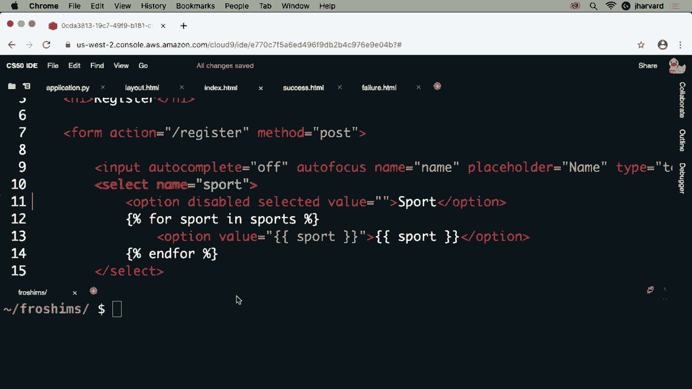

earlier so let me go ah**d and do flask，run。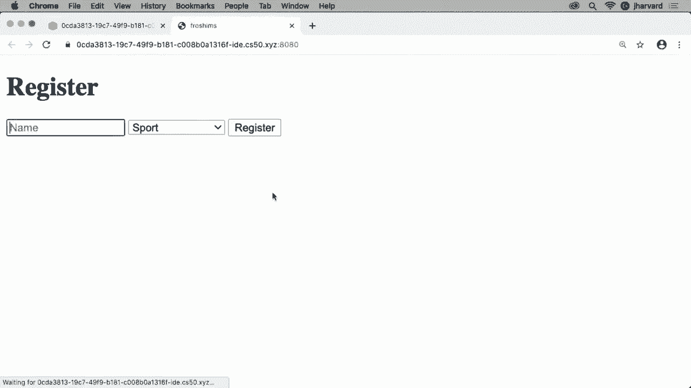

let me go ah**d and open this up and，before，the goal of which now is when i click，see。you are registered or you are not，the user，so i think we're going to need to do a。bit of work in application。pi，the file that's actually processing the，user's registration。so instead of just validating the form，by checking if they had a name。

or a sport that was in sports let's do，go ah**d and，sort of start a new here and let me do。something like this name，equals request。form。getname just so i，easier to use。and then let's just say if not name then，let's go ah**d and return，render template failure，sport。sport equals request。form。getsport，storing it in a variable just so i can。

do this a little more cleanly and then，if not sport，go ah**d and return render template。template failure dot html，and then let's do one more check but i'm，time，if sport not in sports。then let's go ah**d and return render，template，failure。html but you know what this。seems a little silly if all i'm doing，if i know as the programmer what the。

error is but i'm just telling the user，you are not registered that's not，the user。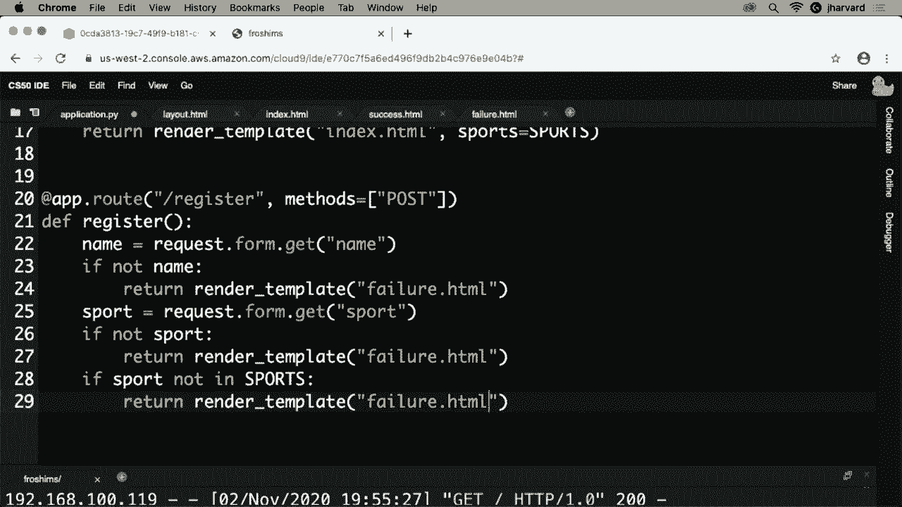

wrong，so let's do this instead instead of。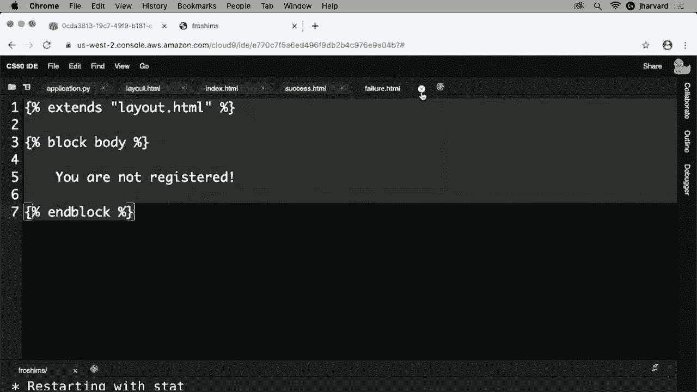

failure。html，let me go ah**d and create a different，file called error。html。and this will be called error。html in my，frosh ims directory in my templates。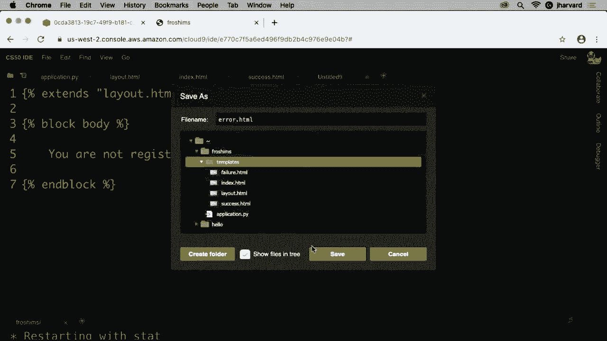

directory，and in here let's go ah**d and actually，put an error message for instance，something like。this message so there's nothing，for message，but let's see what this will do for us。let's now go back to application。pi，and instead of error。html let's be a，error message。like missing name and down here let's，change this to error。html and say a，message of。

missing sport and down here let's change，this to error。html whoops。error error in the error message of，invalid sport so there's a sport there。but it's just not in the list of valid，accordingly，so now let's just try this real quick。let's try this real quick and input this。

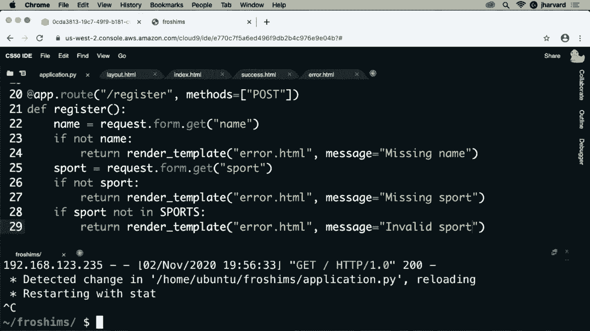

data incorrectly so we can see these let，me rerun the server，reload the form let's type in nothing。and just try to register，okay missing name it's more useful than。just you are not registered all right，fine let me give you my name david。register missing sport okay now let me，go ah**d and give you a sport。

and now if i registered i'd probably get，handled。

the successful outcome yet so let's，finish this up let's go back to my。application dot pi in my register route，and then ask ourselves well what does it，remember。that the user is registered for a given，sport in the computer's memory。and the computer's memory recall i'm，using by way of this，global variable called registrants and。

it's all caps just to make clear that，required，and then down here why don't i do this。registrants name，what we did，values，where i'm using name to index into the，python dictionary。and i'm setting the value equal to the，sport and then let's go ah**d for now，and say return。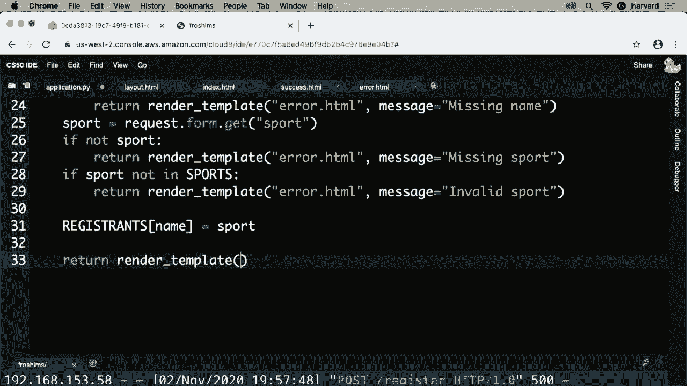

render template whoops render template，success dot html so let's test this out。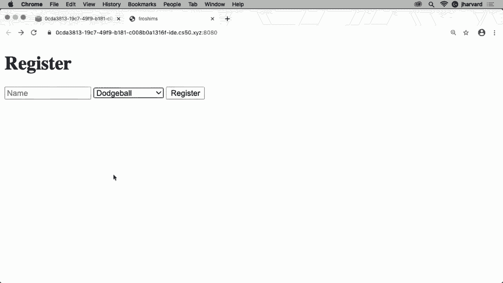

let's go over to frosh i am so whoops，let's learn from my mistakes。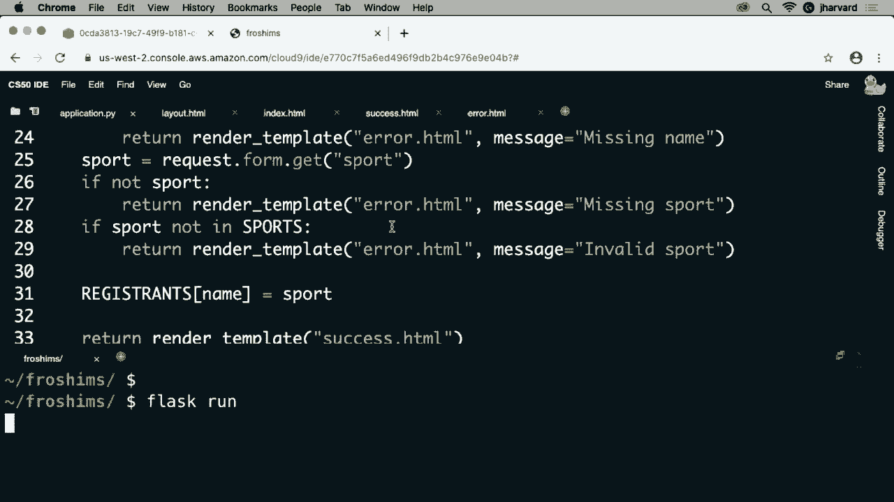

stop the server and reload let me go，back to the browser，let me go ah**d and type in david who。will register for dodgeball，register claims it's registered let me。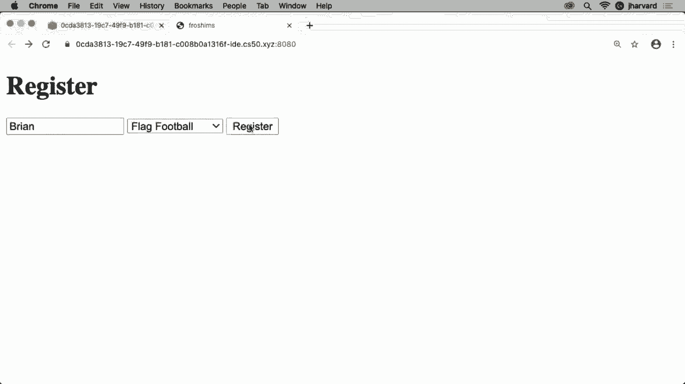

do brian will register for flag football，know，who's registered or not i don't know but。you know what let's do a little，sanity check here let me just print out，print。f is your friend so let's just do a。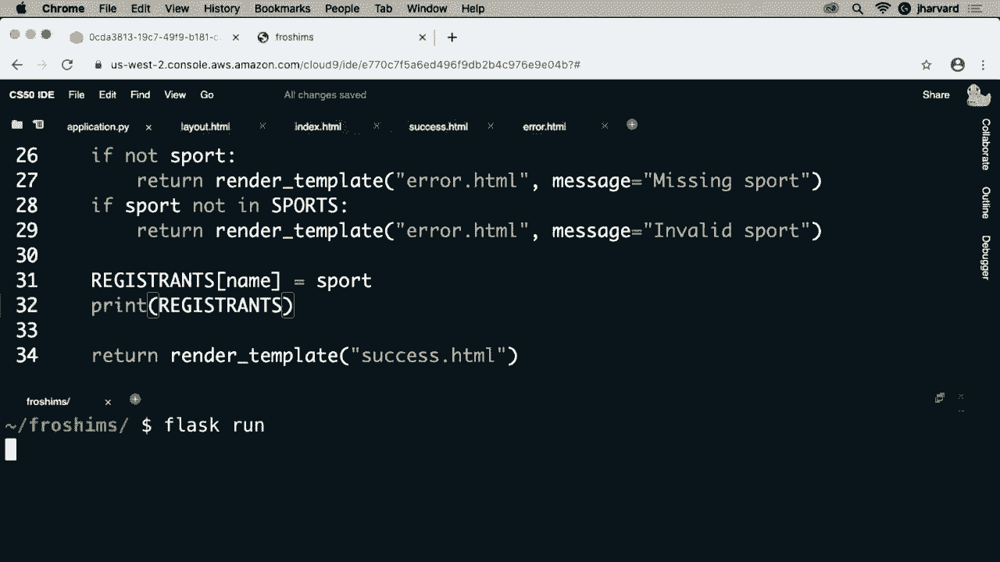

run again，this time let's go back to the form and。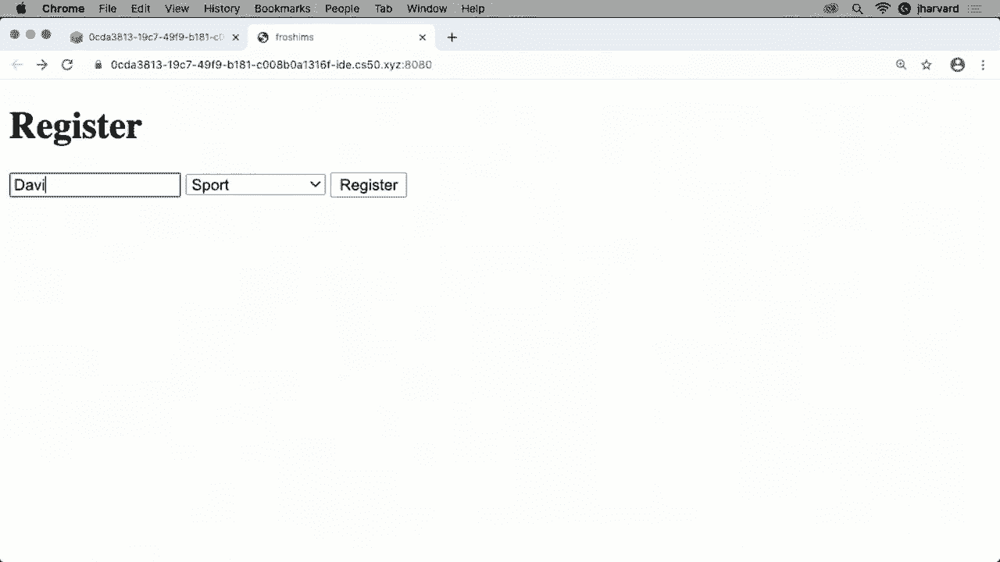

register david，sport dodgeball register same behavior，but down here notice。we have this oh and i see a couple of，you are registering as well，uh so i see。lucas has registered for dodgeball as，volleyball so，they're okay now harsh has registered。for volleyball so this is the problem，live demos，but apparently it does in fact work so。

let's go ah**d and make this a little，cleaner here，and instead of just printing registrants。let's go ah**d and do something like，this why don't i go ah**d。and you know what let's do this let's go，ahead and render a template called，[Music]，registrants。html and i think to make，this happen i'm going to need another，interesting，generated。

quite this kind of success message so，let me go ah**d and whip something up。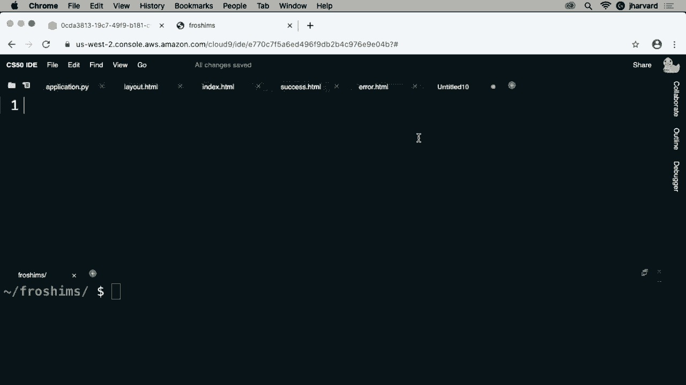

registrants。html frosh iams templates。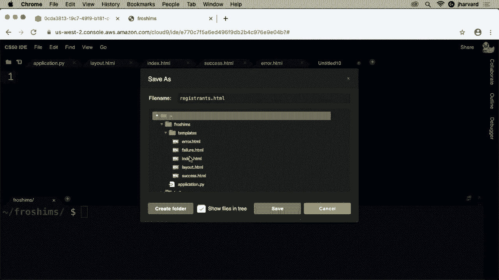

and then in that folder templates and in，here we're going to do extends，layout。html down here。block body uh end block，and then down here in here i'm gonna do。this is gonna take me a moment here h1，registrants then below that i'm gonna。give myself an html table inside of the，table i'm gonna define what's called a。

table head which is not strictly，head，from the body from the optional footer，table row。inside of here i'm going to create three，columns using th table heading which you。might not have seen before typically，makes things bold，by default to make clear it's the。heading and i'm going to put the，person's name and then another heading。

of their sport down here and then below，the table head i'm going to do t body。which is the table body，another tag you might not have seen，body。and i'm going to generate dynamically a，whole bunch of trs so for name in。registrants let's go ah**d in this，ginger for loop，table row，specifically。

the person's name and then specifically，in the other column，we'll see。by way of a variable called registrants，by indexing into it，via the name so registrants in a moment。is going to be a dictionary that i pass，into my template i think that's it it's。a little tedious to type it out but，and templating，if i go back here now and pass in。

registrants equals，variable，i'm providing my registrant's template，with a variable called。registrants but again i could call it x，more appropriate，setting it equal to the value of that。global variable thereby giving my。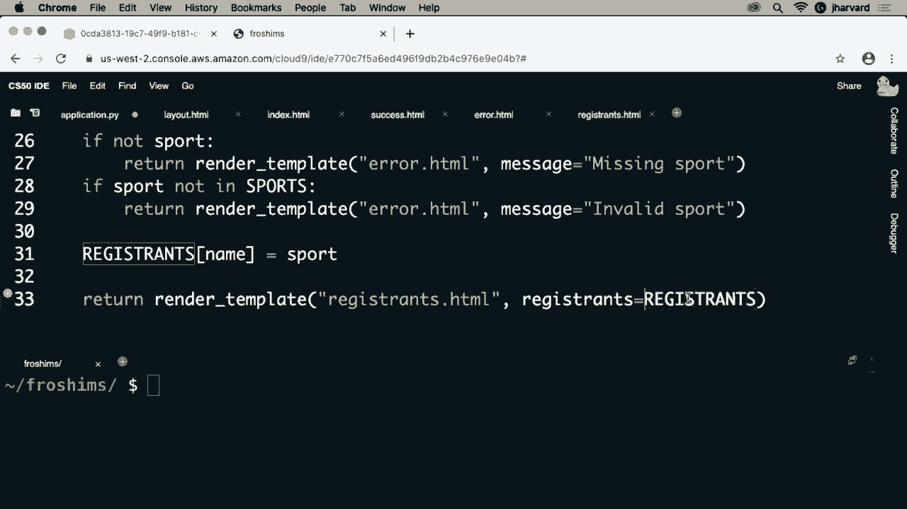

template access to，that dictionary if i now save the file。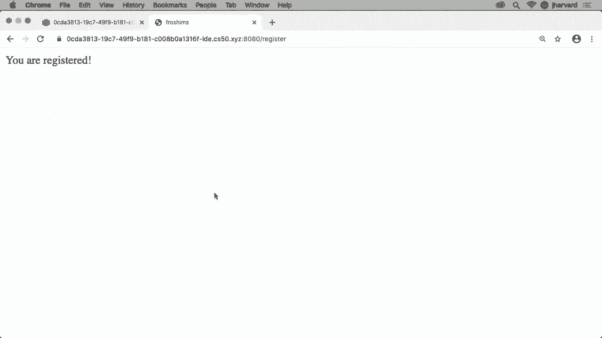

rerun flask go ah**d back here，oops let me go ah**d and do this once。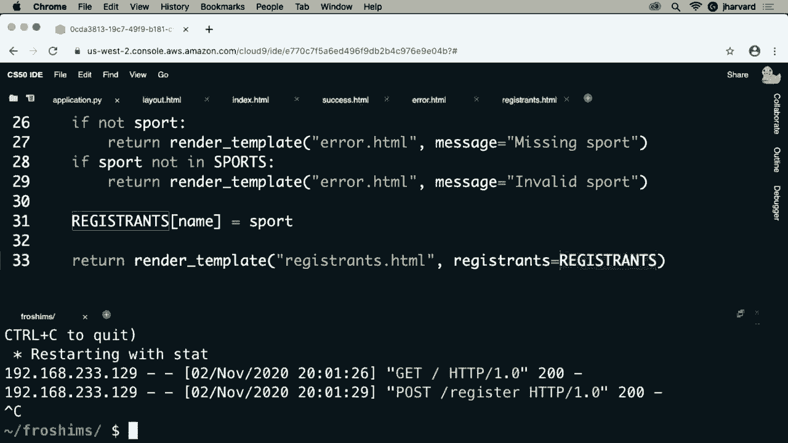

more let me go ah**d and rerun flask，let me go ah**d and select my url let me。go ah**d and register david for，dodgeball and click register voila or，she beat me to it。so harsh is registered for flag football，david has registered for dodgeball，but。if i view the page source you'll see，that we indeed have the table head。

followed by the table body followed by。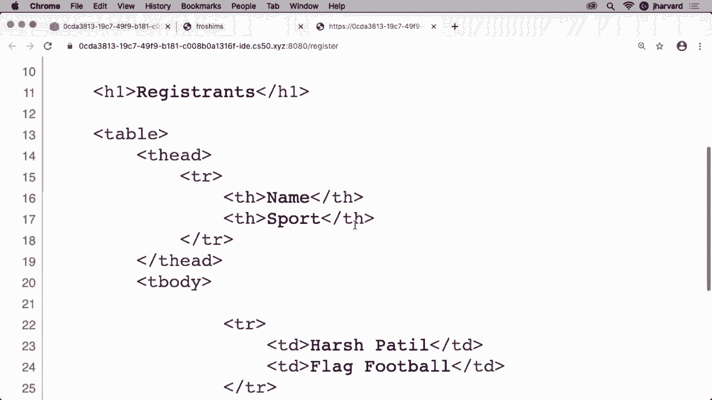

harsh for flag football，followed by david for dodgeball and then。after that any subsequent registrants，who are registering at the same time so。this is pretty cool i dare say，in that now we have the ability to save。all of these registrants to a global，variable，but what's a downside here we've made，progress。

i'm now showing you users who have，proctor，who's running the sport knows who's。registered but there's a catch，what could go wrong here what's bad，about using，a dictionary sophia。i think that every time you reload the，server you're just going to reset and。you're going to save the data，exactly if i'm just using a global。

variable it'll work forever so long as，the server runs forever and the ide。stays online and we don't lose power or，any other number of reasons but as soon，as the web server。excuse me stops or is turned off or，something goes wrong we're going to lose。all of that data so this is why a couple，of weeks ago with python。

we actually used csv files or ultimately，a sequel light database but let me make。one change too because，what i don't like right now is that at，the moment the only way to view my。yourself，and maybe that's a feature if you want，to require people register before they。see who else is registered，but it feels nice to have a different，route maybe slash registrants。

that anyone can visit to see the actual，list of registrants，so let me go ah**d and make one tweak。here let me go ah**d down here and，define another route，app。route slash regis whoops。registrants and then define registrants，anything i want，and let me actually move this rendering。of template here，and you know what let me be a little，clever let me actually redirect the user。

to slash registrants so let me go ah**d，and import one more function up here。redirect from the flask library and this，is a function that will literally do one，of those http。301s or some other status code that will，send a location to the browser that says。go here instead and the reason for this，is that it's just nice，now that inside of my register route。

once you're registered，i don't need to like literally copy and，and actually。have redundant code i can just say，redirect the user to slash registrants。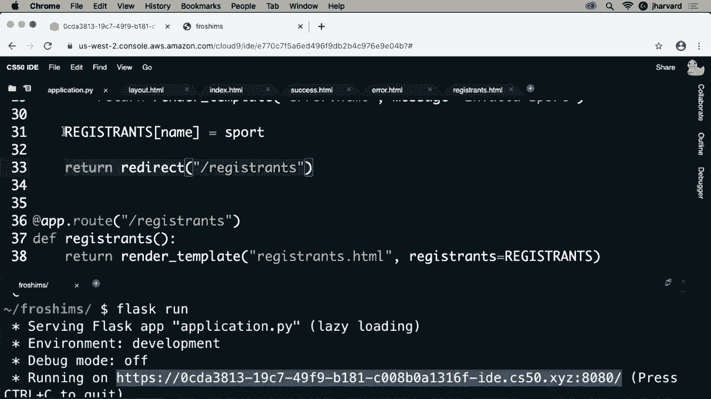

which already exists now，so that they can see themselves and who，else has registered so if i do this。again let me restart the server，for dodgeball，the cut this year，uh this time but we see uh break and。moesh and david now，registered in that split second，amazingly for these sports but notice。the url which is the key point，now we're at slash registrants and if i。

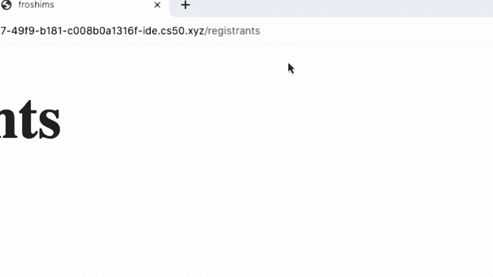

keep reloading i'll keep seeing all of，the changes，since then all right but sophia makes a。really good point and that the date is，all going to be lost so i think we，should clean this up。where we actually，save the data in for instance a，sql lite database or maybe even email it。out so that we have a backup copy，this，let me go ah**d and propose that we make，a few changes here。

a few changes borrowing some inspiration，from our look at both sql。and python so i'm going to leave most of，this alone for now，i'm going to go ah**d and get rid of。this variable we'll have to store the，data elsewhere，database a。sql lite database so let me go ah**d and，declare our database，uh as sql sqlite colon，frosh ims。

db let me go ah**d and import，this this recall is from cs50s library。the sql library and let me go ah**d in。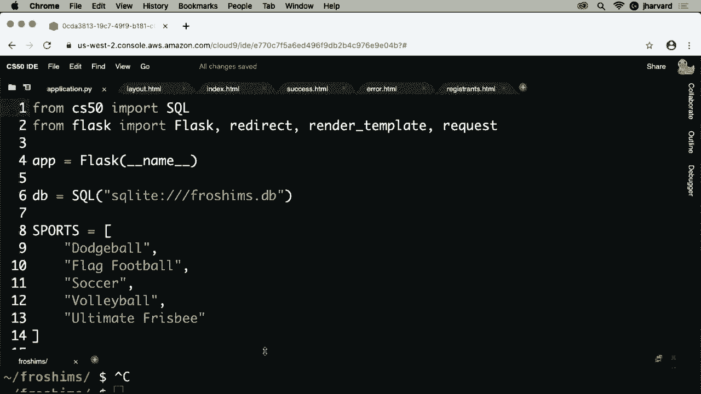

my window for just a moment here and，copy the database，from an example i brought with me just。

so that we don't have to create the，database as well and sort of rehash，things from。our week on sql let me go ah**d and grab，the database here，oven，and we now have a local file in my。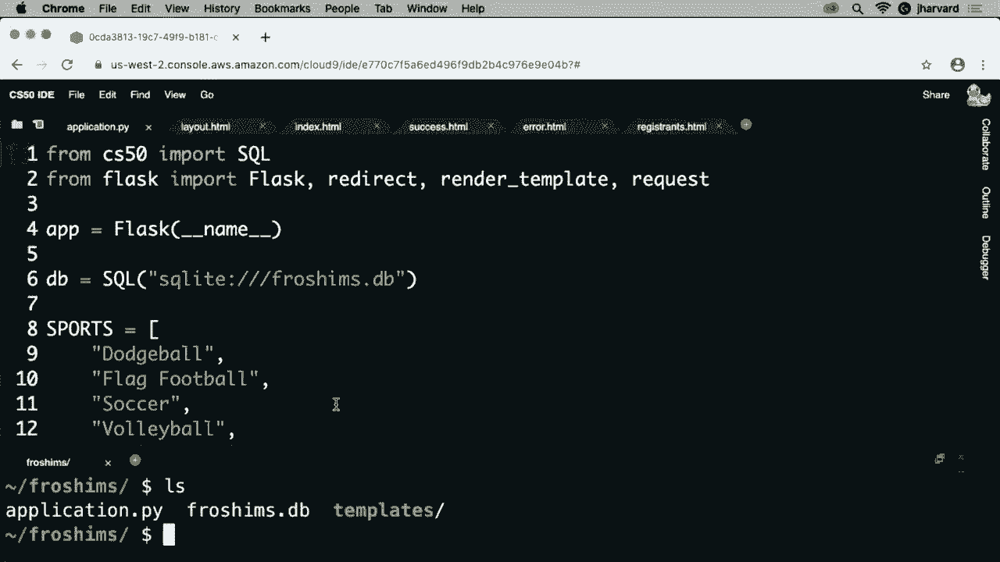

directory called froshims。db，so let's go ah**d and first look at this，database sqlite，of frosh iams。db dot schema enter，here's the database table that i created，in advance just so we wouldn't have to。reinvent the wheel，i'm creating a table called registrants，with an id column。with a name column and a sport column，the primary key is going to be that id。

the text field should not be null and。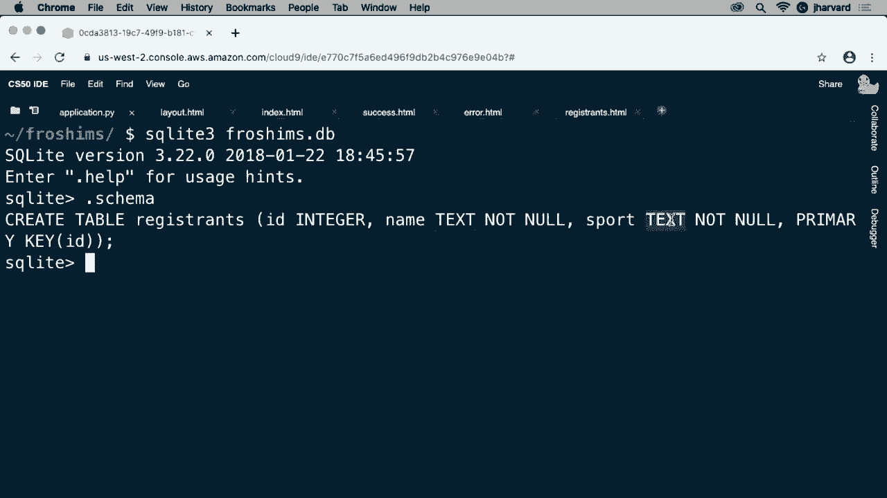

seen，all of the syntax actually in past week，so it's just a simple table。to give me an id for every registrant a，name and a sport，but i'm going to do this in python now。so let me go ah**d and go back into my，let me go back into my application。pie。and let's go ah**d and do this when i，want to actually register the user。

let's validate them as before making，sure that they've given us their name。and their sport and now let's just use a，little sql instead of saving it into。what was a global variable let's do，db。execute，insert into registrants a name and a。sport i don't need the id it will auto，increment for me as the primary key，question mark。

again beware sql injection attacks and，let me pass in name，and sport and i think that's all i need。i'm now going to use a little bit of sql，in my python in order to insert that。name and sport into the database，and after that i think i'm fine but i do，need to change registrants。because this variable down here no，longer exists but that's okay。

because recall from our look at sql in，python i can do something like this，registrants equals db。execute select，star from registrants indeed that simple，query would seem to give me access to。all of the registrants thus far，and now i can just pass that in like。that again it looks a little weird that，the name of your variable in your。

template is the same as the name of this，variable but again that's because on the。right is the variable，on the left is the name you want to use，in your template but you could call it。anything you want，all right here as always let me cross my。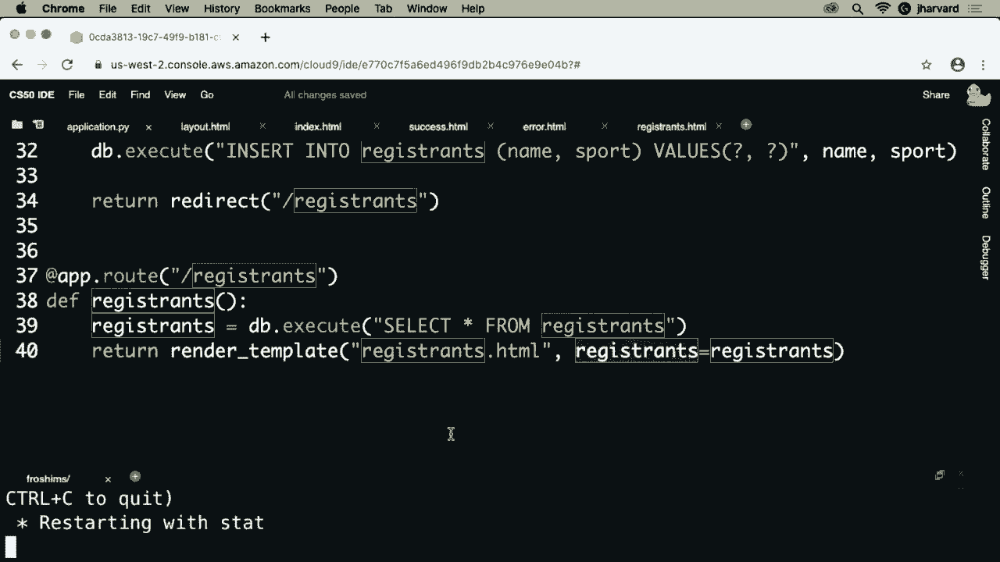

fingers flask run，all right let me go ah**d and open up my，url let me go ah**d and type in david。dodgeball register okay，interesting so harsh and naveen got in，there real fast again。you're just kind of waiting with the，submit button but this is a mess。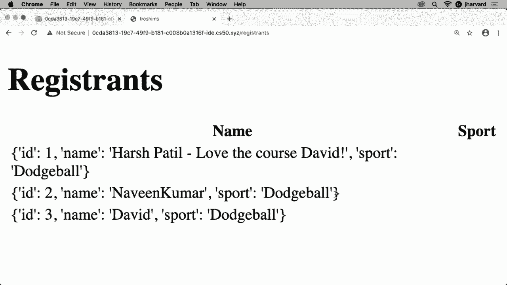

something is clearly wrong now i'm，seeing like weird dictionary syntax。but that's because i haven't adjusted my，template so let me go into，registrants。html。and recall that when i select，is like getting back，rows i just renamed it to registrants。but i'm really getting back，rows and rows are just，dictionary each row is a，they're in。

so i think my syntax just needs to，change a little bit in my，registrants。html。i should really think of this as for，registering in registrants，and let me go ah**d and output the。registrant's name，and down here let me output the，registrants，sport so again this is more similar to。the time we spent on sql in python than，it is to html and css。

right now now i'm iterating over all of，the rows and if you prefer，back over here。let's do it just like we did a couple of，rows，pass in those rows to my template and。now iterate over those rows，and each row has a name field and each，be。equivalent but once you understand the，really are，instead of this more generic row so let。

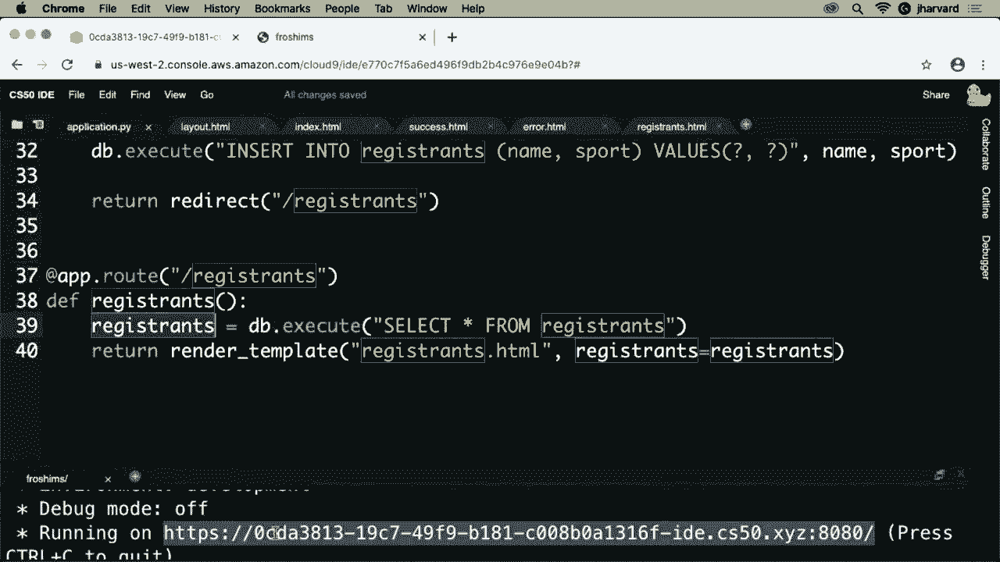

me revert that now let me go ah**d and，rerun the code let me try to beat。everyone else to the punch type in david，for dodgeball and。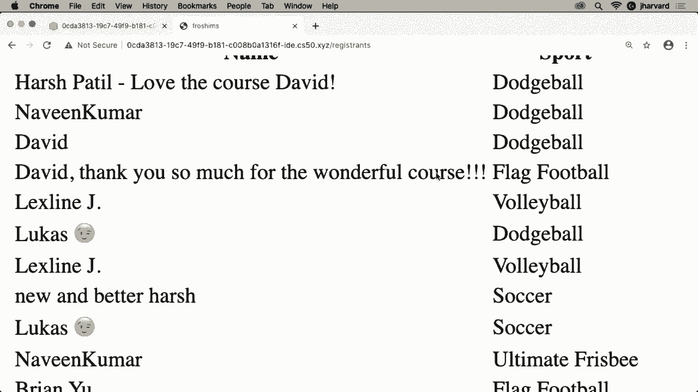

oh my god okay lot of people okay new，and better harsh all right so you're。working really quickly it should seem so，now we see all of the same results the。database is really hopping now，i'm a little nervous about scrolling any。further so i'm going to leave it there，but we now have a full-fledged web。

application honestly that is now much，websites，we have our own database using sql we。have our own templates dynamically，generating this table even though it's。ugly at the moment but i could certainly，beautify it with some css or some，bootstrap in particular。but we now have a full functioning，website，what would be the icing on the cake you。

know what it's pretty cool，even though we take it for granted when。a website emails you a confirmation what，actually did，years ago whereby you email the，registrant or。yourself to report that someone has，actually registered so how can we go，into my。code here and let me add one final，top here，from flask，mail import mail and message and again。

you would only know to do these things，from a class from the documentation from。a tutorial or the like i looked it up in，advance to see how to do this。and then i have to according to the，documentation there's a bunch of。initialization steps required when you，want to write python code to generate。

emails programmatically you've got to，know your username your password and a。bunch of other settings so let me go，ahead and configure those now，app。config quote unquote。mail default sender is one，and i'm going to go ah**d and set that，equal to os dot。end of mail default sender，so default sender refers to a default，email address so for instance if i。

wanted all these emails to come from me，i could do something like that but。instead i'm going to store them in，variables elsewhere，because i pre-configured my id in。advance so that no one could see my，username and password，so i'm just going to grab some of those。values from the so-called environment，you'll won't use this feature too often，problem set。

it's a way of getting access to a，variable that's been defined elsewhere。in your ide or in your linux system or，mac or pc more generally。all right i need to define a few more of，these let me go ah**d and just do some，boilerplate。even though this looks like a little，copy paste which it is it is in fact。

necessary because there's a lot of，settings for mail server so let me do，them one at a time。mail password i don't want you to see，that either so i'm going to go ah**d and。grab that from my environment，mail password uh let's see i need。a mail port mail port so that's going to，gmail，port，587 so i look that in up in the。

documentation too，mail server in fact will be，smtp。gmail。com i found that on google's，documentation。mail use tls which is a type of，encryption，let me go ah**d and enable that as true。and then lastly mail，username i don't want you to know what，username i'm using but i'm going to go。ahead and grab this from my environment，tongue-in-cheek，usernames，or secure。

into your code because imagine if you，did type your own gmail username or。password into this program just to try，it out literally right now at home。and then you ran submit 50 or check 50，and password to，us the staff not to mention github and。the whole internet by including it in，your source code so，while i'm sort of making fun of what i'm。

information，in these environment variables is，actually best practice because it means，accidentally。copy and paste it elsewhere all right i，need to import one other thing，i need to also。import os so it's kind of a bold claim，to import a whole operating system。but there's indeed a library that comes，with python called，os which gives you access to things like。

these environment variables，and others okay that was a lot and i，need one last line of code a mail。variable equal to，function，called mail all right i think all of。those errors will soon go away i think，it's just being a little slow on me。let's go ah**d now and actually send，me scroll，down and before i redirect the user。

to slash registrants but after，registering them let me go ah**d and do。this let me define a message variable，equal to capital message which is the。feature i imported from that library，and let me create a subject line of you，are registered。and let me go ah**d and huh oh i don't，actually know who to send this to so，something here。

let's go ah**d and have the user ask not，for their name，let's ask the user for their email now。so i'm going to change my actual form，to ask for their email instead and now。let me go back over here，and let me go back in here and set a，second argument of red。recipients equals，email and let me change this here let me，go ah**d and get the user's email。

from the form if there is no email let's，yell at them and say missing email，insert。into registrants you know let's not，bother inserting into the database。actually let's keep this super simple，let's get rid of the sql stuff let's。just have it send a confirmation email，so it's even simpler we'll keep the，focus entirely。

on email here so i've created the，message with the subject line，recipients。now i'm going to go ah**d and send mail，dot send，message save here's where i'm going to。cross my fingers as always。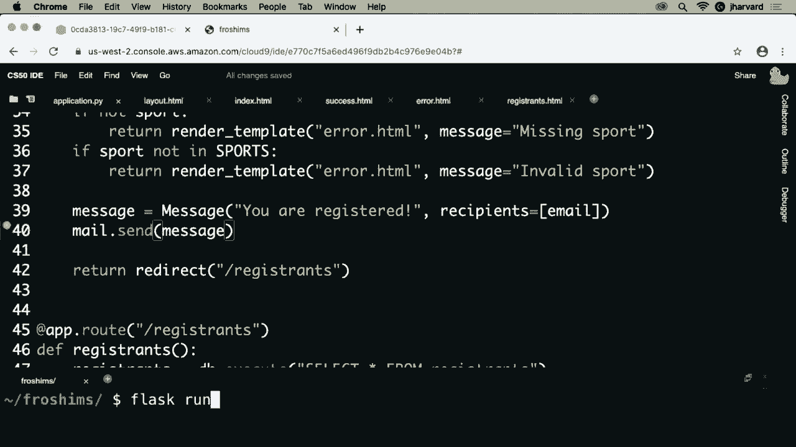

i'm going to go ah**d now and run this，program i'm going to restart，me for email。let me go ah**d and type in uh let's say，john harvard's address。here john harvard like me will register，for dodgeball，and let me go and click register now the。website is about to say。

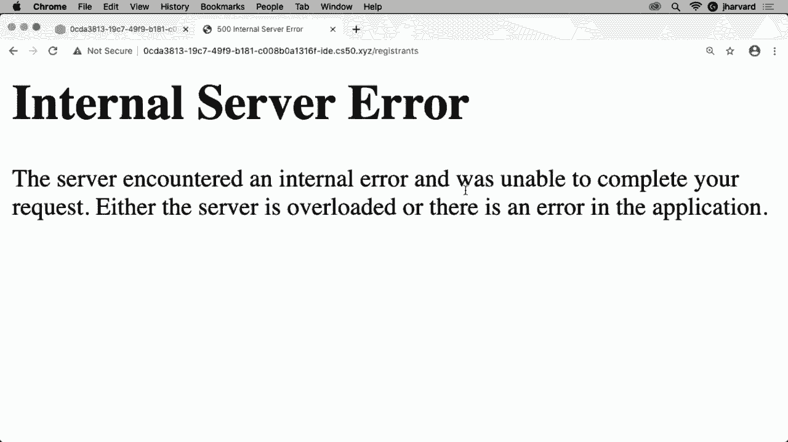

surprise to me，but let me see why oh i accidentally am，still using the database，so let me fix this。let me go ah**d and since we're not，using the database anymore，let me go ah**d and revert to our。simpler return render template。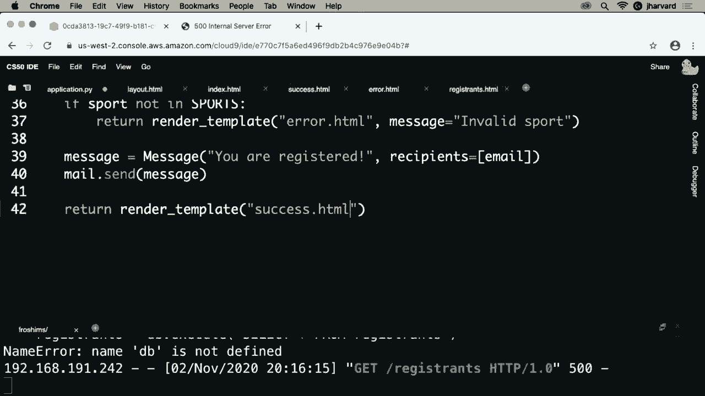

success。html all right user error，let me go ah**d and restart the server。okay bad gateway whole other problem，here we go j harvard at cs50。let me go ah**d now and register for，dodgeball register，indeed。let's go over to my other browser here，where i have gmail，open i am currently masquerading as john。

harvard in gmail here，let me go ah**d and refresh my inbox and。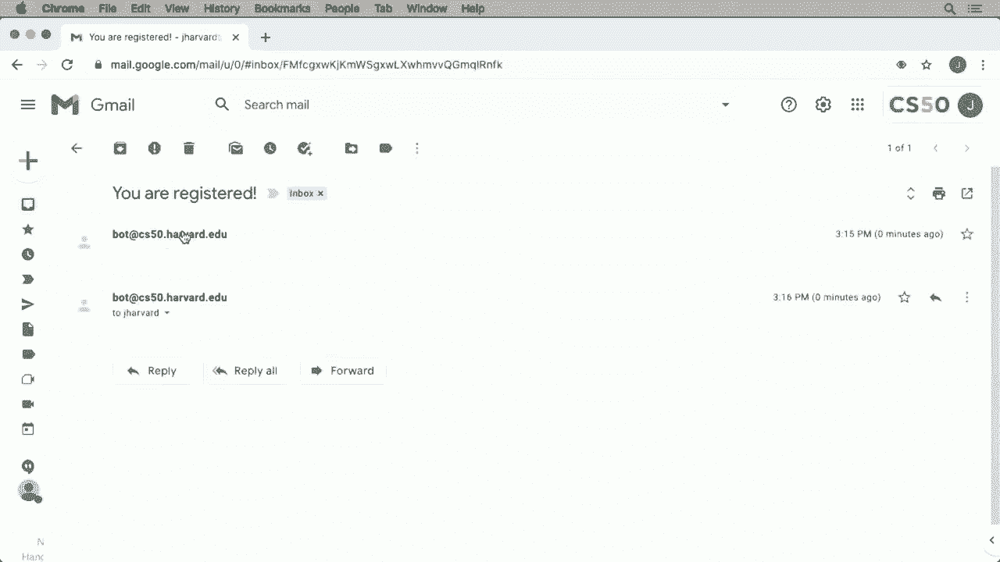

oh my god a message from the cs50 bot，that i am indeed registered so now we，have a programmatic way。of sending emails i hit it twice so i，got two emails this time，but indeed i've now dynamically。generated emails，as well a lot，but the ideas really are just based on。templates and the idea of sort of，putting our controller logic and，aesthetics。

and our so-called views and now that，email，back end now we also have the notion of，stored。or in this case sent any questions。

or confusion or clarifications here，on the use of sql lights or email。seeing anything on your end brian，nothing here，all right so why is there a shopping。cart with cookies on the stage well for，break we'll come back talk about。something called sessions and build，all right we're back and there's one。

feature that we haven't really，fundamentally touched on，at all when it comes to web programming。and it's one that you and i take for，into，some website buy something online or。

generally interact with dynamic websites，and that's a feature that's generally，known as sessions。there is a mechanism built into web，applications whether they're implemented，in flask or。in other frameworks or languages that，allow the web servers to remember a。little something about you and this is，works，because without it you wouldn't be able。

to log into gmail or to any other site，and have the website remember that you。are logged in consider after all when，you log into gmail，you type your username your password，code。and then you see your inbox and from，again，the next time you open an email and then。the next time you open an email，you stay logged in for some number of。

minutes or hours or even days on your，tab，even if you shut down your computer when。you come back to gmail quite often，you're still logged in and it remembers。in some sense that you have been logged，in well how does this actually work。well underneath the hood anytime you，visit gmail。com your browser。

is sending a request like this for slash，the default route of gmail。com。and hopefully you're going to either see，your inbox or if you're not yet logged。in you're going to see that login screen，indeed the response is probably going to。come back along the lines of 200 okay，content type of text html and that's。

when you see the login form，or your inbox but recall from last week，tucked inside。of that virtual envelope that provide，how they should，interoperate that's indeed what http is。conventions，that govern how browsers and servers，that sometimes，cookies。and odds are you've heard of cookies，cookies are，bad or dangerous but also necessary and。

indeed all of that，of data，or even files that are planted on your，computer or your phone。by a server that help them remember that，you've been there before。in some sense they help remember who you，are but even websites that you're not。logging into very often put，cookies onto your phone your laptop or。

desktop which essentially might be a big，random number that only you are given。so that even if they don't know that，it's maggie who's visited the site or。ryan or nicole or someone else，has been seen，before and they can therefore track your。

behavior so if you've heard the term，tracking cookies，that's all it is it's some piece of data。a big random number that's been，browser then，remembers and the mechanism is as simple。as this one of the http headers that，comes from server to browser。literally is set dash cookie colon then，the name of a cookie，for instance session and then value and。

number，and because of http again it's a，together，cookie back，to every subsequent page you visit on。gmail。com or whatever server you're on，in other words when you visit gmail。com。then an hour from now even after closing，to sleep，your browser is not only sending these。headers if you have been given a cookie，from gmail。com before。

your browser sends a similar header but，without the word set，value。so unbeknownst to you your browser is，constantly reminding the server。that you've been there before and this，is similar to the real world when you're。perhaps in um when you go into a club or，through the gates，you typically are allowed back in by。

having your hand st*mped and this way，they don't have to check your tickets。again or your id or the like they just，st*mp your hand which is a little。reminder that you have been there before，and so in fact here i've got a little，st*mp here。if i visit a website it's like my hand，is being st*mped here，and my browser by design of http。

is supposed to every time i visit，another page click another link。represent my hand just like you're going，back into the bar or the club or the，amusement park。to remind the person at the door the，bouncer that you've been there before，and to let you through。rather than prompting you to log in，again so that's what a cookie is it is。

like this virtual hand st*mp，that's put on your computer but your，computer is designed to present it。again and again so if you've ever，wondered how sometimes you go shopping。on one website and then all of a sudden，creepily you're on facebook or something。else and you're seeing ads for the very，website，that all derives from cookies long story。

short there's advertising companies，that facebook and google and others，partner with that put little。images on the website or javascript，files or other such files，and because those ads are on different。websites the cookies are shared across，multiple websites in some sense。so it's like you are constantly，presenting your handstand to all these。

different third-party companies，and this is how they're advertising uh，to you or even。tracking you at worst as an aside when，you use incognito mode，or private mode on your browser all of。your cookies are temporarily thrown away，you get an empty cookie jar so to speak。so that you do appear to be logged out，and in fact even in class i've used。

incognito mode a few times because i，want to start fresh，and not have any of my prior clicks or。our prior demos messing up future demos。

but the reason i was doing that was just，all。

states so on the one hand cookies are an，incredibly important and powerful。mechanism but suffice it to say，and more on this down the road they can。be misused um certainly when it comes to，one's privacy，uh or security so with that said let's。consider，how a typical website remembers that，simple idea，and make it clear that it's all within。

your power now with code to do this，so let's start as follows i've created a，demonstrate。a program that logs people in i've got，my same layout as before and i've added。one more tag it tends to be best，practice to tell the browser，that you're using essentially unicode。this way i can have emojis and other，characters in my html so i've added this，line five。

which you'll see on bootstrap's，documentation and other sites so now i。have sort of a good starting point for，this page but there's really no content。there's just a block being defined here，as before，and indeed if i type ls you'll see an。application up hi and a templates folder，in that templates folder right now，and start。

writing a quick application whose，purpose in life is just to present the，user with a form。via which they can log in and then，remember that they are logged in，also。import the redirect function the render，template function，the request variable and now a session。variable this is something new and then，from flask，session，flask。

underscore underscore name and now i，need a few more lines of code from，documentation，app app。config。open bracket session permanent，only to，the library called flask session that。i'm using and that's library，is going to enable hand st*mps，going to configure it，session。type equals file system and file system，is just fancy speak for the hard drive，or my own ide account。

and this is an alternative to using a，database or or something else like that。and then session app so this is just，three lines，from the documentation for this library。but to use this library and this was，ago，there's another file i should uh point，out so。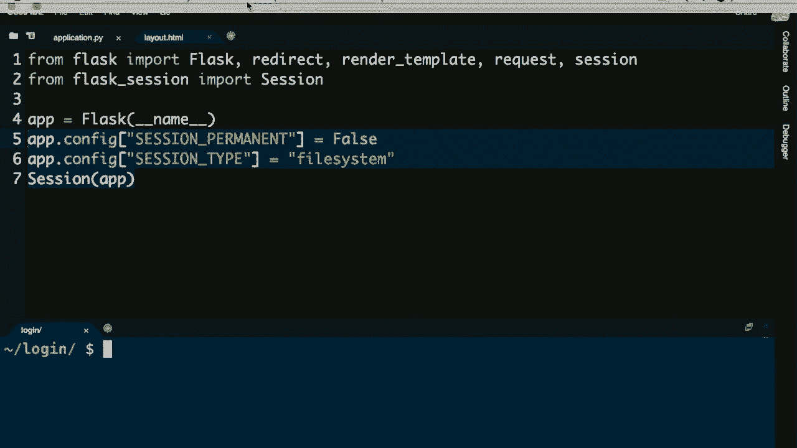

when i am here，i should create one other file that i，mentioned earlier but we haven't created。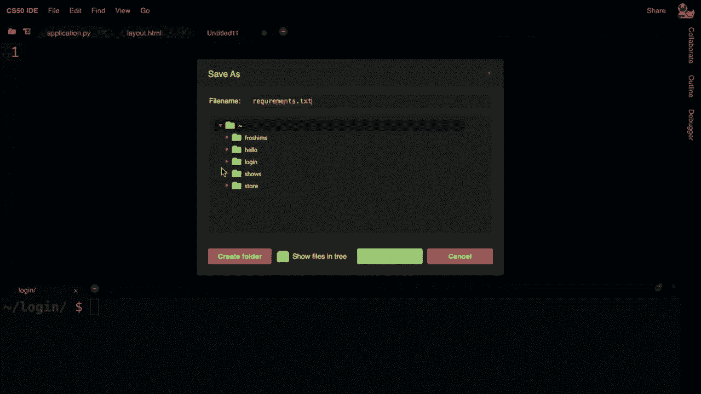

ourselves this time called，requirements。txt and i'm going to put，this into my login directory。and i'm going to require flask for this，application and i'm also going to。require a library called flask session，so again i claimed before on the slide，list。of the requirements the libraries you，want to use and there are commands you。

will use at the command line，to install those requirements you won't。typically need to do this for the，problem set but just so you've seen it。if you want to install the requirements，for a python，application you typically do a command。like this pip，install dash r requirements dot text and，in advance。

but just know that in order to install，libraries it's much easier。in python than it was for instance in c，they tend to be more easily。packageable via this technology called，pip and things like it，all right let's go ah**d and create a。couple routes app route slash，def index so just boilerplate as before，return。

render template of index。html by default，and then let's go ah**d，and create one other route app。route，login and in my login route which will，be governed by a login function。let me go ah**d and return render，template，login so let's keep it simple for the。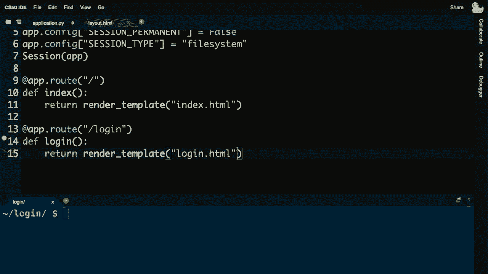

this form，so let me go ah**d and create a file。

called login。html，whose purpose in life is just going to，have my login form。and what i want in that login form is，just a space for the user's name。in the real world i would most certainly，do something like，a username and a password but we're。going to keep it simple focus only on，the essence of the idea，and do something like just the user's。

name so in login。html i'm going to，extend layout。html as before。i'm going to have my block body and i'm，going to have my end block tag。and then inside of here i'm going to，have a form the action for which will be，slash login。the method for which will be post i'll，do best practices here i don't want my，username and password。

in the real world being stored in，people's uh，auto complete histories let me do input，measure。auto focus for convenience name equals，the user's name，then type。equals text and then down here input，type equals submit so this is almost the。same to our previous forms for，registering and so forth，but now i'm going to use it for login。

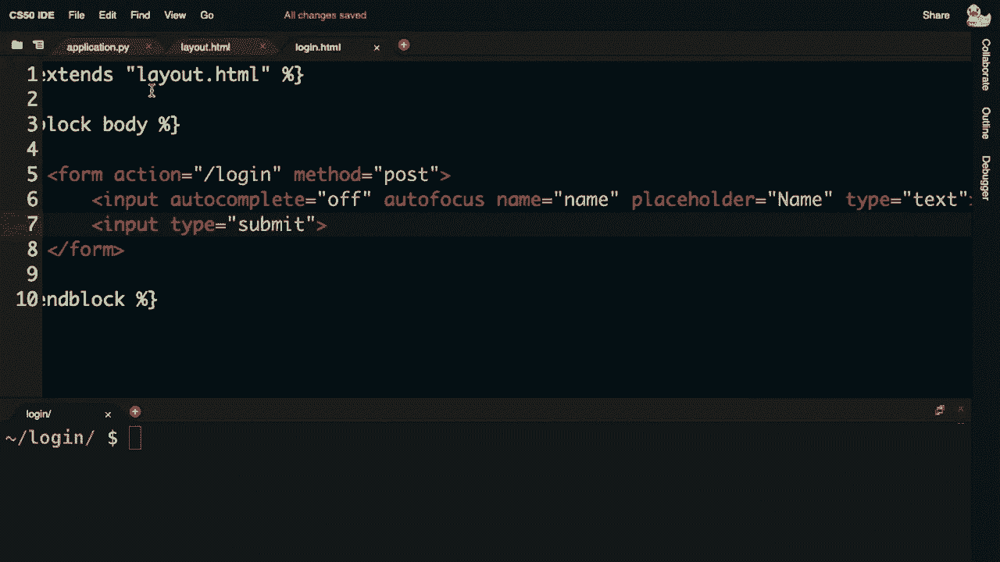

purposes so let's do a quick check，let me go back to my application do，flask run。

i'm going to go ah**d and open up my url，and first error。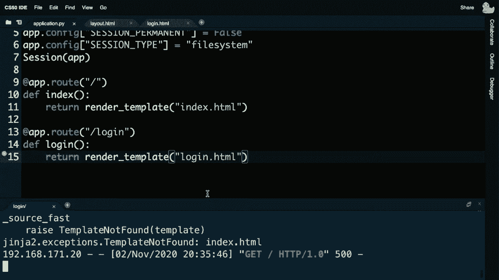

let's see template not found okay so，that's actually expected i，kind of knew i didn't create index。html，so i'm okay with that error for now，let me go ah**d and zoom out though。because i deliberately wanted to go to，my slash。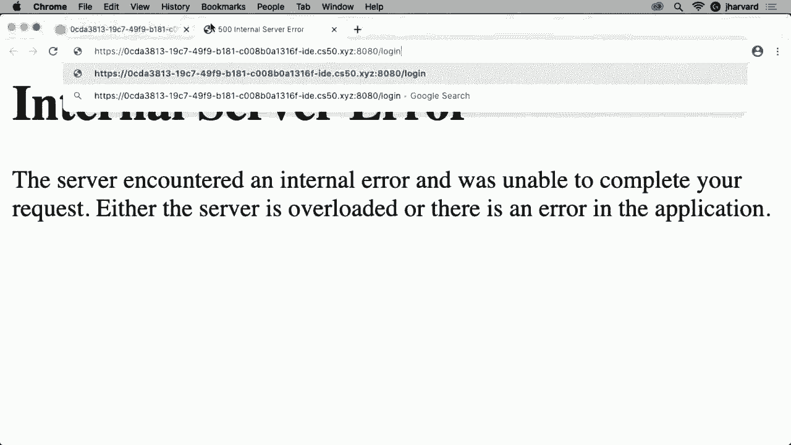

login route because i wanted to test，that first that seems to be working。now let's go ah**d and create the file。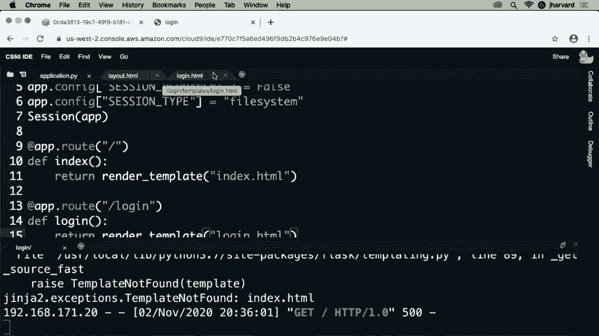

that doesn't exist，index。html so index。html put this in my。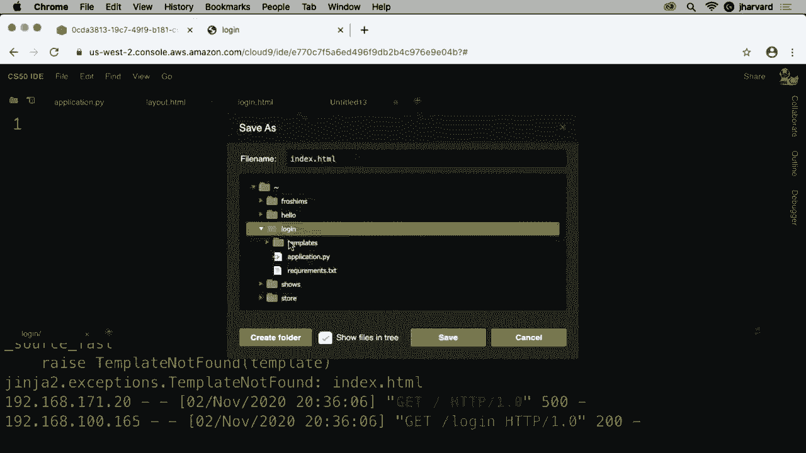

login folder in templates，and i'm going to do this one pretty。similarly i'm going to go ah**d and copy，paste just to save a bit of keystrokes，logged in。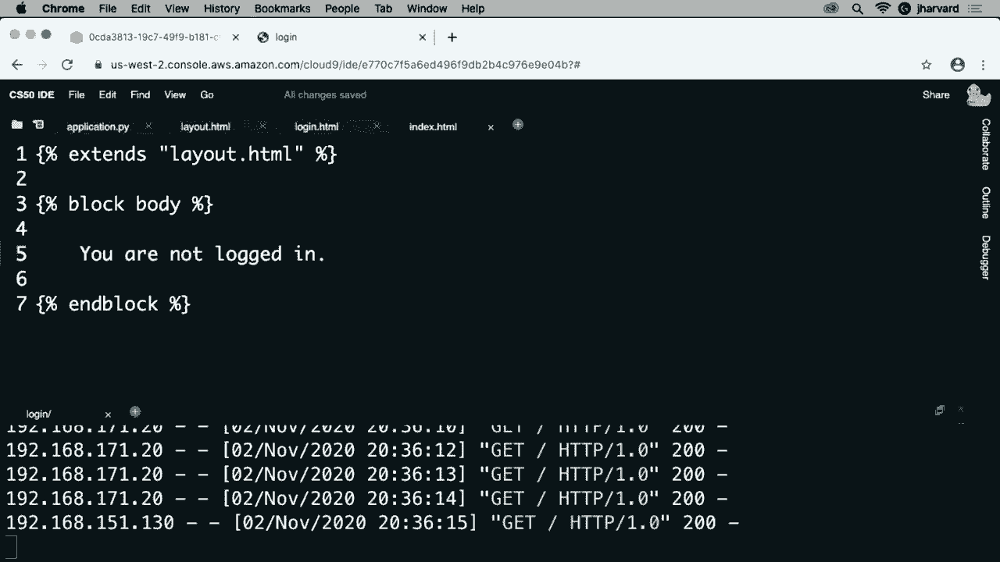

because i literally haven't implemented，reasonable，let me go ah**d and restart flask let me。go to my index and i should see，to。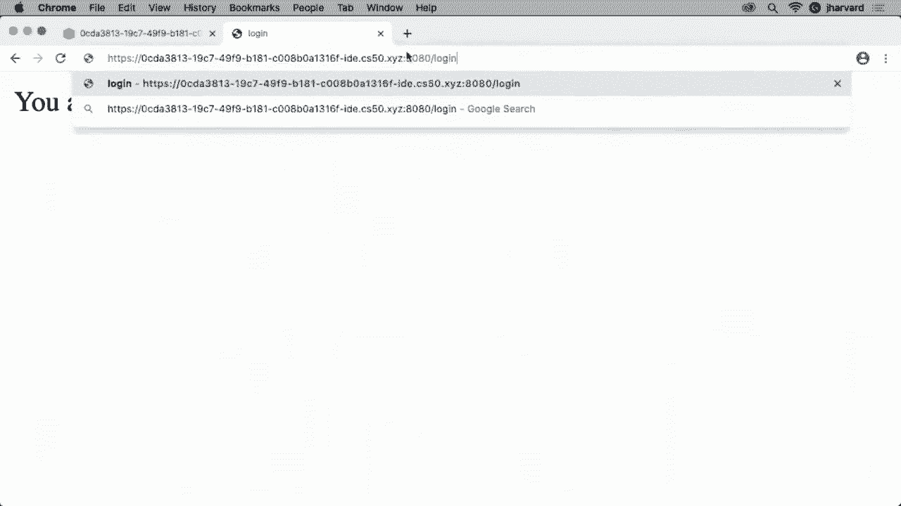

login i see my login form so let's make，this a little more interactive let me go，into index。html here，and say you are not logged in ahref，login log in period。let's create a better user interface so。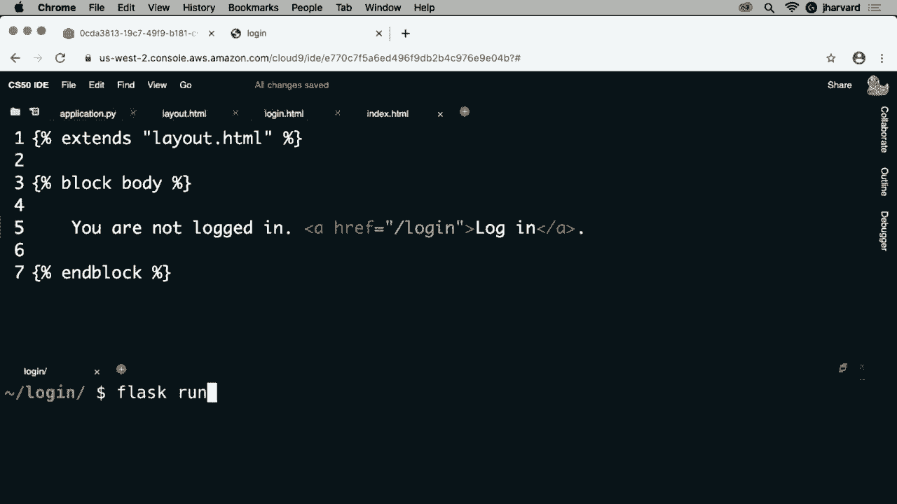

let me rerun flask，let me go back to my web page hit reload，and now i have the beginnings of a user。interface super simple but very similar，to a website where if you're presented。with the web page you're not logged in，you're given a link or a button or，something to log in。and if i click this it's just a simple，links。

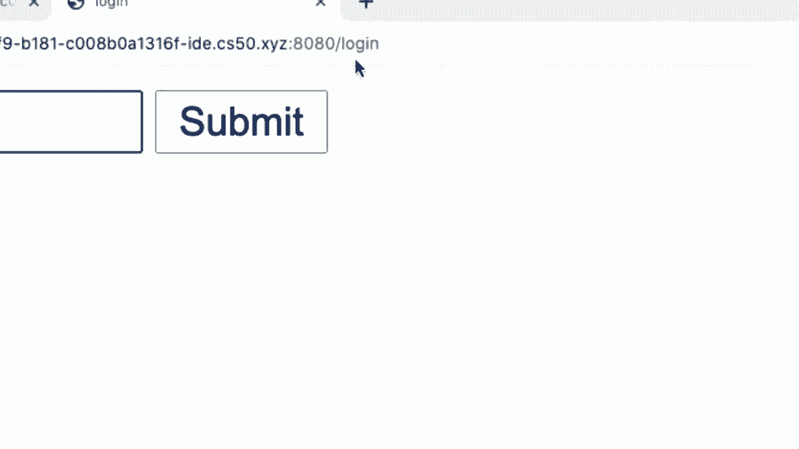

to slash login so we're almost there，we almost have the ability to log in。let's do something with the information，so let me go back to application。pi，want。to have happen exactly well if they log，multiple，i want to support post here so let me do。that for privacy's sake，and then let me go ah**d and do，this if request。method equals post。

as before let's go ah**d and，remember that user logged in，and then redirect user。to slash uh to slash，else let's go ah**d and render the login，form so i'm not done yet。but this is the key idea i need to，somehow remember that the user logged in，so how can i do this。well one i can get the user's name from，request，dot form dot get name，and i should assume that i um。

[Music]，yeah that's okay we won't validate that，the user's name，i want to store it in the session so。turns out。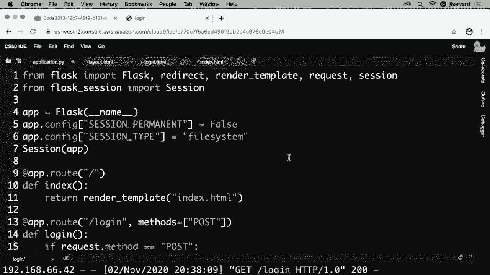

it's like，um it's kind of like a coat check too i，don't mean to add too many metaphors。here but in like a fancy restaurant if，you like hand your coat to someone。they'll often put it in the closet and，then hand you back a number which in。some sense is like a little clue like，can line you up，it probably shouldn't just be a smiley。

face because otherwise everyone would，get the same coat back but they give you。some kind of identifier，and they put your coat into some a，hanger a bucket or。some space in that closet so why is this，relevant here，well the same is kind of happening in。unique cookie，through，metaphor through before but you're given，can go。

including your cope but in this case，remember，so with that said what i have access to。thanks to flask，special。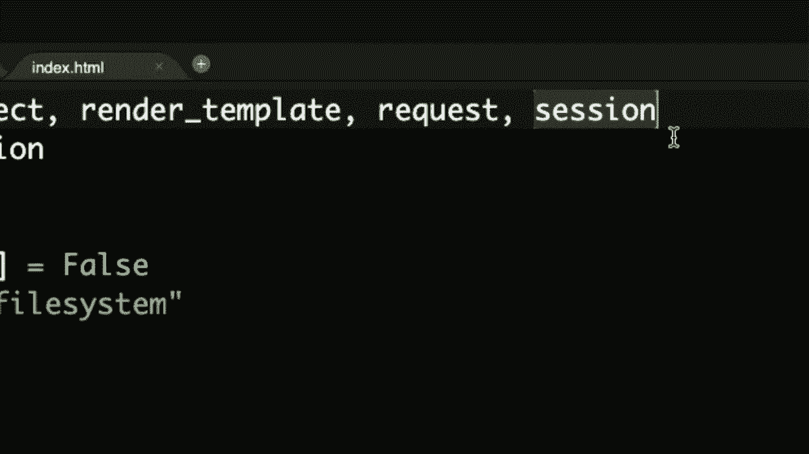

variable called session that is a，special variable，in that it's at the one hand on the one。hand global，which means i can use it everywhere but，fancy enough。it's tied to the current user so even if，all of us on zoom right now visit my url。is kind of happening anyway，variable called。

session and it's implemented underneath，the hood by way of this cookie mechanism。

each of us when you visit my application，or getting a different cookie value。that cookie value is like mapping to a，different hanger in the closet。so that my data will go on this hanger，your data will go on that hanger and so。

forth and now i'm actually kind of proud，of this metaphor that's working out okay。the hanger is going to be where all of，want to store，user's name。thereby remembering that i've logged in，or brian's logged in or sophia is logged。in or ryan's logged in or，anyone else but the session global，variable here。

that i've highlighted in this very first，line is going to be，way that，thereof。so i'm going to quite simply use this as，a dictionary in python，i'm going to go ah**d and add to the。session here，the user's name as name and i don't even，need this variable now let me tighten。this up just a little bit，let me go ah**d and just store in the，session which is like this hanger。

the key of name and the value of，whatever the user logged in as and，redirects i know how to do。redirect，slash let me get rid of my pseudo code，and i think that's it that is sufficient。excuse me to remember。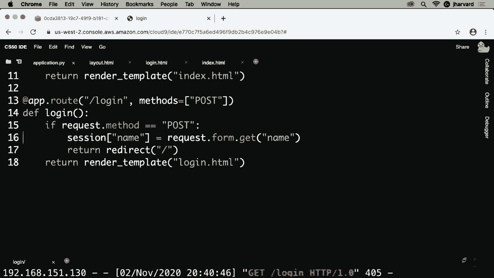

that a user has logged in you sort of，put their name in the session。but then it stands to reason that we，let's improve，index。html which at the moment just。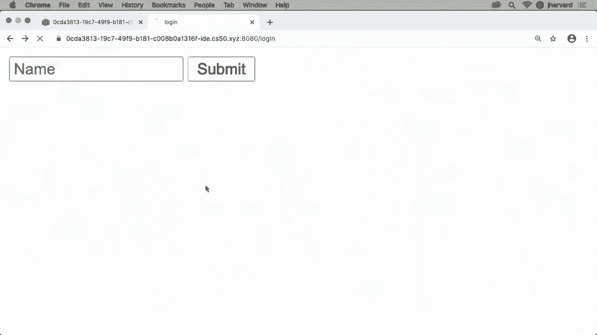

blindly says always，you are not logged in well let's，actually make that decision not just。hard code that so let's do this，if um not session。getname，this is the syntax for saying if there's。no name in the session，then go ah**d and return redirect，slash login so if there's no name in the。session that means you haven't given me，your name yet let me force you to by。

sending you to slash login，otherwise go ah**d and render the，template。all right well what more might i do now，let me go into my index file here。and instead of just naively hard coding，this watch what i can now do。i can in here say in jinja syntax，not the curly braces not the block，syntax not the for loop。

you can also use if conditions if，session。name exists，then i can say something like you are。logged in as，something like a，href equals slash logout doesn't exist。yet but we can come back to that，log out else if there is no session name。then let's assume that the user is，indeed not logged in，in，so if i did this right let me go ah**d。

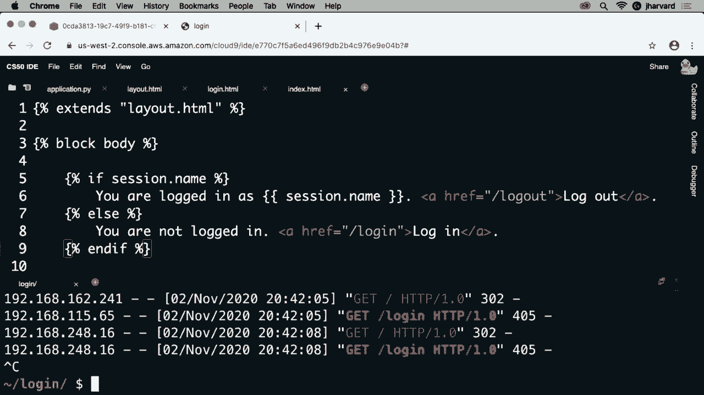

and stop the server here，let me go ah**d and rerun flask run，reload my form i still see。okay oh wrong wrong url let me go to，index。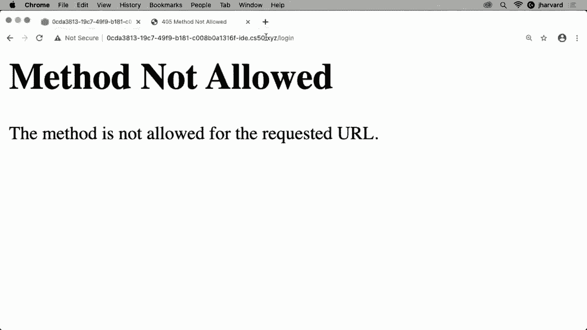

oh no i this is right i'm on slash login，method's not allowed i think。santiago already pointed out what，mistake i made earlier which i just，repeated let me go to。application。pi um，i need to support multiple methods here，i also want to support。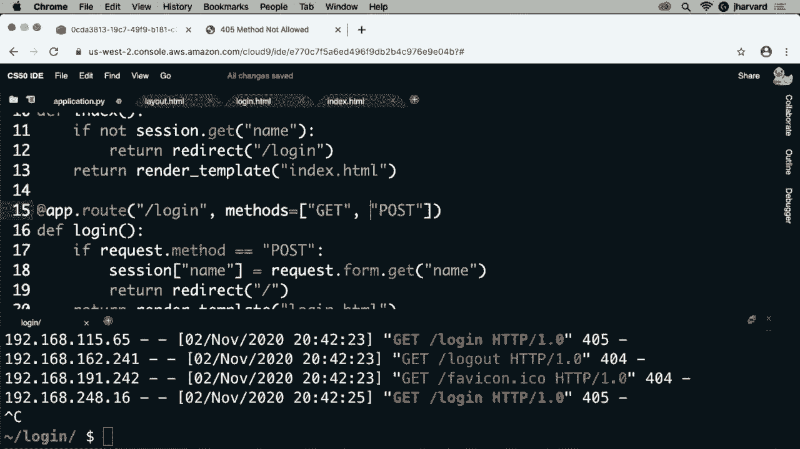

get so that i can actually render my，template as needed，so let me go ah**d and rerun this server。here we go it slash login and notice，what happens let me zoom in on this。let me get rid of the login and just go，to slash notice that i'm immediately。redirected let's do what we did last，week let's open up the inspector。

let's go to the network tab let's again，visit slash and hit，enter voila notice what happens if i。visit that request，zoom in on chrome's network tab scroll，down to response headers。notice that we get a 302 found which is，a redirect code like 301，over here。slash login so all the mechanics of http，are coming back into play。

all right let me go ah**d and log in as，david click submit。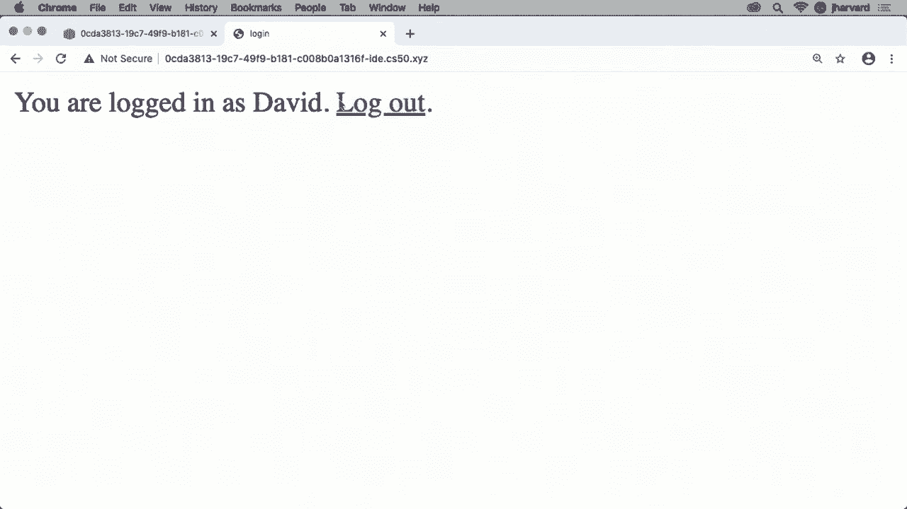

amazing you are logged in as david，notice what's going on i'm now，at the in slash route my。this is true so this does not apply so，i'm actually seeing index。html。and notice i accidentally clicked log，out let's fix that，let's give us our logout route so here。we go app，app。route slash log out，def log out and then in here i need to。

just forget that the user has logged in，and there's a few different ways to do。this let me do it the simplest for now，session name equals none let's just。change whatever your name is or my name，is to none，then let's return redirect back to slash，let me。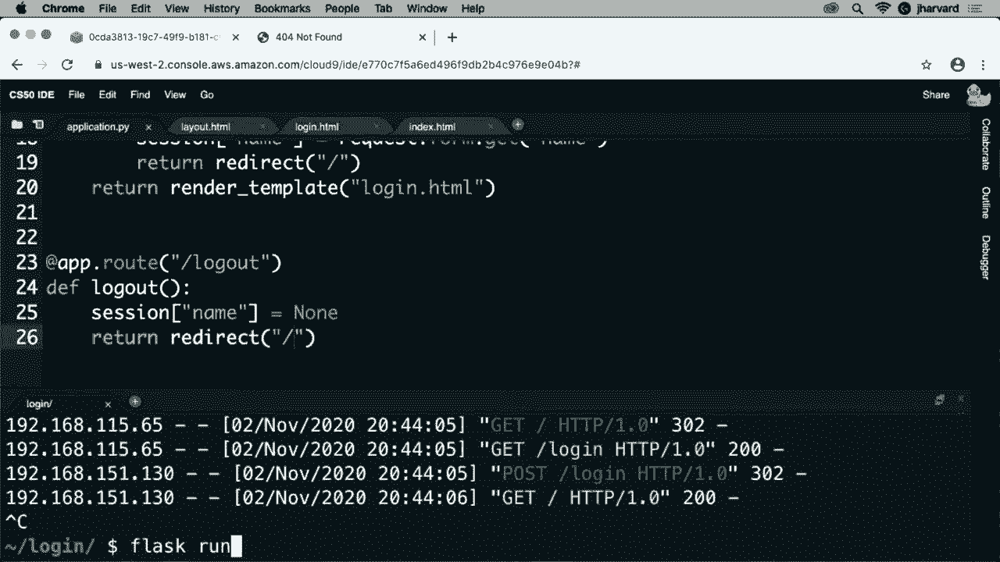

restart the server let me go back to my，index page，because i'm still logged in here i'm。going to go ah**d and log out，okay let me go ah**d and log in as brian。for instance submit you are logged in as，brian and notice i can reload。i can close the tab i can reopen the tab，it's all being remembered thanks to。

my browser representing the cookie and，in fact you can see that，network tab。and let me reload the same page reload，notice this response here in 200。notice that if i scroll down here to the，request headers，notice that my browser is requesting。whoops sorry，notice that my browser is requesting，slash but notice if i scroll down down。

down nope uh，there we go down down down notice，unbeknownst to me and unbeknownst to you。perhaps all this time my browser is also，presenting the hand st*mp and saying my。cookie value is session equals three。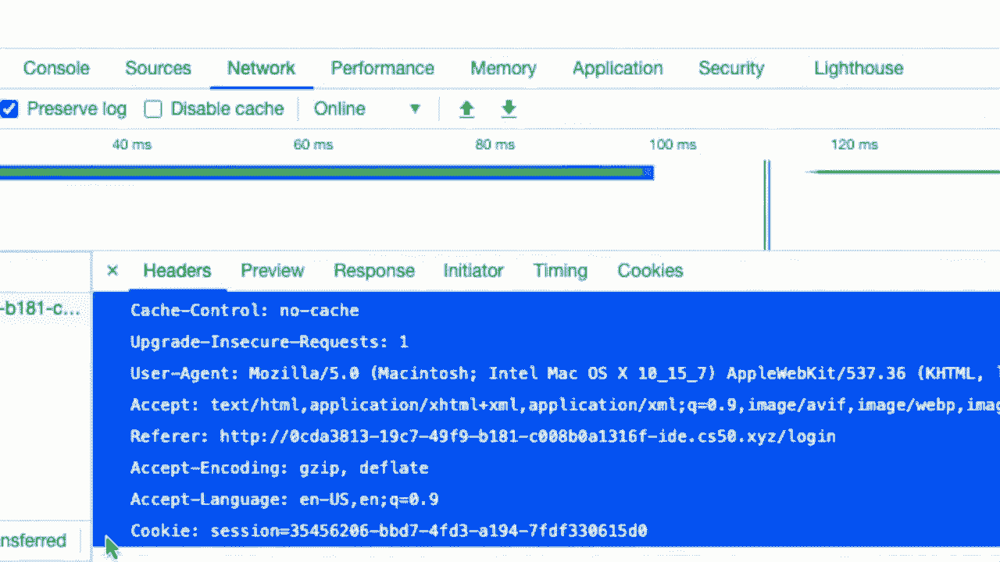

five four five six dot dot dot，um generally speaking it's bad to tell。other people your sessions because now，you could all hijack my session by，pretending to be me。but of course this application doesn't，accounts，that you care about no one should be。seeing your cookie values，so we actually see the cookie there and，it came from the server。

the very first time i visited，all right any questions，on that there does the cookie just exist。disappears，good question does the cookie live，forever or is there a time limit。it depends on how you configure it so，this cookie will have a default time。limit of some number of minutes or，hours or days after which it will expire。

unless the server refreshes it for me。

you can though set cookies that do last，forever which you probably don't want to。do for the notion of logging in because，odds are all of us have accidentally。walked away from like a lab computer or，a friend's computer forgotten to log out。it's at least nice to know that，eventually i'll be logged out，automatically from the site。

and that's what's called a session，cookie one that eventually expires。but it's also useful when you visit，websites you notice that some websites。have those buttons that say remember me。

or something like that well you can，actually set permanent cookies that。don't just store some random value，on your computer they actually store，some piece of information。that gets pre-filled into form，subsequently and this is useful to，website。if you've customized something if you're，like that，it can remember those kinds of settings。

and even cs50s website，remembers uh what your selection was。

when you log into some of cs50s websites，you'll sometimes see，a login prompt for harvard or yale and。

if you've never noticed，uh i regret this because we put a lot of。effort into this it remembers if you。

time，so you don't have to constantly interact，with the drop down it just remembers。

your implied preference，we do that using cookies and so as an，at-home exercise of of interest。truly do start opening the browser's，network tab，start looking at those headers and you。websites work，and in fact it's becoming increasingly a，challenge to implement things with。cookies because long story short，a lot of the browser manufacturers are。

finally starting to disable what are，called third-party cookies。those sort of advertising style cookies，that come from other servers not，servers。that are all too often used to track，people but if recently especially in the。eu and now more recently in the us if，you've ever had to click boxes saying i。

accept cookies i accept necessary，cookies and so forth，honestly this is sort of a nice idea but。it's also a little，silly and that now the world is just，conditioning you and i you and。me to just constantly click these boxes，without really thinking of it。but what you're really doing is granting。

permission when you click those boxes to，allow your hand to be st*mped。all right any questions then on cookies，or on how we've gone about implementing。anything at all seeing anything on your，end brian，nothing else here all right well let me。go ah**d and do this，let me go ah**d and get ready an example，that we made in advance。

that will allow us to explore a，some sort，and we'll call this literally store and。this time rather than write things from，scratch let me go ah**d and，open things in my browser from a。directory called store，so this is available as always on the。courses website and let me go ah**d here，and into store，let me go ah**d and open up，application。pie。

requirements。txt and my templates，including layout，exercise in，honestly reading a someone else's。sizeable amount of code it's a few files，how do you even begin when you've。downloaded a program like this when，you've downloaded distribution code for。cs50 or any other course how do you，begin to wrap your mind around it。

well again if you understand what the，roles are played by these different，files application。pi is your controller，anything ending in dot html and，templates is a view you can begin to。figure out，what does what in these files so let's，start with application。pi。notice i'm importing cs50s library a，session support，below that i'm initializing the。

application as i've done before，and below that i'm connecting to a。database which contains a whole bunch of，products in a store books in this case i。then configure sessions and we just did，that so that code is the same as before。and i think we can begin to infer what，this website's going to do，function。

and it looks like there's a table in，that database called books so i'm，the books。and then it looks like i'm rendering a，template called books。html and i'm，passing in those books。so let's let's follow the breadcrumbs，here and go into books。html，it looks like books。html extends。layout。html，all right let's look at layout。html，nothing really interesting going on。

there just the boilerplate placeholder，code that we've seen before so i'm going。to close that and assume that ah，it's not interesting been there done，that but books。html if we continue，further is a little juicy，we've got my block body between lines 3，saying。books at the top of the page and then，i've got a for loop，in my template again using jinja syntax。

that has below that in h2 with，apparently the title of a book。and then below that a form and i haven't，seen all of these features before like。i'm not sure yet what hidden means，but notice that i do recognize a submit。button that has a value of add to cart，so it sounds like we're implementing a。

shopping catalog for like an amazon。com，or some kind of bookstore。online all right so now let's go back to，application。pi，and let's look in cart it looks like。cart supports both get，and post all right so maybe i'm using，the same route to handle two different。things and we've seen that before，the function's called cart which makes。

sense this thing let's come back to this，just to initialize our session we'll。come back to that and it looks like，there's not much more to this program。if get is the verb let's focus on the，condition，what am i doing selecting star from，books where。the id of the book is in this，list of books well where is this list of，books coming from。

session quote unquote cart so in the，last example i use the session。to store your name and my name and，everyone's name on a per user basis。now i'm using it to store what we'll，call a shopping cart and indeed this is。the reason why there's a shopping cart，thanks to our friends at the theater。

on stage this is how shopping carts are，implemented on websites。via cookies underneath the hood to give，you the illusion，of user specific variables dictionaries。there，so it looks like my session cart，key is going to have a value equal to。like the ids of a whole bunch of books i，don't know how they're there yet but，interpreting。

and then down here i'm just rendering a，template called cart。html。passing in the books from the database，so how do they get into the session well。if the user submits the form to the cart，i think this code is now relevant if the，user posts to。slash cart it looks like i'm going to，get the id，that they've typed in maybe maybe and if。

there is in fact an id and it's not，none it's not the default value of none。i'm going to go ah**d and append to the，cart，the id of that book and then i'm going。to redirect the user to cart，so i think that's enough complexity that。i think it's time to look at what's，do，exactly that let me scroll up and run，flask run。

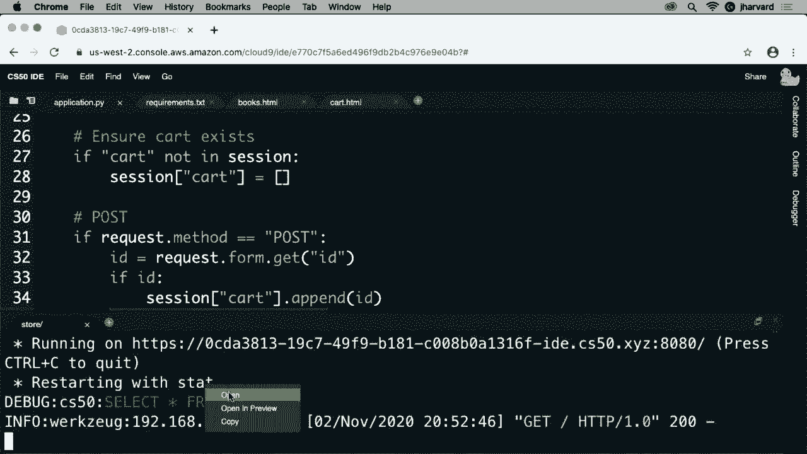

let me go ah**d and open my url okay，it's not the prettiest of website but it。looks like my database has like all，seven harry potter books in it。and notice that each of them has a，button adds a cart add a car adds a cart。let's look at the html source to see，what mybooks。html template generated。

kind of interesting so there's that h1，books at the top，here's the first of my h2s with the。title of the book，notice that there is this funky symbol，here because it's like a curly quote so。this is one of those html entities that，lets you output symbols that you。couldn't type easily on your keyboard，here's my first form that i dynamically。

outputted and i claimed earlier that i，what it says，it allows you to submit a piece of data。in a form that is visually hidden from，the user it's not a text box that they。can type into but it is there，and what's cool about this is that，notice i gave it a value of one。but in this form i gave that hidden，field a value of two。

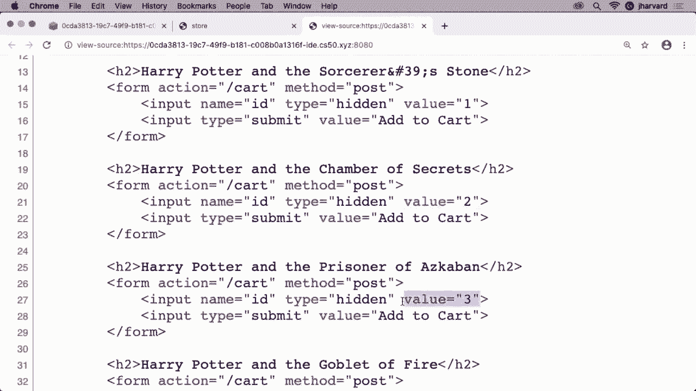

down here a value of three well why is，moment。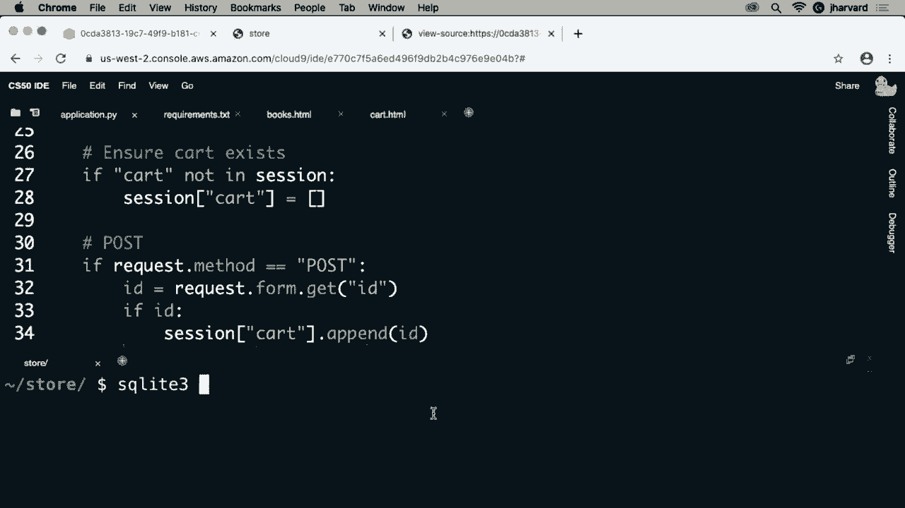

let me run sqlite on my store。db，inside of this，has an id，a title and that's it let me do select。star from books，using sql lite3 and voila you see not，unique id。numbered aptly according to the order in，which they came out，as a coincidence but intentional and so。now down here。

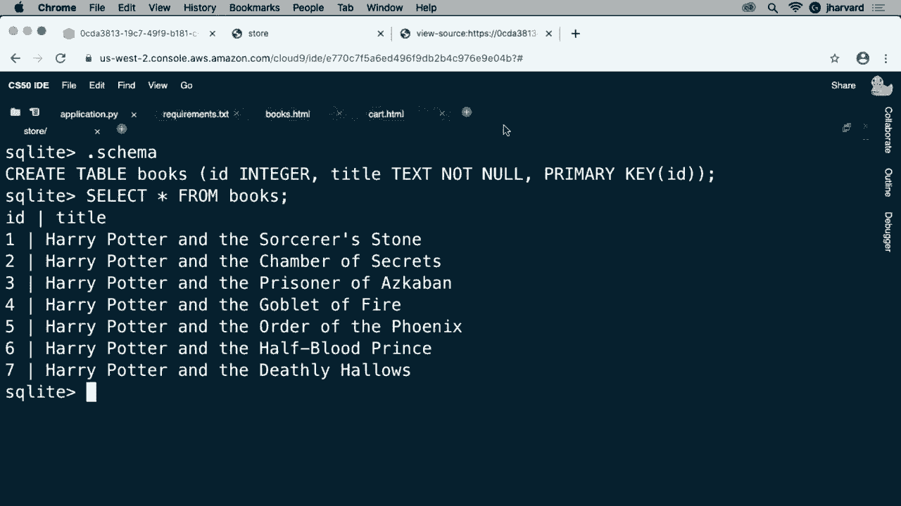

let me go ah**d and move my terminal，down a little bit here。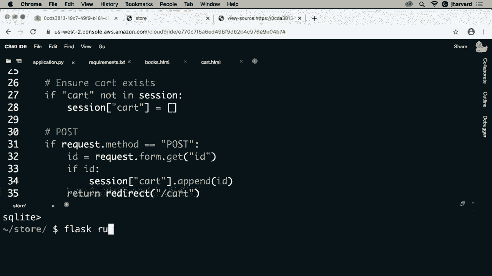

let me go ah**d and rerun flask run，and if i now submit one of these forms。let's see what happens add to cart the，first book，interesting i've been redirected to。slash cart and notice i have an，ordered list in ol tag it would seem。with that first book let me go back to，the catalog uh prisoner of azkaban was。

pretty good let's add that to cart，now i see this here and notice this if i。i don't know why i'm holding up my hand，because i'm clearly using my other hand。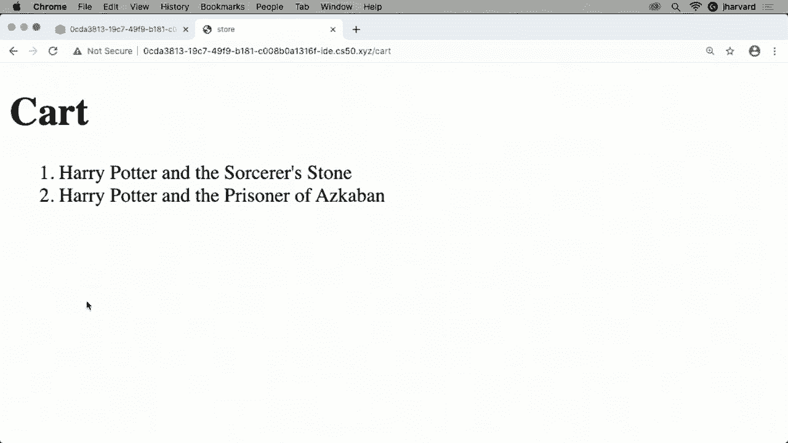

but i'm reloading the page again and，again and it's showing me exactly。what is in my cart so where is this，code，this logic here under the post condition。is adding the id book number one book，number three，to my sessions cart key。now where did that card key come from，we come back to，i just need some way at the top of my。

story short，there's not gonna be a key called cart，in the session unless you put it there。like flask doesn't come with name or，cart you have to put it there。so notice if cart quote unquote is not，yet in my session，i'm just initializing it to an empty。python list，and i could use a set i could use a，dictionary i could use anything i want i。

chose to keep it simple with a list，but that's how i'm remembering what's in。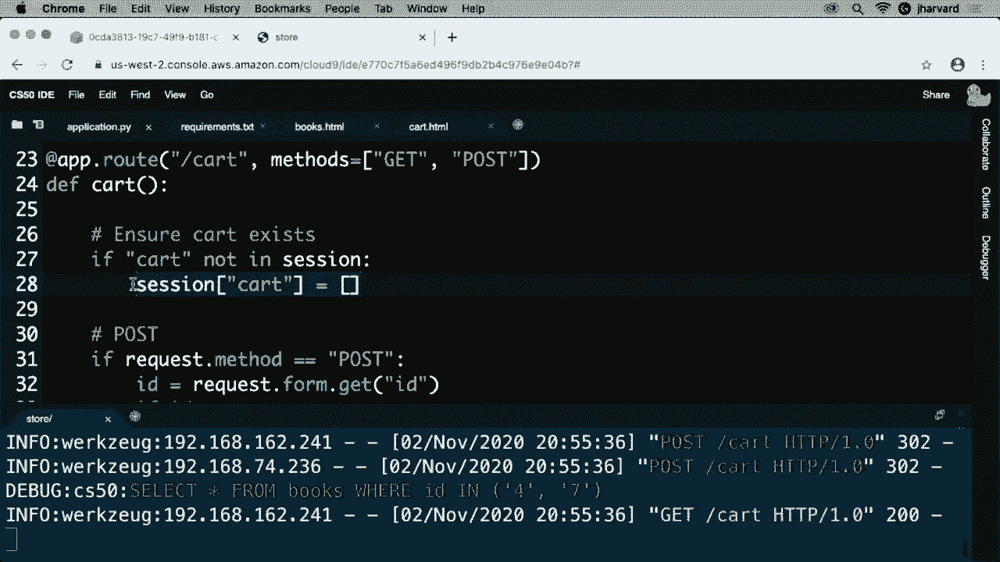

my cart and unlike all of our previous，are now，trying to add things to your own cart。each of us is seeing different shopping，carts we all have different things in。our shopping cart if i keep reloading，doesn't matter how many of you are。trying to add books to your cart，you're only adding them literally to。

your cart and not mine because we all，have different，uh st*mps on our hand。questions about how now cookies，implement this more general purpose。anything on your end brian nothing here，all right so here too i would encourage。you when you next time you go on amazon，and like add something to your cart。

like literally that is all that's，happening underneath the hood and amazon。surely has other features you can change，quantities which is kind of nice you can。add things to wishlists which is nice，but all of that if you start looking at。the html and you look at the network，requests going back and forth。

all of those features that we just take，for granted these days are just built on。very simple h well relatively simple，html forms and these inputs and these，buttons and on the server。these sessions and amazon might be using，a different language a different。framework but all of these ideas are the，same and so indeed this week is not。

about teaching you flask which，in a few years time will probably be。irrelevant it's about teaching these，ideas and principles，of these http requests and responses。these cookies these sessions，and the features that we can therefore，build on top of them。all right i think we have time for one，final example，that will now bring back our old friend。

javascript from last week，on the server，to generate dynamically html and even。though my designs today have been，hideous you could certainly imagine，bootstrap。just to pretty things up like the forms，especially but that's not。uh anything new versus last week but，last week we did have，javascript as a programming language but。

it was a client-side programming，language at least in our usage thereof。it was a way of getting the users，browsers to run code conditions and。functions and loops and so forth，on the browser not on the server today。we've introduced python again so we have，server，and where the web gets really。

interesting these days is when we marry，the so-called front end that the user，sees and the back end。which is the server the front end is the，user interface you and i interact with。the back end is the python code the sql，code that the humans never see but you，the programmer。c so what can we do to sort of combine，these two，back end，bring back。

our old database of shows and let me go，ahead and show you quickly what's in。this folder here in shows we have，uh sqlite3shows。db a smaller version of。what we played with a few weeks back，i've whittled this down just for sizes。sake to have only the names uh，only the ids of tv shows and the titles。

of tv shows and that's it i threw away，the ratings and the writers and the，directors and all of that。just to keep the focus only on the，titles because now we're going to start。sending a lot of data back and forth，over the internet，using python and javascript well let me。go ah**d now and open up this example。

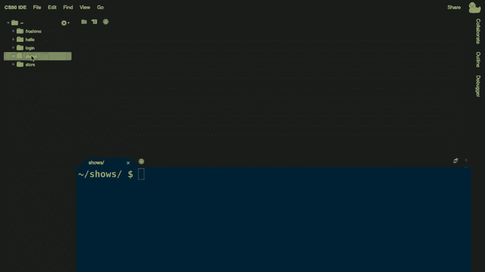

as made in advance and this is in shows，and we'll see a few files here，application。pi requirements。txt，and my templates which are index and，layout and search。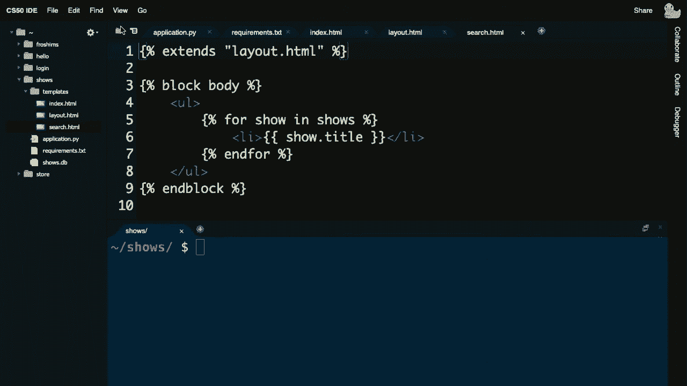

all right so a bunch but not more than，we've really seen before。and let's go ah**d and i kind of cheated，earlier i didn't look at requirements，for good measure。here's just an example of what else，might be in requirements。txt cs50。library and flask and again those are，pre-installed in the ide，but we do this so that if you get。

adventurous and try running these things，on your own mac or pc。you have all the configuration that you，need well let's start as before，and do this first。let me run this thing first so we can，actually see the app。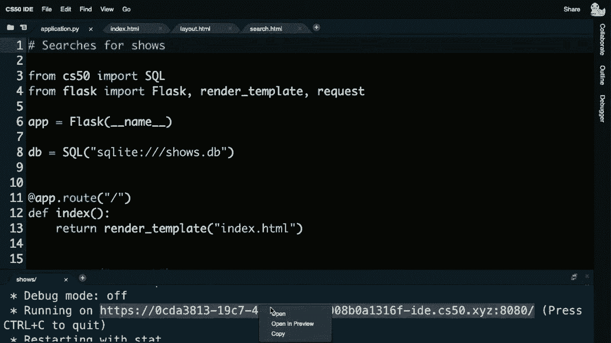

works，so if i visit this let me go ah**d and，type in office，all right nothing happens yet let me。click search okay i then see a big，bulleted list of all，shows that mention office so not the。office per se but，an office and let me go ah**d and zoom，back here。let me point out that we're at the slash，route again the slash is there it's just，days。

and when i search for something like，office and hit enter，mark，q equals office so i borrowed some。inspiration from google，right i kind of cheated last week where。i really only implemented the front end，to google the html form。and then i let google find me some cats，and some dogs and so forth。

but now as uh with python you now have，the ability to implement。both sides of that application so if i，look at the source code here。notice that i seem to be returning a，really big unordered list of list items。that represent again all the titles of，office related shows，all right this is fine and good but this。

is sort of like old school，web programming where you fill out a，form you hit enter and boom。but these days recall most anytime you，visit a website lots is happening at。once you've got some auto complete going，on here you've got chat messages。popping up here you've got a map over，here that's automatically moving and the，little car for uber。

is moving around at the same time like，the web of today web 2。0 if you will。which is not a technical term as much as，it is a buzzword，refers to just increasingly dynamic web。interactions between users and computers，and with javascript and with your own。backend be it python or something else，you can now begin to build these more。

dynamic interfaces as well，wouldn't it be cool if when i start，typing o f。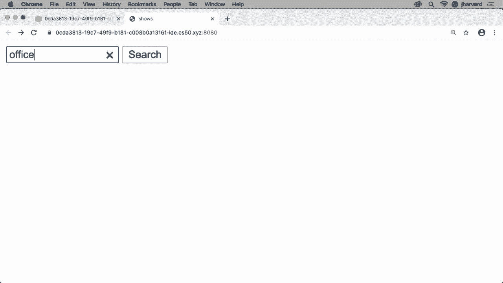

f i c e we actually immediately saw the，results and we've seen this。already last week remember that i，start with a，and i used our really large dictionary，from pset five。words，this database of titles is several，megabytes large，and i don't necessarily want to send the。entire database of movies to the browser，one because of performance and size and。

maybe two intellectual property i don't，database，you can imagine wanting to keep a little。more control over the data，you're providing requiring users to log。in or pay for your service or the like，so there's reasons where you might want。the browser to talk to the server and，for，not the whole thing so let's do that，such a way。

that it actually does things more，dynamically but let's first understand，how it works。so i have a couple of libraries here，cs50 is in flask，i'm configuring flask here i'm then。configuring my database here，down here i just have a very simple，route that renders，index。html which apparently let's take a，look has，that form very simple very similar to。

last week very similar to today all of，the forms we've done thus far。here's that name equals q and everything，else is pretty boilerplate so let's get。rid of that file now，the layout also pretty boilerplate it，looks like things in the past so let's。index，to be the search，route and this was the piece we were，missing last week when we used google。

dogs，here i have a route called search a，function called search that will be，called for that route。and here is kind of a nice amalgam of，sql and python，i'm going to give myself a variable。called shows which is going to be the，result of all of the rows that come back，when i execute this。select star from shows where title，is like this placeholder question mark。

now what am i going to plug in，notice it's a little cryptic at first。glance but i seem to be taking the，user's input，q from request。args。get so that's using。get apparently because of the word args，it's not form now it's request。args so。i'm getting the user's q，value which was office in my case and，just as a quick check。

what's with the percent signs on the，left and the right，because we've seen a lot of percent。signs today but these are different，perhaps in the chat what do these。brian you want to echo the consensus，yeah people are saying they're sequel，placeholders。yeah so pl sql wild card placeholders，that means zero or more characters to，is why。

i was getting mass matches with office，at the beginning of the word。office at the end and office in the，middle if i really wanted to be anal i，require。only a perfect match but that's not my，goal with this particular implementation。once i get back all of whoops once i get，back all of these rows。

i have here align return render template，search。html passing in all of those。shows so the last thing to look at is，search。html，it's pretty simple and surely like an。hour ago this would have looked super，look cryptic，but once you start using the syntax。yourself you'll see that oh，this is just a template that is allowing，me to dynamically output。

an unordered list of li tags，show，that's been passed into this template。all right so now then the final flourish，let's go about enhancing this，application，the same way。but instead all of the logic actually，happens，between javascript and the back end i'm。going to go ah**d and do this first i'm，going to go back to application。pi here。

and instead of this here i'm going to go，ahead and do the following i'm going to，go ah**d and。instead of rendering a template i'm，going to use a new function called，jsonify。it's kind of a funny name and i have to，import it up here so let me import，jsonify。it turns out that jsonify or json，means javascript object notation and。

we'll see what it looks like in a moment，but the world years ago standardized on。a format for transmitting data between，lightweight，text format json or json javascript。object notation，jsonify is a flask function that takes，a python list or a python dictionary and。converts it into json format so we'll，see this in just a moment，so notice that i'm now returning the。

jsonification，of the shows variable which recall is，just the rows that came back from，db。execute。so let's see this in action i'm actually，going to go to my。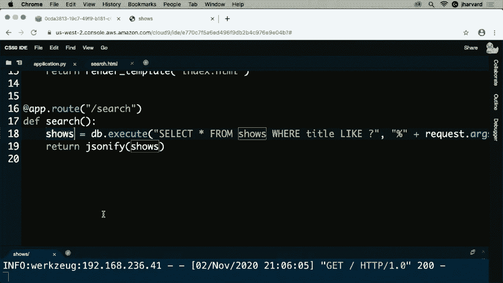

let me go ah**d and restart the server，because i've made some changes。let me go ah**d and now go to the server，slash search，question mark q equals office so i'm，enter。notice what comes back it's kind of，crazy cryptic，at first glance here but notice this is。indeed what's called，javascript object notation there's a，squ*re bracket over here at top left。

this means hey browser here comes a list，there's a curly brace which means hey。browser here comes a dictionary，otherwise known as an，object in javascript quote unquote id。is the key in this dictionary 108878，is the value of that key here comes the。second key quote unquote title，the value of which is nice day at the，office quote unquote。

then there's a closed curly brace which，is end of the dictionary。or end of the object a comma and then，there's a whole bunch of these other。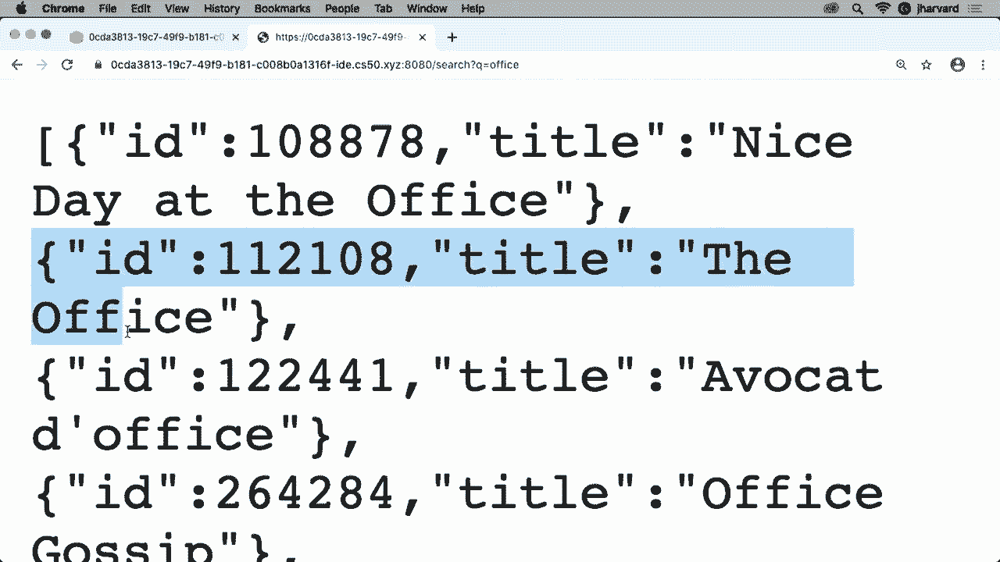

dictionaries so in short all we're，looking at here，is a very raw text-based format of a。python dictionary converted to again，something called json javascript object。notation which literally this is about，it json uses double quotes colons。curly braces and squ*re brackets and，that's about it，to represent information so this is。

great but this is a horrible horrible，this mess，but that's not the point the point now。is to have our back end return，a json array of search results and let，the browser。convert it into html recall from last，can mutate，or change your dom the document object。model the tree in memory，and what you can do in particular with，javascript is add more。

nodes to that tree you can add more，structure，so yes hello we just got hi david hi。david hi david via，thank you very much okay so let me，minimize that，and let me open up now um not。search。html which we're not going to，bother using anymore，but instead index。html and，index。html you know what i'm going to go，ahead and borrow some code here，i'm going to go ah**d and open up。

index。html and i'm going to simplify，this let me stop the server。i'm going to go ah**d and get rid of my，layout template，and i'm going to get rid of my search。anymore。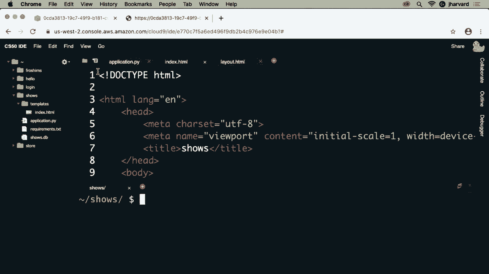

so i'm going to simplify this program，and focus entirely now。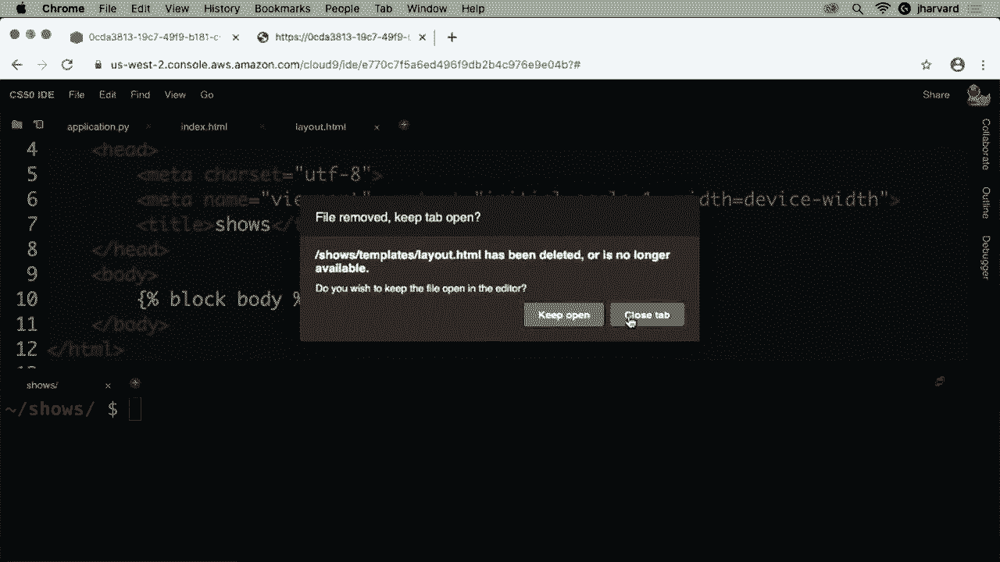

here，i need to involve some javascript now so，how am i going to go about。doing this well first i need to go ah**d。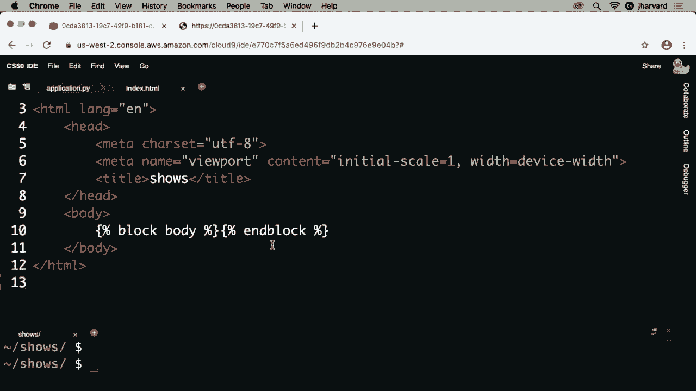

and bar use a library，uh called jquery and jquery is something，that's a little。decreasing in popularity but it's still，used by bootstrap and so we'll continue。using it because you're already，including it in fact，for some of your other examples but we。need a different version of it so i'm，going to quickly google。

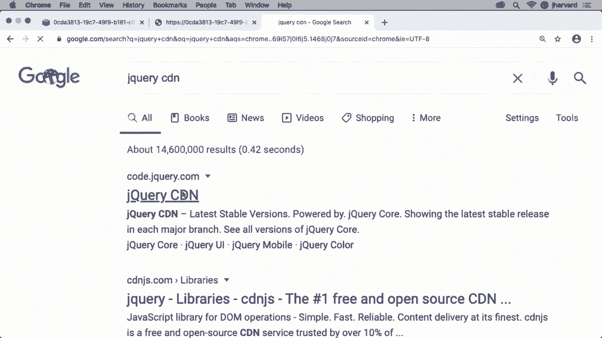

jquery cdn i'm going to go to this，website and long story short there's a，use。by just grabbing their script tag and，using it inside of your own so i'm going。to go ah**d here and let me just clean，up the tag so it's all in one long if，ugly line。but by copying and pasting that line，which we'll typically do for you in the。

problem sets and distribution code，i'm going to go ah**d and copy that，library into my file so that。it's among the libraries i can use and，last week，and i'm going to add a script tag inside。of my own page's head，and then down here let's see where do i，want to do this actually you know what。let me go ah**d and do this a little，differently just for consistency with，what you'll see online。

i'm going to go ah**d and do this all in，my body so we don't have to worry about。things being out of order we'll indeed，keep it all inside of the page's body，this。in input autocomplete equals quote，unquote off，a，placeholder of query and then a type。of text so i'm going to have a very，simple search box there and i'm going to，have an unordered list。

with nothing in it and that's deliberate，for now then i'm going to import this。the jquery library and then down here，inside of my own script tags this is，where i'm going to make。write the actual code i'm going to do，let input equals document。get。let's do query selector just like last，week and let me go ah**d and select my，input tag。

this works i don't need an id or any，class because at the moment i only have，unquote input。will give me that tag specifically let，event，event，recall from last week our discussion of。events and key up like the user touching，and letting go of the key。is one of the events you can listen for，and anytime the user does that i want to，call the following。

function and it's an anonymous function，which we saw last week too。and what i'm going to do inside of this，anonymous function is the following。i'm going to call a new function the，only new javascript function today。called dollar sign underscore gets this，is shorthand notation for。

jquery dot get but i'm sorry dollar sign，dot get is shorthand for jquery。get。and i'm going to go ah**d and get the，following i'm going to get a，by，and put。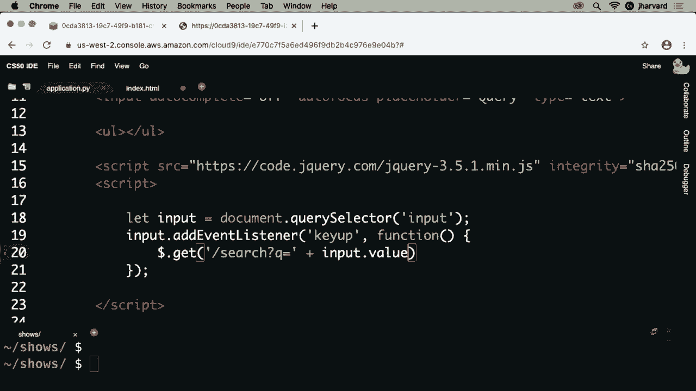

input dot value so notice with this line，of code this javascript string。i'm kind of dynamically constructing in，javascript code。

the url that i want to request，shows from search question mark q。equals whatever the value of the input，box was that the user，typed something into and the way this。dollar sign dot get function works is it，supports what's called a callback。a callback is a function that will，eventually be called，when it has an answer for you and this。

is important on the web the internet can，sometimes be slow，and you might want to write code that。contacts another server like i'm about，to do now and that server might be slow。or the internet connection might be slow，and it would be annoying if your entire，browser froze。while you waited and waited and waited，for the server's response to come back，have the data。

call me back so to speak sort of，metaphorically on the phone。call me back by calling this function so，what function do i want it to call。i wanted to call this anonymous function，that's going to take as inputs。an argument called shows but i could，call that anything i want，and i'm going to do this i'm going to。

create an html string，that's initially nothing quote unquote，javascript。letting a variable called id equal to，whatever id is in the shows that just，came back to me。and now inside of this for loop let me，go ah**d and inside of this for loop。to create a title that's equal to shows，which is again the data that came back，on the uh。

came back via that callback so to speak，shows。id，dot title and，semicolon then i'm going to do html。plus equals quote unquote，list item plus title plus，here，lastly i'm going to do，document。queryselect。selector quote-unquote ul，dot inner html gets html all right this。is definitely the craziest thing we've，done thus far today and it's tying。

together so many different ideas not to，mention new syntax so。of all the examples don't worry too much，if this is just，a lot at once the goal really now is not。to introduce you to this syntax so that，you can repeat it tomorrow but rather。the idea of what we're doing so what are，we doing we have a simple web page with，a text input。

we've got a simple web page with an，unordered list that's currently empty。below that we're including this，third-party javascript library called，jquery which bootstrap。also happens to use for some of its，graphical components，then i have my own javascript code that。first declares a variable that gives me，access to the input tag on my own web，page a few lines above。

i'm then using this fancy function，dollar sign get to do what's called an，ajax call，page。to make additional http requests，programmatically to a server it is，allowing this is how。all websites today get your chat，on some platform，it's how when you're typing in uh your。address it can auto complete your，address based on the entire globe's。

worth of addresses it's how google，search autocomplete works as well，dollarsign。get is a function built into，jquery that's using some standard，javascript functionality。that's going to allow me to visit the，url that ends with，search question mark q equals whatever。the human typed in，and when the response is ready this，called back。

and it's going to be handed an input an，argument called shows，that is going to equal this stuff this。to receive，list，or an array inside of which is a list of，dictionaries or objects。with two keys id and title this let me，stipulate happens to be the syntax in，data structure。and this happens to be the syntax in，javascript for allowing me to create。

one line after another another li，another li appending it，using concatenation to this variable。called html and this very last line of，code says to the browser。go select me that ul and plug into its，inner html the contents of it the value，of my variable。and now crossing my fingers i did not，screw up syntactically。

let me go ah**d and do flask run i still，need to run flask because i do have a。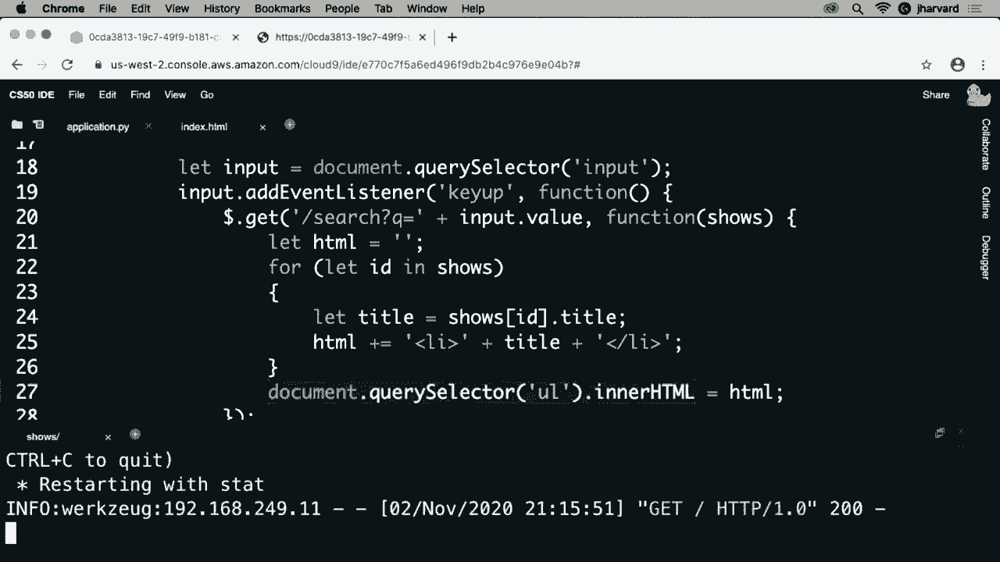

back end here，let me go back to my browser and reload，the slash route。let me go ah**d now and type in o f，browser，let me look at my console that's okay，me type in。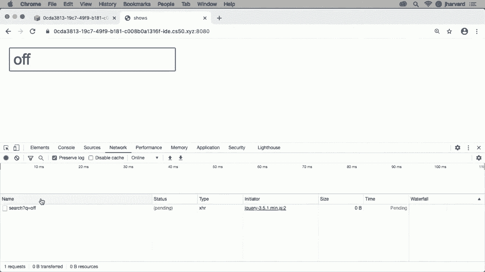

f let me look at this nothing's coming，back。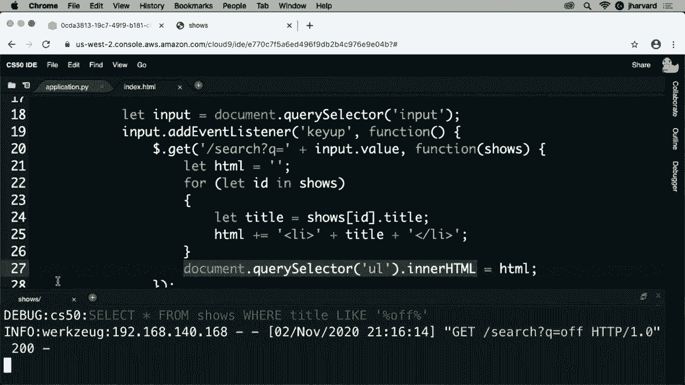

office shows why is it nothing coming，oh wait it was just slow oh all right，notice。everything i've typed thus far or，everything i'm seeing thus far matches。the word off and if i continue this off，this and let it search and let the。internet do its thing now indeed，it's been whittled down to a list of。

office matches and notice again if i go，to the inspect tab，and then lastly i go to network and let。it again，notice that that disappeared let me do，the e again here，under inspect。let me go ah**d and type in office，notice here that every keystroke i typed。triggered o-f-f-i-c-e to be executed，triggered an ajax call that is an http。

call to the server and notice that if i，click on the last one there。scroll down i will see not only my，on the response，i'll indeed see this big json array of。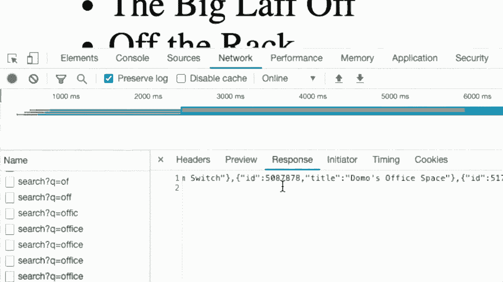

all of the data and it's actually rather，fortuitous that it was slow because we。were going to end with one demo，for instance if i wanted was curious to。know being indoors all day what the，weather is like i might maybe。call brian up on this here telephone，hello hi brian uh do you know what the。

uh the weather is like outside today，uh i haven't been outside in a little，back。okay and notice it would be annoying if，i had to wait on the phone for him to go。outside so i'm gonna hang up，and i'm just gonna wait for him to call。me back and that's exactly what's，happening in my code when i pass this，anonymous function。

to this get function and the get here。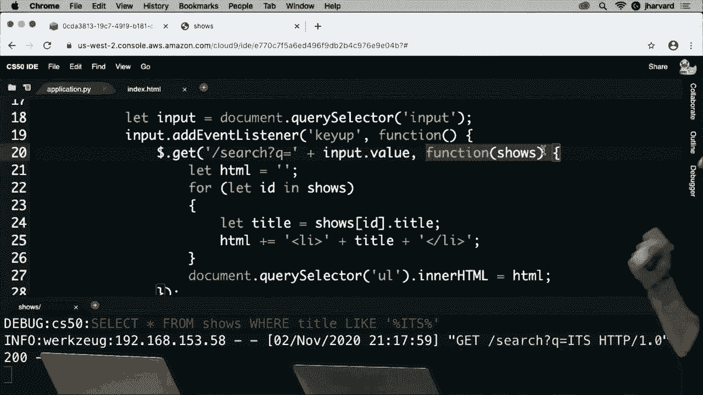

browser，call this function once you have the，answer much like hopefully。brian's about to have the ant and indeed，hello hi uh i looked up the weather uh，fall day today。wonderful well thank you so much and，that is it for cs50 we will see you all。